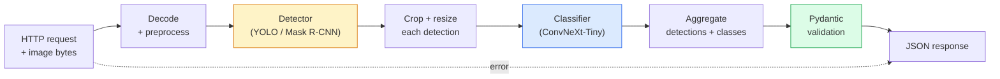

# Construire un pipeline de vision complète  Capstone  Construire un projet de formation complet 

> Un système de vision de production est une chaîne de modèles et de règles liées à des contrats de données.

> **【中文解读】**Le système visuel de production est constitué de plusieurs modèles et règles liés par des liens de données. Le cours précédent de cette phase couvre déjà chaque composant. Ce projet de fin d'études les rassemblera de bout en bout, y compris le chargement de données, le prétraitement, la logique de modèles, le traitement post-processé et la sortie de résultats.

**Type:** Build | **类型:** 动手
**Languages:** Python | **语言:** Python
**Prerequisites:** Phase 4 Lessons 01-15 | **前置知识:** Phase 4 Lessons 01-15
**Time:** ~120 minutes | **时间:** ~120 分钟

## Objectifs d'apprentissage

- Conception d'un pipeline de vision de production qui détecte les objets, les classe et émet un JSON  structuré avec chaque chemin d'échec géré
- Connecter un détecteur (Mask R-CNN ou YOLO), un classifiant (ConvNeXt-Tiny) et un contrat de données (Pydantic) dans un seul service
- Marquer de référence le pipeline de bout en bout et identifier le premier goulot d'étranglement (généralement pré-traitement, puis le détecteur)
- Envoyez un service FastAPI minimal qui accepte un téléchargement d'image, exécute le pipeline et renvoie des détections avec des classifications

> **【中文解读】**Les objectifs de l'apprentissage sont énumérés dans la liste des compétences fondamentales que l'on devrait acquérir après avoir terminé la classe.


## Le problème , l' introduction du problème

Les modèles de vision individuels sont utiles; les produits de vision sont des chaînes d'entre eux. Un audit de la table de vente au détail est un détecteur plus un classifiateur de produit plus un pipeline OCR de prix. La conduite autonome est un détecteur 2D plus un détecteur 3D plus un segmentateur plus un tracker plus un planificateur. Un pré-écran médical est un segmentateur plus un classifiateur de région plus une interface utilisateur clinique.

> 单个视觉模型有用; 视觉产品是它们的链条;;零售货架审计是检测器加产品分类器加价 OCR 流水线;;自动驾驶是2D检测器加3D检测器加分器加跟踪器加规划器;;医疗预测是分器加区域分类器加临床 UI;;

Chaque interface entre les modèles est un nouvel endroit pour les bugs. Chaque transformation de coordonnées, chaque normalisation, chaque taille de masque est un candidat à l'échec silencieux. Un pipeline est aussi fort que son interface la plus faible.

> 连接这些链条是ML's original type et le produit distingués par la partie ouverte. Chaque interface entre les modèles est une nouvelle destination de bug. Chaque installation change, chaque regroupement, chaque encombrement de masque est un candidat qui ne réussit pas.

Ce capstone établit le pipeline minimum viable: détection + classification + sortie structurée + couche de service. Tout le reste dans les fentes de phase 4 dans ce squelette: swap Mask R-CNN pour YOLOv8, ajouter une tête OCR, ajouter une branche de segmentation, ajouter un tracker. L'architecture est stable; les pièces sont branlables.

> Ce projet de formation construit la ligne de transport minimale: contrôle + classification + production structurée + service layer. Tout le reste de la quatrième phase est inséré dans ce cadre.

## Le concept de base.

> **【中文解读】**Le présent article présente les concepts et les bases théoriques de base. La connaissance de ces concepts est la prémisse de la réalisation de la réalisation de la réalisation, mais aussi le point de connaissance de l'interview et de la pratique de l'ingénierie.


### Le pipeline



Les deux étapes sont chères, les cinq autres sont où vivent les insectes.

> Les deux étapes sont coûteuses, les cinq autres sont des étapes de bugs.

### Contrats de données avec Pydantic

Chaque bord de modèle devient un objet de type, ce qui transforme les défaillances silencieuses en celles bruyantes.

> Chaque modèle est transformé en objet de typographie.

```
Detection(
    box: tuple[float, float, float, float],   # (x1, y1, x2, y2), absolute pixels
    score: float,                              # [0, 1]
    class_id: int,                             # from detector's label map
    mask: Optional[list[list[int]]],           # RLE-encoded if present
)

PipelineResult(
    image_id: str,
    detections: list[Detection],
    classifications: list[Classification],
    inference_ms: float,
)
```

Quand un détecteur renvoie des boîtes dans `(cx, cy, w, h)`Au lieu de `(x1, y1, x2, y2)`, la validation de Pydantic échoue à la frontière et vous découvrez immédiatement au lieu de déboguer une récolte en aval qui renvoie silencieusement des régions vides.

> 当检测器 retour `(cx, cy, w, h)`Il n'y a pas de`(x1, y1, x2, y2)`Lorsque le cadre de la méthode de test de Pydantic échoue à la frontière, vous pouvez immédiatement trouver le problème, plutôt que de le modifier en cliquant sur le côté.

### Où va la latence

Trois vérités sont vraies dans presque tous les projets de vision:

> La plupart des vidéos sont basées sur trois faits:

1. **Preprocessing is often the biggest single block.**Décodage des JPEG, conversion des espaces de couleur, redimensionnement  ces sont liés au processeur et faciles à oublier.
   Le mot grec traduit par " le mot grec "**预处理通常是最大的单一开销。**解码 JPEG 转换色空间 缩放 缩放 缩放 缩放 缩放 缩写 缩写 缩写 缩写 缩写 缩写 缩写 缩写 缩写 缩写 缩写 缩写 缩写 缩写 缩写 缩写 缩写 缩写 缩写 缩写 缩写 缩写 缩写 缩写 缩写 缩写 缩写 缩写 缩写 缩写 缩写 缩写 缩写 缩写 缩写 缩写 缩写 缩写 缩写 缩写 缩写 缩写 缩写 缩写 缩写 缩写 缩写 缩写 缩写 缩写 缩写 缩写 缩写 缩写 缩写 缩写 缩写 缩写 缩写 缩写 缩写 缩写 缩写 缩写 缩写 缩写 缩写 缩写 缩写 缩写 缩写 缩写 缩写 缩写 缩写 缩写 缩写 缩写 缩写 缩写 缩写 缩写 缩写 缩写 缩写 缩写 缩写 缩写 缩写 缩写 缩写 缩写 缩写 缩写 缩写 缩写 缩写 缩写 缩写 缩写 缩写 缩写 缩写 缩写 缩写 缩写 缩写 缩写 缩写 缩写 缩写 缩写 缩写 缩写 缩写 缩写 缩写 缩写 缩写 缩写 缩写 缩写 缩写 缩写 缩写 缩写 缩写 缩写
2. **The detector dominates GPU time.**70 à 90% du temps de la GPU est dans la détection avant.
   Le mot grec traduit par " le mot grec "**检测器占据 GPU 时间的主导。**70-90% du temps passé à la GPU à la recherche est passé à la diffusion.
3. **Postprocessing (NMS, RLE encode/decode) is cheap on GPU, expensive on CPU.**Toujours le profil avec la cible réelle.
   Le mot grec traduit par " le mot grec "**后处理（NMS、RLE 编解码）在 GPU 上便宜，在 CPU 上昂贵。**Il est toujours en cours d'analyse.

Connaître la distribution est ce qui fait de l'optimisation une liste prioritaire.

> Œuvrer à la répartition afin d'optimiser la liste de priorité 

### Mode d'échec

- **Empty detections**Retournez la liste vide, ne vous écrasez pas.
  Le mot grec traduit par " le mot grec "**空检测结果**Retournez à la liste, ne vous effondrez pas.
- **Out-of-bounds boxes** Appliquer la taille de l'image avant la coupe.
  Le mot grec traduit par " le mot grec "**越界框**裁剪前限制到图像尺寸内──
- **Tiny crops** sauter la classification pour les cases inférieures à l'entrée minimale du classifiateur.
  Le mot grec traduit par " le mot grec "**微小裁剪** Saute au-dessus de la classe de la plus petite entrée du cadre.
- **Corrupt upload** 400 réponses avec un code d'erreur spécifique, pas 500.
  Le mot grec traduit par " le mot grec "**损坏的上传** Retour avec un code d'erreur spécifique 400 响应, pas 500 
- **Model load failure** échec au démarrage du service, pas à la première demande.
  Le mot grec traduit par " le mot grec "**模型加载失败** lors de la première demande, pas au moment de la première demande.

Un pipeline de production traite chacun de ces problèmes sans écrire de générique `try/except`Chaque échec reçoit un code et une réponse.

> Les conditions de traitement de chaque situation ne doivent pas être cachées.`try/except`Chaque défaite a un code et une réponse.

### Les lots

Un service de production sert plusieurs clients. Les détections et les classifications de lots sur les demandes multiplient le débit. Le compromis: latence supplémentaire d'attente d'un lot pour remplir. Configuration typique: collecter des demandes jusqu'à 20 ms, coller ensemble, traiter, distribuer des réponses. `torchserve`et `triton`Les services de petite taille avec une charge prévisible déploient leur propre micro-batcher.

> Produit de services en même temps que service de plusieurs clients.`torchserve`et `triton`Les services de micro-processage peuvent être réalisés par eux-mêmes.

> **【拓展：工业部署中的视觉系统】**Dans le cadre de la déploiement industriel réel, les modèles visuels doivent prendre en compte la réflexion sur la différence de taille des modèles, l'adaptation des appareils de bord, etc. TensorRT, ONNX Runtime, OpenVINO sont des outils d'accélération de réflexion courants. Les systèmes de conduite autonome (comme Tesla FSD) utilisent généralement plusieurs modèles visuels en temps réel sur les puces de véhicule.

> **【拓展：数据标注与质量】**L'efficacité des tâches visuelles dépend fortement de la qualité des données de marquage. Le Studio de marquage, CVAT, est l'outil de marquage principal. Dans le monde industriel, l'apprentissage actif peut réduire le coût de marquage.

> **【拓展：合成数据与数据增强】**Lorsque les données réelles sont insuffisantes, les données synthétiques (comme Blender, Unity, 染) et les données augmentées (comme les archives d'albumations) sont deux stratégies efficaces.


## Construisez-le et mettez-le en œuvre.

> **【中文解读】**Cette méthode "de zéro" peut aider à comprendre le principe derrière le cadre, en cas de problème, ne sera pas bloqué dans une boîte noire.

```figure
v4-vision-pipeline
```

## Faites-le

### Étape 1: Contrats de données

```python
from pydantic import BaseModel, Field
from typing import List, Optional, Tuple

class Detection(BaseModel):
    box: Tuple[float, float, float, float]
    score: float = Field(ge=0, le=1)
    class_id: int = Field(ge=0)
    mask_rle: Optional[str] = None


class Classification(BaseModel):
    detection_index: int
    class_id: int
    class_name: str
    score: float = Field(ge=0, le=1)


class PipelineResult(BaseModel):
    image_id: str
    detections: List[Detection]
    classifications: List[Classification]
    inference_ms: float
```

Cinq secondes de code économisent une heure de débogage sur n'importe quel pipeline sérieux.

> Le code de 5 secondes peut économiser toute épreuve de 1 heure sur la ligne de débit.

### Étape 2: Une classe minimale de pipeline

```python
import time
import numpy as np
import torch
from PIL import Image

class VisionPipeline:
    def __init__(self, detector, classifier, class_names,
                 device="cpu", min_crop=32):
        self.detector = detector.to(device).eval()
        self.classifier = classifier.to(device).eval()
        self.class_names = class_names
        self.device = device
        self.min_crop = min_crop

    def preprocess(self, image):
        """
        image: PIL.Image or np.ndarray (H, W, 3) uint8
        returns: CHW float tensor on device
        """
        if isinstance(image, Image.Image):
            image = np.asarray(image.convert("RGB"))
        tensor = torch.from_numpy(image).permute(2, 0, 1).float() / 255.0
        return tensor.to(self.device)

    @torch.no_grad()
    def detect(self, image_tensor):
        return self.detector([image_tensor])[0]

    @torch.no_grad()
    def classify(self, crops):
        if len(crops) == 0:
            return []
        batch = torch.stack(crops).to(self.device)
        logits = self.classifier(batch)
        probs = logits.softmax(-1)
        scores, cls = probs.max(-1)
        return list(zip(cls.tolist(), scores.tolist()))

    def run(self, image, image_id="anonymous"):
        t0 = time.perf_counter()
        tensor = self.preprocess(image)
        det = self.detect(tensor)

        crops = []
        detections = []
        valid_indices = []
        for i, (box, score, cls) in enumerate(zip(det["boxes"], det["scores"], det["labels"])):
            x1, y1, x2, y2 = [max(0, int(b)) for b in box.tolist()]
            x2 = min(x2, tensor.shape[-1])
            y2 = min(y2, tensor.shape[-2])
            detections.append(Detection(
                box=(x1, y1, x2, y2),
                score=float(score),
                class_id=int(cls),
            ))
            if (x2 - x1) < self.min_crop or (y2 - y1) < self.min_crop:
                continue
            crop = tensor[:, y1:y2, x1:x2]
            crop = torch.nn.functional.interpolate(
                crop.unsqueeze(0),
                size=(224, 224),
                mode="bilinear",
                align_corners=False,
            )[0]
            crops.append(crop)
            valid_indices.append(i)

        class_preds = self.classify(crops)

        classifications = []
        for valid_idx, (cls_id, cls_score) in zip(valid_indices, class_preds):
            classifications.append(Classification(
                detection_index=valid_idx,
                class_id=int(cls_id),
                class_name=self.class_names[cls_id],
                score=float(cls_score),
            ))

        return PipelineResult(
            image_id=image_id,
            detections=detections,
            classifications=classifications,
            inference_ms=(time.perf_counter() - t0) * 1000,
        )
```

Chaque interface est typée, chaque chemin d'échec a une décision de gestion spécifique.

> Chaque interface est classée. Chaque voie d'échec a une décision de traitement claire.

### Étape 3: Connectez un détecteur et un classifiant

```python
from torchvision.models.detection import maskrcnn_resnet50_fpn_v2
from torchvision.models import convnext_tiny

# Use ImageNet-pretrained weights for a realistic pipeline without training
detector = maskrcnn_resnet50_fpn_v2(weights="DEFAULT")
classifier = convnext_tiny(weights="DEFAULT")
class_names = [f"imagenet_class_{i}" for i in range(1000)]

pipe = VisionPipeline(detector, classifier, class_names)

# Smoke test with a synthetic image
test_image = (np.random.rand(400, 600, 3) * 255).astype(np.uint8)
result = pipe.run(test_image, image_id="demo")
print(result.model_dump_json(indent=2)[:500])
```

### Étape 4: Service FastAPI

```python
from fastapi import FastAPI, UploadFile, HTTPException
from io import BytesIO

app = FastAPI()
pipe = None  # initialised on startup

@app.on_event("startup")
def load():
    global pipe
    detector = maskrcnn_resnet50_fpn_v2(weights="DEFAULT").eval()
    classifier = convnext_tiny(weights="DEFAULT").eval()
    pipe = VisionPipeline(detector, classifier, class_names=[f"c{i}" for i in range(1000)])

@app.post("/detect")
async def detect_endpoint(file: UploadFile):
    if file.content_type not in {"image/jpeg", "image/png", "image/webp"}:
        raise HTTPException(status_code=400, detail="unsupported image type")
    data = await file.read()
    try:
        img = Image.open(BytesIO(data)).convert("RGB")
    except Exception:
        raise HTTPException(status_code=400, detail="cannot decode image")
    result = pipe.run(img, image_id=file.filename or "upload")
    return result.model_dump()
```

Courez avec `uvicorn main:app --host 0.0.0.0 --port 8000`- Testez avec`curl -F 'file=@dog.jpg' http://localhost:8000/detect`- Je suis désolé .

> - Je veux le faire .`uvicorn main:app --host 0.0.0.0 --port 8000`- Je suis en train de le faire.`curl -F 'file=@dog.jpg' http://localhost:8000/detect`Je suis en train de faire une expérience.

### Étape 5: Marquer de référence le pipeline

```python
import time

def benchmark(pipe, num_runs=20, image_size=(400, 600)):
    img = (np.random.rand(*image_size, 3) * 255).astype(np.uint8)
    pipe.run(img)  # warm up

    stages = {"preprocess": [], "detect": [], "classify": [], "total": []}
    for _ in range(num_runs):
        t0 = time.perf_counter()
        tensor = pipe.preprocess(img)
        t1 = time.perf_counter()
        det = pipe.detect(tensor)
        t2 = time.perf_counter()
        crops = []
        for box in det["boxes"]:
            x1, y1, x2, y2 = [max(0, int(b)) for b in box.tolist()]
            x2 = min(x2, tensor.shape[-1])
            y2 = min(y2, tensor.shape[-2])
            if (x2 - x1) >= pipe.min_crop and (y2 - y1) >= pipe.min_crop:
                crop = tensor[:, y1:y2, x1:x2]
                crop = torch.nn.functional.interpolate(
                    crop.unsqueeze(0), size=(224, 224), mode="bilinear", align_corners=False
                )[0]
                crops.append(crop)
        pipe.classify(crops)
        t3 = time.perf_counter()
        stages["preprocess"].append((t1 - t0) * 1000)
        stages["detect"].append((t2 - t1) * 1000)
        stages["classify"].append((t3 - t2) * 1000)
        stages["total"].append((t3 - t0) * 1000)

    for stage, times in stages.items():
        times.sort()
        print(f"{stage:12s}  p50={times[len(times)//2]:7.1f} ms  p95={times[int(len(times)*0.95)]:7.1f} ms")
```

Sortie typique sur le processeur: préprocessage ~ 3 ms, détecter 300-500 ms, classer 20-40 ms, total 350-550 ms. Sur GPU, détecter est 20-40 ms et le préprocessage + classer commence à être plus important en termes relatifs.

> Les performances de traitement préalable sont généralement de 3 à 500 ms, les tests de traitement préalable sont de 20 à 40 ms, les tests de traitement préalable sont de 20 à 40 ms et les tests de traitement préalable et de traitement de 20 à 50 ms sont de plus en plus importants.

> **【中文解读】**Dans ce chapitre, nous allons montrer comment utiliser un cadre mature (comme PyTorch, HuggingFace, etc.) pour appliquer rapidement cette technique.


> **【拓展：视觉模型的持续学习】**Dans un environnement de production, le modèle visuel doit être en constante évolution pour s'adapter à de nouveaux données. La technologie de l'apprentissage continu permet d'éviter que le modèle s'adapte à de nouvelles données et oublie les anciens connaissances.

## Utilisez-le avec le cadre de réalisation

Les modèles de production convergent vers la même structure, plus:

- **Model versioning** toujours enregistrer le nom du modèle et les poids de hash dans la réponse.
- **Per-request trace IDs** enregistrer le timing de chaque étape pour chaque demande afin de pouvoir corréler les réponses lentes aux étapes.
- **Fallback path** si le classifiateur est épuisé, retourner les détections sans classification plutôt que de refuser toute la demande.
- **Safety filters** Les filtres NSFW/PII fonctionnent après la classification, avant que la réponse ne quitte le service.
- **Batch endpoint** un `/detect_batch`l'acceptation d'une liste d'URL d'image pour le traitement en masse.

Pour la production de serveur, `torchserve`- Je suis là .`Triton Inference Server`, et `BentoML`gérer le partage, la version, les mesures et les contrôles de santé hors de la boîte.`FastAPI`Il est également possible de faire des tests de détection de la quantité de produits utilisés directement pour les prototypes et les produits à petite échelle.

> **【中文解读】**Cette section se concentre sur la façon de déployer le modèle en tant que produit disponible. De l'original au système de production, il faut considérer plusieurs dimensions de l'optimisation des performances, du traitement des erreurs, du contrôle, etc.


## Envoyez-le . Produit .

Cette leçon donne:

- `outputs/prompt-vision-service-shape-reviewer.md` une requête qui examine le code d'un service de vision pour les violations de la forme de contrat/réponse et nomme le premier bug de rupture.
- `outputs/skill-pipeline-budget-planner.md` une compétence qui, compte tenu de la latence et du débit cibles, assigne un budget de temps à chaque étape du pipeline et indique quelle étape manquera le premier à son budget.

> **【中文解读】** Exercices de base selon Easy/Medium/Hard 三个难度递进──建议至少完成  级别的题目,  级别适合深入研究或面试准备──


## Les exercices

1. **(Easy)**Exécutez le pipeline sur 10 images provenant de n'importe quel ensemble de données ouvert.
2. **(Medium)**Ajouter un champ de sortie de masque à `Detection`Vérifiez que le JSON reste inférieur à 1 MB même pour une image de 10 objets.
3. **(Hard)**Ajouter un micro-batcher devant le classifiateur: recueillir des cultures pendant 10 ms, les classer toutes dans un appel GPU, retourner les résultats par demande. Mesurer le gain de débit à 5 demandes concurrentes par seconde et la latence ajoutée.

> **【中文解读】**Dans le tableau des termes, la définition du terme "ce que les gens disent" et "ce qu'il signifie réellement" est différenciée entre le langage quotidien et la signification technique précise.


## Les termes clés

| Term | What people say | What it actually means |
|------|----------------|----------------------|
| Pipeline | "The system" | An ordered chain of preprocessing, inference, and postprocessing steps with a typed interface between each pair |
| Data contract | "The schema" | Pydantic / dataclass definitions that every stage input and output conforms to; catches integration bugs at the boundary |
| Preprocessing | "Before the model" | Decoding, colour conversion, resizing, normalising; usually the biggest CPU time sink |
| Postprocessing | "After the model" | NMS, mask resize, threshold, RLE encode; cheap on GPU, expensive on CPU |
| Microbatcher | "Collect then forward" | Aggregator that waits a fixed window for multiple requests, runs a single batched forward pass |
| Trace ID | "Request id" | Per-request identifier logged at every stage so slow requests can be traced end-to-end |
| Failure code | "Named error" | Specific error code per failure class instead of generic 500; enables client retry logic |
| Health check | "Readiness probe" | Cheap endpoint that reports whether the service can answer; loadbalancers rely on this |

> **【中文解读】**延伸阅读 fournit des ressources de haute qualité pour l'apprentissage en profondeur. Ces articles et cours sont des références classiques dans ce domaine, adaptés aux lecteurs qui ont besoin d'une compréhension approfondie.


## Encore une lecture

- [Full Stack Deep Learning — Deploying Models](https://fullstackdeeplearning.com/course/2022/lecture-5-deployment/) le tableau général canonique du déploiement de la production de machines à sous
- [BentoML docs](https://docs.bentoml.com) service de cadre avec des lots, des versions et des mesures
- [torchserve docs](https://pytorch.org/serve/) Bibliothèque officielle de PyTorch
- [NVIDIA Triton Inference Server](https://developer.nvidia.com/triton-inference-server) service à haute capacité avec support par lots et plusieurs modèles
