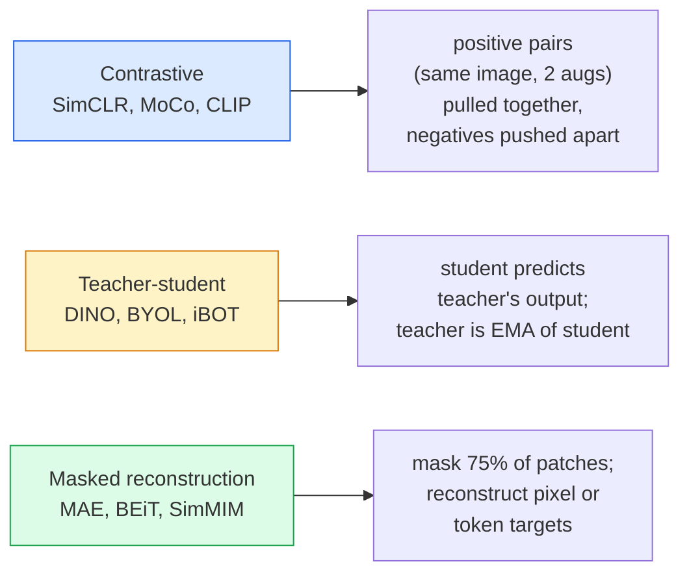

# Une vision autonome  SimCLR, DINO, MAE  自监督视觉  SimCLR, DINO, MAE

> Les étiquettes sont le gouffre de la vision supervisée. L'auto-supervision pré-entraînement les supprime: apprendre les caractéristiques visuelles à partir de 100 millions d'images non étiquetées, affiner sur 10 000 étiquetés.

> **【中文解读】**L'étiquette est une boîte de contrôle de l'apprentissage. L'auto-évaluation a éliminé cette restriction: de 1 milliard de pages sans étiquette dans l'image, puis en 10 000 pages avec des modules de contrôle.

> **【拓展：自监督学习是 GPT 的秘密】**GPT 就是一种 modèle d'auto-surveillance通过预测下一个词来学习──在视觉领域,MAE 通过预测被遮盖的补丁来学习,DINO 通过自蒸学习语义特征──DINOv2 已成为许多视觉任务的基础模型──

**Type:** Learn + Build | **类型:** 学习 + 动手
**Languages:** Python | **语言:** Python
**Prerequisites:** Phase 4 Lesson 04 (Image Classification), Phase 4 Lesson 14 (ViT) | **前置知识:** Phase 4 Lesson 04（图像分类），Phase 4 Lesson 14（ViT）
**Time:** ~75 minutes | **时间:** ~75 分钟

## Objectifs d'apprentissage

- Tracer les trois principales familles auto-surveillées  contrastive (SimCLR), enseignant-étudiant (DINO), reconstruction masquée (MAE)  et indiquer ce que chacune optimisent
- Mettre en œuvre une perte d'InfoNCE à partir de zéro et expliquer pourquoi un lot de 512 fonctionne mais un lot de 32 échoue
- Expliquer pourquoi le ratio de masquage de 75% de la MAE n'est pas arbitraire et comment il diffère de celui de 15% de la BERT pour le texte
- Utiliser les points de contrôle DINOv2 ou MAE ImageNet pour l'exploration linéaire et la récupération à tir zéro

> **【中文解读】**Les objectifs de l'apprentissage sont énumérés dans la liste des compétences fondamentales que l'on devrait acquérir après avoir terminé la classe.


## Le problème , l' introduction du problème

Surveillé ImageNet a 1,3 million d'images étiquetées, qui coûtent environ 10 millions de dollars pour annoter. Les ensembles de données médicaux et industriels sont plus petits et encore plus chers à étiqueter. Chaque équipe de vision demande: pouvons-nous pré-entraîner sur des données non étiquetées bon marché  cadres YouTube, robots de recherche, images de webcam, balayage par satellite  puis affiner sur un petit ensemble étiqueté?

> 监督式 ImageNet a 130 millions d'images de marquage, un coût estimé de marquage est de 1 000 000 $. Les données médicales et industrielles sont plus petites, les données de marquage sont plus élevées. Chaque équipe de vision se pose la question: pouvons-nous nous entraîner sur des données non marquées bon marché sur YouTube  网络爬爬取, des images de caméra réseau, des analyses satellites, puis les modifier sur de petits clusters de marquages ?

L'apprentissage autonome est la réponse. Un ViT autonome moderne formé sur LAION ou JFT atteint ou dépasse la précision de l'ImageNet supervisé lorsqu'il est affiné. Il transfère également mieux aux tâches en aval (détection, segmentation, profondeur) que la pré-entraînement supervisé. DINOv2 (Meta, 2023) et MAE (Meta, 2022) sont les défauts de production actuels pour les fonctionnalités de vision transférables.

> Le décalage de l'auto-évaluation de la formation moderne de la L.A.O.N. ou de la JFT est le décalage de la formation de la formation moderne de la L.A.O.N. ou de la JFT.

Le changement conceptuel est que la tâche de prétexte  la chose à laquelle le modèle est formé  ne doit pas nécessairement être la tâche en aval. Ce qui compte, c'est qu'il oblige le modèle à apprendre des caractéristiques utiles. Prédire la couleur des images à l'échelle de gris, faire tourner les images et demander au modèle de classer la rotation, masquer les patches et les reconstruire  tout a fonctionné. Les trois approches de cette échelle sont l'apprentissage contrasté, la distillation enseignant-étudiant et la reconstruction masquée.

> Le changement conceptuel est une tâche préalable le modèle est entraîné à faire quelque chose n'est pas nécessairement une tâche de basse durée. Il est important qu'il oblige le modèle à apprendre des caractéristiques utiles. Prédire la couleur de la graisse de l'image, faire tourner l'image et faire tourner le modèle, masquer les blocs et reconstruire tout cela est efficace.

## Le concept de base.

> **【中文解读】**Le présent article présente les concepts et les bases théoriques de base. La connaissance de ces concepts est la prémisse de la réalisation de la réalisation de la réalisation, mais aussi le point de connaissance de l'interview et de la pratique de l'ingénierie.


### Trois familles



### L'apprentissage par contraste (SimCLR)

Prenez une image, appliquez deux augmentations aléatoires, obtenez deux vues. Apportez les deux par le même encodeur plus une tête de projection. Réduisez une perte qui dit " ces deux emblèmes doivent être proches " et " cette emblème doit être loin des emblèmes de chaque autre image dans le lot. "

> 取一张图像,施加两种随机增强, obtenir deux vues. 两者通过同一编码器加投影头――将两者通过同一编码器加投影头――最小化一个损失函数:" Ces deux emplacements devraient approcher"和" cette emplacements devraient être éloignés de toutes les autres emplacements d'images de la série "――

```
Loss for positive pair (z_i, z_j) among 2N views per batch:

   L_ij = -log( exp(sim(z_i, z_j) / tau) / sum_k in batch \ {i} exp(sim(z_i, z_k) / tau) )

sim = cosine similarity
tau = temperature (0.1 standard)
```

C'est la perte d'InfoNCE. Il nécessite de nombreux négatifs par positif, donc la taille du lot compte.

> C'est le cas de l'InfoNCE 损失──. Il faut que chaque bon échantillon réponde à de nombreux échantillons négatifs, donc la taille du lot est essentielle SimCLR 需要512-8192──.

### Professeur-étudiant (DINO)

Deux réseaux avec la même architecture: étudiant et professeur. L'enseignant est une moyenne mobile exponentielle (EMA) du poids de l'étudiant. Les deux voient des vues augmentées de l'image.

> 两个 réseau de même structure: étudiant et enseignant.  Le poids du professeur est en moyenne mobile  EMA provient du poids des étudiants.  Les deux voient l'image augmentée  Le résultat des étudiants est formé pour correspondre au poids du professeur.  Il n'y a pas de modèle négatif évident.

```
loss = CE( student_output(view_1),  teacher_output(view_2) )
     + CE( student_output(view_2),  teacher_output(view_1) )

teacher_weights = m * teacher_weights + (1 - m) * student_weights   (m ≈ 0.996)
```

Pourquoi il ne s'effondre pas pour "prédire une constante": la production de l'enseignant est centrée (soustraire la moyenne par dimension) et affinée (divisée par une petite température).

> Pourquoi ne pas tomber pour "prédiction constante": les résultats du professeur sont en moyenne (découplement de la valeur moyenne par dimension) et en moyenne (déduction par petite température)

DINO est ce que DINOv2 élargit, sur 142M d'images curatées.

> DINO est la base de DINOv2, qui s'est étendue sur 1,42 milliards de pages d'images sélectionnées.

### Reconstruction masquée (MAE)

Masquer 75% des patchs d'une entrée ViT. Passer seulement les 25% visibles par le codeur. Un petit décodeur reçoit la sortie du codeur plus des jetons de masque à des positions masquées, et est formé à reconstruire les pixels des patchs masqués.

> 掩蔽VIT 输入的75% 补丁──只有将见的25% 通过编码器──一个小解码器接收编码器输出加上掩码位置的掩码代币,训练重建被掩饰补丁的像素──

```
Encoder:  visible 25% of patches -> features
Decoder:  features + mask tokens at masked positions -> reconstructed pixels
Loss:     MSE between reconstructed and original pixels on masked patches only
```

Les choix de conception clés qui permettent de faire fonctionner le MAE:

> Pour que MAE produise des résultats:

- **75% mask ratio**Le codeur est obligé d'apprendre les caractéristiques sémantiques; reconstruire 25% serait presque trivial (les pixels voisins sont si corrélés qu'une CNN pourrait le clouer).
  Le mot grec traduit par " le mot grec "**75% 掩码率**很高──迫使编码器学习语义特征; reconstruire 25% 几乎是平凡的(相邻像素高度相关, un CNN 就能做到)
- **Asymmetric encoder/decoder** le grand encodeur ViT ne voit que des patchs visibles; un petit décodeur (8 couches, 512 dimensions) gère la reconstruction. 3 fois plus rapide que le BEiT naïf.
  Le mot grec traduit par " le mot grec "**非对称编码器/解码器** Les grands ViT 编码器只看可见补丁; les petits解码器(8 层,512 维) Traiter la reconstruction。比朴素 BEiT 预训练快3 倍。
- **Pixel-space reconstruction target** plus simple que la cible tokenisée de BEiT et fonctionne mieux sur ViT.
  Le mot grec traduit par " le mot grec "**像素空间重建目标**                                                                                                                                                                                                                                                              

Après la préparation, jetez le décodeur.

> 预训后丢弃解码器──编码器就是特征提取器──

### Pourquoi 75% et pas 15%

BERT masque 15% des jetons MAE masque 75% la différence est la densité de l'information

> BERT couvre 15% des tokens. MAE couvre 75%. La différence réside dans la densité de l'information.

- Le langage naturel a une entropie élevée par jeton. Prédire 15% des jetons est toujours difficile parce que chaque position masquée a de nombreuses compléments plausibles.
  Traduction anglaise: naturel langue de chaque symbole  très élevé. Prévision 15% de chaque symbole  encore difficile, car chaque position est masquée il y a beaucoup de suppléments raisonnables.
- Les patchs d'image ont une faible entropie  un quartier non masqué détermine souvent les pixels du patch masqué presque exactement. Pour faire des prédictions nécessitent une compréhension sémantique, vous devez masquer de manière agressive.
  Le voisinage de la correction d'images est généralement presque totalement déterminé par la correction de la correction de la correction de l'image. Pour que la prédiction nécessite une compréhension de la signification, il faut l'activer.

75% est suffisamment élevé pour que la simple extrapolation spatiale ne puisse résoudre la tâche; l'encodeur doit représenter le contenu de l'image.

> 75% de l'espace extérieur est impossible à résoudre; l'éditeur doit afficher le contenu de l'image.

### Évaluation par sonde linéaire

Après une formation préalable supervisée par l'autodéfense, l'évaluation standard est une évaluation de la qualité de l'éducation.**linear probe**: congeler le codeur, entraîner un classifiateur linéaire unique en haut sur les étiquettes ImageNet.

> Après l'apprentissage, l'évaluation standard est**线性探测**Le codeur est un composant de la liste des étiquettes de l'image.

- SimCLR ResNet-50: ~71% (2020)
- DINO ViT-S/16: ~77% (2021)
- MAE ViT-L/16: ~76% (2022)
- DINOv2 ViT-g/14: ~86% (2023)

La sonde linéaire est une mesure pure de la qualité des caractéristiques; l'ajustement fin ajoute généralement 2 à 5 points mais se mélange également dans l'effet de la réentraînement de la tête.

> La recherche de la ligne est une pure mesure de la qualité des traits; les modifications augmentent généralement de 2 à 5 points de pourcentage, mais mélangent également les effets de la reentraînement de la tête.

> **【拓展：工业部署中的视觉系统】**Dans le cadre de la déploiement industriel réel, les modèles visuels doivent prendre en compte la réflexion sur la différence de taille des modèles, l'adaptation des appareils de bord, etc. TensorRT, ONNX Runtime, OpenVINO sont des outils d'accélération de réflexion courants. Les systèmes de conduite autonome (comme Tesla FSD) utilisent généralement plusieurs modèles visuels en temps réel sur les puces de véhicule.

> **【拓展：数据标注与质量】**L'efficacité des tâches visuelles dépend fortement de la qualité des données de marquage. Le Studio de marquage, CVAT, est l'outil de marquage principal. Dans le monde industriel, l'apprentissage actif peut réduire le coût de marquage.


## Construisez-le et mettez-le en œuvre.

> **【中文解读】**Cette méthode "de zéro" peut aider à comprendre le principe derrière le cadre, en cas de problème, ne sera pas bloqué dans une boîte noire.

```figure
data-augmentation
```

## Faites-le

### Étape 1: L'équipement de double vue

```python
import torch
import torchvision.transforms as T

two_view_train = lambda: T.Compose([
    T.RandomResizedCrop(96, scale=(0.2, 1.0)),
    T.RandomHorizontalFlip(),
    T.ColorJitter(0.4, 0.4, 0.4, 0.1),
    T.RandomGrayscale(p=0.2),
    T.ToTensor(),
])


class TwoViewDataset(torch.utils.data.Dataset):
    def __init__(self, base):
        self.base = base
        self.aug = two_view_train()

    def __len__(self):
        return len(self.base)

    def __getitem__(self, i):
        img, _ = self.base[i]
        v1 = self.aug(img)
        v2 = self.aug(img)
        return v1, v2
```

Chacun d' eux .__getitem__renvoie deux vues augmentées de la même image; les étiquettes ne sont pas nécessaires.

> Chaque fois .`__getitem__`Retournez deux images de même image; pas besoin d'étiquette

### Étape 2: Perte d'infoNCE

```python
import torch.nn.functional as F

def info_nce(z1, z2, tau=0.1):
    """
    z1, z2: (N, D) L2-normalised embeddings of paired views
    """
    N, D = z1.shape
    z = torch.cat([z1, z2], dim=0)  # (2N, D)
    sim = z @ z.T / tau              # (2N, 2N)

    mask = torch.eye(2 * N, dtype=torch.bool, device=z.device)
    sim = sim.masked_fill(mask, float("-inf"))

    targets = torch.cat([torch.arange(N, 2 * N), torch.arange(0, N)]).to(z.device)
    return F.cross_entropy(sim, targets)
```

L2 normaliser les emblèmes avant d'appeler. `tau=0.1`est la défaillance SimCLR; la baisse rend la perte plus nette et nécessite plus de négatifs.

> 调用前对嵌入做 L2 归一化──`tau=0.1`C'est la valeur par défaut de SimCLR; plus la perte est faible, plus il faut de plus en plus de défauts.

### Étape 3: Vérifiez l'état de santé mentale de l'InfoNCE

```python
z1 = F.normalize(torch.randn(16, 32), dim=-1)
z2 = z1.clone()
loss_same = info_nce(z1, z2, tau=0.1).item()
z2_random = F.normalize(torch.randn(16, 32), dim=-1)
loss_random = info_nce(z1, z2_random, tau=0.1).item()
print(f"InfoNCE with identical pairs:  {loss_same:.3f}")
print(f"InfoNCE with random pairs:     {loss_random:.3f}")
```

Les paires identiques doivent donner une faible perte (près de 0 pour un lot grand et une température froide).

> La quantité de gaz utilisée dans les installations de transport est de 0,6 °C.

### Étape 4: masquage à la mode MAE

```python
def random_mask_indices(num_patches, mask_ratio=0.75, seed=0):
    g = torch.Generator().manual_seed(seed)
    n_keep = int(num_patches * (1 - mask_ratio))
    perm = torch.randperm(num_patches, generator=g)
    visible = perm[:n_keep]
    masked = perm[n_keep:]
    return visible.sort().values, masked.sort().values


num_patches = 196
visible, masked = random_mask_indices(num_patches, mask_ratio=0.75)
print(f"visible: {len(visible)} / {num_patches}")
print(f"masked:  {len(masked)} / {num_patches}")
```

> **【中文解读】**Dans ce chapitre, nous allons montrer comment utiliser un cadre mature (comme PyTorch, HuggingFace, etc.) pour appliquer rapidement cette technique.


Les vrais MAE mettent en œuvre ce type de masques et conservent les masques par échantillon.

> 简单、快速、对特定种子确定性―― MAE 实际实现会批量处理并保留每个样本的掩码――


> **【拓展：视觉模型的持续学习】**Dans un environnement de production, le modèle visuel doit être en constante évolution pour s'adapter à de nouveaux données. La technologie de l'apprentissage continu permet d'éviter que le modèle s'adapte à de nouvelles données et oublie les anciens connaissances.

## Utilisez-le avec le cadre de réalisation

DINOv2 est la norme de production en 2026:

```python
import torch
from transformers import AutoImageProcessor, AutoModel

processor = AutoImageProcessor.from_pretrained("facebook/dinov2-base")
model = AutoModel.from_pretrained("facebook/dinov2-base")
model.eval()

# Per-image embeddings for zero-shot retrieval
with torch.no_grad():
    inputs = processor(images=[pil_image], return_tensors="pt")
    outputs = model(**inputs)
    embedding = outputs.last_hidden_state[:, 0]  # CLS token
```

L'intégration de 768 dimensions qui en résulte est l'épine dorsale de la récupération d'images moderne, de la correspondance dense et des pipelines de transfert à tir zéro.

Pour les emblèmes de texte d'image, SigLIP ou OpenCLIP est l'équivalent; pour les ajustements fin de style MAE, le `timm`Les récepteurs vont à tous les points de contrôle de l'AEM.

> **【中文解读】**Cette section se concentre sur la façon de déployer le modèle en tant que produit disponible. De l'original au système de production, il faut considérer plusieurs dimensions de l'optimisation des performances, du traitement des erreurs, du contrôle, etc.


## Envoyez-le . Produit .

> **【中文解读】** Exercices de base selon Easy/Medium/Hard 三个难度递进──建议至少完成  级别的题目,  级别适合深入研究或面试准备──


Cette leçon donne:

- `outputs/prompt-ssl-pretraining-picker.md` une requête qui sélectionne SimCLR / MAE / DINOv2 compte tenu de la taille du jeu de données, du calcul et de la tâche en aval.
- `outputs/skill-linear-probe-runner.md` une compétence qui rédige l'évaluation de l'enquête linéaire pour tout encodeur gelé + ensemble de données étiqueté.

## Les exercices

1. **(Easy)**Vérifiez que la perte d'InfoNCE diminue lorsque vous diminuez la température pour les emblèmes bien alignés et augmente lorsque vous diminuez la température pour les emblèmes aléatoires.`tau in [0.05, 0.1, 0.2, 0.5]`contre la perte.
2. **(Medium)**Mettre en œuvre un tampon de centre de style DINO. Montrez que sans le centrage, l'étudiant s'effondre à un vecteur constant en quelques époques.
3. **(Hard)**Exercez MAE sur CIFAR-100 en utilisant le TinyUNet de la leçon 10 comme colonne vertébrale. Rapportez la précision de la sonde linéaire à 10, 50 et 200 époques. Montrez qu'une sonde linéaire prétrainée par MAE bat une sonde linéaire supervisée à partir de zéro sur le même sous-ensemble d'images de 1000.

> **【中文解读】**Dans le tableau des termes, la définition du terme "ce que les gens disent" et "ce qu'il signifie réellement" est différenciée entre le langage quotidien et la signification technique précise.


## Les termes clés

| Term | What people say | What it actually means |
|------|----------------|----------------------|
| Self-supervised | "Label-free" | A pretext task that produces useful representations from unlabelled data |
| Pretext task | "The fake task" | The objective used during SSL (reconstruct patches, match views); discarded after pretraining |
| Linear probe | "Frozen encoder + linear head" | Standard SSL evaluation: train only a linear classifier on top of frozen features |
| InfoNCE | "Contrastive loss" | softmax over cosine similarities; positive pair is the target class, all others are negatives |
| EMA teacher | "Moving-average teacher" | Teacher whose weights are an exponential moving average of the student's; used by BYOL, MoCo, DINO |
| Mask ratio | "% of patches hidden" | Fraction of patches masked during MAE; 75% for vision, 15% for text |
| Representation collapse | "Constant output" | SSL failure where the encoder outputs a constant vector for all inputs; prevented by centring, sharpening, or negatives |
| DINOv2 | "Production SSL backbone" | Meta's 2023 self-supervised ViT; strongest general-purpose image features in 2026 |

> **【中文解读】**延伸阅读 fournit des ressources de haute qualité pour l'apprentissage en profondeur. Ces articles et cours sont des références classiques dans ce domaine, adaptés aux lecteurs qui ont besoin d'une compréhension approfondie.


## Encore une lecture

- [SimCLR (Chen et al., 2020)](https://arxiv.org/abs/2002.05709) référence à l'apprentissage contrasté
- [DINO (Caron et al., 2021)](https://arxiv.org/abs/2104.14294) enseignant-étudiant avec dynamique, centré, affinant
- [MAE (He et al., 2022)](https://arxiv.org/abs/2111.06377) Autoencodeur masqué prétraining pour ViT
- [DINOv2 (Oquab et al., 2023)](https://arxiv.org/abs/2304.07193) l'élargissement de la vitesse de production à l'échelle des caractéristiques de la production
