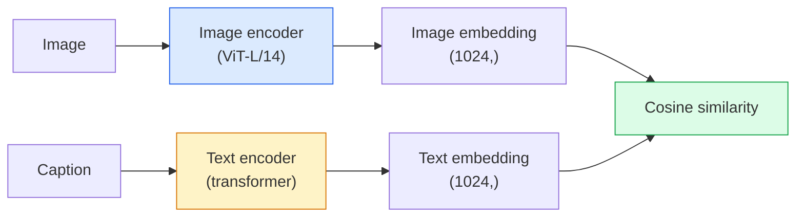

# Une vision de vocabulaire ouvert  CLIP  开放词汇视觉  CLIP

> Traînez un encodeur d'image et un encodeur de texte ensemble pour que les paires correspondantes (image, sous-titre) arrivent au même endroit dans un espace partagé.

> **【中文解读】**CLIP et le codeur de texte, en utilisant les mêmes images et descriptions, sont utilisés pour identifier les mêmes points de l'espace de partage.

> **【拓展：CLIP 是多模态 AI 的基石】**CLIP est le fondement de la DALL-E、Stable Diffusion (en anglais: DALL-E、Stable Diffusion) 、LVA、GPT-4V et autres modèles de modèles.

**Type:** Build + Use | **类型:** 动手 + 应用
**Languages:** Python | **语言:** Python
**Prerequisites:** Phase 4 Lesson 14 (ViT), Phase 4 Lesson 17 (Self-Supervised) | **前置知识:** Phase 4 Lesson 14（ViT），Phase 4 Lesson 17（自监督）
**Time:** ~45 minutes | **时间:** ~45 分钟

## Objectifs d'apprentissage

- Expliquer l'architecture de deux tours du CLIP et l'objectif de formation en contraste
- Utiliser un CLIP (ou SigLIP) prétrainé pour la classification à tir zéro sans formation spécifique à la tâche
- Implémenter la classification à zéro tir à partir de zéro: les instructions de classe de codage, calculer la similitude cosine, prendre argmax
- Distinguer les modèles de vision CLIP, SigLIP, OpenCLIP et LLaVA/LLaMA  pour ce que chacun est destiné en 2026

> **【中文解读】**Les objectifs de l'apprentissage sont énumérés dans la liste des compétences fondamentales que l'on devrait acquérir après avoir terminé la classe.


## Le problème , l' introduction du problème

Les classifiants traditionnels sont des vocabulaires fermés: un modèle ImageNet de 1000 classes ne peut prédire que 1000 étiquettes.

> Le modèle d'ImageNet ne peut prédire que 1000 étiquettes. Chaque nouvelle catégorie nécessite des données de marquage et des titres de réentraînement.

CLIP (Radford et coll., OpenAI 2021) a montré que la formation sur 400M (image, sous-titre) paires grattées du web produit un modèle qui peut se classer dans n'importe quel ensemble de catégories à l'inférence, décrit purement en langage naturel.

> CLIP(Radford etc,OpenAI 2021) indique que le modèle généré par la formation peut être classé dans n'importe quel ensemble de catégories, en pur langage naturel.

Cette capacité  transfert à tirage zéro  est la raison pour laquelle chaque système de vision moderne commence avec un point de contrôle de la famille CLIP. La détection (Grounding DINO, OWL-ViT), la segmentation (CLIPSeg, SAM), la récupération, la modération de contenu, les VLM et la génération de texte à image sont tous basés sur des emblèmes communs de style CLIP.

> C'est pourquoi chaque système visuel moderne est basé sur le point de départ de la famille CLIP.

## Le concept de base.

> **【中文解读】**Le présent article présente les concepts et les bases théoriques de base. La connaissance de ces concepts est la prémisse de la réalisation de la réalisation de la réalisation, mais aussi le point de connaissance de l'interview et de la pratique de l'ingénierie.


### Deux tours



Les deux encoders se terminent par une projection linéaire vers la même dimension d'embedding (512 pour CLIP-B/32, 1024 pour CLIP-L/14).

> Les deux éditeurs sont tous projetés en ligne jusqu'à la même dimension de l'intégration.

### L'objectif

En fonction d'un lot de paires N (image, sous-titre), construisez une matrice de similitude NxN. Traînez les deux encoders de sorte que la diagonale (paires correspondantes) a une grande similitude et les hors-diagonales (non correspondantes) ont une faible similitude.

> 给定一批 N 个 (图像,标题) 对,构建 NxN 相似度矩阵――训练两个编码器使对角线 (编码器) 对角线 (编码器) 匹配对) 对角线 (编码器) 高相似度,非对角线 (编码器) 不匹配对) 相似度低――

```
sim_matrix = image_embeddings @ text_embeddings.T / tau

loss_i2t = cross_entropy(sim_matrix,       targets=arange(N))
loss_t2i = cross_entropy(sim_matrix.T,     targets=arange(N))
loss = (loss_i2t + loss_t2i) / 2
```

Symétrique car la récupération d'image à texte et de texte à image devraient fonctionner. `tau`(température) est généralement appris comme paramètre scalaire, initialisé à 0,07.

> Le titre est parce que la recherche d'images vers le texte et du texte vers l'image doit être efficace.`tau`(temperature) habituellement comme un indicateur de la quantité de mathématiques, initiale est de 0,07♦

### Siglip: une meilleure perte

SigLIP (Zhai et coll., 2023) a remplacé le softmax par le sigmoïde par paire:

> SigLIP ((Zhai et autres, 2023) a remplacé par le softmax:

```
loss = mean over pairs of log(1 + exp(-y_ij * sim_ij))
y_ij = +1 if matching, -1 otherwise
```

La perte par paire supprime la normalisation au niveau des lots requise par CLIP. SigLIP entraîne mieux les petits lots et correspond ou dépasse CLIP aux données égales.

> L'élimination par défaut de la classification des lots requis par CLIP.

### Classification à tir zéro

En raison d'un CLIP formé:

> Un bon CLIP pour une formation déterminée:

1. Pour chaque classe, composez une demande: "une photo d'une classe".
   Pour chaque classe, une photo de la classe.
2. Encodez toutes les requêtes de classe avec le codeur de texte -> `T`forme (C, d).
   Le mot "coup d'œil" est le mot "coup d'œil"`T`形状 (C, d)
3. Encodez l'image de test -> `I`forme (1, d).
   Le nom de la ville est le nom de la ville de la ville de la ville de la ville de la ville de la ville de la ville de la ville de la ville de la ville de la ville de la ville de la ville de la ville de la ville de la ville de la ville de la ville de la ville de la ville de la ville de la ville de la ville de la ville de la ville de la ville de la ville de la ville de la ville de la ville de la ville de la ville de la ville de la ville de la ville de la ville de la ville de la ville de la ville de la ville de la ville de la ville de la ville de la ville de la ville de la ville de la ville de la ville de la ville de la ville de la ville de la ville de la ville de la ville de la ville de la ville de la ville de la ville de la ville.`I`形状 (1, d)
4. La similitude = `I @ T.T`forme (1, C).
   Le mot "partage" est traduit par "partage".`I @ T.T`形状 (1, C) ⋅
5. Argmax -> classe prévue.
   Le nom de l'équipe de formation est le plus connu.

Des questions d'ingénierie rapides. OpenAI a publié 80 modèles de rapides pour ImageNet ("une photo d'un {}", "une photo floue d'un {}", "un croquis d'un {}", ...).

> 提示词工程很重要――OpenAI 为 ImageNet 发布了80个提示模板――将每个类别的所有模板嵌入取平均可以额外提升1-3% 的 top-1 准确率――

### Lorsque des modèles CLIP sont utilisés en 2026

- **Zero-shot classification** utilisation directe.
  Le mot grec traduit par " le mot grec "**零样本分类**直接使用。
- **Image retrieval** encoder toutes les images une fois, intégrer la requête à l'inférence.
  Le mot grec traduit par " le mot grec "**图像检索** Un code unique pour toutes les images, suggestion en saisie de requête.
- **Text-conditioned detection** Le DINO, OWL-ViT, enveloppent une tour de texte CLIP autour d'un détecteur.
  Le mot grec traduit par " le mot grec "**文本条件检测**Grounding DINO、OWL-ViT 在检测器外包装 CLIP 文本塔──
- **Text-conditioned segmentation** CLIPSeg; SAM utilise des entrées de texte-imprimé via CLIP.
  Le mot grec traduit par " le mot grec "**文本条件分割**CLIPSeg;SAM 通过 CLIP 使用文本提示输入。
- **VLMs** LLaVA, Qwen-VL, InternVL câblent un encodeur de vision de la famille CLIP dans un LLM.
  Le mot grec traduit par " le mot grec "**VLM**L'équipe de formation de la famille CLIP va intégrer le programme LLM.
- **Text-to-image gen** Diffusion stable, condition DALL-E 3 sur les intégrations de texte CLIP.
  Le mot grec traduit par " le mot grec "**文本到图像生成**Difusion stable、DALL-E 3  basée sur CLIP 文本嵌入进行条件化。

Une fois que vous avez un espace d'intégration partagé, chaque tâche de vision + langage devient un calcul de distance.

> Une fois que l'espace de mise en commun est partagé, chaque tâche visuelle + linguistique devient une tâche de calcul de distance.

> **【中文解读】**Cette méthode "de zéro" peut aider à comprendre le principe derrière le cadre, en cas de problème, ne sera pas bloqué dans une boîte noire.

> **【拓展：工业部署中的视觉系统】**Dans le cadre de la déploiement industriel réel, les modèles visuels doivent prendre en compte la réflexion sur la différence de taille des modèles, l'adaptation des appareils de bord, etc. TensorRT, ONNX Runtime, OpenVINO sont des outils d'accélération de réflexion courants. Les systèmes de conduite autonome (comme Tesla FSD) utilisent généralement plusieurs modèles visuels en temps réel sur les puces de véhicule.

> **【拓展：数据标注与质量】**L'efficacité des tâches visuelles dépend fortement de la qualité des données de marquage. Le Studio de marquage, CVAT, est l'outil de marquage principal. Dans le monde industriel, l'apprentissage actif peut réduire le coût de marquage.


## Construisez-le et mettez-le en œuvre.
```figure
clip-contrastive
```

## Faites-le

### Étape 1: Un petit modèle à deux tours

Pour cette leçon, les tours sont de petits MLP sur les fonctionnalités pré-extraites afin que le signal d'entraînement soit visible sur le processeur.

> Le véritable CLIP est le ViT + Transformer. La tour de ce cours est un petit MLP sur les caractéristiques de pré-élimination, afin de pouvoir voir le signal de formation sur le CPU.

```python
import torch
import torch.nn as nn
import torch.nn.functional as F


class TwoTower(nn.Module):
    def __init__(self, img_in=128, txt_in=64, emb=64):
        super().__init__()
        self.image_proj = nn.Sequential(nn.Linear(img_in, 128), nn.ReLU(), nn.Linear(128, emb))
        self.text_proj = nn.Sequential(nn.Linear(txt_in, 128), nn.ReLU(), nn.Linear(128, emb))
        self.logit_scale = nn.Parameter(torch.ones([]) * 2.6592)  # ln(1/0.07)

    def forward(self, img_feats, txt_feats):
        i = F.normalize(self.image_proj(img_feats), dim=-1)
        t = F.normalize(self.text_proj(txt_feats), dim=-1)
        return i, t, self.logit_scale.exp()
```

Deux projections, une sortie partagée, une température apprise, la même forme que la vraie API CLIP.

> 两个投影、共享维度输出、可学习温度──与真正的Clip API 形状相同──

### Étape 2: Perte de contraste

```python
def clip_loss(image_emb, text_emb, logit_scale):
    N = image_emb.size(0)
    sim = logit_scale * image_emb @ text_emb.T
    targets = torch.arange(N, device=sim.device)
    l_i = F.cross_entropy(sim, targets)
    l_t = F.cross_entropy(sim.T, targets)
    return (l_i + l_t) / 2
```

Symétrique. plus haut logit_scale = plus fort softmax = plus confiant mais risque d'instabilité.

> Pour la plupart des gens, la tendance à la réaction est plus forte.

### Étape 3: Classificateur de tir zéro

```python
@torch.no_grad()
def zero_shot_classify(model, image_feats, class_text_feats, class_names):
    """
    image_feats:      (N, img_in)
    class_text_feats: (C, txt_in)   one averaged embedding per class
    """
    i = F.normalize(model.image_proj(image_feats), dim=-1)
    t = F.normalize(model.text_proj(class_text_feats), dim=-1)
    sim = i @ t.T
    pred = sim.argmax(dim=-1)
    return [class_names[p] for p in pred.tolist()]
```

C'est la procédure exacte utilisée avec un point de contrôle CLIP de production.

> Chaque étape est le processus de production de CLIP.

### Étape 4: Vérifiez votre état de santé mentale

```python
torch.manual_seed(0)
model = TwoTower()

img = torch.randn(8, 128)
txt = torch.randn(8, 64)
i, t, scale = model(img, txt)
loss = clip_loss(i, t, scale)
print(f"batch size: {i.size(0)}   loss: {loss.item():.3f}")
```

Les pertes devraient être proches de `log(N) = log(8) = 2.08`pour un modèle initialement aléatoire  la cible de l'entropie croisée symétrique lorsqu'aucune structure n'est encore apprise.

> La perte du modèle de démarrage devrait approcher`log(N) = log(8) = 2.08` encore n'ayant pas encore appris à la structure                                                                                                                                                                                                                                                         

> **【中文解读】**Dans ce chapitre, nous allons montrer comment utiliser un cadre mature (comme PyTorch, HuggingFace, etc.) pour appliquer rapidement cette technique.


> **【拓展：视觉模型的持续学习】**Dans un environnement de production, le modèle visuel doit être en constante évolution pour s'adapter à de nouveaux données. La technologie de l'apprentissage continu permet d'éviter que le modèle s'adapte à de nouvelles données et oublie les anciens connaissances.

## Utilisez-le avec le cadre de réalisation

OpenCLIP est la norme par défaut de la communauté en 2026:

```python
import open_clip
import torch
from PIL import Image

model, _, preprocess = open_clip.create_model_and_transforms("ViT-B-32", pretrained="laion2b_s34b_b79k")
tokenizer = open_clip.get_tokenizer("ViT-B-32")

image = preprocess(Image.open("dog.jpg")).unsqueeze(0)
text = tokenizer(["a photo of a dog", "a photo of a cat", "a photo of a car"])

with torch.no_grad():
    image_features = model.encode_image(image)
    text_features = model.encode_text(text)
    image_features = image_features / image_features.norm(dim=-1, keepdim=True)
    text_features = text_features / text_features.norm(dim=-1, keepdim=True)
    probs = (100.0 * image_features @ text_features.T).softmax(dim=-1)

> **【中文解读】** 本节关注如何将模型部署为可用的产品。从原型到生产级系统需要考虑性能优化、错误处理、监控等多个维度。


print(probs)
```

SigLIP est plus récent, entraîne mieux à petite échelle et est préférable pour les nouveaux travaux: `google/siglip-base-patch16-224`- Ils s'embrassent tous les deux.


## Envoyez-le . Produit .

> **【中文解读】** Exercices de base selon Easy/Medium/Hard 三个难度递进──建议至少完成  级别的题目,  级别适合深入研究或面试准备──


Cette leçon donne:

- `outputs/prompt-zero-shot-class-picker.md` une requête qui conçoit des modèles de classe pour CLIP à tirage zéro donné une liste de classes et un domaine.
- `outputs/skill-image-text-retriever.md` une compétence qui crée un index d'intégration d'image avec n'importe quel point de contrôle CLIP, prend en charge la requête par texte et la requête par image.

## Les exercices

1. **(Easy)**Utilisez un OpenCLIP ViT-B/32 prétrainé et effectuez une classification à tir zéro sur CIFAR-10 avec le jeu de prompts de modèle 80.
2. **(Medium)**Comparer un modèle unique ("une photo d'un {}") par rapport à 80 modèles en moyenne incrustations sur la même tâche CIFAR-10.
3. **(Hard)**Construisez un indice de récupération d'images à tirage nul: incruster 1000 images avec CLIP, construire un indice FAISS, requête avec une description en langage naturel. Rapportez récupération recall@5 pour 20 requêtes retenues que vous écrivez à la main.

> **【中文解读】**Dans le tableau des termes, la définition du terme "ce que les gens disent" et "ce qu'il signifie réellement" est différenciée entre le langage quotidien et la signification technique précise.


## Les termes clés

| Term | What people say | What it actually means |
|------|----------------|----------------------|
| Two-tower | "Dual encoder" | Separate image and text encoders ending in a shared-dim projection head |
| Zero-shot | "No task-specific training" | Classify into classes described only by text at inference; no labels touched |
| Temperature / logit_scale | "tau" | Learned scalar that scales the similarity matrix before softmax |
| Prompt template | "A photo of a {}" | Natural-language wrapper around class names; averaging many templates boosts zero-shot accuracy |
| CLIP | "Image+text model" | The 2021 OpenAI model; vocabulary of the field in 2026 |
| SigLIP | "Sigmoid CLIP" | Swaps softmax for per-pair sigmoid; trains better at small batches |
| OpenCLIP | "Open reproduction" | Community-trained CLIP variants on LAION; production default for open-source pipelines |
| VLM | "Vision-language model" | A CLIP-family encoder plus an LLM, trained to answer questions about images |

> **【中文解读】**延伸阅读 fournit des ressources de haute qualité pour l'apprentissage en profondeur. Ces articles et cours sont des références classiques dans ce domaine, adaptés aux lecteurs qui ont besoin d'une compréhension approfondie.


## Encore une lecture

- [CLIP: Learning Transferable Visual Models from Natural Language Supervision (Radford et al., 2021)](https://arxiv.org/abs/2103.00020)
- [SigLIP: Sigmoid Loss for Language-Image Pre-Training (Zhai et al., 2023)](https://arxiv.org/abs/2303.15343)
- [OpenCLIP](https://github.com/mlfoundations/open_clip) la base de code communautaire
- [DINOv2 vs CLIP vs MAE: a features comparison](https://huggingface.co/blog/dinov2) Guide de la FH avec cas d'utilisation côte à côte
