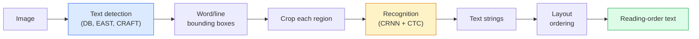

# OCR et compréhension des documents

> Le système OCR est un pipeline en trois étapes: détecter les boîtes de texte, reconnaître les caractères, puis les déposer.

> **【中文解读】**OCR(L'identification des caractères optiques) est un processus de trois phases: l'analyse des textes → l'analyse des textes.

> **【拓展：文档理解的金融应用】**Le système de gestion des données et des documents est largement utilisé dans le domaine financier: le traitement automatique des flux de données bancaires, l'émission de billets, la révision des contrats, l'analyse des rapports financiers, etc. Le modèle de mise en page de LM, Donut et autres va fusionner les informations visuelles et textuelles, ce qui permettra de comprendre les documents de bout en bout.

**Type:** Learn + Use | **类型:** 学习 + 应用
**Languages:** Python | **语言:** Python
**Prerequisites:** Phase 4 Lesson 06 (Detection), Phase 7 Lesson 02 (Self-Attention) | **前置知识:** Phase 4 Lesson 06（目标检测），Phase 7 Lesson 02（自注意力）
**Time:** ~45 minutes | **时间:** ~45 分钟

## Objectifs d'apprentissage

- Tracer le pipeline classique de RCR (détecter -> reconnaître -> mise en page) et les alternatives modernes de bout en bout (Donut, Qwen-VL-OCR)
- Implementer la perte de CTC (Classification temporelle des connecteurs) pour la formation OCR séquence à séquence
- Utiliser PaddleOCR ou EasyOCR pour l'analyse des documents de production sans formation
- Distinguer le RCR, l'analyse de la mise en page et la compréhension des documents  et choisir l'outil approprié par tâche

> **【中文解读】**Les objectifs de l'apprentissage sont énumérés dans la liste des compétences fondamentales que l'on devrait acquérir après avoir terminé la classe.


## Le problème , l' introduction du problème

Les images pleines de texte sont partout: reçus, factures, identifiants, livres scannés, formulaires, plaques blanches, panneaux, captures d'écran.

> Les images de caractères sont présentes: reçus, émissions, certificats d'identité, brochures, étiquettes, panneaux blancs, signes, clichés.

Le domaine est divisé en trois niveaux de compétences:

> Le domaine est divisé en trois niveaux de compétences:

1. **OCR proper**: transformer les pixels en texte.
2. **Layout parsing**: sortie de RCR de groupe en régions (titre, corps, table, en-tête).
3. **Document understanding**: extraire des champs structurés ("facture_total = 42,50 $") de la mise en page.

Chaque couche a des approches classiques et modernes, et l'écart entre "Je veux du texte d'une image" et "J'ai besoin du montant total de ce reçu" est plus grand que la plupart des équipes ne le réalisent.

> Chaque niveau a des méthodes classiques et modernes, la différence entre "je veux obtenir des textes d'une image" et "je veux le montant total de cette recette" est plus grande que la plupart des équipes ont réalisé.

## Le concept de base.

> **【中文解读】**Le présent article présente les concepts et les bases théoriques de base. La connaissance de ces concepts est la prémisse de la réalisation de la réalisation de la réalisation, mais aussi le point de connaissance de l'interview et de la pratique de l'ingénierie.


### Le pipeline classique



- **Text detection**produit des quadrilatères par ligne ou par mot.
  Le mot grec traduit par " le mot grec "**文本检测**C'est une forme de forme de chaque phrase.
- **Recognition**Il crée chaque région à une hauteur fixe, utilise une CNN + BiLSTM + CTC pour produire une séquence de caractères.
  Le mot grec traduit par " le mot grec "**识别**Pour chaque zone de coupe à hauteur fixe, fonctionne CNN + BiLSTM + CTC 生成字符序列.
- **Layout**rétablit l'ordre de lecture (de haut en bas, de gauche à droite pour le latin; différent pour l'arabe, le japonais).
  Le mot grec traduit par " le mot grec "**布局**重建阅读顺序(Latin文从上到下、从左到右;Arabic文和日文不同)

### CTC dans un seul paragraphe

La reconnaissance OCR produit une séquence de longueur variable à partir d'une carte de fonctionnalités de longueur fixe. CTC (Graves et coll., 2006) vous permet de le former sans alignement au niveau des caractères. Le modèle produit une distribution sur (vocab + blanc) à chaque étape temporelle; la perte CTC marginalise sur tous les alignements qui se réduisent au texte cible après avoir fusionné les répétitions et supprimé les vides.

> OCR Identification à partir des caractéristiques de longueur fixe générer des séquences de longueur variable──CTC(Graves etc., 2006) 让你无需字符级对齐就能训练──模型在每时间步输出(词表 +空白) 分布;CTC 损失对所有合并重复和移除空白后归约为目标文本对齐方式进行边缘化──

```
raw output: "h h h _ _ e e l l _ l l o _ _"
after merge repeats and remove blanks: "hello"
```

CTC est la raison pour laquelle CRNN a travaillé en 2015 et entraîne toujours la plupart des modèles OCR de production en 2026.

> CTC est la raison pour laquelle le CRNN est en vigueur en 2015 et est toujours en train de produire la plupart des modèles OCR en 2026.

### Modèles modernes de bout en bout

- **Donut**(Kim et coll., 2022)  un encodeur ViT + un décodeur de texte; lit une image et émet directement JSON.
  Le mot grec traduit par " le mot grec "**Donut**(Kim 等,2022) ViT 编码器 + 文本解码器;读取图像直接输出 JSON──无需文本检测器或布局模块──
- **TrOCR** Décodeur de transformateur ViT + pour le OCR de niveau ligne.
  Le mot grec traduit par " le mot grec "**TrOCR**ViT + Transformer 解码器, utilisé pour le traitement des données OCR de classe
- **Qwen-VL-OCR / InternVL** modèles complets de langage visuel affinés pour les tâches OCR; meilleure précision en 2026 sur les documents complexes.
  Le mot grec traduit par " le mot grec "**Qwen-VL-OCR / InternVL** Modèle de langage visuel complet et de mise à jour pour la tâche OCR; 2026 année en plus haute précision sur le document complexe.
- **PaddleOCR** pipeline classique DB + CRNN dans un ensemble de production mature; encore le cheval de travail open source.
  Le mot grec traduit par " le mot grec "**PaddleOCR** Le DB + CRNN 流水线; encore une source principale.

Les modèles de bout en bout ont besoin de plus de données et de calculs, mais ils ne doivent pas accumuler d'erreurs dans les pipelines à plusieurs étapes.

> Le modèle de bout en bout nécessite plus de données et de calcul, mais a surpassé les erreurs accumulées de plusieurs étapes de la ligne de flux.

### Partage de la mise en page

Pour les documents structurés, utilisez un détecteur de mise en page (LayoutLMv3, DocLayNet) qui étiquette chaque région: Titre, paragraphe, figure, tableau, note de bas de page.

> Pour le document structuré, le système de mise en page est modifié en "LayoutLMv3、DocLayNet") pour marquer chaque région: titre, section, diagramme, édition, édition, édition, édition, édition, édition, édition, édition, édition, édition, édition, édition, édition, édition, édition, édition, édition, édition, édition, édition, édition, édition, édition, édition, édition, édition, édition, édition, édition, édition, édition, édition, édition, édition, édition, édition, édition, édition, édition, édition, édition, édition, édition, édition, édition, édition, édition, édition, édition, édition, édition, édition, édition, édition, édition, édition, édition, édition, édition, édition, édition, édition, édition, édition, édition, édition, édition, édition, édition, édition, édition, édition, édition, édition, édition, édition, édition, édition, édition, édition, édition, édition, édition, édition, édition, édition, édition, édition, édition, édition, édition, édition, édition, édition, édition, édition, édition, édition, édition, édition, édition, édition, édition, édition, édition, édition, édition, édition, édition, édition, édition, édition, édition, édition, édition, édition, édition

Pour les formulaires, utilisez **Key-Value extraction**Les modèles (donut pour les documents riches en visuel, LayoutLMv3 pour les scans simples) prennent des images + texte détecté + positions et prédisent des paires de valeurs de clés structurées.

> 对于表单,使用**键值提取**模型(视觉丰富文档用唐nut,普通扫描用 LayoutLMv3)。 elles reçoivent des images + 检测到的文本 + 位置, pré测 结构化的键值对──

### Mesures d'évaluation

- **Character Error Rate (CER)** Distance de référence Levenshtein / longueur de référence. Moins est préférable. Objectif de production: < 2% sur les analyses propres.
  Le mot grec traduit par " le mot grec "**字符错误率（CER）** 编辑距离 / 参考文本长度──越低越好──生产目标:清晰扫描上 < 2%──
- **Word Error Rate (WER)** le même au niveau des mots.
  Le mot grec traduit par " le mot grec "**词错误率（WER）**词级别的同样标标――
- **F1 on structured fields** pour les tâches de valeur clé; mesures de savoir si `{invoice_total: 42.50}`Il semble correct.
  Le mot grec traduit par " le mot grec "**结构化字段 F1**indicateur de tâches de valeur clé; mesure `{invoice_total: 42.50}`Il est vrai qu'il y a des problèmes.
- **Edit distance on JSON** pour l'analyse de documents de bout en bout; le papier Donut a introduit une distance de modification des arbres normalisée.
  Le mot grec traduit par " le mot grec "**JSON 编辑距离**端到端文档解析的指标;Donut 论文引入归一化树编辑距离──

> **【中文解读】**Cette méthode "de zéro" peut aider à comprendre le principe derrière le cadre, en cas de problème, ne sera pas bloqué dans une boîte noire.

> **【拓展：工业部署中的视觉系统】**Dans le cadre de la déploiement industriel réel, les modèles visuels doivent prendre en compte la réflexion sur la différence de taille des modèles, l'adaptation des appareils de bord, etc. TensorRT, ONNX Runtime, OpenVINO sont des outils d'accélération de réflexion courants. Les systèmes de conduite autonome (comme Tesla FSD) utilisent généralement plusieurs modèles visuels en temps réel sur les puces de véhicule.

> **【拓展：数据标注与质量】**L'efficacité des tâches visuelles dépend fortement de la qualité des données de marquage. Le Studio de marquage, CVAT, est l'outil de marquage principal. Dans le monde industriel, l'apprentissage actif peut réduire le coût de marquage.


## Construisez-le et mettez-le en œuvre.
```figure
cv3-ctc-collapse
```

## Faites-le

### Étape 1: Perte de CTC + décodeur avide

```python
import torch
import torch.nn as nn
import torch.nn.functional as F


def ctc_loss(log_probs, targets, input_lengths, target_lengths, blank=0):
    """
    log_probs:      (T, N, C) log-softmax over vocab including blank at index 0
    targets:        (N, S) int targets (no blanks)
    input_lengths:  (N,) per-sample time steps used
    target_lengths: (N,) per-sample target length
    """
    return F.ctc_loss(log_probs, targets, input_lengths, target_lengths,
                      blank=blank, reduction="mean", zero_infinity=True)


def greedy_ctc_decode(log_probs, blank=0):
    """
    log_probs: (T, N, C) log-softmax
    returns: list of index sequences (blanks removed, repeats merged)
    """
    preds = log_probs.argmax(dim=-1).transpose(0, 1).cpu().tolist()
    out = []
    for seq in preds:
        decoded = []
        prev = None
        for idx in seq:
            if idx != prev and idx != blank:
                decoded.append(idx)
            prev = idx
        out.append(decoded)
    return out
```

`F.ctc_loss`Le décodeur avide est plus simple qu'une recherche à faisceau et est généralement situé à moins de 1% du CER.

> `F.ctc_loss`En utilisant CuDNN à haute efficacité en temps de disponibilité, la différence entre les CER est généralement de 1% et de moins de 10%.

### Étape 2: Petit reconnaisseur CRNN

Le minimum CNN + BiLSTM pour le OCR de ligne.

> Utilisé pour la mise en œuvre du minimum de CNN + BiLSTM OCR.

```python
class TinyCRNN(nn.Module):
    def __init__(self, vocab_size=40, hidden=128, feat=32):
        super().__init__()
        self.cnn = nn.Sequential(
            nn.Conv2d(1, feat, 3, 1, 1), nn.BatchNorm2d(feat), nn.ReLU(inplace=True),
            nn.MaxPool2d(2),
            nn.Conv2d(feat, feat * 2, 3, 1, 1), nn.BatchNorm2d(feat * 2), nn.ReLU(inplace=True),
            nn.MaxPool2d(2),
            nn.Conv2d(feat * 2, feat * 4, 3, 1, 1), nn.BatchNorm2d(feat * 4), nn.ReLU(inplace=True),
            nn.MaxPool2d((2, 1)),
            nn.Conv2d(feat * 4, feat * 4, 3, 1, 1), nn.BatchNorm2d(feat * 4), nn.ReLU(inplace=True),
            nn.MaxPool2d((2, 1)),
        )
        self.rnn = nn.LSTM(feat * 4, hidden, bidirectional=True, batch_first=True)
        self.head = nn.Linear(hidden * 2, vocab_size)

    def forward(self, x):
        # x: (N, 1, H, W)
        f = self.cnn(x)                # (N, C, H', W')
        f = f.mean(dim=2).transpose(1, 2)  # (N, W', C)
        h, _ = self.rnn(f)
        return F.log_softmax(self.head(h).transpose(0, 1), dim=-1)  # (W', N, vocab)
```

Entrée à hauteur fixe (la CNN max-pools hauteur à 1). Largeur est la dimension temporelle pour CTC.

> 固定 hauteur de l'entrée CNN                                                                                                                                                                                                                                                         

### Étape 3: RCR synthétique

Générer des chaînes de chiffres noir sur blanc pour un test de fumée de bout en bout.

> 生成白底黑字符串数字字符串, utilisé pour tester le fumage du bout au bout.

```python
import numpy as np

def synthetic_line(text, height=32, char_width=16):
    W = char_width * len(text)
    img = np.ones((height, W), dtype=np.float32)
    for i, c in enumerate(text):
        x = i * char_width
        shade = 0.0 if c.isalnum() else 0.5
        img[6:height - 6, x + 2:x + char_width - 2] = shade
    return img


def build_batch(strings, vocab):
    H = 32
    W = 16 * max(len(s) for s in strings)
    imgs = np.ones((len(strings), 1, H, W), dtype=np.float32)
    target_lengths = []
    targets = []
    for i, s in enumerate(strings):
        imgs[i, 0, :, :16 * len(s)] = synthetic_line(s)
        ids = [vocab.index(c) for c in s]
        targets.extend(ids)
        target_lengths.append(len(ids))
    return torch.from_numpy(imgs), torch.tensor(targets), torch.tensor(target_lengths)


vocab = ["_"] + list("0123456789abcdefghijklmnopqrstuvwxyz")
imgs, targets, lengths = build_batch(["hello", "world"], vocab)
print(f"images: {imgs.shape}   targets: {targets.shape}   lengths: {lengths.tolist()}")
```

Un vrai ensemble de données OCR ajoute des polices, du bruit, de la rotation, du flou et de la couleur.

> Réalité OCR Les données de réunion augmentent les caractères, le bruit, la rotation, la pâleur et la couleur.

### Étape 4: Essai de formation

```python
model = TinyCRNN(vocab_size=len(vocab))
opt = torch.optim.Adam(model.parameters(), lr=1e-3)

for step in range(200):
    strings = ["abc" + str(step % 10)] * 4 + ["xyz" + str((step + 1) % 10)] * 4
    imgs, targets, target_lens = build_batch(strings, vocab)
    log_probs = model(imgs)  # (W', 8, vocab)
    input_lens = torch.full((8,), log_probs.size(0), dtype=torch.long)
    loss = ctc_loss(log_probs, targets, input_lens, target_lens, blank=0)
    opt.zero_grad(); loss.backward(); opt.step()
```

> **【中文解读】**Dans ce chapitre, nous allons montrer comment utiliser un cadre mature (comme PyTorch, HuggingFace, etc.) pour appliquer rapidement cette technique.


La perte devrait diminuer de ~3 à ~0,2 sur 200 étapes sur ces données synthétiques triviales.

> Dans cette simple synthèse de données, les pertes de 200 étapes devraient être de 3 à 0,2%.


> **【拓展：视觉模型的持续学习】**Dans un environnement de production, le modèle visuel doit être en constante évolution pour s'adapter à de nouveaux données. La technologie de l'apprentissage continu permet d'éviter que le modèle s'adapte à de nouvelles données et oublie les anciens connaissances.

## Utilisez-le avec le cadre de réalisation

Trois voies de production:

- **PaddleOCR** mature, rapide, multilingue. Utilisation en une ligne: `paddleocr.PaddleOCR(lang="en").ocr(image_path)`- Je suis désolé .
- **EasyOCR** Python natif, multilingue, épave PyTorch.
- **Tesseract** classique; encore utile pour les documents scannés anciens lorsque les modèles luttent.

Pour analyser des documents de bout en bout, utilisez Donut ou un VLM:

```python
from transformers import DonutProcessor, VisionEncoderDecoderModel

processor = DonutProcessor.from_pretrained("naver-clova-ix/donut-base-finetuned-cord-v2")
model = VisionEncoderDecoderModel.from_pretrained("naver-clova-ix/donut-base-finetuned-cord-v2")
```

> **【中文解读】**Cette section se concentre sur la façon de déployer le modèle en tant que produit disponible. De l'original au système de production, il faut considérer plusieurs dimensions de l'optimisation des performances, du traitement des erreurs, du contrôle, etc.


Pour les reçus, les factures et les formulaires avec structure répétée, ajustez Donut. Pour les documents arbitraires ou OCR avec raisonnement, un VLM comme Qwen-VL-OCR est la norme par défaut actuelle.


## Envoyez-le . Produit .

> **【中文解读】** Exercices de base selon Easy/Medium/Hard 三个难度递进──建议至少完成  级别的题目,  级别适合深入研究或面试准备──


Cette leçon donne:

- `outputs/prompt-ocr-stack-picker.md` une requête qui sélectionne Tesseract / PaddleOCR / Donut / VLM-OCR pour un type, une langue et une structure de document donné.
- `outputs/skill-ctc-decoder.md` une compétence qui écrit des décodeurs CTC avides et à la recherche de faisceaux à partir de zéro, y compris la normalisation de la longueur.

## Les exercices

> **【中文解读】**Dans le tableau des termes, la définition du terme "ce que les gens disent" et "ce qu'il signifie réellement" est différenciée entre le langage quotidien et la signification technique précise.


1. **(Easy)**Exercez le TinyCRNN sur des chaînes numériques aléatoires à 5 chiffres pendant 500 étapes.
2. **(Medium)**Remplacez le décoding avide par la recherche de faisceau (beam_width=5).
3. **(Hard)**Utilisez PaddleOCR sur un ensemble de 20 reçus, extraire des éléments de ligne et calculer F1 contre la vérité au sol marquée à la main pour les paires {item_name, prix}.

## Les termes clés

| Term | What people say | What it actually means |
|------|----------------|----------------------|
| OCR | "Text from pixels" | Turning image regions into character sequences |
| CTC | "Alignment-free loss" | Loss that trains a sequence model without per-timestep labels; marginalises over alignments |
| CRNN | "Classic OCR model" | Conv feature extractor + BiLSTM + CTC; the 2015 baseline still used in production |
| Donut | "End-to-end OCR" | ViT encoder + text decoder; emits JSON directly from image |
| Layout parsing | "Find regions" | Detect and label Title/Table/Figure/Paragraph regions in a document |
| Reading order | "Text sequence" | Ordering of recognised regions into a sentence; trivial for Latin, non-trivial for mixed layouts |
| CER / WER | "Error rates" | Levenshtein distance / reference length at character or word granularity |
| VLM-OCR | "LLM that reads" | A vision-language model trained or prompted for OCR tasks; current SOTA on complex documents |

> **【中文解读】**延伸阅读 fournit des ressources de haute qualité pour l'apprentissage en profondeur. Ces articles et cours sont des références classiques dans ce domaine, adaptés aux lecteurs qui ont besoin d'une compréhension approfondie.


## Encore une lecture

- [CRNN (Shi et al., 2015)](https://arxiv.org/abs/1507.05717) l'architecture originale de CNN+RNN+CTC
- [CTC (Graves et al., 2006)](https://www.cs.toronto.edu/~graves/icml_2006.pdf) le papier original CTC; densément emballé avec les idées algorithmiques
- [Donut (Kim et al., 2022)](https://arxiv.org/abs/2111.15664) Transformateur de compréhension des documents sans RCR
- [PaddleOCR](https://github.com/PaddlePaddle/PaddleOCR) la pile de production OCR open source
