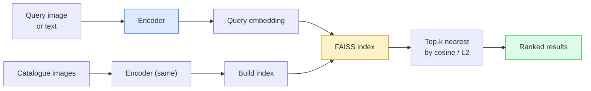

# Retrouver des images et apprendre des métriques

> Un système de récupération classe les candidats par distance dans l'espace intégré.

> **【中文解读】**Le système de recherche est basé sur la distance entre les images candidates et les images de l'espace. La mesure de l'apprentissage est de façonner cet espace, de sorte que la distance reflète les relations de signification que vous voulez.

> **【拓展：检索系统的应用】**Pour les personnes qui ont déjà fait l'objet d'une recherche sur le Web, il est important de noter que les données de recherche sur le Web sont disponibles sur le Web.

**Type:** Build | **类型:** 动手
**Languages:** Python | **语言:** Python
**Prerequisites:** Phase 4 Lesson 14 (ViT), Phase 4 Lesson 18 (CLIP) | **前置知识:** Phase 4 Lesson 14（ViT），Phase 4 Lesson 18（CLIP）
**Time:** ~45 minutes | **时间:** ~45 分钟

## Objectifs d'apprentissage

- Expliquer les pertes d'apprentissage métrique triplé, contrastée et par proxy et choisir la bonne pour un ensemble de données donné
- Mettre en œuvre correctement la normalisation L2 et la similitude cosine et vérifier la différence entre la récupération du "même article" et de la "même classe"
- Construire un index FAISS, le consulter par texte et par image, et signaler recall@K pour un ensemble de requêtes retenues
- Utilisez DINOv2, CLIP et SigLIP comme récipients de rectum et sachez quand chaque gagnant gagne

> **【中文解读】**Les objectifs de l'apprentissage sont énumérés dans la liste des compétences fondamentales que l'on devrait acquérir après avoir terminé la classe.


## Le problème , l' introduction du problème

La récupération est partout dans la vision de production: détection de duplicates, recherche d'image inverse, recherche visuelle ("trouver des produits similaires"), réidentification de visage, réidentification de personne pour la surveillance, correspondance au niveau d'instance pour le commerce électronique. La question du produit est toujours la même: " étant donné cette image de requête, classez mon catalogue".

> 检索在生产视觉中无处不在:重复检测、反向图像搜索、视觉搜索("寻找相似产品") 的人脸重识别、监控人员重识别、电商实例级匹配──产品问题总是相同:"给定这张查询图像,对我的目录排序──"

Deux décisions de conception façonnent l'ensemble du système. L'intégration  quel modèle produit les vecteurs. L'index  comment trouver les voisins les plus proches à l'échelle. Les deux sont des marchandises en 2026 (DINOv2 pour l'intégration, FAISS pour l'index), ce qui relève la barre: la partie difficile est de définir *ce qui compte comme similaire* pour votre application, puis de façonner l'espace d'intégration de sorte que les distances correspondent.

> Deux décisions de conception ont façonné l'ensemble du système. Les deux sont des produits en 2026. Les deux sont des produits: les deux sont utilisés pour l'intégration, les deux sont utilisés pour l'indexation.

Ce modélisation est un apprentissage métrique, une discipline petite mais à forte élancement.

> La formation est une discipline de la mesure de l'apprentissage.

## Le concept de base.

> **【中文解读】**Le présent article présente les concepts et les bases théoriques de base. La connaissance de ces concepts est la prémisse de la réalisation de la réalisation de la réalisation, mais aussi le point de connaissance de l'interview et de la pratique de l'ingénierie.


### Récupération à un coup d'œil



### Les quatre familles de perdants

| Loss | Requires | Pros | Cons |
|------|----------|------|------|
| **Contrastive** | (anchor, positive) + negatives | Simple, works with any pair label | Slow to converge without many negatives |
| **Triplet** | (anchor, positive, negative) | Intuitive; direct margin control | Hard-triplet mining is expensive |
| **NT-Xent / InfoNCE** | Pairs + batch-mined negatives | Scales to large batches | Needs big batch or momentum queue |
| **Proxy-based (ProxyNCA)** | Class labels only | Fast, stable, no mining | Can overfit to proxies on small datasets |

Pour la plupart des cas d'utilisation de production, commencez par un dos préentraîné et ajoutez une mise à jour de l'apprentissage des mesures si les intégrations off-the-shelf ne fonctionnent pas bien sur votre jeu de test.

> Pour la plupart des scènes de production, à partir du réseau de formation préalable, il n'y a que lorsque les résultats sont imprécis dans votre ensemble de tests, que vous pouvez ajouter des modèles de formation.

### Perte de triplets officiellement

```
L = max(0, ||f(a) - f(p)||^2 - ||f(a) - f(n)||^2 + margin)
```

Tirez l' ancre`a`proche de positif `p`, repoussez-le loin du négatif `n`, avec une`margin`La structure en trois images s'allonge à tout ordre de similitude.

> Je vais le faire.`a`拉近正样本 `p`, , , , , , , , , , , , , , , , , , , , , , , , , , , , , , , , , , , , , , , , , , , , , , , , , , , , , , , , , , , , , , , , , , , , , , , , , , , , , , , , , , , , , , , , , , , , , , , , , , , , , , , , , , , , , , , , , , , , , , , , , , , , , , , , , , , , , , , , , , , , , , , , , , , , , , , , , , , , , , , , , , , , , , , , , , , , , , , , , , , , , , , , , , , , , , , , , , , , , , , , , , , , , , , , , , , , , , , , , , , , , , , , , , , , , , , , , , , , , , , , , , , , , , , , , , , , , , , , , , , , , , , , , , , , , , , , , , , , , , , , , , , , , , , , , , , , , , , , , , , , , , , , , , , , , , , , , , , , , , , , , , , , , , , , , , , , , , , , , , , , , , , , , , , , , , , , , , , , , , , , , , , , , , , , , , , , , , , , , , , , , , , , , , , , , , , , , , , , , , , , , , , , , , , , , , , , , , , , , , , , , , , , , , , , , , , , , , , , , , , , , , , , , , , , , , , , , , , , , , , , , , , , , , , , , , , , , , , , , , , , , , , , , , , , , , , , , , , , , , , , , , , , , , , , , ,`n`, utilisez `margin`确保间隔──三图像结构可推广到任何相似度排序──

Les questions minières: triplets faciles (`n`déjà loin de `a`Les trois types de mines sont les plus utilisés dans les industries de l'exploitation minière.`n`plus de `p`Mais dans la marge) est la recette de FaceNet 2016 et domine toujours.

> 挖掘很重要:简单三元组`n` déjà loin `a`• contribuer à zéro perte; • seulement difficulté`n`- Je ne sais pas .`p`远但在边缘内) est le programme de FaceNet de 2016, qui occupe encore la première place.

### Similation de cosine par rapport à L2

Deux mesures, deux conventions:

> Deux mesures, deux types de régimes:

- **Cosine**: angle entre vecteurs. nécessite des embeddings normalisés L2.
  Le mot grec traduit par " le mot grec "**余弦**:向量间角度── nécessite une intégration de L2 归一化──
- **L2**: distance euclidienne. Fonctionne sur des embeddings bruts ou normalisés, mais est généralement associée à L2 normalisé + L2 au carré.
  Le mot grec traduit par " le mot grec "**L2**: 欧氏距离── s'applique à l'intégration initiale ou intégrée, mais habituellement avec L2 归化 + 平方 L2 配对使用──

Pour la plupart des réseaux modernes, les deux sont équivalents: `||a - b||^2 = 2 - 2 cos(a, b)`quand ?`||a|| = ||b|| = 1`Choisissez la convention qui correspond à votre formation d'embedding; les mélanger en silence change ce que signifie "plus proche".

> Pour la plupart des réseaux modernes, les deux sont:`||a|| = ||b|| = 1`时,`||a - b||^2 = 2 - 2 cos(a, b)`◊ choisir et intégrer des formations adaptées;

### Rappel@K

La métrique de récupération standard:

```
recall@K = fraction of queries where at least one correct match is in the top K results
```

Rapporte recall@1, @5, @10 côte à côte. Un recall@10 au-dessus de 0,95 avec recall@1 au-dessous de 0,5 signifie que l'espace d'intégration a la bonne structure mais que le classement est bruyant  essayez des mélodies fines plus longues ou une étape de ré-ranking.

> Il est également possible de faire des recherches sur les différents types de références, mais les résultats ne sont pas suffisants.

Pour la détection de duplicates, la précision@K est plus importante car chaque faux positif est une erreur visible par l'utilisateur.

> Pour le répétuel, la précision est plus importante, car chaque faux positif est un faux observé par l'utilisateur.

### FAISS dans un seul paragraphe

La recherche de similitude d'IA sur Facebook. La bibliothèque de facto pour la recherche du voisin le plus proche.

> Les résultats de recherche de la recherche de la recherche de la recherche de la recherche de la recherche de la recherche de la recherche de la recherche de la recherche de la recherche de la recherche de la recherche de la recherche de la recherche de la recherche de la recherche de la recherche de la recherche de la recherche de la recherche de la recherche de la recherche de la recherche de la recherche de la recherche de la recherche de la recherche de la recherche de la recherche de la recherche de la recherche de la recherche de la recherche de la recherche de la recherche de la recherche de la recherche de la recherche de la recherche de la recherche de la recherche de la recherche de la recherche de la recherche de la recherche de la recherche de la recherche de la recherche de la recherche de la recherche de la recherche de la recherche de la recherche de la recherche de la recherche de la recherche de la recherche de la recherche de la recherche de la recherche de la recherche de la recherche de la recherche de la recherche de la recherche de la recherche de la recherche de la recherche de la recherche de la recherche de la recherche de la recherche de la recherche de la recherche de la recherche de la recherche de la recherche de la recherche de la recherche de la recherche de la recherche de la recherche de la recherche de la recherche de la recherche de la recherche de la recherche de la recherche de la recherche de la recherche de la recherche de la recherche de la recherche de la recherche de la recherche de la recherche de la recherche de la recherche de la recherche de la recherche de la recherche de la recherche de la recherche de la recherche de la recherche de la recherche de la recherche de la recherche de la recherche de la recherche de la recherche de la recherche de la recherche de la recherche de la recherche de la recherche de la recherche de la recherche de la recherche de la recherche de la recherche de la recherche de la recherche de la recherche de la recherche de la recherche de la recherche de la recherche de la recherche de la recherche de la recherche de la recherche de la recherche de la recherche de la recherche de la recherche de la recherche de la recherche de la recherche de la recherche de la recherche de la recherche de la recherche de la recherche de la récente sont.

- `IndexFlatIP`- Je suis là .`IndexFlatL2`- Force brute, exact, pas d'entraînement.
  Le mot grec traduit par " le mot grec "`IndexFlatIP`- Je suis là .`IndexFlatL2` recherche violente, précis, sans formation nécessaire.
- `IndexIVFFlat` partage en cellules K, recherchez seulement les cellules les plus proches.
  Le mot grec traduit par " le mot grec "`IndexIVFFlat` partager en K 个单元, seulement rechercher les dernières quelques unités 近似、快速, besoin de formation données 
- `IndexHNSW` basé sur des graphiques, le plus rapide pour de nombreuses requêtes, grande taille de l'index.
  Le mot grec traduit par " le mot grec "`IndexHNSW` Basé sur le graphique, plus de requêtes, plus de références

Pour 100 000 vecteurs que vous voulez probablement `IndexFlatIP`Pour 10 millions, vous voulez`IndexIVFFlat`. Pour 100 millions+ combinés à la quantification des produits (`IndexIVFPQ`)

> 10 000 à utiliser.`IndexFlatIP`On peut en faire un million.`IndexIVFFlat`◊ 1 milliard ou plus de personnes`IndexIVFPQ`)。

### Récupération au niveau de l'instance par rapport au niveau de la catégorie

Deux problèmes très différents avec le même nom:

> Deux noms identiques mais très différents.

- **Category-level** " trouver des chats dans mon catalogue. " similitude de classe conditionnée; les emblèmes CLIP / DINOv2 hors étagère fonctionnent bien.
  Le mot grec traduit par " le mot grec "**类别级**"Entrée dans mon catalogue pour trouver un chat"──类别条件相似度;现成的 CLIP / DINOv2 嵌入即可──
- **Instance-level** "trouver *ce produit exact* dans mon catalogue". Il faut une discrimination fine entre des objets visuellement similaires de la même classe; les emblèmes off-the-shelf ne fonctionnent pas bien; l'ajustement avec les questions d'apprentissage métrique.
  Le mot grec traduit par " le mot grec "**实例级**"Entrée dans mon catalogue trouver* ce produit spécifique*"── nécessite une distinction de petite taille entre les objets similaires à la même classe de visuel;

Demandez toujours lequel de ces problèmes vous résolvez avant de choisir un modèle.

> Avant de choisir un modèle, il faut bien savoir quel problème vous résolvez.

> **【中文解读】**Cette méthode "de zéro" peut aider à comprendre le principe derrière le cadre, en cas de problème, ne sera pas bloqué dans une boîte noire.

> **【拓展：工业部署中的视觉系统】**Dans le cadre de la déploiement industriel réel, les modèles visuels doivent prendre en compte la réflexion sur la différence de taille des modèles, l'adaptation des appareils de bord, etc. TensorRT, ONNX Runtime, OpenVINO sont des outils d'accélération de réflexion courants. Les systèmes de conduite autonome (comme Tesla FSD) utilisent généralement plusieurs modèles visuels en temps réel sur les puces de véhicule.

> **【拓展：数据标注与质量】**L'efficacité des tâches visuelles dépend fortement de la qualité des données de marquage. Le Studio de marquage, CVAT, est l'outil de marquage principal. Dans le monde industriel, l'apprentissage actif peut réduire le coût de marquage.


## Construisez-le et mettez-le en œuvre.
```figure
metric-embedding
```

## Faites-le

### Étape 1: Perte de triple

```python
import torch
import torch.nn.functional as F

def triplet_loss(anchor, positive, negative, margin=0.2):
    d_ap = F.pairwise_distance(anchor, positive, p=2)
    d_an = F.pairwise_distance(anchor, negative, p=2)
    return F.relu(d_ap - d_an + margin).mean()
```

Une ligne, fonctionne sur des embellissements normaux ou bruts.

> Un code de référence.

### Étape 2: Mining semi-difficile

Compte tenu d'un lot d'embellissements et d'étiquettes, trouvez le négatif semi-dur le plus dur pour chaque ancrage.

> 给定一批嵌入和标签, pour chaque point trouver le plus difficile de la moitié du difficile负样本.

```python
def semi_hard_negatives(emb, labels, margin=0.2):
    dist = torch.cdist(emb, emb)
    same_class = labels[:, None] == labels[None, :]
    diff_class = ~same_class
    N = emb.size(0)

    positives = dist.clone()
    positives[~same_class] = float("-inf")
    positives.fill_diagonal_(float("-inf"))
    pos_idx = positives.argmax(dim=1)

    semi_hard = dist.clone()
    semi_hard[same_class] = float("inf")
    d_ap = dist[torch.arange(N), pos_idx].unsqueeze(1)
    semi_hard[dist <= d_ap] = float("inf")
    neg_idx = semi_hard.argmin(dim=1)

    fallback_mask = semi_hard[torch.arange(N), neg_idx] == float("inf")
    if fallback_mask.any():
        hardest = dist.clone()
        hardest[same_class] = float("inf")
        neg_idx = torch.where(fallback_mask, hardest.argmin(dim=1), neg_idx)
    return pos_idx, neg_idx
```

Chaque ancre obtient le positif le plus dur de sa catégorie et un négatif semi-dur qui est plus loin que le positif mais à l'intérieur de la marge.

> Chaque point est obtenu par le plus difficile de la même classe et par le plus difficile de la même classe.

### Étape 3: rappel

```python
def recall_at_k(query_emb, gallery_emb, query_labels, gallery_labels, k=1):
    sim = query_emb @ gallery_emb.T
    _, top_k = sim.topk(k, dim=-1)
    matches = (gallery_labels[top_k] == query_labels[:, None]).any(dim=-1)
    return matches.float().mean().item()
```

Le top-k par produit interne sur les embeddings normalisés L2 est égal au top-k par cosine.

> L2 归结嵌入内积上-k等于余弦上-k―― rapport au moins une proportion moyenne de la demande du voisin correct―

### Étape 4: Rassembler

```python
import torch
import torch.nn as nn
from torch.optim import Adam

class Encoder(nn.Module):
    def __init__(self, in_dim=128, emb_dim=64):
        super().__init__()
        self.net = nn.Sequential(
            nn.Linear(in_dim, 128), nn.ReLU(),
            nn.Linear(128, emb_dim),
        )

    def forward(self, x):
        return F.normalize(self.net(x), dim=-1)

torch.manual_seed(0)
num_classes = 6
protos = F.normalize(torch.randn(num_classes, 128), dim=-1)

def sample_batch(bs=32):
    labels = torch.randint(0, num_classes, (bs,))
    x = protos[labels] + 0.15 * torch.randn(bs, 128)
    return x, labels

enc = Encoder()
opt = Adam(enc.parameters(), lr=3e-3)

for step in range(200):
    x, y = sample_batch(32)
    emb = enc(x)
    pos_idx, neg_idx = semi_hard_negatives(emb, y)
    loss = triplet_loss(emb, emb[pos_idx], emb[neg_idx])
    opt.zero_grad(); loss.backward(); opt.step()
```

> **【中文解读】**Dans ce chapitre, nous allons montrer comment utiliser un cadre mature (comme PyTorch, HuggingFace, etc.) pour appliquer rapidement cette technique.


Après quelques centaines d'étapes, les grappes d'intégration forment un grappillage par classe.

> Après quelques centaines de pas, les classes sont intégrées pour former chaque classe.


> **【拓展：视觉模型的持续学习】**Dans un environnement de production, le modèle visuel doit être en constante évolution pour s'adapter à de nouveaux données. La technologie de l'apprentissage continu permet d'éviter que le modèle s'adapte à de nouvelles données et oublie les anciens connaissances.

## Utilisez-le avec le cadre de réalisation

Stacks de production en 2026:

- **DINOv2 + FAISS**- Retrait visuel à usage général.
- **CLIP + FAISS** lorsque les requêtes sont des messages texte.
- **Fine-tuned DINOv2 + FAISS** Retrouver au niveau de l'instance, réidentifier le visage, la mode, le commerce électronique.
- **Milvus / Weaviate / Qdrant** enveloppes DB vectorielles gérées autour de FAISS ou HNSW.

> **【中文解读】**Cette section se concentre sur la façon de déployer le modèle en tant que produit disponible. De l'original au système de production, il faut considérer plusieurs dimensions de l'optimisation des performances, du traitement des erreurs, du contrôle, etc.


Pour la récupération d'instance SOTA, la recette est: DINOv2 colonne vertébrale, ajouter une tête d'intégration, régler avec un triple ou la perte InfoNCE sur les paires étiquetées par instance, index dans FAISS.


## Envoyez-le . Produit .

> **【中文解读】** Exercices de base selon Easy/Medium/Hard 三个难度递进──建议至少完成  级别的题目,  级别适合深入研究或面试准备──


Cette leçon donne:

- `outputs/prompt-retrieval-loss-picker.md` une requête qui sélectionne le triple / InfoNCE / ProxyNCA pour un problème de récupération donné.
- `outputs/skill-recall-at-k-runner.md` une compétence qui rédige un harnais d'évaluation propre pour recall@K avec des fractions train/val/galerie et un contrat de données approprié.

## Les exercices

1. **(Easy)**Exécutez l'exemple de jouet ci-dessus. Tracez les embeddings avec PCA avant et après l'entraînement pour voir les six grappes se forment.
2. **(Medium)**Ajouter une mise en œuvre de perte de ProxyNCA: un "proxy" appris par classe, entropie croisée standard sur la similitude cosine. Comparer la vitesse de convergence par rapport à la perte triple sur les données de jouets.
3. **(Hard)**Prenez 1000 images de validation d'ImageNet, intégrez-les à DINOv2 via HuggingFace, construisez un index FAISS plat et rapportez le recall@{1, 5, 10} contre les mêmes images que les requêtes (devaient être 1.0) et contre une fraction prolongée avec les étiquettes d'ImageNet comme vérité de fond.

> **【中文解读】**Dans le tableau des termes, la définition du terme "ce que les gens disent" et "ce qu'il signifie réellement" est différenciée entre le langage quotidien et la signification technique précise.


## Les termes clés

| Term | What people say | What it actually means |
|------|----------------|----------------------|
| Metric learning | "Shape the space" | Training an encoder so distances in its output space reflect a target similarity |
| Triplet loss | "Pull and push" | L = max(0, d(a, p) - d(a, n) + margin); the canonical metric-learning loss |
| Semi-hard mining | "Useful negatives" | Negatives further from the anchor than the positive but within margin; empirically the most informative |
| Proxy-based loss | "Class prototypes" | One learned proxy per class; cross-entropy over similarity-to-proxies; no pair mining |
| Recall@K | "Top-K hit rate" | Fraction of queries with at least one correct result in the top K |
| Instance retrieval | "Find this exact thing" | Fine-grained matching; off-the-shelf features usually underperform |
| FAISS | "The NN library" | Facebook's nearest-neighbour library; supports exact and approximate indexes |
| HNSW | "Graph index" | Hierarchical navigable small world; fast approximate NN with small memory overhead |

> **【中文解读】**延伸阅读 fournit des ressources de haute qualité pour l'apprentissage en profondeur. Ces articles et cours sont des références classiques dans ce domaine, adaptés aux lecteurs qui ont besoin d'une compréhension approfondie.


## Encore une lecture

- [FaceNet: A Unified Embedding for Face Recognition (Schroff et al., 2015)](https://arxiv.org/abs/1503.03832) la perte de triplets / papier minier semi-dur
- [In Defense of the Triplet Loss for Person Re-Identification (Hermans et al., 2017)](https://arxiv.org/abs/1703.07737) Guide pratique pour l'ajustement fin des trois
- [FAISS documentation](https://github.com/facebookresearch/faiss/wiki) chaque indice, chaque compromis
- [SMoT: Metric Learning Taxonomy (Kim et al., 2021)](https://arxiv.org/abs/2010.06927) étude des pertes modernes et de leurs liens
