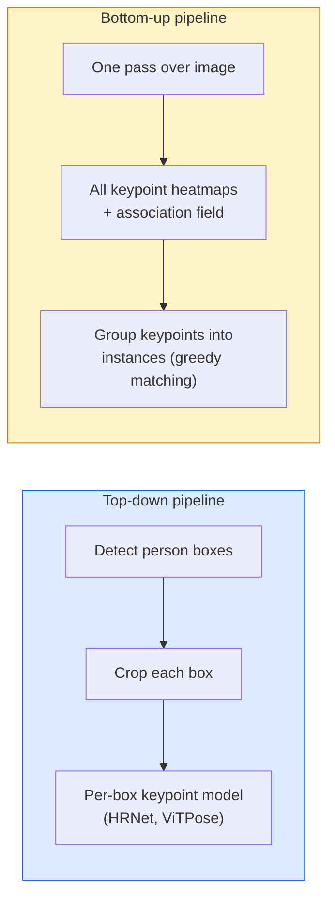

# Détection et estimation de position .

> Une pose est un ensemble de points clés ordonnés, un détecteur de points clés est un régresseur de la carte thermique, tout le reste est la comptabilité.

> **【中文解读】**Le pose est un ensemble de points clés ordonnés (comme 17 points clés du corps humain) ⋅ un testeur de points clés est en fait un récepteur de chaleur pour chaque point clé ⋅ un prétexte de chaleur ⋅ un état de position estimation largement utilisé dans l'analyse du mouvement ⋅ l'interaction humaine et l'AR  l'objectif ⋅

> **【拓展：姿态估计的应用】**Le système de surveillance des mouvements est un outil de surveillance des mouvements de la personne.

**Type:** Build | **类型:** 动手
**Languages:** Python | **语言:** Python
**Prerequisites:** Phase 4 Lesson 06 (Detection), Phase 4 Lesson 07 (U-Net) | **前置知识:** Phase 4 Lesson 06（目标检测），Phase 4 Lesson 07（U-Net）
**Time:** ~45 minutes | **时间:** ~45 分钟

## Objectifs d'apprentissage

- Distinguer les estimations de la pose en bas vers le bas et en haut et indiquer le moment de chaque utilisation
- Carte de chaleur de régression pour les points clés K avec une cible Gaussian-per-point-clés et extraire les coordonnées des points clés à l'inférence
- Expliquer les champs d'affinité de partie (PAF) et comment les pipelines bas vers le haut associent les points clés en instances
- Utilisez MediaPipe Pose ou MMPose pour l'estimation des points clés de production et comprenez leur format de sortie

> **【中文解读】**Les objectifs de l'apprentissage sont énumérés dans la liste des compétences fondamentales que l'on devrait acquérir après avoir terminé la classe.


## Le problème , l' introduction du problème

Les tâches clés se cachent sous de nombreux noms: pose humaine (17 articulations corporelles), repères faciaux (68 ou 478 points), main (21 points), pose animale, pose d'objet robotique, repères d'anatomie médicale. Chacune d'elles partage la même structure: détecter les points distincts K sur un objet et extraire leurs coordonnées (x, y).

> 关键点任务隐藏在许多名称下:人体姿态(17 个身体关节) 面部特征点(68 个点) 、手部(21 个点) 、动物姿态、机器人物体姿态、医学解剖标志── chacune a la même structure: K 个离散点并输出它们的 (x, y) 坐标──

L'estimation de la pose est la base de la capture de mouvement, des applications de fitness, de l'analyse sportive, du contrôle des gestes, de l'animation, de l'essai AR et de la prise en main robotique.

> L'évaluation de la posture est une base de capture de mouvements, d'application de la santé, d'analyse du mouvement, de contrôle des mouvements, d'animation, de recherche en technologie et de prise en charge des appareils.

La question de l'ingénierie est l'échelle. Une pose d'une seule image, une seule personne est un problème de 20 ms. La pose de plusieurs personnes dans une foule à 30 fps est un problème différent avec différentes architectures.

> Le problème de l'ingénierie est la taille. Une seule image, une seule personne, une seule personne, une seule personne, une seule personne, une seule personne, une seule personne, une seule personne, une seule personne, une seule personne, une seule personne, une seule personne, une seule personne, une seule personne, une seule personne, une seule personne, une seule personne, une seule personne, une seule personne, une seule personne, une seule personne, une seule personne, une seule personne, une seule personne, une seule personne, une seule personne, une seule personne, une seule personne, une seule personne, une seule personne, une seule personne, une seule personne, une seule personne, une seule personne, une seule personne, une seule personne, une seule personne, une seule personne, une seule personne, une seule personne, une seule personne, une seule personne, une seule personne, une seule personne, une seule personne, une seule personne, une seule personne, une seule personne, une seule personne, une seule personne, une seule personne, une seule personne, une seule personne, une seule personne, une seule personne, une seule personne, une seule personne, une personne, une seule personne, une personne, une personne, une personne, une personne, une personne, une personne, une personne, un homme, un homme, un homme, un homme, un homme, un homme, un homme, un homme, un homme, un homme, un homme, un homme, un homme, un homme, un homme, un homme, un homme, un homme, un homme, un homme, un homme, un homme, un homme, un homme, un homme, un homme, un homme, un homme, un homme, un homme, un homme, un homme, un homme, un homme, un homme, un homme, un homme, un homme, un homme, un homme, un homme, un homme, un homme, un homme, un homme, un homme, un homme, un homme, un homme, un homme, un homme, un homme, un homme, un homme, un homme, un homme, un homme, un homme, un homme, un homme, un homme, un homme, un homme, un homme, un homme, un homme, un homme, un homme, un homme, un homme, un homme, un homme, un homme, un homme, un homme, un homme, un homme, un homme, un homme, un homme, un homme

## Le concept de base.

> **【中文解读】**Le présent article présente les concepts et les bases théoriques de base. La connaissance de ces concepts est la prémisse de la réalisation de la réalisation de la réalisation, mais aussi le point de connaissance de l'interview et de la pratique de l'ingénierie.


### En bas vers le bas



- **Top-down** détecter d'abord les personnes, puis exécuter un modèle de point clé par personne sur chaque culture.
  Le mot grec traduit par " le mot grec "**自顶向下**abord examiner le cadre de l'homme, puis pour chaque région de coupe de la fonctionnement un seul homme
- **Bottom-up** un passage avant prédit tous les points clés plus un champ d'association; les regrouper.
  Le mot grec traduit par " le mot grec "**自底向上** Une fois avant avant de se propager prédiction tous les points clés; puis la division.

Le haut vers le bas (HRNet, ViTPose) est le leader de la précision; le bas vers le haut (OpenPose, HigherHRNet) est le leader du débit pour les scènes bondées.

> Le réseau social humain (HRNet、ViTPose) est un leader de l'éminence; le réseau social humain (OpenPose、HigherHRNet) est un leader de la capacité de production de scènes d'afflux.

### Régression de la carte thermique

Au lieu de régresser `(x, y)`directement, prédire une`H x W`carte thermique par point clé avec une tache gaussienne centrée sur l'emplacement réel.

> Il n' est pas revenu directement.`(x, y)`, mais pour chaque point clé prévoir un`H x W`热力图, en position réelle, placez des taches élevées.

```
target[k, y, x] = exp(-((x - cx_k)^2 + (y - cy_k)^2) / (2 sigma^2))
```

À l'inférence, l'argmax de chaque carte thermique est l'emplacement prévisible du point clé.

Pourquoi les cartes thermiques fonctionnent mieux que la régression directe: la structure spatiale du réseau (carte de fonctionnalités conv) s'aligne naturellement avec la sortie spatiale.

> Pourquoi la réaction de l'espace est meilleure que la réaction directe: la structure spatiale du réseau est plus efficace que la production spatiale naturelle.

### Localisation sous-pixel

Argmax donne des coordonnées entières. Pour une précision sous-pixel, affiner en fixant une parabole à l'argmax et à ses voisins, ou utiliser le bien connu offset `(dx, dy) = 0.25 * (heatmap[y, x+1] - heatmap[y, x-1], ...)`- Dans quelle direction ?

> Argmax  donne un nombre entier                                                                                                                                                                                                                                                            

### Les champs d'affinité de partie (PAF)

Pour chaque paire de points clés connectés (par exemple, épaule gauche à coude gauche), prédire un champ à 2 canaux qui encode le vecteur unitaire pointant de l'un à l'autre. Pour associer une épaule à son coude, intégrer le PAF le long de la ligne reliant les paires candidates; la paire avec l'intégrale la plus élevée est correspondue.

```
For each connection (limb):
  PAF channels: 2 (unit vector x, y)
  Line integral: sum over sample points of (PAF . line_direction)
  Higher integral = stronger match
```

Elegante et à l'échelle de la foule arbitraire sans cultures par personne.

### Points clés COCO

L'ensemble de données standard de pose de corps: 17 points clés par personne, PCK (Procès de points clés corrects) et OKS (Similarité de point clés objet) comme mesures. OKS est l'analogue de point clé de IoU et est ce que COCO mAP@OKS rapporte.

> 标准人体姿态数据集:每人 17 个关键点,PCK(正确关键点百分比) et OKS(目标关键点相似度) en tant que mesure。OKS est la version de l'IoU, est le contenu du rapport COCO mAP@OKS。

### 2D contre 3D

- **2D pose** coordonnées d'image; résolues à la qualité de production (MediaPipe, HRNet, ViTPose).
- **3D pose** coordonnées monde/caméra; recherche toujours active.
  - Levez les prédictions 2D à 3D avec un petit MLP (VideoPose3D).
  - Regression directe 3D à partir d'image (PyMAF, MHFormer).
  - Configuration multi-vue (CMU Panoptic) pour la vérité au sol.

> **【中文解读】**Cette méthode "de zéro" peut aider à comprendre le principe derrière le cadre, en cas de problème, ne sera pas bloqué dans une boîte noire.

> **【拓展：工业部署中的视觉系统】**Dans le cadre de la déploiement industriel réel, les modèles visuels doivent prendre en compte la réflexion sur la différence de taille des modèles, l'adaptation des appareils de bord, etc. TensorRT, ONNX Runtime, OpenVINO sont des outils d'accélération de réflexion courants. Les systèmes de conduite autonome (comme Tesla FSD) utilisent généralement plusieurs modèles visuels en temps réel sur les puces de véhicule.

> **【拓展：数据标注与质量】**L'efficacité des tâches visuelles dépend fortement de la qualité des données de marquage. Le Studio de marquage, CVAT, est l'outil de marquage principal. Dans le monde industriel, l'apprentissage actif peut réduire le coût de marquage.


## Construisez-le et mettez-le en œuvre.
```figure
cv3-pose-heatmap
```

## Faites-le

### Étape 1: cible de la carte thermique gaussienne

```python
import numpy as np
import torch

def gaussian_heatmap(size, cx, cy, sigma=2.0):
    yy, xx = np.meshgrid(np.arange(size), np.arange(size), indexing="ij")
    return np.exp(-((xx - cx) ** 2 + (yy - cy) ** 2) / (2 * sigma ** 2)).astype(np.float32)

hm = gaussian_heatmap(64, 32, 32, sigma=2.0)
print(f"peak: {hm.max():.3f} at ({hm.argmax() % 64}, {hm.argmax() // 64})")
```

Les cartes thermiques par point clé empilées le long d'un axe de canal donnent le tensor cible complet.

> Chaque point clé de la chaleur est en train de se déployer sur le chemin de l'axe, formant ainsi un objectif complet.

### Étape 2: Petite tête de touche

Un modèle de style U-Net qui sort des canaux de carte thermique K.

> Un modèle U-Net, en sortie K 个热力图通道──

```python
import torch.nn as nn
import torch.nn.functional as F

class TinyKeypointNet(nn.Module):
    def __init__(self, num_keypoints=4, base=16):
        super().__init__()
        self.down1 = nn.Sequential(nn.Conv2d(3, base, 3, 2, 1), nn.ReLU(inplace=True))
        self.down2 = nn.Sequential(nn.Conv2d(base, base * 2, 3, 2, 1), nn.ReLU(inplace=True))
        self.mid = nn.Sequential(nn.Conv2d(base * 2, base * 2, 3, 1, 1), nn.ReLU(inplace=True))
        self.up1 = nn.ConvTranspose2d(base * 2, base, 2, 2)
        self.up2 = nn.ConvTranspose2d(base, num_keypoints, 2, 2)

    def forward(self, x):
        h1 = self.down1(x)
        h2 = self.down2(h1)
        h3 = self.mid(h2)
        u1 = self.up1(h3)
        return self.up2(u1)
```

Enregistrement`(N, 3, H, W)`, la production `(N, K, H, W)`La perte est MSE par pixel contre les cibles Gaussiennes.

### Étape 3: Inference  extraire les coordonnées des points clés

```python
def heatmap_to_coords(heatmaps):
    """
    heatmaps: (N, K, H, W)
    returns:  (N, K, 2) float coordinates in image pixels
    """
    N, K, H, W = heatmaps.shape
    hm = heatmaps.reshape(N, K, -1)
    idx = hm.argmax(dim=-1)
    ys = (idx // W).float()
    xs = (idx % W).float()
    return torch.stack([xs, ys], dim=-1)

coords = heatmap_to_coords(torch.randn(2, 4, 32, 32))
print(f"coords: {coords.shape}")  # (2, 4, 2)
```

Pour le raffinement sous-pixel, interpliez autour de l'argmax.

### Étape 4: Ensemble de données synthétique de points clés

Simple: dessinez quatre points sur une toile blanche et apprenez à les prédire.

```python
def make_synthetic_sample(size=64):
    img = np.ones((3, size, size), dtype=np.float32)
    rng = np.random.default_rng()
    kps = rng.integers(8, size - 8, size=(4, 2))
    for cx, cy in kps:
        img[:, cy - 2:cy + 2, cx - 2:cx + 2] = 0.0
    hms = np.stack([gaussian_heatmap(size, cx, cy) for cx, cy in kps])
    return img, hms, kps
```

C'est assez facile pour un petit modèle à apprendre en une minute.

### Étape 5: Formation

```python
model = TinyKeypointNet(num_keypoints=4)
opt = torch.optim.Adam(model.parameters(), lr=3e-3)

for step in range(200):
    batch = [make_synthetic_sample() for _ in range(16)]
    imgs = torch.from_numpy(np.stack([b[0] for b in batch]))
    hms = torch.from_numpy(np.stack([b[1] for b in batch]))
    pred = model(imgs)
    # Upsample pred to full resolution
    pred = F.interpolate(pred, size=hms.shape[-2:], mode="bilinear", align_corners=False)
    loss = F.mse_loss(pred, hms)
    opt.zero_grad(); loss.backward(); opt.step()
```

> **【中文解读】**Dans ce chapitre, nous allons montrer comment utiliser un cadre mature (comme PyTorch, HuggingFace, etc.) pour appliquer rapidement cette technique.


> **【拓展：视觉模型的持续学习】**Dans un environnement de production, le modèle visuel doit être en constante évolution pour s'adapter à de nouveaux données. La technologie de l'apprentissage continu permet d'éviter que le modèle s'adapte à de nouvelles données et oublie les anciens connaissances.

## Utilisez-le avec le cadre de réalisation

- **MediaPipe Pose** L'estimatrice de pose de production de Google; envoie des temps d'exécution mobiles WebGL + avec une latence inférieure à 10 ms.
- **MMPose**(OpenMMLab)  base de code de recherche complète; chaque architecture SOTA avec des poids prétraînés.
- **YOLOv8-pose** la pose multi-personne la plus rapide en temps réel avec un seul passe avant.
- **transformers HumanDPT / PoseAnything** des approches plus récentes du langage de vision pour la pose du vocabulaire ouvert (tout objet, tout ensemble de points clés).

> **【中文解读】**Cette section se concentre sur la façon de déployer le modèle en tant que produit disponible. De l'original au système de production, il faut considérer plusieurs dimensions de l'optimisation des performances, du traitement des erreurs, du contrôle, etc.


## Envoyez-le . Produit .

> **【中文解读】** Exercices de base selon Easy/Medium/Hard 三个难度递进──建议至少完成  级别的题目,  级别适合深入研究或面试准备──


Cette leçon donne:

- `outputs/prompt-pose-stack-picker.md` une requête qui choisit MediaPipe / YOLOv8-pose / HRNet / ViTPose compte tenu de la latence, de la taille de la foule et du besoin 2D vs 3D.
- `outputs/skill-heatmap-to-coords.md` une compétence qui écrit la routine de la carte thermique de sous-pixel à la coordonnée utilisée par chaque modèle de pose de production.

## Les exercices

1. **(Easy)**Exercez le modèle de point clé minuscule sur l'ensemble de données synthétique de 4 points.
2. **(Medium)**Ajouter un raffinement sous-pixel: étant donné la position argmax, ajoutez une parabole 1D le long des pixels voisins x et y. Rapportez le gain de précision par rapport à l'ensemble argmax.
3. **(Hard)**Construisez un ensemble de données synthétiques de 2 personnes où chaque image montre deux instances du modèle de 4 points clés. Traînez un pipeline de bas en haut avec des PAF qui prédisent quel point clé appartient à quelle instance, et évaluez OKS.

> **【中文解读】**Dans le tableau des termes, la définition du terme "ce que les gens disent" et "ce qu'il signifie réellement" est différenciée entre le langage quotidien et la signification technique précise.


## Les termes clés

| Term | What people say | What it actually means |
|------|----------------|----------------------|
| Keypoint | "A landmark" | A specific ordered point on an object (joint, corner, feature) |
| Pose | "The skeleton" | An ordered set of keypoints belonging to one instance |
| Top-down | "Detect then pose" | Two-stage pipeline: person detector + per-crop keypoint model; highest accuracy |
| Bottom-up | "Pose first, group later" | Single-pass all-keypoint prediction + grouping; constant time in crowd size |
| Heatmap | "Gaussian target" | H x W tensor per keypoint with peak at the true location; the preferred regression target |
| PAF | "Part Affinity Field" | 2-channel unit vector field encoding limb directions; used to group keypoints into instances |
| OKS | "Keypoint IoU" | Object Keypoint Similarity; the COCO metric for pose |
| HRNet | "High-Resolution Net" | The dominant top-down keypoint architecture; preserves high-res features throughout |

> **【中文解读】**延伸阅读 fournit des ressources de haute qualité pour l'apprentissage en profondeur. Ces articles et cours sont des références classiques dans ce domaine, adaptés aux lecteurs qui ont besoin d'une compréhension approfondie.


## Encore une lecture

- [OpenPose (Cao et al., 2017)](https://arxiv.org/abs/1812.08008) bas vers le haut avec les PAF; toujours la meilleure rédaction de l'approche
- [HRNet (Sun et al., 2019)](https://arxiv.org/abs/1902.09212) l'architecture de référence de haut en bas
- [ViTPose (Xu et al., 2022)](https://arxiv.org/abs/2204.12484) ViT simple comme colonne vertébrale de pose; SOTA actuel sur de nombreux points de référence
- [MediaPipe Pose](https://developers.google.com/mediapipe/solutions/vision/pose_landmarker) pose de production en temps réel; la pile la plus rapide déployée en 2026
