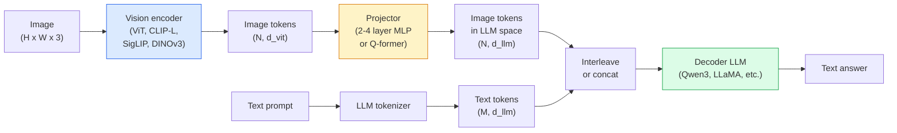

# Modèles de langage de vision  Le modèle de ViT-MLP-LLM 

> Un codeur de vision convertit une image en jetons. Un projecteur MLP cartographient ces jetons dans l'espace d'intégration du LLM. Un modèle de langage fait le reste. Ce modèle  ViT-MLP-LLM  est chaque VLM de production en 2026.

> **【中文解读】**Le codeur vidéo transformera les images en jetons, le MLP projetera ces jetons dans le cadre de la formation LLM, le modèle linguistique effectuera le travail restant. Le MLM est le modèle standard de tous les modèles de langue vidéo de production de 2026 (VLM) comprenant GPT-4V, Claude 3 Vision, LLaVA, etc.

> **【拓展：VLM 的应用】**Le VLM est le cœur de l'IA à plusieurs façons: GPT-4V(图像问答) Claude Vision(文档分析) ✓ LLaVA(开源视觉对话) ✓ Google Gemini(多模态推理) ✓ Dans le domaine financier, le VLM peut être utilisé pour la compréhension des chiffres financiers ✓ Contrats ✓ Intelligence ✓ Automatise des informations ✓

**Type:** Learn + Use | **类型:** 学习 + 应用
**Languages:** Python | **语言:** Python
**Prerequisites:** Phase 4 Lesson 14 (ViT), Phase 4 Lesson 18 (CLIP), Phase 7 Lesson 02 (Self-Attention) | **前置知识:** Phase 4 Lesson 14（ViT），Phase 4 Lesson 18（CLIP），Phase 7 Lesson 02（自注意力）
**Time:** ~75 minutes | **时间:** ~75 分钟

## Objectifs d'apprentissage

- Décrire l'architecture ViT-MLP-LLM et expliquer ce que chacun des trois composants contribue
- Comparer Qwen3-VL, InternVL3.5, LLaVA-Next et GLM-4.6V sur le nombre de paramètres, la longueur du contexte et les performances de référence
- Expliquez DeepStack: pourquoi les fonctionnalités multi-niveaux de ViT resserrent mieux l'alignement du langage visuel qu'une seule fonction de dernière couche
- Mesurer les hallucinations de VLM en production avec le taux d'erreur croisée modal (CMER) et agir sur le signal

> **【中文解读】**Les objectifs de l'apprentissage sont énumérés dans la liste des compétences fondamentales que l'on devrait acquérir après avoir terminé la classe.


## Le problème , l' introduction du problème

CLIP (leçon de la phase 4 18) vous donne un espace d'intégration partagé pour les images et le texte, ce qui est suffisant pour la classification et la récupération à vue zéro. Il ne peut pas répondre "combien de voitures rouges y a-t-il dans cette image?" parce que CLIP ne génère pas de texte  il ne note que des similitudes.

> CLIP(Quatrième étape 18 课) vous donne un espace de partage d'images et de texte, suffisant pour faire zéro échantillonnage de catégories et de recherches. Il ne peut répondre "Il y a quelques voitures rouges dans cette liste ?" parce que CLIP ne génère pas de texte. Il ne fait que évaluer la similitude.

Les modèles de vision-langue (VLM)  Qwen3-VL, InternVL3.5, LLaVA-Next, GLM-4.6V  boulter un écrivain d'image CLIP-famille à un modèle de langage complet. Le modèle voit une image plus une question et génère une réponse. En 2026, les VLM open source rivalisent ou battre GPT-5 et Gemini-2.5-Pro sur les benchmarks multimodal (MMMU, MMBench, DocVQA, ChartQA, MathVista, OSWorld).

> 视觉语言模型(VLM) Qwen3-VL、InternVL3.5、LLaVA-Next、GLM-4.6V va connecter le codeur d'image de la famille CLIP à un modèle de langue complet―model voir l'image加问题并生成答案―en 2026 , le VLM en plein essor sur plusieurs modèles基准上匹敌或击败 GPT-5 和 Gemini-2.5-Pro──

Le trio de pièces (ViT, projecteur, LLM) est la norme. Les différences entre les modèles sont dans lequel ViT, quel projecteur, quel LLM, les données de formation et la recette d'alignement. Une fois que vous comprenez le modèle, le changement de composant est mécanique.

> Les différences entre les modèles résident dans l'utilisation de quel ViT, quel projecteur, quel LLM, les données de formation et le schéma de préparation. Une fois que vous avez compris ce modèle, le remplacement de tout composant est une opération mécanique.

## Le concept de base.

> **【中文解读】**Le présent article présente les concepts et les bases théoriques de base. La connaissance de ces concepts est la prémisse de la réalisation de la réalisation de la réalisation, mais aussi le point de connaissance de l'interview et de la pratique de l'ingénierie.


### L'architecture ViT-MLP-LLM



1. **Vision encoder** un ViT prétrainé (CLIP-L/14, SigLIP, DINOv3 ou une variante finement réglée).
   Le mot grec traduit par " le mot grec "**视觉编码器** pré-entraînement de ViT(CLIP-L/14、SigLIP、DINOv3 或微调变体)
2. **Projector** un petit module (2-4 couches MLP, ou Q-former) qui cartographient les jetons de vision dans la dimension d'intégration du LLM. C'est là que se produit la plupart des ajustements fins.
   Le mot grec traduit par " le mot grec "**投影器**小型模块 (en anglais: 小型模块 (en anglais: 小型模块)  2-4 层 MLP ou Q-former), 将视觉代币 映射到LLM的嵌入维度── la plupart des micro调调发生在这里──
3. **LLM** un modèle de langage à décodeur seulement (Qwen3, Llama, Mistral, GLM, InternLM). Lire les jetons vision + texte en séquence, génère du texte.
   Le mot grec traduit par " le mot grec "**LLM**仅解码器语言模型(Qwen3、Llama、Mistral、GLM、InternLM) ・・・顺序读取视觉 + 文本代币,生成文本。

Les trois pièces sont entraînées en principe. En pratique, le codeur de vision et le LLM restent principalement gelés tandis que le projecteur entraîne quelques milliards de paramètres de signal à bas prix.

> En pratique, les éditeurs visuels et les MLL sont essentiels, mais les projecteurs sont uniquement formés pour obtenir des milliards de paramètres de signaux à bas prix.

### Le dépôt

La projection vanille utilise seulement la dernière couche de ViT. Des échantillons de DeepStack (Qwen3-VL) proviennent de plusieurs profondeurs de ViT et les empilent.

> 朴素投影只使用ViT 最后一层――DeepStack(Qwen3-VL) de plusieurs ViT profondeur采样特征并堆叠――更深层携带高级语义;更浅层携带细粒度空间和纹理信息――将两者都送进LLM 弥合了"图像包含什么" (图像包含什么) 和"具体在哪里" (空间定位) 之间的差距――

### Trois étapes de formation

Les VLM modernes se forment en étapes:

1. **Alignment** congeler les ViT et LLM. Trainer uniquement le projecteur sur les paires d'images. Apprendre au projecteur à cartographier l'espace visuel dans l'espace linguistique.
   Le mot grec traduit par " le mot grec "**对齐**结 ViT 和 LLM── 结 ViT 和 LLM── 结 结 结 结 结 结 结 结 结 结 结 结 结 结 结 结 结 结 结 结 结 结   结   结   结   结  结  结  结  结  结  结  结  结  结  结  结  结  结   结   结   结   结   结   结   结   结   结    结     结                                                                                                                                           
2. **Pre-training**- défricher tout. entraîner sur des données d'image-texte interligées à grande échelle (500M+ paires). Construire les connaissances visuelles du modèle.
   Le mot grec traduit par " le mot grec "**预训练** Découvrir tout── formation sur les images et textes de grande taille
3. **Instruction tuning** fine-tune sur les triples (image, question, réponse) curés. Enseigne le comportement de conversation et les formats de tâches. C'est ce qui fait d'un "ML conscient de la vision" un assistant utilisable.
   Le mot grec traduit par " le mot grec "**指令微调**在精选的(图像,问题,答案) 三元组上微调──教会对话行为和任务格式──这将"视觉感知 LM"转变为可用助手──

La plupart des ajustements LoRA ciblent l'étape 3 avec un petit ensemble de données étiqueté.

### Comparaison des familles modèles (début 2026)

| Model | Params | Vision encoder | LLM | Context | Strengths |
|-------|--------|----------------|-----|---------|-----------|
| Qwen3-VL-235B-A22B (MoE) | 235B (22B active) | custom ViT + DeepStack | Qwen3 | 256K | General SOTA, GUI agent |
| Qwen3-VL-30B-A3B (MoE) | 30B (3B active) | custom ViT + DeepStack | Qwen3 | 256K | Smaller MoE alternative |
| Qwen3-VL-8B (dense) | 8B | custom ViT | Qwen3 | 128K | Production dense default |
| InternVL3.5-38B | 38B | InternViT-6B | Qwen3 + GPT-OSS | 128K | Strong MMBench / MMVet |
| InternVL3.5-241B-A28B | 241B (28B active) | InternViT-6B | Qwen3 | 128K | Competitive with GPT-4o |
| LLaVA-Next 72B | 72B | SigLIP | Llama-3 | 32K | Open, easy to fine-tune |
| GLM-4.6V | ~70B | custom | GLM | 64K | Open-source, strong OCR |
| MiniCPM-V-2.6 | 8B | SigLIP | MiniCPM | 32K | Edge-friendly |

### Agents visuels

Qwen3-VL-235B atteint le premier niveau mondial de performance sur OSWorld  un indicateur de référence pour **visual agents**Le modèle voit une capture d'écran, comprend l'interface utilisateur et émet des actions (clique, tape, défilement). Combiné avec des outils, il ferme la boucle sur les tâches de bureau communes. C'est ce que la plupart des démos 2026 "AI PC" exécutent sous le capot.

### Les capacités agencées + variantes RoPE

Les VLM doivent le savoir .**when**Qwen3-VL est passé de T-RoPE (embedding de position rotative temporelle) à **text-based time alignment** des jetons de texte de timestamp explicites interligés avec des images vidéo. Le modèle voit "`<timestamp 00:32>`"Réflexion, rappel" et peut raisonner sur les relations temporelles.

### Le problème de l'alignement

12% des paires d'images-texte dans un ensemble de données parcouru contiennent des descriptions qui ne sont pas entièrement basées sur l'image. Un VLM formé sur ce silentiel apprend à halluciner  fabriquer des objets, lire mal les nombres, inventer des relations.

Skywork.ai a présenté le **Cross-Modal Error Rate (CMER)**pour le suivre:

```
CMER = fraction of outputs where the text confidence is high but the image-text similarity (via a CLIP-family checker) is low
```

Le modèle de haute CMER signifie que le modèle dit avec confiance des choses qui ne sont pas basées sur l'image. La surveillance du CMER et le traiter comme un KPI de production réduit le taux d'hallucination de ~ 35% dans leur déploiement.

### Ajustement avec LoRA / QLoRA

La réglage fin complet d'un VLM 70B est hors de portée de la plupart des équipes. LoRA (rang 16-64) sur les couches d'attention + projecteur, ou QLoRA avec des poids de base de 4 bits, s'adapte à un seul A100 / H100. Coût: 5000-50.000 exemples, $100-$5 000 en calcul, 2 à 10 heures de formation.

### Le raisonnement spatial est encore faible.

Les VLM actuels obtiennent un score de 50-60% sur les critères de référence de raisonnement spatial (en haut-en bas, gauche-droite, compte, distance). Si votre cas d'utilisation dépend de " quel objet est au-dessus de quoi ", valide fortement  les performances génériques de VLM sont inférieures à celles humaines.

> **【拓展：工业部署中的视觉系统】**Dans le cadre de la déploiement industriel réel, les modèles visuels doivent prendre en compte la réflexion sur la différence de taille des modèles, l'adaptation des appareils de bord, etc. TensorRT, ONNX Runtime, OpenVINO sont des outils d'accélération de réflexion courants. Les systèmes de conduite autonome (comme Tesla FSD) utilisent généralement plusieurs modèles visuels en temps réel sur les puces de véhicule.

> **【拓展：数据标注与质量】**L'efficacité des tâches visuelles dépend fortement de la qualité des données de marquage. Le Studio de marquage, CVAT, est l'outil de marquage principal. Dans le monde industriel, l'apprentissage actif peut réduire le coût de marquage.


## Construisez-le et mettez-le en œuvre.

> **【中文解读】**Cette méthode "de zéro" peut aider à comprendre le principe derrière le cadre, en cas de problème, ne sera pas bloqué dans une boîte noire.

```figure
v4-vlm-projector
```

## Faites-le

### Étape 1: Le projecteur

La partie que vous allez entraîner le plus souvent. 2-4 couches de MLP avec GELU.

```python
import torch
import torch.nn as nn


class Projector(nn.Module):
    def __init__(self, vit_dim=768, llm_dim=4096, hidden=4096):
        super().__init__()
        self.net = nn.Sequential(
            nn.Linear(vit_dim, hidden),
            nn.GELU(),
            nn.Linear(hidden, llm_dim),
        )

    def forward(self, x):
        return self.net(x)
```

L' entrée est une `(N_patches, d_vit)`Le tensor symbolique.`(N_patches, d_llm)`Le LLM traite chaque ligne de sortie comme un autre symbole.

### Étape 2: Assembler le système ViT-MLP-LLM de bout en bout

Le squelette de la passe avant pour un VLM minimal.`transformers`; voici le plan conceptuel.

```python
class MinimalVLM(nn.Module):
    def __init__(self, vit, projector, llm, image_token_id):
        super().__init__()
        self.vit = vit
        self.projector = projector
        self.llm = llm
        self.image_token_id = image_token_id  # placeholder token in text prompt

    def forward(self, image, input_ids, attention_mask):
        # 1. vision features
        vision_tokens = self.vit(image)                     # (B, N_patches, d_vit)
        vision_embeds = self.projector(vision_tokens)       # (B, N_patches, d_llm)

        # 2. text embeddings
        text_embeds = self.llm.get_input_embeddings()(input_ids)  # (B, M, d_llm)

        # 3. replace image placeholder tokens with vision embeds
        merged = self._merge(text_embeds, vision_embeds, input_ids)

        # 4. run LLM
        return self.llm(inputs_embeds=merged, attention_mask=attention_mask)

    def _merge(self, text_embeds, vision_embeds, input_ids):
        out = text_embeds.clone()
        expected = vision_embeds.size(1)
        for b in range(input_ids.size(0)):
            positions = (input_ids[b] == self.image_token_id).nonzero(as_tuple=True)[0]
            if len(positions) != expected:
                raise ValueError(
                    f"batch item {b} has {len(positions)} image tokens but vision_embeds has {expected} patches."
                    " Every sample in the batch must be pre-padded to the same number of image placeholder tokens.")
            out[b, positions] = vision_embeds[b]
        return out
```

Le `<image>`Le jeton de place dans le texte est remplacé par des emblèmes d'image réels  le même motif LLaVA, Qwen-VL et InternVL utilisation.

### Étape 3: calcul du CMER

Un contrôle de temps de course léger.

```python
import torch.nn.functional as F


def cross_modal_error_rate(image_emb, text_emb, text_confidence, sim_threshold=0.25, conf_threshold=0.8):
    """
    image_emb, text_emb: embeddings of image and generated text (normalised internally)
    text_confidence:     mean per-token probability in [0, 1]
    Returns:             fraction of high-confidence outputs with low image-text alignment
    """
    image_emb = F.normalize(image_emb, dim=-1)
    text_emb = F.normalize(text_emb, dim=-1)
    sim = (image_emb * text_emb).sum(dim=-1)        # cosine similarity
    high_conf_low_sim = (text_confidence > conf_threshold) & (sim < sim_threshold)
    return high_conf_low_sim.float().mean().item()
```

Traiter le CMER comme un KPI de production. Suivre par point final, par type de prompt, par client. L'augmentation du CMER indique que le modèle commence à halluciner sur une certaine distribution d'entrée.

### Étape 4: Classificateur VLM de jouets (exécutable)

Il y a des faux "ViT features" qui vont dans, un petit jeton de style LLM prédit une classe.

```python
class ToyVLM(nn.Module):
    def __init__(self, vit_dim=32, llm_dim=64, num_classes=5):
        super().__init__()
        self.projector = Projector(vit_dim, llm_dim, hidden=64)
        self.head = nn.Linear(llm_dim, num_classes)

    def forward(self, vision_tokens):
        projected = self.projector(vision_tokens)
        pooled = projected.mean(dim=1)
        return self.head(pooled)
```

> **【中文解读】**Dans ce chapitre, nous allons montrer comment utiliser un cadre mature (comme PyTorch, HuggingFace, etc.) pour appliquer rapidement cette technique.


On peut le monter sur des paires synthétiques (feature, classe) en moins de 200 étapes  suffisamment pour montrer le modèle du projecteur fonctionne.


> **【拓展：视觉模型的持续学习】**Dans un environnement de production, le modèle visuel doit être en constante évolution pour s'adapter à de nouveaux données. La technologie de l'apprentissage continu permet d'éviter que le modèle s'adapte à de nouvelles données et oublie les anciens connaissances.

## Utilisez-le avec le cadre de réalisation

Trois façons dont les équipes de production utilisent les VLM en 2026:

- **Hosted API** OpenAI Vision, Claude Vision, Google Gemini Vision. Zéro infra, risque de fournisseur.
- **Open-source self-host** Qwen3-VL ou InternVL3.5 via `transformers`et `vllm`- Le contrôle complet, plus d'efforts.
- **Fine-tune on domain** charger Qwen2.5-VL-7B ou LLaVA-1.6-7B, LoRA sur des exemples personnalisés de 5k-50k, servir avec `vllm`ou `TGI`- Je suis désolé .

```python
from transformers import AutoProcessor, AutoModelForVision2Seq
import torch
from PIL import Image

model_id = "Qwen/Qwen3-VL-8B-Instruct"
processor = AutoProcessor.from_pretrained(model_id)
model = AutoModelForVision2Seq.from_pretrained(model_id, torch_dtype=torch.bfloat16, device_map="auto")

messages = [{
    "role": "user",
    "content": [
        {"type": "image", "image": Image.open("plot.png")},
        {"type": "text", "text": "What does this chart show?"},
    ],
}]
inputs = processor.apply_chat_template(messages, add_generation_prompt=True, tokenize=True, return_dict=True, return_tensors="pt").to("cuda")
generated = model.generate(**inputs, max_new_tokens=256)
answer = processor.decode(generated[0][inputs["input_ids"].shape[1]:], skip_special_tokens=True)
```

> **【中文解读】**Cette section se concentre sur la façon de déployer le modèle en tant que produit disponible. De l'original au système de production, il faut considérer plusieurs dimensions de l'optimisation des performances, du traitement des erreurs, du contrôle, etc.


`apply_chat_template`Il cache le `<image>`la marquage de place; le modèle gère la fusion en interne.


## Envoyez-le . Produit .

> **【中文解读】** Exercices de base selon Easy/Medium/Hard 三个难度递进──建议至少完成  级别的题目,  级别适合深入研究或面试准备──


Cette leçon donne:

- `outputs/prompt-vlm-selector.md` choisit Qwen3-VL / InternVL3.5 / LLaVA-Next / API compte tenu de la précision, de la latence, de la longueur du contexte et du budget.
- `outputs/skill-cmer-monitor.md` émet le code pour instrumenter un point final VLM de production avec taux d'erreur intermodal, tableaux de bord par point final et seuils d'alerte.

## Les exercices

1. **(Easy)**Exécutez trois requêtes ("qu'est-ce que c'est?", "comptez les objets", "décrivez la scène") à travers n'importe quel VLM ouvert sur cinq images. Marquez chaque réponse comme correcte / partiellement correcte / hallucinée à la main. Compute un taux de CMER de premier passage.
2. **(Medium)**Tone fin Qwen2.5-VL-3B ou LLaVA-1.6-7B avec LoRA (rang 16) sur 500 images d'un domaine cible avec des légendes.
3. **(Hard)**Remplacez le codeur d'image du VLM par DINOv3 au lieu de son SigLIP/CLIP par défaut. Reentraînez uniquement le projecteur (LLM gelé + DINOv3 gelé). Mesurez si les tâches de prédiction dense (compte, raisonnement spatial) s'améliorent.

> **【中文解读】**Dans le tableau des termes, la définition du terme "ce que les gens disent" et "ce qu'il signifie réellement" est différenciée entre le langage quotidien et la signification technique précise.


## Les termes clés

| Term | What people say | What it actually means |
|------|----------------|----------------------|
| ViT-MLP-LLM | "The VLM pattern" | Vision encoder + projector + language model; every 2026 VLM |
| Projector | "The bridge" | 2-4 layer MLP (or Q-former) that maps vision tokens into LLM embedding space |
| DeepStack | "Qwen3-VL feature trick" | Multi-level ViT features stacked rather than last-layer only |
| Image token | "<image> placeholder" | Special token in the text stream replaced by projected vision embeddings |
| CMER | "Hallucination KPI" | Cross-Modal Error Rate; high when text confidence is high but image-text similarity is low |
| Visual agent | "VLM that clicks" | VLM operating GUIs (OSWorld, mobile, web) with tool calls |
| Q-former | "Fixed-count token bridge" | BLIP-2 style projector producing a fixed number of visual query tokens |
| Alignment / pre-training / instruction tuning | "Three stages" | Standard VLM training pipeline |

> **【中文解读】**延伸阅读 fournit des ressources de haute qualité pour l'apprentissage en profondeur. Ces articles et cours sont des références classiques dans ce domaine, adaptés aux lecteurs qui ont besoin d'une compréhension approfondie.


## Encore une lecture

- [Qwen3-VL Technical Report (arXiv 2511.21631)](https://arxiv.org/abs/2511.21631)
- [InternVL3.5 Advancing Open-Source Multimodal Models (arXiv 2508.18265)](https://arxiv.org/html/2508.18265v1)
- [LLaVA-Next series](https://llava-vl.github.io/blog/2024-05-10-llava-next-stronger-llms/)
- [BentoML: Best Open-Source VLMs 2026](https://www.bentoml.com/blog/multimodal-ai-a-guide-to-open-source-vision-language-models)
- [MMMU: Multi-discipline Multimodal Understanding benchmark](https://mmmu-benchmark.github.io/)
- [VLMs in manufacturing (Robotics Tomorrow, March 2026)](https://www.roboticstomorrow.com/story/2026/03/when-machines-learn-to-see-like-experts-the-rise-of-vision-language-models-in-manufacturing/26335/)
