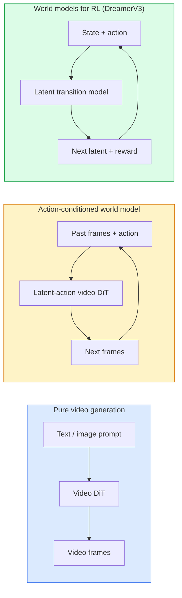

# Modèles mondiaux et diffusion vidéo

> Un modèle vidéo qui prédit les prochaines secondes d'une scène est un simulateur de monde conditionner cette prédiction sur les actions et vous avez un moteur de jeu appris.

> **【中文解读】**能够预测场景接下来几秒的视频模型就是一个世界模拟器――将预测条件化为动作,就得到了一个学习的游戏引擎――世界模型是AI的前沿方向让AI理解物理世界的动态规律――

> **【拓展：世界模型的前沿】**Sora(OpenAI) et Genie(DeepMind) sont les représentants du modèle du monde. Le modèle du monde peut être utilisé pour la réalisation de l'AGI.

**Type:** Learn + Build | **类型:** 学习 + 动手
**Languages:** Python | **语言:** Python
**Prerequisites:** Phase 4 Lesson 10 (Diffusion), Phase 4 Lesson 12 (Video Understanding), Phase 4 Lesson 23 (DiT + Rectified Flow) | **前置知识:** Phase 4 Lesson 10（扩散模型），Phase 4 Lesson 12（视频理解），Phase 4 Lesson 23（DiT + 整流流）
**Time:** ~75 minutes | **时间:** ~75 分钟

## Objectifs d'apprentissage

- Expliquez la différence entre un modèle de génération vidéo pur (Sora 2) et un modèle de monde conditionné à l'action (Genie 3, DreamerV3)
- Décrire une vidéo DiT: patchs spatio-temporaux, codage 3D de position, attention commune sur les jetons (T, H, W)
- Suivre comment un modèle mondial se connecte à la robotique: VLM planifie → modèle vidéo simule → dynamique inverse émet des actions
- Choisissez entre Sora 2, Genie 3, Runway GWM-1 Worlds, Wan-Video et HunyuanVideo pour un cas d'utilisation donné (vidéo créative, sim interactif, synthèse de conduite autonome)

> **【中文解读】**Les objectifs de l'apprentissage sont énumérés dans la liste des compétences fondamentales que l'on devrait acquérir après avoir terminé la classe.


## Le problème , l' introduction du problème

La génération vidéo et la modélisation mondiale convergent en 2026. Un modèle capable de générer une minute de vidéo cohérente a, dans un sens, appris comment le monde se déplace: la permanence des objets, la gravité, la causalité, le style. Si vous conditionnez cette prédiction sur les actions (marcher à gauche, ouvrir la porte), le modèle vidéo devient un simulateur apprenable qui peut remplacer un moteur de jeu, un simulateur de conduite ou un environnement robotique.

> 视频生成和世界建模于 2026年融合了── un modèle qui peut générer une minute连贯视频 a appris à un certain sens comment le monde se déplace: durabilité, gravité, relation de conséquences, style── si vous prédisez que le modèle vidéo est en mouvement en tant que condition (((à gauche, ouverte), il devient un simulateur appréciable, qui peut remplacer un moteur de jeu, un simulateur de conduite ou un environnement robotisé──

Les enjeux sont concrets. Genie 3 génère des environnements jouables à partir d'une seule image. La piste GWM-1 Worlds synthétise des scènes exploratoires infinies. Sora 2 produit des vidéos de quelques minutes avec une sonorisation synchronisée et une physique modélisée. NVIDIA Cosmos-Drive, Wayve Gaia-2 et Tesla DrivingWorld génèrent des vidéos de conduite réalistes pour les données d'entraînement des véhicules autonomes. Le paradigme du modèle mondial prend tranquillement le contrôle de la sim-à-réalité pour la robotique.

> Le génie 3 est un modèle de jeu de jeu de jeu de jeu de jeu de jeu de jeu de jeu de jeu de jeu de jeu de jeu de jeu de jeu de jeu de jeu de jeu de jeu de jeu de jeu de jeu de jeu de jeu de jeu de jeu de jeu de jeu de jeu de jeu de jeu de jeu de jeu de jeu de jeu de jeu de jeu de jeu de jeu de jeu de jeu de jeu de jeu de jeu de jeu de jeu de jeu de jeu de jeu de jeu de jeu de jeu de jeu de jeu de jeu de jeu de jeu de jeu de jeu de jeu de jeu de jeu de jeu de jeu de jeu de jeu de jeu de jeu de jeu de jeu de jeu de jeu de jeu de jeu de jeu de jeu de jeu de jeu de jeu de jeu de jeu de jeu de jeu de jeu de jeu de jeu de jeu de jeu de jeu de jeu de jeu de jeu de jeu de jeu de jeu de jeu de jeu de jeu de jeu de jeu de jeu de jeu de jeu de jeu de jeu de jeu de jeu de jeu de jeu de jeu de jeu de jeu de jeu de jeu de jeu de jeu de jeu de jeu de jeu de jeu de jeu de jeu de jeu de jeu de jeu de jeu de jeu de jeu de jeu de jeu de jeu de jeu de jeu de jeu de jeu de jeu de jeu de jeu de jeu de jeu de jeu de jeu de jeu de jeu de jeu de jeu de jeu de jeu de jeu de jeu de jeu de jeu de jeu de jeu de jeu de jeu de jeu de jeu de jeu de jeu de jeu de jeu de jeu de jeu de jeu de jeu de jeu de jeu de jeu de jeu de jeu de jeu de jeu de jeu de jeu de jeu de jeu de jeu de jeu de jeu de jeu de jeu de jeu de jeu de jeu de jeu de jeu de jeu de jeu de jeu de jeu de jeu de jeu de jeu de jeu de jeu de jeu de jeu de jeu de jeu de jeu de jeu de jeu de jeu de jeu de jeu de jeu de jeu de jeu de jeu de jeu de jeu de jeu de jeu de jeu de jeu de jeu de jeu de jeu de jeu de jeu de jeu de jeu de jeu de jeu de jeu de jeu de jeu de jeu de jeu de jeu de jeu de jeu de jeu de jeu de jeu de jeu de jeu de jeu de jeu de jeu de jeu de jeu de jeu de jeu de jeu de jeu de jeu de jeu de jeu de jeu de jeu de

Cette leçon est la leçon de " grand tableau " pour la phase 4. Elle relie la génération d'images, la compréhension vidéo et le raisonnement agent dans le modèle architectural vers lequel la recherche dominante se dirige.

> Ce cours est le cours de la quatrième phase du "total-scene" (voir ci-dessous). Il va permettre la production d'images, la vidéo compréhension et la connexion des logiciels intelligents à la recherche principale sur les modèles d'architecture en cours de développement.

## Le concept de base.

> **【中文解读】**Le présent article présente les concepts et les bases théoriques de base. La connaissance de ces concepts est la prémisse de la réalisation de la réalisation de la réalisation, mais aussi le point de connaissance de l'interview et de la pratique de l'ingénierie.


### Trois familles de modélisation mondiale



- **Sora 2**Il s'agit d'une génération vidéo pure, conditionnée sur des instructions, sans interface d'action.
  Le mot grec traduit par " le mot grec "**Sora 2**Il n'y a pas de connexion vidéo, vous ne pouvez pas la " contrôler " pendant le processus de production.
- **Genie 3**- Je suis là .**GWM-1 Worlds**- Je suis là .**Mirage / Magica**Les modèles de monde sont conditionnés par l'action. Inférer des actions latentes à partir de la vidéo observée, puis conditionner les prédictions de cadres futurs sur les actions. Interactive  vous appuyez sur les touches ou déplacer une caméra et la scène répond.
  Le mot grec traduit par " le mot grec "**Genie 3**- Je suis là.**GWM-1 Worlds**- Je suis là.**Mirage / Magica**Il s'agit d'un modèle mondial de conditions de mouvement.
- **DreamerV3**et la famille classique de modèles mondiaux RL prédisent dans un espace latent avec un conditionnement d'action explicite, entraîné sur un signal de récompense.
  Le mot grec traduit par " le mot grec "**DreamerV3**L'équipe de recherche de la RL mondiale est un groupe de chercheurs qui a été créé pour la recherche de l'information sur les données et les données.

### Architcture vidéo

```
Video latent:          (C, T, H, W)
Patchify (spatial):    grid of P_h x P_w patches per frame
Patchify (temporal):   group P_t frames into a temporal patch
Resulting tokens:      (T / P_t) * (H / P_h) * (W / P_w) tokens
```

Le codage positionnel est en 3D: une intégration rotative ou apprise par coordonnée (t, h, w).

- **Full joint** tous les jetons suivent tous les jetons. O ((N ^ 2) avec N jetons. interdit pour les longues vidéos.
  Le mot grec traduit par " le mot grec "**全联合**Toutes les séquences de vidéo
- **Divided** attention temporelle alternée (même position spatiale, dans le temps: `(H*W) * T^2`) et l'attention spatiale (même étape de temps, à travers l'espace: `T * (H*W)^2`Utilisé par TimeSformer et la plupart des vidéos.
  Le mot grec traduit par " le mot grec "**分离**交替时间注意力(同空间位置,跨时间) 和空间注意力(同时间步,跨空间) ――TimeSformer 和大多数视频 DiT 使用。
- **Window** fenêtres locales dans (t, h, w). Utilisé par Video Swin.
  Le mot grec traduit par " le mot grec "**窗口**(t, h, w) 中的局部窗口──Video Swin 使用──

Chaque modèle de diffusion vidéo 2026 utilise l'un de ces trois modèles plus le conditionnement AdaLN (leçon 23) et le flux rectifié.

> Chaque modèle de diffusion vidéo de 2026 utilise l'un de ces trois modèles, en plus de la conditionnement AdaLN (article 23) et du flux complet.

### Conditionnement des actions: modèles d'action latents

Le génie apprend une**latent action**Le décodeur du modèle conditionne alors l'action latente déduite  pas sur les touches de clavier explicites. À l'inférence, un utilisateur peut spécifier une action latente (ou en échantillonner une d'un précédent frais) et le modèle génère la prochaine image cohérente avec cette action.

Sora saute complètement l'interface d'action. Son décodeur prédit les prochains jetons de l'espace-temps des jetons de l'espace-temps passé.

### Plausibilité physique

La sortie de Sora 2 en 2026 est explicitement annoncée **physical plausibility**: poids, équilibre, permanence de l'objet, cause et effet. Mesurée par l'équipe à travers des scores de plausibilité évalués à la main; le modèle s'améliore visiblement sur les objets tombés, les caractères qui se heurtent et les échecs sur le but (un saut manqué) par rapport à Sora 1.

La plausibilité reste le mode d'échec dominant. Les vidéos 2024-2025 montrant des personnes mangeant des spaghettis ou buvant des verres ont révélé le manque de représentation d'objets persistants du modèle. Les modèles 2026 (Sora 2, Runway Gen-5, HunyuanVideo) les réduisent mais ne les éliminent pas.

### Modèles mondiaux de conduite autonome

Les modèles de monde de conduite génèrent des scènes de route réalistes conditionnées sur des trajectoires, des boîtes de délimitation ou des cartes de navigation.

- **Cosmos-Drive-Dreams**(NVIDIA)  génère des minutes de vidéo de conduite pour l'entraînement RL.
- **Gaia-2**(Wayve)  Synthèse de scène conditionnée par la trajectoire pour l'évaluation des politiques.
- **DrivingWorld**Il simule les conditions météorologiques, l'heure de la journée et la circulation.
- **Vista**(ByteDance)  synthèse réactive de scène de conduite.

Ils remplacent la collecte de données coûteuses pour les coffres de coin, les promenades piétons la nuit, les intersections glacées, les types de véhicules inhabituels, qui nécessiteraient autrement des millions de kilomètres de conduite.

> Ils ont remplacé la collecte de données du monde réel coûteux pour traiter les situations de bordure: les passagers de nuit traversent des routes, des intersections glacées, des types de véhicules inhabituels, ou ils nécessitent des millions de miles de conduite.

### Stack de robotique: VLM + modèle vidéo + dynamique inverse

La boucle de robotique à trois composants émergente:

> Le cycle de l'organisme:

1. **VLM**analyse le but ("ramasser la coupe rouge"), planifie une séquence d'action de haut niveau.
   Le mot grec traduit par " le mot grec "**VLM**解析目标 (("拿起红色杯子"),规划高层动作序列──
2. **Video generation model**Simulation de l'exécution de chaque action  prévoit des observations N cadres à l'avenir.
   Le mot grec traduit par " le mot grec "**视频生成模型**模拟执行每动作后样子预测 N 后的观测──
3. **Inverse dynamics model**extrait les commandes moteurs concrètes qui produiraient ces observations.
   Le mot grec traduit par " le mot grec "**逆动力学模型**提取产生这些观测的具体电机指令──

Ce modèle remplace la récompense et le RL lourd. Le modèle mondial fait l'imagination; la dynamique inverse ferme la boucle de l'action.

> Il a remplacé la RL de la forme et du modèle de récompense denses. Le modèle du monde est responsable de l'imagination; l'inversion de la dynamique est de la conception à l'exécution.

### Évaluation

- **Visual quality** FVD (distance vidéo Fréchet), études sur les utilisateurs.
  Le mot grec traduit par " le mot grec "**视觉质量**FVD(Fréchet 视频距离) 、用户研究。
- **Prompt alignment** CLIPScore par cadre, évaluation au style VQA.
  Le mot grec traduit par " le mot grec "**提示对齐** chaque année CLIPScore、VQA 风格评估──
- **Physical plausibility** évaluation manuelle sur une suite de benchmarks (benchmark interne de Sora 2, VBench).
  Le mot grec traduit par " le mot grec "**物理合理性**                                                                                                                                                                                                                                                              
- **Controllability**(pour les modèles interactifs du monde)  action → cohérence d'observation; pouvez-vous revenir à un état précédent?
  Le mot grec traduit par " le mot grec "**可控性**(交互式世界模型) 动作→观测一致性;能否回到前前的状态?

### Paysage modèle en 2026

| Model | Use | Parameters | Output | License |
|-------|-----|------------|--------|---------|
| Sora 2 | text-to-video, audio | — | 1-min 1080p + audio | API only |
| Runway Gen-5 | text/image-to-video | — | 10s clips | API |
| Runway GWM-1 Worlds | interactive world | — | infinite 3D rollout | API |
| Genie 3 | interactive world from image | 11B+ | playable frames | research preview |
| Wan-Video 2.1 | open text-to-video | 14B | high-quality clips | non-commercial |
| HunyuanVideo | open text-to-video | 13B | 10s clips | permissive |
| Cosmos / Cosmos-Drive | autonomous driving sim | 7-14B | driving scenes | NVIDIA open |
| Magica / Mirage 2 | AI-native game engine | — | modifiable worlds | product |

> **【中文解读】**Cette méthode "de zéro" peut aider à comprendre le principe derrière le cadre, en cas de problème, ne sera pas bloqué dans une boîte noire.

> **【拓展：工业部署中的视觉系统】**Dans le cadre de la déploiement industriel réel, les modèles visuels doivent prendre en compte la réflexion sur la différence de taille des modèles, l'adaptation des appareils de bord, etc. TensorRT, ONNX Runtime, OpenVINO sont des outils d'accélération de réflexion courants. Les systèmes de conduite autonome (comme Tesla FSD) utilisent généralement plusieurs modèles visuels en temps réel sur les puces de véhicule.

> **【拓展：数据标注与质量】**L'efficacité des tâches visuelles dépend fortement de la qualité des données de marquage. Le Studio de marquage, CVAT, est l'outil de marquage principal. Dans le monde industriel, l'apprentissage actif peut réduire le coût de marquage.


## Construisez-le et mettez-le en œuvre.
```figure
v4-world-rollout
```

## Faites-le

### Étape 1: patch 3D pour la vidéo

```python
import torch
import torch.nn as nn


class VideoPatch3D(nn.Module):
    def __init__(self, in_channels=4, dim=64, patch_t=2, patch_h=2, patch_w=2):
        super().__init__()
        self.proj = nn.Conv3d(
            in_channels, dim,
            kernel_size=(patch_t, patch_h, patch_w),
            stride=(patch_t, patch_h, patch_w),
        )
        self.patch_t = patch_t
        self.patch_h = patch_h
        self.patch_w = patch_w

    def forward(self, x):
        # x: (N, C, T, H, W)
        x = self.proj(x)
        n, c, t, h, w = x.shape
        tokens = x.reshape(n, c, t * h * w).transpose(1, 2)
        return tokens, (t, h, w)
```

Un convecteur 3D avec une étape égale au noyau agit comme le patchgeur spatio-temporal. `(T, H, W) -> (T/2, H/2, W/2)`une grille de jetons.

### Étape 2: Codification de position rotative en 3D

Embeddings rotatifs de position (RoPE) appliqués séparément le long de `t`- Je suis là .`h`- Je suis là .`w`les axes:

```python
def rope_3d(tokens, t_dim, h_dim, w_dim, grid):
    """
    tokens: (N, T*H*W, D)
    grid: (T, H, W) sizes
    t_dim + h_dim + w_dim == D
    """
    T, H, W = grid
    n, seq, d = tokens.shape
    if t_dim + h_dim + w_dim != d:
        raise ValueError(f"t_dim+h_dim+w_dim ({t_dim}+{h_dim}+{w_dim}) must equal D={d}")
    assert seq == T * H * W
    t_idx = torch.arange(T, device=tokens.device).repeat_interleave(H * W)
    h_idx = torch.arange(H, device=tokens.device).repeat_interleave(W).repeat(T)
    w_idx = torch.arange(W, device=tokens.device).repeat(T * H)
    # Simplified: just scale channels by frequencies. Real RoPE rotates pairs.
    freqs_t = torch.exp(-torch.log(torch.tensor(10000.0)) * torch.arange(t_dim // 2, device=tokens.device) / (t_dim // 2))
    freqs_h = torch.exp(-torch.log(torch.tensor(10000.0)) * torch.arange(h_dim // 2, device=tokens.device) / (h_dim // 2))
    freqs_w = torch.exp(-torch.log(torch.tensor(10000.0)) * torch.arange(w_dim // 2, device=tokens.device) / (w_dim // 2))
    emb_t = torch.cat([torch.sin(t_idx[:, None] * freqs_t), torch.cos(t_idx[:, None] * freqs_t)], dim=-1)
    emb_h = torch.cat([torch.sin(h_idx[:, None] * freqs_h), torch.cos(h_idx[:, None] * freqs_h)], dim=-1)
    emb_w = torch.cat([torch.sin(w_idx[:, None] * freqs_w), torch.cos(w_idx[:, None] * freqs_w)], dim=-1)
    return tokens + torch.cat([emb_t, emb_h, emb_w], dim=-1)
```

La forme additive simplifiée: le RoPE réel fait tourner les canaux couplés à des fréquences; les informations de position sont les mêmes.

### Étape 3: Bloc d'attention partagé

```python
class DividedAttentionBlock(nn.Module):
    def __init__(self, dim=64, heads=2):
        super().__init__()
        self.time_attn = nn.MultiheadAttention(dim, heads, batch_first=True)
        self.space_attn = nn.MultiheadAttention(dim, heads, batch_first=True)
        self.ln1 = nn.LayerNorm(dim)
        self.ln2 = nn.LayerNorm(dim)
        self.ln3 = nn.LayerNorm(dim)
        self.mlp = nn.Sequential(nn.Linear(dim, 4 * dim), nn.GELU(), nn.Linear(4 * dim, dim))

    def forward(self, x, grid):
        T, H, W = grid
        n, seq, d = x.shape
        # time attention: same (h, w), across t
        xt = x.view(n, T, H * W, d).permute(0, 2, 1, 3).reshape(n * H * W, T, d)
        a, _ = self.time_attn(self.ln1(xt), self.ln1(xt), self.ln1(xt), need_weights=False)
        xt = (xt + a).reshape(n, H * W, T, d).permute(0, 2, 1, 3).reshape(n, seq, d)
        # space attention: same t, across (h, w)
        xs = xt.view(n, T, H * W, d).reshape(n * T, H * W, d)
        a, _ = self.space_attn(self.ln2(xs), self.ln2(xs), self.ln2(xs), need_weights=False)
        xs = (xs + a).reshape(n, T, H * W, d).reshape(n, seq, d)
        xs = xs + self.mlp(self.ln3(xs))
        return xs
```

L'attention temporelle se trouve dans chaque position spatiale à travers le temps; l'attention spatiale se trouve dans chaque cadre à travers les positions.

### Étape 4: Composer une petite vidéo

```python
class TinyVideoDiT(nn.Module):
    def __init__(self, in_channels=4, dim=64, depth=2, heads=2):
        super().__init__()
        self.patch = VideoPatch3D(in_channels=in_channels, dim=dim, patch_t=2, patch_h=2, patch_w=2)
        self.blocks = nn.ModuleList([DividedAttentionBlock(dim, heads) for _ in range(depth)])
        self.out = nn.Linear(dim, in_channels * 2 * 2 * 2)

    def forward(self, x):
        tokens, grid = self.patch(x)
        for blk in self.blocks:
            tokens = blk(tokens, grid)
        return self.out(tokens), grid
```

Pas un générateur vidéo qui fonctionne; une démo structurelle qui forme chaque pièce correctement.

### Étape 5: Vérifiez les formes

```python
vid = torch.randn(1, 4, 8, 16, 16)  # (N, C, T, H, W)
model = TinyVideoDiT()
out, grid = model(vid)
print(f"input  {tuple(vid.shape)}")
print(f"tokens grid {grid}")
print(f"output {tuple(out.shape)}")
```

Attends `grid = (4, 8, 8)`et `out = (1, 256, 32)`Après le patchage, la tête se projette ensuite sur des patches spatiales-temporales par-token, prêtes à être dépatchées dans une vidéo.

> **【中文解读】**Dans ce chapitre, nous allons montrer comment utiliser un cadre mature (comme PyTorch, HuggingFace, etc.) pour appliquer rapidement cette technique.


> **【拓展：视觉模型的持续学习】**Dans un environnement de production, le modèle visuel doit être en constante évolution pour s'adapter à de nouveaux données. La technologie de l'apprentissage continu permet d'éviter que le modèle s'adapte à de nouvelles données et oublie les anciens connaissances.

## Utilisez-le avec le cadre de réalisation

Modèles d'accès à la production pour 2026:

- **Sora 2 API**(OpenAI)  texte à vidéo, audio synchronisé. prix premium.
- **Runway Gen-5 / GWM-1**(Runway)  image à vidéo, mondes interactifs.
- **Wan-Video 2.1 / HunyuanVideo** Autogestion open source.
- **Cosmos / Cosmos-Drive**La simulation de conduite avec des poids ouverts.
- **Genie 3** prévisualisation de la recherche, demande d'accès.

Pour construire une démo de modèle mondial interactif: commencez par Wan-Video pour la qualité, couchez sur un adaptateur d'action latente pour l'interactivité.

Pour la robotique, la pile dans la nature:

> **【中文解读】**Cette section se concentre sur la façon de déployer le modèle en tant que produit disponible. De l'original au système de production, il faut considérer plusieurs dimensions de l'optimisation des performances, du traitement des erreurs, du contrôle, etc.


1. Objectif de langue -> VLM (Qwen3-VL) -> plan de haut niveau.
2. Plan -> modèle vidéo d'action latente -> déploiement imaginé.
3. Rollout -> modèle de dynamique inverse -> actions à bas niveau.
4. Actions exécutées -> observation retournée à l'étape 1.


## Envoyez-le . Produit .

> **【中文解读】** Exercices de base selon Easy/Medium/Hard 三个难度递进──建议至少完成  级别的题目,  级别适合深入研究或面试准备──


Cette leçon donne:

- `outputs/prompt-video-model-picker.md` Choisir entre Sora 2 / Runway / Wan / HunyuanVideo / Cosmos donné tâche, licence et latence.
- `outputs/skill-physical-plausibility-checks.md` une compétence qui définit les contrôles automatisés (permanence de l'objet, gravité, continuité) à exécuter sur toute vidéo générée avant expédition.

## Les exercices

1. **(Easy)**Comptez le nombre de jetons pour une vidéo 360p de 5 secondes à patch-t=2, patch-h=8, patch-w=8.
2. **(Medium)**Faites passer le bloc d'attention divisé au-dessus pour un bloc d'attention joint complet et mesurez la forme et le nombre de paramètres.
3. **(Hard)**Construisez un modèle vidéo d'action latente minimal: prenez un ensemble de données de (frame_t, action_t, frame_{t+1}) triples (tout jeu 2D simple), entraînez une petite vidéo DiT conditionnée sur des emblèmes d'action, et montrez que différentes actions produisent des cadres suivants différents.

> **【中文解读】**Dans le tableau des termes, la définition du terme "ce que les gens disent" et "ce qu'il signifie réellement" est différenciée entre le langage quotidien et la signification technique précise.


## Les termes clés

| Term | What people say | What it actually means |
|------|----------------|----------------------|
| World model | "Learned simulator" | A model that predicts future observations given state and action |
| Video DiT | "Spacetime transformer" | Diffusion transformer with 3D patchification and divided attention |
| Latent action | "Inferred control" | Discrete or continuous action latent inferred from frame pairs; used to condition next-frame generation |
| Divided attention | "Time then space" | Two attention operations per block — across time then across space — to keep O(N^2) manageable |
| Object permanence | "Things stay real" | Scene property that video models must learn; classic failure mode on food, glassware |
| FVD | "Fréchet Video Distance" | Video equivalent of FID; primary visual quality metric |
| Inverse dynamics model | "Observations to actions" | Given (state, next state), output the action that connects them; closes robotics loop |
| Cosmos-Drive | "NVIDIA driving sim" | Open-weights autonomous-driving world model for RL and evaluation |

> **【中文解读】**延伸阅读 fournit des ressources de haute qualité pour l'apprentissage en profondeur. Ces articles et cours sont des références classiques dans ce domaine, adaptés aux lecteurs qui ont besoin d'une compréhension approfondie.


## Encore une lecture

- [Sora technical report (OpenAI)](https://openai.com/index/video-generation-models-as-world-simulators/)
- [Genie: Generative Interactive Environments (Bruce et al., 2024)](https://arxiv.org/abs/2402.15391) Modèles de monde d'action latents
- [TimeSformer (Bertasius et al., 2021)](https://arxiv.org/abs/2102.05095) attention partagée pour les transformateurs vidéo
- [DreamerV3 (Hafner et al., 2023)](https://arxiv.org/abs/2301.04104) modèles mondiaux pour RL
- [Cosmos-Drive-Dreams (NVIDIA, 2025)](https://research.nvidia.com/labs/toronto-ai/cosmos-drive-dreams/) modèle mondial de conduite
- [Top 10 Video Generation Models 2026 (DataCamp)](https://www.datacamp.com/blog/top-video-generation-models)
- [From Video Generation to World Model — survey repo](https://github.com/ziqihuangg/Awesome-From-Video-Generation-to-World-Model/)
