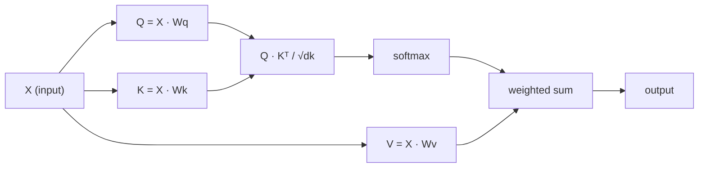

# Une attention personnelle à partir de zéro
# L'attention est de zéro

> L'attention est une table de recherche où chaque mot demande "qui m'importe?"  et apprend la réponse.

> Attention est une feuille de recherche, chacun des mots est en question " Qui est important pour moi ? "

> **【中文解读】**L'attention à soi est le cœur du Transformer: Q*K^T  calculer chaque jeton sur l'attention des autres jetons ⋅ comprendre Q/K/V ⋅ intuition est la base de la compréhension de GPT/BERT⋅

**Type:** Build | **类型:** 动手
**Language:**Je suis un Python .**语言:**Python
**Prerequisites:** Phase 3 (Deep Learning Core), Phase 5 Lesson 10 (Sequence-to-Sequence) | **前置知识:** 阶段 3（深度学习基础），阶段 5 第 10 课（序列到序列）
**Time:** ~90 minutes | **时间:** ~90 分钟

## Objectifs d'apprentissage

- Implementer l'auto-attention du produit doté à l'échelle de la base en utilisant uniquement NumPy, y compris les projections de requête/clés/valeurs et la somme pondérée par softmax
   utiliser uniquement NumPy de zéro à réaliser un accroissement de points de concentration, y compris la requête/key/value projection et softmax plus de pouvoir de demander et
- Construisez une couche d'attention multi-têtes qui divise les têtes, calculer l'attention parallèle et concatenates les résultats
   Construire plusieurs couches d'attention, réaliser la division de la tête 并行注意力计算和结果拼接
- Suivez comment la matrice d'attention capture les relations de jetons et expliquez pourquoi l'échelle par sqrt(d_k) empêche la saturation de softmax
  追踪注意力矩阵 comment capturer des jetons 关系,并解释为什么除以d_k) 能防止软max 和
- Appliquer un masque causal pour convertir l'attention bidirectionnelle en une attention autorégressive (à la manière du décodeur)
  应用因果掩码将双向注意力转换为自归归 (attirer l'attention)

## Le problème , l' introduction du problème

Les RNN traitent les séquences d'un jeton à la fois. Au moment où vous atteignez le jeton 50, les informations du jeton 1 ont été compressées à travers 50 étapes de compression. Les dépendances à longue portée sont écrasées dans un état caché de taille fixe  un goulet d'étranglement que aucune quantité de mise en service LSTM ne résout complètement.

> RNN  Token par token  Processing sequence ⋅ Lorsque vous arrivez à la 50e token ⋅ lorsque vous arrivez à la 50e token ⋅, les informations provenant de la 1e token ⋅ ont été compressées 50 fois ⋅ la longueur dépendante est compressée en un état caché de taille fixe ⋅ c'est la LSTM ⋅ contrôle impossible à résoudre complètement ⋅

Le document de 2014 Bahdanau a montré la solution: laisser le décodeur regarder en arrière à chaque position d'encodeur et décider laquelle d'entre elles compte pour l'étape actuelle. Mais il était toujours coincé sur un RNN. Le document de 2017 "Attention est tout ce dont vous avez besoin" a posé une question plus pointue: et si l'attention est le *seul* mécanisme ? Pas de récurrence. Pas de convolutions.

> L'article de Bahdanau attention attention de 2014 a montré une méthode de révision: faire en sorte que le décodeur recueille chaque position du codeur, et décider quelles sont les étapes actuelles importantes. Mais il est toujours ajouté au RNN.

L'auto-attention permet à chaque position d'une séquence de prendre soin de chaque autre position en une seule étape parallèle.

> La prise de conscience de chaque position dans la séquence est la conséquence de la rapidité et de la prédominance du Transformer.

> **【中文解读】**La révolution du RNN consiste à abandonner complètement le cycle, en utilisant un seul mécanisme de l'attention.

## Le concept de base.

### La recherche de base de données analogique de recherche de base de données

Pensez à l'attention comme à une recherche de base de données douce:

> Pour une recherche de données, il faut utiliser les données suivantes:

```
Traditional database:
  Query: "capital of France"  -->  exact match  -->  "Paris"

Attention:
  Query: "capital of France"  -->  similarity to ALL keys  -->  weighted blend of ALL values
```

Chaque jeton génère trois vecteurs:
- **Query (Q)**"Que suis-je à la recherche ?"
  **查询 (Query, Q)**"Je suis à la recherche de quoi ?"
- **Key (K)**"Que contiens-je ?"
  **键 (Key, K)**"Je contiens quoi ?"
- **Value (V)**: "Quelles informations dois-je fournir si elles sont sélectionnées?"
  **值 (Value, V)**"Si on est élu, que vous donnerai-je ?"

Le produit de point entre une requête et toutes les touches produit des scores d'attention.

> 查询与所有键的点积产生注意分数. 高分 signifie "ceci est un élément correspondant à ma requête".

> **【中文解读】**Le classement de base de données de l'attention est la meilleure façon de comprendre Q/K/V. Q est "je cherche quoi", K est "je possède quoi", V est "mon contenu réel". Q et K sont des points de mesure de la correspondance, du softmax, du retrait du poids, du V, du fait de la recherche de droits et du fait que le processus entier est une opération de "soft search" minuscule.

> **【拓展：注意力机制在真实系统中的应用】**GPT 系列 utilise l'effet de l'attention de soi ((( chaque jeton seulement peut voir le jeton précédent);BERT utilise le double sens de l'attention de soi ((( chaque jeton 能看到所有的 jeton);交叉注意力(Cross-Attention) 则在T5、Stable Diffusion等模型中连接编码器和编码器──理解Q/K/V是理解所有这些变体的基础──

### Q, K, V calcul

Chaque embedding de jeton est projeté à travers trois matrices de poids apprises:

> Chaque jeton est projeté à travers trois matrices de poids:

```
Input embeddings (sequence of n tokens, each d-dimensional):

  X = [x1, x2, x3, ..., xn]       shape: (n, d)

Three weight matrices:

  Wq  shape: (d, dk)
  Wk  shape: (d, dk)
  Wv  shape: (d, dv)

Projections:

  Q = X @ Wq    shape: (n, dk)      each token's query
  K = X @ Wk    shape: (n, dk)      each token's key
  V = X @ Wv    shape: (n, dv)      each token's value
```

Visuellement, pour une seule preuve:

> Pour un symbole:

```
             Wq
  x_i ------[*]------> q_i    "What am I looking for?"
       |
       |     Wk
       +----[*]------> k_i    "What do I contain?"
       |
       |     Wv
       +----[*]------> v_i    "What do I offer?"
```

### La Matrice de l'attention

Une fois que vous avez Q, K, V pour tous les jetons, les scores d'attention forment une matrice:

> Une fois que vous avez tous les symboles Q K V, attention fractionnées forme une matrice:

```
Scores = Q @ K^T    shape: (n, n)

              k1    k2    k3    k4    k5
        +-----+-----+-----+-----+-----+
   q1   | 2.1 | 0.3 | 0.1 | 0.8 | 0.2 |   <- how much q1 attends to each key
        +-----+-----+-----+-----+-----+
   q2   | 0.4 | 1.9 | 0.7 | 0.1 | 0.3 |
        +-----+-----+-----+-----+-----+
   q3   | 0.2 | 0.6 | 2.3 | 0.5 | 0.1 |
        +-----+-----+-----+-----+-----+
   q4   | 0.9 | 0.1 | 0.4 | 1.7 | 0.6 |
        +-----+-----+-----+-----+-----+
   q5   | 0.1 | 0.3 | 0.2 | 0.5 | 2.0 |
        +-----+-----+-----+-----+-----+

Each row: one token's attention over the entire sequence
```

### Pourquoi Scale ? Pourquoi réduire ?
Regardez une requête à la fois balayer les touches: chaque rangée marque chaque jeton, softmax transforme les scores en poids, et le vecteur de contexte est le mélange pondéré de valeurs.

```figure
attention-matrix
```

### Pourquoi l'échelle ?

Les produits de point augmentent avec la dimension dk. Si dk = 64, les produits de point peuvent être dans la plage des dizaines, poussant le softmax dans les régions où les gradients disparaissent.

> Si le point de concentration est de 64, le point de concentration peut être dans la limite de quelques dizaines, il sera doux max dans la zone de disparition de la gradience.

```
Scaled scores = (Q @ K^T) / sqrt(dk)
```

Cela maintient les valeurs dans une plage où softmax produit des gradients utiles.

> Cela permet de maintenir la valeur dans la limite de la température utile de la douceur maximale.

> **【中文解读】**缩放因子 1/sqrt(dk) est un élément clé mais facilement négligé.

### Softmax transforme les scores en poids

Softmax convertit les scores bruts en une distribution de probabilité sur chaque rangée:

> Softmax va transformer le nombre de points d'origine en répartition de probabilité par ligne:

```
Raw scores for q1:   [2.1, 0.3, 0.1, 0.8, 0.2]
                            |
                         softmax
                            |
Attention weights:   [0.52, 0.09, 0.07, 0.14, 0.08]   (sums to ~1.0)
```

Chaque symbole a un ensemble de poids indiquant combien de temps il faut pour chaque autre symbole.

> Aujourd'hui, chaque symbole a un groupe de poids, indiquant le degré de préoccupation de chaque autre symbole.

> **【拓展：注意力矩阵的可解释性】**Attention réaction () est un outil important de la recherche transformer explicative. En utilisant le pouvoir de l'attention visualisé, on peut trouver le modèle appris.

### La somme des valeurs pondérée de la valeur de l'addition et de la demande

La sortie finale de chaque jeton est une somme pondérée de tous les vecteurs de valeur:

> La sortie finale de chaque jeton est la plus-value de tous les vecteurs:

```
output_i = sum( attention_weight[i][j] * v_j  for all j )

For token 1:
  output_1 = 0.52 * v1 + 0.09 * v2 + 0.07 * v3 + 0.14 * v4 + 0.08 * v5
```

### Une pipeline complète.



Formule en une seule ligne:

> Une seule formule:

```
Attention(Q, K, V) = softmax( Q @ K^T / sqrt(dk) ) @ V
```

## Construisez-le et mettez-le en œuvre.
```figure
softmax-attention-scaling
```

## Faites-le

### Étape 1: Softmax à partir de zéro

Softmax convertit les logits bruts en probabilités.

> Softmax va transformer les logits originaux en probabilité. Réduire la valeur maximale pour assurer la stabilité numérique.

```python
import numpy as np

def softmax(x):
    shifted = x - np.max(x, axis=-1, keepdims=True)
    exp_x = np.exp(shifted)
    return exp_x / np.sum(exp_x, axis=-1, keepdims=True)

logits = np.array([2.0, 1.0, 0.1])
print(f"logits:  {logits}")
print(f"softmax: {softmax(logits)}")
print(f"sum:     {softmax(logits).sum():.4f}")
```

### Étape 2: Attention à l'échelle du produit

La fonction de base prend les matrices Q, K, V et renvoie la sortie d'attention plus la matrice de poids.

> 核心函数──接收 Q、K、V 矩阵, retourner à la attention de sortie et du poids de la matrice──

```python
def scaled_dot_product_attention(Q, K, V):
    dk = Q.shape[-1]
    scores = Q @ K.T / np.sqrt(dk)
    weights = softmax(scores)
    output = weights @ V
    return output, weights
```

### Étape 3: Classe d'auto-attention avec des projections apprises

Un module complet d'auto-attention avec des matrices de poids Wq, Wk, Wv initialisées avec une mise à l'échelle Xavier.

> Un module complet d'auto-attention, comprenant Wq、Wk、Wv 权重矩阵, à l'aide de Xavier 式缩放初始化──

```python
class SelfAttention:
    def __init__(self, d_model, dk, dv, seed=42):
        rng = np.random.default_rng(seed)
        scale = np.sqrt(2.0 / (d_model + dk))
        self.Wq = rng.normal(0, scale, (d_model, dk))
        self.Wk = rng.normal(0, scale, (d_model, dk))
        scale_v = np.sqrt(2.0 / (d_model + dv))
        self.Wv = rng.normal(0, scale_v, (d_model, dv))
        self.dk = dk

    def forward(self, X):
        Q = X @ self.Wq
        K = X @ self.Wk
        V = X @ self.Wv
        output, weights = scaled_dot_product_attention(Q, K, V)
        return output, weights
```

### Étape 4: Exécutez-le sur une phrase.

Créez de faux emblèmes pour une phrase et regardez les poids de l'attention.

> Pour une phrase créant une faux emplacement, observer attention

```python
sentence = ["The", "cat", "sat", "on", "the", "mat"]
n_tokens = len(sentence)
d_model = 8
dk = 4
dv = 4

rng = np.random.default_rng(42)
X = rng.normal(0, 1, (n_tokens, d_model))

attn = SelfAttention(d_model, dk, dv, seed=42)
output, weights = attn.forward(X)

print("Attention weights (each row: where that token looks):\n")
print(f"{'':>6}", end="")
for token in sentence:
    print(f"{token:>6}", end="")
print()

for i, token in enumerate(sentence):
    print(f"{token:>6}", end="")
    for j in range(n_tokens):
        w = weights[i][j]
        print(f"{w:6.3f}", end="")
    print()
```

### Étape 5: Visualiser l'attention avec une carte de chaleur ASCII. Étape 5: utiliser l'ASCII 热力图可视化注意力

Mettez les poids d'attention sur les personnages pour une vue rapide.

> Réglage de l'attention en caractères pour une visualisation rapide.

```python
def ascii_heatmap(weights, tokens, chars=" ░▒▓█"):
    n = len(tokens)
    print(f"\n{'':>6}", end="")
    for t in tokens:
        print(f"{t:>6}", end="")
    print()

    for i in range(n):
        print(f"{tokens[i]:>6}", end="")
        for j in range(n):
            level = int(weights[i][j] * (len(chars) - 1) / weights.max())
            level = min(level, len(chars) - 1)
            print(f"{'  ' + chars[level] + '   '}", end="")
        print()

ascii_heatmap(weights, sentence)
```

## Utilisez-le avec le cadre de réalisation

Le PyTorch's `nn.MultiheadAttention`fait exactement ce que nous avons construit, plus la division multi-tête et la projection de sortie:

> PyTorch de `nn.MultiheadAttention`Nous avons réalisé notre projet, en plus de plusieurs projets de décomposition et de sortie:

```python
import torch
import torch.nn as nn

d_model = 8
n_heads = 2
seq_len = 6

mha = nn.MultiheadAttention(embed_dim=d_model, num_heads=n_heads, batch_first=True)

X_torch = torch.randn(1, seq_len, d_model)

output, attn_weights = mha(X_torch, X_torch, X_torch)

print(f"Input shape:            {X_torch.shape}")
print(f"Output shape:           {output.shape}")
print(f"Attention weight shape: {attn_weights.shape}")
print(f"\nAttn weights (averaged over heads):")
print(attn_weights[0].detach().numpy().round(3))
```

La différence clé: l'attention multi-tête exécute plusieurs fonctions d'attention en parallèle, chacune avec ses propres projections Q, K, V de taille dk = d_modèle / n_têtes, puis concaténage les résultats. Cela permet au modèle d'attendre simultanément différents types de relation.

> 关键区别:多头注意力并行运行多头注意力函数, chacun ayant son propre Q、K、V 投影,大小为 dk = d_model / n_heads, puis拼接结果──这让模型能同时关注不同类型的关系──

> **【中文解读】**PyTorch de `nn.MultiheadAttention`Envelopper toute la logique que nous réalisons à partir de zéro, en plus de la division et de la production de projections. L'avantage de la concentration de plusieurs têtes est de faire en sorte que le modèle se concentre simultanément sur différents types de relations.

> **【拓展：多头注意力的生物学类比】**La prise de plusieurs points d'attention peut être comparée à un détecteur de plusieurs caractéristiques de la cortex visuel. Comme dans la région V1, les différents neurones de la région testent les bordures, les directions, les couleurs, les différents points d'attention apprennent à capturer différents types de symboles.

## Envoyez-le . Produit .

Cette leçon donne:
- `outputs/prompt-attention-explainer.md` une invitation à expliquer l'attention par l'intermédiaire d'une analogie de recherche de base de données

> 本课产生:
> - `outputs/prompt-attention-explainer.md`                                                                                                                                                                                                                                                              

## Les exercices

1. Modifier `scaled_dot_product_attention`pour accepter une matrice de masque facultative qui fixe certaines positions à l'infini négatif avant softmax (c'est ainsi que fonctionne le masquage causal/décodage)
   修改 `scaled_dot_product_attention`Pour accepter une matrice de masque optionnelle, dans le softmax, certains positions seront mises en position négative.

2. Implémenter l'attention multi-têtes à partir de zéro: diviser Q, K, V en `n_heads`les morceaux, faire attention à chacun, concatener, et projeter à travers une matrice de poids final Wo
   De la réalisation de la multitude d'attention: va Q、K、V  décomposer en `n_heads`块,分别运行注意力,拼接,并通过最终权重矩阵 Wo 投影

3. Prenez deux phrases différentes de la même longueur, les nourrissez à travers la même instance de l'Atention à soi, et comparez leurs modèles d'attention. Quels changements? Qu'est-ce qui reste le même?
   Prenez deux phrases différentes de la même longueur, par le même exemple, et comparez leur mode d'attention.

## Les termes clés

| Term | What people say / 人们怎么说 | What it actually means / 实际含义 |
|------|------------------------------|----------------------------------|
| Query (Q) | "The question vector" / "问题向量" | A learned projection of the input that represents what information this token is looking for. 输入的学习投影，表示这个 token 在寻找什么信息。 |
| Key (K) | "The label vector" / "标签向量" | A learned projection that represents what information this token contains, matched against queries. 学习投影，表示这个 token 包含什么信息，与查询匹配。 |
| Value (V) | "The content vector" / "内容向量" | A learned projection carrying the actual information that gets aggregated based on attention scores. 学习投影，携带根据注意力分数聚合的实际信息。 |
| Scaled dot-product attention | "The attention formula" / "注意力公式" | softmax(QK^T / sqrt(dk)) @ V — scaling prevents softmax saturation in high dimensions. softmax(QK^T / sqrt(dk)) @ V — 缩放防止高维时 softmax 饱和。 |
| Self-attention | "The token looks at itself and others" / "token 看自己和其他 token" | Attention where Q, K, V all come from the same sequence, letting every position attend to every other position. Q、K、V 都来自同一序列的注意力，让每个位置关注所有其他位置。 |
| Attention weights | "How much focus" / "多少关注" | A probability distribution over positions, produced by softmax over scaled dot products. 位置上的概率分布，由缩放点积上的 softmax 产生。 |
| Multi-head attention | "Parallel attention" / "并行注意力" | Running multiple attention functions with different projections, then concatenating results for richer representations. 使用不同投影运行多个注意力函数，然后拼接结果以获得更丰富的表示。 |

## Encore une lecture

- [Attention Is All You Need (Vaswani et al., 2017)](https://arxiv.org/abs/1706.03762) le papier transformateur original
  Vaswani 等人(2017)  原始 Transformer 论文

- [The Illustrated Transformer (Jay Alammar)](https://jalammar.github.io/illustrated-transformer/) la meilleure visite visuelle de l'architecture complète
  Jay Alammar's visibilité Transformer                                                                                                                                                                                                                                                           

- [The Annotated Transformer (Harvard NLP)](https://nlp.seas.harvard.edu/annotated-transformer/) mise en œuvre de PyTorch ligne par ligne avec explications
  Harvard NLP 注释版 Transformer  逐行 PyTorch 实现与解释

> **【拓展：Flash Attention 与注意力优化】**L'attention flash est essentielle dans les applications réelles de la GPT-4 en 128K.
