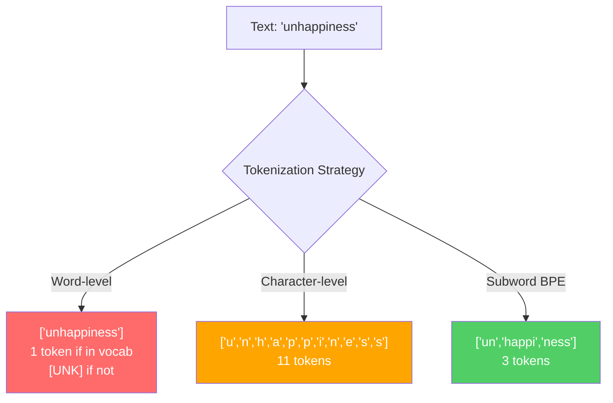
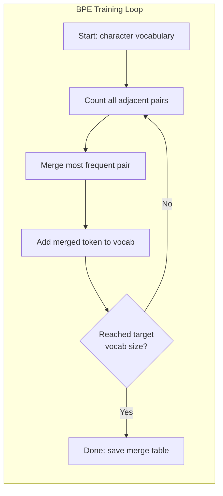
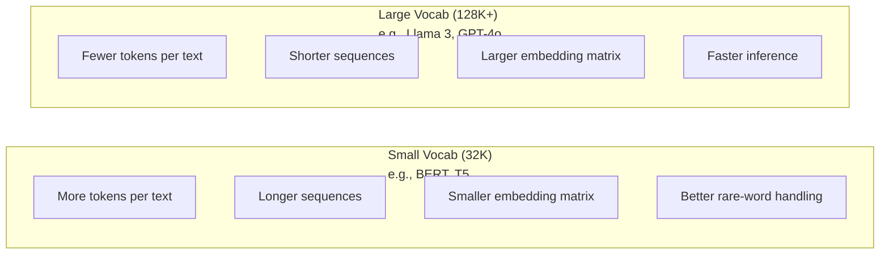

# Les jetons: BPE, WordPiece, SentencePiece

> Votre LLM ne lit pas l'anglais, il lit les nombres entiers. Le tokenizer décide si ces nombres entiers ont une signification ou le gaspillent.

> **【中文解读】**LLM 不读英文,它读整数──分词器决定这些整数是有意义还是浪费──子词分词(subword tokenization) entre les classes de mots et les classes de caractères trouver un équilibre:

> **【拓展：BPE→GPT系列】**Tous les modèles d'OpenAI(GPT-2、GPT-3、GPT-4) utilisent tous les BPE 分词器──tiktoken est la liste des mots de la série GPT──分词质量 directement affecté sur le taux d'utilisation de la fenêtre ci-dessous"malheureusement" 拆分4 token vs 1 token, équivaut à 75% de la fenêtre ci-dessous.

**Type:** Build
**Languages:** Python
**Prerequisites:** Phase 05 (NLP Foundations)
**Time:** ~90 minutes

## Objectifs d'apprentissage

- Implémenter des algorithmes de jetonage BPE, WordPiece et Unigram à partir de zéro et comparer leurs stratégies de fusion
  De la réalisation à zéro BPE、WordPiece 和 Unigram 分词算法, comparer leurs stratégies de fusion
- Expliquez comment la taille du vocabulaire affecte l'efficacité du modèle: trop petit crée de longues séquences, trop grand déchet incrustant des paramètres
  解释词表大小如何影响模型效率: trop petit pour produire de longues séquences, trop gros pour débourser
- Analyse des objets de tokenization dans les langues et les codes, en identifiant les endroits où des tokenizers spécifiques se décomposent
  Analyse des limites des mots et des mots dans les différents langages et codes, pour trouver les points de défaillance d'un outil de désignation spécifique
- Utilisez les bibliothèques de jetons et de pièces de phrase pour symboliser le texte et inspecter les identifiants de jetons résultants
  Utiliser un jeton et une phrase 库分词文本并检查生成的代码

> **【中文解读】**L'objectif de ce chapitre est d'étudier autour des quatre dimensions du mot: réaliser la rédaction manuelle du BPE/WordPiece/Unigram 算法) ‧ comprendre le mot: ‧ calculer le mot: ‧ analyser le mot: ‧ appliquer le mot: ‧ appliquer le mot: ‧ appliquer le mot: ‧ appliquer le mot: ‧ appliquer le mot: ‧ appliquer le mot: ‧ appliquer le mot: ‧ appliquer le mot: ‧ appliquer le mot: ‧ appliquer le mot: ‧ appliquer le mot: ‧ appliquer le mot: ‧ appliquer le mot: ‧ appliquer le mot: ‧ appliquer le mot: ‧ appliquer le mot: ‧ appliquer le mot: ‧ appliquer le mot: ‧ appliquer le mot: ‧ appliquer le mot: ‧ appliquer le mot: ‧ appliquer le mot: ‧ appliquer le mot: ‧ appliquer le mot: ‧ appliquer le mot: ‧ appliquer le mot: ‧ appliquer le mot: ‧ appliquer le mot:                                                                                                                                                                                                                                                         

## Le problème , l' introduction du problème

Votre LLM ne lit pas l'anglais, il ne lit aucune langue, il lit les chiffres.

> Votre LLM ne lit pas en anglais.

Le vide entre "Hello, world!" et [15496, 11, 995, 0] est le jeton. Chaque mot, chaque espace, chaque marque de ponctuation doit être converti en un entier avant qu'un modèle puisse le traiter. Cette conversion n'est pas neutre.

> "Salut, monde!" et [15496, 11, 995, 0] entre les ponts est un mot à mot. Chaque mot, chaque espace, chaque point de symbole doit être transformé en un nombre entier, le modèle peut le traiter.

Si vous vous trompez, votre modèle gaspille la capacité de codage des mots communs avec plusieurs jetons. "malheureusement" devient quatre jetons au lieu d'un. Votre fenêtre de contexte 128K a rétréci de 75% pour le texte lourd en mots multiesyllabiques. Faites-le bien et la même fenêtre contextuelle contient deux fois plus de sens. La différence entre "ce modèle gère bien le code" et "ce modèle étouffe Python" se résume souvent à la façon dont le tokeniseur a été formé.

> Faites une erreur, votre modèle va gaspiller la capacité de plusieurs tokens 编码常见词语── "malheureusement" 变成 quatre tokens et non un seul── vous avez réduit directement la fenêtre de 128K de code pour un texte à volume intensif de plusieurs sons── faites face, de même la fenêtre de code peut télécharger deux fois plus de données──" ce modèle traite bien le code " et " ce modèle est en Python 上卡 " entre autres, souvent dépendant de la façon dont le partage des mots est entraîné──

Chaque appel d'API que vous faites à GPT-4 ou Claude est évalué par jeton. Chaque jeton que votre modèle génère coûte de calcul. Plus le nombre de jetons requis pour représenter une sortie est faible, plus l'inférence de bout en bout est rapide.

> Vous utilisez chaque fois GPT-4 ou l'API de Claude sont en fonction du coût des jetons. Chaque jeton généré par votre modèle consomme des jetons.

> **【中文解读】**Le mot "partage" n'est pas un simple préprocessage, mais une partie de l'architecture du modèle. Chaque fois que l'API GPT-4 est utilisée, chaque mot génère une consommation d'argent.

> **【拓展：API 定价与分词效率】**GPT-4o                                                                                                                                                                                                                                                                                                                                                                                                                                                                                                                          $5/M input tokens、$Les jetons de sortie 15/M. Dans le même contexte, GPT-2 分词器可能消耗500 jetons, GPT-4o's o200k_base 分词器 seulement besoin d'environ 200 jetons, le coût différent de 2,5 fois.

>  **【前置】**Pour les besoins de la formation, il est nécessaire de se préparer à la formation et à la formation.

## Le concept de base.

### Trois méthodes qui ont échoué (et une qui a gagné)

Il y a trois façons évidentes de convertir le texte en chiffres.

> Il existe trois méthodes évidentes pour convertir le texte en numérique.

**Word-level tokenization**Le mot "cat sat" devient simple. Mais qu'en est-il de la "tokenization"? ou "GPT-4o"? ou d'un mot composé allemand comme "Geschwindigkeitsbegrenzung"? Le niveau des mots nécessite un vocabulaire massif pour couvrir chaque mot dans chaque langue.`[UNK]`token -- la façon dont le modèle dit "je n'ai aucune idée de ce que c'est". L'anglais seul a plus d'un million de formes de mots. Ajoutez du code, des URL, des notations scientifiques et 100 autres langues et vous avez besoin d'un vocabulaire infini.

> **词级分词**Le chat s'est assis et s'est mis à se séparer. Mais la "tokenization" est très simple.`[UNK]`En anglais seulement, il y a plus d'un million de mots en forme, plus de code, d'URL, de numéros de données scientifiques et de 100 autres langues, vous avez besoin d'un nombre illimité de mots.

**Character-level tokenization**Le vocabulaire est minuscule (quelques centaines de caractères). Aucun jeton inconnu jamais. Mais les séquences deviennent extrêmement longues. Une phrase qui serait de 10 jetons au niveau de mots devient de 50 jetons au niveau de caractères. Le modèle doit apprendre que "t", "h", "e" ensemble signifient "le" - la capacité d'attention brûlante sur quelque chose que l'homme apprend à l'âge de trois ans.

> **字符级分词**走向另一个极端──"hello" 变成 ["h", "e", "l", "l", "o"]──词表很小(几百个字符)──永远不会出现未知符号──但序列变得极长──一个10个词级符号的句子变成50个字符级符号──模型必须学会"t",、"h"、"e"组合起来是"把注意力容量浪费在人类三岁就学会的事上──

**Subword tokenization**Les mots communs restent entiers: "le" est un symbole. Les mots rares se décomposent en morceaux significatifs: "malheur" devient ["un", "happy", "ness"]. Le vocabulaire reste gérable (30K à 128K de jetons). Les séquences restent courtes. Les jetons inconnus disparaissent essentiellement parce que n'importe quel mot peut être construit à partir de morceaux de sous-parts.

> **子词分词**找到了最佳平衡点──常见词保持完整:"the" 是一个代币──罕见词分解为有意义的片段:"unhappy" 变成 ["un", "happy", "ness"]──词表保持在可控范围(30K到128K 个代币)──序列保持简短──未知代币 基本消失,因为任何词都可以由子词片段构建──

> **【中文解读】**Le problème est que le mot est un mot qui a un niveau de "t" + "h" + "e" (en anglais: "t" + "h" + "e") et qui est un mot qui a un niveau de "t" + "h" + "e" (en anglais: "t" + "h" + "e") et qui est un mot qui a un niveau de "t" + "h" + "e" (en anglais: "t" + "h" + "e") et qui est un mot qui a un niveau de "t" + "h" + "e" (en anglais: "t" + "h" + "e") et qui est un mot qui a un niveau de "t" + "h" (en anglais: "t") et un niveau de "t" (en anglais: "t") et un niveau de "t" (en anglais: "t") et un niveau de "t" (en anglais: "t") sont des mots qui sont des mots qui sont des mots qui sont des mots qui sont des mots qui sont des mots qui sont des mots qui sont des mots qui sont des mots qui sont des mots qui sont des mots qui sont des mots qui sont des mots qui sont des mots qui sont des mots qui sont des mots qui sont des mots qui sont des mots qui sont des mots qui sont des mots qui sont des mots qui sont des mots qui sont des mots qui sont des mots qui sont des mots qui sont des mots qui sont des mots qui sont des mots qui sont des mots qui sont des mots qui sont des mots qui sont des mots qui sont des mots qui sont des mots qui sont des mots qui sont des mots qui sont des mots qui sont des mots qui sont des mots qui sont des mots qui sont des mots qui sont des mots qui sont des mots qui sont des mots qui sont des mots qui sont des mots qui sont des mots qui sont des mots qui sont des mots qui sont des mots qui sont des mots qui sont des mots qui sont des mots qui sont des mots qui sont des mots qui sont des mots qui sont des mots qui sont des mots qui sont des mots qui sont des mots qui sont des mots qui sont des mots qui sont des mots qui sont des mots qui sont des mots qui sont des mots qui sont des mots qui sont des mots qui sont des mots qui sont des mots qui sont des mots qui sont des mots qui

>  **【类比】**Le mot "B" est "B" et "B" est "B" et "B" est "B" et "B" est "B" et "B" est "B" et "B" est "B" et "B" est "B" et "B" sont "B" et "B" sont "B" et "B" sont "B" et "B" sont "B" et "B" sont "B" et "B" sont "B" et "B" sont "B" et "B" sont "B" et "B" sont "B" et "B" sont "B" et "B" sont "B" et "B" sont "B" et "B" sont "B" et "B" sont "B" sont "B" et "B" sont "B" sont "B" et "B" sont "B" sont "B" sont "B" et "B" sont "B" sont "B" sont "B" sont "B" et "B" sont "B" sont "B" sont "B" sont "B" sont "B" sont "B" et "B" sont "B" sont "B" sont "B" sont "B" sont "B" sont "B" sont "B" sont "B" sont "B" sont "B" sont "B" sont "B" sont "B" sont "B" sont "B" sont "B" sont "B" sont "B" sont "B" sont "B" sont "B" sont "B" sont "B" sont "B" sont "B" sont "B" sont "B" sont "B" sont "B" sont "B" sont "B" sont "B" sont "B" sont "B" sont "B" sont "B" sont "B" sont "B" sont "B" sont "B" sont "B" sont "B" sont "B" en "B" ont "B" ont "B" ont "B" ont "B" ont "B" ont "B" ont "B" ont "B" ont "B" ont "B" ont "B" ont "B" ont "B" ont "B" ont "B" ont "B" ont "B" en "B" ont "B" ont "B" ont

Chaque LLM moderne utilise la symbolisation de sous-parts. GPT-2, GPT-4, BERT, Llama 3, Claude - tous. La question est de savoir quel algorithme.

> Chaque LLM moderne utilise des mots différents.



### BPE: Codage par paire de octets

BPE est un algorithme de compression avide réutilisé pour la tokenization.

> Le BPE est un algorithme de compression de la grammaire réutilisé pour les mots.

Commencez par des caractères individuels. Comptez chaque paire adjacente dans le corpus d'entraînement. Fusez la paire la plus fréquente dans un nouveau jeton. Répétez jusqu'à ce que vous atteigniez la taille de votre vocabulaire cible.

> De simples caractères à partir de la fréquence de l'apparition de tous les caractères voisins dans le langage.
```figure
tokenizer-bpe
```

Voici le BPE sur un petit corpus avec les mots "inférieur", "inférieur" et "nouveau":

```
Corpus (with word frequencies):
  "lower"  x5
  "lowest" x2
  "newest" x6

Step 0 -- Start with characters:
  l o w e r       (x5)
  l o w e s t     (x2)
  n e w e s t     (x6)

Step 1 -- Count adjacent pairs:
  (e,s): 8    (s,t): 8    (l,o): 7    (o,w): 7
  (w,e): 13   (e,r): 5    (n,e): 6    ...

Step 2 -- Merge most frequent pair (w,e) -> "we":
  l o we r        (x5)
  l o we s t      (x2)
  n e we s t      (x6)

Step 3 -- Recount and merge (e,s) -> "es":
  l o we r        (x5)
  l o we s t      (x2)    <- 'es' only forms from 'e'+'s', not 'we'+'s'
  n e we s t      (x6)    <- wait, the 'e' before 'we' and 's' after 'we'

Actually tracking this precisely:
  After "we" merge, remaining pairs:
  (l,o): 7   (o,we): 7   (we,r): 5   (we,s): 8
  (s,t): 8   (n,e): 6    (e,we): 6

Step 3 -- Merge (we,s) -> "wes" or (s,t) -> "st" (tied at 8, pick first):
  Merge (we,s) -> "wes":
  l o we r        (x5)
  l o wes t       (x2)
  n e wes t       (x6)

Step 4 -- Merge (wes,t) -> "west":
  l o we r        (x5)
  l o west        (x2)
  n e west        (x6)

...continue until target vocab size reached.
```

La table de fusion est le tokenizer. Pour coder un nouveau texte, appliquez des fusions dans l'ordre dans lequel elles ont été apprises. Le corpus de formation détermine quelles fusions existent, et ce choix façonne définitivement ce que le modèle voit.

> Le code de texte est un code de texte, qui est utilisé dans le modèle de texte.

> **【中文解读】**Le cycle de formation de base du BPE: à partir d'un seul caractère, la fréquence d'apparition de tous les caractères voisins est statistiquement élevée, la fréquence maximale de fusion est de nouveau jeton, la répétition jusqu'à atteindre l'objectif de la mise en forme est la taille du mot.

> **【拓展：BPE 的压缩原理】**BPE est d'abord un algorithme de compression de données générique de 1994[6]. Sennrich et d'autres le lanceront dans le domaine de la PNL en 2016[6]. Dans un environnement de production, TikTok a réalisé BPE dans Rust, une vitesse de codage pouvant atteindre des millions de jetons par seconde[6]. Le codageur cl100k_base de GPT-4 a été entraîné environ 100 000 fois sur des centaines de Go de texte[6].

> ️ **【易错点】**Il y a trois petits insectes:**忘了每次合并后重新计数** directement dans la paire initiale compte 上循环, entraînant la combinaison "nous" 后还在旧频次选 (e,s), résultat la combinaison表全是噪音;(2) **合并顺序错乱** Coding  doit être suivi par l'entraînement  apprendre à fusionner  strictement de bas à haut application, d'abord combiner "th"**未做预分词（pre-tokenization）** directement sur l'ensemble du langage, se produit un "e c" (la "cat" en passant par le langage), entraînement à un langage sans signification.



### BPE de niveau octal (GPT-2, GPT-3, GPT-4)

Le BPE standard fonctionne sur des caractères Unicode. Le BPE de niveau octet fonctionne sur des octets bruts (0-255). Cela vous donne un vocabulaire de base de exactement 256, gère n'importe quel langage ou codage et ne produit jamais un jeton inconnu.

> 标准 BPE 操作 Unicode 字符──字节级 BPE 操作原始字节(0-255)。 Cela vous donne un bon nombre de 256 基础词表, capable de traiter n'importe quel langage ou code, ne produira jamais de jeton inconnu──

GPT-2 a introduit cette approche. Le vocabulaire de base couvre tous les octets possibles. BPE fusionne construit en plus de cela.

> GPT-2 introduit cette méthode. Les mots de base couvrent chaque caractère possible.

> **【中文解读】**Le BPE est un élément clé de l'introduction du GPT-2. La tradition du BPE est de traiter les caractères Unicode, tandis que le BPE est un élément direct de l'exploitation.

> 🤔 **【困惑】**Q: Pourquoi la coordonnée de BPE est-elle si importante? A: la coordonnée est la coordonnée de la coordonnée.**不要修改合并表**, parce qu'il s'intègre dans le modèle 矩阵强绑定改一个代码的代码,模型会输出乱码──需要改词表只能重训分词器 +重训模型嵌入──

- GPT-2: 50 257 jetons
- GPT-3.5/GPT-4: ~100,256 jetons (encoding cl100k_base)
- GPT-4o: 200 019 jetons (encoding de base de 200 k)

### Le code de référence

WordPiece ressemble à BPE mais choisit de fusionner différemment. Au lieu de fréquence brute, il maximize la probabilité des données de formation:

> WordPiece ressemble à BPE, mais la façon de choisir est différente.

```
BPE merge criterion:      count(A, B)
WordPiece merge criterion: count(AB) / (count(A) * count(B))
```

Le BPE demande: " Quel couple apparaît le plus souvent ? " WordPiece demande: " Quel couple apparaît plus souvent ensemble que vous ne le pensez par hasard ? " Cette différence subtile produit différents vocabulaires.

> BPE 问:"Quel est le plus fréquent?"WordPiece 问:"Quel est le plus fréquent de l'apparition de l'un de l'autre au-delà de l'espérance de l'autre?"

WordPiece utilise également un préfixe "##" pour les sous-parts de la continuation:

> WordPiece utilise également "##"

```
"unhappiness" -> ["un", "##happi", "##ness"]
"embedding"   -> ["em", "##bed", "##ding"]
```

Le préfixe "##" vous indique que cette pièce continue un jeton précédent. BERT utilise WordPiece avec un vocabulaire de 30 522 jetons.

> "##" pré vous dire ce film                                                                                                                                                                                                                                                          

### La phrase "Piece" (Llama, T5)

SentencePiece traite les entrées comme un flux brut de caractères Unicode, y compris l'espace blanc. Aucune étape de pré-tokenization. Aucune règle spécifique pour la langue sur les limites des mots. Cela le rend véritablement linguistique - il fonctionne sur le chinois, le japonais, le thaïlandais et d'autres langues où les espaces ne séparent pas les mots.

> SentencePiece sera inséré comme un flux de caractères Unicode original, y compris le code de code de code de code de code de code de code de code de code de code de code de code de code de code de code de code de code de code de code de code de code de code de code de code de code de code de code de code de code de code de code de code de code de code de code de code de code de code de code de code de code de code de code de code de code de code de code de code de code de code de code de code de code de code de code de code de code de code de code de code de code de code de code de code de code de code de code de code de code de code de code de code de code de code de code de code de code de code de code de code de code de code de code de code de code de code de code de code de code de code de code de code de code de code de code de code de code de code de code de code de code de code de code de code de code de code de code de code de code de code de code de code de code de code de code de code de code de code de code de code de code de code de code de code de code de code de code de code de code de code de code de code de code de code de code de code de code de code de code de code de code de code de code de code de code de code de code de code de code de code de code de code de code de code de code de code de code de code de code de code de code de code de code de code de code de code de code de code de code de code de code de code de code de code de code de code de code de code de code de code de code de code de code de code de code de code de code de code de code de code de code de code de code de code de code de code de code de code de code de code de code de code de code de code de code de code de code de code de code de code de code de code de code de code de code de code de code de code de code de code de code de code de code de code de code de code de code de code de code de code de code de code de code de code de code de code de code de code de code de code de code de code de code de code de code

SentencePiece prend en charge deux algorithmes:

> La phrase "Piece" est une expression de l'expression "Piece"

- **BPE mode**: la même logique de fusion que la BPE standard, appliquée aux séquences de caractères bruts
  Le mot grec traduit par " le mot grec "**BPE 模式**: Conformément à la norme BPE, la logique de couplings est utilisée pour la séquence de caractères originaux
- **Unigram mode**Le contraire de BPE - prune au lieu de fusionner.
  Le mot grec traduit par " le mot grec "**Unigram 模式**Le terme "BPE" désigne le terme "BPE" qui désigne le terme "BPE".

Llama 2 utilise SentencePiece BPE avec un vocabulaire de 32 000 jetons. T5 utilise SentencePiece Unigram avec 32 000 jetons.

> Llama 2 使用 SentencePiece BPE,词表为 32,000 个代币――T5 使用 SentencePiece Unigram,词表为 32,000 个代币――注意:Llama 3 切换到了基于 tiktoken的字节级 BPE 分词器,词表为 128,256 个代币――

> **【中文解读】**La particularité de SentencePiece réside dans le fait qu'elle est insérée comme un élément de caractères Unicode original (incluant le vide), ne fait aucun pré-parcours linguistique. Cela la rend très performante en chinois, japonais, taïwan et autres langues. Elle prend en charge deux algorithmes: BPE (auto-support) et Unigram (auto-support).

> **【拓展：SentencePiece 在开源模型中的地位】**Google T5(110 milliards de paramètres)、Llama 2(7B-70B)、Mistral 7B 等开源模型都使用SentencePiece。 Son avantage est qu'il est sans rapport avec la langue avec un seul分词器 il peut traiter 100+ langues sans avoir besoin de règles de pré-traitement spécifiques à n'importe quelle langue。Unigram 模式 possède également un avantage unique: il peut produire plusieurs分词候选人和概率, pour l'entraînement de modèle de rou棒。

### Comptes de taille du vocabulaire

C'est une décision d'ingénierie avec des conséquences mesurables.

> C'est une décision de conception réelle qui a des conséquences mesurables.



Pour un vocabulaire de 128K avec des embeds de 4 096 dimensions, la matrice d'embedding seule est de 128 000 x 4 096 = 524 millions de paramètres. Pour un vocabulaire de 32K, il est de 131 millions de paramètres. C'est une différence de paramètres de 400M par rapport au choix du tokenizer seul.

> Pour les 128K et les 4 096 dimensions de l'intégration, il y a 128.000 x 4 096 = 5.24 milliards de paramètres. Pour les 32K, il y a 1,31 milliards de paramètres.

Mais les vocabulaires plus grands comprennent le texte plus agressivement. Le même paragraphe anglais qui prend 100 jetons avec un vocabulaire de 32K pourrait prendre 70 jetons avec un vocabulaire de 128K. Cela signifie 30% moins de passes avant pendant la génération. Pour un modèle qui répond à des millions de demandes, c'est une réduction directe du coût de calcul.

> Mais un plus grand programme de mots est plus actif en comprimant le texte. Pour les mêmes segments en anglais, les 32K peuvent nécessiter 100 jetons, les 128K peuvent seulement nécessiter 70 jetons. Cela signifie une réduction de 30% de la propagation de la production.

La tendance est claire: les tailles du vocabulaire augmentent. GPT-2 utilise 50 257. GPT-4 utilise environ 100 K. Llama 3 utilise 128 K. GPT-4o utilise 200 K.

> 趋势很明确:词表大小在增长──GPT-2 用 50,257──GPT-4 用约100K──Llama 3 用 128K──GPT-4o 用 200K──

| Model | Vocab Size | Tokenizer Type | Avg Tokens per English Word |
|-------|-----------|----------------|---------------------------|
| BERT | 30,522 | WordPiece | ~1.4 |
| GPT-2 | 50,257 | Byte-level BPE | ~1.3 |
| Llama 2 | 32,000 | SentencePiece BPE | ~1.4 |
| GPT-4 | ~100,256 | Byte-level BPE | ~1.2 |
| Llama 3 | 128,256 | Byte-level BPE (tiktoken) | ~1.1 |
| GPT-4o | 200,019 | Byte-level BPE | ~1.0 |

### La taxe multilingue

Les tokenizers formés principalement en anglais sont brutaux envers les autres langues. Le texte coréen dans le tokenizer de GPT-2 a en moyenne 2-3 tokens par mot. Le chinois peut être pire. Cela signifie qu'un utilisateur coréen a effectivement une fenêtre de contexte qui est la moitié de la taille d'un utilisateur anglais - payant le même prix pour une densité d'information moindre.

> Le langage chinois est très difficile à utiliser. Le langage chinois est en moyenne de 2 à 3 mots par mot. Cela signifie que la moitié des utilisateurs de l'anglais ne paient que le même prix, mais la densité de l'information est plus faible.

C'est pourquoi Llama 3 a quadruplé son vocabulaire de 32 000 à 128 000 Tokens plus dédiés aux scripts non anglais signifie une compression plus équitable entre les langues.

> C'est pourquoi Llama 3 va augmenter le nombre de mots de 32K à 128K. Pour les lettres non anglaises, plus de symboles sont distribués, ce qui signifie une compression plus équitable de la langue transversale.

> **【中文解读】**La taxe sur les langues multiples est le problème d'équité le plus facilement négligé dans la conception de mots-clés. Par exemple, le GPT-2 par mot-clés, le chinois moyen pour chaque mot nécessite 2-3 jetons, le chinois peut être pire. Cela signifie que les utilisateurs de l'anglais ne paient que la moitié du prix, mais la densité de l'information est plus faible.

> **【拓展：多语言分词的实际影响】**Dans le cl100k_base de GPT-3.5 de la classe de mots, un segment de 1000 mots en chinois nécessite environ 1500 jetons, tandis que la quantité d'informations en anglais peut nécessiter seulement ~500 jetons. Cela signifie que l'API de l'utilisateur chinois est constituée de 3 fois plus d'utilisateurs en anglais.

## Construisez-le et mettez-le en œuvre.
```figure
tokenizer-tradeoff
```

## Faites-le

### Étape 1: Tokenizer au niveau des caractères

Un jeton au niveau des caractères cartographiera chaque caractère à son point de code Unicode. Pas besoin de formation. Pas de jetons inconnus.

> Depuis le début, le système de caractères de chaque type sera un code unique.

```python
class CharTokenizer:
    def encode(self, text):
        return [ord(c) for c in text]

    def decode(self, tokens):
        return "".join(chr(t) for t in tokens)
```

"bonjour" devient [104, 101, 108, 108, 111]. Chaque personnage est son propre jeton.

> "Hello" est devenu [104, 101, 108, 108, 111]. Chaque caractère est son propre symbole.

### Étape 2: Tokenizer BPE à partir de zéro

La vraie mise en œuvre. Nous nous entraînons sur les octets bruts (comme GPT-2), compter les paires, fusionner les plus fréquents, et enregistrer chaque fusion dans l'ordre.

> Nous sommes en train de faire des exercices de formation sur le langage original (comme GPT-2), statistique sur le langage courant, et en suivant les enregistrements de l'ordre de chaque fois que nous le faisons.

```python
from collections import Counter

class BPETokenizer:
    def __init__(self):
        self.merges = {}
        self.vocab = {}

    def _get_pairs(self, tokens):
        pairs = Counter()
        for i in range(len(tokens) - 1):
            pairs[(tokens[i], tokens[i + 1])] += 1
        return pairs

    def _merge_pair(self, tokens, pair, new_token):
        merged = []
        i = 0
        while i < len(tokens):
            if i < len(tokens) - 1 and tokens[i] == pair[0] and tokens[i + 1] == pair[1]:
                merged.append(new_token)
                i += 2
            else:
                merged.append(tokens[i])
                i += 1
        return merged

    def train(self, text, num_merges):
        tokens = list(text.encode("utf-8"))
        self.vocab = {i: bytes([i]) for i in range(256)}

        for i in range(num_merges):
            pairs = self._get_pairs(tokens)
            if not pairs:
                break
            best_pair = max(pairs, key=pairs.get)
            new_token = 256 + i
            tokens = self._merge_pair(tokens, best_pair, new_token)
            self.merges[best_pair] = new_token
            self.vocab[new_token] = self.vocab[best_pair[0]] + self.vocab[best_pair[1]]

        return self

    def encode(self, text):
        tokens = list(text.encode("utf-8"))
        for pair, new_token in self.merges.items():
            tokens = self._merge_pair(tokens, pair, new_token)
        return tokens

    def decode(self, tokens):
        byte_sequence = b"".join(self.vocab[t] for t in tokens)
        return byte_sequence.decode("utf-8", errors="replace")
```

La boucle d'entraînement est le noyau de BPE: compter les paires, fusionner le gagnant, répéter.`num_merges`Les résultats de la recherche ont été obtenus en fonction des résultats obtenus.

> Le cycle d'entraînement est au cœur du BPE: statistique sur fréquence, couplings, répétions.`num_merges`轮后,词表 de 256(基础字节) augmenté à 256 + num_merges。

Le codage applique les fusions dans l'ordre exact dans lequel elles ont été apprises. Cela compte. Si la fusion 1 crée "th" et la fusion 5 crée "the", le codage doit d'abord appliquer la fusion 1 afin que "the" puisse se former à partir de "th" + "e" dans la fusion 5.

> Si le code suivant l'apprentissage est en ordre précis, il est important de le mettre en place. Si le code 1 crée le th, le code 5 crée le th, le code doit d'abord être appliqué.

Le décodeur est l'inverse: recherchez chaque identifiant de jeton dans le vocabulaire, concateniez les octets, décodez en UTF-8.

> 解码是逆过程: 在词表中查找每个代币 ID,拼接字节,解码为 UTF-8──

### Étape 3: Encode et décodeur de la route

```python
corpus = (
    "The cat sat on the mat. The cat ate the rat. "
    "The dog sat on the log. The dog ate the frog. "
    "Natural language processing is the study of how computers "
    "understand and generate human language. "
    "Tokenization is the first step in any NLP pipeline."
)

tokenizer = BPETokenizer()
tokenizer.train(corpus, num_merges=40)

test_sentences = [
    "The cat sat on the mat.",
    "Natural language processing",
    "tokenization pipeline",
    "unhappiness",
]

for sentence in test_sentences:
    encoded = tokenizer.encode(sentence)
    decoded = tokenizer.decode(encoded)
    raw_bytes = len(sentence.encode("utf-8"))
    ratio = len(encoded) / raw_bytes
    print(f"'{sentence}'")
    print(f"  Tokens: {len(encoded)} (from {raw_bytes} bytes) -- ratio: {ratio:.2f}")
    print(f"  Roundtrip: {'PASS' if decoded == sentence else 'FAIL'}")
```

Le ratio de compression vous indique l'efficacité du tokenizer. Un ratio de 0,50 signifie que le tokenizer a comprimé le texte à la moitié du nombre de jetons que les octets bruts. Plus bas, c'est mieux. Sur le corps d'entraînement, le rapport sera bon. Sur le texte hors distribution comme "malheur" (qui ne figure pas dans le corpus), le rapport sera pire - le tokenizer revient à l'encodage au niveau des caractères pour les modèles invisibles.

> Le taux de compression est de 0,50 pour le nombre de caractères originaux. Le taux de compression est de 0,50 pour le nombre de caractères originaux.

### Étape 4: Comparer avec tiktoken

```python
import tiktoken

enc = tiktoken.get_encoding("cl100k_base")

texts = [
    "The cat sat on the mat.",
    "unhappiness",
    "Hello, world!",
    "def fibonacci(n): return n if n < 2 else fibonacci(n-1) + fibonacci(n-2)",
    "Geschwindigkeitsbegrenzung",
]

for text in texts:
    our_tokens = tokenizer.encode(text)
    tiktoken_tokens = enc.encode(text)
    tiktoken_pieces = [enc.decode([t]) for t in tiktoken_tokens]
    print(f"'{text}'")
    print(f"  Our BPE:   {len(our_tokens)} tokens")
    print(f"  tiktoken:  {len(tiktoken_tokens)} tokens -> {tiktoken_pieces}")
```

TikTok utilise exactement le même algorithme mais entraîné sur des centaines de gigaoctets de texte avec 100 000 fusions. L'algorithme est identique. La différence est les données de formation et le nombre de fusions. Votre tokeniseur entraîné sur un paragraphe avec 40 fusions ne peut pas rivaliser avec les 100K de tiktoken fusion sur un corpus massif. Mais le mécanisme est le même.

> Tiktoken utilise le même algorithme, mais il a été entraîné 100 000 fois sur 100 Go de texte. L'algorithme est le même. La différence réside dans le nombre de fois où il a été entraîné.

### Étape 5: Analyse du vocabulaire

```python
def analyze_vocabulary(tokenizer, test_texts):
    total_tokens = 0
    total_chars = 0
    token_usage = Counter()

    for text in test_texts:
        encoded = tokenizer.encode(text)
        total_tokens += len(encoded)
        total_chars += len(text)
        for t in encoded:
            token_usage[t] += 1

    print(f"Vocabulary size: {len(tokenizer.vocab)}")
    print(f"Total tokens across all texts: {total_tokens}")
    print(f"Total characters: {total_chars}")
    print(f"Avg tokens per character: {total_tokens / total_chars:.2f}")

    print(f"\nMost used tokens:")
    for token_id, count in token_usage.most_common(10):
        token_bytes = tokenizer.vocab[token_id]
        display = token_bytes.decode("utf-8", errors="replace")
        print(f"  Token {token_id:4d}: '{display}' (used {count} times)")

    unused = [t for t in tokenizer.vocab if t not in token_usage]
    print(f"\nUnused tokens: {len(unused)} out of {len(tokenizer.vocab)}")
```

Cela révèle la distribution Zipf dans votre vocabulaire. Quelques jetons dominent (espaces, "le", "e"). La plupart des jetons sont rarement utilisés. Les jetons de production optimisent cette distribution - les modèles communs obtiennent des identifiants de jetons courts, les modèles rares obtiennent des représentations plus longues.

> **【中文解读】**L'analyse de la classe de production révèle que la loi de la distribution de Zipf: une minorité de jetons occupe la majeure partie de l'utilisation de la plupart des jetons.

> **【拓展：生产环境的词表优化】**Le GPT-4o a 200 019 symboles, mais les 1000 symboles les plus courants couvrent environ 80% de la fréquence d'émergence du texte en anglais quotidien.

## Utilisez-le avec le cadre de réalisation

Votre BPE fonctionne, voyez à quoi ressemblent les outils de production.

> Votre BPE est en train de fonctionner.

### Tickets (OpenAI)

```python
import tiktoken

enc = tiktoken.get_encoding("cl100k_base")

text = "Tokenizers convert text to integers"
tokens = enc.encode(text)
print(f"Tokens: {tokens}")
print(f"Pieces: {[enc.decode([t]) for t in tokens]}")
print(f"Roundtrip: {enc.decode(tokens)}")
```

tiktoken est écrit en Rust avec des liaisons Python. Il encode des millions de jetons par seconde. Le même algorithme BPE, une mise en œuvre de force industrielle.

> Tiktoken utilisant Rust 编写并提供 Python 绑定──每秒编码数百万代币──同样 BPE 算法,工业级实现──

### Les symboles de visage

```python
from tokenizers import Tokenizer
from tokenizers.models import BPE
from tokenizers.trainers import BpeTrainer
from tokenizers.pre_tokenizers import ByteLevel

tokenizer = Tokenizer(BPE())
tokenizer.pre_tokenizer = ByteLevel()

trainer = BpeTrainer(vocab_size=1000, special_tokens=["<pad>", "<eos>", "<unk>"])
tokenizer.train(["corpus.txt"], trainer)

output = tokenizer.encode("The cat sat on the mat.")
print(f"Tokens: {output.tokens}")
print(f"IDs: {output.ids}")
```

La bibliothèque de jetons Hugging Face est également Rust sous le capot. Elle entraîne BPE sur des corpora à l'échelle de gigabyte en quelques secondes. C'est ce que vous utilisez pour entraîner votre propre modèle.

> Embracer les jetons de visage est aussi la base de la Rust. Il peut entraîner BPE en quelques secondes sur le langage de classe GB.

### Chargement du jeton de Llama

```python
from transformers import AutoTokenizer

tokenizer = AutoTokenizer.from_pretrained("meta-llama/Llama-3.1-8B")

text = "Tokenizers are the unsung heroes of LLMs"
tokens = tokenizer.encode(text)
print(f"Token IDs: {tokens}")
print(f"Tokens: {tokenizer.convert_ids_to_tokens(tokens)}")
print(f"Vocab size: {tokenizer.vocab_size}")

multilingual = ["Hello world", "Hola mundo", "Bonjour le monde"]
for text in multilingual:
    ids = tokenizer.encode(text)
    print(f"'{text}' -> {len(ids)} tokens")
```

Le vocabulaire 128K de Llama 3 comprime le texte non anglais nettement mieux que le vocabulaire 50K de GPT-2. Vous pouvez vérifier cela vous-même - encoder la même phrase dans plusieurs langues et compter les jetons.

> La traduction de l'expression en français de Llama 3 est plus simple que celle de GPT-2.

## Envoyez-le . Produit .

Cette leçon produit `outputs/prompt-tokenizer-analyzer.md`-- une requête réutilisable qui analyse l'efficacité de la jetonisation pour toute combinaison de texte et de modèle.

> 本课产 出 `outputs/prompt-tokenizer-analyzer.md` Un prompt répétable, analyse l'efficacité des mots de chaque texte et de chaque ensemble de modèles.

## Les exercices

1. Modifiez le tokenizer BPE pour imprimer le vocabulaire à chaque étape de fusion. Observez comment "t" + "h" devient "th", puis "th" + "e" devient "the". Suivez comment les mots anglais communs se rassemblent pièce par pièce.
   Suivant le texte de la lettre de référence, le texte de référence est "T" et "H" et "T" est "T" et "T" et "T" et "T" et "T" et "T" et "T" et "T" et "T" et "T" et "T" et "T" et "T" et "T" et "T" et "T" et "T" et "T" et "T" et "T" et "T" et "T" et "T" et "T" et "T" et "T" et "T" et "T" et "T" et "T" et "T" et "T" et "T" et "T" et "T" et "T" et "T" et "T" et "T" et "T" et "T" et "T" et "T" et "T" et "T" et "T" et "T" et "T" et "T" et "T" et "T" et "T" et "T" et "T" et " et "T" et " et "T" et " et " et " et " et " et " et " et " et " et " et " et " et " et " et " et " et " et " et " et " et " et " et " et " et " et " et " et " et " et " et " et " et " et " et " et " et " et " et " et " et " et " et " et " et " et " et " et " et " et " et " et " et " et " et " et " et " et " et " et " et " et " et " et " et " et " et " et " et " et " et " et " et " et " et " et " et " et " " et " et " et " et " " " " " " et " " " " " " et " " " " " " " " " " " " " et " " " " " " " " " " " " " " " " " " " " " " " " " " " " " " " " " " " " " " " " " " " " " " " " " " " " " " " " " " " " " " " "

2. Ajouter des jetons spéciaux (`<pad>`- Je suis là .`<eos>`- Je suis là .`<unk>`) au tokenizer BPE. attribuer les identifiants 0, 1, 2 et déplacer tous les autres tokens en conséquence.
   Le mot "B" est le mot de passe de la langue française.`<pad>`- Je suis là.`<eos>`- Je suis là.`<unk>`)¬ distribuer ID 0、1、2 并相应移动其他代币―― réaliser un pré分词步骤在运行 BPE 前按空格分拆的预分词步骤――

3. Appliquez le critère de fusion WordPiece (ratio de probabilité au lieu de fréquence). Exercez à la fois BPE et WordPiece sur le même corpus avec le même nombre de fusions. Comparer les vocabulaires résultants - lequel produit des sous-words plus significatifs linguistiquement?
   En français, le mot "comparer" est traduit par "comparer" et "comparer" par "comparer".

4. Construisez un benchmark d'efficacité du tokenizer multilingue. Prenez 10 phrases en anglais, espagnol, chinois, coréen et arabe. Tokenize chacune avec un tiktoken (cl100k_base) et mesurez les tokens moyens par caractère. Quantifiez la "taxe multilingue" pour chaque langue.
   Le code de la langue est le code de la langue de l'Arabie saoudite.

5. Prenez votre jeton BPE sur un corpus plus grand (téléchargez un article de Wikipédia). Ajoutez le nombre de fusions pour obtenir un ratio de compression de 10% de tiktoken sur le même texte. Cela vous oblige à comprendre la relation entre la taille du corpus, le nombre de fusions et la qualité de compression.
   Le nombre de fois que vous faites une compression sur le même texte avec un tiktoken ne dépasse pas 10%. Cela vous oblige à comprendre la relation entre la taille du texte, le nombre de fois que vous faites une compression et la qualité de la compression.

## Les termes clés

| Term | What people say | What it actually means | 中文释义 |
|------|----------------|----------------------|---------|
| Token | "A word" | A unit in the model's vocabulary -- could be a character, subword, word, or multi-word chunk | 词元，模型词表中的基本单元 |
| BPE | "Some compression thing" | Byte Pair Encoding -- iteratively merge the most frequent adjacent pair of tokens until the target vocabulary size is reached | 字节对编码，贪心合并最高频相邻对 |
| WordPiece | "BERT's tokenizer" | Like BPE but merges maximize the likelihood ratio count(AB)/(count(A)*count(B)) instead of raw frequency | 基于似然比的子词分词，BERT 使用 |
| SentencePiece | "A tokenizer library" | A language-agnostic tokenizer that operates on raw Unicode without pre-tokenization, supporting BPE and Unigram algorithms | 语言无关的分词库，支持 BPE/Unigram |
| Vocabulary size | "How many words it knows" | The total number of unique tokens: GPT-2 has 50,257, BERT has 30,522, Llama 3 has 128,256 | 词表大小，直接影响嵌入矩阵参数量 |
| Fertility | "Not a tokenizer term" | Average number of tokens per word -- measures tokenizer efficiency across languages (1.0 is perfect, 3.0 means the model works three times harder) | 生育率，每词平均 token 数，衡量分词效率 |
| Byte-level BPE | "GPT's tokenizer" | BPE operating on raw bytes (0-255) instead of Unicode characters, guaranteeing no unknown tokens for any input | 字节级 BPE，基础词表恰好 256 个字节 |
| Merge table | "The tokenizer file" | Ordered list of pair merges learned during training -- this IS the tokenizer, and order matters | 合并表，训练学到的有序合并规则 |
| Pre-tokenization | "Splitting on spaces" | Rules applied before subword tokenization: whitespace splitting, digit separation, punctuation handling | 预分词，子词分词前的规则化拆分 |
| Compression ratio | "How efficient the tokenizer is" | Tokens produced divided by input bytes -- lower means better compression and faster inference | 压缩比，token 数/输入字节数，越低越好 |

## Encore une lecture

- [Sennrich et al., 2016 -- "Neural Machine Translation of Rare Words with Subword Units"](https://arxiv.org/abs/1508.07909)-- le document qui a introduit le BPE pour la PNL, transformant un algorithme de compression de 1994 en la base de la tokenization moderne
- [Kudo & Richardson, 2018 -- "SentencePiece: A simple and language independent subword tokenizer"](https://arxiv.org/abs/1808.06226)-- la symbolisation linguistique-agnostique qui a rendu les modèles multilingues pratiques
- [OpenAI tiktoken repository](https://github.com/openai/tiktoken)-- mise en œuvre de la production BPE dans Rust avec liaisons Python, utilisée par GPT-3.5/4/4o
- [Hugging Face Tokenizers documentation](https://huggingface.co/docs/tokenizers)-- formation en jeton de qualité de production avec performances Rust
