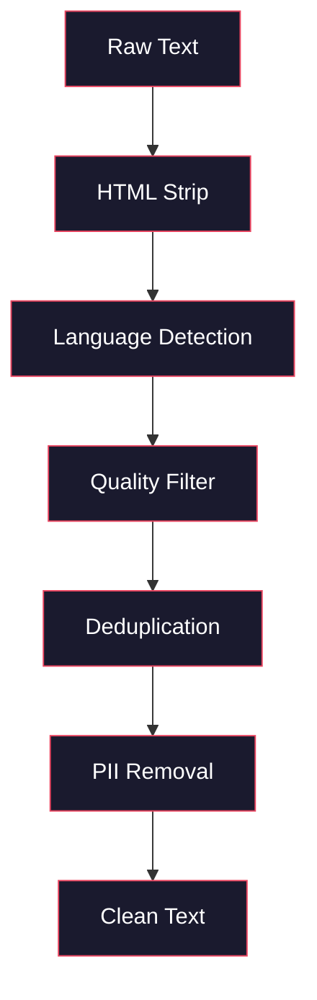
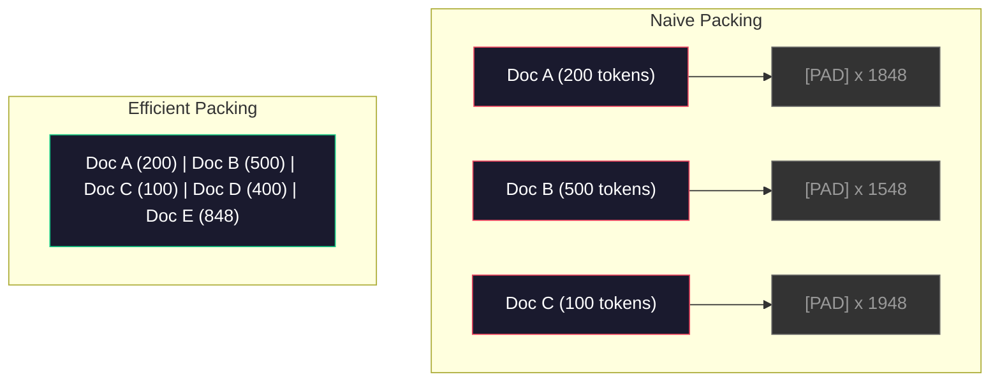

# Les pipelines de données pour la pré-entraînement

> Le modèle est un miroir, il reflète les données que vous lui donnez, il le donne à la poubelle, il reflète la poubelle avec une fluidité parfaite.

> **【中文解读】**Le modèle est un miroir, qui reflète fidèlement les données que vous lui donnez.

> **【拓展：数据质量→GPT-4/Claude】**Les données de préparation de GPT-4 et Claude sont basées sur des tubes de données élaborés avec précision. Les données de préparation de Llama 3 contiennent des jetons 15T, qui sont soumis à des exigences strictes en matière de poids et de qualité.

**Type:** Build
**Languages:** Python
**Prerequisites:** Phase 10, Lessons 01-02 (Tokenizers, Building a Tokenizer)
**Time:** ~90 minutes

## Objectifs d'apprentissage

- Construisez un pipeline de données en streaming qui symbolise, coupe, mélange et batte des téraoctets de texte sans le charger dans la mémoire
  Construire des pipelines de données en cours de production, réaliser des fractions de mots, des fractions de blocs, des troubles et des fractions de traitement, sans avoir besoin de tout charger dans la mémoire
- Implementer des filtres de qualité des données (déduplication, détection de langage, filtrage du contenu) utilisés dans des pipelines de pré-formation réelles
  实现真实预训管线中使用的数据质量过器(去重、语言检测、内容过)
- Créer des séquences d'entraînement de longueur fixe avec des masques d'attention appropriés et une manipulation des limites des documents
  Créer une séquence d'entraînement à longueur fixe avec une concentration correcte de cache et de traitement des limites de documents
- Le débit de pipeline de profil pour s'assurer que le chargement de données suit la vitesse d'entraînement de la GPU
  Analyse de la capacité de charge des données et de la vitesse de formation de la GPU

> **【中文解读】**Le programme de formation de l'équipe de formation de formation de base de données est basé sur la formation de l'équipe de formation de base de données de base de base de données de base de base de données de base de base de données de base de base de données.

## Le problème , l' introduction du problème

Vous avez un tokenizer, maintenant vous avez besoin de données.

> Tu as un détachement de mots.

Pas un ensemble de données, pas un fichier CSV. Des téraoctets de texte - nettoyés, déduplicés, filtrés pour la qualité, jetonés en séquences de longueur fixe, et servis en lots aléatoires assez rapidement que votre cluster de 8 GPU n'attend jamais le prochain lot.

> Il s'agit d'un ensemble de données, non de CSV, mais de plusieurs fichiers. Le nombre de TB est passé par le nettoyage, le dépôt, la qualité, la séquence de données, et le service est fourni en série.

La plupart des gens pensent que la formation d'un LLM concerne l'architecture du modèle. Ce n'est pas le cas. Llama 3 a utilisé 15,6 billions de jetons. GPT-3 a utilisé 300 milliards. DeepSeek-V2 a utilisé 8,1 billions. L'architecture dans les trois est à peu près la même: blocs de transformateur empilés avec des couches d'attention et de rétroaction. La différence de qualité de sortie provient largement des données.

> La plupart des gens pensent que le train LLM est sur l'architecture de modèle. Il n'est pas de la. Llama 3 utilise 15,6 milliards de jetons. GPT-3 utilise 3000 milliards. DeepSeek-V2 utilise 8,1 milliards.

Le papier de Chinchilla de DeepMind a fait cela précisément. Pour un budget informatique donné, il existe un ratio optimal des paramètres du modèle aux jetons de formation. Chinchilla a montré que la plupart des modèles en 2022 étaient considérablement sous-trainés -- ils avaient trop de paramètres pour la quantité de données qu'ils voyaient. Un modèle de paramètre 70B formé sur 1,4 billions de jetons (Chinchilla-optimal) a dépassé un modèle 280B formé sur 300 milliards de jetons (Gopher).

> Le thème de Chinchilla de DeepMind l'explique avec précision. Pour un budget de calcul donné, le rapport entre les paramètres de modèle et les jetons de formation est le plus élevé. Chinchilla montre que la plupart des modèles de 2022 sont très peu entraînés.

Votre pipeline de données détermine si votre modèle apprend le langage ou apprend le bruit.

> Votre système de données détermine si votre modèle d'apprentissage est le langage ou le bruit.

> **【中文解读】**Le projet de Chinchilla (DeepMind 2022) prouve que, dans le cadre d'un budget d'algorithmes fixes, le nombre de modèles et de jetons de formation devraient être égal à un taux de croissance. Le modèle de 70B de Llama 3 est en 15,6 T. Le taux de réussite est le plus élevé, mais Meta a constaté que le coût de calcul des modèles de ce type de " surentraînement " est plus faible.

> **【拓展：数据混合比的工程经验】**Les données de formation de GPT-4 sont censées contenir une grande quantité de code (améliorer la capacité de raisonnement) et de documents académiques (améliorer la précision des faits) (environ 50%).

>  **【前置】**學本節前Please first master:(1) Phase 10·01 和 02(分词器) 理解令和字节流;(2) Phase 10·01 提到的Chinchilla scaling law理解参数与令数的最佳比例;(3) Python 生成器 / `IterableDataset`- Je suis là .`datasets.stream`流式处理范式;(4) MinHash + LSH 近似去重算法(不熟悉请先看Llama 3 / RefinedWeb 论文的相关章节)

## Le concept de base.

### D'où viennent les données

Chaque grand modèle de langage est formé sur un mélange de sources. La composition exacte est un secret gardé de près pour la plupart des laboratoires, mais nous savons assez pour comprendre les catégories.

> Chaque grand modèle de langage est formé sur des sources de données mixtes. La plupart des laboratoires ont des secrets de composition exacts, mais nous en savons assez pour comprendre les catégories.

| Source | Size | Quality | Used By |
|--------|------|---------|---------|
| Common Crawl | ~250 TB raw | Low (needs heavy filtering) | GPT-3, Llama, most open models |
| Wikipedia | ~20 GB | High | Every major LLM |
| GitHub code | ~1 TB+ | Medium (lots of duplicates, dead code) | StarCoder, CodeLlama, DeepSeek-Coder |
| Books (BookCorpus, Pile) | ~100 GB | High | GPT-2, GPT-3, early models |
| Academic papers (arXiv, S2ORC) | ~100 GB | High for STEM | Llama, Galactica |
| StackOverflow, Reddit | ~100 GB | Medium | Llama, Falcon |
| Curated web (C4, RefinedWeb) | ~5 TB | Medium-High (pre-filtered) | T5, Falcon |

Llama 3 a révélé son mix de données: environ 50% de données Web, 25% de code, 13% de livres et de documents académiques, 8% de données mathématiques et 4% de données Web multilingues.

> Llama 3 a publié son ratio de données: environ 50% webpage data、25% code、13% bookbook and academic paper、8% mathématiques data et 4% multilingual webpage data── un total de 15,6 milliards de tokens, provenant de plus de 5 TB de sources de données du texte original──

Le rapport importe autant que la taille totale. Trop de données Web et le modèle devient un perroquet Reddit. Trop peu de code et il ne peut pas programmer. Trop peu de mathématiques et il échoue à raisonner.

> Par exemple, il est tout aussi important que le total de taille. Les données de la page Web sont trop nombreuses, le modèle devient Reddit. Le code est trop petit, il ne sera pas programmé. Les données mathématiques sont trop petites, il échouera dans la logique.

### Nettoyage des données

Les données web sont sales.

> Un type de référencement de la page Web est très simple.

- Étiquettes HTML et JavaScript
  Le code HTML et JavaScript
- Titres de chaudières, pieds, menus de navigation
  Le nom de l'équipe de formation est le nom de la formation de formation.
- Pages dupliquées (exactes et quasi-duplicées)
  Le récit de la première partie de la série est écrit en français.
- Spam généré par machine
  Le contenu de la déchets généré par les machines
- Les informations personnelles (PII)
  Nom de l'auteur:
- Textes de mauvaise qualité (listes de mots clés, spam de référencement)
  Le mot "réseau" est traduit par "réseau" (réseau)
- Contenu non texte codé en texte
  Traduction anglaise:编码为文本的非文本内容

Le nettoyage n'est pas facultatif. C'est la différence entre un modèle qui génère des paragraphes cohérents et un modèle qui produit des balises HTML mélangées à des listes de produits.

> Le nettoyage n'est pas optional. C'est la différence entre le modèle de génération de segments continu et le modèle de l'étiquette HTML mixte de sortie et de la liste de produits.

>  **【类比】**Le problème est que les données de l'équipement de traitement des eaux usées sont en train de se détériorer. Il est possible de les utiliser pour les besoins de l'équipement de traitement des eaux usées.



Chaque étape élimine une catégorie de bruit:

> Chaque étape pour éliminer un type de bruit:

**HTML stripping:**Retirez tous les balises. Gardez seulement le contenu visible du texte.`trafilatura`ou `readability`extraire le contenu de l'article tout en éliminant la navigation, les annonces et la plaque de chauffage.

> **HTML 剥离：**移除所有标记──只保留可见文本内容──`trafilatura`Ou `readability`Écoutez-moi, je vais vous dire ce que vous avez à dire.

**Language detection:**Utilisez le modèle d'identification de langue de fastText (lid.176.bin) pour classer chaque document. Filtrez à vos langues cibles. Un document classé comme anglais avec moins de 0,8 confiance n'est probablement pas un anglais pur.

> **语言检测：**Utilisez le modèle de reconnaissance de langage FastText (lid.176.bin) pour chaque document dans une catégorie de langage.

**Quality filtering:**C'est là que cela devient intéressant. RefinedWeb (le jeu de données derrière Falcon) utilise un filtre basé sur la perplexité: entraîne un petit modèle de langage sur Wikipedia, puis marque chaque document.

> **质量过滤：**C'est une partie intéressante. Le RefinedWeb utilise des filtres basés sur la confusion: entraînez un petit modèle de langue sur Wikipédia, puis faites un classement sur chaque article.

**Deduplication:**Le simple pas de nettoyage le plus impactant. Common Crawl contient un nombre énorme de pages dupliquées - des déductions légales, des avis de cookie, des conditions d'utilisation.

> **去重：**影响最大的清洗步骤──Common Crawl 包含大量重复页面法律声明、cookie 通知、服务条款── entraîner le calcul des dépenses sur les données de répétition, peut également entraîner des mémoires et des séquences spécifiques de répétition.

**PII removal:**Nom, adresse e-mail, numéro de téléphone, numéro de sécurité sociale, détection basée sur Regex pour les données personnelles structurées, modèles NER pour les noms dans le contexte.

> **PII 移除：**姓名、电子邮件地址、电话号码、社会安全号码──结构化 PII 用正则检测,上下文中的姓名用 NER 模型──

> **【中文解读】**Le nettoyage des données est le plus difficile mais le plus important de tous les entraînements. Les données de la page Web originale sont remplies de bruit: HTML 标签,导航菜单,机器生成的SEO 垃圾,个人隐私信息(PII) ❏ Le nettoyage du tuyau est effectué en fonction de l'exécution: HTML 剥离 → 语言检测 → 质量过 → 去重 → PII 移除.

> **【拓展：去重的工程影响】**Le rapport de l'équipe de Llama a permis de ré-déménager environ 38% des données de pages Web. Plus de trois tiers des pages de la recherche commune sont répliquées ou approximatives.

> ️ **【易错点】**Il y a quatre cratères:**整库加载进内存** Le`datasets.load_dataset("common_crawl", split="train")`默认会实例化                                                                                                                                                                                                                                                                                                                                                                                                                                                                                                                       `streaming=True`Ou `IterableDataset`;(2) **去重时把"高密度优质内容"误删**文档 A 包含整篇 Wikipedia(5KB),文档 B 只是引用一句话的博客(500 字),MinHash 误判为高相似度──修复:在围之前对每篇文档归归一化长度,或对小文档用更保守的值;(3) **打包（pack）跨文档 attention 漏 mask**把3 篇短文拼拼进2048代币,但没有添加文件边界面具,第1 末尾的代币 会"看到"第2 开头的代币,造成跨文档污染;修复:使用 FlashAttention 的 `varlen`接口 ou masque d'attention à diagonale de bloc;**配比（mix）在 epoch 间漂移**shffle 时按"文档级"而不是"token 级"采样, résultat小文档被过度采样、大文档缺采样──

### Déduplication avec MinHash

La déduplication exacte est facile: hash chaque document, supprimer les duplicates. Mais les duplicates proches sont le vrai problème. Deux copies du même article d'actualité avec des annonces légèrement différentes autour de lui sont des duplicates proches. Le contenu est 95% identique, mais ils diffèrent par octet.

> 精确去重很简单: pour chaque article, la répétition est un problème, mais la répétition approximative est la seule vraie question.

Le MinHash + Hashing sensible à la localisation (LSH) résoudra cela efficacement.

> MinHash + 局部敏感哈希(LSH) 高效地 résolu ce problème.


L' idée:

> 核心思想:

1. **Shingling:**Convertir chaque document en un ensemble de n-grammes (par exemple, 5 grammes de mots ou de caractères). "le renard brun rapide" avec une tige de 3 mots devient {"le renard brun rapide", "le renard brun rapide"}.
   Le mot grec traduit par " le mot grec "**Shingling：**Pour les autres, il est nécessaire de prendre en compte les caractéristiques de la couleur de la couleur de la couleur.

2. **MinHash:**Pour chaque ensemble de bardeaux de document, calculer les valeurs de hash k. Chaque valeur de hash est le minimum de hash sur tous les bardeaux de fonction hash différente. Cela crée une " signature " de taille fixe qui approximate la similitude de Jaccard entre les deux documents.
   Le mot grec traduit par " le mot grec "**MinHash：**Pour chaque document, la barre de caractères est la plus petite de toutes les pièces de caractères, ce qui crée une " signature " de taille fixe, qui est proche de la similitude de Jaccard de n'importe quel document.

3. **LSH:**Les documents de groupe en seins basés sur des bandes de signature MinHash. Les documents dans le même seins sont des candidats presque duplicés. Cela évite de comparer chaque paire - vous ne comparez que les candidats.
   Le mot grec traduit par " le mot grec "**LSH：**Selon MinHash  signé 条带将文档分组到桶中──文档在同一桶中的文档是候选人近似重复──这避免了两两比较只比较候选人对──

4. **Verify:**Pour chaque paire candidate, calculer la similitude exacte de Jaccard.
   Le mot grec traduit par " le mot grec "**验证：**Pour chaque candidat, calculer la similitude de Jaccard. Si la similitude dépasse la valeur de la candidature, elle est généralement de 0,8, le dédoublement d'une copie.

L'équipe de Llama a rapporté avoir supprimé environ 38% de leurs données Web par déduplication. Ce n'est pas un petit nombre. Plus d'un tiers du Common Crawl est du contenu dupliqué ou presque dupliqué.

> Le rapport de l'équipe de recherche Llama a permis de ré-déménager environ 38% des données de la page Web. Ce n'est pas un petit chiffre.

### L'emballage de séquences

Votre modèle s'attend à des séquences d'entrée de longueur fixe. Vos documents sont de longueur variable. Certains sont de 50 jetons. Certains sont de 50 000 jetons.

> Votre modèle s'attend à fixer la longueur de la séquence d'entrée.

Approche naïve: remplissez chaque document à la longueur maximale de la séquence. Cela gaspille d'énormes calculs sur les jetons de remplissage qui ne contribuent à rien à l'apprentissage.

> 朴素方法: va remplir chaque document jusqu'à la plus grande longueur de séquence.

Une meilleure approche: emballer plusieurs documents dans une seule séquence, séparés par des jetons de fin de séquence. Une séquence de jetons 2048 peut contenir trois documents courts concatenés avec des jetons [EOS] entre eux.

> Mieux vaut: mettre plusieurs documents en un seul séquence, mettre un terme au séquence, séparer le symbole. Un séquence de 2048 peut contenir trois documents courts, mettre un lien au milieu avec le symbole [EOS].

> 🤔 **【困惑】**Q: 既然 l'emballage 会跨文档污染, pourquoi ne pas utiliser directement le rembourrage?多浪费点算力换正确性不是更稳定吗? A: Parce que le pré-entraînement calculé est extrêmement cherLlama 3 训练成本估计10亿美元。Packing Placez le taux de remplissage moyen de la séquence de ~40% avec rembourrage) augmenté à ~95%+, c'est comme couper le coût de l'entraînement de plus de la moitié (((environ 5000 000 USD)。 La bonne pratique n'est pas de revenir au rembourrage masque, mais avec le document limite(FlashAttention de`cu_seqlens`Ou attention à la diagonale de bloc) permettez à la requête de la première partie de la requête de la seconde partie de la requête de la deuxième partie de la requête de la seconde partie de la requête de la seconde partie de la requête de la seconde partie de la requête de la seconde partie de la requête de la seconde partie de la requête de la seconde partie de la requête de la première partie de la requête de la première partie de la requête de la seconde partie de la requête de la seconde partie de la requête de la seconde partie de la requête de la seconde partie de la requête de la première partie de la requête de la première partie de la requête de la seconde partie de la requête de la seconde partie de la requête de la première partie de la requête de la première partie de la requête de la première partie de la requête de la première partie de la requête de la seconde partie de la requête de la première partie de la requête de la première partie de la requête de la première partie de la requête de la première partie de la requête de la première partie de la requête de la première partie de la requête de la première partie de la requête de la requête de la première partie de la requête de la première partie de la requête de la première partie de la requête de la requête de la première partie de la requête de la première partie de la requête de la requête de la première partie de la requête de la requête de la première partie de la requête de la requête de la première partie de la requête de la requête de la première partie de la requête de la requête de la requête de la requête de la première partie de la requête de la requête de la première partie de la requête de la requête de la requête de la requête de la première partie de la requête de la requête de la requête de la requête de la requête de la requête de la requête de la requête de la requête de la requête de la première partie de la requête de la requête de la requête.



Le masque d'attention doit être correctement réglé. Les jetons du document A ne doivent pas être associés aux jetons du document B dans la même séquence de paquets.

> Attention cache doit être correctement configuré. Le jeton de document A ne doit pas être pris en compte dans le même ordre de couverture.

Les documents longs sont tronqués ou divisés en morceaux aux limites de la séquence. Le point de séparation compte: la séparation au milieu de la phrase oblige le modèle à voir des pensées incomplètes.

> 长文档在序列边界处被切断或分成块──分分点很重要:在句子中分分迫使模型看到不完整的思想──一些管线在可能时将分点对齐到段落或句子边界──

> **【中文解读】**L'emballage de séquences est une technique de remplissage de documents à longueur fixe. Une méthode simple consiste à utiliser le PAD pour remplir des calculs. Une méthode efficace consiste à utiliser plusieurs documents à courte durée.

> **【拓展：Chinchilla 定律与过度训练】**La loi de Chinchilla considère que les paramètres et les symboles de formation des modèles sont en croissance. Mais les 70B de Llama 3 sont en train de s'entraîner sur des symboles 15T (environ 1,4T), c'est une stratégie de "souvenir le meilleur": le coût de formation de plusieurs espèces est une seule fois, mais le coût de service de modèles plus petits est en permanence réduit.

### La loi de l'échelle de Chinchilla

Pour un budget calculé fixe C (mesuré en PFL), la taille optimale du modèle N et la taille du jeu de données D sont les suivantes:

> Pour un budget de calcul fixe (C(à mesure des FLOP), le modèle le plus optimal est le:

```
N_opt ~ C^0.5
D_opt ~ C^0.5
```

En pratique, cela signifie que vous devez étaler la taille du modèle et la taille du jeu de données à peu près de la même manière.

> En pratique, cela signifie que vous devriez étendre le modèle en grandeur et en taille de données en grandeur de proportion.

| Model | Parameters | Training Tokens | Chinchilla-Optimal? |
|-------|-----------|----------------|-------------------|
| GPT-3 | 175B | 300B | No (undertrained 3-4x) |
| Chinchilla | 70B | 1.4T | Yes (by design) |
| Llama 2 | 70B | 2T | Overtrained (intentionally) |
| Llama 3 | 70B | 15T | Heavily overtrained |

Llama 3 viole délibérément la loi de Chinchilla. Meta a constaté que la surentraînement sur plus de données - bien au-delà du rapport calcul-optimal - produit de meilleurs modèles pour l'inférence. Le coût de formation supplémentaire est payé une fois, mais le modèle plus petit est moins cher à servir à jamais. Cela est parfois appelé l'approche d'échelle "inférence-optimal", et il est devenu la norme de l'industrie depuis 2024.

> Llama 3 a fait de son propre gré une violation de la loi de Chinchilla. La méthode de méta-trouvée utilisant plus de données à l'excès de formation  loin au-delà du calcul le meilleur pourcentage  peut produire de meilleurs modèles . Le coût supplémentaire de formation ne coûte qu'une seule fois, mais les modèles plus petits sont permanemment plus abordables .

## Construisez-le et mettez-le en œuvre.
```figure
l5-data-pipeline
```

## Faites-le

### Étape 1: Nettoyer le texte

Nous allons utiliser un texte de domaine public (Projet Gutenberg) comme notre petit corpus.

> 剥离 HTML、归一化空白、移除文本内容──我们将使用公共领域文本 (古堡计划) 作为小型语料──

```python
import re

def clean_text(text):
    text = re.sub(r"<[^>]+>", "", text)
    text = re.sub(r"http\S+", "", text)
    text = re.sub(r"[^\x20-\x7E\n]", "", text)
    text = re.sub(r"\n{3,}", "\n\n", text)
    text = re.sub(r" {2,}", " ", text)
    return text.strip()

def quality_filter(text, min_words=50, max_ratio_caps=0.3, max_ratio_special=0.1):
    words = text.split()
    if len(words) < min_words:
        return False
    caps_ratio = sum(1 for w in words if w.isupper()) / len(words)
    if caps_ratio > max_ratio_caps:
        return False
    special_chars = sum(1 for c in text if not c.isalnum() and not c.isspace())
    if special_chars / max(len(text), 1) > max_ratio_special:
        return False
    return True
```

Le filtre de qualité capture le spam SEO (ALL CAPS), le bruit généré par machine (ratio de caractères spéciaux élevé) et les pages de contenu (trop courtes). Ces trois contrôles seuls éliminent une quantité surprenante de déchets des crawls Web.

> 质量过器捕获 SEO 垃圾(全大写) 机器生成的噪音(高特殊字符比例) 和存根页面(太短) ⋅ Les trois contrôles permettent de dégager une grande quantité de déchets du grattage de la page web.

### Étape 2: Déduplication de MinHash

Mettre en œuvre MinHash à partir de zéro. Aucune bibliothèque externe n'est nécessaire... juste`hashlib`- Je suis désolé .

> De la réalisation de MinHash.`hashlib`Il y a une autre.

```python
import hashlib
from collections import defaultdict

def get_shingles(text, k=5):
    words = text.lower().split()
    if len(words) < k:
        return set()
    return {" ".join(words[i:i+k]) for i in range(len(words) - k + 1)}

def minhash_signature(shingles, num_hashes=128):
    signature = []
    for i in range(num_hashes):
        min_hash = float("inf")
        for shingle in shingles:
            h = int(hashlib.sha256(f"{i}:{shingle}".encode()).hexdigest(), 16)
            min_hash = min(min_hash, h)
        signature.append(min_hash)
    return signature

def lsh_buckets(signature, bands=16):
    rows_per_band = len(signature) // bands
    buckets = []
    for b in range(bands):
        start = b * rows_per_band
        band_data = tuple(signature[start:start + rows_per_band])
        bucket_hash = hashlib.md5(str(band_data).encode()).hexdigest()
        buckets.append((b, bucket_hash))
    return buckets

def deduplicate(documents, threshold=0.8, num_hashes=128, bands=16):
    signatures = []
    shingle_sets = []
    for doc in documents:
        shingles = get_shingles(doc)
        shingle_sets.append(shingles)
        signatures.append(minhash_signature(shingles, num_hashes))

    bucket_map = defaultdict(list)
    for doc_idx, sig in enumerate(signatures):
        for band_id, bucket_hash in lsh_buckets(sig, bands):
            bucket_map[(band_id, bucket_hash)].append(doc_idx)

    duplicate_pairs = set()
    for bucket_docs in bucket_map.values():
        if len(bucket_docs) < 2:
            continue
        for i in range(len(bucket_docs)):
            for j in range(i + 1, len(bucket_docs)):
                duplicate_pairs.add((bucket_docs[i], bucket_docs[j]))

    removed = set()
    for i, j in duplicate_pairs:
        if i in removed or j in removed:
            continue
        s1, s2 = shingle_sets[i], shingle_sets[j]
        if not s1 or not s2:
            continue
        jaccard = len(s1 & s2) / len(s1 | s2)
        if jaccard >= threshold:
            removed.add(j)

    return [doc for idx, doc in enumerate(documents) if idx not in removed], len(removed)
```

Le `num_hashes=128`et `bands=16`Les paramètres contrôlent le compromis de rappel de précision. Plus de haches donnent des estimations de similitude plus précises. Plus de bandes augmentent le rappel (capture plus de duplicates) au coût de plus de faux positifs. Ces valeurs fonctionnent bien pour le texte Web typique.

> `num_hashes=128`et `bands=16`参数 control accuracy-callback rate balance 更多哈希值 更多哈希值 更多哈希值 更多条带增加召回率 更多条带增加召回率 更多重复 更多重复 更多重复 更多重复 更多重复 更多重复 更多重复 更多重复 更多重复 更多重复 更多重复 更多重复 更多重复 更多重复 更多重复 更多重复 更多重复 更多重复 更多重复 更多重复 更多重复 更多重复 更多重复 更多重复 更多重复 更多重复 更多重复 更多重复 更多重复 更多重复 更多重复 更多重复 更多重复 更多重复 更多重复 更多重复 更多重复 更多重复 更多重复 更多重复 更多重复 更多重复 更多重复 更多重复 更多重复 更多重复 更多重复 更多重复 更多 更多 更多 更多 更多 更多 更多 更多 更多 更多 更多 更多 更多 更多 更多 更多 更多 更多 更多 更多 更多 更多 更多 更多 更多 更多 更多 更多 更多 更多 更多 更多 更多 更多 更多 更多 更多 更多 更多 更多 更多 更多 更多 更多 更多 更多 更多 更多 更多 更多 更多 更多 更多 更多 更多 更多 更多 更多 更多 更多 更多 更多 更多 更多 更多 更多 更多 更多 更多 更多 更多 更多 更多 更多 更多 更多 更多 更多 更多 更多 更多 更多 更多 更多 更多 更多 更多 更多 更多 更多 更多 更多 更多 更多 更多   更多 更多 更多  更多 更多     更多 更多    更多                                                          

### Étape 3: Symboliser et emballer les séquences

Prenez le texte propre et déduplicé, le symbolisez et le faites en séquences de longueur fixe pour l'entraînement.

> 取清洗、去重后的文本,分词,打包为固定长度序列用于训练──

```python
def tokenize_corpus(documents, tokenizer):
    all_tokens = []
    for doc in documents:
        tokens = tokenizer.encode(doc)
        all_tokens.extend(tokens)
        all_tokens.append(tokenizer.eos_id)
    return all_tokens

def pack_sequences(token_ids, seq_length, pad_id=0):
    sequences = []
    attention_masks = []
    for i in range(0, len(token_ids), seq_length):
        seq = token_ids[i:i + seq_length]
        mask = [1] * len(seq)
        if len(seq) < seq_length:
            pad_count = seq_length - len(seq)
            seq = seq + [pad_id] * pad_count
            mask = mask + [0] * pad_count
        sequences.append(seq)
        attention_masks.append(mask)
    return sequences, attention_masks
```

### Étape 4: DataLoader pour la formation

Il faut produire des lots de séquences randomisées.

> Les données de la formation sont données par le cycle de consommation.

```python
import random

class PreTrainingDataLoader:
    def __init__(self, sequences, attention_masks, batch_size, shuffle=True):
        self.sequences = sequences
        self.attention_masks = attention_masks
        self.batch_size = batch_size
        self.shuffle = shuffle

    def __len__(self):
        return (len(self.sequences) + self.batch_size - 1) // self.batch_size

    def __iter__(self):
        indices = list(range(len(self.sequences)))
        if self.shuffle:
            random.shuffle(indices)
        for start in range(0, len(indices), self.batch_size):
            batch_idx = indices[start:start + self.batch_size]
            batch_seqs = [self.sequences[i] for i in batch_idx]
            batch_masks = [self.attention_masks[i] for i in batch_idx]
            yield batch_seqs, batch_masks
```

### Étape 5: Statistiques des ensembles de données

Comptez les nombres qui comptent: total de jetons, jetons uniques, ratio de compression, distribution de longueur du document.

> 計算关键指标: 总代币 数、唯一代币 数、压缩比、文档长度分布──

```python
from collections import Counter

def compute_statistics(documents, token_ids, sequences, tokenizer_vocab_size):
    total_chars = sum(len(d) for d in documents)
    total_tokens = len(token_ids)
    unique_tokens = len(set(token_ids))
    compression_ratio = total_chars / total_tokens

    doc_lengths = [len(d.split()) for d in documents]
    avg_doc_length = sum(doc_lengths) / max(len(doc_lengths), 1)
    max_doc_length = max(doc_lengths) if doc_lengths else 0
    min_doc_length = min(doc_lengths) if doc_lengths else 0

    token_counts = Counter(token_ids)
    top_tokens = token_counts.most_common(10)

    non_pad_tokens = sum(sum(1 for t in seq if t != 0) for seq in sequences)
    total_positions = sum(len(seq) for seq in sequences)
    utilization = non_pad_tokens / max(total_positions, 1)

    stats = {
        "total_documents": len(documents),
        "total_characters": total_chars,
        "total_tokens": total_tokens,
        "unique_tokens": unique_tokens,
        "vocab_utilization": unique_tokens / tokenizer_vocab_size,
        "compression_ratio": compression_ratio,
        "avg_doc_length_words": avg_doc_length,
        "max_doc_length_words": max_doc_length,
        "min_doc_length_words": min_doc_length,
        "num_sequences": len(sequences),
        "sequence_utilization": utilization,
        "top_10_tokens": top_tokens,
    }
    return stats
```

Le ratio de compression indique à quel point le tokenizer est efficace sur ce corpus. Le texte anglais est généralement comprimé à environ 3-4 caractères par token. Si vous voyez 1,5 caractères par token, votre tokenizer se divise trop agressivement. Si vous voyez 8+, il a appris des fusions très spécifiques à un domaine.

> 压缩比告诉你分词器在此语料上的效率──英文文本通常压缩到每个代币约3~4个字符──如果你看到每个代币1.5个字符,说明分词器分分过激进──如果你看到8+,说明它学到了非常特定领域的合并──

L'utilisation de la séquence vous indique combien de vos séquences emballées sont de données réelles par rapport au rembourrage.

> Le taux d'utilisation des séquences vous dit combien de séquences de remplissage sont de données réelles par rapport à la charge.

## Utilisez-le avec le cadre de réalisation

### Comparer avec les ensembles de données HuggingFace

Chargez le même corpus dans la bibliothèque de données HuggingFace et comparez la vitesse du pipeline.

> 通过 HuggingFace's datasets 库加载相同语料并比较管线速度──

```python
from datasets import load_dataset
from transformers import AutoTokenizer

ds = load_dataset("wikitext", "wikitext-2-raw-v1", split="train")
tokenizer = AutoTokenizer.from_pretrained("meta-llama/Meta-Llama-3-8B")

import time

start = time.time()
tokenized = ds.map(
    lambda x: tokenizer(x["text"], truncation=True, max_length=2048),
    batched=True,
    num_proc=4,
)
hf_time = time.time() - start
total_tokens = sum(len(t) for t in tokenized["input_ids"])
print(f"HuggingFace: {total_tokens:,} tokens in {hf_time:.2f}s ({total_tokens/hf_time:,.0f} tokens/sec)")
```

Le pipeline HuggingFace utilise des jetons Rust sous le capot et un traitement parallèle sur 4 cœurs. Votre pipeline Python pur sera 10 à 50 fois plus lent. Cette lacune est la raison pour laquelle les équipes de production utilisent des jetons compilés. L'algorithme est le même. Le langage de mise en œuvre est la différence.

> HuggingFace 管线底层使用 Rust 分词器和 4 核并行处理。你的纯字thon 管线会慢10-50倍──这就是为什么生产团队使用编译分词器──算法相同──实现语言是区别──

## Envoyez-le . Produit .

Cette leçon fournit une information pour valider et déboguer la qualité des données dans les pipelines de formation LLM. Voir `outputs/prompt-data-quality-checker.md`- Je suis désolé .

> Ce cours est élaboré pour l'évaluation et le contrôle de la qualité des données de l'enseignement supérieur.`outputs/prompt-data-quality-checker.md`Il y a une autre.

## Les exercices

1. **Easy:**Ajoutez la détection de langage au pipeline de nettoyage en utilisant une simple heuristique (analyse de l'ensemble de caractères).
2. **Medium:**Implémenter la déduplication exacte en utilisant des hash SHA-256 aux côtés de la déduplication proche de MinHash. Comparer le nombre de duplicates capturés par chaque méthode sur un corpus gratté par le Web.
3. **Hard:**Construisez un filtre de qualité basé sur la perplexité. Prenez un petit modèle de langage bigram sur le texte de Wikipédia, marquez chaque document par la perplexité et retirez le 20% inférieur.

## Les termes clés

| Term | What people say | What it actually means | 中文释义 |
|------|----------------|----------------------|---------|
| Common Crawl | "The internet" | A non-profit that crawls the web monthly -- ~250TB raw, the starting point for most LLM training data | 通用爬虫，LLM 训练数据的起点 |
| MinHash | "Some hashing trick" | A technique to estimate Jaccard similarity between sets using fixed-size signatures -- enables near-duplicate detection at scale | 最小哈希，近似重复检测的核心技术 |
| LSH | "Locality-Sensitive Hashing" | A method to group similar items into the same bucket -- reduces pairwise comparisons from O(n^2) to near-linear | 局部敏感哈希，将 O(n^2) 降为近似线性 |
| Sequence packing | "Concatenating documents" | Fitting multiple documents into fixed-length sequences with proper attention masks -- eliminates padding waste | 序列打包，消除填充浪费 |
| Chinchilla scaling | "Train on more data" | For a fixed compute budget, optimal performance requires scaling model size and training tokens roughly equally | Chinchilla 缩放定律，参数和数据应等比增长 |
| Fertility | "Tokens per word" | Average number of tokens per word -- 1.3 for English in GPT-4, higher for non-Latin scripts | 生育率，每词 token 数 |
| Data mixing | "Choosing training data" | The ratio of code vs text vs math vs multilingual data -- no formula, requires experimentation | 数据混合比，需实验确定 |
| Perplexity filter | "Quality scoring" | Use a small language model to score documents -- high perplexity means the text is unlike clean reference data | 困惑度过滤，低质量文档评分高 |
| Deduplication | "Removing copies" | Eliminating exact and near-duplicate documents -- typically removes 30-40% of raw web data | 去重，通常移除 30-40% 网页数据 |
| Attention mask | "Which tokens to look at" | A binary mask that prevents attention across document boundaries in packed sequences | 注意力掩码，阻止跨文档注意力 |

## Encore une lecture

- [Hoffmann et al., 2022 -- Training Compute-Optimal Large Language Models (Chinchilla)](https://arxiv.org/abs/2203.15556)-- le document qui a changé notre façon de penser sur l'échelle des données
- [Penedo et al., 2023 -- The RefinedWeb Dataset for Falcon LLM](https://arxiv.org/abs/2306.01116)-- comment filtrer le crawling commun à haute qualité
- [Touvron et al., 2023 -- Llama 2: Open Foundation and Fine-Tuned Chat Models](https://arxiv.org/abs/2307.09288)-- détails du pipeline de données pour Llama 2
- [Lee et al., 2022 -- Deduplicating Training Data Makes Language Models Better](https://arxiv.org/abs/2107.06499)-- pourquoi la déduplication importe plus que vous ne le pensez
- [Broder, 1997 -- On the Resemblance and Containment of Documents](https://ieeexplore.ieee.org/document/666900)-- le papier original de MinHash
- [Meta, 2024 -- Llama 3 Technical Report](https://arxiv.org/abs/2407.21783)-- 15,6T tokens, rapports de mélange de données, filtrage du pipeline
