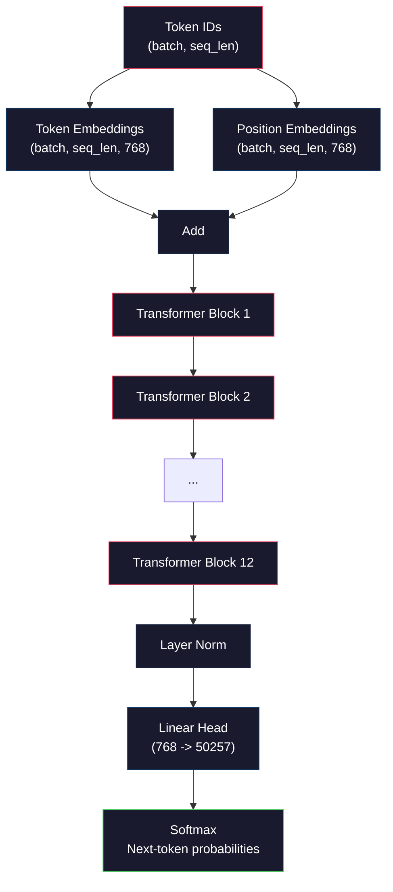
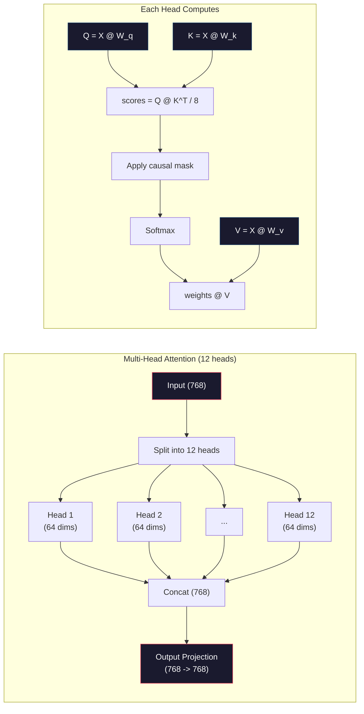
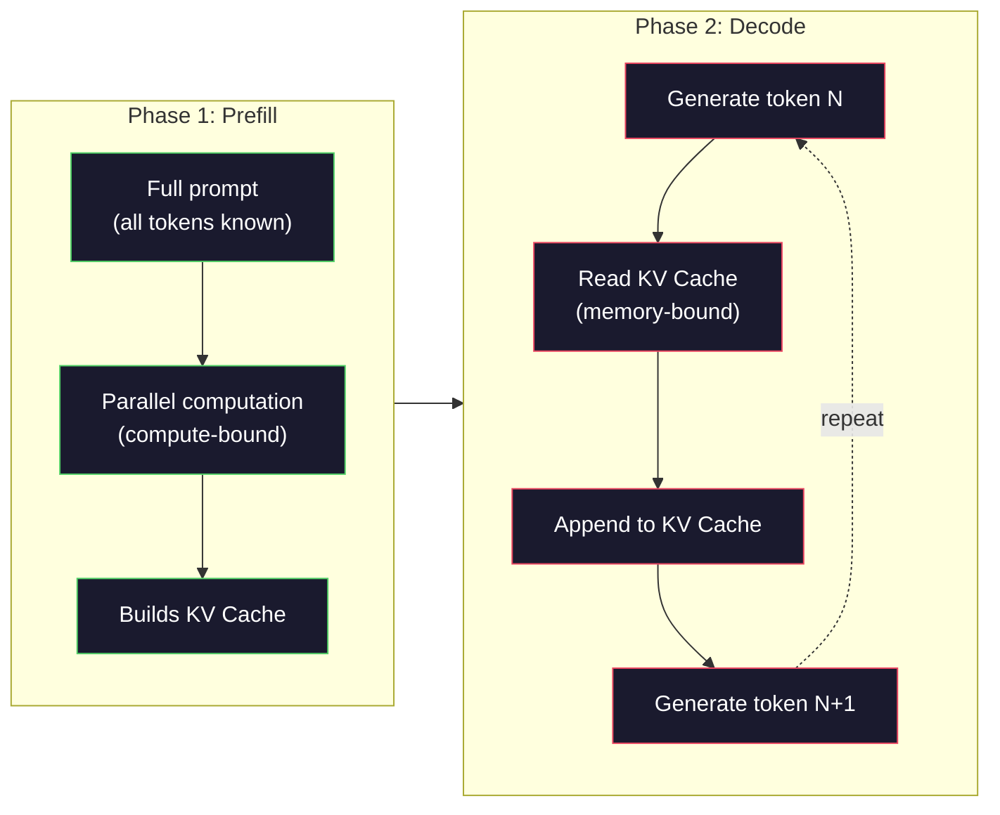

# Pré-entraînement d'un mini GPT (124M Parametres)

> GPT-2 Small a 124 millions de paramètres. C'est 12 couches de transformateur, 12 têtes d'attention et 768 emblèmes dimensionnels. Vous pouvez l'entraîner à partir de zéro sur un seul GPU en quelques heures. La plupart des gens ne font jamais cela. Ils utilisent des points de contrôle prétraînés. Mais si vous ne l'entraînez pas vous-même, vous ne comprenez pas vraiment ce qui se passe à l'intérieur du modèle sur lequel vous construisez des produits.

> **【中文解读】**GPT-2 Small a 1,24 milliards de paramètres: 12 niveaux Transformer  12 个注意力头、 768 维嵌入── un seul GPU 几小时即可从头训练── comprendre pré-entraînement est la première étape de la compréhension du grand modèle──

> **【拓展：大模型三阶段】**Le modèle de formation est le premier de la série GPT.

>  **【前置】**2) Transformer 架构 5) auto-attention、LayerNorm、FFN; 3) numpy 矩阵运算、反向传播手算 (((Phase 03 微积分与链式法则);(4) 交叉损失函数的梯度推导――本课**用 numpy 实现**Je ne veux plus dépendre de PyTorch Autograd, pour pouvoir écrire moi-même.`backward()`Il y a une autre.

**Type:** Build
**Languages:** Python (with numpy)
**Prerequisites:** Phase 10, Lessons 01-03 (Tokenizers, Building a Tokenizer, Data Pipelines)
**Time:** ~120 minutes

## Objectifs d'apprentissage

- Implémenter l'architecture GPT-2 complète (124 M paramètres) à partir de zéro: embeddings de jetons, embeddings positionnels, blocs de transformateurs et tête de modèle de langage
  De la réalisation à zéro complète de l'architecture GPT-2 参数:token 嵌入、位置嵌入、Transformer 块和语言模型头
- Exercer un modèle GPT sur un corpus de texte en utilisant la prédiction du prochain jeton avec perte d'entropie croisée
  Utilisation de la première marque  prédiction et交叉 损失在文本语料上训练 GPT 模型
- Implementer la génération de texte autorégressive avec échantillonnage de température et filtration top-k/top-p
  实现带温度采样和 top-k/top-p 过的自归文本生成
- Surveiller les courbes de perte de formation et valider que le modèle apprend des schémas linguistiques cohérents
   监控训练损失曲线,验证模型学到了连贯的语言模式

> **【中文解读】**Vous verrez comment 1,24 milliards de paramètres passent par un cycle de formation de propagation de la charge, de la charge et de la charge pour prévoir le prochain jeton.

## Le problème , l' introduction du problème

Vous savez ce qu'est un transformateur, vous avez lu les diagrammes, vous pouvez réciter "l'attention est tout ce dont vous avez besoin" et dessiner des boîtes sur un tableau blanc.

> Tu sais ce qu'est un transformateur. Tu as vu le tableau. Tu peux lire "l'attention est tout ce dont tu as besoin" et dessiner sur le tableau blanc une boîte avec un signe "l'attention multi-tête".

Rien de tout cela ne signifie que vous comprenez ce qui se passe quand un modèle génère du texte.

> Cela ne signifie pas que vous comprenez ce qui s'est passé lorsque le modèle génère du texte.

Il y a 124.438.272 paramètres dans GPT-2 Small (avec liaison de poids). Chacun d'eux a été réglé en exécutant une boucle d'entraînement: passe avant, perte de calcul, passe arrière, poids de mise à jour. Douze blocs de transformateurs. Douze têtes d'attention par bloc. Un espace intégré de 768 dimensions. Un vocabulaire de 50 257 jetons. Chaque fois que le modèle génère un jeton, les 124 millions de paramètres participent à une chaîne de multiplication de matrice unique qui prend une séquence d'ID de jeton et produit une distribution de probabilité sur le jeton suivant.

> GPT-2 Small a 124,438,272 个参数 (含权重共享) ⋅ chaque paramètre est utilisé à travers un cycle de formation: prévoye propagation ⋅ calcul de perte ⋅ revoye propagation ⋅ update权重── 12 blocs de transformateur, chaque bloc 12 个注意力头,768 维嵌入空间,50,257 词表── par seconde génération de jetons, tous les 1,24 milliards de parlementaires participant à une série de matrices multiplicatives, seront transformés en un autre jeton 序列 概率分布──

Si vous n'avez jamais construit cela vous travaillez avec une boîte noire. Vous pouvez utiliser l'API. Vous pouvez affiner. Mais quand quelque chose ne va pas - quand le modèle hallucine, quand il se répète, quand il refuse de suivre les instructions - vous n'avez pas de modèle mental pour * pourquoi*.

> Si vous n'avez jamais construit ce modèle personnellement, vous êtes en train d'utiliser une boîte noire. Vous pouvez modifier l'API, vous pouvez modifier. Mais quand le modèle se fait sentir, se répète ou refuse de suivre les instructions, vous ne savez pas pourquoi.

Cette leçon construit GPT-2 Small à partir de zéro. pas en PyTorch. en numpy. chaque multiplication de matrice est visible. chaque gradient est calculé par votre code. Vous verrez exactement comment 124 millions de nombres conspirent pour prédire le prochain mot.

> Le nombre de chiffres de la formation de la formation de la formation de formation de formation de formation de formation de formation de formation de formation de formation de formation de formation de formation de formation de formation de formation de formation de formation de formation de formation de formation de formation de formation de formation de formation de formation de formation de formation de formation de formation de formation de formation de formation de formation de formation de formation de formation de formation de formation de formation de formation de formation de formation de formation de formation de formation de formation de formation de formation de formation de formation de formation de formation de formation de formation de formation de formation de formation de formation de formation de formation de formation de formation de formation de formation de formation de formation de formation de formation de formation de formation de formation de formation de formation de formation de formation de formation de formation de formation de formation de formation de formation de formation de formation de formation de formation de formation de formation de formation de formation de formation de formation de formation de formation de formation de formation de formation de formation de formation de formation de formation de formation de formation de formation de formation de formation de formation de formation de formation de formation de formation de formation de formation de formation de formation de formation de formation de formation de formation de formation de formation de formation de formation de formation de formation de formation de formation de formation de formation de formation de formation de formation de formation de formation de formation de formation de formation de formation de formation de formation de formation de formation de formation de formation de formation de formation de formation de formation de formation de formation de formation de formation de formation de formation de formation de formation de formation de formation de formation de formation de formation de formation de formation de formation de formation de formation de formation de formation de formation de formation de formation de formation de formation de formation de formation de formation de formation de formation de formation de formation de formation de formation de formation de formation de formation de formation de formation de formation de formation de formation de formation de formation de formation de formation de formation de formation de formation de formation de formation de formation de formation de formation de formation de formation de formation de formation de formation de formation de formation de formation de formation de formation de formation de formation de formation de formation de formation de formation de formation de formation de formation de formation de formation de formation de formation de formation de formation de formation de formation de formation de formation de formation de formation de formation de formation de formation de formation de formation de formation de formation de formation de formation de formation de formation de formation de formation de formation de formation de formation de formation

> Le nombre de chiffres de la formation de la formation de la formation de formation de formation de formation de formation de formation de formation de formation de formation de formation de formation de formation de formation de formation de formation de formation de formation de formation de formation de formation de formation de formation de formation de formation de formation de formation de formation de formation de formation de formation de formation de formation de formation de formation de formation de formation de formation de formation de formation de formation de formation de formation de formation de formation de formation de formation de formation de formation de formation de formation de formation de formation de formation de formation de formation de formation de formation de formation de formation de formation de formation de formation de formation de formation de formation de formation de formation de formation de formation de formation de formation de formation de formation de formation de formation de formation de formation de formation de formation de formation de formation de formation de formation de formation de formation de formation de formation de formation de formation de formation de formation de formation de formation de formation de formation de formation de formation de formation de formation de formation de formation de formation de formation de formation de formation de formation de formation de formation de formation de formation de formation de formation de formation de formation de formation de formation de formation de formation de formation de formation de formation de formation de formation de formation de formation de formation de formation de formation de formation de formation de formation de formation de formation de formation de formation de formation de formation de formation de formation de formation de formation de formation de formation de formation de formation de formation de formation de formation de formation de formation de formation de formation de formation de formation de formation de formation de formation de formation de formation de formation de formation de formation de formation de formation de formation de formation de formation de formation de formation de formation de formation de formation de formation de formation de formation de formation de formation de formation de formation de formation de formation de formation de formation de formation de formation de formation de formation de formation de formation de formation de formation de formation de formation de formation de formation de formation de formation de formation de formation de formation de formation de formation de formation de formation de formation de formation de formation de formation de formation de formation de formation de formation de formation de formation de formation de formation de formation de formation de formation de formation de formation de formation de formation de formation de formation de formation de formation de formation de formation de formation de formation de formation de formation de formation de formation de formation de formation de formation de formation de formation de formation de formation de formation de formation de formation de formation de formation de formation de formation

## Le concept de base.

### L'architecture du GPT

Voici le graphique complet des calculs des identifiants de jetons aux probabilités des jetons suivants:

> Voici le graphique complet de la probabilité de la décomposition des jetons:

1. Les identifiants de jetons sont entrés.
2. Chaque identifiant est cartographié à un vecteur 768 dimensions.
3. Chaque position (0, 1, 2, ...) est représentée par un vecteur 768 dimensions.
4. Ajouter des embeddings de jetons + des embeddings de position.
5. Passez à travers 12 blocs de transformateurs.
6. La normalisation de la couche finale.
7. La projection linéaire à la taille du vocabulaire.
8. Softmax pour obtenir des probabilités.

Il n'y a pas de convulsions, pas de récurrence, juste des emblèmes, de l'attention, des réseaux de flux et des normes de couches empilées 12 fois.

> C'est le modèle tout entier. Il n'y a pas de boucle. Il n'y a pas de cycle. Il n'y a que 12 fois de mise en place.

>  **【类比】**GPT 像一台"流水线打字机":纸带送进代币ID → 印章 1(tōken embed)盖出 768 维向量 → 印章 2(position embed) 叠加位置 → 12道工人(Transformer block) modifier progressivement ce向量 → 末端喷墨头(LM head) 喷概率分布 → 选择最高概率的词输出 → 把新词同时再送回纸带开头,循环──一切秘都在那12道工人头上如何"修改"量而自我注意力就是工人只用12眼睛注意力) 的看序列里其他代币能力──



### Le bloc de transformateur

Chacun des 12 blocs suit le même schéma.

> Chacun des 12 blocs suit le même modèle:

1. LayerNorm
2. Une attention personnelle à plusieurs têtes
3. Connexion résiduelle (ajouter l'entrée en arrière)
4. LayerNorm
5. Réseau de transmission de données (RMS)
6. Connexion résiduelle (ajouter l'entrée en arrière)

Les connexions résiduelles sont essentielles. Sans elles, les gradients disparaissent au moment où ils atteignent le bloc 1 lors de la rétrécissement. Avec eux, les gradients peuvent couler directement de la perte à n'importe quelle couche à travers le chemin "salter". C'est pourquoi vous pouvez empiler 12, 32 ou même 96 blocs (GPT-4 est censé utiliser 120).

> Les autres différences de connexion sont essentielles. Sans elles, la gradience se propagera à l'inverse jusqu'à 1er bloc quand elle disparaîtra.

> **【中文解读】**Le cœur de l'architecture GPT est la mise en place de la transformation des blocs de code. Chaque bloc contient:LayerNorm → 多头自注意力 →残差连接 → LayerNorm → 前网络(MLP)→残差连接──GPT-2 Utilise la pré-norme(先归归化再注意力), et non la post-norme du transformateur original──残差连接是关键没有它,梯度在12层反向传播后会消失,无法训练深层网络──

> **【拓展：GPT 系列的架构演进】**GPT-2 Petit(124M,12 层 768 维)→ GPT-2 Moyen(355M,24 层 1024 维)→ GPT-2 Grand(774M,36 层 1280 维)→ GPT-2 XL(1.5B,48 层 1600 维)→ GPT-3(175B,96 层 12288 维)。 L'architecture est fondamentalement la même, juste le nombre de niveaux et la dimension continuent de s'étendre。

### Attention: Le mécanisme principal

L'auto-attention permet à chaque jeton de regarder chaque jeton précédent et de décider combien d'attention à chaque jeton.

> Depuis que l'attention est accordée à chaque symbole, on a décidé de donner beaucoup d'attention à chaque symbole.

Pour chaque position de jeton, calculer trois vecteurs à partir de l'entrée:
- **Query (Q)**"Que suis-je à la recherche ?"
  Le mot grec traduit par " le mot grec "**查询（Q）**"Je suis à la recherche de quoi ?"
- **Key (K)**"Que contiens-je ?"
  Le mot grec traduit par " le mot grec "**键（K）**"Je contiens quoi ?"
- **Value (V)**"Quelles informations ai-je à porter?"
  Le mot grec traduit par " le mot grec "**值（V）**"Qu'est-ce que tu veux me dire ?"

```
Q = input @ W_q    (768 -> 768)
K = input @ W_k    (768 -> 768)
V = input @ W_v    (768 -> 768)

attention_scores = Q @ K^T / sqrt(d_k)
attention_scores = mask(attention_scores)   # causal mask: -inf for future positions
attention_weights = softmax(attention_scores)
output = attention_weights @ V
```

Le masque causal est ce qui rend le GPT autorégressif. La position 5 peut prendre en charge les positions 0-5 mais pas 6, 7, 8, etc. Cela empêche le modèle de " tricher " en regardant les futurs jetons pendant l'entraînement.

> Parce que le masque fait du GPT un modèle de retour à la place 5. On peut remarquer la position 0-5 mais pas 6、7、8 etc. Cela empêche le modèle de faire des "troubles" en train de regarder le futur.

**Multi-head attention**L'un des deux capteurs peut suivre les relations syntaxiques (accord sujet-verbe). Un autre peut suivre la similitude sémantique (synonymes). Un autre peut suivre la proximité positionnelle (mot proche). Les sorties des 12 capteurs sont concatenées et projetées vers 768 dimensions.

> **多头注意力**Pour chaque tête, on peut suivre une relation de sensation. Pour chaque tête, on peut suivre une relation de sensation. Pour chaque tête, on peut suivre une relation de sensation. Pour chaque tête, on peut suivre une relation de sensation. Pour chaque tête, on peut suivre une autre position.



La division par sqrt(d_k) -- sqrt(64) = 8 -- est en train de s'élargir. Sans elle, les produits de point deviennent plus grands pour les vecteurs haute dimension, poussant le softmax dans des régions où les gradients sont presque zéro. C'était l'une des idées clés dans le papier original "Attention is All You Need".

> En dehors de la taille de la surface, le point de concentration à haute densité de l'échelle devient très grand, et la tendance à la tendance à la tendance à la zéro est la principale.

### KV Cache: Pourquoi l'inférence est rapide

Pendant la formation, vous traitez toute la séquence à la fois. Pendant l'inférence, vous générez un jeton à la fois. Sans optimisation, générer un jeton N nécessite de recomputer l'attention pour tous les jetons précédents N-1.

> 訓練時,你一次處理整列──推理時,你個個生成代币──無優化詞,生成代币 N 需要为所有N-1 个前代币重新计算注意力──这是每个生成代币的O(N^2),或长度N 的序列总共O(N^3)──

KV Cache résout ça. Après avoir calculé K et V pour chaque jeton, stockez-les. Lorsque vous générez des jetons N + 1, vous devez seulement calculer Q pour le nouveau jeton et rechercher les K et V en cache de tous les jetons précédents. Cela réduit le coût par jeton de O(N) à O(1) pour le calcul K et V. Le calcul du score d'attention est toujours O(N) parce que vous prenez toutes les positions précédentes, mais vous évitez les multiplications de matrice redondantes sur l'entrée.

> KV 缓存 a résolu ce problème. Célèbre chaque token de K 和 V 后存储它们. Lorsque vous générez des tokens N+1, vous devez simplement calculer les nouveaux tokens de Q et ne pas trouver tous les tokens précédents.

Pour GPT-2 avec 12 couches et 12 têtes, le cache KV stocke 2 (K + V) x 12 couches x 12 têtes x 64 dims = 18 432 valeurs par jeton. Pour une séquence de 1024 jetons, c'est environ 75 MB en FP32. Pour Llama 3 405B avec 128 couches, le cache KV pour une seule séquence peut dépasser 10 GB. C'est pourquoi l'inférence de long contexte est liée à la mémoire.

> Pour les 12 couches 12 têtes de GPT-2, KV 缓存 par token 存储 2(K + V) x 12 couches x 12 têtes x 64 维 = 18,432 个值。 Pour les 1024 séquences de jetons, en FP32 environ 75MB。 Pour les 128 couches Llama 3 405B, la KV 缓存 de la seule séquence peut dépasser 10GB。 c'est pourquoi la longue durée de la sous-révision est de l'accueil de la mémoire内存。

### Préfill vs Décode: deux phases d'inférence

Quand vous envoyez une demande à un LLM, l'inférence se fait en deux phases distinctes.

> Lorsque vous envoyez une demande de formation à la LLM, les recommandations sont faites en deux étapes différentes.

**Prefill**Le processeur de processeur de la carte graphique traite l'ensemble de votre prompt en parallèle. Tous les tokens sont connus, de sorte que le modèle peut calculer l'attention pour toutes les positions simultanément. Cette phase est liée au calcul - le GPU effectue des multiplications de matrice à plein débit. Pour un prompt de 1000 tokens sur un A100, le pré-remplissage prend environ 20 à 50 ms.

> **预填充（Prefill）**Il est possible de traiter l'ensemble du prompt. Tous les tokens sont connus, de sorte que le modèle peut calculer simultanément l'attention de toutes les positions. Cette étape est un calcul de type densité de GPU avec une capacité totale de résolution.

**Decode**génère des jetons un à la fois. Chaque nouveau jeton dépend de tous les jetons précédents. Cette phase est liée à la mémoire -- le goulot d'étranglement est la lecture des poids du modèle et du cache KV de la mémoire GPU, pas la mathématique de la matrice elle-même. Les cœurs de calcul du GPU sont en grande partie inactifs en attendant les lectures de mémoire. Pour GPT-2, chaque étape de décode prend environ le même temps, quel que soit le nombre de FLOPs requis par les matmuls, car la bande passante de la mémoire est la contrainte.

> **解码（Decode）**个别生成代币――每个新代币依赖所有之前代币―― Cette phase est celle du type de réservoir intensif

Cette distinction est importante pour les systèmes de production. Remplissez les échelles de débit avec le calcul GPU (plus de FLOPS = pré-remplissement plus rapide). Décodez les échelles de débit avec la bande passante mémoire (mémoire plus rapide = décode plus rapide). C'est pourquoi le H100 de NVIDIA s'est concentré sur les améliorations de la bande passante mémoire par rapport à l'A100 - il accélère directement la génération de jetons.

> Cette différence est importante pour le système de production. La proportion de capacité de commande pré-renchée et de capacité de commande de GPU est importante. La proportion de capacité de commande pré-renchée et de commande de GPU est importante.



### Le cycle de formation

La formation d'un LLM est la prédiction du prochain jeton.

> 訓練 LLM 就是下一代币 预测──给定代币 [0, 1, 2, ..., N-1],预测代币 [1, 2, 3, ..., N]──损失函数是模型预测的概率分布与实际下一代币 之间交叉──

Une étape de formation:

> Un stage d'entraînement:

1. **Forward pass**: Exécuter le lot à travers les 12 blocs. Obtenir des logits (scores pré-softmax) pour chaque position.
2. **Compute loss**: Entropie croisée entre logits et jetons cibles (l'entrée déplacée par une position).
3. **Backward pass**: Comptez les gradients pour tous les paramètres 124M en utilisant la propagation à l'arrière.
4. **Optimizer step**GPT-2 utilise Adam pour réchauffer le taux d'apprentissage et déclin cosyinal.

Le programme de taux d'apprentissage compte plus que ce à quoi vous vous attendez. GPT-2 se réchauffe de 0 au taux d'apprentissage maximal au cours des deux premières étapes, puis se décompose suivant une courbe cosine.

> Le taux d'apprentissage est plus important que vous ne le pensez. Le GPT-2 est le premier des 2 000 pas de 0 à la valeur de pointe du taux d'apprentissage, puis le déclin du rythme de l'équilibre.

### GPT-2 Petit: les chiffres

| Component | Shape | Parameters |
|-----------|-------|------------|
| Token embeddings | (50257, 768) | 38,597,376 |
| Position embeddings | (1024, 768) | 786,432 |
| Per-block attention (W_q, W_k, W_v, W_out) | 4 x (768, 768) | 2,359,296 |
| Per-block FFN (up + down) | (768, 3072) + (3072, 768) | 4,718,592 |
| Per-block LayerNorms (2x) | 2 x 768 x 2 | 3,072 |
| Final LayerNorm | 768 x 2 | 1,536 |
| **Total per block** | | **7,080,960** |
| **Total (12 blocks)** | | **85,054,464 + 39,383,808 = 124,438,272** |

La projection de sortie (tête de logits) partage des poids avec la matrice d'intégration de jeton. Cela s'appelle liage de poids - il réduit le nombre de paramètres de 38M et améliore les performances car il oblige le modèle à utiliser le même espace de représentation pour l'entrée et la sortie.

> **【中文解读】**GPT-2 parametres distribués:token 嵌入层占 38.6M(50257 x 768),12 个变压器块各占 7.1M,最终 LayerNorm 仅1.5K;;权重共享(权重绑定) 让输出投影层复用代币 嵌入矩阵,减少38M 参数的同时还提升性能因为输入和输出被强制使用相同表示空间──

## Construisez-le et mettez-le en œuvre.

### Étape 1: Intégrer une couche

Les emplacements de jetons cartographient chacun des 50 257 jetons possibles à un vecteur 768 dimensions.

> Les jetons seront intégrés à 50 257 jetons possibles, différents cartographiés à un 768 dimensiones.

```python
import numpy as np

class Embedding:
    def __init__(self, vocab_size, embed_dim, max_seq_len):
        self.token_embed = np.random.randn(vocab_size, embed_dim) * 0.02
        self.pos_embed = np.random.randn(max_seq_len, embed_dim) * 0.02

    def forward(self, token_ids):
        seq_len = token_ids.shape[-1]
        tok_emb = self.token_embed[token_ids]
        pos_emb = self.pos_embed[:seq_len]
        return tok_emb + pos_emb
```

La déviation standard de 0,02 pour l'initialisation provient du papier GPT-2. trop grand et les passes avant initiales produisent des valeurs extrêmes qui déstabilisent la formation. trop petit et les sorties initiales sont presque identiques pour toutes les entrées, rendant inutiles les signaux de gradient précoces.

> La différence de niveau de démarrage est tirée du GPT-2 论文──太大则初始前向传播产生极端值,破坏训练稳定性──太小则所有输入的初始输出几乎相同,使早期梯度信号无用──

### Étape 2: Attention à soi avec masque de causalité

Le masque de causalité fixe les positions futures à l'infini négatif avant le softmax, en veillant à ce que chaque position ne puisse s'occuper que de lui-même et des positions antérieures.

> Prévoir un seul point de vue. Prévoir un point de vue positif.

```python
def attention(Q, K, V, mask=None):
    d_k = Q.shape[-1]
    scores = Q @ K.transpose(0, -1, -2 if Q.ndim == 4 else 1) / np.sqrt(d_k)
    if mask is not None:
        scores = scores + mask
    weights = np.exp(scores - scores.max(axis=-1, keepdims=True))
    weights = weights / weights.sum(axis=-1, keepdims=True)
    return weights @ V
```

La mise en œuvre de softmax soustrait le maximum avant d'exponentier. Sans cela, exp(large_number) dépasse à l'infini. Il s'agit d'un truc de stabilité numérique qui ne change pas la sortie car softmax(x - c) = softmax(x) pour n'importe quelle constante c.

> softmax 实现在取指数前减去最大值──没有这个,exp(large_number) 会溢出到无穷大──这是一个数值稳定性技巧,不改变输出,因为对任意常数 c,softmax(x - c) = softmax(x)──

### Étape 3: Attention à plusieurs têtes

Divisez l'entrée 768-dimensionnelle en 12 têtes de 64 dimensions chacune. Chaque tête calcule l'attention de manière indépendante. Concaténez les résultats et projeter à nouveau à 768 dimensions.

> Pour chaque tête, on peut calculer l'attention.

```python
class MultiHeadAttention:
    def __init__(self, embed_dim, num_heads):
        self.num_heads = num_heads
        self.head_dim = embed_dim // num_heads
        self.W_q = np.random.randn(embed_dim, embed_dim) * 0.02
        self.W_k = np.random.randn(embed_dim, embed_dim) * 0.02
        self.W_v = np.random.randn(embed_dim, embed_dim) * 0.02
        self.W_out = np.random.randn(embed_dim, embed_dim) * 0.02

    def forward(self, x, mask=None):
        batch, seq_len, d = x.shape
        Q = (x @ self.W_q).reshape(batch, seq_len, self.num_heads, self.head_dim).transpose(0, 2, 1, 3)
        K = (x @ self.W_k).reshape(batch, seq_len, self.num_heads, self.head_dim).transpose(0, 2, 1, 3)
        V = (x @ self.W_v).reshape(batch, seq_len, self.num_heads, self.head_dim).transpose(0, 2, 1, 3)

        scores = Q @ K.transpose(0, 1, 3, 2) / np.sqrt(self.head_dim)
        if mask is not None:
            scores = scores + mask
        weights = np.exp(scores - scores.max(axis=-1, keepdims=True))
        weights = weights / weights.sum(axis=-1, keepdims=True)
        attn_out = weights @ V

        attn_out = attn_out.transpose(0, 2, 1, 3).reshape(batch, seq_len, d)
        return attn_out @ self.W_out
```

La danse de remodelage-transposition-remodelage est la partie la plus déroutante de l'attention multi-têtes. Voici ce qui se passe: le (batch, seq_len, 768) tensor devient (batch, seq_len, 12, 64), puis (batch, 12, seq_len, 64). Maintenant, chacune des 12 têtes a sa propre matrice (seq_len, 64) pour faire tourner l'attention. Après l'attention, nous inversons le processus: (batch, 12, seq_len, 64) devient (batch, seq_len, 12, 64) devient (batch, seq_len, 768).

> L'opération de re-form-transpose-reform est la partie la plus déconcertante de l'attention de plusieurs têtes.

### Étape 4: Bloc de transformateur

Un bloc transformateur complet: LayerNorm, attention multi-tête avec résiduel, LayerNorm, feedforward avec résiduel.

> Un transformateur complet blocs:LayerNorm, avec le reste de la mise en valeur de plusieurs couches de l'attention,LayerNorm, avec le reste de la mise en valeur de la mise en valeur de la mise en valeur de la mise en valeur de la mise en valeur de la mise en valeur de la mise en valeur de la mise en valeur de la mise en valeur de la mise en valeur de la mise en valeur de la mise en valeur de la mise en valeur de la mise en valeur de la mise en valeur de la mise en valeur de la mise en valeur de la mise en valeur de la mise en valeur de la mise en valeur de la mise en valeur de la mise en valeur de la mise en valeur de la mise en valeur de la mise en valeur de la mise en valeur de la mise en valeur de la mise en valeur de la mise en valeur de la mise en valeur de la mise en valeur de la mise en valeur de la mise en valeur de la mise en valeur de la mise en valeur de la mise en valeur de la mise en valeur de la mise en valeur de la mise en valeur de la mise en valeur de la mise en valeur de la mise en valeur de la mise en valeur de la mise en valeur de la mise en valeur de la mise en valeur de la mise en valeur de la mise en valeur de la mise en valeur de la mise en valeur de la mise en valeur de la mise en valeur de la mise en valeur de la mise en valeur de la mise en valeur de la mise en valeur de la mise en valeur de la mise en valeur de la mise en valeur de la mise en valeur de la mise en valeur de la mise en valeur de la mise en valeur de la mise en valeur de la mise en valeur de mise en valeur de mise en valeur de mise en valeur de mise en.

```python
class LayerNorm:
    def __init__(self, dim, eps=1e-5):
        self.gamma = np.ones(dim)
        self.beta = np.zeros(dim)
        self.eps = eps

    def forward(self, x):
        mean = x.mean(axis=-1, keepdims=True)
        var = x.var(axis=-1, keepdims=True)
        return self.gamma * (x - mean) / np.sqrt(var + self.eps) + self.beta


class FeedForward:
    def __init__(self, embed_dim, ff_dim):
        self.W1 = np.random.randn(embed_dim, ff_dim) * 0.02
        self.b1 = np.zeros(ff_dim)
        self.W2 = np.random.randn(ff_dim, embed_dim) * 0.02
        self.b2 = np.zeros(embed_dim)

    def forward(self, x):
        h = x @ self.W1 + self.b1
        h = np.maximum(0, h)  # GELU approximation: ReLU for simplicity
        return h @ self.W2 + self.b2


class TransformerBlock:
    def __init__(self, embed_dim, num_heads, ff_dim):
        self.ln1 = LayerNorm(embed_dim)
        self.attn = MultiHeadAttention(embed_dim, num_heads)
        self.ln2 = LayerNorm(embed_dim)
        self.ffn = FeedForward(embed_dim, ff_dim)

    def forward(self, x, mask=None):
        x = x + self.attn.forward(self.ln1.forward(x), mask)
        x = x + self.ffn.forward(self.ln2.forward(x))
        return x
```

Le réseau feedforward étend l'entrée 768-dimensionnelle à 3 072 dimensions (4x), applique une non-linéarité, puis projette de nouveau à 768. Ce modèle d'expansion-contrition donne au modèle une représentation interne " plus large " pour travailler à chaque position. GPT-2 utilise l'activation GELU, mais nous utilisons ReLU ici pour la simplicité - la différence est mineure pour comprendre l'architecture.

> Le réseau de 768 维输入 se développe à 3,072 维(4 倍), applique non-lineur, puis projette de nouveau 768 ⋅ ce modèle d'expansion-rétrécissement donne à un modèle un "plus large" de l'intérieur indique travailler sur chaque position ⋅ GPT-2 utilise GELU  activation fonction, mais ici pour une simple utilisation de ReLU  pour comprendre l'architecture la différence est très petite ⋅

### Étape 5: Modèle GPT complet

En pile 12 blocs de transformateurs, ajoutez la couche d'emballage à l'avant et la projection de sortie à l'arrière.

> Rassemblement de 12 transformateurs blocs.

```python
class MiniGPT:
    def __init__(self, vocab_size=50257, embed_dim=768, num_heads=12,
                 num_layers=12, max_seq_len=1024, ff_dim=3072):
        self.embedding = Embedding(vocab_size, embed_dim, max_seq_len)
        self.blocks = [
            TransformerBlock(embed_dim, num_heads, ff_dim)
            for _ in range(num_layers)
        ]
        self.ln_f = LayerNorm(embed_dim)
        self.vocab_size = vocab_size
        self.embed_dim = embed_dim

    def forward(self, token_ids):
        seq_len = token_ids.shape[-1]
        mask = np.triu(np.full((seq_len, seq_len), -1e9), k=1)

        x = self.embedding.forward(token_ids)
        for block in self.blocks:
            x = block.forward(x, mask)
        x = self.ln_f.forward(x)

        logits = x @ self.embedding.token_embed.T
        return logits

    def count_parameters(self):
        total = 0
        total += self.embedding.token_embed.size
        total += self.embedding.pos_embed.size
        for block in self.blocks:
            total += block.attn.W_q.size + block.attn.W_k.size
            total += block.attn.W_v.size + block.attn.W_out.size
            total += block.ffn.W1.size + block.ffn.b1.size
            total += block.ffn.W2.size + block.ffn.b2.size
            total += block.ln1.gamma.size + block.ln1.beta.size
            total += block.ln2.gamma.size + block.ln2.beta.size
        total += self.ln_f.gamma.size + self.ln_f.beta.size
        return total
```

Notez la liaison de poids: `logits = x @ self.embedding.token_embed.T`. La projection de sortie réutilise la matrice d'embedding des jetons (transposée). Il ne s'agit pas seulement d'un truc de sauvegarde de paramètres.

> Attention à la répartition:`logits = x @ self.embedding.token_embed.T`◊输出投影复用代币 嵌入矩阵(转置) ・・・ c'est pas seulement une technique de conservation des paramètres― il signifie que le modèle utilise le même espace de dimension pour comprendre les jetons(嵌入) et pré测 token(输出) ・・・

### Étape 6: cycle d'entraînement

Pour une véritable course d'entraînement sur 124M paramètres, vous auriez besoin d'un GPU et PyTorch. Cette boucle d'entraînement démontre la mécanique sur un petit modèle qui fonctionne en pure numpy. Nous utilisons un petit modèle (4 couches, 4 têtes, 128 dims) pour le rendre traitable.

> Pour le fonctionnement réel des paramètres 124M, vous avez besoin de GPU et PyTorch. Ce cycle de formation se déroule dans un petit modèle de fonctionnement purement numpy.

```python
def cross_entropy_loss(logits, targets):
    batch, seq_len, vocab_size = logits.shape
    logits_flat = logits.reshape(-1, vocab_size)
    targets_flat = targets.reshape(-1)

    max_logits = logits_flat.max(axis=-1, keepdims=True)
    log_softmax = logits_flat - max_logits - np.log(
        np.exp(logits_flat - max_logits).sum(axis=-1, keepdims=True)
    )

    loss = -log_softmax[np.arange(len(targets_flat)), targets_flat].mean()
    return loss


def train_mini_gpt(text, vocab_size=256, embed_dim=128, num_heads=4,
                   num_layers=4, seq_len=64, num_steps=200, lr=3e-4):
    tokens = np.array(list(text.encode("utf-8")[:2048]))
    model = MiniGPT(
        vocab_size=vocab_size, embed_dim=embed_dim, num_heads=num_heads,
        num_layers=num_layers, max_seq_len=seq_len, ff_dim=embed_dim * 4
    )

    print(f"Model parameters: {model.count_parameters():,}")
    print(f"Training tokens: {len(tokens):,}")
    print(f"Config: {num_layers} layers, {num_heads} heads, {embed_dim} dims")
    print()

    for step in range(num_steps):
        start_idx = np.random.randint(0, max(1, len(tokens) - seq_len - 1))
        batch_tokens = tokens[start_idx:start_idx + seq_len + 1]

        input_ids = batch_tokens[:-1].reshape(1, -1)
        target_ids = batch_tokens[1:].reshape(1, -1)

        logits = model.forward(input_ids)
        loss = cross_entropy_loss(logits, target_ids)

        if step % 20 == 0:
            print(f"Step {step:4d} | Loss: {loss:.4f}")

    return model
```

La perte commence près de ln(vocab_size) - pour un vocabulaire de niveau octet de 256 jetons, c'est ln(256) = 5.55. Un modèle aléatoire attribue une probabilité égale à chaque jeton.

> 损失初始接近 ln(vocab_size)  Pour 256 符号的字节级词表,即 ln(256) = 5.55。随机模型给每个符号 分配等概率。

Dans la production, vous utiliserez l'optimisateur Adam avec accumulation de gradients, réchauffement du taux d'apprentissage et coupage de gradients.

> Dans la production, vous utiliserez Adam 优化器配合梯度累积、学习率预热和梯度剪.                                                                                                                                                                                                                                                 

### Étape 7: génération de texte

La génération utilise le modèle formé pour prédire un jeton à la fois.

> Il est possible de faire des analyses de la situation de l'échantillon de l'échantillon de l'échantillon de l'échantillon de l'échantillon de l'échantillon de l'échantillon de l'échantillon de l'échantillon de l'échantillon de l'échantillon de l'échantillon de l'échantillon de l'échantillon de l'échantillon de l'échantillon de l'échantillon de l'échantillon de l'échantillon de l'échantillon de l'échantillon de l'échantillon de l'échantillon de l'échantillon de l'échantillon de l'échantillon de l'échantillon de l'échantillon de l'échantillon de l'échantillon de l'échantillon de l'échantillon de l'échantillon de l'échantillon de l'échantillon de l'échantillon de l'échantillon de l'échantillon de l'échantillon de l'échantillon de l'échantillon de l'échantillon de l'échantillon de l'échantillon de l'échantillon.

```python
def generate(model, prompt_tokens, max_new_tokens=100, temperature=0.8):
    tokens = list(prompt_tokens)
    seq_len = model.embedding.pos_embed.shape[0]

    for _ in range(max_new_tokens):
        context = np.array(tokens[-seq_len:]).reshape(1, -1)
        logits = model.forward(context)
        next_logits = logits[0, -1, :]

        next_logits = next_logits / temperature
        probs = np.exp(next_logits - next_logits.max())
        probs = probs / probs.sum()

        next_token = np.random.choice(len(probs), p=probs)
        tokens.append(next_token)

    return tokens
```

La température contrôle la randomisation. La température 1.0 utilise la distribution brute. La température 0.5 l'aiguise (plus déterministe - le modèle choisit ses meilleurs choix plus souvent). La température 1.5 l'applique (plus aléatoire - les jetons à faible probabilité ont une plus grande chance). La température 0.0 est un décoding avide (choisissez toujours le jeton à plus grande probabilité).

> 温度控制随机性──温度 1.0 使用原始分布──温度 0.5 使其更尖(更确定性模型更频繁地选择顶部候选人)──温度 1.5 使其更平坦(更随机低概率代币 获得更大的机会)──温度 0.0 是贪心解码(始终选择最高概率代币)──

Le `tokens[-seq_len:]`La fenêtre est nécessaire parce que le modèle a une longueur de contexte maximale (1024 pour GPT-2). Une fois que vous l'avez dépassée, vous devez laisser tomber les jetons les plus anciens.

> `tokens[-seq_len:]`La fenêtre est nécessaire, car le modèle a la plus grande longueur de texte. Une fois qu'elle est sortie, vous devez abandonner le plus ancien.

## Utilisez-le avec le cadre de réalisation
```figure
sampling-decoder
```

## Utilisez-le

### Formation complète et démonstration de génération

```python
corpus = """The transformer architecture has revolutionized natural language processing.
Attention mechanisms allow the model to focus on relevant parts of the input.
Self-attention computes relationships between all pairs of positions in a sequence.
Multi-head attention splits the representation into multiple subspaces.
Each attention head can learn different types of relationships.
The feedforward network provides nonlinear transformations at each position.
Residual connections enable gradient flow through deep networks.
Layer normalization stabilizes training by normalizing activations.
Position embeddings give the model information about token ordering.
The causal mask ensures autoregressive generation during training.
Pre-training on large text corpora teaches the model general language understanding.
Fine-tuning adapts the pre-trained model to specific downstream tasks."""

model = train_mini_gpt(corpus, num_steps=200)

prompt = list("The transformer".encode("utf-8"))
output_tokens = generate(model, prompt, max_new_tokens=100, temperature=0.8)
generated_text = bytes(output_tokens).decode("utf-8", errors="replace")
print(f"\nGenerated: {generated_text}")
```

Sur un petit corpus avec un petit modèle, le texte généré sera semi-cohérent au mieux. Il apprendra certains modèles de niveau octet du texte de formation mais ne peut pas généraliser la façon dont GPT-2 fait avec 40 Go de données de formation et l'architecture complète de paramètres 124M. Le problème n'est pas la qualité de la sortie. Le point est que vous pouvez suivre chaque étape: intégrer la recherche, calcul de l'attention, transformation de l'alimentation, projection logite, softmax et prélèvement d'échantillons. Chaque opération est visible.

> Sur les petits modèles et les petits textes, le texte généré est semi-régulier. Il est en train de s'apprendre à quelques caractères, mais ne peut pas être généralisé comme GPT-2 sur les données de formation de 40 Go et l'architecture complète de 124 M. La clé n'est pas la qualité de sortie. La clé est que vous puissiez suivre chaque étape: intégration recherche, attention calcul, pré-échange, logique, projection, max et échantillonnage. Chaque opération est visible.

## Envoyez-le . Produit .

Cette leçon produit `outputs/prompt-gpt-architecture-analyzer.md`-- une requête qui analyse les choix d'architecture dans n'importe quel modèle de style GPT. Il lui donne une carte modèle ou un rapport technique et il décompose l'allocation des paramètres, la conception de l'attention et les décisions d'échelle.

> 本课产 出 `outputs/prompt-gpt-architecture-analyzer.md` Une analyse de l'ensemble des modèles de GPT 风格模型架构选择的提示──输入模型卡或技术报告, elle décompose la répartition des paramètres、 la conception de l'attention et la réduction des décisions──

## Les exercices

1. Modifiez le modèle pour utiliser 24 couches et 16 têtes au lieu de 12/12.

2. Implémenter la fonction d'activation GELU (GELU(x) = x * 0.5 * (1 + erf(x / sqrt(2)))) et remplacer la ReLU dans le réseau de flux.

3. Ajoutez un cache KV à la fonction de génération. Conservez les tensors K et V pour chaque couche après le premier passage vers l'avant, et réutilisez-les pour les jetons ultérieurs. Mesurez la vitesse: générez 200 jetons avec et sans le cache et comparez le temps de l'horloge murale.

4. Prenez l'échantillonnage top-k (considérez uniquement les jetons de la plus grande probabilité k) et le top-p (échantillonnage nucléaire: considérez le plus petit ensemble de jetons dont la probabilité cumulée dépasse p).

5. Construisez un plotter de courbe de perte d'entraînement. Prenez le modèle pour 1000 étapes et la perte de graphie par rapport à l'étape. Identifiez les trois phases: descente initiale rapide (apprentissage des octets communs), phase moyenne plus lente (apprentissage des octets), et plateau (surmontation sur le petit corpus).

## Les termes clés

| Term | What people say | What it actually means | 中文释义 |
|------|----------------|----------------------|---------|
| Autoregressive | "It generates one word at a time" | Each output token is conditioned on all previous tokens -- the model predicts P(token_n \| token_0, ..., token_{n-1}) | 自回归，逐 token 生成，每个 token 依赖之前所有 token |
| Causal mask | "It can't see the future" | An upper-triangular matrix of -infinity values that prevents attention to future positions during training | 因果掩码，防止看到未来位置 |
| Multi-head attention | "Multiple attention patterns" | Splitting Q, K, V into parallel heads (e.g., 12 heads of 64 dims each for GPT-2) so each head can learn different relationship types | 多头注意力，并行学习不同关系类型 |
| KV Cache | "Caching for speed" | Storing computed Key and Value tensors from previous tokens to avoid redundant computation during autoregressive generation | KV 缓存，避免重复计算已生成 token 的 K/V |
| Prefill | "Processing the prompt" | The first inference phase where all prompt tokens are processed in parallel -- compute-bound on GPU FLOPS | 预填充阶段，并行处理 prompt，计算密集 |
| Decode | "Generating tokens" | The second inference phase where tokens are generated one at a time -- memory-bound on GPU bandwidth | 解码阶段，逐 token 生成，访存密集 |
| Weight tying | "Sharing embeddings" | Using the same matrix for input token embeddings and the output projection head -- saves 38M params in GPT-2 | 权重共享，输入输出共用嵌入矩阵 |
| Residual connection | "Skip connection" | Adding the input directly to the output of a sublayer (x + sublayer(x)) -- enables gradient flow in deep networks | 残差连接，使深层网络梯度流通 |
| Layer normalization | "Normalizing activations" | Normalizing across the feature dimension to mean 0 and variance 1, with learnable scale and bias parameters | 层归一化，特征维度归一化 |
| Cross-entropy loss | "How wrong the predictions are" | -log(probability assigned to the correct next token), averaged over all positions -- the standard LLM training objective | 交叉熵损失，LLM 训练的标准目标函数 |

## Encore une lecture

- [Radford et al., 2019 -- "Language Models are Unsupervised Multitask Learners" (GPT-2)](https://cdn.openai.com/better-language-models/language_models_are_unsupervised_multitask_learners.pdf)-- le papier GPT-2 qui a introduit la famille de paramètres 124M à 1.5B
- [Vaswani et al., 2017 -- "Attention Is All You Need"](https://arxiv.org/abs/1706.03762)-- le papier transformateur original avec une attention de produit à pointillés et une attention de tête multiples
- [Llama 3 Technical Report](https://arxiv.org/abs/2407.21783)-- comment Meta a étalé l'architecture GPT à 405B paramètres avec des GPU 16K
- [Pope et al., 2022 -- "Efficiently Scaling Transformer Inference"](https://arxiv.org/abs/2211.05102)-- le document qui a formalisé le pré-remplissage versus décode et KV cache analyse
