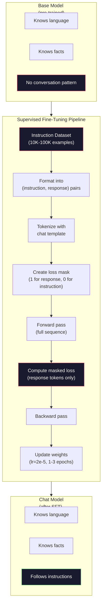

# Je suis en train de faire une petite mise en forme.

> Un modèle de base prédit le prochain jeton. C'est tout. Il ne suit pas les instructions, ne répond pas aux questions ou ne refuse pas les demandes nuisibles. SFT est le pont entre un prédicteur de jeton et un assistant utile. Tous les modèles avec lesquels vous avez parlé - Claude, GPT, Llama Chat - ont traversé cette étape.

> **【中文解读】**Le modèle de base ne prédit que le prochain jeton. Il ne suivra pas les instructions, répondra aux questions ou refusera les demandes nocives.

> **【拓展：SFT→ChatGPT】**Le processus de formation de ChatGPT:GPT-3.5 预训练 → SFT(usage des données de dialogue des étiquettes humaines)→ RLHF(usage des données préférées humaines pour les données de coordination)。SFT est de faire du modèle de base un pas clé de l'assistant de dialogue。

>  **【前置】**學本節前 請先掌握:Phase 10·04 ((Pre-Training Mini GPT) 理解预训如何得到基础模型;Phase 11·08 ((LoRA) 理解微调的具体技术(本节是全参微调,LoRA是其轻量版);PyTorch 训练循环基础(loss、optimizer、backward)

**Type:** Build
**Languages:** Python (with numpy)
**Prerequisites:** Phase 10, Lesson 04 (Pre-Training a Mini GPT)
**Time:** ~90 minutes

>  **【类比】**SFT = 给"博学"上课──预训让会说所有人话(语言能力),但不会对话(你说"你好",它说"今天天气不错"纯统计接龙)──SFT utilisé 10 000对"问答"示范教它"问你好应该回答你好"从统计变成会谈──

> ️ **【易错点】**Les trois cratères de la formation de données SFT:**指令格式不统一**Il y a des modèles utilisés.`User:`- Je suis là.`Assistant:`- Je suis un peu...`<|user|>`- Je suis là.`<|assistant|>`,模型学不会统一格式;务必固定模板(如ChatML) ・・・(2) **拒绝样本不足**100 000 dialogues en seulement 50 articles "réjecter les demandes nocives", le modèle ne refusera pas; au moins 5 à 10% réjecter le modèle couvrant diverses attaques―(3)** catastrophic forgetting**SFT 数据太狭 (全是客服对话), modèle oublie la capacité générale; mêle à 20-30% de données générales (Alpaca、FLAN)

## Objectifs d'apprentissage

- Implementer un ajustement fin supervisé (SFT) qui convertit un modèle de langue de base en un assistant suivant les instructions
  实现监督微调(SFT),将基础语言模型转换为指令跟随助手
- Formater les données de formation à l'aide de modèles de chat avec les rôles de système, d'utilisateur et d'assistant, et perdre le masque sur les jetons non-assistants
  Utilisation avec système/utilisateur/assistant 角色的聊天模板格式化训练数据,并对非助手代币 进行损失掩码
- Expliquer pourquoi la FFT est nécessaire: les modèles de base continuent le texte plutôt que de répondre aux questions
  Expliquer pourquoi il faut SFT: le modèle de base est de continuer le texte et non de répondre aux questions
- Évaluer la qualité des SFT en comparant les réponses du modèle de base et celles du modèle finement ajusté sur un ensemble d'instructions prolongé
   par rapport à la base de modèle et à la réaction du modèle de micro-régulation sur la liste des instructions de sortie pour évaluer la qualité des SFT

> **【中文解读】**Le modèle de base est transformé en un modèle de formation de formation de formation de formation de formation de formation de formation de formation de formation de formation de formation de formation de formation de formation de formation de formation de formation de formation de formation de formation de formation de formation de formation de formation de formation de formation de formation de formation de formation de formation de formation de formation de formation de formation de formation de formation de formation de formation de formation de formation de formation de formation de formation de formation de formation de formation de formation de formation de formation de formation de formation de formation de formation de formation de formation de formation de formation de formation de formation de formation de formation de formation de formation de formation de formation de formation de formation de formation de formation de formation de formation de formation de formation de formation de formation de formation de formation de formation de formation de formation de formation de formation de formation de formation de formation de formation de formation de formation de formation de formation de formation de formation de formation de formation de formation de formation de formation de formation de formation de formation de formation de formation de formation de formation de formation de formation de formation de formation de formation de formation de formation de formation de formation de formation de formation de formation de formation de formation de formation de formation de formation de formation de formation de formation de formation de formation de formation de formation de formation de formation de formation de formation de formation de formation de formation de formation de formation de formation de formation de formation de formation de formation de formation de formation de formation de formation de formation de formation de formation de formation de formation de formation de formation de formation de formation de formation de formation de formation de formation de formation de formation de formation de formation de formation de formation de formation de formation de formation de formation de formation de formation de formation de formation de formation de formation de formation de formation de formation de formation de formation de formation de formation de formation de formation de formation de formation de formation de formation de formation de formation de formation de formation de formation de formation de formation de formation de formation de formation de formation de formation de formation de formation de formation de formation de formation de formation de formation de formation de formation de formation de formation de formation de formation de formation de formation de formation de formation de formation de formation de formation de formation de formation de formation de formation de formation de formation de formation de formation de formation de formation de formation de formation de formation de formation de formation de formation de formation de formation de formation de formation de formation de formation de formation de formation de formation de formation de formation de formation de formation de formation

## Le problème , l' introduction du problème

Vous avez formé un modèle dans la leçon 04. Il peut prédire le prochain jeton donné une séquence.

> Vous avez appris en quatrième classe un modèle. Il peut prévoir un autre jeton. Il peut être utilisé comme un prétexte.

Essayez ceci: nourrissez-le "Quelle est la capitale de la France?" Un modèle de base ne répond pas "Paris". Il continue le modèle. Il pourrait produire "Quelle est la capitale de l'Allemagne? Quelle est la capitale de l'Espagne? " car elle en apprenait les documents contenant des listes de questions. Ou il pourrait produire "est une question que beaucoup de gens se posent" parce que c'est une plausible suite à un autre signe. Le modèle n'a pas de concept de *response*. Il ne sait que continuer.

> 现在试试这个:输入 "Qu'est-ce que la capitale de la France?" 基础模型不会回答"Paris. " Il continuera à répondre.

C'est le fossé entre GPT-3 (modèle de base, publié en juin 2020) et ChatGPT (instruction-tuned, publié en novembre 2022). La même architecture. La même pré-entraînement. La différence est de 20 000 à 100 000 paires soigneusement conçues (instruction, réponse) qui ont appris au modèle à suivre le modèle de conversation.

> C'est la différence entre GPT-3 (en anglais) et le ChatGPT (en anglais) (en anglais) (en anglais) (en anglais).

Stanford Alpaca a prouvé que vous n'avez pas besoin de millions d'exemples. En mars 2023, ils ont affiné Llama 7B sur seulement 52 000 paires d'instructions-réponse générées par GPT-3.5.$600. The result was a chatbot that could follow instructions, answer questions, and hold conversations. Not as good as ChatGPT, but shockingly close for $600 et quelques heures d'entraînement.

> Stanford Alpaca  prouve que vous n'avez pas besoin de plusieurs millions d'échantillons. En mars 2023, ils n'ont utilisé que 52 000 articles GPT-3.5 生成的指示-回复对微调的Llama 7B.

Le chat Llama 2 de Meta n'a utilisé que 27 000 exemples de haute qualité pour son stade initial de SFT. L'idée clé: la qualité compte plus que la quantité. 27 000 exemples écrits par des annotateurs qualifiés ont battu 1 million d'exemples bruyants extraits d'Internet.

> La première phase de Meta's Llama 2 Chat SFT a utilisé environ 27 000 articles de haute qualité.

> **【中文解读】**GPT-3(2020.6) et ChatGPT(2022.11) entre seulement 2 000 à 10 000 articles d'écriture éclairée (en anglais seulement) contre: Stanford Alpaca utilise 52 000 articles GPT-3.5 pour créer des instructions pour la Llama 7B, coûtant seulement 600 $.

> **【拓展：Llama 2 的 SFT 数据质量标准】**Meta Open a indiqué que les données SFT de Llama 2 Chat ont été rédigées par une équipe de marqueurs spécialisés, chaque article a été examiné en plusieurs rounds. Ceci est comparable à une méthode précoce de l'Internet pour obtenir des informations de qualité.

## Le concept de base.

### Ce que fait réellement la FFT

La mise à jour supervisée continue la même boucle d'entraînement depuis la pré-entraînement - pass en avant, perte de calcul, pass en arrière, mises à jour de poids - mais avec un type différent de données. Au lieu de texte brut, vous vous entraînez sur des conversations structurées:

> 监督微调延续预训练的相同训练循环前向传播、计算损失、反向传播、更新权重但在不同类型的数据上──你用结构化对话代替原始文本进行训练:

```json
{
  "system": "You are a helpful assistant.",
  "user": "What is the capital of France?",
  "assistant": "The capital of France is Paris."
}
```

Le modèle sait déjà que Paris est la capitale de la France. Il a appris cela lors de la pré-formation sur Wikipedia, les manuels et les pages Web. SFT n'enseigne pas le modèle de nouveaux faits. Il enseigne le modèle un nouveau *comportement*: quand vous voyez une question, produisez une réponse. Quand vous voyez une instruction, produisez une finition. Quand vous voyez une demande nuisible, produisez un refus.

> Le modèle sait déjà que Paris est la capitale de la France. Il a appris cela pendant la préparation de l'entraînement.

Pensez à cela de cette façon. La pré-formation donne aux modèles la connaissance.

> Ainsi, on peut penser que les modèles sont plus sensibles à la culture.

> **【中文解读】**La nature de SFT est un cycle de formation de continuation de la préparation, mais les données du texte original sont transformées en dialogue structuré. La technique clé est la perte cache: seulement dans l'assistant, la partie de la préparation comptable perd. Cela signifie que le modèle apprend " comment répondre " et non " comment continuer la préparation ".

### Formats de données

Trois formats dominent l'industrie. Chacun encode la même information - qui a dit quoi - avec des délimiteurs différents.

> Le secteur a trois formes principales. Chaque type de code contient les mêmes informations.

**Alpaca Format**(Stanford, mars 2023):

```json
{
  "instruction": "Summarize the following article in 3 sentences.",
  "input": "The European Central Bank raised interest rates...",
  "output": "The ECB increased rates by 25 basis points..."
}
```

Simple et largement utilisé.`input`Le champ est facultatif - beaucoup d'instructions n'ont pas besoin de contexte supplémentaire. Stanford a publié 52 000 exemples dans ce format, généré par GPT-3.5 pour 600 $. Cela a déclenché le mouvement de réglage des instructions open source.

> 简单且广泛使用──`input`字段是可选的许多指令不需要额外上下文──Stanford a publié 52 000 échantillons dans ce format, réalisé par GPT-3.5, coûtant 600 美元── ceci a ouvert le mouvement des instructions micro-modulation open source──

**ShareGPT Format**(communauté, 2023):

```json
{
  "conversations": [
    {"from": "system", "value": "You are a helpful assistant."},
    {"from": "human", "value": "What causes tides?"},
    {"from": "gpt", "value": "Tides are caused by the gravitational pull of the Moon..."},
    {"from": "human", "value": "How often do they occur?"},
    {"from": "gpt", "value": "Most coastal areas experience two high tides and two low tides per day..."}
  ]
}
```

Le champ "from" utilise "human" et "gpt" par convention, quel que soit le modèle réel. Vicuna a été formé sur 70 000 conversations ShareGPT extraites de transcriptions ChatGPT partagées par les utilisateurs.

> 支持多轮对话──"from" 字段按惯例使用"human" 和"gpt",无论实际模型是什么──Vicuna entraîne 70.000 participants à la formation de la conversation partagée par les utilisateurs sur le ChatGPT.

**ChatML Format**(OpenAI, utilisé par de nombreux modèles open source):

```
<|im_start|>system
You are a helpful assistant.<|im_end|>
<|im_start|>user
What is the capital of France?<|im_end|>
<|im_start|>assistant
The capital of France is Paris.<|im_end|>
```

Utilise des jetons spéciaux (`<|im_start|>`- Je suis là .`<|im_end|>`Ces jetons sont ajoutés au vocabulaire du tokenizer lors de la mise au point fine.

> Utilisez un jeton spécial`<|im_start|>`- Je suis là.`<|im_end|>`Ces symboles sont ajoutés au tableau de bord de la liste des mots utilisés par le chat.

Les trois formats accomplissent la même chose: ils disent au modèle "c'est l'instruction, c'est la réponse, apprenez ce modèle".

> Les trois formes font la même chose: dites au modèle " c'est l'instruction, c'est le récapitulatif, apprendre ce modèle"".

### Pourquoi cela fonctionne- t- il ?

Le modèle connaît déjà le langage depuis la formation préalable. Il a vu des milliards d'exemples de questions suivies de réponses, d'instructions suivies de compléments et de conversations entre les gens.

> Le modèle a appris le langage en préparation. Il a vu des milliards de questions et des réponses, des instructions et des résultats.

La SFT concentre cette capacité latente. Au lieu que le modèle ait besoin de déterminer à partir du contexte si il doit répondre à une question ou poursuivre un document, la SFT s'entraîne explicitement sur le modèle de conversation. Après quelques milliers d'exemples, le modèle apprend: lorsque vous voyez le marqueur de rôle assistant, produisez une réponse utile.

> SFT 集中了这种潜在能力──不再需要模型从上下文推断它应该回答问题还是继续写文档,SFT 明确训练对话模式──几千个例子后,模型学会了:见助手角色标记时,产生有用回复──

C'est pourquoi 27 000 exemples suffisent. Vous n'enseignez pas le modèle d'anglais. Vous ne lui enseignez pas des faits sur le monde. Vous lui enseignez un comportement simple: réagir aux instructions. La connaissance était déjà là.

> C'est pourquoi 27 000 exemples suffisent. Vous n'êtes pas en train d'enseigner le modèle anglais. Vous ne l'enseignez pas sur les faits du monde.

### La perte masquée

C'est le détail technique le plus important en FTS, et la plupart des tutoriels le sautent.

> C'est le plus important des détails techniques de la SFT, la plupart des cours ont été ignorés.

Pendant la pré-entraînement, vous calculez la perte de chaque jeton. Le modèle apprend à prédire chaque jeton suivant dans la séquence. Pendant la SFT, vous ne calculez la perte que sur les jetons *response*. Les jetons d'instruction sont là pour le contexte, mais le modèle n'est pas pénalisé pour les "prédire" incorrectement.

> 预训练时,你对每一个代币 计算损失――模型学习预测序列中的每一个下一个代币――SFT 时,你只对*回复*代币 计算损失――指令代币 提供上下文,但模型不会因"预测"它们不准确而受到惩罚――

Pourquoi ? parce que vous ne voulez pas que le modèle apprenne à * générer * instructions. Vous voulez qu'il apprenne à * répondre * instructions. Si vous comptez la perte sur les jetons d'instruction, vous entraînez le modèle à prédire " Quelle est la capitale de la France ? " comme si c'était celui qui pose la question. Cela gaspille le signal de gradient et peut confondre le modèle sur son rôle.

> Pourquoi ? Parce que tu ne veux pas que le modèle de l'éducation* génère* instruction [...]. tu veux qu'il l'éducation* réponde* instruction [...]. si tu regardes le symbole de l'éducation  calculer la perte, tu es en train de prévoir le modèle "Qu'est la capitale de la France?", on dirait que c'est en question[6].

En pratique, vous créez un masque de perte: 1 pour les jetons de réponse, 0 pour les jetons d'instruction. Multipliez la perte par jeton par ce masque avant de mesurer.

> En pratique, vous créez un cache de perte: un jeton de réparation pour 1, un jeton d'ordre pour 0...

```
Tokens:    [SYS] You are helpful [USER] What is the capital? [ASST] Paris is the capital [EOS]
Loss mask:   0    0    0     0      0     0   0  0     0       1     1    1   1     1      1
```

Seuls les jetons après `[ASST]`Le modèle voit la conversation complète pendant le passage avant (il a besoin de l'instruction pour produire la bonne réponse), mais ne met à jour ses poids que sur la base de la façon dont il a prédit la réponse.

> - Je ne sais pas .`[ASST]`后的符号 贡献损失──模型在前向传播中看到完整对话(它需要命令才能产生正确回复),但只根据预测回复的好坏来更新权重──

### Hyperparametres de formation

La FTS utilise des hyperparametres radicalement différents de ceux de la pré-entraînement.

> Les superparametres utilisés par les SFT sont très différents de ceux utilisés par les entraînements préalables.

| Parameter | Pre-Training (Llama 2 7B) | SFT (Llama 2 Chat) |
|-----------|---------------------------|---------------------|
| Learning rate | 3e-4 (peak) | 2e-5 |
| Epochs | 1 (single pass over data) | 2 |
| Batch size | 4M tokens | 64 examples |
| Warmup steps | 2,000 | 0-100 |
| Weight decay | 0.1 | 0.0-0.1 |
| Data size | 2T tokens | 27,000 examples |

Le taux d'apprentissage est 15 fois inférieur pour les SFT. C'est essentiel. Un taux d'apprentissage élevé pendant le réglage fin détruit les connaissances prétrainées. Le modèle "oublie" ce qu'il a appris et surpasse le petit ensemble de données de réglage fin. C'est un oubli catastrophique.

> Le taux d'apprentissage des SFT est inférieur à 15 fois. C'est très important.

> **【中文解读】**损失掩码是SFT's les plus importants détails techniques. 预训时对所有代币 计算损失,SFT时仅对助手的回复代币 计算损失. 指示代币用于提供下文,但不参与损失计算否则模型会学习"生成指令"而不是"回应指令".

> **【拓展：SFT 的数据规模与成本】**La quantité de données SFT est inférieure à la quantité préalable: Llama 2 Chat avec 27 000 条, Alphaca avec 52 000 条, Vicka avec 70 000 条 de dialogue. Le coût est très bas.

Deux époques signifie que le modèle voit chaque exemple de formation deux fois. Plus de 3 époques sur un petit ensemble de données conduit à la mémorisation - le modèle commence à reproduire les exemples de formation littéralement au lieu de généraliser.

> 两个时代意味着模型看每训练样本两次――小数据集上超过3时代会导致记忆化模型开始逐字复现训练样本而不是泛化――

### L'oubli catastrophique

Le réglage fin peut détruire les capacités générales. Exercer trop longtemps sur les données suivant les instructions et le modèle perd sa capacité à écrire du code, faire des mathématiques ou de produire du texte créatif. Il devient très bon dans le format spécifique de ses données de formation et terrible dans tout le reste.

> 微调可能破坏通用能力── entraîner sur les données à suivre des instructions trop longtemps, le modèle perdra la capacité d'écrire du code、 de faire des mathématiques ou de produire du texte créatif── il devient très bon à entraîner les données dans un format spécifique, mais dans d'autres aspects devient très mauvais──

Trois mesures d'atténuation:

> Trois stratégies de réparation:

1. **Low learning rate.**1e-5 à 5e-5. Des mises à jour plus petites signifient moins de destruction des caractéristiques prétrainées.

2. **Short training.**Arrêtez avant que le modèle ne dépasse.

3. **Mix in pre-training data.**Llama 2 Chat a mélangé un petit pourcentage (2-5%) de données brutes pré-entraînement dans le jeu de données SFT. Cela " rappelle " le modèle de ses capacités générales tout en apprenant le nouveau comportement suivant les instructions.

### Numéros réels

Pour régler un modèle 7B sur 10 000 paires d'instructions de haute qualité, il faut environ une heure sur un seul GPU NVIDIA A100 de 80 Go. Voici les mathématiques:

> Dans le seul Zhang NVIDIA A100 80GB GPU, utilisez 10 000 instructions de haute qualité pour le modél 7B.

- 10 000 exemples x 512 jetons moyenne = 5,12 M jetons
- 2 époques = 10,24M de jetons au total
- A100 pour la mise à jour fine du modèle 7B: ~ 3000 jetons/seconde
- 10,24M / 3000 = ~ 3,400 secondes = ~ 57 minutes

Pour notre mini GPT (4 couches, 128 dims), l'entraînement est presque instantané.

> Pour notre miniature GPT ((4 niveaux,128 dimensions), l'entraînement est presque immédiat.



## Construisez-le et mettez-le en œuvre.
```figure
loss-masking
```

## Faites-le

### Étape 1: Ensemble de données d'instructions

Créer un ensemble de données d'instructions synthétiques. Dans la production, des entreprises comme Scale AI et Anthropic emploient des annotateurs humains pour écrire ces. Nous les créerons programmatiquement pour démontrer le format.

> Créer des données de synthèse d'instructions. En production, les entreprises de l'IA et de l'anthropie etc. engagent des marqueurs artificiels pour les rédiger.

```python
import numpy as np

INSTRUCTION_DATA = [
    {
        "instruction": "What is the capital of France?",
        "response": "The capital of France is Paris."
    },
    {
        "instruction": "Explain gravity in one sentence.",
        "response": "Gravity is the force that attracts objects with mass toward each other."
    },
    {
        "instruction": "Write a haiku about the ocean.",
        "response": "Waves crash on the shore, salt and foam beneath the sun, endless blue expanse."
    },
    {
        "instruction": "What is 15 multiplied by 7?",
        "response": "15 multiplied by 7 is 105."
    },
    {
        "instruction": "Name three programming languages.",
        "response": "Three programming languages are Python, Rust, and TypeScript."
    },
    {
        "instruction": "Summarize photosynthesis.",
        "response": "Photosynthesis converts sunlight, water, and carbon dioxide into glucose and oxygen."
    },
    {
        "instruction": "What year did World War II end?",
        "response": "World War II ended in 1945."
    },
    {
        "instruction": "Define machine learning.",
        "response": "Machine learning is a field where algorithms learn patterns from data to make predictions."
    },
]
```

Stanford Alpaca a utilisé 52,000 mais la mécanique est identique que vous ayez 8 ou 52,000: jetons, masque, perte de calcul sur les réponses seulement.

> 8 exemples très rares. L'Alpaque Stanford a utilisé 52 000 exemplaires. Mais que vous en ayez 8 ou 52 000, le mécanisme est le même:

### Étape 2: Symboliser avec le modèle de chat

Convertir les paires d'instructions-réponse en séquences de symboles avec des marqueurs spéciaux.

> Pour les instructions, le récapitulatif est le symbole de la séquence de la transformation en un caractère spécial.

```python
SPECIAL_TOKENS = {
    "INST_START": 253,
    "INST_END": 254,
    "RESP_START": 255,
}


def tokenize_instruction_pair(instruction, response, vocab_size=256):
    inst_tokens = list(instruction.encode("utf-8"))
    resp_tokens = list(response.encode("utf-8"))

    inst_tokens = [min(t, vocab_size - 4) for t in inst_tokens]
    resp_tokens = [min(t, vocab_size - 4) for t in resp_tokens]

    tokens = (
        [SPECIAL_TOKENS["INST_START"]]
        + inst_tokens
        + [SPECIAL_TOKENS["INST_END"]]
        + [SPECIAL_TOKENS["RESP_START"]]
        + resp_tokens
    )

    return tokens


def create_loss_mask(tokens):
    mask = np.zeros(len(tokens), dtype=np.float32)
    in_response = False

    for i, token in enumerate(tokens):
        if token == SPECIAL_TOKENS["RESP_START"]:
            in_response = True
            continue
        if in_response:
            mask[i] = 1.0

    return mask
```

Le masque de perte est tous des zéros pour les jetons d'instruction et tous ceux pour les jetons de réponse.`RESP_START`Le jeton lui-même obtient un masque de 0 parce qu'il est un délimiteur, pas une partie du contenu de réponse.

> 损失掩码对命令令令 全为 0,对回复令令令 全为 1──`RESP_START`Le symbole est un chiffre 0, car il est un séparateur, et non un élément du contenu.

### Étape 3: Perte de l'entropie croisée masquée

La forme standard est encroissée, mais multipliée par le masque de perte.

> 标准交叉, mais multiplié par le manque de couverture

```python
def masked_cross_entropy_loss(logits, targets, loss_mask):
    batch, seq_len, vocab_size = logits.shape
    logits_flat = logits.reshape(-1, vocab_size)
    targets_flat = targets.reshape(-1)
    mask_flat = loss_mask.reshape(-1)

    max_logits = logits_flat.max(axis=-1, keepdims=True)
    log_softmax = logits_flat - max_logits - np.log(
        np.exp(logits_flat - max_logits).sum(axis=-1, keepdims=True)
    )

    per_token_loss = -log_softmax[np.arange(len(targets_flat)), targets_flat]

    masked_loss = per_token_loss * mask_flat
    num_response_tokens = mask_flat.sum()
    if num_response_tokens == 0:
        return 0.0
    loss = masked_loss.sum() / num_response_tokens

    return loss
```

Le dénominateur est `num_response_tokens`- Je ne sais pas .`seq_len`Si vous divisez par la longueur totale de la séquence, les instructions plus longues diluent le signal de gradient.

> - Je suis là .`num_response_tokens`- Je ne suis pas ...`seq_len` Si la longueur de la séquence est déduite de la longueur de la séquence, les instructions sont rarement étalées.

### Étape 4: cycle d'entraînement de la FFT

Réutilisez le MiniGPT de la leçon 04.

> Le cycle de formation miniGPT de la quatrième classe ressemble à celui de la formation préalable, mais il y a des instructions de formalisation et de perte de masque.

```python
import sys
import os
sys.path.insert(0, os.path.join(os.path.dirname(__file__), "..", "..", "04-pre-training-mini-gpt", "code"))
from main import MiniGPT, LayerNorm, FeedForward, MultiHeadAttention, TransformerBlock, Embedding


def sft_train(model, dataset, num_epochs=2, lr=2e-5, seq_len=64):
    formatted_data = []
    for example in dataset:
        tokens = tokenize_instruction_pair(example["instruction"], example["response"])
        mask = create_loss_mask(tokens)
        formatted_data.append((tokens, mask))

    print(f"SFT Training: {len(formatted_data)} examples, {num_epochs} epochs, lr={lr}")
    print(f"Total tokens: {sum(len(t) for t, _ in formatted_data):,}")
    print()

    losses = []

    for epoch in range(num_epochs):
        epoch_loss = 0.0
        num_batches = 0

        indices = np.random.permutation(len(formatted_data))

        for idx in indices:
            tokens, mask = formatted_data[idx]

            if len(tokens) < 3:
                continue
            if len(tokens) > seq_len:
                tokens = tokens[:seq_len]
                mask = mask[:seq_len]

            input_ids = np.array(tokens[:-1]).reshape(1, -1)
            target_ids = np.array(tokens[1:]).reshape(1, -1)
            loss_mask = np.array(mask[1:]).reshape(1, -1)

            logits = model.forward(input_ids)
            loss = masked_cross_entropy_loss(logits, target_ids, loss_mask)

            batch_size, s_len, v_size = logits.shape
            probs = np.exp(logits - logits.max(axis=-1, keepdims=True))
            probs = probs / probs.sum(axis=-1, keepdims=True)
            dlogits = probs.copy()
            dlogits[np.arange(batch_size)[:, None], np.arange(s_len), target_ids] -= 1.0

            mask_expanded = loss_mask[:, :, np.newaxis]
            num_resp = loss_mask.sum()
            if num_resp > 0:
                dlogits = dlogits * mask_expanded / num_resp

            for block in model.blocks:
                block.ffn.W1 -= lr * np.random.randn(*block.ffn.W1.shape) * 0.01
                block.ffn.W2 -= lr * np.random.randn(*block.ffn.W2.shape) * 0.01
                block.ffn.b1 -= lr * np.random.randn(*block.ffn.b1.shape) * 0.01
                block.ffn.b2 -= lr * np.random.randn(*block.ffn.b2.shape) * 0.01

            epoch_loss += loss
            num_batches += 1
            losses.append(loss)

        avg_loss = epoch_loss / max(num_batches, 1)
        print(f"Epoch {epoch + 1}/{num_epochs} | Avg Loss: {avg_loss:.4f}")

    return model, losses
```

Le taux d'apprentissage est de 2e-5, correspondant à Llama 2 Chat. Comparer avec le 3e-4 utilisé dans la pré-entraînement - 15 fois plus petit. Le gradient est masqué: les jetons d'instruction produisent un gradient zéro. Seuls les jetons de réponse poussent les poids.

> Le taux d'apprentissage est de 2e-5, avec Llama 2 Chat 一致──与预训练的 3e-4 相比小 15倍──梯度被掩码: instruction token 产生零梯度──只有回复 token 推动权重更新──

### Étape 5: Comparer le modèle Base vs SFT

Le but de la SFT est le changement de comportement. Mesurons-le en vérifiant comment le modèle répond aux entrées formatées par instruction par rapport aux continuations de texte brut.

> Le sens total de la SFT réside dans le changement de comportement. Laissez-nous examiner comment le modèle réagit au format d'invite par rapport à la rédaction originale pour le mesurer.

```python
def generate_response(model, prompt_tokens, max_new_tokens=50, temperature=0.8):
    tokens = list(prompt_tokens)
    seq_len = model.embedding.pos_embed.shape[0]

    for _ in range(max_new_tokens):
        context = np.array(tokens[-seq_len:]).reshape(1, -1)
        logits = model.forward(context)
        next_logits = logits[0, -1, :]

        next_logits = next_logits / max(temperature, 1e-8)
        probs = np.exp(next_logits - next_logits.max())
        probs = probs / probs.sum()
        probs = np.clip(probs, 1e-10, 1.0)
        probs = probs / probs.sum()

        next_token = np.random.choice(len(probs), p=probs)
        tokens.append(int(next_token))

    return tokens


def evaluate_instruction_following(model, instructions):
    print("Evaluating instruction following:")
    print("-" * 50)

    for instruction in instructions:
        tokens = (
            [SPECIAL_TOKENS["INST_START"]]
            + [min(t, 252) for t in list(instruction.encode("utf-8"))]
            + [SPECIAL_TOKENS["INST_END"]]
            + [SPECIAL_TOKENS["RESP_START"]]
        )

        output = generate_response(model, tokens, max_new_tokens=30, temperature=0.6)
        response_start = len(tokens)
        response_tokens = output[response_start:]
        response_bytes = bytes([t for t in response_tokens if t < 128])
        response_text = response_bytes.decode("utf-8", errors="replace")

        print(f"  Q: {instruction}")
        print(f"  A: {response_text[:80]}")
        print()
```

Dans un modèle minuscule avec 8 exemples, les réponses ne seront pas significatives. C'est prévu. L'important est la *structure*: le modèle apprend à produire une sortie après le marqueur de réponse au lieu de continuer à générer plus d'instructions.

> Dans seulement 8 exemples de micro-modèles, la répétition ne sera pas significative. C'est une prévision.

### Étape 6: Mesurer l'oubli catastrophique

Comparer la capacité de prédiction du prochain jeton du modèle avant et après la SFT. Si la SFT endommage les capacités générales, la perte sur le texte brut augmentera.

> Comparer les capacités de prévision  si les capacités de fonctionnement sont endommagées, les pertes sur le texte original augmenteront

```python
def measure_forgetting(model, test_text, seq_len=64):
    tokens = np.array(list(test_text.encode("utf-8")[:512]))

    total_loss = 0.0
    num_windows = 0

    for start in range(0, len(tokens) - seq_len - 1, seq_len):
        input_ids = tokens[start:start + seq_len].reshape(1, -1)
        target_ids = tokens[start + 1:start + seq_len + 1].reshape(1, -1)

        logits = model.forward(input_ids)

        batch, s_len, vocab_size = logits.shape
        logits_flat = logits.reshape(-1, vocab_size)
        targets_flat = target_ids.reshape(-1)

        max_logits = logits_flat.max(axis=-1, keepdims=True)
        log_softmax = logits_flat - max_logits - np.log(
            np.exp(logits_flat - max_logits).sum(axis=-1, keepdims=True)
        )

        loss = -log_softmax[np.arange(len(targets_flat)), targets_flat].mean()
        total_loss += loss
        num_windows += 1

    return total_loss / max(num_windows, 1)
```

Si la perte de texte brut augmente de plus de 10 à 15%, votre SFT est trop agressif. Réduire le taux d'apprentissage ou réduire le nombre d'époques.

> Dans la pratique, vous devez suivre cet indicateur tout au long du processus d'entraînement. Si la perte de texte original augmente de plus de 10 à 15%, il s'avère que le SFT est trop actif.

## Utilisez-le avec le cadre de réalisation

### Démo de l'équipement de pipeline SFT

```python
if __name__ == "__main__":
    np.random.seed(42)

    test_text = """The transformer architecture processes sequences through self-attention.
Each layer applies multi-head attention followed by a feedforward network.
Residual connections and layer normalization stabilize deep networks.
The model learns to predict the next token given all previous tokens."""

    print("=" * 70)
    print("INSTRUCTION TUNING (SFT) DEMO")
    print("=" * 70)
    print()

    model = MiniGPT(
        vocab_size=256, embed_dim=128, num_heads=4,
        num_layers=4, max_seq_len=128, ff_dim=512
    )
    print(f"Model: {model.count_parameters():,} parameters")
    print(f"Config: 4 layers, 4 heads, 128 dims (mini GPT from Lesson 04)")
    print()

    print("PRE-SFT: Measuring base model loss on raw text")
    base_loss = measure_forgetting(model, test_text)
    print(f"  Base model loss: {base_loss:.4f}")
    print()

    print("=" * 70)
    print("SFT TRAINING")
    print("=" * 70)

    model, losses = sft_train(
        model, INSTRUCTION_DATA, num_epochs=3, lr=2e-5, seq_len=128
    )

    print()
    print("POST-SFT: Measuring fine-tuned model loss on raw text")
    sft_loss = measure_forgetting(model, test_text)
    print(f"  SFT model loss: {sft_loss:.4f}")
    print(f"  Change: {((sft_loss - base_loss) / base_loss * 100):+.1f}%")
    if abs(sft_loss - base_loss) / base_loss < 0.15:
        print("  Minimal forgetting (< 15% change)")
    else:
        print("  Significant forgetting detected")
    print()

    print("=" * 70)
    print("INSTRUCTION FOLLOWING EVALUATION")
    print("=" * 70)
    print()

    test_instructions = [
        "What is the capital of France?",
        "Name a programming language.",
        "Define gravity.",
    ]
    evaluate_instruction_following(model, test_instructions)

    print("=" * 70)
    print("DATA FORMAT EXAMPLES")
    print("=" * 70)
    print()

    for i, example in enumerate(INSTRUCTION_DATA[:3]):
        tokens = tokenize_instruction_pair(example["instruction"], example["response"])
        mask = create_loss_mask(tokens)
        resp_count = int(mask.sum())
        total_count = len(tokens)
        print(f"  Example {i + 1}: {total_count} tokens, {resp_count} response tokens ({resp_count/total_count:.0%} of sequence)")
        print(f"    Instruction: {example['instruction']}")
        print(f"    Response: {example['response']}")
        print()

    print("=" * 70)
    print("TRAINING LOSS CURVE")
    print("=" * 70)
    print()

    if losses:
        window = max(1, len(losses) // 5)
        for i in range(0, len(losses), window):
            chunk = losses[i:i + window]
            avg = sum(chunk) / len(chunk)
            print(f"  Steps {i:3d}-{i + len(chunk) - 1:3d}: avg loss = {avg:.4f}")
```

## Envoyez-le . Produit .

Cette leçon produit `outputs/prompt-sft-data-curator.md`-- une requête qui vous aide à concevoir et à conserver des ensembles de données d'instructions pour SFT. Compte tenu de la capacité cible (génération de code, mathématiques, conversation), il produit un plan de collecte de données avec les spécifications de format, les critères de qualité et les exigences de diversité.

## Les exercices

1. Ajouter une prise en charge rapide du système. Modifier `tokenize_instruction_pair`Créer 5 exemples avec des instructions système différentes ("Vous êtes un poète", "Vous êtes un professeur de mathématiques") et vérifier que le modèle voit différentes instructions système pendant la formation.

2. Implémenter le mélange de données. Créer une fonction qui prend un ensemble de données SFT et un corpus de texte brut, puis produire des lots de formation où 5% des exemples sont du texte brut (pas de masquage) et 95% sont des paires d'instructions (masquées). Exécuter 3 époques et comparer les mesures d'oubli contre la formation pure SFT.

3. Construisez un scoreur de qualité des données. Pour chaque paire de réponses-instructions, calculez: a) la longueur de réponse en jetons, b) le rapport entre les instructions et les réponses, c) la diversité du vocabulaire (tokens uniques / jetons totaux). Filtrez des exemples avec la longueur de réponse < 10 jetons ou la diversité < 0,3.

4. Implémenter une formation de conversation multi-tours. Élargir la symbolisation pour gérer les conversations à 3 tours (utilisateur-assistant-utilisateur-assistant-utilisateur-assistant). Le masque de perte doit couvrir les trois tours d'assistant. Vérifiez que le masque est correct en imprimant l'alignement de la masque-token pour un exemple.

5. Comparez les taux d'apprentissage. Exercez le même modèle trois fois avec lr = 1e-4, lr = 2e-5, et lr = 1e-6. tracez les courbes de perte. La course 1e-4 devrait montrer une baisse rapide initiale mais une perte finale plus élevée (surmatch). La course 1e-6 devrait à peine bouger. La course 2e-5 devrait être le point de départ.

## Les termes clés

| Term | What people say | What it actually means | 中文释义 |
|------|----------------|----------------------|---------|
| SFT | "Fine-tuning on conversations" | Supervised Fine-Tuning: continuing training on (instruction, response) pairs with loss computed only on response tokens | 监督微调，在指令-回复对上继续训练，仅对回复 token 计算损失 |
| Instruction tuning | "Teaching the model to follow instructions" | Training on explicit instruction-response pairs so the base model learns the conversation pattern, not new knowledge | 指令微调，训练基础模型学会对话模式而非新知识 |
| Loss masking | "Ignoring the prompt" | Setting loss to zero for instruction tokens so gradients only flow from response token predictions | 损失掩码，指令 token 损失设为零，梯度仅来自回复预测 |
| ChatML | "Chat Markup Language" | A token format using `<\|im_start\|>` and `<\|im_end\|>` delimiters to mark speaker roles in conversation data | 聊天标记语言，用特殊 token 标记对话角色 |
| Alpaca format | "Stanford's format" | A JSON format with instruction/input/output fields, used for 52K GPT-3.5-generated examples that cost $600 | Alpaca 格式，Stanford 的 JSON 指令格式，52K 样本成本 $600 |
| Catastrophic forgetting | "The model gets dumber" | Fine-tuning destroys pre-trained capabilities because gradient updates overwrite general knowledge with task-specific patterns | 灾难性遗忘，微调破坏预训练能力 |
| Weight tying | "Shared embeddings" | Using the same matrix for input token embeddings and output prediction head, saving parameters and improving coherence | 权重共享，输入输出共用嵌入矩阵 |
| Chat template | "How you format the prompt" | The specific token sequence (role markers, delimiters) that structures a conversation for the model | 聊天模板，格式化对话的 token 序列 |

## Encore une lecture

- [Ouyang et al., 2022 -- "Training language models to follow instructions with human feedback" (InstructGPT)](https://arxiv.org/abs/2203.02155)-- le document qui a introduit l' écoute des instructions + RLHF à OpenAI
- [Taori et al., 2023 -- "Stanford Alpaca: An Instruction-following LLaMA Model"](https://github.com/tatsu-lab/stanford_alpaca)-- 52K d'exemples d'instructions pour 600 $, prouvant que le SFT fonctionne sur de petits ensembles de données
- [Touvron et al., 2023 -- "Llama 2: Open Foundation and Fine-Tuned Chat Models"](https://arxiv.org/abs/2307.09288)-- Le pipeline SFT + RLHF de Meta avec 27K exemples de haute qualité
- [Chiang et al., 2023 -- "Vicuna: An Open-Source Chatbot Impressing GPT-4"](https://lmsys.org/blog/2023-03-30-vicuna/)-- formation sur les conversations ShareGPT de 70K
- [Zhou et al., 2023 -- "LIMA: Less Is More for Alignment"](https://arxiv.org/abs/2305.11206)-- prouvant que 1000 exemples soigneusement sélectionnés peuvent correspondre à la FTS sur des ensembles de données beaucoup plus grands
