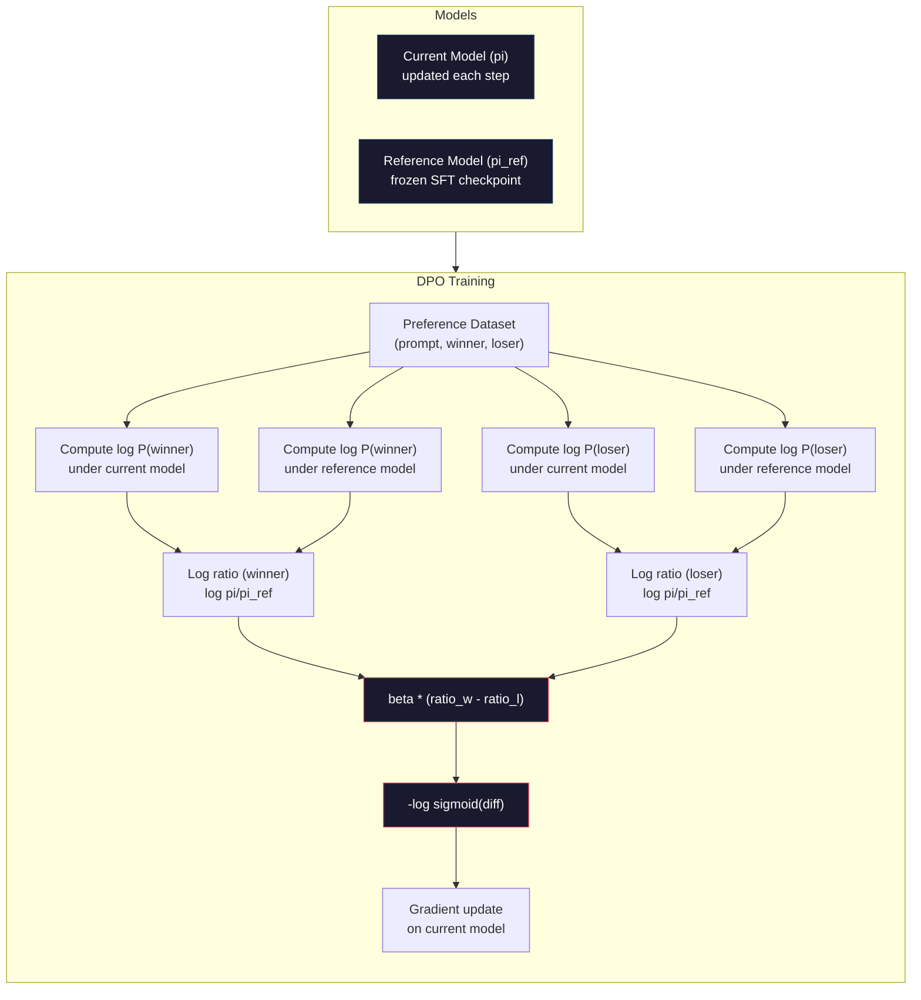

# Optimisation directe des préférences

> Le RLHF fonctionne. Il nécessite également la formation de trois modèles (SFT, modèle de récompense, politique), la gestion de l'instabilité du PPO et la régulation d'une pénalité KL. Le DPO demande: et si vous pouviez tout ça ?

> **【中文解读】**RLHF 需要训练三个模型(SFT、奖励模型、策略), également pour traiter l'instabilité du PPO──DPO 直接在偏好对上优化语言模型不需要奖励模型,不需要 PPO,一个训练循环,效果相当──

> **【拓展：DPO→简化对齐】**Le DPO est un programme de remplacement de la RLHF proposé par Stanford en 2023, qui est devenu le premier modèle de base de nombreuses sources (comme Zephyr、Tulu). Il simplifiera le processus complexe de formation de la RLHF en une simple classification de perte de classe.

>  **【前置】**C'est un programme de formation qui est très bien conçu pour les étudiants et les étudiants.

**Type:** Build
**Languages:** Python (with numpy)
**Prerequisites:** Phase 10, Lesson 07 (RLHF)
**Time:** ~90 minutes

>  **【类比】**DPO vs RLHF = 直接教育 vs 训练动物。RLHF:先训一个"老师"(RM) donner aux étudiants un partage, reutiliser PPO 让学生讨老师欢心3 个模型 + 复杂训练。DPO:直接给学生看"好答案"和"坏答案"对照,让它自己学1 个模型 + 简单交叉──DPO en mathématique a prouvé " faire des classes sur des données préférées" égal à "L'RLHF's best-out",省去了显然 RM──

> ️ **【易错点】**3 个坑: 1)**偏好数据质量决定一切**DPO 不像RLHF 有RM平滑噪音,标注错的偏好对直接学错;务必做标注质量控制──(2) **β 系数设错**太大(> 0,5)模型不变,太小(< 0,05)模型偏离 SFT 太远; typiquement 0,1──(3) **没做 reference model**perte de DPO 需要相对 SFT 模型的日志-prob 差分, oublier de charger le modèle de référence 会训练崩;用 `AutoModelForCausalLM.from_pretrained(sft_path)`Faire référence.

## Objectifs d'apprentissage

- Implementer une formation en DPO qui optimise directement un modèle de langue sur les paires de préférences sans modèle de récompense séparé
  ¢ réaliser un entraînement en DPO, directement dans le modèle de préférence à l'optimisation linguistique, sans avoir besoin d'un modèle de récompense unique
- Dériver la fonction de perte de DPO et expliquer comment elle représente implicitement un modèle de récompense à travers les probabilités de log de la police
  推导 DPO 损失函数, expliquer comment il est utilisé par la stratégie de la probabilité de contre-numéro
- Comparer DPO et RLHF en termes de stabilité de formation, de coûts informatiques et de nombre de modèles requis
  Comparer le DPO à la RLHF en termes de stabilité de formation, de coûts de calcul et de nombre de modèles nécessaires
- Modifier le paramètre bêta pour contrôler la différence entre la politique formée et le modèle de référence
  调节 bêta 参数, contrôler les stratégies de formation déviant du niveau du modèle de référence

> **【中文解读】**Le concept de la RLHF est de simplifier le RLHF en un processus d'apprentissage supervisé, un modèle, une fonction de perte, un cycle de formation.

## Le problème , l' introduction du problème

Vous avez construit un pipeline RLHF dans la leçon 07. Trois étapes. Trois modèles. Le modèle SFT, le modèle de récompense et le modèle de politique optimisé avec PPO. Le modèle de récompense seul nécessitait des milliers de paires de préférences humaines et une boucle de formation distincte.

> Vous avez construit la ligne de conduite RLHF en 7e classe. Il y a trois étapes.

En pratique, la formation en PPO est notoirement instable. De petits changements d'hyperparamètre font diverger la formation. Le modèle de récompense est un proxy imparfait des préférences humaines, et la politique trouve des moyens d'exploiter ses faiblesses. La pénalité KL aide mais nécessite son propre réglage - trop bas et vous obtenez un piratage de la récompense, trop élevé et le modèle apprend à peine.

> En pratique, l'entraînement de la PPO est appelé instable. Les changements superparamètres de petite taille peuvent entraîner la diffusion de l'entraînement. Le modèle de récompense est un agent imparfait des préférences humaines.

Cette complexité est la raison pour laquelle la plupart des modèles open source ont eu du mal à utiliser RLHF pendant des années après la publication d'InstructGPT.

> Cette complexité est la raison pour laquelle la plupart des modèles open source ont été difficiles à utiliser pendant de nombreuses années après la publication d'InstructGPT.

En mai 2023, Rafael Rafailov, Archit Sharma et leurs collègues de Stanford ont publié " Optimisation directe des préférences: votre modèle de langue est secrètement un modèle de récompense. " L'idée clé: vous n'avez pas besoin d'un modèle de récompense séparé. La fonction de récompense optimale est déterminée mathématiquement par les probabilités de jetons du modèle de langage. Vous pouvez sauter le modèle de récompense entièrement et optimiser le modèle de langue directement sur les paires de préférences.

> Raphaël Rafailov, Archit Sharma et ses collègues de Stanford ont publié "Optimisation directe des préférences: votre modèle de langue est secrètement un modèle de récompense"[2].

Le DPO réduit le RLHF à une seule étape d'apprentissage supervisée. Un modèle. Une fonction de perte. Une boucle de formation. Aucun apprentissage de renforcement. Zephyr-7B, l'un des premiers modèles à utiliser le DPO à grande échelle, a correspondu ou battu des modèles formés avec le RLHF complet sur plusieurs repères. Meta a utilisé le DPO dans le cadre du pipeline d'alignement de Llama 3. Anthropic a cité des méthodes de style DPO dans leur recherche d'alignement.

> Le DPO va simplifier le RLHF en un seul processus d'apprentissage de surveillance. Un modèle. Une fonction de perte. Un cycle de formation. Il n'y a pas besoin de renforcement chimique. Zephyr-7B est l'un des premiers modèles de DPO à utiliser à grande échelle, en utilisant plusieurs bases de référence pour adapter ou dépasser l'utilisation complète de RLHF.

> **【中文解读】**DPO a résolu les trois grands points de RLHF: 1) pas besoin de modèle de récompense de formation individuelle; 2) pas besoin de traiter l'instabilité et les surparametres de PPO; 3) de la simplification de la ligne de trois modèles en un seul cycle de formation.

> **【拓展：DPO 在开源社区的普及】**Le DPO est devenu le premier modèle open source à utiliser. HuggingFace TRL 库原生支持 DPO,Zephyr、Tulu、OpenHermes 等知名开源模型都使用 DPO 替代PPO──与RLHF相比,DPO entraînement coût représente environ 1/3 de la fin de la dernière (((moins d'un modèle de récompense), et entraînement plus stable──Llama 3 de la formation de DPO et d'autres méthodes ont été combinées.

## Le concept de base.

### Le point de vue clé

RLHF optimise cet objectif:

> RLHF 优化这个目标:

où R est le modèle de récompense, pi est la politique, pi_ref est le modèle de référence et beta est le coefficient KL.

> Parmi eux, R est le modèle de récompense, pi est la stratégie, pi_ref est le modèle de référence, bêta est le nombre de KL.

Le document du DPO a montré que cet objectif a une solution optimale en forme fermée.

> Le document du DPO indique que cet objectif a une meilleure solution de forme fermée. Pour toute fonction de récompense R, la meilleure stratégie est:

où Z(x) est une constante de normalisation.

> Parmi eux, Z(x) est le nombre de références.

C'est la percée. La récompense est entièrement exprimée en termes de probabilités du modèle de politique et de probabilités du modèle de référence. Vous n'avez pas besoin de former un modèle de récompense séparé. La récompense est * implicite * dans le rapport de probabilité.

> C'est la percée. La récompense est entièrement décrite par la probabilité du modèle stratégique et la probabilité du modèle de référence.

Pour remplacer ce modèle de préférence Bradley-Terry:

> Pour le remplacer par Bradley-Terry:

Les termes Z(x) sont annulés parce que les deux réponses sont conditionnées sur le même prompt x. Ce qui reste est une fonction des seules probabilités de logs du modèle de politique et des probabilités de logs du modèle de référence sur les réponses préférées et rejetées.

> Z(x) 项消去了, parce que les deux réponses sont toutes les mêmes prompt x en tant que condition.

### La perte du DPO

```
L_DPO = -log(sigmoid(beta * (log pi(y_w|x)/pi_ref(y_w|x) - log pi(y_l|x)/pi_ref(y_l|x))))
```

Déballer chaque pièce:

> Laissez-nous résoudre chaque partie:

- **y_w**= réponse préférée (gagnant)
- **y_l**= réponse rejetée (perdue)
- **x**= rapidement
- **pi**= modèle actuel (être formé)
- **pi_ref**= modèle de référence (point de contrôle de la FFT gelé)
- **beta**= paramètre de température contrôlant l'écart de référence (généralement de 0,1 à 0,5)

> **【中文解读】**Le cœur de la fonction DPO est " à la probabilité de la probabilité de la probabilité de la probabilité ": bêta * (log pi(y_w) /pi_ref(y_w) - log pi(y_l) /pi_ref(y_l))。 elle mesure le modèle de stratégie par rapport au modèle de référence préféré choisi Réponse、 préféré non préféré rejeté Répondre à la mesure de la probabilité de la probabilité de la probabilité de la probabilité de la probabilité de la probabilité de la probabilité de la probabilité de la probabilité de la probabilité de la probabilité de la probabilité de la probabilité de la probabilité de la probabilité de la probabilité de la probabilité de la probabilité de la probabilité de la probabilité de la probabilité de la probabilité de la probabilité de la probabilité de la probabilité de la probabilité de la probabilité de la probabilité de la probabilité de la probabilité de la probabilité de la probabilité de la probabilité de la probabilité de la probabilité de la probabilité de la probabilité de la probabilité de la probabilité de la probabilité de la probabilité de la probabilité de la probabilité de la probabilité de la probabilité de la probabilité de la probabilité de la probabilité de la probabilité de la probabilité de la probabilité de la probabilité de la probabilité de la probabilité de la probabilité de la probabilité de la probabilité de la probabilité de la probabilité de la probabilité de la probabilité de la probabilité de la probabilité de la probabilité de la probabilité de la probabilité de la probabilité de la probabilité de la probabilité de la probabilité de la probabilité de la probabilité de la probabilité de la probabilité de la probabilité de la probabilité de la probabilité de la probabilité de la probabilité de la probabilité de la probabilité de la probabilité de la probabilité de la probabilité de la probabilité de la probabilité de la probabilité de la probabilité de la probabilité de la probabilité de la probabilité de la probabilité de la probabilité de la probabilité de la probabilité de la probabilité de la probabilité de la probabilité de la probabilité de la probabilité de la probabilité de la probabilité de la probabilité de la probabilité

> **【拓展：DPO 的数学直觉】**La rupture du DPO réside dans l'expression de la fonction de récompense " cachée " dans le RLHF pour le modèle de stratégie et la probabilité de modèle de référence: R(x,y) = beta * log(pi(y) / pi_ref ((yx)) + const. Cela signifie qu'il n'y a pas besoin de formation apparente du modèle de récompense. Le modèle de stratégie est lui-même le modèle de récompense.

Le ratio `log pi(y|x) / pi_ref(y|x)`Le modèle actuel attribue une probabilité plus élevée à la réponse y que la référence.

> %`log pi(y|x) / pi_ref(y|x)`Le taux de probabilité est le plus élevé. Le taux de probabilité est le plus élevé.

La perte de DPO pousse le modèle à augmenter le rapport de probabilité de log pour les réponses préférées et à le diminuer pour les réponses rejetées. Le paramètre bêta contrôle la façon dont le modèle peut dévier de la référence - petite bêta signifie que de grandes déviations sont autorisées, grande bêta garde le modèle proche de la référence.

> DPO perte de propulsion du modèle augmenter la probabilité de réponse de première sélection par rapport au nombre, réduire la probabilité de rejet de réponse par rapport au nombre.



### Pourquoi le DPO est plus simple

| Aspect | RLHF (PPO) | DPO |
|--------|-----------|-----|
| Models to train | 3 (SFT + reward + policy) | 1 (policy only) |
| Training loops | 3 (SFT, RM training, PPO) | 2 (SFT, DPO) |
| Hyperparameters | lr, KL coeff, clip ratio, RM lr, epochs x3 | lr, beta, epochs |
| Reward model | Required (separate training) | Implicit in model probabilities |
| RL algorithm | PPO (complex, unstable) | Supervised learning (stable) |
| GPU memory | 3-4 models in memory during PPO | 2 models (current + reference) |
| Training stability | Sensitive to hyperparameters | Robust, similar to SFT |

Le DPO a besoin de deux modèles dans la mémoire pendant la formation - le modèle actuel et la référence gelée. RLHF a besoin de trois ou quatre: la politique, la référence, le modèle de récompense, et optionnellement une fonction de base de valeur. Pour un modèle 70B, chaque copie prend 140 Go en FP16.

> La formation du DPO nécessite deux modèles en mémoire Modèles actuels et modèles de référence RLHF nécessite trois ou quatre modèles: stratégie, référence, modèle de récompense, ainsi que des fonctions de valeur optionnelles. Pour le modèle 70B, chaque exemplaire en FP16 représente 140 Go.

### Quand le DPO bat le RLHF

**Small datasets.**Avec 5 000 à 20 000 paires de préférences, le DPO correspond souvent à ou dépasse le RLHF. Le modèle de récompense dans le RLHF a besoin de suffisamment de données pour généraliser - avec des données limitées, il dépasse et produit des signaux de récompense peu fiables.

> **小型数据集。**Les modèles de récompense de RLHF et de RLHF sont généralement adaptés ou supérieurs à ceux de RLHF. Les modèles de récompense de RLHF ont besoin de suffisamment de données pour générer des données limitées.

**Limited compute.**Le DPO nécessite environ un tiers du calcul de la RLHF complète (une boucle d'entraînement au lieu de trois). Pour les équipes sans grands graphes graphiques, c'est le choix pratique.

> **有限算力。**DPO environ seulement besoin d'un RLHF complet en trois tiers de calcul. Pour une équipe sans un gros GPU, c'est la meilleure option.

**Rapid iteration.**Si vous voulez essayer 10 ensembles de données de préférence différents pour voir lequel produit le meilleur modèle, le DPO vous permet d'exécuter chaque expérience en quelques heures.

> **快速迭代。**想尝试10 different preferences data sets See which produces the best model?DPO 让你在几小时内运行每一次实验――RLHF 需要为每一个数据集重新训练奖励模型――

### Quand le RLHF bat le DPO

**Large-scale training.**À l'échelle de GPT-4 ou Claude, le modèle de récompense séparé de RLHF peut capturer des signaux de préférence plus nuancés.

> **大规模训练。**À l'échelle du GPT-4 ou de Claude, le modèle de récompense indépendant de la RLHF peut capturer des signaux de préférence plus détaillés.

**Complex reward signals.**Quand "meilleur" implique plusieurs dimensions (utilité, innocuité, honnêteté), un modèle de récompense peut apprendre ce compromis multi-objectif. Le DPO traite chaque paire de préférences comme un signal binaire - l'un est meilleur, l'autre pire - sans modéliser pourquoi.

> **复杂奖励信号。**Lorsque "meilleur" implique plusieurs dimensions (utilité, inoffensivité, honnêteté), le modèle de récompense peut apprendre ce type de poids multi-objectif.

**Iterative alignment.**Les pipelines RLHF peuvent générer de nouvelles réponses avec la politique actuelle, les faire évaluer par les humains et retrainer le modèle de récompense dans une boucle en ligne.

> **迭代对齐。**Le RLHF peut générer de nouveaux retours, faire des évaluations humaines et refaire des exercices de récompense dans le cycle en ligne.

### Au-delà du DPO: KTO, ORPO, SimPO

Le DPO a inspiré une famille de méthodes d'alignement simplifiées.

> Le DPO a lancé une série de méthodes simplifiées pour la préparation.

**KTO (Kahneman-Tversky Optimization, 2024):**Vous n'avez même pas besoin de paires. KTO travaille avec des retours inégalés - étiquettez chaque réponse comme "bon" ou "mauvais" sans la comparer à une alternative. Cela simplifie considérablement la collecte de données. Au lieu de montrer aux annotateurs deux réponses et de demander " laquelle est meilleure ", vous montrez une réponse et demandez " est-ce que c'est bon ? " La fonction de perte applique l'aversion à la perte de la théorie des perspectives: les mauvaises réponses sont pénalisées plus que les bonnes réponses sont récompensées.

> **KTO（Kahneman-Tversky 优化，2024）：**Vous n'avez même pas besoin de couplage. Vous n'avez pas besoin de comparer. Vous n'avez pas besoin de comparer. Vous n'avez pas besoin de comparer.

**ORPO (Odds Ratio Preference Optimization, 2024):**Combine SFT et alignement dans une seule étape de formation. Au lieu de faire d'abord SFT puis DPO, ORPO modifie la perte SFT pour inclure un signal de préférence. La perte a deux termes: une perte de prédiction standard de jeton suivant sur les réponses préférées, plus un terme de ratio de cotes qui augmente l'écart entre les probabilités de réponse préférées et rejetées.

> **ORPO（赔率比偏好优化，2024）：**Dans une seule étape de formation, combiner SFT et c'est-à-dire l'ORPO modifier SFT perte pour contenir des signaux de préférence, plutôt que de faire SFT et de faire DPO perte a deux éléments:

**SimPO (Simple Preference Optimization, 2024):**Il élimine entièrement le modèle de référence. Au lieu de calculer les ratios de probabilité de log contre une référence gelée, SimPO utilise la probabilité moyenne de log de la réponse (normalement par longueur) comme récompense implicite. Cela permet d'économiser de la mémoire (aucun modèle de référence n'est nécessaire) et de simplifier l'entraînement. La normalisation de la longueur empêche le modèle de favoriser des réponses plus courtes.

> **SimPO（简单偏好优化，2024）：**完全消除参考模型──SIMPO 使用回复的平均对数概率 (%) 根据长度归化) comme récompense intime, plutôt que de résoudre le problème 结参考计算对数概率比── ceci a permis d'économiser du stockage (%) 无需参考模型 (%) 并简化了训练──长度归化防止模型偏向更短的回复──

| Method | Year | Models in Memory | Needs Pairs? | Needs Reference? | Training Loops |
|--------|------|-----------------|-------------|-----------------|----------------|
| RLHF | 2022 | 3-4 | Yes (for RM) | Yes | 3 |
| DPO | 2023 | 2 | Yes | Yes | 2 |
| KTO | 2024 | 2 | No (unpaired) | Yes | 2 |
| ORPO | 2024 | 1 | Yes | No | 1 |
| SimPO | 2024 | 1 | Yes | No | 1 |

La tendance est claire: chaque méthode élimine une partie de la complexité. RLHF a besoin d'un modèle de récompense et PPO. DPO a éliminé les deux. KTO a éliminé les données en paires. ORPO a éliminé la phase séparée SFT. SimPO a éliminé le modèle de référence. La taxe d'alignement - le coût de calcul et de complexité de passer d'un modèle de base à un modèle aligné - continue de baisser.

> 趋势很明确: chaque méthode élimine une complexité―RLHF 需要奖励模型和PPO―DPO 消除两者―KTO 消除对对数据――ORPO 消除单独的SFT 阶段―SIMPO 消除参考模型―对齐税从基础模型到对齐模型的计算和复杂性成本持续下降―

### Réels déploiements de DPO

**Zephyr-7B (HuggingFace, October 2023):**Mistral 7B base, SFT sur UltraChat (200K exemples), puis DPO sur UltraFeedback (60K paires de préférence). Score 6.47 sur MT-Bench - le modèle 7B le plus élevé à l'époque. Pour comparaison, Llama 2 Chat 70B a obtenu 6.86, ce qui signifie Zephyr a obtenu dans les 6% d'un modèle 10 fois sa taille en utilisant uniquement l'alignement DPO.

> **Zephyr-7B（HuggingFace，2023 年 10 月）：**Mistral 7B base model, sur UltraChat(200K échantillon) faire SFT, puis sur UltraFeedback(60K  préférence contre) faire DPO──MT-Bench obtenir un score de 6,47 alors le plus élevé 7B 模型── par rapport à Llama 2 Chat 70B obtenir un score de 6,86, ce qui signifie Zephyr  seulement avec DPO pour Zizia a atteint un niveau de 94% de plus grand que 10 fois modèle──

**Llama 3 (Meta, April 2024):**Utilisé DPO après les premières étapes de RLHF. La combinaison suggère que DPO et RLHF peuvent être complémentaires - RLHF pour l'alignement large, DPO pour le raffinement ciblé.

> **Llama 3（Meta，2024 年 4 月）：**Dans la phase initiale de RLHF, il est utilisé par la DPO. Cette combinaison indique que le DPO et le RLHF peuvent être complétés par le RLHF.

**Neural Magic / nm-chat (2024):**Appliqué DPO à plusieurs modèles open source, montrant constamment une amélioration de 5 à 15% des benchmarks d'alignement par rapport aux lignes de base uniquement SFT.

> **Neural Magic / nm-chat（2024）：**Le DPO est appliqué à plusieurs modèles open source, avec une augmentation de 5 à 15% par rapport à la base pure SFT.

## Construisez-le et mettez-le en œuvre.
```figure
dpo-loss
```

## Faites-le

### Étape 1: Ensemble de données de préférence

Le même format que RLHF -- (prompte, préférée, rejetée) triple. DPO consomme ces données directement sans un modèle de récompense intermédiaire.

> 格式与 RLHF 相同(prompt, 首选, 被拒绝) 三元组──DPO 直接消费这些数据,无需中间的奖励模型──

```python
import numpy as np
import sys
import os
sys.path.insert(0, os.path.join(os.path.dirname(__file__), "..", "..", "04-pre-training-mini-gpt", "code"))
from main import MiniGPT, LayerNorm, Embedding, TransformerBlock

PREFERENCE_DATA = [
    {
        "prompt": "What is the capital of France?",
        "preferred": "The capital of France is Paris.",
        "rejected": "France is a country in Europe. It has many cities. The capital is Paris. Paris is known for the Eiffel Tower.",
    },
    {
        "prompt": "Explain gravity in one sentence.",
        "preferred": "Gravity is the force that attracts objects with mass toward each other.",
        "rejected": "Gravity is something that makes things fall down when you drop them.",
    },
    {
        "prompt": "What is 15 times 7?",
        "preferred": "15 times 7 is 105.",
        "rejected": "Let me think about this. 15 times 7. Well, 10 times 7 is 70, and 5 times 7 is 35, so the answer might be around 105.",
    },
    {
        "prompt": "Name three programming languages.",
        "preferred": "Python, Rust, and TypeScript.",
        "rejected": "There are many programming languages. Some popular ones include various languages like Python and others.",
    },
    {
        "prompt": "What year did World War II end?",
        "preferred": "World War II ended in 1945.",
        "rejected": "World War II was a major global conflict. It involved many countries. The war ended in the mid-1940s, specifically in 1945.",
    },
    {
        "prompt": "Define machine learning.",
        "preferred": "Machine learning is a field where algorithms learn patterns from data to make predictions without being explicitly programmed.",
        "rejected": "Machine learning is a type of AI. AI stands for artificial intelligence. Machine learning uses data to learn.",
    },
]
```

### Étape 2: Probabilité de la saisie de séquences

La perte de DPO nécessite le calcul de la probabilité totale de log d'une réponse donnée à un prompt. Cela signifie exécuter le modèle sur la séquence complète (prompt + réponse) et résumer les probabilités de log de chaque jeton de réponse.

> DPO 损失需要计算给定提示下回复的总对数概率──这意味着在完整的(prompt + 回复) séquence运行模型,并对每个回复代币的对数概率求和──

```python
def tokenize_sequence(text, vocab_size=256):
    return [min(t, vocab_size - 1) for t in list(text.encode("utf-8"))]


def compute_sequence_log_prob(model, prompt_tokens, response_tokens, max_seq_len=128):
    full_sequence = prompt_tokens + response_tokens
    if len(full_sequence) > max_seq_len:
        full_sequence = full_sequence[:max_seq_len]

    if len(full_sequence) < 2:
        return 0.0

    input_ids = np.array(full_sequence[:-1]).reshape(1, -1)
    target_ids = np.array(full_sequence[1:])

    logits = model.forward(input_ids)
    logits = logits[0]

    max_logits = logits.max(axis=-1, keepdims=True)
    log_probs = logits - max_logits - np.log(
        np.exp(logits - max_logits).sum(axis=-1, keepdims=True)
    )

    prompt_len = len(prompt_tokens)
    response_start = max(0, prompt_len - 1)
    response_end = len(target_ids)

    if response_start >= response_end:
        return 0.0

    response_log_probs = log_probs[response_start:response_end, :]
    response_targets = target_ids[response_start:response_end]

    total_log_prob = 0.0
    for i, target in enumerate(response_targets):
        total_log_prob += response_log_probs[i, target]

    return total_log_prob
```

Cette fonction est le cheval de travail du DPO. Pour chaque paire de préférences, elle fonctionne quatre fois: modèle sur réponse préférée, modèle sur réponse rejetée, référence sur réponse préférée, référence sur réponse rejetée. C'est 4 passes avant par exemple de formation par rapport à la génération de RLHF + score de récompense + estimation de valeur + mise à jour PPO. Plus simple, plus rapide, plus stable.

> Cette fonction est la principale force du DPO. Pour chaque préférence, elle fonctionne quatre fois: modèle en premier choix, modèle en premier rejet, modèle en premier rejet, référence en premier choix, référence en premier rejet.

### Étape 3: Perte de la DPO

Le cœur du papier en code, une fonction, une perte, aucun modèle de récompense.

> 论文核心的代码实现――一个函数――一个损失――无需奖励模型――

```python
def sigmoid(x):
    return np.where(
        x >= 0,
        1.0 / (1.0 + np.exp(-x)),
        np.exp(x) / (1.0 + np.exp(x))
    )


def dpo_loss(policy_logprob_preferred, policy_logprob_rejected,
             ref_logprob_preferred, ref_logprob_rejected, beta=0.1):
    preferred_ratio = policy_logprob_preferred - ref_logprob_preferred
    rejected_ratio = policy_logprob_rejected - ref_logprob_rejected

    logit = beta * (preferred_ratio - rejected_ratio)

    loss = -np.log(sigmoid(logit) + 1e-8)

    preferred_reward = beta * preferred_ratio
    rejected_reward = beta * rejected_ratio

    return loss, {
        "preferred_ratio": float(preferred_ratio),
        "rejected_ratio": float(rejected_ratio),
        "logit": float(logit),
        "implicit_preferred_reward": float(preferred_reward),
        "implicit_rejected_reward": float(rejected_reward),
        "reward_margin": float(preferred_reward - rejected_reward),
    }
```

Le `preferred_ratio`et `rejected_ratio`Les rapports de probabilité logistique de la dérivation DPO. Lorsque le modèle actuel attribue une probabilité plus élevée à la réponse préférée (par rapport à la référence) et une probabilité plus faible à la réponse rejetée, la logite est positive et la perte est faible.

> `preferred_ratio`et `rejected_ratio`Il est vrai que la probabilité de répartition des nombres dans la DPO est plus faible.

Le `implicit_preferred_reward`et `implicit_rejected_reward`Vous pouvez les extraire pour vérifier que la formation fonctionne - la marge entre les récompenses préférées et rejetées devrait augmenter par rapport à la formation.

> `implicit_preferred_reward`et `implicit_rejected_reward`Les premiers résultats de la formation sont les premiers résultats de la formation.

### Étape 4: cycle de formation du DPO

Un cycle d'entraînement supervisé standard, pas de PPO, pas de modèle de récompense, juste des passes avant et des mises à jour de gradient.

> 標準的监督学习训练循环──无需PPO──无需奖励模型──只有前向传播和梯度更新──

```python
def copy_model_weights(source, target):
    target.embedding.token_embed = source.embedding.token_embed.copy()
    target.embedding.pos_embed = source.embedding.pos_embed.copy()
    target.ln_f.gamma = source.ln_f.gamma.copy()
    target.ln_f.beta = source.ln_f.beta.copy()
    for s_block, t_block in zip(source.blocks, target.blocks):
        t_block.attn.W_q = s_block.attn.W_q.copy()
        t_block.attn.W_k = s_block.attn.W_k.copy()
        t_block.attn.W_v = s_block.attn.W_v.copy()
        t_block.attn.W_out = s_block.attn.W_out.copy()
        t_block.ffn.W1 = s_block.ffn.W1.copy()
        t_block.ffn.W2 = s_block.ffn.W2.copy()
        t_block.ffn.b1 = s_block.ffn.b1.copy()
        t_block.ffn.b2 = s_block.ffn.b2.copy()
        t_block.ln1.gamma = s_block.ln1.gamma.copy()
        t_block.ln1.beta = s_block.ln1.beta.copy()
        t_block.ln2.gamma = s_block.ln2.gamma.copy()
        t_block.ln2.beta = s_block.ln2.beta.copy()


def dpo_train(policy_model, reference_model, preference_data,
              num_epochs=5, lr=5e-6, beta=0.1, max_seq_len=128):
    print(f"DPO Training: {len(preference_data)} pairs, {num_epochs} epochs, "
          f"lr={lr}, beta={beta}")
    print()

    losses = []
    margins = []

    for epoch in range(num_epochs):
        epoch_loss = 0.0
        epoch_margin = 0.0
        num_examples = 0

        indices = np.random.permutation(len(preference_data))

        for idx in indices:
            pair = preference_data[idx]

            prompt_tokens = tokenize_sequence(pair["prompt"])
            preferred_tokens = tokenize_sequence(pair["preferred"])
            rejected_tokens = tokenize_sequence(pair["rejected"])

            pi_logprob_w = compute_sequence_log_prob(
                policy_model, prompt_tokens, preferred_tokens, max_seq_len
            )
            pi_logprob_l = compute_sequence_log_prob(
                policy_model, prompt_tokens, rejected_tokens, max_seq_len
            )
            ref_logprob_w = compute_sequence_log_prob(
                reference_model, prompt_tokens, preferred_tokens, max_seq_len
            )
            ref_logprob_l = compute_sequence_log_prob(
                reference_model, prompt_tokens, rejected_tokens, max_seq_len
            )

            loss, metrics = dpo_loss(
                pi_logprob_w, pi_logprob_l,
                ref_logprob_w, ref_logprob_l, beta
            )

            update_direction = 1.0 if metrics["logit"] < 0 else -0.1
            for block in policy_model.blocks:
                block.ffn.W1 += lr * update_direction * np.random.randn(*block.ffn.W1.shape) * 0.01
                block.ffn.W2 += lr * update_direction * np.random.randn(*block.ffn.W2.shape) * 0.01

            epoch_loss += loss
            epoch_margin += metrics["reward_margin"]
            num_examples += 1
            losses.append(float(loss))
            margins.append(metrics["reward_margin"])

        avg_loss = epoch_loss / max(num_examples, 1)
        avg_margin = epoch_margin / max(num_examples, 1)

        print(f"  Epoch {epoch + 1}/{num_epochs} | Loss: {avg_loss:.4f} | "
              f"Avg Margin: {avg_margin:.4f}")

    return policy_model, losses, margins
```

La boucle de formation est rafraîchissante par rapport à RLHF. Pour chaque paire de préférences: calculer quatre log-probabilités (deux modèles, deux réponses), les brancher dans la perte DPO, calculer le gradient, mettre à jour la politique. Pas de génération étape. Pas d'inférence de modèle de récompense. Pas d'estimation de l'avantage. Pas de coupure.

> Par rapport à la RLHF, le cycle de formation est simple et remarquable. Pour chaque préférence: calculer quatre contre-probabilités numériques, deux modèles, deux répétitions), entrer en DPO, perdre, calculer la échelle, mettre à jour la stratégie.

### Étape 5: Comparer le DPO et le RLHF

Mesurer les marges de récompense implicites et les changements de probabilité de log pour comparer le DPO au modèle RLHF de la leçon 07.

> ∆ La mesure de la distance de récompense cachée et de la déviation de la probabilité des nombres, sera comparée au modèle RLHF de la 7e classe.

```python
def evaluate_preference_accuracy(model, reference_model, preference_data, beta=0.1, max_seq_len=128):
    correct = 0
    total = 0

    for pair in preference_data:
        prompt_tokens = tokenize_sequence(pair["prompt"])
        preferred_tokens = tokenize_sequence(pair["preferred"])
        rejected_tokens = tokenize_sequence(pair["rejected"])

        pi_w = compute_sequence_log_prob(model, prompt_tokens, preferred_tokens, max_seq_len)
        pi_l = compute_sequence_log_prob(model, prompt_tokens, rejected_tokens, max_seq_len)
        ref_w = compute_sequence_log_prob(reference_model, prompt_tokens, preferred_tokens, max_seq_len)
        ref_l = compute_sequence_log_prob(reference_model, prompt_tokens, rejected_tokens, max_seq_len)

        preferred_reward = beta * (pi_w - ref_w)
        rejected_reward = beta * (pi_l - ref_l)

        if preferred_reward > rejected_reward:
            correct += 1
        total += 1

    return correct / max(total, 1)


def analyze_implicit_rewards(model, reference_model, preference_data, beta=0.1, max_seq_len=128):
    print("Implicit Reward Analysis:")
    print("-" * 65)
    print(f"  {'Prompt':<30} {'Pref Reward':>12} {'Rej Reward':>12} {'Margin':>10}")
    print("  " + "-" * 60)

    for pair in preference_data:
        prompt_tokens = tokenize_sequence(pair["prompt"])
        preferred_tokens = tokenize_sequence(pair["preferred"])
        rejected_tokens = tokenize_sequence(pair["rejected"])

        pi_w = compute_sequence_log_prob(model, prompt_tokens, preferred_tokens, max_seq_len)
        pi_l = compute_sequence_log_prob(model, prompt_tokens, rejected_tokens, max_seq_len)
        ref_w = compute_sequence_log_prob(reference_model, prompt_tokens, preferred_tokens, max_seq_len)
        ref_l = compute_sequence_log_prob(reference_model, prompt_tokens, rejected_tokens, max_seq_len)

        pref_reward = beta * (pi_w - ref_w)
        rej_reward = beta * (pi_l - ref_l)
        margin = pref_reward - rej_reward

        truncated = pair["prompt"][:28] + ".." if len(pair["prompt"]) > 30 else pair["prompt"]
        print(f"  {truncated:<30} {pref_reward:>12.4f} {rej_reward:>12.4f} {margin:>10.4f}")

    print()
```

### Étape 6: Analyse de la sensibilité bêta

Le paramètre bêta est l'équivalent de DPO du coefficient KL dans RLHF. Il contrôle la mesure dans laquelle le modèle peut dévier de la référence.

> Le paramètre bêta est équivalent au DPO au paramètre de la classe KL de RLHF. Le modèle de contrôle peut être dévié du modèle de référence.

```python
def beta_sensitivity_analysis(sft_model, preference_data, betas, max_seq_len=128):
    print("Beta Sensitivity Analysis")
    print("-" * 60)
    print(f"  {'Beta':>8} {'Final Loss':>12} {'Final Margin':>14} {'Accuracy':>10}")
    print("  " + "-" * 55)

    results = []

    for beta in betas:
        policy = MiniGPT(
            vocab_size=256, embed_dim=128, num_heads=4,
            num_layers=4, max_seq_len=max_seq_len, ff_dim=512
        )
        reference = MiniGPT(
            vocab_size=256, embed_dim=128, num_heads=4,
            num_layers=4, max_seq_len=max_seq_len, ff_dim=512
        )
        copy_model_weights(sft_model, policy)
        copy_model_weights(sft_model, reference)

        policy, losses, margins_list = dpo_train(
            policy, reference, preference_data,
            num_epochs=3, lr=5e-6, beta=beta, max_seq_len=max_seq_len
        )

        accuracy = evaluate_preference_accuracy(
            policy, reference, preference_data, beta, max_seq_len
        )

        final_loss = losses[-1] if losses else 0
        final_margin = margins_list[-1] if margins_list else 0

        print(f"  {beta:>8.3f} {final_loss:>12.4f} {final_margin:>14.4f} {accuracy:>10.1%}")
        results.append({
            "beta": beta,
            "final_loss": final_loss,
            "final_margin": final_margin,
            "accuracy": accuracy,
        })

        print()

    return results
```

La petite bêta (0.01) permet au modèle de dévier librement de la référence - apprentissage rapide mais risque de solutions dégénérées. La grande bêta (1.0) maintient le modèle proche de la référence - apprentissage stable mais lent. Le point de départ pour la plupart des applications est de 0,1 à 0,3.

> Petit beta(0.01) Faire le modèle libre de se détourner de la référence apprendre rapidement mais avec une solution dégradée 风险──大beta(1.0) Maintien le modèle proche de la référence stable mais apprendre lent── la plupart des applications ont une valeur optimale de 0,1 à 0,3──

## Utilisez-le avec le cadre de réalisation

### Démo de l'oléoduc de la DPO

```python
if __name__ == "__main__":
    np.random.seed(42)

    print("=" * 70)
    print("DPO: DIRECT PREFERENCE OPTIMIZATION")
    print("=" * 70)
    print()

    print("STEP 1: Initialize SFT Model (from Lesson 06)")
    print("-" * 50)
    sft_model = MiniGPT(
        vocab_size=256, embed_dim=128, num_heads=4,
        num_layers=4, max_seq_len=128, ff_dim=512
    )
    print(f"  Parameters: {sft_model.count_parameters():,}")
    print()

    print("STEP 2: DPO Training")
    print("-" * 50)

    policy_model = MiniGPT(
        vocab_size=256, embed_dim=128, num_heads=4,
        num_layers=4, max_seq_len=128, ff_dim=512
    )
    reference_model = MiniGPT(
        vocab_size=256, embed_dim=128, num_heads=4,
        num_layers=4, max_seq_len=128, ff_dim=512
    )
    copy_model_weights(sft_model, policy_model)
    copy_model_weights(sft_model, reference_model)

    policy_model, losses, margins = dpo_train(
        policy_model, reference_model, PREFERENCE_DATA,
        num_epochs=5, lr=5e-6, beta=0.1
    )
    print()

    print("=" * 70)
    print("STEP 3: Evaluate")
    print("=" * 70)
    print()

    pre_accuracy = evaluate_preference_accuracy(
        sft_model, reference_model, PREFERENCE_DATA, beta=0.1
    )
    post_accuracy = evaluate_preference_accuracy(
        policy_model, reference_model, PREFERENCE_DATA, beta=0.1
    )

    print(f"  Preference accuracy (pre-DPO):  {pre_accuracy:.1%}")
    print(f"  Preference accuracy (post-DPO): {post_accuracy:.1%}")
    print()

    analyze_implicit_rewards(policy_model, reference_model, PREFERENCE_DATA, beta=0.1)

    print("=" * 70)
    print("STEP 4: Training Dynamics")
    print("=" * 70)
    print()

    if losses:
        print("  Loss curve:")
        window = max(1, len(losses) // 5)
        for i in range(0, len(losses), window):
            chunk = losses[i:i + window]
            avg = sum(chunk) / len(chunk)
            print(f"    Steps {i:3d}-{i + len(chunk) - 1:3d}: loss = {avg:.4f}")
        print()

    if margins:
        print("  Reward margin curve:")
        window = max(1, len(margins) // 5)
        for i in range(0, len(margins), window):
            chunk = margins[i:i + window]
            avg = sum(chunk) / len(chunk)
            print(f"    Steps {i:3d}-{i + len(chunk) - 1:3d}: margin = {avg:.4f}")
        print()

    print("=" * 70)
    print("STEP 5: Beta Sensitivity")
    print("=" * 70)
    print()

    beta_results = beta_sensitivity_analysis(
        sft_model, PREFERENCE_DATA, betas=[0.01, 0.1, 0.3, 1.0]
    )

    print("=" * 70)
    print("DPO vs RLHF COMPARISON")
    print("=" * 70)
    print()
    print("  DPO advantages:")
    print("    - 1 training loop (vs 3 for RLHF)")
    print("    - 2 models in memory (vs 3-4 for RLHF)")
    print("    - Supervised learning (vs RL, more stable)")
    print("    - No reward model to train or maintain")
    print()
    print("  RLHF advantages:")
    print("    - Separate reward model captures complex preferences")
    print("    - Online learning: generate, rate, retrain")
    print("    - Better for multi-objective alignment")
    print("    - Proven at largest scales (GPT-4, Claude)")
    print()
    print("  Practical guidance:")
    print("    - Start with DPO. It's simpler and often sufficient.")
    print("    - Switch to RLHF if DPO plateaus on your eval metrics.")
    print("    - Many production systems use both: RLHF first, DPO to refine.")
```

## Envoyez-le . Produit .

Cette leçon produit `outputs/prompt-alignment-method-selector.md`- une demande qui vous aide à choisir la bonne méthode d'alignement (SFT, RLHF, DPO, KTO, ORPO, SimPO) pour votre cas d'utilisation.

> 本课产 出 `outputs/prompt-alignment-method-selector.md` Un guide pour vous aider à choisir correctement la méthode de préparation (SFT, RLHF, DPO, KTO, ORPO, SimPO)  Pour vous aider à choisir correctement la méthode de préparation (SFT, RLHF, DPO, KTO, ORPO, SimPO)  Selon votre utilisation des données, votre budget et votre objectif de préparation, il propose une méthode et un plan de formation

## Les exercices

1. Implémenter KTO (Kahneman-Tversky Optimisation). KTO n'a pas besoin de paires - étiquettez chaque réponse comme "bon" ou "mauvaise".`-log(sigmoid(beta * log_ratio))`et pour une mauvaise réponse, c'est `-log(1 - sigmoid(beta * log_ratio))`avec un multiplicateur d'aversion de perte (généralement 1,5x) sur la perte de réponse mauvaise.
   Le KTO n'a pas besoin de coupure  il suffit de marquer chaque retour comme "bon" ou " mauvais"―`-log(sigmoid(beta * log_ratio))`, une perte de réparation est`-log(1 - sigmoid(beta * log_ratio))`,并对坏回复损失应用损失厌恶乘数 ((habituellement 1,5 fois) ⋅在相同数据上训练(将首选视为"好",被拒视为"坏"),并与DPO比较准确率──

2. Implémenter DPO normalisé par longueur. Au lieu de probabilités de journaux brutes, diviser par le nombre de jetons de réponse: `normalized_logprob = total_logprob / num_tokens`- l'analyse des résultats de la recherche de l'analyse de la récompense implique une comparaison des marges de récompense implicites avec et sans normalisation.
   Le nombre de fois par jour est le nombre de fois par jour.`normalized_logprob = total_logprob / num_tokens`◊ Ce qui empêche le modèle de se détourner vers des réponses plus courtes ◊ courte réponses avec une probabilité de nombre de contreparties plus élevée ◊ comparer avec une intégration et une intégration inégalée

3. Construire une perte combinée de style ORPO. Ajoutez une perte de prédiction de jeton suivant standard sur la réponse préférée à la perte DPO: `L = L_sft(preferred) + alpha * L_dpo`. Essayez des valeurs alpha de 0,1, 0,5 et 1.0. La perte combinée doit produire un modèle qui suit les instructions (du terme SFT) et préfère de meilleures réponses (du terme DPO), éliminant ainsi la nécessité d'une étape SFT séparée.
   Le code de la société est le code de la société.`L = L_sft(preferred) + alpha * L_dpo` tenter d'obtenir une perte de composition de valeur de 0,1 ̊ 0,5 ̊ et 1,0 ̊ ⋅ en suivant les instructions déjà reçues de la SFT 项) et de la DPO 项) du modèle, éliminant les besoins de la SFT 阶段单独.

4. Implémenter DPO itératif. Exécuter DPO pendant 3 époques, puis générer de nouvelles réponses à partir du modèle formé, les associer aux réponses préférées d'origine en tant que nouvelles paires de préférences, et exécuter DPO à nouveau. Deux tours de ce processus "auto-jouer". Comparer la précision des préférences après le tour 1 et le tour 2 pour voir si le raffinement itératif aide.
   Le processus de mise en œuvre de la première et deuxième générations de la première génération de la première génération de la seconde génération de la seconde génération de la seconde génération de la seconde génération de la seconde génération de la seconde génération de la seconde génération de la seconde génération de la seconde génération de la troisième génération de la seconde génération de la seconde génération de la troisième génération de la troisième génération de la troisième génération de la troisième génération de la troisième génération de la troisième génération de la troisième génération de la troisième génération de la troisième génération de la troisième génération de la troisième génération de la troisième génération de la troisième génération de la troisième génération de la troisième génération de la troisième génération de la troisième génération de la troisième génération de la troisième génération de la troisième génération de la troisième génération de la troisième génération de la troisième génération de la troisième génération de la troisième génération de la troisième génération de la troisième génération de la troisième génération de la troisième génération de la troisième génération de la troisième génération de la troisième génération de la troisième génération de la troisième génération de la troisième génération de la troisième génération de la troisième génération de la troisième génération de la troisième génération de la troisième génération de la troisième génération de la troisième génération de la troisième génération de la troisième génération de la troisième génération de la troisième génération de la troisième génération de la troisième génération de la troisième génération de la troisième génération de la troisième génération de la troisième génération de la troisième génération de la troisième génération de la troisième génération de la troisième génération de la troisième génération de la troisième génération de la troisième génération de la troisième génération de la troisième génération de la troisième génération de la troisième génération de la troisième génération de la troisième génération de la troisième génération de la troisième génération de la troisième génération de la troisième génération de la troisième génération de la troisième génération de la troisième génération de la troisième génération de la troisième génération de la troisième génération de la troisième génération de la troisième génération de la troisième génération de la troisième génération de la troisième génération de la troisième génération de la troisième génération de la troisième génération de la troisième génération de la troisième génération de

5. Comparer le DPO avec différents modèles de référence. Au lieu d'utiliser le point de contrôle SFT comme référence, essayez: a) le modèle de base (avant le SFT), b) un point de contrôle de l'époque 1 du DPO, c) une moyenne mobile exponentielle du modèle de politique.
   Comparer avec différents modèles de référence DPO── non utiliser SFT 检查点作为参考,尝试:(a) 基础模型(SFT 前),(b) DPO 第 1 个时代的检查点,(c) 策略模型的指数移动平均──报告哪个参考产生最高偏好准确率和最稳定的训练曲线──

## Les termes clés

| Term | What people say | What it actually means | 中文释义 |
|------|----------------|----------------------|---------|
| DPO | "RLHF without RL" | Direct Preference Optimization: a supervised learning algorithm that optimizes the language model directly on preference pairs, bypassing the reward model and PPO | 直接偏好优化，无需奖励模型和 PPO 的对齐方法 |
| Implicit reward | "The reward is in the model" | The reward function is determined by the log-probability ratio between the policy and reference models -- no separate reward model needed | 隐式奖励，由策略与参考模型的概率比决定 |
| Beta (DPO) | "The temperature" | Controls how far the policy can deviate from the reference model -- small beta allows large deviations, large beta keeps the model close | Beta 参数，控制策略偏离参考模型的程度 |
| Log-probability ratio | "How much the model changed" | log pi(y\|x) - log pi_ref(y\|x) -- positive means the current model assigns higher probability than the reference | 对数概率比，衡量策略相对参考模型的概率变化 |
| Reference model | "The frozen checkpoint" | A copy of the SFT model whose weights never change -- serves as the anchor for computing probability ratios | 参考模型，冻结的 SFT 检查点 |
| KTO | "DPO without pairs" | Kahneman-Tversky Optimization: works with unpaired "good" or "bad" labels instead of requiring preference pairs | 无需偏好对的优化方法，只需"好/坏"标签 |
| ORPO | "One-step alignment" | Odds Ratio Preference Optimization: combines SFT and alignment into a single training loop by adding a preference term to the SFT loss | 一步对齐，将 SFT 和对齐合并为单一训练循环 |
| SimPO | "No reference needed" | Simple Preference Optimization: eliminates the reference model by using length-normalized average log-probability as the implicit reward | 无需参考模型，用长度归一化概率作隐式奖励 |
| Alignment tax | "The cost of making models safe" | The additional compute, data, and complexity required to go from a base model to an aligned model -- DPO reduces this significantly | 对齐税，从基础模型到对齐模型的额外成本 |

## Encore une lecture

- [Rafailov et al., 2023 -- "Direct Preference Optimization: Your Language Model is Secretly a Reward Model"](https://arxiv.org/abs/2305.18290)-- le document du DPO qui a simplifié l'alignement de la RLHF à l'apprentissage supervisé
- [Tunstall et al., 2023 -- "Zephyr: Direct Distillation of LM Alignment"](https://arxiv.org/abs/2310.16944)-- Zephyr-7B, montrant le DPO sur UltraFeedback correspondant à RLHF sur les critères de référence
- [Ethayarajh et al., 2024 -- "KTO: Model Alignment as Prospect Theoretic Optimization"](https://arxiv.org/abs/2402.01306)-- éliminer le besoin de préférences partagées
- [Hong et al., 2024 -- "ORPO: Monolithic Preference Optimization without Reference Model"](https://arxiv.org/abs/2403.07691)-- combiner la FFT et l'alignement en une seule étape
- [Meng et al., 2024 -- "SimPO: Simple Preference Optimization with a Reference-Free Reward"](https://arxiv.org/abs/2405.14734)-- éliminer complètement le modèle de référence
- [Llama 3 Technical Report](https://arxiv.org/abs/2407.21783)-- L'alignement de la méta combinant RLHF et DPO
