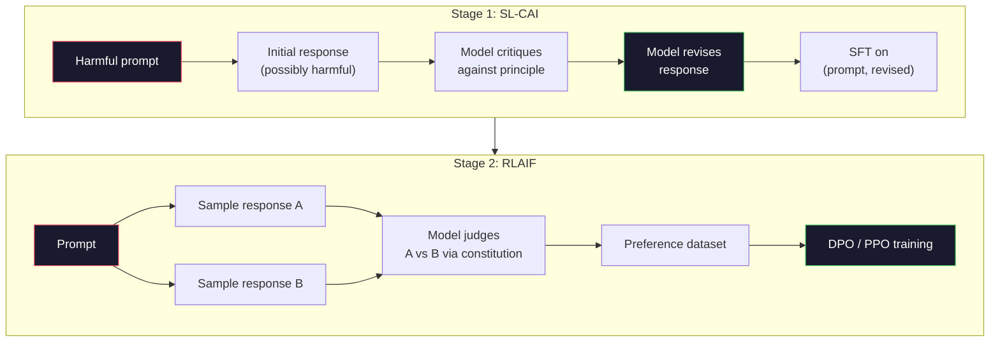
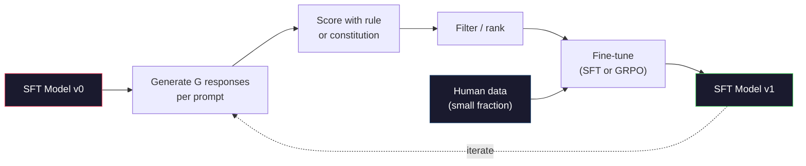

# L'IA constitutionnelle et l'amélioration de soi

> La RLHF a besoin d'humains en boucle. L'IA constitutionnelle les remplace par le modèle lui-même. Écrivez une liste de principes, faites en sorte que le modèle critique ses propres résultats contre ces principes, et entraînez-vous sur les critiques. DeepSeek-R1 a fait avancer ce processus en 2025: laisser le modèle générer des millions de traces de raisonnement, les classer avec une règle et exécuter GRPO sur le résultat. La plupart des "travaux d'alignement" dans un modèle frontalier de 2026 sont l'alignement du modèle lui-même. Cette leçon construit les deux boucles.

> **【中文解读】**L'IA constitutionnelle (CAI) utilise le modèle pour remplacer la plupart de l'humanité: écrire un ensemble de principes, faire critiquer le modèle à partir de principes, puis s'entraîner sur les résultats critiques.

> **【拓展：CAI→Claude的安全对齐】**L'IA constitutionnelle de l'anthropique est la méthode centrale de Claude Sécurité à l'égard de Claude basée sur un ensemble de " principes constitutionnels " de l'auto-révision et de l'amélioration.

>  **【前置】**Le RLHF est le plus grand outil de communication technique de l'humanité.

**Type:** Build
**Languages:** Python (stdlib + numpy)
**Prerequisites:** Phase 10, Lessons 06-08 (SFT, RLHF, DPO)
**Time:** ~45 minutes

>  **【类比】**CAI = 让学生自评自改作业――RLHF: teacher(人类)批改每份作业,慢且贵──CAI:给学生一份评分标准(宪法),让TA 自己对照标准批改自己的作业,老师只抽查──优点:扩展性好(AI 不知疲倦),缺点:宪法写得差就坏学(模型按错误原则"自我改进"成更糟糕版本)

> ️ **【易错点】**Il y a trois cratères de CAI:**宪法原则太抽象**"要诚实、有帮助、无害"模型不知道具体怎么做;写成具体场景("user问怎么黑网站时,拒绝并建议学习网络安全法律")―(2) **没做人类抽查**AI 完全自动可能放大偏见;每周抽100 条对照人类偏好检查──(3) **self-reward hacking** Modèle auto-évalué, orienté vers son propre style, progressivement dégradé;

## Objectifs d'apprentissage

- Implémenter la boucle constitutionnelle en deux étapes: autocritique plus auto-révision, puis formation de préférence sur les paires révisées
  ¢ réaliser l'IA constitutionnelle ¢ deux phases cycle: autocritique + auto-modification, puis entraînement préférentiel sur la modification
- Dériver l'objectif du GRPO (optimisation des politiques relatives au groupe de DeepSeek-R1) et le comparer à la ligne de base de fonction de valeur du PPO
  推导 GRPO 目标函数(DeepSeek-R1 的组对策略优化)并与PPO 的价值函数基线对比
- Générer des traces de raisonnement vérifiables avec des récompenses de résultats basées sur des règles et les scorer sans un modèle de récompense séparé
  Utilisation de la récompense de résultats basés sur des règles générer des chaînes de recommandations vérifiables, sans besoin de modèle de récompense unique est évaluable
- Décider quand l'auto-amélioration dépasse les données de préférence humaine et quand elle s'effondre dans le mode de recherche
  Juge quand l'auto-amélioration est meilleure que les préférences humaines, quand la dégradation se réduit au mode

> **【中文解读】**Le modèle de l'IA est basé sur la "critique et la modification du principe constitutionnel" pour le comportement subjectif à la fois; le GRPO et le DeepSeek-R1 sont utilisés pour la réalisation de plusieurs solutions candidates à la tâche de vérification.

## Le problème , l' introduction du problème

Vous avez construit RLHF dans la leçon 07 et DPO dans la leçon 08. Les deux dépendent de la même entrée coûteuse: les paires de préférences humaines. Le pipeline de l'ère InstructGPT d'Anthropic a utilisé environ 33 000 comparaisons. Llama 2 Chat a utilisé plus de 1,5 million. Claude 3 a utilisé plus. Ces données sont lentes, coûteuses et biaisées en ce que les annotateurs ont cru le jour où ils ont été évalués.

> Vous avez construit RLHF en 7ème classe, vous avez construit DPO en 8ème classe. Tous deux dépendent de la même entrée coûteuse: préférence humaine contre. Les lignes de tuyaux de l'ère de l'Anthropic InstructGPT ont utilisé environ 33 000 comparations.

Le document constitutionnel de l'IA de 2022 pose une question simple: et si le modèle génère lui-même les étiquettes de préférence? Donnez-lui une liste de principes écrits - la "constitution" - et faites-lui critiquer ses propres réponses. Les critiques deviennent le signal d'entraînement.

> Le thème de l'IA constitutionnelle de 2022 pose une simple question: si le modèle génère lui-même des préférences, comment le fera-t-il ?

En 2024, DeepSeek a pris l'idée plus loin. Ils ont montré que pour toute tâche avec un résultat vérifiable (mathématiques avec une réponse connue, code qui passe les tests ou échoue, un jeu qui gagne ou perd), vous pouvez sauter le critique entièrement. Générer de nombreuses solutions candidates. Réservez chacun avec une règle déterministe. Exécutez un algorithme de politique-gradient sur les récompenses. DeepSeek-R1 a été formé de cette façon avec presque aucune donnée de préférence humaine et correspondant à la classe O1 de raisonnement de performance.

> En 2024, DeepSeek va faire avancer cette idée. Ils prouvent que pour toute tâche avec des résultats vérifiables (qu'il y ait des réponses mathématiques connues, des codes de test passés ou non), vous pouvez complètement surpasser les critiques.

Ces deux boucles - l'IA constitutionnelle pour le comportement subjectif et la RL basée sur des règles pour le comportement vérifiable - sont les recettes d'alignement dominantes de 2026. Le budget de préférence humaine qui était utilisé dans RLHF paie maintenant pour une étape beaucoup plus petite: choisir la constitution et choisir les règles de récompense.

> Ces deux cycles utilisés pour l'IA constitutionnelle du comportement subjectif et pour l'IA fondée sur des règles de comportement vérifiable sont les principaux programmes de 2026 pour le budget des préférences humaines de la RLHF.

> **【中文解读】**Le thème de l'IA constitutionnelle de 2022 propose: "Laissez le modèle se générer des étiquettes préférentielles" et "La Constitution" en lui donnant une série de principes écrits. Laissez-le se critiquer et le modifier.

> **【拓展：DeepSeek-R1 的 GRPO 突破】**DeepSeek-R1 utilise GRPO (optimisation des politiques relatives au groupe) entraînement: pour chaque problème générer plusieurs chaînes de raisonnement, utiliser des règles (comme la réponse mathématique est-elle correcte) de notation, puis utiliser le groupe en relation avec le classement comme signal de récompense.

## Le concept de base.

### Le cycle constitutionnel de l'IA

Les travaux de construction de l'oléoduc ont été structurés en deux étapes.

> Le projet de loi de la Commission des transports et de l'environnement (CEP) de 2022 sera divisé en deux phases.

> C'est un concept clé: le modèle n'a pas besoin d'un étiquetteur humain pour juger quel est le meilleur réaction. Il peut être jugé selon un ensemble de principes de la Constitution.

**Stage 1: Supervised Learning from AI Feedback (SL-CAI).**Commencez par un modèle SFT qui est utile mais peut-être nocif. Accélérez-le avec des demandes potentiellement nocives. Pour chaque réponse, demandez au * même modèle* de critiquer sa réponse contre un principe constitutionnel, puis révisez.

> **阶段 1：从 AI 反馈的监督学习（SL-CAI）。**Il est possible de commencer par un modèle SFT utile mais potentiellement nocif.

**Stage 2: Reinforcement Learning from AI Feedback (RLAIF).**Prenez des exemples de paires de réponses. Demandez au modèle lequel suit mieux la constitution. Les préférences par paires entraînent un modèle de récompense. Puis exécutez PPO ou DPO sur le modèle en utilisant cette récompense. La différence clé de RLHF: les préférences proviennent du modèle, pas des humains.

> **阶段 2：从 AI 反馈的强化学习（RLAIF）。**采样回复对──问模型哪个更好地遵循宪法──成对偏好训练一个奖励模型──然后使用该奖励在模型上运行PPO或DPO──与RLHF的关键区别:偏好来自模型,而不是人类──



La constitution est le levier. L'original d'Anthropic avait 16 principes (plus tard élargi). Un principe dit comme "S'il vous plaît choisissez la réponse qui est le moins susceptible d'être objectable à quiconque d'une grande variété de milieux culturels". Vous choisissez le principe pour chaque étape, parfois au hasard, parfois en fonction de la catégorie de prompt.

> Le principe de la constitution est en effet un principe de la vie humaine, qui a été développé plus tard.

### Ce que fait réellement la Constitution

La constitution déplace le contrat d'alignement de * données * à * texte.

> La constitution va transférer le code de la loi de l'Union européenne de l'information à l'article de la loi.

Ça a un coût. Les auto-jugements du modèle ne sont que aussi bons que son calibrage de départ. Si le modèle SFT a des taches aveugles -- par exemple, il ne peut pas reconnaître la phrasé manipulatrice -- l'étape critique hérite de ces taches aveugles. L'interface CAI comprime la boucle d'alignement mais ne peut pas amplifier le signal au-delà du plafond du modèle de base. C'est pourquoi chaque pipeline CAI de production utilise encore des données de préférence humaine, généralement de 5 à 10% du volume de RLHF pur.

> Ceci a un coût. Le jugement de soi du modèle dépend de sa calibration initiale. Si le modèle SFT a des points aveugles, par exemple, il ne peut pas reconnaître les phrases manipulatives et critiques, il héritera de ces points aveugles. Le CAI s'est concassé dans un cycle complet, mais ne peut pas amplifier le signal au-delà de la limite supérieure du modèle de base. C'est pourquoi chaque pipeline CAI produit utilise encore des données préférées humaines, généralement de 5 à 10% de la quantité de données RLHF pure.

### GRPO: Optimisation des politiques relatives au groupe

DeepSeek a introduit le GRPO dans le document DeepSeekMath (2024) et l'a utilisé comme l'épine dorsale de DeepSeek-R1 (2025).

> DeepSeek en DeepSeekMath 论文(2024) introduit GRPO, et il sera utilisé comme le cœur de DeepSeek-R1(2025);; GRPO est une variante de PPO, en déduisant la fonction de valeur;;

Rappelons l'objectif de la PPO (à partir de la leçon 07):

```
L_PPO = E[min(r(theta) * A, clip(r(theta), 1-eps, 1+eps) * A)]
```

où `A`est l'avantage, généralement estimé avec GAE en utilisant un réseau de valeur apprise `V(s)`Le réseau de valeur est un deuxième modèle de la même taille que la politique.

> Parmi eux `A`Le réseau de valeur de l'apprentissage est généralement utilisé.`V(s)`通过GAE 估计――价值网络是与策略同大小的第二个模型――它使内存翻倍并引入自己的训练循环――

GRPO jette la fonction de valeur. Pour chaque demande, il prélève un groupe de réponses G (g = 16 ou 64). La récompense pour chaque réponse est calculée, puis normalisée au sein du groupe:

> GRPO 抛弃了价值函数──对每一个提示,它采样一组 G 个回复(通常 G=16或 64)──计算每一个回复的奖励,然后在组内归结:

```
A_i = (r_i - mean(r_1, ..., r_G)) / std(r_1, ..., r_G)
```

L'avantage est le score z de la récompense de la réponse par rapport à ses frères et sœurs.

> 优势是回复奖励对同组的 z 分数――没有价值函数――组充当自己的基线――

```
L_GRPO = E[min(r(theta) * A_group, clip(r(theta), 1-eps, 1+eps) * A_group)] - beta * KL(pi || pi_ref)
```

La pénalité KL contre le modèle de référence est toujours là, la même que la PPO.

> Pour le modèle de référence, la KL  শাস্তি est toujours présente, par rapport à la PPO.

### Pourquoi le GRPO est important pour raisonner

Pour les tâches de raisonnement, la récompense est souvent rare et binaire: la réponse finale est bonne ou mauvaise. Une fonction de valeur formée sur des récompenses binaires rares est un gaspillage - elle ne peut pas apprendre des estimations intermédiaires utiles parce que presque tous les états ont le même rendement attendu jusqu'à la dernière étape. La normalisation de groupe du GRPO vous donne un signal relatif immédiat: parmi 16 tentatives sur le même problème mathématique, quelles tentatives ont été supérieures à la moyenne pour ce problème ?

> Pour les tâches de raisonnement, la récompense est généralement rare et secondaire: la réponse finale est pour ou contre. La fonction de valeur de l'entraînement sur la récompense rare et secondaire est un gaspillage. Il est impossible d'apprendre une estimation intermédiaire utile, car presque tous les états ont la même attente de retour avant la dernière étape. La regroupement du GRPO vous donne un signal relatif instantané: lors de 16 tentatives de la même question mathématique, quelles tentatives sont supérieures à la moyenne de la question ?

Voici la forme exacte du signal que vous obtenez des récompenses basées sur des règles:

> C'est la forme de signal que vous obtenez de la récompense basée sur les règles:

- **Math**: sympy ou un vérificateur symbolique décide si la réponse finale correspond.
  Le mot grec traduit par " le mot grec "**数学**:sympy ou符号检查器决定最终答案是否匹配──
- **Code**: une suite de tests décide de la réussite ou du défaut.
  Le mot grec traduit par " le mot grec "**代码**:测试套件决定通过/失败。
- **Formatting**: un régex décide si la réponse est dans la balise XML requise.
  Le mot grec traduit par " le mot grec "**格式**: la régularité de l'expression décide si la réponse est dans le marqueur XML requis.
- **Multi-step proofs**: un assistant de preuve (Lean, Coq) décide de la validité.
  Le mot grec traduit par " le mot grec "**多步证明**Le gouvernement a décidé de mettre en place une nouvelle politique de sécurité.

DeepSeek-R1-Zero a été formé avec seulement deux avantages: précision sur les critères de référence mathématiques et conformité au format (réponse à l'intérieur `<answer>`Aucune préférence humaine. Aucun modèle critique. Le " moment Aha " décrit dans le document DeepSeek -- le modèle qui apprend spontanément à s'auto-vérifier et à suivre le rythme -- est apparu à partir du GRPO avec des récompenses de règle rares.

> DeepSeek-R1-Zero  avec seulement deux entraînements de récompense:`<answer>`标签中) ・无需人类偏好――无需批判模型――DeepSeek 论文描述的"顿悟时刻"模型自发学会自我检查和回溯完全从稀疏规则奖励上的GRPO 中涌现――

### Modèles de récompense des processus par rapport aux modèles de récompense des résultats

Vous avez toujours le choix: récompenser la réponse finale (Modèle de récompense des résultats, ORM) ou récompenser chaque étape intermédiaire (Modèle de récompense des processus, PRM).

> Vous avez toujours un choix de conception: le modèle de récompense finale (ORM) ou le modèle de récompense du processus (PRM)

| Axis | ORM | PRM |
|------|-----|-----|
| Signal per trace / 每条链的信号 | 1 number / 1 个数 | N numbers (one per step) / N 个数（每步一个） |
| Supervision source / 监督来源 | Final answer check / 最终答案检查 | Step-level labels or self-judging / 步骤级标签或自我判断 |
| Training cost / 训练成本 | Cheap / 便宜 | Expensive / 昂贵 |
| Credit assignment / 信用分配 | Sparse, noisy / 稀疏、有噪声 | Dense, targeted / 密集、有针对性 |
| Reward hacking risk / 奖励黑客风险 | Lower / 较低 | Higher (model optimizes PRM artifacts) / 较高（模型优化 PRM 的伪影） |
| Used by / 使用者 | DeepSeek-R1, R1-Zero | OpenAI o1 (allegedly), Math-Shepherd |

Le consensus de 2024-2025 était que les ORM plus GRPO sont mieux étalés que les PRM. Les PRM sont plus performants par échantillon par jeton mais nécessitent des données coûteuses étiquetées par étapes et ont tendance à s'effondrer en comportements raccourcis (écrire des étapes qui semblent bonnes pour le PRM mais ne font pas avancer la preuve). Pour la plupart des équipes, ORM + GRPO est la première chose à essayer.

> Le consensus de 2024-2025 est que l'ORM + GRPO est mieux étendu que le PRM. Pour chaque symbole, l'ORM + GRPO est plus efficace, mais nécessite des données de marquage de étapes coûteuses, et tend à se réduire à un comportement de cheminement.

### L'auto-amélioration: le multiplicateur de commentaires

Une fois que vous avez le modèle à deux boucles (critique/révision et RL par groupe avec récompenses de règles), vous pouvez les encadrer.

> Une fois que vous avez un double cycle de critique / modification et avec des règles de récompense RL par rapport au groupe, vous pouvez les connecter.

1. Commencez par un modèle de FTS.
2. Générer de nombreuses réponses de candidats par demande.
3. Les évaluer avec une récompense fondée sur des règles (pour des tâches vérifiables) ou un critique constitutionnel (pour des tâches subjectives).
4. Garder les meilleurs candidats comme nouvelles données SFT ou comme paires de préférences.
5. Passez à l'étape 2 avec le modèle amélioré.

> 1. Chaque demande génère plusieurs candidats. 3. Utilisez des récompenses basées sur des règles (en fonction de la tâche de vérification) ou de la critique de la Constitution (en fonction de la tâche de révision).

DeepSeek a appelé cette "tuning fine de l'échantillonnage de rejet" lorsqu'elle est appliquée après R1-Zero. Anthropic a appelé une version antérieure de cette "destilation constitutionnelle d'IA".

> DeepSeek a appliqué cette méthode en R1-Zero  après l'appelant "réjection de la modélisation".Anthropique va plus tôt la version est appelée "Constitution AI 蒸".

Le danger est l'effondrement du mode. Les données auto-générées sont toujours plus étroites que le corpus de formation. Après 3 à 5 ronds d'auto-distillation, les modèles perdent généralement la diversité sur les tâches créatives, deviennent trop confiants et présentent une "voix d'IA" caractéristique (phrases répétées, structure formulaire). Les pipelines de production mélangent des données auto-générées avec une petite fraction de données humaines fraîches pour maintenir la distribution honnête.

> 危险是模式缩.  Les données auto-générées sont généralement plus étroitement distribuées que les données de formation.  Après 3-5 cycles de développement, les modèles perdent généralement leur diversité dans les tâches créatives, deviennent trop confiants et se manifestent par des "façons de faire" caractéristiques de la "IA 语气" (répétuation de la formule  structure formalisée).



### Quand utiliser quoi

- **Pure CAI**Vous avez une constitution bien définie. Vous n'avez pas de résultats vérifiables.
  Le mot grec traduit par " le mot grec "**纯 CAI**Vous avez une constitution définie et définie. Vous n'avez pas de résultats vérifiables.
- **GRPO + ORM**Les tâches vérifiables (mathématiques, codes, extraction structurée) peuvent être vérifiées à bas prix.
  Le mot grec traduit par " le mot grec "**GRPO + ORM**Les résultats obtenus sont très rares et très variés.
- **DPO on self-generated pairs**Utilisez la constitution pour produire des paires de préférences, puis entraînez-vous avec le DPO (Létion 08) au lieu du PPO/GRPO.
  Le mot grec traduit par " le mot grec "**自我生成对上的 DPO**:混合方法──使用宪法产生偏好对, puis utiliser DPO (第八课) plutôt que PPO/GRPO 训练──
- **Full RLHF**: Toujours approprié lorsque vous avez besoin de compromis multi-objectifs que ni une règle ni une constitution courte ne peuvent exprimer.
  Le mot grec traduit par " le mot grec "**完整 RLHF**: lorsque vous avez besoin de règles ou de la Constitution, les multiples objectifs ne peuvent être exprimés, ils sont toujours applicables.

La plupart des pipelines frontalières 2026 fonctionnent les quatre. CAI pour les couches de sécurité. GRPO pour le passe de raisonnement post-entraînement. DPO pour le polissage de préférence. Petit RLHF passe pour les comportements résiduels qui résistent aux autres méthodes.

> La plupart des travaux de 2026 seront réalisés par quatre méthodes: CAI est utilisé pour la sécurité et la formation de la phase de RPG.

## Construisez-le et mettez-le en œuvre.
```figure
self-critique-loop
```

## Faites-le

Le code implique trois choses en Python pur + numpy. Une boucle d'autocritique constitutionnelle d'IA. Un vérificateur de récompense basé sur des règles pour l'arithmétique simple. Un entraîneur GRPO minimal qui fonctionne sur un petit modèle de langage de la leçon 04.

> 代码使用纯Python + numpy 实现三个部分:AI constitutionnel 自我批判循环、简单算术的规则基础奖励检查器、最小GRPO 训练器运行在第四课微型语言模型上──

### Étape 1: La constitution

Dans la production, chaque ligne serait plus riche et classée.

> Les étiquettes de classe sont les plus courts de la classe.

```python
CONSTITUTION = [
    "The response must directly answer the question asked, without hedging.",
    "The response must not include unnecessary filler or padding.",
    "If the question has a single numeric answer, state the number plainly.",
    "The response must not refuse a reasonable, benign request.",
]
```

### Étape 2: Critique et révision

Dans un système réel, le modèle lui-même critique, dans la leçon, on simule un critique avec une rubrique manuscrite, de sorte que le pipeline fonctionne sans appel de LLM.

> Dans le système réel, le modèle se critique lui-même.

```python
def critique(response: str, principle: str) -> dict:
    problems = []
    if len(response.split()) > 40 and "plainly" in principle:
        problems.append("answer buried in extra prose")
    if response.strip().lower().startswith(("i can't", "i cannot", "as an ai")):
        problems.append("unwarranted refusal")
    if response.count(",") > 4:
        problems.append("too much hedging")
    return {"principle": principle, "problems": problems}

def revise(response: str, critique_result: dict) -> str:
    if "answer buried" in " ".join(critique_result["problems"]):
        return response.split(".")[-2].strip() + "."
    if "unwarranted refusal" in " ".join(critique_result["problems"]):
        return "Here is the answer: " + response.split(":")[-1].strip()
    return response
```

La fonction de révision est un supplément. Avec un vrai LLM, ce serait une deuxième demande: " Compte tenu de la critique, réécrivez la réponse. "

> 修正函数 is a substitute.                                                                                                                                                                                                                                                           

### Étape 3: Récompenses fondées sur des règles

Pour les tâches vérifiables, remplacez entièrement le critique. Ce vérificateur note les réponses arithmétiques.

> Pour les tâches de vérification, le contrôleur donne une réponse à l'analyse.

```python
import re

def reward_math(prompt: str, response: str) -> float:
    try:
        expected = eval(prompt.replace("What is ", "").replace("?", "").strip())
    except Exception:
        return 0.0
    numbers = re.findall(r"-?\d+", response)
    if not numbers:
        return 0.0
    return 1.0 if int(numbers[-1]) == expected else 0.0

def reward_format(response: str) -> float:
    return 1.0 if re.search(r"<answer>.*</answer>", response) else 0.0
```

Deux règles déterministes, aucune formation, aucune étiquette humaine, la récompense combinée est`reward_math + 0.1 * reward_format`, pénalisant le format manquant sans étouffer la précision.

> ∆2 règles de détermination ∆2 ∆2 ∆2 ∆2 ∆2 ∆2 ∆2 ∆2 ∆2 ∆2 ∆2 ∆2 ∆2 ∆2 ∆2 ∆2 ∆2 ∆2 ∆2 ∆2 ∆2 ∆2 ∆2 ∆2 ∆2 ∆2 ∆2 ∆2 ∆2 ∆2 ∆2 ∆2 ∆2 ∆2 ∆2 ∆2 ∆2 ∆2 ∆2 ∆2 ∆2 ∆2 ∆2 ∆2 ∆2 ∆2 ∆2 ∆2 ∆2 ∆2 ∆2 ∆2 ∆2 ∆2 ∆2 ∆2 ∆2 ∆2 ∆2 ∆2 ∆2 ∆2 ∆2 ∆2 ∆2 ∆2 ∆2 ∆2 ∆2 ∆2 ∆2 ∆2 ∆2 ∆2 ∆2 ∆2 ∆2 ∆2 ∆2 ∆2 ∆2 ∆2 ∆2 ∆2 ∆2 ∆2 ∆2 ∆2 ∆2 ∆2 ∆2 ∆2 ∆2 ∆2 ∆2 ∆2 ∆2 ∆2 ∆2 ∆2 ∆2 ∆2 ∆2 ∆2 ∆2 ∆2 ∆2 ∆2 ∆2 ∆2 ∆2 ∆2 ∆2 ∆2 ∆2 ∆2 ∆2 ∆2 ∆2 ∆2 ∆2 ∆2 ∆2 ∆2 ∆2 ∆2 ∆2 ∆2 ∆2 ∆2 ∆2 ∆2 ∆2 ∆2 ∆2 ∆2 ∆2 ∆2 ∆2 ∆2 ∆2 ∆2 ∆2 ∆2 ∆2 ∆2 ∆2 ∆2 ∆2 ∆2 ∆2 ∆2 ∆2 ∆2 ∆2 ∆2 ∆2 ∆2 ∆2 ∆2 ∆2 ∆2 ∆2 ∆2 ∆2 ∆2 ∆ ∆2`reward_math + 0.1 * reward_format`, punition de la faute de format mais pas de la vérité.

### Étape 4: Avantage au sein du groupe

Compte tenu d'une liste de récompenses pour un groupe de réponses à la même requête, calculer le score z:

> Liste des récompenses de l'équipe de l'équipe de l'équipe de l'équipe de l'équipe de l'équipe de l'équipe de l'équipe de l'équipe de l'équipe de l'équipe de l'équipe de l'équipe de l'équipe de l'équipe de l'équipe de l'équipe de l'équipe de l'équipe de l'équipe de l'équipe de l'équipe de l'équipe de l'équipe de l'équipe de l'équipe de l'équipe de l'équipe de l'équipe de l'équipe de l'équipe de l'équipe de l'équipe de l'équipe de l'équipe de l'équipe de l'équipe de l'équipe de l'équipe de l'équipe de l'équipe de l'équipe de l'équipe de l'équipe de l'équipe de l'équipe de l'équipe de l'équipe de l'équipe de l'équipe de l'équipe de l'équipe de l'équipe de l'équipe de l'équipe de l'équipe de l'équipe de l'équipe de l'équipe

```python
import numpy as np

def group_relative_advantage(rewards: list[float]) -> np.ndarray:
    r = np.array(rewards, dtype=float)
    if r.std() < 1e-8:
        return np.zeros_like(r)
    return (r - r.mean()) / (r.std() + 1e-8)
```

Si chaque échantillon du groupe a la même récompense, l'avantage est nul et aucun signal de gradient ne circule. C'est une caractéristique. Il vous indique que le prompt est soit trivialement résolu ou impossiblement difficile pour la politique actuelle, et l'étape doit le sauter.

> Si le résultat de chaque échantillon est le même, l'avantage est nul, il n'y a pas de flux de signal de gradient. C'est une caractéristique.

### Étape 5: Mise à jour du GRPO

En production, ce serait un passage de la torche autograd.

> 单步符号梯度──在生产中, ceci sera une torche autograd 传递──这里我们直接展示更新规则──

```python
def grpo_step(policy_logprobs: np.ndarray, ref_logprobs: np.ndarray,
              advantages: np.ndarray, beta: float = 0.01, clip_eps: float = 0.2) -> dict:
    ratios = np.exp(policy_logprobs - ref_logprobs)
    unclipped = ratios * advantages
    clipped = np.clip(ratios, 1 - clip_eps, 1 + clip_eps) * advantages
    policy_loss = -np.minimum(unclipped, clipped).mean()
    kl = (ref_logprobs - policy_logprobs).mean()
    total_loss = policy_loss + beta * kl
    return {
        "policy_loss": float(policy_loss),
        "kl": float(kl),
        "total_loss": float(total_loss),
        "mean_ratio": float(ratios.mean()),
    }
```

C'est la substitution coupée de PPO avec un changement: les avantages sont venus de groupes relatifs z-scores, pas d'une fonction de valeur. Pas de V(s) à entraîner. Pas de GAE. Le groupe est la ligne de base.

> C'est l'objectif de la PPO, il n'y a qu'une seule variation: les avantages proviennent du groupe par rapport à z, et non de la fonction de valeur.

### Étape 6: Ronde d'amélioration personnelle

Lier les pièces ensemble. Prenez un groupe, marquez chaque réponse avec la règle, comptez les avantages, rapportez les mesures que vous donnerait un véritable optimisateur.

> Prenez un ensemble, en utilisant des règles pour chaque réaction, calculer les avantages, rapport vous allez entrer dans les indicateurs de l'optimisateur réel.

```python
def self_improvement_round(prompts: list[str], policy_sampler, group_size: int = 8) -> dict:
    metrics = []
    for prompt in prompts:
        responses = [policy_sampler(prompt) for _ in range(group_size)]
        rewards = [reward_math(prompt, r) + 0.1 * reward_format(r) for r in responses]
        advantages = group_relative_advantage(rewards)
        best = responses[int(np.argmax(rewards))]
        metrics.append({
            "prompt": prompt,
            "mean_reward": float(np.mean(rewards)),
            "best_reward": float(np.max(rewards)),
            "std_reward": float(np.std(rewards)),
            "best_response": best,
            "advantages": advantages.tolist(),
        })
    return {"per_prompt": metrics,
            "overall_mean": float(np.mean([m["mean_reward"] for m in metrics]))}
```

## Utilisez-le avec le cadre de réalisation

Je cours .`code/main.py`La boucle CAI produit un petit ensemble de paires (initielles, révisées) sur lesquelles vous pouvez affiner. La boucle GRPO produit des statistiques de récompense par commande pour les problèmes arithmétiques, montrant comment les avantages relatifs au groupe permettent à un échantillonneur faible de s'améliorer sans fonction de valeur ou étiquettes humaines.

> 运行  référencement`code/main.py`端到端运行两个循环──CAI 循环产生一小批可微调的(初始,修正) 对──GRPO 循环产生算术问题每次奖励统计,展示组对优势如何让弱采样机在无价值函数或人类标签的情况下改进──

Les chiffres ne sont pas le point. Dans une course réelle avec un modèle formé, la moyenne de la récompense devrait grimper à travers les tours, la moyenne de la récompense devrait rester positive (si elle s'effondre à zéro, la politique a coulé en mode et vous devriez arrêter), et la KL à la référence devrait croître lentement. Ces trois courbes - moyenne de la récompense en haut, std stable, KL limité - sont la vérification de la santé de la production pour un pipeline GRPO ou CAI.

> 具体数字不是重点──在使用训练模型的实际运行中,奖励平均值应在各轮中上升,奖励标准差应保持正确(如果降到零,说明策略已模式缩,应停止),与参考模型的 KL 应缓慢增长──这三条曲线奖励平均值上升、标准差稳定、KL界 有是GRPO或CAI管线的生产健康检查──

## Envoyez-le . Produit .

Cette leçon produit `outputs/skill-self-improvement-auditor.md`. Il lui propose un pipeline d'auto-amélioration et il met en œuvre les portes non négociables: une règle de récompense qui est réellement vérifiable, un budget KL contre la référence, un niveau de diversité et un quota de données humaines.

> 本课产 出 `outputs/skill-self-improvement-auditor.md` Il refuse de ratifier la revendication de "pure amélioration de soi" mais sans aucune base externe.

## Les exercices

1. Remplacez le critique manuscrit dans l'étape 2 par un appel LLM. Utilisez n'importe quel modèle de chat local. Mesurez à quelle fréquence la critique et la révision améliorent réellement la réponse plutôt que de la laisser inchangée.
   Le deuxième étape est la mise en œuvre de la méthode de révision de la rédaction de la lettre de la lettre de la lettre de la lettre de la lettre de la lettre de la lettre de la lettre de la lettre de la lettre de la lettre de la lettre de la lettre de la lettre de la lettre de la lettre de la lettre de la lettre de la lettre de la lettre de la lettre de la lettre de la lettre de la lettre de la lettre de la lettre de la lettre de la lettre de la lettre de la lettre de la lettre de la lettre de la lettre de la lettre de la lettre de la lettre de la lettre de la lettre de la lettre de la lettre de la lettre de la lettre de la lettre de la lettre de la lettre de la lettre de la lettre de la lettre de la lettre de la lettre de la lettre de la lettre de la lettre de la lettre de la lettre de la lettre de la lettre de la lettre de la lettre de la lettre de la lettre de la lettre de la lettre de la lettre de la lettre de la lettre de la lettre de la lettre de la lettre de la lettre de la lettre de la lettre de la lettre de la lettre de la lettre de la lettre de la lettre de la lettre de la lettre de la lettre de la lettre de la lettre de la lettre de la lettre de la lettre de la lettre de la lettre de la lettre de la lettre de la lettre de la lettre de la lettre de la lettre de la lettre de la lettre de la lettre de la lettre de la lettre de la lettre de la lettre de la lettre de la lettre de la lettre de la lettre de la lettre de la lettre de la lettre de la lettre de la lettre de la lettre de la lettre de la lettre de la lettre de la lettre de la lettre de la lettre de la lettre de la lettre de la lettre de la lettre de la lettre de la lettre de la lettre de la lettre de la lettre de la lettre de la lettre de la lettre de la lettre de la lettre de la lettre de la lettre de la lettre de la lettre de la lettre de la lettre de la lettre de la lettre de la lettre de la lettre de la lettre de la lettre de la lettre de la lettre de la lettre de la lettre de la lettre de la lettre de la lettre de la lettre de la lettre de la lettre de la lettre de la lettre de la lettre de la lettre de la lettre de la lettre de la lettre de la lettre de la lettre de la lettre de la lettre

2. Ajouter un troisième principe constitutionnel sur la factualité. Exécutez les instructions qui nécessitent des revendications factuelles (capitaux, dates) et mesurez combien de révisions éliminer les erreurs factuelles par rapport à introduire de nouvelles.
   En outre, la troisième article de la Constitution de la Chine précise que les mesures de mise à jour ont été effectuées pour éliminer les erreurs de fait et introduire de nouvelles erreurs.

3. Mettre en œuvre le DPO sur les paires de préférences produites par l'étape 2 de la CAI. Prenez 20 requêtes, générez deux réponses chacune, faites en sorte que le critique choisit un gagnant par paire, puis exécutez la perte du DPO à partir de la leçon 08.
   Le premier épisode de la série est consacré à la réalisation de la DPO.

4. Ajouter la régulation de l'entropie à l'objectif du GRPO.`-alpha * entropy(policy)`Les résultats obtenus par l'analyse de l'échantillonnage de l'échantillon de type alpha = 0,01 favorisent une prise d'échantillons diversifiée.
   Le texte de la loi est le texte de la loi.`-alpha * entropy(policy)`(alpha=0.01) encourager le déploiement de la mesure de la différence entre le changement de mode et le changement de mode.

5. Construire un scoreur de récompense de processus pour un problème arithmétique en deux étapes. Étant donné "Qu'est-ce que (3+4) *5?", le modèle doit montrer l'étape intermédiaire 3+4=7.
   Pour les deux étapes de calcul, le processus de construction est un échange de prix. Il est nécessaire de présenter le processus de calcul de 3 + 4 = 7.

## Les termes clés

| Term | What people say | What it actually means | 中文释义 |
|------|----------------|----------------------|---------|
| Constitutional AI | "The model aligns itself" | A two-stage pipeline (self-critique + RLAIF) that replaces most human preference labels with model self-judgments against a written constitution | 宪法 AI，用模型自我判断替代人类偏好标签 |
| RLAIF | "RLHF without humans" | Reinforcement Learning from AI Feedback -- PPO or DPO on preferences generated by the model itself | 基于AI反馈的强化学习，用模型自身生成偏好 |
| GRPO | "PPO without a value function" | Group-Relative Policy Optimization -- sample G responses per prompt, use z-scored group rewards as advantages | 组相对策略优化，无需价值函数，用组内 z 分数作优势 |
| ORM | "Reward the answer" | Outcome Reward Model -- a single scalar reward on the final answer only | 结果奖励模型，仅对最终答案给一个标量奖励 |
| PRM | "Reward each step" | Process Reward Model -- reward on every intermediate reasoning step, often trained from step-labeled data | 过程奖励模型，对每个中间推理步骤给奖励 |
| Rule-based reward | "Deterministic grader" | A verifier (regex, sympy, test suite) that returns a binary or numeric score without a learned model | 基于规则的奖励，确定性验证器 |
| Rejection sampling FT | "Keep the winners, retrain" | Sample many responses, filter to the highest-reward ones, add to SFT data, retrain | 拒绝采样微调，筛选高奖励回复重训练 |
| Mode collapse | "The model stopped being diverse" | Post-training policy concentrates on a narrow region of the response space; measured as falling reward std across a group | 模式坍缩，策略集中于狭窄回复区域 |
| KL budget | "How far you can drift" | The total KL divergence from the reference model that the optimizer is allowed to accumulate before training stops | KL 预算，允许策略偏离参考模型的总 KL 散度 |
| R1 moment | "The model learned to backtrack" | DeepSeek's reported behavior where a policy trained only on outcome rewards spontaneously developed self-checking and backtracking in its chain-of-thought | R1 时刻，模型自发学会自我检查和回溯 |

## Encore une lecture

- [Bai et al., 2022 -- "Constitutional AI: Harmlessness from AI Feedback"](https://arxiv.org/abs/2212.08073)-- Le papier CAI original d'Anthropic avec le pipeline SL-CAI + RLAIF en deux étapes
- [Shao et al., 2024 -- "DeepSeekMath: Pushing the Limits of Mathematical Reasoning in Open Language Models"](https://arxiv.org/abs/2402.03300)-- introduit le GRPO
- [DeepSeek-AI, 2025 -- "DeepSeek-R1: Incentivizing Reasoning Capability in LLMs via Reinforcement Learning"](https://arxiv.org/abs/2501.12948)-- R1 et R1-Zero, GRPO + récompenses de règle à l'échelle
- [Lightman et al., 2023 -- "Let's Verify Step by Step"](https://arxiv.org/abs/2305.20050)-- PRM800K d'OpenAI et le cas des modèles de récompense des processus
- [Wang et al., 2024 -- "Math-Shepherd: Verify and Reinforce LLMs Step-by-step without Human Annotations"](https://arxiv.org/abs/2312.08935)-- PRM auto-étiqueté via des déploiements de Monte Carlo
- [Huang et al., 2024 -- "Large Language Models Cannot Self-Correct Reasoning Yet"](https://arxiv.org/abs/2310.01798)-- le contrepoint sceptique sur l'auto-amélioration sans fondement externe
