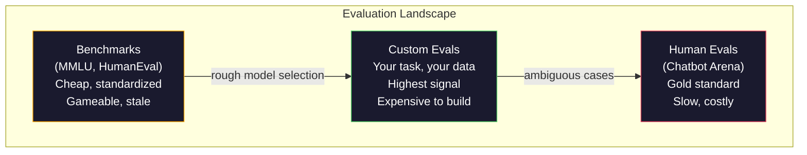
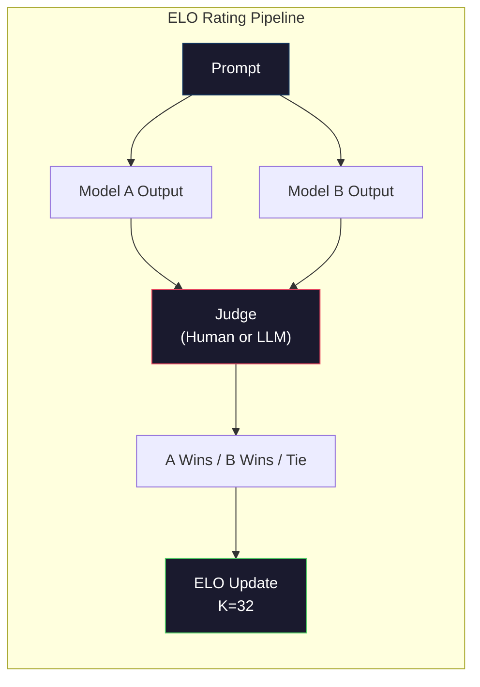

# Évaluation: points de référence, Evals, Harness LM

> La loi de Goodhart: quand une mesure devient une cible, elle cesse d'être une bonne mesure. Chaque jeu de laboratoire frontalier donne des points de référence. Les scores MMLU augmentent alors que les modèles ne peuvent toujours pas compter de manière fiable le nombre de R dans "framboise". La seule évaluation qui compte est votre évaluation - sur votre tâche, avec vos données.

> **【中文解读】**La loi classique: lorsqu'un indicateur devient un objectif, il ne devient plus un bon indicateur.

> **【拓展：LLM评测→实际应用】**Le système d'évaluation de l'LLM comprend: MMLU (Multiplex) ∆HumanEval (HumanEval) ∆MATH (Mathématique) ∆Aréna (Préférences humaines) ∆ Mais la plus importante dans la vraie application est votre propre évaluation  sur vos propres tâches et données ∆T.

>  **【前置】**Les études de premier cycle sont les suivantes:

>  **【类比】**Le niveau de qualification est de 1 à 5 ans. Le niveau de qualification est de 1 à 5 ans.

**Type:** Build
**Languages:** Python
**Prerequisites:** Phase 10, Lessons 01-05 (LLMs from Scratch)
**Time:** ~90 minutes

## Objectifs d'apprentissage

- Construire un harnais d'évaluation personnalisé qui exécute des critères de référence à choix multiples et à bout ouvert par rapport à un modèle de langage
  Construire des outils d'évaluation de la définition de soi, des tests de base ouverts et de plusieurs sélections de langages
- Expliquer pourquoi les critères de référence standard (MMLU, HumanEval) sont saturés et ne permettent pas de différencier les modèles frontaliers
  Expliquer pourquoi les normes de base de la MMLU ≈ HumanEval) seront  et impossible à distinguer
- Implémenter des évaluations spécifiques aux tâches avec des mesures appropriées: correspondance exacte, F1, BLEU et score LLM-as-judge
  实现带正确指标的任务特定评测:精确匹配、F1、BLEU 和 LLM-as-judge 评分
- Conceptez une suite d'évaluation personnalisée qui vise votre cas d'utilisation spécifique plutôt que de s'appuyer uniquement sur des classements publics
  Design pour des cas d'utilisation spécifiques, et non seulement en fonction de la classification publique

> **【中文解读】**Le point de vue central: public基准(MMLU、HumanEval) a été comprimé et, le nombre de fractions du modèle avant-coureur s'est réduit à 3 分, la différence est le bruit statistique et non la différence de capacité réelle― l'unique chose importante est votre tâche, vos données, vos échecs modèles évaluations―.

## Le problème , l' introduction du problème

Le tableau de classement est comprimé en une plage de 3 points où les différences sont des bruits statistiques, pas des lacunes réelles de capacité.

> MMLU a été publié en 2020, contenant 15 908 questions de 57 disciplines. En trois ans, le modèle de première ligne a été accepté.

Pendant ce temps, ces mêmes modèles échouent à des tâches qu'un enfant de 10 ans gère sans réfléchir. Claude 3.5 Sonnet, avec un score de 88,7% sur MMLU, ne pouvait pas compter les lettres dans "framboise" au début -- une tâche qui nécessite une connaissance du monde zéro et un raisonnement zéro, juste une itération au niveau des personnages. HumanEval teste la génération de code avec 164 problèmes. Les modèles en ont plus de 90% tout en produisant du code qui s'écrase sur les cas d'extrémité que tout développeur junior pourrait attraper.

> En même temps, ces modèles ont échoué dans la tentative de réaliser des tâches que les enfants de 10 ans n'avaient pas fait. Claude 3.5 Sonnet MMLU obtient un score de 88,7%, mais au début, il n'a pas pu compter "framboise" dans quelques r Cette tâche ne nécessite aucun savoir-faire ou raisonnement mondial, il suffit de la classe des caractères. HumanEval utilise 164 problèmes pour générer des codes de test.

L'écart entre les performances des benchmarks et la fiabilité réelle est le problème central de l'évaluation des LLM. Les critères de référence indiquent comment un modèle fonctionne sur le modèle de référence. Ils ne vous disent presque rien sur la façon dont ce modèle va fonctionner sur votre tâche spécifique, avec vos données spécifiques, dans vos modes d'échec spécifiques. Si vous construisez un robot de support client, MMLU est sans importance. Si vous construisez un assistant de code, HumanEval ne couvre que la génération au niveau des fonctions -- il ne dit rien sur le débogage, la réfacturation ou l'explication du code à travers les fichiers.

> 基准: la différence entre les performances de base et la fiabilité du monde réel est un problème central de l'évaluation de la LLM. 基准 vous dit les performances du modèle sur le base. 基准 ne dit presque rien sur la façon dont le modèle se produira dans votre tâche spécifique 具体数据、具体失败模式.  Si vous construisez un support client, MMLU 无关紧要.  Si vous construisez un code assistant, HumanEval ne couvre que les niveaux de fonction générateur  pour modifier, reconstruire ou transférer des fichiers.

Vous avez besoin d'évaluations personnalisées. Non pas parce que les benchmarks sont inutiles - ils sont utiles pour la sélection de modèles approximative - mais parce que l'évaluation finale doit correspondre exactement à vos conditions de déploiement.

> Vous devez vous définir pour évaluer vos propres résultats. Ce n'est pas parce que les bases ne sont pas utilisées pour choisir un modèle grossier, mais parce que l'évaluation finale doit correspondre parfaitement aux conditions de votre déploiement.

> **【中文解读】**基准分数与真世界可靠性之间的沟是LLM 评估的核心问题──GPT-4 MMLU 86.4%、Claude 3 Opus 86.8%、Llama 3 405B 88.6%3 分的差距是统计噪音──但这些模型在"Number strawberry 里有几个r"这样的简单任务中仍然失败──基准告诉你模型在基准上的表现,几乎没有说什么关于它在你的具体任务上表现的信息──

> **【拓展：Arena 评测与 Elo 评分】**L'utilisation de l'analyse de l'élo (blind test) est une méthode de classement de l'élo (GPT-4o, Claude 3.5 Sonnet, Gemini 1.5 Pro) qui reflète plus réellement l'expérience d'utilisation réelle de l'élo.

## Le concept de base.

### Le paysage d'Eval

Il existe trois catégories d'évaluation, chacune ayant des coûts et une qualité de signal différentes.

> Il existe trois catégories d'évaluation, avec des coûts et des signaux différents.

**Benchmarks**Les tests sont des suites de tests standardisées. MMLU, HumanEval, SWE-bench, MATH, ARC, HellaSwag. Vous exécutez un modèle contre le point de référence et obtenez un score. L'avantage: tout le monde utilise le même test, de sorte que vous pouvez comparer les modèles. L'inconvénient: les modèles et les données de formation contaminent de plus en plus ces points de référence. Les laboratoires s'entraînent sur des données qui incluent des questions de référence. Les scores augmentent. La capacité peut ne pas.

> **基准**Vous avez tous utilisé le même test, donc vous pouvez comparer les modèles. Les défauts: les modèles et les données de formation contaminent de plus en plus ces bases. Les laboratoires se formeront sur les données contenant les questions de base.

**Custom evals**Les données de base de données SQL sont des suites de test que vous construisez pour votre cas d'utilisation spécifique. Vous définissez les entrées, les sorties attendues et la fonction de notation. Un résumé de document juridique est évalué sur des documents juridiques. Un générateur SQL est évalué sur votre schéma de base de données. Ces données sont coûteuses à créer mais elles sont la seule évaluation qui prédit la performance de production.

> **自定义评估**Les tests que vous avez construits pour des cas spécifiques sont: vous définissez les entrées, les attentes, les sorties et les fonctions de notation.

**Human evals**Les résultats de l'analyse de la qualité des données sont basés sur des données de référence, des données de référence et des données de référence, et sont basés sur des données de référence.$0.10-$2,00 par jugement) et la vitesse (heure à jour).

> **人工评估**Utilisation de l'étiquetteur de paiement en fonction de l'utilité, de l'exactitude, du flux et de la sécurité.$0.10-$2,00) et la vitesse (((



### Pourquoi les critères de référence sont brisés

Trois mécanismes font en sorte que les scores de référence cessent de refléter la capacité réelle.

> Trois mécanismes ont conduit à ce que le nombre de bases ne reflète plus la capacité réelle.

**Data contamination.**Les corps de formation scraper l'internet. Les questions de référence sont en direct sur Internet. Les modèles voient les réponses pendant la formation. Ce n'est pas de la triche au sens traditionnel - les laboratoires ne comprennent pas intentionnellement les données de référence. Mais le scraping à l'échelle Web rend presque impossible d'exclure.

> **数据污染。**訓練语料从互联网抓取――基准问题存在在互联网――模型在训练中看到了答案――这不是传统意义上的骗局实验室不会故意包含基准数据――但网络规模抓取使排除几乎不可能――

**Teaching to the test.**Les laboratoires optimisent les mélanges de formation pour les performances de référence. Si 5% du mélange de formation est un choix multiple de style MMLU, le modèle apprend le format et la distribution de la réponse. MMLU est un choix multiple à quatre voies. Les modèles apprennent que la distribution de la réponse est approximativement uniforme sur A / B / C / D, ce qui aide même lorsque le modèle ne connaît pas la réponse.

> **应试训练。**Si 5% de la formation est mélangée à plusieurs sélections de style MMLU, le modèle apprend à se répartir en format et en réponse.

**Saturation.**Lorsque chaque modèle frontalier obtient un score de 85 à 90% sur un critère de référence, le critère de référence cesse de discriminer. Les 10 à 15% restants des questions peuvent être ambiguës, mal étiquetés ou nécessiter des connaissances obscures sur le domaine.

> **饱和。**Lorsque le modèle précédent a obtenu un score de 85 à 90% sur le基准, le基准 n'a plus de distinction. Les problèmes restants de 10 à 15% peuvent être différenciés, être marqués ou nécessiter des connaissances dans le domaine du froid.

### La perplexité: un examen rapide de la santé

La perplexité mesure la surprise qu'un modèle est par une séquence de jetons.

> 困惑度衡量模型对象序列的惊程度――, sous forme, il est un indice moyen négatif pour le nombre similaire:

```
PPL = exp(-1/N * sum(log P(token_i | context)))
```

Une perplexité de 10 signifie que le modèle est, en moyenne, aussi incertain que de choisir uniformément parmi 10 options à chaque position de jeton.

> 困惑度 10 signifie modèle moyen pour chaque symbole 位置 de l'incertitude équivaut à la moyenne de la sélection de 10 个选项中──越低越好──GPT-2 在 WikiText-103 上困惑度约30──GPT-3约20──Llama 3 8B约7──

La perplexité est utile pour comparer les modèles sur le même ensemble de tests, mais elle a des points aveugles. Un modèle peut avoir une faible perplexité en étant bon à prédire les schémas communs tout en étant terrible dans les schémas rares mais importants.

> La confusion peut être très faible en se basant sur un modèle de prédiction courante, mais peut être très faible dans un modèle rare mais important. Elle ne peut pas non plus indiquer l'instruction suivie, la logique ou la précision des faits.

### M.L. comme juge

Utilisez un modèle fort pour évaluer la performance d'un modèle plus faible. L'idée est simple: demandez à GPT-4o ou à Claude Sonnet de noter une réponse sur une échelle de 1 à 5 pour la précision, l'utilité et la sécurité. Cela coûte environ 0,01 $ par jugement avec GPT-4o-mini et se corréle étonnamment bien avec les jugements humains - environ 80% d'accord sur la plupart des tâches.

> L'idée est très simple: faire en sorte que GPT-4o ou Claude Sonnet soit évalué à 1 à 5 points de la justesse, de l'utilité et de la sécurité.

Le prompt de notation compte plus que le modèle. Un prompt vague ("Rate this response") produit des scores bruyants. Un prompt structuré avec une rubrique ("Score 5 si la réponse est factuellement correcte et cite une source, 4 si elle est correcte mais non source, 3 si elle est partiellement correcte...") produit des scores cohérents et reproduisables.

> 评分快速比模型更重要──模糊的快速("给这个回复打分") générer un nombre de fractions 杂杂的──带有评分标准的结构化快速("Si la réponse est vraie et cite une source de 5 分, vraie mais sans source de 4 分,部分正确打 3 分...") générer un nombre de fractions cohérent、 reproducibles──

Les modes d'échec: les modèles de juge présentent un biais de position (préfèrent la première réponse dans les comparaisons parallèles), un biais de verbosité (préfèrent des réponses plus longues) et une préférence personnelle (GPT-4 rapporte des sorties GPT-4 supérieures aux sorties Claude équivalentes).

> 失败模式: le modèle d'évaluation exprime des préjugés positionnels (en) 冗长偏见 (en) 冗长偏见 (en) 冗长偏见 (en) 冗长偏见 (en) 冗长偏见 (en) 冗长偏见 (en) 冗长偏见 (en) 冗长偏见 (en) 冗长偏见 (en) 冗长偏见 (en) 冗长偏见 (en) 冗长偏见 (en) 冗长偏见 (en) 冗长偏见 (en) 冗长偏见 (en) 冗长偏见 (en) 冗长偏见 (en) 冗长偏见 (en) 冗长偏见 (en) 冗长偏见 (en) 冗长偏见 (en) 冗长偏见 (en) 冗长偏见 (en) 冗长偏见 (en) 冗长偏见 (en) 冗长偏见 (en) 冗长偏见 (en) 冗长偏见 (en) 冗长偏见 (en) 冗长偏见 (en) 偏见 (en) 偏见 (en) 偏见) 偏见 (en) 偏见 (en) 偏见 (en) 偏见) 偏见 (en) 偏见 (en) 偏见 (en) 偏见) 偏见 (en) 偏见 (en) 偏见) 偏见 (en) 偏见 (en) 偏见) 偏见 (en) 偏见 (en) 偏见 (en) 偏见) 偏见 (en) 偏见 (en) 偏见) 偏见 (en) 偏见 (en) 偏见) 偏见 (en) 偏 (en) 偏 (en) 偏 (en) (en) (en) (en) (en) (en) (en) (en) (en) (en) (en) (en) (en) (en) (en) (en) (en) (en) (en) (en) (en) (en) (en) (en) (en) (en) (en) (en)

### Rating ELO de comparaisons par paires

L'approche de Chatbot Arena. Montrez deux réponses à la même requête de différents modèles. Un humain (ou juge LLM) choisit la meilleure. À partir de milliers de ces comparaisons, calculer une note ELO pour chaque modèle - le même système utilisé dans les échecs.

> Les méthodes de Chatbot Arena sont différentes: présenter des résultats de différents modèles à la même demande. Les humains peuvent choisir mieux.

Avantage d'ELO: le classement relatif est plus fiable que le score absolu, gère les liens avec élégance et converge avec moins de comparaisons que de marquer chaque sortie indépendamment.

> ELO  Avantage: par rapport au classement, le classement est plus fiable que celui de l'absence de notes, le classement est plus bas que celui de l'indépendance.



### Cadres équivalents

**lm-evaluation-harness**(EleutherAI): le cadre d'évaluation standard open source. Supporte plus de 200 points de référence. Exécutez n'importe quel modèle Hugging Face contre MMLU, HellaSwag, ARC, etc. avec une seule commande. Utilisé par le tableau de bord Open LLM.

> **lm-evaluation-harness**(EleutherAI): standard open source assessment framework── support 200+ 基准──一条命令对任何 Hugging Face 模型运行 MMLU、HellaSwag、ARC等──Open LLM Leaderboard 使用──

**RAGAS**: cadre d'évaluation spécifique aux lignes de RAG: mesure la fidélité (la réponse correspond-elle au contexte retenu ?), la pertinence (le contexte retenu est-il pertinent pour la question ?) et la précision de la réponse.

> **RAGAS**Le rapport de référencement est basé sur le rapport de référencement de la société.

**promptfoo**: évaluation basée sur la configuration pour l'ingénierie rapide. Définir des cas de test dans YAML, faire face à plusieurs modèles, obtenir un rapport de réussite / échec. Utilisée pour les demandes de test de régression - assurez-vous qu'un changement rapide ne casse pas les cas de test existants.

> **promptfoo**: configuration driven de prompt 工程评测── définir dans YAML les cas d'utilisation de test, pour plusieurs modèles de fonctionnement, obtenir un rapport de réussite/failure── utiliser pour le retour rapide des tests assurer le retour rapide des modifications ne détruira pas les cas d'utilisation existants──

### Construire des évaux personnalisés

La seule évaluation qui compte pour la production.

> Le seul épisode important de la production:

1. **Define the task.**Ce que le modèle devrait faire exactement? Soyez précis. " Répondre aux questions " est trop vague. " En raison d'un courriel de plainte du client, extraire le nom du produit, la catégorie de problème et le sentiment " est une tâche que vous pouvez évaluer.
   Le mot "je" est traduit par "je".**定义任务。**模型到底应该做什么? 应精确――" Répondre à la question "Too模糊――" Donner un client complainte, demander le nom du produit、 question classe et émotion" est une tâche à évaluer――

2. **Create test cases.**Un minimum de 50 pour un prototype eval, 200+ pour la production. Chaque cas de test est une paire (entrée, attendu_sortie).
   Le mot "je" est traduit par "je".**创建测试用例。**Toutes les épreuves sont utilisées pour les situations de bord:

3. **Define scoring.**Parallèle exacte pour les sorties structurées. BLEU/ROUGE pour la similitude du texte. LLM-as-judge pour la qualité ouverte. F1 pour les tâches d'extraction. Combinez plusieurs mesures avec des poids.
   Je suis un homme de la famille.**定义评分。**结构化输出用精确匹配──文本相似度用 BLEU/ROUGE──开放式质量用 LLM-as-judge──抽取任务用 F1──组合多个指标并加权──

4. **Automate.**Chaque évaluation est effectuée avec une seule commande, sans étapes manuelles, et les résultats sont stockés dans un format qui permet une comparaison au fil du temps.
   Je suis un homme de la famille de la femme.**自动化。**Chaque évaluation a un ordre de fonctionnement.

5. **Track over time.**Un score d'évaluation est sans signification en isolement. Vous avez besoin de la ligne de tendance. Le score s'est-il amélioré après le dernier changement de prompt?
   Il est le premier à avoir été tué.**追踪趋势。**评测分数孤立看无意义──你需要趋势线── 上次提示更改后分数升级了吗? 换模后退步了吗? 像版本化提示 一样版本化评测──

| Eval Type | Cost per judgment | Agreement with humans | Best for |
|-----------|------------------|----------------------|----------|
| Exact match / 精确匹配 | ~$0 | 100% (when applicable) / 100%（适用时） | Structured output, classification / 结构化输出、分类 |
| BLEU/ROUGE | ~$0 | ~60% | Translation, summarization / 翻译、摘要 |
| LLM-as-judge / LLM 评审 | ~$0.01 | ~80% | Open-ended generation / 开放式生成 |
| Human eval / 人工评估 | $0.10-$2.00 | N/A (is the ground truth) / N/A（即真实标准） | Ambiguous, high-stakes tasks / 有歧义、高风险任务 |

## Construisez-le et mettez-le en œuvre.
```figure
perplexity-loss
```

## Faites-le

### Étape 1: Un cadre d'équivalence minimale

Définir les abstractions de base. Un cas d'évaluation a une entrée, une sortie attendue et un dicton de métadonnées facultatif. Un scorer prend une prédiction et une référence et renvoie un score compris entre 0 et 1.

> 定义核心抽象──评测用例有输入、期望输出和可选的元数据字典──评分器接受预测和参考并返回 0 到 1 之间的分数──

```python
import json
from collections import Counter

class EvalCase:
    def __init__(self, input_text, expected, metadata=None):
        self.input_text = input_text
        self.expected = expected
        self.metadata = metadata or {}

class EvalSuite:
    def __init__(self, name, cases, scorers):
        self.name = name
        self.cases = cases
        self.scorers = scorers

    def run(self, model_fn):
        results = []
        for case in self.cases:
            prediction = model_fn(case.input_text)
            scores = {}
            for scorer_name, scorer_fn in self.scorers.items():
                scores[scorer_name] = scorer_fn(prediction, case.expected)
            results.append({
                "input": case.input_text,
                "expected": case.expected,
                "prediction": prediction,
                "scores": scores,
            })
        return results
```

### Étape 2: Résultats

Construisez une correspondance exacte, un jeton F1 et un scorer simulé de la LLM en tant que juge.

> 构建精确匹配、代码 F1 和模拟的LLM-as-judge 评分器──

```python
def exact_match(prediction, expected):
    return 1.0 if prediction.strip().lower() == expected.strip().lower() else 0.0

def token_f1(prediction, expected):
    pred_tokens = set(prediction.lower().split())
    exp_tokens = set(expected.lower().split())
    if not pred_tokens or not exp_tokens:
        return 0.0
    common = pred_tokens & exp_tokens
    precision = len(common) / len(pred_tokens)
    recall = len(common) / len(exp_tokens)
    if precision + recall == 0:
        return 0.0
    return 2 * (precision * recall) / (precision + recall)

def llm_judge_simulated(prediction, expected):
    pred_words = set(prediction.lower().split())
    exp_words = set(expected.lower().split())
    if not exp_words:
        return 0.0
    overlap = len(pred_words & exp_words) / len(exp_words)
    length_penalty = min(1.0, len(prediction) / max(len(expected), 1))
    return round(overlap * 0.7 + length_penalty * 0.3, 3)
```

### Étape 3: Système de notation ELO

Implémenter des comparaisons par paires avec les mises à jour ELO. C'est exactement le système Chatbot Arena utilise pour classer les modèles.

> 实现带 ELO 更新的成对比较── c'est exactement le système utilisé par Chatbot Arena pour classer le modèle──

```python
class ELOTracker:
    def __init__(self, k=32, initial_rating=1500):
        self.ratings = {}
        self.k = k
        self.initial_rating = initial_rating
        self.history = []

    def _ensure_player(self, name):
        if name not in self.ratings:
            self.ratings[name] = self.initial_rating

    def expected_score(self, rating_a, rating_b):
        return 1 / (1 + 10 ** ((rating_b - rating_a) / 400))

    def record_match(self, player_a, player_b, outcome):
        self._ensure_player(player_a)
        self._ensure_player(player_b)

        ea = self.expected_score(self.ratings[player_a], self.ratings[player_b])
        eb = 1 - ea

        if outcome == "a":
            sa, sb = 1.0, 0.0
        elif outcome == "b":
            sa, sb = 0.0, 1.0
        else:
            sa, sb = 0.5, 0.5

        self.ratings[player_a] += self.k * (sa - ea)
        self.ratings[player_b] += self.k * (sb - eb)

        self.history.append({
            "a": player_a, "b": player_b,
            "outcome": outcome,
            "rating_a": round(self.ratings[player_a], 1),
            "rating_b": round(self.ratings[player_b], 1),
        })

    def leaderboard(self):
        return sorted(self.ratings.items(), key=lambda x: -x[1])
```

### Étape 4: Calcul de la complexité

Compute la perplexité en utilisant des probabilités de jetons. en pratique, vous obtiendrez ces logits du modèle. ici nous simulons avec une distribution de probabilité.

> Utilisez des symboles  probabilité calculé confusion  dans la pratique  vous obtenez ces valeurs  dans les logits du modèle  ici nous utilisons la distribution de probabilité 

```python
import numpy as np

def perplexity(log_probs):
    if not log_probs:
        return float("inf")
    avg_neg_log_prob = -np.mean(log_probs)
    return float(np.exp(avg_neg_log_prob))

def token_log_probs_simulated(text, model_quality=0.8):
    np.random.seed(hash(text) % 2**31)
    tokens = text.split()
    log_probs = []
    for i, token in enumerate(tokens):
        base_prob = model_quality
        if len(token) > 8:
            base_prob *= 0.6
        if i == 0:
            base_prob *= 0.7
        prob = np.clip(base_prob + np.random.normal(0, 0.1), 0.01, 0.99)
        log_probs.append(float(np.log(prob)))
    return log_probs
```

### Étape 5: Résultats globaux

Comptez des statistiques sommaires sur une série d'évaluations: moyenne, médiane, taux de réussite à un seuil et ventilations par mesure.

> 计算评测运行的汇总计:均值、中位数、值通过率和每指标细分──

```python
def summarize_results(results, threshold=0.8):
    all_scores = {}
    for r in results:
        for metric, score in r["scores"].items():
            all_scores.setdefault(metric, []).append(score)

    summary = {}
    for metric, scores in all_scores.items():
        arr = np.array(scores)
        summary[metric] = {
            "mean": round(float(np.mean(arr)), 3),
            "median": round(float(np.median(arr)), 3),
            "std": round(float(np.std(arr)), 3),
            "min": round(float(np.min(arr)), 3),
            "max": round(float(np.max(arr)), 3),
            "pass_rate": round(float(np.mean(arr >= threshold)), 3),
            "n": len(scores),
        }
    return summary

def print_summary(summary, suite_name="Eval"):
    print(f"\n{'=' * 60}")
    print(f"  {suite_name} Summary")
    print(f"{'=' * 60}")
    for metric, stats in summary.items():
        print(f"\n  {metric}:")
        print(f"    Mean:      {stats['mean']:.3f}")
        print(f"    Median:    {stats['median']:.3f}")
        print(f"    Std:       {stats['std']:.3f}")
        print(f"    Range:     [{stats['min']:.3f}, {stats['max']:.3f}]")
        print(f"    Pass rate: {stats['pass_rate']:.1%} (threshold >= 0.8)")
        print(f"    N:         {stats['n']}")
```

### Étape 6: Remplissez le pipeline

Définir une tâche, créer des cas de test, simuler deux modèles, exécuter des évaluations, calculer ELO à partir de comparaisons par paires, et imprimer le tableau de classement.

> Pour définir les tâches, créer des exemples de test, modéliser les deux modèles, exécuter des évaluations, comparer les résultats de l'analyse et imprimer la liste de classement.

```python
def demo_model_good(prompt):
    responses = {
        "What is the capital of France?": "Paris",
        "What is 2 + 2?": "4",
        "Who wrote Hamlet?": "William Shakespeare",
        "What language is PyTorch written in?": "Python and C++",
        "What is the boiling point of water?": "100 degrees Celsius",
    }
    return responses.get(prompt, "I don't know")

def demo_model_bad(prompt):
    responses = {
        "What is the capital of France?": "Paris is the capital city of France",
        "What is 2 + 2?": "The answer is four",
        "Who wrote Hamlet?": "Shakespeare",
        "What language is PyTorch written in?": "Python",
        "What is the boiling point of water?": "212 Fahrenheit",
    }
    return responses.get(prompt, "Unknown")

cases = [
    EvalCase("What is the capital of France?", "Paris"),
    EvalCase("What is 2 + 2?", "4"),
    EvalCase("Who wrote Hamlet?", "William Shakespeare"),
    EvalCase("What language is PyTorch written in?", "Python and C++"),
    EvalCase("What is the boiling point of water?", "100 degrees Celsius"),
]

suite = EvalSuite(
    name="General Knowledge",
    cases=cases,
    scorers={
        "exact_match": exact_match,
        "token_f1": token_f1,
        "llm_judge": llm_judge_simulated,
    },
)

results_good = suite.run(demo_model_good)
results_bad = suite.run(demo_model_bad)

print_summary(summarize_results(results_good), "Model A (concise)")
print_summary(summarize_results(results_bad), "Model B (verbose)")
```

Le modèle "bon" donne des réponses exactes. Le modèle "mauvais" donne des paraphrases verbales. La correspondance exacte punit sévèrement le modèle verbale. Les jetons F1 et LLM-as-judge sont plus indulgents. Cela illustre pourquoi le choix métrique importe: le même modèle semble grand ou terrible selon la façon dont vous le marquez.

> Le modèle "bon" donne une réponse précise. Le modèle " mauvais" donne une réponse précise.

### Étape 7: Tournoi ELO

Exécuter des comparaisons par paires entre les modèles sur plusieurs tours.

> Comparaison entre les modèles de fonctionnement en plusieurs rounds.

```python
elo = ELOTracker(k=32)

for case in cases:
    pred_a = demo_model_good(case.input_text)
    pred_b = demo_model_bad(case.input_text)

    score_a = token_f1(pred_a, case.expected)
    score_b = token_f1(pred_b, case.expected)

    if score_a > score_b:
        outcome = "a"
    elif score_b > score_a:
        outcome = "b"
    else:
        outcome = "tie"

    elo.record_match("model_a_concise", "model_b_verbose", outcome)

print("\nELO Leaderboard:")
for name, rating in elo.leaderboard():
    print(f"  {name}: {rating:.0f}")
```

### Étape 8: Comparer avec la complexité

Comparer la perplexité entre les "modèles" de différents niveaux de qualité.

> La confusion du "modèle" par rapport à un niveau de qualité différent.

```python
test_text = "The quick brown fox jumps over the lazy dog in the garden"

for quality, label in [(0.9, "Strong model"), (0.7, "Medium model"), (0.4, "Weak model")]:
    log_probs = token_log_probs_simulated(test_text, model_quality=quality)
    ppl = perplexity(log_probs)
    print(f"  {label} (quality={quality}): perplexity = {ppl:.2f}")
```

## Utilisez-le avec le cadre de réalisation

### L'équipement d'évaluation (EleutherAI)

L'outil standard pour exécuter des benchmarks sur n'importe quel modèle.

> Dans tous les modèles, il existe des outils standard de base.

```python
# pip install lm-eval
# Command line:
# lm_eval --model hf --model_args pretrained=meta-llama/Llama-3.1-8B --tasks mmlu --batch_size 8

# Python API:
# import lm_eval
# results = lm_eval.simple_evaluate(
#     model="hf",
#     model_args="pretrained=meta-llama/Llama-3.1-8B",
#     tasks=["mmlu", "hellaswag", "arc_easy"],
#     batch_size=8,
# )
# print(results["results"])
```

### promptfoo

Évaluation basée sur la configuration pour l'ingénierie rapide. Définir des tests en YAML et exécuter contre plusieurs fournisseurs.

> 配置驱动的提示 工程评测── dans YAML définir un test et le faire par plusieurs fournisseurs──

```yaml
# promptfoo.yaml
providers:
  - openai:gpt-4o-mini
  - anthropic:claude-3-haiku

prompts:
  - "Answer in one word: {{question}}"

tests:
  - vars:
      question: "What is the capital of France?"
    assert:
      - type: contains
        value: "Paris"
  - vars:
      question: "What is 2 + 2?"
    assert:
      - type: equals
        value: "4"
```

### RAGAS pour l'évaluation des RAG

```python
# pip install ragas
# from ragas import evaluate
# from ragas.metrics import faithfulness, answer_relevancy, context_precision
#
# result = evaluate(
#     dataset,
#     metrics=[faithfulness, answer_relevancy, context_precision],
# )
# print(result)
```

RAGAS mesure ce que les évaluations génériques manquent: si la réponse du modèle est basée sur le contexte récupéré, et non seulement si la réponse est "correcte" dans l'abstrait.

> RAGAS Méter les erreurs de la réponse du modèle: la question de savoir si elle est basée sur la recherche, et non seulement si la réponse est "correcte" en abstraction.

## Envoyez-le . Produit .

Cette leçon produit `outputs/prompt-eval-designer.md`-- une requête réutilisable qui conçoit des suites d'évaluation personnalisées pour n'importe quelle tâche. Donnez-lui une description de tâche et elle génère des cas de test, des fonctions de notation et une recommandation de seuil de réussite/échec.

> 本课产 出 `outputs/prompt-eval-designer.md` Un prompt réutilisable, pour tout projet de mise en œuvre, pour un ensemble d'évaluations autodéfinies.

Il produit aussi `outputs/skill-llm-evaluation.md`-- un cadre de décision pour choisir la bonne stratégie d'évaluation en fonction de votre type de tâche, de votre budget et des exigences de latence.

> Il est également produit`outputs/skill-llm-evaluation.md` Le cadre de décision de la stratégie d'évaluation correcte en fonction du type de tâche, du budget et des besoins en retard.

## Les exercices

1. Ajouter un scoreur de "conformité" qui passe la même entrée à travers le modèle 5 fois et mesure la fréquence à laquelle les sorties correspondent.
   Traduction anglaise: ajouter un évaluateur de " concordance ", qui mettra en place la même entrée par le biais du modèle de fonctionnement 5 fois et mesurera la fréquence correspondante de sortie.

2. Élargir le suivi ELO pour prendre en charge plusieurs fonctions de juge (correspondance exacte, F1, LLM-as-judge) et les peser. Comparer comment le tableau de classement change lorsque vous pesiez correspondance exacte fort contre F1 fort.
   Le classement des étoiles de la série F1 时排行榜如何变化──

3. Créer une suite d'évaluation pour une tâche spécifique: classification des e-mails en 5 catégories. Créer 100 cas de test avec des exemples divers, y compris des cas de bord (e-mails pouvant appartenir à plusieurs catégories, e-mails vides, e-mails dans d'autres langues). Mesurer le rendement des différents "modèles" (règle basée, correspondance de mots clés, LLM simulé).
   Pour des tâches spécifiques, il est nécessaire de créer 100 cas de test, y compris des exemples et des situations de bord.

4. Mettre en œuvre la détection de la contamination: compte tenu d'un ensemble de questions d'évaluation et d'un corpus de formation, vérifiez le pourcentage de questions d'évaluation (ou de paraphrases proches) figurant dans les données de formation.
   En français, le terme "pollution" est traduit par "pollution" et "pollution".

5. Construire un outil "modèle diff". Étant donné les résultats d'évaluation de deux versions de modèle, soulignez quels cas de test spécifiques ont amélioré, qui ont régressé et qui sont restés les mêmes.
   Le code de la version de l'évaluation est différent, il est essentiel de comprendre si la modification est utile ou non.

## Les termes clés

| Term | What people say | What it actually means | 中文释义 |
|------|----------------|----------------------|---------|
| MMLU | "The benchmark" | Massive Multitask Language Understanding -- 15,908 multiple choice questions across 57 subjects, saturated above 88% by 2025 | 大规模多任务语言理解，57 科目 15908 题选择题 |
| HumanEval | "Code eval" | 164 Python function-completion problems from OpenAI, tests only isolated function generation | 代码评估，164 个 Python 函数补全题 |
| SWE-bench | "Real coding eval" | 2,294 GitHub issues from 12 Python repos, measures end-to-end bug fixing including test generation | 真实编码评估，2294 个 GitHub issue 端到端修复 |
| Perplexity | "How confused the model is" | exp(-avg(log P(token_i given context))) -- lower means the model assigns higher probability to the actual tokens | 困惑度，越低表示模型预测越准确 |
| ELO rating | "Chess ranking for models" | A relative skill rating computed from pairwise win/loss records, used by Chatbot Arena to rank 100+ models | Elo 等级分，来自成对比较的相对技能评分 |
| LLM-as-judge | "Using AI to grade AI" | A strong model scores a weaker model's outputs against a rubric, ~80% agreement with human judges at ~$0.01/judgment | LLM 评审，用强模型给弱模型打分，约 $0.01/次 |
| Data contamination | "The model saw the test" | Training data includes benchmark questions, inflating scores without improving real capability | 数据污染，训练数据包含基准题目 |
| Eval suite | "A bunch of tests" | A versioned collection of (input, expected_output, scorer) triples that measure a specific capability | 评测套件，版本化的测试集合 |
| Pass rate | "What percentage it gets right" | Fraction of eval cases scoring above a threshold -- more actionable than mean score because it measures reliability | 通过率，得分超过阈值的用例比例 |
| Chatbot Arena | "Model ranking website" | LMSYS platform with 2M+ human preference votes, producing the most trusted LLM leaderboard via ELO ratings | Chatbot Arena，200 万+人类偏好投票的模型排名平台 |

## Encore une lecture

- [Hendrycks et al., 2021 -- "Measuring Massive Multitask Language Understanding"](https://arxiv.org/abs/2009.03300)-- l'article de la MMLU, toujours le point de référence le plus cité pour le LLM malgré sa saturation
- [Chen et al., 2021 -- "Evaluating Large Language Models Trained on Code"](https://arxiv.org/abs/2107.03374)-- le document HumanEval d'OpenAI, méthodologie d'évaluation de la génération de code établie
- [Zheng et al., 2023 -- "Judging LLM-as-a-Judge"](https://arxiv.org/abs/2306.05685)-- analyse systématique de l'utilisation des LLM pour évaluer les LLM, y compris les résultats de biais de position et de biais de verbosité
- [LMSYS Chatbot Arena](https://chat.lmsys.org/)-- plateforme de comparaison de modèles crowdsourced avec 2M+ de voix, le classement le plus fiable du monde réel LLM
