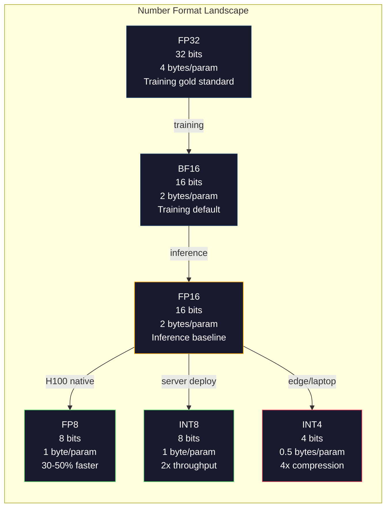
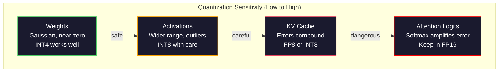
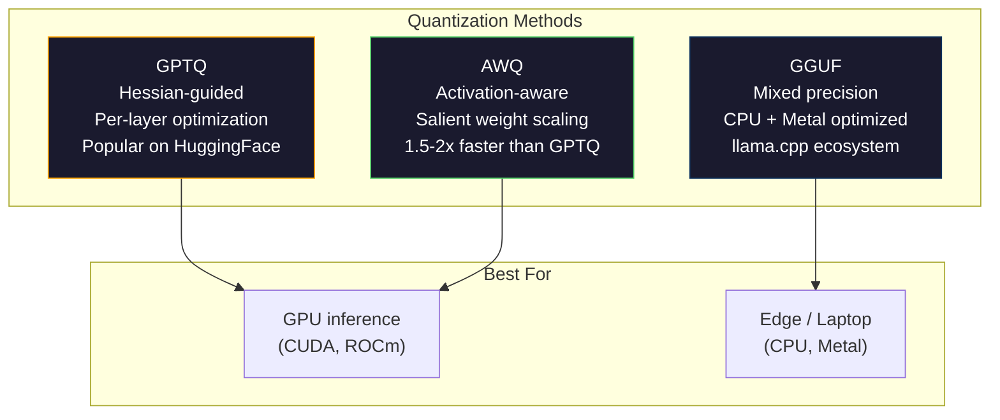

# Quantification: faire des modèles en forme

> Un modèle 70B en FP16 a besoin de 140 Go. Deux A100 pour les poids. Quantifier à FP8: un GPU de 80 Go. INT4: un MacBook.

> **【中文解读】**Le modèle de 70 milliards de paramètres nécessite 140 Go de stockage graphique (environ 100 pièces) et est basé sur une GPU de 80 Go de stockage graphique (environ 80 Go de stockage graphique graphique) et peut être utilisé sur un MacBook.

> **【拓展：量化→llama.cpp/GGUF】**Lamma.cpp 和 GGUF 格式让大模型能运行在消费级硬件上──GPTQ、AWQ、GGUF 等量化方法是将70B+ 模型部署到本地设备的关键──理解量化是理解大模型部署的基础──

>  **【前置】**Les résultats de l'étude sont les suivants:

>  **【类比】**量化 = 压缩图片──原照片(FP16) par image 16 bits,肉眼分辨不出和 8 位(FP8) de différence, mais文件大小一半──再压到4位──INT4)肉眼开始看到(精度损失),但文件小4 倍──模型量化同理:FP16→INT4 大小变 1/4,性能损失通常 <5%──GGUF 格式让你能在 MacBook 上跑 Llama-70B──

**Type:** Build
**Languages:** Python (with numpy)
**Prerequisites:** Phase 10, Lessons 01-10 (LLMs from Scratch)
**Time:** ~120 minutes

## Objectifs d'apprentissage

- Implementer une quantification symétrique et asymétrique du FP16 au INT8 et au INT4, y compris l'échelle par tenseur et par canal
  ¢ réaliser la quantification des états et des états de l'information, de la FP16 à l'INT8 et de l'INT4, y compris la quantification par états de données et la réduction par échanges
- Calculer les économies de mémoire de la quantification et déterminer quelle précision correspond à la VRAM d'un GPU donné
   calculer la quantité de stockage de données, déterminer la précision de la GPU 
- Expliquer la différence entre la quantification post-formation (PTQ) et la formation consciente de la quantification (QAT)
  解释训练后量化(PTQ) et la différence entre la formation de la perception quantique (QAT)
- Appliquer GPTQ ou AWQ pour quantifier un modèle réel et mesurer le compromis précision-mémoire sur un indice de référence
   appliquer GPTQ ou AWQ  quantifier le modèle réel, et sur base de la mesure de l'exactitude-évidence de l'échantillon

> **【中文解读】**Cette méthode est la méthode standard de déploiement de chaque modèle de plus de 7B.

## Le problème , l' introduction du problème

Llama 3 70B a 70 milliards de paramètres. Chaque paramètre est un numéro de point flottant de 16 bits. C'est 140 milliards de bytes. 140 GB. Un seul A100 a 80 GB de VRAM. Vous ne pouvez même pas charger les poids, et encore moins faire des inférences, sur un seul GPU. Vous avez besoin de deux A100 à 2 $ / heure chacun juste pour servir un modèle.

> Llama 3 70B a 700 milliards de paramètres. Chaque paramètre est un nombre de 16 bits de flows. Il est de 1400 milliards de bits.

Mais 16 bits par paramètre est gaspilleur. La plupart des poids dans un cluster de réseau neural près de zéro. La gamme dynamique complète de FP16 (de 0,000000059 à 65,504) est presque entièrement inutilisée. Si vous mesurez la réelle distribution des poids dans Llama 3 70B, 95% d'entre eux tombent entre -0,1 et +0,1.

> Mais chaque paramètre 16 est un gaspillage. La plupart des poids du réseau neural se rassemblent à proximité de zéro. La gamme de la FP16 est presque totalement inutilisée. Si vous mesurez la répartition réelle du poids de l'élément Llama 3 70B, 95% se situe entre -0,1 et +0,1 .

La quantification remplace les numéros de haute précision par des numéros de moindre précision. FP16 à FP8 réduit la mémoire de moitié. FP16 à INT4 la réduit à un quart. Ce modèle de 140 Go devient 35 Go. Il s'adapte à un seul GPU de consommation.

> Quantifier avec des chiffres de basse précision pour remplacer les chiffres de haute précision―FP16 à FP8  Réduire la moitié de la réserve FP16 à INT4  Réduire à un quart―140GB  Modèle transformé en 35GB―Pouvoir en GPU de niveau de consommation ‒Tendre à 2 bits quantifier(Actionnelle―Perdu, mais pour certaines tâches disponibles), le même modèle peut être utilisé sur un ordinateur de 16GB―

Le coût est la précision. Chaque bit que vous supprimez détruit l'information. La question est de savoir combien de précision vous perdez et où. Un modèle INT4 bien quantifié conserve 95 à 99% de la qualité de l'original sur la plupart des critères de référence. Une quantification naïve à INT4 peut détruire le modèle entièrement. La différence est la technique.

> Le problème réside dans la précision et la perte que vous perdez. Le modèle INT4 bien quantifié conserve 95% à 99% de sa qualité initiale sur la plupart des bases.

Les quantifications communautaires de Llama 3 à INT4 avec GPTQ montrent environ 1-2 points de perplexité perdus sur WikiText. Mistral a publié des points de contrôle FP8 de Mixtral 8x22B avec zéro perte de qualité mesurable sur MMLU. Le format GGUF alimente llama.cpp, exécutant des modèles 70B sur les MacBooks avec des puces de la série M. La quantification n'est pas un hack. C'est le chemin de déploiement standard pour chaque modèle supérieur à 7B.

> 社区GPTQ va quantifier Llama 3 à INT4, sur WikiText                                                                                                                                                                                                                                                      

> **【中文解读】**FP16 pour chaque paramètre 16 bits,70B  Modèle nécessite 140GB  Mais 95% du poids est concentré entre -0,1 à +0,1  avec 16 bits pour indiquer que ces valeurs sont trop gaspillées  Quantité à INT4 réduira la demande de stockage à 35GB, utilisable sur le GPU de consommation  Bon INT4 Quantité conserve la qualité du modèle original 95-99%  GPTQ Quantité Llama 3 à INT4  Perte de 1 à 2 points de confusion 

> **【拓展：量化生态】**Le système de quantification est très mature: GPTQ (basé sur la quantification de la phase de la phase II) ≈AWQ (activation du pouvoir de perception, protection du pouvoir de peser) ≈GGUF (en anglais seulement) ≈Llama.cpp (en anglais seulement) ≈2 bits ≈8 bits ≈8 bits ≈8 bits ≈8 bits ≈8 bits ≈8 bits ≈8 bits ≈8 bits ≈8 bits ≈7 bits ≈7 bits ≈7 bits ≈7 bits ≈7 bits ≈7 bits ≈7 bits ≈7 bits ≈7 bits ≈7 bits ≈7 bits ≈7 bits ≈7 bits ≈7 bits ≈7 bits ≈7 bits ≈7 bits ≈7 bits ≈7 bits ≈7 bits ≈7 bits ≈7 bits ≈7 bits ≈7 bits ≈7 bits ≈7 bits ≈7 bits ≈7 bits ≈7 bits ≈7 bits ≈7 bits ≈7 bits ≈7 bits ≈7 bits ≈7 bits ≈7 bits ≈7 bits ≈7 ≈7 ≈7 ≈7 ≈7 ≈7 ≈7 ≈7 ≈7 ≈7 ≈7 ≈7 ≈7 ≈7 ≈7 ≈7 ≈7 ≈7 ≈7 ≈7 ≈7 ≈7 ≈7 ≈7 ≈7 ≈7 ≈7 ≈7 ≈7 ≈7 ≈7 ≈7 ≈7 ≈7 ≈7 ≈7 ≈7 ≈7 ≈7

## Le concept de base.

### Formats numériques: ce que chaque bit fait

Chaque nombre à point flottant a trois parties: signe, exponent et mantissa (également appelé significand). Le signe est un bit. L'exponent détermine la plage (combien grand ou petit le nombre peut être).

> Chaque élément de l'élément a trois parties: le nombre de points et le nombre de points.

```
FP32:  [1 sign] [8 exponent] [23 mantissa]  = 32 bits
FP16:  [1 sign] [5 exponent] [10 mantissa]  = 16 bits
BF16:  [1 sign] [8 exponent] [7  mantissa]  = 16 bits
FP8:   [1 sign] [4 exponent] [3  mantissa]  = 8  bits (E4M3)
FP8:   [1 sign] [5 exponent] [2  mantissa]  = 8  bits (E5M2)
INT8:  [1 sign] [7 value]                   = 8  bits (uniform steps)
INT4:  [1 sign] [3 value]                   = 4  bits (16 levels total)
```

**FP32**La précision est totale. 23 bits de mantissa donnent environ 7 chiffres décimaux de précision.

> **FP32**Il est vrai que le nombre de points de fin de formation est de 7 points de fin de formation.

**FP16**Le nombre de bits de mantissa est de 3,3 chiffres décimaux. L'exponent se réduit à 5 bits, réduisant considérablement la plage (valeur maximale ~65,504).

> **FP16**Le nombre de points de formation est réduit de moitié à 0,10 points, ce qui est un problème de perte de poids, mais la capacité et la température de l'entraînement peuvent augmenter.

**BF16**(Brain Float 16) maintient l'exponent de 8 bits de FP32 mais réduit la mantissa à 7 bits. La même portée que FP32, moins précise que FP16. Google l'a conçu spécifiquement pour l'apprentissage profond. L'intuition: la portée est plus importante que la précision pour les réseaux neuronaux. Un gradient de 10^-20 qui se déplace en dessous de zéro dans le FP16 survit dans le BF16. Un poids de 0,07342 qui se déplace à 0,0734 dans BF16 est assez proche. Chaque course moderne utilise un mélange BF16 ou BF16/FP32.

> **BF16**(Brain Float 16) conserve l'indice de 8 bits de FP32 mais réduira le nombre de boutons à 7 bits. La portée est comparable à la portée de FP32, la précision est inférieure à la portée de FP16.

**FP8**Il est utilisé pour les poids et les activations pendant l'inférence. E5M2 (5 exponent, 2 mantissa) est utilisé pour les gradients pendant l'entraînement où la portée compte plus que la précision.

> **FP8**Il y a deux variantes: E4M3 (quatre indices, trois indices, trois indices) pour le poids et l'activation du temps de formation.

**INT8**Il est un nombre entier. Il n'y a pas d'exponent, pas de mantissa. Il suffit de 256 valeurs uniformément espacées de -128 à 127. Vous avez besoin d'un facteur d'échelle pour cartographier les poids des points flottants dans cette plage.

> **INT8**Il est nécessaire de réduire le facteur de charge de l'élément de l'élément de l'élément de l'élément de l'élément de l'élément de l'élément de l'élément de l'élément de l'élément de l'élément de l'élément de l'élément de l'élément de l'élément de l'élément de l'élément de l'élément de l'élément de l'élément de l'élément de l'élément de l'élément de l'élément de l'élément de l'élément de l'élément de l'élément de l'élément de l'élément de l'élément de l'élément de l'élément de l'élément de l'élément de l'élément de l'élément de l'élément de l'élément de l'élément de l'élément de l'élément de l'élément de l'élément de l'élément de l'élément de l'élément de l'élément de l'élément de l'élément de l'élément de l'élément de l'élément de l'élément de l'élément de l'élément de l'élément de l'élément de l'élément de l'élément de l'élément de l'élément de l'élément de l'élément de l'élément de l'élément de l'élément de l'élément.

**INT4**La qualité dépend entièrement de la façon dont vous choisissez la balance et les poids que vous quantifiez. Les méthodes INT4 les plus modernes (GPTQ, AWQ) conservent plus de 95% de la qualité du modèle original.

> **INT4**En outre, il n'y a que 16 facteurs possibles de réduction pour le travail à nouveau. La qualité dépend entièrement de la façon dont vous choisissez de réduire la proportion et de quantifier les poids.



### Comment fonctionne la quantification

L'opération du noyau est simple. Prenez un tensor de valeurs de point flottant, trouvez un facteur d'échelle, multipliez, rondez au nombre entier le plus proche, et stockez les nombres entiers plus le facteur d'échelle.

> L'opération centrale est très simple. Prenez un élément de valeur de la quantité, trouvez l'élément d'agrandissement, multipliez-le, entrez quatre à cinq dans le nombre entier le plus proche, puis stockez l'élément d'agrandissement.

**Quantize:**
```
scale = max(abs(tensor)) / max_int_value
quantized = round(tensor / scale)
```

**Dequantize:**
```
reconstructed = quantized * scale
```

Pour les INT8 avec une plage symétrique (de 127 à 127):
```
scale = max(abs(tensor)) / 127
quantized = clamp(round(tensor / scale), -128, 127)
```

L'erreur est l'erreur d'arrondissement. Chaque valeur peut être dépassée de plus `scale / 2`L'erreur totale d'une couche dépend du nombre de poids que vous avez et de la sensibilité du modèle aux perturbations de ces poids.

> L'erreur est de quatre à cinq erreurs.`scale / 2` L'erreur totale de la couche dépend du poids que vous avez et de la sensibilité du modèle à la perturbation de ces poids.

**Per-tensor vs per-channel quantization.**Le per-tensor utilise un facteur d'échelle pour toute la matrice de poids. Simple mais à perte de valeur: si une colonne a de grandes valeurs et une autre de petites valeurs, les petites valeurs perdent la plupart de leur précision. Par canal, un facteur d'échelle est utilisé par canal de sortie (par ligne ou colonne de la matrice de poids). Plus de frais généraux (vous stockez des facteurs à l'échelle N au lieu de 1) mais une qualité nettement meilleure. Chaque méthode de quantification de la production utilise une granularité par canal ou plus fine.

> **逐张量 vs 逐通道量化。**张量对整体权重矩阵使用缩小因子――简单但有损: si une colonne a une grande valeur d'une autre colonne a une petite valeur, la petite valeur perdra la majeure partie de la précision―― par voie pour chaque sortie de passage ((chaque ligne ou chaque colonne de la矩阵 de poids) 缩小因子――开销更大――储存 N 缩小因子而不是 1 个) 质量显然更好――使用每个生产量化方法逐步通道或更的细粒――

**Asymmetric quantization**ajoute un décalage de point zéro: `quantized = round(tensor / scale) + zero_point`. Cette méthode traite des distributions qui ne sont pas centrées à zéro. Les activations ReLU, par exemple, sont toujours non négatives. La quantification symétrique gaspille la moitié de la plage entière sur des valeurs négatives qui ne apparaissent jamais. La quantification asymétrique cartographique la plage réelle [min, max] à la plage entière.

> **非对称量化**添加零点偏移:`quantized = round(tensor / scale) + zero_point`◊ Ce traitement n'est pas centré sur la distribution à zéro. Par exemple, la réaction à la valeur totale est négative. La quantification à la mesure de l'échelle totale va être dépassée à la moitié de la valeur négative qui n'a jamais été observée.

### Hiérarchie de la sensibilité

Tout n'est pas équivalent à la quantification.

> Le modèle n'a pas la même tolérance à la quantification.

**Weights (most robust).**Les poids du modèle changent lentement pendant l'entraînement et suivent une distribution Gaussienne approximative centrée près de zéro. Ils quantifient bien. Les poids INT8 avec des échelles par canal produisent des résultats presque inattendus.

> **权重（最鲁棒）。**Le poids du modèle change lentement dans l'entraînement, suivant une distribution de hauteur centré sur zéro. Ils quantifient l'effet positif.

**Activations (moderate sensitivity).**Les activations sont les valeurs intermédiaires qui circulent dans le réseau pendant l'inférence. Ils ont une gamme dynamique plus large que les poids et contiennent des valeurs anormales. Une seule tête d'attention pourrait produire des valeurs d'activation 100 fois supérieures à la moyenne. Ces valeurs exceptionnelles sont essentielles pour la qualité du modèle. Les quantifier naïvement détruit l'information. Solution: maintenir les canaux en dehors de la ligne avec une précision plus élevée (LLM.int8() et utiliser des échelles d'activation par jeton ou par canal.

> **激活（中等敏感度）。**激活是推理时流经网络的中间值──它们比权重有更宽的动态范围并包含离群值──单个注意头可能产生比平均值大100倍的激活值──这些离群值对模型质量至关重要──简化会破坏信息──解决方案:保持离群通道在更高精度(LLM.int8()),使用单代币或单通道激活缩放──

**KV cache (high sensitivity).**Le cache de valeur clé stocke les états d'attention pour tous les jetons précédents. À longues longueurs de contexte, le cache KV domine la mémoire. Pour un modèle 70B au contexte 32K, le cache KV seul est de 40 Go en FP16.

> **KV 缓存（高敏感度）。**键值缓存存储所有前代币的注意状态――在长上下文长度下,KV 缓存主导内存――70B 模型在 32K 上下文下,只有KV 缓存就有40GB FP16――将KV 缓存量化到FP8或INT8 节省大量内存,但任何差异会在所有后代注意计算中累积――质量影响随序列长度增加――

**Attention logits (most sensitive).**La quantité de l'attention maximale est très sensible aux petits changements de ses entrées. Une erreur de quantification de 0,01 dans une logite pré-softmax peut changer significativement la distribution de l'attention. La plupart des schémas de quantification maintiennent le calcul de l'attention dans une précision plus élevée (FP16 ou BF16) même lorsque tout le reste est quantifié.

> **注意力 logits（最敏感）。**La plupart des méthodes de quantification, même si toutes les autres parties sont quantifiées, maintiennent l'attention calculée avec une précision plus élevée (FP16 ou BF16):



### PTQ contre QAT

**Post-Training Quantization (PTQ)**Il est possible de calculer les résultats de la méthode de calcul de la quantité de valeur de la quantité de valeur de la quantité de valeur de la quantité de valeur de la quantité de valeur de la quantité de valeur de la quantité de valeur de la quantité de valeur de la quantité de valeur de la quantité de valeur de la quantité de valeur de la quantité de valeur de la quantité de valeur de la quantité de valeur de la quantité de valeur de la quantité de valeur de la quantité de valeur de la quantité de valeur de la quantité de valeur de la quantité de valeur de la quantité de valeur de la quantité de valeur de la quantité de valeur de la quantité de valeur de la quantité de valeur de la quantité de valeur de la quantité de valeur de la quantité de valeur de la quantité de valeur de la quantité de valeur de la quantité de valeur de la quantité de valeur de la quantité de valeur de la quantité de valeur de la quantité de valeur de la quantité de valeur de la quantité de valeur de la quantité de valeur de la quantité de valeur de la quantité de valeur de la quantité de valeur de la quantité de valeur de la quantité de valeur de la quantité de valeur de la quantité de valeur de la quantité de valeur de la quantité de la quantité de valeur de la quantité de valeur de la quantité de valeur de la quantité de la quantité de valeur de la quantité de la quantité de valeur de la quantité de la quantité de valeur de la quantité de la quantité de valeur de la quantité de la quantité de la quantité de valeur de la quantité de la quantité de valeur de la quantité de la quantité de la quantité de valeur de la quantité de la quantité de la quantité de valeur de la quantité de la quantité de la quantité de la quantité de la quantité de la quantité de valeur de la quantité de la quantité de la quantité de la quantité de la quantité de la quantité de la quantité de la quantité de la quantité de la quantité de la quantité de la quantité de la quantité de la quantité de la quantité de la quantité de la quantité de la quantité de la quantité de la quantité

> **训练后量化（PTQ）**量化已训练的模型──无需重训──取 FP16 权重,计算缩放因子,四舍五入,部署──快速(几分钟到几小时)且便宜──INT8 和 FP8 效果好──对INT4,朴素PTQ 经常失败,因为四舍五入误差累积──高级PTQ 方法(GPTQ、AWQ)

**Quantization-Aware Training (QAT)**Il insère de fausses opérations de quantification dans le passe avant pendant la formation. Le modèle apprend à placer ses poids là où les erreurs d'arrondissement sont petites. Les gradients circulent à travers la fausse quantification à l'aide de l'estimatrice directe (STE): prétendre que l'opération d'arrondissement a un gradient 1. Le QAT produit de meilleurs modèles INT4 et INT2 que le PTQ, mais nécessite une formation complète. Google a utilisé QAT pour le service efficace de Gémeaux. Meta a utilisé QAT pour certains cibles de déploiement Llama.

> **量化感知训练（QAT）**Dans le cadre de la formation, l'étude de modèle doit être placée sur un petit écart de fournisseurs de services de calcul.

| Aspect | PTQ | QAT |
|--------|-----|-----|
| Cost / 成本 | Minutes to hours / 几分钟到几小时 | Full training run / 完整训练运行 |
| Quality at INT8 / INT8 质量 | Excellent (< 0.1% loss) / 优秀（< 0.1% 损失） | Excellent / 优秀 |
| Quality at INT4 / INT4 质量 | Good with GPTQ/AWQ (1-3% loss) / 配合 GPTQ/AWQ 良好（1-3% 损失） | Better (< 1% loss) / 更好（< 1% 损失） |
| Quality at INT2 / INT2 质量 | Poor / 差 | Usable for some tasks / 某些任务可用 |
| Calibration data / 校准数据 | 128-1024 examples / 128-1024 样本 | Full training dataset / 完整训练数据集 |
| When to use / 使用时机 | Deployment, iteration / 部署、迭代 | Maximum quality at low bit-width / 低比特宽度的最大质量 |

### GPTQ, AWQ, GGUF

**GPTQ (GPT Quantization)**est une méthode PTQ à un seul coup. Il quantifie les poids une couche à la fois, en utilisant un petit ensemble de données d'étalonnage (128 exemples est typique) pour mesurer l'hessian (informations de deuxième ordre sur la sensibilité de la sortie à chaque poids). Les poids que le Hessian dit importants sont quantifiés plus soigneusement. Le GPTQ a été la première méthode pour rendre la quantification INT4 pratique pour les LLM. Le TheBloke on Hugging Face a popularisé GPTQ en publiant des versions quantifiées de centaines de modèles.

> **GPTQ**Il est un moyen unique de quantifier le poids PTQ. Il est utilisé à plusieurs niveaux, en utilisant un petit ensemble de données de calibration (habituellement 128 échantillons) pour mesurer Hessian. Il est le premier moyen de quantifier le poids de l'INT4 pour la LLM.

**AWQ (Activation-Aware Weight Quantization)**observe qu'une petite fraction des poids (environ 1%) est disproportionnée car elle se multiplie par de grandes valeurs d'activation. AWQ identifie ces poids importants en utilisant des données d'étalonnage et les élève avant qu'ils ne soient quantifiés (et ensuite diminue les activations correspondantes). Cela maintient les poids importants dans une plage où la quantification INT4 est précise. AWQ correspond généralement ou dépasse légèrement la qualité de GPTQ tout en étant 1,5-2 fois plus rapide à appliquer.

> **AWQ** observer à peu de part de poids (environ 1%) car il est particulièrement important de comparer les capacités de l'activation à la valeur de l'activation de grande taille.

**GGUF (GPT-Generated Unified Format)**est le format de fichier utilisé par llama.cpp et son écosystème. Il prend en charge la quantification mixte: différentes couches ont des largeurs de bits différentes. Les premières et dernières couches (tête d'emballage et de sortie) sont généralement maintenues à une plus grande précision. Les couches moyennes obtiennent INT4 ou INT3. Les fichiers GGUF sont autonomes: poids, jeton, métadonnées, toutes dans un seul fichier. Le format est conçu pour l'inférence de la CPU et Apple Silicon, où charger l'ensemble du modèle dans la mémoire et exécuter des multiplications de matrice sur la CPU ou la GPU métallique est le chemin standard. Q4_K_M est la variante de quantification GGUF la plus populaire, équilibrant qualité et taille.

> **GGUF**Il est utilisé dans le format de fichiers llama.cpp et son utilisation environnemental. Il supporte la combinaison: différents niveaux obtiennent différents niveaux de largeur.



### Mesure de la qualité

Comment savoir si votre modèle quantifié est toujours bon ?

> Comment juger si votre modèle quantique est encore utile ?

**Perplexity.**La métrique la plus courante. Moins est mieux. Compute la perplexité sur un ensemble de données conservé (WikiText-2 est standard) pour le modèle original et quantifié. Le delta vous indique combien d'informations la quantification a détruites. Règles générales: delta < 0,5 est excellent, 0,5-1.0 est bon, 1,0-2.0 est acceptable pour la plupart des tâches, > 2,0 signifie que quelque chose est allé mal.

> **困惑度。**Le défi de la mise en œuvre de la méthode de calcul est de réduire la quantité de données utilisées par les utilisateurs.

**Task-specific benchmarks.**Exécutez le modèle quantifié sur MMLU, HumanEval, GSM8K ou votre suite d'évaluation personnalisée. Comparer avec l'original. La quantification affecte inégalement les différentes capacités. Les tâches de mathématiques et de code sont plus sensibles à la perte de précision que les connaissances générales.

> **任务特定基准。**Dans le MMLU、HumanEval、GSM8K ou dans votre propre ensemble d'évaluation, vous pouvez utiliser des modèles quantifiés.

**Output comparison.**Générer des réponses à partir des deux modèles sur les mêmes demandes et comparer. LLM-as-judge (leçon 10) fonctionne bien ici. Compute un taux de victoire: quelle fraction des demandes correspond au modèle quantifié ou bat l'original?

> **输出比较。**De deux modèles dans le même prompt 上生成回复并比较──LLM-as-judge (第十课) ici très efficace──计算胜率: quantization model in how much proportion of prompt 上匹配或超过原始模型?

**Latency and throughput.**La quantification existe pour rendre les modèles plus rapides et moins chers. Mesurer les jetons par seconde, le temps à la première jeton, et l'utilisation de la mémoire. Un modèle quantifié qui est plus lent que l'original est pire que inutile.

> **延迟和吞吐量。**L'objectif de l'existence quantique est de rendre le modèle plus rapide et plus abordable. Mesurer le jeton par seconde, le nombre, le premier jeton, le temps et l'utilisation de la mémoire.

| Model | Format | Size | Perplexity (WikiText-2) | MMLU | Tokens/sec (A100) |
|-------|--------|------|------------------------|------|-------------------|
| Llama 3 70B | FP16 | 140GB | 3.12 | 79.5% | 38 |
| Llama 3 70B | FP8 | 70GB | 3.14 | 79.3% | 55 |
| Llama 3 70B | GPTQ INT4 | 35GB | 4.32 | 77.8% | 72 |
| Llama 3 70B | AWQ INT4 | 35GB | 4.18 | 78.1% | 75 |
| Llama 3 70B | GGUF Q4_K_M | 40GB | 4.25 | 77.9% | 28 (CPU) |

Le modèle: FP8 est presque gratuit. INT4 coûte 1 à 2 MMLU points mais double le débit et le quart de mémoire.

> 模式:FP8 几乎免费──INT4 代价 1-2  MMLU points mais le débit est doublé、 la mémoire est réduite à un quart── ce poids vaut la peine pour presque toutes les déploiements──

### Numéros réels

FP16 à FP8 sur H100: 30-50% d'accélération de l'inférence, < 0,1% de perte de qualité. C'est la quantification sans cerveau. Chaque déploiement H100 devrait l'utiliser.

> H100 sur FP16 à FP8:30-50%  推理加速,< 0.1% 质量损失──这是不用想的量化──每H100 部署都应使用──

FP16 à INT8 (LLM.int8()): 2 fois la réduction de la mémoire, < 0,5% de perte de qualité.

> Le système de détection de la quantité de CO2 est réduit de 0,5% en fonction de la quantité de CO2 produite par le système de détection de CO2 produite par le système de détection de CO2 produite par le système de détection de CO2 produite par le système de détection de CO2 produite par le système de détection de CO2 produite par le système de détection de CO2 produite par le système de détection de CO2 produite par le système de détection de CO2 produite par le système de détection de CO2 produite par le système de détection de CO2 produite par le système de détection de CO2 produite par le système de détection de CO2 produite par le système de détection de CO2 produite par le système de détection de CO2 (CO2 produite par le système de détection de CO2).

FP16 à INT4 (GPTQ/AWQ): 4 fois moins de mémoire, 1 à 3% moins de qualité selon le modèle et la méthode.

> FP16 à INT4 ((GPTQ/AWQ) 4: 2 fois moins de mémoire, 1 à 3% de perte de qualité, dépend du modèle et des méthodes.

FP16 à INT4 (GGUF Q4_K_M): réduction de mémoire 3,5 fois, perte de qualité de 1-2%. Optimisé pour l'inférence du processeur. Un modèle 70B à Q4_K_M est d'environ 40 Go et fonctionne à 10-15 jetons / seconde sur un M3 Max avec 64 Go.

> Le modèle de 70B de Q4_K_M est d'environ 40 Go, en 64 Go M3 Max, avec 10-15 jetons/seconde de fonctionnement.

FP16 à INT2: 8 fois moins de mémoire, 5-15% de perte de qualité. Uniquement viable pour des tâches spécifiques étroites où vous pouvez tolérer la dégradation.

> FP16 à INT2:8 倍内存减少,5-15% 质量损失――仅适用于可容忍退化的特定狭窄任务――研究前沿,非通用生产就绪――

## Construisez-le et mettez-le en œuvre.
```figure
quantization
```

## Faites-le

### Étape 1: Les représentations au format numérique

Construisez la représentation au niveau des bits de chaque format pour voir exactement quel signe, exponent et mantissa font.

>  Construire chaque type de représentation de classe, voir clairement le rôle des symboles, des indices et des nombres finaux

```python
import numpy as np


def float_to_fp32_bits(value):
    bits = np.float32(value).view(np.uint32)
    sign = (bits >> 31) & 1
    exponent = (bits >> 23) & 0xFF
    mantissa = bits & 0x7FFFFF
    return {"sign": int(sign), "exponent": int(exponent), "mantissa": int(mantissa),
            "exponent_bits": format(int(exponent), '08b'),
            "mantissa_bits": format(int(mantissa), '023b'),
            "value": float(value),
            "actual_exponent": int(exponent) - 127}


def float_to_fp16_bits(value):
    fp16 = np.float16(value)
    bits = fp16.view(np.uint16)
    sign = (bits >> 15) & 1
    exponent = (bits >> 10) & 0x1F
    mantissa = bits & 0x3FF
    return {"sign": int(sign), "exponent": int(exponent), "mantissa": int(mantissa),
            "exponent_bits": format(int(exponent), '05b'),
            "mantissa_bits": format(int(mantissa), '010b'),
            "value": float(fp16),
            "actual_exponent": int(exponent) - 15}


def float_to_bf16_bits(value):
    fp32_bits = np.float32(value).view(np.uint32)
    bf16_bits = (fp32_bits >> 16).astype(np.uint16)
    sign = (bf16_bits >> 15) & 1
    exponent = (bf16_bits >> 7) & 0xFF
    mantissa = bf16_bits & 0x7F
    reconstructed = np.uint32(bf16_bits.astype(np.uint32) << 16).view(np.float32)
    return {"sign": int(sign), "exponent": int(exponent), "mantissa": int(mantissa),
            "exponent_bits": format(int(exponent), '08b'),
            "mantissa_bits": format(int(mantissa), '07b'),
            "value": float(reconstructed),
            "actual_exponent": int(exponent) - 127}


def simulate_fp8_e4m3(value):
    sign = 1 if value < 0 else 0
    abs_val = abs(value)
    max_val = 448.0
    abs_val = min(abs_val, max_val)
    if abs_val == 0:
        return {"sign": sign, "exponent": 0, "mantissa": 0, "value": 0.0,
                "exponent_bits": "0000", "mantissa_bits": "000"}
    exp = int(np.floor(np.log2(abs_val)))
    exp = max(-6, min(8, exp))
    mantissa_val = abs_val / (2.0 ** exp) - 1.0
    mantissa_quant = round(mantissa_val * 8) / 8
    mantissa_quant = max(0, min(0.875, mantissa_quant))
    reconstructed = (1.0 + mantissa_quant) * (2.0 ** exp)
    if sign:
        reconstructed = -reconstructed
    mantissa_int = int(round(mantissa_quant * 8))
    return {"sign": sign, "exponent": exp + 7, "mantissa": mantissa_int,
            "exponent_bits": format(exp + 7, '04b'),
            "mantissa_bits": format(mantissa_int, '03b'),
            "value": float(reconstructed),
            "actual_exponent": exp}


def display_format_comparison(value):
    fp32 = float_to_fp32_bits(value)
    fp16 = float_to_fp16_bits(value)
    bf16 = float_to_bf16_bits(value)
    fp8 = simulate_fp8_e4m3(value)

    print(f"\n  Value: {value}")
    print(f"  {'Format':<8} {'Stored Value':>14} {'Error':>12} {'Sign':>5} {'Exp Bits':>10} {'Man Bits':>25}")
    print(f"  {'-'*76}")
    print(f"  {'FP32':<8} {fp32['value']:>14.6f} {abs(fp32['value'] - value):>12.8f} {fp32['sign']:>5} {fp32['exponent_bits']:>10} {fp32['mantissa_bits']:>25}")
    print(f"  {'FP16':<8} {fp16['value']:>14.6f} {abs(fp16['value'] - value):>12.8f} {fp16['sign']:>5} {fp16['exponent_bits']:>10} {fp16['mantissa_bits']:>25}")
    print(f"  {'BF16':<8} {bf16['value']:>14.6f} {abs(bf16['value'] - value):>12.8f} {bf16['sign']:>5} {bf16['exponent_bits']:>10} {bf16['mantissa_bits']:>25}")
    print(f"  {'FP8e4m3':<8} {fp8['value']:>14.6f} {abs(fp8['value'] - value):>12.8f} {fp8['sign']:>5} {fp8['exponent_bits']:>10} {fp8['mantissa_bits']:>25}")
```

### Étape 2: Quantification symétrique (par tenseur et par canal)

Les opérations de quantification fondamentales. Le per-tensor utilise une échelle pour toute la matrice.

> 基本量化操作──逐张量对整个矩阵使用一个缩小因子──逐通道对每行或每列使用一个缩小因子──

```python
def quantize_symmetric(tensor, num_bits=8):
    qmin = -(2 ** (num_bits - 1))
    qmax = 2 ** (num_bits - 1) - 1
    abs_max = np.max(np.abs(tensor))
    if abs_max == 0:
        return np.zeros_like(tensor, dtype=np.int32), 1.0
    scale = abs_max / qmax
    quantized = np.clip(np.round(tensor / scale), qmin, qmax).astype(np.int32)
    return quantized, float(scale)


def dequantize_symmetric(quantized, scale):
    return quantized.astype(np.float64) * scale


def quantize_per_channel(tensor, num_bits=8, axis=0):
    qmin = -(2 ** (num_bits - 1))
    qmax = 2 ** (num_bits - 1) - 1

    if axis == 0:
        abs_max = np.max(np.abs(tensor), axis=1, keepdims=True)
    else:
        abs_max = np.max(np.abs(tensor), axis=0, keepdims=True)

    abs_max = np.where(abs_max == 0, 1.0, abs_max)
    scales = abs_max / qmax
    quantized = np.clip(np.round(tensor / scales), qmin, qmax).astype(np.int32)
    return quantized, scales.squeeze()


def dequantize_per_channel(quantized, scales, axis=0):
    if axis == 0:
        return quantized.astype(np.float64) * scales.reshape(-1, 1)
    else:
        return quantized.astype(np.float64) * scales.reshape(1, -1)


def quantize_asymmetric(tensor, num_bits=8):
    qmin = 0
    qmax = 2 ** num_bits - 1
    t_min = np.min(tensor)
    t_max = np.max(tensor)
    if t_max == t_min:
        return np.zeros_like(tensor, dtype=np.int32), 1.0, 0
    scale = (t_max - t_min) / (qmax - qmin)
    zero_point = int(np.round(qmin - t_min / scale))
    zero_point = max(qmin, min(qmax, zero_point))
    quantized = np.clip(np.round(tensor / scale + zero_point), qmin, qmax).astype(np.int32)
    return quantized, float(scale), int(zero_point)


def dequantize_asymmetric(quantized, scale, zero_point):
    return (quantized.astype(np.float64) - zero_point) * scale
```

### Étape 3: Mesure de la qualité

Mesurer la quantité d'information détruite par la quantification.

> La quantification a détruit beaucoup d'informations.

```python
def quantization_error(original, reconstructed):
    diff = original - reconstructed
    mse = float(np.mean(diff ** 2))
    rmse = float(np.sqrt(mse))
    max_error = float(np.max(np.abs(diff)))
    signal_power = float(np.mean(original ** 2))
    snr_db = 10 * np.log10(signal_power / max(mse, 1e-20))

    orig_flat = original.flatten()
    recon_flat = reconstructed.flatten()
    norm_orig = np.linalg.norm(orig_flat)
    norm_recon = np.linalg.norm(recon_flat)
    if norm_orig == 0 or norm_recon == 0:
        cosine_sim = 0.0
    else:
        cosine_sim = float(np.dot(orig_flat, recon_flat) / (norm_orig * norm_recon))

    return {"mse": mse, "rmse": rmse, "max_error": max_error,
            "snr_db": float(snr_db), "cosine_similarity": cosine_sim}


def compare_quantization_methods(tensor, num_bits=8):
    q_pt, s_pt = quantize_symmetric(tensor, num_bits)
    recon_pt = dequantize_symmetric(q_pt, s_pt)
    err_pt = quantization_error(tensor, recon_pt)

    q_pc, s_pc = quantize_per_channel(tensor, num_bits, axis=0)
    recon_pc = dequantize_per_channel(q_pc, s_pc, axis=0)
    err_pc = quantization_error(tensor, recon_pc)

    q_asym, s_asym, zp = quantize_asymmetric(tensor, num_bits)
    recon_asym = dequantize_asymmetric(q_asym, s_asym, zp)
    err_asym = quantization_error(tensor, recon_asym)

    print(f"\n  Quantization Comparison ({num_bits}-bit, tensor shape {tensor.shape}):")
    print(f"  {'Method':<20} {'MSE':>12} {'SNR (dB)':>10} {'Cosine Sim':>12} {'Max Error':>12}")
    print(f"  {'-'*68}")
    print(f"  {'Per-tensor sym':<20} {err_pt['mse']:>12.8f} {err_pt['snr_db']:>10.2f} {err_pt['cosine_similarity']:>12.8f} {err_pt['max_error']:>12.8f}")
    print(f"  {'Per-channel sym':<20} {err_pc['mse']:>12.8f} {err_pc['snr_db']:>10.2f} {err_pc['cosine_similarity']:>12.8f} {err_pc['max_error']:>12.8f}")
    print(f"  {'Asymmetric':<20} {err_asym['mse']:>12.8f} {err_asym['snr_db']:>10.2f} {err_asym['cosine_similarity']:>12.8f} {err_asym['max_error']:>12.8f}")

    return {"per_tensor": err_pt, "per_channel": err_pc, "asymmetric": err_asym}
```

### Étape 4: balayage à grande échelle

Quantifier le même tensor à différentes largeurs de bits (2, 3, 4, 8, 16) et mesurer la qualité à chaque niveau.

> Dans différents niveaux de largeur (2,3,4,8,16) la quantité de chaque niveau est la même.

```python
def bit_width_sweep(tensor):
    print(f"\n  Bit-Width Sweep (tensor shape {tensor.shape}):")
    print(f"  {'Bits':>6} {'Levels':>8} {'MSE':>14} {'SNR (dB)':>10} {'Cosine Sim':>12} {'Compression':>12}")
    print(f"  {'-'*64}")

    results = []
    for bits in [2, 3, 4, 8, 16]:
        q, s = quantize_per_channel(tensor, bits, axis=0)
        recon = dequantize_per_channel(q, s, axis=0)
        err = quantization_error(tensor, recon)
        levels = 2 ** bits
        compression = 32.0 / bits

        print(f"  {bits:>6} {levels:>8} {err['mse']:>14.8f} {err['snr_db']:>10.2f} {err['cosine_similarity']:>12.8f} {compression:>11.1f}x")
        results.append({"bits": bits, "levels": levels, "error": err, "compression": compression})

    return results
```

### Étape 5: Experiment de sensibilité

Simuler la quantification des différentes parties d'un transformateur et mesurer les composants les plus sensibles. Cela démontre la hiérarchie de sensibilité: poids < activations < cache KV < attention.

> Les différents éléments du transformateur de mesure sont les plus sensibles.

```python
def simulate_transformer_layer(input_data, weights, kv_scale=1.0):
    hidden = input_data @ weights["qkv"]
    seq_len = hidden.shape[1]
    d_model = weights["qkv"].shape[1] // 3
    q, k, v = hidden[:, :, :d_model], hidden[:, :, d_model:2*d_model], hidden[:, :, 2*d_model:]

    attn_scores = (q @ k.transpose(0, 2, 1)) / np.sqrt(d_model) * kv_scale
    attn_max = np.max(attn_scores, axis=-1, keepdims=True)
    attn_exp = np.exp(attn_scores - attn_max)
    attn_weights = attn_exp / np.sum(attn_exp, axis=-1, keepdims=True)

    attn_output = attn_weights @ v
    output = attn_output @ weights["out"]
    return output, {"q": q, "k": k, "v": v, "attn_scores": attn_scores,
                    "attn_weights": attn_weights, "attn_output": attn_output}


def sensitivity_experiment(batch_size=2, seq_len=16, d_model=64, num_bits=8):
    np.random.seed(42)
    input_data = np.random.randn(batch_size, seq_len, d_model) * 0.1

    weights = {
        "qkv": np.random.randn(d_model, 3 * d_model) * (2.0 / d_model) ** 0.5,
        "out": np.random.randn(d_model, d_model) * (2.0 / d_model) ** 0.5,
    }

    baseline_output, baseline_internals = simulate_transformer_layer(input_data, weights)

    experiments = {}

    q_qkv, s_qkv = quantize_per_channel(weights["qkv"], num_bits, axis=0)
    q_out, s_out = quantize_per_channel(weights["out"], num_bits, axis=0)
    quantized_weights = {
        "qkv": dequantize_per_channel(q_qkv, s_qkv, axis=0),
        "out": dequantize_per_channel(q_out, s_out, axis=0),
    }
    weight_quant_output, _ = simulate_transformer_layer(input_data, quantized_weights)
    experiments["Weights only"] = quantization_error(baseline_output, weight_quant_output)

    _, fresh_internals = simulate_transformer_layer(input_data, weights)
    q_act, s_act = quantize_per_channel(
        fresh_internals["attn_output"].reshape(-1, d_model), num_bits, axis=0
    )
    quant_attn_out = dequantize_per_channel(q_act, s_act, axis=0).reshape(batch_size, seq_len, d_model)
    act_quant_output = quant_attn_out @ weights["out"]
    experiments["Activations only"] = quantization_error(baseline_output, act_quant_output)

    q_k, s_k = quantize_per_channel(fresh_internals["k"].reshape(-1, d_model), num_bits, axis=0)
    q_v, s_v = quantize_per_channel(fresh_internals["v"].reshape(-1, d_model), num_bits, axis=0)
    quant_k = dequantize_per_channel(q_k, s_k, axis=0).reshape(batch_size, seq_len, d_model)
    quant_v = dequantize_per_channel(q_v, s_v, axis=0).reshape(batch_size, seq_len, d_model)
    attn_scores_kv = (fresh_internals["q"] @ quant_k.transpose(0, 2, 1)) / np.sqrt(d_model)
    attn_max_kv = np.max(attn_scores_kv, axis=-1, keepdims=True)
    attn_exp_kv = np.exp(attn_scores_kv - attn_max_kv)
    attn_weights_kv = attn_exp_kv / np.sum(attn_exp_kv, axis=-1, keepdims=True)
    kv_quant_output = (attn_weights_kv @ quant_v) @ weights["out"]
    experiments["KV cache only"] = quantization_error(baseline_output, kv_quant_output)

    noise_scale = np.std(fresh_internals["attn_scores"]) * 0.05
    noisy_scores = fresh_internals["attn_scores"] + np.random.randn(*fresh_internals["attn_scores"].shape) * noise_scale
    noisy_max = np.max(noisy_scores, axis=-1, keepdims=True)
    noisy_exp = np.exp(noisy_scores - noisy_max)
    noisy_weights = noisy_exp / np.sum(noisy_exp, axis=-1, keepdims=True)
    attn_quant_output = (noisy_weights @ fresh_internals["v"]) @ weights["out"]
    experiments["Attention logits (5% noise)"] = quantization_error(baseline_output, attn_quant_output)

    print(f"\n  Sensitivity Experiment ({num_bits}-bit quantization):")
    print(f"  {'Component':<30} {'MSE':>14} {'SNR (dB)':>10} {'Cosine Sim':>12}")
    print(f"  {'-'*68}")
    for name, err in sorted(experiments.items(), key=lambda x: x[1]["mse"]):
        print(f"  {name:<30} {err['mse']:>14.8f} {err['snr_db']:>10.2f} {err['cosine_similarity']:>12.8f}")

    return experiments
```

### Étape 6: Simulation du GPTQ

GPTQ quantifie une colonne à la fois, en utilisant le Hessian pour décider comment répartir l'erreur d'arrondissement. C'est une version simplifiée qui capture l'idée principale: utiliser les données d'étalonnage pour mesurer l'importance du poids, puis quantifier les poids les moins importants plus agressivement.

```python
def simulated_gptq(weight_matrix, calibration_inputs, num_bits=4):
    n_in, n_out = weight_matrix.shape
    qmin = -(2 ** (num_bits - 1))
    qmax = 2 ** (num_bits - 1) - 1

    H = np.zeros((n_in, n_in))
    for x in calibration_inputs:
        x = x.reshape(-1, 1) if x.ndim == 1 else x
        for row in range(x.shape[0]):
            xi = x[row].reshape(-1, 1)
            H += xi @ xi.T
    H /= len(calibration_inputs)
    H += np.eye(n_in) * 1e-4

    weight_importance = np.diag(H)

    quantized = np.zeros_like(weight_matrix, dtype=np.int32)
    scales = np.zeros(n_out)
    errors = np.zeros(n_out)

    W = weight_matrix.copy()

    for col in range(n_out):
        w_col = W[:, col]
        abs_max = np.max(np.abs(w_col))
        if abs_max == 0:
            scales[col] = 1.0
            continue
        scale = abs_max / qmax
        scales[col] = scale

        q_col = np.clip(np.round(w_col / scale), qmin, qmax).astype(np.int32)
        quantized[:, col] = q_col

        quant_error = w_col - q_col * scale
        errors[col] = np.sqrt(np.mean(quant_error ** 2))

        if col < n_out - 1:
            importance_weights = weight_importance / (np.max(weight_importance) + 1e-10)
            for next_col in range(col + 1, min(col + 4, n_out)):
                compensation = quant_error * importance_weights * 0.1
                W[:, next_col] += compensation

    return quantized, scales, {"column_errors": errors,
                               "mean_error": float(np.mean(errors)),
                               "max_error": float(np.max(errors))}


def dequantize_gptq(quantized, scales):
    result = np.zeros_like(quantized, dtype=np.float64)
    for col in range(quantized.shape[1]):
        result[:, col] = quantized[:, col] * scales[col]
    return result
```

### Étape 7: Simulation de l'AWQ

AWQ identifie les poids importants (ceux qui se multiplient avec de grandes activations) et les protège en les étalant avant qu'ils ne soient quantifiés.

```python
def simulated_awq(weight_matrix, calibration_inputs, num_bits=4, salient_fraction=0.01):
    n_in, n_out = weight_matrix.shape
    qmin = -(2 ** (num_bits - 1))
    qmax = 2 ** (num_bits - 1) - 1

    activation_magnitudes = np.zeros(n_in)
    for x in calibration_inputs:
        if x.ndim == 1:
            activation_magnitudes += np.abs(x)
        else:
            activation_magnitudes += np.mean(np.abs(x), axis=0)
    activation_magnitudes /= len(calibration_inputs)

    n_salient = max(1, int(n_in * salient_fraction))
    salient_indices = np.argsort(activation_magnitudes)[-n_salient:]

    scale_factors = np.ones(n_in)
    for idx in salient_indices:
        col_max = np.max(np.abs(weight_matrix[idx, :]))
        if col_max > 0:
            scale_factors[idx] = min(4.0, 1.0 / (col_max + 1e-8) * np.mean(np.abs(weight_matrix)))

    scaled_weights = weight_matrix * scale_factors.reshape(-1, 1)

    quantized, scales = quantize_per_channel(scaled_weights, num_bits, axis=0)
    dequantized = dequantize_per_channel(quantized, scales, axis=0)

    result = dequantized / scale_factors.reshape(-1, 1)

    err = quantization_error(weight_matrix, result)

    return result, {"salient_indices": salient_indices,
                    "scale_factors": scale_factors[salient_indices],
                    "error": err,
                    "n_salient": n_salient}
```

### Étape 8: L'ensemble du pipeline

Comparez la quantification naïve, par canal, GPTQ et AWQ sur la même matrice de poids.

```python
def full_quantization_comparison(d_in=256, d_out=512, num_bits=4, n_calibration=32):
    np.random.seed(42)

    weight = np.random.randn(d_in, d_out) * 0.02
    outlier_rows = np.random.choice(d_in, size=5, replace=False)
    weight[outlier_rows] *= 10

    calibration = [np.random.randn(8, d_in) * 0.1 for _ in range(n_calibration)]

    q_naive, s_naive = quantize_symmetric(weight, num_bits)
    recon_naive = dequantize_symmetric(q_naive, s_naive)
    err_naive = quantization_error(weight, recon_naive)

    q_pc, s_pc = quantize_per_channel(weight, num_bits, axis=0)
    recon_pc = dequantize_per_channel(q_pc, s_pc, axis=0)
    err_pc = quantization_error(weight, recon_pc)

    q_gptq, s_gptq, gptq_info = simulated_gptq(weight, calibration, num_bits)
    recon_gptq = dequantize_gptq(q_gptq, s_gptq)
    err_gptq = quantization_error(weight, recon_gptq)

    recon_awq, awq_info = simulated_awq(weight, calibration, num_bits)
    err_awq = awq_info["error"]

    print(f"\n  Full Quantization Comparison ({num_bits}-bit, {d_in}x{d_out} matrix)")
    print(f"  Matrix has {len(outlier_rows)} outlier rows (10x scale)")
    print()
    print(f"  {'Method':<20} {'MSE':>14} {'SNR (dB)':>10} {'Cosine Sim':>12}")
    print(f"  {'-'*58}")
    print(f"  {'Naive per-tensor':<20} {err_naive['mse']:>14.8f} {err_naive['snr_db']:>10.2f} {err_naive['cosine_similarity']:>12.8f}")
    print(f"  {'Per-channel':<20} {err_pc['mse']:>14.8f} {err_pc['snr_db']:>10.2f} {err_pc['cosine_similarity']:>12.8f}")
    print(f"  {'Simulated GPTQ':<20} {err_gptq['mse']:>14.8f} {err_gptq['snr_db']:>10.2f} {err_gptq['cosine_similarity']:>12.8f}")
    print(f"  {'Simulated AWQ':<20} {err_awq['mse']:>14.8f} {err_awq['snr_db']:>10.2f} {err_awq['cosine_similarity']:>12.8f}")

    test_input = np.random.randn(4, d_in) * 0.1
    baseline = test_input @ weight
    output_naive = test_input @ recon_naive
    output_pc = test_input @ recon_pc
    output_gptq = test_input @ recon_gptq
    output_awq = test_input @ recon_awq

    print(f"\n  End-to-End Output Error (matmul with test input):")
    print(f"  {'Method':<20} {'Output MSE':>14} {'Output Cosine':>14}")
    print(f"  {'-'*50}")
    for name, output in [("Naive", output_naive), ("Per-channel", output_pc),
                          ("GPTQ", output_gptq), ("AWQ", output_awq)]:
        out_err = quantization_error(baseline, output)
        print(f"  {name:<20} {out_err['mse']:>14.8f} {out_err['cosine_similarity']:>14.8f}")

    return {"naive": err_naive, "per_channel": err_pc, "gptq": err_gptq, "awq": err_awq}


def memory_calculator(num_params_billions, bits_per_param):
    bytes_per_param = bits_per_param / 8
    total_bytes = num_params_billions * 1e9 * bytes_per_param
    total_gb = total_bytes / (1024 ** 3)
    return total_gb


def print_memory_table():
    print("\n  Memory Requirements by Model and Precision:")
    print(f"  {'Model':<15} {'FP32':>8} {'FP16':>8} {'FP8':>8} {'INT8':>8} {'INT4':>8} {'INT2':>8}")
    print(f"  {'-'*64}")
    for name, params in [("7B", 7), ("13B", 13), ("34B", 34), ("70B", 70), ("405B", 405)]:
        fp32 = memory_calculator(params, 32)
        fp16 = memory_calculator(params, 16)
        fp8 = memory_calculator(params, 8)
        int8 = memory_calculator(params, 8)
        int4 = memory_calculator(params, 4)
        int2 = memory_calculator(params, 2)
        print(f"  {name:<15} {fp32:>7.1f}G {fp16:>7.1f}G {fp8:>7.1f}G {int8:>7.1f}G {int4:>7.1f}G {int2:>7.1f}G")


if __name__ == "__main__":
    np.random.seed(42)

    print("=" * 70)
    print("QUANTIZATION: MAKING MODELS FIT")
    print("=" * 70)

    print("\nSTEP 1: Number Format Comparison")
    print("-" * 50)
    for val in [0.1, 3.14159, -0.00073, 42.5, 0.0000012]:
        display_format_comparison(val)

    print("\n\nSTEP 2: Memory Requirements")
    print("-" * 50)
    print_memory_table()

    print("\n\nSTEP 3: Quantization Methods Comparison")
    print("-" * 50)
    weight_matrix = np.random.randn(128, 256) * 0.02
    weight_matrix[0] *= 15
    weight_matrix[42] *= 8
    compare_quantization_methods(weight_matrix, num_bits=8)
    compare_quantization_methods(weight_matrix, num_bits=4)

    print("\n\nSTEP 4: Bit-Width Sweep")
    print("-" * 50)
    sweep_tensor = np.random.randn(64, 128) * 0.05
    bit_width_sweep(sweep_tensor)

    print("\n\nSTEP 5: Sensitivity Experiment")
    print("-" * 50)
    print("\n  INT8:")
    sensitivity_experiment(num_bits=8)
    print("\n  INT4:")
    sensitivity_experiment(num_bits=4)

    print("\n\nSTEP 6: GPTQ vs AWQ vs Naive (INT4)")
    print("-" * 50)
    full_quantization_comparison(d_in=256, d_out=512, num_bits=4)

    print("\n\nSTEP 7: Distribution Analysis")
    print("-" * 50)
    np.random.seed(0)
    simulated_weights = np.random.randn(1000) * 0.02
    abs_vals = np.abs(simulated_weights)
    pct_in_range = np.mean(abs_vals < 0.1) * 100
    print(f"\n  Simulated weight distribution (1000 params, std=0.02):")
    print(f"  Weights in [-0.1, 0.1]: {pct_in_range:.1f}%")
    print(f"  Weights in [-0.05, 0.05]: {np.mean(abs_vals < 0.05) * 100:.1f}%")
    print(f"  Weights in [-0.01, 0.01]: {np.mean(abs_vals < 0.01) * 100:.1f}%")
    print(f"  Max absolute value: {np.max(abs_vals):.6f}")
    print(f"  Mean absolute value: {np.mean(abs_vals):.6f}")

    histogram = np.histogram(simulated_weights, bins=20)
    print(f"\n  Weight histogram:")
    max_count = max(histogram[0])
    for i in range(len(histogram[0])):
        bar_len = int(histogram[0][i] / max_count * 40)
        lo = histogram[1][i]
        hi = histogram[1][i + 1]
        print(f"  [{lo:>7.4f}, {hi:>7.4f}] {'#' * bar_len} ({histogram[0][i]})")

    print("\n\n" + "=" * 70)
    print("DONE")
    print("=" * 70)
```

## Utilisez-le avec le cadre de réalisation

### Quantification avec AutoGPTQ

```python
# pip install auto-gptq transformers
# from auto_gptq import AutoGPTQForCausalLM, BaseQuantizeConfig
# from transformers import AutoTokenizer
#
# model_id = "meta-llama/Llama-3.1-8B"
# quantize_config = BaseQuantizeConfig(
#     bits=4,
#     group_size=128,
#     desc_act=False,
# )
#
# tokenizer = AutoTokenizer.from_pretrained(model_id)
# model = AutoGPTQForCausalLM.from_pretrained(model_id, quantize_config)
#
# calibration = [tokenizer(t, return_tensors="pt") for t in calibration_texts[:128]]
# model.quantize(calibration)
# model.save_quantized("llama-8b-gptq-int4")
```

### Quantification avec AutoAWQ

```python
# pip install autoawq
# from awq import AutoAWQForCausalLM
# from transformers import AutoTokenizer
#
# model_id = "meta-llama/Llama-3.1-8B"
# model = AutoAWQForCausalLM.from_pretrained(model_id)
# tokenizer = AutoTokenizer.from_pretrained(model_id)
#
# model.quantize(tokenizer, quant_config={"zero_point": True, "q_group_size": 128, "w_bit": 4})
# model.save_quantized("llama-8b-awq-int4")
```

### Conversion en GGUF

```bash
# pip install llama-cpp-python
# python convert_hf_to_gguf.py meta-llama/Llama-3.1-8B --outtype q4_k_m --outfile llama-8b-q4km.gguf
# llama-server -m llama-8b-q4km.gguf -c 4096 -ngl 99
```

### Servir des modèles quantifiés

```python
# pip install vllm
# vllm serve model-awq --quantization awq --dtype half --max-model-len 8192
```

vLLM prend en charge nativement les modèles AWQ et GPTQ. Il gère la déquantification lors de la multiplication de matrice et utilise l'attention pageée pour le cache KV. Pour FP8 sur H100, ajoutez `--dtype float8_e4m3fn`- Je suis désolé .

> VLLM Orig生支持 AWQ 和 GPTQ 模型── elle traite l'anti-quantité pendant la multiplication de la réaction,并 utilise la gestion de l'attention par le KV 缓存── en utilisant le FP8 , en utilisant le H100 , ajouter `--dtype float8_e4m3fn`Il y a une autre.

## Envoyez-le . Produit .

Cette leçon produit `outputs/skill-quantization.md`Il vous indique quel format, quelle méthode et quelles étapes de validation utiliser. Il comprend les calculs du budget de mémoire, les recommandations de précision par composant et les recettes de déploiement pour vLLM, llama.cpp et TensorRT-LLM.

> 本课产 出 `outputs/skill-quantization.md`Il est également possible de choisir un modèle de taille, de matériel objectif et de qualité, il vous indique quel type de format, méthode et étapes d'évaluation vous devez utiliser.

## Les exercices

1. Implémenter la quantification de groupe. Au lieu d'une échelle par canal, utilisez une échelle par groupe de 128 poids dans un canal. C'est ce que GPTQ et AWQ utilisent réellement. Comparer les tailles de groupe de 32, 64, 128 et 256 sur la même matrice de poids. Les groupes plus petits donnent une meilleure qualité mais plus de charge de stockage pour les facteurs d'échelle.
   Le groupe de 32 64、128 et 256 est plus petit, mais le groupe de 128 poids est plus grand.

2. Construisez un quantificateur de précision mixte. Quantifiez les premières et dernières couches d'un réseau multicouche à l'INT8 tout en quantifiant les couches moyennes à l'INT4. Comparer la qualité de sortie de bout en bout par rapport à l'INT4 uniforme et à l'INT8 uniforme. Mesurez les économies de mémoire par rapport à l'INT8 total.
   Le premier niveau du réseau à plusieurs niveaux sera quantifié en INT8, le niveau intermédiaire en INT4[2].

3. Implémenter l'estimatrice directe (STE) pour la formation consciente de la quantification. Insérer de fausses opérations de quantification/déquantification dans le passage vers l'avant d'un réseau simple à deux couches formé sur une tâche de régression. Comparer la perte finale entre un modèle formé normalement (alors PTQ à INT4) et un modèle formé avec QAT dès le début.
   Traduction chinoise: réaliser une évaluation directe de la quantité de l'entraînement cognitif (STE) ⋅ dans la simple propagation de la pré-orientation du réseau de deux niveaux de l'entraînement de retour à la tâche de l'entraînement, en introduisant une opération de pseudo-quantité / anti-quantité ⋅ comparer le modèle PTQ à INT4 après l'entraînement normal avec la perte finale du modèle de l'entraînement QAT ⋅

4. Construisez un quantificateur de la phase extérieure inspiré de LLM.int8 . Détectez les canaux où la magnitude d'activation dépasse 6 fois la moyenne. Gardez ces canaux dans FP16 et quantifiez tout le reste à INT8. Mesurez la qualité de bout en bout sur la couche transformateur à partir de l'étape 5 avec des seuils extérieurs variables (3x, 6x, 10x).

5. Implémenter un tableau de bord de qualité de quantification. Compte tenu d'une matrice de poids, calculer et afficher: l'histogramme de distribution de poids, la distribution d'erreur de quantification, les facteurs d'échelle par canal, les canaux les plus mauvais quantifiés (erreur de reconstruction la plus élevée) et la similitude cosine entre les sorties originales et quantifiées sur 100 entrées aléatoires. Identifier quels canaux doivent être maintenus à une plus grande précision.

## Les termes clés

| Term | What people say | What it actually means | 中文释义 |
|------|----------------|----------------------|---------|
| FP16 | "Half precision" | 16-bit float with 5 exponent bits and 10 mantissa bits, max value 65,504, standard inference format | 半精度浮点，5 位指数 10 位尾数 |
| BF16 | "Brain float" | 16-bit float with 8 exponent bits (same range as FP32) and 7 mantissa bits, designed by Google for training | 脑浮点，8 位指数与 FP32 相同范围 |
| FP8 | "Eight-bit float" | Two variants: E4M3 (inference, more precision) and E5M2 (training, more range), native on H100 | 8 位浮点，E4M3 用于推理，E5M2 用于训练 |
| INT8 | "Eight-bit integer" | 256 uniformly spaced values from -128 to 127, needs a scale factor to map from floats | 8 位整数，-128 到 127 均匀分布 |
| INT4 | "Four-bit integer" | 16 levels total, requires sophisticated methods (GPTQ, AWQ) to maintain quality | 4 位整数，仅 16 个级别 |
| Per-channel quantization | "One scale per row" | Uses a separate scale factor for each output channel instead of one for the whole tensor, dramatically reduces error | 逐通道量化，每个输出通道独立缩放 |
| GPTQ | "The Hessian method" | Post-training quantization using second-order information to minimize output error, one layer at a time | 基于二阶信息的训练后量化 |
| AWQ | "Activation-aware" | Scales salient weights (those multiplied by large activations) before quantization to protect them | 激活感知量化，保护关键权重 |
| GGUF | "The llama.cpp format" | Self-contained model file with mixed-precision layers, optimized for CPU and Apple Silicon inference | llama.cpp 格式，CPU 和 Apple Silicon 优化 |
| PTQ | "Quantize after training" | Convert a trained model's weights to lower precision without retraining, fast but limited at extreme compression | 训练后量化，不重新训练直接转换精度 |
| QAT | "Quantize during training" | Insert fake quantization into the forward pass so the model learns to tolerate rounding, better at INT4/INT2 | 量化感知训练，前向传播中插入伪量化 |
| Calibration data | "The 128 examples" | A small dataset run through the model to compute activation statistics for setting scale factors | 校准数据，少量样本计算激活统计 |
| Scale factor | "The multiplier" | Converts between floating-point range and integer range: `float_val = int_val * scale` | 缩放因子，浮点与整数范围的转换乘数 |
| Perplexity delta | "How much worse" | Difference in perplexity between original and quantized model, < 0.5 is excellent, > 2.0 is a problem | 困惑度差值，衡量量化后的质量损失 |

## Encore une lecture

- [Frantar et al., 2022 -- "GPTQ: Accurate Post-Training Quantization for Generative Pre-trained Transformers"](https://arxiv.org/abs/2210.17323)-- le document qui a rendu la quantification de l'INT4 pratique pour les LLM en utilisant l'arrondissement du poids guidé par Hessian
- [Lin et al., 2023 -- "AWQ: Activation-aware Weight Quantization for LLM Compression and Acceleration"](https://arxiv.org/abs/2306.00978)-- protéger les poids importants en écaillant avant qu'il ne soit quantifié, en correspondant ou en battant le GPTQ
- [Dettmers et al., 2022 -- "LLM.int8(): 8-bit Matrix Multiplication for Transformers at Scale"](https://arxiv.org/abs/2208.07339)-- INT8 de précision mixte qui conserve des caractéristiques exceptionnelles au FP16, permettant l'inférence INT8 sans perte de qualité
- [Xiao et al., 2023 -- "SmoothQuant: Accurate and Efficient Post-Training Quantization for Large Language Models"](https://arxiv.org/abs/2211.10438)-- difficulté de quantification de migration des activations aux poids pour le déploiement de W8A8
- [Micikevicius et al., 2022 -- "FP8 Formats for Deep Learning"](https://arxiv.org/abs/2209.05433)-- le document NVIDIA/ARM/Intel définissant les formats E4M3 et E5M2 maintenant natifs sur H100
