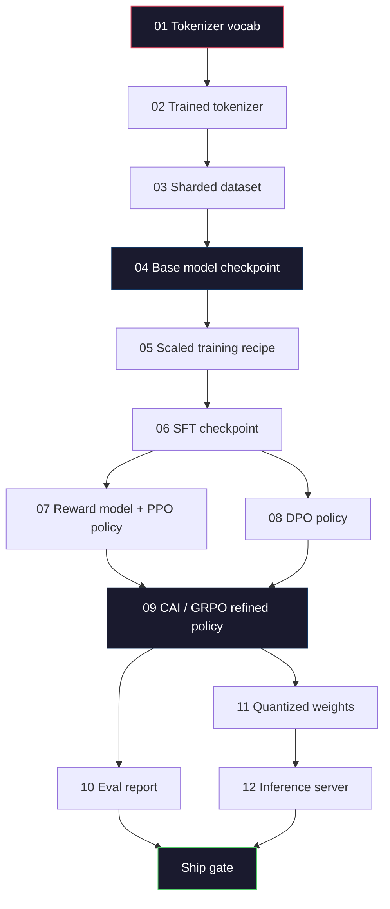
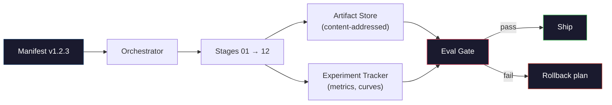

# Construire un pipeline complet de LLM

> Tout, de la leçon 1 à 12, est une étape d'un pipeline. Cette leçon est l'échafaudage qui transforme ces étapes en une seule course de bout en bout: symboliser, pré-train, échelle, SFT, aligner, évaluer, quantifier, servir. Vous ne serez pas entraîner un modèle 70B sur un ordinateur portable. Vous produirez la couche d'orchestration, le manifeste, la passerelle d'évaluation et le plan de retour que l'équipe frontalière 2026 utilisera pour décider ce qui sera expédié. C'est la pierre angulaire.

> **【中文解读】**第 01-12 课程一条管线的各个阶段──本课将它们串联为端到端运行:分词→预训练→扩展→SFT→对齐→评估→量化→部署──你不会在笔记本上训练70B 模型,但你会出 2026年前沿团队用来决定发布什么编排层──

> **【拓展：端到端管线→生产实践】**La série de modèles de production de l'équipe de production de l'équipe de production de l'équipe de production de l'équipe de production de l'équipe de production de l'équipe de production de l'équipe de production de l'équipe de production de l'équipe de production de l'équipe de production de l'équipe de production de l'équipe de production de l'équipe de production de l'équipe de production de l'équipe de production de l'équipe de production de l'équipe de production de l'équipe de production de l'équipe de production de l'équipe de production de l'équipe de production de l'équipe de production de l'équipe de production de l'équipe de production de l'équipe de production de l'équipe de production de l'équipe de production de l'équipe de production de l'équipe de production de l'équipe de production de l'équipe de production de l'équipe de production de l'équipe de l'équipe de production de l'équipe de l'équipe de production de l'équipe de l'équipe de l'équipe de l'équipe de l'équipe de l'équipe de l'équipe de l'équipe de répartition de répartition de répartition de répartition de répartition de répartition de l'équipe de répartition de répartition de répartition de répartition de répartition de répartition de répartition de répartition de répartition de répartition de répartition de répartition de répartition de répartition de répartition de répartition de répartition de répartition de répartition.

>  **【前置】**C'est la première étape de la phase 10, il faut la première étape de la phase 10.01-12.

>  **【类比】**完整LLM 管线 = 造车流水线. 前面 12 课学了每个工位. 发动机,装底盘,喷漆),本节是工厂设计师把这些工位按顺序串起来,加上"质检门" (门) "返工通道" (轮回) "生产计划表" (表) .

**Type:** Build
**Languages:** Python (stdlib)
**Prerequisites:** All Phase 10 lessons 01-12
**Time:** ~120 minutes

## Objectifs d'apprentissage

- Composer les onze leçons précédentes (tokenizer, données, pré-formation, mise à l'échelle, SFT, RLHF, DPO, CAI, évaluation, quantification, inférence) dans une seule spécification de pipeline reproduisable
  Le système de calcul de la valeur de l'échantillon de données est le plus important dans le domaine de la gestion de la production de données.
- Définir le contrat d'artéfact entre les étapes: ce que chaque étape consomme, ce qu'elle produit et comment la phase suivante vérifie l'entrée
  定义阶段间产品契约: chaque phase consomme quoi, produit quoi,
- Construisez un orchestrateur qui suit les expériences, hashes des artefacts et porte les décisions de l'expédition sur les seuils d'évaluation
  Construire un éditeur, suivre des expériences, faire des recherches et évaluer les valeurs et prendre des décisions
- Conception du plan de réouverture: quels objets sont bon marché à réutiliser, quels sont chers et quels sont les coûts d'un poste de contrôle corrompu
  design roll plan: quels produits sont bon marché, coûteux, endommagés

## Le problème , l' introduction du problème

Les cours précédents fonctionnent. Tokenizer formé. Petit GPT pré-entraîné. SFT dataset assemblé. Modèle de récompense formé. DPO run. Evals mesurés. Poids quantifiés exportés. Serveur d'inférence dérivé. Chacun est un ordinateur portable. Chacun a ses propres conventions, ses propres chemins de sortie, sa propre semence.

>  les cours précédents étaient chacun en mesure de travailler  分词器训练了──迷你 GPT 预训练了──SFT 数据集组装了──奖励模型训练了──DPO 运行了──评估测量了──量权重导出──推理服务器启动──每个是一个笔记本──每个都有自己的约定,自己的输出路径──自己的种子──

Une course de formation à la frontière n'est pas un carnet. Llama 3 405B a pris 30 millions d'heures sur environ 54 jours. DeepSeek-V3 a utilisé environ 2,8 millions d'heures H800. Pendant ce temps, un point de contrôle corrompu, une contamination de données, une régression d'évaluation peuvent coûter une semaine de temps de travail et un mois de budget de GPU à une équipe. La façon dont les équipes survivent à cela est par l'hygiène des pipelines: chaque étape a une entrée déterministe, une sortie déterministe, un manifeste, un hash et une porte.

> Le programme de formation de la première ligne n'est pas un ordinateur de calcul. Llama 3 405B a utilisé environ 3 millions d'heures, environ 54 jours. DeepSeek-V3 a utilisé environ 2 millions de milliers de heures. Pendant ce temps, un point de contrôle de dégradation, une contamination de données, une évaluation de retour pourrait faire perdre à l'équipe une semaine de temps de chargement et un mois de budget de GPU.

Vous n'exécuterez pas le pipeline de bout en bout sur un ordinateur portable. Vous écrirez l'orchestre qui coordonne les étapes, le manifeste qui décrit la course, le vérificateur qui contrôle les décisions des navires et le plan de répétition qui permet à un tiers de réexécuter votre travail à partir d'un seul fichier. Le code est petit; la discipline est grande.

> C'est le cours de pointe. Vous ne serez pas sur le pipeline de travail de bout en bout. Vous écrirez un coordonnateur de chaque étape, un éditeur de calcul, un décrivain de la décision de mise en œuvre, ainsi que un programme de réémission de votre travail à partir d'un seul document.

Le modèle s'échelle de 100M à 1T sans changement. Les mêmes quatre composants - manifeste, orchestrateur, porte d'évaluation, magasin d'artefacts - exécutent Llama 3 et exécutent aussi votre hobby GPT. La différence est la taille des nombres à l'intérieur de la configuration de chaque étape, pas la forme du pipeline.

## Le concept de base.

> **【中文解读】**Le cours va intégrer tous les composants de la première phase de l'enseignement supérieur en ligne de formation de l'enseignement supérieur.

> **【拓展：完整管线的成本估算】**entraînement d'un modèle Llama 3 de classe 70B  coûts de ligne complète: pré-entraînement environ 200-500 millions USD (GPU temps), SFT environ 1-50.000 USD (Data Marque), RLHF/DPO environ 5-10 millions USD (Preference Data Marque) ⋅ Le coût total de la pré-entraînement est de 95%+, mais la phase de préparation détermine la pratique et la sécurité du modèle.


### Les douze étapes

Chaque leçon de la phase 10 est une étape.



Les étapes 07 et 08 peuvent fonctionner en parallèle. Tout le reste est une dépendance difficile. Un changement de stade 02 (tokenizer) annule chaque artefact en aval. Un changement de stade 10 (eval) annule seulement la décision du navire.

> Les changements de l'équipe de travail peuvent être effectués à partir de la phase 07 et 08 et peuvent être effectués à partir de la phase 02 et de la phase 10 et de la phase 10 et de la phase 10 et de la phase 8 et de la phase 2 et de la phase 8 et de la phase 8 et de la phase 8 et de la phase 2 et de la phase 8 et de la phase 8 et de la phase 8 et de la phase 8 et de la phase 8 et de la phase 8 et de la phase 8 et de la phase 8 et de la phase 8 et de la phase 8 peuvent être effectués à partir de la phase 2 et de la phase 2 et de la phase 2 et de la phase 2 et de la phase 2 et de la phase 2 et de la phase 2 et de la phase 3 et de la phase 3 et de la phase 3 et de la phase 3 et de la phase 2 et de la phase 2 ne sont pas réalisés.

### Le manifeste

Un manifeste est un fichier unique qui décrit une course suffisamment complètement pour la reproduire. Rien du pipeline produit ne devrait dépendre de l'état qui n'est pas dans le manifeste. Les champs sont ennuyeux et obligatoires.

```
pipeline_version: 1.2.3
seed: 42
git_commit: a1b2c3d4
stages:
  01_tokenizer:
    recipe: bpe_32k
    input_hash: sha256:...
    output_hash: sha256:...
    wall_clock_sec: 3600
    cost_usd: 12
```

Le hash de sortie de l'étape N est le hash d'entrée de l'étape N + 1. Tout déviation et le pipeline s'arrête. C'est ainsi que vous détectez la corruption des données tôt. C'est aussi comment un collègue d'équipe sur un autre continent vérifie que leur répétition a produit le même artefact que le vôtre.

En pratique, les équipes utilisent un petit schéma YAML plus un vérificateur manifeste qui diffère de la conduite réussie précédente.

### Tapeur d'objets

La sortie de chaque étape est un artefact typé, pas une tache de répertoire, pas un picel, mais un type nommé avec un schéma connu.

| Stage | Artifact Type | Key Fields |
|-------|--------------|-----------|
| 01-02 | Tokenizer | vocab.json, merges.txt, config.json, hash |
| 03 | Dataset | shards[], row count, token count, dedup stats |
| 04-05 | Checkpoint | weights.safetensors, config.json, optimizer state, step count |
| 06 | SFT Model | checkpoint + SFT recipe + data mix |
| 07 | Reward Model | RM checkpoint + preference data hash |
| 08-09 | Policy | checkpoint + reference hash + beta + KL budget consumed |
| 10 | Eval Report | benchmark scores + regression diffs + eval data hash |
| 11 | Quantized Model | quantized weights + calibration data + accuracy delta vs FP16 |
| 12 | Server Spec | endpoint + model hash + config + observability hooks |

La typage empêche le mode d'échec le plus courant: en utilisant une sortie de stade 08 comme entrée de stade 06, en expédiant un modèle formé par DPO à travers le chemin SFT.

### La porte d'Eval

Le transport ne se fait pas "entraînement terminé". Le transport est "entraînement terminé et passer la passerelle d'évaluation". La passerelle est définie avant le début de la course.

```
gates:
  mmlu:      >= baseline + 0.5   # no regression
  humaneval: >= baseline + 1.0
  truthfulqa: >= baseline         # no drop
  safety_refusal_rate: <= 0.05
  kl_from_reference: <= 25.0
  cost_total_usd: <= 50000
```

Chaque porte est un seuil numérique. Aucune porte "a l'air bien". Aucune signature subjective. Si chaque porte passe, l'artefact est marqué expéditable. Si une porte échoue, la course est tenue en attendant une annulation explicite par un réviseur nommé, qui est elle-même enregistrée dans le manifeste.

Deux portes prennent la plupart des catastrophes. Une porte de régression (le nouveau modèle doit être au moins aussi bon que le précédent sur les critères de référence fondamentaux) prête l'attention aux bugs de formation. Une porte de budget de KL (la politique alignée ne doit pas avoir dérivé plus loin que X de sa référence) prête l'attention à la surcouture de l'alignement.

### L'orchestre

Un petit morceau de code qui lit le manifeste, envoie des étapes, suit les artefacts et arrête toute violation de contrat. Ce n'est pas Airflow. Ce n'est pas Kubeflow. Pour l'hygiène des pipelines, vous voulez quelque chose d'ennuyeux que vous avez écrit.

Le travail de l'orchestre est étroit:

1. Déterminez le jour de l'événement du manifeste.
2. Pour chaque étape, vérifiez si la sortie attendue existe déjà au hash correct (s'il y a lieu, sautez).
3. Faites le tour, capturez le stdout/stderr, mesurez l'horloge murale et le coût.
4. Vérifiez le hash de sortie par rapport au hash d'entrée attendu de l'étape en aval.
5. En cas d'échec, écrivez un manifeste partiel avec le stade exact d'échec et sortez non zéro.

C'est 200 lignes de Python. Ça ressemblera au fichier.`code/main.py`Dans cette leçon, sous le capot, le vrai pipeline utilise`torchrun`ou `ray`pour exécuter des étapes individuelles sur des groupes, mais l'orchestre lui-même fonctionne sur une seule boîte.

### Suivi des expériences et stockage des objets

Deux systèmes externes ancrent le pipeline.

**Experiment tracker (wandb, neptune, mlflow).**Les journaux de perte de courbes, évaluer les métriques, système de télémétrie par étape. Le tracker est où vous allez quand vous devez comparer course A contre course B trois semaines plus tard. Les équipes utilisent presque toujours un tracker hébergé pour cela - écrire votre propre perd du temps qui devrait aller à l'entraînement.

**Artifact store (S3, R2, GCS).**Les objets sont stockés par hash, pas par nom de fichier.`latest.pt`est une arme à feu;`ckpt-7b-step-20000-sha256:abc123.safetensors`C'est un contrat.

L'orchestre écrit aux deux, le tracker est pour les humains qui regardent les cartes, le magasin d'artifacts est pour la prochaine étape, pour rechercher les entrées.

### Coût

Une course frontalière a un numéro de dollar attaché.

**Pre-run estimate.**À partir du manifeste, calculer les FLOP attendus (pour la pré-formation: 6 x paramètres x jetons), les heures GPU attendues (FLOP / débit / utilisation maximale), et le coût en dollars au taux de location actuel. Si l'estimation dépasse la porte budgétaire, le pipeline refuse de commencer.

**In-run tracking.**Les coûts sont enregistrés dans le manifeste étape par étape. Après chaque étape, le budget restant est vérifié. Si une étape est dépassée, la porte de la prochaine étape est évaluée avec le nouveau budget restant. Vous ne découvrez pas que vous êtes à court d'argent lorsque le VC appelle.

Le coût déclaré de Llama 3 était $61M. DeepSeek-V3 reported $5,6 millions pour la première course de pré-entraînement. Le ratio est principalement l'efficacité matérielle plus le mélange d'experts -- mais le coût spécifique est visible parce que les deux équipes l'ont suivi par étape, pas par course.

### La reproductibilité par rapport au déterminisme

Ces paramètres ne sont pas les mêmes. *Reproducible* signifie le même manifeste plus le même code plus la même infrastructure produit un point de contrôle avec des mesures en aval équivalentes. *Deterministic* signifie une sortie identique à un bit.

La formation moderne en LLM est reproduisable mais non déterministe. Le système de formation distribuée réduit l'ordre, le non-determinisme du noyau GPU (cuBLAS, flash-attn) et l'arrondissement de précision mixte se combinent pour produire des floats qui diffèrent au niveau 1e-5 entre les courses. C'est bon pour les statistiques finales, qui ne bougent pas. Il est fatal si vous essayez de déboguer avec des différences de niveau de bits. Le remède est de noter le hash d'entrée de chaque étape, le hash de sortie et les métriques de titre -- si elles correspondent, la course est "reproducée" même si les poids ne sont pas bit-identiques.



### Plan de retour

Avant le début de la course, écrivez ce qui se passe sur l'échec de chaque étape.

- **Cheap to re-run**(heures): Tokenizer, évaluation, quantification, serveur d'inférence.
- **Medium**(jours): SFT, DPO, CAI. Gardez le modèle de base; réinitialisez uniquement les étapes d'alignement.
- **Expensive**Le plan de reprise ici n'est pas de "re-run". Il s'agit de "utiliser le dernier bon point de contrôle et de re-runner les étapes inférieures moins chères avec des données révisées".

Parce que les dépendances de scène sont typées et hashées, l'orchestre peut calculer le jeu de retour automatiquement: invalider la scène ratée plus chaque descendant. Une défaillance à l'étape 06 (SFT) invalidera 06, 07, 08, 09, 10, 11, 12.

### Récepts de production observés en 2026

La plupart des équipes frontalières se sont convergentes sur le même squelette.

- Tokenizer: 128k BPE avec byte fallback.
- Pré-entraînement: 10 à 20 tokens T, principalement web plus code plus synthétique. Optimisateur Muon ou AdamW. FSDP2 ou DeepSpeed ZeRO-3.
- SFT: paires d'instructions 500k-2M, mélangées humaine et synthétique, avec une déduction stricte par rapport à l'ensemble d'évaluation.
- L'alignement: DPO ou CAI + GRPO. RLHF seulement lorsque le signal de préférence est trop multidimensionnel pour le DPO.
- Eval: MMLU-Pro, MATH, HumanEval+, GPQA, SWE-Bench Verified, LiveBench, plus un ensemble privé détenu par le public ne voit jamais.
- Quantisation: GPTQ ou AWQ de 4 bits pour la prestation, évaluations de sécurité de 8 bits pour les zones où la précision est importante.
- Servir: vLLM, TensorRT-LLM, ou en interne.

Les chiffres changent tous les six mois.

```figure
beam-search
```

## Faites-le

> **【拓展：训练管线的工程挑战】**Complet LLM training pipeline 工程挑战包括:检查点管理(每 N 步保存模型状态,训练中断后可恢复) 日志和监控(WandB 追踪损失曲线、学习率、吞吐量) 超参数搜索、故障恢复──


## Construisez-le et mettez-le en œuvre.

Le code de la leçon est un orchestrateur et un vérificateur manifeste, pas douze scripts d'entraînement. Chaque étape est simulée avec un placeholder qui produit un artefact de sortie avec la forme et le hash corrects.

> Ce code de cours est un éditeur et un inspecteur de liste, pas douze scripts de formation. Chaque étape utilise un emplacement pour simuler, produire des produits de sortie de forme et de taille correcte.

Le pipeline en `main.py`Il utilise une passerelle d'évaluation pour montrer à quoi ressemble une course tenue.

> `main.py`Le système de contrôle de la ligne centrale est composé de 12 étapes de traitement, produit un tableau, et testé une évaluation échouée pour montrer ce que c'est que de la ligne de contrôle suspendue.

## Utilisez-le avec le cadre de réalisation

Le flux de travail canonique a trois commandes.

> Le standard de travail a trois ordres:

On court .`plan`La plupart des bugs du pipeline apparaissent à l'heure prévue - seuils manquants de passerelle, hashes obsolètes, dépassements budgétaires.`plan`Il est libre.`run`Économisez de l'argent en attrapé des insectes au bon marché.

> Chaque première opération`plan` Les bugs de la ligne de tuyau sont apparus lors de la planification de la mise en œuvre de la mise en œuvre de la mise en œuvre de la mise en œuvre de la mise en œuvre de la mise en œuvre de la mise en œuvre de la mise en œuvre de la mise en œuvre de la mise en œuvre de la mise en œuvre de la mise en œuvre de la mise en œuvre de la mise en œuvre de la mise en œuvre de la mise en œuvre de la mise en œuvre de la mise en œuvre de la mise en œuvre de la mise en œuvre de la mise en œuvre de la mise en œuvre de la mise en œuvre de la mise en œuvre de la mise en œuvre de la mise en œuvre de la mise en œuvre de la mise en œuvre de la mise en œuvre de la mise en œuvre de la mise en œuvre de la mise en œuvre de la mise en œuvre de la mise en œuvre de la mise en œuvre de la mise en œuvre de la mise en œuvre de la mise en œuvre de mise en œuvre de la mise en œuvre de mise en œuvre de mise en œuvre de mise en œuvre de mise en œuvre de mise en œuvre de mise en œuvre de mise en œuvre de mise en œuvre de mise en œuvre de mise en œuvre de mise en œuvre de mise en œuvre de mise en œuvre.`plan`免费──运行 `run`On peut en faire un peu plus.

La production de `gate`est soit `SHIP`ou `HOLD: <reason>`Un examen effectué n'est pas un échec, mais un point de décision.

> `gate`De l'extrait est `SHIP`Ou `HOLD: <reason>` Le processus de mise en œuvre n'est pas un échec; il s'agit d'un point de décision.

## Envoyez-le . Produit .

Cette leçon produit `outputs/skill-llm-pipeline-reviewer.md`. Il lui donne un manifeste de pipeline proposé et il vérifie tous les contrats: taper des étapes, chaîne de hachage, portes, plan de retour, estimation des coûts. Il refuse d'approuver un manifeste avec une passerelle d'évaluation manquante, un budget KL illimité ou une course qui mélange les données d'évaluation et de formation.

> 本课产 出 `outputs/skill-llm-pipeline-reviewer.md` L'Agence de l'information et de la communication (Agence de l'information et de l'information sur les projets de développement) a adopté une proposition de directive de l'Agence de l'information et de l'information sur les projets de développement et de développement (Agence de l'information et de l'information sur les projets de développement et de développement) en vue de la mise en œuvre de la stratégie de développement et de la mise en œuvre de la stratégie de développement et de la mise en œuvre de la stratégie de développement.

## Les exercices

1. Étendre l'orchestre pour soutenir l'exécution parallèle des étapes 07 et 08. Utilisez le stdlib `concurrent.futures`Confirmer que le manifeste final enregistre les sorties des deux étapes et que le hash d'entrée de l'étape 09 est une combinaison déterministe des deux.
   Le texte est en anglais et en français.`concurrent.futures`模块── confirmer le bilan final des deux étapes de sortie, puis les entrées de la phase 09 哈希是两者的确定性组合──

2. Ajouter une passerelle "contrôle de contamination". Compte tenu du hash du jeu de données eval et des fragments du jeu de données de formation, calculer la chevauchement (correspondance exacte de la chaîne ou correspondance de 13 grammes). La passerelle échoue si la chevauchement dépasse 0,1%.
   Le contrôle de la pollution est un contrôle de la pollution.

3. Pour la phase 04 (pré-entraînement), estimez les FLOP comme 6 x paramètres x jetons, en supposant 40% MFU (utilisation de modèles FLOP) sur H100 à 989 TFLOPs BF16, à 2,50 $/GPU-heure.
   Pour la phase 04 ((pre-train), l'estimation des FLOP est de 6 x 参数 x token, la hypothèse H100 sur 40% MFU (Modeal Algebraic Utility Rate), 989 TFLOPS BF16, $2.50/GPU-小时── rapport 7B 模型在 2T token 上训练的估算──

4. Construisez un retour partiel. Simuler une défaillance à l'étape 09 (CAI), puis réinitialiser les étapes 09 à 12 tout en laissant 01-08 en cache. L'orchestre doit détecter les objets cachés par hash et les sauter. Mesurer l'horloge murale enregistrée par rapport à la réinitialisation complète.
   Le répertoire de l'équipe de réparation de la mise en cache est un répertoire de la mise en cache de l'équipe de réparation de la mise en cache.

5. Ajouter l'observabilité. Émettez des étendues OpenTelemetry pour chaque étape, avec des attributs pour les paramètres, les jetons vus, la perte et le coût.
   Pour chaque étape, une extension OpenTelemetry est émise, avec des paramètres, des jetons, des pertes et des coûts.

## Les termes clés

| Term | What people say | What it actually means | 中文释义 |
|------|----------------|----------------------|---------|
| Manifest | "The recipe file" | YAML or JSON describing pipeline version, seed, per-stage config, and gate thresholds — sufficient to replay a run | 清单文件，描述管线版本、种子和每阶段配置 |
| Content-addressed | "By hash not name" | Artifacts stored by SHA-256 of their contents, so you can never confuse version A with version B | 内容寻址，按 SHA-256 哈希存储产物 |
| Eval gate | "The ship criteria" | Numeric thresholds on benchmark metrics and safety scores that must pass before an artifact is marked shippable | 评估门控，基准和安全分数必须达标才能发布 |
| KL budget | "How far alignment drifted" | A cap on cumulative KL(policy || reference) across alignment stages, enforced as a gate | KL 预算，对齐阶段累计 KL 散度的上限 |
| MFU | "How much of the GPU you used" | Model FLOPs Utilization — achieved FLOPs divided by theoretical peak. 40% is typical at 70B scale, 55% at 7B | 模型算力利用率，实际 FLOPs / 理论峰值 |
| Rollback plan | "What we do when it breaks" | Pre-written set of actions per stage on failure: re-run, fall back, retrain with revised inputs | 回滚计划，每个阶段失败时的预设行动方案 |
| Orchestrator | "The conductor" | The process that reads the manifest, dispatches stages, verifies hashes, halts on any contract violation | 编排器，读取清单、调度阶段、验证哈希 |
| Artifact store | "Versioned S3 for weights" | Immutable content-addressed object store — single source of truth for checkpoints, datasets, eval reports | 产物存储，不可变的内容寻址对象存储 |
| Reproducible | "Same metrics on replay" | Different bit-level weights but equivalent downstream metrics — the realistic target for distributed LLM training | 可复现，重跑时指标等价（权重可能不同） |
| Cost gate | "You cannot exceed X" | Pre-run cost estimate plus in-run tracker — the pipeline refuses to start if the estimate exceeds budget | 成本门控，预估超预算则拒绝启动 |

## Encore une lecture

- [Dubey et al., 2024 -- "The Llama 3 Herd of Models"](https://arxiv.org/abs/2407.21783)- la description publique la plus détaillée d'un pipeline frontalier comprenant les données, la formation, l'alignement, l'évaluation
- [DeepSeek-AI, 2024 -- "DeepSeek-V3 Technical Report"](https://arxiv.org/abs/2412.19437)-- première ligne d'efficacité à environ 1/10 du coût de la formation de classe Llama 3
- [Kaplan et al., 2020 -- "Scaling Laws for Neural Language Models"](https://arxiv.org/abs/2001.08361)-- la relation d'échelle de calcul-données-paramètres d'origine
- [Hoffmann et al., 2022 -- "Training Compute-Optimal Large Language Models (Chinchilla)"](https://arxiv.org/abs/2203.15556)-- la correction à Kaplan qui a récalibré les budgets de données modernes
- [PyTorch FSDP2 documentation](https://pytorch.org/docs/stable/fsdp.html)-- le primitif de formation distribué remplaçant le FSDP1 dans PyTorch 2.4+
- [Weights & Biases LLM Reports](https://wandb.ai/site/llms)-- réels manifestes et sortie de tracker d'expérience pour les cours de LLM open source, utiles comme modèles plagiatables
