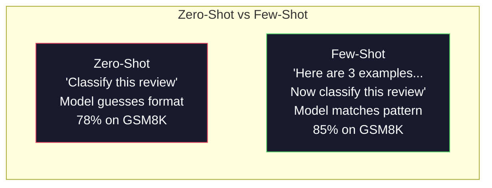
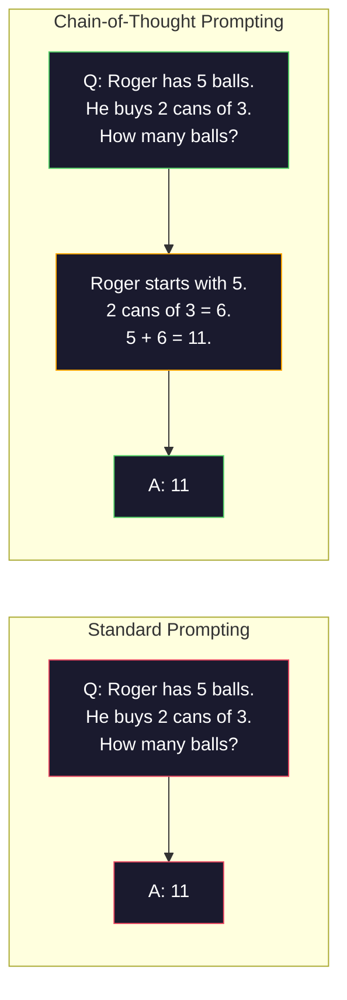
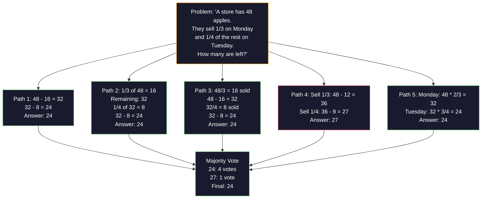
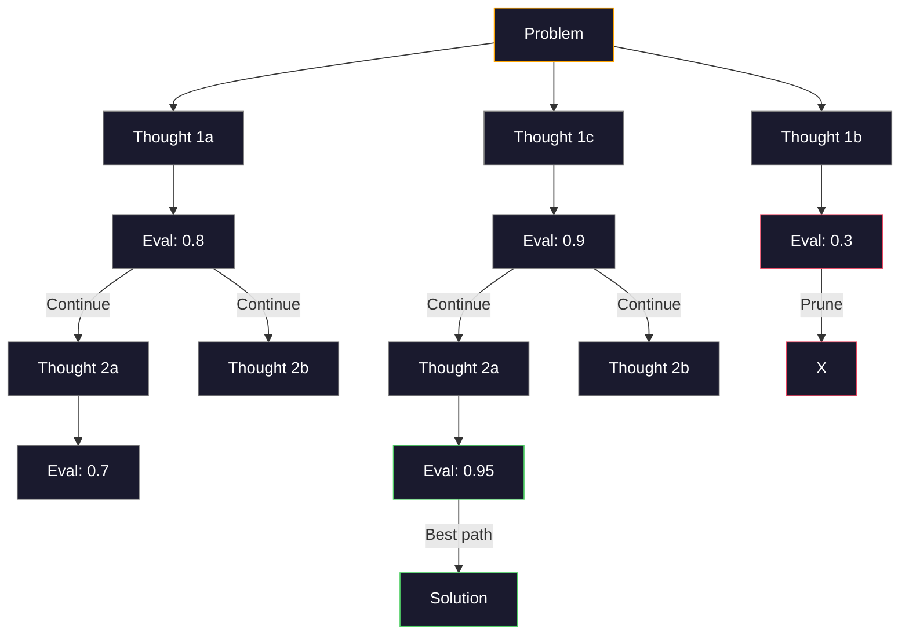

# Quelques coups, chaîne de pensée, arbre de pensée.

> C'est une technique de savoir ce qu'il faut faire, de lui montrer comment penser. L'écart entre 78% et 91% de précision sur le même modèle, la même tâche, les mêmes données n'est pas un meilleur modèle. C'est une meilleure stratégie de raisonnement.

> **【中文解读】**告诉模型"做什么" est un conseil, montrer "how to think" est un projet. Le taux de précision de 78% à 91% est augmenté non pas par un meilleur modèle, mais par une meilleure stratégie de raisonnement.

> **【拓展：推理策略→AI Agent】**Le cycle de pensée-action-observation de ReAct est le cœur du cadre de LangChain, CrewAI et autres agents.

>  **【前置】**學本節前 請先掌握:Phase 11·01 ((Prompt Engineering)  comprendre le système prompt、role、constraints等基本模式──本节是其延伸,要求你已经能写出结构化的 prompt──本节将用于OpenAI/Anthropic SDK──

**Type:** Build | **类型:** 构建
**Languages:** Python | **语言:** Python
**Prerequisites:** Lesson 11.01 (Prompt Engineering) | **前置知识:** Phase 11 · 01 (提示工程)
**Time:** ~45 minutes | **时间:** ~45 分钟

## Objectifs d'apprentissage

- Implémenter des demandes de quelques coups en sélectionnant et en formatant des exemples de démonstrations qui maximisent la précision des tâches
   par la sélection et la présentation des exemples de formulation pour réaliser un petit échantillon de suggestions, le taux de précision des tâches maximisé
- Appliquer le raisonnement de la chaîne de pensée (CoT) pour améliorer la précision sur les problèmes à plusieurs étapes tels que les problèmes de mots mathématiques
  应用链式思维 (CoT) Proposition visant à améliorer le taux de précision des questions à plusieurs étapes (comme les questions d'application mathématique)
- Construisez une requête de pensée qui explore plusieurs voies de raisonnement et sélectionne la meilleure
  构建思维树提示, explorer多条推理路并选择最佳路
- Mesurer l'amélioration de la précision par rapport à la précision de tir nul par rapport à celle de tir peu par rapport à la précision de tir CoT sur un critère de référence standard
  Le taux de précision des mesures à la base standard est augmenté par le taux de précision de 0 échantillons par rapport à 0 échantillons par rapport à 0 échantillons par rapport à CoT.

> **【中文解读】**Le but de ce cours est de maîtriser quelques-uns de ces deux techniques: la mise en œuvre de la méthode de gestion de la gestion de projet (MBA) et la mise en place d'une chaîne de pensée (MBA).


## Le problème , l' introduction du problème

Vous construisez une application de tutorat de mathématiques. Votre demande dit: "Résolvez ce problème de mot". GPT-5 est correct 94% du temps sur GSM8K, le critère de référence de mathématiques standard de l'école primaire. Vous pensez avoir déjà atteint un sommet. Vous ne  chaîne de pensée ajoute encore 3-4 points.

> Vous avez construit une application de mathématiques. Votre suggestion est de résoudre ce problème. Le taux d'exactitude du GPT-5 sur le GSM8K est de 94%.

Ajouter cinq mots -- "Pensez pas à pas" -- et la précision passe à 91%. Ajouter quelques exemples travaillés et il atteint 95%. Le même modèle. La même température. Le même coût API. La seule différence est que vous avez donné le papier à gratter au modèle.

> "Pensons étape par étape" Le taux de précision saute jusqu'à 91%Plus de quelques exemples déjà résolus atteignent 95% Le même modèle, la même température, la même API

Ce n'est pas un hack. C'est la façon dont le raisonnement fonctionne. Les humains ne résolvent pas de problèmes en plusieurs étapes en un seul saut mental. Les transformateurs non plus. Lorsque vous forcez un modèle à générer des jetons intermédiaires, ces jetons font partie du contexte du token suivant. Chaque étape de raisonnement alimente le suivant. Le modèle calcule littéralement son chemin vers la réponse.

> Ceci n'est pas un truc. C'est le travail de la logique. L'homme ne peut pas compléter plusieurs étapes à la fois. Le transformateur ne peut pas non plus. Lorsque vous forcez un modèle à générer des jetons intermédiaires, ces jetons font partie de la suite de la prochaine jeton. Chaque étape de la logique fournit des informations pour la prochaine étape.

>  **【类比】**Non pas avec CoT 像让人"心算 17 × 24" La plupart des gens vont calculer err errore ou卡住。 avec CoT 像给一张草稿纸:"17 × 24 = 17 × 20 + 17 × 4 = 340 + 68 = 408"一步步写下来就不会错过。LLM

> ️ **【易错点】**Il y a trois cratères de la côte:**示例数量错误**0-shot CoT 加 "Pensons pas à pas" 就足,再加 3-5 个少拍示例能再 2-5 点; dépassant 8 个示例性价比下降(prompt 太长、成本 上)**示例顺序敏感** Avec les 3 exemples suivants: A,B,C et C,B,A, le taux de précision est de 5 à 10%; il est indispensable de mettre les "exemples les plus pertinents" au dernier niveau.**CoT 不适用于简单任务**"Aujourd'hui, il y a plusieurs étapes à suivre.

Mais "penser étape par étape" est le début, pas la fin. Que faire si vous preniez un échantillon de cinq voies de raisonnement et que vous preniez un vote majoritaire? Que faire si vous laissez le modèle explorer un arbre de possibilités, évaluer et tailler des branches? Que faire si vous intermez le raisonnement avec l'utilisation d'outils? Ce ne sont pas des hypothèses. Ce sont des techniques publiées avec des améliorations mesurées, et vous les construirez toutes dans cette leçon.

> Mais "penser à la suite" n'est que le début, pas le bout. Si vous choisissez cinq voies de pensée puis faites la majorité des votes, comment allez-vous? Si vous faites explorer un arbre de possibilités, comment allez-vous évaluer et couper les branches?

## Le concept de base.

> **【中文解读】**Peu de types d'apprentissage ([[Few-shot) 和思维链]] [[Chain-of-Thought, CoT) sont les deux principales techniques de l'ingénierie rapide.

> **【拓展：CoT 的推理提升效果】**Le projet de recherche de Google 2022 prouve que, dans les tâches de raisonnement mathématique, le CoT augmentera le taux d'exactitude de PaLM 540B de 17% à 56%.

> 🤔 **【困惑】**Q: 2026 année original-生推理模型(Claude Extended Thinking、o3) 都自带 CoT 了, je dois encore écrire "penser étape par étape" ? A: Non nécessaire, mais avec présupposé:(1) Utilisez le modèle original-生推理Claude 4.5+、GPT-5、o3、DeepSeek-R1 etc;(2) 任务确实需要推理简单分类任务原生思考反而拖慢──对老模型(GPT-4、Claude 3) 或开源模型Llama 3) 仍然需要手写 CoT──判断:如果模型有`reasoning_effort`Ou `thinking`参数, avec elle; sinon avec prompt。


### Zéro tir contre peu de tir: quand les exemples battent les instructions

La mise en œuvre de la mise en scène zéro donne au modèle une tâche et rien d'autre.

> 零样本提示只给模型一个任务,不加其他内容――少样本提示则先给模型一个任务,没有其他内容――

Wei et al. (2022) ont mesuré cela sur 8 critères de référence. Pour les tâches simples comme la classification du sentiment, les tirages zéro et les tirages peu performés dans un délai de 2% les uns des autres. Pour les tâches complexes comme l'arithmétique en plusieurs étapes et le raisonnement symbolique, les tirages peu améliorées de l'exactitude de 10 à 25%.

> Wei et d'autres ont mesuré ce point sur 8 critères. Pour les tâches simples comme les émotions, les différences de performance entre les échantillons zéro et les échantillons mineurs sont de 2% et en moins. Pour les tâches complexes comme les calculs à plusieurs étapes et la logique des symboles, le taux d'exactitude des échantillons mineurs a augmenté de 10 à 25%.

L'intuition: les exemples sont des instructions compressées. Au lieu de décrire le format de sortie, vous le montrez. Au lieu d'expliquer le processus de raisonnement, vous le démontrerez. Le modèle correspond aux exemples plus fiablement qu'il n'interprète les instructions abstraites.

> 直觉: l'exemple est une instruction de compression. Avec sa description du format de sortie, il ne s'agit pas de la démontrer directement. Avec son interprétation du processus de déduction, il ne s'agit pas de la démontrer directement.



**When few-shot wins:**tâches sensibles au format, classification, extraction structurée, jargon spécifique au domaine, toute tâche où le modèle doit correspondre à un motif spécifique.

> **少样本胜出的场景**: formations sensibles à des tâches, catégories, structures, termes spécifiques à un domaine, tout modèle qui doit correspondre à un modèle spécifique de tâches.

**When zero-shot wins:**Les questions factuelles simples, les tâches créatives où les exemples limitent la créativité, les tâches où trouver de bons exemples est plus difficile que d'écrire de bonnes instructions.

> **零样本胜出的场景**Les exemples permettent de limiter les tâches créatives créatives, de trouver de bons exemples plutôt que de rédiger des instructions plus difficiles.

### Sélection d'exemple: Batte similaire au hasard

Les résultats obtenus par le choix d'exemples similaires à l'entrée cible dépassent de 5 à 15% la sélection aléatoire sur les tâches de classification (Liu et coll., 2022).

> Les exemples de sélection et d'entrée de but similaires sont de 5 à 15% plus élevés que les exemples de sélection aléatoire sur les tâches de catégorie.

1. **Semantic similarity**: choisir des exemples les plus proches de l'entrée dans l'espace d'intégration
   **语义相似性**: choisir l'exemple le plus proche de l'entrée dans l'espace de mise
2. **Label diversity**: couvre toutes les catégories de sorties dans vos exemples
   **标签多样性**: dans l'exemple couvre toutes les catégories de sorties
3. **Difficulty matching**: correspondre au niveau de complexité du problème cible
   **难度匹配**: Classe de complexité du problème de l'objectif de correspondance

Le nombre optimal d'exemples pour la plupart des tâches est de 3-5. En dessous de 3, le modèle n'a pas suffisamment de signal pour extraire le motif. Au-dessus de 5, vous cliquez sur les retours décroissants et les jetons de fenêtre de contexte. Pour la classification avec de nombreuses étiquettes, utilisez un exemple par étiquette.

> Le nombre d'exemples optimaux de la plupart des tâches est de 3 à 5 ⋅ moins de 3, le modèle n'a pas assez de signal pour tirer le modèle ⋅ plus de 5 ⋅ plus, les bénéfices marginal diminuent et perdent sur les jetons de la fenêtre ci-dessous ⋅ pour plusieurs catégories de tags, chaque label utilise un exemple ⋅

### Chaîne de pensée: des modèles de papier à gratter

La chaîne de pensée (CoT) a été introduite par Wei et collègues (2022) à Google Brain. L'idée est simple: au lieu de demander au modèle juste la réponse, demandez-lui d'exprimer ses étapes de raisonnement en premier.

> 链式思维(CoT)提示由Google Brain 的 Wei 等人(2022) Introduction。 l'idée est très simple: non seulement il exige le modèle de donner une réponse, mais il exige qu'il montre d'abord les étapes de la réflexion。



Pourquoi cela fonctionne-t-il mécaniquement ? Chaque jeton généré par un transformateur devient le contexte du jeton suivant. Sans CoT, le modèle doit compresser tout raisonnement dans l'état caché d'un seul passage à l'avant. Avec CoT, le modèle externe les calculs intermédiaires en tant que jetons. Chaque jeton de raisonnement étend la profondeur de calcul efficace.

> Pourquoi cela fonctionne-t-il sur le mécanisme?Chaque jeton produit par le transformateur devient le jeton suivant. Sans CoT, le modèle doit compresser toutes les hypothèses dans un état caché de propagation unique.

**GSM8K benchmarks (grade-school math, 8.5K problems):**

| Model | Zero-Shot | Zero-Shot CoT | Few-Shot CoT |
|-------|-----------|---------------|--------------|
| GPT-4o | 78% | 91% | 95% |
| GPT-5 | 94% | 97% | 98% |
| o4-mini (reasoning) | 97% | — | — |
| Claude Opus 4.7 | 93% | 97% | 98% |
| Gemini 3 Pro | 92% | 96% | 98% |
| Llama 4 70B | 80% | 89% | 94% |
| DeepSeek-V3.1 | 89% | 94% | 96% |

**Note on reasoning models.**Les modèles comme la série O (o3, o4-mini) et DeepSeek-R1 d'OpenAI fonctionnent en chaîne de pensée interne avant de donner leur réponse.

> **关于推理模型的说明。**Comme OpenAI, les modèles de la série O (o3、o4-mini) et de DeepSeek-R1 seront en fonctionnement en chaîne interne avant la réponse de sortie.

Deux saveurs de CoT:

> Les deux formes de la COT:

**Zero-shot CoT**Kojima et coll. (2022) ont montré que cette phrase améliore la précision des tâches d'arithmétique, de bon sens et de raisonnement symbolique.

> **零样本 CoT**Il est également possible de trouver des solutions à des problèmes de calcul et de calcul.

**Few-shot CoT**Le modèle est plus efficace que la CoT à tir zéro parce que le modèle voit le format de raisonnement exact que vous attendez.

> **少样本 CoT**Les modèles sont plus efficaces que le CoT de zéro échantillon, car le modèle voit le format de la réflexion précise que vous attendez.

**When CoT hurts**: simple rappel factuel ("Qu'est-ce que la capitale de la France?"), classification en étapes uniques, tâches où la vitesse compte plus que la précision. CoT ajoute 50 à 200 jetons de calcul général par requête.

> **CoT 何时有害**Le coût de la production est un gaspillage de 50 à 200 tokens par requête.

### L'auto-cohérence: en choisissant plusieurs, voter une fois

Wang et coll. (2023) ont introduit l'auto-cohérence. L'idée: un seul chemin de CoT peut contenir des erreurs de raisonnement. Mais si vous prenez des échantillons de N chemins de raisonnement indépendants (en utilisant la température > 0) et prenez le vote majoritaire sur la réponse finale, les erreurs sont annulées.

> Wang 等人(2023) introduit l'auto-harmonie.



L'auto-consistance a amélioré la précision du GSM8K de 56,5% (Cot unique) à 74,4% avec N=40 sur les expériences originales PaLM 540B. Sur le GPT-5, l'amélioration est faible (97% à 98%) car la précision de base est déjà saturée. La technique brille le plus sur les modèles avec une précision de CoT de base de 60 à 85% - le point de départ où les erreurs à voie unique sont fréquentes mais pas systématiques. Pour les modèles de raisonnement (série O, R1), l'auto-consistance est subjugée par l'échantillonnage interne intégré.

> La technologie de base de la cote de précision de 60 à 85% est la meilleure dans le modèle de la cote de précision de base de 60 à 85%.

Le compromis: N samples signifie Nx le coût et la latence de l'API. En pratique, N=5 capture la plupart des avantages. N=3 est le minimum pour un vote significatif. N > 10 a des rendements décroissants pour la plupart des tâches.

> 权衡:N 个样本意味着N 倍的API 成本和延迟――在实践中,N=5 捕获了大部分收益――N=3 是有意义的投票的最低要求――N > 10 对于大多数任务的边际收益递减――

### L'arbre de pensée: exploration des branches

Yao et coll. (2023) ont introduit l'Arbre de pensée (ToT). Lorsque la CoT suit un chemin de raisonnement linéaire, la ToT explore plusieurs branches et évalue celles qui sont les plus prometteuses avant de continuer.

> Yao 等人(2023) introduit le concept de "thinking tree" (à l'écoute) ⋅CoT ⋅ sur une voie de développement de la conception de la ligne, tandis que ToT ⋅ explore plusieurs branches et continue à évaluer les perspectives les plus prometteuses ⋅



Le TOT est composé de trois composantes:

> Il y a trois composants:

1. **Thought generation**: produire plusieurs candidats pour les prochaines étapes
   **思维生成**: produire plusieurs candidats
2. **State evaluation**: score de chaque candidat (peut utiliser le LLM lui-même comme évaluateur)
   **状态评估**Pour chaque candidat, vous pouvez utiliser le LLM en tant qu'évaluateur.
3. **Search algorithm**: BFS ou DFS à travers l'arbre, taille des branches à faible score
   **搜索算法**Par le biais de BFS ou DFS, le tronc est coupé

Dans le jeu de 24 tâches (combinez 4 nombres en utilisant l'arithmétique pour faire 24), GPT-4 avec l'interrogation standard résolve 7,3% des problèmes. Avec CoT, 4,0% (CoT fait mal ici parce que l'espace de recherche est large). Avec ToT, 74%.

> Dans le jeu de 24 tâches, GPT-4 utilise des conseils de référence pour résoudre 7,3% des problèmes.

Le TOT est cher. Chaque nœud de l'arbre nécessite un appel LLM. Un arbre avec un facteur de branchage 3 et une profondeur 3 nécessite jusqu'à 39 appels LLM. Utilisez-le uniquement pour les problèmes où l'espace de recherche est grand mais évaluable - planification, résolution de puzzle, résolution de problèmes créative avec contraintes.

> Pour chaque élément de l'arbre, il faut une fois de la MLL pour la modification. Pour chaque élément de l'arbre, il faut 39 fois de la modification.

### Réaction: penser + agir

Yao et al. (2022) combinent les traces du raisonnement avec les actions. Le modèle alternera entre la pensée (générer le raisonnement) et l'action (appeler des outils, la recherche, l'informatique).

> Le modèle de la formation de la formation et de l'élaboration de la formation de la formation de la formation de la formation de la formation de la formation de la formation de la formation de la formation de la formation de la formation de la formation de la formation de la formation de la formation de la formation de la formation de la formation de la formation de la formation de la formation de la formation de la formation de la formation de la formation de la formation de la formation de la formation de la formation de la formation de la formation de la formation de la formation de la formation de la formation de la formation de la formation de la formation de la formation de la formation de la formation de la formation de la formation de la formation de la formation de la formation de la formation de la formation de la formation de la formation de la formation de la formation de la formation de la formation de la formation de la formation de la formation de la formation de la formation de la formation de la formation de la formation de la formation de la formation de la formation de la formation de la formation de la formation de la formation de la formation de la formation de la formation de la formation de la formation de la formation de la formation de la formation de la formation de la formation de la formation de la formation de la formation de la formation de la formation de la formation de la formation de la formation de la formation de la formation de la formation de la formation de la formation de la formation de la formation de la formation de la formation de la formation de la formation de la formation de la formation de la formation de la formation de la formation de la formation de la formation de la formation de la formation de la formation de la formation de la formation de la formation de la formation de la formation de la formation de la formation de la formation de la formation de la formation de la formation de la formation de la formation de la formation de la formation de la formation de la formation de la formation de la formation de la formation de la formation de la formation de la formation de la formation de la formation de la formation de la formation de la formation de la formation de la formation de la formation de la formation de la formation de la formation de la formation de la formation de la formation de la formation de la formation de la formation de la formation de la formation de la formation de la formation de la formation de la formation de la formation de la formation de la formation de la formation de la formation de la formation de la formation de la formation de la formation de la formation de la formation

```mermaid
graph LR
    Q["Question:\nWhat is the\npopulation of the\ncountry where\nthe Eiffel Tower\nis located?"]
    T1["Thought: I need to\nfind which country\nhas the Eiffel Tower"]
    A1["Action: search\n'Eiffel Tower location'"]
    O1["Observation:\nParis, France"]
    T2["Thought: Now I need\nFrance's population"]
    A2["Action: search\n'France population 2024'"]
    O2["Observation:\n68.4 million"]
    T3["Thought: I have\nthe answer"]
    F["Answer:\n68.4 million"]

    Q --> T1 --> A1 --> O1 --> T2 --> A2 --> O2 --> T3 --> F

    style Q fill:#1a1a2e,stroke:#ffa500,color:#fff
    style T1 fill:#1a1a2e,stroke:#51cf66,color:#fff
    style A1 fill:#1a1a2e,stroke:#e94560,color:#fff
    style O1 fill:#1a1a2e,stroke:#808080,color:#fff
    style T2 fill:#1a1a2e,stroke:#51cf66,color:#fff
    style A2 fill:#1a1a2e,stroke:#e94560,color:#fff
    style O2 fill:#1a1a2e,stroke:#808080,color:#fff
    style T3 fill:#1a1a2e,stroke:#51cf66,color:#fff
    style F fill:#1a1a2e,stroke:#51cf66,color:#fff
```



ReAct surpasse la pure CoT sur les tâches intensives en connaissance parce qu'il peut baser son raisonnement sur des données réelles. Sur HotpotQA (response à des questions multi-hop), ReAct avec GPT-4 atteint un match exact de 35,1% contre 29,4% pour la CoT seule.

> ReAct sur des tâches de type connaissance intensive est supérieur à la pure CoT, car elle peut être basée sur des données réelles. Sur HotpotQA, ReAct avec GPT-4 atteint un taux de correspondance précis de 35,1%, tandis que la pure CoT est de 29,4%. La vraie force réside dans la logique de l'erreur.

ReAct est la base des agents d'IA modernes. Chaque cadre d'agent (LangChain, CrewAI, AutoGen) implique une variante de la boucle de pensée-action-observation. Vous construirez des agents complets dans la phase 14.

> ReAct est la base de l'agent moderne de l'IA. Chaque agent a réalisé une variation du cycle de pensée-action-observation.

### Prompte structurée: étiquettes XML, délimiteurs, en-têtes

À mesure que les prompts deviennent plus complexes, la structure empêche le modèle de confondre les sections.

>  Avec la complexité des suggestions, la structure peut empêcher le modèle de se mélanger à différentes parties:

**XML tags**(fonctionne mieux avec Claude, solide partout):
```
<context>
You are reviewing a pull request.
The codebase uses TypeScript and React.
</context>

<task>
Review the following diff for bugs, security issues, and style violations.
</task>

<diff>
{diff_content}
</diff>

<output_format>
List each issue with: file, line, severity (critical/warning/info), description.
</output_format>
```

**Markdown headers**(universel):
```
## Role
Senior security engineer at a fintech company.

## Task
Analyze this API endpoint for vulnerabilities.

## Input
{api_code}

## Rules
- Focus on OWASP Top 10
- Rate each finding: critical, high, medium, low
- Include remediation steps
```

**Delimiters**(minimum mais efficace):
```
---INPUT---
{user_text}
---END INPUT---

---INSTRUCTIONS---
Summarize the above in 3 bullet points.
---END INSTRUCTIONS---
```

### Chaîne rapide: décomposition séquentielle

Certaines tâches sont trop complexes pour une seule demande. La chaîne de demande les divise en étapes, où la sortie d'une demande devient l'entrée de la suivante.

> Certaines tâches sont trop complexes, impossible à accomplir avec une seule pointe.


Les battements de chaîne sont simples pour trois raisons:

> La chaîne de communication est supérieure à la chaîne de communication.

1. **Each step is simpler**: le modèle gère une tâche centrée au lieu de jongler avec tout
   **每个步骤更简单**Modèle: Traiter une tâche concentrée, plutôt que de traiter tout en même temps
2. **Intermediate outputs are inspectable**: vous pouvez valider et corriger entre les étapes
   **中间输出可检查**Vous pouvez vérifier et corriger entre étapes
3. **Different steps can use different models**: utiliser un modèle bon marché pour l'extraction, un modèle cher pour le raisonnement
   **不同步骤可以使用不同模型**Avec un modèle bon marché, avec un modèle cher, avec des modèles coûteux.

### Comparaison des performances

| Technique | Best For | GSM8K Accuracy (GPT-5) | API Calls | Token Overhead | Complexity |
|-----------|----------|------------------------|-----------|----------------|------------|
| Zero-Shot | Simple tasks | 94% | 1 | None | Trivial |
| Few-Shot | Format matching | 96% | 1 | 200-500 tokens | Low |
| Zero-Shot CoT | Quick reasoning boost | 97% | 1 | 50-200 tokens | Trivial |
| Few-Shot CoT | Maximum single-call accuracy | 98% | 1 | 300-600 tokens | Low |
| Self-Consistency (N=5) | High-stakes reasoning | 98.5% | 5 | 5x token cost | Medium |
| Reasoning model (o4-mini) | Drop-in CoT replacement | 97% | 1 | hidden (2-10x internal) | Trivial |
| Tree-of-Thought | Search/planning problems | N/A (74% on Game of 24) | 10-40+ | 10-40x token cost | High |
| ReAct | Knowledge-grounded reasoning | N/A (35.1% on HotpotQA) | 3-10+ | Variable | High |
| Prompt Chaining | Complex multi-step tasks | 96% (pipeline) | 2-5 | 2-5x token cost | Medium |

La bonne technique dépend de trois facteurs: l'exigence de précision, le budget de latence et la tolérance des coûts.

> La technique exacte dépend de trois facteurs: demande de taux de précision, retard budgétaire et tolérance des coûts. Pour la plupart des systèmes de production, le coût de production de moins de température est de 3 températures, et la conformité des deux équipements peut couvrir 90% des cas d'utilisation.

## Construisez-le et mettez-le en œuvre.
```figure
few-shot-curve
```

## Faites-le

Nous allons construire un résoudre de problèmes mathématiques qui combine quelques tentatives de sollicitation, la pensée en chaîne et le vote en cohérence dans un seul pipeline.

> Nous allons construire un système de recherche de solutions de problèmes mathématiques, nous allons créer un petit échantillon de suggestions, de raisonnements de pensée en chaîne et de votes de cohérence pour former une ligne de débit.

La mise en œuvre complète est en `code/advanced_prompting.py`Voici les éléments clés.

>                                                                                                                                                                                                                                                                                                                                                                                                                                                                                                                              `code/advanced_prompting.py`Les composants suivants sont:

### Étape 1: Réservation d'exemples

La première composante gère quelques exemples et sélectionne les plus pertinents pour un problème donné.

> Première partie de la gestion de la petite échantillon, et pour la sélection des problèmes les plus pertinents.

```python
GSM8K_EXAMPLES = [
    {
        "question": "Janet's ducks lay 16 eggs per day. She eats three for breakfast every morning and bakes muffins for her friends every day with four. She sells every egg at the farmers' market for $2. How much does she make every day at the farmers' market?",
        "reasoning": "Janet's ducks lay 16 eggs per day. She eats 3 and bakes 4, using 3 + 4 = 7 eggs. So she has 16 - 7 = 9 eggs left. She sells each for $2, so she makes 9 * 2 = $18 per day.",
        "answer": "18"
    },
    ...
]
```

Chaque exemple a trois parties: la question, la chaîne de raisonnement et la réponse finale. La chaîne de raisonnement est ce qui transforme un exemple ordinaire de quelques coups en un exemple de quelques coups de CoT.

> Chaque exemple a trois parties: problème, chaîne de suggestion et réponse finale. La chaîne de suggestion est la clé pour transformer un exemple de petit échantillon ordinaire en un exemple de petit échantillon de CoT.

### Étape 2: Créateur de la chaîne de pensée

Le constructeur de prompt rassemble un message système, quelques exemples avec des chaînes de raisonnement et la question cible en un seul prompt.

> 提示Constructeur de messages système 带推理链的少样本示例和目标问题组装成单个提示──

```python
def build_cot_prompt(question, examples, num_examples=3):
    system = (
        "You are a math problem solver. "
        "For each problem, show your step-by-step reasoning, "
        "then give the final numerical answer on the last line "
        "in the format: 'The answer is [number]'."
    )

    example_text = ""
    for ex in examples[:num_examples]:
        example_text += f"Q: {ex['question']}\n"
        example_text += f"A: {ex['reasoning']} The answer is {ex['answer']}.\n\n"

    user = f"{example_text}Q: {question}\nA:"
    return system, user
```

La contrainte de format ("La réponse est [numéro]") est essentielle. Sans elle, l'auto-consistance ne peut pas extraire et comparer les réponses dans les échantillons.

> 格式约束 (("La réponse est [numéro]")至关重要──没有它,自一致性无法在不同样本之间提取和比较答案──

### Étape 3: Voter en accord avec soi

Prenez N voies de raisonnement et prenez la réponse majoritaire.

> 采样 N 条推理路径,取多数答案──

```python
def self_consistency_solve(question, examples, client, model, n_samples=5):
    system, user = build_cot_prompt(question, examples)

    answers = []
    reasonings = []
    for _ in range(n_samples):
        response = client.chat.completions.create(
            model=model,
            messages=[
                {"role": "system", "content": system},
                {"role": "user", "content": user}
            ],
            temperature=0.7
        )
        text = response.choices[0].message.content
        reasonings.append(text)
        answer = extract_answer(text)
        if answer is not None:
            answers.append(answer)

    vote_counts = Counter(answers)
    best_answer = vote_counts.most_common(1)[0][0] if vote_counts else None
    confidence = vote_counts[best_answer] / len(answers) if best_answer else 0

    return best_answer, confidence, reasonings, vote_counts
```

La température 0,7 est importante. À température 0,0, tous les échantillons N seraient identiques, vaincant le but. Vous avez besoin de suffisamment de randomisme pour divers chemins de raisonnement mais pas tellement que le modèle produit des bavardages.

> La température 0,7 est très importante. À la température 0,0 en bas, tous les échantillons N sont identiques, perdent leur sens. Vous avez besoin de suffisamment de casualité pour produire de nombreux chemins de raisonnement, mais pas trop pour que le modèle produise des désordres.

### Étape 4: Réduire les pensées

Pour les problèmes où le raisonnement linéaire échoue, ToT explore plusieurs approches et évalue la direction la plus prometteuse.

> Pour résoudre les problèmes de l'échec de la réflexion, explorer les différentes méthodes et évaluer les perspectives les plus prometteuses.

```python
def tree_of_thought_solve(question, client, model, breadth=3, depth=3):
    thoughts = generate_initial_thoughts(question, client, model, breadth)
    scored = [(t, evaluate_thought(t, question, client, model)) for t in thoughts]
    scored.sort(key=lambda x: x[1], reverse=True)

    for current_depth in range(1, depth):
        next_thoughts = []
        for thought, score in scored[:2]:
            extensions = extend_thought(thought, question, client, model, breadth)
            for ext in extensions:
                ext_score = evaluate_thought(ext, question, client, model)
                next_thoughts.append((ext, ext_score))
        scored = sorted(next_thoughts, key=lambda x: x[1], reverse=True)

    best_thought = scored[0][0] if scored else ""
    return extract_answer(best_thought), best_thought
```

L'évaluateur est lui-même un appel de LLM. Vous demandez au modèle: " Sur une échelle de 0,0 à 1,0, à quel point cette voie de raisonnement est prometteuse pour résoudre le problème ? " C'est l'idée clé de ToT - le modèle évalue ses propres solutions partielles.

> L'évaluation est elle-même une étude de droit. Vous demandez: " Dans la gamme de 0,0 à 1,0, comment cette approche de la réflexion peut-elle résoudre le problème ? "

### Étape 5: L'ensemble du pipeline

Le pipeline combine toutes les techniques avec une stratégie d'escalade.

> 流水线结合所有技术与升级策略──

```python
def solve_with_escalation(question, examples, client, model):
    system, user = build_cot_prompt(question, examples)
    single_response = call_llm(client, model, system, user, temperature=0.0)
    single_answer = extract_answer(single_response)

    sc_answer, confidence, _, _ = self_consistency_solve(
        question, examples, client, model, n_samples=5
    )

    if confidence >= 0.8:
        return sc_answer, "self_consistency", confidence

    tot_answer, _ = tree_of_thought_solve(question, client, model)
    return tot_answer, "tree_of_thought", None
```

La logique d'escalade: essayez d'abord un coût bon marché (Cot unique). Si la confiance en soi est inférieure à 0,8 (moins de 4 échantillons sur 5 sont d'accord), escaladez à ToT. Cela équilibre le coût et la précision - la plupart des problèmes sont résolus à bon marché, les problèmes difficiles obtiennent plus de calcul.

> 升级逻辑:先尝试廉价的(单次 CoT) ―― Si la confiance en la conformité est inférieure à 0,8 ((5 échantillons parmi lesquels moins de 4 accords), il est possible de passer à ToT── ceci équilibre le coût et le taux de précision La plupart des problèmes sont résolus à faible coût, il est difficile d'obtenir plus de ressources de calcul──

## Utilisez-le avec le cadre de réalisation

### Des instructions de quelques coups basées sur des modèles

LangChain fournit une prise en charge intégrée pour les modèles rapides et l'analyse de sortie qui simplifient les modèles de quelques coups et de CoT:

> LangChain pour simplifier les modèles et les modèles de CoT

```python
from langchain_core.prompts import FewShotPromptTemplate, PromptTemplate
from langchain_openai import ChatOpenAI

example_prompt = PromptTemplate(
    input_variables=["question", "reasoning", "answer"],
    template="Q: {question}\nA: {reasoning} The answer is {answer}."
)

few_shot_prompt = FewShotPromptTemplate(
    examples=examples,
    example_prompt=example_prompt,
    suffix="Q: {input}\nA: Let's think step by step.",
    input_variables=["input"]
)

llm = ChatOpenAI(model="gpt-4o", temperature=0.7)
chain = few_shot_prompt | llm
result = chain.invoke({"input": "If a train travels 120 km in 2 hours..."})
```

LangChain aussi `ExampleSelector`classes de sélection de similitude sémantique:

> La LangChain est encore là.`ExampleSelector`类用于语义相似性选择:

```python
from langchain_core.example_selectors import SemanticSimilarityExampleSelector
from langchain_openai import OpenAIEmbeddings

selector = SemanticSimilarityExampleSelector.from_examples(
    examples,
    OpenAIEmbeddings(),
    k=3
)
```

### Compilation des instructions

DSPy traite les stratégies de prompting comme des modules optimisables. Au lieu de créer manuellement des commandes CoT, vous définissez une signature et laissez DSPy optimiser la prompt:

> DSPy va donner une stratégie de suggestion en vue d'un module d'optimisation.

```python
import dspy

dspy.configure(lm=dspy.LM("openai/gpt-4o", temperature=0.7))

class MathSolver(dspy.Module):
    def __init__(self):
        self.solve = dspy.ChainOfThought("question -> answer")

    def forward(self, question):
        return self.solve(question=question)

solver = MathSolver()
result = solver(question="Janet's ducks lay 16 eggs per day...")
```

Le DSPy `ChainOfThought`ajoute automatiquement des traces de raisonnement. `dspy.majority`met en œuvre l'auto-consécurité:

> Le DSPy `ChainOfThought`Automatisez votre chemin.`dspy.majority`实现自一致性:

```python
result = dspy.majority(
    [solver(question=q) for _ in range(5)],
    field="answer"
)
```

### Comparaison: From-Scratch contre Frameworks

| Feature | From-Scratch (this lesson) | LangChain | DSPy |
|---------|--------------------------|-----------|------|
| Control over prompt format | Full | Template-based | Automatic |
| Self-consistency | Manual voting | Manual | Built-in (`dspy.majority`) |
| Example selection | Custom logic | `ExampleSelector` | `dspy.BootstrapFewShot` |
| Tree-of-Thought | Custom tree search | Community chains | Not built-in |
| Prompt optimization | Manual iteration | Manual | Automatic compilation |
| Best for | Learning, custom pipelines | Standard workflows | Research, optimization |

## Envoyez-le . Produit .

Cette leçon produit deux objets.

> Le cours produit deux produits:

**1. Reasoning Chain Prompt**(le secteur de l'énergie)`outputs/prompt-reasoning-chain.md`): un modèle de demande prête à la production pour les CoT à quelques coups avec une cohérence autonome.

> **1. 推理链提示**(le secteur de l'énergie)`outputs/prompt-reasoning-chain.md`): un petit échantillon de production déjà disponible CoT 配合自一致性提示模板──插入你的示例和问题领域即可使用──

**2. CoT Pattern Selection Skill**(le secteur de l'énergie)`outputs/skill-cot-patterns.md`): un cadre de décision pour choisir la bonne technique de raisonnement en fonction du type de tâche, des exigences de précision et des contraintes de coûts.

> **2. CoT 模式选择技能**(le secteur de l'énergie)`outputs/skill-cot-patterns.md`): selon le type de tâche, le cadre de décision de la recherche technique doit être choisi en fonction des besoins et des coûts.

## Les exercices

1. **Measure the gap**Prenez 10 problèmes GSM8K. Résolvez chacun avec un tir zéro, un tir peu, un tir zéro et un tir peu CoT. Enregistrez la précision pour chacun. Quelle technique donne le plus de relève sur votre modèle?
   **测量差距**: prendre 10 voies GSM8K 题目──用零样本、少样本、零样本 CoT 和少样本 CoT 分别求解──记录每种方法的准确率──哪种技术给你的模型带来最大提升?

2. **Example selection experiment**Pour les mêmes 10 problèmes, comparez la sélection aléatoire d'exemples par rapport à des exemples similaires choisis à la main. Mesurez la différence de précision.
   **示例选择实验**: Pour les mêmes 10 questions, comparer des exemples de sélection et des exemples similaires de sélection manuelle.

3. **Self-consistency cost curve**Résumé: Exécutez l'auto-cohérence avec N = 1, 3, 5, 7, 10 sur 20 problèmes GSM8K.
   **自一致性成本曲线**Le modèle de l'image est le modèle de l'image de l'image de l'image de l'image.

4. **Build a ReAct loop**: Élargir le pipeline avec un outil de calculateur. Lorsque le modèle génère une expression mathématique, exécuter avec Python `eval()`Mesurer si le raisonnement fondé sur des outils dépasse la pure CoT.
   **构建 ReAct 循环**: avec un outil de calcul pour étendre le flux de l'eau.`eval()`(en sacs) réaliser et obtenir des résultats contre── les outils de mesure auxiliaires sont mieux que la COT pure.

5. **ToT for creative tasks**: Adaptez le résolveur Tree-of-Thought pour une tâche d'écriture créative: "Écrivez une histoire de 6 mots qui est à la fois drôle et triste". Utilisez le LLM comme évaluateur.
   **ToT 用于创意任务**:将将思维树求解器适应创意写作任务:"écrire un énorme et triste histoire en six mots:" utiliser le LLM comme un outil d'évaluation.

## Les termes clés

| Term | What people say | What it actually means | 中文释义 |
|------|----------------|----------------------|---------|
| Few-shot prompting | "Give it some examples" / "给些示例" | Including input-output demonstrations in the prompt to anchor the model's output format and behavior | 少样本提示：在提示中包含输入/输出演示，锚定模型的输出格式和行为 |
| Chain-of-Thought | "Make it think step by step" / "让它一步步想" | Eliciting intermediate reasoning tokens that extend the model's effective computation before producing a final answer | 链式思维：引出中间推理 token，在产生最终答案之前扩展模型的有效计算 |
| Self-Consistency | "Run it multiple times" / "多跑几次" | Sampling N diverse reasoning paths at temperature > 0 and selecting the most common final answer by majority vote | 自一致性：在 temperature > 0 下采样 N 条多样推理路径，通过多数投票选择最常见的最终答案 |
| Tree-of-Thought | "Let it explore options" / "让它探索选项" | Structured search over reasoning branches where each partial solution is evaluated and only promising paths are expanded | 思维树：对推理分支进行结构化搜索，评估每个部分解，只扩展有前景的路径 |
| ReAct | "Thinking + tool use" / "思考+工具使用" | Interleaving reasoning traces with external actions (search, compute, API calls) in a Thought-Action-Observation loop | ReAct：在 Thought-Action-Observation 循环中交替推理轨迹与外部行动 |
| Prompt chaining | "Break it into steps" / "分成几步" | Decomposing a complex task into sequential prompts where each output feeds the next input | 提示链：将复杂任务分解为顺序提示，每个输出作为下一个输入 |
| Zero-shot CoT | "Just add 'think step by step'" / "加一句'一步步想'" | Appending a reasoning trigger phrase to a prompt without any examples, relying on the model's latent reasoning capability | 零样本 CoT：在提示末尾添加推理触发短语，不使用任何示例，依赖模型的潜在推理能力 |

## Encore une lecture

- [Chain-of-Thought Prompting Elicits Reasoning in Large Language Models](https://arxiv.org/abs/2201.11903)- Wei et coll. 2022. Le document original de CoT de Google Brain. Lisez les sections 2-3 pour les résultats de base.
  Wei et d'autres personnes 2022―Google Brain's original CoT 论文―阅读第 2-3 节获取核心结果―
- [Self-Consistency Improves Chain of Thought Reasoning in Language Models](https://arxiv.org/abs/2203.11171)Le document d'auto-consistance. le tableau 1 a tous les chiffres dont vous avez besoin.
  Wang et d'autres personnes 2023 ⋅ Self-consensus paper.
- [Tree of Thoughts: Deliberate Problem Solving with Large Language Models](https://arxiv.org/abs/2305.10601)Le jeu des 24 résultats dans la section 4 sont le point culminant.
  Jeux de 24 ans: Le résultat est le point de départ.
- [ReAct: Synergizing Reasoning and Acting in Language Models](https://arxiv.org/abs/2210.03629)La base des agents d'IA modernes. La section 3 explique la boucle de pensée-action-observation.
  Yao 等人 2022。现代 AI Agent 的基础──第 3 节解释了思维行动观察循环──
- [Large Language Models are Zero-Shot Reasoners](https://arxiv.org/abs/2205.11916)Le papier "Pensez pas à pas" est étonnamment efficace pour sa simplicité.
  Kojima 等人 2022── "Pensez pas à pas" 论文──如此简单却出奇地有效──
- [DSPy: Compiling Declarative Language Model Calls into Self-Improving Pipelines](https://arxiv.org/abs/2310.03714)-- Khattab et coll. 2023. Traite le prompting comme un problème de compilation. Lisez si vous voulez aller au-delà de l'ingénierie manuelle du prompt.
  Khattab 等人 2023──将提示视为编译问题── si vous pensez au-delà de la main, il vaut la peine de le lire──
- [OpenAI — Reasoning models guide](https://platform.openai.com/docs/guides/reasoning)-- les conseils des fournisseurs sur quand la chaîne de pensée devient un mode interne de "réflexion" à prix par jeton par rapport à un truc de niveau prompt.
  OpenAI  Guide du modèle de réflexion: la pensée en chaîne devient une technique de "réflexion" interne et non de "réflexion" à la base de jetons.
- [Lightman et al., "Let's Verify Step by Step" (2023)](https://arxiv.org/abs/2305.20050)-- modèles de récompense de processus (PRM) qui évaluent chaque étape d'une chaîne; le signal de surveillance de raisonnement qui réussit à obtenir des récompenses uniquement en fonction des résultats.
  Le processus de récompense (PRM) est un processus de récompense (PRM), qui consiste à évaluer chaque étape de la chaîne; au-delà des résultats, il est possible de récompenser les résultats.
- [Snell et al., "Scaling LLM Test-Time Compute Optimally" (2024)](https://arxiv.org/abs/2408.03314)-- étude systématique de la longueur du CoT, de l'échantillonnage d'auto-consistance et du MCTS; où "penser étape par étape" se passe lorsque la précision importe plus que la latence.
  L'étude des systèmes de CoT 长度, de l'auto-cohérence et du MCTS; la direction de développement de la "pensée progressive" lorsque le taux de précision est plus important que le retard.
