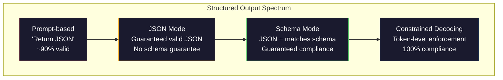
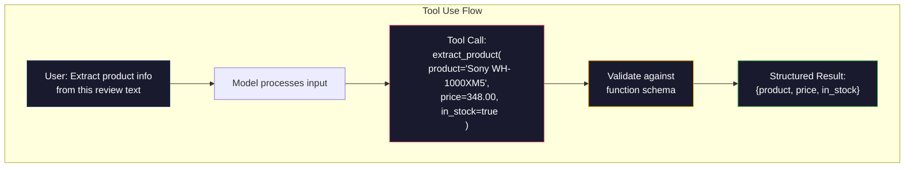

# Les sorties structurées: JSON, validation du schéma, décoding restreint.

> Votre LLM renvoie une chaîne. Votre application a besoin de JSON. Ce vide a écrasé plus de systèmes de production que toute hallucination de modèle. La sortie structurée est le pont entre le langage naturel et les données typées. Faites-le bien et votre LLM devient une API fiable. Faites-le mal et vous partagez le texte libre avec Regex à 3h du matin.

> **【中文解读】**LLM  retourner le string, mais l'application nécessite JSON. La sortie structurée est le pont entre le langage naturel et les données de typographie, est LLM de "chat chat machine" évolué pour "API fiable"

> **【拓展：结构化输出→AI应用开发】**结构化输出是Fonction Calling、RAG pipeline、数据提取等AI 应用的基础──OpenAI 的`response_format`L'utilisation des outils anthropiques, les cours d'instruction sont les outils essentiels de ce domaine.

>  **【前置】**Je vous invite à maîtriser: 1) Phase 10·01-05`type`- Je suis là.`properties`- Je suis là.`required`);(3) Python `pydantic`- Je suis là .`dataclasses`本节使用Pydantic做验证──如果不懂JSON Schema,先看 jsonschema.org's 5 分钟教程──

**Type:** Build | **类型:** 构建
**Languages:** Python | **语言:** Python
**Prerequisites:** Phase 10, Lessons 01-05 (LLMs from Scratch) | **前置知识:** Phase 10 · 01-05 (从零构建 LLM)
**Time:** ~90 minutes | **时间:** ~90 分钟
**Related:**La phase 5 · 20 (Outputs structurés et décoding restreint) couvre la théorie au niveau du décodeur (processeurs de logit FSM/CFG, contours, XGrammar).`response_format`Lisez la phase 5 · 20 d'abord si vous voulez comprendre ce qui se passe sous l'API.**相关:**Phase 5 · 20 (struktur化输出与约束解码) 讲解码器级理论(FSM/CFG logit 处理器、Outlines、XGrammar)`response_format`、Utilisation des outils anthropiques 、Instructeur) 想了解API 底下发生什么先读阶段 5 · 20。

## Objectifs d'apprentissage

- Implémenter des sorties en mode JSON et en schéma restreints en utilisant les paramètres OpenAI et API Anthropic
  Utilisation d' OpenAI et d' API anthropographique  paramètres pour réaliser JSON  modèle et schéma 约束输出
- Construire une couche de validation Pydantic qui rejette les sorties et les retentissements malformés du LLM avec des retours d'erreur
   Construire Pydantic 验证层, refuser de format error de LLM 输出并通过错误反重试
- Expliquez comment le décoding restreint force à valider JSON au niveau des jetons sans traitement post-processage
  解释约束解码 comment générer des JSON efficaces à niveau obligatoire
- Conception de commandes d'extraction robustes qui convertissent de manière fiable le texte non structuré en structures de données typées
  设计鲁棒的提取提示, fiable pour le texte non structuré transformé en structure de données classée

> **【中文解读】**Cet objectif de cours: faire en sorte que le LLM  sorte des données structurées  JSON  XML 表格)  Key Techniques comprennent la modification des fonctions  JSON mode 约束解码  Ceci est un des principaux étapes de la mise à niveau du LLM en tant que composant de projet 


## Le problème , l' introduction du problème

Vous demandez à un LLM: "Extraitez le nom du produit, le prix et la disponibilité de ce texte". Il répond:

> Vous demandez à la LLM:"De ce passage du texte:

C'est une réponse parfaitement correcte.`{"product": "Sony WH-1000XM5", "price": 348.00, "in_stock": true}`Vous avez besoin d'un objet JSON avec des clés spécifiques, des types spécifiques et des contraintes de valeur spécifiques. Vous n'avez pas besoin d'une phrase.

> C'est une réponse parfaitement correcte. Mais elle n'est pas utilisée pour votre application.`{"product": "Sony WH-1000XM5", "price": 348.00, "in_stock": true}`◊ vous avez besoin d'un objet JSON avec un type spécifique de clé, un type spécifique et un ensemble de valeurs spécifiques.

La solution naïve: ajoutez "Répondre en JSON" à votre demande. Ça marche 90% du temps. Les 10% restants du modèle enveloppent le JSON dans des clôtures de code de démarrage, ou ajoutent un préambule comme "Voici le JSON:", ou produisent un JSON syntaxiquement non valide parce qu'il a fermé un parenthèsis tôt. Votre analyseur JSON s'écrase. Votre pipeline est cassée. Vous ajoutez essayer/excuter et une boucle de réessayer. La réessayage produit parfois des données différentes. Vous avez un problème de cohérence en plus d'un problème de partage.

> Une solution simple: ajouter " JSON à la réponse " à votre suggestion. Cela est valable dans 90% des cas. Le reste de 10% du temps, le modèle met JSON dans un bloc de code de marquage, ou ajouter " c'est JSON:" comme un titre de texte ou une JSON inefficace en raison de la pré-arrêtation. Votre JSON résolveur s'est effondré. Votre flux de données s'est effondré.

Ce n'est pas un problème d'ingénierie rapide. C'est un problème de décoding. Le modèle génère des jetons de gauche à droite. À chaque position, il choisit le plus probable prochain jeton d'un vocabulaire de 100K + options. La plupart de ces options produiraient JSON invalide à n'importe quelle position donnée. Si le modèle vient d'émettre `{"price":`, le symbole suivant doit être un chiffre, une citation (pour la chaîne), `null`- Je suis là .`true`- Je suis là .`false`Le modèle peut choisir un mot anglais parfaitement raisonnable qui est catastrophiquement faux de syntaxe.

> Ceci n'est pas un problème de génération de suggestions. C'est un problème de résolution du code. Le modèle génère des jetons de gauche à droite. À chaque position, il sélectionne le plus possible de la liste des mots de plus de 100 000 options. La plupart des options dans n'importe quelle position seront générées sans effet JSON. Si le modèle vient de sortir.`{"price":`, un signe suivant doit être un nombre, un nombre, pour être utilisé en ligne.`null`- Je suis là.`true`- Je suis là.`false`Ou négatif. Tout ce qui est en JSON ne fonctionnera pas. Sans restriction, le modèle peut choisir un mot anglais parfaitement raisonnable, mais il s'agit d'une erreur catastrophique dans la grammaire.

>  **【类比】**Il est possible de modifier temporairement le concept de mot par un autre mot, résultat de la langue de la langue de l'erreur.

> ️ **【易错点】**结构化输出 3 个坑:**Schema 字段过多** Plus de 20 个字段模型记不住,会漏字段或填错;修复: démoli en emplacements, chaque couche ne dépasse pas 5 个字段。(2) **要求 LLM 输出"创造性"字段但又强 Schema** Par exemple, "débuter un titre créatif"`title: str`, modèle été schéma 约束后变得保守;修复:用 `temperature=0.9`+ Schéma 中加 `min_length: 10`Il y a de la place.**没用 Pydantic 验证** directement `json.loads()`0001 字符串里有数字 (("348") " on devient str et non flottant; avec Pydantic automatique type de transformation forcée

## Le concept de base.

> **【中文解读】**结构化输出是让LLM 生成 JSON、XML等格式的可控输出──关键技术:函数调用(Function Calling)让模型输出预定义的 JSON schema,JSON mode 强制模型生成合法 JSON,约束解码(constraint decoding) 在代币级别保证输出格式──

> 🤔 **【困惑】**Q: OpenAI `response_format={"type": "json_object"}`et `response_format={"type": "json_schema", ...}`A: Le premier est "JSON mode" garantie de sortie JSON légitime, mais pas garantie de passage. Le second est "Structured Outputs" vous donnez JSON Schema, modèle garantie selon Schema 输出(Use restriction de code réalisé) `json_schema`- Je suis un homme.

> **【拓展：结构化输出的工程实践】**Les résultats structurés d'OpenAI (en 2024) garantissent que le modèle sort à l'aide de JSON, dont la fiabilité est de 90% à 100%.


### Le spectre structuré des sorties

Il existe quatre niveaux de contrôle de sortie structurés, chacun plus fiable que le dernier.

> Le contrôle structuré des sorties a quatre niveaux, chacun plus fiable que le précédent.



**Prompt-based**("Répondre en JSON valide"): aucune mise en œuvre. Le modèle est généralement conforme mais parfois non. Fiabilité: ~ 90%. Mode d'échec: clôtures de marquage, texte de préambule, sortie tronquée, structure erronée.

> **基于提示**("Utilisez efficace JSON 回复"): pas d'exécution obligatoire. Le modèle est généralement respecté, mais il arrive que cela ne soit pas.

**JSON mode**: l'API garantit que la sortie est valide JSON.`response_format: { type: "json_object" }`La sortie analysera sans erreur. Mais elle peut ne pas correspondre à votre schéma attendu - clés supplémentaires, types erronés, champs manquants.

> **JSON 模式**:API garantie de sortie est valide JSON。OpenAI `response_format: { type: "json_object" }` Activer cette fonction. Output can be without error analysis. Mais il ne peut pas correspondre à votre schéma d'attente surplus de touches, type de défaut, défaut de section.

**Schema mode**L'API prend un schéma JSON et garantit que la sortie correspond à celui-ci.`response_format: { type: "json_schema", json_schema: {...} }`(également appelé `tool_choice="required"`), l'utilisation des outils par Anthropic avec `input_schema`, et les Gémeaux `response_schema`+ `response_mime_type: "application/json"`La sortie contient les clés, les types et les contraintes exactes que vous avez spécifiées.

> **Schema 模式**:API accepte le schéma JSON et assure la sortie de correspondances.`response_format: { type: "json_schema" }`、Anthropic 带 `input_schema`Les Gémeaux`response_schema`◊ sortie avec un type et un ensemble précis que vous avez défini.

**Constrained decoding**Le décodeur masque tous les jetons qui produiraient une sortie invalide. Si le schéma nécessite un numéro et que le modèle est sur le point d'émettre une lettre, ce jeton est réglé sur probabilité zéro. Le modèle ne peut produire que des jetons qui conduisent à une sortie valide. C'est ce que le mode de sortie structuré d'OpenAI et les bibliothèques comme Outlines et Guidance mettent en œuvre sous le capot.

> **约束解码**: dans chaque position de la production, le décodeur protège tout produit des jetons de sortie inefficaces. Si le schéma exige un chiffre et le modèle sort une lettre, la probabilité de ce jeton est de zéro. Le modèle ne peut produire que des jetons de sortie valides.

### JSON Schema: le langage du contrat

JSON Schema est la façon dont vous dites au modèle (ou à la couche de validation) quelle forme doit avoir la sortie.

> JSON Schema est une méthode de production qui doit avoir une forme. Chaque système de production structuré le utilise.

```json
{
  "type": "object",
  "properties": {
    "product": { "type": "string" },
    "price": { "type": "number", "minimum": 0 },
    "in_stock": { "type": "boolean" },
    "categories": {
      "type": "array",
      "items": { "type": "string" }
    }
  },
  "required": ["product", "price", "in_stock"]
}
```

Ce schéma dit: la sortie doit être un objet avec une chaîne `product`, un nombre non négatif `price`, une booléenne `in_stock`, et une série optionnelle de chaînes `categories`Tout produit qui ne correspond pas est rejeté.

> Le schéma explique: le sort doit être un objet, contenant des caractères`product`、 non négatif `price`La valeur`in_stock`和可选的字符串数组 `categories`Toutes les sorties qui ne correspondent pas seront rejetées.

Les schémas traitent les cas difficiles: objets en nid, matrices avec éléments taillés, enums (confiner une chaîne à des valeurs spécifiques), correspondance de motifs (régex sur les chaînes) et combinateurs (oneOf, anyOf, allOf pour les sorties polymorphes).

> Schema  traitement de la situation complexe:嵌套对象、带类型项的数组、枚举(将字符串约束为特定值) 模式匹配(字符串上的正则表达式)

### Le modèle pydantique

En Python, vous n'écrivez pas JSON Schema à la main. Vous définissez un modèle Pydantic et il génère le schéma pour vous.

> Dans Python, vous n'avez pas besoin d'écrire manuellement un schéma JSON. Vous définissez un modèle Pydantic, il vous permettra de générer un schéma.

```python
from pydantic import BaseModel

class Product(BaseModel):
    product: str
    price: float
    in_stock: bool
    categories: list[str] = []
```

Le système de calcul de la base de données de l'instructeur (et le SDK d'OpenAI) accepte directement les modèles Pydantic: passez la classe de modèle, récupérez une instance validée.

> Ceci se produira avec le même schéma JSON ci-dessus.

### Appel à fonction / utilisation d' outils

Une interface alternative pour le même problème. Au lieu de demander au modèle de produire directement JSON, vous définissez des "outils" (fonctions) avec des paramètres typés. Le modèle produit un appel de fonction avec des arguments structurés. OpenAI appelle cela "appel de fonction". Anthropic l'appelle "utilisation d'outils". Le résultat est le même: données structurées.

> 解决同一问题的替代接口──不是要求模型直接产生 JSON,而是定义带类型参数的"工具" (函数)──模型输出带有结构化参数的函数调用──OpenAI 称之为"函数调用"",Anthropoic 称之为"工具使用"──结果相同:结构化数据──



L'utilisation d'outils est préférée lorsque le modèle doit choisir quelle fonction appeler, et non seulement remplir des paramètres. Si vous avez 10 schémas d'extraction différents et que le modèle doit choisir le bon en fonction de l'entrée, l'utilisation d'outils vous donne à la fois la sélection du schéma et la sortie structurée.

> Lorsque le modèle doit choisir quelle fonction utiliser et non seulement remplir les paramètres, utilisez l'outil de sélection de préférence. Si vous avez 10 schéma de sélection différents, le modèle doit être basé sur l'entrée choisir correctement, utilisez l'outil et fournissez le schéma de sélection et la sortie structurée.

### Des défaillances courantes

Même avec l'application du schéma, les sorties structurées peuvent échouer de manière subtile.

> Même s'il existe un schéma d'exécution forcée, les sorties structurées peuvent également échouer de manière subtile.

**Hallucinated values**Le modèle produit des données inventées.`{"price": 299.99}`La validation du schéma ne peut pas saisir ceci -- le type est correct, la valeur est erronée.

> **幻觉值**Le modèle est généré en 348 $.`{"price": 299.99}` Schema 验证 incapable de saisir ce problème  type correct, valeur erronée 

**Enum confusion**: vous restreignez un champ à `["in_stock", "out_of_stock", "preorder"]`- Les résultats du modèle`"available"`- correct sémantiquement, mais pas dans l'ensemble autorisé.

> **枚举混淆**Tu seras un peu plus fort que moi.`["in_stock", "out_of_stock", "preorder"]` Modèle de production`"available"`语义上正确, but not allowed in the collection. 语义上正确, but not allowed in the collection. 语义上正确, but not allowed in the collection. 语义上正确, but not allowed in the collection. 语义上正确, but not allowed in the collection. 语义上正确, but not allowed in the collection. 语义上正确, but not allowed in the collection. 语义上正确, but not allowed in the collection. 语义上正确, but not allowed in the collection. 语义上正确, but not allowed in the collection. 语义上正确, but not allowed in the collection. 语义上正确, but not allowed in the collection. 

**Nested object depth**Les systèmes de mise en place de systèmes de mise en place de systèmes de mise en place de systèmes de mise en place de systèmes de mise en place de systèmes de mise en place de systèmes de mise en place de systèmes de mise en place de systèmes de mise en place de systèmes de mise en place de systèmes de mise en place de systèmes de mise en place de systèmes de mise en place de systèmes de mise en place de systèmes de mise en place de systèmes de mise en place de systèmes de mise en place de systèmes de mise en place de systèmes de mise en place de systèmes de mise en place de systèmes de mise en place de systèmes de mise en place de systèmes de mise en place de systèmes de mise en place de systèmes de mise en place de systèmes de mise en place de systèmes de mise en place de systèmes de mise en place de systèmes de mise en place de systèmes de mise en place de systèmes de mise en place de systèmes de mise en place de systèmes de mise en place de systèmes de mise en place de systèmes de mise en place de systèmes de mise en place de systèmes de mise en place de systèmes de mise en place de systèmes de mise en place de systèmes de mise en place de systèmes de mise en place de systèmes de mise en place de systèmes de mise en place de systèmes de mise en place de mise en place de systèmes de mise en place de systèmes de mise en place de mise en place de systèmes de mise en place de systèmes de mise en place de systèmes de mise en place de mise en place de systèmes de mise en place de mise en place de systèmes de mise en place de données de données de mise en place de données de base de données de base de base de données sont plus.

> **嵌套对象深度**Les schémas de la mise en place de la structure peuvent être perdus dans un autre endroit.

**Array length**: le modèle peut produire trop ou trop peu d'articles dans un tableau.`minItems`et `maxItems`mais tous les fournisseurs ne les appliquent pas au niveau du décoding.

> **数组长度**Le modèle peut produire trop ou trop peu d'éléments dans l'ensemble.`minItems`et `maxItems`Mais tous les fournisseurs ne sont pas obligatoires à la mise en œuvre de la décodage.

**Optional field omission**: le modèle omet des champs qui sont techniquement facultatifs mais sémantiquement importants pour votre cas d'utilisation.`null`explicitement.

> **可选字段遗漏**Le modèle est technique mais en termes de langage, il est important pour votre cas d'utilisation. Même si les données sont parfois manquantes, elles seront également mises en place dans le schéma pour produire des modèles obligatoires nécessaires.`null`Il y a une autre.

## Construisez-le et mettez-le en œuvre.
```figure
mx-schema-funnel
```

## Faites-le

### Étape 1: Validateur de schéma JSON

Construisez un validateur à partir de zéro qui vérifie si un objet Python correspond à un schéma JSON. C'est ce qui fonctionne sur le côté de sortie pour vérifier la conformité.

> De la conception de testateur, vérifier Python pour voir si l'objet correspond au schéma JSON.

```python
import json

def validate_schema(data, schema):
    errors = []
    _validate(data, schema, "", errors)
    return errors

def _validate(data, schema, path, errors):
    schema_type = schema.get("type")

    if schema_type == "object":
        if not isinstance(data, dict):
            errors.append(f"{path}: expected object, got {type(data).__name__}")
            return
        for key in schema.get("required", []):
            if key not in data:
                errors.append(f"{path}.{key}: required field missing")
        properties = schema.get("properties", {})
        for key, value in data.items():
            if key in properties:
                _validate(value, properties[key], f"{path}.{key}", errors)

    elif schema_type == "array":
        if not isinstance(data, list):
            errors.append(f"{path}: expected array, got {type(data).__name__}")
            return
        min_items = schema.get("minItems", 0)
        max_items = schema.get("maxItems", float("inf"))
        if len(data) < min_items:
            errors.append(f"{path}: array has {len(data)} items, minimum is {min_items}")
        if len(data) > max_items:
            errors.append(f"{path}: array has {len(data)} items, maximum is {max_items}")
        items_schema = schema.get("items", {})
        for i, item in enumerate(data):
            _validate(item, items_schema, f"{path}[{i}]", errors)

    elif schema_type == "string":
        if not isinstance(data, str):
            errors.append(f"{path}: expected string, got {type(data).__name__}")
            return
        enum_values = schema.get("enum")
        if enum_values and data not in enum_values:
            errors.append(f"{path}: '{data}' not in allowed values {enum_values}")

    elif schema_type == "number":
        if not isinstance(data, (int, float)):
            errors.append(f"{path}: expected number, got {type(data).__name__}")
            return
        minimum = schema.get("minimum")
        maximum = schema.get("maximum")
        if minimum is not None and data < minimum:
            errors.append(f"{path}: {data} is less than minimum {minimum}")
        if maximum is not None and data > maximum:
            errors.append(f"{path}: {data} is greater than maximum {maximum}")

    elif schema_type == "boolean":
        if not isinstance(data, bool):
            errors.append(f"{path}: expected boolean, got {type(data).__name__}")

    elif schema_type == "integer":
        if not isinstance(data, int) or isinstance(data, bool):
            errors.append(f"{path}: expected integer, got {type(data).__name__}")
```

### Étape 2: Modèle de style pydantique à schéma

Construisez un convertisseur de classe à schéma minimal. Définissez une classe Python et générez son schéma JSON automatiquement.

> 构建最小类到 schema 转换器──定义 Python 类, générer automatiquement son schéma JSON──

```python
class SchemaField:
    def __init__(self, field_type, required=True, default=None, enum=None, minimum=None, maximum=None):
        self.field_type = field_type
        self.required = required
        self.default = default
        self.enum = enum
        self.minimum = minimum
        self.maximum = maximum

def python_type_to_schema(field):
    type_map = {
        str: "string",
        int: "integer",
        float: "number",
        bool: "boolean",
    }

    schema = {}

    if field.field_type in type_map:
        schema["type"] = type_map[field.field_type]
    elif field.field_type == list:
        schema["type"] = "array"
        schema["items"] = {"type": "string"}
    elif isinstance(field.field_type, dict):
        schema = field.field_type

    if field.enum:
        schema["enum"] = field.enum
    if field.minimum is not None:
        schema["minimum"] = field.minimum
    if field.maximum is not None:
        schema["maximum"] = field.maximum

    return schema

def model_to_schema(name, fields):
    properties = {}
    required = []

    for field_name, field in fields.items():
        properties[field_name] = python_type_to_schema(field)
        if field.required:
            required.append(field_name)

    return {
        "type": "object",
        "properties": properties,
        "required": required,
    }
```

### Étape 3: Filtre des jetons avec des restrictions

Simuler le décoding restreint. Compte tenu d'une chaîne JSON partielle et d'un schéma, déterminer quelles catégories de jetons sont valables à la position actuelle.

> 模拟约束解码──给定部分 JSON 字符串和方案, déterminer quelles sont les jetons 类别有效──

```python
def next_valid_tokens(partial_json, schema):
    stripped = partial_json.strip()

    if not stripped:
        return ["{"]

    try:
        json.loads(stripped)
        return ["<EOS>"]
    except json.JSONDecodeError:
        pass

    last_char = stripped[-1] if stripped else ""

    if last_char == "{":
        return ['"', "}"]
    elif last_char == '"':
        if stripped.endswith('":'):
            return ['"', "0-9", "true", "false", "null", "[", "{"]
        return ["a-z", '"']
    elif last_char == ":":
        return [" ", '"', "0-9", "true", "false", "null", "[", "{"]
    elif last_char == ",":
        return [" ", '"', "{", "["]
    elif last_char in "0123456789":
        return ["0-9", ".", ",", "}", "]"]
    elif last_char == "}":
        return [",", "}", "]", "<EOS>"]
    elif last_char == "]":
        return [",", "}", "<EOS>"]
    elif last_char == "[":
        return ['"', "0-9", "true", "false", "null", "{", "[", "]"]
    else:
        return ["any"]

def demonstrate_constrained_decoding():
    partial_states = [
        '',
        '{',
        '{"product"',
        '{"product":',
        '{"product": "Sony"',
        '{"product": "Sony",',
        '{"product": "Sony", "price":',
        '{"product": "Sony", "price": 348',
        '{"product": "Sony", "price": 348}',
    ]

    print(f"{'Partial JSON':<45} {'Valid Next Tokens'}")
    print("-" * 80)
    for state in partial_states:
        valid = next_valid_tokens(state, {})
        display = state if state else "(empty)"
        print(f"{display:<45} {valid}")
```

### Étape 4: Pipeline d'extraction

Combinez tout dans un pipeline d'extraction: définissez un schéma, simuliez un LLM produisant une sortie structurée, validez la sortie et gérez les retries.

> Pour ce qui est de la gestion des ressources humaines, il est nécessaire de définir le schéma, de modifier le programme de gestion des ressources humaines et de l'équipement.

```python
def simulate_llm_extraction(text, schema, attempt=0):
    if "headphones" in text.lower() or "sony" in text.lower():
        if attempt == 0:
            return '{"product": "Sony WH-1000XM5", "price": 348.00, "in_stock": true, "categories": ["audio", "headphones"]}'
        return '{"product": "Sony WH-1000XM5", "price": 348.00, "in_stock": true}'

    if "laptop" in text.lower():
        return '{"product": "MacBook Pro 16", "price": 2499.00, "in_stock": false, "categories": ["computers"]}'

    return '{"product": "Unknown", "price": 0, "in_stock": false}'

def extract_with_retry(text, schema, max_retries=3):
    for attempt in range(max_retries):
        raw = simulate_llm_extraction(text, schema, attempt)

        try:
            data = json.loads(raw)
        except json.JSONDecodeError as e:
            print(f"  Attempt {attempt + 1}: JSON parse error -- {e}")
            continue

        errors = validate_schema(data, schema)
        if not errors:
            return data

        print(f"  Attempt {attempt + 1}: Schema validation errors -- {errors}")

    return None

product_schema = {
    "type": "object",
    "properties": {
        "product": {"type": "string"},
        "price": {"type": "number", "minimum": 0},
        "in_stock": {"type": "boolean"},
        "categories": {"type": "array", "items": {"type": "string"}},
    },
    "required": ["product", "price", "in_stock"],
}
```

### Étape 5: Remplissez le pipeline

> 步骤 5:运行完整流水线──

```python
def run_demo():
    print("=" * 60)
    print("  Structured Output Pipeline Demo")
    print("=" * 60)

    print("\n--- Schema Definition ---")
    product_fields = {
        "product": SchemaField(str),
        "price": SchemaField(float, minimum=0),
        "in_stock": SchemaField(bool),
        "categories": SchemaField(list, required=False),
    }
    generated_schema = model_to_schema("Product", product_fields)
    print(json.dumps(generated_schema, indent=2))

    print("\n--- Schema Validation ---")
    test_cases = [
        ({"product": "Test", "price": 10.0, "in_stock": True}, "Valid object"),
        ({"product": "Test", "price": -5.0, "in_stock": True}, "Negative price"),
        ({"product": "Test", "in_stock": True}, "Missing price"),
        ({"product": "Test", "price": "ten", "in_stock": True}, "String as price"),
        ("not an object", "String instead of object"),
    ]

    for data, label in test_cases:
        errors = validate_schema(data, product_schema)
        status = "PASS" if not errors else f"FAIL: {errors}"
        print(f"  {label}: {status}")

    print("\n--- Constrained Decoding Simulation ---")
    demonstrate_constrained_decoding()

    print("\n--- Extraction Pipeline ---")
    texts = [
        "The Sony WH-1000XM5 headphones are priced at $348 and currently available.",
        "The new MacBook Pro 16-inch laptop costs $2499 but is sold out.",
        "This is a random sentence with no product info.",
    ]

    for text in texts:
        print(f"\n  Input: {text[:60]}...")
        result = extract_with_retry(text, product_schema)
        if result:
            print(f"  Output: {json.dumps(result)}")
        else:
            print(f"  Output: FAILED after retries")
```

## Utilisez-le avec le cadre de réalisation

### Outputs structurés d'OpenAI

> OpenAI  structurée

```python
# from openai import OpenAI
# from pydantic import BaseModel
#
# client = OpenAI()
#
# class Product(BaseModel):
#     product: str
#     price: float
#     in_stock: bool
#
# response = client.beta.chat.completions.parse(
#     model="gpt-5-mini",
#     messages=[
#         {"role": "system", "content": "Extract product information."},
#         {"role": "user", "content": "Sony WH-1000XM5, $348, in stock"},
#     ],
#     response_format=Product,
# )
#
# product = response.choices[0].message.parsed
# print(product.product, product.price, product.in_stock)
```

Le mode de sortie structuré d'OpenAI utilise un décoding interné restreint. Chaque jeton généré par le modèle est garanti pour produire une sortie correspondant au schéma Pydantic. Aucune réessayage n'est nécessaire. Aucune validation n'est nécessaire. La contrainte est cuite dans le processus de décoding.

> Le modèle de sortie structurée d'OpenAI est utilisé à l'intérieur pour créer des codes. Chaque jeton généré par le modèle est garanti pour produire des codes correspondants.

### Utilisation d'outils anthropologiques

> Les outils utilisés en anthropologie

```python
# import anthropic
#
# client = anthropic.Anthropic()
#
# response = client.messages.create(
#     model="claude-opus-4-7",
#     max_tokens=1024,
#     tools=[{
#         "name": "extract_product",
#         "description": "Extract product information from text",
#         "input_schema": {
#             "type": "object",
#             "properties": {
#                 "product": {"type": "string"},
#                 "price": {"type": "number"},
#                 "in_stock": {"type": "boolean"},
#             },
#             "required": ["product", "price", "in_stock"],
#         },
#     }],
#     messages=[{"role": "user", "content": "Extract: Sony WH-1000XM5, $348, in stock"}],
# )
```

Anthropic obtient une sortie structurée grâce à l'utilisation d'outils. Le modèle émet un appel à outil avec des arguments structurés qui correspondent au schéma d'entrée.

> Antropic 通过 tool use 实现结构化输出――模型发发出一个工具调用,其结构化参数匹配 input_schema――结果相同,API 接口不同――

### Bibliothèque des instructeurs

> L'instructeur 库。

```python
# pip install instructor
# import instructor
# from openai import OpenAI
# from pydantic import BaseModel
#
# client = instructor.from_openai(OpenAI())
#
# class Product(BaseModel):
#     product: str
#     price: float
#     in_stock: bool
#
# product = client.chat.completions.create(
#     model="gpt-5-mini",
#     response_model=Product,
#     messages=[{"role": "user", "content": "Sony WH-1000XM5, $348, in stock"}],
# )
```

L'instructeur enveloppe tout client LLM et ajoute des répétitions automatiques avec validation. Si la première tentative de validation échoue, il renvoie les erreurs au modèle en tant que contexte et lui demande de corriger la sortie. Cela fonctionne avec n'importe quel fournisseur, pas seulement OpenAI.

> L'instructeur  emballer tout LLM  clientèle 并添加带验证的自动重试―― si la première tentative de vérification échoue, il sera erroné comme modèle de renvoi et nécessite la révision de la sortie―― cela s'applique à tout fournisseur, pas seulement à OpenAI――

## Envoyez-le . Produit .

Cette leçon produit `outputs/prompt-structured-extractor.md`-- un modèle de prompt réutilisable qui extrait des données structurées de n'importe quel texte donné une définition de schéma.

> 本课产生 `outputs/prompt-structured-extractor.md` Un modèle de suggestion réutilisable, donné schema  définition, de tout texte dans lequel on extrait des données structurées , et qui, en passant par JSON Schema 和 non structuré, renvoie le JSON déjà testé 

Il produit aussi `outputs/skill-structured-outputs.md`-- un cadre de décision pour choisir la bonne stratégie de sortie structurée basée sur votre fournisseur, les exigences de fiabilité et la complexité du schéma.

> Il est aussi produit.`outputs/skill-structured-outputs.md` un cadre de décision, selon les besoins et les schémas de fiabilité de votre fournisseur  complexité de choisir la bonne stratégie structurée de sortie 

## Les exercices

1. Élargir le validateur de schéma pour soutenir `oneOf`(les données doivent correspondre exactement à l'un des plusieurs schémas).`Product`ou une `Service`objet de différentes formes.
    élargir le schéma  vérificateur `oneOf`(les données doivent correspondre à l'un des plusieurs schèmes)`Product`Ou `Service`Les objets

2. Construisez un outil " schéma diff " qui compare deux schèmes et identifie les changements de rupture ( champs requis supprimés, types modifiés) par rapport aux changements non-rupture ( champs optionnels ajoutés, contraintes relaxées).
   Construire un outil de "schéma différent", comparer deux schèmes et identifier les changements destructeurs (en supprimant les éléments nécessaires, en modifiant les types) et les changements non destructeurs (en ajoutant des éléments choisis, en relâchant les contraintes) 

3. Mettez en œuvre un simulateur de décoding restreint plus réaliste. Étant donné un schéma JSON et un vocabulaire de 100 jetons (lettres, chiffres, ponctuation, mots-clés), parcourez la génération étape par étape, masquant des jetons invalides à chaque position. Mesurez quel pourcentage du vocabulaire est valide à chaque étape.
   实现 un modèle de code plus réel ⋅ donner un schéma JSON et 100 tokens de la liste des mots, générée progressivement, à chaque position éclipsé des tokens inefficaces ⋅ mesurer le pourcentage valide de chaque étape de la liste des mots ⋅

4. Construisez une suite d'évaluation d'extraction. Créez 50 descriptions de produits avec des sorties JSON étiquetées à la main. Exécutez votre pipeline d'extraction sur les 50 et mesurez la correspondance exacte, la précision au niveau du champ et la conformité au type. Identifiez les champs les plus difficiles à extraire correctement.
   Construire un ensemble d'évaluation de la production  Créer 50 produits et étiquettes JSON                                                                                                                                                                                                                                                                                                                                                                                                                                                                                                     

5. Ajoutez des "scores de confiance" à votre pipeline d'extraction. Pour chaque champ extrait, estimez à quel point le modèle est sûr (en fonction des probabilités de jetons, ou en exécutant l'extraction 3 fois et en mesurant la cohérence).
   Pour le projet de loi, le projet de loi de la Commission sur les mesures de sécurité et de sécurité des transports a été adopté par le Conseil de l'Union européenne.

## Les termes clés

| Term | What people say | What it actually means | 中文释义 |
|------|----------------|----------------------|---------|
| JSON mode | "Returns JSON" / "返回 JSON" | API flag that guarantees syntactically valid JSON output, but does not enforce any particular schema | JSON 模式：API 标志，保证语法有效的 JSON 输出，但不强制执行特定 schema |
| Structured output | "Typed JSON" / "类型化 JSON" | Output that matches a specific JSON Schema with correct keys, types, and constraints | 结构化输出：匹配特定 JSON Schema 的输出，具有正确的键、类型和约束 |
| Constrained decoding | "Guided generation" / "引导生成" | At each token position, mask out tokens that would produce invalid output -- guarantees 100% schema compliance | 约束解码：在每个 token 位置屏蔽会产生无效输出的 token，保证 100% schema 合规 |
| JSON Schema | "A JSON template" / "JSON 模板" | A declarative language for describing the structure, types, and constraints of JSON data (used by OpenAPI, JSON Forms, etc.) | JSON Schema：描述 JSON 数据结构、类型和约束的声明式语言 |
| Pydantic | "Python dataclasses+" / "Python 数据类+" | Python library that defines data models with type validation, used by FastAPI and Instructor to generate JSON Schemas | Pydantic：定义带类型验证数据模型的 Python 库，用于生成 JSON Schema |
| Function calling | "Tool use" / "工具使用" | LLM outputs a structured function invocation (name + typed arguments) instead of free text -- OpenAI and Anthropic both support this | 函数调用：LLM 输出结构化的函数调用（名称+类型化参数），而非自由文本 |
| Instructor | "Pydantic for LLMs" / "LLM 的 Pydantic" | Python library that wraps LLM clients to return validated Pydantic instances, with automatic retry on validation failure | Instructor：包装 LLM 客户端返回验证过的 Pydantic 实例的 Python 库 |
| Token masking | "Filtering the vocabulary" / "过滤词表" | Setting specific token probabilities to zero during generation so the model cannot produce them | Token 屏蔽：在生成过程中将特定 token 概率设为零 |
| Schema compliance | "Matches the shape" / "匹配形状" | The output has every required field, correct types, values within constraints, and no extra disallowed fields | Schema 合规：输出具有每个必需字段、正确类型、约束内的值 |
| Retry loop | "Try again until it works" / "重试直到成功" | Send validation errors back to the model and ask it to fix the output -- Instructor does this automatically, up to a configurable max | 重试循环：将验证错误发回模型并要求修复输出 |

## Encore une lecture

- [OpenAI Structured Outputs Guide](https://platform.openai.com/docs/guides/structured-outputs)-- documentation officielle pour le décoding restreint basé sur le schéma JSON dans l' API OpenAI
  OpenAI API est basé sur le schéma JSON
- [Willard & Louf, 2023 -- "Efficient Guided Generation for Large Language Models"](https://arxiv.org/abs/2307.09702)-- le document Outlines, décrivant comment compiler des schémas JSON dans des machines d'état fini pour les contraintes au niveau des jetons
  Définition de l'article, description de la façon de mettre en œuvre le schéma JSON
- [Instructor documentation](https://python.useinstructor.com/)-- la bibliothèque standard pour obtenir des résultats structurés de tout LLM avec validation et retries Pydantic
  De toute licence de droit d'obtenir avec Pydantic certification et de refaire des essais structurés de sortie de la base de normes
- [Anthropic Tool Use Guide](https://docs.anthropic.com/en/docs/tool-use)-- comment Claude implémentera la sortie structurée via l'utilisation d'outils avec JSON Schema input_schema
  Claude  comment utiliser l'outil de JSON Schema input_schema  réaliser la structuration de la sortie
- [JSON Schema specification](https://json-schema.org/)-- la spécification complète du langage schéma utilisé par chaque système de sortie structuré majeur
  Règlement complet de chaque système de production structuré principal
- [Outlines library](https://github.com/outlines-dev/outlines)-- génération limitée open source à l'aide de regex et JSON Schema compilés à machines d' état fini
  Utilisation de règles et de schéma JSON  Compiled pour une base de données de génération de blocs ouverts
- [Dong et al., "XGrammar: Flexible and Efficient Structured Generation Engine for Large Language Models" (MLSys 2025)](https://arxiv.org/abs/2411.15100)-- le moteur de grammaire de pointe actuel; compilation automatique à poussée basse qui masque les jetons à ~ 100 ns / jeton.
  Le moteur de langage le plus avancé de l'année;
- [Beurer-Kellner et al., "Prompting Is Programming: A Query Language for Large Language Models" (LMQL)](https://arxiv.org/abs/2212.06094)-- le cadre de papier LMQL restreint le décoding en tant que langage de requête avec des contraintes de type et de valeur.
  L'étude LMQL du langage de requête de type et valeur de la résolution de la résolution de code
- [Microsoft Guidance (framework docs)](https://github.com/guidance-ai/guidance)-- génération limitée basée sur des modèles; complément agnostique du fournisseur à Outlines et XGrammar.
  模板驱动的约束生成;Outlines 和 XGrammar 的供应商无关补充
