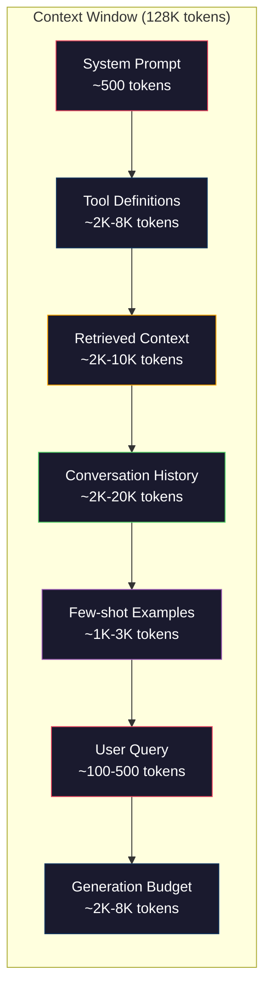
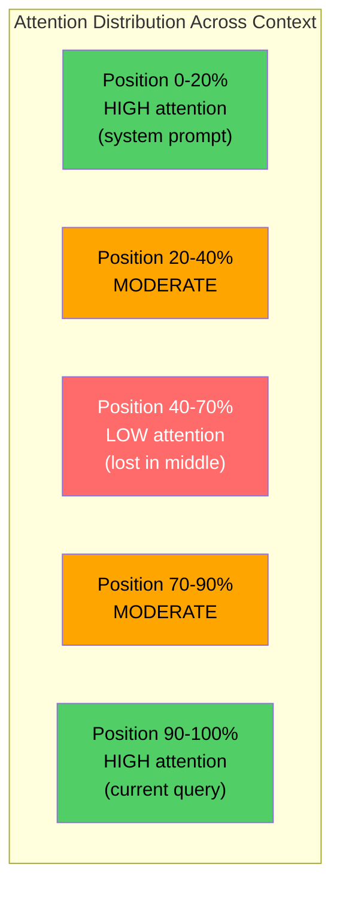
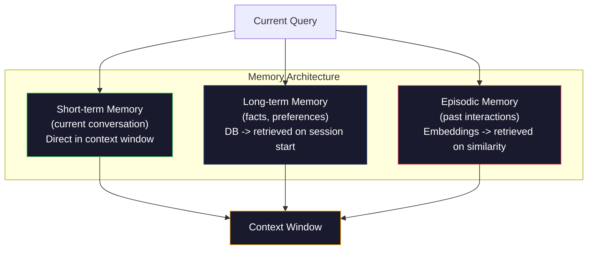

# Ingénierie de contexte: Windows, Budgets, mémoire et récupération.

> L'ingénierie de la demande est un sous-ensemble. L'ingénierie de contexte est l'ensemble du jeu. Une demande est une chaîne que vous tapez. Le contexte est tout ce qui entre dans la fenêtre du modèle: instructions système, documents récupérés, définitions d'outils, historique de conversation, quelques exemples de prises de vue et la demande elle-même. Les meilleurs ingénieurs en IA en 2026 sont les ingénieurs de contexte. Ils décident de ce qui entre, de ce qui reste et dans quel ordre.

> **【中文解读】**提示工程只是上下文工程的子集──上下文工程管理模型窗口中的一切内容系统指令、检查文档、工具定义、对话历史等──2026 La meilleure AI 工程师是上下文工程师──

> **【拓展：上下文工程→Claude生态】**Le protocole MCP de Claude est essentiellement la mise en œuvre des normes de l'architecture de texte ci-dessous, à travers un modèle de gestion du protocole unifié.

>  **【前置】**Pour les autres, il est nécessaire de se préparer à la phase 11 de la formation.

**Type:** Build | **类型:** 构建
**Languages:** Python | **语言:** Python
**Prerequisites:** Phase 10 (LLMs from Scratch), Phase 11 Lesson 01-02 | **前置知识:** Phase 10（从零理解 LLM）、Phase 11 Lesson 01-02
**Time:** ~90 minutes | **时间:** ~90 分钟
**Related:**La phase 11 · 15 (Cachage rapide)  la mise en cache conviviale est une extension de l'ingénierie contextuelle. phase 5 · 28 (Évaluation à long terme) pour mesurer la perte au milieu avec NIAH/RULER. **相关:**Phase 11 · 15 (suggestions de cache) 缓存友好布局是上下文工程的延伸──Phase 5 · 28 (长上下文评估) 介绍如何使用NIAH/RULER 测量"中间丢失"──

## Objectifs d'apprentissage

- Calculer les budgets de jetons sur tous les composants de fenêtres contextuelles (interface système, outils, historique, documents récupérés, espace génération)
  跨所有上下文窗口组件(系统提示、工具、历史、检索文档、生成余量) calculer le jeton 预算
- Implémenter des stratégies de gestion de fenêtre de contexte: troncage, résumé et fenêtre coulissante pour l'historique de conversation
  实现上下文窗口管理策略:截断、摘要、滑动窗口管理对话历史
- Prioritiser et ordonner les composants contextuels pour maximiser l'attention du modèle sur les informations les plus pertinentes
  According à la priorité de la classification des composants ci-dessous, maximiser l'attention du modèle à l'information la plus pertinente
- Construire un assembleur de contexte qui alloue dynamiquement des jetons en fonction du type de requête et de l'espace de fenêtre disponible
   Construire selon le type de requête et les fenêtres disponibles espace mobilité distribution de jeton de l'en haut

> **【中文解读】**Objectif du cours: dépasser l'ingénierie rapide, la gestion systémique de tout ce qui se trouve dans le modèle.


## Le problème , l' introduction du problème

Claude Opus 4.7 a une fenêtre de jetons de 200K (1M en version bêta). GPT-5 a 400K. Gemini 3 Pro a 2M. Llama 4 prétend 10M. Ces chiffres semblent énormes jusqu'à ce que vous les remplissez.

> Claude Opus 4.7 a 200K de jetons  fenêtre(beta  édition 1M) ・・・GPT-5 a 400K ・・・Gemini 3 Pro a 2M ・・・ Ces chiffres semblent très grands, jusqu'à ce que vous les remplissez。

Voici une réelle ventilation pour un assistant de codage. Prompte système: 500 jetons. Définitions d'outils pour 50 outils: 8.000 jetons. Documentation récupérée: 4.000 jetons. Historique de conversation (10 tours): 6.000 jetons. Recherche d'utilisateur actuelle: 200 jetons. Budget de génération (sortie maximale): 4.000 jetons. Total: 22.700 jetons. Ce n'est que 18% d'une fenêtre 128K.

> Ceci est une réelle analyse de l'aide à la programmation. Système de suggestion: 500 jetons. 50 个工具定义: 8,000 jetons.

>  **【类比】**Le code de référence est le code de référence de la page d'accueil.**Lost in the Middle**现象像寻找东西: lorsque le livre est plein de choses sur le bureau, le plus facile à ignorer est celui qui est en plein milieu  vous ne ferez que vous concentrer sur le tableau de départ  récent  et le dernier .

> ️ **【易错点】**3 个坑: 1)**历史无限增长** dialog越长历史 越大,最终撞窗口;修复:用总结(每 N 轮缩成摘要) ou fenêtre coulissante((((((((((((((((((((((((((((((((((((((((((((((((((((((((((((((((((((((((((((((((((((((((((((((((((((((((((((((((((((((((((((((((((((((((((((((((((((((((((((((((((((((((((((((((((((((((((((((((((((((((((((((((((((((((((((((((((((((((((((((((((((((((((((((((((((((((((((((((((((((((((((((((((((((((((((((((((((((((((((((((((((((((((((((((((((((((((((((((((((((((((((((((((((((((((((((((((((((((((((((((((((((((((((((((((((((((((((((((((((((((((((((((((((((((((((((((((((((((**工具定义重复发送** chaque fois que vous utilisez tous les 50 outils, vous pouvez utiliser le caching rapide (Phase 11·15), Claude / OpenAI 都支持,省 90% du coût (7).**检索文档全塞**Rappelons 50 pièces de rechange, tout court, modèle perdu, révision: top-5

Mais l'attention ne s'échelle pas linéairement avec la longueur du contexte. Un modèle avec 128K de jetons de contexte paie un coût d'attention quadratique (O(n^2) dans les transformateurs de vanille, bien que la plupart des modèles de production utilisent des variantes d'attention efficaces). Plus important encore, la précision de récupération se dégrade. Le test "Aiguille dans un tas de foin" montre que les modèles ont du mal à trouver des informations placées au milieu de longs contextes. La recherche de Liu et collègues (2023) a montré que les LLM récupèrent des informations au début et à la fin de longs contextes avec une précision presque parfaite, mais que leur précision diminue de 10 à 20% pour les informations placées au milieu (position 40 à 70% du contexte). Cet effet " perdu au milieu " varie selon le modèle mais affecte toutes les architectures actuelles.

> Mais l'attention ne se développe pas avec la longueur de la ligne de recherche. Plus important encore, le taux de précision des recherches diminue. Le test "Big Sea Crunch" montre que le modèle est difficile à trouver en position moyenne sur la longueur des recherches.

La leçon pratique: avoir 200K de jetons disponibles ne signifie pas utiliser 200K de jetons est efficace. Un contexte de jetons 10K soigneusement sélectionné surpasse souvent un contexte de jetons 100K déposé.

>  Leçon pratique: il y a 200K de jetons; l'utilisation ne signifie pas utiliser 200K de jetons est efficace.  Réfléchissez à la conception de 10K de jetons.

Chaque jeton que vous mettez dans la fenêtre remplace un jeton qui pourrait contenir des informations plus pertinentes. Chaque définition d'outil irrélevant, chaque tournage de conversation obsolète, chaque morceau de texte récupéré qui ne répond pas à la question - chacun rend le modèle légèrement pire dans la tâche.

> Chaque jeton que vous mettez dans la fenêtre est un jeton qui peut porter des informations plus pertinentes. Chaque outil n'est pas lié à la définition de chaque conversation passée. Chaque bloc de texte ne répond pas à la question. Chaque bloc permet au modèle de faire une légère différence dans la tâche.

## Le concept de base.

> **【中文解读】**Le concept de génie de contexte est plus qu'un simple écriture rapide, mais une gestion systématique de tous les éléments de l'information qui pénètre dans la fenêtre de texte du modèle: résultats de recherche, histoire de dialogue, sortie d'outils, instructions de système, etc.

> **【拓展：上下文窗口的有效利用】**GPT-4o a un jeton 128K sur la fenêtre ci-dessous, mais des études montrent que le modèle est en train de réduire l'attention sur la position intermédiaire.


### La fenêtre de contexte est une ressource rare

Pensez à la fenêtre contextuelle comme à la RAM, pas au disque. Elle est rapide et directement accessible, mais limitée. Vous ne pouvez pas tout monter. Vous devez choisir.

> Mettez la fenêtre en RAM, pas en disque.



Chaque composant est en compétition pour l'espace. Ajouter plus de définitions d'outils signifie moins de place pour l'historique de conversation. Ajouter plus de contexte récupéré signifie moins de place pour quelques exemples.

> Chaque composant pour gagner de l'espace. Pour plus d'outils, la définition signifie moins d'espace historique de dialogue.

### Perdu au milieu

Les modèles répondent mieux aux informations au début et à la fin du contexte. Les informations au milieu obtiennent des scores d'attention plus faibles et sont plus susceptibles d'être ignorées.

> Les résultats de l'étude sont les plus importants: les résultats obtenus par le modèle sont plus efficaces, les résultats obtenus par le modèle sont plus faciles à ignorer.

Liu et coll. (2023) ont testé cette méthode de manière systématique. Ils ont placé un document pertinent parmi 20 documents irrélevants à différentes positions et mesuré la précision de la réponse.

> Liu et d'autres ont testé systématiquement ce phénomène. Ils ont mis les documents pertinents à 20 positions différentes dans les documents non pertinents, mesurant le taux de précision de la réponse.

Cela a des implications techniques directes:

> Il y a des implications techniques directes:

- Mettre en premier les informations les plus importantes (instructions critiques du système)
  Pour les informations les plus importantes, nous allons les mettre en ligne.
- Mettre la requête actuelle et le contexte le plus pertinent en dernier (bias récent aide)
  La dernière est la plus proche des différences de la situation actuelle.
- Traiter le milieu du contexte comme la zone de priorité la plus basse
  Le niveau de la zone moyenne est le niveau de la zone de la priorité la plus basse.
- Si vous devez inclure des informations au milieu, doublez le point clé à la fin
  Si vous devez mettre l'information au milieu, vous devez répéter le point clé.



### Components de contexte

**System prompt**Claude Code utilise environ 6000 jetons pour son prompt système, y compris les définitions d'outils et les instructions comportementales. Gardez-le serré. Chaque mot dans le prompt système est répété sur chaque appel API.

> **系统提示**Le code de Claude contient environ 6 000 jetons, contenant des outils définis et des instructions de comportement.

**Tool definitions**Chaque outil ajoute 50 à 200 jetons (nom, description, schéma de paramètre). 50 outils à 150 jetons chacun est de 7 500 jetons avant toute conversation.

> **工具定义**: chaque outil 50-200 jetons (nom, description, paramètre) ⋅ 50 ⋅ outils par 150 jetons, soit 7 500 jetons déjà utilisés au début du dialogue ⋅ choix d'outils en cours ⋅ seulement contenant des outils liés à la requête en cours ⋅ réduction de 60 à 80% ⋅

**Retrieved context**Les résultats de recherche, le contenu des fichiers. La qualité de la récupération détermine directement la qualité de la réponse. Une mauvaise récupération est pire que aucune récupération - elle remplit la fenêtre de bruit et induit activement en erreur le modèle.

> **检索上下文**Le résultat de la recherche est le résultat de la recherche.

**Conversation history**Une conversation de 50 tours à 200 jetons par tour représente 10 000 jetons d'histoire. La plupart d'entre eux sont sans rapport avec la requête actuelle.

> **对话历史**Le nombre de messages et de réponses des utilisateurs précédents est en augmentation.

**Few-shot examples**Les deux ou trois exemples bien choisis améliorent souvent la qualité de la sortie de plus de milliers de jetons d'instructions.

> **少样本示例**Les exemples de 2 à 3 sélections minutieuses de commandes de 1000 jetons peuvent améliorer la qualité de sortie.

**Generation budget**Si vous remplissez la fenêtre à la capacité, le modèle n'a pas de place pour répondre.

> **生成预算**Pour le modèle, il faut conserver les jetons. Si la fenêtre est remplie, le modèle n'a pas de place pour répondre.

### Stratégies de compression du contexte

**History summarization**: au lieu de garder tous les tours précédents verbains, résumez périodiquement la conversation. "Nous avons discuté X, décidé Y, et l'utilisateur veut Z" dans 100 jetons remplace 10 tours qui ont pris 2000 jetons.

> **历史摘要**Il est également possible de modifier le code de la page de référence en utilisant le code de la page de référence:

**Relevance filtering**Si vous avez récupéré 10 pièces mais que seules 3 sont pertinentes, jetez les autres 7. Il vaut mieux avoir 3 pièces très pertinentes que 10 pièces médiocres.

> **相关性过滤**Pour chaque requête, le document est classé en couleur, puis il est rejeté en dessous de la valeur.

**Tool pruning**Une question de code ne nécessite pas d'outils de calendrier. Une question de planification ne nécessite pas d'outils de système de fichiers. Cela peut réduire les définitions d'outils de 8000 jetons à 1000.

> **工具裁剪**: catégorie des utilisateurs de la requête intention, ne comprenant que les outils liés à cette intention.

**Recursive summarization**Pour les documents très longs, résumons en étapes. Tout d'abord, résumons chaque section, puis résumons les résumés.

> **递归摘要**Pour chaque section, un résumé de 50 pages de documents est transformé en résumé de 500 jetons, en saisissant les points clés.

### Systèmes de mémoire

L'ingénierie du contexte couvre trois horizons temporels.

> Le projet de construction transcende trois temps.

**Short-term memory**Le contenu de la conversation est enregistré directement dans la fenêtre contextuelle.

> **短期记忆**Le détail de la situation est le plus important dans le domaine de la gestion des données.

**Long-term memory**: faits et préférences qui persistent au cours des conversations. "L'utilisateur préfère TypeScript. " "Le projet utilise PostgreSQL. " Stocké dans une base de données, récupéré au début de la session. Claude Code le stocke dans les fichiers CLAUDE.md. ChatGPT le stocke dans sa fonctionnalité de mémoire.

> **长期记忆**Le code de l'utilisateur est disponible dans le fichier CLAUDE.md.

**Episodic memory**: interactions antérieures spécifiques qui pourraient être pertinentes. "Le mardi dernier, nous avons débogagé un problème similaire dans le module auth".

> **情景记忆**Le problème est que les données sont en cours de rédaction et que les données sont en cours de rédaction.



### Assemblage de contexte dynamique

Les informations clés: différentes requêtes ont besoin de contextes différents. Un système statique prompt + outils statiques + historique statique est gaspilleur. Les meilleurs systèmes assemblent dynamiquement le contexte par requête.

> 关键洞察: différents requêtes nécessitent différents sur la page ci-dessous.

1. Classer l'intention de la requête
   Classification de la requête
2. Sélectionner les outils pertinents (pas tous les outils)
   选择相关工具(不是全部工具)
3. Récupérer les documents pertinents (pas un ensemble fixe)
   检索相关文档( pas un ensemble fixe)
4. Incluez les tours d'histoire pertinents (pas tous les tours d'histoire)
   包含相关历史轮次(不是全部历史)
5. Ajouter quelques exemples de tirages qui correspondent au type de tâche
   - Exemples de petits échantillons correspondant au type de tâche
6. Ordonnez tout par importance: critique d'abord, importante dernière, facultative au milieu
   按重要性排序:关键在前、重要在后、可选在中间

C'est ce qui sépare une bonne application d'IA d'une excellente. Le modèle est le même. Le contexte est le différenciateur.

> C'est la différence entre l'application de l'IA et l'application de l'IA de la qualité.

## Construisez-le et mettez-le en œuvre.
```figure
lost-in-the-middle
```

## Faites-le

### Étape 1: Counter des jetons

Vous ne pouvez pas budgétiser ce que vous ne pouvez pas mesurer. Construisez un simple compteur de jetons (approximation en utilisant la fraction d'espace blanc, car le nombre exact dépend du jeton).

> Vous ne pouvez pas faire de budget pour des choses incommensurables. Construire un simple compteur de jetons.

```python
import json
import numpy as np
from collections import OrderedDict

def count_tokens(text):
    if not text:
        return 0
    return int(len(text.split()) * 1.3)

def count_tokens_json(obj):
    return count_tokens(json.dumps(obj))
```

### Étape 2: Gestionnaire de budget de contexte

Un gestionnaire de budget suit le nombre de jetons utilisés par chaque composant et impose des limites.

> 核心抽象──预算管理器追踪每个组件使用多少代币并强限制制──

```python
class ContextBudget:
    def __init__(self, max_tokens=128000, generation_reserve=4000):
        self.max_tokens = max_tokens
        self.generation_reserve = generation_reserve
        self.available = max_tokens - generation_reserve
        self.allocations = OrderedDict()

    def allocate(self, component, content, max_tokens=None):
        tokens = count_tokens(content)
        if max_tokens and tokens > max_tokens:
            words = content.split()
            target_words = int(max_tokens / 1.3)
            content = " ".join(words[:target_words])
            tokens = count_tokens(content)

        used = sum(self.allocations.values())
        if used + tokens > self.available:
            allowed = self.available - used
            if allowed <= 0:
                return None, 0
            words = content.split()
            target_words = int(allowed / 1.3)
            content = " ".join(words[:target_words])
            tokens = count_tokens(content)

        self.allocations[component] = tokens
        return content, tokens

    def remaining(self):
        used = sum(self.allocations.values())
        return self.available - used

    def utilization(self):
        used = sum(self.allocations.values())
        return used / self.max_tokens

    def report(self):
        total_used = sum(self.allocations.values())
        lines = []
        lines.append(f"Context Budget Report ({self.max_tokens:,} token window)")
        lines.append("-" * 50)
        for component, tokens in self.allocations.items():
            pct = tokens / self.max_tokens * 100
            bar = "#" * int(pct / 2)
            lines.append(f"  {component:<25} {tokens:>6} tokens ({pct:>5.1f}%) {bar}")
        lines.append("-" * 50)
        lines.append(f"  {'Used':<25} {total_used:>6} tokens ({total_used/self.max_tokens*100:.1f}%)")
        lines.append(f"  {'Generation reserve':<25} {self.generation_reserve:>6} tokens")
        lines.append(f"  {'Remaining':<25} {self.remaining():>6} tokens")
        return "\n".join(lines)
```

### Étape 3: Réorganisation perdue

Mettre en œuvre la stratégie de réorganisation: les éléments les plus importants se classent en premier et en dernier, les moins importants se classent au milieu.

> 实现重排策略: les projets les plus importants les plus précédents et les plus derniers, les projets les moins importants les plus intermédiaires.

```python
def reorder_lost_in_middle(items, scores):
    paired = sorted(zip(scores, items), reverse=True)
    sorted_items = [item for _, item in paired]

    if len(sorted_items) <= 2:
        return sorted_items

    first_half = sorted_items[::2]
    second_half = sorted_items[1::2]
    second_half.reverse()

    return first_half + second_half

def score_relevance(query, documents):
    query_words = set(query.lower().split())
    scores = []
    for doc in documents:
        doc_words = set(doc.lower().split())
        if not query_words:
            scores.append(0.0)
            continue
        overlap = len(query_words & doc_words) / len(query_words)
        scores.append(round(overlap, 3))
    return scores
```

### Étape 4: Compresseur d'historique de la conversation

Résumer une conversation vieille tourne pour récupérer le budget de jeton.

> 总结旧对话轮次以收回标志 预算。

```python
class ConversationManager:
    def __init__(self, max_history_tokens=5000):
        self.turns = []
        self.summaries = []
        self.max_history_tokens = max_history_tokens

    def add_turn(self, role, content):
        self.turns.append({"role": role, "content": content})
        self._compress_if_needed()

    def _compress_if_needed(self):
        total = sum(count_tokens(t["content"]) for t in self.turns)
        if total <= self.max_history_tokens:
            return

        while total > self.max_history_tokens and len(self.turns) > 4:
            old_turns = self.turns[:2]
            summary = self._summarize_turns(old_turns)
            self.summaries.append(summary)
            self.turns = self.turns[2:]
            total = sum(count_tokens(t["content"]) for t in self.turns)

    def _summarize_turns(self, turns):
        parts = []
        for t in turns:
            content = t["content"]
            if len(content) > 100:
                content = content[:100] + "..."
            parts.append(f"{t['role']}: {content}")
        return "Previous: " + " | ".join(parts)

    def get_context(self):
        parts = []
        if self.summaries:
            parts.append("[Conversation Summary]")
            for s in self.summaries:
                parts.append(s)
        parts.append("[Recent Conversation]")
        for t in self.turns:
            parts.append(f"{t['role']}: {t['content']}")
        return "\n".join(parts)

    def token_count(self):
        return count_tokens(self.get_context())
```

### Étape 5: Sélecteur d'outils dynamiques

Ne inclure que des outils pertinents à la requête actuelle.

> Il ne contient que des outils liés à la requête en cours.

```python
TOOL_REGISTRY = {
    "read_file": {
        "description": "Read contents of a file",
        "tokens": 120,
        "categories": ["code", "files"],
    },
    "write_file": {
        "description": "Write content to a file",
        "tokens": 150,
        "categories": ["code", "files"],
    },
    "search_code": {
        "description": "Search for patterns in codebase",
        "tokens": 130,
        "categories": ["code"],
    },
    "run_command": {
        "description": "Execute a shell command",
        "tokens": 140,
        "categories": ["code", "system"],
    },
    "create_calendar_event": {
        "description": "Create a new calendar event",
        "tokens": 180,
        "categories": ["calendar"],
    },
    "list_emails": {
        "description": "List recent emails",
        "tokens": 160,
        "categories": ["email"],
    },
    "send_email": {
        "description": "Send an email message",
        "tokens": 200,
        "categories": ["email"],
    },
    "web_search": {
        "description": "Search the web for information",
        "tokens": 140,
        "categories": ["research"],
    },
    "query_database": {
        "description": "Run a SQL query on the database",
        "tokens": 170,
        "categories": ["code", "data"],
    },
    "generate_chart": {
        "description": "Generate a chart from data",
        "tokens": 190,
        "categories": ["data", "visualization"],
    },
}

def classify_intent(query):
    query_lower = query.lower()

    intent_keywords = {
        "code": ["code", "function", "bug", "error", "file", "implement", "refactor", "debug", "test"],
        "calendar": ["meeting", "schedule", "calendar", "appointment", "event"],
        "email": ["email", "mail", "send", "inbox", "message"],
        "research": ["search", "find", "what is", "how does", "explain", "look up"],
        "data": ["data", "query", "database", "chart", "graph", "analytics", "sql"],
    }

    scores = {}
    for intent, keywords in intent_keywords.items():
        score = sum(1 for kw in keywords if kw in query_lower)
        if score > 0:
            scores[intent] = score

    if not scores:
        return ["code"]

    max_score = max(scores.values())
    return [intent for intent, score in scores.items() if score >= max_score * 0.5]

def select_tools(query, token_budget=2000):
    intents = classify_intent(query)
    relevant = {}
    total_tokens = 0

    for name, tool in TOOL_REGISTRY.items():
        if any(cat in intents for cat in tool["categories"]):
            if total_tokens + tool["tokens"] <= token_budget:
                relevant[name] = tool
                total_tokens += tool["tokens"]

    return relevant, total_tokens
```

### Étape 6: L'ensemble complet de l'assemblage en contexte

En fonction de la requête, assemblez dynamiquement le contexte optimal.

> Je suis en train de faire une enquête.

```python
class ContextEngine:
    def __init__(self, max_tokens=128000, generation_reserve=4000):
        self.budget = ContextBudget(max_tokens, generation_reserve)
        self.conversation = ConversationManager(max_history_tokens=5000)
        self.system_prompt = (
            "You are a helpful AI assistant. You have access to tools for "
            "code editing, file management, web search, and data analysis. "
            "Use the appropriate tools for each task. Be concise and accurate."
        )
        self.knowledge_base = [
            "Python 3.12 introduced type parameter syntax for generic classes using bracket notation.",
            "The project uses PostgreSQL 16 with pgvector for embedding storage.",
            "Authentication is handled by Supabase Auth with JWT tokens.",
            "The frontend is built with Next.js 15 using the App Router.",
            "API rate limits are set to 100 requests per minute per user.",
            "The deployment pipeline uses GitHub Actions with Docker multi-stage builds.",
            "Test coverage must be above 80% for all new modules.",
            "The codebase follows the repository pattern for data access.",
        ]

    def assemble(self, query):
        self.budget = ContextBudget(self.budget.max_tokens, self.budget.generation_reserve)

        system_content, _ = self.budget.allocate("system_prompt", self.system_prompt, max_tokens=1000)

        tools, tool_tokens = select_tools(query, token_budget=2000)
        tool_text = json.dumps(list(tools.keys()))
        tool_content, _ = self.budget.allocate("tools", tool_text, max_tokens=2000)

        relevance = score_relevance(query, self.knowledge_base)
        threshold = 0.1
        relevant_docs = [
            doc for doc, score in zip(self.knowledge_base, relevance)
            if score >= threshold
        ]

        if relevant_docs:
            doc_scores = [s for s in relevance if s >= threshold]
            reordered = reorder_lost_in_middle(relevant_docs, doc_scores)
            doc_text = "\n".join(reordered)
            doc_content, _ = self.budget.allocate("retrieved_context", doc_text, max_tokens=3000)

        history_text = self.conversation.get_context()
        if history_text.strip():
            history_content, _ = self.budget.allocate("conversation_history", history_text, max_tokens=5000)

        query_content, _ = self.budget.allocate("user_query", query, max_tokens=500)

        return self.budget

    def chat(self, query):
        self.conversation.add_turn("user", query)
        budget = self.assemble(query)
        response = f"[Response to: {query[:50]}...]"
        self.conversation.add_turn("assistant", response)
        return budget


def run_demo():
    print("=" * 60)
    print("  Context Engineering Pipeline Demo")
    print("=" * 60)

    engine = ContextEngine(max_tokens=128000, generation_reserve=4000)

    print("\n--- Query 1: Code task ---")
    budget = engine.chat("Fix the bug in the authentication module where JWT tokens expire too early")
    print(budget.report())

    print("\n--- Query 2: Research task ---")
    budget = engine.chat("What is the best approach for implementing vector search in PostgreSQL?")
    print(budget.report())

    print("\n--- Query 3: After conversation history builds up ---")
    for i in range(8):
        engine.conversation.add_turn("user", f"Follow-up question number {i+1} about the implementation details of the system")
        engine.conversation.add_turn("assistant", f"Here is the response to follow-up {i+1} with technical details about the architecture")

    budget = engine.chat("Now implement the changes we discussed")
    print(budget.report())

    print("\n--- Tool Selection Examples ---")
    test_queries = [
        "Fix the bug in auth.py",
        "Schedule a meeting with the team for Tuesday",
        "Show me the database query performance stats",
        "Search for best practices on error handling",
    ]

    for q in test_queries:
        tools, tokens = select_tools(q)
        intents = classify_intent(q)
        print(f"\n  Query: {q}")
        print(f"  Intents: {intents}")
        print(f"  Tools: {list(tools.keys())} ({tokens} tokens)")

    print("\n--- Lost-in-the-Middle Reordering ---")
    docs = ["Doc A (most relevant)", "Doc B (somewhat relevant)", "Doc C (least relevant)",
            "Doc D (relevant)", "Doc E (moderately relevant)"]
    scores = [0.95, 0.60, 0.20, 0.80, 0.50]
    reordered = reorder_lost_in_middle(docs, scores)
    print(f"  Original order: {docs}")
    print(f"  Scores:         {scores}")
    print(f"  Reordered:      {reordered}")
    print(f"  (Most relevant at start and end, least relevant in middle)")
```

## Utilisez-le avec le cadre de réalisation

### Contextes à utiliser

Claude Code gère le contexte avec une approche en couches. Le prompt système comprend des règles de comportement et des définitions d'outils (~ 6K de jetons). Lorsque vous ouvrez un fichier, son contenu est injecté en tant que contexte. Lorsque vous recherchez, les résultats sont ajoutés. Les anciens tours de conversation sont résumés. CLAUDE.md fournit une mémoire à long terme qui persiste au cours des sessions.

> Claude Code Utilise des méthodes de gestion à niveau sur le texte ci-dessous. Systèmes de suggestions contiennent des règles et des outils définis.

La décision d'ingénierie clé: Claude Code ne dépose pas toute votre base de code dans le contexte. Il récupère les fichiers pertinents sur demande.

> 关键工程决策:Claude Code ne laisse pas le code entier tomber sur le texte ci-dessous.

### Chargement dynamique du contexte du curseur
### Chargement dynamique du contexte

Cursor indique toute votre base de code dans des emblèmes. Lorsque vous tapez une requête, elle récupère les fichiers et blocs de code les plus pertinents en utilisant la similitude vectorielle. Seuls ces éléments entrent dans la fenêtre de contexte. Une base de code de 500K de lignes est comprimée dans les 5 à 10 blocs de code les plus pertinents.

> Le curseur intègre l'index de la base de code entière dans la base de données. Lors de l'entrée de la requête, il utilise la similitude de la taille pour rechercher les fichiers et les blocs de code les plus pertinents. Seuls ces fragments entrent dans la fenêtre ci-dessous.

Voici le modèle: intégrer tout, récupérer à la demande, inclure seulement ce qui compte.

> C'est le mode: tout est intégré, à la demande, il n'y a que ce qui est important.

### La mémoire ChatGPT
### Assistant à la mémoire à long terme

ChatGPT stocke les préférences et les faits des utilisateurs en mémoire à long terme. À chaque démarrage de conversation, les souvenirs pertinents sont récupérés et inclus dans la demande du système. "L'utilisateur préfère Python" coûte 5 jetons mais enregistre des centaines de jetons d'instructions répétées sur les conversations.

> ChatGPT conserve les préférences et les faits des utilisateurs pour une mémoire à long terme. À chaque conversation, les souvenirs connexes sont récupérés et sont inclus dans les instructions du système.

### RAG en tant qu'ingénierie contextuelle

La génération augmentée par récupération est l'ingénierie contextuelle formalisée. Au lieu de remplir les connaissances dans les poids du modèle (entraînement) ou le système prompt (context statique), vous récupérez les documents pertinents au moment de la requête et les injectez dans la fenêtre contextuelle. L'ensemble du pipeline RAG -- déchiquetage, intégration, récupération, réaffichage -- existe pour résoudre un problème: mettre les bonnes informations dans la fenêtre contextuelle.

> 检索增强生成是上下文工程的形式化──不把知识塞进模型权重 (重量) 训练) 或系统提示 (系统提示) 静态上下文),而在查询时检索相关文档并注入上下文窗口──整个RAG管线分块、嵌入、检索、重排存在就是为了解决一个问题:把正确信息放入上下文窗口──

## Envoyez-le . Produit .

Cette leçon produit `outputs/prompt-context-optimizer.md`-- une requête réutilisable qui vérifie une stratégie d'assemblage de contexte et recommande des optimisations.

> 本课产 出 `outputs/prompt-context-optimizer.md`                                                                                                                                                                                                                                                              

Il produit aussi `outputs/skill-context-engineering.md`-- un cadre de décision pour concevoir des lignes de montage de contexte en fonction du type de tâche, de la taille de la fenêtre de contexte et du budget de latence.

> En même temps`outputs/skill-context-engineering.md` Framework de décision basé sur le type de tâche  sur la fenêtre de taille et de retard budgétaire sur la conception de la ligne de mise en œuvre de la mise en œuvre de la mise en œuvre de la mise en œuvre de la mise en œuvre de la mise en œuvre de la mise en œuvre de la mise en œuvre de la mise en œuvre de la mise en œuvre de la mise en œuvre de la mise en œuvre de la mise en œuvre de la mise en œuvre de la mise en œuvre de la mise en œuvre de la mise en œuvre de la mise en œuvre de la mise en œuvre de la mise en œuvre de la mise en œuvre de la mise en œuvre de la mise en œuvre de la mise en œuvre de la mise en œuvre de la mise en œuvre de la mise en œuvre de la mise en œuvre de la mise en œuvre de la mise en œuvre de la mise en œuvre de la mise en œuvre de la mise en œuvre de la mise en œuvre de la mise en œuvre de la mise en œuvre de la mise en œuvre de la mise en œuvre de la mise en œuvre de mise en œuvre de mise en œuvre de mise en œuvre de mise en œuvre de mise en œuvre de mise en œuvre de mise en œuvre de mise en œuvre de mise en œuvre de mise en œuvre de mise en œuvre de mise en œuvre de mise en œuvre de mise en œuvre de mise en œuvre de mise en œuvre de mise en œuvre de mise en œuvre de mise en œuvre de mise en œuvre de mise en œuvre de mise en œuvre de mise en œuvre de mise en œuvre de mise en œuvre de mise en œuvre de mise en œuvre de mise en œuvre de mise en œuvre de mise en œuvre de mise en œuvre de mise en œuvre de mise en œuvre de mise en œuvre de mise en œuvre de mise en œuvre de mise en œuvre de mise en œuvre de mise en œuvre de mise en œuvre de mise en œuvre de mise en œuvre de mise en œuvre de mise en œuvre de mise en œuvre de mise en œuvre de mise en œuvre de mise en œuvre de mise en œuvre de mise en œuvre de mise en œuvre de mise en œuvre de mise en œuvre de mise en œuvre de mise en œuvre de mise en œuvre de mise en œuvre de mise en œuvre de mise en œuvre de mise en œuvre de mise en œuvre de mise en œuvre de mise en œuvre de mise en œuvre de mise en œuvre de mise en œuvre de mise en œuvre de mise en œuvre de mise en œuvre de mise en œuvre de mise en

## Les exercices

1. Ajouter un "détecteur de déchets de jetons" à la classe ContextBudget. Il devrait marquer les composants utilisant plus de 30% du budget et suggérer des stratégies de compression spécifiques à chaque type de composant (récapitulatif de l'historique, outils de taille, réaffectation des documents).
   给 ContextBudget 添加"token 浪费检测器"──应标记使用超过30% 预算组件,并建议针对每个组件类型的压缩策略(摘要历史、剪裁工具、重排文档)

2. Implémenter la déduplication sémantique pour le contexte récupéré. Si deux documents récupérés sont plus de 80% similaires (par chevauchement de mots ou par similitude cosine de leurs emblèmes), ne conservez que celui avec un score plus élevé. Mesurer combien de budget de jeton ce récupère.
   Si les deux archives de recherche dépassent 80% de la similarité (par exemple, le nombre de points de recherche est supérieur à 80%), il suffit de conserver un nombre plus élevé de points de recherche.

3. Construisez un outil de "réplique de contexte". Donnez une transcription de conversation, reproduisez-la via le ContextEngine et visualisez comment l'allocation budgétaire change tour à tour. Plot usage de jetons par composant au fil du temps. Identifiez le tour où le contexte commence à être comprimé.
   构建"上下文回放"工具──给定对话转录,通过 ContextEngine 回放并可视化预算分配如何轮次变化──绘制每组件随时间的符号──使用──识别上下文开始被压缩的轮次──

4. Implémenter un sélecteur d'outils basé sur les priorités. Au lieu d'inclure/exclure binaire, attribuer à chaque outil un score de pertinence à la requête en cours. Inclure les outils dans l'ordre de pertinence en déclin jusqu'à ce que le budget de l'outil soit épuisé. Comparer la performance des tâches avec les outils 5, 10, 20 et 50 inclus.
   • réaliser des sélectionneurs d'outils basés sur la priorité. Non-deux éléments incluent/exclure, mais donner à chaque outil une part de la pertinence de la requête actuelle.

5. Construire un compresseur contextuel multi-stratégie. Mettre en œuvre trois stratégies de compression (truncation, résumé, extraction de phrases clés) et les comparer sur un ensemble de 20 documents. Mesurer le compromis entre le ratio de compression et la rétention d'informations (la version compressée contient-elle toujours la réponse à la requête?).
   构建多策略上下文压缩机. 实现三种压缩策略. 实现三种压缩策略. 实现三种压缩策略. 实现三种压缩策略. 实现三种压缩策略. 实现三种压缩策略. 实现三种压缩策略. 实现三种压缩策略. 实现三种压缩策略. 实现三种压缩策略. 实现三种压缩策略. 实现三种压缩策略. 实现三种压缩策略. 实现三种压缩策略. 实现三种压缩策略. 实现三种压缩策略. 实现三种压缩策略. 实现三种压缩策略. 实现三种压缩策略. 实现三种压缩策略. 实现三种压缩策略. 实现三种压缩策略. 实现三种压缩策略. 实现三种压缩策略. 实现三种压缩策略. 实现三种压缩策略.

## Les termes clés

| Term | What people say | What it actually means | 中文释义 |
|------|----------------|----------------------|---------|
| Context window | "How much the model can read" | The maximum number of tokens (input + output) the model processes in a single forward pass -- 400K for GPT-5, 200K (1M beta) for Claude Opus 4.7, 2M for Gemini 3 Pro | 上下文窗口：模型单次前向传播处理的最大 token 数（输入+输出）|
| Context engineering | "Advanced prompt engineering" | The discipline of deciding what goes into the context window, in what order, and at what priority -- encompasses retrieval, compression, tool selection, and memory management | 上下文工程：决定什么进入上下文窗口、什么顺序、什么优先级的学科——包含检索、压缩、工具选择、记忆管理 |
| Lost-in-the-middle | "Models forget stuff in the middle" | Empirical finding that LLMs attend better to the beginning and end of context, with 10-20% accuracy drop for information placed in the middle | 中间丢失：LLM 对上下文开头和结尾注意力更好的实证发现；中间位置准确率下降 10-20% |
| Token budget | "How many tokens you have left" | An explicit allocation of context window capacity across components (system prompt, tools, history, retrieval, generation) with per-component limits | token 预算：跨组件的上下文窗口容量显式分配（系统提示、工具、历史、检索、生成）带每组件限制 |
| Dynamic context | "Loading stuff on the fly" | Assembling the context window differently for each query based on intent classification, relevant tool selection, and retrieval results | 动态上下文：基于意图分类、相关工具选择和检索结果，为每个查询不同地组装上下文窗口 |
| History summarization | "Compressing the conversation" | Replacing verbatim old conversation turns with a concise summary, reducing token cost while preserving key information | 历史摘要：用简洁摘要替代逐字旧对话轮次，减少 token 成本同时保留关键信息 |
| Tool pruning | "Only including relevant tools" | Classifying query intent and only including tool definitions that match, reducing tool token cost by 60-80% | 工具裁剪：分类查询意图只包含匹配的工具定义，减少工具 token 成本 60-80% |
| Long-term memory | "Remembering across sessions" | Facts and preferences stored in a database and retrieved at session start -- CLAUDE.md, ChatGPT Memory, and similar systems | 长期记忆：跨会话存储在数据库并在会话开始时检索的事实和偏好——CLAUDE.md、ChatGPT Memory 等 |
| Episodic memory | "Remembering specific past events" | Past interactions stored as embeddings and retrieved when the current query is similar to a past conversation | 情景记忆：作为嵌入存储的过去交互，当前查询相似时检索 |
| Generation budget | "Room for the answer" | Tokens reserved for the model's output -- if the context fills the window completely, the model has no room to respond | 生成预算：为模型输出保留的 token——若上下文填满窗口，模型没有空间响应 |

## Encore une lecture

- [Liu et al., 2023 -- "Lost in the Middle: How Language Models Use Long Contexts"](https://arxiv.org/abs/2307.03172)-- l'étude définitive sur l'attention dépendante de la position, montrant que les modèles luttent avec l'information au milieu de longs contextes
  Liu 等, "Lost in the Middle" (Lost in the Middle)  Position Related attention authority study, montrant que le modèle est difficile à traiter
- [Anthropic's Contextual Retrieval blog post](https://www.anthropic.com/news/contextual-retrieval)-- comment Anthropic aborde la récupération de pièces consciente du contexte, réduisant l'échec de récupération de 49%
  Antropic 上下文检索博客Anthropic 如何处理上下文感知分块检索, le succès du processus de recherche sera réduit de 49%
- [Simon Willison's "Context Engineering"](https://simonwillison.net/2025/Jun/27/context-engineering/)-- le blog qui a nommé la discipline et la distingue de l'ingénierie rapide
  Le nom de ce cours est "Context Engineering" de Simon Willison et il est différencié de la conception de l'ingénierie de suggestions.
- [LangChain documentation on RAG](https://python.langchain.com/docs/tutorials/rag/)-- mise en œuvre pratique de la génération augmentée par récupération en tant que modèle d'ingénierie contextuelle
  LangChain RAG 文档 va faire des recherches pour augmenter la production en tant que réalisation pratique du modèle de projet de langage ci-dessous
- [Greg Kamradt's Needle in a Haystack test](https://github.com/gkamradt/LLMTest_NeedleInAHaystack)-- l'indice de référence qui a révélé des défaillances de récupération dépendantes de la position dans tous les principaux modèles
  Greg Kamradt's Big Sea Claw Test  révéla tous les principaux modèles de position liés à la recherche de base de défaut
- [Pope et al., "Efficiently Scaling Transformer Inference" (2022)](https://arxiv.org/abs/2211.05102)-- pourquoi la longueur du contexte entraîne la mémoire et la latence, et comment le cache KV, MQA et GQA modifient le calcul du budget.
  Pope等, "Efficiemment étaler l'inférence transformateur" (en 2022) 为何上下文长度驱动内存和延迟, ainsi que KV cache、MQA、GQA 如何改变预算计算──
- [Agrawal et al., "SARATHI: Efficient LLM Inference by Piggybacking Decodes with Chunked Prefills" (2023)](https://arxiv.org/abs/2308.16369)-- les deux phases d'inférence qui font que les longues instructions coûtent cher dans le TTFT mais pas cher dans le TPOT; la vérité fondamentale derrière les compromis de package contextuel.
  Agrawal 等, "SARATHI" (en 2023) 推理两阶段使长提示在 TTFT 上昂贵但 TPOT 上便宜;上下文打包权衡背后的真相──
- [Ainslie et al., "GQA: Training Generalized Multi-Query Transformer Models from Multi-Head Checkpoints" (EMNLP 2023)](https://arxiv.org/abs/2305.13245)-- le papier de recherche de l'attention groupé qui coupe la mémoire KV 8x dans les décodeurs de production sans perte de qualité.
  Ainslie et autres, "GQA" (EMNLP 2023) 分组查询注意力论文, dans la production de décodeurs, la capacité de stockage des VC sera réduite de 8 fois et ne perdra pas de qualité.
