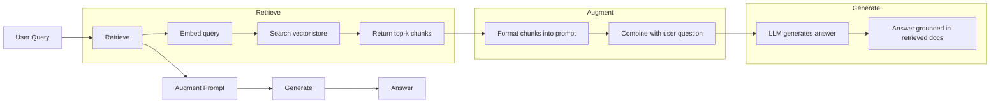
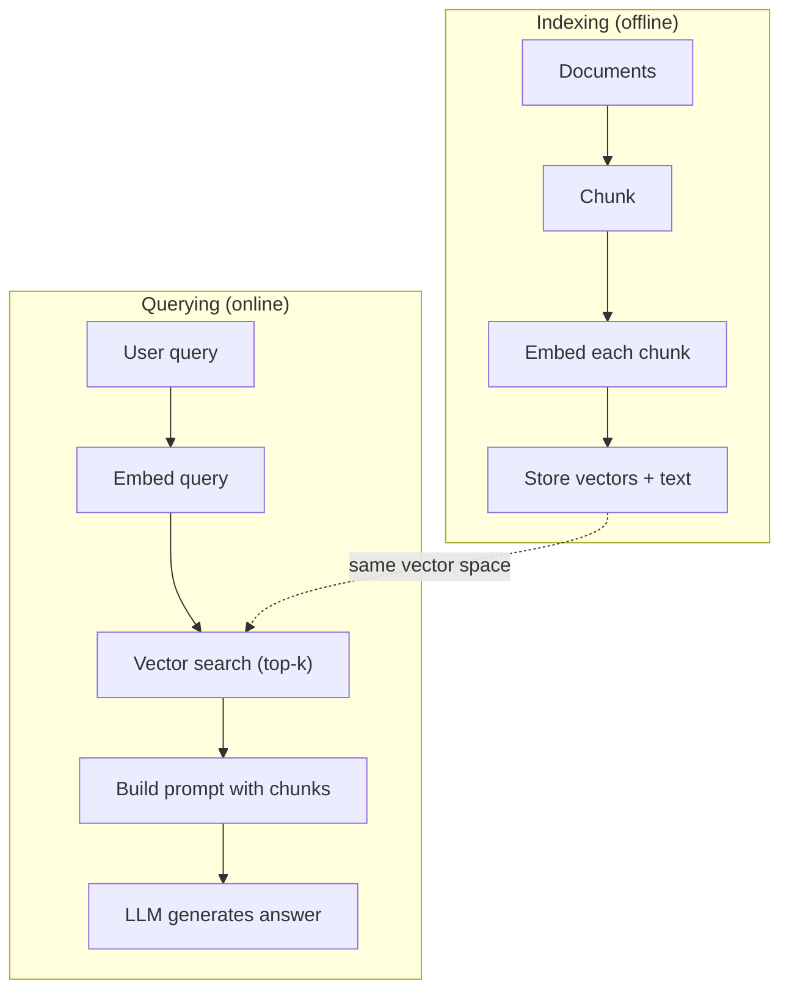

# RAG (Génération augmentée de récupération) 检索增强生成

> Votre LLM connaît tout jusqu'à sa formation. Il ne sait rien des documents de votre entreprise, de votre base de code ou des notes de réunion de la semaine dernière. RAG résout cela en récupérant des documents pertinents et en les remplissant dans le prompt. C'est le modèle le plus déployé dans l'IA de production. Si vous construisez une chose à partir de ce cours, construisez un pipeline RAG.

> **【中文解读】**LLM seulement sait savoir formation截止日期前信息──RAG 通过检查相关文档并注入提示来弥补知识缺口──这是生产环境部署最广泛的AI模式如果你只学一件事,就学RAG──

> **【拓展：RAG→企业AI应用】**Le RAG est le premier programme de recherche d'IA dans les entreprises: la connaissance des questions et réponses à la demande, l'examen des contrats, l'assistance aux documents techniques, l'analyse des rapports financiers, etc. Les scénarios dépendent du RAG.

>  **【前置】**學本節前請先掌握:(1) Phase 11·04(Embedings) 理解向量空间、相似度、HNSW;(2) Phase 05·23(Chunking Strategies) 理解文档切分;(3) Phase 10(LLM à partir de zéro) 理解 prompt 如何影响生成──本节会用到 `chromadb`Ou `faiss`- Je suis là.`langchain`Ou `llamaindex`Il y a une autre.

**Type:** Build | **类型:** 构建
**Languages:** Python | **语言:** Python
**Prerequisites:** Phase 10 (LLMs from Scratch), Phase 11 Lessons 01-05 | **前置知识:** Phase 10（从零理解 LLM）、Phase 11 Lesson 01-05
**Time:** ~90 minutes | **时间:** ~90 分钟
**Related:**Phase 5 · 23 (Stratégies de déchiquetage pour RAG) pour les six algorithmes de déchiquetage et quand chacun gagne. Phase 5 · 22 (Diplication profonde des modèles d'intégration) pour choisir l'intégrateur. Phase 11 · 07 (RAG avancée) pour la recherche hybride, le ré-renchonnement et la transformation de requête.**相关:**Phase 5 · 23(RAG 分块策略) Introduction à six types d'algorithmes de blocs et à leurs propres scénarios de mise en œuvre.

## Objectifs d'apprentissage

- Construire un pipeline RAG complet: chargement de documents, déchiquetage, intégration, stockage vectoriel, récupération et génération
  Construire une ligne de RAG complète:文档加载、分块、嵌入、向量存储、检索、生成
- Implémenter une recherche sémantique à l'aide d'une base de données vectorielle (ChromaDB, FAISS ou Pinecone) avec une indexation appropriée
  Utilisation de données de données de données (ChromaDB、FAISS, Pinecone) pour réaliser la recherche et l'indexation correcte
- Expliquer pourquoi RAG est préférable à l'ajustement fin pour les applications fondées sur la connaissance (coût, fraîcheur, attribution)
  解释为什么知识接地应用更好于RAG而非微调(cost、新鲜度、归因)
- Évaluer la qualité des RAG à l'aide de mesures de récupération (precision, rappel) et de mesures de génération (fidélité, pertinence)
  Utilisation de l'évaluation des données de qualité

> **【中文解读】**Le but de ce cours est de réaliser un RAG complet (réalisation de l'analyse de la production) du pipeline  du document  de la production  de la production  de la production  de la production  de la production  de la production  de la production  de la production  de la production  de la production  de la production  de la production  de la production  de la production  de la production  de la production  de la production  de la production  de la production  de la production  de la production  de la production  de la production  de la production  de la production  de la production  de la production  de la production  de la production  de la production  de la production  de la production  de la production  de la production  de la production  de la production  de la production  de la production  de la production  de la production  de la production  de la production  de la répartition  de la répartition  de la répartition  de la répartition  de la répartition  de la répartition  de la répartition  de la répartition  de la répartition  de la répartition  de la répartition  de la répartition  de la répartition  de la répartition  de la répartition  de la répartition  de la répartition  de la répartition  de la répartition  de la répartition  de la répartition  de la répartition  de la répartition  de la répartition  de la répartition  de  de  de  de  de  de  de                                     


## Le problème , l' introduction du problème

Vous construisez un chatbot pour votre entreprise. Un client demande "Quelle est la politique de remboursement pour les plans d'entreprise?" Le LLM répond avec une réponse générique sur les politiques de remboursement typiques de SaaS. La politique réelle, enterrée dans un wiki interne de 200 pages, dit que les clients d'entreprise obtiennent une fenêtre de 60 jours avec des remboursements à taux pro. Le LLM n'a jamais vu ce document. Il ne peut pas savoir sur quoi il n'a pas été formé.

> Vous avez construit un chat pour l'entreprise. Les clients se demandent: "Quelle est la politique de remboursement de l'entreprise ?" LLM a donné une réponse générale sur la politique de remboursement typique de SaaS. La politique réelle se trouve dans un wiki interne de 200 pages, disant que les clients d'entreprise ont 60 jours de fenêtre et remboursement proportionnel. LLM n'a jamais vu ce document. Il est impossible de savoir ce qu'il n'a pas été entraîné.

Le modèle est un peu dépassé au moment où un document change. Vous n'avez aucun moyen de savoir de quelle source le modèle a été tiré. Et si l'entreprise achète une autre gamme de produits le mois prochain, vous le faites à nouveau.

> 微调是一种 solution. Mais la modification nécessite des milliers de dollars de coûts de calcul. Un modèle de modification du dossier est obsolète.

RAG est l'autre solution. Laissez le modèle intact. Lorsque vous avez une question, recherchez dans votre archive de documents des passages pertinents, collez-les dans le prompt avant la question et laissez le modèle répondre en utilisant ces passages comme contexte. Le magasin de documents peut être mis à jour en quelques minutes. Vous pouvez voir exactement quels documents ont été récupérés. Le modèle lui-même ne change jamais. C'est pourquoi RAG est le modèle dominant dans la production: il est moins cher, plus frais, plus auditable, et fonctionne avec n'importe quel LLM.

> RAG est une autre solution. Gardez le modèle inchangé. Lorsque le problème survient, recherchez dans votre arsenal de documents des passages pertinents, les collez à l'avant de la question, laissez le modèle utiliser ces passages comme des passages ci-dessus et ci-dessous pour répondre.

>  **【类比】**RAG 像开卷考试:学生(LLM) ne doit pas mettre toutes les classes à l'arrière de la table ((fine-tuning), mais il faut mettre un seul note-book ((向量库) dans le jeu.

## Le concept de base.

> **【中文解读】**RAG(Retrieval-Augmented Generation,检索增强生成) combinera la base de connaissances externe avec LLM 结合: user questions from vector database search related documents to will search results inject prompt to LLM 基于检索结果生成答案──RAG 解决了 LLM's knowledge time efficiency and illusion problems──

> **【拓展：RAG 的生产实践】**典型 RAG 管线:文档切分(chunking) jusqu'à la mise en place générée jusqu'à la stockage de volume(Pinecone/Weaviate/Chroma) jusqu'à la similarité référencée jusqu'à la réorganisation(renquête) jusqu'à la mise en place de prompt。LlamaIndex 和 LangChain est le cadre RAG le plus populaire。Meta's studies show RAG sur des tâches de type très riche en connaissances augmentera le taux de précision de 30-50%。


### Le modèle RAG

L'ensemble du schéma s'inscrit en quatre étapes:

> Tout le mode est en quatre étapes:



Recherche -> Retrieve -> Augment prompt -> Générer. Chaque système RAG suit ce modèle. Les différences entre les systèmes RAG de production sont dans les détails de chaque étape: comment vous décomposez, comment vous embladez, comment vous recherchez et comment vous construisez le prompt.

> 查询 -> 检索 -> 增强提示 -> 生成──每个RAG 系统都遵循这个模式──生产RAG 系统的差异在每个步骤的细节:如何分块──如何嵌入──如何搜索──如何构建提示──

> 🤔 **【困惑】**Q: Pourquoi ne pas mettre tout le dossier en direct dans le prompt ? Maintenant Claude a 200K sur la fenêtre, mettre ça en bas ?**精度下降** étude montre que les capacités de réception de contenu intermédiaire de l'enseignement supérieur (LLLM) dans le long terme ont considérablement diminué, dépassant les 32 000 后准确率 %;**成本爆炸**200K de jetons 输入约 $3/查询，而 RAG 检索 top-5 块只占 2K tokens（$0,03);**响应慢**长 prompt 推理延迟数倍于短 prompt。RAG 用精准检索换全量加载。

### Pourquoi le RAG est meilleur que le réglage

| Concern | Fine-tuning | RAG |
|---------|------------|-----|
| Cost / 成本 | $1,000-$100,000+ per training run / 每训练 1K-100K+ 美元 | $0.01-$0.10 per query (embedding + LLM) / 每查询 0.01-0.10 美元 |
| Freshness / 新鲜度 | Stale until retrained / 重训前都过时 | Updated in minutes by re-indexing docs / 重新索引文档即可在几分钟内更新 |
| Auditability / 可审计性 | Cannot trace answer to source / 无法追溯答案来源 | Can show exact retrieved passages / 可显示精确检索段落 |
| Hallucination / 幻觉 | Still hallucinates freely / 仍自由幻觉 | Grounded in retrieved documents / 基于检索文档接地 |
| Data privacy / 数据隐私 | Training data baked into weights / 训练数据固化在权重中 | Documents stay in your vector store / 文档留在你的向量存储中 |

Le réglage fin modifie les poids du modèle de façon permanente. RAG modifie temporairement le contexte du modèle. Pour la plupart des applications, le contexte temporaire est ce que vous voulez.

> 微调永久改变模型权重──RAG 临时改变模型上下文── Pour la plupart des applications, temporaire上下文就是你要的──

Le seul cas où l'ajustement fin gagne: lorsque vous avez besoin du modèle pour adopter un style, un ton ou un motif de raisonnement spécifique qui ne peuvent être atteints par la seule incitation.

> 微调胜出的唯一情况: lorsque vous avez besoin d'un modèle qui adopte un style, un langage ou un mode de raisonnement spécifique, alors que c'est uniquement par la suggestion impossible de réaliser.

> ️ **【易错点】**3 cratères de la région:**切分粒度错误**块太大(> 1024 jetons) emplacé été rare释召回不到,块太小(< 64 jetons)丢失上下文;起点:256-512 jetons + 50 重叠──(2) **没做 query 改写** utilisateur demande " comment ça se passe ? " 指代不明,向量库找不到;修复:先用LLM 把问题改写成包含上下文的完整查询──(3) **只看召回率不看准确率**top-10 召回 90% 但只有3 条相关,模型被噪音干扰幻觉;加跨编码重排到前3 高质量块──

### Intégrer des modèles

Un modèle d'intégration convertit le texte en vecteur dense. Des textes similaires produisent des vecteurs qui sont proches l'un de l'autre dans cet espace haute dimension. "Comment réinitialiser mon mot de passe?" et "Je dois changer mon mot de passe" produisent des vecteurs presque identiques malgré le partage de quelques mots. "Le chat s'est assis sur le tapis" produit un vecteur très différent.

> Le modèle de mise en place transforme le texte en un volume de couches. Le texte similaire produit des couches de couches de couches de couches dans cet espace de couches.

Modèles d'intégration communs (ligne de 2026  voir la phase 5 · 22 pour une analyse complète):

> 常见嵌入模型(2026年阵容完整分析见Phase 5 · 22):

| Model | Dimensions | Provider | Notes |
|-------|-----------|----------|-------|
| text-embedding-3-small | 1536 (Matryoshka) | OpenAI | Best price/performance for most use cases / 大多数场景最佳性价比 |
| text-embedding-3-large | 3072 (Matryoshka) | OpenAI | Higher accuracy, truncatable to 256/512/1024 / 更高精度，可截断到 256/512/1024 |
| Gemini Embedding 2 | 3072 (Matryoshka) | Google | Top MTEB retrieval; 8K context / 顶级 MTEB 检索；8K 上下文 |
| voyage-4 | 1024/2048 (Matryoshka) | Voyage AI | Domain variants (code, finance, law) / 领域变体（代码、金融、法律）|
| Cohere embed-v4 | 1024 (Matryoshka) | Cohere | Strong multilingual, 128K context / 强多语言，128K 上下文 |
| BGE-M3 | 1024 (dense + sparse + ColBERT) | BAAI (open-weight) | Three views from one model / 一个模型三种视图 |
| Qwen3-Embedding | 4096 (Matryoshka) | Alibaba (open-weight) | Top open-weight retrieval score / 顶级开源权重检索分数 |
| all-MiniLM-L6-v2 | 384 | Open-weight (Sentence Transformers) | Prototyping baseline / 原型基线 |

Pour cette leçon, nous construisons notre propre intégration simple en utilisant TF-IDF. Non pas parce que TF-IDF est ce que les systèmes de production utilisent, mais parce qu'il rend le concept concret: un texte entre, un vecteur sort, des textes similaires produisent des vecteurs similaires.

> Dans ce cours, nous utilisons TF-IDF pour construire nos propres emplacements simples. Ce n'est pas parce que TF-IDF est utilisé dans le système de production, mais parce qu'il permet de concrétiser le concept: texte entre, volume sort, texte similaire génère une taille similaire.

### Similation vectorielle

Compte tenu de deux vecteurs, comment mesurer la similitude?

> ∆ donner deux dimensions, comment mesurer la similitude?

**Cosine similarity**Le cossin est l'angle entre deux vecteurs. varie de -1 (opposé) à 1 (identique).

> **余弦相似度**Il s'agit d'une sélection par défaut de RAG.

```
cosine_sim(a, b) = dot(a, b) / (||a|| * ||b||)
```

**Dot product**Les vecteurs plus grands obtiennent des scores plus élevés.

> **点积**Le volume de l'information est utile lorsque vous portez des informations.

```
dot(a, b) = sum(a_i * b_i)
```

**L2 (Euclidean) distance**La distance est plus longue que la distance de la distance vectorielle.

> **L2（欧氏）距离**: distance de ligne droite dans l'espace de volume.

```
L2(a, b) = sqrt(sum((a_i - b_i)^2))
```

La similitude cosine est la norme. Elle traite avec gracie des documents de différentes longueurs parce qu'elle se normalise par magnitude. Quand quelqu'un dit " recherche vectorielle ", ils veulent presque toujours dire similitude cosine.

> La similitude des cordes est une norme. Elle est très agréable à traiter avec des documents de différentes longitudes, car elle est regroupée en termes de longueur.

### Des stratégies de déchiquetage

Les documents sont trop longs pour être intégrés en vecteurs simples. Un PDF de 50 pages peut produire une incubation terrible parce qu'il contient des dizaines de sujets. Au lieu de cela, vous divisez les documents en morceaux et vous incrusterez chaque morceau séparément.

> 文档太长,不能作为单向量嵌入──50 pages PDF可能产生糟糕的嵌入,因为它包含几十个主题──相反, vous allez décomposer le document en blocs, séparément emplacé dans chaque bloc──

**Fixed-size chunking**Une partie de 512-tokens avec 50-tokens se chevauchent signifie que la partie 1 est des jetons 0-511, la partie 2 est des jetons 462-973, etc. La chevauchement garantit que vous ne partagez pas une phrase à une limite malheureuse.

> **固定大小分块**: chaque N-token 拆分一次──简单可预测──512-token 块加50-token 重叠 signifie bloc 1 est le token 0-511, bloc 2 est le token 462-973, selon ce type de suggestion──重叠 assure que vous ne serez pas dans les limites du malheur de la chance de démolir-se-sentences──

**Semantic chunking**Les paragraphes, sections ou titres de détail. Chaque morceau est une unité de signification cohérente.

> **语义分块**: dans la nature, les parties sont divisées.

**Recursive chunking**Si une section est encore trop grande, divisez-la aux limites des paragraphes. Si un paragraphe est encore trop grand, divisez-le aux limites des phrases. C'est l'approche LangChain RecursiveCharacterTextSplitter et elle fonctionne bien dans la pratique.

> **递归分块**Le langage est un langage qui se décompose en plusieurs phases.

La taille des morceaux compte plus que ce que les gens pensent:

> Plus important que ce que les gens pensent:

- Trop petit (64-128 tokens): chaque pièce manque de contexte. "Il a augmenté de 15% au dernier trimestre" ne signifie rien sans savoir ce que "il" fait référence.
  太小(64-128 jetons): chaque bloc manque sur la période de croissance de 15% "在不知道"它"指代什么时无意义──
- Trop gros (2048+ tokens): chaque pièce couvre plusieurs sujets, diluant la pertinence. Lorsque vous recherchez des données de revenus, vous obtenez une pièce qui est 10% sur les revenus et 90% sur le personnel.
  太大(2048+ token): chaque bloc couvre plusieurs sujets, rar释相关性──
- Point de référence (256-512 jetons): suffisamment de contexte pour être autonome, suffisamment concentré pour être pertinent.
  Le point le plus important est que le code de référence est suffisamment concentré pour être associé.

La plupart des systèmes RAG de production utilisent 256 à 512 pièces de jetons avec 50 jetons se chevauchant.

> La plupart produisent des RAG 系统 avec 256-512 jetons 块加 50 jetons 重叠──Anthropic's RAG 指南推这个范围──

### Base de données vectorielles

Une fois que vous avez des intégrations, vous avez besoin d'un endroit où les stocker et les rechercher.

> Une fois que vous avez les emplacements, vous avez besoin d'un endroit de stockage et de recherche pour eux.

| Database | Type | Best for |
|----------|------|----------|
| FAISS | Library (in-process) / 库（进程内）| Prototyping, small to medium datasets / 原型、中小数据集 |
| Chroma | Lightweight DB / 轻量 DB | Local development, small deployments / 本地开发、小型部署 |
| Pinecone | Managed service / 托管服务 | Production without ops overhead / 无运维开销的生产 |
| Weaviate | Open source DB / 开源 DB | Self-hosted production / 自托管生产 |
| pgvector | Postgres extension / Postgres 扩展 | Already using Postgres / 已在用 Postgres |
| Qdrant | Open source DB / 开源 DB | High-performance self-hosted / 高性能自托管 |

Pour cette leçon, nous avons construit un simple magasin de vecteurs en mémoire. Il stocke des vecteurs dans une liste et effectue une recherche de similitude cosine brute-force. Cela équivaut à FAISS avec un indice plat. Il évolue à peut-être 100 000 vecteurs avant de ralentir. Les systèmes de production utilisent des algorithmes proches voisins (ANN) approximatifs comme HNSW pour rechercher des millions de vecteurs en millisecondes.

> Dans ce cours, nous avons construit un simple stockage de vecteurs en interne. Il va conserver le vecteur dans la liste et effectuer une recherche de similitude de la violence. Cela équivaut à la recherche de la similitude de la force.

### Le pipeline complet



La phase d'indexation se déroule une fois par document (ou lorsque les documents sont mis à jour). La phase de requête se déroule sur chaque demande d'utilisateur.

> L'indexation est effectuée en une seule fois. La demande doit être traitée en 1 seconde.

### Numéros réels

La plupart des systèmes RAG de production utilisent ces paramètres:

> La plupart des produits RAG sont utilisés pour:

- **k = 5 to 10**les fragments récupérés par requête
  Chaque enquête demande 5 à 10 blocs
- **Chunk size = 256 to 512 tokens**avec une superposition de 50 jetons
  块大小 256-512 jeton plus 50 jeton 重叠
- **Context budget**: 2500 à 5000 jetons de contenu récupéré par requête
  上下文预算: chaque requête 2500-5000 jetons  retrouver le contenu
- **Total prompt**: ~ 8000-16,000 jetons (interrogatoire système + fragments récupérés + historique de conversation + requête utilisateur)
  总提示: environ 8000-16,000 tokens(系统提示 + 检索块 + 对话历史 + 用户查询)
- **Embedding dimension**: 384-3072 selon le modèle
  嵌入维度:384-3072  dépend du modèle
- **Indexing throughput**: 100 à 1000 documents par seconde avec intégrations API
  Indice de débit: utilisez API 嵌入每秒 100-1,000 文档
- **Query latency**: 50-200 ms pour la récupération, 500-3000 ms pour la génération
  查询延迟:检索 50-200ms, générer 500-3000ms

## Construisez-le et mettez-le en œuvre.
```figure
rag-chunking
```

## Faites-le

### Étape 1: Chunking du document

```python
def chunk_text(text, chunk_size=200, overlap=50):
    words = text.split()
    chunks = []
    start = 0
    while start < len(words):
        end = start + chunk_size
        chunk = " ".join(words[start:end])
        chunks.append(chunk)
        start += chunk_size - overlap
    return chunks
```

### Étape 2: Embedding TF-IDF

Nous construisons une fonction d'intégration simple. TF-IDF (Term Frequency-Inverse Document Frequency) n'est pas un intégration neurale, mais elle convertit le texte en vecteurs d'une manière qui capture l'importance des mots. Les mots fréquents dans un document gagnent plus de TF. Les mots rares dans le corpus gagnent plus de IDF. Le produit donne un vecteur où les mots importants et distinctifs ont des valeurs élevées.

> Nous avons construit une simple fonction d'intégration. TF-IDF (frequency of words-reverse documentation) n'est pas une intégration neuronale, mais elle se base sur la façon de capturer l'importance des mots pour transformer le texte en flux.

> 🤔 **【困惑】**Q: Pourquoi le didacticiel utilise TF-IDF plutôt que de véritables emplacements neuronaux comme OpenAI dans le texte ?**零依赖**本节用纯Python 标准库教学,不要求你注册 API或下模型;(2) **可读**TF-IDF mathématique simple à écrire sur un tableau noir, le cerveau est enfoncé dans une boîte noire;(3) **教学聚焦**本节核心是 RAG 流程(chunk→embed→retrieve→prompt→generate),嵌入器换掉流程不变──**生产环境务必换神经嵌入**TF-IDF 不理解语义, "付款失败" et "扣款不成功" ne correspondent pas complètement au TF-IDF, mais le système nerveux est capable de les reconnaître dans le même sens.

```python
import math
from collections import Counter

def build_vocabulary(documents):
    vocab = set()
    for doc in documents:
        vocab.update(doc.lower().split())
    return sorted(vocab)

def compute_tf(text, vocab):
    words = text.lower().split()
    count = Counter(words)
    total = len(words)
    return [count.get(word, 0) / total for word in vocab]

def compute_idf(documents, vocab):
    n = len(documents)
    idf = []
    for word in vocab:
        doc_count = sum(1 for doc in documents if word in doc.lower().split())
        idf.append(math.log((n + 1) / (doc_count + 1)) + 1)
    return idf

def tfidf_embed(text, vocab, idf):
    tf = compute_tf(text, vocab)
    return [t * i for t, i in zip(tf, idf)]
```

### Étape 3: recherche de similitude cosine

```python
def cosine_similarity(a, b):
    dot = sum(x * y for x, y in zip(a, b))
    norm_a = math.sqrt(sum(x * x for x in a))
    norm_b = math.sqrt(sum(x * x for x in b))
    if norm_a == 0 or norm_b == 0:
        return 0.0
    return dot / (norm_a * norm_b)

def search(query_embedding, stored_embeddings, top_k=5):
    scores = []
    for i, emb in enumerate(stored_embeddings):
        sim = cosine_similarity(query_embedding, emb)
        scores.append((i, sim))
    scores.sort(key=lambda x: x[1], reverse=True)
    return scores[:top_k]
```

### Étape 4: Construire rapidement

C'est là que se produit le "augmenté" dans RAG. Prenez les morceaux récupérés, formatez-les en un prompt et demandez au LLM de répondre en fonction du contexte fourni.

> C'est là que se produit le " renforcement " dans le RAG.

> ️ **【易错点】**Je suis en train de faire une petite photo de mon père.**没说"基于上下文回答"**模型会调用自己的参数知识回答(产生幻觉),把 "Répondre basé uniquement sur le contexte suivant" 加到 prompt 最前;(2) **没给"不知道就说不知道"的退路**模型宁可盲编也不承认无能为力,必须显式写 "Si le contexte ne contient pas de réponse, dites 'je n'ai pas assez d'informations'";(3) **没要求引用来源** l'enquête est irrévocable, l'audit est raté;`[Source N]`标记, faire en sorte que l'utilisateur puisse ouvrir la page d'accueil.

```python
def build_rag_prompt(query, retrieved_chunks):
    context = "\n\n---\n\n".join(
        f"[Source {i+1}]\n{chunk}"
        for i, chunk in enumerate(retrieved_chunks)
    )
    return f"""Answer the question based ONLY on the following context.
If the context doesn't contain enough information, say "I don't have enough information to answer that."

Context:
{context}

Question: {query}

Answer:"""
```

### Étape 5: L'oléoduc RAG complet

```python
class RAGPipeline:
    def __init__(self):
        self.chunks = []
        self.embeddings = []
        self.vocab = []
        self.idf = []

    def index(self, documents):
        all_chunks = []
        for doc in documents:
            all_chunks.extend(chunk_text(doc))
        self.chunks = all_chunks
        self.vocab = build_vocabulary(all_chunks)
        self.idf = compute_idf(all_chunks, self.vocab)
        self.embeddings = [
            tfidf_embed(chunk, self.vocab, self.idf)
            for chunk in all_chunks
        ]

    def query(self, question, top_k=5):
        query_emb = tfidf_embed(question, self.vocab, self.idf)
        results = search(query_emb, self.embeddings, top_k)
        retrieved = [(self.chunks[i], score) for i, score in results]
        prompt = build_rag_prompt(
            question, [chunk for chunk, _ in retrieved]
        )
        return prompt, retrieved
```

### Étape 6: génération (simulée)

Dans la production, c'est là que vous appelez l'API LLM. Pour cette leçon, nous simulons la génération en extraisant la phrase la plus pertinente du contexte récupéré.

> Il s'agit d'un cours de formation en éducation et de formation en éducation.

```python
def simple_generate(prompt, retrieved_chunks):
    query_words = set(prompt.lower().split("question:")[-1].split())
    best_sentence = ""
    best_score = 0
    for chunk in retrieved_chunks:
        for sentence in chunk.split("."):
            sentence = sentence.strip()
            if not sentence:
                continue
            words = set(sentence.lower().split())
            overlap = len(query_words & words)
            if overlap > best_score:
                best_score = overlap
                best_sentence = sentence
    return best_sentence if best_sentence else "I don't have enough information."
```

## Utilisez-le avec le cadre de réalisation

Avec un modèle d'intégration et un LLM, le code change à peine:

> Avec le modèle de réalisme et le MLL, le code est presque inchangé:

```python
from openai import OpenAI

client = OpenAI()

def embed(text):
    response = client.embeddings.create(
        model="text-embedding-3-small",
        input=text
    )
    return response.data[0].embedding

def generate(prompt):
    response = client.chat.completions.create(
        model="gpt-4o-mini",
        messages=[{"role": "user", "content": prompt}],
        temperature=0
    )
    return response.choices[0].message.content
```

Ou avec Anthropic:

> Ou avec Anthropic:

```python
import anthropic

client = anthropic.Anthropic()

def generate(prompt):
    response = client.messages.create(
        model="claude-sonnet-5",
        max_tokens=1024,
        messages=[{"role": "user", "content": prompt}]
    )
    return response.content[0].text
```

Le pipeline est le même. Changer la fonction d'intégration. Changer la fonction de génération. La logique de récupération, le déchiquetage, la construction rapide - tout identique quel que soit le modèle que vous utilisez.

> 管线相同. 管线相同. 管线相同. 管线相同. 管线相同. 管线相同. 管线相同. 管线相同. 管线相同. 管线相同. 管线相同. 管线相同. 管线相同. 管线相同. 管线相同. 管线相同. 管线相同. 管线相同. 管线相同. 管线相同. 管线相同. 管线相同. 管线相同. 管线相同. 管线相同. 管线相同. 管线相同. 管线相同. 管线相同. 管线相同. 管线相同. 管线相同. 管线相同. 管线. 管线. 管线. 管线. 管线. 管线. 管线. 管线. 管. 管. 管. 管. 管. 管. 管. 管. 管. 管. 管. 管. 管. 管. 管. 管. 管. 管. 管. 管. 管. 管. 管. 管. 管. 管. 管. 管. 管. 管. 管. 管. 管. 管. 管.

Pour le stockage vectoriel à l'échelle, remplacer la recherche brute-force par une base de données vectorielle appropriée:

>  Pour le stockage de volumes à grande échelle, utiliser une base de données de volumes adaptée pour remplacer la recherche violente:

```python
import chromadb

client = chromadb.Client()
collection = client.create_collection("my_docs")

collection.add(
    documents=chunks,
    ids=[f"chunk_{i}" for i in range(len(chunks))]
)

results = collection.query(
    query_texts=["What is the refund policy?"],
    n_results=5
)
```

Chroma gère l'intégration en interne (il utilise tout-MiniLM-L6-v2 par défaut) et stocke les vecteurs dans une base de données locale.

> Chroma 内部处理嵌入式 (默认使用全MiniLM-L6-v2)并将向量存在本地数据库──相同模式,不同管道──

## Envoyez-le . Produit .

Cette leçon donne:
- `outputs/prompt-rag-architect.md`-- une demande de conception de systèmes RAG pour des cas d'utilisation spécifiques
  Pour des exemples spécifiques de conception RAG 系统的提示
- `outputs/skill-rag-pipeline.md`-- une compétence qui apprend aux agents comment construire et débogager des pipelines RAG
  Apprendre à construire et à modifier les compétences des agents de RAG

## Les exercices

1. Remplacez les intégrations TF-IDF par une approche simple de sacs de mots (binary: 1 si le mot est présent, 0 si ce n'est pas le cas). Comparer la qualité de récupération sur les documents d'échantillon. TF-IDF devrait surpasser les résultats car il pèse plus haut les mots rares.
   Utilisation de la méthode de test de la carte de données (en anglais seulement)

2. Experimentez avec les tailles de pièces: essayez 50, 100, 200 et 500 mots sur le même ensemble de documents. Pour chaque taille, effectuez les mêmes 5 requêtes et comptez combien de requêtes renvoient une pièce pertinente dans le haut-3. Trouvez le point doux où la qualité de récupération atteint son apogée.
   实验块大小: dans le même document, essayez 50、100、200、500 词── 5 requêtes par type de grandeur, en statistique, les 3 premiers retournent le nombre de blocs pertinents― pour trouver le meilleur point de la valeur maximale de la qualité de la recherche―.

3. Ajouter des métadonnées à chaque pièce (nom du document source, position de la pièce). Modifier le modèle de demande pour inclure l'attribution de source afin que le LLM cite ses sources.
   给每块添加元数据(源文档名、块位置)  Modifier提示模板包含源归因,让LLM 引用其来源──

4. Exécuter une simple évaluation: en donnant 10 paires de questions-réponses, faire passer chaque question par le pipeline RAG et mesurer le pourcentage de fragments récupérés contenant la réponse.
   实现简单评估: donner 10 questions à répondre, chaque question sera passée par RAG 管线运行, la mesure du pourcentage de l'enquête contenue dans le bloc de réponse.

5. Construisez un pipeline RAG conscient de la conversation: gardez un historique des 3 derniers échanges et les inclure dans l'interrogatoire à côté des fragments récupérés.
   构建对话感知 RAG 管线:维护近期 3次交换历史,与检索块一起包含在提示中──用跟进问题如"企业版吗?"(询问定价后)测试──

## Les termes clés

| Term | What people say | What it actually means | 中文释义 |
|------|----------------|----------------------|---------|
| RAG | "AI that reads your docs" | Retrieve relevant documents, paste them into the prompt, and generate an answer grounded in those documents | RAG：检索相关文档、粘贴进提示、基于这些文档生成接地答案 |
| Embedding | "Convert text to numbers" | A dense vector representation of text where similar meanings produce similar vectors | 嵌入：文本的稠密向量表示，相似含义产生相似向量 |
| Vector database | "Search engine for AI" | A data store optimized for storing vectors and finding the nearest neighbors by similarity | 向量数据库：为存储向量和按相似度找近邻优化的数据存储 |
| Chunking | "Split docs into pieces" | Breaking documents into smaller segments (typically 256-512 tokens) so each can be embedded and retrieved independently | 分块：将文档拆为更小段（通常 256-512 token）以便独立嵌入和检索 |
| Cosine similarity | "How similar are two vectors" | The cosine of the angle between two vectors; 1 = identical direction, 0 = orthogonal, -1 = opposite | 余弦相似度：两向量夹角余弦；1=同向，0=正交，-1=反向 |
| Top-k retrieval | "Get the k best matches" | Return the k most similar chunks to the query from the vector store | Top-k 检索：从向量存储返回与查询最相似的 k 个块 |
| Context window | "How much text the LLM can see" | The maximum number of tokens the LLM can process in a single request; retrieved chunks must fit within this | 上下文窗口：LLM 单次请求能处理的最大 token 数；检索块必须放得下 |
| Augmented generation | "Answer using given context" | Generating a response using retrieved documents as context rather than relying solely on trained knowledge | 增强生成：用检索文档作为上下文生成响应，而非仅依赖训练知识 |
| TF-IDF | "Word importance scoring" | Term Frequency times Inverse Document Frequency; weights words by how distinctive they are within a corpus | TF-IDF：词频乘逆文档频率；按词在语料库中的独特性加权 |
| Indexing | "Preparing docs for search" | The offline process of chunking, embedding, and storing documents so they can be searched at query time | 索引：分块、嵌入、存储文档的离线过程，以便查询时搜索 |

## Encore une lecture

- Lewis et coll., "Retrieval-Augmented Generation for Knowledge-Intensive NLP Tasks" (2020) -- le document RAG original de Facebook AI Research qui a formalisé le modèle de récupération puis génération
  Lewis et autres, "Retrieval-Augmented Generation for Knowledge-Intensive NLP Tasks" (en 2020) Facebook AI Research's original RAG 论文, formalized a été formalisé comme un modèle de production de recherche et de recherche.
- Documentation RAG d'Anthropic (docs.anthropic.com) - lignes directrices pratiques pour les tailles de pièces, la construction rapide et l'évaluation
  Réglage de la formation et de l'évaluation
- Le centre d'apprentissage Pinecone, "Qu'est-ce que le RAG?" -- explications visuelles claires du pipeline RAG avec des considérations de production
  L'expérience de la formation de la formation en ligne de la formation en ligne de formation en ligne de formation en ligne de formation en ligne de formation en ligne de formation en ligne de formation en ligne de formation en ligne de formation en ligne de formation en ligne de formation en ligne de formation en ligne de formation en ligne de formation en ligne de formation en ligne de formation en ligne de formation en ligne de formation en ligne de formation en ligne de formation en ligne de formation en ligne de formation en ligne de formation en ligne de formation en ligne de formation en ligne de formation en ligne de formation en ligne de formation en ligne de formation en ligne de formation en ligne de formation en ligne de formation en ligne de formation en ligne de formation en ligne de formation en ligne de formation en ligne de formation en ligne de formation en ligne de formation en ligne de formation en ligne de formation en ligne de formation en ligne de formation en ligne de formation en ligne de formation en ligne de formation en ligne de formation en ligne de formation en ligne de formation en ligne de formation en ligne de formation en ligne de formation en ligne de formation en ligne de formation en ligne de formation en ligne de formation en ligne de formation en ligne de formation en ligne de formation en ligne de formation en ligne de formation en ligne de formation en ligne de formation en ligne de formation en ligne de formation en ligne de formation en ligne de formation en ligne de formation en ligne de formation en ligne de formation en ligne de formation en ligne de formation en ligne de formation en ligne.
- Sentence-BERT: Reimers & Gurevych (2019) -- le document derrière les modèles intégrés MiniLM, montrant comment former les bi-encoders pour une similitude sémantique
  Sentence-BERT: Reimers & Gurevych(2019)all-MiniLM 嵌入模型背后的论文, démontrer comment pour la signification de la similitude entraîner
- [Karpukhin et al., "Dense Passage Retrieval for Open-Domain Question Answering" (EMNLP 2020)](https://arxiv.org/abs/2004.04906)-- le papier DPR qui a prouvé une récupération de bi-encodeur dense surpasse BM25 sur l'AQ open-domain et a établi le modèle pour les récupérateurs RAG modernes.
  Karpukhin 等, "DPR"(EMNLP 2020)  prouver密双编码器检索在开放域 QA 上胜过BM25 的DPR论文, a établi le modèle moderne du RAG 检索器──
- [LlamaIndex High-Level Concepts](https://docs.llamaindex.ai/en/stable/getting_started/concepts.html)-- les concepts principaux à connaître lors de la construction de lignes de RAG: chargements de données, partageurs de nœuds, indices, récupérateurs, synthétiseurs de réponse.
  LlamaIndex Conceptes de haut niveau  Construire RAG 管线需要知的主要概念: données loaders 节点解析器、索引、检索器、响应合成器──
- [LangChain RAG tutorial](https://python.langchain.com/docs/tutorials/rag/)-- l'orchestrateur à goût opposé; la vue de la chaîne des rouleaux du même modèle de récupération puis génération.
  LangChain RAG enseignement  différents types de rédacteurs; identique avant le contrôle et après la génération de mode 
