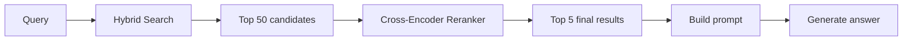
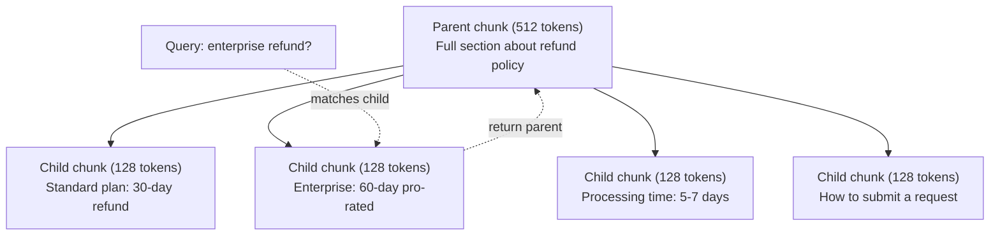
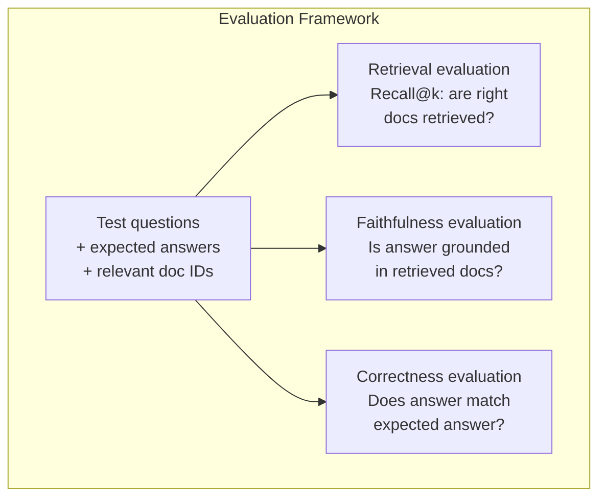

# RAG avancé (Chunking, Ranking, Hybrid Search) 

> RAG de base récupère les plus similaires de la partie supérieure. Cela fonctionne pour les questions simples. Il se décompose pour le raisonnement multi-hop, les requêtes ambiguës et les grandes corporations. RAG avancé est la différence entre une démo qui fonctionne sur 10 documents et un système qui fonctionne sur 10 millions.

> **【中文解读】**基础 RAG 检索 top-k 相似块, adapté à des questions simples, mais en plus de la plupart des hypothèses, les recherches à grande échelle et les discussions à grande échelle ne fonctionnent pas.

> **【拓展：高级RAG→金融场景】**L'analyse des données financières peut augmenter considérablement le taux de recherche de données financières.

>  **【前置】**學本節前 請先掌握:Phase 11·06 ((RAG) 理解基础 RAG 流程──本节是其进阶,假设你已经能写出 chunk→embed→retrieve→prompt→generate 的最小可用RAG──会用 `chromadb`- Je suis là.`rank_bm25`- Je suis là.`sentence-transformers`Ou `cohere`Rencontre avec l'API.

**Type:** Build | **类型:** 构建
**Languages:** Python | **语言:** Python
**Prerequisites:** Phase 11, Lesson 06 (RAG) | **前置知识:** Phase 11 · 06 (RAG)
**Time:** ~90 minutes | **时间:** ~90 分钟
**Related:**La phase 5 · 23 (Strategie de déchiquetage pour RAG) couvre les six algorithmes de déchiquetage  récursif, sémantique, phrase, parent-document, déchiquetage tardif, récupération contextuelle  avec des critères de référence Vectara/Anthropic. Cette leçon s'appuie sur le dessus: recherche hybride, réévaluation, transformation de requête.**相关:**La phase 5 · 23(RAG 分块策略) couvre l'ensemble des six types de segments de calculs 递归、语义、句子、父文档、晚分块、上下文检索含向量/人类基准──本课在其上构建:混合搜索、重排、查询转换──

## Objectifs d'apprentissage

- Mettre en œuvre des stratégies de déchiquetage avancées (sémantique, récursive, parent-enfant) qui préservent la structure et le contexte du document
  实现保留文档结构和上下文的高级分块策略 (→ L'écriture est une technique de référencement)
- Construire un pipeline de recherche hybride combinant le partage de mots clés BM25 avec la recherche vectorielle sémantique et un réencodeur croisé
  Construire un lien avec BM25 关键词匹配、语义向量搜索和交叉编码器重排器的混合搜索管线
- Appliquer des techniques de transformation des requêtes (HyDE, multi requêtes, step-back) pour améliorer la récupération sur des questions ambiguës ou complexes
  应用查询转换技术(HyDE、多查询、step-back) amélioration de la recherche de problèmes flou ou complexe
- Diagnostication et réparation des défaillances courantes du RAG: mauvais morceau récupéré, réponse non contextuelle, décomposition du raisonnement multi-hop
  诊断和修复常见 RAG 失败:检索错块、答案不上下文中、多跳推理崩

> **【中文解读】**Objectif de ce cours: maîtriser la technique de recherche de RAG supérieure à la réécriture, à la mixation, à la réorganisation, à l'adaptation, à la recherche, à la multiplication des suggestions.

>  **【类比】**基础 RAG 像新手图书管理员你说"营收",他按字面找带"营收"的书──高级 RAG 像资深管理员:(1) **Query 改写**vous dites "营收", il traduit en "上一季度财报中的收入数字"再找;**混合搜索**既翻主题目录 (语义) 再翻关键词索引 (BM25),两边结果合并;**重排** convoquer 100 livres 后仔细看每本摘要排序挑出最相关的 5 本(cross-encoder)

> ️ **【易错点】**3 个坑: 1)**HyDE 用错场景**HyDE(Que le LLM génère d'abord des hypothèses et réutilise des réponses)**重排模型选错** Utilisation de bi-encodeur lors de la réévaluation de l'encodeur croisé (comme BGE-M3 自己重排自己), n'a pas atteint une réelle amélioration de l'exactitude de l'encodeur croisé; utilisation de BGE-renanker-v2、Cohere Rerank──(3) **混合搜索没归一化**BM25 分数 0-30,向量相似度 0-1, direct相加向量永远被淹没; avec fusion de rang réciproque (RRF) ou min-max 归一化。

> 🤔 **【困惑】**Q: Do jump reasoning 让模型做还是检查做? A: 检查做. 让模型在快速推理,每跳检查一次,把上一跳结果作为下一跳查询的输入.


## Le problème , l' introduction du problème

Vous avez construit un pipeline RAG de base dans la leçon 06. Il fonctionne pour des questions simples sur un petit corpus.

> Vous avez construit une base RAG 流水线. Il est efficace pour les questions directes sur les petites bibliothèques de langage.

**Ambiguous query**"Quel était le chiffre d'affaires au dernier trimestre?" La recherche sémantique renvoie des morceaux sur la stratégie de revenus, les projections de revenus et les pensées du directeur financier sur la croissance des revenus. Tout cela est semanticement similaire au mot "revenus". Aucun ne contient le nombre réel.$47.2M in Q3 2025" but uses the word "earnings" instead of "revenue." The embedding model thinks "revenue strategy" is closer to the query than "Q3 earnings were $47,2 M. "

> **模糊查询**:"Quel est le chiffre d'affaires de la dernière saison ?" Les recherches de signification ont été effectuées sur les stratégies de chiffre d'affaires, les prévisions de chiffre d'affaires et les observations du directeur financier sur la croissance des chiffres d'affaires.

**Multi-hop question**Le rapport de satisfaction de chaque équipe exige de trouver les scores de satisfaction de chaque équipe, de les comparer et d'identifier le maximum.

> **多跳问题**:"Quelle équipe a le plus de satisfaction client ?" Cela nécessite de trouver le score de satisfaction de chaque équipe, de les comparer, de identifier la valeur maximale.

**Large corpus problem**Vous avez 2 millions de blocs. La réponse correcte est dans la partie #1,847,293. Votre recherche de top-5 tire les blocs #14, #89,201, #1,200,000, #44, et #901,333. Fermé dans l'espace d'intégration, mais aucun ne contient la réponse. À cette échelle, la recherche de voisin le plus proche approximatif introduit suffisamment d'erreur pour que les résultats pertinents soient repoussés hors de la partie supérieure.

> **大型语料库问题**: vous avez 2 millions de clips. La réponse exacte est dans le premier clipe de la série 1.847.293.

Le RAG de base échoue parce que la similitude vectorielle n'est pas la même que la pertinence. Une pièce peut être semantiquement similaire à une requête sans être utile pour la répondre. Le RAG avancé aborde ce problème avec quatre techniques: recherche hybride (ajout de correspondance de mots clés), réévaluation (téléchargement des candidats plus attentivement), transformation de requête (corrigation de la requête avant de la recherche) et meilleure fragmentation (obtention de la bonne granularité).

> 基础 RAG 失败是因为向量相似度不等于相关性──高级 RAG Utilise quatre techniques de résolution:

## Le concept de base.

> **【中文解读】**Régulation de la question de la réponse à la question de la réponse à la question de la réponse à la question de la réponse à la question de la réponse à la question de la réponse à la question de la réponse à la question de la réponse à la question de la réponse à la question de la réponse à la question de la réponse à la question de la réponse à la question de la réponse à la question de la réponse à la question de la réponse à la question de la réponse à la question de la réponse à la question de la réponse à la question de la réponse à la question de la réponse à la question de la réponse à la question de la réponse à la question de la réponse à la question de la réponse à la question de la réponse à la question de la réponse à la question de la réponse à la question de la réponse à la question de la réponse à la question de la réponse à la question de la réponse à la question de la réponse à la question de la réponse à la question de la réponse à la question de la réponse à la question de la réponse à la question.

> **【拓展：高级 RAG 的工业应用】**Le système RAG de classe de production comprend généralement: enquête intention classée à enquête étendue / réécriture à recherche mixte (BM25 + 向量) à cross-encoder (Cross-encoder) à réécriture à la production de réponse + 引用标注――Notion AI、Perplexité et autres produits ont utilisé la technologie RAG avancée―Self-RAG 让模型自己决定何时检索──


### Recherche hybride: sémantique + mot clé

La recherche sémantique (semblance vectorielle) est bonne pour comprendre la signification. " Comment annuler mon abonnement ? " correspond à " Pas pour mettre fin à votre plan " même s'ils ne partagent pas de mots. Mais il manque de correspondances exactes. " Code d'erreur E-4021 " peut ne pas correspondre à une pièce contenant " E-4021 " si le modèle d'intégration le traite comme du bruit.

> 语义搜索(向量相似度)擅长理解含义──"how to cancel订阅?"匹配"终止计划的步骤"尽管不共享单词──但它错过精确匹配──"错误码 E-4021"可能不匹配包含"E-4021"的块,如果嵌入模型将视为噪音──

La recherche de mots clés (BM25) est l'inverse. Elle excelle à des correspondances exactes. "E-4021" correspond parfaitement. Mais "annuler mon abonnement" renvoie zéro résultats si le document dit "terminer votre plan".

> Il est très bien conçu pour être parfait. Mais si le document dit "arrêter ton projet", il revient à zéro résultat.

La recherche hybride fait les deux, puis fusionne les résultats.

> 混合搜索同时运行两者, puis合并结果──

**BM25**(Best Matching 25) est l'algorithme de recherche par mot-clé standard. Il est la colonne vertébrale des moteurs de recherche depuis les années 1990.

> **BM25**(Best Matching 25) est un mot clé de l'algorithme de recherche.

```
BM25(q, d) = sum over terms t in q:
    IDF(t) * (tf(t,d) * (k1 + 1)) / (tf(t,d) + k1 * (1 - b + b * |d| / avgdl))
```

Là où tf(t,d) est la fréquence terminale de t dans le document d, IDF(t) est la fréquence inverse du document, \ \ \ \ \ \ \ \ \ \ \ \ \ \ \ \ \ \ \ \ \ \ \ \ \ \ \ \ \ \ \ \ \ \ \ \ \ \ \ \ \ \ \ \ \ \ \ \ \ \ \ \ \ \ \ \ \ \ \ \ \ \ \ \ \ \ \ \ \ \ \ \ \ \ \ \ \ \ \ \ \ \ \ \ \ \ \ \ \ \ \ \ \ \ \ \ \ \ \ \ \ \ \ \ \ \ \ \ \ \ \ \ \ \ \ \ \ \ \ \ \ \ \ \ \ \ \ \ \ \ \ \ \ \ \ \ \ \ \ \ \ \ \ \ \ \ \ \ \ \ \ \ \ \ \ \ \ \ \ \ \ \ \ \ \ \ \ \ \ \ \ \ \ \ \ \ \ \ \ \ \ \ \ \ \ \ \ \ \ \ \ \ \ \ \ \ \ \ \ \ \ \ \ \ \ \ \ \ \ \ \ \ \ \ \ \ \ \ \ \ \ \ \ \ \ \ \ \ \ \ \ \ \ \ \ \ \ \ \ \ \ \ \ \ \ \ \ \ \ \ \ \ \ \ \ \ \ \ \ \ \ \ \ \ \ \ \ \ \ \ \ \ \ \ \ \ \ \ \ \ \ \ \ \ \ \ \ \ \ \ \ \ \ \ \ \ \ \ \ \ \ \ \ \ \ \ \ \ \ \ \ \ \ \ \ \ \ \ \ \ \ \ \ \ \ \ \ \ \ \ \ \ \ \ \ \ \ \ \ \ \ \ \ \ \ \ \ \ \ \ \ \ \ \ \ \ \ \ \ \ \ \ \ \ \ \ \ \ \ \ \ \ \ \ \ \ \ \ \ \ \ \ \ \ \ \ \ \ \ \ \ \ \ \ \ \ \ \ \ \ \ \ \ \ \ \ \ \ \ \ \ \ \ \ \ \ \ \ \ \ \ \ \ \ \ \ \ \ \ \ \ \ \ \ \ \ \ \ \ \ \ \ \ \ \ \ \ \ \ \ \ \ \ \ \ \ \ \ \ \ \ \ \ \ \ \ \ \ \ \ \ \ \ \ \

> Parmi les thfs, t, d) est t, d) est à l'inverse, d) est à la longueur moyenne, d) est à la longueur moyenne, d) est à la longueur moyenne, d) est à la longueur moyenne, d) est à la longueur moyenne, d) est à la longueur moyenne, d) est à la longueur moyenne, d) est à la longueur moyenne, d) est à la longueur moyenne, d) est à la longueur moyenne, d) est à la longueur moyenne, d) est à la longueur moyenne, d) est à la longueur moyenne, d) est à la longueur moyenne, d) est à la longueur moyenne, d) est à la longueur moyenne, d) est à la longueur moyenne, d) est à la longueur moyenne, d) est à la longueur moyenne, d) est à la longueur moyenne, d) est à la longueur moyenne, d) est à la longueur moyenne, d) est à la longueur moyenne, d) est à la longueur, d) est à la longueur, d) est à la longueur, d) est à la longueur, d) est à la longueur, et d) est à la longueur, et d) est à la longueur d) est à la longueur, et à la longueur d) est à la longueur d'une longueur, et à la longueur d'une longueur d'une longueur d'une longueur, soit à la longueur d'une longueur d'une longueur d'une longueur d'une longueur d'une longueur d'une longueur d'une longueur d'une longueur d'une longueur d'une longueur d'une longueur d'une large.

En termes simples: BM25 donne des notes plus élevées aux documents lorsqu'ils contiennent des termes de requête (surtout ceux rares), mais avec des rendements moindres pour les termes répétés.

> 简而言之:BM25 给包含查询词 (especially rare rare words) 文档更高分,但重复词有递减收益──包含"收入"50 fois 文档不仅含一次的50倍相关──

### Fusion de rang réciproque (RRF)

Vous avez deux listes classées: une de recherche vectorielle, une de BM25. Comment les combiner?

> Vous avez deux séries de classement: une provenant de la recherche de masse, une provenant de BM25... Comment les combiner?

```
RRF_score(d) = sum over rankings R:
    1 / (k + rank_R(d))
```

Où k est une constante (typiquement 60) qui empêche le résultat le plus haut de dominer.

> Parmi eux, k est le nombre habituel (habituellement 60), empêchant la première place du classement.

Un document classé 1er dans la recherche vectorielle et 5e dans BM25 obtient: 1/(60+1) + 1/(60+5) = 0.0164 + 0.0154 = 0.0318

Un document classé #3 dans la recherche vectorielle et #2 dans BM25 obtient: 1/(60+3) + 1/(60+2) = 0.0159 + 0.0161 = 0.0320

> Dans le même temps, le nombre de pages de recherche de la première catégorie de la série de recherches de la première catégorie de la série de recherches de la deuxième catégorie de la série de recherches de la troisième catégorie de la série de recherches de la troisième catégorie de la série de recherches de la troisième catégorie de la série de recherches de la troisième catégorie de la série de recherches de la troisième catégorie de la série de recherches de la troisième catégorie de la série de recherches de la troisième catégorie de la série de recherches de la troisième catégorie de la série de recherches de la troisième catégorie de la série de recherches de la troisième catégorie de la série de recherches de la troisième catégorie de la série de recherches de la troisième catégorie de la série de recherches de la troisième catégorie de recherches de la série de recherches de la troisième catégorie de recherches de la série de recherches de la série de recherches de la série de recherches de la série de recherches de la série de recherches de la série de recherches de la série de recherches de la série de recherches de la série de recherches de la série de recherches de la série de recherches de la série de recherches de la série de recherches de la série de recherches de la série de la série de recherches de la série de recherches de la série de la série de recherches de la série de la série de recherches de la série de la série de la série de recherches de la série de la série de la série de la série de la série de recherches de la série de la série de la série de la série de la série de la série de la série de recherches de la série de la série de la série de la série de la série de la série de la série de la série de la série de la série de la série de la série de la série de la série de la série de la série de la série de la série de la série de la série de la série de la série de la série de la série de la série de la série de la série de la série de la série de la série de la série de la série de la série de la série de la série de la série de la série de la série de la série de la série de la série de la série de la série de la série de la série de la série de la série

RRF équilibre naturellement les deux signaux. Un document qui se classe bien dans les deux listes obtient le meilleur score. Un document qui se classe #1 dans une liste mais est absent de l'autre obtient un score modéré. Ceci est robuste car il utilise des rangs, pas des scores bruts, de sorte que les différences dans la répartition des scores entre les deux systèmes n'ont pas d'importance.

> RRF balance naturel deux signaux. Les documents les plus élevés de chaque liste obtiennent les meilleurs points. Les documents les plus élevés de chaque liste obtiennent les meilleurs points.

### Rencontre

La récupération (qu'elle soit vectorielle, mot clé ou hybride) est rapide mais imprécise. Elle utilise des bi-encoders: la requête et chaque document sont intégrés indépendamment, puis comparés. Les intégrations sont calculées une fois et mises en cache. Cela équivaut à des millions de documents.

> 检索(无论向量、关键词还是混合)快但不精确──它使用双编码器:查询和每个文档独立嵌入,然后比较──嵌入计算一次并缓存──这可扩展到百万文档──

Le référencement utilise des encoders croisés: la requête et un document candidat sont alimentés ensemble dans un modèle qui produit un score de pertinence. Le modèle voit les deux textes simultanément et peut capturer des interactions fine-graines entre eux. Un encodateur croisé peut comprendre que "Quels étaient les bénéfices du Q3?" est très pertinent pour une pièce contenant "47.2 millions de dollars au Q3" même si un bi-encodeur a raté la connexion.

> Le codeur de croisement peut comprendre "Quantité de profits de Q3?" et le bloc de contenu "Q3 pour 4720 millions de dollars" est lié à hauteur, même si le codeur double a traversé cette connexion.

Le compromis: les encoders croisés sont 100 à 1000 fois plus lents que les bi-encoders parce qu'ils traitent le paire requête-document conjointement. Vous ne pouvez pas calculer les scores de codeurs croisés pour un million de documents. La solution: récupérer un ensemble de candidats plus grand (top-50 de recherche hybride), puis réafficher avec un encodeur croisé pour obtenir le top-5 final.

> 权衡: le codeur de liens est 100 à 1000 fois plus lent que le codeur de liens, car il traite les requêtes-document à la fois.



Modèles communs de réévaluation (2026 ligne):

> 常见重排模型(2026 年阵容):

- Rencontre de cohérence 3.5: API gérée, multilingue, meilleur gain de rappel sur les corps mixtes
  托管 API、多语言、混合语料 sur le plus grand nombre de revenus
- Rencontre de Voyage-2.5: API gérée, latence la plus faible des options hébergées
  托管 API、托管选项中最小延迟
- Jina-Reranker-v2 Multilingue: poids ouvert, plus de 100 langues
  开源权重、100+ 语言
- bge-renanker-v2-m3: poids ouvert, ligne de départ forte
  开源权重、强基线
- cross-encoder/ms-marco-MiniLM-L-6-v2: poids ouvert, fonctionne sur CPU pour la prototypage
  Open Source Power Weight ∞ peut fonctionner sur le CPU
- ColBERTv2 / Jina-ColBERT-v2: ré-rangers multi-vectoriels d'interaction tardive  O(tokens) pas O(docs) au moment du score
  后期交互多向量重排器评分时 O(tokens) et non O(docs)

### Transformation de requête

Parfois, le problème n'est pas la récupération mais la requête elle-même. "Qu'était ce truc sur le nouveau changement de politique?" est une requête de recherche terrible. Il ne contient pas de termes spécifiques. L'intégration est vague. Aucun système de récupération ne peut trouver les bons documents à partir de cela.

> Parfois, le problème n'est pas de la recherche mais de la recherche elle-même. "Qu'est-ce que c'est que le changement de politique ?" est une mauvaise recherche.

**Query rewriting**Le programme de recherche peut être réalisé par un programme de recherche spécialisé dans les domaines de l'enseignement supérieur et de la recherche.

> **查询重写**:将用户查询重述为更好的搜索查询――LLM 可做这件事:

```
User: "What was that thing about the new policy change?"
Rewritten: "Recent policy changes and updates"
```

**HyDE (Hypothetical Document Embeddings)**: au lieu de rechercher avec la requête, générer une réponse hypothétique, intégrer cela, et de rechercher des documents réels similaires.

> **HyDE（假设文档嵌入）**: ne pas avoir à rechercher, mais à générer des hypothèses, à les intégrer, à rechercher des documents réels similaires.

```
Query: "What is the refund policy for enterprise?"
Hypothetical answer: "Enterprise customers are eligible for a full refund
within 60 days of purchase. Refunds are pro-rated based on the remaining
subscription period and processed within 5-7 business days."
```

Encrer la réponse hypothétique et la recherche de documents réels similaires à celui-ci. L'intuition: la réponse hypothétique vit plus près de l'espace d'intégration de la réponse réelle que la question originale. Les questions et les réponses ont des structures linguistiques différentes. En générant une réponse hypothétique, vous comblez l'écart entre "espace de question" et "espace de réponse" dans l'intégration.

> 嵌入假设答案并搜索与它相似的真实文档――直觉: la réponse à la hypothèse est plus proche de la vraie réponse que la question originale dans l'espace de mise en place.

HyDE ajoute un appel LLM avant la récupération. Cela augmente la latence de 500-2000ms. Cela vaut la peine lorsque la qualité de récupération est mauvaise sur les requêtes brutes.

> HyDE en recherche pré-ajoutée une fois LLM 调用── ceci augmente 500-2000ms 延迟──

### Les parents et les enfants se déchirent

Le déchiquetage standard force un compromis: petits morceaux pour une récupération précise, grands morceaux pour un contexte suffisant.

> 标准分块强制权衡:小块精确检索,大块足够上下文──父子分块消除这个权衡──

Indiquez les petits morceaux (128 jetons) pour récupération. Lorsqu'un petit morceau est récupéré, retournez son morceau parent (512 jetons) pour la requête.

> 索引小块(128 token) pour le dépôt. 检索到小块时,返回其父块. 索引小块.



La requête "Remboursement d'entreprise?" correspond exactement à la partie enfant C2. Mais la requête reçoit la partie mère P complète, qui comprend le contexte environnant sur le temps de traitement et le processus de soumission.

> 查询"entreprise refund?" exact match à la section C2── mais la proposition de recevoir la section P complète, contenant des informations sur le temps de traitement et le processus de communication.

### Filtrage des métadonnées

Avant d'exécuter une recherche vectorielle, filtrez le corpus par métadonnées: date, source, catégorie, auteur, langue. Cela réduit l'espace de recherche et empêche les résultats irrélevants.

> En cours de recherche, le nombre de pages de recherche est réduit et les résultats ne sont pas associés.

"Qu'est-ce qui a changé dans la politique de sécurité le mois dernier?" ne devrait rechercher que des documents des 30 derniers jours dans la catégorie de sécurité. Sans filtrer les métadonnées, vous fouillez l'ensemble du corpus et vous pouvez récupérer un document de sécurité vieux de 2 ans qui se trouve semantiquement similaire.

> "Quel changement a eu la stratégie de sécurité du mois dernier?" devrait être recherché uniquement dans les archives de catégories de sécurité de 30 jours passés.

Les systèmes RAG de production stockent des métadonnées à côté de chaque pièce: document source, date de création, catégorie, auteur, version.

> Produit RAG 系统 est le système de stockage de données de chaque bloc à côté: source documentation 创建日期 类别 作者 版本 ⋅ .

### Évaluation

Vous avez construit un système RAG, comment savez-vous qu'il fonctionne ?

> Vous avez construit un système RAG. Comment savez-vous qu'il fonctionne ?

**Retrieval relevance (Recall@k)**Si la réponse à une question est dans la partie #47, la partie #47 figure-t-elle dans la partie 5?

> **检索相关性（Recall@k）**: Quel est le pourcentage de questions de test sur un groupe de documents connus, les documents pertinents apparaissant dans les résultats de premier ordre ?

**Faithfulness**Si les pièces récupérées disent "fenêtre de remboursement de 60 jours" et que le modèle dit "fenêtre de remboursement de 90 jours", c'est un défaut de fidélité.

> **忠实度**Si le bloc de contrôle dit "60 jours de remboursement" et le modèle dit "90 jours de remboursement", alors c'est que la fidélité a échoué.

**Answer correctness**La méthode de mesure est la méthode de mesure de bout en bout qui combine la qualité de récupération et la qualité de génération.

> **答案正确性**La réponse générée correspond-elle à l'attente de réponse ?

Une simple vérification de fidélité: prendre chaque affirmation dans la réponse générée et vérifier qu'elle apparaît (en substance) dans les morceaux récupérés.

> 简单忠实检查:取生成答案中的每个声明,验证它(实质上) apparaît dans le bloc de recherche.



## Construisez-le et mettez-le en œuvre.
```figure
agentic-rag-loop
```

## Faites-le

### Étape 1: mise en œuvre de la BM25

```python
import math
from collections import Counter

class BM25:
    def __init__(self, k1=1.2, b=0.75):
        self.k1 = k1
        self.b = b
        self.docs = []
        self.doc_lengths = []
        self.avg_dl = 0
        self.doc_freqs = {}
        self.n_docs = 0

    def index(self, documents):
        self.docs = documents
        self.n_docs = len(documents)
        self.doc_lengths = []
        self.doc_freqs = {}

        for doc in documents:
            words = doc.lower().split()
            self.doc_lengths.append(len(words))
            unique_words = set(words)
            for word in unique_words:
                self.doc_freqs[word] = self.doc_freqs.get(word, 0) + 1

        self.avg_dl = sum(self.doc_lengths) / self.n_docs if self.n_docs else 1

    def score(self, query, doc_idx):
        query_words = query.lower().split()
        doc_words = self.docs[doc_idx].lower().split()
        doc_len = self.doc_lengths[doc_idx]
        word_counts = Counter(doc_words)
        score = 0.0

        for term in query_words:
            if term not in word_counts:
                continue
            tf = word_counts[term]
            df = self.doc_freqs.get(term, 0)
            idf = math.log((self.n_docs - df + 0.5) / (df + 0.5) + 1)
            numerator = tf * (self.k1 + 1)
            denominator = tf + self.k1 * (1 - self.b + self.b * doc_len / self.avg_dl)
            score += idf * numerator / denominator

        return score

    def search(self, query, top_k=10):
        scores = [(i, self.score(query, i)) for i in range(self.n_docs)]
        scores.sort(key=lambda x: x[1], reverse=True)
        return scores[:top_k]
```

### Étape 2: fusion de rang réciproque

```python
def reciprocal_rank_fusion(ranked_lists, k=60):
    scores = {}
    for ranked_list in ranked_lists:
        for rank, (doc_id, _) in enumerate(ranked_list):
            if doc_id not in scores:
                scores[doc_id] = 0.0
            scores[doc_id] += 1.0 / (k + rank + 1)
    fused = sorted(scores.items(), key=lambda x: x[1], reverse=True)
    return fused
```

### Étape 3: Pipeline de recherche hybride

```python
def hybrid_search(query, chunks, vector_embeddings, vocab, idf, bm25_index, top_k=5, fusion_k=60):
    query_emb = tfidf_embed(query, vocab, idf)
    vector_results = search(query_emb, vector_embeddings, top_k=top_k * 3)
    bm25_results = bm25_index.search(query, top_k=top_k * 3)
    fused = reciprocal_rank_fusion([vector_results, bm25_results], k=fusion_k)
    return fused[:top_k]
```

### Étape 4: Rencontre simple

Dans la production, vous utiliserez un modèle de cross-encoder. Ici, nous construisons un réranqueur qui note la pertinence du document de requête en utilisant la chevauchement des mots, l'importance des termes et la correspondance des phrases.

> Nous avons construit un système de répartition de questions et de documents liés à la répartition de mots.

```python
def rerank(query, candidates, chunks):
    query_words = set(query.lower().split())
    stop_words = {"the", "a", "an", "is", "are", "was", "were", "what", "how",
                  "why", "when", "where", "do", "does", "for", "of", "in", "to",
                  "and", "or", "on", "at", "by", "it", "its", "this", "that",
                  "with", "from", "be", "has", "have", "had", "not", "but"}
    query_terms = query_words - stop_words

    scored = []
    for doc_id, initial_score in candidates:
        chunk = chunks[doc_id].lower()
        chunk_words = set(chunk.split())

        term_overlap = len(query_terms & chunk_words)

        query_bigrams = set()
        q_list = [w for w in query.lower().split() if w not in stop_words]
        for i in range(len(q_list) - 1):
            query_bigrams.add(q_list[i] + " " + q_list[i + 1])
        bigram_matches = sum(1 for bg in query_bigrams if bg in chunk)

        position_boost = 0
        for term in query_terms:
            pos = chunk.find(term)
            if pos != -1 and pos < len(chunk) // 3:
                position_boost += 0.5

        rerank_score = (
            term_overlap * 1.0
            + bigram_matches * 2.0
            + position_boost
            + initial_score * 5.0
        )
        scored.append((doc_id, rerank_score))

    scored.sort(key=lambda x: x[1], reverse=True)
    return scored
```

### Étape 5: HyDE (embedding hypothétique du document)

```python
def hyde_generate_hypothesis(query):
    templates = {
        "what": "The answer to '{query}' is as follows: Based on our documentation, {topic} involves specific policies and procedures that define how the process works.",
        "how": "To address '{query}': The process involves several steps. First, you need to initiate the request. Then, the system processes it according to the defined rules.",
        "default": "Regarding '{query}': Our records indicate specific details and policies related to this topic that provide a comprehensive answer."
    }
    query_lower = query.lower()
    if query_lower.startswith("what"):
        template = templates["what"]
    elif query_lower.startswith("how"):
        template = templates["how"]
    else:
        template = templates["default"]

    topic_words = [w for w in query.lower().split()
                   if w not in {"what", "is", "the", "how", "do", "does", "a", "an",
                                "for", "of", "to", "in", "on", "at", "by", "and", "or"}]
    topic = " ".join(topic_words) if topic_words else "this topic"

    return template.format(query=query, topic=topic)


def hyde_search(query, chunks, vector_embeddings, vocab, idf, top_k=5):
    hypothesis = hyde_generate_hypothesis(query)
    hypothesis_emb = tfidf_embed(hypothesis, vocab, idf)
    results = search(hypothesis_emb, vector_embeddings, top_k)
    return results, hypothesis
```

### Étape 6: Parent-enfant

```python
def create_parent_child_chunks(text, parent_size=200, child_size=50):
    words = text.split()
    parents = []
    children = []
    child_to_parent = {}

    parent_idx = 0
    start = 0
    while start < len(words):
        parent_end = min(start + parent_size, len(words))
        parent_text = " ".join(words[start:parent_end])
        parents.append(parent_text)

        child_start = start
        while child_start < parent_end:
            child_end = min(child_start + child_size, parent_end)
            child_text = " ".join(words[child_start:child_end])
            child_idx = len(children)
            children.append(child_text)
            child_to_parent[child_idx] = parent_idx
            child_start += child_size

        parent_idx += 1
        start += parent_size

    return parents, children, child_to_parent
```

### Étape 7: Évaluer la fidélité

```python
def evaluate_faithfulness(answer, retrieved_chunks):
    answer_sentences = [s.strip() for s in answer.split(".") if len(s.strip()) > 10]
    if not answer_sentences:
        return 1.0, []

    grounded = 0
    ungrounded = []
    context = " ".join(retrieved_chunks).lower()

    for sentence in answer_sentences:
        words = set(sentence.lower().split())
        stop_words = {"the", "a", "an", "is", "are", "was", "were", "and", "or",
                      "to", "of", "in", "for", "on", "at", "by", "it", "this", "that"}
        content_words = words - stop_words
        if not content_words:
            grounded += 1
            continue

        matched = sum(1 for w in content_words if w in context)
        ratio = matched / len(content_words) if content_words else 0

        if ratio >= 0.5:
            grounded += 1
        else:
            ungrounded.append(sentence)

    score = grounded / len(answer_sentences) if answer_sentences else 1.0
    return score, ungrounded


def evaluate_retrieval_recall(queries_with_relevant, retrieval_fn, k=5):
    total_recall = 0.0
    results = []

    for query, relevant_indices in queries_with_relevant:
        retrieved = retrieval_fn(query, k)
        retrieved_indices = set(idx for idx, _ in retrieved)
        relevant_set = set(relevant_indices)
        hits = len(retrieved_indices & relevant_set)
        recall = hits / len(relevant_set) if relevant_set else 1.0
        total_recall += recall
        results.append({
            "query": query,
            "recall": recall,
            "hits": hits,
            "total_relevant": len(relevant_set)
        })

    avg_recall = total_recall / len(queries_with_relevant) if queries_with_relevant else 0
    return avg_recall, results
```

## Utilisez-le avec le cadre de réalisation

Avec un vrai cross-encoder pour le ré-rangement:

> Utilisez le réel:

```python
from sentence_transformers import CrossEncoder

reranker = CrossEncoder("cross-encoder/ms-marco-MiniLM-L-6-v2")

def rerank_with_cross_encoder(query, candidates, chunks, top_k=5):
    pairs = [(query, chunks[doc_id]) for doc_id, _ in candidates]
    scores = reranker.predict(pairs)
    scored = list(zip([doc_id for doc_id, _ in candidates], scores))
    scored.sort(key=lambda x: x[1], reverse=True)
    return scored[:top_k]
```

Avec le ré-ranger géré par Cohere:

> Utilisation de l'équipement de réparation:

```python
import cohere

co = cohere.Client()

def rerank_with_cohere(query, candidates, chunks, top_k=5):
    docs = [chunks[doc_id] for doc_id, _ in candidates]
    response = co.rerank(
        model="rerank-english-v3.0",
        query=query,
        documents=docs,
        top_n=top_k
    )
    return [(candidates[r.index][0], r.relevance_score) for r in response.results]
```

Pour HyDE avec un vrai LLM:

> Avec une vraie LLM faire HyDE:

```python
import anthropic

client = anthropic.Anthropic()

def hyde_with_llm(query):
    response = client.messages.create(
        model="claude-sonnet-5",
        max_tokens=256,
        messages=[{
            "role": "user",
            "content": f"Write a short paragraph that would be a good answer to this question. Do not say you don't know. Just write what the answer would look like.\n\nQuestion: {query}"
        }]
    )
    return response.content[0].text
```

Pour la recherche hybride de production avec Weaviate:

> Avec Weaviate faire une production mixte recherche:

```python
import weaviate

client = weaviate.connect_to_local()

collection = client.collections.get("Documents")
response = collection.query.hybrid(
    query="enterprise refund policy",
    alpha=0.5,
    limit=10
)
```

Le paramètre alpha contrôle l'équilibre: 0,0 = mot clé pur (BM25), 1,0 = vecteur pur, 0,5 = poids égal. La plupart des systèmes de production utilisent alpha entre 0,3 et 0,7.

> alpha 参数控制平衡:0.0=纯关键词(BM25),1.0=纯向量,0.5=等权重── la plupart des systèmes de production utilisent alpha entre 0.3 à 0.7 ──

## Envoyez-le . Produit .

Cette leçon donne:
- `outputs/prompt-advanced-rag-debugger.md`-- une demande de diagnostic et de résolution des problèmes de qualité des RAG
  diagnostication et réparation RAG questions de qualité
- `outputs/skill-advanced-rag.md`-- une compétence pour construire des RAG de qualité de production avec recherche hybride et réévaluation
   Construire avec la recherche mixte et la répartition de la production de niveau RAG

## Les exercices

1. Comparez BM25 vs recherche vectorielle vs recherche hybride sur les documents d'échantillon. Pour chacune des 5 requêtes de test, enregistrer quelle approche renvoie la pièce la plus pertinente à la position #1.
   Dans le cadre de l'analyse, la comparaison entre BM25 et BM25 est réalisée en utilisant les données de recherche combinées.

2. Implémenter un filtre de métadonnées. Ajoutez un champ "catégorie" à chaque document (sécurité, facturation, api, produit). Avant d'exécuter une recherche vectorielle, filtrez les morceaux à la seule catégorie pertinente. Testez avec "Quel chiffrement est utilisé?" et vérifiez que cela ne recherche que les morceaux de catégorie de sécurité.
   实现元数据过器──给每个文档加"category"字段(security、billing、api、product)──运行向量搜索前,过块到相关类别──用"使用什么加密?"测试,验证它只搜索安全 类块──

3. Construisez un pipeline complet d'HyDE en utilisant la fonction générer simple de la leçon 06. Comparer la qualité de récupération (la pertinence du top 3) entre la recherche directe de requête et la recherche HyDE sur les 5 requêtes de test. HyDE devrait améliorer les résultats pour les requêtes vagues.
   Utilisez la fonction de génération simple de la leçon 06 pour construire une HyDE complète.

4. Appliquez la stratégie de décomposition parent-enfant sur les documents d'échantillon. Utilisez child_size=30 et parent_size=100. Recherchez avec des morceaux d'enfants mais retournez les morceaux de parents dans le prompt. Comparer les réponses générées à la décomposition standard avec chunk_size=50.
   Dans le modèle de documentation, il est possible de réaliser des réponses à des questions de type type type type type type type type type type type type type type type type type type type type type type type type type type type type type type type type type type type type type type type type type type type type type type type type type type type type type type type type type type type type type type type type type type type type type type type type type type type type type type type type type type type type type type type type type type type type type type type type type type type type type type type type type type type type type type type type type type type type type type type type type type type type type type type type type type type type type type type type type type type type type type type type type type type type type type type type type type type type type type type type type type type type type type type type type type type type type type type type type type type type type type type type type type type type type type type type type type type type type type type type type type type type type type type type type type type type type type type type type type type type type type type type type type type type type type type type type type type type type type type type type type type type type type type type type type type type type type type type type type type type type type type type type type type type type type type type type type type type type type type type type type type type type type type type type type type type type type type type type type type type type type type type type type type type type type type type type type type type type type type type type type type type type type type type type type type type type type type type type type type type type type type type type type type type type type type type type type type type type type type type type type type type type type type type type type type type type type type type type type type type type type type type type type type type type type type type type type type type type type type type type type type type type type type type type type type type type type type type type type type type type type type type type type type type type type type type type type type type type type type type type type type type type type type type type type type type type type type type type type type type type type type type type type type type type type type type type type type type type type type type type type type type type type type type type type

5. Créer un ensemble de données d'évaluation: 10 questions avec des éléments de réponse connus. Mesurer Recall@3, Recall@5, et Recall@10 pour (a) la recherche vectorielle uniquement, (b) BM25 uniquement, (c) la recherche hybride, (d) la recherche hybride + réévaluation.
   创建评估数据集:10 个带已知答案块问题──为 (a) 仅向量搜索、((b) 仅 BM25、((c) 混合搜索、((d) 混合 + 重排测量 Recall@3、Recall@5、Recall@10──绘制结果并识别重排在哪里帮助最大──

## Les termes clés

| Term | What people say | What it actually means | 中文释义 |
|------|----------------|----------------------|---------|
| BM25 | "Keyword search" | A probabilistic ranking algorithm that scores documents by term frequency, inverse document frequency, and document length normalization | BM25：按词频、逆文档频率和文档长度归一化给文档评分的概率排序算法 |
| Hybrid search | "Best of both worlds" | Running semantic (vector) and keyword (BM25) search in parallel, then merging results with rank fusion | 混合搜索：并行运行语义（向量）和关键词（BM25）搜索，然后用排名融合合并结果 |
| Reciprocal Rank Fusion | "Merge ranked lists" | Combining multiple ranked lists by summing 1/(k + rank) for each document across all lists | 倒数排名融合：通过对每个文档在所有列表中求和 1/(k + rank) 合并多个排序列表 |
| Reranking | "Second pass scoring" | Using a more expensive cross-encoder model to re-score a candidate set from initial retrieval | 重排：用更昂贵的交叉编码器模型对初始检索的候选集重新评分 |
| Cross-encoder | "Joint query-document model" | A model that takes a query and document as a single input, producing a relevance score; more accurate than bi-encoders but too slow for full corpus search | 交叉编码器：将查询和文档作为单一输入的模型，输出相关性分数；比双编码器精确但太慢无法全语料搜索 |
| Bi-encoder | "Independent embedding model" | A model that embeds queries and documents independently; fast because embeddings are precomputed, but less accurate than cross-encoders | 双编码器：独立嵌入查询和文档的模型；快因为嵌入预计算，但比交叉编码器精度低 |
| HyDE | "Search with a fake answer" | Generate a hypothetical answer to the query, embed it, and search for real documents similar to it | HyDE：生成查询的假设答案，嵌入它，搜索相似真实文档 |
| Parent-child chunking | "Small search, big context" | Index small chunks for precise retrieval but return the larger parent chunk to provide sufficient context | 父子分块：索引小块精确检索但返回较大父块提供足够上下文 |
| Metadata filtering | "Narrow before searching" | Filtering documents by attributes (date, source, category) before running vector search to reduce the search space | 元数据过滤：运行向量搜索前按属性（日期、来源、类别）过滤文档以缩小搜索空间 |
| Faithfulness | "Did it stay grounded" | Whether the generated answer is supported by the retrieved documents, as opposed to hallucinated from the model's training data | 忠实度：生成的答案是否被检索文档支持，而非从模型训练数据幻觉 |

## Encore une lecture

- Robertson & Zaragoza, "Le cadre de pertinence probabiliste: BM25 et au-delà" (2009) - la référence définitive pour BM25, expliquant les fondements probabiliste derrière la formule
  Robertson & Zaragoza, "Le cadre de la pertinence probabiliste: BM25 et au-delà" (2009) BM25's authority reference, expliquer公式背后的概率基础
- Cormack et coll., " La fusion de rang réciproque surpasse les méthodes d'apprentissage du condorcet et du rang individuel " (2009) -- le document original RRF montrant qu'elle bat les méthodes de fusion plus complexes
  Cormack et autres, "Fusion de rang réciproque..." (2009) RRF Originaires, démontrant qu'elle vainc plus complexe de fusion méthode
- Gao et coll., "Récupération précise de la densité de tir zéro sans étiquettes de pertinence" (2022) -- le document HyDE démontrant que les emplacements hypothétiques de documents améliorent la récupération sans aucune formation
  Gao etc, "Récouverte précise de la densité de tir zéro... "(2022)  HyDE 论文, démonstration de faux archives
- Nogueira & Cho, " Passage Re-ranking with BERT " (2019) -- a montré que le ré-ranking des encoders croisés en haut de BM25 améliore considérablement la qualité de récupération
  Nogueira & Cho, "Passage Re-ranking with BERT" (en 2019)  exposé sur BM25 之交叉编码器重排
- [Khattab et al., "DSPy: Compiling Declarative Language Model Calls into Self-Improving Pipelines" (2023)](https://arxiv.org/abs/2310.03714)-- traite la construction rapide et la sélection du poids comme un problème d'optimisation sur les pipelines de récupération; lisez ceci pour " LLM programme " au lieu de " LLM rapide ".
  Le programme de formation et de sélection de compétences en matière de gestion des ressources humaines est un outil de formation de la société.
- [Edge et al., "From Local to Global: A Graph RAG Approach to Query-Focused Summarization" (Microsoft Research 2024)](https://arxiv.org/abs/2404.16130)-- GraphRAG paper: extraction de relation entité + détection de communauté de Leiden pour résumé axé sur la requête; la distinction entre la récupération globale et locale.
  Edge等, "De l'approche RAG locale à la globale: une approche RAG graphique..."(Microsoft Research 2024) GraphRAG 论文:实体关系抽取 + Leiden 社区检测用于查询聚焦摘摘要;全局 vs 局部检索的区别──
- [Asai et al., "Self-RAG: Learning to Retrieve, Generate, and Critique through Self-Reflection" (ICLR 2024)](https://arxiv.org/abs/2310.11511)-- auto-évaluation RAG avec des jetons de réflexion; la frontière agentique passé récupération statique-alors générer.
  Asai 等, "Self-RAG" ((ICLR 2024) 带反思代币 的自评RAG;静态先检索后生成之外的智能体前沿──
- [LangChain Query Construction blog](https://blog.langchain.dev/query-construction/)-- comment traduire les requêtes en langage naturel en requêtes de base de données structurées (Text-to-SQL, Cypher) comme étape de pré-récupération.
  LangChain 查询构建博客如何将自然语言查询翻译为结构化数据库查询(Text-to-SQL、Cypher) comme un pré-résumé de la procédure de recherche.
