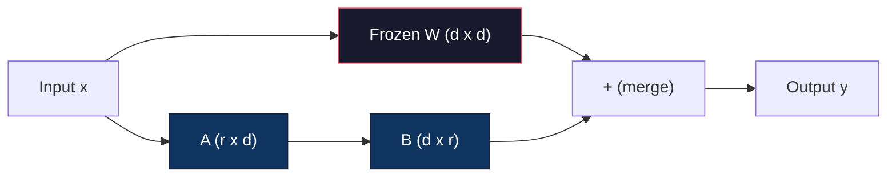
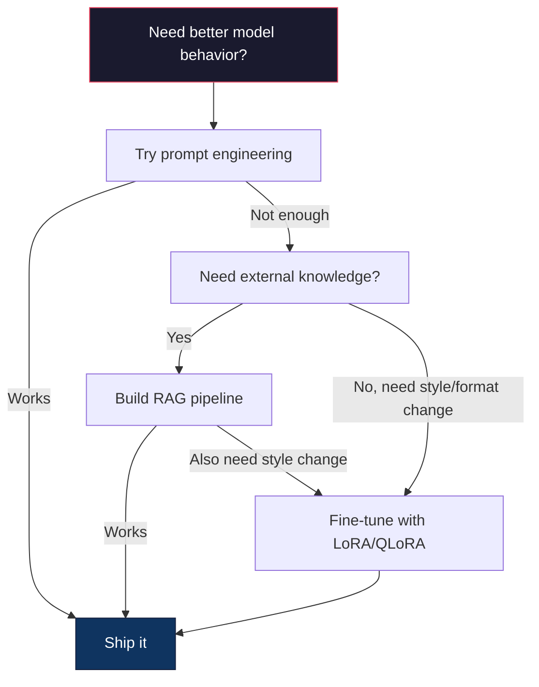

# La mise en forme avec LoRA et QLoRA .

> La mise à jour complète d'un modèle 7B nécessite 56 Go de RAM. Vous n'avez pas cela. La plupart des entreprises ne le font pas non plus. LoRA vous permet de mettre à jour le même modèle en 6 Go en entraînant moins de 1% des paramètres. Ce n'est pas un compromis - il correspond à la qualité de mise à jour complète sur la plupart des tâches. L'ensemble de l'écosystème de mise à jour open source fonctionne sur cette astuce.

> **【中文解读】**Le modèle 7B nécessite 56 Go de stockage visible. LoRA ne peut être utilisé que pour un paramètre inférieur à 1%.

> **【拓展：LoRA微调→定制大模型】**Le LORA est la technologie centrale du grand modèle de personnalisation d'entreprise: avec une petite quantité de données dans le domaine, obtenir des compétences spécialisées (comme l'analyse financière, la loi, la génération de codes, etc.)

>  **【前置】**Pour les autres, il est nécessaire de prendre en compte les caractéristiques de la formation et de la formation.`nn.Linear`- Je suis là.`backward()`- Je suis là.`optimizer.step()`4) Faces en étreignant`transformers`La loi de base de la bibliothèque.`peft`et `trl`Je suis là.

**Type:** Build | **类型:** 构建
**Languages:** Python | **语言:** Python
**Prerequisites:** Phase 10, Lesson 06 (Instruction Tuning / SFT) | **前置知识:** Phase 10 · 06（指令微调/SFT）
**Time:** ~75 minutes | **时间:** ~75 分钟
**Related:**La phase 10 couvre les boucles SFT/DPO à partir de zéro. Cette leçon les branche dans les kits d'outils PEFT 2026 (PEFT, TRL, Unsloth, Axolotl, LLaMA-Factory).**相关:**La phase 10 de la phase de démarrage de la SFT/DPO cycle.

## Objectifs d'apprentissage

- Implémentation de l'AER par injection de matrices adaptatrices de basse qualité (A et B) dans les couches d'attention d'un modèle prétrainé
  通过向预训练模型的注意力层注入低秩适配矩阵(A 和 B) réaliser LoRA
- Calculer les économies de paramètres de LoRA par rapport à l'ajustement complet: ranger r avec d_modèle dimensions trains 2*r*d paramètres au lieu de d^2
  计算 LoRA vs 全量微调的参数节省:秩 r 配 d_model 维度训练 2*r*d 参数而不是 d^2
- Télégraphie d'un modèle à l'aide de QLoRA (4 bits de base quantifiée + adaptateurs LoRA) pour s'intégrer dans la mémoire GPU du consommateur
  Utilisez QLoRA(4-bit 量化基础模型 + LoRA 适配器) Modèle micro afin d'adapter le niveau de consommation GPU en mémoire
- Réunir les poids LoRA dans le modèle de base pour le déploiement et comparer la vitesse d'inférence avec et sans adaptateurs
  Le modèle de base utilisé pour le déploiement de l'AER est de taille moyenne et de vitesse de déploiement de l'adaptateur

> **【中文解读】**Le but de ce cours est de réaliser des paramètres à haute efficacité et à faible modification.


## Le problème , l' introduction du problème

Vous avez un modèle de base. Llama 3 8B. Vous voulez qu'il réponde aux billets de support client dans la voix de votre entreprise. SFT est la réponse. Mais SFT a un problème de coût.

> Vous avez un modèle de base. Vous voulez que cela utilise le langage de votre entreprise pour répondre aux demandes de clients.

Llama 3 8B a 8 milliards de paramètres. En fp16, chaque paramètre prend 2 octets. C'est 16 Go juste pour charger les poids. Pendant l'entraînement, vous avez également besoin de gradients (16 Go), d'états d'optimisation pour Adam (32 Go pour la dynamique + variance) et d'activations. Total: environ 56 Go de VRAM pour un seul modèle 8 B.

> Les paramètres de chaque module sont de 8B, de 8B et de 8B. Les paramètres de chaque module sont de 8B et de 8B. Les paramètres de chaque module sont de 8B et de 8B.

Un A100 de 80 Go peut à peine s'adapter à ça.$3-4/hour on cloud providers. Training for 3 epochs on 50,000 examples takes 6-10 hours. That's $30-40 par expérience, 10 expériences pour obtenir les hyperparametres correctement et vous avez dépensé 400 $ avant de déployer quoi que ce soit.

> Un A100 80 Go est en train de se déployer.$3-4。在 50,000 个样本上训练 3 个 epoch 需要 6-10 小时。每次实验 $30 à 40

Il y a aussi un problème plus profond. L'ajustement complet modifie chaque poids du modèle. Si vous ajustez les données de support client, vous pouvez dégrader les capacités générales du modèle. On appelle cela l'oubli catastrophique. Le modèle s'améliore dans votre tâche et pire dans tout le reste.

> Il y a aussi un problème plus profond. Tout paramètre modifie le poids de chaque modèle. Si vous modifiez les données du client, cela peut réduire la capacité générale du modèle.

Vous avez besoin d'une méthode qui entraîne moins de paramètres, utilise moins de mémoire et ne détruit pas les connaissances existantes du modèle.

> Vous avez besoin d'un entraînement avec moins de paramètres, d'une utilisation de moins de mémoire, sans détruire les méthodes de connaissances existantes du modèle.

>  **【类比】**L'écriture de chaque livre est une réécriture complète, et le travail est facile à faire.

## Le concept de base.

> **【中文解读】**LoRA(Low-Rank Adaptation) est une méthode de base de PEFT: 结原始权重, 结仅训练低秩分解矩阵(A*B), qui permettra de former des paramètres de plusieurs milliards de dollars à plusieurs millions de dollars.

> **【拓展：LoRA 的工程实践】**Le classement de LoRA est généralement de 8 à 64 et est utilisé pour Q/V 投影矩阵效果最好──QLoRA(4-bit 基础模型 + LoRA) 让你在单张 RTX 4090 上微调 Llama-3-8B──HuggingFace PEFT库 让 LoRA 微调几行代码即可实现──LoRA's cost is about to the whole parameter of 1/10, and the effect is close──

> 🤔 **【困惑】**Q: QLoRA est quoi? et LoRA 区别? A: QLoRA = LoRA quantifié。 modèle de base avec 4 bits de quantification(NF4) stockage, LoRA 适配器 avec bf16 训练。 ainsi 16GB de Llama-3-8B 权重压缩到4GB,加上 LoRA 训练开销(约100MB),总共 6GB 显存就能微调单张 RTX 4090 / 3090 即可──代价: entraînement rapide par rapport à pure LoRA 慢约30%(因为要边反量化边缘向前),但成本可控──


### L'adaptation à un niveau inférieur

Edward Hu et ses collègues de Microsoft ont publié LoRA en juin 2021. L'idée du papier: les mises à jour de poids lors de la mise à jour fine ont un rang intrinsèque faible. Vous n'avez pas besoin de mettre à jour tous les 16,7 millions de paramètres dans une matrice de poids 4096x4096. Les informations utiles dans la mise à jour peuvent être capturées par une matrice de rang 16 ou 32.

> Edward Hu et Microsoft ont également publié en juin 2021 LoRA。论文洞察:微调期间权重更新具有低内在排列──你不需要更新 4096x4096 权重矩阵中全部1670万参数──更新中的有用信息可被排列16或32的矩阵捕获──

> 🤔 **【困惑】**Q: Pourquoi le modèle de base peut-il capter des informations de mise à jour ? A: Observation empiriqueAghajanyan et autres) 2020) Découvrez que le poids du modèle de formation préalable est très faibleΔW en interne dimension (dimension intrinsèque) sur une nouvelle tâche, généralement de quelques centaines à plusieurs milliers de points de capacité.

Voici les mathématiques. Une couche linéaire standard compute:

> Numérologie comme ci-dessous:

```
y = Wx
```

où W est une matrice d_out x d_in. pour une projection d'attention 4096x4096, c'est 16 777 216 paramètres.

> Parmi eux, W est d_out x d_in 矩阵. Pour 4096x4096 attention force projection, c'est 16,777,216 个参数.

LoRA congèle W et ajoute une décomposition de faible rang:

> LoRA 结 W 并添加低序分解:

> ️ **【易错点】**Il y a trois cratères:**秩 r 设太大**r=64 起步就太大,参数接近全量微调,省显存优势消失;起点 r=8 或 r=16,效果不够再加倍──(2) **target_modules 选错**Je ne suis pas là.`q_proj`L'effet de la loi est limité, la pratique standard est`["q_proj", "v_proj", "k_proj", "o_proj"]`En plus, plus d'activités peuvent être ajoutées à la MLP `gate_proj`- Je suis là.`up_proj`- Je suis là.`down_proj`◊ 3) **学习率没调高**LORA 参数 est de nouveau début, nécessite une plus grande lr que le poids de l'entraînement préalable; typique lr = 1e-4 à 3e-4 ((比全量微调的 2e-5 高 5-10 倍) 

```
y = Wx + BAx
```

où B est (d_out x r) et A est (r x d_in). Le rang r est beaucoup plus petit que d -- généralement 8, 16 ou 32.

> Parmi eux, B est (d_out x r), A est (r x d_in)  Rating r 比 d 小得多通常 8、16 或 32。

Pour r=16 sur une couche de 4096x4096:
- Paramètres originaux: 4096 x 4096 = 16 777 216
- Paramètres de l'AEM: (4096 x 16) + (16 x 4096) = 65 536 + 65 536 = 131 072
- Réduction: 131.072 / 16.777.216 = 0,78%

> Pour 4096x4096 de couche, r = 16:
> - Parmi les éléments de base:
> - Le nombre de points de vente est de 4096 x 16) + (16 x 4096) = 65 536 + 65 536 = 131 072
> - 减少:131,072 / 16,777,216 = 0,78%

Vous entraînez 0,78% des paramètres et obtenez 95-100% de la qualité.

> Vous avez obtenu des résultats de formation de 0,78%, obtenu des résultats de 95 à 100%.



A est initialisé avec un gaussien aléatoire. B est initialisé à zéro. Cela signifie que la contribution LoRA commence à zéro - le modèle commence à s'entraîner à partir de son comportement initial et apprend progressivement l'adaptation.

> A utiliser随机高斯初始化. B初始化为零.

### Le facteur d'échelle: Alpha

LoRA introduit un facteur d'échelle alpha qui contrôle la quantité d'effet de la mise à jour de basse qualité sur la sortie:

> L'introduction de l'indice alpha de réduction de l'indice de réduction de l'indice alpha de réduction de l'indice de réduction de l'indice de réduction de l'indice de réduction de l'indice de réduction de l'indice de réduction de l'indice de réduction de l'indice d'indice de réduction de l'indice d'indice de réduction de l'indice d'indice d'indice de réduction de l'indice d'indice d'indice de réduction de l'indice de réduction de l'indice d'indice de réduction de l'indice de réduction de l'indice de réduction de l'indice de réduction de l'indice de réduction de l'indice de réduction de l'indice de réduction de l'indice de réduction de l'indice de réduction de l'indice de réduction de réduction de l'indice de réduction de l'indice de réduction de réduction de l'indice de réduction de réduction de l'indice de réduction de réduction de l'indice de réduction de réduction de l'indice de réduction de réduction de l'indice de réduction de réduction de l'indice de réduction de réduction de réduction de l'indice de réduction de réduction de l'indice de réduction de réduction de la valeur de l'indice de réduction de l'indice de réduction de réduction de l'indice de réduction de l'indice de réduction de réduction de la valeur de l'indice de l'indice de réduction de l'indice de réduction de la valeur de l'indice de l'indice de réduction de l'indice de réduction de l'indice de réduction de l'indice de l'indice de réduction de l'indice de réduction de l'indice de l'indice de l'indice de l'indice de l'indice de l'indice de l'indice de l'indice de l'indice de l'indice de l'indice de l'indice de l'indice de l'indice de l'indice de l'indice de l'indice de l'indice de l'indice de l'indice de l'indice de l'indice

```
y = Wx + (alpha / r) * BAx
```

Lorsque alpha = r, l'échelle est de 1x. Lorsque alpha = 2r (le défaut commun), l'échelle est de 2x. Cet hyperparamètre contrôle le taux d'apprentissage du parcours LoRA indépendamment du taux d'apprentissage de base.

> Lorsque alpha = r, réduit à 1x。 lorsque alpha = 2r(connues généralement), réduit à 2x。 ce superparamètre est indépendant du taux d'apprentissage de base contrôlant le taux d'apprentissage de LoRA 路径。

Conseils pratiques:
- alpha = 2 * rank est une convention commune de la communauté (le papier original utilisé alpha = rank dans la plupart des expériences)
  alpha = 2 * rang est habituel
- alpha = rang donne une échelle de 1x, conservatrice mais stable
  alpha = rang 给 1x 缩放, conservé mais stable
- L'alpha plus élevé signifie des mises à jour plus importantes par étape, ce qui peut accélérer la convergence ou provoquer une instabilité
  Alpha plus élevé signifie que chaque étape est plus importante, peut accélérer la réception ou entraîner une instabilité

### Où appliquer le LoRA

Un transformateur a de nombreuses couches linéaires. Vous n'avez pas besoin d'ajouter LoRA à toutes.

> Le transformateur a beaucoup de couches de lignes.

| Target Layers | Trainable Params (7B) | Quality |
|--------------|----------------------|---------|
| q_proj only / 仅 q_proj | 4.7M | Good / 好 |
| q_proj + v_proj | 9.4M | Better / 更好 |
| q_proj + k_proj + v_proj + o_proj | 18.9M | Best for attention / 注意力最佳 |
| All linear (attention + MLP) / 所有线性层 | 37.7M | Marginal gain, 2x params / 边际收益、2 倍参数 |

Le point de départ pour la plupart des tâches: q_proj + v_proj. Cela cible la requête et les projections de valeur en auto-attention, qui contrôlent ce que le modèle attend et quelles informations il extrait.

> La plupart des tâches sont les meilleurs: Q_proj + v_proj. Ceci est destiné à la recherche et à la projection de la valeur de l'attention personnelle, à contrôler le modèle de la concentration de ce qu'il contient.

### Sélection de rang

Le rang r contrôle l'expressivité de l'adaptation:

> 秩 r 控制适应的表现能力:

| Rank | Trainable Params (per layer) | Best For |
|------|---------------------------|----------|
| 4 | 32,768 | Simple classification, sentiment / 简单分类、情感 |
| 8 | 65,536 | Single-domain Q&A, summarization / 单领域问答、摘要 |
| 16 | 131,072 | Multi-domain tasks, instruction following / 多领域任务、指令遵循 |
| 32 | 262,144 | Complex reasoning, code generation / 复杂推理、代码生成 |
| 64 | 524,288 | Diminishing returns for most tasks / 大多数任务回报递减 |
| 128 | 1,048,576 | Rarely justified / 很少合理 |

Hu et coll. ont montré que r=4 capture déjà la plupart de l'adaptation pour des tâches simples. r=8 et r=16 sont les choix les plus courants dans la pratique.

> Hu 等人 montre que la plupart des adaptations de r=4  déjà capturées de tâches simples  R=8 和 r=16 sont les options les plus courantes  R=64  très peu améliorent la qualité et commencent à perdre l'avantage de l'inventaire de LoRA 

### QLoRA: Quantification à 4 bits + LoRA

Tim Dettmers et ses collègues de l'Université de Washington ont publié QLoRA en mai 2023.

> Tim Dettmers et ses collègues de l'Université de Washington ont publié QLoRA en mai 2023[6].

Cela change considérablement l'équation de mémoire:

> Cela a changé considérablement la formule de l'inventaire:

| Method | Weight Memory (7B) | Training Memory (7B) | GPU Required |
|--------|-------------------|---------------------|-------------|
| Full fine-tune (fp16) | 14GB | ~56GB | 1x A100 80GB |
| LoRA (fp16 base) | 14GB | ~18GB | 1x A100 40GB |
| QLoRA (4-bit base) | 3.5GB | ~6GB | 1x RTX 3090 24GB |

QLoRA apporte trois contributions techniques:

> QLoRA a effectué trois contributions techniques:

**NF4 (Normal Float 4-bit)**Le NF4 place ses 16 niveaux de quantification aux quantiles d'une distribution normale standard. C'est une information théoriquement optimale pour les données normalement distribuées. Il perd moins d'informations que la quantification uniforme à 4 bits (INT4) ou la float4 standard.

> **NF4（Normal Float 4-bit）**Le pouvoir du réseau neural est un nouveau type de données conçu spécifiquement pour le poids du réseau neural. Le pouvoir du réseau neural est un élément majeur de la répartition normale.

**Double quantization**Les constantes de quantification elles-mêmes prennent la mémoire. Chaque bloc de 64 poids a besoin d'un facteur d'échelle fp32 (4 octets). Pour un modèle 7B, c'est un supplément de 0,4 GB. La double quantification quantifie ces constantes à fp8, réduisant le coût général à 0,1 GB. Petit mais il s'additionne.

> **双重量化**Pour les modèles 7B, c'est une somme supplémentaire de 0,4 Go. La double pondération va réduire la quantité de ces modèles à 0,1 Go.

**Paged optimizers**Les optimistes de pages utilisent la mémoire unifiée de NVIDIA pour automatiquement rediriger les états d'optimisation vers la RAM du processeur lorsque la mémoire du GPU est épuisée et les rediriger au besoin. Cela empêche les pannes OOM au prix d'un certain débit.

> **分页优化器**Pendant la formation, le long séquence sur l'état de l'optimisateur peut dépasser le GPU.

### La question de la qualité

La réduction des paramètres ou la quantification de la base nuisent-elles à la qualité?

> ∆ réduire les paramètres ou la quantification de base est-il dommageable à la qualité?

| Method | MMLU (5-shot) | MT-Bench | HumanEval |
|--------|--------------|----------|-----------|
| Full fine-tune (Llama 2 7B) / 全量微调 | 48.3 | 6.72 | 14.6 |
| LoRA r=16 | 47.9 | 6.68 | 14.0 |
| QLoRA r=16 (NF4) | 47.5 | 6.61 | 13.4 |
| QLoRA r=64 (NF4) | 48.1 | 6.70 | 14.2 |

Le LoRA à r=16 est à moins de 1% de la réglage fine complète sur la plupart des critères de référence.

> Le QLoRA de r=16 est en réalité compatible avec la totalité des modèles de la plupart des bases et avec la différence de 1% à l'intérieur.

### Coûts réels

Llama 3 8B à régler sur 50 000 exemplaires (3 époques):

> Dans les 50 000 exemples, il y a trois épisodes:

| Method | GPU | Time | Cost |
|--------|-----|------|------|
| Full fine-tune / 全量微调 | 2x A100 80GB | 8 hours | ~$32 |
| LoRA r=16 | 1x A100 40GB | 4 hours | ~$8 |
| QLoRA r=16 | 1x RTX 4090 24GB | 6 hours | ~$5 |
| QLoRA r=16 (Unsloth) | 1x RTX 4090 24GB | 2.5 hours | ~$2 |
| QLoRA r=16 | 1x T4 16GB | 12 hours | ~$4 |

C'est pourquoi la communauté de réglage des poids ouverts a explosé en 2023 et pourquoi chaque cadre de formation inférieur à celui-ci expédie QLoRA par défaut en 2026.

> C'est la raison pour laquelle le QLoRA a été mis en place en 2023, et c'est aussi la raison pour laquelle tous les cadres de formation de 2026 ont été mis en place en 2026.

### La pile PEFT 2026

| Framework | What it is | Pick when |
|-----------|-----------|-----------|
| **Hugging Face PEFT** | The canonical LoRA/QLoRA/DoRA/IA3 library / 标准 LoRA/QLoRA/DoRA/IA3 库 | You want raw control and your training loop is already on `transformers.Trainer` / 想要原始控制且训练循环已在 `transformers.Trainer` 上 |
| **TRL** | HF's reinforcement-from-feedback trainers (SFT, DPO, GRPO, PPO, ORPO) / HF 反馈强化学习训练器 | You need DPO/GRPO after SFT; built on top of PEFT / SFT 后需要 DPO/GRPO；构建于 PEFT 之上 |
| **Unsloth** | Triton-kernel rewrite of the forward/backward pass / 前向/反向传播的 Triton 内核重写 | You want 2-5x speedup + half the VRAM with no accuracy loss; Llama/Mistral/Qwen family / 想要 2-5 倍加速 + 一半 VRAM 无精度损失；Llama/Mistral/Qwen 家族 |
| **Axolotl** | YAML-config wrapper over PEFT + TRL + DeepSpeed + Unsloth / PEFT + TRL + DeepSpeed + Unsloth 的 YAML 配置封装 | You want reproducible, version-controlled training runs / 想要可重现、版本控制的训练运行 |
| **LLaMA-Factory** | GUI/CLI/API over PEFT + TRL / PEFT + TRL 的 GUI/CLI/API | You want zero-code fine-tuning; 100+ model families supported / 想要零代码微调；支持 100+ 模型家族 |
| **torchtune** | Native PyTorch recipes, no `transformers` dep / 原生 PyTorch 配方，无 `transformers` 依赖 | You want minimal deps and your org already standardizes on PyTorch / 想要最小依赖且组织已标准化于 PyTorch |

Règle générale: utilisation de la recherche ou expérimentation ponctuelle → PEFT. Pipeline de production répétée → Axolotl avec noyaux Unsloth activés. Prototypage jetable → LLaMA-Factory.

> 经验法则:研究或一次性实验 → PEFT──可重复生产管线 → 启用 Unsloth 内核的 Axolotl──抛弃式原型 → LLaMA-Factory──

### Les adaptateurs de fusion

Après l'entraînement, vous avez deux choses: le modèle de base gelé et un petit adaptateur LoRA (généralement 10 à 100 Mo).

> Après l'entraînement, vous avez deux choses: un modèle de base et un petit adaptateur LoRA.

1. **Keep them separate**: Charger le modèle de base, charger l'adaptateur en haut. Swap adaptateurs pour différentes tâches. C'est ainsi que vous servez plusieurs variantes finement réglées d'un modèle de base.

   **保持分离**: Charger un modèle de base, surcharger un adaptateur. Pour différentes tâches, changer un adaptateur.

2. **Merge them permanently**: Compute W' = W + (alpha/r) * BA et conserve le résultat en tant que nouveau modèle complet. Le modèle fusionné est de la même taille que l'original. Aucun débit d'inférence. Aucun adaptateur à gérer.

   **永久合并**: calcul W' = W + (alpha/r) * BA 并将结果保存为新完整模型──合并后模型与原始相同大小──无推理开销──无适配器需管理──

Pour effectuer plusieurs tâches (adaptateur de support client, adaptateur de code, adaptateur de traduction), gardez-les séparées.

> 服务多个任务(客服适配器、代码适配器、翻译适配器) garder la séparation──部署单一专用模型则合并──

Techniques de fusion avancées pour combiner plusieurs adaptateurs:

> 组合多个适配器的高级合并技术:

- **TIES-Merging**(Yadav et coll. 2023): Trims paramètres de petite taille, résolve les conflits de signalisation, puis fusionne. Réduit l'interférence entre les adaptateurs.
  修剪小幅度参数, résoudre les conflits, puis合并──减少适配器间干扰──
- **DARE**(Yu et coll. 2023): Il dépose aléatoirement les paramètres de l'adaptateur avant de fusionner et rééchelle le reste.
  合并前随机丢弃适配器参数并重新缩放其余参数──组合能力效果惊──
- **Task arithmetic**L'ajout d'un adaptateur "code" et d'un adaptateur "mathématique" produit souvent un modèle bon pour les deux.
  简单加或减适配器权重. 加"代码"适配器和"数学"适配器通常, les deux sont très bons modèles.

### Quand ne pas régler

Le réglage est la troisième option, pas la première.

> La petite modification est la troisième option, pas la première.

**First: prompt engineering.**Écrivez une meilleure mise à jour du système. Ajoutez quelques exemples. Utilisez la chaîne de pensée. Cela ne coûte rien et prend des minutes. Si la mise à jour vous obtient 80% du chemin, vous n'avez probablement pas besoin de régler.

> **第一：提示工程。**写更好的系统提示――加少样本示例――用思维链――这零成本――几分钟――如果提示能完成80%,你可能不需要微调――

**Second: RAG.**Si le modèle a besoin de connaître vos données spécifiques (documents, base de connaissances, catalogue de produits), la récupération est moins chère et plus maîtrisable que la mise en poids.

> **第二：RAG。**Si le modèle a besoin de connaître vos données spécifiques, le processus de recherche est plus facile à réaliser que le grillement.

**Third: fine-tuning.**Utilisez ceci lorsque vous avez besoin du modèle pour adopter un style, un format ou un motif de raisonnement spécifique qui ne peuvent pas être atteints par la demande. Lorsque vous avez besoin d'une sortie structurée cohérente. Lorsque vous devez distiller un modèle plus grand en un modèle plus petit. Lorsque la latence est importante et que vous ne pouvez pas vous permettre les jetons supplémentaires à partir de quelques coups de demande.

> **第三：微调。**Lorsque vous avez besoin d'un modèle à adopter un style spécifique, un format ou un modèle de suggestion (c'est impossible de le faire) lorsque vous avez besoin d'un modèle structuré cohérent et de son output.



## Construisez-le et mettez-le en œuvre.
```figure
lora-params
```

## Faites-le

Nous mettons en œuvre LoRA à partir de zéro dans PyTorch pur. Pas de bibliothèques. Pas de magie. Vous construirez la couche LoRA, l'injectez dans un modèle, l'entraînez, et fusionnez les poids.

> Nous utilisons PyTorch pur de zéro pour réaliser LoRA.

### Étape 1: L'épaisseur de la LORA

```python
import torch
import torch.nn as nn
import math

class LoRALayer(nn.Module):
    def __init__(self, in_features, out_features, rank=8, alpha=16):
        super().__init__()
        self.rank = rank
        self.alpha = alpha
        self.scaling = alpha / rank

        self.A = nn.Parameter(torch.randn(in_features, rank) * (1 / math.sqrt(rank)))
        self.B = nn.Parameter(torch.zeros(rank, out_features))

    def forward(self, x):
        return (x @ self.A @ self.B) * self.scaling
```

A est initialisé avec des valeurs aléatoires à l'échelle. B est initialisé à zéro. Le produit BA commence à zéro, donc le modèle commence avec son comportement original.

> A utilisez la valeur de la valeur de la valeur initiale.

### Étape 2: Layer linéaire enveloppé en LoRA

```python
class LinearWithLoRA(nn.Module):
    def __init__(self, linear, rank=8, alpha=16):
        super().__init__()
        self.linear = linear
        self.lora = LoRALayer(
            linear.in_features, linear.out_features, rank, alpha
        )

        for param in self.linear.parameters():
            param.requires_grad = False

    def forward(self, x):
        return self.linear(x) + self.lora(x)
```

La couche linéaire originale est gelée. Seuls les paramètres LoRA (A et B) sont entraînables.

> Le niveau de formation est de la seule classe de formation possible.

### Étape 3: Injecter du LoRA dans un modèle

```python
def inject_lora(model, target_modules, rank=8, alpha=16):
    for param in model.parameters():
        param.requires_grad = False

    lora_layers = {}
    for name, module in model.named_modules():
        if isinstance(module, nn.Linear):
            if any(t in name for t in target_modules):
                parent_name = ".".join(name.split(".")[:-1])
                child_name = name.split(".")[-1]
                parent = dict(model.named_modules())[parent_name]
                lora_linear = LinearWithLoRA(module, rank, alpha)
                setattr(parent, child_name, lora_linear)
                lora_layers[name] = lora_linear
    return lora_layers
```

Tout d'abord, congélez tous les paramètres du modèle, puis marchez sur l'arbre du modèle, trouvez des couches linéaires correspondant à vos noms cibles et remplacez-les par des versions enveloppées de LoRA. Les matrices LoRA A et B sont les seuls paramètres entraînables dans l'ensemble du modèle.

> Tout d'abord, 结模型中的所有参数──然后遍历模型树, trouver la couche线性的匹配目标名称, utiliser LoRA 包装版本 pour les remplacer──LoRA A 和 B矩阵是整个模型中的唯一可训练的参数──

### Étape 4: Compte des paramètres

```python
def count_parameters(model):
    total = sum(p.numel() for p in model.parameters())
    trainable = sum(p.numel() for p in model.parameters() if p.requires_grad)
    frozen = total - trainable
    return {
        "total": total,
        "trainable": trainable,
        "frozen": frozen,
        "trainable_pct": 100 * trainable / total if total > 0 else 0
    }
```

### Étape 5: Réunir les poids

```python
def merge_lora_weights(model):
    for name, module in model.named_modules():
        if isinstance(module, LinearWithLoRA):
            with torch.no_grad():
                merged = (
                    module.lora.A @ module.lora.B
                ) * module.lora.scaling
                module.linear.weight.data += merged.T
            parent_name = ".".join(name.split(".")[:-1])
            child_name = name.split(".")[-1]
            if parent_name:
                parent = dict(model.named_modules())[parent_name]
            else:
                parent = model
            setattr(parent, child_name, module.linear)
```

Après la fusion, les couches LoRA sont perdues. le modèle est de la même taille que l'original avec l'adaptation cuite dans les poids.

> 合并后 LoRA 层消失──模型与原始大小相同,适应烤进权重──无推理开销──

### Étape 6: Quantification QLoRA simulée

```python
def quantize_to_nf4(tensor, block_size=64):
    blocks = tensor.reshape(-1, block_size)
    scales = blocks.abs().max(dim=1, keepdim=True).values / 7.0
    scales = torch.clamp(scales, min=1e-8)
    quantized = torch.round(blocks / scales).clamp(-8, 7).to(torch.int8)
    return quantized, scales

def dequantize_from_nf4(quantized, scales, original_shape):
    dequantized = quantized.float() * scales
    return dequantized.reshape(original_shape)
```

Il simule la quantification à 4 bits en cartographiant les poids en 16 niveaux distincts dans des blocs de 64.

> Il est utilisé pour la production de QLoRA en utilisant des bits et des bytes de stockage sur la GPU pour réaliser un véritable NF4[2].

### Étape 7: La formation

```python
def train_lora(model, data, epochs=5, lr=1e-3, batch_size=4):
    optimizer = torch.optim.AdamW(
        [p for p in model.parameters() if p.requires_grad], lr=lr
    )
    criterion = nn.MSELoss()

    losses = []
    for epoch in range(epochs):
        epoch_loss = 0.0
        n_batches = 0
        indices = torch.randperm(len(data["inputs"]))

        for i in range(0, len(indices), batch_size):
            batch_idx = indices[i:i + batch_size]
            x = data["inputs"][batch_idx]
            y = data["targets"][batch_idx]

            output = model(x)
            loss = criterion(output, y)

            optimizer.zero_grad()
            loss.backward()
            optimizer.step()

            epoch_loss += loss.item()
            n_batches += 1

        avg_loss = epoch_loss / n_batches
        losses.append(avg_loss)

    return losses
```

### Étape 8: Démo complète

```python
def demo():
    torch.manual_seed(42)
    d_model = 256
    n_classes = 10

    model = nn.Sequential(
        nn.Linear(d_model, 512),
        nn.ReLU(),
        nn.Linear(512, 512),
        nn.ReLU(),
        nn.Linear(512, n_classes),
    )

    n_samples = 500
    x = torch.randn(n_samples, d_model)
    y = torch.randint(0, n_classes, (n_samples,))
    y_onehot = torch.zeros(n_samples, n_classes).scatter_(1, y.unsqueeze(1), 1.0)

    data = {"inputs": x, "targets": y_onehot}

    params_before = count_parameters(model)

    lora_layers = inject_lora(
        model, target_modules=["0", "2"], rank=8, alpha=16
    )

    params_after = count_parameters(model)

    losses = train_lora(model, data, epochs=20, lr=1e-3)

    merge_lora_weights(model)
    params_merged = count_parameters(model)

    return {
        "params_before": params_before,
        "params_after": params_after,
        "params_merged": params_merged,
        "losses": losses,
    }
```

La démo crée un petit modèle, injecte le LoRA en deux couches, l'entraîne et regroupe les poids. Le nombre de paramètres passe de plein entraînement à ~1% entraînement pendant la formation LoRA, puis revient à l'architecture originale après la fusion.

> 演示 créer un petit modèle  Injecter LoRA jusqu'à deux niveaux  entraîner  Co-équipement de reprise 

## Utilisez-le avec le cadre de réalisation

Avec l'écosystème Hugging Face, LoRA sur un modèle réel prend environ 20 lignes:

> Avec le visage en étreinte, le modèle réel sur le LoRA ne prend que 20 pages:

```python
from transformers import AutoModelForCausalLM, AutoTokenizer
from peft import LoraConfig, get_peft_model, TaskType

model = AutoModelForCausalLM.from_pretrained("meta-llama/Llama-3.1-8B")
tokenizer = AutoTokenizer.from_pretrained("meta-llama/Llama-3.1-8B")

lora_config = LoraConfig(
    task_type=TaskType.CAUSAL_LM,
    r=16,
    lora_alpha=32,
    lora_dropout=0.05,
    target_modules=["q_proj", "v_proj"],
)

model = get_peft_model(model, lora_config)
model.print_trainable_parameters()
```

Pour QLoRA, ajoutez la quantification des bits et des bytes:

> pour QLoRA, ajouter des bits et desbytes quantité:

```python
from transformers import BitsAndBytesConfig

bnb_config = BitsAndBytesConfig(
    load_in_4bit=True,
    bnb_4bit_quant_type="nf4",
    bnb_4bit_compute_dtype=torch.bfloat16,
    bnb_4bit_use_double_quant=True,
)

model = AutoModelForCausalLM.from_pretrained(
    "meta-llama/Llama-3.1-8B",
    quantization_config=bnb_config,
    device_map="auto",
)

model = get_peft_model(model, lora_config)
```

C'est tout. La même boucle d'entraînement, le même pipeline de données. Le modèle de base vit maintenant en 4 bits, les adaptateurs LoRA s'entraînent en fp16, et tout se passe en 6 Go.

Pour l' entraînement avec le coach de visage en étreignant:

```python
from transformers import TrainingArguments, Trainer
from datasets import load_dataset

dataset = load_dataset("tatsu-lab/alpaca", split="train[:5000]")

training_args = TrainingArguments(
    output_dir="./lora-llama",
    num_train_epochs=3,
    per_device_train_batch_size=4,
    gradient_accumulation_steps=4,
    learning_rate=2e-4,
    fp16=True,
    logging_steps=10,
    save_strategy="epoch",
    optim="paged_adamw_8bit",
)

trainer = Trainer(
    model=model,
    args=training_args,
    train_dataset=dataset,
)

trainer.train()

model.save_pretrained("./lora-adapter")
```

L'adaptateur enregistré est de 10 à 100 Mo. Le modèle de base reste intact. Vous pouvez partager les adaptateurs sur le Hub Face Hugging sans redistribuer le modèle complet.

## Envoyez-le . Produit .

Cette leçon donne:
- `outputs/prompt-lora-advisor.md`-- une requête qui vous aide à décider du classement LoRA, des modules cibles et des hyperparametres pour votre tâche spécifique
- `outputs/skill-fine-tuning-guide.md`- une compétence qui enseigne aux agents l'arbre de décision pour quand et comment affiner

## Les exercices

1. **Rank ablation study.**Exécutez la démo avec les rangs 2, 4, 8, 16, 32 et 64. Plot final perte vs rang. Trouver le point de rendement diminuant où doubler le rang ne réduit plus la perte de moitié. Pour une simple tâche de classification sur les caractéristiques 256-dim, cela devrait être autour de r = 8-16.

2. **Target module comparison.**Modifiez inject_lora pour cibler uniquement la couche "0", uniquement la couche "2", uniquement la couche "4", et les trois. Exercez chaque variante pendant 20 époques. Comparer la vitesse de convergence et la perte finale. Cela reflète la décision réelle de cibler q_proj vs v_proj vs toutes les couches linéaires.

3. **Quantization error analysis.**Prenez les matrices de poids du modèle formé avant et après quantize_to_nf4 / dequantize_from_nf4. Computez l'erreur carrée moyenne, l'erreur maximale absolue et la corrélation entre les poids originaux et reconstitués.

4. **Multi-adapter serving.**Prenez deux adaptateurs LoRA sur différents sous-ensembles de données (même indices contre indices imparts). Salvez les deux adaptateurs. Chargez le modèle de base une fois, puis changez les adaptateurs et vérifiez que chacun produit des sorties différentes sur la même entrée. C'est ainsi que les systèmes de production servent plusieurs modèles finement réglés à partir d'une base.

5. **Merge vs. unmerged inference.**Comparez la sortie du modèle LoRA avant et après les poids de merge_lora sur les mêmes entrées 100. Vérifiez que les sorties sont identiques (dans la tolérance à point flottant de 1e-5).

## Les termes clés

| Term | What people say | What it actually means | 中文释义 |
|------|----------------|----------------------|---------|
| LoRA | "Efficient fine-tuning" | Low-Rank Adaptation: freeze base weights, train two small matrices A and B whose product approximates the full weight update | |
| QLoRA | "Fine-tune on a laptop" | Quantized LoRA: load the base model in 4-bit NF4, train LoRA adapters in fp16 on top, enabling 7B fine-tuning in 6GB VRAM | |
| Rank (r) | "How much the model can learn" | The inner dimension of the A and B matrices; controls expressiveness vs. parameter count | |
| Alpha | "LoRA learning rate" | Scaling factor applied to the LoRA output; alpha/r scales the adaptation's contribution to the final output | |
| NF4 | "4-bit quantization" | Normal Float 4: a 4-bit data type with quantization levels at normal distribution quantiles, optimal for neural network weights | |
| Adapter | "The small trained part" | The LoRA A and B matrices saved as a separate file (10-100MB), loadable on top of any copy of the base model | |
| Target modules | "Which layers to LoRA" | The specific linear layers (q_proj, v_proj, etc.) where LoRA adapters are injected | |
| Merging | "Bake it in" | Computing W + (alpha/r) * BA and replacing the original weight, eliminating the adapter overhead at inference | |
| Paged optimizers | "Don't OOM during training" | Offloading optimizer states (Adam momentum, variance) to CPU when GPU memory is exhausted | |
| Catastrophic forgetting | "Fine-tuning broke everything else" | When updating all weights causes the model to lose previously learned capabilities | |

## Encore une lecture

- Hu et coll., "LoRA: Adaptation à bas rang de modèles de langage de grande taille" (2021) -- le document original introduisant la méthode de décomposition à bas rang, testé sur GPT-3 175B avec un rang aussi bas que 4
- Dettmers et coll., "QLoRA: Finetuning efficace des modèles de langage quantifié" (2023) -- introduit NF4, double quantification et optimisateurs page, permettant 65B de finetuning sur un seul GPU de 48 Go
- Documentation de la bibliothèque PEFT (huggingface.co/docs/peft) - la bibliothèque standard pour les méthodes LoRA, QLoRA et autres méthodes efficaces en termes de paramètres dans l'écosystème Hugging Face
- Yadav et coll., "TIES-Merging: résoudre les interférences lors de la fusion de modèles" (2023) -- techniques pour combiner plusieurs adaptateurs LoRA sans dégradation de qualité
- [Rafailov et al., "Direct Preference Optimization: Your Language Model is Secretly a Reward Model" (NeurIPS 2023)](https://arxiv.org/abs/2305.18290)-- dérivation DPO; l'étape de réglage des préférences qui vient après la FTS, pas besoin de modèle de récompense.
- [TRL documentation](https://huggingface.co/docs/trl/)-- référence officielle pour `SFTTrainer`- Je suis là .`DPOTrainer`- Je suis là .`KTOTrainer`, et la surface d'intégration avec PEFT/bitsandbytes/Unsloth.
- [Unsloth documentation](https://docs.unsloth.ai/)-- les noyaux fusionnés qui doublent le débit de réglage fin et réduisent de moitié la mémoire; la couche de performance sous TRL.
- [Axolotl documentation](https://axolotl-ai-cloud.github.io/axolotl/)-- Formateur multi-GPU SFT/DPO/QLoRA configuré par YAML; l'alternative de configuration en code aux scripts écrits à la main.
