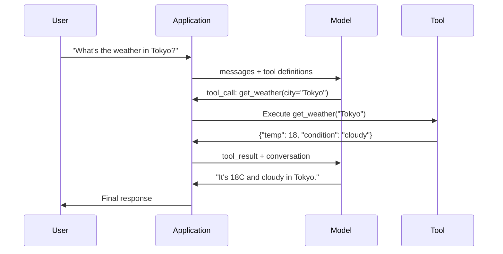

# Fonction Appel et outil Utilisation  Fonction de référencement avec outilisation

> Les LLM ne peuvent rien faire. Ils génèrent du texte. C'est toute la capacité. Ils ne peuvent pas vérifier la météo, consulter une base de données, envoyer un e-mail, exécuter un code ou lire un fichier. Chaque "agent d'IA" que vous avez vu est un LLM générant JSON qui dit quelle fonction appeler -- et ensuite votre code l'appelle réellement. Le modèle est le cerveau. Les outils sont les mains. L'appel à la fonction est le système nerveux qui les relie.

> **【中文解读】**LLM ne peut que générer du texte. Les fonctions de référencement permettent à un modèle de sortir structuré JSON.

> **【拓展：Function Calling→MCP与Agent】**Le Calling de fonction est le mécanisme central de l'agent de l'IA, le protocole MCP est basé sur la normalisation des processus de description et de mise en œuvre des outils, le protocole de base de Claude.

>  **【前置】**Pour les résultats de la phase 1, vous devez comprendre la méthode de traitement de la phase 1, et vous devez comprendre la méthode de traitement de la phase 3, et vous devez comprendre la méthode de traitement de la phase 3.

**Type:** Build | **类型:** 构建
**Languages:** Python | **语言:** Python
**Prerequisites:** Phase 11 Lesson 03 (Structured Outputs) | **前置知识:** Phase 11 · 03 (结构化输出)
**Time:** ~75 minutes | **时间:** ~75 分钟
**Related:**Phase 11 · 14 (Model Context Protocol)  quand un outil est partagé entre les hôtes, passer de l'appel de fonction inline à un serveur MCP. Cette leçon couvre le cas inline; MCP couvre le cas protocole.**相关:**Phase 11 · 14 (模型上下文协议)  Lorsque les outils doivent être partagés à travers le système de partage, de la fonction interne à la mise à niveau en MCP 服务器。 本课讲内联场景; MCP 讲协议场景。

## Objectifs d'apprentissage

- Implémenter une boucle d'appel de fonction: définir les schémas d'outils, analyser le JSON d'appel d'outils du modèle, exécuter des fonctions et retourner les résultats
  实现函数调用循环: définir un outil schéma、解析模型的工具调用 JSON、执行函数并返回结果
- Des schémas d'outils de conception avec des descriptions claires et des paramètres typés que le modèle peut invoquer de manière fiable
  Design avec une description claire et un schéma d'outils de classement des paramètres, permettant de modéliser de manière fiable
- Construire une boucle d'agent multi-tours qui enchaîne plusieurs appels de fonction pour répondre à des requêtes complexes
  Construire un agent à plusieurs cycles  cycle, chaîne  référencement à plusieurs fonctions pour répondre à des requêtes complexes
- Fonction de manipulation appelant les cas de bord: appels parallèles aux outils, propagation d'erreurs et prévention des boucles d'outils infinies
  处理函数调用边缘情况:并行工具调用、错误传播和防止无限工具循环

> **【中文解读】**Le but de ce cours est de faire en sorte que le programme de formation soit utilisé comme outil externe.


## Le problème , l' introduction du problème

Vous construisez un chatbot. Un utilisateur demande: " Quelle est la météo à Tokyo en ce moment ? "

> Vous avez construit un chat machine.

Le modèle répond: "Je n'ai pas accès à des données météorologiques en temps réel, mais en fonction de la saison, Tokyo est probablement autour de 15 degrés Celsius... "

> 模型回复 一带免责声明的幻觉答案──

C'est une hallucination déguisée en délinquant. Le modèle ne connaît pas la météo. Il ne le fera jamais. La météo change toutes les heures.

> C'est le sentiment de la libéralisation. Le modèle ne sait pas le temps, et ne le saura jamais.

La bonne réponse consiste à appeler l'API OpenWeatherMap, à obtenir la température actuelle et à retourner le nombre réel. Le modèle ne peut pas appeler les API. Votre code peut. La pièce manquante: un protocole structuré qui permet au modèle de dire "Je dois appeler l'API météo avec ces arguments" et permet à votre code de l'exécuter et de rediriger le résultat.

> Une réponse exacte: il faut utiliser l'API OpenWeatherMap. Le modèle ne peut pas utiliser l'API.

Le modèle donne des sorties JSON structurées décrivant quelle fonction à invoquer avec quels arguments. Votre application exécute la fonction. Le résultat revient dans la conversation. Le modèle utilise le résultat pour produire sa réponse finale.

> Ceci est une fonction de modification. Le modèle JSON est structuré en JSON.

Sans appel à la fonction, les LLM sont des encyclopédies.

> Il n'y a pas de fonction, LLM est un livre.

>  **【类比】**LLM 像一位"嘴强王者"能讲清楚任何概念,但不能动手──函调用就是给这位嘴强王者配一个"小弟"系统:它说"小弟,去查看东京天气"→小弟照做→回来报告"18度阴天"→它转述给用户──模型从不离开王座(生成代币),但通过发号施令(JSON) 和接收战报(工具_结果),它可以调用整个外部世界──

## Le concept de base.

> **【中文解读】**函数调用 (Function Calling) permet à la LLM de créer des requêtes de référencement structurées, et non de référencement pur.

> **【拓展：函数调用与 Agent 系统】**Le cadre d'OpenAI est basé sur la fonction de configuration de la structure. L'application réelle comprend: le modèle décide de configurer l'API de recherche pour obtenir des informations réelles, de configurer le SQL, la base de données de requêtes, de configurer Python, d'exécuter le calcul.


### La fonction qui appelle la boucle

Chaque interaction entre l'utilisation des outils suit la même boucle de 5 étapes.

> Chaque utilisation de l'outil est en 5 étapes.



Étape 1: l'utilisateur envoie un message. Étape 2: le modèle reçoit le message avec les définitions de l'outil (schéma JSON décrivant les fonctions disponibles). Étape 3: au lieu de répondre avec du texte, le modèle sort un appel d'outil -- un objet JSON structuré avec le nom de la fonction et les arguments. Étape 4: votre code exécute la fonction et capture le résultat. Étape 5: le résultat revient au modèle, qui dispose maintenant de données réelles pour produire sa réponse finale.

> Étape 1: l'utilisateur envoie des messages. Étape 2: le modèle reçoit des messages et définit les outils. Décrire le schéma JSON des fonctions disponibles. Étape 3: le modèle ne retourne pas au texte, mais utilise l'outil de sortie pour utiliser un JSON structuré contenant des noms et des paramètres de fonction. Étape 4: Votre code exécute la fonction et capture le résultat. Étape 5: le résultat retourne au modèle, le modèle a maintenant des données réelles pour générer une réponse finale.

Le modèle n'exécute jamais rien, il décide seulement de quoi appeler et avec quels arguments.

> Le modèle ne fait rien. Il décide seulement de ce qu'il utilise.

> 🤔 **【困惑】**Q: Pourquoi le modèle n'exécute pas directement le code ?**隔离** le modèle dans la boîte à outils est en sécurité à exécuter **可观测** exécuter dans votre processus, pouvoir augmenter le journal, limiter le flux, vérifier;**可移植**The same model can drive different languages (Python/JS/Go) The same model can drive different languages (Python/JS/Go) The same model can drive different languages (Python/JS/Go) The same model can drive different languages (Python/JS/Go) The same model can drive different languages (Python/JS/Go) The same model can drive different languages) The same model itself is not tied to the running time (The model itself is not tied to the running time) 

### Définitions d'outils: Le contrat de schéma JSON

Chaque outil est défini par un schéma JSON qui indique au modèle ce que fait la fonction, quels arguments il prend, et quels types de ces arguments doivent être.

> Chaque outil est défini par JSON Schema, indique au modèle ce que cette fonction doit faire, accepter ce qu'il faut paramétrer, ce type doit être.

```json
{
  "type": "function",
  "function": {
    "name": "get_weather",
    "description": "Get current weather for a city. Returns temperature in Celsius and conditions.",
    "parameters": {
      "type": "object",
      "properties": {
        "city": {
          "type": "string",
          "description": "City name, e.g. 'Tokyo' or 'San Francisco'"
        },
        "units": {
          "type": "string",
          "enum": ["celsius", "fahrenheit"],
          "description": "Temperature units"
        }
      },
      "required": ["city"]
    }
  }
}
```

Le `description`Les champs sont critiques. Le modèle les lit pour décider quand et comment utiliser l'outil. Une description vague comme " obtient la météo " produit une meilleure sélection d'outils que " Obtient la météo actuelle pour une ville. Retourne la température en Celsius et les conditions. " La description est une invitation à la sélection d'outils.

> `description`字段至关重要──模型读这些描述来决定何时以及如何使用工具──模糊描述如"获取天气"产生的工具选择效果差于"获取城市当前天气,回归摄氏度温度和天气状况"──描述本身就是工具选择的提示──

> ️ **【易错点】**工具描述的 3 个坑:(1) **描述太短** "obtenir des données" cette description, modèle分不清该用 `get_weather`Il y a aussi`get_stock_price`,会乱选;修复: chaque description au moins 30 字,写清"做什么 + 输入 + 输出"――(2) **描述互相重叠**两个工具都写"获取信息",模型选哪个全凭运气;修复:每个描述强调独特场景("获取实时天气" vs "获取历史天气")**隐藏前置条件**Bible `delete_file(path)` besoin d'abord `confirm()`, mais la description ne dit pas, le modèle sera directement supprimé;

### Comparaison des fournisseurs

Chaque fournisseur majeur prend en charge l'appel des fonctions, mais la surface de l'API est différente.

> Chaque fournisseur de services de base prend en charge la fonction de configuration, mais les interfaces API sont différentes.

| Provider | API Parameter | Tool Call Format | Parallel Calls | Forced Calling |
|----------|--------------|-----------------|---------------|----------------|
| OpenAI (GPT-5, o4) | `tools` | `tool_calls[].function` | Yes (multiple per turn) | `tool_choice="required"` |
| Anthropic (Claude 4.6/4.7) | `tools` | `content[].type="tool_use"` | Yes (multiple blocks) | `tool_choice={"type":"any"}` |
| Google (Gemini 3) | `function_declarations` | `functionCall` | Yes | `function_calling_config` |
| Open-weight (Llama 4, Qwen3, DeepSeek-V3) | Native `tools` on Llama 4; Hermes or ChatML on others | Mixed | Model-dependent | Prompt-based or `tool_choice` if supported |

D'ici 2026, les trois fournisseurs fermés se sont convergés sur des formats basés sur JSON-Schema presque identiques.`tools`Le format Hermes (NousResearch) est le plus courant pour les tweets fin de tiers. Pour les outils partagés entre hôtes, préférez MCP (Phase 11 · 14) à l'appel de fonction en ligne  le serveur est le même pour tous.

> En 2026, trois fournisseurs de sources fermées ont tendance à adopter un format basé sur le schéma JSON presque identique.`tools`字段匹配 OpenAI's structure。开源权重微调模型仍然各异Hermes 格式(NousResearch) est le plus courant parmi les micro-modèles tiers。跨主机共享工具时优先使用MCP(Phase 11 · 14)

### Choix d'outil: automatique, nécessaire, spécifique

Vous contrôlez quand le modèle utilise des outils.

> Vous pouvez contrôler le modèle quand utiliser l'outil.

**Auto**(par défaut): le modèle décide d'appeler un outil ou de répondre directement. "Qu'est-ce que 2 + 2?" - répond directement. "Quel est le temps?" - appelle l'outil.
**自动（默认）**Le modèle décide lui-même si l'outil est utilisé ou non.

**Required**Le modèle doit appeler au moins un outil.Utilisez ceci lorsque vous savez que l'intention de l'utilisateur exige un outil.Évite le modèle de deviner au lieu de rechercher des données réelles.
**必需**Le modèle doit au moins utiliser un outil. Lorsque vous savez clairement que l'utilisateur a besoin d'un outil.

**Specific function**: forcer le modèle à appeler une fonction particulière. `tool_choice={"type":"function", "function": {"name": "get_weather"}}`l'outil météo est appelé, quel que soit le requérant. Utilisez cela pour le routage - lorsque la logique en amont détermine déjà quel outil est nécessaire.
**特定函数**: modèle de force pour utiliser une fonction spécifique.`tool_choice={"type":"function", "function": {"name": "get_weather"}}`La sécurité météo est utilisée, quel que soit le type de requête.

### Appel parallèle

GPT-4o et Claude peuvent appeler plusieurs fonctions en un seul tour. Un utilisateur demande: " Quelle est la météo à Tokyo et à New York ? " Le modèle sort deux appels d'outils simultanément:

> GPT-4o et Claude peuvent être utilisés dans un seul tour avec plusieurs fonctions.

```json
[
  {"name": "get_weather", "arguments": {"city": "Tokyo"}},
  {"name": "get_weather", "arguments": {"city": "New York"}}
]
```

Votre code exécute les deux (idéalement simultanément), renvoie les deux résultats, et le modèle synthétise une seule réponse. Cela réduit les allers-retours de 2 à 1. Pour les agents avec 5-10 appels d'outils par requête, les appels parallèles réduisent la latence de 60-80%.

> Vous pouvez utiliser les deux codes pour les exécuter, en les rendant à deux résultats, en les complétant en un seul et même temps.

> ️ **【易错点】**Il y a deux cratères à utiliser:**顺序依赖未声明** utilisateur demande "Précédemment voir A 公司股价, encore voir B 公司",模型可能并行调用两个 `get_price`Mais vous ne pouvez pas garantir un retour.`get_price`工具的描述 写明"用于独立查询",需要顺序时使用 `compare_stocks(A, B)`单工具封装──(2) **共享状态竞争**并行调用 `increment_counter()`两次,结果只增加 1;修复:工具实现里加锁,或让模型串行调用副作用工具──

### Les sorties structurées par rapport aux appels à fonction

Le cours 03 couvrait les sorties structurées.

> Leçon 03 parle de sorties structurées. Les fonctions utilisent le même mécanisme de schéma JSON, mais avec des objectifs différents.

**Structured outputs**Le produit final est le produit final. Exemple: extraire des informations sur le produit du texte comme`{name, price, in_stock}`- Je suis désolé .
**结构化输出**Le produit final est le produit final.`{name, price, in_stock}`Il y a une autre.

**Function calling**Le modèle déclare une intention d'exécuter une action.`get_weather(city="Tokyo")`-- le modèle demande une action, ne produit pas la réponse finale.
**函数调用**Le modèle déclare exécuter un mouvement.`get_weather(city="Tokyo")` modèle dans la demande de l'action, ne pas produire la réponse finale.

Utilisez des sorties structurées lorsque vous voulez extraire des données. Utilisez des appels de fonction lorsque vous voulez que le modèle interagisse avec des systèmes externes.
Faire extraire des données en utilisant des sorties structurées, faire interagir le modèle avec le système externe en utilisant des fonctions.

### Sécurité: les règles non négociables

L'appel à la fonction est la capacité la plus dangereuse que vous puissiez donner à un LLM. Le modèle choisit ce qu'il doit exécuter. Si votre ensemble d'outils comprend des requêtes de base de données, le modèle construit les requêtes.

> 函数调用是你赋予LLM 最危险的能力──模型决定执行什么── Si votre ensemble d'outils contient des requêtes de base de données, le modèle construira des requêtes语句──

**Rule 1: Never pass model-generated SQL directly to a database.**Le modèle peut et générera des tableaux de dépôt, des injections d'union ou des requêtes qui retournent chaque rangée. Paramétriser toujours. Valider toujours. Utiliser toujours une liste d'opérations autorisées.
**规则 1：永远不要把模型生成的 SQL 直接传给数据库。**模型会(也会) générer DROP TABLE、UNION 注入或返回所有人的查询──始终参数化──始终校验──始终使用操作白名单──

**Rule 2: Allowlist functions.**Le modèle ne peut appeler que des fonctions que vous définissez explicitement. Ne jamais créer un outil générique "exécuter une fonction par nom". Si vous avez 50 fonctions internes, exposer seulement les 5 dont l'utilisateur a besoin.
**规则 2：函数白名单。**模型只能调用你明确义的函数―― ne jamais faire usage courant de l'outil "en fonction de nom exécuter toute fonction"―― si il y a 50 fonctions internes, ne dévoile que les 5 dont l'utilisateur a besoin――

**Rule 3: Validate arguments.**Le modèle pourrait passer par le nom de la ville de `"; DROP TABLE users; --"`. Valider tous les arguments contre les types, les gammes et les formats attendus avant l'exécution.
**规则 3：校验参数。**模型可能传入 `"; DROP TABLE users; --"`作为城市名──执行前对照期望的类型、范围和形式校验每个参数──

**Rule 4: Sanitize tool results.**Si un outil renvoie des données sensibles (clés API, PII, erreurs internes), filtrez-les avant de les renvoyer au modèle.
**规则 4：净化工具结果。**Si le modèle retourne à des données sensibles, le modèle contient les résultats.

**Rule 5: Rate limit tool calls.**Un modèle en boucle peut appeler des outils des centaines de fois.
**规则 5：限流工具调用。**Le modèle dans le cycle peut être utilisé plusieurs centaines de fois.

> ️ **【易错点】**循环失控的实战案例: modèle调`get_weather("Tokyo")`→东京返回 "pluvieux"→模型"觉得不对"→再调一次→还是雨→继续调... 5 分钟烧了200次调用──修复:(1) 全局 `max_tool_calls=20`计计器,超过即终止;(2) Continuous调调 of the same parameters tools,3 次后强制跳出;(3) Utilisé avec la phase 15·13 du gouvernement des coûts 监控 token 消耗,超值杀开──

### Traitement des erreurs

Les outils échouent, les API sont en panne, les bases de données sont en panne, les fichiers n'existent pas, le modèle doit savoir quand un outil échoue et pourquoi.

> 工具会失败──API 会超时──数据库会机──文件不存在──模型需要知道工具何时失败以及为什么失败──

Retourner les erreurs comme résultat d'outil structuré, pas d'exception:

> Retourner à l'erreur comme résultat d'un outil structurel, ne laissez pas tomber les anomalies:

```json
{
  "error": true,
  "message": "City 'Toky' not found. Did you mean 'Tokyo'?",
  "code": "CITY_NOT_FOUND"
}
```

Le modèle lit ceci, ajuste ses arguments et réessaye. Les modèles sont bons pour se corriger à partir de messages d'erreur structurés. Ils sont mauvais pour récupérer des réponses vides ou des erreurs génériques "quelque chose est allé mal".

> 模型读这个,调整参数重试――模型擅长自修在结构错信息中――但不擅长从空响应或泛化"出错了"错误中恢复――

> 🤔 **【困惑】**Q: Pourquoi ne pas directement lancer des anomalies pour faire essayer / excepté  traitement ? A: Parce que lancer des anomalies pour faire tomber l'agent  cycle    ruine, le modèle ne voit jamais jusqu'à l'erreur                                                                                                                                                                                                                                                                                                                                                                                                                                                                    `"error": true`Il décide de la prochaine étape: changer de paramètre, reessayer, changer d'outil, ou de dire à l'utilisateur "je ne fais rien" à l'aide de l'agent.

### MCP: modèle de protocole de contexte

MCP est l'étalon ouvert d'Anthropic pour l'interopérabilité des outils. Au lieu de chaque application définissant ses propres outils, MCP fournit un protocole universel: les outils sont servis par des serveurs MCP, consommés par des clients MCP (comme Claude Code, Cursor ou votre application).

> MCP est un standard ouvert d'Anthropic, utilisé pour les outils d'interaction. MCP fournit un protocole général: les outils sont fournis par le serveur MCP, par le client MCP (comme Claude Code, Cursor ou votre application) consomment, et non par chaque application.

Un serveur MCP peut exposer les outils à n'importe quel client compatible. Un serveur MCP Postgres donne accès à n'importe quelle base de données d'agents compatible avec MCP. Un serveur MCP GitHub donne accès au référentiel d'agents. Les outils sont définis une fois, utilisés partout.

> Un serveur MCP  serveur peut être utilisé par n'importe quel client de mise à jour. Un serveur MCP peut être utilisé par n'importe quel agent de mise à jour. Un serveur MCP peut être utilisé par n'importe quel agent de mise à jour. Un serveur MCP peut être utilisé par n'importe quel agent de mise à jour. Un serveur MCP peut être utilisé par n'importe quel agent de mise à jour. Un serveur MCP peut être utilisé par n'importe quel agent de mise à jour. Un serveur MCP peut être utilisé par n'importe quel agent de mise à jour. Un serveur MCP peut être utilisé par n'importe quel agent de mise à jour. Un serveur MCP peut être utilisé par n'importe quel serveur.

MCP est de fonctionner appelant ce que HTTP est de réseautage. Il normalise la couche de transport de sorte que les outils deviennent portables.

> MCP est utilisé pour les fonctions, comme HTTP est utilisé pour le réseau.

>  **【前置】**1) plus de 10 outils, rapidement installés; 2) le même outil doit être partagé dans plusieurs cadres d'agent; 3) un groupe de maintenance indépendant, besoin de gestion de version.

## Construisez-le et mettez-le en œuvre.
```figure
mx-tool-call-loop
```

## Faites-le

### Étape 1: Définir le répertoire des outils

Construisez un registre qui stocke les définitions des outils et leurs implémentations. Chaque outil a une définition de schéma JSON (ce que le modèle voit) et une fonction Python (ce que votre code exécute).

> 构建注册表存储工具定义和实现──每个工具有一个JSON Schema定义(模型看的) 和一个Python 函数(你的代码执行的)──

```python
import json
import math
import time
import hashlib


TOOL_REGISTRY = {}


def register_tool(name, description, parameters, function):
    TOOL_REGISTRY[name] = {
        "definition": {
            "type": "function",
            "function": {
                "name": name,
                "description": description,
                "parameters": parameters,
            },
        },
        "function": function,
    }
```

### Étape 2: mettre en œuvre 5 outils

Construisez une calculatrice, une recherche météo, un simulateur de recherche sur le Web, un lecteur de fichiers et un code runner.

> Construire un calculateur, une enquête météo, un simulateur de recherche en ligne, un lecteur de fichiers et un opérateur de code.

```python
def calculator(expression, precision=2):
    allowed = set("0123456789+-*/.() ")
    if not all(c in allowed for c in expression):
        return {"error": True, "message": f"Invalid characters in expression: {expression}"}
    try:
        result = eval(expression, {"__builtins__": {}}, {"math": math})
        return {"result": round(float(result), precision), "expression": expression}
    except Exception as e:
        return {"error": True, "message": str(e)}


WEATHER_DB = {
    "tokyo": {"temp_c": 18, "condition": "cloudy", "humidity": 72, "wind_kph": 14},
    "new york": {"temp_c": 22, "condition": "sunny", "humidity": 45, "wind_kph": 8},
    "london": {"temp_c": 12, "condition": "rainy", "humidity": 88, "wind_kph": 22},
    "san francisco": {"temp_c": 16, "condition": "foggy", "humidity": 80, "wind_kph": 18},
    "sydney": {"temp_c": 25, "condition": "sunny", "humidity": 55, "wind_kph": 10},
}


def get_weather(city, units="celsius"):
    key = city.lower().strip()
    if key not in WEATHER_DB:
        suggestions = [c for c in WEATHER_DB if c.startswith(key[:3])]
        return {
            "error": True,
            "message": f"City '{city}' not found.",
            "suggestions": suggestions,
            "code": "CITY_NOT_FOUND",
        }
    data = WEATHER_DB[key].copy()
    if units == "fahrenheit":
        data["temp_f"] = round(data["temp_c"] * 9 / 5 + 32, 1)
        del data["temp_c"]
    data["city"] = city
    return data


SEARCH_DB = {
    "python function calling": [
        {"title": "OpenAI Function Calling Guide", "url": "https://platform.openai.com/docs/guides/function-calling", "snippet": "Learn how to connect LLMs to external tools."},
        {"title": "Anthropic Tool Use", "url": "https://docs.anthropic.com/en/docs/tool-use", "snippet": "Claude can interact with external tools and APIs."},
    ],
    "MCP protocol": [
        {"title": "Model Context Protocol", "url": "https://modelcontextprotocol.io", "snippet": "An open standard for connecting AI models to data sources."},
    ],
    "weather API": [
        {"title": "OpenWeatherMap API", "url": "https://openweathermap.org/api", "snippet": "Free weather API with current, forecast, and historical data."},
    ],
}


def web_search(query, max_results=3):
    key = query.lower().strip()
    for db_key, results in SEARCH_DB.items():
        if db_key in key or key in db_key:
            return {"query": query, "results": results[:max_results], "total": len(results)}
    return {"query": query, "results": [], "total": 0}


FILE_SYSTEM = {
    "data/config.json": '{"model": "gpt-4o", "temperature": 0.7, "max_tokens": 4096}',
    "data/users.csv": "name,email,role\nAlice,alice@example.com,admin\nBob,bob@example.com,user",
    "README.md": "# My Project\nA tool-use agent built from scratch.",
}


def read_file(path):
    if ".." in path or path.startswith("/"):
        return {"error": True, "message": "Path traversal not allowed.", "code": "FORBIDDEN"}
    if path not in FILE_SYSTEM:
        available = list(FILE_SYSTEM.keys())
        return {"error": True, "message": f"File '{path}' not found.", "available_files": available, "code": "NOT_FOUND"}
    content = FILE_SYSTEM[path]
    return {"path": path, "content": content, "size_bytes": len(content), "lines": content.count("\n") + 1}


def run_code(code, language="python"):
    if language != "python":
        return {"error": True, "message": f"Language '{language}' not supported. Only 'python' is available."}
    forbidden = ["import os", "import sys", "import subprocess", "exec(", "eval(", "__import__", "open("]
    for pattern in forbidden:
        if pattern in code:
            return {"error": True, "message": f"Forbidden operation: {pattern}", "code": "SECURITY_VIOLATION"}
    try:
        local_vars = {}
        exec(code, {"__builtins__": {"print": print, "range": range, "len": len, "str": str, "int": int, "float": float, "list": list, "dict": dict, "sum": sum, "min": min, "max": max, "abs": abs, "round": round, "sorted": sorted, "enumerate": enumerate, "zip": zip, "map": map, "filter": filter, "math": math}}, local_vars)
        result = local_vars.get("result", None)
        return {"success": True, "result": result, "variables": {k: str(v) for k, v in local_vars.items() if not k.startswith("_")}}
    except Exception as e:
        return {"error": True, "message": f"{type(e).__name__}: {e}"}
```

### Étape 3: Enregistrer tous les outils

> Registre tous les outils.

```python
def register_all_tools():
    register_tool(
        "calculator", "Evaluate a mathematical expression. Supports +, -, *, /, parentheses, and decimals. Returns the numeric result.",
        {"type": "object", "properties": {"expression": {"type": "string", "description": "Math expression, e.g. '(10 + 5) * 3'"}, "precision": {"type": "integer", "description": "Decimal places in result", "default": 2}}, "required": ["expression"]},
        calculator,
    )
    register_tool(
        "get_weather", "Get current weather for a city. Returns temperature, condition, humidity, and wind speed.",
        {"type": "object", "properties": {"city": {"type": "string", "description": "City name, e.g. 'Tokyo' or 'San Francisco'"}, "units": {"type": "string", "enum": ["celsius", "fahrenheit"], "description": "Temperature units, defaults to celsius"}}, "required": ["city"]},
        get_weather,
    )
    register_tool(
        "web_search", "Search the web for information. Returns a list of results with title, URL, and snippet.",
        {"type": "object", "properties": {"query": {"type": "string", "description": "Search query"}, "max_results": {"type": "integer", "description": "Maximum results to return", "default": 3}}, "required": ["query"]},
        web_search,
    )
    register_tool(
        "read_file", "Read the contents of a file. Returns the file content, size, and line count.",
        {"type": "object", "properties": {"path": {"type": "string", "description": "Relative file path, e.g. 'data/config.json'"}}, "required": ["path"]},
        read_file,
    )
    register_tool(
        "run_code", "Execute Python code in a sandboxed environment. Set a 'result' variable to return output.",
        {"type": "object", "properties": {"code": {"type": "string", "description": "Python code to execute"}, "language": {"type": "string", "enum": ["python"], "description": "Programming language"}}, "required": ["code"]},
        run_code,
    )
```

### Étape 4: Construisez la fonction appelant la boucle

C'est le moteur principal. Il simule le modèle, décide quel outil appeler, exécute l'outil et envoie les résultats.

> C'est le moteur central. Il décide de quel outil il doit utiliser.

```python
def simulate_model_decision(user_message, tools, conversation_history):
    msg = user_message.lower()

    if any(word in msg for word in ["weather", "temperature", "forecast"]):
        cities = []
        for city in WEATHER_DB:
            if city in msg:
                cities.append(city)
        if not cities:
            for word in msg.split():
                if word.capitalize() in [c.title() for c in WEATHER_DB]:
                    cities.append(word)
        if not cities:
            cities = ["tokyo"]
        calls = []
        for city in cities:
            calls.append({"name": "get_weather", "arguments": {"city": city.title()}})
        return calls

    if any(word in msg for word in ["calculate", "compute", "math", "what is", "how much"]):
        for token in msg.split():
            if any(c in token for c in "+-*/"):
                return [{"name": "calculator", "arguments": {"expression": token}}]
        if "+" in msg or "-" in msg or "*" in msg or "/" in msg:
            expr = "".join(c for c in msg if c in "0123456789+-*/.() ")
            if expr.strip():
                return [{"name": "calculator", "arguments": {"expression": expr.strip()}}]
        return [{"name": "calculator", "arguments": {"expression": "0"}}]

    if any(word in msg for word in ["search", "find", "look up", "google"]):
        query = msg.replace("search for", "").replace("look up", "").replace("find", "").strip()
        return [{"name": "web_search", "arguments": {"query": query}}]

    if any(word in msg for word in ["read", "file", "open", "cat", "show"]):
        for path in FILE_SYSTEM:
            if path.split("/")[-1].split(".")[0] in msg:
                return [{"name": "read_file", "arguments": {"path": path}}]
        return [{"name": "read_file", "arguments": {"path": "README.md"}}]

    if any(word in msg for word in ["run", "execute", "code", "python"]):
        return [{"name": "run_code", "arguments": {"code": "result = 'Hello from the sandbox!'", "language": "python"}}]

    return []


def execute_tool_call(tool_call):
    name = tool_call["name"]
    args = tool_call["arguments"]

    if name not in TOOL_REGISTRY:
        return {"error": True, "message": f"Unknown tool: {name}", "code": "UNKNOWN_TOOL"}

    tool = TOOL_REGISTRY[name]
    func = tool["function"]
    start = time.time()

    try:
        result = func(**args)
    except TypeError as e:
        result = {"error": True, "message": f"Invalid arguments: {e}"}

    elapsed_ms = round((time.time() - start) * 1000, 2)
    return {"tool": name, "result": result, "execution_time_ms": elapsed_ms}


def run_function_calling_loop(user_message, max_iterations=5):
    conversation = [{"role": "user", "content": user_message}]
    tool_definitions = [t["definition"] for t in TOOL_REGISTRY.values()]
    all_tool_results = []

    for iteration in range(max_iterations):
        tool_calls = simulate_model_decision(user_message, tool_definitions, conversation)

        if not tool_calls:
            break

        results = []
        for call in tool_calls:
            result = execute_tool_call(call)
            results.append(result)

        conversation.append({"role": "assistant", "content": None, "tool_calls": tool_calls})

        for result in results:
            conversation.append({"role": "tool", "content": json.dumps(result["result"]), "tool_name": result["tool"]})

        all_tool_results.extend(results)
        break

    return {"conversation": conversation, "tool_results": all_tool_results, "iterations": iteration + 1 if tool_calls else 0}
```

### Étape 5: Valider le raisonnement

Construisez un validateur qui vérifie les arguments d'appel d'outil contre le schéma JSON avant l'exécution.

> Construire un éprouveur, en exécutant le schéma JSON 检查工具调用参数。

```python
def validate_tool_arguments(tool_name, arguments):
    if tool_name not in TOOL_REGISTRY:
        return [f"Unknown tool: {tool_name}"]

    schema = TOOL_REGISTRY[tool_name]["definition"]["function"]["parameters"]
    errors = []

    if not isinstance(arguments, dict):
        return [f"Arguments must be an object, got {type(arguments).__name__}"]

    for required_field in schema.get("required", []):
        if required_field not in arguments:
            errors.append(f"Missing required argument: {required_field}")

    properties = schema.get("properties", {})
    for arg_name, arg_value in arguments.items():
        if arg_name not in properties:
            errors.append(f"Unknown argument: {arg_name}")
            continue

        prop_schema = properties[arg_name]
        expected_type = prop_schema.get("type")

        type_checks = {"string": str, "integer": int, "number": (int, float), "boolean": bool, "array": list, "object": dict}
        if expected_type in type_checks:
            if not isinstance(arg_value, type_checks[expected_type]):
                errors.append(f"Argument '{arg_name}': expected {expected_type}, got {type(arg_value).__name__}")

        if "enum" in prop_schema and arg_value not in prop_schema["enum"]:
            errors.append(f"Argument '{arg_name}': '{arg_value}' not in {prop_schema['enum']}")

    return errors
```

### Étape 6: Exécuter la démo

> 运行演示──

```python
def run_demo():
    register_all_tools()

    print("=" * 60)
    print("  Function Calling & Tool Use Demo")
    print("=" * 60)

    print("\n--- Registered Tools ---")
    for name, tool in TOOL_REGISTRY.items():
        desc = tool["definition"]["function"]["description"][:60]
        params = list(tool["definition"]["function"]["parameters"].get("properties", {}).keys())
        print(f"  {name}: {desc}...")
        print(f"    params: {params}")

    print(f"\n--- Argument Validation ---")
    validation_tests = [
        ("get_weather", {"city": "Tokyo"}, "Valid call"),
        ("get_weather", {}, "Missing required arg"),
        ("get_weather", {"city": "Tokyo", "units": "kelvin"}, "Invalid enum value"),
        ("calculator", {"expression": 123}, "Wrong type (int for string)"),
        ("unknown_tool", {"x": 1}, "Unknown tool"),
    ]
    for tool_name, args, label in validation_tests:
        errors = validate_tool_arguments(tool_name, args)
        status = "VALID" if not errors else f"ERRORS: {errors}"
        print(f"  {label}: {status}")

    print(f"\n--- Tool Execution ---")
    direct_tests = [
        {"name": "calculator", "arguments": {"expression": "(10 + 5) * 3 / 2"}},
        {"name": "get_weather", "arguments": {"city": "Tokyo"}},
        {"name": "get_weather", "arguments": {"city": "Mars"}},
        {"name": "web_search", "arguments": {"query": "python function calling"}},
        {"name": "read_file", "arguments": {"path": "data/config.json"}},
        {"name": "read_file", "arguments": {"path": "../etc/passwd"}},
        {"name": "run_code", "arguments": {"code": "result = sum(range(1, 101))"}},
        {"name": "run_code", "arguments": {"code": "import os; os.system('rm -rf /')"}},
    ]
    for call in direct_tests:
        result = execute_tool_call(call)
        print(f"\n  {call['name']}({json.dumps(call['arguments'])})")
        print(f"    -> {json.dumps(result['result'], indent=None)[:100]}")
        print(f"    time: {result['execution_time_ms']}ms")

    print(f"\n--- Full Function Calling Loop ---")
    test_queries = [
        "What's the weather in Tokyo?",
        "Calculate (100 + 250) * 0.15",
        "Search for MCP protocol",
        "Read the config file",
        "Run some Python code",
        "Tell me a joke",
    ]
    for query in test_queries:
        print(f"\n  User: {query}")
        result = run_function_calling_loop(query)
        if result["tool_results"]:
            for tr in result["tool_results"]:
                print(f"    Tool: {tr['tool']} ({tr['execution_time_ms']}ms)")
                print(f"    Result: {json.dumps(tr['result'], indent=None)[:90]}")
        else:
            print(f"    [No tool called -- direct response]")
        print(f"    Iterations: {result['iterations']}")

    print(f"\n--- Parallel Tool Calls ---")
    multi_city_query = "What's the weather in tokyo and london?"
    print(f"  User: {multi_city_query}")
    result = run_function_calling_loop(multi_city_query)
    print(f"  Tool calls made: {len(result['tool_results'])}")
    for tr in result["tool_results"]:
        city = tr["result"].get("city", "unknown")
        temp = tr["result"].get("temp_c", "N/A")
        print(f"    {city}: {temp}C, {tr['result'].get('condition', 'N/A')}")

    print(f"\n--- Security Checks ---")
    security_tests = [
        ("read_file", {"path": "../../etc/passwd"}),
        ("run_code", {"code": "import subprocess; subprocess.run(['ls'])"}),
        ("calculator", {"expression": "__import__('os').system('ls')"}),
    ]
    for tool_name, args in security_tests:
        result = execute_tool_call({"name": tool_name, "arguments": args})
        blocked = result["result"].get("error", False)
        print(f"  {tool_name}({list(args.values())[0][:40]}): {'BLOCKED' if blocked else 'ALLOWED'}")
```

## Utilisez-le avec le cadre de réalisation

### Appel à la fonction OpenAI

> OpenAI 函数调用──

```python
# from openai import OpenAI
#
# client = OpenAI()
#
# tools = [{
#     "type": "function",
#     "function": {
#         "name": "get_weather",
#         "description": "Get current weather for a city",
#         "parameters": {
#             "type": "object",
#             "properties": {
#                 "city": {"type": "string"},
#                 "units": {"type": "string", "enum": ["celsius", "fahrenheit"]}
#             },
#             "required": ["city"]
#         }
#     }
# }]
#
# response = client.chat.completions.create(
#     model="gpt-4o",
#     messages=[{"role": "user", "content": "Weather in Tokyo?"}],
#     tools=tools,
#     tool_choice="auto",
# )
#
# tool_call = response.choices[0].message.tool_calls[0]
# args = json.loads(tool_call.function.arguments)
# result = get_weather(**args)
#
# final = client.chat.completions.create(
#     model="gpt-4o",
#     messages=[
#         {"role": "user", "content": "Weather in Tokyo?"},
#         response.choices[0].message,
#         {"role": "tool", "tool_call_id": tool_call.id, "content": json.dumps(result)},
#     ],
# )
# print(final.choices[0].message.content)
```

OpenAI renvoie les appels à l' outil comme `response.choices[0].message.tool_calls`Chaque appel a un numéro .`id`le modèle utilise cette ID pour correspondre les résultats aux appels. GPT-4o peut retourner plusieurs appels d'outils en une seule réponse - les iterer et les exécuter tous.

> OpenAI mettre les outils en mode de`response.choices[0].message.tool_calls`Retourne à chacun.`id`, retourner le résultat doit être inclus. Le modèle utilise cet ID, place le résultat dans la réaction.

### Utilisation d'outils anthropologiques

> Les outils utilisés en anthropologie

```python
# import anthropic
#
# client = anthropic.Anthropic()
#
# response = client.messages.create(
#     model="claude-sonnet-5",
#     max_tokens=1024,
#     tools=[{
#         "name": "get_weather",
#         "description": "Get current weather for a city",
#         "input_schema": {
#             "type": "object",
#             "properties": {
#                 "city": {"type": "string"},
#                 "units": {"type": "string", "enum": ["celsius", "fahrenheit"]}
#             },
#             "required": ["city"]
#         }
#     }],
#     messages=[{"role": "user", "content": "Weather in Tokyo?"}],
# )
#
# tool_block = next(b for b in response.content if b.type == "tool_use")
# result = get_weather(**tool_block.input)
#
# final = client.messages.create(
#     model="claude-sonnet-5",
#     max_tokens=1024,
#     tools=[...],
#     messages=[
#         {"role": "user", "content": "Weather in Tokyo?"},
#         {"role": "assistant", "content": response.content},
#         {"role": "user", "content": [{"type": "tool_result", "tool_use_id": tool_block.id, "content": json.dumps(result)}]},
#     ],
# )
```

L' outil Anthropic renvoie les appels en tant que blocs de contenu avec `type: "tool_use"`. Le résultat de l' outil est envoyé dans un message d' utilisateur avec `type: "tool_result"`. Notez la différence clé: utilisation anthropologique `input_schema`pour les définitions de paramètres des outils, tandis que OpenAI utilise `parameters`- Je suis désolé .

> Anthropic mettre en œuvre comme un outil`type: "tool_use"`Les résultats de la recherche sont mis en place.`type: "tool_result"`Les utilisateurs ont été informés que la réponse est "C'est un peu trop long".`input_schema`定义工具参数,OpenAI utilisé `parameters`Il y a une autre.

### Intégration des PCM

> MCP 集成──

```python
# MCP servers expose tools over a standardized protocol.
# Any MCP-compatible client can discover and call these tools.
#
# Example: connecting to a Postgres MCP server
#
# from mcp import ClientSession, StdioServerParameters
# from mcp.client.stdio import stdio_client
#
# server_params = StdioServerParameters(
#     command="npx",
#     args=["-y", "@modelcontextprotocol/server-postgres", "postgresql://localhost/mydb"],
# )
#
# async with stdio_client(server_params) as (read, write):
#     async with ClientSession(read, write) as session:
#         await session.initialize()
#         tools = await session.list_tools()
#         result = await session.call_tool("query", {"sql": "SELECT count(*) FROM users"})
```

MCP découple la mise en œuvre des outils de la consommation d'outils. Le serveur Postgres connaît SQL. Le serveur GitHub connaît l'API. Votre agent découvre et appelle simplement les outils - il n'a pas besoin de code spécifique au fournisseur pour chaque intégration.

> MCP 解了工具实现和工具消费──Postgres 服务器懂 SQL──GitHub 服务器懂 API── Votre agent n'a qu'à trouver et à utiliser des outils不需要为每集成写提供商特定代码──

## Envoyez-le . Produit .

Cette leçon produit `outputs/prompt-tool-designer.md`-- un modèle de prompt réutilisable pour concevoir des définitions d'outils. Donnez-lui une description de ce que vous voulez qu'un outil fasse, et il produit la définition complète du schéma JSON avec des descriptions, des types et des contraintes.

> 本课产 出 `outputs/prompt-tool-designer.md` Définition d'outil de conception  Définition de modèle de suggestion réutilisable  Donnez-lui une description de ce que l'outil doit faire, il génère un schéma JSON complet  Définition 

Il produit aussi `outputs/skill-function-calling-patterns.md`-- un cadre de décision pour la mise en œuvre des fonctions appelant à la production, couvrant la conception des outils, la gestion des erreurs, la sécurité et les modèles spécifiques au fournisseur.

> Il est également produit`outputs/skill-function-calling-patterns.md` cadre de décision en matière de gestion des fonctions, de conception d'outils, de traitement d'erreurs, de sécurité et de mode spécifique du fournisseur.

## Les exercices

1. **Add a 6th tool: database query.**Implémenter un outil SQL simulé avec une table en mémoire. L'outil accepte un nom de table et des conditions de filtre (pas SQL brut). Valider que le nom de table est dans une liste d'allowl et que les opérateurs de filtre sont limités à `=`- Je suis là .`>`- Je suis là .`<`- Je suis là .`>=`- Je suis là .`<=`Retourner les lignes correspondantes en JSON.
   **添加第 6 个工具：数据库查询。**Utilisation de l'écriture dans le système d'exploitation de données SQL 工具──工具接受表名和过条件(不是原始 SQL)──校验表名在白名单中、过操作符限定为`=`- Je suis là.`>`- Je suis là.`<`- Je suis là.`>=`- Je suis là.`<=`                                                                                                                                                                                                                                                              

2. **Implement retry with error feedback.**Lorsqu'un appel d'outil échoue (par exemple, la ville ne se trouve pas), renvoyez le message d'erreur à la fonction de décision du modèle et laissez-le corriger ses arguments. Suivez le nombre de répétitions effectuées par chaque appel.
   **实现带错误反馈的重试。**Lorsque l'outil de référencement échoue (comme dans une ville ou une ville), mettez l'erreur dans la fonction de décision du modèle pour la corriger.

3. **Build a multi-step agent.**Certaines requêtes nécessitent des appels d'outils de chaîne: "Lisez le fichier de configuration et dites-moi quel modèle est configuré, puis recherchez le prix de ce modèle sur le Web". Implémenter une boucle qui fonctionne jusqu'à ce que le modèle décide qu'il n'y a plus besoin d'outils, en passant les résultats accumulés dans chaque étape de décision. Limitez à 10 itérations pour éviter des boucles infinies.
   **构建多步 agent。**Certains requêtes nécessitent des outils de référencement en chaîne: "Lire le fichier de configuration me dit quel modèle a été configuré, puis sur le net rechercher le prix de ce modèle. "

4. **Measure tool selection accuracy.**Créer 30 requêtes de test avec les noms des outils attendus. Exécuter votre fonction de décision sur les 30 et mesurer le pourcentage de temps qu'il sélectionne l'outil correct. Identifier les requêtes qui causent le plus de confusion entre les outils.
   **测量工具选择准确率。**Créer 30 requêtes de test avec un nom d'outil prévisible.

5. **Implement tool call caching.**Si le même outil est appelé avec les mêmes arguments dans les 60 secondes, renvoyez le résultat caché au lieu de le réexécuter.`(tool_name, frozenset(args.items()))`Mesurer les taux de clics dans une conversation avec 20 requêtes.
   **实现工具调用缓存。**60 secondes si le même outil utilise le même paramètre, retournez le résultat de la mise en cache plutôt que de la réexécuter.`(tool_name, frozenset(args.items()))`Pour la première fois, le taux de participation des personnes concernées est de 20%.

## Les termes clés

| Term | What people say | What it actually means | 中文释义 |
|------|----------------|----------------------|---------|
| Function calling | "Tool use" | The model outputs structured JSON describing a function to invoke with specific arguments -- your code executes it, not the model | 函数调用：模型输出结构化 JSON 描述要调用的函数及参数——你的代码执行，而非模型 |
| Tool definition | "Function schema" | A JSON Schema object describing a tool's name, purpose, parameters, and types -- the model reads this to decide when and how to use the tool | 工具定义：JSON Schema 描述工具名、用途、参数和类型——模型读它决定何时如何使用 |
| Tool choice | "Calling mode" | Controls whether the model must call a tool (required), may call a tool (auto), or must call a specific tool (named) | 工具选择：控制模型必须调用（required）、可以调用（auto）或必须调用特定工具（named） |
| Parallel calling | "Multi-tool" | The model outputs multiple tool calls in a single turn, reducing round trips -- GPT-4o and Claude both support this | 并行调用：模型单轮内输出多个工具调用，减少往返——GPT-4o 和 Claude 都支持 |
| Tool result | "Function output" | The return value from executing a tool, sent back to the model as a message so it can use real data in its response | 工具结果：执行工具的返回值，作为消息送回模型，让其在回复中使用真实数据 |
| Argument validation | "Input checking" | Verifying that model-generated arguments match the expected types, ranges, and constraints before executing the tool | 参数校验：执行前验证模型生成的参数是否匹配期望的类型、范围和约束 |
| MCP | "Tool protocol" | Model Context Protocol -- Anthropic's open standard for exposing tools via servers that any compatible client can discover and call | MCP：模型上下文协议——Anthropic 开放标准，通过服务器暴露工具，任何兼容客户端可发现和调用 |
| Agent loop | "ReAct loop" | The iterative cycle of model-decides-tool, code-executes-tool, result-feeds-back until the model has enough information to respond | Agent 循环：模型决定-代码执行-结果反馈的迭代循环，直到模型有足够信息回复 |
| Tool poisoning | "Prompt injection via tools" | An attack where tool results contain instructions that manipulate the model's behavior -- sanitize all tool outputs | 工具投毒：工具结果含操纵模型行为的指令的攻击——净化所有工具输出 |
| Rate limiting | "Call budget" | Setting a maximum number of tool calls per conversation to prevent infinite loops and runaway API costs | 限流：设每次对话工具调用上限，防无限循环和失控 API 成本 |

## Encore une lecture

- [OpenAI Function Calling Guide](https://platform.openai.com/docs/guides/function-calling)-- la référence définitive pour l'utilisation des outils avec GPT-4o, y compris les appels parallèles, les appels forcés et les arguments structurés
  OpenAI  fonction de référencement  guide GPT-4o  outil d'utilisation de l'autorité référence, incluse并行调用、 forcé de référencement et paramètres structurés
- [Anthropic Tool Use Guide](https://docs.anthropic.com/en/docs/tool-use)-- L'outil de Claude utilise la mise en œuvre avec input_schema, réponses multi-outils et configuration de tool_choice
  Antropic 工具使用指南Claude 工具使用实现,含 input_schema、多工具响应和 tool_choice 配置
- [Model Context Protocol Specification](https://modelcontextprotocol.io)-- la norme ouverte pour l'interopérabilité des outils entre les applications d'IA, avec une architecture serveur/client
  模型上下文协议规范AI 应用间工具互操作的开放标准, adoption de l'architecture de serveur/client
- [Schick et al., 2023 -- "Toolformer: Language Models Can Teach Themselves to Use Tools"](https://arxiv.org/abs/2302.04761)-- le document fondamental sur la formation des LLM pour décider quand et comment appeler des outils externes
  Schick et autres 2023 "Toolformer" Training LLM décide quand et comment utiliser des outils externes
- [Patil et al., 2023 -- "Gorilla: Large Language Model Connected with Massive APIs"](https://arxiv.org/abs/2305.15334)-- réglage des LLM pour des appels API précis sur 1 645 API avec réduction des hallucinations
  Patil et ainsi 2023 "Gorilla"微调 LLM en 1645 个 API 上准调并减少幻觉
- [Berkeley Function Calling Leaderboard](https://gorilla.cs.berkeley.edu/leaderboard.html)-- référence en temps réel comparant la fonction appelant la précision sur GPT-4o, Claude, Gémeaux, et les modèles ouverts
  伯克利 fonction de référencement répertoire 比较 GPT-4o、Claude、Gemini 和开源模型函数 de référencement de la réalités
- [Yao et al., "ReAct: Synergizing Reasoning and Acting in Language Models" (ICLR 2023)](https://arxiv.org/abs/2210.03629)-- la boucle de pensée-action-observation qui est la boucle d'agent externe autour de chaque appel d'outil; où cette leçon se termine, la phase 14 reprend.
  Le cycle de réaction (Réaction) de l'ICLR 2023 est un cycle de réflexion, de réaction et d'observation, qui consiste à utiliser chaque outil à travers un cycle d'action.
- [Anthropic — Building effective agents (Dec 2024)](https://www.anthropic.com/research/building-effective-agents)-- cinq modèles composables (chaîne de mise en route, routage, parallélisation, orchestrateur-travailleur, évaluateur-optimisateur) construits à partir de l'outil-utilisation unique primitive.
  Les cinq types de compositions utilisées dans le langage original sont les suivants:
