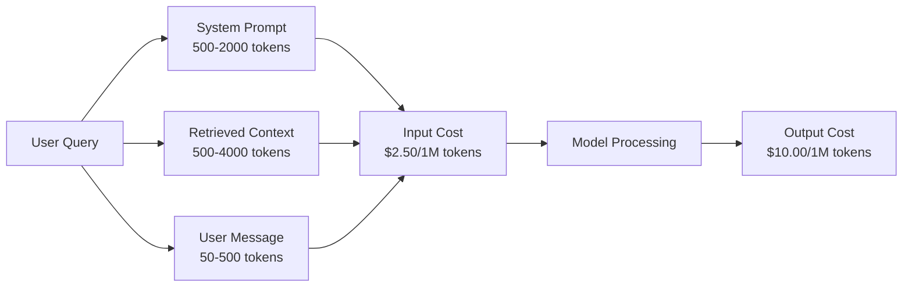
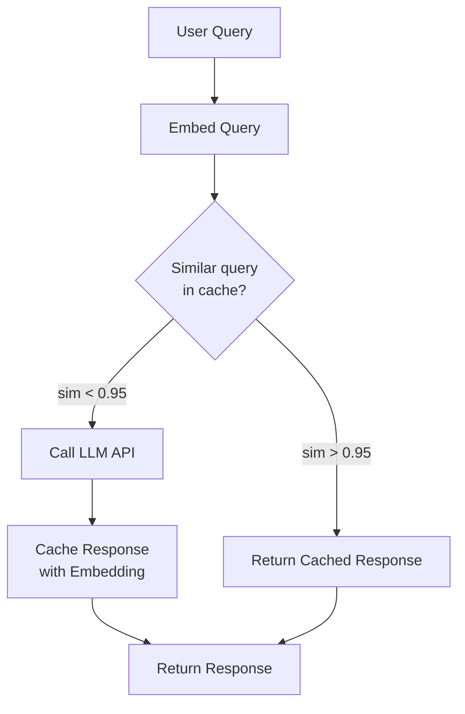
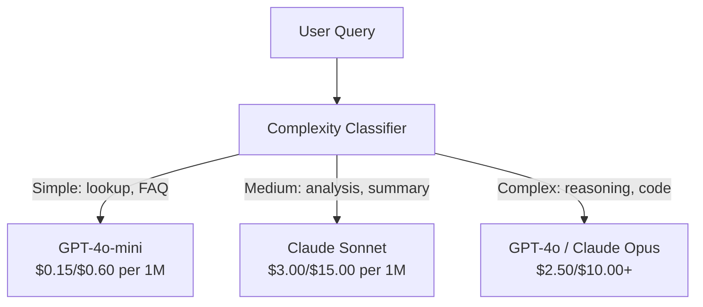

# Cachage, limite de taux et optimisation des coûts

> La plupart des startups d'IA ne meurent pas de mauvais modèles. Elles meurent de mauvaise économie unitaire. Un seul appel GPT-4o coûte des fractions d'un centime. Dix mille utilisateurs faisant dix appels par jour coûte 250 $ en jetons d'entrée seulement - avant que vous ne facturiez un seul dollar. Les entreprises qui survivent sont celles qui traitent chaque appel API comme une transaction financière, pas une appel à fonction.

> **【中文解读】**Les entreprises de création d'IA sont principalement décédées d'un mauvais modèle économique unitaire, et non d'un mauvais modèle. 10 000 utilisateurs sont utilisés 10 fois par jour, des jetons d'entrée de lumière coûtent 250 $ / jour.

> **【拓展：成本优化→AI商业化】**提示缓存(Prompt Caching) peut réduire de 50 à 90% du coût de la réflexion,语义缓存(Semantic Cache) peut être similaire à la requête, c'est la clé de la réalisation des bénéfices de l'IA 产品.

>  **【前置】**Pour les autres, il est nécessaire de prendre en compte les données de la base de données de l'application.`redis`- Je suis là.`fastapi-cache`Ou `gptcache`Il y a une autre.

**Type:** Build | **类型:** 构建
**Languages:** Python | **语言:** Python
**Prerequisites:** Phase 11 Lesson 09 (Function Calling) | **前置知识:** Phase 11 · 09 (函数调用)
**Time:** ~45 minutes | **时间:** ~45 分钟
**Related:**La phase 11 · 15 (Cachage rapide)  cette leçon couvre le caching de la couche d'application (cache sémantique, cache hash exact, routage de modèle). La leçon 15 couvre le caching rapide de la couche de fournisseur (Anthropic cache_control, OpenAI automatique, Gemini CachedContent). Combinez les deux pour une réduction de coûts de 50 à 95%. **相关:**Leur taux de croissance est de 50 à 95%. Les taux de croissance sont de 50 à 95%.

## Objectifs d'apprentissage

- Implémenter la mise en cache sémantique qui sert des requêtes répétées ou similaires du cache au lieu de faire un nouvel appel API
  实现语义缓存, de la répéter ou similaire requête du service de缓存, plutôt que de chaque nouvelle API 调用
- Calculer les coûts par demande entre les fournisseurs et mettre en œuvre des alertes budgétaires et des limites de taux de reconnaissance des jetons
  跨供应商计算每请求成本, réalisation des limites de flux et de budget des jetons de perception
- Construire une couche d'optimisation des coûts avec compression rapide, routage de modèle (chare contre bon marché) et mise en cache de réponse
  Construction de coûts de construction                                                                                                                                                                                                                                                           
- Conceptez une stratégie de mise en cache à niveau en utilisant la correspondance exacte, la similitude sémantique et la mise en cache préfixe pour différents types de requêtes
  Design de stratégies de mise en cache à couche, pour différents types de requêtes avec une correspondance précise, une similitude de langage et une mise en cache préalable

> **【中文解读】**Objectif du cours: maîtriser la stratégie d'optimisation des coûts de l'application de la LMPPrompt Caching、语义缓存、模型路由、批处理──LMPAPI

>  **【类比】**Il est également possible de trouver des produits de qualité et de qualité pour les clients.**精确哈希缓存**冰箱里现成菜((同问题直接返回,毫秒);(2) **语义缓存**                                                                                                                                                                                                                                                              **prompt caching** fournisseurs précipitent un bon régime  système rapide                                                                                                                                                                                                                                                                                                                                                                                                                                                                                                               

> ️ **【易错点】**3 cratères de stockage:**缓存中毒** l'utilisateur demande "combien est le résultat de mon compte ?" 语义缓存命中"上次别人问的余额",返回错的数字;修复:带用户身份哈希 进缓存键,PII/个性化查询不缓存――(2) **相似度阈值过高**0.95 太严,命中率 < 5%;降至0.85 +加 LLM 二次验证(" ces deux questions sont-elles égale à la valeur ?")―(3) **TTL 太长**News class query缓存 24h,模型答案过时;区分查询类型,事实查询 TTL=1h,聊天 TTL=24h──


## Le problème , l' introduction du problème

Vous construisez un chatbot RAG, il fonctionne magnifiquement, les utilisateurs l'adorent.

Puis la facture arrive.

> Tu as construit un RAG Chatting Machine. Il fonctionne très bien.

Coûts du GPT-5 $5 per million input tokens and $15 pour un million de produits.$15 input / $75 sorties. Les prix du Gemini 3 Pro $1.25 input / $5 sortie. GPT-5-mini est $0.25/$2. Les prix ci-dessous sont illustratifs; consultez toujours la page actuelle des prix du fournisseur.

> GPT-5 par million de jetons d'entrée$5，每百万输出 $Il est également possible de faire des observations sur les résultats obtenus.$15/$75 ⋅ Gémeaux 3 Pro ⋅$1.25/$5 ∞

Voici les mathématiques qui tuent les startups:

> C'est la mathématique de faire tomber les startups.

- 10 000 utilisateurs actifs quotidiens
  10 000 jours de travail
- 10 requêtes par utilisateur par jour
  10 requêtes par jour par utilisateur
- 1 000 jetons d'entrée par requête (interrogatoire système + contexte + message utilisateur)
  Chaque requête 1000 Tokens d'entrée
- 500 jetons de sortie par réponse
  500 $ par réponse

**Monthly total:** **$22,500/month**

Il y a des intégrations, des hébergements de bases de données vectorielles, des infrastructures.

> C'est juste le coût de la maîtrise en logiciel.

La partie brutale: 40 à 60% de ces requêtes sont presque dupliquées. Les utilisateurs posent les mêmes questions avec des mots légèrement différents. Votre demande de système - identique à chaque demande - est facturée à chaque fois. Les documents contextuels récupérés par RAG se répètent à travers les utilisateurs qui posent des questions sur le même sujet.

> La partie la plus difficile: 40% à 60% des requêtes sont répétées. Les utilisateurs utilisent des mots légèrement différents pour poser les mêmes questions.

Vous payez le prix total pour les calculs redondants.

> Tu es en train de payer le prix total pour le déficit.

## Le concept de base.

> **【中文解读】**L'optimisation des coûts de l'API LLM est un facteur clé de la production.

> **【拓展：LLM 成本的实际数据】**GPT-4o 定价 $5/$15 par M de jetons ((entrée/sortie),Claude 3.5 Sonnet $3/$15── un jour de vie de 10 000 utilisateurs, une application par interaction d'environ 2K d'entrée + 500 jetons de sortie, un coût de 15 000 à 45 000 $.


### L'anatomie des coûts d'un appel à la LLM

Chaque appel d'API a cinq composantes de coûts.

> Chaque API est configurée avec cinq composants de coûts.



Les instructions système sont le tueur silencieux.$3.75 per million requests just for that prefix. At 100K requests per day, that is $375 $ par jour, 11 250 $ par mois, pour un texte qui ne change jamais.

> 1500 jetons de système de jetons pour chaque requête sont envoyés, chaque million de demandes sont envoyées seulement pour cette précédente.$3.75。每天 10 万请求就是 $375/天$11,250/月为从不改变的文本──

### Les services de caching: réductions intégrées

Les trois principaux fournisseurs proposent une mise en cache rapide du côté du fournisseur en 2026, mais les mécanismes diffèrent.

> Les trois grands fournisseurs fournissent des informations sur les fournisseurs en 2026 mais le mécanisme est différent.

| Provider | Mechanism | Discount | Minimum | Cache Duration |
|----------|-----------|----------|---------|----------------|
| Anthropic | Explicit cache_control markers | 90% on cache hits (pay 25% extra on write) | 1,024 tokens (Sonnet/Opus), 2,048 (Haiku) | 5 min default; 1h extended (2x write premium) |
| OpenAI | Automatic prefix matching | 50% on cache hits | 1,024 tokens | Best-effort up to 1 hour |
| Google Gemini | Explicit CachedContent API | ~75% reduction (plus storage) | 4,096 (Flash) / 32,768 (Pro) | User-configurable TTL |

**Anthropic's approach**Vous marquez des sections de votre demande avec `cache_control: {"type": "ephemeral"}`La première demande est payée avec une prime d'écriture de 25%, les demandes ultérieures avec le même préfixe obtiennent une réduction de 90%.$0.005 normally costs $0,000625 sur les visites de cache, plus de 100 000 demandes, ce qui économise 437,50 $ par jour.

> **Anthropic 方式**C'est évident.`cache_control: {"type": "ephemeral"}`标记提示段──首次请求付 25% 写入溢价──后续同前请求获得90% 折扣──2,000 jetons 系统提示正常$0.005，缓存命中 $0,000625,100.000 requêtes provisoires $437,50/jour

**OpenAI's approach**Les commandes de la carte de crédit sont automatiques. Tout préfixe prompt qui correspond à une demande précédente obtient une réduction de 50%. Aucun marqueur n'est nécessaire.

> **OpenAI 方式**Il est automatique. Toutes les correspondances à la demande de commande sont accordées à 50% de réduction.

### Le caching sémantique: votre couche personnalisée

Le caching fournisseur ne fonctionne que pour les préfixes identiques.

> 提供商缓存只对相同的前生效──语义缓存处理更难的情况:不同查询但相同含义──

"Quelle est la politique de retour?" et "Comment retourner un article?" sont des chaînes différentes mais identiques. Un cache sémantique intègre les deux requêtes, calcule la similitude cosine et renvoie la réponse en cache si la similitude dépasse un seuil (généralement 0,92-0,95).

> "La politique de retour est quoi?" et "Me comment retourner?" sont différents caractères mais l'intention est la même.



Les coûts d'intégration sont négligeables. L'intégration de texte 3-small d'OpenAI coûte 0,02 $ par million de jetons.

> 嵌入成本可忽略──OpenAI text-embedding-3-small 每百万代币 $0.02──检查缓存相比完整LLM 调用几乎零成本──

### Cachage exact: Hash et correspondance

Pour les appels déterministes (température = 0, même modèle, même prompt), le caching exact est plus simple et plus rapide.

> Pour une définition de la température, le résultat est le résultat de l'analyse de la température.

Ça fonctionne parfaitement pour:

> Ceci est parfaitement adapté aux scénarios suivants:

- Prompte système + contexte fixe + requêtes utilisateur identiques
  系统提示 + 固定上下文 + 相同用户查询
- Appel à fonction avec les mêmes définitions d'outil
  À la suite de la rédaction de la lettre
- Traitement par lots où le même document est traité plusieurs fois
  Parallèlement à la documentation de traitement de plusieurs fois

### Limiter les tarifs: protéger votre budget

La limitation des taux ne concerne pas seulement l'équité, mais la survie.

> La limite n'est pas seulement une question de justice, c'est une question de survie.

**Token bucket algorithm:**chaque utilisateur reçoit un seau de N jetons qui se remplit à un rythme R par seconde. Une demande consomme des jetons du seau. Si le seau est vide, la demande est rejetée. Cela permet des explosions (utiliser le seau complet à la fois) tout en appliquant un taux moyen.
**令牌桶算法**Chaque utilisateur a un seul baril de jeton N, selon R/seconds/rate de remplissage.

**Per-user quotas:**définir des limites quotidiennes/ménaux de jetons par niveau d'utilisateur.
**每用户配额**: selon le niveau utilisateur设日/月 jeton 上限。

| Tier | Daily Token Limit | Max Requests/min | Model Access |
|------|------------------|------------------|-------------|
| Free | 50,000 | 10 | GPT-4o-mini only |
| Pro | 500,000 | 60 | GPT-4o, Claude Sonnet |
| Enterprise | 5,000,000 | 300 | All models |

### Le modèle de routage: le bon modèle pour le bon travail

Toutes les requêtes n'ont pas besoin de GPT-4o.

> Toutes les demandes nécessitent un GPT-4o.

" À quelle heure ferme-t-on le magasin ? " n'exige pas de faire une demande.$10/M-output model. GPT-4o-mini at $La sortie de 0,60 / M le gère parfaitement. Claude Haiku à 1,25 $ / M le gère. Un classifiateur simple rote des requêtes bon marché à des modèles bon marché et des requêtes complexes à des modèles coûteux.

> "Quelques heures de marche ?" Pas besoin.$10/M 输出模型。$Le prix de la production de la production de produits de haute qualité est de 0,60 M 输出 GPT-4o-mini 完全胜任。 $1,25/M 输出 Claude Haiku 也可以──简单分类器把便宜查询路由到便宜模型,复杂查询路由到贵模型──



Un routeur bien ajusté permet d'économiser 40 à 70% sur les coûts du modèle.

> Le coût du modèle est de 40 à 70% en économie.

### Suivre les coûts: savoir où va l'argent

Vous ne pouvez pas optimiser ce que vous ne mesurez pas.

> Il n'y a pas de résultat à mesurer.

- Temps de l'année
  时间
- Nom du modèle
  模型名
- Les jetons d'entrée
  输入 jeton
- Les jetons de sortie
  输出 jeton
- La latence (ms)
  延迟(毫秒)
- Coût calculé ($)
  计算成本($)
- Identifiant de l'utilisateur
  Identifiant de l'utilisateur
- Accès/défaut de cache
  缓存命中/未中
- Catégorie de demande
  Les demandes de catégorie

Ces données révèlent quelles fonctionnalités sont chères, quels utilisateurs sont de gros consommateurs et où le caching a le plus d'impact.

> Ces données révèlent quelles fonctionnalités sont importantes, quelles sont les utilisateurs qui consomment le plus, quelles sont les conditions de vie qui ont le plus d'impact.

### Les lots: réductions en vrac

L'API de lot d'OpenAI traite les demandes de manière asynchrone à 50% de réduction. Vous soumettez un lot de 50 000 demandes, et les résultats reviennent dans les 24 heures.

> OpenAI Batch API 异步处理请求,50%折―― soumettre le plus de 50.000 demandes de lots, 24 heures dans le retour du résultat――

Utiliser le batchage pour:

> traitement en série pour:

- Traitement des documents par nuit
  Traitement du document
- Classification en vrac
   catégorie de lot
- Les cours d'évaluation
  评估运行
- Les pipelines d'enrichissement de données
  Les données de la ligne de transport

Pas pour: requêtes en temps réel auxquelles l'utilisateur est confronté (matières de latence).
Non utilisé:实时面向用户查询 (attendu à ce que les utilisateurs puissent se renseigner)

### Alertes budgétaires et interruptions de circuits

Un disjoncteur arrête de dépenser quand vous atteignez une limite.

> Le dépannage est interrompu lorsque la limite est atteinte.

Définir trois seuils:

> 设三个值:

1. **Warning**(70% du budget): envoyer une alerte
   **警告**(budget 70%): émission de nouvelles
2. **Throttle**(85% du budget): seulement des modèles moins chers
   **降速**(budget 85%): seulement en change à un modèle plus abordable
3. **Stop**(95% du budget): rejet des nouvelles demandes, retour seulement des réponses cachées
   **停止**(budget 95%): refuser une nouvelle demande, retourner uniquement à la cache

### Le piquet d'optimisation

Appliquez ces techniques dans l'ordre.

> 按顺序应用这些技术──每层叠加在前一层之上──

| Layer | Technique | Typical Savings | Implementation Effort |
|-------|-----------|----------------|----------------------|
| 1 | Provider prompt caching | 30-50% | Low (add cache markers) |
| 2 | Exact caching | 10-20% | Low (hash + dict) |
| 3 | Semantic caching | 15-30% | Medium (embeddings + similarity) |
| 4 | Model routing | 40-70% | Medium (classifier) |
| 5 | Rate limiting | Budget protection | Low (token bucket) |
| 6 | Prompt compression | 10-30% | Medium (rewrite prompts) |
| 7 | Batching | 50% on eligible | Low (batch API) |

Une application RAG appliquant des couches 1 à 5 réduit généralement les coûts de $22,500/month to $4000 à 6000 par mois, c'est la différence entre brûler une piste et construire une entreprise.

> L'application de RAG de 1 à 5 niveaux est généralement mensuelle.$22,500 降到 $4000 à 6000... c'est la différence entre faire du business et faire du fric.

### Réelle épargne: avant et après

Voici une vraie panne pour un chatbot RAG qui sert 10 000 DAU.

> C'est une véritable décomposition de 10 000 DAU de RAG.

| Metric | Before Optimization | After Optimization | Savings |
|--------|--------------------|--------------------|---------|
| Monthly LLM cost | $22,500 | $5,200 | 77% |
| Avg cost per query | $0.0075 | $0.0017 | 77% |
| Cache hit rate | 0% | 52% | -- |
| Queries routed to mini | 0% | 65% | -- |
| P95 latency | 2,800ms | 900ms (cache hits: 50ms) | 68% |
| Monthly embedding cost | $0 | $180 | (new cost) |
| Total monthly cost | $22,500 | $5,380 | 76% |

Le coût d'intégration du caching sémantique (180 $ par mois) se paie à lui-même dans la première heure des visites du cache.

> 语义缓存的嵌入成本 ($180/月)

## Construisez-le et mettez-le en œuvre.
```figure
semantic-cache
```

## Faites-le

### Étape 1: Calculateur de coûts

Construisez une calculatrice de coût de jeton qui connaît les prix actuels des principaux modèles.

> 构建代币 成本计算器,知道主要模型当前定价──

```python
import hashlib
import time
import json
import math
from dataclasses import dataclass, field


MODEL_PRICING = {
    "gpt-4o": {"input": 2.50, "output": 10.00, "cached_input": 1.25},
    "gpt-4o-mini": {"input": 0.15, "output": 0.60, "cached_input": 0.075},
    "gpt-4.1": {"input": 2.00, "output": 8.00, "cached_input": 0.50},
    "gpt-4.1-mini": {"input": 0.40, "output": 1.60, "cached_input": 0.10},
    "gpt-4.1-nano": {"input": 0.10, "output": 0.40, "cached_input": 0.025},
    "o3": {"input": 2.00, "output": 8.00, "cached_input": 0.50},
    "o3-mini": {"input": 1.10, "output": 4.40, "cached_input": 0.55},
    "o4-mini": {"input": 1.10, "output": 4.40, "cached_input": 0.275},
    "claude-opus-4": {"input": 15.00, "output": 75.00, "cached_input": 1.50},
    "claude-sonnet-4": {"input": 3.00, "output": 15.00, "cached_input": 0.30},
    "claude-haiku-3.5": {"input": 0.80, "output": 4.00, "cached_input": 0.08},
    "gemini-2.5-pro": {"input": 1.25, "output": 10.00, "cached_input": 0.3125},
    "gemini-2.5-flash": {"input": 0.15, "output": 0.60, "cached_input": 0.0375},
}


def calculate_cost(model, input_tokens, output_tokens, cached_input_tokens=0):
    if model not in MODEL_PRICING:
        return {"error": f"Unknown model: {model}"}
    pricing = MODEL_PRICING[model]
    non_cached = input_tokens - cached_input_tokens
    input_cost = (non_cached / 1_000_000) * pricing["input"]
    cached_cost = (cached_input_tokens / 1_000_000) * pricing["cached_input"]
    output_cost = (output_tokens / 1_000_000) * pricing["output"]
    total = input_cost + cached_cost + output_cost
    return {
        "model": model,
        "input_tokens": input_tokens,
        "output_tokens": output_tokens,
        "cached_input_tokens": cached_input_tokens,
        "input_cost": round(input_cost, 6),
        "cached_input_cost": round(cached_cost, 6),
        "output_cost": round(output_cost, 6),
        "total_cost": round(total, 6),
    }
```

### Étape 2: Cache exacte

Hacher le prompt complet et retourner les réponses cachées pour les demandes identiques.

> 哈希完整提示, pour la même demande de retour de cache

```python
class ExactCache:
    def __init__(self, max_size=1000, ttl_seconds=3600):
        self.cache = {}
        self.max_size = max_size
        self.ttl = ttl_seconds
        self.hits = 0
        self.misses = 0

    def _hash(self, model, messages, temperature):
        key_data = json.dumps({"model": model, "messages": messages, "temperature": temperature}, sort_keys=True)
        return hashlib.sha256(key_data.encode()).hexdigest()

    def get(self, model, messages, temperature=0.0):
        if temperature > 0:
            self.misses += 1
            return None
        key = self._hash(model, messages, temperature)
        if key in self.cache:
            entry = self.cache[key]
            if time.time() - entry["timestamp"] < self.ttl:
                self.hits += 1
                entry["access_count"] += 1
                return entry["response"]
            del self.cache[key]
        self.misses += 1
        return None

    def put(self, model, messages, temperature, response):
        if temperature > 0:
            return
        if len(self.cache) >= self.max_size:
            oldest_key = min(self.cache, key=lambda k: self.cache[k]["timestamp"])
            del self.cache[oldest_key]
        key = self._hash(model, messages, temperature)
        self.cache[key] = {
            "response": response,
            "timestamp": time.time(),
            "access_count": 1,
        }

    def stats(self):
        total = self.hits + self.misses
        return {
            "hits": self.hits,
            "misses": self.misses,
            "hit_rate": round(self.hits / total, 4) if total > 0 else 0,
            "cache_size": len(self.cache),
        }
```

### Étape 3: Cache sémantique

Embed requêtes et retourner les réponses cachées lorsque la similitude dépasse un seuil.

> Retour à la réserve de réponse.

```python
def simple_embed(text):
    words = text.lower().split()
    vocab = {}
    for w in words:
        vocab[w] = vocab.get(w, 0) + 1
    norm = math.sqrt(sum(v * v for v in vocab.values()))
    if norm == 0:
        return {}
    return {k: v / norm for k, v in vocab.items()}


def cosine_similarity(a, b):
    if not a or not b:
        return 0.0
    all_keys = set(a) | set(b)
    dot = sum(a.get(k, 0) * b.get(k, 0) for k in all_keys)
    return dot


class SemanticCache:
    def __init__(self, similarity_threshold=0.85, max_size=500, ttl_seconds=3600):
        self.entries = []
        self.threshold = similarity_threshold
        self.max_size = max_size
        self.ttl = ttl_seconds
        self.hits = 0
        self.misses = 0

    def get(self, query):
        query_embedding = simple_embed(query)
        now = time.time()
        best_match = None
        best_sim = 0.0
        for entry in self.entries:
            if now - entry["timestamp"] > self.ttl:
                continue
            sim = cosine_similarity(query_embedding, entry["embedding"])
            if sim > best_sim:
                best_sim = sim
                best_match = entry
        if best_match and best_sim >= self.threshold:
            self.hits += 1
            best_match["access_count"] += 1
            return {"response": best_match["response"], "similarity": round(best_sim, 4), "original_query": best_match["query"]}
        self.misses += 1
        return None

    def put(self, query, response):
        if len(self.entries) >= self.max_size:
            self.entries.sort(key=lambda e: e["timestamp"])
            self.entries.pop(0)
        self.entries.append({
            "query": query,
            "embedding": simple_embed(query),
            "response": response,
            "timestamp": time.time(),
            "access_count": 1,
        })

    def stats(self):
        total = self.hits + self.misses
        return {
            "hits": self.hits,
            "misses": self.misses,
            "hit_rate": round(self.hits / total, 4) if total > 0 else 0,
            "cache_size": len(self.entries),
        }
```

### Étape 4: Limite de taux

Limiteur de taux de jetons avec quotas par utilisateur.

> Il y a aussi des réserves de réserves de réserves pour chaque utilisateur.

```python
class TokenBucketRateLimiter:
    def __init__(self):
        self.buckets = {}
        self.tiers = {
            "free": {"capacity": 50_000, "refill_rate": 500, "max_requests_per_min": 10},
            "pro": {"capacity": 500_000, "refill_rate": 5_000, "max_requests_per_min": 60},
            "enterprise": {"capacity": 5_000_000, "refill_rate": 50_000, "max_requests_per_min": 300},
        }

    def _get_bucket(self, user_id, tier="free"):
        if user_id not in self.buckets:
            tier_config = self.tiers.get(tier, self.tiers["free"])
            self.buckets[user_id] = {
                "tokens": tier_config["capacity"],
                "capacity": tier_config["capacity"],
                "refill_rate": tier_config["refill_rate"],
                "last_refill": time.time(),
                "request_timestamps": [],
                "max_rpm": tier_config["max_requests_per_min"],
                "tier": tier,
                "total_tokens_used": 0,
            }
        return self.buckets[user_id]

    def _refill(self, bucket):
        now = time.time()
        elapsed = now - bucket["last_refill"]
        refill = int(elapsed * bucket["refill_rate"])
        if refill > 0:
            bucket["tokens"] = min(bucket["capacity"], bucket["tokens"] + refill)
            bucket["last_refill"] = now

    def check(self, user_id, tokens_needed, tier="free"):
        bucket = self._get_bucket(user_id, tier)
        self._refill(bucket)
        now = time.time()
        bucket["request_timestamps"] = [t for t in bucket["request_timestamps"] if now - t < 60]
        if len(bucket["request_timestamps"]) >= bucket["max_rpm"]:
            return {"allowed": False, "reason": "rate_limit", "retry_after_seconds": 60 - (now - bucket["request_timestamps"][0])}
        if bucket["tokens"] < tokens_needed:
            deficit = tokens_needed - bucket["tokens"]
            wait = deficit / bucket["refill_rate"]
            return {"allowed": False, "reason": "token_limit", "tokens_available": bucket["tokens"], "retry_after_seconds": round(wait, 1)}
        return {"allowed": True, "tokens_available": bucket["tokens"]}

    def consume(self, user_id, tokens_used, tier="free"):
        bucket = self._get_bucket(user_id, tier)
        bucket["tokens"] -= tokens_used
        bucket["request_timestamps"].append(time.time())
        bucket["total_tokens_used"] += tokens_used

    def get_usage(self, user_id):
        if user_id not in self.buckets:
            return {"error": "User not found"}
        b = self.buckets[user_id]
        return {
            "user_id": user_id,
            "tier": b["tier"],
            "tokens_remaining": b["tokens"],
            "capacity": b["capacity"],
            "total_tokens_used": b["total_tokens_used"],
            "utilization": round(b["total_tokens_used"] / b["capacity"], 4) if b["capacity"] else 0,
        }
```

### Étape 5: Tracker des coûts

Enregistrez chaque appel et comptez les totaux en cours d'exécution.

> 记录 per调用并计算累计总额──

```python
class CostTracker:
    def __init__(self, monthly_budget=1000.0):
        self.logs = []
        self.monthly_budget = monthly_budget
        self.alerts = []

    def log_call(self, model, input_tokens, output_tokens, cached_input_tokens=0, latency_ms=0, user_id="anonymous", cache_status="miss"):
        cost = calculate_cost(model, input_tokens, output_tokens, cached_input_tokens)
        entry = {
            "timestamp": time.time(),
            "model": model,
            "input_tokens": input_tokens,
            "output_tokens": output_tokens,
            "cached_input_tokens": cached_input_tokens,
            "latency_ms": latency_ms,
            "cost": cost["total_cost"],
            "user_id": user_id,
            "cache_status": cache_status,
        }
        self.logs.append(entry)
        self._check_budget()
        return entry

    def _check_budget(self):
        total = self.total_cost()
        pct = total / self.monthly_budget if self.monthly_budget > 0 else 0
        if pct >= 0.95 and not any(a["level"] == "stop" for a in self.alerts):
            self.alerts.append({"level": "stop", "message": f"Budget 95% consumed: ${total:.2f}/${self.monthly_budget:.2f}", "timestamp": time.time()})
        elif pct >= 0.85 and not any(a["level"] == "throttle" for a in self.alerts):
            self.alerts.append({"level": "throttle", "message": f"Budget 85% consumed: ${total:.2f}/${self.monthly_budget:.2f}", "timestamp": time.time()})
        elif pct >= 0.70 and not any(a["level"] == "warning" for a in self.alerts):
            self.alerts.append({"level": "warning", "message": f"Budget 70% consumed: ${total:.2f}/${self.monthly_budget:.2f}", "timestamp": time.time()})

    def total_cost(self):
        return round(sum(e["cost"] for e in self.logs), 6)

    def cost_by_model(self):
        by_model = {}
        for e in self.logs:
            m = e["model"]
            if m not in by_model:
                by_model[m] = {"calls": 0, "cost": 0, "input_tokens": 0, "output_tokens": 0}
            by_model[m]["calls"] += 1
            by_model[m]["cost"] = round(by_model[m]["cost"] + e["cost"], 6)
            by_model[m]["input_tokens"] += e["input_tokens"]
            by_model[m]["output_tokens"] += e["output_tokens"]
        return by_model

    def cache_savings(self):
        cache_hits = [e for e in self.logs if e["cache_status"] == "hit"]
        if not cache_hits:
            return {"saved": 0, "cache_hits": 0}
        saved = 0
        for e in cache_hits:
            full_cost = calculate_cost(e["model"], e["input_tokens"], e["output_tokens"])
            saved += full_cost["total_cost"]
        return {"saved": round(saved, 4), "cache_hits": len(cache_hits)}

    def summary(self):
        if not self.logs:
            return {"total_calls": 0, "total_cost": 0}
        total_latency = sum(e["latency_ms"] for e in self.logs)
        cache_hits = sum(1 for e in self.logs if e["cache_status"] == "hit")
        return {
            "total_calls": len(self.logs),
            "total_cost": self.total_cost(),
            "avg_cost_per_call": round(self.total_cost() / len(self.logs), 6),
            "avg_latency_ms": round(total_latency / len(self.logs), 1),
            "cache_hit_rate": round(cache_hits / len(self.logs), 4),
            "cost_by_model": self.cost_by_model(),
            "cache_savings": self.cache_savings(),
            "budget_remaining": round(self.monthly_budget - self.total_cost(), 2),
            "budget_utilization": round(self.total_cost() / self.monthly_budget, 4) if self.monthly_budget > 0 else 0,
            "alerts": self.alerts,
        }
```

### Étape 6: Modèle routeur

Retourner les requêtes au modèle le moins cher qui peut les gérer.

> Pour les faire, il faut les traiter avec le modèle le plus abordable.

```python
SIMPLE_KEYWORDS = ["what time", "hours", "address", "phone", "price", "return policy", "hello", "hi", "thanks", "yes", "no"]
COMPLEX_KEYWORDS = ["analyze", "compare", "explain why", "write code", "debug", "architect", "design", "trade-off", "evaluate"]


def classify_complexity(query):
    q = query.lower()
    if len(q.split()) <= 5 or any(kw in q for kw in SIMPLE_KEYWORDS):
        return "simple"
    if any(kw in q for kw in COMPLEX_KEYWORDS):
        return "complex"
    return "medium"


def route_model(query, tier="pro"):
    complexity = classify_complexity(query)
    routing_table = {
        "simple": {"free": "gpt-4.1-nano", "pro": "gpt-4o-mini", "enterprise": "gpt-4o-mini"},
        "medium": {"free": "gpt-4o-mini", "pro": "claude-sonnet-4", "enterprise": "claude-sonnet-4"},
        "complex": {"free": "gpt-4o-mini", "pro": "gpt-4o", "enterprise": "claude-opus-4"},
    }
    model = routing_table[complexity].get(tier, "gpt-4o-mini")
    return {"query": query, "complexity": complexity, "model": model, "tier": tier}
```

### Étape 7: Exécutez la démo

> 运行演示──

```python
def simulate_llm_call(model, query):
    input_tokens = len(query.split()) * 4 + 500
    output_tokens = 150 + (len(query.split()) * 2)
    latency = 200 + (output_tokens * 2)
    return {
        "model": model,
        "response": f"[Simulated {model} response to: {query[:50]}...]",
        "input_tokens": input_tokens,
        "output_tokens": output_tokens,
        "latency_ms": latency,
    }


def run_demo():
    print("=" * 60)
    print("  Caching, Rate Limiting & Cost Optimization Demo")
    print("=" * 60)

    print("\n--- Model Pricing ---")
    for model, pricing in list(MODEL_PRICING.items())[:6]:
        cost_1k = calculate_cost(model, 1000, 500)
        print(f"  {model}: ${cost_1k['total_cost']:.6f} per 1K in + 500 out")

    print("\n--- Cost Comparison: 100K Requests ---")
    for model in ["gpt-4o", "gpt-4o-mini", "claude-sonnet-4", "claude-haiku-3.5"]:
        cost = calculate_cost(model, 1000 * 100_000, 500 * 100_000)
        print(f"  {model}: ${cost['total_cost']:.2f}")

    print("\n--- Anthropic Cache Savings ---")
    no_cache = calculate_cost("claude-sonnet-4", 2000, 500, 0)
    with_cache = calculate_cost("claude-sonnet-4", 2000, 500, 1500)
    saving = no_cache["total_cost"] - with_cache["total_cost"]
    print(f"  Without cache: ${no_cache['total_cost']:.6f}")
    print(f"  With 1500 cached tokens: ${with_cache['total_cost']:.6f}")
    print(f"  Savings per call: ${saving:.6f} ({saving/no_cache['total_cost']*100:.1f}%)")

    exact_cache = ExactCache(max_size=100, ttl_seconds=300)
    semantic_cache = SemanticCache(similarity_threshold=0.75, max_size=100)
    rate_limiter = TokenBucketRateLimiter()
    tracker = CostTracker(monthly_budget=100.0)

    print("\n--- Exact Cache ---")
    messages_1 = [{"role": "user", "content": "What is the return policy?"}]
    result = exact_cache.get("gpt-4o-mini", messages_1, 0.0)
    print(f"  First lookup: {'HIT' if result else 'MISS'}")
    exact_cache.put("gpt-4o-mini", messages_1, 0.0, "You can return items within 30 days.")
    result = exact_cache.get("gpt-4o-mini", messages_1, 0.0)
    print(f"  Second lookup: {'HIT' if result else 'MISS'} -> {result}")
    result = exact_cache.get("gpt-4o-mini", messages_1, 0.7)
    print(f"  With temp=0.7: {'HIT' if result else 'MISS (non-deterministic, skip cache)'}")
    print(f"  Stats: {exact_cache.stats()}")

    print("\n--- Semantic Cache ---")
    test_queries = [
        ("What is the return policy?", "Items can be returned within 30 days with receipt."),
        ("How do I return an item?", None),
        ("What are your store hours?", "We are open 9am-9pm Monday through Saturday."),
        ("When does the store open?", None),
        ("Tell me about quantum computing", "Quantum computers use qubits..."),
        ("Explain quantum mechanics", None),
    ]
    for query, response in test_queries:
        cached = semantic_cache.get(query)
        if cached:
            print(f"  '{query[:40]}' -> CACHE HIT (sim={cached['similarity']}, original='{cached['original_query'][:40]}')")
        elif response:
            semantic_cache.put(query, response)
            print(f"  '{query[:40]}' -> MISS (stored)")
        else:
            print(f"  '{query[:40]}' -> MISS (no match)")
    print(f"  Stats: {semantic_cache.stats()}")

    print("\n--- Rate Limiting ---")
    for i in range(12):
        check = rate_limiter.check("user_1", 1000, "free")
        if check["allowed"]:
            rate_limiter.consume("user_1", 1000, "free")
        status = "OK" if check["allowed"] else f"BLOCKED ({check['reason']})"
        if i < 5 or not check["allowed"]:
            print(f"  Request {i+1}: {status}")
    print(f"  Usage: {rate_limiter.get_usage('user_1')}")

    print("\n--- Model Routing ---")
    routing_queries = [
        "What time do you close?",
        "Summarize this quarterly earnings report",
        "Analyze the trade-offs between microservices and monoliths",
        "Hello",
        "Write code for a binary search tree with deletion",
    ]
    for q in routing_queries:
        route = route_model(q, "pro")
        print(f"  '{q[:50]}' -> {route['model']} ({route['complexity']})")

    print("\n--- Full Pipeline: Before vs After Optimization ---")
    queries = [
        "What is the return policy?",
        "How do I return something?",
        "What are your hours?",
        "When do you open?",
        "Explain the difference between TCP and UDP",
        "Compare TCP vs UDP protocols",
        "Hello",
        "What is your phone number?",
        "Write a Python function to sort a list",
        "Analyze the pros and cons of serverless architecture",
    ]

    print("\n  [Before: no caching, single model (gpt-4o)]")
    tracker_before = CostTracker(monthly_budget=1000.0)
    for q in queries:
        result = simulate_llm_call("gpt-4o", q)
        tracker_before.log_call("gpt-4o", result["input_tokens"], result["output_tokens"], latency_ms=result["latency_ms"], cache_status="miss")
    before = tracker_before.summary()
    print(f"  Total cost: ${before['total_cost']:.6f}")
    print(f"  Avg cost/call: ${before['avg_cost_per_call']:.6f}")
    print(f"  Avg latency: {before['avg_latency_ms']}ms")

    print("\n  [After: caching + routing + rate limiting]")
    exact_c = ExactCache()
    semantic_c = SemanticCache(similarity_threshold=0.75)
    tracker_after = CostTracker(monthly_budget=1000.0)

    for q in queries:
        messages = [{"role": "user", "content": q}]
        cached = exact_c.get("gpt-4o", messages, 0.0)
        if cached:
            tracker_after.log_call("gpt-4o-mini", 0, 0, latency_ms=5, cache_status="hit")
            continue
        sem_cached = semantic_c.get(q)
        if sem_cached:
            tracker_after.log_call("gpt-4o-mini", 0, 0, latency_ms=15, cache_status="hit")
            continue
        route = route_model(q)
        result = simulate_llm_call(route["model"], q)
        tracker_after.log_call(route["model"], result["input_tokens"], result["output_tokens"], latency_ms=result["latency_ms"], cache_status="miss")
        exact_c.put(route["model"], messages, 0.0, result["response"])
        semantic_c.put(q, result["response"])

    after = tracker_after.summary()
    print(f"  Total cost: ${after['total_cost']:.6f}")
    print(f"  Avg cost/call: ${after['avg_cost_per_call']:.6f}")
    print(f"  Avg latency: {after['avg_latency_ms']}ms")
    print(f"  Cache hit rate: {after['cache_hit_rate']:.0%}")

    if before["total_cost"] > 0:
        savings_pct = (1 - after["total_cost"] / before["total_cost"]) * 100
        print(f"\n  SAVINGS: {savings_pct:.1f}% cost reduction")
        print(f"  Latency improvement: {(1 - after['avg_latency_ms'] / before['avg_latency_ms']) * 100:.1f}% faster")

    print("\n--- Budget Alerts Demo ---")
    alert_tracker = CostTracker(monthly_budget=0.01)
    for i in range(5):
        alert_tracker.log_call("gpt-4o", 5000, 2000, latency_ms=500)
    print(f"  Total spent: ${alert_tracker.total_cost():.6f} / ${alert_tracker.monthly_budget}")
    for alert in alert_tracker.alerts:
        print(f"  ALERT [{alert['level'].upper()}]: {alert['message']}")

    print("\n--- Cost Breakdown by Model ---")
    multi_tracker = CostTracker(monthly_budget=500.0)
    for _ in range(50):
        multi_tracker.log_call("gpt-4o-mini", 800, 200, latency_ms=150)
    for _ in range(30):
        multi_tracker.log_call("claude-sonnet-4", 1500, 500, latency_ms=400)
    for _ in range(10):
        multi_tracker.log_call("gpt-4o", 2000, 800, latency_ms=600)
    for _ in range(10):
        multi_tracker.log_call("claude-opus-4", 3000, 1000, latency_ms=1200)
    breakdown = multi_tracker.cost_by_model()
    for model, data in sorted(breakdown.items(), key=lambda x: x[1]["cost"], reverse=True):
        print(f"  {model}: {data['calls']} calls, ${data['cost']:.6f}, {data['input_tokens']:,} in / {data['output_tokens']:,} out")
    print(f"  Total: ${multi_tracker.total_cost():.6f}")

    print("\n" + "=" * 60)
    print("  Demo complete.")
    print("=" * 60)


if __name__ == "__main__":
    run_demo()
```

## Utilisez-le avec le cadre de réalisation

### Le caching des instantanés

> Le récit de l'Anthropologie

```python
# import anthropic
#
# client = anthropic.Anthropic()
#
# response = client.messages.create(
#     model="claude-sonnet-5",
#     max_tokens=1024,
#     system=[
#         {
#             "type": "text",
#             "text": "You are a helpful customer support agent for Acme Corp...",
#             "cache_control": {"type": "ephemeral"},
#         }
#     ],
#     messages=[{"role": "user", "content": "What is the return policy?"}],
# )
#
# print(f"Input tokens: {response.usage.input_tokens}")
# print(f"Cache creation tokens: {response.usage.cache_creation_input_tokens}")
# print(f"Cache read tokens: {response.usage.cache_read_input_tokens}")
```

Le premier appel est écrit dans le cache (25% de prime). Chaque appel ultérieur avec le même préfixe de prompt système est lu dans le cache (90% de réduction). Le cache dure 5 minutes et réinitialise le minuterie à chaque coup.

> 首次调用写缓存(25% 溢价) ・・・后续同系统提示前的调用读缓存(90% 折扣) ・・・缓存 5 分钟,每次命中重置计时器──

### Cachage automatique OpenAI

> Ouverture automatique de la mise en cache

```python
# from openai import OpenAI
#
# client = OpenAI()
#
# response = client.chat.completions.create(
#     model="gpt-4o",
#     messages=[
#         {"role": "system", "content": "You are a helpful customer support agent..."},
#         {"role": "user", "content": "What is the return policy?"},
#     ],
# )
#
# print(f"Prompt tokens: {response.usage.prompt_tokens}")
# print(f"Cached tokens: {response.usage.prompt_tokens_details.cached_tokens}")
# print(f"Completion tokens: {response.usage.completion_tokens}")
```

OpenAI cache automatiquement. Tout préfixe prompt de 1.024+ jetons qui correspond à une demande récente obtient une réduction de 50%. Aucun changement de code nécessaire - il suffit de vérifier`prompt_tokens_details.cached_tokens`dans la réponse pour vérifier qu'il fonctionne.

> OpenAI Automatic Cache  Toutes les 1024+ jetons                                                                                                                                                                                                                                                        `prompt_tokens_details.cached_tokens`L'épreuve est possible.

### API de lot OpenAI

> API OpenAI de lot

```python
# import json
# from openai import OpenAI
#
# client = OpenAI()
#
# requests = []
# for i, query in enumerate(queries):
#     requests.append({
#         "custom_id": f"request-{i}",
#         "method": "POST",
#         "url": "/v1/chat/completions",
#         "body": {
#             "model": "gpt-4o-mini",
#             "messages": [{"role": "user", "content": query}],
#         },
#     })
#
# with open("batch_input.jsonl", "w") as f:
#     for r in requests:
#         f.write(json.dumps(r) + "\n")
#
# batch_file = client.files.create(file=open("batch_input.jsonl", "rb"), purpose="batch")
# batch = client.batches.create(input_file_id=batch_file.id, endpoint="/v1/chat/completions", completion_window="24h")
# print(f"Batch ID: {batch.id}, Status: {batch.status}")
```

L'API de lot offre une réduction de 50% sur tous les jetons. Les résultats arrivent dans les 24 heures. Parfait pour les charges de travail non en temps réel: évaluations, étiquetage de données, résumé en vrac.

> L'API de lot pour tous les jetons 统一 50% de réduction。 résultat 24 heures dans le retour。 adapté à un temps de travail chargé: évaluation、 données, étiquettes, résumé de la quantité。

### Production Cache sémantique avec Redis

> Il est également utilisé pour la production de produits chimiques.

```python
# import redis
# import numpy as np
# from openai import OpenAI
#
# r = redis.Redis()
# client = OpenAI()
#
# def get_embedding(text):
#     response = client.embeddings.create(model="text-embedding-3-small", input=text)
#     return response.data[0].embedding
#
# def semantic_cache_lookup(query, threshold=0.95):
#     query_emb = np.array(get_embedding(query))
#     keys = r.keys("cache:emb:*")
#     best_sim, best_key = 0, None
#     for key in keys:
#         stored_emb = np.frombuffer(r.get(key), dtype=np.float32)
#         sim = np.dot(query_emb, stored_emb) / (np.linalg.norm(query_emb) * np.linalg.norm(stored_emb))
#         if sim > best_sim:
#             best_sim, best_key = sim, key
#     if best_sim >= threshold and best_key:
#         response_key = best_key.decode().replace("cache:emb:", "cache:resp:")
#         return r.get(response_key).decode()
#     return None
```

En production, remplacer l'analyse linéaire par un index vectoriel (Redis Vector Search, Pinecone ou pgvector).

> Pour les besoins de l'équipe de recherche, il est nécessaire de trouver des informations sur les différents types de données.

## Envoyez-le . Produit .

Cette leçon produit `outputs/prompt-cost-optimizer.md`-- une demande réutilisable qui analyse votre demande de LLM et recommande des optimisations spécifiques des coûts avec des économies prévues.

> 本课产 出 `outputs/prompt-cost-optimizer.md` analyse du LLM 应用并推具体成本优化 (incluant pré pré prévision et épargne)

Il produit aussi `outputs/skill-cost-patterns.md`-- un cadre de décision pour choisir la bonne stratégie de mise en cache, la configuration de limitation de taux et les règles de routage de modèle pour votre cas d'utilisation.

> Il est également produit`outputs/skill-cost-patterns.md` Le cadre de décision de la sélection de cas d'utilisation de stratégies de stockage adaptées, de configuration de flux limité et de règles de route du modèle.

## Les exercices

1. **Implement LRU eviction for the semantic cache.**Remplacez le premier évacuation le plus ancien par le moins récemment utilisé. Suivez le dernier temps d'accès pour chaque entrée et évacuez l'entrée avec le plus ancien temps d'accès lorsque le cache est plein. Comparer les taux de succès entre les deux stratégies sur 100 requêtes.
   **为语义缓存实现 LRU 淘汰。**Utilisation de la plupart des articles de la liste des articles de la liste des articles de la liste des articles de la liste des articles de la liste des articles de la liste des articles de la liste des articles de la liste des articles de la liste des articles de la liste des articles de la liste des articles de la liste des articles de la liste des articles de la liste des articles de la liste des articles de la liste des articles de la liste des articles de la liste des articles de la liste des articles de la liste des articles de la liste des articles de la liste des articles de la liste des articles de la liste des articles de la liste des articles de la liste des articles de la liste des articles de la liste des articles de la liste des articles de la liste des articles de la liste des articles de la liste des articles de la liste des articles de la liste des articles de la liste des articles de la liste des articles de la liste des articles de la liste des articles de la liste des articles de la liste des articles de la liste des articles de la liste des articles de la liste des articles de la liste des articles de la liste des articles de la liste des articles de la liste des articles de la liste des articles de la liste des articles de la liste des articles de la liste des articles de la liste des articles de la liste des articles de la liste des articles de la liste des articles de la liste des articles de la liste des articles de la liste de la liste de la liste de la liste de la liste des articles de la liste de la liste de la liste des articles de la liste de la liste des articles de la liste de la liste de la liste de la liste de la liste de la liste de la liste de la liste de la liste de la liste de liste de la liste de la liste de liste de la liste de liste de la liste de la liste de liste de la liste de la liste de la liste de la liste de ceux qui ont ont ont ont été utilisés

2. **Build a cost projection tool.**En fonction du registre des appels d'API (les logs CostTracker), prévoir le coût mensuel en fonction de la moyenne de 7 jours.
   **构建成本预测工具。**给定 API 调用日志(CostTracker 日志), selon 7 天移动平均预测月成本──考虑工作日/周末模式──若预测月成本超预算20% 触发告警──

3. **Implement tiered semantic caching.**Utilisez deux seuils de similitude: 0,98 pour les hits à haute confiance (retour immédiat) et 0,90 pour les hits à moyenne confiance (retour avec une exclusion de responsabilité: "Sur la base d'une question antérieure similaire..."). Suivez le niveau de chaque hit et mesurez les différences de satisfaction des utilisateurs.
   **实现分层语义缓存。**Utilisez deux valeurs de similitude: 0.98 High input return) et 0.90 High input return) et 0.90 high input return ("basé sur des questions similaires...")

4. **Build a model routing classifier.**Remplacez le classifiateur basé sur des mots clés par un classifiateur basé sur l'intégration. Embed 50 requêtes étiquetées (simple/médium/complexe), puis classifiez de nouvelles requêtes en trouvant l'exemple étiqueté le plus proche. Mesurez la précision de la classification par rapport à un ensemble de test de 20 requêtes.
   **构建模型路由分类器。**Utilisez des classifiants basés sur les emplacements pour remplacer les classifiants basés sur les mots clés.

5. **Implement a circuit breaker with degradation levels.**À 70% de budget, enregistrer un avertissement. À 85%, passer automatiquement tout le routage au modèle le moins cher (gpt-4o-mini). à 95%, servir seulement des réponses en cache et rejeter de nouvelles requêtes.
   **实现带降级层级的断路器。**70% 预算时记日志告警─85% 自动把所有路由切换到最便宜模型(gpt-4o-mini)─95% 仅服务缓存响应并拒绝新查询──使用1000 请模拟1.00$ 预算测试,验证各值正确触发──

## Les termes clés

| Term | What people say | What it actually means | 中文释义 |
|------|----------------|----------------------|---------|
| Prompt caching | "Cache the system prompt" | Provider-level caching where repeated prompt prefixes get a discount (90% Anthropic, 50% OpenAI) -- no code changes for OpenAI, explicit markers for Anthropic | 提示缓存：提供商级缓存，重复提示前缀得折扣（Anthropic 90%，OpenAI 50%）——OpenAI 无需改代码，Anthropic 需显式标记 |
| Semantic caching | "Smart caching" | Embedding the query, computing similarity to past queries, and returning the cached response if similarity exceeds a threshold -- catches paraphrases that exact matching misses | 语义缓存：嵌入查询，与过往查询算相似度，超阈值返回缓存响应——抓住精确匹配漏掉的改写 |
| Exact caching | "Hash caching" | Hashing the full prompt (model + messages + temperature) and returning the cached response for identical inputs -- only works for temperature=0 deterministic calls | 精确缓存：哈希完整提示（模型 + 消息 + 温度），相同输入返回缓存响应——仅 temperature=0 确定性调用可用 |
| Token bucket | "Rate limiter" | An algorithm where each user has a bucket of N tokens that refills at rate R per second -- allows bursts up to N while enforcing an average rate of R | 令牌桶：每用户 N token 桶按 R/秒补充——允许最大 N 突发同时强制平均速率 R |
| Model routing | "Cheapskate routing" | Using a classifier to send simple queries to cheap models (GPT-4o-mini, Haiku) and complex queries to expensive models (GPT-4o, Opus) -- saves 40-70% on model costs | 模型路由：用分类器把简单查询送便宜模型、复杂查询送贵模型——节省 40-70% 模型成本 |
| Cost tracking | "Metering" | Logging every API call with model, tokens, latency, cost, and user ID so you know exactly where money goes and which features are expensive | 成本追踪：每次 API 调用记录模型、token、延迟、成本和用户 ID，精确知道钱花在哪里 |
| Circuit breaker | "Kill switch" | Automatically degrading service (cheaper models, cached-only) or stopping requests entirely when spending approaches the budget limit | 断路器：支出接近预算上限时自动降级（便宜模型、仅缓存）或完全停止请求 |
| Batch API | "Bulk discount" | OpenAI's asynchronous processing at 50% discount -- submit up to 50,000 requests, get results within 24 hours | Batch API：OpenAI 异步处理 50% 折扣——提交最多 5 万请求，24 小时内得结果 |
| Prompt compression | "Token diet" | Rewriting system prompts and context to use fewer tokens while preserving meaning -- shorter prompts cost less and often perform better | 提示压缩：重写系统提示和上下文用更少 token 保含义——更短提示更便宜且常更优 |
| Cache hit rate | "Cache efficiency" | The percentage of requests served from cache instead of calling the LLM -- 40-60% is typical for production chatbots, saves proportionally on cost | 缓存命中率：从缓存而非调用 LLM 服务的请求百分比——生产聊天机器人典型 40-60%，按比例省钱 |

## Encore une lecture

- [Anthropic Prompt Caching Guide](https://docs.anthropic.com/en/docs/build-with-claude/prompt-caching)-- les documents officiels pour les marqueurs explicites de contrôle cache, les prix et le comportement de la durée de vie du cache d'Anthropic
  提示缓存指南Anthropic 显式 cache_control 标记、定价和缓存生命周期行为官方文档
- [OpenAI Prompt Caching](https://platform.openai.com/docs/guides/prompt-caching)-- La mise en cache automatique d'OpenAI, comment vérifier les hits de cache via les champs d'utilisation, et les longueurs minimales de préfixes
  OpenAI 提示缓存OpenAI 自动缓存、如何通过使用 字段验证缓存命中、最小前长度
- [OpenAI Batch API](https://platform.openai.com/docs/guides/batch)-- 50% de réduction pour le traitement asynchrone, format JSONL, fenêtre de finition de 24 heures et limites de demande de 50K
  OpenAI API de lot traitement différent 50% de réduction  JSONL format 、 24 heures de finition fenêtre et 50.000 requêtes limite
- [GPTCache](https://github.com/zilliztech/GPTCache)-- bibliothèque de mise en cache sémantique open source qui prend en charge plusieurs arrière-plans intégrés, magasins vectoriels et politiques d'évacuation
  GPTCache open source, supportant plusieurs stratégies de stockage et de suppression de flux
- [Martian Model Router](https://docs.withmartian.com)-- routage du modèle de production qui sélectionne automatiquement le modèle le moins cher capable de traiter chaque requête
  Martian 模型路由器 Production class model route, sélection automatique et traitement des modèles les moins chers pour chaque requête
- [Not Diamond](https://www.notdiamond.ai)-- Un routeur de modèle basé sur le système de gestion de données qui apprend de vos schémas de trafic pour optimiser les compromis coûts/qualité entre les fournisseurs
  Pas Diamond sur la base de modèle de ML, de la méthode de circulation à l'apprentissage pour optimiser le coût / la qualité des fournisseurs
- [Helicone](https://www.helicone.ai)-- Plateforme d'observabilité de la LLM avec suivi des coûts, mise en cache, limitation des tarifs et alertes budgétaires en tant que couche proxy
  HeliconeLLM Plateforme de surveillance, avec suivi des coûts, stockage, limitation des flux et des budgets, en tant que poste de surveillance
- [Dean & Barroso, "The Tail at Scale" (CACM 2013)](https://research.google/pubs/the-tail-at-scale/)-- latence, débit, TTFT/TPOT percentiles, et les demandes couvertes; le modèle de coût derrière "choisir le modèle le moins cher qui répond toujours à P95. "
  Dean & Barroso "La queue à l'échelle" (CACM 2013) 延迟、吞吐、TTFT/TPOT 百分位和对冲请求;"选满足 P95's most便宜模型"背后的成本模型──
- [Kwon et al., "Efficient Memory Management for Large Language Model Serving with PagedAttention" (SOSP 2023)](https://arxiv.org/abs/2309.06180)-- le document vLLM; pourquoi le KV-cache en page + le batchage continu bat des serveurs naïfs 24x sur le débit, l'infrarouge sous "caching et coût".
  Kwon 等 "VLLM PagedAttention"(SOSP 2023) vLLM 论文;为何分页 KV 缓存 + 连续批处理吞吐量超朴素服务器 24 倍,"缓存与成本" sous le niveau de l'infrastructure。
- [Dao et al., "FlashAttention-2: Faster Attention with Better Parallelism and Work Partitioning" (ICLR 2024)](https://arxiv.org/abs/2307.08691)-- réduction des coûts au niveau du noyau orthogonale pour la mise en cache; lire à côté du décoding spéculatif et GQA pour la courbe de coûts complète.
  L'étude de la "FlashAttention-2" (ICLR 2024) a permis de réduire les coûts au niveau de l'énergie nucléaire, de faire face à des problèmes de stockage et de résolution des coûts.
