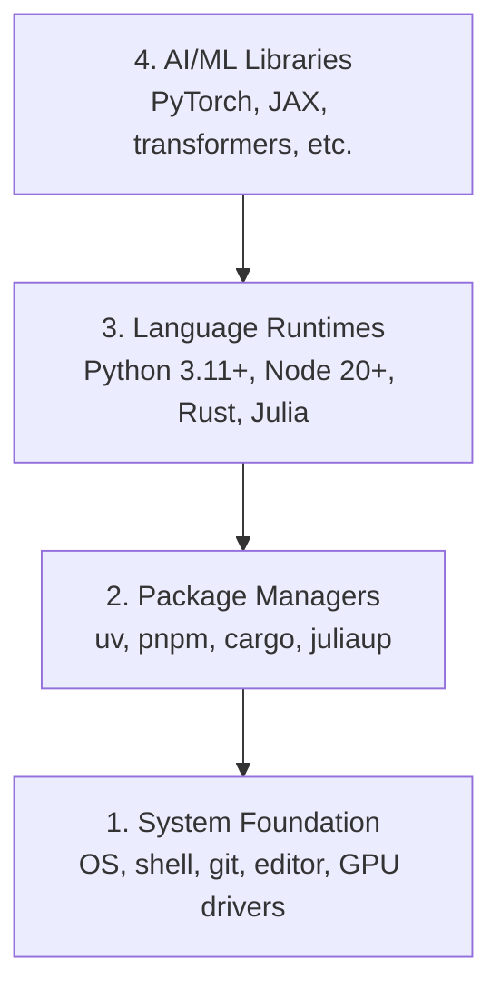

# पर्यावरण विकास पर्यावरण निर्माण

> आपके उपकरण आपकी सोच को आकार देते हैं, उन्हें एक बार सेट करें, उन्हें सही तरीके से सेट करें।

> **【中文解读】**आपका उपकरण आपके विचार को आकार देता है  एक बार में एक बार में एक अच्छा तरीका है, एक劳永逸── यह अध्याय पूरे पाठ्यक्रम का प्रारंभ बिंदु हैः आप एक पूर्ण एआई इंजीनियरिंग विकास पर्यावरण का निर्माण करेंगे  पायथन、 नोड. जेएस、 रुस्ट 工具链), और यह सत्यापित करें कि क्या जीपीयू तेजी से उपयोग करने योग्य है  पर्यावरण का निर्माण एआई सीखने में सबसे आसान है, लेकिन सबसे महत्वपूर्ण कदम है  पर्यावरण गलत है, बाद में हर कदम पर दस्तक देगा 

**Type:** Build | **类型:** 构建
**Languages:** Python, Node.js, Rust | **语言:** Python, Node.js, Rust
**Prerequisites:** None | **前置知识:** 无
**Time:** ~45 minutes | **时间:** ~45 分钟

## सीखने के लक्ष्य

- पायथन 3.11+, नोड.जेएस 20+, और रस्ट टूलचैन को खरोंच से सेट करें
  中文翻译: 零建构 Python 3.11+、Node.js 20+ 和 Rust 工具链
- पुनः प्रयोज्य बिल्ड के लिए वर्चुअल वातावरण और पैकेज प्रबंधक कॉन्फ़िगर करें
  中文翻译:配置虚拟环境和包管理器, सुनिश्चित करें कि निर्माण को पुनः प्राप्त किया जा सके
- CUDA/MPS के साथ GPU एक्सेस की जांच करें और एक टेस्ट टेंसर ऑपरेशन चलाएं
  中文翻译:验证 GPU(CUDA/MPS) क्या उपलब्ध है,运行测试张量运算
- चार-परत स्टैक को समझेंः सिस्टम, पैकेज, रनटाइम, एआई लाइब्रेरी
  中文翻译:理解四层技术:系统层、包管理器层、语言运行时层、AI库层

## समस्या का वर्णन

आप पायथन, टाइपस्क्रिप्ट, रुस्ट और जूलिया का उपयोग करके 500 से अधिक पाठों में एआई इंजीनियरिंग सीखने वाले हैं। यदि आपका वातावरण टूट जाता है, तो प्रत्येक पाठ सीखने के बजाय उपकरण बनाने के खिलाफ लड़ाई बन जाता है।

> आप 500 से अधिक वर्गों में एआई इंजीनियरिंग विकास सीखेंगे, जिसमें पायथन, टाइपस्क्रिप्ट, रुस्ट और जूलिया शामिल हैं। यदि आपके पर्यावरण में कोई समस्या है, तो प्रत्येक वर्ग सीखने के बजाय उपकरण के रूप में बदल जाएगा।

अधिकांश लोग पर्यावरण सेटअप छोड़ देते हैं, फिर वे आयात त्रुटियों, संस्करण संघर्षों और गायब CUDA ड्राइवरों डिबगिंग के लिए घंटे बिताते हैं. हम इसे एक बार करने जा रहे हैं, ठीक से.

> अधिकांश लोग पर्यावरण के निर्माण से कूद गए हैं। इसके बाद वे कुछ घंटे का समय निकालते हैं।

> **【中文解读】**
> 环境问题是你遇到" आयात त्रुटि""", संस्करण संघर्ष""",找不到 CUDA"等报错的根本原因──与其每次上课都修环境,不如一次性搭好──

## अवधारणा का मूल अवधारणा

एआई इंजीनियरिंग वातावरण में चार परतें होती हैंः

> एआई  इंजीनियरिंग पर्यावरण में चार स्तर हैंः



हम नीचे से ऊपर स्थापित करते हैं. प्रत्येक परत उसके नीचे की एक पर निर्भर करता है.

> हम खुद से नीचे ऊपर स्थापित हैं। प्रत्येक स्तर पर नीचे की एक परत पर निर्भर है।

> **【中文解读】**
> एआई इंजीनियरिंग वातावरण चार स्तरीय पिरामिटार हैः सबसे नीचे ऑपरेटिंग सिस्टम और ड्राइवर, ऊपर पैकेज मैनेजर, ऊपर लैंग्वेज रन-अप, शीर्ष स्तरीय पायटॉर्च, ट्रांसफार्मर आदि एआई भंडारण है।

> **【拓展：为什么需要 uv 而不是 pip？】**
> यूवी एक रास्ट लिखित पायथन 包 प्रबंधक है, जो पाइप 快 10-100 गुना की गति से अधिक है, और यह भी आभासी वातावरण का स्वचालित रूप से प्रबंधन कर सकता है। वास्तविक एआई परियोजनाओं में, आप कई परियोजनाओं पर निर्भरता को बनाए रख सकते हैं। उदाहरण के लिए, एक PyTorch 2.1 के साथ, दूसरा 2.4 के साथ, यूवी पर्यावरण को अलग करना बहुत सरल बना सकता है।
```figure
s0-env-stack
```

## इसे बनाओ।

> **【中文解读】**नीचे दिए गए चरणों में "नीचे से ऊपर" के क्रम में चार स्तरीय उपकरण स्थापित करें। प्रत्येक चरण को सीधे कॉपी किया जा सकता है।

### चरण 1: सिस्टम फाउंडेशन

अपने सिस्टम की जाँच करें और मूल बातें स्थापित करें.

> 检查你的系统并安装基础工具──

```bash
# macOS
xcode-select --install
brew install git curl wget

# Ubuntu/Debian
sudo apt update && sudo apt install -y build-essential git curl wget

# Windows (use WSL2)
wsl --install -d Ubuntu-24.04
```

### चरण 2: पायथन यूवी के साथ. चरण 2: पायथन स्थापित करने के लिए यूवी का उपयोग करें.

हम उपयोग करते हैं`uv` यह पाइप से 10-100 गुना तेज है और आभासी वातावरण को स्वचालित रूप से संभालता है।

> हम उपयोग `uv`यह पाइप 快 10-100 गुना, और स्वचालित रूप से वर्चुअल पर्यावरण का प्रबंधन कर सकता है

> **【拓展：Python 版本选择】** Python 3.12  स्थिर और प्रदर्शन अनुकूलन) 3.11+  हो सकता है, लेकिन 3.13  भाग AI 库 可能尚未适配) `python install`会自动下载和管理 Python 版本, अब कोई पीएनवी की आवश्यकता नहीं है

```bash
curl -LsSf https://astral.sh/uv/install.sh | sh

uv python install 3.12

uv venv
source .venv/bin/activate  # or .venv\Scripts\activate on Windows

uv pip install numpy matplotlib jupyter
```

सत्यापित करेंः

> 验证安装:

```python
import sys
print(f"Python {sys.version}")

import numpy as np
print(f"NumPy {np.__version__}")
a = np.array([1, 2, 3])
print(f"Vector: {a}, dot product with itself: {np.dot(a, a)}")
```

### चरण 3: Node.js के साथ pnpm.

> **【中文解读】**Node.js TypeScript का संचालन वातावरण है।

टाइपस्क्रिप्ट पाठों (एजेंट, एमसीपी सर्वर, वेब ऐप) के लिए।

> उपयोग किया गया है टाइपस्क्रिप्ट  पाठ्यक्रम(एजेंट、एमसीपी  सर्वर、वेब  अनुप्रयोग)

```bash
curl -fsSL https://fnm.vercel.app/install | bash
fnm install 22
fnm use 22

npm install -g pnpm

node -e "console.log('Node', process.version)"
```

**macOS / Apple Silicon (M1/M2/M3/M4):**यदि इंस्टॉलर के साथ बंद हो जाता है `Error: Cannot install under Rosetta 2 in ARM default prefix (/opt/homebrew)`, आपका टर्मिनल Rosetta 2 के तहत चल रहा है (`arch`छापें `i386`जबकि Homebrew एक मूल arm64 निर्माण है. fnm बल arm64 स्थापित करें, इसे अपने खोल में तार, फिर ऊपर से आदेशों को फिर से चलाएँ.`fnm install 22`:

> **苹果芯片 Mac 用户注意**: यदि安装器报错 `Error: Cannot install under Rosetta 2 in ARM default prefix (/opt/homebrew)`, अपने अंत में काम करने के लिए Rosetta 2 में स्पष्टीकरण`arch`输出 `i386`), जबकि होमब्रेव मूल रूप से Arm64 संस्करण है।`fnm install 22`开始重跑上的命令:

```bash
arch -arm64 brew install fnm
echo 'eval "$(fnm env --use-on-cd)"' >> ~/.zshrc
source ~/.zshrc
```

### चरण 4: जंग. चरण 4: जंग स्थापित करें.

प्रदर्शन-महत्वपूर्ण पाठों के लिए (उल्लेखना, प्रणालियों)

> कार्यप्रदर्शन संवेदनशील पाठ्यक्रमों के साथ

> **【中文解读】**रुस्ट इस पाठ्यक्रम में प्रदर्शन से संवेदनशील भागों के साथ प्रयोग किया जाता है, जैसे कि अनुकूलन की अवधारणा (Phase 12) और स्वयंसिस्टम्स (Phase 15-17);; रुस्ट रुस्ट है 官方安装器, लोड रुस्ट का पैकेज मैनेजर है + निर्माण उपकरण (Rust के संस्करण के बराबर है) ।

```bash
curl --proto '=https' --tlsv1.2 -sSf https://sh.rustup.rs | sh

rustc --version
cargo --version
```

### चरण 5: जूलिया (वैकल्पिक)

गणित के भारी पाठों के लिए जहां जूलिया चमकती है।

> जूलिया के लिए अच्छा गणित गहन प्रकार के पाठ्यक्रमों में उपयोग किया जाता है

```bash
curl -fsSL https://install.julialang.org | sh

julia -e 'println("Julia ", VERSION)'
```

### चरण 6: GPU सेटअप (यदि आपके पास एक है)

**NVIDIA (Linux / Windows):**

> **【中文解读】**NVIDIA 显卡先用 `nvidia-smi`确认驱动正常,再安装 CUDA 版 PyTorch;果芯片 Mac 没有 CUDA 属正常现象直接装默认版 PyTorch(内置 MPS/Metal 后端)即可,不要传 `--index-url .../cuXXX`(ये पहिया केवल लिनक्स / विंडोज को समर्थन करते हैं, असफल हो जाएगा)

```bash
nvidia-smi

# Install PyTorch with CUDA
uv pip install torch torchvision torchaudio --index-url https://download.pytorch.org/whl/cu124
```

**macOS / Apple Silicon (M1/M2/M3/M4):**मैक पर कोई CUDA नहीं है जो अपेक्षित है, कोई विफलता नहीं है।**not**पास `--index-url .../cuXXX`(वे पहियों केवल लिनक्स / विंडोज हैं, इसलिए स्थापना विफल होती है) सादा बिल्ड स्थापित करें, जिसमें एप्पल के एमपीएस (मेटल) जीपीयू बैकेंड शामिल हैः

> **macOS / 苹果芯片（M1/M2/M3/M4）**यह एक पूर्वानुमानित व्यवहार है, कोई दोष नहीं है।`--index-url .../cuXXX`(जिन पहियों केवल लिनक्स / विंडोज,传传传了安装会失败)

```bash
uv pip install torch torchvision torchaudio
```

सत्यापित करें (किसी भी प्लेटफॉर्म पर काम करता है):

> 验证(任意平台通用):

```python
import torch
print(f"CUDA available: {torch.cuda.is_available()}")           # False on macOS — expected
print(f"MPS available:  {torch.backends.mps.is_available()}")   # True on Apple Silicon
if torch.cuda.is_available():
    print(f"GPU: {torch.cuda.get_device_name(0)}")
```

कोई GPU नहीं? कोई समस्या नहीं. अधिकांश पाठ CPU पर काम करते हैं. प्रशिक्षण-भारी पाठ के लिए, Google Colab या क्लाउड GPU का उपयोग करें.

> 没有GPU?没关系── अधिकांश पाठ्यक्रम CPU पर चल सकते हैं── प्रशिक्षण की मात्रा वाले पाठ्यक्रम Google Colab या云端 GPU से चल सकते हैं──

> **【拓展：GPU vs CPU 性能对比】** प्रशिक्षण GPT-2 छोटा(117M 参数):CPU 约 7 天,单块 RTX 3090 约 3 小时,A100 约 40 分钟──推理阶段差距略小但仍然显著──本课程大部分课程可以使用CPU 跑,只有10期(从零训练LLM)等少数课程建议使用GPU──

> **【拓展：GPU 在 AI 中的作用】**
> GPU (आकार संसाधित) का कारण यह है कि यह एक ही समय में हजारों सरल गणनाओं को निष्पादित कर सकता है।

### चरण 7: आप जिस मार्ग से शुरू करना चाहते हैं, उसे सत्यापित करें।

इस पाठ में प्रत्येक आदेश को भंडारण रूट से चलाएं, निर्देशिका जो
`README.md`और `phases/`उड़ान से पहले केवल वही जांचता है जो आपको चाहिए
यह बाद के उपकरणों को डिफ़ॉल्ट रूप से छोड़ देता है ताकि एक नया छात्र देख सके
चेतावनी की दीवार के बजाय एक स्पष्ट उत्तर।

> इस वर्ग के सभी आदेश भंडारण के मूल सूची में शामिल हैं`README.md`和 `phases/`️️️️️️️️️️️️️️️️️️️️️️️️️️️️️️️️️️️️️️️️️️️️️️️️️️️️️️️️️️️️️️️️️️️️️️️️️️️️️️️️️️️️️️️️️️️️️️️️️️️️️️️️️️️️️️️️️️️️️️️️️️️️️️️️️️️️️️️️️️️️️️️️️️️️️️️️️️️️️️️️️️️️️️️️️️️️️️️️️️️️️️️️️️️️️️️️️️️️️️️️️️️️️️️️️️️️️️️️️️️️️️️️️️️️️️️️️️️️️️️️️️️️️️️️️️️️️️️️️️️️️️️️️️️️️️️️️️️️️️️️️️️️️️️️️️️️️️️️️️️️️️️️️️️️️️️️️️️️️️️️️️️️️️️️️️️️️️️️️️️️️️️️️️️️️️️️️️️️️️️️️️️️️️️️️️️️️️️️️️️️️️️️️️️️️️️️️️️️️️️️️️️️️️️️️️️️️️️️️️️️️️️️️️️️️️️️️️️️️️️️️️️️️️️️️️️️️️️️️️️️️️️️️️️️️️️️️️️️️️️️️️️️️️️️️️️️️️️️️️️️️️️️️️️️

शुरुआत की पूरी अनुक्रम शुरू करेंः

> start पूर्ण शुरुवातकर्ता क्रम:

```bash
python3 phases/00-setup-and-tooling/01-dev-environment/code/verify.py --route beginner
```

या केवल मार्ग की जाँच करें आप चाहते हैंः

> या बस जाँच आप सीखना चाहते हैं मार्गः

```bash
python3 phases/00-setup-and-tooling/01-dev-environment/code/verify.py --route ml-foundations
python3 phases/00-setup-and-tooling/01-dev-environment/code/verify.py --route llm-engineering
python3 phases/00-setup-and-tooling/01-dev-environment/code/verify.py --route agents
python3 phases/00-setup-and-tooling/01-dev-environment/code/verify.py --route mcp
python3 phases/00-setup-and-tooling/01-dev-environment/code/verify.py --route agent-skills
python3 phases/00-setup-and-tooling/01-dev-environment/code/verify.py --route certification
```

जोड़ें `--show-later`जब आप वैकल्पिक उपकरण का निरीक्षण करने के लिए एक ही पूर्व उड़ान चाहते हैं
एक अनुपस्थित बाद के उपकरण कभी भी
चयनित मार्ग।

> ️पहली परीक्षा के साथ-साथ परीक्षा के बाद के पाठ्यक्रमों का उपयोग करने के लिए विकल्प उपकरण और निर्भरता समय, प्लस `--show-later`                                                                                                                                                                                                                                                              

प्रत्येक असफल आवश्यक जांच में पता चला पथ या आयात त्रुटि और एक
एजेंट कौशल और प्रमाणन मार्गों भी दिखाता है
मैनुअल होस्ट जांच क्योंकि एक पायथन स्क्रिप्ट साबित नहीं कर सकता है कि एक एआई होस्ट है
किसी कौशल की खोज की या आपके द्वारा चुने गए कौशल का दायरा लिखना योग्य है।

> प्रत्येक असफल आवश्यक जांच कार्यक्रम में जांच किए गए पथ या आयात  त्रुटि, साथ ही एक सटीक सुधार आदेश शामिल होंगे।

जब शुरुआती प्री-फ्लाइट गुजरता है, यह सटीक पहला चलाने योग्य पाठ प्रिंट करता हैः

> जब प्रारंभिक छात्र पूर्व परीक्षा पास करते हैं, तो स्क्रिप्ट निश्चित रूप से पहले चलने योग्य पाठ्यक्रम को छाप देगाः

```text
Ready to start Beginner course.
Next: python3 phases/01-math-foundations/01-linear-algebra-intuition/code/vectors.py
```

> **【中文解读】**预检脚本是"按路线最小环境"哲学落地:初学者只需要Python和Git,ml-foundations 再加 NumPy,agents/mcp 路线连 Node 都可以先不装用到再装`python3`换成 `python`इम्को.

## इसे उपयोग करें गाइड का उपयोग करें

> **【中文解读】**नीचे दिए गए आलेख आपको बता रहे हैं कि किस चरण में प्रत्येक भाषा का उपयोग किया जाता है। पाइथन एक पूर्ण शक्ति है। चरण 1-12), टाइपस्क्रिप्ट एजेंट और उपकरण श्रृंखला के लिए उपयोग किया जाता है। चरण 13-17), रुस्ट उच्च प्रदर्शन वाले परिदृश्य के लिए उपयोग किया जाता है।

आपके पर्यावरण को आपके द्वारा जाँच किए गए मार्ग को शुरू करने के लिए तैयार है। बाद के उपकरण स्थापित करें
जब एक पाठ आपके पहले पाठ को पूरी तरह से अवरुद्ध करने के बजाय उनके लिए पूछता है
यहाँ है कि आप पाठ्यक्रम में उपयोग करेंगेः

> आपके पर्यावरण ने पहले ही आपके द्वारा जाँच की गई उस लाइन को शुरू कर दिया है। बाद के उपकरण आदि, जब तक पाठ्यक्रम का उपयोग नहीं किया जाता, तब तक पुनः स्थापित नहीं किया जाता है, पूरी तकनीक को आपके पहले भाग को रोकना न दें।

| Language | Used In | Package Manager |
|----------|---------|-----------------|
| Python | Phases 1-12 (ML, DL, NLP, Vision, Audio, LLMs) | uv |
| TypeScript | Phases 13-17 (Tools, Agents, Swarms, Infra) | pnpm |
| Rust | Phases 12, 15-17 (Performance-critical systems) | cargo |
| Julia | Phase 1 (Math foundations) | Pkg |

| 语言 | 用在哪些阶段 | 包管理器 |
|------|------------|---------|
| Python | 阶段 1-12（ML、DL、NLP、视觉、音频、LLM） | uv |
| TypeScript | 阶段 13-17（工具、Agent、集群、基础设施） | pnpm |
| Rust | 阶段 12, 15-17（高性能系统） | cargo |
| Julia | 阶段 1（数学基础） | Pkg |

## इसे भेजें उत्पाद

> **【拓展：环境检查 Prompt】** `outputs/prompt-env-check.md`यह एक ऐसा प्रॉम्प्ट है जिसे आप सीधे एआई के सहायक के लिए उपयोग कर सकते हैं, जिससे यह आपको पर्यावरण की समस्या का निदान करने में मदद कर सके।

इस पाठ में एक सत्यापन स्क्रिप्ट उत्पन्न होती है जिसे कोई भी अपनी सेटिंग की जांच करने के लिए चला सकता है।

> इस कक्षा में एक प्रमाण पत्र लिखा गया है, जिसे कोई भी अपने पर्यावरण के अनुकूलन की जांच करने के लिए चला सकता है।

देखो`outputs/prompt-env-check.md`एक संकेत के लिए जो एआई सहायकों को पर्यावरण के मुद्दों का निदान करने में मदद करता है।

> 参见 `outputs/prompt-env-check.md`, जिसमें एक सहायता एआई सहायक निदान पर्यावरण समस्याएं शामिल हैं।

## अभ्यास विषय

1. सत्यापन स्क्रिप्ट चलाएँ और किसी भी विफलता को ठीक करें
   运行验证脚本并修复所有失败的检查项
2. इस पाठ्यक्रम के लिए एक पायथन आभासी वातावरण बनाएं और PyTorch स्थापित करें
   इस कोर्स में पायथन 虚拟环境 बनाएं और पायटॉर्च स्थापित करें
3. चार भाषाओं में "हैलो वर्ल्ड" लिखें और प्रत्येक को चलाएं
   चार भाषाओं में एक "हैलो वर्ल्ड" लिखें और काम करें
