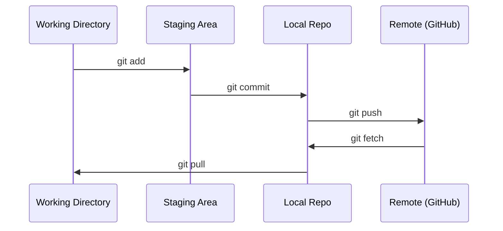

# Git और सहयोग

> प्रत्येक प्रयोग, प्रत्येक मॉडल, प्रत्येक पाठ जो आप यहां बनाते हैं, उसका ट्रैक किया जाता है।
>  संस्करण नियंत्रण कोई विकल्प नहीं है  आपके प्रत्येक प्रयोग  प्रत्येक मॉडल  प्रत्येक अनुभाग के परिणामों का पता लगाया जाएगा 

**Type:** Learn | **类型:** 学习
**Languages:** -- | **语言:** 无
**Prerequisites:** Phase 0, Lesson 01 | **前置知识:** Phase 0, 第 01 课
**Time:** ~30 minutes | **时间:** ~30 分钟

## सीखने के लक्ष्य

- git पहचान को कॉन्फ़िगर करें और जोड़ने, प्रतिबद्ध करने और पुश के दैनिक कार्यप्रवाह का उपयोग करें
  中文翻译: विन्यास Git 身份信息,掌握添加、承诺、推的日常工作流
- बिना किसी प्रमुख टूटने के अलग-अलग प्रयोगों के लिए शाखाएं बनाएं और मिलाएं
  चीनी अनुवादः निर्माण और सहसं并分支, प्रयोग को निष्क्रिय रूप से अलग करना
- एक लिखें `.gitignore`जो मॉडल चेकपोइंट और बड़ी बाइनरी फाइलों को छोड़कर
  中文翻译:编写 `.gitignore`文件,排除模型检查点和大文件
-  के साथ प्रतिबद्धता इतिहास में नेविगेट करें`git log`परियोजना विकास को समझने के लिए
  中文翻译:用 `git log`浏览提交历史,了解项目发展过程

> **【中文解读】**
> Git एक संस्करण नियंत्रण उपकरण है, जो कोड के प्रत्येक संशोधन को ट्रैक करने के लिए उपयोग किया जाता है। AI परियोजनाओं में, आप प्रयोग में अक्सर मॉडल पैरामीटर और कोड को संशोधित करेंगे, Git आपको किसी भी स्थिति में वापस लौटने की अनुमति देगा।

> **【拓展：Git 在 AI 工程中的角色】**एआई 工程 और पारंपरिक सॉफ्टवेयर विकास अलग हैं प्रत्येक प्रयोग 超参数调整、数据集变更) एक" संस्करण" हैं Git  ट्रैकिंग प्रयोग का अर्थ हैः प्रशिक्षण परिणाम बदल गया है, आप कर सकते हैं `git diff`找出什么改了; मॉडल तैनात आउट समस्या, हो सकता है `git revert`回滚──大模型团队 (जैसे Hugging Face) का सहयोग प्रक्रिया पूरी तरह से Git पर आधारित है 之之──

## समस्या का वर्णन

आप 20 चरणों में सैकड़ों कोड फ़ाइलें लिखने के बारे में हैं। बिना संस्करण नियंत्रण आप काम खो देंगे, आप चीजों को तोड़ देंगे आप रद्द नहीं कर सकते, और दूसरों के साथ सहयोग करने का कोई तरीका नहीं होगा।

> आप 20 चरणों में सैकड़ों कोड फ़ाइलों को लिखने जा रहे हैं। बिना संस्करण नियंत्रण के, आप काम के परिणाम खो देंगे।

Git उपकरण है. GitHub जहां कोड रहता है. यह सबक आप इस पाठ्यक्रम के लिए क्या जरूरत है और कुछ भी नहीं कवर.

> Git यंत्र है, GitHub कोड प्रबंधन की जगह है।

> **【中文解读】**
> आप कुछ सौ कोड फ़ाइलें लिखेंगे, बिना संस्करण नियंत्रण = 随时可能失去工作成果、无法回归、无法合作──Git 解决的就是这个问题──

## अवधारणा का मूल अवधारणा



तीन बातें याद रखनाः
1. अक्सर बचत करें (`git commit`)
2. दूरस्थ पर धक्का (`git push`)
3. प्रयोगों के लिए शाखा (`git checkout -b experiment`)

> तीन बातें याद रखना हैः
> 1. 经常保存(`git commit`)
> 2. 推送到远程(`git push`)
> 3. प्रयोग करने के लिए प्रयोग करें`git checkout -b experiment`)

> **【中文解读】**
> Git का मूल प्रवाहः工作目录 → 暂存区(git add)→ 本地仓库(git commit)→ 远程仓库(git push)。记住三件事:经常提交、推送到远程、用分支做实验──

> **【拓展：分支策略与 AI 实验】**एआई  परियोजना   "प्रति प्रयोग एक分支" रणनीति:`experiment/lr-0.001``experiment/add-dropout`等── इस प्रकार प्रत्येक प्रयोग के कोड में परिवर्तन होते हैं, प्रयोग विफल होता है, सीधे हटा दिया जाता है, सफलता मिलती है.`v1.0-baseline`), सुविधाजनक तैनाती के लिए, कोड संस्करण का विवरण

## इसे बनाओ, इसे पूरा करो।
```figure
s0-commit-dag
```

## इसे बनाओ

### चरण 1: git को कॉन्फ़िगर करें

> 第1步: विन्यास Git

```bash
git config --global user.name "Your Name"
git config --global user.email "you@example.com"
```

### चरण 2: दैनिक कार्यप्रवाह

```bash
git status                              # 查看哪些文件有改动
git add file.py                         # 把改动加入暂存区
git commit -m "Add perceptron implementation"  # 提交到本地仓库
git push origin main                    # 推送到 GitHub 远程仓库
```

### चरण 3: प्रयोगों के लिए शाखाओं के प्रयोगों के लिए शाखाओं के साथ

```bash
git checkout -b experiment/new-optimizer  # 创建并切换到新分支

# ... make changes, commit ...  # 在新分支上修改和提交，不影响主分支

git checkout main                         # 切回主分支
git merge experiment/new-optimizer        # 把实验分支的改动合并到主分支
```

### चरण 4: इस पाठ्यक्रम के साथ काम करने के लिए रेपो.

> **【拓展：Fork vs Clone】**यदि आप अपने सीखने की प्रगति को मूल भंडारण को प्रभावित किए बिना सहेजना चाहते हैं, तो उपयोग करें।`fork`(GitHub पर ऊपर ऑपरेशन) सीधे क्लोन के बजाय। फोर्क के बाद आपके पास अपनी एक पूर्ण प्रति है, जिसे आप स्वतंत्र रूप से प्रस्तुत कर सकते हैं। इसके बाद आप पुल अनुरोध के माध्यम से भी प्रस्तुत कर सकते हैं।

आप पाठ्यक्रम रेपो खुद को धक्का नहीं कर सकते  केवल रखरखावकर्ताओं को लिखने की पहुंच है. इसे पहले GitHub पर फोर्क (फोर्क बटन, शीर्ष दाएं) तो `origin`अपने स्वयं के प्रति में अंकः

```bash
git clone https://github.com/YOUR-USERNAME/ai-engineering-from-scratch.git
cd ai-engineering-from-scratch

git checkout -b my-progress
# work through lessons, commit your code
git push origin my-progress
```

## इसे उपयोग करें गाइड का उपयोग करें

> **【拓展：.gitignore 在 AI 项目中至关重要】**AI  परियोजनाएं उत्पन्न होगी भारी मात्रा में प्रस्तुत नहीं किया जाना चाहिए`.pt``.safetensors`कोडाक10 GB) ≈ प्रशिक्षण日志、 डेटा集缓存(`__pycache__``.venv`)―एक अच्छा `.gitignore`能防止您意外把10GB के मॉडल फ़ाइल को GitHub पर推送──推使用 `gitignore.io`生成 Python/ML 项目的模板──

इस कोर्स के लिए, आपको इन आदेशों की आवश्यकता हैः

> इस कोर्स में आपको बस इन आदेशों की आवश्यकता हैः

| Command | When |
|---------|------|
| `git clone` | Get the course repo |
| `git add` + `git commit` | Save your work |
| `git push` | Back it up to GitHub |
| `git checkout -b` | Try something without breaking main |
| `git log --oneline` | See what you've done |

| 命令 | 什么时候用 |
|------|-----------|
| `git clone` | 下载课程仓库 |
| `git add` + `git commit` | 保存你的工作 |
| `git push` | 备份到 GitHub |
| `git checkout -b` | 安全地尝试新想法 |
| `git log --oneline` | 查看你做了什么 |

यह है, आप इस पाठ्यक्रम के लिए रीबेस, चेरी-पिक, या उप मॉड्यूल की जरूरत नहीं है.

> इन सबको लेकर इस कोर्स को रीबेस, चेरी-पिक या सबमॉड्यूल की जरूरत नहीं है।

## अभ्यास विषय

1. इस रेपो को क्लोन करें, एक शाखा बनाएं जिसे कहा जाता है `my-progress`, एक फ़ाइल बनाने, इसे प्रतिबद्ध, इसे धक्का
   克隆仓库,创建 `my-progress`分支,新建文件,提交并推送
1. इस रेपो फोर्क, अपने फोर्क क्लोन, एक शाखा का निर्माण कहा जाता है`my-progress`, एक फ़ाइल बनाने, इसे प्रतिबद्ध, इसे धक्का
2. एक बनाओ `.gitignore`जो कि चेकपॉइंट फाइलों के मॉडल को छोड़कर (`.pt`,`.pth`,`.safetensors`)
   创建 `.gitignore`文件,排除模型检查点文件
3. इस रेपो के साथ प्रतिबद्धता इतिहास को देखो `git log --oneline`और पढ़ें कि कैसे पाठों को जोड़ा गया
   उपयोग `git log --oneline`查看提交历史, जानें कैसे पाठ्यक्रम है चरणबद्ध रूप से निर्मित

## Key Terms  Key Terms  Key Terms  Key Terms  Key Terms  Key Terms  Key Terms  Key Terms  Key Terms  Key Terms  Key Terms  Key Terms  Key Terms  Key Terms  Key Terms  Key Terms  Key Terms  Key Terms  Key Terms  Key Terms  Key Terms  Key Terms  Key Terms  Key Terms  Key Terms  Key Terms  Key Terms  Key Terms  Key Terms  Key Terms  Key Terms  Key Terms  Key Terms  Key Terms  Key Terms  Key Terms  Key Terms  Key Terms  Key Terms  Key Terms  Key Terms  Key Terms  Key Terms  Key Terms  Key Terms  Key Terms  Key Terms  Key Terms  Key Terms  Key Terms  Key Terms  Key Terms  Key Terms  Key Terms  Key Terms  Key Terms  Key Terms  Key Terms  Key Terms  Key Terms  Key Terms  Key Terms  Key Terms  Key Terms  Key Terms  Key Terms  Key Terms  Key Terms  Key Terms  Key Terms  Key Terms  Key Terms  Key Terms  Key Terms  Key Terms  Key Terms  Key Terms  Key Terms  Key Terms  Key Terms  Key Terms  Key Terms  Key Terms  Key Terms  Key Terms  Key Terms  Key Terms  Key Terms  Key Terms  Key Terms  Key Terms  Key Terms  Key Terms  Key Terms  Key Terms  Key Terms  Key Terms  Key Terms  Key Terms  Key Terms  Key Terms  Key Terms  Key Terms  Key Terms  Key Terms  Key Terms  Key Terms  Key Terms  Key

> **【中文解读】**Commit (commit) = 项目快照, Branch (分支) = 独立开发线, Merge (Merge) = 分支改动合回来,Remote (Remote) = GitHub (GitHub) पर भंडारण副本── इन चार अवधारणाओं को आत्मसात करना

| Term | What people say | What it actually means |
|------|----------------|----------------------|
| Commit | "Saving" | A snapshot of your entire project at a point in time |
| Branch | "A copy" | A pointer to a commit that moves forward as you work |
| Merge | "Combining code" | Taking changes from one branch and applying them to another |
| Remote | "The cloud" | A copy of your repo hosted somewhere else (GitHub, GitLab) |

| 术语 | 俗称 | 实际含义 |
|------|------|---------|
| Commit | "保存" | 项目在某一时刻的完整快照 |
| Branch | "副本" | 指向某个提交的可移动指针，随工作向前推进 |
| Merge | "合并代码" | 将一个分支的改动应用到另一个分支 |
| Remote | "云端" | 托管在其他地方的仓库副本（如 GitHub、GitLab） |
