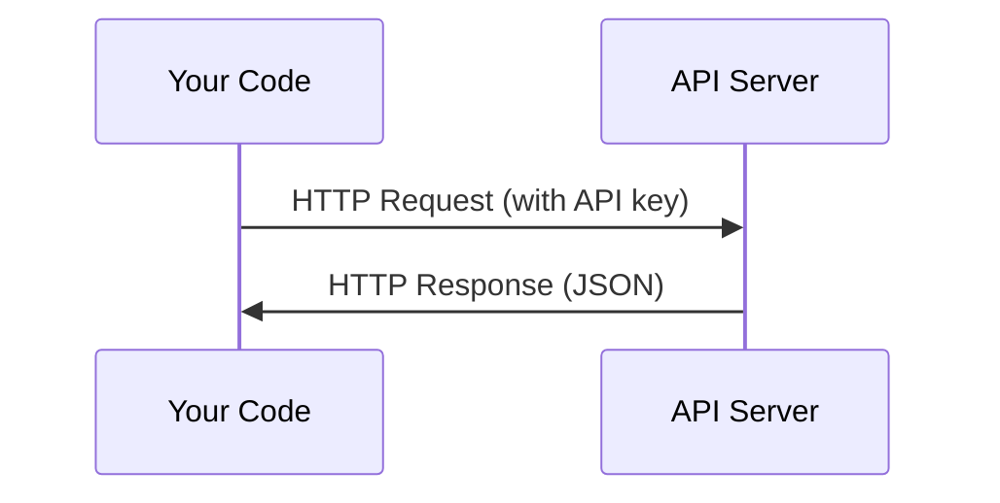

# एपीआई और कुंजी एपीआई और कुंजी प्रबंधन

> हर एआई एपीआई एक ही तरीके से काम करता हैः एक अनुरोध भेजें, एक प्रतिक्रिया प्राप्त करें। विवरण बदलते हैं, पैटर्न नहीं।
> सभी एआई एपीआई का कामकाज विधि एक ही हैः भेजें अनुरोध, प्राप्त करें प्रतिक्रिया, विवरण अलग, मॉडल नहीं बदलता।

**Type:** Build | **类型:** 构建
**Languages:** Python, TypeScript | **语言:** Python, TypeScript
**Prerequisites:** Phase 0, Lesson 01 | **前置知识:** Phase 0, 第 01 课
**Time:** ~30 minutes | **时间:** ~30 分钟

## सीखने के लक्ष्य

- पर्यावरण चर का उपयोग करके एपीआई कुंजी को सुरक्षित रूप से स्टोर करें और `.env`फ़ाइलें
  中文翻译: उपयोग环境变量和 `.env`文件安全存储 एपीआई 密钥
- मानव पायथन एसडीके और कच्चे HTTP दोनों का उपयोग करके एलएलएम एपीआई कॉल करें
  中文翻译: उपयोग एंथ्रोपिक पायथन एसडीके 和原始 HTTP 两种方式调用 LLM API
- डिबगिंग के लिए SDK आधारित और कच्चे HTTP अनुरोध/उत्तर प्रारूपों की तुलना करें
  चीनी अनुवादः से तुलना करें एसडीके और मूल HTTP के अनुरोध/उत्तर प्रारूप, ताकि调试
- प्रमाणीकरण और दर सीमाओं सहित सामान्य एपीआई त्रुटियों की पहचान और निपटान
  चिन文翻译:识别并处理常见 API 错误,认证和限流问题 सहित

> **【中文解读】**
> सभी एआई एपीआई के कामकाज के तरीके समान हैंः अनुरोध भेजें, प्रतिक्रिया प्राप्त करें। यह आपको सिखाता है कि एपीआई की कुंजी का सुरक्षित प्रबंधन कैसे करें। एएलएलएम एपीआई का उपयोग करें, साथ ही एसडीके के उपयोग और मूल एचटीटीपी अनुरोधों के बीच अंतर को समझें। यह एआई एजेंट के बाद के निर्माण का आधार है।

## समस्या का वर्णन

चरण 11 से शुरू करते हुए, आप LLM API (एंट्रोपिक, ओपनएआई, गूगल) को कॉल करेंगे। चरण 13-16 में आप एजेंट बनाएंगे जो इन API का उपयोग लूप में करते हैं। आपको यह जानना होगा कि API कुंजी कैसे काम करती है, उन्हें सुरक्षित रूप से कैसे संग्रहीत किया जाए, और अपनी पहली API कॉल कैसे करें।

> चरण 11 से शुरू होकर, आप LLM API का उपयोग करेंगे। मानव विज्ञान, ओपन एआई, गूगल। चरण 13-16 में, आप इन एपीआई के एजेंट का उपयोग करके एक चक्र का निर्माण करेंगे। आपको एपीआई की कुंजी के कामकाज के सिद्धांत को जानने की आवश्यकता है।

> **【中文解读】**
> चरण 11 से शुरू होकर, आप LLM API का उपयोग करेंगे; चरण 13-16 में, आप एपीआई के एजेंट का निर्माण करेंगे।

## अवधारणा का मूल अवधारणा



प्रत्येक एपीआई कॉल में हैः
1. एक अंत बिंदु (URL)
2. एपीआई कुंजी (प्रमाणन)
3. अनुरोध निकाय (आप क्या चाहते हैं)
4. एक प्रतिक्रिया शरीर (आप क्या वापस मिलता है)

> प्रत्येक एपीआई 调用 में चार तत्व होते हैंः
> 1. 端点(URL)
> 2. एपीआई 密钥(身份认证)
> 3. अनुरोध करें (आप क्या चाहते हैं)
> 4. 响应体(返回什么)

> **【中文解读】**
> प्रत्येक एपीआई 调用包含四要素:端点 URL、API 密钥(身份认证) 请求体(你想要什么) 响应体(返回什么) 😇

> **【拓展：API 在 AI Agent 中的角色】**
> एआई एजेंट का मूल चक्र यह हैः निर्माण संकेत शब्द → 调用 LLM API → 解析响应 → 执行动作 → 再次调用 API──掌握 API 调用是构建 एजेंट का पहला कदम──
```figure
s0-secret-inject
```

## इसे बनाओ

## इसे बनाओ, इसे पूरा करो।

> **【拓展：API 密钥安全的铁律】**绝不把API key 硬编码在代码里── एक बार GitHub पर पहुंचा तो爬虫会在几秒内发现并滥用你的密钥(真实案例: किसी ने कोड में OpenAI कुंजी लिखी, कुछ ही घंटों में इसे चकमा दिया) `.env`文件 + `python-dotenv`या परिचालन प्रणाली पर्यावरण परिवर्तन

### चरण 1: सुरक्षित रूप से एपीआई कुंजी स्टोर करें

कभी भी एपीआई कुंजी को कोड में न डालें। पर्यावरण चर का उपयोग करें।

> 永远不要把API 密钥写在代码里.

```bash
export ANTHROPIC_API_KEY="sk-ant-..."  # 设置环境变量（密钥永远不要写在代码里！）
export OPENAI_API_KEY="sk-..."
```

या एक `.env`फ़ाइल (इसका जोड़ें `.gitignore`):

> या उपयोग `.env`文件(याद है जोड़ा गया था `.gitignore`):

```
ANTHROPIC_API_KEY=sk-ant-...  # .env 文件（确保加入 .gitignore）
OPENAI_API_KEY=sk-...
```

### चरण 2: पहला एपीआई कॉल (पायथन)

```python
import os

import anthropic

client = anthropic.Anthropic()  # 自动从环境变量读取密钥

MODEL = os.environ.get("LLM_MODEL", "claude-sonnet-5")

response = client.messages.create(
    model="claude-sonnet-4-20250514",  # 指定模型
    max_tokens=256,  # 最大输出长度
    messages=[{"role": "user", "content": "What is a neural network in one sentence?"}]  # 用户消息
    model=MODEL,
    max_tokens=256,
    messages=[{"role": "user", "content": "What is a neural network in one sentence?"}]
)

print(response.content[0].text)  # 打印模型回复
```

### चरण 3: पहला एपीआई कॉल (टाइपस्क्रिप्ट)

> **【拓展：Token 计费机制】**LLM API 按token计费:क्लाउड सोनेट 约 $3/百万输入 token、$15/मिलियन输出 टोकन── एक अंग्रेजी单词约1.3 个 टोकन, एक中文字约2-3 个 टोकन──`max_tokens=256`इसका अर्थ है कि मॉडल सबसे अधिक 256 टोकन आउटपुट करता है।`max_tokens`लागत बचत का एक महत्वपूर्ण साधन है।
`LLM_MODEL`अन्य प्रदाता (ओपनएआई, गूगल, और अन्य) एक कुंजी के समान पैटर्न का पालन करते हैं, लेकिन प्रत्येक के पास अपना एसडीके, एंडपॉइंट और अनुरोध / प्रतिक्रिया योजना है।

### चरण 3: पहला एपीआई कॉल (टाइपस्क्रिप्ट)

```typescript
import Anthropic from "@anthropic-ai/sdk";

const client = new Anthropic();

const MODEL = process.env.LLM_MODEL ?? "claude-sonnet-5";

const response = await client.messages.create({
  model: MODEL,
  max_tokens: 256,
  messages: [{ role: "user", content: "What is a neural network in one sentence?" }],
});

console.log(response.content[0].text);
```

### चरण 4: कच्चे HTTP (कोई SDK)

```python
import os
import urllib.request
import json

url = "https://api.anthropic.com/v1/messages"  # API 端点
headers = {
    "Content-Type": "application/json",  # 请求格式为 JSON
    "x-api-key": os.environ["ANTHROPIC_API_KEY"],  # 从环境变量读取密钥
    "anthropic-version": "2023-06-01",  # API 版本号
}
body = json.dumps({
    "model": "claude-sonnet-4-20250514",  # 模型名称
    "max_tokens": 256,  # 最大输出 token 数
    "model": os.environ.get("LLM_MODEL", "claude-sonnet-5"),
    "max_tokens": 256,
    "messages": [{"role": "user", "content": "What is a neural network in one sentence?"}],
}).encode()

req = urllib.request.Request(url, data=body, headers=headers, method="POST")  # 构造 POST 请求
with urllib.request.urlopen(req) as resp:
    result = json.loads(resp.read())  # 解析 JSON 响应
    print(result["content"][0]["text"])  # 提取并打印回复文本
```

यह है कि SDKs हुड के नीचे क्या करते हैं. कच्चे HTTP कॉल को समझने डिबगिंग करते समय मदद करता है.

> यह एसडीके के निचले स्तर की बात है। मूल HTTP को समझने के लिए यह प्रयोग करने में मदद करता है।

> **【中文解读】**
> SDK  सिर्फ HTTP अनुरोध के लिए कोपेन करें  मूल HTTP 调用 को समझना आपको API 问题调试 处理错误甚至 SDK में असमर्थित भाषाओं में API调用 में मदद कर सकता है

## इसे उपयोग करें गाइड का उपयोग करें

> **【中文解读】**现在不需要注册所有API──Phase 4-10 用拥抱脸(免费),Phase 11-16 需要人类学或开放AI──等课程用到时再注册即可──

इस कोर्स के लिएः

> 本课程中:

| API | When you need it | Free tier |
|-----|-----------------|-----------|
| Anthropic (Claude) | Phases 11-16 (agents, tools) | $5 credit on signup |
| OpenAI | Phase 11 (comparison) | $5 credit on signup |
| Hugging Face | Phases 4-10 (models, datasets) | Free |

| API | 何时需要 | 免费额度 |
|-----|---------|---------|
| Anthropic (Claude) | 阶段 11-16（Agent、工具） | 注册送 $5 额度 |
| OpenAI | 阶段 11（对比实验） | 注册送 $5 额度 |
| Hugging Face | 阶段 4-10（模型、数据集） | 免费 |

आपको अभी उन सभी की जरूरत नहीं है, उन्हें जब पाठ की आवश्यकता होगी, तब सेट करें।

> आप को अब सभी एपीआई को पंजीकृत करने की आवश्यकता नहीं है।

## इसे भेजें उत्पाद

> **【拓展：429 限流处理】**调用 LLM API 时最常见的错误是429 Rate Limit──处理方式:指数退避重试(等 1s → 2s → 4s → 8s)──Anthropic SDK 内置自动重试, लेकिन सिद्धांत को समझना महत्वपूर्ण है  वास्तविक एजेंट 系统 में, आपको लागत को नियंत्रित करने और बंद होने से बचने के लिए खुद को सीमित प्रवाह तर्क को लागू करने की आवश्यकता हो सकती है

इस पाठ से उत्पन्न होता हैः
- `outputs/prompt-api-troubleshooter.md`- आम एपीआई त्रुटियों का निदान

> 本课产出:
> - `outputs/prompt-api-troubleshooter.md`- 诊断常见 API 错误的提示

## अभ्यास विषय

1. एक मानव एपीआई कुंजी प्राप्त करें और अपनी पहली एपीआई कॉल करें
   Get Anthropic एपीआई की कुंजी, अपने पहले एपीआई 调用 पूरा
2. कच्चे HTTP संस्करण की कोशिश करें और प्रतिक्रिया प्रारूप की तुलना SDK संस्करण के साथ करें
   尝试原始 HTTP 方式调用, के लिए एसडीके 方式 के प्रतिक्रिया प्रारूप
3. जानबूझकर गलत एपीआई कुंजी का उपयोग करें और त्रुटि संदेश पढ़ें
   इसलिए गलत उपयोग एपीआई कुंजी, गलत जानकारी पढ़ें

## Key Terms  Key Terms  Key Terms  Key Terms  Key Terms  Key Terms  Key Terms  Key Terms  Key Terms  Key Terms  Key Terms  Key Terms  Key Terms  Key Terms  Key Terms  Key Terms  Key Terms  Key Terms  Key Terms  Key Terms  Key Terms  Key Terms  Key Terms  Key Terms  Key Terms  Key Terms  Key Terms  Key Terms  Key Terms  Key Terms  Key Terms  Key Terms  Key Terms  Key Terms  Key Terms  Key Terms  Key Terms  Key Terms  Key Terms  Key Terms  Key Terms  Key Terms  Key Terms  Key Terms  Key Terms  Key Terms  Key Terms  Key Terms  Key Terms  Key Terms  Key Terms  Key Terms  Key Terms  Key Terms  Key Terms  Key Terms  Key Terms  Key Terms  Key Terms  Key Terms  Key Terms  Key Terms  Key Terms  Key Terms  Key Terms  Key Terms  Key Terms  Key Terms  Key Terms  Key Terms  Key Terms  Key Terms  Key Terms  Key Terms  Key Terms  Key Terms  Key Terms  Key Terms  Key Terms  Key Terms  Key Terms  Key Terms  Key Terms  Key Terms  Key Terms  Key Terms  Key Terms  Key Terms  Key Terms  Key Terms  Key Terms  Key Terms  Key Terms  Key Terms  Key Terms  Key Terms  Key Terms  Key Terms  Key Terms  Key Terms  Key Terms  Key Terms  Key Terms  Key Terms  Key Terms  Key Terms  Key Terms  Key Terms  Key

| Term | What people say | What it actually means |
|------|----------------|----------------------|
| API key | "Password for the API" | A unique string that identifies your account and authorizes requests |
| Rate limit | "They're throttling me" | Maximum requests per minute/hour to prevent abuse and ensure fair usage |
| Token | "A word" (in API context) | A billing unit: input and output tokens are counted and charged separately |
| Streaming | "Real-time responses" | Getting the response word by word instead of waiting for the full response |

| 术语 | 俗称 | 实际含义 |
|------|------|---------|
| API key | "API 密码" | 标识你账户并授权请求的唯一字符串 |
| Rate limit | "被限流了" | 每分钟/小时的请求上限，防止滥用 |
| Token | "词"（API 语境） | 计费单位：输入和输出 token 分别计费 |
| Streaming | "实时响应" | 逐词返回响应，而非等待完整响应 |
