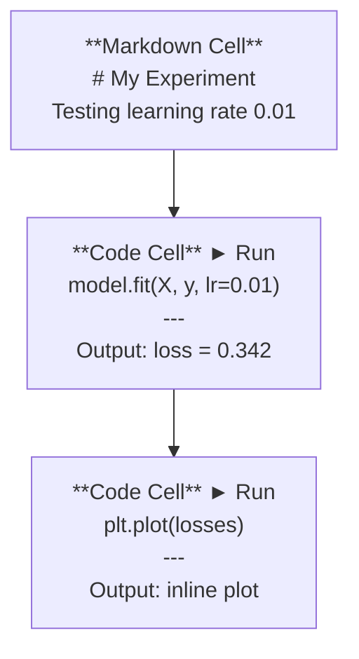
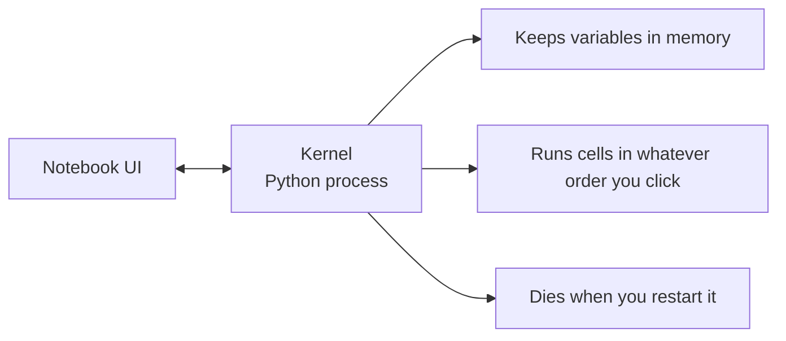

# ज्युपिटर नोटबुक ज्युपिटर 笔记本

> नोटबुक AI इंजीनियरिंग की प्रयोगशाला बेंच हैं. आप यहां प्रोटोटाइप करते हैं, फिर जो काम करता है उसे उत्पादन में ले जाते हैं.
> 笔记本是人工智能工程的实验工作台――आप यहां पर मौलिक परीक्षण करते हैं, फिर प्रभावी भाग को उत्पादन में डालते हैं――

**Type:** Build | **类型:** 构建
**Languages:** Python | **语言:** Python
**Prerequisites:** Phase 0, Lesson 01 | **前置知识:** Phase 0, 第 01 课
**Time:** ~30 minutes | **时间:** ~30 分钟

## सीखने के लक्ष्य

- JupyterLab, Jupyter Notebook, या VS Code को Jupyter एक्सटेंशन के साथ स्थापित और लॉन्च करें
  中文翻译:安装并启动 JupyterLab、Jupyter Notebook 或带 Jupyter 扩展的 VS Code
- जादू कमांड का उपयोग करें (`%timeit`,`%%time`,`%matplotlib inline`) इनलाइन को बेंचमार्क करने और दृश्यमान बनाने के लिए
  中文翻译:使用魔术命令`%timeit``%%time``%matplotlib inline`) आधारभूत परीक्षण और अंतर्निहित दृश्यता
- नोटबुक और स्क्रिप्ट का उपयोग कब करना है, इसका अंतर करें और "नोटबुक में खोजें, स्क्रिप्ट में जहाज करें" कार्यप्रवाह लागू करें
  中文翻译:区分何时用笔记本何时用脚本,践行"笔记本中探索、脚本中部署"的工作流
- सामान्य नोटबुक फंदे की पहचान करें और उनसे बचेंः अनियमित निष्पादन, छिपा हुआ राज्य और मेमोरी लीक
  中文翻译:识别并避免笔记本常见陷:乱序执行、隐藏状态和内存泄漏

> **【中文解读】**
> ज्युपिटर नोटबुक एआई इंजीनियरों का "प्रयोगशाला कार्यक्षेत्र" है। आप इसमें चरण-दर-चरण संचालित कोड  तत्काल परिणाम देखने  मिश्रित वर्णनात्मक विवरण और चित्र  में जा सकते हैं।`.py`脚本中部署──

## समस्या का वर्णन

हर एआई पेपर, ट्यूटोरियल और कैगल प्रतियोगिता में ज्यूपिटर नोटबुक का उपयोग किया जाता है. वे आपको कोड को टुकड़ों में चलाने देते हैं, आउटपुट को लाइन में देखते हैं, कोड को स्पष्टीकरण के साथ मिलाते हैं, और तेजी से पुनरावृत्ति करते हैं। यदि आप नोटबुक के बिना एआई सीखने की कोशिश करते हैं, तो आप बिना कागज के खरोंच के गणित होमवर्क कर रहे हैं।

>  लगभग सभी एआई 论文、教程和 Kaggle 比赛都使用Jupyter Notebook── यह आपको कोड चलाने के लिए एक खंड में विभाजन करने देता है、内嵌查看输出、混合代码和文字说明、快速代── यदि आप एआई के बिना एक笔记本学, जैसे कोई ड्राफ्ट पेपर नहीं है, तो गणित का काम कर सकते हैं──

लेकिन नोटबुक में असली जाल हैं. लोग उन्हें हर चीज के लिए उपयोग करते हैं, जिसमें वे भयानक हैं। नोटबुक का उपयोग कब करना है और स्क्रिप्ट का उपयोग कब करना है यह जानना आपको बाद में बुराई के सपने से बचाएगा।

> लेकिन एक नोटबुक में भी एक असली गड़बड़ है। लोग इसका उपयोग सब कुछ करने के लिए करते हैं, जिसमें यह भी शामिल है कि यह अच्छा नहीं है।

> **【中文解读】**
> नोटबुक एआई क्षेत्र का मानक उपकरण है, लगभग सभी निबंध और कागले प्रतियोगिताओं में इसका उपयोग किया जाता है। लेकिन इसमें भी फंसे हुए हैंः गड़बड़ क्रम निष्पादन, छिपा हुआ राज्य, स्मृति लीक।

## अवधारणा का मूल अवधारणा

नोटबुक कोशिकाओं की एक सूची है। प्रत्येक कोशिका या तो कोड या पाठ है।

> 笔记本由一系列"单元格"组成, प्रत्येक单元格要么是代码,要么是文本──



कर्नेल एक पायथन प्रक्रिया है जो पृष्ठभूमि में चलती है। जब आप एक सेल चलाते हैं, तो यह कोड को कर्नेल को भेजता है, जो इसे निष्पादित करता है और परिणाम वापस भेजता है। सभी कोशिकाएं एक ही कर्नेल साझा करती हैं, इसलिए कोशिकाओं के बीच चर बरकरार रहते हैं।

> कर्नेल एक पीयथन प्रक्रिया है जो पीछे की ओर चलती है। जब आप एक एकल 格 को चलाते हैं, तो कोड को कर्नेल  निष्पादित करने के लिए भेजा जाता है, परिणाम फिर से लौटता है। सभी एकल 格 एक ही कर्नेल साझा करते हैं, इसलिए एक एकल 格 के बीच चर स्थायी रूप से मौजूद हैं।



"जो भी आदेश आप क्लिक करें" भाग सुपर पावर और पैर बंदूक दोनों है।

> "आप क्लिक करने के क्रम में किसी भी क्रम में निष्पादन" का यह हिस्सा है दोनों सुपर क्षमता, और भी एक बड़ा गड़हा।
```figure
s0-cell-order
```

## इसे बनाओ

> **【中文解读】**
> नोटबुक कई "单元格" से बना है, प्रत्येक单元格 को कोड या मार्कडाउन किया जा सकता है। सभी单元格 एक ही कर्नल में साझा करते हैं।

## इसे बनाओ।

> **【拓展：Jupyter 在 AI 行业中的地位】** लगभग सभी AI 文文附带的可复现代码都是 Jupyter Notebook 格式──Kaggle 比赛方案、Hugging Face示例、PyTorch教程都使用它──Google Colab 本质上就是云端的Jupyter,预装了PyTorch/TensorFlow,并免费提供GPU──本课程中有大量的`.ipynb`अभ्यास करना

### चरण 1: अपना इंटरफ़ेस चुनें.

तीन विकल्प, एक प्रारूपः

> 三种界面选择, एक ही फाइल प्रारूपः

| Interface | Install | Best for |
|-----------|---------|----------|
| JupyterLab | `pip install jupyterlab` then `jupyter lab` | Full IDE experience, multiple tabs, file browser, terminal |
| Jupyter Notebook | `pip install notebook` then `jupyter notebook` | Simple, lightweight, one notebook at a time |
| VS Code | Install "Jupyter" extension | Already in your editor, git integration, debugging |

| 界面 | 安装方式 | 最适合 |
|------|---------|--------|
| JupyterLab | `pip install jupyterlab` 后运行 `jupyter lab` | 完整 IDE 体验、多标签、文件浏览器 |
| Jupyter Notebook | `pip install notebook` 后运行 `jupyter notebook` | 简洁轻量、一次一个笔记本 |
| VS Code | 安装 "Jupyter" 扩展 | 集成在编辑器中、Git 整合、可调试 |

तीनों एक ही पढ़ते और लिखते हैं `.ipynb`आप जो चाहें चुनें। JupyterLab AI काम में सबसे आम है।

> तीन प्रकार के इंटरफेस पढ़ने के लिए एक ही लिखें`.ipynb`文件格式──选你喜欢的即可──JupyterLab में AI 工作中最常见──

```bash
pip install jupyterlab
jupyter lab
```

### चरण 2: महत्वपूर्ण कीबोर्ड शॉर्टकट

आप दो मोड में काम करते हैं। दबाएँ `Escape`कमांड मोड के लिए (बाएं ओर नीला पट्टी), `Enter`संपादन मोड (ग्रीन बार) के लिए।

> आप दो प्रकार के मोड में ऑपरेट करते हैं।`Escape`进入命令模式(左侧蓝色条),按 `Enter`进入编辑模式(绿色条) 』

**Command mode (most used):**

> **命令模式（最常用的）：**

| Key | Action |
|-----|--------|
| `Shift+Enter` | Run cell, move to next |
| `A` | Insert cell above |
| `B` | Insert cell below |
| `DD` | Delete cell |
| `M` | Convert to markdown |
| `Y` | Convert to code |
| `Z` | Undo cell operation |
| `Ctrl+Shift+H` | Show all shortcuts |

**Edit mode:**

> **编辑模式：**

| Key | Action |
|-----|--------|
| `Tab` | Autocomplete |
| `Shift+Tab` | Show function signature |
| `Ctrl+/` | Toggle comment |

`Shift+Enter`यह वह है जिसका आप दिन में एक हजार बार उपयोग करेंगे. पहले इसे सीखें.

> `Shift+Enter`यह है कि आप हर दिन एक हजार बार त्वरित कुंजी का उपयोग करेंगे।

### चरण 3: सेल प्रकार ।

**Code cells**पायथन चलाएं और आउटपुट दिखाएंः

> **代码单元格**运行 Python 并显示输出:

```python
import numpy as np
data = np.random.randn(1000)
data.mean(), data.std()
```

आउटपुट: `(0.0032, 0.9987)`

**Markdown cells**वे एक ही समय में एक ही समय में एक ही समय में एक ही समय में एक ही समय में एक ही समय में एक ही समय में एक ही समय में एक ही समय में एक ही समय में एक ही समय में एक ही समय में एक ही समय में एक ही समय में एक ही समय में एक ही समय में एक ही समय में एक ही समय में एक ही समय में एक ही समय में एक ही समय में एक ही समय में एक ही समय में एक ही समय में एक ही समय में एक ही समय में एक ही समय में एक ही समय में एक ही समय में एक ही समय में एक ही समय में एक ही समय में एक ही समय में एक ही समय में एक ही समय में एक ही समय में एक ही समय में एक ही समय में एक ही समय में एक ही समय में एक ही समय में एक ही समय में एक ही समय में एक ही समय में एक ही समय में एक ही समय में एक ही समय में एक ही समय में एक ही समय में एक ही समय में एक ही समय में एक ही समय में एक ही समय में एक ही समय में एक ही समय में एक ही समय में एक ही समय में एक ही समय में एक ही समय में एक ही समय में एक ही समय में एक ही समय में एक ही समय में एक ही एक ही समय में एक ही समय में एक ही समय में एक ही समय में एक ही एक समय में एक ही समय में एक समय में एक ही एक समय में एक समय में एक समय में एक ही एक समय में एक समय में एक समय में एक समय में एक समय में एक समय में एक समय में एक समय में एक समय में एक समय में एक समय में एक समय में एक समय में एक समय में एक समय में एक समय में एक समय में एक समय में एक समय में एक समय में एक समय में एक समय में एक समय में एक समय में एक समय में एक समय में एक समय में एक समय में एक समय में एक समय में एक समय में एक समय में एक समय में एक समय में एक समय में एक समय में एक समय में एक समय में एक समय में एक समय में एक समय में एक समय में एक समय में एक समय में एक समय में एक समय में एक समय में एक समय में एक समय में एक समय में एक समय में एक समय में एक समय में एक समय में एक समय में एक समय में एक समय में एक समय में एक समय में एक समय में एक समय में एक समय में एक समय में एक समय में एक समय में एक समय में एक समय में एक समय में एक समय में एक समय में एक समय में एक`$E = mc^2$`), तालिकाएँ और चित्र।

> **Markdown 单元格**染格式化文本── इन्हें उपयोग करके आप क्या कर रहे हैं और क्यों कर रहे हैं, इसका रिकॉर्ड करें── समर्थन शीर्षक、粗体、斜体、LaTeX 数学公式(`$E = mc^2$`)、表格和图片──

### चरण 4: जादू का आदेश

ये पायथन नहीं हैं, वे Jupyter विशिष्ट आदेश हैं जो शुरू होते हैं के साथ`%`(लाइन जादू) या `%%`(सेल जादू)

> ये पायथन नहीं हैं।`%`(行魔术) या `%%`(单元格魔术) खोले हुए Jupyter 专用命令──

**Time your code:**

> **计时你的代码：**

```python
%timeit np.random.randn(10000)  # 多次运行取平均，适合微基准测试
```

आउटपुट: `45.2 us +/- 1.3 us per loop`

```python
%%time  # 单次运行，测量总耗时，适合训练耗时测试
model.fit(X_train, y_train, epochs=10)
```

आउटपुट: `Wall time: 2.34 s`

`%timeit`कोड कई बार चलाता है और औसत। `%%time`इसे एक बार चलाता है।`%timeit`माइक्रोबेन्चमार्क के लिए, `%%time`प्रशिक्षण रन के लिए।

> `%timeit`                                                                                                                                                                                                                                                              `%%time`केवल एक बार चलाना`%timeit`, प्रशिक्षण समय लगने परीक्षण उपयोग `%%time`

**Enable inline plots:**

> **启用内嵌图表：**

```python
%matplotlib inline  # 让图表直接显示在笔记本中
```

हर `plt.plot()`या `plt.show()`अब सीधे नोटबुक में प्रस्तुत करता है।

>  इसके बाद हर `plt.plot()`या `plt.show()`शहर में सीधे-सीधे में 染

**Install packages without leaving the notebook:**

> **不离开笔记本就能安装包：**

```python
!pip install scikit-learn  # ! 前缀可以在笔记本中执行 shell 命令
```

`!`पूर्ववर्ती किसी भी शेल कमांड चलाता है।

> `!`पूर्व मैं किसी भी शेल आदेश निष्पादित कर सकते हैं

**Check environment variables:**

> **检查环境变量：**

```python
%env CUDA_VISIBLE_DEVICES  # 查看环境变量
```

### चरण 5: रिच आउटपुट को लाइन में प्रदर्शित करें

> **【拓展：Notebook 是最佳 AI 实验记录工具】**नोटबुक कोड डालें, आउटपुट, ग्राफिक्स, सूत्रों को एक दस्तावेज़ में एकीकृत करें, जिससे एक पूर्ण "प्रयोग रिकॉर्ड" का गठन होता है। एआई अध्ययन में, इसका मतलब है कि कोई अन्य व्यक्ति आपके प्रयोगों को सीधे दोहरा सकता है। यह शोध समीक्षा की बुनियादी आवश्यकता है।

नोटबुक ऑटो सेल में अंतिम अभिव्यक्ति प्रदर्शित करते हैं. लेकिन आप इसे नियंत्रित कर सकते हैंः

> 笔记本会自动显示单元格中最后表达式...... लेकिन आप इसे नियंत्रित कर सकते हैंः

```python
import pandas as pd

df = pd.DataFrame({
    "model": ["Linear", "Random Forest", "Neural Net"],
    "accuracy": [0.72, 0.89, 0.94],
    "training_time": [0.1, 2.3, 45.6]
})
df
```

यह एक स्वरूपित HTML तालिका, एक पाठ डंप नहीं प्रस्तुत करता है।

> यह एक स्वरूपित HTML फ़ॉर्मैट को प्रभावित करता है, पाठ आउटपुट के बजाय।

```python
import matplotlib.pyplot as plt

plt.figure(figsize=(8, 4))
plt.plot([1, 2, 3, 4], [1, 4, 2, 3])
plt.title("Inline Plot")
plt.show()
```

प्लॉट सेल के नीचे दिखाई देता है. यही कारण है कि नोटबुक AI काम पर हावी हैं. आप डेटा, प्लॉट और कोड को एक साथ देखते हैं.

> 图表 सीधे एकांत में प्रदर्शित होता है  यही कारण है कि एआई के काम में नोटबुक प्रमुख स्थान पर है  डेटा,图表 और कोड एक साथ 

चित्रों के लिएः

> 对于图片:

```python
from IPython.display import Image, display
display(Image(filename="architecture.png"))
```

### चरण 6: गूगल कोलाब

कोलाब एक मुफ्त Jupyter नोटबुक है। यह आपको एक GPU, पूर्व-स्थापित पुस्तकालय और Google ड्राइव एकीकरण देता है। कोई सेटअप आवश्यक नहीं है।

> कोलाब एक मुफ्त क्लाउड-इन-यूपीटर उपकरण है। यह GPU, प्री-एन्सेलेब और Google ड्राइव को एकीकृत करता है।

1. जाओ [colab.research.google.com](https://colab.research.google.com)
2. किसी भी अपलोड `.ipynb`इस पाठ्यक्रम से फ़ाइल
3. रनटाइम > रनटाइम प्रकार बदलें > T4 GPU (मुफ्त)

स्थानीय ज्युपीटर से कोलाब अंतरः

> कोलाब और स्थानीय ज्यूपिटर के बीच के अंतरः

- सत्रों के बीच फ़ाइलें नहीं बनी रहती हैं (ड्राइव या डाउनलोड पर सहेजें)
  中文翻译: फाइल不会在会话间持久保存(需要保存到驱动或下载)
- पूर्व स्थापितः नम्पी, पांडा, मैटप्लोटलिब, मशाल, टेन्सॉर्फ्लो, स्क्लेयर
  中文翻译:预装了 numpy、pandas、matplotlib、torch、tensorflow、sklearn
- `from google.colab import files`फ़ाइलों को अपलोड/डाउनलोड करने के लिए
  中文翻译:`from google.colab import files`उपरोक्त फ़ाइलों को डाउनलोड करने के लिए
- `from google.colab import drive; drive.mount('/content/drive')`निरंतर भंडारण के लिए
  中文翻译:`from google.colab import drive; drive.mount('/content/drive')`दीर्घकालिक भंडारण के लिए उपयोग किया जाता है
- 90 मिनट की निष्क्रियता के बाद सत्रों का समय (मुक्त स्तर)
  中文翻译:空 90 分钟后会话超时(免费版)

## इसे उपयोग करें गाइड का उपयोग करें

### नोटबुक बनाम स्क्रिप्टः कब कौन सा उपयोग करें  कब एक नोटबुक के साथ, कब एक स्क्रिप्ट के साथ

| Use notebooks for | Use scripts for |
|-------------------|-----------------|
| Exploring a dataset | Training pipelines |
| Prototyping a model | Reusable utilities |
| Visualizing results | Anything with `if __name__` |
| Explaining your work | Code that runs on a schedule |
| Quick experiments | Production code |
| Course exercises | Packages and libraries |

| 用 Notebook | 用脚本 |
|-----------|-------|
| 探索数据集 | 训练管线 |
| 原型开发模型 | 可复用的工具函数 |
| 可视化结果 | 带 `if __name__` 的正式代码 |
| 解释你的工作 | 定时运行的代码 |
| 快速实验 | 生产环境代码 |
| 课程练习 | 包和库 |

नियम: **explore in notebooks, ship in scripts**. .

> 黄金法则:**在笔记本中探索，在脚本中部署**

> **【中文解读】**
> 黄金法则:**在 Notebook 中探索，在脚本中部署** पहले नोटबुक 里实验思想,验证可行后再将代码迁移到 `.py`文件──

एआई में एक आम कार्यप्रवाहः
1. नोटबुक में डेटा खोजें
2. नोटबुक में अपना मॉडल प्रोटोटाइप
3. एक बार यह काम करता है, कोड स्थानांतरित करने के लिए `.py`फ़ाइलें
4. उन आयात `.py`आगे के प्रयोगों के लिए फ़ाइलों को नोटबुक में वापस

> सामान्य कार्यप्रवाह:
> 1. में笔记本中探索数据
> 2. मेनू में मॉडल मूल
> 3. 验证有效后,将代码迁移到 `.py`文件
> 4. `.py`文件导入笔记本 आगे के प्रयोगों के लिए

### आम फंदे

> **【拓展：Notebook 反模式】**तीन सबसे आम नोटबुक 反模式:(1) 乱序执行你跳进跑细胞,别人从头跑就挂了;(2) 隐藏状态你删除了某个细胞,但它创建的变量还在内存中;(3) 内存泄漏加载4GB 数据集、训练模型、再加载另一个,内存不断增长──解法:定期`Kernel > Restart & Run All`, या प्रशिक्षण के बाद उपयोग किया जाता है`del model; gc.collect()`释放内存──

**Out-of-order execution.**आप सेल 5 चलाते हैं, फिर सेल 2 और फिर सेल 7। नोटबुक आपकी मशीन पर काम करता है लेकिन जब कोई इसे ऊपर से नीचे चलाता है तो टूट जाता है। ठीक करेंः साझा करने से पहले कर्नेल > पुनरारंभ और सभी चलाएं।

> **乱序执行。**आप पहले पांचवें एकल घटक को चलाएं, फिर दूसरे को चलाएं, फिर सातवें को चलाएं। आपका नोटबुक आपके मशीन पर उपयोग किया जा सकता है, लेकिन कोई और व्यक्ति से शुरू से अंत तक चला जाता है।

**Hidden state.**आप एक सेल को हटा देते हैं लेकिन यह परिवर्तनीय अभी भी स्मृति में है। नोटबुक साफ दिखता है लेकिन एक भूत सेल पर निर्भर करता है। फिक्सः नियमित रूप से कर्नेल को पुनरारंभ करें।

> **隐藏状态。**आप एक एकल घटक को हटा देते हैं, लेकिन यह बनाने के लिए चर भी स्मृति में है।

**Memory leaks.**4GB डेटा सेट लोड करना, एक मॉडल को प्रशिक्षित करना, एक और डेटा सेट लोड करना. कुछ भी मुक्त नहीं होता है।`del variable_name`और `gc.collect()`, या कर्नेल को पुनरारंभ करें.

> **内存泄漏。**4GB डेटा सेट को लोड करें, प्रशिक्षण मॉडल को पुनः लोड करें, एक और डेटा सेट को पुनः लोड करें, स्मृति लगातार बढ़ रही है, कोई रिलीज़ नहीं हुई है।`del variable_name`和 `gc.collect()`, या Kernel को पुनरारंभ करना

## इसे भेजें उत्पाद

> **【拓展：从 Notebook 到生产代码】**वास्तविक एआई 工程流程: नोटबुक  प्रयोग → 验证想法 → 将代码重构为 `.py`模块 → 编写测试 → 部署。 नोटबुक "草稿纸", "最终产品" नहीं है──养成习惯: प्रयोग पूरा होने के बाद, मूल कोड को `.py`文件中,Notebook केवल इस्तेमाल और दृश्यता को बनाए रखा

इस पाठ से उत्पन्न होता हैः
- `outputs/prompt-notebook-helper.md`नोटबुक समस्याओं को डिबग करने के लिए

> 本课产出:
> - `outputs/prompt-notebook-helper.md`प्रयोग करने के लिए调试笔记本问题

## अभ्यास विषय

1. JupyterLab खोलें, एक नोटबुक बनाएं और उसका उपयोग करें `%timeit`100,000 यादृच्छिक संख्याओं की सरणी बनाने के लिए सूची समझ बनाम numpy की तुलना करने के लिए
   打开 JupyterLab,创建笔记本,用 `%timeit`सूची प्रवर्तन और संख्याओं के लिए 100 हजार यादृच्छिक संख्याओं की गति उत्पन्न करने के लिए
2. एक नोटबुक बनाएं जिसमें मार्कडाउन और कोड दोनों कोशिकाएं हों जो सीएसवी लोड करें, एक डेटाफ्रेम प्रदर्शित करें और एक चार्ट का ग्राफ बनाएं। फिर Kernel > Restart & Run All चलाएं ताकि यह सत्यापित हो सके कि यह ऊपर से नीचे तक काम करता है
   创建包含Markdown 和代码单元格的笔记本, लोड CSV、显示DataFrame、画图,然后"重启并全部运行"验证顺序正确
3. कोड ले लो `code/notebook_tips.py`, इसे एक कोलाब नोटबुक में पेस्ट करें, और इसे एक मुक्त जीपीयू के साथ चलाएं
   `code/notebook_tips.py`को कोड को Colab 笔记本中, निः शुल्क GPU के साथ 运行

## Key Terms  Key Terms  Key Terms  Key Terms  Key Terms  Key Terms  Key Terms  Key Terms  Key Terms  Key Terms  Key Terms  Key Terms  Key Terms  Key Terms  Key Terms  Key Terms  Key Terms  Key Terms  Key Terms  Key Terms  Key Terms  Key Terms  Key Terms  Key Terms  Key Terms  Key Terms  Key Terms  Key Terms  Key Terms  Key Terms  Key Terms  Key Terms  Key Terms  Key Terms  Key Terms  Key Terms  Key Terms  Key Terms  Key Terms  Key Terms  Key Terms  Key Terms  Key Terms  Key Terms  Key Terms  Key Terms  Key Terms  Key Terms  Key Terms  Key Terms  Key Terms  Key Terms  Key Terms  Key Terms  Key Terms  Key Terms  Key Terms  Key Terms  Key Terms  Key Terms  Key Terms  Key Terms  Key Terms  Key Terms  Key Terms  Key Terms  Key Terms  Key Terms  Key Terms  Key Terms  Key Terms  Key Terms  Key Terms  Key Terms  Key Terms  Key Terms  Key Terms  Key Terms  Key Terms  Key Terms  Key Terms  Key Terms  Key Terms  Key Terms  Key Terms  Key Terms  Key Terms  Key Terms  Key Terms  Key Terms  Key Terms  Key Terms  Key Terms  Key Terms  Key Terms  Key Terms  Key Terms  Key Terms  Key Terms  Key Terms  Key Terms  Key Terms  Key Terms  Key Terms  Key Terms  Key Terms  Key Terms  Key Terms  Key

| Term | What people say | What it actually means |
|------|----------------|----------------------|
| Kernel | "The thing running my code" | A separate Python process that executes cells and keeps variables in memory |
| Cell | "A code block" | An independently runnable unit in a notebook, either code or markdown |
| Magic command | "Jupyter tricks" | Special commands prefixed with `%` or `%%` that control the notebook environment |
| `.ipynb` | "Notebook file" | A JSON file containing cells, outputs, and metadata. Stands for IPython Notebook |

| 术语 | 俗称 | 实际含义 |
|------|------|---------|
| Kernel | "运行代码的那个东西" | 独立的 Python 进程，执行单元格并维护变量状态 |
| Cell | "代码块" | 笔记本中可独立运行的单元，可以是代码或 Markdown |
| Magic command | "Jupyter 魔法" | 以 `%` 或 `%%` 开头的特殊命令，控制笔记本环境 |
| `.ipynb` | "笔记本文件" | 包含单元格、输出和元数据的 JSON 文件 |

## आगे पढ़ना 延伸閱讀

- [JupyterLab Docs](https://jupyterlab.readthedocs.io/)पूर्ण विशेषता सेट के लिए
  中文翻译:JupyterLab 完整功能文档
- [Google Colab FAQ](https://research.google.com/colaboratory/faq.html)कोलाब विशिष्ट सीमाओं और विशेषताओं के लिए
  चीनी भाषा अनुवादःGoogle Colab 常见问题与限制说明
- [28 Jupyter Notebook Tips](https://www.dataquest.io/blog/jupyter-notebook-tips-tricks-shortcuts/)बिजली प्रयोक्ता शॉर्टकट के लिए
  中文翻译:28 个 Jupyter नोटबुक 高级技巧
