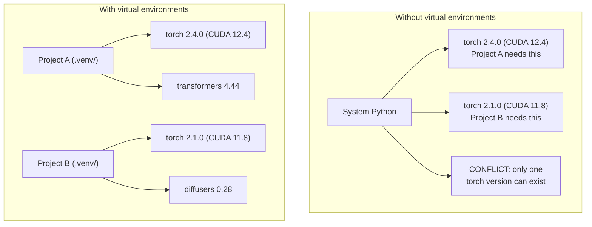

# पायथन पर्यावरण

> आश्रय नरक वास्तविक है. आभासी वातावरण इलाज है.
> आश्रित नरक वास्तविकता है।

**Type:** Build | **类型:** 构建
**Languages:** Shell | **语言:** Shell
**Prerequisites:** Phase 0, Lesson 01 | **前置知识:** Phase 0, 第 01 课
**Time:** ~30 minutes | **时间:** ~30 分钟

## सीखने के लक्ष्य

-  का उपयोग करके अलग आभासी वातावरण बनाएँ`uv`,`venv`या `conda`
  中文翻译: उपयोग `uv``venv`या `conda`创建隔离的虚拟环境
- एक लिखें `pyproject.toml`वैकल्पिक निर्भरता समूहों के साथ और पुनरुत्पादन के लिए लॉकफ़ाइल उत्पन्न करें
  中文翻译:编写带可选依赖组的 `pyproject.toml`, लॉक फ़ाइल उत्पन्न करना  सुनिश्चित करें की पुनः प्रयोज्य
- सामान्य बाधाओं का निदान और समाधानः वैश्विक स्थापना, पाइप/कंड मिश्रण, CUDA संस्करण असंगतता
  中文翻译:诊断并修复常见问题:全局安装、pip/conda 混用、CUDA 版本不匹配
- परस्पर निर्भरता वाले परियोजनाओं के लिए प्रति चरण पर्यावरण रणनीति लागू करना
  चीनी अनुवादः संघर्ष पर निर्भर परियोजनाओं के कार्यान्वयन के लिए चरणों के अनुसार विभाजन की गई पर्यावरण रणनीति

> **【中文解读】**
> पायथन परियोजना निर्भरता संघर्ष एआई विकास में सबसे आम समस्याओं में से एक है। इस परियोजना को पायटॉर्च 2.4 की आवश्यकता है। उस परियोजना को 2.1 की आवश्यकता है।

## समस्या का वर्णन

आप एक सूक्ष्म-ट्यूनिंग परियोजना के लिए PyTorch 2.4 स्थापित करते हैं. अगले सप्ताह, एक अलग परियोजना PyTorch 2.1 की आवश्यकता है क्योंकि इसके CUDA बिल्ड चिपके हुए है. आप वैश्विक स्तर पर अपग्रेड करते हैं, और पहली परियोजना टूट जाती है. आप डाउनग्रेड करते हैं, और दूसरा टूट जाता है.

> आप एक माइक्रो-मॉवे प्रोजेक्ट के लिए PyTorch 2.4 को स्थापित करते हैं, अगला सप्ताह, दूसरा प्रोजेक्ट क्यूडीए के निर्माण संस्करण लॉक करने के लिए PyTorch 2.1 की आवश्यकता है, पहला प्रोजेक्ट लंबित है, दूसरा प्रोजेक्ट फिर से लंबित है।

यह निर्भरता नरक है. यह लगातार एआई / एमएल काम में होता है क्योंकिः

> यह अक्सर एआई/एमएल के काम में होता है, क्योंकि:

- PyTorch, JAX, और TensorFlow प्रत्येक अपने स्वयं के CUDA बंधन जहाज
  中文翻译:PyTorch、JAX 和 TensorFlow अलग अलग CUDA 绑定
- मॉडल लाइब्रेरी विशिष्ट फ्रेमवर्क संस्करणों को पिन करती हैं
  中文翻译:模型库锁定特定框架版本
- वैश्विक`pip install`जो कुछ भी पहले वहाँ था ओवरराइट करता है
  中文翻译:全局 `pip install`会覆盖之前安装的任何版本
- CUDA 11.8 बिल्ड CUDA 12.x ड्राइवर के साथ काम नहीं करते (और इसके विपरीत)
  中文翻译:CUDA 11.8 构建在CUDA 12.x 驱动上不工作(反之亦然)

समाधानः प्रत्येक परियोजना को अपने स्वयं के पैकेज के साथ अपना अलग वातावरण मिलता है।

> समाधानः प्रत्येक परियोजना का अपना अलग-अलग वातावरण है, स्वतंत्र निर्भरता है।

> **【中文解读】**
> "आश्रय नरक" एआई  परियोजनाओं में विशेष रूप से आम है, क्योंकि PyTorch/JAX/TensorFlow अलग-अलग CUDA  बंधा, संस्करणों के बीच परस्पर असंगत है। समाधानः प्रत्येक परियोजना एक अलग आभासी वातावरण है।

## अवधारणा का मूल अवधारणा

> **【中文解读】**नीचे दिए गए चित्र में आभासी वातावरण के बीच अंतर दिखाया गया हैः बिना आभासी वातावरण के, सिस्टम पायथन केवल एक संस्करण के PyTorch को स्थापित कर सकता है, परियोजनाओं के बीच परस्पर संघर्ष; आभासी वातावरण है, प्रत्येक परियोजना स्वतंत्र रूप से निर्भर है, परस्पर हस्तक्षेप नहीं करते हैं।



## इसे बनाओ, इसे पूरा करो।

> **【拓展：uv vs pip vs conda — 该选哪个？】**(1) **uv**(推):Rust 写的,比 pip 快 10-100 倍, स्वचालित रूप से प्रबंधन虚拟环境,一行命令搞定 `uv venv && uv pip install`(2) **venv**:पायथन में इंस्टॉल नहीं है, लेकिन गति धीमी और कार्यशीलता कम है।**conda**: अनुकूल आवश्यकताओं के लिए गैर-पायथन पर निर्भर करते हैं, लेकिन पर्यावरण के आकार विशाल है।
```figure
s0-env-isolation
```

## इसे बनाओ

### विकल्प 1: uv venv (अनुशंसित)

`uv`यह सबसे तेज़ पायथन पैकेज मैनेजर है (10-100 गुना पाइप से तेज़) । यह एक उपकरण में वर्चुअल वातावरण, पायथन संस्करण और निर्भरता संकल्प को संभालता है।

> `uv`यह एक उपकरण में वर्चुअल वातावरण को संभालती है, पायथन संस्करण और निर्भरता विश्लेषण में।

```bash
curl -LsSf https://astral.sh/uv/install.sh | sh

uv python install 3.12

cd your-project
uv venv
source .venv/bin/activate
```

पैकेज स्थापित करेंः

> 装包:

```bash
uv pip install torch numpy
```

 के साथ एक परियोजना बनाएं`pyproject.toml`एक कदम मेंः

> एक कदम निर्माण `pyproject.toml`के परियोजनाएं:

```bash
uv init my-ai-project
cd my-ai-project
uv add torch numpy matplotlib
```

### विकल्प 2: venv (बल्ड-इन) 选项2:venv(पायथन 内置)

> **【中文解读】**venv Python स्वयं के वर्चुअल पर्यावरण उपकरण है, अतिरिक्त स्थापना की आवश्यकता नहीं है। लेकिन यूवी की तुलना में, यह स्वचालित रूप से Python संस्करण का प्रबंधन नहीं करता है, और न ही लॉकफ़ाइल उत्पन्न करता है।

यदि आप स्थापित नहीं कर सकते `uv`, पायथन जहाजों के साथ `venv`:

> यदि आप इसे स्थापित नहीं कर सकते हैं `uv`,पायथन स्वयात्रा`venv`:

```bash
python3 -m venv .venv
source .venv/bin/activate  # Linux/macOS
.venv\Scripts\activate     # Windows

pip install torch numpy
```

धीमी गति से `uv`, लेकिन काम करता है हर जगह पायथन स्थापित है.

> तुलना`uv`धीमी गति से, लेकिन किसी भी जगह जो पायथन स्थापित किया गया है, वे सभी उपयोग कर सकते हैं।

### विकल्प 3: कॉंडा (जब आपको इसकी आवश्यकता हो)

कॉंडा गैर-पायथन निर्भरताओं जैसे CUDA टूलकिट, cuDNN, और C पुस्तकालयों का प्रबंधन करता है। इसका उपयोग जबः

> कॉंडा 管理非 Python निर्भर करता है, जैसे CUDA 工具包、cuDNN 和 C 库── निम्न परिस्थितियों में उपयोगः

- आप सिस्टम भर में स्थापित किए बिना एक विशिष्ट CUDA टूलकिट संस्करण की जरूरत है
  中文翻译:需要特定 CUDA 工具包版本,但不希望全局安装
- आप एक साझा क्लस्टर पर हैं जहां आप सिस्टम पैकेज स्थापित नहीं कर सकते
  中文翻译: में साझा集群上,无法安装系统包
- पुस्तकालय की स्थापना निर्देशों में "कंडो का उपयोग करें" कहते हैं
  中文翻译:库的安装说明写写着"使用公寓"

```bash
# Install miniconda (not the full Anaconda)
curl -LsSf https://repo.anaconda.com/miniconda/Miniconda3-latest-Linux-x86_64.sh -o miniconda.sh
bash miniconda.sh -b

conda create -n myproject python=3.12
conda activate myproject

conda install pytorch torchvision torchaudio pytorch-cuda=12.4 -c pytorch -c nvidia
```

एक नियमः यदि आप किसी वातावरण के लिए कॉंडा का उपयोग करते हैं, तो उस वातावरण में सभी पैकेज के लिए कॉंडा का उपयोग करें। मिश्रण `pip install`एक conda env निर्भरता संघर्षों का कारण बनता है जो डिबग करने के लिए दर्दनाक हैं।

> एक नियमः यदि आप एक कॉम्प्रोवेन्टेन्मेंट मैनेज करते हैं, तो एक कॉम्प्रोवेन्टेन्मेंट मैनेज करते हैं।`pip install`इससे आश्रय संघर्ष को सुलझाना मुश्किल हो जाएगा।

### इस कोर्स के लिएः चरण-दर-चरण रणनीति

आप पूरे कोर्स के लिए एक वातावरण बना सकते हैं। मत करो। विभिन्न चरणों को अलग (कभी-कभी विरोधाभासी) निर्भरता की आवश्यकता होती है।

> आप पूरे पाठ्यक्रम के लिए एक वातावरण बना सकते हैं। ऐसा मत करो। विभिन्न चरणों में विभिन्न (कहीं संघर्ष के) आवश्यकताएं होती हैं।

रणनीति:

> 策略:

```
ai-engineering-from-scratch/
├── .venv/                    <-- shared lightweight env for phases 0-3
├── phases/
│   ├── 04-neural-networks/
│   │   └── .venv/            <-- PyTorch env
│   ├── 05-cnns/
│   │   └── .venv/            <-- same PyTorch env (symlink or shared)
│   ├── 08-transformers/
│   │   └── .venv/            <-- might need different transformer versions
│   └── 11-llm-apis/
│       └── .venv/            <-- API SDKs, no torch needed
```

`code/env_setup.sh`इस कोर्स के लिए आधार वातावरण बनाता है।

> `code/env_setup.sh`मध्यपाठिकालय इस पाठ्यक्रम के आधारभूत वातावरण का निर्माण करेगा।

## pyproject.toml मूल बातें pyproject.toml आधार

> **【拓展：pyproject.toml 是现代 Python 项目的标准配置】**यह परंपराओं को बदल दिया है।`setup.py`和 `requirements.txt`◊ एक दस्तावेज परिभाषित परियोजना डेटा ∞ निर्भरता ∞ विकास उपकरण विनियोजन ∞ एआई  परियोजना अनुशंसा ∞ वैकल्पिक निर्भरता समूहों का उपयोग करने के लिए ∞`[train]`) और अनुशंसा निर्भर`[serve]`), उत्पादन वातावरण में अनावश्यक जीपीयू 库  को स्थापित करने से बचें

प्रत्येक पायथन परियोजना में एक होना चाहिए`pyproject.toml`. . यह प्रतिस्थापन करता है`setup.py`,`setup.cfg`और `requirements.txt`एक फ़ाइल में।

> प्रत्येक पायथन परियोजनाओं के लिए होना चाहिए`pyproject.toml`यह एक फ़ाइल के साथ बदल दिया गया `setup.py``setup.cfg`和 `requirements.txt`

```toml
[project]
name = "ai-engineering-from-scratch"
version = "0.1.0"
requires-python = ">=3.11"
dependencies = [
    "numpy>=1.26",
    "matplotlib>=3.8",
    "jupyter>=1.0",
    "scikit-learn>=1.4",
]

[project.optional-dependencies]
torch = ["torch>=2.3", "torchvision>=0.18"]
llm = ["anthropic>=0.39", "openai>=1.50"]
```

फिर स्थापित करेंः

> फिर स्थापित करेंः

```bash
uv pip install -e ".[torch]"    # base + PyTorch
uv pip install -e ".[llm]"     # base + LLM SDKs
uv pip install -e ".[torch,llm]" # everything
```

## तालाबंदी

एक लॉकफ़ाइल प्रत्येक निर्भरता (संक्रमणशील सहित) को सटीक संस्करणों में चिपकाती है। यह पुनरुत्पादनशीलता की गारंटी देता हैः जो कोई भी लॉकफ़ाइल से इंस्टॉल करता है, उसे बिल्कुल समान पैकेज प्राप्त होते हैं।

> लॉकफ़ाइल प्रत्येक निर्भरता पर निर्भर करेगी। यह सुनिश्चित करता है कि कोई भी लॉकफ़ाइल से पूरी तरह से एक ही पैकेज प्राप्त कर सके।

```bash
# uv generates uv.lock automatically when using uv add
uv add numpy

# pip-tools approach
uv pip compile pyproject.toml -o requirements.lock
uv pip install -r requirements.lock
```

जब कोई रेपो क्लोन करता है, वे लॉक फ़ाइल से स्थापित करते हैं और समान संस्करण प्राप्त करते हैं।

> जब कोई लॉक फ़ाइल को स्टोर में रखता है, तो वे लॉक फ़ाइल से पूरी तरह से एक ही संस्करण प्राप्त करते हैं।

## आम गलतियाँ  आम गलतियाँ 

> **【中文解读】**Python 环境管理中最常见的 5 个错误:(1) 全局安装(用 `pip install`️️️️️️️️️️️️️️️️️️️️️️️️️️️️️️️️️️️️️️️️️️️️️️️️️️️️️️️️️️️️️️️️️️️️️️️️️️️️️️️️️️️️️️️️️️️️️️️️️️️️️️️️️️️️️️️️️️️️️️️️️️️️️️️️️️️️️️️️️️️️️️️️️️️️️️️️️️️️️️️️️️️️️️️️️️️️️️️️️️️️️️️️️️️️️️️️️️️️️️️️️️️️️️️️️️️️️️️️️️️️️️️️️️️️️️️️️️️️️️️️️️️️️️️️️️️️️️️️️️️️️️️️️️️️️️️️️️️️️️️️️️️️️️️️️️️️️️️️️️️️️️️️️️️️️️️️️️️️️️️️️️️️️️️️️️️️️️️️️️️️️️️️️️️️️️️️️️️️️️️️️️️️️️️️️️️️️️️️️️️️️️️️️️️️️️️️️️️️️️️️️️️️️️️️️️️️️️️️️️️️️️️️️️️️️️️️️️️️️️️️️️️️️️️️️️️️️️️️️️️️️️️️️️️️️️️️️️️️️️️️️️️️️️️️️️️️️️️️️️️️️️️️️️️️`.venv`目录提交到 git;(5) CUDA 版本不匹配──以下逐个讲解和修复方法──

### 1. वैश्विक स्तर पर स्थापित करना

```bash
pip install torch  # BAD: installs to system Python

source .venv/bin/activate
pip install torch  # GOOD: installs to virtual environment
```

अपने पैकेज को कहां ले जाएं, जाँचेंः

> 检查你的包装在哪里:

```bash
which python       # should show .venv/bin/python, not /usr/bin/python
which pip           # should show .venv/bin/pip
```

### 2. पिप और कॉंडा मिश्रण

```bash
conda create -n myenv python=3.12
conda activate myenv
conda install pytorch -c pytorch
pip install some-other-package   # BAD: can break conda's dependency tracking
conda install some-other-package # GOOD: let conda manage everything
```

यदि आपको कॉंडा के अंदर पिप का उपयोग करना है (कुछ पैकेज केवल पिप-केवल हैं), तो पहले सभी कॉंडा पैकेज स्थापित करें, फिर पिप पैकेज आखिरी हैं।

> यदि कॉन्डा में पाइप का उपयोग करना आवश्यक हो तो पहले सभी कॉन्डा को स्थापित करें, अंतिम पुनः पाइप को स्थापित करें।

### 3. सक्रिय करना भूलना

```bash
python train.py           # uses system Python, missing packages
source .venv/bin/activate
python train.py           # uses project Python, packages found
```

आपके shell prompt में पर्यावरण का नाम दिखाना चाहिए:

> आपका shell 提示符 चाहिए पर्यावरण名称 प्रदर्शित करें:

```
(.venv) $ python train.py
```

### 4. . . . . . . . . . . . . . . . . . . . . . . . . . . . . . . . . . . . . . . . . . . . . . . . . . . . . . . . . . . . . . . . . . . . . . . . . . . . . . . . . . . . . . . . . . . . . . . . . . . . . . . . . . . . . . . . . . . . . . . . . . . . . . . . . . . . . . . . . . . . . . . . . . . . . . . . . . . . . . . . . . . . . . . . . . . . . . . . . . . . . . . . . . . . . . . . . . . . . . . . . . . . . . . . . . . . . . . . . . . . . . . . . . . . . . . . . . . . . . . . . . . . . . . . . . . . . . . . . . . . . . . . . . . . . . . . . . . . . . . . . . . . . . . . . . . . . . . . . . . . . . . . . . . . . . . . . . . . . . . . . . . . . . . . . . . . . . . . . . . . . . . . . . . . . . . . . . . . . . . . . . . . . . . . . . . . . . . . . . . . . . . . . . . . . . . . . . . . . . . . . . . . . . . . . . . . . . . . . . . . . . . . . . . . . . . . . . . . . . . . . . . . . . . . . . . . . . . . . . . . . . . . . . . . . . . . . . . . . . . . . . . . . . . . . . . . . . . . . . . . . . . . . . . . . . .

```bash
echo ".venv/" >> .gitignore
```

वर्चुअल वातावरण 200MB-2GB है. वे स्थानीय हैं, मशीनों के बीच पोर्टेबल नहीं. प्रतिबद्धता.`pyproject.toml`और इसके बजाय ताला फ़ाइल.

> 虚拟环境有200MB-2GB──它们是本地的,不能在机器间移植──改为提交 `pyproject.toml`和 लॉकफ़ाइल

### 5. CUDA संस्करण असंगत है

> **【拓展：CUDA 版本地狱】**PyTorch प्रत्येक संस्करण बंधन विशिष्ट CUDA  संस्करण(जैसे PyTorch 2.4 → CUDA 12.4) ◊装错版本会出现"找不到 GPU"或奇异的运行时错误──解决方案:先`nvidia-smi`确认驱动版本,再去 [pytorch.org](https://pytorch.org)查对应的安装命令──用 `uv pip install torch --index-url URL`指定 CUDA 版本──

```bash
nvidia-smi                # shows driver CUDA version (e.g., 12.4)
python -c "import torch; print(torch.version.cuda)"  # shows PyTorch CUDA version

# These must be compatible.
# PyTorch CUDA version must be <= driver CUDA version.
```

## इसे उपयोग करें गाइड का उपयोग करें

> **【中文解读】**इस कोर्स की सिफारिश की है रणनीति: प्रत्येक चरण में एक आभासी वातावरण का निर्माण करना जैसे`.venv-phase04`), ताकि विभिन्न चरणों के निर्भरता संघर्षों से बचा जा सके।

अपने पाठ्यक्रम वातावरण बनाने के लिए सेटअप स्क्रिप्ट चलाएंः

> 运行安装脚本 सृजन课程环境:

```bash
bash phases/00-setup-and-tooling/06-python-environments/code/env_setup.sh
```

यह एक बना देता है`.venv`कोर निर्भरता स्थापित और सत्यापित के साथ रेपो रूट पर।

> यह एक भंडारण में एक रैंक सूची बनाएगा ।`.venv`,并安装和验证核心依赖──

## अभ्यास विषय

1. दौड़ें`env_setup.sh`और सभी चेक पास की जांच करें
   运行环境安装脚本, पुष्टी सभी जांच पास
2. एक दूसरा आभासी वातावरण बनाएं, इसमें numpy का एक अलग संस्करण स्थापित करें, और पुष्टि करें कि दोनों वातावरण अलग हैं
   दूसरा वर्चुअल वातावरण बनाएं, अलग-अलग संस्करणों की स्थापना करें NumPy, दो वातावरणों को अलग करने की पुष्टि करें
3. एक लिखें `pyproject.toml`एक परियोजना के लिए जो PyTorch और मानव SDK दोनों की आवश्यकता है
   एक साथ PyTorch और मानव SDK के लिए परियोजनाओं को लिखने की आवश्यकता है ।`pyproject.toml`
4. जानबूझकर एक पैकेज को वैश्विक रूप से स्थापित करें (विनव को सक्रिय किए बिना), नोट करें कि यह कहां जाता है, फिर इसे अनइंस्टॉल करें
   इसलिए एक बैग स्थापित करना, इसे देखने के लिए, और फिर इसे उतारने के लिए।

## Key Terms  Key Terms  Key Terms  Key Terms  Key Terms  Key Terms  Key Terms  Key Terms  Key Terms  Key Terms  Key Terms  Key Terms  Key Terms  Key Terms  Key Terms  Key Terms  Key Terms  Key Terms  Key Terms  Key Terms  Key Terms  Key Terms  Key Terms  Key Terms  Key Terms  Key Terms  Key Terms  Key Terms  Key Terms  Key Terms  Key Terms  Key Terms  Key Terms  Key Terms  Key Terms  Key Terms  Key Terms  Key Terms  Key Terms  Key Terms  Key Terms  Key Terms  Key Terms  Key Terms  Key Terms  Key Terms  Key Terms  Key Terms  Key Terms  Key Terms  Key Terms  Key Terms  Key Terms  Key Terms  Key Terms  Key Terms  Key Terms  Key Terms  Key Terms  Key Terms  Key Terms  Key Terms  Key Terms  Key Terms  Key Terms  Key Terms  Key Terms  Key Terms  Key Terms  Key Terms  Key Terms  Key Terms  Key Terms  Key Terms  Key Terms  Key Terms  Key Terms  Key Terms  Key Terms  Key Terms  Key Terms  Key Terms  Key Terms  Key Terms  Key Terms  Key Terms  Key Terms  Key Terms  Key Terms  Key Terms  Key Terms  Key Terms  Key Terms  Key Terms  Key Terms  Key Terms  Key Terms  Key Terms  Key Terms  Key Terms  Key Terms  Key Terms  Key Terms  Key Terms  Key Terms  Key Terms  Key Terms  Key Terms  Key

| Term | What people say | What it actually means |
|------|----------------|----------------------|
| Virtual environment | "A venv" | An isolated directory containing a Python interpreter and packages, separate from the system Python |
| Lockfile | "Pinned dependencies" | A file listing every package and its exact version, guaranteeing identical installs across machines |
| pyproject.toml | "The new setup.py" | The standard Python project configuration file, replacing setup.py/setup.cfg/requirements.txt |
| Transitive dependency | "A dependency of a dependency" | Package B depends on C; if you install A which depends on B, C is a transitive dependency of A |
| CUDA mismatch | "My GPU isn't working" | PyTorch was compiled for a different CUDA version than what your GPU driver supports |

| 术语 | 俗称 | 实际含义 |
|------|------|---------|
| Virtual environment | "venv" | 包含独立 Python 解释器和包的隔离目录 |
| Lockfile | "锁定依赖" | 记录每个包精确版本的文件，确保跨机器安装一致 |
| pyproject.toml | "新版 setup.py" | Python 项目标准配置文件，替代 setup.py 和 requirements.txt |
| Transitive dependency | "依赖的依赖" | A 依赖 B，B 依赖 C，C 就是 A 的传递依赖 |
| CUDA mismatch | "GPU 不工作" | PyTorch 编译时的 CUDA 版本与 GPU 驱动不匹配 |
