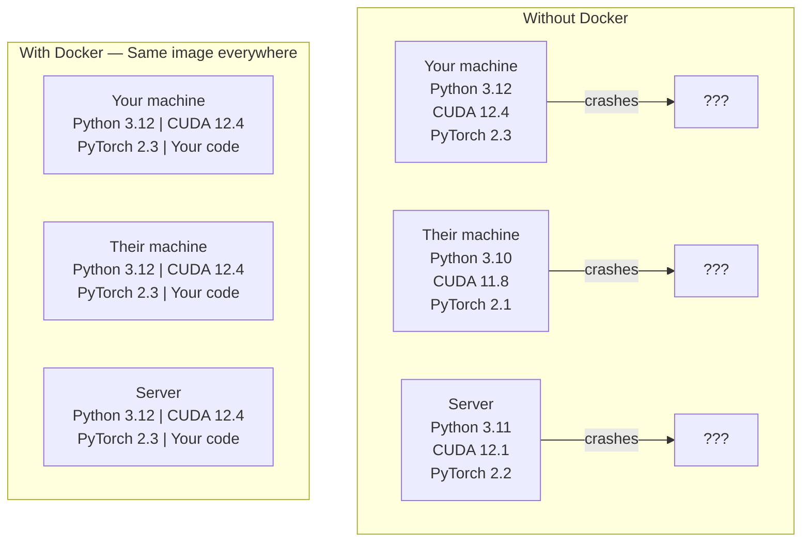

# AI के लिए Docker  Docker कंटेनर AI अनुप्रयोग

> कंटेनरों से "मेरी मशीन पर काम" अतीत की बात बन जाती है।
> 容器让"我的机器上能跑"成为历史──

**Type:** Build | **类型:** 构建
**Languages:** Docker | **语言:** Docker
**Prerequisites:** Phase 0, Lessons 01 and 03 | **前置知识:** Phase 0, 第 01 课和第 03 课
**Time:** ~60 minutes | **时间:** ~60 分钟

## सीखने के लक्ष्य

- एक डॉकरफ़ाइल से CUDA, PyTorch, और AI पुस्तकालयों के साथ GPU-सक्षम Docker छवि बनाएं
  中文翻译: From Dockerfile 构建支持GPU 的 Docker 镜像,包含CUDA、PyTorch 和 AI 库
- कंटेनर पुनर्निर्माणों में मॉडलों, डेटासेट और कोड को बनाए रखने के लिए मात्रा के रूप में होस्ट निर्देशिकाएं माउंट करें
  中文翻译:挂载宿主目录为卷,在容器重建后保持模型、数据集和代码持久化
- कंटेनर के अंदर जीपीयू को उजागर करने के लिए एनवीआईडीआई कंटेनर टूलकिट को कॉन्फ़िगर करें
  中文翻译: कॉन्फ़िगर NVIDIA कंटेनर टूलकिट, में容器内暴露 GPU
- Docker Compose का उपयोग करके मल्टी-सर्विस एआई अनुप्रयोगों (इन्फरेंस सर्वर + वेक्टर डेटाबेस) को ऑर्केस्ट्रेट करें
  中文翻译: उपयोग Docker Composing 编排多服务 AI 应用(推理服务器 + 向量数据库)

> **【中文解读】**
> डॉकर कोड, संचालन समय, भंडारण और सिस्टम उपकरण को एक "कंटेनर" में पैक करके, किसी भी मशीन पर चलने के परिणामों को एक साथ सुनिश्चित करें।

## समस्या का वर्णन

आपने अपने लैपटॉप पर एक मॉडल को PyTorch 2.3, CUDA 12.4 और Python 3.12 के साथ प्रशिक्षित किया है। आपके सहयोगी के पास PyTorch 2.1, CUDA 11.8 और Python 3.10 है। आपका मॉडल उनकी मशीन पर दुर्घटनाग्रस्त हो जाता है। आपकी Dockerfile दोनों पर काम करती है।

> आप अपने लैपटॉप कंप्यूटर पर PyTorch 2.3、CUDA 12.4 और Python 3.12 का उपयोग करके एक मॉडल को प्रशिक्षित करते हैं। आपके सहकर्मी PyTorch 2.1、CUDA 11.8 और Python 3.10 का उपयोग करते हैं। मॉडल उनकी मशीन पर दुर्घटनाग्रस्त हो जाता है।

एआई परियोजनाएं निर्भरता की दुःस्वप्न हैं। एक विशिष्ट स्टैक में पायथन, पायटॉर्च, CUDA ड्राइवर, cuDNN, सिस्टम-स्तरीय सी लाइब्रेरी और फ्लैश-एटीएन जैसे विशेष पैकेज शामिल हैं जिन्हें सटीक संकलक संस्करणों की आवश्यकता होती है। डॉकर इन सभी को एक एकल छवि में पैक करता है जो हर जगह समान रूप से चलता है।

> एआई परियोजनाओं पर निर्भर प्रबंधन के 梦──सामान्य तकनीक शामिल हैं पायथन, पायटॉर्च, CUDA 驱动, cuDNN, सिस्टम स्तर C 库, साथ ही विशेष संकलितकर्ता संस्करणों की आवश्यकता होती है जैसे कि फ्लैश-attn── डॉकर इन सभी पैकेज को एक में एक साथ काम करने वाली छवि में डालते हैं।

> **【中文解读】**
> AI  परियोजना  सबसे ज्यादा Docker के परियोजना प्रकारों में से एक है  CUDA  संस्करण 不兼容、PyTorch  संस्करण संघर्ष、cuDNN 缺失 ये समस्याएं Docker के साथ एक बार समाधान

## अवधारणा का मूल अवधारणा

> **【拓展：Docker 在 AI 中的三大用途】**(1) **环境一致性**: अपने कंप्यूटर पर प्रशिक्षित अच्छे मॉडल, सर्वर पर तैनात होने पर पुस्तकालय संस्करणों के कारण रिपोर्ट नहीं होती;**GPU 隔离**:多人共享一台GPU 服务器,每个人一个容器互不干扰;(3) **一键部署**:`docker run`एक条命令启动完整的AI 服务(模型 + API + 前端),无需手动配置──Hugging Face के TGI、vLLM等推理框架都提供Docker 镜像──

डॉकर आपके कोड, रनटाइम, लाइब्रेरी और सिस्टम टूल्स को एक अलग इकाई में लपेटता है जिसे कंटेनर कहा जाता है। इसे एक हल्के आभासी मशीन के रूप में सोचें, सिवाय इसके कि यह अपने स्वयं के चलाने के बजाय होस्ट ओएस कर्नेल को साझा करता है, इसलिए यह मिनटों के बजाय सेकंड में शुरू होता है।

> डॉकर आपके कोड को "कंटेनर" नामक एक पृथक इकाई में पैक करेगा। इसे एक हल्के वर्चुअल मशीन की तरह कल्पना की जा सकती है, हालांकि यह होस्ट ऑपरेटिंग सिस्टम के आंतरिक को साझा करता है, न कि अपने स्वयं के आंतरिक को संचालित करता है, इसलिए इसे शुरू करने में कुछ सेकंड की आवश्यकता होती है।



### क्यों AI परियोजनाओं Docker की जरूरत है अधिक से अधिक के लिए क्यों AI परियोजनाओं विशेष रूप से Docker की जरूरत है

> **【中文解读】**AI  परियोजना के लिए निर्भरता विशेष गहराईःपायथन → पायटॉर्च → CUDA → cuDNN → सिस्टम स्तर C 库。 किसी भी एक स्तर के संस्करण के असंगत परिणामों को प्रशिक्षित करने या अनुमानित परिणामों को असंगत करने में मदद मिलेगी。 डॉकर सभी स्तरों को एक दर्पण में पैक करें, सुनिश्चित करें कि "मेरे मशीन पर चल सकता है" "जहां भी चल सकता है" में बदल जाए।。

1. **GPU drivers are fragile.**CUDA 12.4 कोड CUDA 11.8 पर नहीं चलता है। डॉकर NVIDIA कंटेनर टूलकिट के माध्यम से मेजबान GPU ड्राइवर साझा करते हुए कंटेनर के अंदर CUDA टूलकिट को अलग करता है।

> 1. **GPU 驱动很脆弱。**CUDA 12.4 का कोड CUDA 11.8 पर नहीं चल सकता है।

2. **Model weights are large.**7B पैरामीटर मॉडल 14 GB fp16 में है। आप इसे हर बार पुनर्निर्माण करने के लिए फिर से डाउनलोड नहीं करना चाहते हैं। डॉकर वॉल्यूम आपको होस्ट से मॉडल निर्देशिका को माउंट करने की अनुमति देते हैं।

> 2. **模型权重很大。**7B 参数 का मॉडल fp16 में नीचे 14 GB है──आप नहीं चाहते कि प्रत्येक बार पुनः निर्माण कंटेनर पुनः डाउनलोड हो── डॉकर 卷 आपको मेजबान से मॉडल सूची में अपलोड करने दें──

3. **Multi-service architectures are common.**एक वास्तविक एआई एप्लिकेशन सिर्फ एक पायथन स्क्रिप्ट नहीं है. यह एक निष्कर्ष सर्वर है, RAG के लिए एक वेक्टर डेटाबेस, शायद एक वेब फ्रंटेंड। Docker Compose इन सभी को एक कमांड के साथ व्यवस्थित करता है।

> 3. **多服务架构很常见。**असली एआई  अनुप्रयोग केवल एक पायथन 脚本 नहीं है। इसमें एक विचार सर्वर, एक रैग, एक डेटाबेस, एक वेब पूर्व端, एक डॉकर कम्पोजर, एक आदेश के साथ सभी सेवाओं को संकलित करना शामिल है।

### मुख्य शब्दावली

| Term | What it means |
|------|---------------|
| Image | A read-only template. Your recipe. Built from a Dockerfile. |
| Container | A running instance of an image. Your kitchen. |
| Dockerfile | Instructions to build an image. Layer by layer. |
| Volume | Persistent storage that survives container restarts. |
| docker-compose | A tool for defining multi-container applications in YAML. |

| 术语 | 含义 |
|------|------|
| Image（镜像） | 只读模板，相当于菜谱。由 Dockerfile 构建。 |
| Container（容器） | 镜像的运行实例，相当于厨房。 |
| Dockerfile | 构建镜像的指令文件，逐层定义。 |
| Volume（卷） | 持久化存储，容器重启后数据不丢失。 |
| docker-compose | 用 YAML 定义多容器应用的编排工具。 |

### एआई में सामान्य कंटेनर पैटर्न

> **【拓展：AI 部署的标准模式】**最常见的 AI 容器模式:(1) **训练容器**挂载数据集目录, training完输出模型权重;(2) **推理容器**加载模型权重,提供 REST API;(3) **Jupyter 容器**预装所有库的笔记本 环境──Hugging Face、NVIDIA NGC  ने बड़ी संख्या में पूर्वनिर्माण किए गए एआई 基础镜像──

```
Dev Container
  Full toolkit. Editor support. Jupyter. Debugging tools.
  Used during development and experimentation.

Training Container
  Minimal. Just the training script and dependencies.
  Runs on GPU clusters. No editor, no Jupyter.

Inference Container
  Optimized for serving. Small image. Fast cold start.
  Runs behind a load balancer in production.
```

## इसे बनाओ, इसे पूरा करो।
```figure
s0-image-layers
```

## इसे बनाओ

### चरण 1: डॉकर स्थापित करें

```bash
# macOS
brew install --cask docker
open /Applications/Docker.app

# Ubuntu
curl -fsSL https://get.docker.com | sh
sudo usermod -aG docker $USER
# Log out and back in for group change to take effect
```

सत्यापित करेंः

> 验证安装:

```bash
docker --version
docker run hello-world
```

### चरण 2: NVIDIA कंटेनर टूलकिट (NVIDIA GPU के साथ लिनक्स) स्थापित करें

यह Docker कंटेनरों को आपके GPU तक पहुँचने की अनुमति देता है। macOS और Windows (WSL2) उपयोगकर्ताओं को यह छोड़ सकते हैं; Docker Desktop उन प्लेटफार्मों पर GPU के माध्यम से अलग तरह से संभालता है।

> यह Docker 容器 को आपके GPU को पहुँचने में सक्षम बनाता है. macOS और Windows (WSL2) उपयोगकर्ता इस चरण को छोड़ सकते हैं.

```bash
distribution=$(. /etc/os-release;echo $ID$VERSION_ID)
curl -fsSL https://nvidia.github.io/libnvidia-container/gpgkey | sudo gpg --dearmor -o /usr/share/keyrings/nvidia-container-toolkit-keyring.gpg
curl -s -L https://nvidia.github.io/libnvidia-container/$distribution/libnvidia-container.list | \
    sed 's#deb https://#deb [signed-by=/usr/share/keyrings/nvidia-container-toolkit-keyring.gpg] https://#g' | \
    sudo tee /etc/apt/sources.list.d/nvidia-container-toolkit.list

sudo apt-get update
sudo apt-get install -y nvidia-container-toolkit
sudo nvidia-ctk runtime configure --runtime=docker
sudo systemctl restart docker
```

कंटेनर के अंदर जीपीयू एक्सेस का परीक्षण करेंः

> 测试容器内 GPU 访问:

```bash
docker run --rm --gpus all nvidia/cuda:12.4.1-base-ubuntu22.04 nvidia-smi
```

यदि आप अपने जीपीयू जानकारी देखते हैं, उपकरण किट काम कर रहा है.

> यदि आप GPU 信息 देख सकते हैं, तो उपकरण के काम को सामान्य रूप से समझाएं

### चरण 3: मूल चित्रों को समझें।

> **【中文解读】**基础镜像是Dockerfile के उदय बिंदु──AI 项目推使用NVIDIA 官方的CUDA 镜像(`nvidia/cuda:12.4.0-devel-ubuntu22.04`) या पिटर्च 官方镜像(`pytorch/pytorch:2.4.0-cuda12.4`), वे CUDA 运行时和深度学习库 预装                                                                                                                                                                                                                                                      

सही आधार छवि चुनने डिबगिंग के घंटे बचाता है।

> 选择正确的基础镜像能节省几个小时的调试时间──

```
nvidia/cuda:12.4.1-devel-ubuntu22.04
  Full CUDA toolkit. Compilers included.
  Use for: building packages that need nvcc (flash-attn, bitsandbytes)
  Size: ~4 GB

nvidia/cuda:12.4.1-runtime-ubuntu22.04
  CUDA runtime only. No compilers.
  Use for: running pre-built code
  Size: ~1.5 GB

pytorch/pytorch:2.6.0-cuda12.4-cudnn9-runtime
  PyTorch pre-installed on top of CUDA.
  Use for: skipping the PyTorch install step
  Size: ~6 GB

python:3.12-slim
  No CUDA. CPU only.
  Use for: inference on CPU, lightweight tools
  Size: ~150 MB
```

### चरण 4: एआई विकास के लिए एक डॉकरफ़ाइल लिखें

यहाँ डॉकरफ़ाइल है `code/Dockerfile`. . . . . . . . . . . . . . . . . . . . . . . . . . . . . . . . . . . . . . . . . . . . . . . . . . . . . . . . . . . . . . . . . . . . . . . . . . . . . . . . . . . . . . . . . . . . . . . . . . . . . . . . . . . . . . . . . . . . . . . . . . . . . . . . . . . . . . . . . . . . . . . . . . . . . . . . . . . . . . . . . . . . . . . . . . . . . . . . . . . . . . . . . . . . . . . . . . . . . . . . . . . . . . . . . . . . . . . . . . . . . . . . . . . . . . . . . . . . . . . . . . . . . . . . . . . . . . . . . . . . . . . . . . . . . . . . . . . . . . . . . . . . . . . . . . . . . . . . . . . . . . . . . . . . . . . . . . . . . . . . . . . . . . . . . . . . . . . . . . . . . . . . . . . . . . . . . . . . . . . . . . . . . . . . . . . . . . . . . . . . . . . . . . . . . . . . . . . . . . . . . . . . . . . . . . . . . . . . . . . . . . . . . . . . . . . . . . . . . . . . . . . . . . . . . . . . . . . . . . . . . . . . . . . . . . . . . . . . . . . . . . . . . . . . . . . . . . . . . . . . . . . . . . . . . .

> यह है`code/Dockerfile`मध्य में डॉकरफ़ाइल──आम्में कदम से कदम फिर सेः

```dockerfile
FROM nvidia/cuda:12.4.1-devel-ubuntu22.04

ENV DEBIAN_FRONTEND=noninteractive
ENV PYTHONUNBUFFERED=1

RUN apt-get update && apt-get install -y --no-install-recommends \
    software-properties-common \
    git \
    curl \
    build-essential \
    && add-apt-repository -y ppa:deadsnakes/ppa \
    && apt-get update && apt-get install -y --no-install-recommends \
    python3.12 \
    python3.12-venv \
    python3.12-dev \
    && rm -rf /var/lib/apt/lists/*

RUN update-alternatives --install /usr/bin/python python /usr/bin/python3.12 1

RUN curl -sSL https://raw.githubusercontent.com/pypa/get-pip/3b73145063be545b649ad9ca83ea8da5fc915a4f/public/get-pip.py -o /tmp/get-pip.py \
    && echo "a341e1a43e38001c551a1508a73ff23636a11970b61d901d9a1cad2a18f57055  /tmp/get-pip.py" | sha256sum -c - \
    && python /tmp/get-pip.py \
    && rm /tmp/get-pip.py \
    && update-alternatives --install /usr/bin/pip pip /usr/local/bin/pip3.12 1

RUN python -m pip install --no-cache-dir --upgrade pip setuptools wheel

RUN python -m pip install --no-cache-dir \
    torch==2.6.0+cu124 \
    torchvision==0.21.0+cu124 \
    torchaudio==2.6.0+cu124 \
    --index-url https://download.pytorch.org/whl/cu124

RUN python -m pip install --no-cache-dir \
    numpy \
    pandas \
    scikit-learn \
    matplotlib \
    jupyter \
    transformers \
    datasets \
    accelerate \
    safetensors

WORKDIR /workspace

VOLUME ["/workspace", "/models"]

EXPOSE 8888

CMD ["python"]
```

इसे बनाओः

> 构建镜像:

```bash
docker build -t ai-dev -f phases/00-setup-and-tooling/07-docker-for-ai/code/Dockerfile .
```

यह पहली बार कुछ समय लेता है (CUDA बेस छवि + PyTorch डाउनलोड करना) । बाद के निर्माण कैश परतों का उपयोग करते हैं।

> 首次构建需要一些时间(下载 CUDA 基础镜像 + PyTorch) ⋅后续构建会使用缓存的层──

इसे चलाओः

> 运行容器:

```bash
docker run --rm -it --gpus all \
    -v $(pwd):/workspace \
    -v ~/models:/models \
    ai-dev python -c "import torch; print(f'PyTorch {torch.__version__}, CUDA: {torch.cuda.is_available()}')"
```

कंटेनर के अंदर Jupyter चलाएं:

> 容器内运行 Jupyter:

```bash
docker run --rm -it --gpus all \
    -v $(pwd):/workspace \
    -v ~/models:/models \
    -p 8888:8888 \
    ai-dev jupyter notebook --ip=0.0.0.0 --port=8888 --no-browser --allow-root
```

### चरण 5: डेटा और मॉडल के लिए वॉल्यूम म्यूटेशन

AI के काम के लिए वॉल्यूम माउंट महत्वपूर्ण हैं. उनके बिना, आपके 14 GB मॉडल डाउनलोड तब गायब हो जाते हैं जब कंटेनर बंद हो जाता है।

> 卷挂载对AI 工作至关重要──没有它们,你下载的14GB 模型在容器停止时就会消失──

```bash
# Mount your code
-v $(pwd):/workspace

# Mount a shared models directory
-v ~/models:/models

# Mount datasets
-v ~/datasets:/data
```

अपने प्रशिक्षण स्क्रिप्ट के अंदर, सवार पथ से लोडः

> प्रशिक्षण के लिए, से लिंक पथ लोड करें

```python
from transformers import AutoModel

model = AutoModel.from_pretrained("/models/llama-7b")
```

मॉडल आपके होस्ट फ़ाइल सिस्टम पर रहता है. आप फिर से डाउनलोड किए बिना कंटेनर को जितनी बार आप चाहते हैं पुनर्निर्माण.

> 模型存储在宿主文件系统上── आप कंटेनर को पुनः निर्माण कर सकते हैं, पुनः डाउनलोड करने की आवश्यकता नहीं──

### चरण 6: मल्टी-सर्विस एआई ऐप के लिए डॉकर कंपोज़ करें

एक वास्तविक RAG अनुप्रयोग को एक निष्कर्ष सर्वर और एक वेक्टर डेटाबेस की आवश्यकता होती है। Docker Compose दोनों एक कमांड के साथ चलाता है।

> वास्तविक RAG  अनुप्रयोगों को सर्वर और वेटमेंट डेटाबेस को समझने की आवश्यकता है।

देखो`code/docker-compose.yml`:

```yaml
services:
  ai-dev:
    build:
      context: .
      dockerfile: Dockerfile
    deploy:
      resources:
        reservations:
          devices:
            - driver: nvidia
              count: all
              capabilities: [gpu]
    volumes:
      - ../../../:/workspace
      - ~/models:/models
      - ~/datasets:/data
    ports:
      - "8888:8888"
    stdin_open: true
    tty: true
    command: jupyter notebook --ip=0.0.0.0 --port=8888 --no-browser --allow-root

  qdrant:
    image: qdrant/qdrant:v1.12.5
    ports:
      - "6333:6333"
      - "6334:6334"
    volumes:
      - qdrant_data:/qdrant/storage

volumes:
  qdrant_data:
```

सब कुछ शुरू करेंः

> 启动所有服务:

```bash
cd phases/00-setup-and-tooling/07-docker-for-ai/code
docker compose up -d
```

अब आपके एआई डेवलपर कंटेनर वेक्टर डेटाबेस तक पहुँच सकते हैं `http://qdrant:6333`सेवा नाम द्वारा. Docker Compose स्वचालित रूप से साझा नेटवर्क बनाता है।

> अब एआई  कंटेनर विकसित कर सकते हैं सेवा नाम `http://qdrant:6333`访问量数据库──Docker Composer स्वतः बनाएं साझा नेटवर्क──

एआई कंटेनर के अंदर से कनेक्शन का परीक्षण करेंः

> से एआई 容器内部测试连接:

```python
from qdrant_client import QdrantClient

client = QdrantClient(host="qdrant", port=6333)
print(client.get_collections())
```

सब कुछ बंद करो:

> 停止所有服务:

```bash
docker compose down
```

जोड़ें `-v`qdrant मात्रा को भी हटाने के लिएः

> 加 `-v`समकालीन हटाने 卷:

```bash
docker compose down -v
```

### चरण 7: एआई कार्य के लिए उपयोगी डॉकर कमांड

> 第7步:AI 工作中常用 डॉकर 命令

```bash
# List running containers
docker ps

# List all images and their sizes
docker images

# Remove unused images (reclaim disk space)
docker system prune -a

# Check GPU usage inside a running container
docker exec -it <container_id> nvidia-smi

# Copy a file from container to host
docker cp <container_id>:/workspace/results.csv ./results.csv

# View container logs
docker logs -f <container_id>
```

## इसे उपयोग करें गाइड का उपयोग करें

> **【拓展：Docker vs Conda 选择指南】**简单项目用Conda/uv 即可;需要部署或多人协作时使用Docker──体验法则: यदि आप कहते हैं "मेरी मशीन पर चल सकता है", तो आप Docker 了── इस पाठ्यक्रम के अधिकांश पाठ्यक्रम Docker की आवश्यकता नहीं है, लेकिन चरण 17 (संरचना और उत्पादन विभाग) का गहन उपयोग होगा──

अब आपके पास एक पुनरुत्पादित एआई विकास वातावरण है। इस पाठ्यक्रम के बाकी के लिएः

> अब आपके पास एक व्यावहारिक एआई विकास वातावरण है।

- उपयोग करें`docker compose up`अपने डेवलपर वातावरण और वेक्टर डेटाबेस को एक साथ शुरू करने के लिए
  中文翻译: उपयोग `docker compose up`पर्यावरण और वेक्टर डेटाबेस के विकास को प्रारंभ करते समय
- अपने कोड, मॉडल और डेटा को मात्रा में जोड़ें ताकि पुनर्निर्माण के बीच कुछ भी खो न जाए
  चीनी अनुवादः将代码、模型和数据挂载为卷, पुनर्निर्माण के बाद खोया नहीं जाएगा
- जब एक पाठ के लिए एक नया पायथन पैकेज की आवश्यकता है, तो इसे Docker फ़ाइल में जोड़ें और पुनर्निर्माण
  中文翻译:当课程需要新的Python 包时,添加到Dockerfile并重建
- अपने Docker फ़ाइल को टीम के साथ साझा करें। उन्हें बिल्कुल एक ही वातावरण मिलता है।
  चीनी अनुवादः टीम के साथ साझा Dockerfile, वे पूरी तरह से एक ही वातावरण प्राप्त

### कोई जीपीयू नहीं?

 हटाएँ`--gpus all`पीआईटॉर्च सीयूडीए की अनुपस्थिति का पता लगाता है और स्वचालित रूप से सीपीयू पर वापस गिर जाता है।

> 移除 `--gpus all`标志和 NVIDIA तैनात 配置块──容器 अभी भी CPU आधारित पाठ्यक्रमों में उपयोग किया जा सकता है──PyTorch 会自动检测 CUDA不存在并回归CPU──

## अभ्यास विषय

1. Docker फ़ाइल बनाएं और चलाएँ `python -c "import torch; print(torch.__version__)"`कंटेनर के अंदर
   构建 डॉकर 镜像,在容器内运行 PyTorch 验证
2. डॉकर-कंपोज स्टैक शुरू करें और Qdrant को AI कंटेनर से पहुंच योग्य है `http://qdrant:6333/collections`
   启动 डॉकर-कंपोज ,验证 Qdrant 向量数据库可访问
3. जोड़ें `flask`Docker फ़ाइल के लिए, पुनर्निर्माण, और बंदरगाह 5000 पर एक सरल एपीआई सर्वर चलाएं.`-p 5000:5000`
   में Dockerfile 中添加瓶, पुनर्निर्माण镜像,运行API 服务器
4.  से छवि आकार मापें`docker images`.  से मूल छवि स्विच करने की कोशिश करें`devel``runtime`और आकारों की तुलना करें
    माप लेंस आकार, विशेषांक विकास और रनटाइम  आधार लेंस के आकार का अंतर

## Key Terms  Key Terms  Key Terms  Key Terms  Key Terms  Key Terms  Key Terms  Key Terms  Key Terms  Key Terms  Key Terms  Key Terms  Key Terms  Key Terms  Key Terms  Key Terms  Key Terms  Key Terms  Key Terms  Key Terms  Key Terms  Key Terms  Key Terms  Key Terms  Key Terms  Key Terms  Key Terms  Key Terms  Key Terms  Key Terms  Key Terms  Key Terms  Key Terms  Key Terms  Key Terms  Key Terms  Key Terms  Key Terms  Key Terms  Key Terms  Key Terms  Key Terms  Key Terms  Key Terms  Key Terms  Key Terms  Key Terms  Key Terms  Key Terms  Key Terms  Key Terms  Key Terms  Key Terms  Key Terms  Key Terms  Key Terms  Key Terms  Key Terms  Key Terms  Key Terms  Key Terms  Key Terms  Key Terms  Key Terms  Key Terms  Key Terms  Key Terms  Key Terms  Key Terms  Key Terms  Key Terms  Key Terms  Key Terms  Key Terms  Key Terms  Key Terms  Key Terms  Key Terms  Key Terms  Key Terms  Key Terms  Key Terms  Key Terms  Key Terms  Key Terms  Key Terms  Key Terms  Key Terms  Key Terms  Key Terms  Key Terms  Key Terms  Key Terms  Key Terms  Key Terms  Key Terms  Key Terms  Key Terms  Key Terms  Key Terms  Key Terms  Key Terms  Key Terms  Key Terms  Key Terms  Key Terms  Key Terms  Key Terms  Key

| Term | What people say | What it actually means |
|------|----------------|----------------------|
| Container | "Lightweight VM" | An isolated process using the host kernel, with its own filesystem and network |
| Image layer | "Cached step" | Each Dockerfile instruction creates a layer. Unchanged layers are cached, so rebuilds are fast. |
| NVIDIA Container Toolkit | "GPU in Docker" | A runtime hook that exposes host GPUs to containers via `--gpus` flag |
| Volume mount | "Shared folder" | A directory on the host mapped into the container. Changes persist after the container stops. |
| Base image | "Starting point" | The `FROM` image your Dockerfile builds on top of. Determines what is pre-installed. |

| 术语 | 俗称 | 实际含义 |
|------|------|---------|
| Container | "轻量虚拟机" | 使用宿主内核的隔离进程，拥有独立文件系统和网络 |
| Image layer | "缓存层" | 每条 Dockerfile 指令创建一层，未修改的层会被缓存 |
| NVIDIA Container Toolkit | "Docker 中的 GPU" | 通过 `--gpus` 标志将宿主 GPU 暴露给容器的运行时钩子 |
| Volume mount | "共享文件夹" | 宿主目录映射到容器内，容器停止后数据保留 |
| Base image | "起点" | Dockerfile 的 FROM 镜像，决定了预装内容 |
