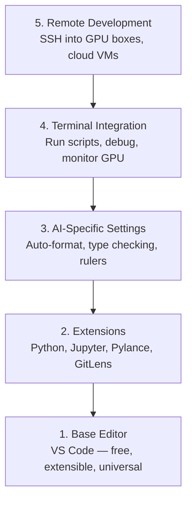

# संपादक सेटअप संपादक विन्यास

> अपने संपादक अपने सह पायलट है. इसे एक बार कॉन्फ़िगर तो यह अपने रास्ते में रहने के लिए और अपने वजन खींचने शुरू होता है.
> संपादक आपका सहायक चालक है. एक बार इसे तैनात करें, इसे काम करने से रोकें, बल्कि वास्तव में इसका कार्य करें.

**Type:** Build | **类型:** 构建
**Languages:** -- | **语言:** 无
**Prerequisites:** Phase 0, Lesson 01 | **前置知识:** Phase 0, 第 01 课
**Time:** ~20 minutes | **时间:** ~20 分钟

## सीखने के लक्ष्य

- पायथन, ज्युपीटर, लिंटिंग और रिमोट एसएसएच के लिए आवश्यक एक्सटेंशन के साथ वीएस कोड स्थापित करें
  中文翻译:安装 VS Code 及 Python、Jupyter、代码检查和远程 SSH等必备扩展
- एआई वर्कफ़्लो के लिए प्रारूप-ऑन-सेव, टाइप चेक और नोटबुक आउटपुट स्क्रॉलिंग कॉन्फ़िगर करें
  中文翻译:配置保存时格式化、类型检查和笔记本 输出滚动等 AI 工作流设置
- रिमोट जीपीयू मशीनों पर कोड संपादित करने और डिबग करने के लिए रिमोट एसएसएच सेट करें जैसे कि वे स्थानीय हैं
  中文翻译: सेट रिमोट SSH, जैसे संपादन本地文件一样编辑和调试远程 GPU 机器上的代码
- एआई कार्य के लिए संपादक विकल्पों (क्रसर, विंडसर्फ, नीओविम) और उनके व्यापारों का मूल्यांकन करें
  中文翻译:评估编辑器替代方案(Cursor、Windsurf、Neovim) और उसके अंदर AI 工作中的优劣

> **【中文解读】**
> 编辑器是你写代码的主力工具──本章帮你配置 VS Code 用于 AI 开发:पायथन 支持、 जूपिटर 集成、远程SSH 连接GPU 服务器──配置一次,受益整个课程──

## समस्या का वर्णन

आप अपने संपादक के अंदर हजारों घंटे बिताएंगे पायथन लिखते हुए, नोटबुक चलाते हुए, प्रशिक्षण लूप डिबग करते हुए और GPU बॉक्स में SSH-इंजेक्शन करते हुए। एक गलत कॉन्फ़िगर किए गए संपादक हर सत्र को घर्षण में बदल देता हैः कोई ऑटो-कंपल, कोई टाइप संकेत, कोई इनलाइन त्रुटियां नहीं, मैनुअल स्वरूपण, और एक नासमझ टर्मिनल वर्कफ़्लो।

> आप संपादक में हजारों घंटे खर्च करेंगे पायथन लिखने में, नोटबुक चलाने में, प्रशिक्षण चक्र को संशोधित करने में, एसएसएच को कनेक्ट करने में, GPU सर्वर को जोड़ने में। एक गलत विन्यास संपादक हर संपादन को कष्ट में बदल देगाः कोई स्वचालित पूरक नहीं, कोई प्रकार का सुझाव नहीं, कोई अंतर्निहित त्रुटि सुझाव नहीं, कोई हाथ स्वरूपण नहीं, कोई अशिष्ट अंतिम कार्यप्रवाह नहीं।

सही सेटअप में 20 मिनट लगते हैं, इसे छोड़ने से आपको हर दिन 20 मिनट लगते हैं।

> सही तैनाती केवल 20 मिनट की आवश्यकता है. तैनाती से आगे बढ़ना आपको प्रति दिन 20 मिनट की अधिक बर्बादी देगा.

> **【中文解读】**
> 配置编辑器 केवल 20 मिनट की आवश्यकता होती है, लेकिन बिना कॉन्फ़िगरेशन आपको प्रति दिन 20 मिनट से अधिक बर्बाद करने देगा।

## अवधारणा का मूल अवधारणा

एक एआई इंजीनियरिंग संपादक सेटअप के लिए पांच चीजों की जरूरत हैः

> एआई 工程编辑器 को पांच स्तरीय विन्यास की आवश्यकता हैः



> **【中文解读】**
> एआई  विकसित संपादक को पांच स्तरों की आवश्यकता हैः बुनियादी संपादक →  विस्तार प्लगइन्स → एआई  विशेष सेटिंग → 终端集成 → 远程开发── उनमें से सबसे महत्वपूर्ण है 远程 SSH  विकसित करनाआपको स्थानीय संपादक में सीधे ऑपरेट करने की आवश्यकता है दूरस्थ GPU  सर्वर──
```figure
s0-lsp-roundtrip
```

## इसे बनाओ

## इसे बनाओ, इसे पूरा करो।

> **【拓展：VS Code 为什么是 AI 开发的首选编辑器】**VS Code में AI के विकास में कब्जा करने का कारण:(1) 免费且轻量;(2) Jupyter Notebook 原生支持;(3) रिमोट SSH 直接连接 GPU 服务器编辑代码;(4) Python/Jupyter/Python Debugger 扩展生态完善;(5) AI 辅助编程扩展(Copilot、Cline、Continue)开箱即用──Cursor 和 Windsurf 是基于 VS Code 的 AI 增强版本,也值得尝试──

### चरण 1: VS कोड स्थापित करें।

VS Code अनुशंसित संपादक है. यह मुफ्त है, हर ओएस पर चलता है, इसमें प्रथम श्रेणी का Jupyter नोटबुक समर्थन है, और एक्सटेंशन पारिस्थितिकी तंत्र आपको एआई काम के लिए आवश्यक सब कुछ कवर करता है।

> VS Code ️ ️ ️ ️ ️ ️ ️ ️ ️ ️ ️ ️ ️ ️ ️ ️ ️ ️ ️ ️ ️ ️ ️ ️ ️ ️ ️ ️ ️ ️ ️ ️ ️ ️ ️ ️ ️ ️ ️ ️ ️ ️ ️ ️ ️ ️ ️ ️ ️ ️ ️ ️ ️ ️ ️ ️ ️ ️ ️ ️ ️ ️ ️ ️ ️ ️ ️ ️ ️ ️ ️ ️ ️ ️ ️ ️ ️ ️ ️ ️ ️ ️ ️ ️ ️ ️ ️ ️ ️ ️ ️ ️ ️ ️ ️ ️ ️ ️ ️ ️ ️ ️ ️ ️ ️ ️ ️ ️ ️ ️ ️ ️ ️ ️ ️ ️ ️ ️ ️ ️ ️ ️ ️ ️ ️ ️ ️ ️ ️ ️ ️ ️ ️ ️ ️ ️ ️ ️ ️ ️ ️ ️ ️ ️ ️ ️ ️ ️ ️ ️ ️ ️ ️ ️ ️ ️ ️ ️ ️ ️ ️ ️ ️ ️ ️ ️ ️ ️ ️ 

इसे डाउनलोड करें [code.visualstudio.com](https://code.visualstudio.com/). .

> से [code.visualstudio.com](https://code.visualstudio.com/)नीचे लो

टर्मिनल से सत्यापित करेंः

> पर终端验证:

```bash
code --version
```

यदि`code`macOS पर नहीं मिला है, खोलें VS कोड, दबाएँ `Cmd+Shift+P`, "शेल कमांड" टाइप करें, और "PATH में 'कोड' कमांड स्थापित करें" चुनें.

> यदि macOS 上找不到 `code`命令,打开 VS कोड,按 `Cmd+Shift+P`,输入 "शेल कमांड", चयन "PATH में 'कोड' कमांड स्थापित करें"

### चरण 2: आवश्यक एक्सटेंशन स्थापित करें.

> **【中文解读】**AI 开发必备的 VS Code 扩展:Python(调试+Lint) Jupyter(在编辑器中运行笔记本) Pylance(智能补全和类型检查) GitLens(查看代码历史) 安装后在设置中开启"保存时格式化",从此不用手动整理代码──

VS कोड में एकीकृत टर्मिनल खोलें (`` Ctrl+```) और एआई काम के लिए महत्वपूर्ण एक्सटेंशन स्थापित करेंः

> 打开 VS कोड का集成终端(`Ctrl+`` `या `` Cmd+```),安装 AI 工作所需的关键扩展:

```bash
code --install-extension ms-python.python
code --install-extension ms-python.vscode-pylance
code --install-extension ms-toolsai.jupyter
code --install-extension eamodio.gitlens
code --install-extension ms-vscode-remote.remote-ssh
code --install-extension ms-python.debugpy
code --install-extension ms-python.black-formatter
code --install-extension charliermarsh.ruff
```

प्रत्येक व्यक्ति क्या करता हैः

> प्रत्येक विस्तार का प्रभावः

| Extension | Why |
|-----------|-----|
| Python | Language support, virtual env detection, run/debug |
| Pylance | Fast type checking, autocomplete, import resolution |
| Jupyter | Run notebooks inside VS Code, variable explorer |
| GitLens | See who changed what, inline git blame |
| Remote SSH | Open a folder on a remote GPU box as if it were local |
| Debugpy | Step-through debugging for Python |
| Black Formatter | Auto-format on save, consistent style |
| Ruff | Fast linting, catches common mistakes |

फ़ाइल `code/.vscode/extensions.json`इस पाठ में सिफारिशों की पूरी सूची है. जब आप परियोजना फ़ोल्डर खोलें, VS कोड आपको उन्हें स्थापित करने के लिए कहेंगे.

> 本课中 `code/.vscode/extensions.json`包含完整的推列表──当你打开项目文件时,VS Code 会提示你安装──

### चरण 3: सेटिंग्स को कॉन्फ़िगर करें

सेटिंग्स को कॉपी करें `code/.vscode/settings.json`इस पाठ में, या उन्हें मैन्युअल रूप से लागू करें`Settings > Open Settings (JSON)`. .

> से本课的 `code/.vscode/settings.json`复制设置, या `Settings > Open Settings (JSON)`हाथ से आवेदन

एआई कार्य के लिए प्रमुख सेटिंग्सः

> AI 工作的关键设置:

```jsonc
{
    "python.analysis.typeCheckingMode": "basic",
    "editor.formatOnSave": true,
    "editor.rulers": [88, 120],
    "notebook.output.scrolling": true,
    "files.autoSave": "afterDelay"
}
```

ये क्यों मायने रखते हैंः

> ये सेटिंग्स क्यों महत्वपूर्ण हैंः

- **Type checking on basic**: आप चलाने से पहले गलत तर्क प्रकार पकड़ता है. tensor आकार असंगतता और गलत एपीआई पैरामीटर पर डिबगिंग समय बचाता है.
  中文翻译:**基础类型检查**: परिचालन से पहले गलत पैरामीटर प्रकारों को पकड़ना।
- **Format on save**कभी भी फिर से स्वरूपण के बारे में नहीं सोचें। काला इसे संभालता है।
  中文翻译:**保存时格式化**: फिर भी विचार करने की आवश्यकता नहीं है स्वरूपण।
- **Rulers at 88 and 120**: ब्लैक 88 पर लपेटता है। 120 मार्कर दिखाता है कि डॉक्यूमेंट्री स्ट्रिंग और कमेंट्स बहुत लंबे हो रहे हैं।
  中文翻译:**88 和 120 标尺**: ब्लैक में 88 处换行──120 标尺显示文档字符串和注释是否过长──
- **Notebook output scrolling**: ट्रेनिंग लूप्स हजारों लाइनें प्रिंट करती हैं. बिना स्क्रॉल किए, आउटपुट पैनल विस्फोट होता है।
  中文翻译:**Notebook 输出滚动**: प्रशिक्षण चक्र छपाई हजारों लाइनों. कोई रोल नहीं, आउटपुट बोर्ड बैठक爆
- **Auto-save**आप सहेजने के लिए भूल जाएगा. आपका प्रशिक्षण स्क्रिप्ट पुराने कोड चलाएगा. ऑटो सहेजने इससे बचाता है.
  中文翻译:**自动保存**:You will forget to save── प्रशिक्षण脚本会运行过时的代码── स्वचालित रूप से सहेजें इस स्थिति को रोकने हेतु──

### चरण 4: टर्मिनल एकीकरण

वीएस कोड के एकीकृत टर्मिनल में आप प्रशिक्षण स्क्रिप्ट चलाते हैं, जीपीयू की निगरानी करते हैं, और वातावरण का प्रबंधन करते हैं।

> VS Code का एकीकृत टर्मिनल वह स्थान है जहाँ आप चलाने प्रशिक्षण स्क्रिप्ट, निगरानी GPU और प्रबंधन पर्यावरण को नियंत्रित करते हैं।

इसे ठीक से सेट करेंः

> सही सेटिंगः

```jsonc
{
    "terminal.integrated.defaultProfile.osx": "zsh",
    "terminal.integrated.defaultProfile.linux": "bash",
    "terminal.integrated.fontSize": 13,
    "terminal.integrated.scrollback": 10000
}
```

उपयोगी शॉर्टकटः

> 常用快捷键:

| Action | macOS | Linux/Windows |
|--------|-------|---------------|
| Toggle terminal | `` Ctrl+` `` | `` Ctrl+` `` |
| New terminal | `` Ctrl+Shift+` `` | `` Ctrl+Shift+` `` |
| Split terminal | `Cmd+\` | `Ctrl+Shift+5` |

स्प्लिट टर्मिनल उपयोगी हैंः एक आपकी स्क्रिप्ट चलाने के लिए, एक GPU के साथ निगरानी के लिए `nvidia-smi -l 1`या `watch -n 1 nvidia-smi`. .

> 分屏终端很有用: एक运行脚本, एक उपयोग `nvidia-smi -l 1`या `watch -n 1 nvidia-smi`监控 GPU──

### चरण 5: रिमोट डेवलपमेंट (जीपीयू बॉक्स में एसएसएच)

> **【拓展：Remote SSH 是 AI 开发的杀手级功能】**अधिकांश लोगों के पास स्थानीय जीपीयू नहीं है, एसएसएच की आवश्यकता है दूरस्थ जीपीयू सर्वर प्रशिक्षण मॉडल。 वीएस कोड का रिमोट एसएसएच  विस्तार आपको स्थानीय फ़ाइलों को संपादित करने की तरह स्वचालित रूप से दूरस्थ कोड  पूरक  समायोजन  टर्मिनल सर्वव्यापी उपलब्ध है。 इसका मतलब है कि आप हल्के में विकसित कर सकते हैं, दूरस्थ ए 100 पर प्रशिक्षण 

यह एआई काम के लिए सबसे महत्वपूर्ण एक्सटेंशन है। आप दूरस्थ मशीनों (क्लाउड वीएम, लैब सर्वर, लैम्ब्डा, वास्ट.एआई) पर प्रशिक्षण चलाएंगे। दूरस्थ एसएसएच आपको दूरस्थ फ़ाइल सिस्टम खोलने, फ़ाइलों को संपादित करने, टर्मिनल चलाने और डिबग करने की अनुमति देता है जैसे कि सब कुछ स्थानीय था।

> यह एआई कार्य में सबसे महत्वपूर्ण विस्तार है। आप दूरस्थ मशीनों पर चलाने की ट्रेनिंग करेंगे।

सेटअपः

> 设置步骤:

1. रिमोट SSH एक्सटेंशन (चरण 2 में किया गया) स्थापित करें।
2. प्रेस `Ctrl+Shift+P`(या `Cmd+Shift+P`), "रिमोट-एसएसएचः होस्ट से कनेक्ट करें" टाइप करें।
3. प्रवेश करें`user@your-gpu-box-ip`. .
4. वीएस कोड अपने सर्वर घटक को दूरस्थ मशीन पर स्वचालित रूप से स्थापित करता है।

> 1. 安装 रिमोट SSH 扩展(已在步骤 2 完成)
> 2. 按 `Ctrl+Shift+P`(या `Cmd+Shift+P`),输入 "Remote-SSH: Host से कनेक्ट करें"──
> 3. 输入 `user@your-gpu-box-ip`
> 4. वीएस कोड स्वचालित रूप से दूरस्थ मशीन पर अपने सर्वर घटक को स्थापित करता है

पासवर्ड रहित पहुँच के लिए SSH कुंजी सेट करेंः

> बिना पासवर्ड पहुँच को प्राप्त करने के लिए, SSH की की सेटिंगः

```bash
ssh-keygen -t ed25519 -C "your-email@example.com"
ssh-copy-id user@your-gpu-box-ip
```

मेजबान को जोड़ें `~/.ssh/config`सुविधा के लिएः

> सुविधाजनक रूप से, मुख्य अतिथि जोड़ना`~/.ssh/config`:

```
Host gpu-box
    HostName 203.0.113.50
    User ubuntu
    IdentityFile ~/.ssh/id_ed25519
    ForwardAgent yes
```

अब`Remote-SSH: Connect to Host > gpu-box`तुरंत कनेक्ट करता है।

> 现在 `Remote-SSH: Connect to Host > gpu-box`तत्काल संपर्क

## विकल्प विकल्प विकल्प

> **【拓展：AI 增强编辑器对比】**Cursor (आधारित VS Code,内置 AI 编程助手,$20/月) और Windsurf (आधारित कोड, मुफ्त स्तर उपलब्ध) सभी 2024-2026 के वर्ष में उभरने वाले AI-निवासी संपादक हैं।

### कर्सर

[cursor.com](https://cursor.com)यह एक अंतर्निहित एआई कोड जनरेशन के साथ एक वीएस कोड कांटा है। यह एक ही विस्तार पारिस्थितिकी तंत्र और सेटिंग्स प्रारूप का उपयोग करता है। यदि आप पाठ्यक्रम का उपयोग करते हैं, तो इस सबक में सब कुछ अभी भी लागू होता है। वही आयात करें `settings.json`और `extensions.json`. .

> [cursor.com](https://cursor.com)यह एक अंतर्निहित एआई कोड उत्पन्न VS कोड 分支── यह एक ही विस्तार पारिस्थितिकी और सेटिंग प्रारूप का उपयोग करता है── यदि आप पाठ्यक्रम का उपयोग करते हैं, तो इस वर्ग की सभी सामग्री अभी भी लागू होती है──导入 एक ही `settings.json`和 `extensions.json`इम्को.

### विंडसर्फ

[windsurf.com](https://windsurf.com)एक ही कहानीः एक ही एक्सटेंशन, एक ही सेटिंग्स प्रारूप, एक ही रिमोट SSH समर्थन.

> [windsurf.com](https://windsurf.com)यह एक और AI  प्राथमिकता VS कोड 分支── समानः समान विस्तार、 समान सेटिंग प्रारूप、 समान रिमोट SSH 支持──

### वीम/नियोवम

यदि आप पहले से ही Vim या Neovim का उपयोग कर रहे हैं और इसमें उत्पादक हैं, तो वहां रहें। एआई पायथन काम करने के लिए न्यूनतम सेटअपः

> यदि आप Vim या Neovim का उपयोग कर रहे हैं और इसकी क्षमता गलत है, तो AI Python 工作 के न्यूनतम विन्यास का उपयोग जारी रखेंः

- **pyright**या **pylsp**प्रकार की जांच के लिए (मेसन या मैनुअल स्थापना के माध्यम से)
  中文翻译:**pyright**या **pylsp**प्रयोग के लिए प्रकार निरीक्षण (मेसन या हाथ से स्थापित)
- **nvim-lspconfig**भाषा सर्वर एकीकरण के लिए
  中文翻译:**nvim-lspconfig**उपयोग में भाषा सर्वर
- **jupyter-vim**या **molten-nvim**नोटबुक की तरह निष्पादन के लिए
  中文翻译:**jupyter-vim**या **molten-nvim**नोटबुक के समान निष्पादन के लिए उपयोग किया जाता है
- **telescope.nvim**फ़ाइल/सिंबल खोज के लिए
  中文翻译:**telescope.nvim**फ़ाइल / कोड खोज के लिए उपयोग किया
- **none-ls.nvim**स्वरूपण/लिनिंग के लिए काले और रफ के साथ
  中文翻译:**none-ls.nvim**配合 काले और रफ उपयोग करने के लिए स्वरूपण / लैंट

यदि आप पहले से ही Vim का उपयोग नहीं करते हैं, तो अभी शुरू न करें। सीखने की वक्र AI इंजीनियरिंग सीखने के साथ प्रतिस्पर्धा करेगी। VS कोड का उपयोग करें।

> यदि आप अभी तक विम का उपयोग नहीं कर रहे हैं, तो अभी शुरू न करें।

## इसे उपयोग करें गाइड का उपयोग करें

> **【中文解读】**推配置:VS Code + Python + Jupyter + Remote SSH── यदि दूरस्थ GPU  सर्वर का उपयोग करें, तो रिमोट SSH अनिवार्य है──调试训练循环时,Jupyter 扩展让你在编辑器内直接查看张量形和损曲线──

इस सेटअप के साथ, आपके दैनिक कार्यप्रवाह की तरह दिखता हैः

> इस व्यवस्था के साथ, आपका दैनिक कार्य इस प्रकार हैः

1. VS कोड में परियोजना फ़ोल्डर खोलें (या रिमोट SSH के माध्यम से GPU बॉक्स से कनेक्ट करें).
   中文翻译:在 VS Code 中打开项目文件(或通过远程SSH 连接到GPU 服务器) 。
2. ऑटो-कंपल, टाइप सुझाव और इनलाइन त्रुटियों के साथ संपादक में पायथन लिखें।
   中文翻译: संपादक में पायथन संपादित करें, स्वचालित रूप से पूरक का आनंद लें, प्रकार सुझाव और अंदर से जुड़े गलत सुझावों का आनंद लें
3. Jupyter विस्तार के साथ लाइन में Jupyter नोटबुक चलाएं।
   中文翻译:使用 Jupyter 扩展内嵌运行 नोटबुक。
4. प्रशिक्षण स्क्रिप्ट के लिए एकीकृत टर्मिनल का उपयोग करें,`uv pip install`, और GPU निगरानी.
   中文翻译: उपयोग集成终端运行训练脚本、`uv pip install`और जीपीयू  निगरानी
5. प्रतिबद्ध करने से पहले GitLens के साथ परिवर्तनों की समीक्षा करें।
   中文翻译:提交前用 GitLens 检查变更。

## अभ्यास विषय

1. VS कोड और चरण 2 में सूचीबद्ध सभी एक्सटेंशन स्थापित करें
   स्थापना VS कोड 和 चरण 2 中列出的 सभी विस्तार
2. कॉपी `settings.json`इस पाठ से अपने VS कोड विन्यास में
    将本课的`settings.json` कॉपी करने के लिए अपने VS कोड  कॉन्फ़िगरेशन
3. एक पायथन फ़ाइल खोलें और सत्यापित करें कि Pylance सहेजने पर टाइप सुझाव और काले प्रारूप दिखाता है
   打开一个Python文件,验证Pylance 显示类型提示、黑色 保存时自动格式化
4. यदि आपके पास रिमोट मशीन तक पहुंच है, तो रिमोट SSH सेट करें और उस पर एक फ़ोल्डर खोलें
   यदि दूरस्थ मशीन है, तो सेट करें रिमोट SSH और दूरस्थ फ़ाइलें खोलें

## Key Terms  Key Terms  Key Terms  Key Terms  Key Terms  Key Terms  Key Terms  Key Terms  Key Terms  Key Terms  Key Terms  Key Terms  Key Terms  Key Terms  Key Terms  Key Terms  Key Terms  Key Terms  Key Terms  Key Terms  Key Terms  Key Terms  Key Terms  Key Terms  Key Terms  Key Terms  Key Terms  Key Terms  Key Terms  Key Terms  Key Terms  Key Terms  Key Terms  Key Terms  Key Terms  Key Terms  Key Terms  Key Terms  Key Terms  Key Terms  Key Terms  Key Terms  Key Terms  Key Terms  Key Terms  Key Terms  Key Terms  Key Terms  Key Terms  Key Terms  Key Terms  Key Terms  Key Terms  Key Terms  Key Terms  Key Terms  Key Terms  Key Terms  Key Terms  Key Terms  Key Terms  Key Terms  Key Terms  Key Terms  Key Terms  Key Terms  Key Terms  Key Terms  Key Terms  Key Terms  Key Terms  Key Terms  Key Terms  Key Terms  Key Terms  Key Terms  Key Terms  Key Terms  Key Terms  Key Terms  Key Terms  Key Terms  Key Terms  Key Terms  Key Terms  Key Terms  Key Terms  Key Terms  Key Terms  Key Terms  Key Terms  Key Terms  Key Terms  Key Terms  Key Terms  Key Terms  Key Terms  Key Terms  Key Terms  Key Terms  Key Terms  Key Terms  Key Terms  Key Terms  Key Terms  Key Terms  Key Terms  Key Terms  Key

| Term | What people say | What it actually means |
|------|----------------|----------------------|
| LSP | "Autocomplete engine" | Language Server Protocol: a standard for editors to get type info, completions, and diagnostics from a language-specific server |
| Pylance | "The Python plugin" | Microsoft's Python language server using Pyright for type checking and IntelliSense |
| Remote SSH | "Working on the server" | VS Code extension that runs a lightweight server on a remote machine and streams the UI to your local editor |
| Format on save | "Auto-prettier" | The editor runs a formatter (Black, Ruff) every time you save, so code style is always consistent |

| 术语 | 俗称 | 实际含义 |
|------|------|---------|
| LSP | "自动补全引擎" | 语言服务器协议：编辑器获取类型信息、补全和诊断的标准 |
| Pylance | "Python 插件" | 微软的 Python 语言服务器，提供类型检查和智能提示 |
| Remote SSH | "在服务器上开发" | VS Code 在远程机器上运行轻量服务器，将 UI 传输到本地编辑器 |
| Format on save | "保存时自动格式化" | 每次保存时自动运行格式化工具，保持代码风格一致 |
