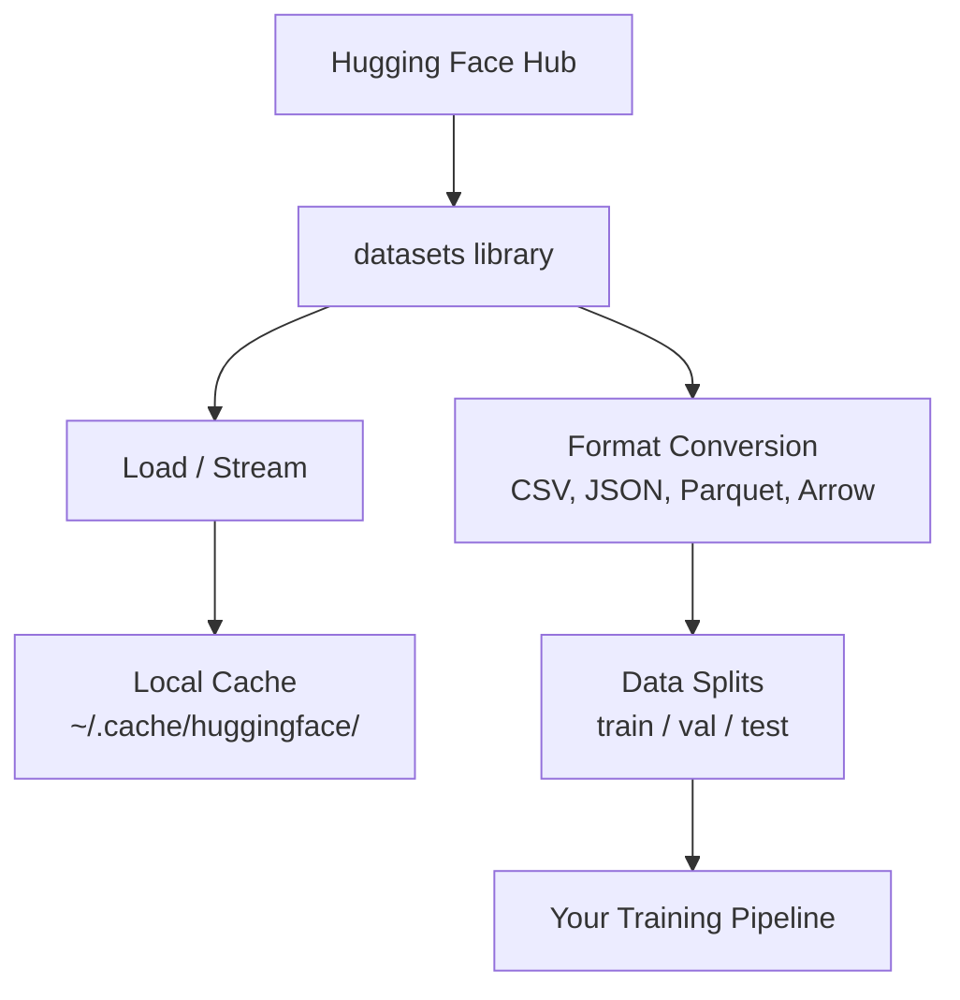

# डेटा प्रबंधन डेटा प्रबंधन

> डेटा ही ईंधन है, आप इसे कैसे प्रबंधित करते हैं, यह निर्धारित करता है कि आप कितनी तेजी से चलते हैं।
> डेटा एक ईंधन है. आप इसे कैसे प्रबंधित करते हैं, यह तय करता है कि आप अधिक तेजी से चल सकते हैं.

**Type:** Build | **类型:** 构建
**Language:**पायथन**语言:**पायथन
**Prerequisites:** Phase 0, Lesson 01 | **前置知识:** Phase 0, 第 01 课
**Time:** ~45 minutes | **时间:** ~45 分钟

## सीखने के लक्ष्य

- Hugging Face का उपयोग करके लोड, स्ट्रीम और कैश डेटासेट `datasets`पुस्तकालय
  中文翻译:使用 गले लगाना चेहरा `datasets`库加载、流式处理 एवं缓存 डेटा संग्रह
- CSV, JSON, Parquet, और तीर प्रारूपों के बीच परिवर्तित करें और उनके व्यापार को समझाएं
  中文翻译: CSV、JSON、Parquet 和 Arrow 形式 के बीच में परिवर्तित,并 व्याख्या अपने आप के फायदे
- फिक्स्ड रैंडम बीज के साथ पुनरावर्ती ट्रेन/वैलिडेशन/टेस्ट स्प्लिट बनाएं
  中文翻译: स्थिर随机种子 के साथ बनाना可复现的训练/验证/测试集拆分
-  का उपयोग करके बड़े मॉडल और डेटासेट फ़ाइलों का प्रबंधन करें`.gitignore`, Git LFS या DVC
  中文翻译: उपयोग `.gitignore`、Git LFS या DVC 管理大型模型和数据文件

> **【中文解读】**
> डाटा AI का ईंधन है.`datasets`库加载、缓存、转换和拆分数据集―― डेटा प्रबंधन का ज्ञान मशीन सीखने के प्रयोगों की शुरुआत की आवश्यकता है।

## समस्या का वर्णन

हर एआई प्रोजेक्ट डेटा से शुरू होता है. आपको डेटा सेट ढूंढने, उन्हें डाउनलोड करने, उन्हें प्रारूपों के बीच परिवर्तित करने, उन्हें प्रशिक्षण और मूल्यांकन के लिए विभाजित करने और उन्हें संस्करण करने की आवश्यकता है ताकि प्रयोग पुनः उत्पन्न हो सकें। यह हर बार मैन्युअल रूप से करना धीमा और त्रुटि प्रवण है। आपको एक दोहराए जाने योग्य कार्यप्रवाह की आवश्यकता है।

> प्रत्येक एआई परियोजना डेटा से शुरू होती है। आपको डेटा सेट ढूंढने, डाउनलोड करने, स्वरूप बदलने, प्रशिक्षण सेट और मूल्यांकन सेट में विभाजित करने, और प्रयोग को दोहराया जा सकता है सुनिश्चित करने के लिए संस्करण प्रबंधन करने की आवश्यकता होती है। प्रत्येक हाथ ऑपरेशन धीमा और आसान है। आपको एक दोहराया जा सकता है कार्यप्रवाह की आवश्यकता है।

> **【中文解读】**
> प्रत्येक एआई परियोजना डेटा से शुरू होती है। आपको डेटा सेट डाउनलोड करने की आवश्यकता होती है, रूपांतरण प्रारूप, प्रशिक्षण / सत्यापन / परीक्षण सेट को अलग करने की आवश्यकता होती है, और प्रयोग को दोहराया जा सकता है सुनिश्चित करने के लिए संस्करण का प्रबंधन करना होता है।

> **【拓展：Hugging Face 在 AI 生态中的地位】**
> गले लगाना चेहरा एआई क्षेत्र का "गितहब" है, जिसमें सैकड़ों हज़ार डेटा संग्रह और पूर्व प्रशिक्षण मॉडल हैं।`datasets`库 库 库 库 库 库 库 库 库 库 库 库 库 库 库 库 库 库 库 库 库 库 库 库 库 库 库 库 库 库 库 库 库 库 库 库 库 库 库 库 库 库 库 库 库 库 库 库 库 库 库 库 库 库 库 库 库 库 库 库 库 库 库 库 库 库 库 库 库 库 库 库 库 库 库 库 库 库 库 库 库 库 库 库 库 库 库 库 库 库 库 库 库 库 库 库 库 库 库 库 库 库 库 库 库 库 库 库 

## अवधारणा का मूल अवधारणा



गले लगाते हुए चेहरा `datasets`पुस्तकालय एआई काम के लिए डेटा लोड करने का मानक तरीका है। यह डाउनलोड, कैशिंग, प्रारूप रूपांतरण और बॉक्स से बाहर स्ट्रीमिंग को संभालता है।

> गले लगाते हुए चेहरा `datasets`库 एआई डेटा लोड करने का मानक तरीका है। यह ओपन बॉक्स यानी डाउनलोड, कैशिंग, स्वरूप रूपांतरण और प्रवाह लोड करने के लिए उपयोग करता है।

> **【中文解读】**
> गले लगाते हुए चेहरा `datasets`यह स्वचालित रूप से डाउनलोड, कैशिंग, प्रारूप रूपांतरण और प्रवाह लोड को संसाधित करता है। आपको डेटा फ़ाइलों का मैन्युअल प्रबंधन करने की आवश्यकता नहीं है, यह आपको सभी बुनियादी कार्यों को पूरा करने में मदद करेगा। यह डेटा प्रवाह को समझने के लिए सभी एआई प्रयोगों का आधार है।

> **【拓展：数据格式对训练速度的影响】**
> वास्तविक एआई के काम में, डेटा प्रारूप प्रशिक्षण दक्षता को सीधे प्रभावित करता है। पार्केट प्रारूप सीएसवी से छोटा 60-80% है, पढ़ने की गति 5-10 गुना है। गूगल और मेटा के आंतरिक प्रशिक्षण ट्यूबलाइन सभी पार्केट/शराफ़ प्रारूप का उपयोग करते हैं। एक 100GB के सीएसवी डेटासेट को पार्केट में परिवर्तित किया जा सकता है।

## इसे बनाओ, इसे पूरा करो।
```figure
s0-data-pipeline
```

## इसे बनाओ

### चरण 1: डेटासेट लाइब्रेरी स्थापित करें

```bash
pip install datasets huggingface_hub  # 安装 Hugging Face 数据集库和模型仓库工具
```

### चरण 2: डेटा सेट लोड करें

```python
from datasets import load_dataset

dataset = load_dataset("imdb")  # 加载 IMDB 电影评论数据集（首次下载，之后从缓存读取）
dataset = load_dataset("stanfordnlp/imdb")
print(dataset)
print(dataset["train"][0])  # 查看训练集第一条样本
```

यह IMDB फिल्म समीक्षा डेटासेट डाउनलोड करता है. पहले डाउनलोड के बाद, यह कैश से लोड करता है `~/.cache/huggingface/datasets/`. .

> यह आईएमडीबी 电影评论数据集.`~/.cache/huggingface/datasets/`का काश संग्रहण में लोड किया गया

### चरण 3: बड़े डेटासेट स्ट्रीम करें

कुछ डेटासेट डिस्क पर फिट होने के लिए बहुत बड़े होते हैं। स्ट्रीमिंग उन्हें पूरी चीज डाउनलोड किए बिना पंक्ति-पैक लोड करता है।

> कुछ डेटा संग्रह बहुत बड़े हैं, जिन्हें पूर्ण रूप से डिस्क पर डाउनलोड नहीं किया जा सकता है।

```python
dataset = load_dataset("wikimedia/wikipedia", "20220301.en", split="train", streaming=True)  # 流式加载：不下载完整数据集

for i, example in enumerate(dataset):
    print(example["title"])  # 逐条处理，内存占用恒定
    if i >= 4:
        break
```

स्ट्रीमिंग आपको एक देता है `IterableDataset`. आप पंक्तियों को संसाधित करते हैं जैसे वे आते हैं. मेमोरी उपयोग डेटासेट के आकार के बावजूद निरंतर रहता है.

> 流式加载 वापसी `IterableDataset`आपके द्वारा प्राप्त किए गए डेटा को आप एक-एक करके संसाधित करते हैं चाहे डेटा संग्रह कितना बड़ा हो,内存 का उपयोग निरंतर रहता है

> **【拓展：流式加载在大模型训练中的应用】**
> 流式加载是训练大语言模型的关键技术――Common Crawl 数据集集约250TB,不可能全部下载到本地――GPT-4 का प्रशिक्षण डेटा प्रवाह पद्धति से वितरित भंडारण में लोड होता है, प्रति सेकंड सैकड़ों हज़ार लेखों को संसाधित करता है――Hugging Face का `streaming=True`参数 आपको एक ही तरीके से सुपर बड़े डेटासेट को संसाधित करने देता है, यहां तक कि केवल 8GB के आंतरिक भंडारण वाले नोटबुक भी टीबी स्तर के डेटा को संसाधित कर सकते हैं।

### चरण 4: डेटासेट प्रारूप

`datasets`आप अपनी पाइपलाइन की जरूरतों के आधार पर अन्य प्रारूपों में परिवर्तित कर सकते हैं।

> `datasets`库底层 Apache Arrow का उपयोग करें. आप इसे अन्य प्रारूपों में परिवर्तित कर सकते हैं.

```python
dataset = load_dataset("stanfordnlp/imdb", split="train")

dataset.to_csv("imdb_train.csv")  # 导出为 CSV 格式（通用但体积大）
dataset.to_json("imdb_train.json")  # 导出为 JSON 格式（适合 API 交换）
dataset.to_parquet("imdb_train.parquet")  # 导出为 Parquet 格式（压缩率高、读取快）
```

प्रारूप तुलनाः

> 格式对比:

| Format | Size | Read Speed | Best For |
|--------|------|-----------|----------|
| CSV | Large | Slow | Human readability, spreadsheets |
| JSON | Large | Slow | APIs, nested data |
| Parquet | Small | Fast | Analytics, columnar queries |
| Arrow | Small | Fastest | In-memory processing (what `datasets` uses internally) |

| 格式 | 体积 | 读取速度 | 最适合 |
|------|------|---------|--------|
| CSV | 大 | 慢 | 人类阅读、电子表格 |
| JSON | 大 | 慢 | API、嵌套数据 |
| Parquet | 小 | 快 | 分析查询、列式存储 |
| Arrow | 小 | 最快 | 内存中处理（datasets 库内部使用） |

AI काम के लिए, Parquet सबसे अच्छा भंडारण प्रारूप है. तीर वह है जो आप स्मृति में काम करते हैं. CSV और JSON आदान-प्रदान के लिए हैं.

>  AI 工作 के लिए,Parquet सबसे अच्छा भंडारण प्रारूप है──Arrow डेटा आदान-प्रदान के लिए उपयोग किए जाने वाले स्वरूप हैं──CSV और JSON।

### चरण 5: डेटा विभाजन

> **【中文解读】**
> डाटा डिलीवरी मशीन सीखने के मूल सिद्धांत हैं। प्रशिक्षण के लिए प्रयोग किया जाता है, परीक्षण के लिए प्रयोग किया जाता है, परीक्षण के लिए प्रयोग किया जाता है, परीक्षण के लिए प्रयोग किया जाता है।

प्रत्येक एमएल परियोजना को तीन विभाजनों की आवश्यकता होती हैः

> प्रत्येक एमएल परियोजना को तीन भागों की आवश्यकता होती हैः

- **Train**: मॉडल इससे सीखता है (आमतौर पर 80%)
  中文翻译:**训练集**मॉडल से सीखना (आमतौर पर 80%)
- **Validation**प्रशिक्षण के दौरान प्रगति की जांच करें (आमतौर पर 10%)
  中文翻译:**验证集**प्रशिक्षण प्रक्रिया में जांच की प्रगति (आमतौर पर 10%)
- **Test**: प्रशिक्षण पूरा होने के बाद अंतिम मूल्यांकन (आमतौर पर 10%)
  中文翻译:**测试集**प्रशिक्षण पूरा होने के बाद अंतिम मूल्यांकन (आमतौर पर 10%)

कुछ डेटा सेट पूर्व-विभाजित होते हैं, जब वे नहीं करते हैं, उन्हें स्वयं विभाजित करेंः

> कुछ डेटा संग्रह पहले से ही विभाजित हो गया है. यदि नहीं, तो आपको स्वयं को विभाजित करने की आवश्यकता हैः

```python
dataset = load_dataset("stanfordnlp/imdb", split="train")

split = dataset.train_test_split(test_size=0.2, seed=42)  # 80% 训练+验证，20% 测试
train_val = split["train"].train_test_split(test_size=0.125, seed=42)  # 从 80% 中取 12.5% 作为验证集

train_ds = train_val["train"]  # 最终：70% 训练集
val_ds = train_val["test"]  # 最终：10% 验证集
test_ds = split["test"]  # 最终：20% 测试集

print(f"Train: {len(train_ds)}, Val: {len(val_ds)}, Test: {len(test_ds)}")
```

हमेशा एक बीज को पुनः उत्पन्न करने के लिए सेट करें। एक ही बीज हर बार एक ही विभाजन पैदा करता है।

> एक ही बीज को प्रत्येक बार एक ही विखंडन उत्पन्न करने के लिए बीज स्थापित करना आवश्यक है

### चरण 6: डाउनलोड और कैश मॉडल

मॉडल बड़ी फ़ाइलें हैं।`huggingface_hub`पुस्तकालय डाउनलोड और कैशिंग संभालता है।

> 模型是大文件──`huggingface_hub`库负责下载和缓存──

```python
from huggingface_hub import hf_hub_download, snapshot_download

model_path = hf_hub_download(  # 下载单个文件
    repo_id="sentence-transformers/all-MiniLM-L6-v2",
    filename="config.json"
)
print(f"Cached at: {model_path}")

model_dir = snapshot_download("sentence-transformers/all-MiniLM-L6-v2")  # 下载整个模型仓库
print(f"Full model at: {model_dir}")
```

> **【拓展：模型缓存机制】**
> Hugging Face का कैशिंग तंत्र बहुत बुद्धिमान है:模型下载后存储在 `~/.cache/huggingface/hub/`, बाद का लोड सीधे पढ़िए अपने स्थानीय कैशबैक। एक आम LLM जैसे Llama-2-7B लगभग 14GB, पहली बार डाउनलोड करने में कुछ मिनट लगते हैं, बाद का सेकंड-क्लास लोड होते हैं।

 के लिए मॉडल कैश`~/.cache/huggingface/hub/`एक बार डाउनलोड किया जाता है, वे तुरंत बाद में रन पर लोड.

> 模型缓存到 `~/.cache/huggingface/hub/`                                                                                                                                                                                                                                                              

### चरण 7: बड़ी फ़ाइलों को संभालें

> **【中文解读】**
> AI 模型文件动数 GB(GPT-2 约500MB,Llama-2-70B 约140GB), साधारण git 管理──三种方案各有适用场景:`.gitignore`नवीनतम सरल (अधिकृत) जानकारी,Git LFS 适合团队共享模型权重,DVC 适合严格复现的实验的需要──

मॉडल वजन और बड़े डेटा सेट को git में नहीं जाना चाहिए। तीन विकल्पः

> 模型权重和大型数据集不应放入 git──三种选择:

**Option A: .gitignore (simplest)**

> **选项 A：.gitignore（最简单）**

```
*.bin
*.safetensors
*.pt
*.onnx
data/*.parquet
data/*.csv
models/
```

**Option B: Git LFS (track large files in git)**

> **选项 B：Git LFS（在 git 中追踪大文件）**

```bash
git lfs install
git lfs track "*.bin"
git lfs track "*.safetensors"
git add .gitattributes
```

Git LFS आपके रेपो में पॉइंटर और वास्तविक फ़ाइलों को एक अलग सर्वर पर संग्रहीत करता है। GitHub आपको 1 GB मुफ्त देता है।

> Git LFS भंडारण में भंडारण सूचक, वास्तविक फ़ाइलें एक अलग सर्वर पर संग्रहीत पर। GitHub  1 GB  मुफ्त अंतरिक्ष प्रदान करता है।

**Option C: DVC (data version control)**

> **选项 C：DVC（数据版本控制）**

```bash
pip install dvc
dvc init
dvc add data/training_set.parquet
git add data/training_set.parquet.dvc data/.gitignore
git commit -m "Track training data with DVC"
```

डीवीसी छोटे बनाता है `.dvc`डेटा स्वयं S3, GCS, या किसी अन्य रिमोट स्टोरेज बैकेंड में रहता है।

> डीवीसी 创建小的 `.dvc`文件指向你的数据──数据本身存储在S3、GCS或其他远程存储后端──

> **【拓展：工业级数据版本管理】**
> Google और मेटा आदि में, डेटा संस्करण प्रबंधन कोड संस्करण प्रबंधन की तुलना में अधिक जटिल है। एक अनुशंसित प्रणाली प्रयोग में दशकों डेटा सेटों में शामिल हो सकते हैं। अरबों नमूने। डीवीसी एक खुला स्रोत समाधान है, जो उद्यमों में डेटाब्रिक्स, वजन और पूर्वाग्रहों (डब्ल्यू एंड बी) या नेपच्यून.एआई का उपयोग करके डेटा, मॉडल और प्रयोगों का पता लगाने के लिए किया जाता है। इन उपकरणों को प्रत्येक प्रयोग के उपयोग के सटीक डेटा को रिकॉर्ड करने में सक्षम बनाया जाता है, परिणामों को दोहराया जा सकता है।

| Approach | Complexity | Best For |
|----------|-----------|----------|
| .gitignore | Low | Personal projects, downloaded data you can re-fetch |
| Git LFS | Medium | Teams sharing model weights via git |
| DVC | High | Reproducible experiments, large datasets, teams |

| 方案 | 复杂度 | 最适合 |
|------|--------|--------|
| .gitignore | 低 | 个人项目、可重新下载的数据 |
| Git LFS | 中 | 通过 git 共享模型权重的团队 |
| DVC | 高 | 需要严格复现的实验、大数据集、团队协作 |

इस कोर्स के लिए, `.gitignore`DVC का उपयोग करें जब आपको मशीनों के बीच सटीक प्रयोगों को पुनः पेश करने की आवश्यकता हो।

> 本课程用 `.gitignore`पर्याप्त है. जब आप पार मशीन की आवश्यकता होती है, तो फिर से प्रयोग करें DVC.

### चरण 8: भंडारण पैटर्न

> **【中文解读】**
> इस स्थान पर 10GB से अधिक डेटा संग्रहण के लिए उपयुक्त है। जब डेटा संग्रह अधिक बड़ा होता है या कई मशीनों में साझा करने की आवश्यकता होती है, तो आपको क्लाउड स्टोरेज (एस 3 ̊ जीसीएस) का उपयोग करना चाहिए।

**Local storage**10 GB से कम डेटा सेट के लिए काम करता है। एचएफ कैश इसे स्वचालित रूप से संभालता है।

> **本地存储** लगभग 10 GB के निम्न डेटा संग्रह के लिए उपयुक्त है।

**Cloud storage**यह किसी भी बड़ी या मशीनों के बीच साझा की गई चीज़ के लिए हैः

> **云存储**बड़े डेटा सेट के लिए या क्रॉस-मैशनेज साझा करने की आवश्यकता के लिए स्थितिः

```python
import os

local_path = os.path.expanduser("~/.cache/huggingface/datasets/")

# s3_path = "s3://my-bucket/datasets/"
# gcs_path = "gs://my-bucket/datasets/"
```

डीवीसी सीधे एस3 और जीसीएस के साथ एकीकृत होता हैः

> डीवीसी 直接与S3 和 GCS 集成:

```bash
dvc remote add -d myremote s3://my-bucket/dvc-store
dvc push
```

इस कोर्स के लिए, स्थानीय भंडारण पर्याप्त है. जब आप दूरस्थ GPU उदाहरणों पर ठीक-ठीक ट्यून करते हैं तो क्लाउड भंडारण प्रासंगिक हो जाता है।

> इस कोर्स में स्थानीय भंडारण पर्याप्त है। दूरस्थ जीपीयू के उदाहरण पर आपको केवल लघुकरण के समय में ही Cloud भंडारण की आवश्यकता होती है।

## इस कोर्स में इस्तेमाल किए गए डेटासेट

| Dataset | Lessons | Size | What It Teaches |
|---------|---------|------|----------------|
| IMDB | Tokenization, classification | 84 MB | Text classification basics |
| WikiText | Language modeling | 181 MB | Next-token prediction |
| SQuAD | QA systems | 35 MB | Question answering, spans |
| Common Crawl (subset) | Embeddings | Varies | Large-scale text processing |
| MNIST | Vision basics | 21 MB | Image classification fundamentals |
| COCO (subset) | Multimodal | Varies | Image-text pairs |

| 数据集 | 涉及课程 | 体积 | 教你什么 |
|--------|---------|------|---------|
| IMDB | 分词、分类 | 84 MB | 文本分类基础 |
| WikiText | 语言建模 | 181 MB | 下一个 token 预测 |
| SQuAD | 问答系统 | 35 MB | 问答与区间选择 |
| Common Crawl（子集） | 嵌入 | 不定 | 大规模文本处理 |
| MNIST | 视觉基础 | 21 MB | 图像分类入门 |
| COCO（子集） | 多模态 | 不定 | 图像-文本对 |

हर पाठ में आपको क्या चाहिए, इसकी जानकारी दी जाती है।

> आपको इन सभी डेटा को डाउनलोड करने की आवश्यकता नहीं है। प्रत्येक वर्ग में यह समझाया जाएगा कि इसकी क्या आवश्यकता है।

## इसे फ्रेमवर्क के साथ लागू करें

> **【中文解读】**
> 实践环节:运行 `data_utils.py`验证所有数据管理功能正常工作── यह स्क्रिप्ट स्वचालित रूप से एक छोटा डेटा सेट डाउनलोड करेगा、 स्वरूप परिवर्तन करेगा、 प्रशिक्षण/验证/测试集 को अलग करेगा, और संक्षिप्त जानकारी छपाएगा── सुनिश्चित करें कि आपका वातावरण सही रूप से व्यवस्थित हो और बाद में अगले पाठ्यक्रम में प्रवेश करेगा──

सब कुछ काम करता है की पुष्टि करने के लिए उपयोगिता स्क्रिप्ट चलाएंः

> 运行工具脚本验证一切正常:

```bash
python code/data_utils.py
```

यह एक छोटा सा डेटा सेट डाउनलोड करता है, उसे परिवर्तित करता है, उसे विभाजित करता है, और सारांश प्रिंट करता है।

> यह एक छोटा सा डेटा सेट डाउनलोड करेगा, स्वरूप में परिवर्तन करेगा, विभाजन करेगा, और सारांश मुद्रित करेगा।

## इसे भेजें उत्पाद

इस पाठ से उत्पन्न होता हैः
- `code/data_utils.py`- पुनः प्रयोज्य डेटा लोड और कैशिंग उपयोगिता
- `outputs/prompt-data-helper.md`- किसी कार्य के लिए सही डेटा सेट खोजने के लिए शीघ्र

> 本课产出:
> - `code/data_utils.py`- पुनः प्रयोज्य डेटा लोड और कैशिंग उपकरण
> - `outputs/prompt-data-helper.md`- उपयुक्त डेटा संग्रह के लिए खोज करने के लिए प्रम्प्ट के लिए इस्तेमाल किया

## अभ्यास विषय

1. लोड करें `glue``mrpc`पहले 5 उदाहरणों को कॉन्फ़िगर और निरीक्षण करें
                                                                                                                                                                                                                                                                                                                                                                                                                                                                                                                                `glue`आंकड़े `mrpc`配置,查看前 5 条数据
2. `c4`डेटासेट और गणना करें कि आप 10 सेकंड में कितने उदाहरणों को संसाधित कर सकते हैं
   流式加载 `c4`आंकड़े, सांख्यिकी 10 सेकंड में संसाधित कर सकते हैं
3. एक डेटासेट को पार्केट में परिवर्तित करें और फ़ाइल आकार को CSV में तुलना करें
   डेटाबेस को पार्केट प्रारूप में परिवर्तित करना, CSV के साथ फ़ाइल आकार के मुकाबले
4. एक निश्चित बीज के साथ 70/15/15 ट्रेन/वैल/टेस्ट स्प्लिट बनाएं और आकारों की जांच करें
   प्रयोग स्थिर क्रम से बीज का निर्माण 70/15/15 का प्रशिक्षण/परीक्षण/परीक्षण संग्रह विखंडन,परीक्षण अनुपात

## Key Terms  Key Terms  Key Terms  Key Terms  Key Terms  Key Terms  Key Terms  Key Terms  Key Terms  Key Terms  Key Terms  Key Terms  Key Terms  Key Terms  Key Terms  Key Terms  Key Terms  Key Terms  Key Terms  Key Terms  Key Terms  Key Terms  Key Terms  Key Terms  Key Terms  Key Terms  Key Terms  Key Terms  Key Terms  Key Terms  Key Terms  Key Terms  Key Terms  Key Terms  Key Terms  Key Terms  Key Terms  Key Terms  Key Terms  Key Terms  Key Terms  Key Terms  Key Terms  Key Terms  Key Terms  Key Terms  Key Terms  Key Terms  Key Terms  Key Terms  Key Terms  Key Terms  Key Terms  Key Terms  Key Terms  Key Terms  Key Terms  Key Terms  Key Terms  Key Terms  Key Terms  Key Terms  Key Terms  Key Terms  Key Terms  Key Terms  Key Terms  Key Terms  Key Terms  Key Terms  Key Terms  Key Terms  Key Terms  Key Terms  Key Terms  Key Terms  Key Terms  Key Terms  Key Terms  Key Terms  Key Terms  Key Terms  Key Terms  Key Terms  Key Terms  Key Terms  Key Terms  Key Terms  Key Terms  Key Terms  Key Terms  Key Terms  Key Terms  Key Terms  Key Terms  Key Terms  Key Terms  Key Terms  Key Terms  Key Terms  Key Terms  Key Terms  Key Terms  Key Terms  Key Terms  Key Terms  Key Terms  Key Terms  Key

| Term | What people say | What it actually means |
|------|----------------|----------------------|
| Dataset split | "Training data" | A named subset (train/val/test) used at different stages of the ML lifecycle |
| Streaming | "Load it lazily" | Processing data row by row from a remote source without downloading the full dataset |
| Parquet | "Compressed CSV" | A columnar file format optimized for analytical queries and storage efficiency |
| Arrow | "Fast dataframe" | An in-memory columnar format used internally by the datasets library for zero-copy reads |
| Git LFS | "Git for big files" | An extension that stores large files outside the git repo while keeping pointers in version control |
| DVC | "Git for data" | A version control system for datasets and models that integrates with cloud storage |
| Cache | "Already downloaded" | A local copy of previously fetched data, stored at ~/.cache/huggingface/ by default |

| 术语 | 俗称 | 实际含义 |
|------|------|---------|
| Dataset split | "训练数据" | 数据集的命名子集（训练/验证/测试），用于 ML 生命周期的不同阶段 |
| Streaming | "懒加载" | 逐行处理远程数据，不下载完整数据集 |
| Parquet | "压缩 CSV" | 为分析查询和存储效率优化的列式文件格式 |
| Arrow | "快速数据帧" | datasets 库内部使用的内存列式格式，支持零拷贝读取 |
| Git LFS | "大文件 Git" | 将大文件存储在 git 仓库之外的扩展 |
| DVC | "数据版控" | 数据集和模型的版本控制系统，集成云存储 |
| Cache | "已下载" | 默认存储在 ~/.cache/huggingface/ 的本地缓存 |
