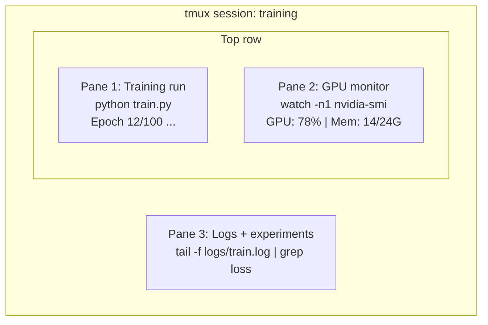

# टर्मिनल और शेल टर्मिनल और शेल

> टर्मिनल में AI इंजीनियरों के रहने के लिए है. यहाँ आरामदायक हो जाओ.
> 终端是AI 工程师的家──在这里让自己感到舒适──

**Type:** Learn | **类型:** 学习
**Languages:** -- | **语言:** 无
**Prerequisites:** Phase 0, Lesson 01 | **前置知识:** Phase 0, 第 01 课
**Time:** ~35 minutes | **时间:** ~35 分钟

## सीखने के लक्ष्य

- पाइपिंग का उपयोग करें, पुनर्निर्देशित करें, और `grep`कमांड लाइन से प्रशिक्षण लॉग को फ़िल्टर और संसाधित करने के लिए
  中文翻译: उपयोग管道、重定向和 `grep`आदेश से क्रम से क्रम से क्रम से क्रम से क्रम से क्रम
- समवर्ती प्रशिक्षण और GPU निगरानी के लिए कई पैनलों के साथ निरंतर tmux सत्र बनाएं
  चीनी अनुवादः सृजन带多面板的持久 tmux 会话, के लिए उपयोग किया जाता है एक ही समय में प्रशिक्षण और निगरानी GPU
-  के साथ प्रणाली और GPU संसाधनों की निगरानी`htop`,`nvtop`और `nvidia-smi`
  中文翻译: उपयोग `htop``nvtop`和 `nvidia-smi` निगरानी प्रणाली और GPU  संसाधन
- SSH का उपयोग करके स्थानीय और दूरस्थ मशीनों के बीच फ़ाइलें स्थानांतरित करें, `scp`और `rsync`
  中文翻译: SSH उपयोग करना`scp`和 `rsync`स्थानीय और दूरस्थ मशीनों में संचरण फ़ाइलें

> **【中文解读】**
> 终端是AI 工程师最常用的工具──训练模型、监控 GPU、查看日志、远程连接全部在终端完成──本章教你终端操作的核心技能:管道、tmux 会话、GPU 监控和文件传输──

## समस्या का वर्णन

आप किसी भी संपादक की तुलना में टर्मिनल में अधिक समय बिताएंगे. प्रशिक्षण रन, जीपीयू निगरानी, लॉग टेलिंग, रिमोट एसएसएच सत्र, पर्यावरण प्रबंधन. हर एआई वर्कफ़्लो खोल को छूता है. यदि आप यहां धीमे हैं, तो आप हर जगह धीमे हैं।

> आप किसी भी संपादक से अधिक समय समाप्ति पर बिताए हैं। प्रशिक्षण चल रहा है, GPU निगरानी, जियोरी ट्रैकिंग, दूरस्थ एसएसएच बैठक, पर्यावरण प्रबंधन। प्रत्येक एआई कार्य प्रवाह को एक खोल से अलग नहीं किया गया है। यदि आप धीमी गति से हैं, तो आप सभी जगह धीमी गति से हैं।

यह सबक एआई के काम के लिए महत्वपूर्ण टर्मिनल कौशल को कवर करता है. कोई यूनिक्स इतिहास नहीं है. कोई गहरी गोता लगाना नहीं है Bash स्क्रिप्टिंग. बस आप क्या जरूरत है.

> इस वर्ग में केवल एआई 工作中真正需要的终端技能──不讲 यूनिक्स 历史,不深入 Bash 脚本编程──只讲你需要的──

> **【中文解读】**
> एआई  इंजीनियरों को किसी भी संपादक से अधिक समय के लिए टर्मिनल समय पर प्रशिक्षण मॉडल, निगरानी GPU  दूरस्थ SSH  सभी टर्मिनल कौशल पर निर्भर करते हैं।

## अवधारणा का मूल अवधारणा



तीन चीजें एक साथ चल रही हैं एक टर्मिनल आप अलग हो सकते हैं, घर जाओ, SSH वापस में, और फिर से संलग्न. प्रशिक्षण चल रहा है.

> तीन कार्य एक साथ चल रहे हैं, एक अंत विंडो में। आप अलग हो सकते हैं।

> **【中文解读】**
> 终端复用是AI 工程师的核心技能──上图展示一个典型的 tmux 会话:一个板跑训练、一个板监控 GPU、一个板查看日志──三任务同时在一个终端窗口中运行──断开SSH 后训练继续,第二天重新连接即可恢复──

> **【拓展：tmux 在 GPU 训练中的重要性】**
> उदाहरण में, 8x A100 GPU, लगभग $32.77/小时) पर प्रशिक्षण LLM, यदि बंद होने के कारण नोटबुक प्रशिक्षण में ब्रेकअप होता है, तो न केवल बर्बाद किया गया है, सभी गणनाएं पूरी हो जाती हैं, बल्कि फिर से प्रशिक्षण शुरू करना होगा।

## इसे बनाओ, इसे पूरा करो।
```figure
s0-shell-pipeline
```

## इसे बनाओ

### चरण 1: अपनी शैल को जानें

जांचें कि आप किस गोले को चला रहे हैं:

> 检查你正在使用哪个贝:

```bash
echo $SHELL
```

अधिकांश प्रणालियों का उपयोग `bash`या `zsh`दोनों ठीक काम करते हैं. इस पाठ्यक्रम में आदेश दोनों में काम करते हैं.

> 大多数系统使用 `bash`या `zsh` दोनों ही हैं  इस पाठ्यक्रम के आदेश दोनों में से सभी लागू हैं

जाननी चाहिए कि क्या है

> 关键知识:

```bash
# Move around
cd ~/projects/ai-engineering-from-scratch
pwd
ls -la

# History search (most useful shortcut you'll learn)
# Ctrl+R then type part of a previous command
# Press Ctrl+R again to cycle through matches

# Clear terminal
clear   # or Ctrl+L

# Cancel a running command
# Ctrl+C

# Suspend a running command (resume with fg)
# Ctrl+Z
```

### चरण 2: पाइपिंग और रीडायरेक्ट

पाइपिंग कमांड को एक साथ जोड़ती है. इस तरह आप लॉग, फिल्टर आउटपुट और श्रृंखला उपकरण को संसाधित करते हैं। आप इसे लगातार उपयोग करेंगे।

> 管道将命令连接在一起―― यह है कि आप日志,过输出 और串联工具 को कैसे संभालते हैं――आप अक्सर उपयोग करते हैं――

> **【中文解读】**
> 管道(pipe) यूनिक्स 哲學 का मूल है: प्रत्येक उपकरण केवल एक काम करता है, ट्यूब के माध्यम से संबद्ध जटिल कार्य पूरा करता है।`cat train.log | grep "loss" | wc -l`इस आदेश का अर्थ है:读取日志 → 过含 "loss" 的行 → 统计行数──重定向(`>``>>``2>`) फ़ाइल या स्क्रीन पर आउटपुट को नियंत्रित करें। ये एआई इंजीनियरों द्वारा दैनिक रूप से आवश्यक संचालन हैं।

```bash
# Count how many times "loss" appears in a log  统计日志中 "loss" 出现的次数
cat train.log | grep "loss" | wc -l

# Extract just the loss values from training output  提取训练输出中的 loss 值
grep "loss:" train.log | awk '{print $NF}' > losses.txt

# Watch a log file update in real time, filtering for errors  实时过滤错误日志
tail -f train.log | grep --line-buffered "ERROR"

# Sort experiments by final accuracy  按最终准确率排序实验结果
grep "final_accuracy" results/*.log | sort -t= -k2 -n -r

# Redirect stdout and stderr to separate files  分别重定向标准输出和标准错误
python train.py > output.log 2> errors.log

# Redirect both to the same file  将所有输出合并到同一文件
python train.py > train_full.log 2>&1
```

तीन पुनर्निर्देशन आप की जरूरत हैः

> आपको तीन प्रकार के पुनर्निर्देशों को अपनाने की आवश्यकता हैः

| Symbol | What it does |
|--------|-------------|
| `>` | Write stdout to file (overwrite) |
| `>>` | Append stdout to file |
| `2>` | Write stderr to file |
| `2>&1` | Send stderr to same place as stdout |
| `\|` | Send stdout of one command as stdin to the next |

| 符号 | 作用 |
|------|------|
| `>` | 将标准输出写入文件（覆盖） |
| `>>` | 将标准输出追加到文件 |
| `2>` | 将标准错误写入文件 |
| `2>&1` | 将标准错误合并到标准输出 |
| `\|` | 将一个命令的输出传给下一个命令 |

### चरण 3: पृष्ठभूमि प्रक्रियाएं

प्रशिक्षण में घंटों लगते हैं, आप अपना टर्मिनल हर समय खुला नहीं रखना चाहते।

> प्रशिक्षण चलाने में कुछ घंटे लगते हैं.

```bash
# Run in background (output still goes to terminal)
python train.py &

# Run in background, immune to hangup (closing terminal won't kill it)
nohup python train.py > train.log 2>&1 &

# Check what's running in background
jobs
ps aux | grep train.py

# Bring a background job to foreground
fg %1

# Kill a background process
kill %1
# or find its PID and kill that
kill $(pgrep -f "train.py")
```

`&`,`nohup`और `screen`/`tmux`:

> `&``nohup`和 `screen`/`tmux`区别:

| Method | Survives terminal close? | Can reattach? |
|--------|-------------------------|---------------|
| `command &` | No | No |
| `nohup command &` | Yes | No (check log file) |
| `screen` / `tmux` | Yes | Yes |

| 方式 | 关闭终端后存活？ | 可重新连接？ |
|------|---------------|-------------|
| `command &` | 否 | 否 |
| `nohup command &` | 是 | 否（查看日志文件） |
| `screen` / `tmux` | 是 | 是 |

कुछ मिनट से अधिक समय के लिए, Tmux का प्रयोग करें।

> 对于超过几分钟的任务,使用tmux──

### चरण 4: tmux

tmux आप कई पैनलों के साथ निरंतर टर्मिनल सत्र बनाने के लिए अनुमति देता है. यह प्रशिक्षण रन के प्रबंधन के लिए सबसे उपयोगी उपकरण है.

> ️️️️️️️️️️️️️️️️️️️️️️️️️️️️️️️️️️️️️️️️️️️️️️️️️️️️️️️️️️️️️️️️️️️️️️️️️️️️️️️️️️️️️️️️️️️️️️️️️️️️️️️️️️️️️️️️️️️️️️️️️️️️️️️️️️️️️️️️️️️️️️️️️️️️️️️️️️️️️️️️️️️️️️️️️️️️️️️️️️️️️️️️️️️️️️️️️️️️️️️️️️️️️️️️️️️️️️️️️️️️️️️️️️️️️️️️️️️️️️️️️️️️️️️️️️️️️️️️️️️️️️️️️️️️️️️️️️️️️️️️️️️️️️️️️️️️️️️️️️️️️️️️️️️️️️️️️️️️️️️️️️️️️️️️️️️️️️️️️️️️️️️️️️️️️️️️️️️️️️️️️️️️️️️️️️️️️️️️️️️️️️️️️️️️️️️️️️️️️️️️️️️️️️️️️️️️️️️️️️️️️️️️️️️️️️️️️️️️️️️️️️️️️️️️️️️️️️️️️️️️️️️️️️️️️️️️️️️️️️️️️️️️️️️️️️️️️️️️️️️️️️️️️️️️

> **【中文解读】**
> tmux एक टर्मिनल रिप्लोजर है, जो कई पैनल और कई खिड़कियों का निर्माण कर सकता है, SSH को बंद कर सकता है। यह GPU प्रशिक्षण के सबसे महत्वपूर्ण उपकरण है।

```bash
# Install
# macOS
brew install tmux
# Ubuntu
sudo apt install tmux

# Start a named session
tmux new -s training

# Split horizontally
# Ctrl+B then "

# Split vertically
# Ctrl+B then %

# Navigate between panes
# Ctrl+B then arrow keys

# Detach (session keeps running)
# Ctrl+B then d

# Reattach
tmux attach -t training

# List sessions
tmux ls

# Kill a session
tmux kill-session -t training
```

एक विशिष्ट एआई वर्कफ़्लो सत्रः

> 典型 AI 工作流会话:

```bash
tmux new -s train

# Pane 1: start training
python train.py --epochs 100 --lr 1e-4

# Ctrl+B, " to split, then run GPU monitor
watch -n1 nvidia-smi

# Ctrl+B, % to split vertically, tail the logs
tail -f logs/experiment.log

# Now detach with Ctrl+B, d
# SSH out, go get coffee, come back
# tmux attach -t train
```

### चरण 5: htop और nvtop के साथ निगरानी

```bash
# System processes (better than top)  系统进程监控（比 top 更好用）
htop

# GPU processes (if you have NVIDIA GPU)  GPU 进程监控
# Install: sudo apt install nvtop (Ubuntu) or brew install nvtop (macOS)
nvtop

# Quick GPU check without nvtop  快速查看 GPU 状态
nvidia-smi

# Watch GPU usage update every second  每秒刷新 GPU 使用情况
watch -n1 nvidia-smi

# See which processes are using the GPU  查看占用 GPU 的进程
nvidia-smi --query-compute-apps=pid,name,used_memory --format=csv
```

> **【拓展：GPU 监控在实际训练中的价值】**
> कई GPU प्रशिक्षण में, GPU उपयोग दर 80% से कम है आमतौर पर इसका मतलब है डेटा लोड बोतल है`nvidia-smi`可以快速发现:显存不足(OOM) 、GPU उपयोग दर कम(数据瓶) 、温度过高(散热问题) ∼nvidia-smi 的 `--query-compute-apps`参数能精确找到哪个进程占据了GPU 显存储 यह साझा सर्वर पर बहुत महत्वपूर्ण है

`htop`कुंजी बंधन आप उपयोग करेंगेः

> `htop`常用快捷键:

- `F6`या `>`स्तंभ द्वारा क्रमबद्ध करने के लिए (मेमोरी लीक खोजने के लिए स्मृति द्वारा क्रमबद्ध)
  中文翻译:`F6`या `>`按列排序(按内存排序找到内存泄漏)
- `F5`पेड़ दृश्य को स्विच करने के लिए (देखें बच्चे प्रक्रियाएं)
  中文翻译:`F5`切换树形视图(查看子进程)
- `F9`किसी प्रक्रिया को मारने के लिए
  中文翻译:`F9`终止进程
- `/`प्रक्रिया नाम की खोज करने के लिए
  中文翻译:`/`搜索进程名

### चरण 6: रिमोट जीपीयू बॉक्स के लिए SSH

जब आप क्लाउड जीपीयू (लैम्ब्डा, रनपॉड, वास्ट.एआई) किराए पर लेते हैं, तो आप SSH के माध्यम से कनेक्ट होते हैं।

> जब आप लैंब्डा, रनपॉड, वास्ट.एआई) के साथ एक GPU किराए पर लेते हैं, तो SSH के माध्यम से 连接──

```bash
# Basic connection  基本 SSH 连接
ssh user@gpu-box-ip

# With a specific key  使用指定密钥连接
ssh -i ~/.ssh/my_gpu_key user@gpu-box-ip

# Copy files to remote  复制文件到远程服务器
scp model.pt user@gpu-box-ip:~/models/

# Copy files from remote  从远程服务器复制文件
scp user@gpu-box-ip:~/results/metrics.json ./

# Sync a whole directory (faster for many files)  同步整个目录（比 scp 更快）
rsync -avz ./data/ user@gpu-box-ip:~/data/

# Port forward (access remote Jupyter/TensorBoard locally)  端口转发（本地访问远程服务）
ssh -L 8888:localhost:8888 user@gpu-box-ip
# Now open localhost:8888 in your browser
```

# सुविधा के लिए SSH कॉन्फ़िगरेशन
# ~/.ssh/config में जोड़ेंः
# मेजबान जीपीयू
#     होस्टनाम 192.168.1.100
#     उपयोगकर्ता ubuntu
#     पहचानफ़ाइल ~/.ssh/gpu_key
#
# तो बसः
# एसएसजीपीयू
```

### Step 7: Useful aliases for AI work

> **【中文解读】**
> Shell 别名（alias）是将常用长命令缩短为短命令的方式。AI 工程中，`gpu` 查看 GPU 状态、`killtraining` 终止所有训练进程、`watchloss` 实时监控 loss——这些别名每天要用几十次。将它们加入 `~/.bashrc` 或 `~/.zshrc` 后，每次打开终端自动生效。

Add these to your `~/.bashrc` or `~/.zshrc`:

> 将这些添加到你的 `~/.bashrc` 或 `~/.zshrc`：

```bash
स्रोत चरण/00-संचलन-और-उपकरण/10-टर्मिनल-और-शेल/कोड/शेल_अलीसेस.sh
```

Or copy the ones you want. The key aliases:

> 或者复制你想要的。关键别名：

```bash
# GPU स्थिति एक नज़र में 一行查看 GPU  स्थिति
alias gpu='nvidia-smi --query-gpu=index,name,use.gpu,memory.used,memory.total,temperature.gpu --format=csv,noheader'

# सभी पायथन प्रशिक्षण प्रक्रियाओं को मारें 终止所有训练进程
alias killtraining='pkill -f "पायथन.*ट्रेन"'

# त्वरित आभासी वातावरण सक्रिय करें 快速激活虚拟环境
alias ae='source .venv/bin/activate'

# प्रशिक्षण हानि का निरीक्षण 实时监控 प्रशिक्षण हानि
alias watchloss='tail-f logs/*.logs/.
```

See `code/shell_aliases.sh` for the full set.

> 完整的别名列表参见 `code/shell_aliases.sh`。

> **【拓展：管道与重定向在 AI 日志分析中的威力】**
> 在 Google Brain 和 DeepMind，研究员用管道链处理实验日志：`grep "loss" train.log | awk '{print $3}' | sort -n | head -5` 可以在一秒内从百万行日志中找出 loss 最低的 5 个 epoch。这种技能不依赖任何 IDE 或 GUI 工具，在远程 GPU 服务器上尤其有用——那里只有终端可用。

### Step 8: Common AI terminal patterns

These come up repeatedly in practice:

> 这些模式在实践中反复出现：

> **【中文解读】**
> 这些是 AI 工程中反复出现的终端模式：用 `tee` 同时输出到终端和日志文件、用 `diff` 对比实验结果、用 `find` 找到最大的模型文件清理磁盘、用 `tar` 解压数据集。掌握这些命令组合能大幅提升日常效率。

```bash
# प्रशिक्षण चलाएं, सब कुछ रिकॉर्ड करें, जब समाप्त हो जाए तो सूचित करें
python train.py 2>&1 ✓ टी ट्रेन.log; echo "DONE" ✓ मेल "प्रशिक्षण पूरा" you@email.com

# दो प्रयोग लॉग की तुलना एक साथ करें
<(grep "सटीकता" exp1.log) <(grep "सटीकता" exp2.log)

# सबसे बड़ी मॉडल फ़ाइलें खोजें (डिस्क स्थान साफ करें)
खोजें. . . नाम "*pt" -o-नाम "*.सेफटेन्सर्स" .

# Hugging Face से एक मॉडल डाउनलोड करें
https://huggingface.co/model/resolve/main/model.safetensors

# डेटा सेट को अनटार करें
tar xzf डेटासेट.tar.gz -C./data/

# सभी पायथन फ़ाइलों में पंक्तियों की गणना (देखें कि आपकी परियोजना कितनी बड़ी है)
ढूंढें. -नाम "*पाई"

# डिस्क स्थान की जांच करें (प्रशिक्षण डेटा डिस्कों को तेजी से भरता है)
डीएफ -एच
du -sh ./data/*

# प्रशिक्षण से पहले पर्यावरण चर की जांच
मैं अलग था
मैं मशाल पकड़ा
```

## Use It | 用框架实现

Here's when each tool comes into play during this course:

> 以下是每个工具在本课程中的使用场景：

| Tool | When you use it |
|------|----------------|
| tmux | Every training run (Phases 3+) |
| `tail -f` + `grep` | Monitoring training logs |
| `nohup` / `&` | Quick background tasks |
| `htop` / `nvtop` | Debugging slow training, OOM errors |
| SSH + `rsync` | Working on cloud GPUs |
| Piping + redirects | Processing experiment results |
| Aliases | Saving time on repetitive commands |

| 工具 | 使用场景 |
|------|---------|
| tmux | 所有训练任务（Phase 3+） |
| `tail -f` + `grep` | 监控训练日志 |
| `nohup` / `&` | 快速后台任务 |
| `htop` / `nvtop` | 排查训练慢、OOM 错误 |
| SSH + `rsync` | 云 GPU 工作 |
| 管道 + 重定向 | 处理实验结果 |
| 别名 | 节省重复命令时间 |

> **【拓展：AI 工程师的终端工作流】**
> 一个高效的 AI 工程师通常同时维护 2-3 个 tmux 会话：一个用于训练（长时间运行）、一个用于数据处理和调试、一个用于监控。SSH config 文件可以简化连接——配置好后只需 `ssh gpu` 就能连上远程服务器。rsync 是传输大数据集的最佳选择，它只传输变化的字节，支持断点续传，比 scp 快 10 倍以上。

## Exercises | 练习题

1. Install tmux, create a session with three panes, and run `htop` in one, `watch -n1 date` in another, and a Python script in the third. Detach and reattach.
   安装 tmux，创建包含三个面板的会话，分别运行 htop、定时命令和 Python 脚本，然后分离并重新连接。
2. Add the aliases from `code/shell_aliases.sh` to your shell config and reload with `source ~/.zshrc` (or `~/.bashrc`).
   将 `code/shell_aliases.sh` 中的别名添加到你的 shell 配置中并重载。
3. Create a fake training log with `for i in $(seq 1 100); do echo "epoch $i loss: $(echo "scale=4; 1/$i" | bc)"; sleep 0.1; done > fake_train.log` and then use `grep`, `tail`, and `awk` to extract just the loss values.
   创建模拟训练日志，用 `grep`、`tail` 和 `awk` 提取 loss 值。
4. Set up an SSH config entry for a server you have access to (or use `localhost` to practice the syntax).
   为你有权限的服务器设置 SSH config 条目。

## Key Terms | 关键术语

| Term | What people say | What it actually means |
|------|----------------|----------------------|
| Shell | "The terminal" | The program that interprets your commands (bash, zsh, fish) |
| tmux | "Terminal multiplexer" | A program that lets you run multiple terminal sessions inside one window, and detach/reattach |
| Pipe | "The bar thing" | The `\|` operator that sends one command's output as input to another |
| PID | "Process ID" | A unique number assigned to every running process, used to monitor or kill it |
| nohup | "No hangup" | Runs a command immune to the hangup signal, so closing the terminal won't kill it |
| SSH | "Connecting to the server" | Secure Shell, an encrypted protocol for running commands on a remote machine |

| 术语 | 俗称 | 实际含义 |
|------|------|---------|
| Shell | "终端" | 解释执行命令的程序（bash、zsh、fish） |
| tmux | "终端复用器" | 在一个窗口中运行多个终端会话，支持分离/重连 |
| Pipe（管道） | "竖线那个" | `\|` 操作符，将一个命令的输出传给另一个命令 |
| PID | "进程号" | 每个运行进程的唯一编号，用于监控或终止 |
| nohup | "不挂断" | 关闭终端也不会终止命令 |
| SSH | "连服务器" | 安全外壳协议，用于远程执行命令 |
