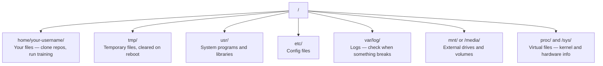

# लिनक्स के लिए एआई  लिनक्स के आधार  एआई  इंजीनियर आवश्यक)

> अधिकांश एआई लिनक्स पर चलता है. आपको फंसने से बचने के लिए पर्याप्त ज्ञान होना चाहिए.
> अधिकांश एआई लिनक्स पर चलती है। आपको पर्याप्त ज्ञान की आवश्यकता है, बस बस रहने के लिए नहीं।

**Type:** Learn | **类型:** 学习
**Languages:** -- | **语言:** 无
**Prerequisites:** Phase 0, Lesson 01 | **前置知识:** Phase 0, 第 01 课
**Time:** ~30 minutes | **时间:** ~30 分钟

## सीखने के लक्ष्य

- लिनक्स फ़ाइल प्रणाली को नेविगेट करें और कमांड लाइन से आवश्यक फ़ाइल संचालन करें
  中文翻译: में लिनक्स 文件系统中导航, से आदेश行执行基本文件操作
-  के साथ फ़ाइल अनुमतियों का प्रबंधन करें`chmod`और `chown`"अनुमति अस्वीकृत" त्रुटियों को हल करने के लिए
  中文翻译: उपयोग `chmod`和 `chown`管理文件权限, हल"परमिशन नाकारा" त्रुटि
-  के साथ सिस्टम पैकेज स्थापित करें`apt`और एआई काम के लिए एक नया जीपीयू बॉक्स सेट
  中文翻译: उपयोग `apt`安装系统包,为新GPU 服务器配置 AI 工作环境
- मैकओएस-लिनक्स अंतरों की पहचान करें जो आमतौर पर दूरस्थ मशीनों पर काम करने वाले डेवलपर्स को ठोकर देते हैं
  中文翻译:识别 macOS से लिनक्स में स्विच 时常见的踩坑点

> **【中文解读】**
> अधिकांश एआई प्रशिक्षण लिनक्स सर्वर पर चलता है। जब आप एसएसएच के बादल जीपीयू के उदाहरण में जाते हैं, तो आपको केवल एक टर्मिनल इंटरफ़ेस मिलता है।

## समस्या का वर्णन

आप macOS या विंडोज पर विकसित करते हैं। लेकिन जैसे ही आप एक क्लाउड जीपीयू बॉक्स में SSH, एक लैम्ब्डा उदाहरण किराए पर, या एक EC2 मशीन को चालू करते हैं, आप उबंटू में उतरते हैं। टर्मिनल आपका एकमात्र इंटरफ़ेस है। कोई खोजकर्ता नहीं है, कोई एक्सप्लोरर नहीं है, कोई जीआई नहीं है। यदि आप फ़ाइल प्रणाली को नेविगेट नहीं कर सकते हैं, पैकेज स्थापित कर सकते हैं, और कमांड लाइन से प्रक्रियाओं का प्रबंधन नहीं कर सकते हैं, तो आप गुगल पर "लिनक्स में फ़ाइल को अनज़िप करने का तरीका" खोजते हुए निष्क्रिय GPU घंटों के लिए भुगतान कर रहे हैं।

> आप macOS या Windows पर ऊपर विकसित करते हैं। लेकिन एक बार जब आप SSH को क्लाउड GPU सर्वर तक ले जाते हैं, Lambda उदाहरण या EC2 मशीन को लॉन्च करते हैं, तो आप Ubuntu में प्रवेश कर चुके हैं। टर्मिनल आपका एकमात्र इंटरफ़ेस है। कोई Finder, कोई Explorer, कोई GUI नहीं है। यदि आप कमांड लाइन से निर्देश फ़ाइल सिस्टम, स्थापना पैकेज और प्रबंधन प्रक्रिया नहीं कर सकते हैं, तो आप केवल GPU पर भुगतान कर सकते हैं।

यह एक अस्तित्व गाइड है. यह ठीक से कवर करता है कि आप एक रिमोट लिनक्स मशीन पर काम करने के लिए की जरूरत है एआई काम करने के लिए. और कुछ नहीं.

> यह एक अस्तित्व मार्गदर्शिका है। यह केवल दूरस्थ लिनक्स मशीनों पर एआई के काम के लिए आवश्यक ज्ञान को कवर करती है।

> **【中文解读】**
> आप macOS या Windows के साथ विकसित करते हैं, लेकिन एक SSH क्लाउड GPU सर्वर लिनक्स वर्ल्ड में प्रवेश कर गया है। कोई फ़ाइल प्रबंधक नहीं है, केवल एक टर्मिनल है। यह लिनक्स लाइव लाइव गाइड है।

## फ़ाइल सिस्टम लेआउट

लिनक्स एक ही जड़ के तहत सब कुछ व्यवस्थित करता है `/`. . कोई नहीं है .`C:\`या `/Volumes`. . . निर्देशिकाओं आप वास्तव में स्पर्श करेंगेः

> लिनक्स सभी सामग्री को एक ही सूची में व्यवस्थित करेगा ।`/`नीचे नहीं है`C:\`या `/Volumes`你实际会接触的目录:

> **【中文解读】**
> लिनक्स फाइल सिस्टम एक ही पेड़ की संरचना है, जड़ कैडस्ट्रो है।`/``/home/用户名/`(简写 `~`) आपके कार्यसूची में है, लगभग सभी कार्य यहाँ किए जाते हैं।`/tmp/`存临时文件, पुनः प्रारंभ`/var/log/`存日志,出问题时必查──`/mnt/` बाहरी भंडारण पर लंच करना  यह संरचना लिनक्स सर्वर पर काम करने के आधार पर है 



आपका होम डायरेक्टरी है `~`या `/home/your-username`लगभग सब कुछ आप यहाँ होता है.

> आपका मुख्य कैटलॉग है`~`या `/home/your-username` लगभग सभी ऑपरेशन यहाँ पर होते हैं

## आवश्यक आदेशों।

ये 15 कमांड हैं जो 95% को कवर करते हैं जो आप एक रिमोट जीपीयू बॉक्स पर करेंगे।

> यह 15 आदेश दूरस्थ जीपीयू सर्वर पर आपके 95% ऑपरेशन को कवर करते हैं।

> **【中文解读】**
> आपको केवल 15 कमांड का ज्ञान होना चाहिए ताकि आप 95% काम दूरस्थ लिनक्स सर्वर पर कर सकें। ये कमांड चार श्रेणियों में विभाजित हैंः导航(pwd、ls、cd) 文件操作(cp、mv、rm、mkdir) 查看文件(cat、head、tail、grep) और खोज find、grep 杂r) 

### चारों ओर चल रहा है

```bash
pwd                         # Where am I?  当前在哪个目录？
ls                          # What's here?  列出当前目录内容
ls -la                      # What's here, including hidden files with details?  详细列出所有文件（含隐藏文件）
cd /path/to/dir             # Go there  切换到指定目录
cd ~                        # Go home  回到主目录
cd ..                       # Go up one level  返回上一级目录
```

### फ़ाइलें और निर्देशिकाएँ

```bash
mkdir my-project            # Create a directory  创建目录
mkdir -p a/b/c              # Create nested directories in one shot  递归创建多级目录

cp file.txt backup.txt      # Copy a file  复制文件
cp -r src/ src-backup/      # Copy a directory (recursive)  递归复制目录

mv old.txt new.txt          # Rename a file  重命名文件
mv file.txt /tmp/           # Move a file  移动文件

rm file.txt                 # Delete a file (no trash, it's gone)  删除文件（无法恢复！）
rm -rf my-dir/              # Delete a directory and everything inside  递归删除目录（危险操作！）
```

`rm -rf`प्रवेश करने से पहले पथ की दो बार जांच करें।

> `rm -rf`️️️️️️️️️️️️️️️️️️️️️️️️️️️️️️️️️️️️️️️️️️️️️️️️️️️️️️️️️️️️️️️️️️️️️️️️️️️️️️️️️️️️️️️️️️️️️️️️️️️️️️️️️️️️️️️️️️️️️️️️️️️️️️️️️️️️️️️️️️️️️️️️️️️️️️️️️️️️️️️️️️️️️️️️️️️️️️️️️️️️️️️️️️️️️️️️️️️️️️️️️️️️️️️️️️️️️️️️️️️️️️️️️️️️️️️️️️️️️️️️️️️️️️️️️️️️️️️️️️️️️️️️️️️️️️️️️️️️️️️️️️️️️️️️️️️️️️️️️️️️️️️️️️️️️️️️️️️️️️️️️️️️️️️️️️️️️️️️️️️️️️️️️️️️️️️️️️️️️️️️️️️️️️️️️️️️️️️️️️️️️️️️️️️️️️️️️️️️️️️️️️️️️️️️️️️️️️️️️️️️️️️️️️️️️️️️️️️️️️️️️️️️️️️️️️️️️️️️️️️️️️️️️️️️️️️️️️️️️️️️️️️️️️️️️️️️️️️️️️️️️️️️️️️️

### फ़ाइलें पढ़ना फ़ाइलें देखें

```bash
cat file.txt                # Print entire file  打印整个文件内容
head -20 file.txt           # First 20 lines  查看前 20 行
tail -20 file.txt           # Last 20 lines  查看后 20 行
tail -f log.txt             # Follow a log file in real time (Ctrl+C to stop)  实时跟踪日志文件
less file.txt               # Scroll through a file (q to quit)  分页浏览文件
```

### खोज करना खोज और खोज करना

```bash
grep "error" training.log           # Find lines containing "error"  搜索包含 "error" 的行
grep -r "learning_rate" .           # Search all files in current directory  递归搜索所有文件
grep -i "cuda" config.yaml          # Case-insensitive search  不区分大小写搜索

find . -name "*.py"                 # Find all Python files under current dir  查找所有 Python 文件
find . -name "*.ckpt" -size +1G     # Find checkpoint files larger than 1GB  查找大于 1GB 的检查点文件
```

## अनुमति फ़ाइल अधिकार

लिनक्स में हर फ़ाइल में एक मालिक और अनुमति बिट्स है. आप इस पर चला जाएगा जब स्क्रिप्ट निष्पादित नहीं होगा या आप एक निर्देशिका में लिखने के लिए नहीं कर सकते.

> लिनक्स में प्रत्येक फ़ाइल के मालिक और अधिकार स्थान होते हैं। जब स्क्रिप्ट निष्पादित नहीं हो सकती है या कैटलॉग में नहीं लिखी जा सकती है, तो आपको यह समस्या होती है।

> **【中文解读】**
> लिनक्स 权限分为三组:文件所有者 (文件所有者) 、同组用户 (用户) 、其他用户 (用户) 、 अन्य उपयोगकर्ता (用户) ⋅每组有读 (读) 、写 (写) 、执行 (执行) ⋅ x) ⋅三种权限──`chmod +x`让脚本可执行,`chmod 644`设置文件为所有者可读写、其他人只读──"अनुमति अस्वीकृत" 错误几乎可以使用`chmod`या `sudo`解決──

```bash
ls -l train.py
# -rwxr-xr-- 1 user group 2048 Mar 19 10:00 train.py
#  ^^^             owner permissions: read, write, execute
#     ^^^          group permissions: read, execute
#        ^^        everyone else: read only
```

सामान्य सुधार:

> 常见修复方法:

```bash
chmod +x train.sh           # Make a script executable  让脚本可执行
chmod 755 deploy.sh         # Owner: full, others: read+execute  所有者全部权限，其他人可读可执行
chmod 644 config.yaml       # Owner: read+write, others: read only  所有者可读写，其他人只读

chown user:group file.txt   # Change who owns a file (needs sudo)  修改文件所有者（需要 sudo）
```

जब कुछ कहता है "अनुमति अस्वीकार कर दी गई है", यह लगभग हमेशा एक अनुमतियों का मुद्दा है। `chmod +x`या `sudo`ज्यादातर मामलों को ठीक करेगा।

> जब "अनुमति अस्वीकार" होता है, तो लगभग हमेशा अधिकार समस्या होती है।`chmod +x`या `sudo`能解决大多数情况――

## पैकेज प्रबंधन (एपीटी) 包管理

उबंटू का उपयोग करता है `apt`यह है कि कैसे आप सिस्टम स्तर पर सॉफ्टवेयर स्थापित करते हैं.

> उबंटू 使用 `apt` यह प्रणाली स्तर के सॉफ्टवेयर की स्थापना का तरीका है

```bash
sudo apt update             # Refresh the package list (always do this first)  更新软件包列表（首先执行）
sudo apt install -y htop    # Install a package (-y skips confirmation)  安装软件包（-y 跳过确认）
sudo apt install -y build-essential  # C compiler, make, etc. Needed by many Python packages  C 编译器和构建工具
sudo apt install -y tmux    # Terminal multiplexer (keep sessions alive after disconnect)  终端复用器

apt list --installed        # What's installed?  查看已安装的软件包
sudo apt remove htop        # Uninstall  卸载软件包
```

> **【中文解读】**
> `apt`यह उबंटू का पैकेज मैनेजर है।`apt update`刷新列表──`build-essential`提供 C 编译器,很多 Python 包(如 numpy、torch) इसे तैयार करने की आवश्यकता है`tmux`दूर से बैठने का एक आवश्यक साधन है।

> **【拓展：新 GPU 服务器的初始化清单】**
> एक नया GPU  सर्वर प्राप्त करने के बाद, आमतौर पर निष्पादन की आवश्यकता होती हैः`apt update && apt install -y build-essential git curl wget tmux htop unzip python3-venv` तब NVIDIA 驱动和 CUDA Toolkit को स्थापित करें, फिर conda/uv──AWS EC2 के डीप लर्निंग एएमआई को पुनः स्थापित करें  अधिकांश उपकरण पहले से ही स्थापित हैं, लेकिन लैम्ब्डा लैब्स और Vast.ai के उदाहरणों को आमतौर पर हाथ से आरंभ करने की आवश्यकता होती है

सामान्य पैकेज आप एक ताजा GPU बॉक्स पर स्थापित करेंगेः

> नए GPU सर्वर पर आमतौर पर स्थापित किया जाएगा पैकेजः

```bash
sudo apt update && sudo apt install -y \
    build-essential \
    git \
    curl \
    wget \
    tmux \
    htop \
    unzip \
    python3-venv
```

## उपयोगकर्ता और sudo उपयोगकर्ता और अधिकार उन्नयन

आप आमतौर पर एक नियमित उपयोगकर्ता के रूप में लॉग इन कर रहे हैं. कुछ संचालन रूट (प्रशासक) पहुंच की आवश्यकता है.

> आप आमतौर पर सामान्य उपयोगकर्ता लॉगिन करते हैं। कुछ ऑपरेशन को रूट करने की आवश्यकता होती है।

```bash
whoami                      # What user am I?  查看当前用户名
sudo command                # Run a single command as root  以 root 权限执行命令
sudo su                     # Become root (exit to go back, use sparingly)  切换为 root 用户（谨慎使用）
```

> **【中文解读】**
> लिनक्स में सख्त अधिकार स्तर हैं। साधारण उपयोगकर्ता केवल अपनी फ़ाइलों को संचालित कर सकते हैं, सिस्टम स्तर संचालित करने की आवश्यकता होती है।`sudo`(superuser do) ✿ सर्वोत्तम प्रथा केवल आवश्यक समय उपयोग है `sudo`, लंबे समय तक रूट के रूप में अपने आप को चलाने से बचें ताकि सिस्टम फ़ाइलों को गलत तरीके से हटाया जा सके।

क्लाउड जीपीयू उदाहरणों पर, आप आमतौर पर एकमात्र उपयोगकर्ता हैं और पहले से ही sudo पहुंच है. सब कुछ रूट के रूप में नहीं चलाना. केवल आवश्यक होने पर sudo का उपयोग करें.

> 云 GPU  के उदाहरण में, आप आमतौर पर एकमात्र उपयोगकर्ता होते हैं और उनके पास sudo  अधिकार होते हैं।

## प्रक्रियाओं और प्रणाली के लिए प्रक्रिया प्रबंधन

जब आपका प्रशिक्षण लटका हुआ है, या आप जांच करने की जरूरत है कि क्या चल रहा हैः

> जब आप अभ्यास कर रहे हैं या आप चल रहे प्रक्रिया की जांच करने की आवश्यकता हैः

```bash
htop                        # Interactive process viewer (q to quit)  交互式进程查看器
ps aux | grep python        # Find running Python processes  查找 Python 进程
kill 12345                  # Gracefully stop process with PID 12345  优雅终止进程
kill -9 12345               # Force kill (use when graceful doesn't work)  强制终止进程
nvidia-smi                  # GPU processes and memory usage  查看 GPU 进程和显存
```

> **【中文解读】**
> जब आप अभ्यास करते हैं, तो उपयोग करें।`htop`查看哪个进程占用资源,用 `kill`终止失控的进程──`kill -9`यह केवल सामान्य है।`kill`无效时使用──`nvidia-smi`यह GPU प्रक्रिया प्रबंधन का मूल आदेश है, यह देखने में सक्षम है कि GPU  के साथ कौन से प्रक्रियाएँ कितनी महत्वपूर्ण बचत का उपयोग करती हैं।

systemd सेवाओं (बैकग्राउंड डेमोन) का प्रबंधन करता है. आप इसका उपयोग करेंगे यदि आप inference सर्वर चलाते हैंः

> systemd 管理服务 (后台守护进程) ⋅ यदि आप चलें तो यह सेवा का उपयोग करेगाः

```bash
sudo systemctl start nginx          # Start a service  启动服务
sudo systemctl stop nginx           # Stop it  停止服务
sudo systemctl restart nginx        # Restart it  重启服务
sudo systemctl status nginx         # Check if it's running  查看服务状态
sudo systemctl enable nginx         # Start automatically on boot  设置开机自启
```

## डिस्क स्थान डिस्क स्थान

GPU बॉक्स में अक्सर डिस्क स्थान सीमित होता है। मॉडल और डेटासेट इसे तेजी से भरते हैं।

> GPU सर्वर की डिस्क स्थान आमतौर पर सीमित है।

```bash
df -h                       # Disk usage for all mounted drives  查看所有磁盘使用情况
df -h /home                 # Disk usage for /home specifically  查看 /home 分区使用情况

du -sh *                    # Size of each item in current directory  查看当前目录各项大小
du -sh ~/.cache             # Size of your cache (pip, huggingface models land here)  缓存目录大小
du -sh /data/checkpoints/   # Check how big your checkpoints are  检查检查点文件大小

# Find the biggest space hogs  找出最大的空间占用
du -h --max-depth=1 / 2>/dev/null | sort -hr | head -20
```

> **【中文解读】**
> GPU  सर्वर की डिस्क स्थान अक्सर अपर्याप्त होती है ∙ एक LLM  जांच बिंदु हो सकता है कुछ दस GB, हुगिंग फेस 缓存会自动积累── उपयोग `df -h`查看整体磁盘使用,用 `du -sh *`找到具体哪个目录占占用空间最多──定期清理 `~/.cache/huggingface/`और पुराने चेकआउट फाइलों

सामान्य अंतरिक्ष बचतकर्ताः

> 常见的空间清理方法:

```bash
# Clear pip cache  清理 pip 缓存
pip cache purge

# Clear apt cache  清理 apt 缓存
sudo apt clean

# Remove old checkpoints you don't need  删除不需要的旧检查点
rm -rf checkpoints/epoch_01/ checkpoints/epoch_02/
```

## नेटवर्किंग वेब ऑपरेशन

आप मॉडल डाउनलोड करेंगे, फ़ाइलें स्थानांतरित, और कमांड लाइन से एपीआई हिट.

> आप आदेश लाइन से मॉडल डाउनलोड, फ़ाइलों का संचरण और एपीआई को अनुकूलित करेगा.

```bash
# Download files  下载文件
wget https://example.com/model.bin                   # Download a file  下载文件
curl -O https://example.com/data.tar.gz              # Same thing with curl  用 curl 下载
curl -s https://api.example.com/health | python3 -m json.tool  # Hit an API, pretty-print JSON  调用 API 并格式化输出

# Transfer files between machines  在机器间传输文件
scp model.bin user@remote:/data/                     # Copy file to remote machine  复制文件到远程机器
scp user@remote:/data/results.csv .                  # Copy file from remote to local  从远程复制到本地
scp -r user@remote:/data/checkpoints/ ./local-dir/   # Copy directory  复制整个目录

# Sync directories (faster than scp for large transfers, resumes on failure)  同步目录（比 scp 快，支持断点续传）
rsync -avz --progress ./data/ user@remote:/data/
rsync -avz --progress user@remote:/results/ ./results/
```

> **【中文解读】**
> 网络命令是AI 工程师的日常工具──`wget`和 `curl`डाउनलोड मॉडल और डेटा संग्रह`scp`स्थानीय और दूरस्थ मशीनों में कॉपी फ़ाइलों को।`rsync`यह केवल परिवर्तनशील साइट्स को संचरण करता है, जो कि एक निश्चित समय के साथ संचरण को समर्थन देता है, जो कि एक त्वरित समय से अधिक है।

> **【拓展：rsync 在 AI 工作流中的关键作用】**
> जब आप AWS p4d  उदाहरण पर एक LLM को पूरा करते हैं, तो आपको 50GB का चेकपॉइंट अपने स्थान पर ट्रांसफर करने की आवश्यकता होती है।

उपयोग करें`rsync`खत्म हो गया`scp`यह केवल स्थानांतरण बदल गया बाइट्स और संभालता है टूट कनेक्शन.

>                                                                                                                                                                                                                                                                                                                                                                                                                                                                                                                              `rsync`और `scp` यह केवल ट्रांसफर परिवर्तन के साइट को संभाल सकता है,并能处理断断的连接

## सत्रों को जीवित रखें

जब आप एक रिमोट बॉक्स में SSH, अपने लैपटॉप बंद करने के लिए अपने प्रशिक्षण रन को मारता है।

> जब आप SSH को दूरस्थ सर्वर तक पहुँचते हैं, तो इस स्थिति को रोकने के लिए कंप्यूटर को बंद करें।

```bash
tmux new -s train           # Start a new session named "train"  创建名为 "train" 的新会话
# ... start your training, then:
# Ctrl+B, then D            # Detach (training keeps running)  分离会话（训练继续运行）

tmux ls                     # List sessions  列出所有会话
tmux attach -t train        # Reattach to session  重新连接到会话

# Inside tmux:  tmux 内操作：
# Ctrl+B, then %            # Split pane vertically  垂直分割面板
# Ctrl+B, then "            # Split pane horizontally  水平分割面板
# Ctrl+B, then arrow keys   # Switch between panes  切换面板
```

> **【中文解读】**
> tmux is a remote GPU  प्रशिक्षण का सुरक्षा उपकरण── tmux, shut off SSH connect or notebook computer on meeting terminase training── tmux  निर्माण वार्ता के बाद,`Ctrl+B, D`अलग, प्रशिक्षण में पीछे की चश्मा जारी रखें।`tmux attach`重新连接──长时间训练任务必须使用tmux──

हमेशा Tmux के अंदर लंबे प्रशिक्षण काम करते हैं.

> 长时间训练任务务必在tmux 中运行――务必如此――

> **【拓展：Linux 在 AI 基础设施中的统治地位】**
> वैश्विक स्तर पर 99% से अधिक एआई प्रशिक्षण लिनक्स पर चल रहा है। एडब्ल्यूएस, जीसीपी, Azure के जीपीयू के सभी उदाहरण लिनक्स पर चल रहे हैं। मुख्य रूप से उबंटू) ।

## विंडोज उपयोगकर्ताओं के लिए WSL2

> **【中文解读】**
> WSL2  विंडोज उपयोगकर्ता को वास्तविक लिनक्स  वातावरण प्राप्त करने के लिए, दो सिस्टम की आवश्यकता नहीं है, GPU सीधे समर्थित है  केवल विंडोज  पक्ष में स्थापित करने के लिए NVIDIA  ड्राइवर, WSL2 अंदर ही उपयोग करने के लिए CUDA  विंडोज  फ़ाइलें WSL2 में से गुजरने के लिए `/mnt/c/Users/用户名/`访问── यह विंडोज उपयोगकर्ता के लिए लिनक्स और एआई विकसित करने का सबसे अच्छा विकल्प है──

यदि आप विंडोज पर हैं, तो WSL2 आपको डबल-बूटिंग के बिना एक वास्तविक लिनक्स वातावरण देता है।

> यदि आप विंडोज का उपयोग करते हैं, तो WSL2 无需双系统就能给你真正的Linux 环境──

```bash
# In PowerShell (admin)
wsl --install -d Ubuntu-24.04

# After restart, open Ubuntu from Start menu
sudo apt update && sudo apt upgrade -y
```

WSL2 एक असली लिनक्स कर्नेल चलाता है. इस सब कुछ इस सबक में अंदर काम करता है. आपके विंडोज फ़ाइलें पर हैं`/mnt/c/Users/YourName/`WSL के अंदर से।

> WSL2 运行真正的Linux内核──本课的所有内容都可在其中使用──Windows 文件在 WSL内通过 `/mnt/c/Users/YourName/`访问。

जीपीयू पास के माध्यम से विंडोज पक्ष पर स्थापित एनवीआईडीआईए ड्राइवर के साथ काम करता है। विंडोज एनवीआईडीआईए ड्राइवर (लिनक्स नहीं) स्थापित करें, और CUDA WSL2 के अंदर उपलब्ध होगा।

> GPU सीधे विंडोज 侧安装的NVIDIA 驱动工作──安装 Windows 版 NVIDIA 驱动(不是Linux 版),CUDA 就能在 WSL2 内使用──

> **【拓展：WSL2 GPU 支持的实际表现】**
> WSL2 का GPU सीधा प्रदर्शन मूल Linux, PyTorch और TensorFlow के करीब है।`nvidia-smi`आप Windows के GPU को देख सकते हैं.`/mnt/c/`) WSL2 की तुलना में 3-5 गुना धीमी।`~/`वर्तमान में सर्वोत्तम प्रदर्शन प्राप्त करने के लिए।

## मैकओएस से लिनक्स तक

चीजें जो आपको ठोकर खाएगी यदि आप macOS से आ रहे हैंः

> अगर आप macOS से स्विच कर रहे हैं, इन बातों को आप एक गड़बड़ पर चल देगाः

| macOS | Linux | Notes |
|-------|-------|-------|
| `brew install` | `sudo apt install` | Different package names sometimes. `brew install htop` vs `sudo apt install htop` works the same, but `brew install readline` vs `sudo apt install libreadline-dev` does not. |
| `open file.txt` | `xdg-open file.txt` | But you won't have a GUI on a remote box. Use `cat` or `less`. |
| `pbcopy` / `pbpaste` | Not available | Pipe to/from clipboard doesn't exist over SSH. |
| `~/.zshrc` | `~/.bashrc` | macOS defaults to zsh. Most Linux servers use bash. |
| `/opt/homebrew/` | `/usr/bin/`, `/usr/local/bin/` | Binaries live in different places. |
| `sed -i '' 's/a/b/' file` | `sed -i 's/a/b/' file` | macOS sed needs an empty string after `-i`. Linux does not. |
| Case-insensitive filesystem | Case-sensitive filesystem | `Model.py` and `model.py` are two different files on Linux. |
| Line endings `\n` | Line endings `\n` | Same. But Windows uses `\r\n`, which breaks bash scripts. Run `dos2unix` to fix. |

| macOS | Linux | 注意事项 |
|------|------|---------|
| `brew install` | `sudo apt install` | 包名有时不同，如 readline vs libreadline-dev |
| `open file.txt` | `xdg-open file.txt` | 远程服务器无 GUI，用 `cat` 或 `less` |
| `pbcopy` / `pbpaste` | 不可用 | SSH 下无法操作剪贴板 |
| `~/.zshrc` | `~/.bashrc` | macOS 默认 zsh，Linux 服务器多用 bash |
| `/opt/homebrew/` | `/usr/bin/`, `/usr/local/bin/` | 可执行文件路径不同 |
| `sed -i '' 's/a/b/' file` | `sed -i 's/a/b/' file` | macOS sed 的 `-i` 后需要空字符串 |
| 大小写不敏感 | 大小写敏感 | `Model.py` 和 `model.py` 是两个不同文件 |
| 换行符 `\n` | 换行符 `\n` | 相同，但 Windows 的 `\r\n` 会破坏 bash 脚本 |

## त्वरित संदर्भ कार्ड

```
Navigation:     pwd, ls, cd, find
Files:          cp, mv, rm, mkdir, cat, head, tail, less
Search:         grep, find
Permissions:    chmod, chown, sudo
Packages:       apt update, apt install
Processes:      htop, ps, kill, nvidia-smi
Services:       systemctl start/stop/restart/status
Disk:           df -h, du -sh
Network:        curl, wget, scp, rsync
Sessions:       tmux new/attach/detach
```

## अभ्यास विषय
```figure
s0-process-fork
```

## व्यायाम

1. किसी भी लिनक्स मशीन (या खुला WSL2) में SSH और अपने होम निर्देशिका में नेविगेट करें। एक परियोजना फ़ोल्डर बनाएं, इसके अंदर तीन खाली फ़ाइलें बनाएँ`touch`, फिर उन्हें सूचीबद्ध करें `ls -la`. .
   SSH तक लिनक्स 机器, निर्माण परियोजना फ़ाइल和空文件, उपयोग `ls -la`列出
2. स्थापित करें`htop`apt के साथ, इसे चलाएं, और पहचानें कि कौन सी प्रक्रिया सबसे अधिक स्मृति का उपयोग कर रही है।
   उपयोग करने के लिए उपयुक्त स्थापित htop, पता लगाने के लिए सबसे अधिक उपयोग करने के लिए मेमोरी प्रक्रियाओं
3. एक tmux सत्र शुरू करें, चलें `sleep 300`अंदर, अलग, सूची सत्र, और फिर से संलग्न.
   创建 tmux 会话,运行睡眠 命令,分离后重新连接
4. उपयोग करें`df -h`उपलब्ध डिस्क स्थान की जांच करने के लिए, फिर उपयोग करें `du -sh ~/.cache/*`अपने कैश में जगह ले रहा है क्या खोजने के लिए.
   डिस्क अंतरिक्ष की जांच करें, कैश में सबसे अधिक स्थान लेने वाली सामग्री का पता लगाएं
5. अपने स्थानीय मशीन से एक फ़ाइल को रिमोट पर स्थानांतरित करें `scp`, फिर वही स्थानांतरण करें `rsync`और अनुभव की तुलना करें।
   उपयोग करें scp और rsync 分別传输文件,对比两种方式
