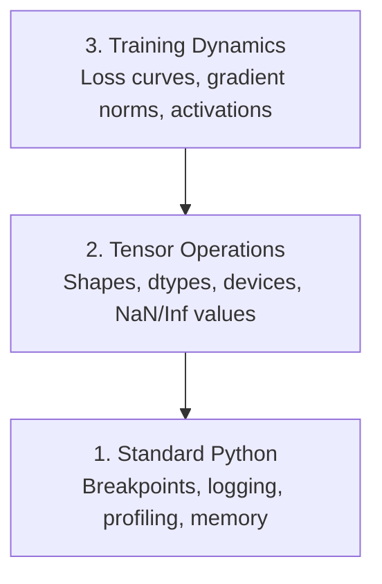

# डिबगिंग और प्रोफाइलिंग 调试与性能分析

> सबसे खराब AI कीड़े दुर्घटना नहीं करते हैं, वे चुपचाप कूड़े पर प्रशिक्षण देते हैं और एक सुंदर नुकसान वक्र रिपोर्ट करते हैं।
> सबसे खराब एआई बग प्रोग्राम को विफल नहीं होने देगा। वे कचरे के डेटा पर चुपचाप प्रशिक्षण देते हैं, और फिर एक सुंदर नुकसान की रिपोर्ट करते हैं।

**Type:** Build | **类型:** 构建
**Language:**पायथन**语言:**पायथन
**Prerequisites:** Lesson 1 (Dev Environment), basic PyTorch familiarity | **前置知识:** 第 1 课（开发环境），基本 PyTorch 知识
**Time:** ~60 minutes | **时间:** ~60 分钟

## सीखने के लक्ष्य

- शर्त का उपयोग करें `breakpoint()`और `debug_print`प्रशिक्षण के बीच में टेन्सर के आकार, प्रकार और एनएएन मानों की जांच करने के लिए
  中文翻译:使用条件 `breakpoint()`和 `debug_print`प्रशिक्षण प्रक्रिया में चेंज मात्रा आकार, डेटा प्रकार और NaN मूल्य की जांच
-  के साथ प्रोफ़ाइल प्रशिक्षण लूप`cProfile`,`line_profiler`और `tracemalloc`बोतल की खाई ढूंढना
  中文翻译: उपयोग `cProfile``line_profiler`和 `tracemalloc`分析 प्रशिक्षण चक्र, खोज प्रदर्शन बोतल
- सामान्य एआई बग का पता लगाएंः आकार असंगतता, एनएएन हानि, डेटा रिसाव, और गलत डिवाइस टेंसर
  中文翻译:检测常见 AI बग:形状不匹配、NaN हानि、 डेटा रिसाव और उपकरण त्रुटि
- हानि वक्रों, वजन हिस्टोग्राम, और ग्रेडिएंट वितरण को देखने के लिए TensorBoard सेट करें
  中文翻译: tensorboard को देखने योग्य हानि 曲线、权重直方图和梯度分布

> **【中文解读】**
> एआई 代码的 bug 和普通代码不同: यह दुर्घटनाग्रस्त नहीं होता है, बल्कि चुपचाप गलत डेटा को एक बेकार मॉडल में प्रशिक्षित करता है।

> **【拓展：AI 调试为什么特别难？】**
> 传统 Web 开发 bug ── पर AI की बग है "静默失败" मॉडल गलत डेटा पर प्रशिक्षण 8 घंटे, नुकसान सामान्य लग रहा है, लेकिन अंततः अनुमान है कि यह सब कचरा है── सामान्य कारणः मात्रा आकार असंगत है

## समस्या का वर्णन

एआई कोड सामान्य कोड से अलग तरह से विफल होता है। एक वेब ऐप स्टैक ट्रैक के साथ क्रैश होता है। एक गलत कॉन्फ़िगर प्रशिक्षण लूप 8 घंटे तक चलता है, जीपीयू समय में $ 200 जलाता है, और एक मॉडल का उत्पादन करता है जो प्रत्येक इनपुट के औसत का अनुमान लगाता है। कोड कभी भी त्रुटि नहीं करता है। बग गलत डिवाइस पर एक Tensor था, एक भूल गया `.detach()`, या लेबल सुविधाओं में लीक.

> एआई कोड की विफलता विधि सामान्य कोड से अलग है। वेब अनुप्रयोगों को दुर्घटनाग्रस्त हो जाता है और एक ढेर का पता चलता है। एक गलत विन्यास प्रशिक्षण चक्र 8 घंटे चला जाता है, 200 डॉलर के जीपीयू समय को जला देता है, फिर एक मॉडल उत्पन्न होता है जो सभी इनपुट औसत मूल्य का अनुमान लगाता है।`.detach()`、 या लेबल के लक्षणों में से एक को बाहर निकाला गया

आपको डिबगिंग टूल की जरूरत है जो आपके समय और गणना को बर्बाद करने से पहले इन चुप विफलताओं को पकड़ते हैं।

> आपको इन मौन विफलताओं में समय और गणना की बर्बादी से पहले ही उन्हें पकड़ने के लिए परीक्षण उपकरण की आवश्यकता है।

> **【中文解读】**
> एआई 调试最难的地方在"静默失败": कोड त्रुटि रिपोर्ट नहीं करता है, लेकिन प्रशिक्षण परिणाम पूरी तरह से गलत है।`.detach()`                                                                                                                                                                                                                                                              

## अवधारणा का मूल अवधारणा

एआई डिबगिंग तीन स्तरों पर काम करता हैः

> एआई 调试三层次上进行:



अधिकांश लोग सीधे स्तर 3 पर कूदते हैं (टेंसरबोर्ड को देखते हुए) लेकिन 80% एआई बग 1 और 2 स्तर पर रहते हैं।

> 大多数人直接第三层跳着TensorBoard看) ・・・但80% AI बग 存在第一层和第二层

> **【中文解读】**
> एआई 调试分为三层次:第一层是标准 पायथन 调试(断点、日志、内存分析);第二层是张量操作检查(形状、数据类型、设备、NaN 值);第三层是训练动态观察(loss 曲线、梯度分布、激活值)  अधिकांश लोग सीधे TensorBoard को देखते हैं, लेकिन 80% बग वास्तव में पहले दो स्तरों पर पाया जा सकता है

## इसे बनाओ, इसे पूरा करो।
```figure
s0-flame-hot
```

## इसे बनाओ

### भाग 1: प्रिंट डिबगिंग (हाँ, यह काम करता है)

प्रिंट डिबगिंग को खारिज कर दिया जाता है. यह नहीं करना चाहिए. टेन्सर कोड के लिए, एक लक्षित प्रिंट कथन डिबगर से गुजरने से बेहतर है क्योंकि आपको एक ही समय में आकार, प्रकार और मूल्य रेंज देखने की आवश्यकता है।

> 印调试常被轻视──但不应如此──张量代码, एक उद्देश्यपूर्ण मुद्रण 语句, चरणबद्ध调试 से अधिक प्रभावी है, क्योंकि आपको एक ही समय में आकार, डेटा प्रकार और मूल्य सीमा को देखने की आवश्यकता है──

```python
def debug_print(name, tensor):
    print(f"{name}: shape={tensor.shape}, dtype={tensor.dtype}, "
          f"device={tensor.device}, "  # 张量在 CPU 还是 GPU 上？
          f"min={tensor.min().item():.4f}, max={tensor.max().item():.4f}, "
          f"mean={tensor.mean().item():.4f}, "
          f"has_nan={tensor.isnan().any().item()}")  # 检测是否有 NaN 值
```

हर संदिग्ध ऑपरेशन के बाद इसे कॉल करें।

> प्रत्येक संशयजनक ऑपरेशन के बाद इसे调用──找到 bug 后删除印语句──简单有效──

### भाग 2: पायथन डिबगर (पीडीबी और ब्रेकपॉइंट)

अंतर्निहित डिबगर AI काम के लिए कम मूल्यांकन किया गया है. ड्रॉप `breakpoint()`अपने प्रशिक्षण लूप में और इंटरैक्टिव रूप से टेन्सर की जांच.

> इंटीरियर में एआई के काम में कमी आई है।`breakpoint()`, आप एक दूसरे के साथ जाँच कर सकते हैं

> **【中文解读】**
> `breakpoint()`यह प्रशिक्षण चक्र में सबसे अच्छा तरीका है। प्रशिक्षण चक्र में, जैसे कि नुकसान अचानक बढ़ता है या NaN उत्पन्न होता है, प्रक्रिया केवल असामान्य समय में रुक जाती है।`p`命令检查张量形、值范围和梯度──

```python
def training_step(model, batch, criterion, optimizer):
    inputs, labels = batch
    outputs = model(inputs)
    loss = criterion(outputs, labels)

    if loss.item() > 100 or torch.isnan(loss):  # loss 异常大或为 NaN 时触发断点
        breakpoint()  # 进入交互式调试器

    loss.backward()
    optimizer.step()
```

जब डिबगर आप में छोड़ देता है, उपयोगी आदेशः

> 调试器激活后,常用命令:

- `p outputs.shape`आकारों की जांच करने के लिए
  中文翻译:`p outputs.shape`检查形状
- `p loss.item()`हानि मूल्य देखने के लिए
  中文翻译:`p loss.item()`查看 हानि मूल्य
- `p torch.isnan(outputs).sum()`एनएएन की गिनती
  中文翻译:`p torch.isnan(outputs).sum()`统计 NaN 个数
- `p model.fc1.weight.grad`ग्रेडिएंट की जांच करने के लिए
  中文翻译:`p model.fc1.weight.grad`检查梯度
- `c`जारी रखने के लिए,`q`छोड़ना
  中文翻译:`c`继续,`q`退出

यह सशर्त डिबगिंग है, आप केवल जब कुछ गलत लग रहा है बंद. एक 10,000 कदम प्रशिक्षण रन के लिए, यह मायने रखता है.

> यह एक शर्त है. आप केवल असामान्य होने पर ही रुक जाते हैं. एक 10,000 कदम के प्रशिक्षण के लिए, यह महत्वपूर्ण है.

### भाग 3: पायथन लॉगिंग

जब आपका डिबगिंग त्वरित जांच से परे हो तो प्रिंट स्टेटमेंट को लॉगिंग से बदलें।

> जब调试超出快速检查的范围时,日志 के बजाय मुद्रण 语句──

```python
import logging

logging.basicConfig(
    level=logging.INFO,
    format="%(asctime)s [%(levelname)s] %(message)s",  # 带时间戳和级别的格式
    handlers=[
        logging.FileHandler("training.log"),  # 输出到文件
        logging.StreamHandler()  # 同时输出到终端
    ]
)
logger = logging.getLogger(__name__)

logger.info("Starting training: lr=%.4f, batch_size=%d", lr, batch_size)
logger.warning("Loss spike detected: %.4f at step %d", loss.item(), step)  # 警告级别
logger.error("NaN loss at step %d, stopping", step)  # 错误级别
```

> **【中文解读】**
> 日志比印 强大得多:自动加时间、分级别(INFO/WARNING/ERROR) 、同时写入文件和终端──凌晨3点训练崩时, आपको पहले से रोंगटे हुए终端 आउटपुट के बजाय日志文件 की आवश्यकता होती है──

लॉगिंग आपको समय स्टैम्प, गंभीरता स्तर और फ़ाइल आउटपुट देता है। जब प्रशिक्षण रन 3 AM पर विफल होता है, तो आप एक लॉग फ़ाइल चाहते हैं, न कि टर्मिनल आउटपुट जो स्क्रीन से स्क्रॉल किया गया है।

> दिन志 समय प्रदान、 गंभीर स्तर और फ़ाइल आउटपुट── जब आप सुबह 3 बजे असफल होते हैं, तो आपको स्क्रीन पर समाप्त होने वाले टर्मिनल आउटपुट की बजाय, दिन志 फ़ाइलों की आवश्यकता होती है।

### भाग 4: समय कोड अनुभाग

समय कहाँ जाता है यह जानना अनुकूलन की दिशा में पहला कदम है।

> 知道时间花在哪里是优化的第一步.

```python
import time

class Timer:
    def __init__(self, name=""):
        self.name = name

    def __enter__(self):
        self.start = time.perf_counter()  # 高精度计时器
        return self

    def __exit__(self, *args):
        elapsed = time.perf_counter() - self.start
        print(f"[{self.name}] {elapsed:.4f}s")  # 打印耗时

with Timer("data loading"):  # 计时数据加载
    batch = next(dataloader_iter)

with Timer("forward pass"):  # 计时前向传播
    outputs = model(batch)

with Timer("backward pass"):  # 计时反向传播
    loss.backward()
```

सामान्य निष्कर्षः डेटा लोड करने में प्रशिक्षण समय का 60% समय लगता है।`num_workers > 0`अपने डेटा लोडर में, एक तेज जीपीयू नहीं.

> 常见发现: डेटा लोड प्रशिक्षण समय का 60% है। समाधान डेटा लोडर की सेटिंग है।`num_workers > 0`, बजाय अधिक तेजी से GPU खरीदना

> **【中文解读】**
> प्रदर्शन अनुकूलन का पहला कदम बोतल 🏼 ऊपर  को ढूंढना है`Timer`类用Python 上下文管理器精确计时每步. सबसे आम खोज यह है कि डेटा लोड प्रशिक्षण समय का 60% है। समाधान अधिक महंगे GPU नहीं खरीदता है, बल्कि डेटा लोडर की स्थापना करता है।`num_workers > 0`

> **【拓展：数据加载瓶颈是 AI 训练的头号性能杀手】**
> उद्योग में, जीपीयू उपयोग दर 80% से कम है क्योंकि डेटा लोड बहुत धीमा है, जीपीयू में डेटा आदि। समाधानों में शामिल हैंः डेटा लोडर का वृद्धि।`num_workers`(आमतौर पर 4-8)`pin_memory=True`加速 CPU-GPU 传输、使用 `prefetch_factor`预取数据──Google 内部 के TPU प्रशिक्षण ट्यूबलाइन ने विशेष डेटा प्रवाह लाइन अनुकूलन का उपयोग किया, यह सुनिश्चित करने के लिए कि TPU 永远不用等数据──

### भाग 5: cProfile और line_profiiler

जब आपको मैनुअल टाइमर से ज्यादा की जरूरत हो:

> जब हाथों से काम नहीं आता:

```bash
python -m cProfile -s cumtime train.py  # 按累计时间排序的性能分析
```

यह संचयी समय द्वारा क्रमबद्ध प्रत्येक फ़ंक्शन कॉल को दर्शाता है। लाइन-दर-लाइन प्रोफाइलिंग के लिएः

> यह संचयी समय क्रम में प्रत्येक कार्य को प्रदर्शित करेगा।

```bash
pip install line_profiler
```

```python
@profile  # line_profiler 装饰器，逐行统计耗时
def train_step(model, data, target):
    output = model(data)
    loss = F.cross_entropy(output, target)
    loss.backward()
    return loss

# Run with: kernprof -l -v train.py  运行逐行性能分析
```

### भाग 6: स्मृति प्रोफाइलिंग

> **【中文解读】**
> 内存分析分 CPU और GPU 两部分──CPU 用 `tracemalloc`找到分配最多内存的代码行,GPU उपयोग `torch.cuda.memory_summary()`查看显存使用──OOM(Out of Memory) 是AI 训练最常见的错误之一先减批量,再尝试混合精度训练──

#### ट्रैसेमलॉक के साथ सीपीयू मेमोरी

```python
import tracemalloc

tracemalloc.start()  # 开始跟踪内存分配

# your code here
model = build_model()
data = load_dataset()

snapshot = tracemalloc.take_snapshot()  # 拍摄内存快照
top_stats = snapshot.statistics("lineno")  # 按代码行统计内存
for stat in top_stats[:10]:
    print(stat)
```

#### memory_profiler के साथ CPU मेमोरी

```bash
pip install memory_profiler
```

```python
from memory_profiler import profile

@profile  # 逐行分析内存使用
def load_data():
    raw = read_csv("data.csv")       # watch memory jump here  观察内存跳变
    processed = preprocess(raw)       # and here  数据预处理也会增加内存
    return processed
```

दौड़ो`python -m memory_profiler your_script.py`लाइन-दर-लाइन मेमोरी उपयोग देखने के लिए।

> 运行 `python -m memory_profiler your_script.py`查看逐行内存使用──

#### PyTorch के साथ GPU मेमोरी

```python
import torch

if torch.cuda.is_available():
    print(torch.cuda.memory_summary())  # GPU 显存完整报告

    print(f"Allocated: {torch.cuda.memory_allocated() / 1e9:.2f} GB")  # 已分配的显存
    print(f"Cached: {torch.cuda.memory_reserved() / 1e9:.2f} GB")  # 缓存的显存
```

जब आप OOM (Out of Memory) दबाएँः

> जब आप OOM से मुलाकात करते हैं

1. बैच आकार को कम करें (पहली कोशिश हमेशा करें)
   中文翻译:减小批量尺寸 (初尝试,永远如此)
2. उपयोग करें`torch.cuda.empty_cache()`कैश मेमोरी को मुक्त करने के लिए
   中文翻译: उपयोग `torch.cuda.empty_cache()`释放缓存内存
3. उपयोग करें`del tensor`इसके बाद `torch.cuda.empty_cache()`बड़े मध्यवर्ती वस्तुओं के लिए
   中文翻译:对大型中变量使用 `del tensor`加 `torch.cuda.empty_cache()`
4. मिश्रित परिशुद्धता का उपयोग करें (`torch.cuda.amp`) मेमोरी उपयोग को आधा करने के लिए
   中文翻译:使用混合精度`torch.cuda.amp`) आधे से कम
5. बहुत गहरे मॉडल के लिए ग्रेडिएंट चेकपोइंटिंग का उपयोग करें
   चीनी अनुवादः बहुत गहराई से मॉडल का उपयोग करने के लिए

### भाग 7: आम AI कीड़े और उन्हें कैसे पकड़ें

> **【中文解读】**
> यह इस अध्याय का सबसे व्यावहारिक भाग है। चार प्रकार के सबसे आम एआई बग हैंः आकार असंगत (आकार असंगत)  नैन हानि (अंक मूल्य विस्फोट)  डेटा रिसाव (अंक)  प्रशिक्षण संग्रह और परीक्षण संग्रह में भारी मात्रा में)  उपकरण त्रुटि (CPU और GPU)  मिश्रण)  प्रत्येक बग में एक प्रतिरोध परीक्षण फ़ंक्शन होता है, जो प्रशिक्षण से पहले और प्रशिक्षण में तेजी से बाहर निकाला जा सकता है।

#### आकृति असंगत

सबसे आम बग. एक tensor के आकार है`[batch, features]`जब मॉडल उम्मीद करता है `[batch, channels, height, width]`. .

> सबसे आम कीड़े के आकार में`[batch, features]`, लेकिन मॉडल उम्मीद है `[batch, channels, height, width]`

```python
def check_shapes(model, sample_input):
    print(f"Input: {sample_input.shape}")  # 打印输入形状
    hooks = []

    def make_hook(name):
        def hook(module, inp, out):
            in_shape = inp[0].shape if isinstance(inp, tuple) else inp.shape
            out_shape = out.shape if hasattr(out, "shape") else type(out)
            print(f"  {name}: {in_shape} -> {out_shape}")  # 打印每层的输入输出形状
        return hook

    for name, module in model.named_modules():
        hooks.append(module.register_forward_hook(make_hook(name)))  # 注册钩子函数

    with torch.no_grad():  # 不计算梯度，仅检查形状
        model(sample_input)

    for h in hooks:
        h.remove()  # 清理钩子
```

यह नमूना बैच के साथ एक बार चलाएं. यह आपके मॉडल में हर आकार परिवर्तन का नक्शा.

> एक नमूना बैच के साथ एक बार चलें।

#### नॉन लॉस

एनएएन हानि का अर्थ है कुछ विस्फोट।

> NaN हानि का मतलब है कुछ विस्फोट हुआ है-- सामान्य कारणः

> **【拓展：NaN 在大模型训练中的灾难性影响】**
> LLM प्रशिक्षण में, NaN एक बार टेंडेड में दिखाई देता है, तो सभी मापदंडों में विपरित प्रसार के माध्यम से फैलता है, जिससे पूरा मॉडल अपरिवर्तनीय हो जाता है। GPT-3 प्रशिक्षण लेख में उल्लेख किया गया है, वे NaN को रोकने के लिए टेंडेड काटना (ग्रेडिएंट कटिंग) और सीखने की दर (प्री-वेट) का उपयोग करते हैं। NaN पर जांच करने के बाद, सामान्य अभ्यास यह है कि नवीनतम जांच बिंदु पर वापस लौटें, फिर से शुरू करें, बजाय इसे पुनः प्राप्त करने का प्रयास करें। यह सत्र GPU के दशकों घंटे की बर्बादी करता है।

- सीखने की दर बहुत अधिक
  中文翻译: सीखने की दर बहुत अधिक
- कस्टम हानि में शून्य से विभाजन
  中文翻译: स्व परिभाषा हानि 中除以零
- शून्य या ऋणात्मक संख्या का लॉग
  चीनी अनुवादः对零或负数取对数
- आरएनएन में विस्फोटक ग्रेडिएंट
  中文翻译:RNN 中的梯度爆炸

```python
def detect_nan(model, loss, step):
    if torch.isnan(loss):  # 检测 loss 是否为 NaN
        print(f"NaN loss at step {step}")
        for name, param in model.named_parameters():
            if param.grad is not None:
                if torch.isnan(param.grad).any():  # 检测梯度中的 NaN
                    print(f"  NaN gradient in {name}")
                if torch.isinf(param.grad).any():  # 检测梯度中的 Inf
                    print(f"  Inf gradient in {name}")
        return True
    return False
```

#### डेटा लीक

आपका मॉडल परीक्षण सेट पर 99% सटीकता प्राप्त करता है. यह बहुत अच्छा लगता है. यह एक बग है.

> आपके मॉडल को 99% सटीकता मिली है।

```python
def check_data_leakage(train_set, test_set, id_column="id"):
    train_ids = set(train_set[id_column].tolist())  # 训练集 ID 集合
    test_ids = set(test_set[id_column].tolist())  # 测试集 ID 集合
    overlap = train_ids & test_ids  # 取交集
    if overlap:
        print(f"DATA LEAKAGE: {len(overlap)} samples in both train and test")  # 发现重叠！
        return True
    return False
```

समय लीक की भी जांच करेंः अतीत की भविष्यवाणी करने के लिए भविष्य के डेटा का उपयोग करें। विभाजन से पहले समय टिकट द्वारा क्रमबद्ध करें।

> समय के रिसाव की जांच करनाः भविष्य के डेटा का उपयोग करके अतीत का पूर्वानुमान करना।

#### गलत उपकरण

विभिन्न उपकरणों पर टेंसर (CPU बनाम GPU) रनटाइम त्रुटियों का कारण बनते हैं। लेकिन कभी-कभी एक टेंसर चुपचाप CPU पर रहता है जबकि बाकी सब कुछ GPU पर है, और प्रशिक्षण केवल धीमा चलता है।

> विभिन्न उपकरणों पर चार्ज मात्रा ((CPU बनाम GPU) से चलने में त्रुटि होती है। लेकिन कभी-कभी एक चार्ज मात्रा CPU पर रहती है, जबकि अन्य सभी GPU पर, प्रशिक्षण केवल धीमा होता है।

```python
def check_devices(model, *tensors):
    model_device = next(model.parameters()).device  # 获取模型所在设备
    print(f"Model device: {model_device}")
    for i, t in enumerate(tensors):
        if t.device != model_device:  # 检查张量和模型是否在同一设备
            print(f"  WARNING: tensor {i} on {t.device}, model on {model_device}")
```

### भाग 8: TensorBoard मूल बातें

TensorBoard आपको दिखाता है कि समय के साथ प्रशिक्षण के अंदर क्या हो रहा है।

> TensorBoard  प्रदर्शन प्रशिक्षण प्रक्रिया के दौरान आंतरिक परिवर्तनों को प्रदर्शित करना

```bash
pip install tensorboard  # 安装 TensorBoard
```

```python
from torch.utils.tensorboard import SummaryWriter

writer = SummaryWriter("runs/experiment_1")  # 创建日志写入器

for step in range(num_steps):
    loss = train_step(model, batch)

    writer.add_scalar("loss/train", loss.item(), step)  # 记录训练 loss
    writer.add_scalar("lr", optimizer.param_groups[0]["lr"], step)  # 记录学习率

    if step % 100 == 0:
        for name, param in model.named_parameters():
            writer.add_histogram(f"weights/{name}", param, step)  # 记录权重分布
            if param.grad is not None:
                writer.add_histogram(f"grads/{name}", param.grad, step)  # 记录梯度分布

writer.close()
```

इसे लॉन्च करेंः

>  प्रारंभ करें TensorBoard:

```bash
tensorboard --logdir=runs  # 启动 TensorBoard 可视化服务
```

क्या खोजेंः

> 观察要点:

- **Loss not decreasing**: सीखने की दर बहुत कम, या मॉडल वास्तुकला समस्या
  中文翻译:**Loss 不降**: सीखने की दर बहुत कम, या मॉडल संरचना में समस्याएं हैं
- **Loss oscillating wildly**: सीखने की दर बहुत अधिक
  中文翻译:**Loss 剧烈震荡**: सीखने की दर बहुत अधिक
- **Loss goes to NaN**: संख्यात्मक अस्थिरता (उपर NaN अनुभाग देखें)
  中文翻译:**Loss 变 NaN**: संख्या मूल्य अस्थिर है (参见上方 NaN 部分)
- **Train loss decreasing, val loss increasing**: अति-फिटिंग
  中文翻译:**训练 loss 降但验证 loss 升**: over拟合
- **Weight histograms collapsing to zero**: विलुप्त हो रहे ग्रेडिएंट
  中文翻译:**权重直方图趋零**: तद度 गायब
- **Gradient histograms exploding**: ग्रेडिएंट क्लिपिंग की आवश्यकता
  中文翻译:**梯度直方图爆炸**: आवश्यक है

> **【中文解读】**
> TensorBoard is training visualization standard tool──关键观察点: हानि 不降(学习率太低或模型架构有问题)、损失 剧烈震荡(学习率太高)、损失 变 NaN(数值不稳定)、训练损失 降但验证损失 升(过拟合)、权重直方图趋零(梯度消失)、梯度直方图爆炸(需要梯度剪裁)──

> **【拓展：Weights & Biases 与 TensorBoard 的对比】**
> TensorBoard Google का एक ओपन सोर्स ट्रेनिंग दृश्यता उपकरण है, जो व्यक्तिगत और छोटे टीमों के लिए उपयुक्त है। वजन और पूर्वाग्रह (W&B) एक व्यावसायिक उपकरण है, जिसमें प्रयोगों के मुकाबले प्रयोगों को बढ़ाया गया है। टीम सहयोग, सुपरपरमाइंडर खोज आदि की सुविधाएँ हैं। OpenAI, मानव आदि में, W&B एक मानक प्रयोग ट्रैकिंग प्लेटफॉर्म है। एक बड़े प्रकार का प्रयोग हजारों मापदंडों का पता चलता हैः हानि, सीखने की दर, ग्रेड-फैन, विभिन्न स्तरों पर वजन वितरण, GPU उपयोग दर आदि। ये डेटा इंजीनियरों को सैकड़ों प्रयोगों में सर्वोत्तम सुपरपरमाइंडर खोजने में मदद करता है।

### भाग 9: वीएस कोड डिबगर

इंटरैक्टिव डिबगिंग के लिए, एक के साथ VS कोड कॉन्फ़िगर करें `launch.json`:

> 对于交互式调试,用 `launch.json`配置 VS कोड:

```json
{
    "version": "0.2.0",
    "configurations": [
        {
            "name": "Debug Training",
            "type": "debugpy",
            "request": "launch",
            "program": "${file}",  // 调试当前打开的文件
            "console": "integratedTerminal",  // 使用集成终端
            "justMyCode": false  // 允许调试第三方库代码
        }
    ]
}
```

डिबग कंसोल आपको मध्य निष्पादन में मनमाने पायथन अभिव्यक्ति चलाने की अनुमति देता है।

> 点击行号左侧设置断点──使用变量板检查张量属性──调试控制台让你在执行过程中运行任意Python表达式──

डेटा पूर्व प्रसंस्करण पाइपलाइनों के माध्यम से कदम के लिए उपयोगी जहां आप प्रत्येक परिवर्तन देखना चाहते हैं।

>  डेटा पूर्व प्रसंस्करण पाइपलाइन के लिए उपयुक्त, प्रत्येक परिवर्तन के परिणाम देखें

## इसे फ्रेमवर्क के साथ लागू करें

> **【中文解读】**
> अभ्यास में调试工作流分五步: प्रशिक्षण पूर्व उपयोग `check_shapes`验证维度;前 10 步用 `debug_print`检查张量值; प्रशिक्षण中使用TensorBoard 监控;出问题时使用 `breakpoint()`交互调试;性能瓶计时器和内存分析器定位── यह प्रक्रिया अधिकांश एआई बग को पकड़ सकती है──

यहाँ डिबगिंग वर्कफ़्लो है जो अधिकांश AI बग को पकड़ता हैः

> निम्नलिखित में से अधिकांश एआई बग को पकड़ने में सक्षम है।

1. **Before training**दौड़ `check_shapes`इनपुट और आउटपुट आयामों की उम्मीदों के अनुरूप जांच करें।
   中文翻译:**训练前**: Using样本批发 运行 `check_shapes`, सत्यापित करें कि क्या इनपुट आउटपुट आयाम अपेक्षित है।
2. **First 10 steps**उपयोगः `debug_print`नुकसान, आउटपुट, और gradients पर पुष्टि करें कुछ भी NaN है और मान उचित सीमा में हैं।
   中文翻译:**前 10 步**: हानि, उत्पादन और वृद्धि के लिए उपयोग`debug_print`, पुष्टि की गई कि कोई NaN 且值在合理范围内
3. **During training**: लॉग हानि, सीखने की दर, और ग्रेडिएंट मानकों। दृश्य के लिए TensorBoard का उपयोग करें।
   中文翻译:**训练中**: रिकॉर्ड हानि, सीखने की दर और डिग्री वरीयता।
4. **When something breaks**: ड्रॉप `breakpoint()`विफलता बिंदु पर. इंटरैक्टिव रूप से tensors निरीक्षण.
   中文翻译:**出问题时**: में故障点放入 `breakpoint()`,交互式检查张量──
5. **For performance**: समय अपने डेटा लोड करने के लिए आगे बनाम पीछे पास. प्रोफ़ाइल स्मृति यदि आप OOM के पास हैं.
   中文翻译:**性能优化**:分分计时数据加载、前向传播和反向传播―― यदि ओओएम के निकट हो, तो内存 विश्लेषण करवाएं――

## इसे भेजें उत्पाद

डिबगिंग टूलकिट स्क्रिप्ट चलाएँ:

> 运行调试工具脚本:

```bash
python phases/00-setup-and-tooling/12-debugging-and-profiling/code/debug_tools.py
```

देखो`outputs/prompt-debug-ai-code.md`एक संकेत के लिए जो एआई विशिष्ट बग का निदान करने में मदद करता है।

> 参见 `outputs/prompt-debug-ai-code.md`, जिसमें एआई  विशिष्ट बग का निदान करने में मदद करने वाला संकेत शामिल है 

## अभ्यास विषय

1. दौड़ें`debug_tools.py`एक NaN (संकेतः आगे पास में शून्य से विभाजित करें) पेश करने के लिए डमी मॉडल को संशोधित करें और डिटेक्टर को पकड़ते हुए देखें।
   运行调试工具脚本,修改模型引入 NaN,观察检测器 इसे कैसे कैप्चर करें
2. प्रशिक्षण लूप के साथ प्रोफ़ाइल करें `cProfile`और सबसे धीमी फ़ंक्शन की पहचान करें।
   cProfile  विश्लेषण प्रशिक्षण चक्र, सबसे धीमी समारोह का पता लगाने
3. उपयोग करें`tracemalloc`यह पता लगाने के लिए कि आपके डेटा लोडिंग पाइपलाइन में कौन सी लाइन सबसे अधिक मेमोरी आवंटित करती है।
   Tracemalloc का उपयोग करके डेटा लोड पाइपलाइन में से किस पंक्ति में सबसे अधिक स्मृति वितरित की गई है
4. एक साधारण प्रशिक्षण रन के लिए TensorBoard सेट करें और यह पता लगाएं कि मॉडल अति उपयुक्त है या नहीं।
   settings TensorBoard  निगरानी प्रशिक्षण प्रक्रिया, निर्णय मॉडल के अनुकूल है या नहीं
5. उपयोग करें`breakpoint()`प्रशिक्षण लूप के अंदर। डिबगर प्रॉम्प्ट से टेन्सर के आकार, उपकरणों और ग्रेडिएंट मानों का निरीक्षण करने का अभ्यास करें।
   प्रशिक्षण चक्र में ब्रेकपॉइंट का उपयोग करना (), अभ्यास जांच चेंज मात्रा आकार, उपकरण और डिग्री मूल्य
