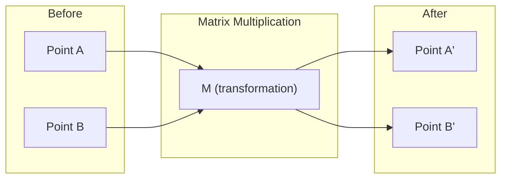
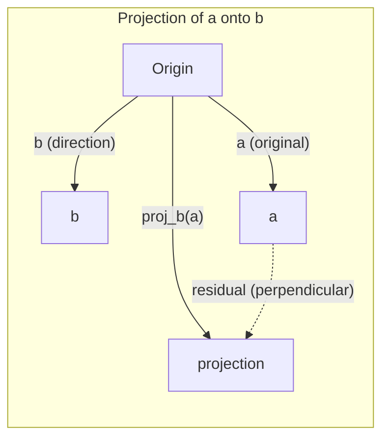

# रैखिक बीजगणित अंतर्ज्ञान
# 线性代数直觉

> हर एआई मॉडल सिर्फ मैट्रिक्स गणित है एक शानदार टोपी पहनने.
> प्रत्येक एआई मॉडल मूल रूप से एक शानदार बाहरी कपड़े पहनने के लिए एक रैंक है।

**Type:** Learn | **类型:** 学习 | **Languages:** Python, Julia | **语言:** Python, Julia | **Prerequisites:** Phase 0 | **前置知识:** Phase 0 | **Time:** ~60 minutes | **时间:** ~60 分钟

## सीखने के लक्ष्य

- पायथन में वेक्टर और मैट्रिक्स ऑपरेशन (अधिवेशन, डॉट उत्पाद, मैट्रिक्स गुणा) को खरोंच से लागू करें
  शून्य से प्राप्त करने के लिए आयाम और रैंक परिगणना (ज्यादा, बिंदु, रैंक गुणा)
- ज्यामितीय रूप से बताएं कि डॉट उत्पाद, प्रोजेक्शन और ग्राम-स्मिड्ट प्रक्रिया क्या करती है
  बिन्दु से व्याख्या                                                                                                                                                                                                                                                             
- पंक्ति घटाने का उपयोग करके वेक्टरों के सेट की रैखिक स्वतंत्रता, रैंक और आधार का निर्धारण करें
  प्रयोग करेंः प्रयोग करेंः उपयोग करेंः उपयोग करेंः उपयोग करेंः उपयोग करेंः उपयोग करेंः उपयोग करेंः उपयोग करेंः उपयोग करेंः उपयोग करेंः उपयोग करेंः उपयोग करेंः उपयोग करेंः उपयोग करेंः उपयोग करेंः उपयोग करेंः उपयोग करेंः उपयोग करेंः उपयोग करेंः उपयोग करेंः उपयोग करेंः उपयोग करेंः उपयोग करेंः उपयोग करेंः उपयोग करेंः उपयोग करेंः उपयोग करेंः उपयोग करेंः उपयोग करेंः उपयोग करेंः उपयोग करेंः उपयोग करेंः उपयोग करेंः उपयोग करेंः उपयोग करेंः उपयोग करेंः उपयोग करेंः उपयोग करेंः उपयोग करेंः उपयोग करेंः उपयोग करेंः उपयोग करेंः उपयोग करेंः उपयोग करेंः उपयोग करेंः उपयोग करेंः उपयोग करेंः उपयोग करेंः उपयोग करेंः उपयोग करेंः उपयोग करेंः उपयोग करेंः उपयोग करेंः उपयोग करेंः उपयोग करेंः उपयोग करेंः उपयोग करेंः उपयोग करेंः उपयोग करेंः उपयोग करेंः उपयोग करेंः उपयोग करेंः उपयोग करेंः उपयोग करेंः उपयोग करेंः उपयोग करेंः उपयोग करेंः उपयोग करेंः उपयोग करेंः उपयोग करेंः उपयोग करेंः
- रैखिक बीजगणित अवधारणाओं को उनके एआई अनुप्रयोगों से जोड़ेंः एम्बेडिंग, ध्यान स्कोर और लोरा
  **将线性代数概念与 AI 应用对接：词嵌入、注意力分数、LoRA 微调**

## समस्या यह है कि आपको यह क्यों सीखना चाहिए

किसी भी एमएल पेपर खोलें. पहले पृष्ठ के भीतर, आप वेक्टर, मैट्रिक्स, डॉट उत्पाद और परिवर्तन देखेंगे. रैखिक बीजगणित अंतर्ज्ञान के बिना, ये सिर्फ प्रतीक हैं. इसके साथ, आप देख सकते हैं कि एक तंत्रिका नेटवर्क वास्तव में क्या कर रहा है - अंतरिक्ष में चारों ओर बिंदुओं को स्थानांतरित करना।

आपको गणितज्ञ होने की जरूरत नहीं है आपको यह देखना होगा कि इन ऑपरेशनों का ज्यामितीय अर्थ क्या है, फिर उन्हें स्वयं कोड करें।

> **【中文解读】**翻开任何一篇机器学习论文,第一页就会出现向量、矩阵、点积、变化──没有线性代数直觉,这些只是符号──有直觉,你就能"看穿"神经网络在做什么空间中移动点的位置──你不需要成为数学家,只需要理解这些操作的几何含义,然后自己写代码实现──

## अवधारणा का मूल अवधारणा

### वेक्टर बिंदुओं (और दिशाओं) हैं.

वेक्टर सिर्फ संख्याओं की सूची है. लेकिन उन संख्याओं का अर्थ कुछ है - वे अंतरिक्ष में निर्देशांक हैं.

**2D vector [3, 2]:**

| x | y | Point |
|---|---|-------|
| 3 | 2 | The vector points from origin (0,0) to (3, 2) on the plane |

वेक्टर का आयाम वर्ग (३^2 + २^2) = वर्ग (१३) है और ऊपर और दाईं ओर इंगित करता है।

एआई में, वेक्टर सब कुछ का प्रतिनिधित्व करते हैंः
- एक शब्द → 768 संख्याओं का वेक्टर (इसे एम्बेडिंग स्पेस में "अर्थ" कहा जाता है)
- एक छवि → लाखों पिक्सेल मानों का वेक्टर
- एक उपयोगकर्ता → वरीयताओं का वेक्टर

> **【中文解读】**量就是一组数字,代表空间中的坐标──`[3, 2]`0 से 0 तक 3,2 तक के पथ का पता लगाएं, लंबाई = √(32+22) = √13。
>
> **【拓展：向量在 AI 中的化身】**
> - **词嵌入 (Word Embedding)**: प्रत्येक शब्द बन जाता है 768 维向量──"राजा" और"रानी" के ′′ के बराबर होते हैं, क्योंकि语义相关── यही Word2Vec、BERT、GPT का तल्लो स्तर का प्रतिनिधित्व है──
> - **图片特征**एक张 224×224 का रंगीन चित्र = 150,528 个数字的向量──CNN मूलतः इस向量 को चरणबद्ध रूप से संपीड़ित करना है──
> - **用户画像**: सुझाव प्रणाली अपनी ब्राउज़िंग / खरीद इतिहास को एक पसंदीदा वेक्टर में डालकर, फिर सबसे समान वस्तु वेक्टर को आपको सिफारिश करें।

### मैट्रिक्स परिवर्तन हैं।

एक मैट्रिक्स एक वेक्टर को दूसरे वेक्टर में बदल देती है। यह घूम सकती है, स्केल कर सकती है, खिंचा सकती है या प्रोजेक्ट कर सकती है।



एआई में, मैट्रिक्स मॉडल हैंः
- तंत्रिका नेटवर्क वजन → मैट्रिक्स जो इनपुट को आउटपुट में परिवर्तित करते हैं
- ध्यान अंक → मैट्रिक्स जो तय करते हैं कि किस पर ध्यान केंद्रित किया जाए
- एम्बेड → मैट्रिक्स जो शब्दों को वेक्टरों में मानचित्रण करते हैं

> **【中文解读】**矩阵就是一个"变换规则": एक आयाम में प्रवेश, एक आयाम में बाहर आना, एक आयाम में प्रवेश करना, एक आयाम में प्रवेश करना, एक आयाम में प्रवेश करना, एक आयाम में प्रवेश करना, एक आयाम में प्रवेश करना, एक आयाम में प्रवेश करना, एक आयाम में प्रवेश करना, एक आयाम में प्रवेश करना, एक आयाम में प्रवेश करना, एक आयाम में प्रवेश करना, एक आयाम में प्रवेश करना, एक आयाम में प्रवेश करना, एक आयाम में प्रवेश करना, एक आयाम में प्रवेश करना, एक आयाम में घुमाया जाना, एक आयाम में विस्तार करना, एक आयाम में प्रवेश करना, एक आयाम में प्रवेश करना, एक आयाम में प्रवेश करना, एक आयाम में प्रवेश करना, एक आयाम में प्रवेश करना, एक आयाम में प्रवेश करना, एक आयाम में प्रवेश करना, एक आयाम में प्रवेश करना, एक आयाम में प्रवेश करना, एक आयाम में प्रवेश करना, एक आयाम में प्रवेश करना, एक आयाम में प्रवेश करना, एक आयाम में प्रवेश करना, एक आयाम में प्रवेश करना, एक आयाम में प्रवेश करना, एक आयाम में प्रवेश करना, एक आयाम में प्रवेश करना, एक आयाम में प्रवेश करना, एक आयाम में प्रवेश करना, एक आयाम में प्रवेश करना, एक आयाम में प्रवेश करना, एक आयाम में प्रवेश करना, एक आयाम में प्रवेश करना, एक आयाम में प्रवेश करना।
>
> **【拓展：神经网络就是矩阵乘法的嵌套】**
> 神经网络 की एक परत = `output = W × input + bias`
> - W 是权重矩阵 (वे)
> - इनपुट =输入向量 (ऊपर स्तरीय आउटपुट)
> - एक तीन स्तरीय नेटवर्क 3 बार रक्छा गुणा विधि के संबद्ध है
> - GPT-3 में 1750 अरब सेमीट्रिक हैं, जो कि मूल रूप से कुछ सौ बड़े मैट्रिक्स हैं।
> - **训练**= इन रैक में संख्याओं को लगातार समायोजित करने के लिए तल तल तल

### उत्पाद समानता मापने के बिंदु

दो वेक्टरों का डॉट गुणक आपको बताता है कि वे कितने समान हैं।

```
a · b = a₁×b₁ + a₂×b₂ + ... + aₙ×bₙ

Same direction:      a · b > 0  (similar)
Perpendicular:       a · b = 0  (unrelated)
Opposite direction:  a · b < 0  (dissimilar)
```

यह सचमुच है कि खोज इंजन, सिफारिश प्रणाली और आरएजी कैसे काम करते हैं -- उच्च बिंदु उत्पादों के साथ वेक्टर ढूंढें।

> **【中文解读】**点积 = 对应分量相乘后求和──结果 > 0 方向相似,= 0 垂直无关,< 0 方向相反──
>
> **【拓展：点积是 AI 最核心的数学操作】**
> 1. **Transformer Attention**:`Attention(Q,K,V) = softmax(Q·K^T / √d)·V`
>    - Q(सवाल) 和 K(键) के अंक积 = "मुझे इस शब्द पर अधिक ध्यान देना चाहिए" के अंश
>    - यह सभी बड़े मॉडल के मुख्य तंत्र है ChatGPT,BERT आदि
> 2. **RAG 检索**: उपयोगकर्ता के प्रश्न को एक मात्रा में बदल दें, और सभी दस्तावेज़ मात्रा को एक बिंदु पर इकट्ठा करें, सबसे संबंधित दस्तावेज़ खोजें
> 3. **推荐系统**: user preferences向量 · 商品特征向量 = 推分数
> 4. **余弦相似度**= 归一化后的点积,`cos(a,b) = a·b / (|a|×|b|)`, मूल्य域 [-1, 1]
>    "अच्छा" से बेहतर: "अच्छा" से बेहतर: "अच्छा" से बेहतर: "अच्छा" से बेहतर

### रैखिक स्वतंत्रता  线性无关

वेक्टर रैखिक रूप से स्वतंत्र हैं यदि सेट में कोई भी वेक्टर अन्य के संयोजन के रूप में नहीं लिखा जा सकता है। यदि v1, v2, v3 स्वतंत्र हैं, तो वे 3D स्थान को कवर करते हैं। यदि एक अन्य के संयोजन है, तो वे केवल एक विमान को कवर करते हैं।

AI के लिए यह महत्वपूर्ण क्यों हैः आपके फीचर मैट्रिक्स में रैखिक रूप से स्वतंत्र स्तंभ होना चाहिए। यदि दो फीचर पूरी तरह से सहसंबंधित हैं (रेखात्मक रूप से निर्भर), तो मॉडल उनके प्रभावों को अलग नहीं कर सकता है। यह प्रतिगमन में बहु-रैखिकता का कारण बनता है - वजन मैट्रिक्स अस्थिर हो जाता है, और छोटे इनपुट परिवर्तन जंगली आउटपुट स्विंग का उत्पादन करते हैं।

**Concrete example:**

```
v1 = [1, 0, 0]
v2 = [0, 1, 0]
v3 = [2, 1, 0]   # v3 = 2*v1 + v2
```

v1 और v2 स्वतंत्र हैं - न तो एक स्केलर गुणक है और न ही दूसरे का संयोजन है. लेकिन v3 = 2*v1 + v2, इसलिए {v1, v2, v3} एक निर्भर सेट है. ये तीन वेक्टर सभी xy-plane में स्थित हैं. आप उन्हें कैसे भी जोड़ें, आप [0, 0, 1] तक नहीं पहुंच सकते हैं। आपके पास तीन वेक्टर हैं लेकिन स्वतंत्रता के केवल दो आयाम हैं।

एक डेटासेट मेंः यदि feature_3 = 2*feature_1 + feature_2, feature_3 जोड़ने से मॉडल शून्य नई जानकारी देता है। इससे भी बदतर, यह सामान्य समीकरणों को एकल बनाता है - भार के लिए कोई अद्वितीय समाधान नहीं है।

> **【中文解读】**एक समूह के लिए "线性无关" = 没有任何一个能被其他向量出来──
>
> उदाहरण:`[1,0,0]`,`[0,1,0]`,`[0,0,1]`相互独立 ✓
>     `[1,0,0]`,`[0,1,0]`,`[2,1,0]`(第三个 = 2×第一个 +第二个)
>
> **【拓展：多重共线性问题】**
> वित्तीय आंकड़ों में यह बहुत आम हैः उदाहरण के लिए "अमेरिकी डॉलर के हिसाब से घर की कीमत" और "रोंबानी मुद्रा के हिसाब से घर की कीमत" पूरी तरह से संबद्ध हैं,
> साथ ही इसे मॉडल में डालने से वजन में असंतुलन हो जाता है, मॉडल अति-अनुकूलित हो जाता है।

### आधार और रैंक

आधार रैखिक रूप से स्वतंत्र वेक्टरों का एक न्यूनतम सेट है जो पूरे स्थान को कवर करता है। आधार वेक्टरों की संख्या अंतरिक्ष का आयाम है।

3D अंतरिक्ष के लिए मानक आधार {[1,0,0], [0,1,0], [0,0,1] है। लेकिन 3D में कोई भी तीन स्वतंत्र वेक्टर एक मान्य आधार बनाते हैं। आधार का चयन निर्देशांक प्रणाली का चयन है।

किसी मैट्रिक्स की रैंक = रैखिक रूप से स्वतंत्र स्तंभों की संख्या = रैखिक रूप से स्वतंत्र पंक्तियों की संख्या। यदि रैंक < min(पंक्तियाँ, कॉल) है, तो मैट्रिक्स रैंक-अभावी है। इसका मतलब हैः
- प्रणाली में अंतहीन कई समाधान हैं (या कोई भी नहीं)
- परिवर्तन में जानकारी खो जाती है
- मैट्रिक्स को उल्टा नहीं किया जा सकता है

| Situation | Rank | What it means for ML |
|-----------|------|---------------------|
| Full rank (rank = min(m, n)) | Maximum possible | Unique least-squares solution exists. Model is well-conditioned. |
| Rank deficient (rank < min(m, n)) | Below maximum | Features are redundant. Infinitely many weight solutions. Regularization needed. |
| Rank 1 | 1 | Every column is a scaled copy of one vector. All data lies on a line. |
| Near rank-deficient (small singular values) | Numerically low | Matrix is ill-conditioned. Tiny input noise causes large output changes. Use SVD truncation or ridge regression. |

> **【中文解读】**
> - **基 (Basis)**: वर्णन एक अंतरिक्ष की आवश्यकता के न्यूनतम तरक्की के लिए  3D 空间 के मानक की आधारशिला है [1,0,0], [0,1,0], [0,0,1]──
> - **秩 (Rank)**:矩阵中真正独立的列数 (矩阵中真正独立的列数)
>
>  हालात  अर्थ                                                                                                                                                                                                                                                            
> ♬ ♬ ♬ ♬ ♬ ♬ ♬ ♬ ♬ ♬ ♬ ♬ ♬ ♬ ♬ ♬ ♬ ♬ ♬ ♬ ♬ ♬ ♬ ♬ ♬ ♬ ♬ ♬ ♬ ♬ ♬ ♬ ♬ ♬ ♬ ♬ ♬ ♬ ♬ ♬ ♬ ♬ ♬ ♬ ♬ ♬ ♬ ♬ ♬ ♬ ♬ ♬ ♬ ♬ ♬ ♬ ♬ ♬ ♬ ♬ ♬ ♬ ♬ ♬ ♬ ♬ ♬ ♬ ♬ ♬ ♬ ♬ ♬ ♬ ♬ ♬ ♬ ♬ ♬ ♬ ♬ ♬ ♬ ♬ ♬ ♬ ♬ ♬ ♬ ♬ ♬ ♬ ♬ ♬ ♬ ♬ ♬ ♬ ♬ ♬ ♬ ♬ ♬ ♬ ♬ ♬ ♬ ♬ ♬ ♬ ♬ ♬ ♬ 
>                                                                                                                                                                                                                                                               
>  कम रैंक                                                                                                                                                                                                                                                             
>                                                                                                                                                                                                                                                               
>
> **【拓展：LoRA —— 秩在 AI 中最惊艳的应用】**
> LoRA(कम रैंक अनुकूलन)
> - मूल भार भार矩阵 W = 4096×4096
> - 微调时,权重更新 ΔW 实际上是"低排"的(वास्तविक परिवर्तन केवल कुछ दिशाओं में ही होता है)
> - लोरा डालें ΔW को दो छोटे मैट्रिक्स में विभाजित करें A(4096×16) और B(16×4096)
> - 参数 से 16000000 → 130,000, घट गया **99%**लेकिन प्रभाव लगभग कम नहीं होता है
> - यही "चिन्ह" अवधारणा का प्रत्यक्ष परिवर्तन का उदाहरण है।

### प्रक्षेपण प्रक्षेपण

प्रोजेक्शन वेक्टर **a**वेक्टर पर **b** का घटक देता है**a**दिशा में **b**:

```
proj_b(a) = (a dot b / b dot b) * b
```

शेष (a - proj_b(a)) b के लिए लंबवत है। यह स्थिरांक घटाव न्यूनतम-वर्ग फिटिंग का आधार है।

प्रोजेक्शन ML में हर जगह हैः
- रैखिक विघटन अवलोकन से स्तंभ स्थान की दूरी को कम करता है - समाधान एक प्रक्षेपण है
- पीसीए अधिकतम भिन्नता की दिशाओं पर डेटा का अनुमान लगाता है
- ट्रांसफार्मर में ध्यान कुंजी पर क्वेरी के अनुमानों की गणना करता है



**Example:**a = [3, 4], b = [1, 0]

proj_b(a) = (3*1 + 4*0) / (1*1 + 0*0) * [1, 0] = 3 * [1, 0] = [3, 0]

प्रोजेक्शन y घटक को गिरा देता है. यह आयामता में कमी है अपने सबसे सरल रूप में - आप परवाह नहीं करते दिशाओं को फेंक.

> **【中文解读】**投影 = 向量在某方向上的"影子"
> `a=[3,4]`投影到 x 轴 `[1,0]`上 = `[3,0]`, बस फेंक दिया है और भागों को फेंक दिया है.
> 残差 = 原向量 - 投影 = `[0,4]`, वि वि प्रोजेक्शन दिशा तिरिगुणः
>
> **【拓展：投影与降维的关系】**
> 投影是最简单的"降维"抛掉不关心的方向──PCA मुख्य घटक विश्लेषण) इसका उन्नत संस्करण हैः
> न कि एक निश्चित दिशा में, बल्कि स्वचालित रूप से "सबसे बड़ा अंतर" (अधिकतम जानकारी) के दिशा में परिकल्पना करने के लिए।
> 1000 आयाम डेटा को 50 आयाम तक इकट्ठा करके 95% से अधिक जानकारी को बनाए रखना संपीड़न की गणितीय प्रकृति है।

### दादी-शमिद प्रक्रिया दादी-शमिद संश्लेषित कर रहे हैं

किसी भी सेट को स्वतंत्र वेक्टरों में एक ओर्थोनॉर्मल आधार में परिवर्तित करना। ओर्थोनॉर्मल का मतलब है कि प्रत्येक वेक्टर की लंबाई 1 है और प्रत्येक जोड़ी लंबवत है।

एल्गोरिथ्मः
1. पहले वेक्टर को लें, इसे सामान्य करें
2. दूसरे वेक्टर को लें, पहले पर इसकी प्रोजेक्शन घटाएं, सामान्यीकरण करें
3. तीसरे वेक्टर को लें, सभी पिछले वेक्टरों पर इसके अनुमानों को घटाएं, सामान्यीकरण
4. शेष वेक्टरों के लिए दोहराएं

```
Input:  v1, v2, v3, ... (linearly independent)

u1 = v1 / |v1|

w2 = v2 - (v2 dot u1) * u1
u2 = w2 / |w2|

w3 = v3 - (v3 dot u1) * u1 - (v3 dot u2) * u2
u3 = w3 / |w3|

Output: u1, u2, u3, ... (orthonormal basis)
```

क्यूआर विघटन आंतरिक रूप से इस प्रकार काम करता है। क्यू ऑर्थोनॉर्मल आधार है, आर प्रोजेक्शन गुणांक को कैप्चर करता है। क्यूआर विघटन का उपयोग निम्नलिखित में किया जाता हैः
- रैखिक प्रणालियों का समाधान (गॉसियन उन्मूलन से अधिक स्थिर)
- कम्प्यूटिंग स्वमूल्य (क्यूआर एल्गोरिथ्म)
- न्यूनतम वर्गों की regression (मानक संख्यात्मक विधि)

> **【中文解读】**किसी भी समूह के द्रव्यमान को "एक दूसरे के लिए ऊर्ध्वाधर + लंबाई के लिए" मानदंडों में बदलना।
>
> 直觉: प्रत्येक नई तरक्की पहले पहले से ही पहले से ही दिशा में "重合部分" में घट जाती है, केवल पूर्ण नई दिशा को ही बरकरार रखती है, पुनः归归化
> जैसे कि हर एक टुकड़ा एक नई दिशा चुनता है, पहले के रूप में नहीं।
>
> **【拓展：为什么"正交"这么重要？】**
> सही अंतर के बीच "भारी अंतर" हो तो गणना में त्रुटि बढ़ जाती है।
> QR 分解(ग्राम-स्मिड्ट का矩阵形式) है संख्यात्मक मूल्य गणना के आधारशिलाः
> - संख्यात्मक 解方程 के नीचे उपयोग किया जाता है कि क्यूआर 分解
> - विशेषता मूल्य गणना के लिए उपयोग किया गया QR 代算法
> - न्यूनतम दो गुणा लौटावट का मानक संख्यात्मक मान हल

## इसे बनाओ, इसे पूरा करो।
```figure
eigen-directions
```

## इसे बनाओ

### चरण 1: शून्य से प्राप्त करने के लिए वेक्टर (पायथन)

```python
class Vector:
    def __init__(self, components):
        self.components = list(components)
        self.dim = len(self.components)

    def __add__(self, other):
        return Vector([a + b for a, b in zip(self.components, other.components)])

    def __sub__(self, other):
        return Vector([a - b for a, b in zip(self.components, other.components)])

    def dot(self, other):
        # 点积：对应分量相乘后求和。AI 中最核心的相似度度量。
        return sum(a * b for a, b in zip(self.components, other.components))

    def magnitude(self):
        return sum(x**2 for x in self.components) ** 0.5

    def normalize(self):
        # 归一化：缩放到长度1。归一化后点积=余弦相似度。
        mag = self.magnitude()
        return Vector([x / mag for x in self.components])

    def cosine_similarity(self, other):
        # 余弦相似度：只看方向不看长度，值域[-1,1]
        return self.dot(other) / (self.magnitude() * other.magnitude())

    def __repr__(self):
        return f"Vector({self.components})"


a = Vector([1, 2, 3])
b = Vector([4, 5, 6])

print(f"a + b = {a + b}")
print(f"a · b = {a.dot(b)}")
print(f"|a| = {a.magnitude():.4f}")
print(f"cosine similarity = {a.cosine_similarity(b):.4f}")
```

### चरण 2: शून्य से प्राप्त मैट्रिक्स (पायथन)

```python
class Matrix:
    def __init__(self, rows):
        self.rows = [list(row) for row in rows]
        self.shape = (len(self.rows), len(self.rows[0]))

    def __matmul__(self, other):
        # 矩阵乘法 = 神经网络一层的前向传播
        if isinstance(other, Vector):
            return Vector([
                sum(self.rows[i][j] * other.components[j] for j in range(self.shape[1]))
                for i in range(self.shape[0])
            ])
        rows = []
        for i in range(self.shape[0]):
            row = []
            for j in range(other.shape[1]):
                row.append(sum(
                    self.rows[i][k] * other.rows[k][j]
                    for k in range(self.shape[1])
                ))
            rows.append(row)
        return Matrix(rows)

    def transpose(self):
        return Matrix([
            [self.rows[j][i] for j in range(self.shape[0])]
            for i in range(self.shape[1])
        ])

    def __repr__(self):
        return f"Matrix({self.rows})"


rotation_90 = Matrix([[0, -1], [1, 0]])
point = Vector([3, 1])

rotated = rotation_90 @ point
print(f"Original: {point}")
print(f"Rotated 90°: {rotated}")
```

### चरण 3: यह एआई के लिए महत्वपूर्ण क्यों है।

```python
import random

random.seed(42)
weights = Matrix([[random.gauss(0, 0.1) for _ in range(3)] for _ in range(2)])
input_vector = Vector([1.0, 0.5, -0.3])

output = weights @ input_vector
print(f"Input (3D): {input_vector}")
print(f"Output (2D): {output}")
print("This is what a neural network layer does -- matrix multiplication.")
# 矩阵乘法：3维输入 → 2维输出。这就是神经网络一层的全部计算。
# 一个真正的网络就是把很多这样的层串起来，每层都有一个权重矩阵。
```

### चरण 4: जूलिया संस्करण

```julia
a = [1.0, 2.0, 3.0]
b = [4.0, 5.0, 6.0]

println("a + b = ", a + b)
println("a · b = ", a ⋅ b)       # Julia supports unicode operators
println("|a| = ", √(a ⋅ a))
println("cosine = ", (a ⋅ b) / (√(a ⋅ a) * √(b ⋅ b)))

# Matrix-vector multiplication
W = [0.1 -0.2 0.3; 0.4 0.5 -0.1]
x = [1.0, 0.5, -0.3]
println("Wx = ", W * x)
println("This is a neural network layer.")
```

### चरण 5: रैखिक स्वतंत्रता और खरोंच से प्रक्षेपण (पाइटन)

```python
def is_linearly_independent(vectors):
    # 高斯消元法：把向量排成矩阵，化简，看秩是否等于向量个数
    n = len(vectors)
    dim = len(vectors[0].components)
    mat = Matrix([v.components[:] for v in vectors])
    rows = [row[:] for row in mat.rows]
    rank = 0
    for col in range(dim):
        pivot = None
        for row in range(rank, len(rows)):
            if abs(rows[row][col]) > 1e-10:
                pivot = row
                break
        if pivot is None:
            continue
        rows[rank], rows[pivot] = rows[pivot], rows[rank]
        scale = rows[rank][col]
        rows[rank] = [x / scale for x in rows[rank]]
        for row in range(len(rows)):
            if row != rank and abs(rows[row][col]) > 1e-10:
                factor = rows[row][col]
                rows[row] = [rows[row][j] - factor * rows[rank][j] for j in range(dim)]
        rank += 1
    return rank == n


def project(a, b):
    # 投影：a 在 b 方向上的"影子"
    scalar = a.dot(b) / b.dot(b)
    return Vector([scalar * x for x in b.components])


def gram_schmidt(vectors):
    # 正交化：每个向量减去在已有方向上的投影，只保留新方向
    orthonormal = []
    for v in vectors:
        w = v
        for u in orthonormal:
            proj = project(w, u)
            w = w - proj
        if w.magnitude() < 1e-10:
            continue
        orthonormal.append(w.normalize())
    return orthonormal


v1 = Vector([1, 0, 0])
v2 = Vector([1, 1, 0])
v3 = Vector([1, 1, 1])
basis = gram_schmidt([v1, v2, v3])
for i, u in enumerate(basis):
    print(f"u{i+1} = {u}")
    print(f"  |u{i+1}| = {u.magnitude():.6f}")

print(f"u1 · u2 = {basis[0].dot(basis[1]):.6f}")
print(f"u1 · u3 = {basis[0].dot(basis[2]):.6f}")
print(f"u2 · u3 = {basis[1].dot(basis[2]):.6f}")
```

## इसे उपयोग करें और इसे लागू करने के लिए एक ढांचे का उपयोग करें

अब NumPy के साथ भी वही बात है -- जो आप वास्तव में अभ्यास में उपयोग करेंगेः
अब आप इन चीजों को नंबरपी के साथ कर रहे हैं।

```python
import numpy as np

a = np.array([1, 2, 3], dtype=float)
b = np.array([4, 5, 6], dtype=float)

print(f"a + b = {a + b}")
print(f"a · b = {np.dot(a, b)}")
print(f"|a| = {np.linalg.norm(a):.4f}")
print(f"cosine = {np.dot(a, b) / (np.linalg.norm(a) * np.linalg.norm(b)):.4f}")

W = np.random.randn(2, 3) * 0.1
x = np.array([1.0, 0.5, -0.3])
print(f"Wx = {W @ x}")
```

### रैंक, प्रोजेक्शन, और QR के साथ NumPy 秩、投影 और QR 分解

```python
import numpy as np

A = np.array([[1, 2], [2, 4]])
print(f"Rank: {np.linalg.matrix_rank(A)}")  # 秩=1，第2行是第1行的2倍

a = np.array([3, 4])
b = np.array([1, 0])
proj = (np.dot(a, b) / np.dot(b, b)) * b
print(f"Projection of {a} onto {b}: {proj}")

Q, R = np.linalg.qr(np.random.randn(3, 3))  # QR 分解 = Gram-Schmidt 的矩阵形式
print(f"Q is orthogonal: {np.allclose(Q @ Q.T, np.eye(3))}")  # Q 正交
print(f"R is upper triangular: {np.allclose(R, np.triu(R))}")  # R 上三角
```

### PyTorch -- Tensors Autodiff के साथ वेक्टर हैं PyTorch:带自动求导的张量

```python
import torch

x = torch.randn(3, requires_grad=True)  # 3维向量，开启自动求导
y = torch.tensor([1.0, 0.0, 0.0])

similarity = torch.dot(x, y)  # 点积
similarity.backward()          # 自动求导！

print(f"x = {x.data}")
print(f"y = {y.data}")
print(f"dot product = {similarity.item():.4f}")
print(f"d(dot)/dx = {x.grad}")  # 梯度 = y 本身，因为 d(x·y)/dx = y
```

> **【拓展：自动求导的魔法】**
> पिटॉर्च की `backward()`स्वतः गणना से आयाम d  x  y) / dx = y 
> 神经网络训练 = 反复做:
> 1. 前向传播 (पूर्व में)
> 2. 计算损失 (आकार)
> 3. 反向传播`backward()`स्वयंचलित प्रत्येक अधिकार वजन की डिग्री)
> 4. 更新权重(梯度下降)
> 第2-3 चरण पूरी तरह से "स्वचालित मार्गदर्शन" पर निर्भर करते हैं, जबकि स्वचालित मार्गदर्शन का गणितीय आधार है श्रृंखला विधि

x के संबंध में बिंदु उत्पाद का ग्रेडिएंट केवल y है. PyTorch ने इसे स्वचालित रूप से गणना की. एक तंत्रिका नेटवर्क में प्रत्येक ऑपरेशन इस तरह के संचालन से बनाया गया है - मैट्रिक्स गुणक, बिंदु उत्पाद, अनुमान - और ऑटोडिफ़ उन सभी के माध्यम से ग्रेडिएंट ट्रैक करता है।

आप सिर्फ एक पंक्ति में शुरू से ही बनाया है कि NumPy क्या करता है. अब आप जानते हैं कि हुड के नीचे क्या हो रहा है.
तुम अभी शून्य से अंजाम दिया है कि NumPy एक लाइन कोड करने के लिए किया गया है. अब तुम जानते हैं कि नीचे क्या हुआ है.

## इसे भेजें उत्पाद

इस पाठ से उत्पन्न होता हैः
- `outputs/prompt-linear-algebra-tutor.md`-- एआई सहायक के लिए एक संकेत ज्यामितीय अंतर्ज्ञान के माध्यम से रैखिक बीजगणित सिखाने के लिए

## कनेक्शन अवधारणाएँ

इस पाठ में सब कुछ आधुनिक एआई के विशिष्ट हिस्सों से जुड़ा हुआ हैः
इस वर्ग में प्रत्येक अवधारणा आधुनिक एआई के किसी एक घटक के लिए सीधे है।

| Concept 概念 | Where it shows up 在 AI 中的位置 |
|---------|------------------|
| Dot product 点积 | Attention scores in transformers, cosine similarity in RAG / Transformer 的注意力分数、RAG 的余弦相似度 |
| Matrix multiply 矩阵乘法 | Every neural network layer, every linear transformation / 神经网络的每一层 |
| Linear independence 线性无关 | Feature selection, avoiding multicollinearity / 特征选择、避免多重共线性 |
| Rank 秩 | Determining if a system is solvable, LoRA (low-rank adaptation) / 方程可解性判断、LoRA 微调 |
| Projection 投影 | Linear regression (projecting onto column space), PCA / 线性回归、PCA 降维 |
| Gram-Schmidt / QR | Numerical solvers, eigenvalue computation / 数值求解器、特征值计算 |
| Orthonormal basis 正交基 | Stable numerical computation, whitening transforms / 数值稳定计算、白化变换 |

लोरा विशेष रूप से उल्लेख के योग्य है। यह बड़े भाषा मॉडल को निम्न श्रेणी के मैट्रिक्स में वजन अद्यतनों को तोड़कर ठीक-ठीक करता है। 4096x4096 वजन मैट्रिक्स (16M पैरामीटर) को अपडेट करने के बजाय, LoRA आकार 4096x16 और 16x4096 (131K पैरामीटर) के दो मैट्रिक्स को अपडेट करता है। रैंक-16 प्रतिबंध का अर्थ है कि लोरा वजन अद्यतन 4096 आयामी अंतरिक्ष के 16 आयामी उप-स्थान में रहता है। यह रैखिक बीजगणित है जो वास्तविक काम करता है।

> **【中文解读】LoRA 特别值得一提。**यह बड़े मॉडल की सूक्ष्म प्रक्रिया को निम्न क्रम में विभाजित करता है।
> मूल रूप से 4096×4096 के वजन मैट्रिक्स को अपडेट करना था
> लोरा केवल अद्यतन 4096×16 और 16×4096  दो छोटे रक्शन्स
> "秩=16" का अर्थ हैः वास्तविक अद्यतन का अधिकार केवल 16 दिशाओं पर होता है, न कि पूर्ण 4096维空间 में।
> यह है कि एआई में सबसे अधिक खर्च करने वाले अनुप्रयोगों में से एक है, जिससे सामान्य रूप से प्रदर्शित होने वाले मॉडल को भी छोटा-मोटा किया जा सकता है।

## अभ्यास विषय

1. कार्यान्वयन`Vector.angle_between(other)`जो दो वेक्टरों के बीच डिग्री में कोण लौटाता है
   **实现计算两向量夹角的方法（返回角度）**
2. एक 2D स्केलिंग मैट्रिक्स बनाएं जो एक्स-संयोजन को दोगुना और वाई-संयोजन को तीन गुना करता है, फिर इसे वेक्टर पर लागू करें [1, 1]
   **创建一个 2D 缩放矩阵（x坐标翻倍，y坐标三倍），应用到向量 [1, 1]**
3. 5 यादृच्छिक शब्द-जैसे वेक्टर (आयामी 50), कोसिन समानता का उपयोग करके दो सबसे समान खोजें
   **给定5个随机50维"词向量"，用余弦相似度找最相似的2个**
4. जांचें कि ग्राम-स्मिड आउटपुट वास्तव में ओर्थोनॉर्मल हैः जांचें कि प्रत्येक जोड़ी में अंक उत्पाद 0 है और प्रत्येक वेक्टर में परिमाण 1 है
   **验证 Gram-Schmidt 输出确实正交：任意两个点积=0，每个长度=1**
5. रैंक 2 के साथ एक 3x3 मैट्रिक्स बनाएं।  का उपयोग करके सत्यापित करें`rank()`फिर बताओ कि स्तंभों का किनारे का ज्यामितीय वस्तु क्या है।
   **构造一个秩为2的3×3矩阵，验证秩，解释它的列向量张成什么几何体（答案：一个平面）**
6. वेक्टर [1, 2, 3] को [1, 1, 1] पर प्रक्षेपित करें। परिणाम ज्यामितीय रूप से क्या दर्शाता है?
   **把 [1,2,3] 投影到 [1,1,1] 上，几何含义是什么？（答案：在对角线方向上的分量）**

## कीवर्ड्स  शब्द खोज तालिका

| Term 英文 | What people say 常见误解 | What it actually means 准确含义 |
|------|----------------|----------------------|
| Vector 向量 | "An arrow 一根箭头" | A list of numbers representing a point or direction in n-dimensional space / n维空间中的点或方向 |
| Matrix 矩阵 | "A table of numbers 一堆数字" | A transformation that maps vectors from one space to another / 把向量从一个空间映射到另一个空间的变换 |
| Dot product 点积 | "Multiply and sum 乘完加起来" | A measure of how aligned two vectors are -- the core of similarity search / 衡量对齐程度——相似度搜索的核心 |
| Embedding 嵌入 | "Some AI magic AI魔法" | A vector that represents the meaning of something (word, image, user) / 表示事物"意义"的向量 |
| Linear independence 线性无关 | "They don't overlap 不重叠" | No vector in the set can be written as a combination of the others / 没有向量能用其他向量凑出来 |
| Rank 秩 | "How many dimensions 几个维度" | The number of linearly independent columns (or rows) in a matrix / 独立列（行）的数量 |
| Projection 投影 | "The shadow 影子" | The component of one vector in the direction of another / 一个向量在另一个方向上的分量 |
| Basis 基 | "The coordinate axes 坐标轴" | A minimal set of independent vectors that span the space / 张成整个空间的最少独立向量 |
| Orthonormal 正交归一 | "Perpendicular unit vectors 垂直单位向量" | Vectors that are mutually perpendicular and each have length 1 / 互相垂直且长度各为1 |
