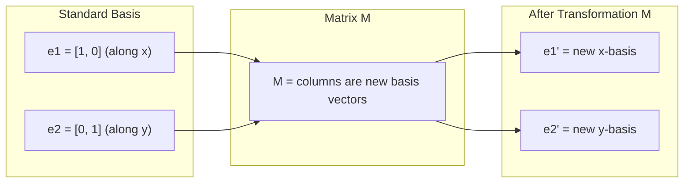
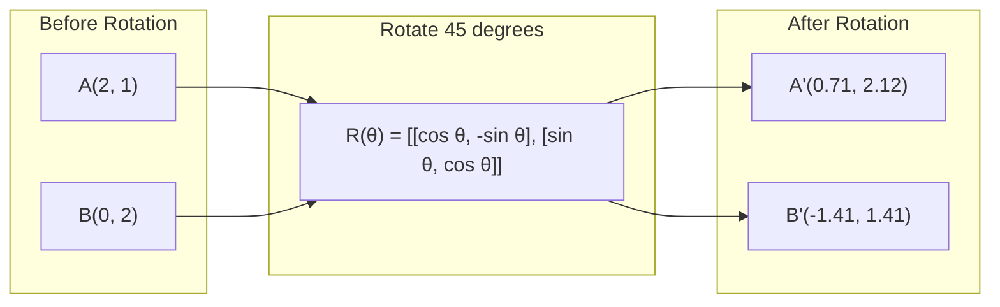
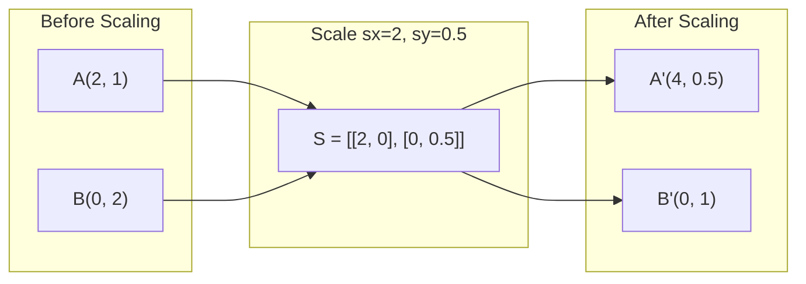
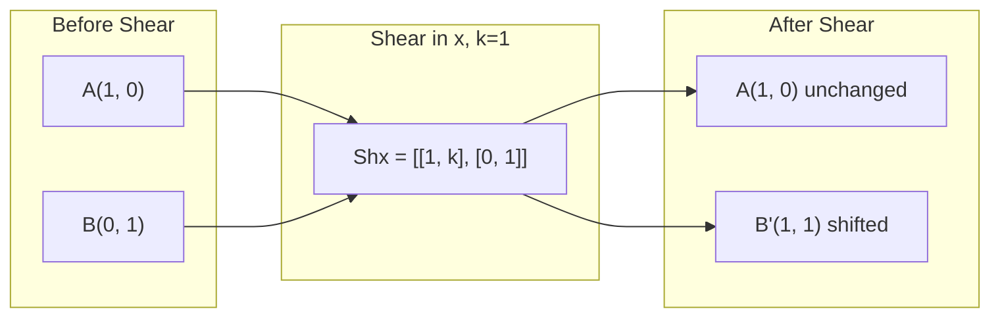
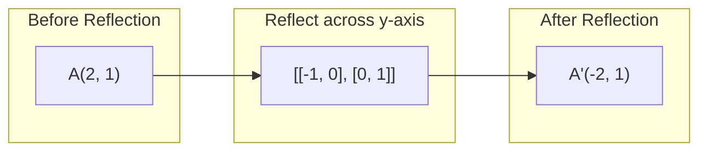
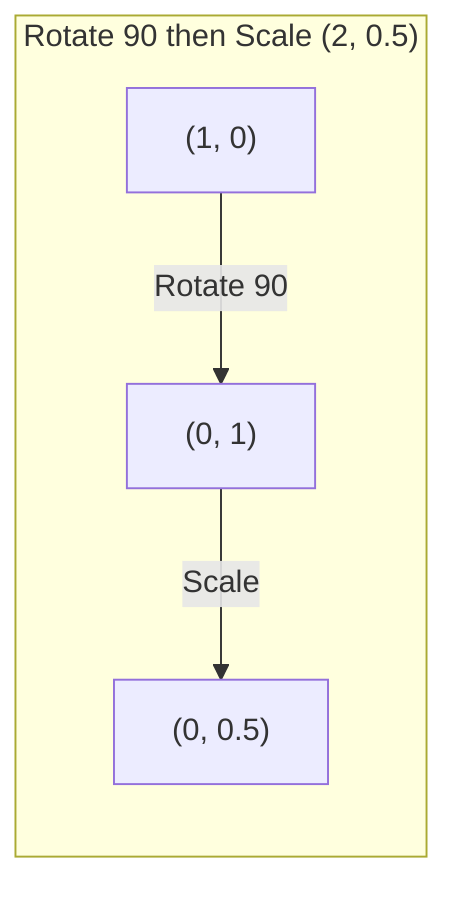
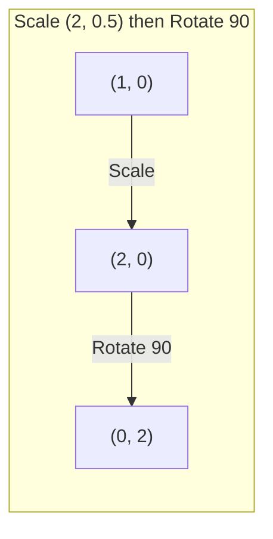

# मैट्रिक्स परिवर्तनों .

> मैट्रिक्स एक ऐसी मशीन है जो अंतरिक्ष को फिर से आकार देती है. जानें कि यह प्रत्येक बिंदु पर क्या करता है, और आप पूरे परिवर्तन को समझते हैं।

> रक्शा एक "重塑空间" की मशीन है। प्रत्येक बिंदु पर इसका प्रभाव समझने से, पूरे परिवर्तन को समझ में आता है।

**Type:** Build | **类型:** 动手
**Languages:** Python, Julia | **语言:** Python, Julia
**Prerequisites:** Phase 1, Lessons 01-02 (Linear Algebra Intuition, Vectors & Matrices Operations) | **前置知识:** Phase 1, Lessons 01-02（线性代数直觉、向量与矩阵运算）
**Time:** ~75 minutes | **时间:** ~75 分钟

## सीखने के लक्ष्य

- घूर्णन, स्केलिंग, स्केरिंग और प्रतिबिंब मैट्रिक्स का निर्माण करें और उन्हें 2D और 3D बिंदुओं पर लागू करें
  ् ् ् ् ् ् ् ् ् ् ् ् ् ् ् ् ् ् ् ् ् ् ् ् ् ् ् ् ् ् ् ् ् ् ् ् ् ् ् ् ् ् ् ् ् ् ् ् ् ् ् ् ् ् ् ् ् ् ् ् ् ् ् ् ् ् ् ् ् ् ् ् ् ् ् ् ् ् ् ् ् ् ् ् ् ् ् ् ् ् ् ् ् ् ् ् ् ् ् ् ् ् ् ् ् ् ् ् ् ् ् ् ् ् ् ् ् ् ् ् ् ् ् ् ् ् ् ् ् ् ् ् ् ् ् ् ् ् ् ् ् ् ् ् ् ् ् ् ् ् ् ् ् ् ् ् ् ् ् ् ् ् ् ् ् ् ् ् ् ् ् ् ् ् ् ् ् ् ् ् ् ् ् ् ् ् ् ् ् ् ् ् ् ् ् ् ् ् ् ् ् ् ् ् ् ् ् ् ् ् ् ् ् ् ् ् ् ् ् ् ् ् ् ् ् ् ् ् ् ् ् ् ् ् ् ् ् ् ् ् ् ् ् ् ् ् ् ् ् ् ् ् ् ् ्
- मैट्रिक्स गुणा द्वारा कई परिवर्तनों को लिखें और सत्यापित करें कि क्रम मायने रखता है
  通过矩阵乘法组合多个变化,验证顺序的重要性
- विशेषता समीकरण से 2x2 मैट्रिक्स के स्वमूल्य और स्ववेक्टरों की गणना करें
  विशेषता समीकरण से गणना 2x2 矩阵 के विशेषता मूल्य और विशेषता वेट
- स्पष्ट करें कि स्वमानों ने पीसीए दिशाओं, आरएनएन स्थिरता और स्पेक्ट्रल क्लस्टरिंग व्यवहार को क्यों निर्धारित किया है
  解释 विशेषता मूल्य क्यों निर्धारित PCA 方向、RNN  स्थिरता एवं वंशावली संवर्धन व्यवहार

> **【中文解读】**
> रचकों का अर्थ है- रचकों का परिमाण, परिमाण, परिमाण, परिमाण, परिमाण, परिमाण, परिमाण, परिमाण, परिमाण, परिमाण, परिमाण, परिमाण, परिमाण, परिमाण, परिमाण, परिमाण, परिमाण, परिमाण, परिमाण, परिमाण, परिमाण, परिमाण, परिमाण, परिमाण, परिमाण, परिमाण, परिमाण, परिमाण, परिमाण, परिमाण, परिमाण, परिमाण, परिमाण, परिमाण, परिमाण, परिमाण, परिमाण, परिमाण, परिमाण, परिमाण, परिमाण, परिमाण, परिमाण, परिमाण, परिमाण, परिमाण, परिमाण, परिमाण, परिमाण, परिमाण, परिमाण, परिमाण, परिमाण, परिमाण, परिमाण, परिमाण, परिमाण, परिमाण, परिमाण, परिमाण, परिमाण, परिमाण, परिमाण, परिमाण, परिमाण, परिमाण, परिमाण, परिमाण, परिमाण, परिमाण, परिमाण, परिमाण, परिमाण, परिमाण, परिमाण, परिमाण, परिमाण, परिमाण, परिमाण, परिमाण, परिमाण, परिमाण, परिमाण, परिमाण, परिमाण, परिमाण, परिमाण, परिमाण, परिमाण, परिमाण, परिमाण, परिमाण, परिमाण, परिमाण, परिमाण, परिमाण, परिमाण, परिमाण, परिमाण, परिमाण, परिमाण, परिमाण, परिमाण, परिमाण, परिमाण, परिमाण, परिमाण, परिमाण, परिमाण, परिमाण, परिमाण, परिमाण, परिमाण, परिमाण, परिमाण, परिमाण, परिमाण, परिमाण, परिमाण, परिमाण, परिमाण, परिमाण, परिमाण, परिमाण, परिमाण, परिमाण, परिमाण, परिमाण, परिमाण, परिमाण, परिमाण, परिमाण, परिमाण, परिमाण, परिमाण, परिमाण, परिमाण, परिमाण, परिमाण, परिमाण, परिमाण, परिमाण, परिमाण, परिमाण, परिमाण, परिमाण, परिमाण, परिमाण, परिमाण, परिमाण, परिमाण, परिमाण, परिमाण, परिमाण, परिमाण, परिमाण, परिमाण, परिमाण, परिमाण, परिमाण, परिमाण, परिमाण, परिमाण, परिमाण, परिमाण, परिमाण, परि

> **【拓展：特征值/特征向量在 AI 中的位置】**
> - **PCA（主成分分析）**                                                                                                                                                                                                                                                              
> - **RNN 稳定性**यदि भार भारोत्तोलन के विशेषता मूल्य का निरपेक्ष मूल्य 1 से अधिक है, तो तराजू का सूचकांक बढ़ेगा;
> - **谱聚类**: के-मीन्स की तुलना में अधिक अनुकूल गैर-गोलाकार डेटा के लिए उपयोग कर थ्रुपलास रक्कम के विशेषता वेक्टरों को संकलित किया जाता है।

## समस्या  समस्या परिचय

> **【中文解读】**पीसीए कहते हैं कि "संयोजन अंतर रक्शा के लक्षण वेट्यूम को ढूंढें", मॉडल स्थिरता कहते हैं कि "परीक्षण रक्शा मूल्य 1 से कम है", डेटा वृद्धि कहते हैं कि "随机旋转" ये सभी को रक्शा के लिए अंतरिक्ष के बारे में समझने की आवश्यकता है।

## अवधारणा का मूल अवधारणा

> **【拓展：Transformer 中的矩阵变换】**ट्रांसफार्मर का प्रत्येक ध्यान परिवर्तन में है: Q=W_q·x, K=W_k·x, V=W_v·x, जिसमें W_q/W_k/W_v सीखने योग्य परिवर्तन की矩阵 है। मॉडल प्रशिक्षण की प्रक्रिया स्वचालित सीखने की प्रक्रिया है।

### मैट्रिक्स के रूप में परिवर्तन

2D में प्रत्येक रैखिक परिवर्तन को 2x2 मैट्रिक्स के रूप में लिखा जा सकता है. मैट्रिक्स आपको बताता है कि आधार वेक्टर [1, 0] और [0, 1] कहां समाप्त होते हैं। बाकी सब कुछ बाद में होता है।

> द्वि आयाम अंतरिक्ष में प्रत्येक रैखिक परिवर्तन को एक 2x2 矩阵 में लिखा जा सकता है।矩阵 आपको बताती है कि [1, 0] और [0, 1] 变到了哪里, शेष सब कुछ इस से तय है।

> 矩阵的列就是变换后的基向量──如果矩阵的第一列是 [2, 0],说明 e1=[1,0]被映射到 [2,0](沿 x 轴拉伸 2 倍)──



### घूर्णन

कोण द्वारा 2D घूर्णन से दूरी और कोण बरकरार रहते हैं। यह एक वृत्त आर्क के साथ प्रत्येक बिंदु को स्थानांतरित करता है।

> दो आयाम घूर्णन दूरी और कोण को अपरिवर्तित बनाए रखेगा, प्रत्येक बिंदु को गोल आर्क के साथ ले जाएगा।

> 旋转矩阵 R(θ) = [[cosθ, -sinθ], [sinθ, cosθ]]。θ 为正表示逆时针旋转。R^T = R^(-1),转置即逆旋转。



3D में, आप एक अक्ष के चारों ओर घूमते हैं. प्रत्येक अक्ष का अपना घूर्णन मैट्रिक्स हैः

> त्रिवि में, आप एक अक्ष के चारों ओर घूमते हैं। प्रत्येक अक्ष का अपना घूर्णन रक्छा हैः

```
Rz(theta) = | cos  -sin  0 |     Rotate around z-axis
            | sin   cos  0 |     (x-y plane spins, z stays)
            |  0     0   1 |

Rx(theta) = | 1   0     0    |   Rotate around x-axis
            | 0  cos  -sin   |   (y-z plane spins, x stays)
            | 0  sin   cos   |

Ry(theta) = |  cos  0  sin |     Rotate around y-axis
            |   0   1   0  |     (x-z plane spins, y stays)
            | -sin  0  cos |
```

### स्केलिंग

स्केलिंग प्रत्येक अक्ष के साथ स्वतंत्र रूप से खिंचाव या संपीड़न करती है।

> 缩放沿着每轴独立地拉伸或压缩──

> 缩放矩阵 S = [[sx, 0], [0, sy]]―sx、sy अलग हो सकता है── यदि कोई एक नकारात्मक हो, तो उसी के साथ प्रतिबिंबित हो सकता है──



### कतरनी

काटने से एक अक्ष को झुकाया जाता है जबकि दूसरा स्थिर रहता है। यह आयताकारों को समानांतर में बदल देता है।

> 剪切 एक अक्ष को झुकाकर और दूसरे अक्ष को स्थिर रखने से,矩形平行四边形 हो जायेगा

> 剪切保持面积不变(行列式=1) ❖ कल्पना一克牌向一边推:底牌不动,顶牌平移──



स्कार्फ मैट्रिक्सः
- `Shx = [[1, k], [0, 1]]`k * y द्वारा x को शिफ्ट करता है
- `Shy = [[1, 0], [k, 1]]`k * x द्वारा y को शिफ्ट करता है

> 剪切矩阵:`Shx`沿 y 偏移 x(x 新 = x + k*y),`Shy`沿 x 偏移 y(y 新 = y + k*x) ⋅

### चिंतन

प्रतिबिंब एक अक्ष या रेखा के पार बिंदुओं को दर्शाता है।

> प्रतिबिंबित होगा किसी एक रेखा के बारे में

> प्रतिबिंब परिवर्तन दिशा (~) =-1 (~) लेकिन दूरी बनाए रखें।



प्रतिबिंबण मैट्रिक्सः
- y अक्ष पर प्रतिबिंबित करें: `[[-1, 0], [0, 1]]`
- एक्स-अक्ष पर प्रतिबिंबित करेंः `[[1, 0], [0, -1]]`

> प्रतिबिम्ब矩阵: बारे में y 轴反射 `[[-1, 0], [0, 1]]`, x 轴反射 के बारे में `[[1, 0], [0, -1]]`

### संरचनाः चेन परिवर्तन

परिवर्तन A और B को लागू करना उनकी मैट्रिक्स को गुणा करने के समान हैः `result = B @ A @ point`फिर घुमाओ तब पैमाने से अलग परिणाम देता है।

> पहले परिवर्तन करें A फिर परिवर्तन करें B बराबर है उनके रचकों को गुणा करने के लिएः`result = B @ A @ point` क्रम महत्वपूर्ण है पहली रोटरी पुनसंकुचन से पहले रोटरी पुनसंकुचन के परिणाम अलग हैं 

> यही कारण है कि PyTorch में nn. अनुक्रमिक  कठोर क्रमबद्धता से अनुक्रमिकता के मॉड्यूल, और रैंक गुणा क्रमबद्धता क्रमबद्धता में विपरीत दिशा में परिवर्तन के माध्यम से स्वचालित रूप से परिवर्तन के माध्यम से प्रसारित किया जाता है।



इसमें शामिल हैंः `S @ R = [[0, -2], [0.5, 0]]`

> 先旋转 90° 再缩放 (2, 0.5): से (1,0) → 旋转后 (0,1) → 缩放后 (0, 0.5)──组合矩阵 S @ R = [[0, -2], [0.5, 0]]──



इसमें शामिल हैंः `R @ S = [[0, -0.5], [2, 0]]`

> 先缩放 (2, 0.5) 再旋转 90°:从 (1,0) → 缩放后 (2, 0) → 旋转后 (0, 2)──组合矩阵 R @ S = [[0, -0.5], [2, 0]],与上完全不同──

भिन्न परिणाम. मैट्रिक्स गुणा कम्यूटेटिव नहीं है.

> 结果不同──矩阵乘法不满足交换律这就是为什么变压器注意力中 Q、K、V के चरण乘序至关重要──

### स्वमूल्य और स्ववेक्टर

अधिकांश वेक्टर उस समय दिशा बदलते हैं जब एक मैट्रिक्स उन्हें हिट करता है। स्व-वेक्टर विशेष होते हैंः मैट्रिक्स केवल उन्हें स्केल करता है, उन्हें कभी नहीं घुमाता है। स्केलिंग कारक स्व-मूल्य है।

> अधिकांश वेक्टरों को रैंक में परिवर्तन के बाद दिशा में परिवर्तन होता है।

> 几何直觉: विशेषता तरक्की है परिवर्तन में "方向不变 " की दिशा। यदि矩阵 है 圆变化, विशेषता तरक्की है 圆 के लम्बे छोड़े धुरी की ओर इशारा करती है।

```
A @ v = lambda * v

v is the eigenvector (direction that survives)
lambda is the eigenvalue (how much it stretches)

Example: A = | 2  1 |
             | 1  2 |

Eigenvector [1, 1] with eigenvalue 3:
  A @ [1,1] = [3, 3] = 3 * [1, 1]     (same direction, scaled by 3)

Eigenvector [1, -1] with eigenvalue 1:
  A @ [1,-1] = [1, -1] = 1 * [1, -1]  (same direction, unchanged)
```

मैट्रिक्स [1, 1] के साथ 3x से अंतरिक्ष को बढ़ाता है और [1, -1] को अपरिवर्तित रखता है। प्रत्येक अन्य दिशा इन दोनों का मिश्रण है।

> The矩阵沿 [1, 1] 方向拉伸 3 倍,保持 [1, -1] 方向不变──其他所有方向是这两方向的组合──

### स्वयं संरचना

यदि किसी मैट्रिक्स में n रैखिक रूप से स्वतंत्र स्ववेक्टर हैं, तो इसे विघटित किया जा सकता हैः

> यदि रक्शंस में n 个线性无关的特征向量 है, तो यह A = V D V−1 में विभाजित किया जा सकता है

> विशेषता विघटन के अर्थः "परिवर्तन के लिए किसी भी प्रकार के परिवर्तन को विभाजित करना" तीन चरणों में "परिवर्तन के लिए विशेषता के आकार में घुमाव → 轴缩放 → 旋回归" है।

```
A = V @ D @ V^(-1)

V = matrix whose columns are eigenvectors
D = diagonal matrix of eigenvalues
V^(-1) = inverse of V

This says: rotate into eigenvector coordinates, scale along each axis, rotate back.
```

> इसका अर्थ है: प्रत्येक अक्ष के साथ घूमना, फिर घूमना, फिर घूमना।

### स्व-मूल्य क्यों मायने रखते हैं

**PCA.**सह-परिवर्तन मैट्रिक्स के स्वयं वेक्टर मुख्य घटक हैं। स्वयं मूल्य आपको बताते हैं कि प्रत्येक घटक कितना भिन्नता कैप्चर करता है। स्वयं मूल्य द्वारा क्रमबद्ध करें, शीर्ष k को बनाए रखें, और आपके पास आयामता में कमी है।

> **PCA（主成分分析）。**                                                                                                                                                                                                                                                              

**Stability.**पुनरावर्ती नेटवर्क और गतिशील प्रणालियों में, परिमाण > 1 के साथ स्वमान आउटपुट को विस्फोट करने का कारण बनते हैं। परिमाण < 1 उन्हें गायब होने का कारण बनता है। यह एक वाक्य में वर्णित गायब होने / विस्फोट ग्रेडिएंट समस्या है।

> **稳定性。**परिपत्र नेटवर्क और गति प्रणाली में, विशेषता मूल्य का मूल = 1 आउटपुट विस्फोट का कारण बनता है, < 1 गायब होने का कारण बनता है।

**Spectral methods.**ग्राफ न्यूरल नेटवर्क आसन्नता मैट्रिक्स के स्वमान का उपयोग करते हैं। स्पेक्ट्रल क्लस्टरिंग लैप्लाशियन के स्वमान का उपयोग करता है। स्वमेणव ग्राफ की संरचना का खुलासा करते हैं।

> **谱方法。**图神经网络 图神经网络 图的特征值 图的特征值 图的特征值 图的特征值 图的特征量 图的结构 图的特征值 图的特征值 图的特征量 图的特征值 图的特征值 图的特征值 图的特征量 图的特征值 图的特征值 图的特征量 图的特征值 图的特征值 图的特征量 图的特征值 图的特征值 图的特征量 图的特征量 图的结构 图的特征量 图的特征值 图的特征值 图的特征量 图的特征值 图的特征量 图的特征值 图的特征值 图的特征量 图的特征量 图的特征值 图的特征值 图的特征值 图的特征值 图的特征值 图的特征值 图的特征的特征

### वॉल्यूम स्केलिंग कारक के रूप में निर्धारक

परिवर्तन मैट्रिक्स का निर्धारक आपको बताता है कि यह क्षेत्र (2D) या मात्रा (3D) को कितना स्केल करता है।

> 变换矩阵的行列式 आपको बताता है कि यह परिमाण का आकार है

> det=0 है "कयामत"矩阵把空间压缩到低维((如2D →1D 线), सूचना हानि,矩阵不可逆──神经网络初始化时应避免权重矩阵接近奇异──

```
det = 1:   area preserved (rotation)
det = 2:   area doubled
det = 0:   space crushed to lower dimension (singular)
det = -1:  area preserved but orientation flipped (reflection)

| det(Rotation) | = 1        (always)
| det(Scale sx, sy) | = sx * sy
| det(Shear) | = 1           (area preserved)
| det(Reflection) | = -1     (orientation flipped)
```

> 行列式含义:det=1 保面积(旋转);det=2 面积翻倍;det=0 空间崩缩到低维(奇异,矩阵不可逆);det=-1 保面积但翻转方向(反射)

## इसे बनाओ, इसे पूरा करो।
```figure
matrix-transform
```

## इसे बनाओ

### चरण 1: खरोंच से परिवर्तन मैट्रिक्स (पाइटन)

> 第1 कदम: शून्य से प्राप्त परिवर्तन रक्छा

> शून्य से पूर्ण घूर्णन, संकुचन, काटने, प्रतिबिंबण रत्नों से सभी परिवर्तन 2x2 रत्नों से होते हैं।

```python
import math

def rotation_2d(theta):
    c, s = math.cos(theta), math.sin(theta)
    return [[c, -s], [s, c]]

def scaling_2d(sx, sy):
    return [[sx, 0], [0, sy]]

def shearing_2d(kx, ky):
    return [[1, kx], [ky, 1]]

def reflection_x():
    return [[1, 0], [0, -1]]

def reflection_y():
    return [[-1, 0], [0, 1]]

def mat_vec_mul(matrix, vector):
    return [
        sum(matrix[i][j] * vector[j] for j in range(len(vector)))
        for i in range(len(matrix))
    ]

def mat_mul(a, b):
    rows_a, cols_b = len(a), len(b[0])
    cols_a = len(a[0])
    return [
        [sum(a[i][k] * b[k][j] for k in range(cols_a)) for j in range(cols_b)]
        for i in range(rows_a)
    ]

point = [1.0, 0.0]
angle = math.pi / 4

rotated = mat_vec_mul(rotation_2d(angle), point)
print(f"Rotate (1,0) by 45 deg: ({rotated[0]:.4f}, {rotated[1]:.4f})")

scaled = mat_vec_mul(scaling_2d(2, 3), [1.0, 1.0])
print(f"Scale (1,1) by (2,3): ({scaled[0]:.1f}, {scaled[1]:.1f})")

sheared = mat_vec_mul(shearing_2d(1, 0), [1.0, 1.0])
print(f"Shear (1,1) kx=1: ({sheared[0]:.1f}, {sheared[1]:.1f})")

reflected = mat_vec_mul(reflection_y(), [2.0, 1.0])
print(f"Reflect (2,1) across y: ({reflected[0]:.1f}, {reflected[1]:.1f})")
```

### चरण 2: परिवर्तनों की संरचना

> 第2步: परिवर्तन का组合

> 验证矩阵乘法不可交换:先旋转90° 再缩放 (2, 0.5) से पहले缩放再旋转 पूर्णतः भिन्न परिणाम प्राप्त होते हैं।

```python
R = rotation_2d(math.pi / 2)
S = scaling_2d(2, 0.5)

rotate_then_scale = mat_mul(S, R)
scale_then_rotate = mat_mul(R, S)

point = [1.0, 0.0]
result1 = mat_vec_mul(rotate_then_scale, point)
result2 = mat_vec_mul(scale_then_rotate, point)

print(f"Rotate 90 then scale: ({result1[0]:.2f}, {result1[1]:.2f})")
print(f"Scale then rotate 90: ({result2[0]:.2f}, {result2[1]:.2f})")
print(f"Same? {result1 == result2}")
```

> 验证: पहले घुमाव और बाद में संकुचन, परिणाम पहले संकुचन के बाद के घुमाव से भिन्न होते हैं।

### चरण 3: स्क्रैच से स्व-मूल्य (2x2)

> 第3步: शून्य से गणना विशेषता मूल्य

> 2x2 矩阵的特征值通过解二次方程 λ2 - trace·λ + det = 0 得到, जिसमें trace=a+d,det=ad-bc──特征向量通过 (A - λI) v = 0 求解──

एक 2x2 मैट्रिक्स के लिए `[[a, b], [c, d]]`, स्वमूल्य विशेषता समीकरण को हल करते हैंः `lambda^2 - (a+d)*lambda + (ad - bc) = 0`. .

> 2x2 矩阵 के लिए `[[a, b], [c, d]]`,特征值满足特征方程 λ2 - (a+d)λ + (ad-bc) = 0── इनमें से (a+d) है迹(अनुक्रमण),(ad-bc) है行列式──

```python
def eigenvalues_2x2(matrix):
    a, b = matrix[0]
    c, d = matrix[1]
    trace = a + d
    det = a * d - b * c
    discriminant = trace ** 2 - 4 * det
    if discriminant < 0:
        real = trace / 2
        imag = (-discriminant) ** 0.5 / 2
        return (complex(real, imag), complex(real, -imag))
    sqrt_disc = discriminant ** 0.5
    return ((trace + sqrt_disc) / 2, (trace - sqrt_disc) / 2)

def eigenvector_2x2(matrix, eigenvalue):
    a, b = matrix[0]
    c, d = matrix[1]
    if abs(b) > 1e-10:
        v = [b, eigenvalue - a]
    elif abs(c) > 1e-10:
        v = [eigenvalue - d, c]
    else:
        if abs(a - eigenvalue) < 1e-10:
            v = [1, 0]
        else:
            v = [0, 1]
    mag = (v[0] ** 2 + v[1] ** 2) ** 0.5
    return [v[0] / mag, v[1] / mag]

A = [[2, 1], [1, 2]]
vals = eigenvalues_2x2(A)
print(f"Matrix: {A}")
print(f"Eigenvalues: {vals[0]:.4f}, {vals[1]:.4f}")

for val in vals:
    vec = eigenvector_2x2(A, val)
    result = mat_vec_mul(A, vec)
    scaled = [val * vec[0], val * vec[1]]
    print(f"  lambda={val:.1f}, v={[round(x,4) for x in vec]}")
    print(f"    A@v = {[round(x,4) for x in result]}")
    print(f"    l*v = {[round(x,4) for x in scaled]}")
```

> 验证 A=[[2,1],[1,2]] के लक्षण मूल्य 3 和 1,对应特征向量 [1,1]/√2 和 [1,-1]/√2。验证 A@v = λ×v 成立。

### चरण 4: वॉल्यूम स्केलिंग कारक के रूप में निर्धारक

> चौथा चरण: आकार संकुचित कारक के रूप में

```python
def det_2x2(matrix):
    return matrix[0][0] * matrix[1][1] - matrix[0][1] * matrix[1][0]

print(f"det(rotation 45) = {det_2x2(rotation_2d(math.pi/4)):.4f}")
print(f"det(scale 2,3)   = {det_2x2(scaling_2d(2, 3)):.1f}")
print(f"det(shear kx=1)  = {det_2x2(shearing_2d(1, 0)):.1f}")
print(f"det(reflect y)   = {det_2x2(reflection_y()):.1f}")

singular = [[1, 2], [2, 4]]
print(f"det(singular)     = {det_2x2(singular):.1f}")
print("Singular: columns are proportional, space collapses to a line.")
```

> 奇异矩阵示例:[[1, 2], [2, 4]] के行列式为 0,因为两行成比例──空间被压缩到一条线,变换不可逆──

## इसे फ्रेमवर्क के साथ लागू करें

NumPy अनुकूलित दिनचर्या के साथ यह सब संभालता है।

> इन सभी कार्यों को संसाधित करने के लिए अनुकूलित विधि का उपयोग करें।

> NumPy के `np.linalg.eig`和 `np.linalg.det`底层调用 LAPACK(C/Fortran 写的线性代数库),比手写 Python 快 100-1000 倍──

```python
import numpy as np

theta = np.pi / 4
R = np.array([[np.cos(theta), -np.sin(theta)],
              [np.sin(theta),  np.cos(theta)]])

point = np.array([1.0, 0.0])
print(f"Rotate (1,0) by 45 deg: {R @ point}")

S = np.diag([2.0, 3.0])
composed = S @ R
print(f"Scale(2,3) after Rotate(45): {composed @ point}")

A = np.array([[2, 1], [1, 2]], dtype=float)
eigenvalues, eigenvectors = np.linalg.eig(A)
print(f"\nEigenvalues: {eigenvalues}")
print(f"Eigenvectors (columns):\n{eigenvectors}")

for i in range(len(eigenvalues)):
    v = eigenvectors[:, i]
    lam = eigenvalues[i]
    print(f"  A @ v{i} = {A @ v}, lambda * v{i} = {lam * v}")

print(f"\ndet(R) = {np.linalg.det(R):.4f}")
print(f"det(S) = {np.linalg.det(S):.1f}")

B = np.array([[3, 1], [0, 2]], dtype=float)
vals, vecs = np.linalg.eig(B)
D = np.diag(vals)
V = vecs
reconstructed = V @ D @ np.linalg.inv(V)
print(f"\nEigendecomposition A = V @ D @ V^-1:")
print(f"Original:\n{B}")
print(f"Reconstructed:\n{reconstructed}")
```

> विशेषताएं विघटन परीक्षणः ए = वी @ डी @ वी−1 应能完美重建原矩阵── यह साबित करता है कि कोई भी प्रति कोणयुक्त矩阵都能分解为"旋转 →缩缩 → 旋转回来"三步──

### NumPy के साथ 3D घूर्णन

```python
def rotation_3d_z(theta):
    c, s = np.cos(theta), np.sin(theta)
    return np.array([[c, -s, 0], [s, c, 0], [0, 0, 1]])

def rotation_3d_x(theta):
    c, s = np.cos(theta), np.sin(theta)
    return np.array([[1, 0, 0], [0, c, -s], [0, s, c]])

point_3d = np.array([1.0, 0.0, 0.0])
rotated_z = rotation_3d_z(np.pi / 2) @ point_3d
rotated_x = rotation_3d_x(np.pi / 2) @ point_3d

print(f"\n3D point: {point_3d}")
print(f"Rotate 90 around z: {np.round(rotated_z, 4)}")
print(f"Rotate 90 around x: {np.round(rotated_x, 4)}")
```

> संख्या  3D  घूर्णन रक्छा को प्राप्त करना: चारों ओर 轴 और चारों ओर x 轴 प्रत्येक के स्वतंत्र 3x3  घूर्णन रक्छा को प्राप्त करना  3D 图形学、机器人学、计算机视觉都依赖于这些矩阵──

## इसे भेजें उत्पाद

इस पाठ में पीसीए (चरण 2) और तंत्रिका नेटवर्क वजन विश्लेषण के लिए ज्यामितीय आधार बनाया गया है। यहां निर्मित स्व-मूल्य / ईजेनवेक्टर कोड वही एल्गोरिथ्म है जो उत्पादन एमएल सिस्टम में आयामता कमी, स्पेक्ट्रल क्लस्टरिंग और स्थिरता विश्लेषण को संचालित करता है।

> इस कक्षा में पीसीए (Phase 2) और न्यूरल नेटवर्क वेट वेट एनालिसिस के भू-आधार का निर्माण किया गया है।

> इस वर्ग का उत्पादनः शून्य से प्राप्त परिवर्तन रक्शांक + विशेषता मूल्य/ विशेषता द्रव्यमान खोजकर्ता हेतु हेतु हेतु हेतु हेतु हेतु हेतु हेतु हेतु हेतु हेतु हेतु हेतु हेतु हेतु हेतु हेतु हेतु हेतु हेतु हेतु हेतु हेतु हेतु हेतु हेतु हेतु हेतु हेतु हेतु हेतु हेतु हेतु हेतु हेतु हेतु हेतु हेतु हेतु हेतु हेतु हेतु हेतु हेतु हेतु हेतु हेतु हेतु हेतु हेतु हेतु हेतु हेतु हेतु हेतु हेतु हेतु हेतु हेतु हेतु हेतु हेतु हेतु हेतु हेतु हेतु हेतु हेतु हेतु हेतु हेतु हेतु हेतु हेतु हेतु हेतु हेतु हेतु हेतु हेतु हेतु हेतु हेतु हेतु हेतु हेतु हेतु हेतु हेतु हेतु हेतु हेतु हेतु हेतु हेतु हेतु हेतु हेतु हेतु हेतु हेतु हेतु हेतु हेतु हेतु हेतु हेतु हेतु हेतु हेतु हेतु हेतु हेतु हेतु हेतु हेतु हेतु हेतु हेतु हेतु हेतु हेतु हेतु हेतु हेतु हेतु हेतु हेतु हेतु हेतु हेतु हेतु हेतु हेतु हेतु हेतु हेतु हेतु हेतु हेतु हेतु हेतु हेतु हेतु हेतु हेतु हेतु हेतु हेतु हेतु हेतु हेतु हेतु हेतु हेतु हेतु हेतु हेतु हेतु हेतु हेतु हेतु हेतु हेतु हेतु हेतु हेतु हेतु हेतु हेतु हेतु हेतु हेतु हेतु हेतु हेतु हेतु हेतु हेतु हेतु हेतु हेतु हेतु हेतु हेतु हेतु हेतु हेतु हेतु हेतु हेतु हेतु हेतु हेतु हेतु हेतु हेतु हेतु हेतु हेतु हेतु हेतु हेतु हेतु हेतु हेतु हेतु हेतु हेतु हेतु हेतु हेतु हेतु हेतु हेतु हेतु हेतु हेतु हेतु हेतु हेतु हेतु हेतु हेतु हेतु हेतु हेतु हेतु हेतु हेतु हेतु हेतु हेतु हेतु हेतु हेतु हेतु हेतु हेतु हेतु हेतु हेतु हेतु हेतु हेतु हेतु हेतु हेतु हेतु हेतु हेतु हेतु हेतु हेतु हेतु हेतु हेतु हेतु हेतु हेतु हेतु हेतु हेतु हेतु हेतु हेतु हेतु हेतु हेतु हेतु हेतु हेतु हेतु हेतु हेतु हेतु हेतु हेतु हेतु हेतु हेतु हेतु हेतु हेतु हेतु हेतु हेतु हेतु हेतु हेतु हेतु हेतु हेतु हेतु हेतु हेतु हेतु हेतु हेतु हेतु हेतु हेतु हेतु हेतु हेतु हेतु हेतु हेतु हेतु हेतु हेतु हेतु हेतु हेतु हेतु हेतु हेतु हेतु हेतु हेतु हेतु हेतु हेतु हेतु हेतु हेतु हेतु हेतु हेतु हेतु हेतु हेतु हेतु हेतु हेतु हेतु हेतु हेतु हेतु हेतु हेतु हेतु हेतु हेतु हेतु हेतु हेतु हेतु हेतु हेतु हेतु हेतु हेतु हेतु हेतु हेतु हेतु हेतु हेतु हेतु हेतु हेतु हेतु हेतु हेतु हेतु हेतु हेतु हेतु हेतु हेतु हेतु हेतु हेतु हेतु हेतु हेतु हेतु हेतु हेतु हेतु हेतु हेतु हेतु हेतु हेतु हेतु हेतु हेतु हेतु हेतु हेतु हेतु हेतु हेतु हेतु हेतु हेतु हेतु हेतु हेतु हेतु हेतु हेतु हेतु हेतु हेतु हेतु हेतु हेतु हेतु हेतु हेतु हेतु हेतु हेतु हेतु हेतु हेतु हेतु हेतु हेतु हेतु हेतु हेतु हेतु हेतु हेतु हेतु हेतु हेतु हेतु हेतु हेतु हेतु हेतु हेतु हेतु हेतु हेतु हेतु हेतु हेतु हेतु हेतु हेतु हेतु हेतु हेतु हेतु हेतु हेतु हेतु हेतु हेतु हेतु हेतु हेतु हेतु हेतु हेतु हेतु हेतु हेतु हेतु हेतु हेतु हेतु हेतु हेतु हेतु हेतु हेतु हेतु हेतु हेतु हेतु हेतु हेतु हेतु हेतु हेतु हेतु हेतु हेतु हेतु हेतु

## अभ्यास विषय

1. एक इकाई वर्ग (कोने [0,0], [1,0], [1,1], [0,1]) पर घूर्णन, स्केलिंग और शेयरिंग लागू करें। प्रत्येक के लिए परिवर्तित कोनों को प्रिंट करें। जांचें कि घूर्णन को कोनों के बीच दूरी बनाए रखता है।
   इकाई के सही वर्ग आकार पर (कोण में [0,0]、[1,0]、[1,1]、[0,1]) घुमाव, संकुचन, काटना, मुद्रण प्रत्येक परिवर्तन के बाद के कोणों पर (कोण में) प्रयोग करें।

2. विशेषता समीकरण का उपयोग करके मैट्रिक्स [[4, 2], [1, 3]] के स्व-मूल्यों को हाथ से खोजें। फिर अपने खरोंच फ़ंक्शन और NumPy के साथ सत्यापित करें।
   手工用特征方程求矩阵 [[4, 2], [1, 3]] के विशेषता मूल्य, फिर शून्य से实现的函数和NumPy 验证──

3. तीन परिवर्तनों की एक रचना बनाएं (30 डिग्री घूर्णन, [1.5, 0.8 द्वारा स्केल करें], kx=0.3 के साथ काटें) और इसे एक वृत्त में व्यवस्थित 8 बिंदुओं पर लागू करें। निर्देशांक से पहले और बाद में प्रिंट करें। गठित मैट्रिक्स के निर्धारक की गणना करें और सत्यापित करें कि यह व्यक्तिगत निर्धारकों के उत्पाद के बराबर है।
   组合三个变换(旋转30°、缩放 [1.5, 0.8]、剪切 kx=0.3), परिमार्जन पर 8 个点──印前后坐标──计算组合矩阵的行列式,验证它等于各自行列式的乘积──

## कीवर्ड्स  शब्द खोज तालिका

| Term | What people say | What it actually means |
|------|----------------|----------------------|
| Rotation matrix | "Spins things" | An orthogonal matrix that moves points along circular arcs while preserving distances and angles. Determinant is always 1. |
| Scaling matrix | "Makes things bigger" | A diagonal matrix that stretches or compresses independently along each axis. Determinant is the product of scale factors. |
| Shearing matrix | "Slants things" | A matrix that shifts one coordinate proportionally to another, turning rectangles into parallelograms. Determinant is 1. |
| Reflection | "Mirrors things" | A matrix that flips space across an axis or plane. Determinant is -1. |
| Composition | "Do two things" | Multiplying transformation matrices to chain operations. Order matters: B @ A means apply A first, then B. |
| Eigenvector | "Special direction" | A direction that the matrix only scales, never rotates. The transformation's fingerprint. |
| Eigenvalue | "How much it stretches" | The scalar factor by which the matrix scales its eigenvector. Can be negative (flip) or complex (rotation). |
| Eigendecomposition | "Break the matrix apart" | Writing a matrix as V @ D @ V^(-1), separating it into its fundamental scaling directions and magnitudes. |
| Determinant | "A single number from a matrix" | The factor by which the transformation scales area (2D) or volume (3D). Zero means the transformation is irreversible. |
| Characteristic equation | "Where eigenvalues come from" | det(A - lambda * I) = 0. The polynomial whose roots are the eigenvalues. |

> 术语速查:सोटल मैट्रिक्स(旋矩阵,正交,行列式=1) √ स्केलिंग मैट्रिक्स(缩放矩阵,对角) √ Shearing(剪切,矩形→平行四边形) √ प्रतिबिंब(反射,行列式=-1) √ संरचना(组合,B@A 表示先 A 后 B) √Eigenvector(特征向量, केवल缩放不值旋转的方向) √Eigenvalue(特征,缩放倍数,可为负负数或复数) √Eigendecomposition √ विशेषता分解 A=VDV−1) √ निर्धारक行列式,面积/体积缩放因子,0 = 奇异) √ चरित्र समीकरण √ विशेषता √ √ √ √ √ √ √ √ √ √ √ √ √ √ √ √ √ √ √ √ √ √ √ √ √ √ √ √ √ √ √ √ √ √ √ √ √ √ √ √ √ √ √ √ √ √ √ √ √ √ √ √ √ √ √ √ √ √ √ √ √ √ √ √ √ √ √ √ √ √ √ √ √ √ √ √ √ √ √ √ √ √ √ √ √ √ √ √ √ √ √ √ √ √ √ √ √ √ √ √ √ √ √ √ √ √ √ √ √ √ √ √ √ √ √ √ √ √ √ √ √ √ √ √ √ √ √ √ √ √ √ √ √ √ √ √ √ √ √ √ √ √ √ √ √ √ √ √ √ √ √ √ √ √ √ √ √ √ √ √ √ 

## आगे पढ़ना 延伸閱讀

- [3Blue1Brown: Linear Transformations](https://www.3blue1brown.com/lessons/linear-transformations)-- दृश्य अंतर्ज्ञान के लिए कैसे मैट्रिक्स अंतरिक्ष को फिर से आकार देने के लिए
- [3Blue1Brown: Eigenvectors and Eigenvalues](https://www.3blue1brown.com/lessons/eigenvalues)-- स्व-वेक्टरों का ज्यामितीय रूप से क्या अर्थ है की सबसे अच्छी दृश्य व्याख्या
- [MIT 18.06 Lecture 21: Eigenvalues and Eigenvectors](https://ocw.mit.edu/courses/18-06-linear-algebra-spring-2010/)- गिल्बर्ट स्ट्रैंग का क्लासिक उपचार
