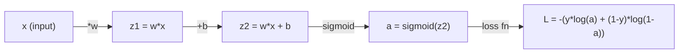
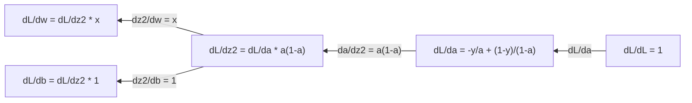
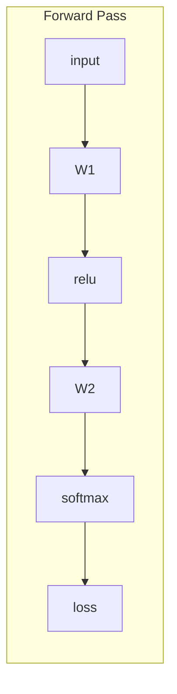
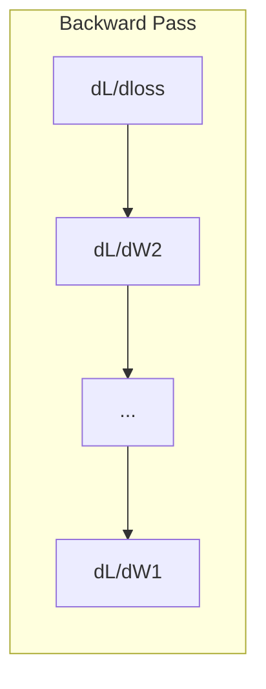

# मशीन लर्निंग के लिए गणना मशीन लर्निंग में सूक्ष्म अंक

> व्युत्पन्न आपको बताता है कि कौन सी दिशा नीचे है। यह सब एक तंत्रिका नेटवर्क को सीखने की जरूरत है।

> 导数 आपको बताता है कि किस दिशा में नीचे की ओर है  यह सब कुछ है जो न्यूरल नेटवर्क सीखने की आवश्यकता है 

**Type:** Learn | **类型:** 学习
**Language:**पायथन**语言:**पायथन
**Prerequisites:** Phase 1, Lessons 01-03 | **前置知识:** Phase 1, Lessons 01-03
**Time:** ~60 minutes | **时间:** ~60 分钟

## सीखने के लक्ष्य

- सामान्य ML फ़ंक्शन के लिए संख्यात्मक और विश्लेषणात्मक व्युत्पन्न गणना करें (x^2, सिग्मोइड, क्रॉस-एंट्रोपी)
  计算常见 ML 函数(x^2、sigmoid、交叉) का संख्यात्मक मूल्य निर्देशांक और विश्लेषणात्मक निर्देशांक
- 1D और 2D में हानि फ़ंक्शन को कम करने के लिए खरोंच से ग्रेडिएंट गिरावट लागू करें
  शून्य से प्राप्त करने की डिग्री में कमी, 1D और 2D में न्यूनतम हानि फ़ंक्शन
- रैखिक प्रतिगमन मॉडल का ग्रेडिएंट निकालें और इसे मैनुअल वजन अद्यतन के माध्यम से प्रशिक्षित करें
  推导线性归归模型的梯度,并通过手动权重更新进行训练
- हेसन मैट्रिक्स, टेलर श्रृंखला अनुमानों और अनुकूलन विधियों से उनका संबंध समझाएं
   व्याख्या Hessian 矩阵、 टेलर श्रेणी संख्या निकटता और अनुकूलन विधि के साथ संबंध

> **【中文解读】**
> 导数 आपको बताता है कि "कौन सी दिशा में चलना है जो त्रुटि को छोटा कर सकता है"―― तंत्रिका नेटवर्क में लाखों पैरामीटर हैं, प्रत्येक पैरामीटर एक "घंटी" है, लघु अंक आपको बताता है कि प्रत्येक घुमाव किस दिशा में चलना है।

> **【拓展：微积分与神经网络】**
> - **梯度下降**: तंत्रिका नेटवर्क प्रशिक्षण के मूल एल्गोरिथ्म  तरंग के विपरीत दिशा में अद्यतन पैरामीटर 
> - **SGD/Adam**:                                                                                                                                                                                                                                                               
> - **学习率**梯度下降的步长──太大则跳过最小值,太小则收太慢──

## समस्या  समस्या परिचय

> **【中文解读】**न्यूरियल नेटवर्क में एक मिलियन वजन होते हैं, प्रशिक्षण प्रत्येक चक्र को किस दिशा में बदलना है।

## अवधारणा का मूल अवधारणा

> **【拓展：偏导数就是"只动一个旋钮看效果"]**तंत्रिका नेटवर्क के नुकसान फ़ंक्शन L(w1, w2, ..., wn) 有百万个变量──偏导数 ∂L/∂w_i 告诉你"只改变 w_i一个权重,损失变化多少"──梯度就是把所有的偏导数组合成一个向量,指向"最的上坡方向",所以沿负梯度走就是最快的下坡路──

### व्युत्पन्न क्या है?

एक व्युत्पन्न परिवर्तन की दर को मापता है. एक फ़ंक्शन y = f(x के लिए, व्युत्पन्न f'(x) आपको बताता हैः यदि आप x को एक छोटी राशि से धक्का देते हैं, तो y कितना बदलता है?

> 导数衡量变化率──对于函数 y = f(x),导数 f'(x) 告诉你: यदि x 微小变化, y 变化多少?

ज्यामितीय रूप से, व्युत्पन्न एक बिंदु पर स्पर्श रेखा का ढलान है।

> 几何上,导数 कुछ बिंदुओं के लिए एक रेखा की झुकाव है

**f(x) = x^2:**

| x | f(x) | f'(x) (slope) |
|---|------|---------------|
| 0 | 0    | 0 (flat, at the bottom) |
| 1 | 1    | 2 |
| 2 | 4    | 4 (tangent line slope at this point) |
| 3 | 9    | 6 |

x=2 पर, ढलान 4 है. अगर आप x को थोड़ा सा दाईं ओर ले जाते हैं, तो y उस राशि से लगभग 4 गुना बढ़ जाता है. x=0 पर ढलान 0 है. आप कटोरे के निचले भाग में हैं.

> x=2 पर, ढलान दर 4 है। यदि आप x को दाईं ओर ले जाएँ तो y लगभग उस गति की मात्रा में 4 गुना वृद्धि करेगा। x=0 पर, ढलान दर 0 है। आप "बोतल के नीचे" पर हैं।

औपचारिक परिभाषाः

```
f'(x) = lim   f(x + h) - f(x)
        h->0  -----------------
                     h
```

कोड में, आप सीमा को छोड़ दें और बस एक बहुत ही छोटे h का उपयोग करें. यह संख्यात्मक व्युत्पन्न है.

> कोड में, कूद सीमा से अधिक, सीधे बहुत छोटे h के साथ निकटता से।

### आंशिक व्युत्पन्नः एक समय में एक चर

वास्तविक कार्यों में कई इनपुट होते हैं। एक तंत्रिका नेटवर्क हानि हजारों वजन पर निर्भर करती है। एक आंशिक व्युत्पन्न एक को छोड़कर सभी चर को स्थिर रखता है, फिर उस एक के संबंध में व्युत्पन्न लेता है।

> वास्तविक फ़ंक्शन में कई इनपुट होते हैं। तंत्रिका नेटवर्क हानि फ़ंक्शन हजारों भारों पर निर्भर करता है। अन्य चरों को अपरिवर्तित रखने के लिए, केवल एक चर के लिए मार्गदर्शन प्राप्त करना उचित है।

```
f(x, y) = x^2 + 3xy + y^2

df/dx = 2x + 3y     (treat y as a constant)
df/dy = 3x + 2y     (treat x as a constant)
```

प्रत्येक आंशिक व्युत्पन्न उत्तर देता हैः यदि मैं केवल इस एक वजन को धक्का देता हूं, तो नुकसान कैसे बदलता है?

> प्रत्येक विकिरण संख्या उत्तर देती हैः यदि मैं केवल इस वजन को डायल करता हूं, तो नुकसान कितना बदलता है?

### ग्रेडिएंटः सभी आंशिक व्युत्पन्नों का वेक्टर

ग्रेडिएंट प्रत्येक आंशिक व्युत्पन्न को एक वेक्टर में एकत्र करता है। f ((x, y, z) फ़ंक्शन के लिए ग्रेडिएंट हैः

> 梯度把所有偏导数集成一个向量──对于函数 f ((x, y, z),梯度为:

```
grad f = [ df/dx, df/dy, df/dz ]
```

एक कार्य को कम करने के लिए, विपरीत दिशा में जाएं।

> 梯度指向最上升方向──要最小化函数,就沿相反方向走──

**Contour plot of f(x,y) = x^2 + y^2:**

फ़ंक्शन एक कटोरी के आकार को बनाती है जिसमें समोच्च रेखाओं के रूप में एकाग्र वृत्त होते हैं। न्यूनतम (0, 0) है।

> इस फ़ंक्शन में एक कटोरे का आकार होता है, जैसे कि उच्च रेखा एक साथ एक केंद्र के साथ है।

| Point | grad f | -grad f (descent direction) |
|-------|--------|----------------------------|
| (1, 1) | [2, 2] (points uphill, away from minimum) | [-2, -2] (points downhill, toward minimum) |
| (0, 0) | [0, 0] (flat, at the minimum) | [0, 0] |

> 梯度方向指向最上坡,负梯度方向指向最下坡 (~ न्यूनतम मूल्य की ओर) .

यह एक चित्र में ग्रेडिएंट गिरावट है. ग्रेडिएंट की गणना करें, इसे नकारें, एक कदम उठाएं.

> यह है कि नीचे की तरफ़ की तरफ़ का चित्रण।

### अनुकूलन से संबंध

एक तंत्रिका नेटवर्क को प्रशिक्षित करना अनुकूलन है. आपके पास एक हानि फ़ंक्शन L ((w1, w2, ..., wn) है जो मापता है कि मॉडल कितना गलत है. आप इसे कम करना चाहते हैं।

> 训练神经网络就是优化──损失函数 L(w1,w2, ..., wn) 衡量模型有多多"错", आप इसे न्यूनतम करना चाहिए──

```
Gradient descent update rule:

  w_new = w_old - learning_rate * dL/dw

For every weight:
  1. Compute the partial derivative of loss with respect to that weight
  2. Subtract a small multiple of it from the weight
  3. Repeat
```

> 梯度下降规则:新权重 = 旧权重 - 学习率 × 梯度──重复:1) गणना प्रत्येक भार के偏导数;2) भार से घटाकर इसका एक छोटा गुणांक;3) 代数百万次──

सीखने की दर कदम के आकार को नियंत्रित करती है बहुत बड़ा और आप ओवरस्केप. बहुत छोटा और आप क्रॉल.

> सीखने की दर नियंत्रण की गति लम्बी है  बहुत बड़ा कम से कम कम कम से कम कम कम से कम कम कम से कम कम कम से कम कम कम से कम कम कम से कम कम कम कम से कम कम कम कम से कम कम कम कम से कम कम कम कम कम से कम कम कम कम से कम कम कम कम से कम कम कम से कम कम कम से कम कम कम से कम कम कम से कम कम कम से कम कम से कम कम कम से कम कम कम से कम कम से कम कम कम से कम कम से कम कम कम से कम कम से कम कम से कम कम

**Loss landscape (1D slice):**

हानि फ़ंक्शन L ((w) एक वक्र के साथ शिखर और घाटियों के साथ बनाता है क्योंकि वजन w भिन्न होता है।

> 损失函数 L(w) 随权重 w 变化形成带峰和谷的曲线──

| Feature | Description |
|---------|-------------|
| Global minimum | The lowest point on the entire curve -- the best solution |
| Local minimum | A valley that is lower than its neighbors but not the lowest overall |
| Slope | Gradient descent follows the slope downhill from any starting point |

> समग्र न्यूनतम मूल्य पूरे条曲线 के न्यूनतम बिंदु है; स्थानीय न्यूनतम मूल्य पड़ोसी में कम है लेकिन समग्र न्यूनतम नहीं है; तरंग किसी भी उदय बिंदु से नीचे की ओर तलछट के साथ नीचे की ओर जाती है।

ग्रेडिएंट डाउनहिल की ओर ढलान का अनुसरण करता है। यह स्थानीय न्यूनतम में फंस सकता है, लेकिन उच्च आयामी स्थानों (मिलियंस वजन) में यह शायद ही कभी एक व्यावहारिक समस्या है।

> 梯度下降沿坡下行──可能陷入局部最小值, लेकिन高维空间中 (百万级权重) में, यह बहुत कम ही वास्तविक समस्या बन जाता है──

### संख्यात्मक बनाम विश्लेषणात्मक व्युत्पन्न

व्युत्पन्न की गणना करने के दो तरीके हैं।

> 计算导数 के दो तरीके हैं:

विश्लेषणात्मकः गणना के नियमों को हाथ से लागू करें। f'(x) = x^2 के लिए, व्युत्पन्न f'(x) = 2x है। सटीक। तेजी से।

> 解析法:手动应用微积分规则──如 f(x) = x^2 के导数是 f'(x) = 2x──精确且快速──

संख्यात्मकः परिभाषा का उपयोग करके अनुमानित करें। एक छोटे से h के लिए f ((x+h) और f ((x-h) की गणना करें, फिर अंतर का उपयोग करें।

> 数值法:用定义近似──计算 f(x+h) 和 f(x-h),用差值除以 2h──

```
Numerical (central difference):

f'(x) ~= f(x + h) - f(x - h)
          -----------------------
                  2h

h = 0.0001 works well in practice
```

संख्यात्मक व्युत्पन्न धीमी होती है लेकिन किसी भी कार्य के लिए काम करती है। विश्लेषणात्मक व्युत्पन्न तेज़ होते हैं लेकिन आपको सूत्र प्राप्त करने की आवश्यकता होती है। तंत्रिका नेटवर्क फ्रेमवर्क एक तीसरा दृष्टिकोण का उपयोग करते हैंः स्वचालित विभेदन, जो सटीक व्युत्पन्नों की मैकेनिकल रूप से गणना करता है। आप चरण 3 में देखेंगे।

> संख्यात्मक निर्देशांक धीमी है, लेकिन किसी भी कार्य के लिए उपयुक्त है।

### सरल कार्यों के लिए हाथ से व्युत्पन्न

ये व्युत्पन्न हैं जो आप एमएल में बार-बार देखेंगे।

> ये वही हैं जो आप एमएल में बार-बार देखेंगे।

```
Function        Derivative       Used in
--------        ----------       -------
f(x) = x^2     f'(x) = 2x      Loss functions (MSE)
f(x) = wx + b  f'(w) = x        Linear layer (gradient w.r.t. weight)
                f'(b) = 1        Linear layer (gradient w.r.t. bias)
                f'(x) = w        Linear layer (gradient w.r.t. input)
f(x) = e^x     f'(x) = e^x     Softmax, attention
f(x) = ln(x)   f'(x) = 1/x     Cross-entropy loss
f(x) = 1/(1+e^-x)  f'(x) = f(x)(1-f(x))   Sigmoid activation
```

f ((x) = x^2: के लिए

```
f(x) = x^2    f'(x) = 2x

  x    f(x)   f'(x)   meaning
  -2    4      -4      slope tilts left (decreasing)
  -1    1      -2      slope tilts left (decreasing)
   0    0       0      flat (minimum!)
   1    1       2      slope tilts right (increasing)
   2    4       4      slope tilts right (increasing)
```

> में x<0 时导数为负(函数递减),x=0 时导数为零(कम से कम मूल्य तक पहुँचने),x>0 时导数为正(函数递增) ⋅

f(w) = wx + b के लिए x=3, b=1:

```
f(w) = 3w + 1    f'(w) = 3

The derivative with respect to w is just x.
If x is big, a small change in w causes a big change in output.
```

> यदि x                                                                                                                                                                                                                                                                                                                                                                                                                                                                                                                            

### श्रृंखला नियम

जब फ़ंक्शन गठित होते हैं, तो चेन नियम आपको बताता है कि कैसे अंतर करना है।

> जब फ़ंक्शन जटिल होते हैं, तो चेन式法则 आपको बताता है कि कैसे मार्गदर्शन प्राप्त करें।

```
If y = f(g(x)), then dy/dx = f'(g(x)) * g'(x)

Example: y = (3x + 1)^2
  outer: f(u) = u^2       f'(u) = 2u
  inner: g(x) = 3x + 1    g'(x) = 3
  dy/dx = 2(3x + 1) * 3 = 6(3x + 1)
```

तंत्रिका नेटवर्क कार्यों की श्रृंखलाएं हैंः इनपुट -> रैखिक -> सक्रियण -> रैखिक -> सक्रियण -> हानि। बैकप्रॉपेगेशन आउटपुट से इनपुट तक बार-बार लागू श्रृंखला नियम है। यही संपूर्ण एल्गोरिथ्म है।

> 神经网络是函数链:输入 -> 线性 -> 激活 -> 线性 -> 激活 -> 损失──反向传播就是输出到输入反复应用链式法则── यही संपूर्ण एल्गोरिथ्म──

### हेसियन मैट्रिक्स

ग्रेडिएंट आपको ढलान बताता है. हेसियन आपको वक्रता बताता है.

> 梯度 आपको 曲率 बताता है, Hessian 矩阵 आपको 曲率 बताता है

हेसियन द्वितीय क्रम के आंशिक व्युत्पन्नों का मैट्रिक्स है। फंक्शन f ((x1, x2, ..., xn) के लिए हेसियन का प्रविष्टि (i, j) हैः

> हेसियन का द्वितीय चरण है, जो कि एक वर्ग के लिए है।

```
H[i][j] = d^2f / (dx_i * dx_j)
```

2-variable function f ((x, y) के लिएः

```
H = | d^2f/dx^2    d^2f/dxdy |
    | d^2f/dydx    d^2f/dy^2 |
```

**What the Hessian tells you at a critical point (where gradient = 0):**

> Hessian 在临界点 (梯度为0 处) आपको बताएंः क्या यह स्थानीय न्यूनतम मूल्य है, स्थानीय अधिकतम मूल्य है या 点?

| Hessian property | Meaning | Example surface |
|-----------------|---------|-----------------|
| Positive definite (all eigenvalues > 0) | Local minimum | Bowl pointing up |
| Negative definite (all eigenvalues < 0) | Local maximum | Bowl pointing down |
| Indefinite (mixed eigenvalues) | Saddle point | Horse saddle shape |

> 正定(所有特征值 > 0) = 局部最小值;负定(所有特征值 < 0) = 局部最大值;不定(特征值有正有负) = 点。

**Example:**f(x, y) = x^2 - y^2 (सैडल फ़ंक्शन)

```
df/dx = 2x       df/dy = -2y
d^2f/dx^2 = 2    d^2f/dy^2 = -2    d^2f/dxdy = 0

H = | 2   0 |
    | 0  -2 |

Eigenvalues: 2 and -2 (one positive, one negative)
--> Saddle point at (0, 0)
```

f ((x, y) = x^2 + y^2 (एक कटोरा) के साथ तुलना करेंः

```
H = | 2  0 |
    | 0  2 |

Eigenvalues: 2 and 2 (both positive)
--> Local minimum at (0, 0)
```

**Why the Hessian matters in ML:**

> हेसनिक में एमएल का महत्व क्यों:न्यूटन फ़ॉर हेसनिक 修正梯度方向 का उपयोग करता है, जिससे 方向走小步、平坦方向走大步,从而比梯度下降更快收──

न्यूटन की विधि ग्रेडिएंट अवतरण की तुलना में बेहतर अनुकूलन चरणों को लेने के लिए हेसनियन का उपयोग करती है। यह केवल ढलान का पालन करने के बजाय, वक्रता को ध्यान में रखता हैः

```
Newton's update:    w_new = w_old - H^(-1) * gradient
Gradient descent:   w_new = w_old - lr * gradient
```

> न्यूटन 更新: w_new = w_old - H−1 × gradient── यह वक्रता पुनः संकुचित梯度──

न्यूटन की विधि तेजी से अभिसरण करती है क्योंकि हेसियन "पुनः पैमाने" ग्रेडिएंट - तीखी दिशाओं में छोटे कदम होते हैं, सपाट दिशाओं में बड़े कदम होते हैं।

> न्यूटन फ़ै收更快, क्योंकि हेशियन "重新缩放"梯度方向走小步,平坦方向走大步

एक नेवल नेटवर्क के लिए N पैरामीटर के साथ, Hessian N x N है. 1 मिलियन पैरामीटर के साथ एक मॉडल 1 ट्रिलियन प्रविष्टि मैट्रिक्स की आवश्यकता होगी. यही कारण है कि हम अनुमान का उपयोग करते हैं.

> 问题在于:N 个参数的网络,Hessian 是N×N──百万参数模型需要万亿规模矩阵

| Method | What it uses | Cost | Convergence |
|--------|-------------|------|-------------|
| Gradient descent | First derivatives only | O(N) per step | Slow (linear) |
| Newton's method | Full Hessian | O(N^3) per step | Fast (quadratic) |
| L-BFGS | Approximate Hessian from gradient history | O(N) per step | Medium (superlinear) |
| Adam | Per-parameter adaptive rates (diagonal Hessian approx) | O(N) per step | Medium |
| Natural gradient | Fisher information matrix (statistical Hessian) | O(N^2) per step | Fast |

> अलग-अलग अनुकूलन उपकरण के लिए तुलनाः梯度下降只用一阶导数(O(N),慢;न्यूटन法用完整赫西语(O(N3),快但太贵);L-BFGS用梯度历史近似赫西语;Adam用对角赫西语近似做每参数自适应;自然梯度用 Fisher 信息矩阵。

अभ्यास में, एडम गहन सीखने के लिए डिफ़ॉल्ट अनुकूलक है। यह प्रति पैरामीटर ग्रेडिएंट के चल रहे औसत और भिन्नता को ट्रैक करके सस्ते में दूसरी श्रेणी की जानकारी का अनुमान लगाता है।

> 实际上,Adam is a deep learning default optimizer── यह प्रत्येक तत्व के gradient के औसत और पारस्परिक अंतर को ट्रैक करके, सस्ते में लगभग दो चरणों की जानकारी 

### टेलर श्रृंखला अनुमान

किसी भी चिकनी फ़ंक्शन को स्थानीय रूप से बहुपद द्वारा अनुमानित किया जा सकता हैः

>  किसी भी समतुल्य फ़ंक्शन को स्थानीय रूप से बहुपद के रूप में निकटता से देखा जा सकता है यह है टेलर श्रेणी संख्या

```
f(x + h) = f(x) + f'(x)*h + (1/2)*f''(x)*h^2 + (1/6)*f'''(x)*h^3 + ...
```

आप अधिक शब्द शामिल, बेहतर अनुमान है - लेकिन केवल बिंदु x के पास.

> 包含的项越多,近似越好但只有效在x 附近──一阶梯泰勒 = 梯度下降,二阶梯泰勒 = न्यूटन法──

**Why Taylor series matter for ML:**

- **First-order Taylor = gradient descent.**जब आप f(x + h) ~ f(x) + f'(x) *h का उपयोग करते हैं, तो आप एक रैखिक अनुमान बना रहे हैं। ग्रेडिएंट अवतरण इस रैखिक मॉडल को कम से कम करने के लिए h = -lr * f'(x चुनता है।

- **Second-order Taylor = Newton's method.**f(x + h) ~ f(x) + f'(x) *h + (1/2) *f'(x) *h^2 का उपयोग करके, आपको एक वर्ग मॉडल मिलता है। इसे न्यूनतम करने से h = -f'(x) / f'(x) - न्यूटन का कदम मिलता है।

- **Loss function design.**एमएसई और क्रॉस-एंट्रोपी चिकनी हैं, जिसका अर्थ है कि उनके टेलर विस्तार अच्छी तरह से व्यवहार किया जाता है। यह कोई दुर्घटना नहीं है। चिकनी नुकसान अनुकूलन पूर्वानुमान योग्य बनाते हैं।

> टेलर श्रेणी संख्या में एमएल के मध्य अर्थः एक चरण टेलर = 线性近似 = 梯度下降; द्वितीय चरण टेलर = द्वितीय निकट निकटता = न्यूटन 法; एमएसई 和交叉 के समतलता कोई संयोग नहीं है  समतलता हानि  अनुकूलन पूर्वानुमान योग्य है

```
Approximation order    What it captures    Optimization method
-------------------    -----------------   -------------------
0th order (constant)   Just the value      Random search
1st order (linear)     Slope               Gradient descent
2nd order (quadratic)  Curvature           Newton's method
Higher orders          Finer structure     Rarely used in ML
```

> निकटतम चरण संख्या और अनुकूलन विधि:0 阶只用值 (随机搜索);1 阶用斜率 (斜率) (梯度下降);2 阶用曲率 (न्यूटन法);更高阶在ML中很少使用──

मुख्य अंतर्दृष्टिः सभी ग्रेडिएंट आधारित अनुकूलन वास्तव में स्थानीय रूप से हानि समारोह के करीब आने और उस अनुमान के न्यूनतम पर कदम उठाने के बारे में है।

> 关键洞见: सभी टेंडिडेट आधारित अनुकूलन प्रकृति में स्थानीय निकट हानि फ़ंक्शन में होते हैं, फिर उस निकटतम न्यूनतम मूल्य बिंदु पर जाते हैं।

### एमएल में इंटीग्रल

व्युत्पन्न आपको परिवर्तन की दर बताता है. पूर्णांक एक वक्र के नीचे क्षेत्र के साथ संचय की गणना करते हैं.

> 导数告诉你变化率,积分计算累积(曲线下面积) ⋅

एमएल में, आप शायद ही कभी हाथ से इंटीग्रल गणना, लेकिन अवधारणा हर जगह हैः

> एमएल में आप बहुत कम हैं, लेकिन यह अवधारणा मौजूद नहीं हैः

**Probability.**घनत्व p ((x) के साथ निरंतर यादृच्छिक चर के लिएः
```
P(a < X < b) = integral from a to b of p(x) dx
```
a और b के बीच संभावना घनत्व वक्र के अंतर्गत क्षेत्र उस सीमा में उतरने की संभावना है।

> **概率**: निरंतरता के साथ परिवर्तन के लिए, घनत्व फ़ंक्शन p(x) में [a, b] 区间 का积分 है इस区间 में पड़ने की संभावना

**Expected value.**संभावनाओं द्वारा भारित औसत परिणामः
```
E[f(X)] = integral of f(x) * p(x) dx
```
डेटा वितरण पर अपेक्षित हानि एक अभिन्न है। प्रशिक्षण इसका अनुभवजन्य अनुमान कम करता है।

> **期望**:加权平均―― डेटा वितरण पर अपेक्षित हानि एक积分 है, प्रशिक्षण इसे अनुभव को कम करने के लिए निकटता से

**KL divergence.**दो वितरणों की भिन्नता को मापता हैः
```
KL(p || q) = integral of p(x) * log(p(x) / q(x)) dx
```
VAEs, ज्ञान डिस्टिलिशन और बेयसियन इन्फेरेंस में प्रयोग किया जाता है।

> **KL 散度**: दो वितरण के अंतर को मापने हेतु प्रयोग किया जाता है।

**Normalization constants.**बेयसियन निष्कर्ष मेंः
```
p(w | data) = p(data | w) * p(w) / integral of p(data | w) * p(w) dw
```
नामक सभी संभावित पैरामीटर मानों पर एक अभिन्न है। यह अक्सर अपूरणीय होता है, यही कारण है कि हम MCMC और भिन्नता निष्कर्ष जैसे अनुमानों का उपयोग करते हैं।

> **归一化常数**: बेयज़ के तर्क में, विभाजन सभी संभावित तत्वों के लिए एक खंड है, आमतौर पर हल करने में असमर्थ है। यही कारण है कि MCMC और भिन्नता तर्क के साथ निकटता है।

| Integral concept | Where it appears in ML |
|-----------------|----------------------|
| Area under curve | Probability from density functions |
| Expected value | Loss functions, risk minimization |
| KL divergence | VAEs, policy optimization, distillation |
| Normalization | Bayesian posteriors, softmax denominator |
| Marginal likelihood | Model comparison, evidence lower bound (ELBO) |

> 积分概念在 ML 中的体现:曲线下面积(घनत्व फ़ंक्शन求概率) 期望(损失 फ़ंक्शन) 、KL 散度(VAE/蒸) 归结(贝叶斯后验/softmax 分母) 边际似然(模型比较/ELBO) ✿

### गणना ग्राफ में बहुवयाब श्रृंखला नियम

श्रृंखला नियम केवल एक रेखा में स्केलर कार्यों पर लागू नहीं होता है। एक तंत्रिका नेटवर्क में, चर फैले और मिलते हैं। यहां बताया गया है कि कैसे व्युत्पन्न एक साधारण आगे के पास से बहते हैंः

> बहुवयावधि श्रृंखला नियम केवल रैखिक संकेतात्मक मात्रा कार्य के लिए ही लागू नहीं होता है।



पीछे की ओर जाने से दाएं से बाएं तक ग्रेडिएंट की गणना होती हैः



प्रत्येक तीर स्थानीय व्युत्पन्न से गुणा होता है। किसी भी पैरामीटर के लिए ग्रेडिएंट हानि से उस पैरामीटर तक के रास्ते के साथ सभी स्थानीय व्युत्पन्नों का उत्पाद है। जब पथ शाखा और विलय करते हैं, तो आप योगदानों का योग बनाते हैं (बहुवयांतर श्रृंखला नियम) ।

> प्रत्येक तीर को स्थानीय निर्देशांक से गुणा किया जाता है। किसी भी घटक का टेंडिडिड = हानि से लेकर उस घटक पथ पर सभी स्थानीय निर्देशांक का गुणा किया जाता है।

यह सब बैकप्रॉपेगेशन हैः आउटपुट से इनपुट तक एक गणना ग्राफ के माध्यम से व्यवस्थित रूप से लागू श्रृंखला नियम।

> विपरीत प्रसार का सारांश यह हैः गणना के आरेख में आउटपुट से इनपुट तक व्यवस्थितीकरण के लिए लागू श्रृंखला विधि।

### जैकोबियन मैट्रिक्स

जब कोई फ़ंक्शन किसी वेक्टर को वेक्टर (जैसे कि तंत्रिका नेटवर्क परत) में मानचित्रित करता है, तो उसका व्युत्पन्न एक मैट्रिक्स होता है। जैकोबियन में प्रत्येक इनपुट के संबंध में प्रत्येक आउटपुट का प्रत्येक आंशिक व्युत्पन्न होता है।

> जब फ़ंक्शन ने वेटोरियल मेकअप करके वेटोरियल में दिखाया है, तो इसका निर्देशांक एक रक्छा है जिसमें प्रत्येक आउटपुट के लिए प्रत्येक इनपुट का निर्देशांक है।

f: R^n -> R^m के लिए, जैकोबियन J एक m x n मैट्रिक्स हैः

> 对于 f: R^n → R^m,Jacobian J 是一个 m × n矩阵:

| | x1 | x2 | ... | xn |
|---|---|---|---|---|
| f1 | df1/dx1 | df1/dx2 | ... | df1/dxn |
| f2 | df2/dx1 | df2/dx2 | ... | df2/dxn |
| ... | ... | ... | ... | ... |
| fm | dfm/dx1 | dfm/dx2 | ... | dfm/dxn |

आप तंत्रिका नेटवर्क के लिए हाथ से जैकोबियन की गणना नहीं करेंगे। PyTorch इसे संभालता है। लेकिन यह जानना कि यह मौजूद है आपको बैकप्रॉपेगरेशन में आकारों को समझने में मदद करता हैः यदि एक परत R^n से R^m तक मैप करता है, तो इसका जैकोबियन m x n है। ग्रेडिएंट इस मैट्रिक्स के ट्रांसपोस के माध्यम से पीछे की ओर बहता है।

> आप अपने हाथों से तंत्रिका नेटवर्क के जैकोबियन पीटॉर्च को स्वचालित रूप से संसाधित नहीं करेंगे। लेकिन इसका अस्तित्व जानना आपको विपरीत प्रसार में आकार को समझने में मदद करेगाः यदि परत R^n m में चित्रित करती है, तो इसकी जैकोबियन m×n है, तरि度 इसके माध्यम से इसके ट्रांसप्लांट बनाम प्रवाह 

### न्यूरल नेटवर्क के लिए यह महत्वपूर्ण क्यों है

न्यूरल नेटवर्क में हर वजन का एक ग्रेडिएंट होता है. ग्रेडिएंट आपको बताता है कि नुकसान को कम करने के लिए उस वजन को कैसे समायोजित किया जाए।

> तंत्रिका नेटवर्क में प्रत्येक भार एक डिग्री है, आप कैसे हानि को कम करने के लिए वजन समायोजित करने के लिए बताता है।





प्रत्येक वजन अद्यतनः
- `W1 = W1 - lr * dL/dW1`
- `W2 = W2 - lr * dL/dW2`

> प्रत्येक भार भार अद्यतन:W = W - lr × dL/dW── पूर्ववर्ती गणना पूर्वानुमान और हानि, विपरीतवर्ती गणना प्रत्येक भार के उतार-चढ़ाव, प्रत्येक भार के साथ-साथ उतार-चढ़ाव नकारात्मक दिशा में एक छोटा कदम---

आगे की ओर जाने से अनुमान और नुकसान की गणना होती है, पीछे की ओर जाने से हर वजन के संबंध में नुकसान की गति की गणना होती है, फिर हर वजन एक छोटा कदम नीचे की ओर ले जाता है, लाखों कदम दोहराएं, यह गहरी शिक्षा है।

> पूर्व दिशा में प्रसारण गणना पूर्वानुमान और हानि, पूर्व दिशा में प्रसारण गणना प्रत्येक भार के स्तर, फिर प्रत्येक भार के साथ नकारात्मक दिशा में एक छोटा कदम।

## इसे बनाओ, इसे पूरा करो।
```figure
derivative-tangent
```

## इसे बनाओ

### चरण 1: खरोंच से संख्यात्मक व्युत्पन्न

```python
def numerical_derivative(f, x, h=1e-7):
    return (f(x + h) - f(x - h)) / (2 * h)

def f(x):
    return x ** 2

for x in [-2, -1, 0, 1, 2]:
    numerical = numerical_derivative(f, x)
    analytical = 2 * x
    print(f"x={x:2d}  f'(x) numerical={numerical:.6f}  analytical={analytical:.1f}")
```

> प्रयोग केंद्र अंतर विधि से अंकों के निर्देशांक को प्राप्त करना  h=1e-7 आमतौर पर पर्याप्त सटीक  परिणाम समाधान निर्देशांक के साथ उच्चतम अनुरूप 

संख्यात्मक व्युत्पन्न विश्लेषणात्मक एक से कई दशमलव स्थानों से मेल खाता है।

> संख्यात्मक निर्देशांक और हल निर्देशांक ने केंद्र अंतर सूत्र की सत्यता को सत्यापित किया है।

### चरण 2: आंशिक व्युत्पन्न और ग्रेडिएंट

```python
def numerical_gradient(f, point, h=1e-7):
    gradient = []
    for i in range(len(point)):
        point_plus = list(point)
        point_minus = list(point)
        point_plus[i] += h
        point_minus[i] -= h
        partial = (f(point_plus) - f(point_minus)) / (2 * h)
        gradient.append(partial)
    return gradient

def f_multi(point):
    x, y = point
    return x**2 + 3*x*y + y**2

grad = numerical_gradient(f_multi, [1.0, 2.0])
print(f"Numerical gradient at (1,2): {[f'{g:.4f}' for g in grad]}")
print(f"Analytical gradient at (1,2): [2*1+3*2, 3*1+2*2] = [{2*1+3*2}, {3*1+2*2}]")
```

> संख्या मूल्य तरंगः प्रत्येक आयाम के लिए स्वतंत्र स्थान से अलग अलग अलग अलग अलग अलग अलग अलग अलग अलग अलग अलग अलग अलग अलग अलग अलग अलग अलग अलग अलग अलग अलग अलग अलग अलग अलग अलग अलग अलग अलग अलग अलग अलग अलग अलग अलग अलग अलग अलग अलग अलग अलग अलग अलग अलग अलग अलग अलग अलग अलग अलग अलग अलग अलग अलग अलग अलग अलग अलग अलग अलग अलग अलग अलग अलग अलग अलग अलग अलग अलग अलग अलग अलग अलग अलग अलग अलग अलग अलग अलग अलग अलग अलग अलग अलग अलग अलग अलग अलग अलग अलग अलग अलग अलग अलग अलग अलग अलग अलग अलग अलग अलग अलग अलग अलग अलग अलग अलग अलग अलग अलग अलग अलग अलग अलग अलग अलग अलग अलग अलग अलग अलग अलग अलग अलग अलग अलग अलग अलग अलग अलग अलग अलग अलग अलग अलग अलग अलग अलग अलग अलग अलग अलग अलग अलग अलग अलग अलग अलग अलग अलग अलग अलग अलग अलग अलग अलग अलग अलग अलग अलग अलग अलग अलग अलग अलग अलग अलग अलग अलग अलग अलग अलग अलग अलग अलग अलग अलग अलग अलग अलग अलग अलग अलग अलग अलग अलग अलग अलग अलग अलग अलग अलग अलग अलग अलग अलग अलग अलग अलग अलग अलग अलग अलग अलग अलग अलग अलग अलग अलग अलग अलग अलग अलग अलग अलग अलग अलग अलग अलग अलग अलग अलग अलग अलग अलग अलग अलग अलग अलग अलग अलग अलग अलग अलग अलग अलग अलग अलग अलग अलग अलग अलग अलग अलग अलग अलग अलग अलग अलग अलग अलग अलग अलग अलग अलग अलग अलग अलग अलग अलग अलग अलग अलग अलग अलग अलग अलग अलग अलग अलग अलग अलग अलग अलग अलग अलग अलग अलग अलग अलग अलग अलग अलग अलग अलग अलग अलग अलग अलग अलग अलग अलग अलग अलग अलग अलग अलग अलग अलग अलग अलग अलग अलग अलग अलग अलग अलग अलग अलग अलग अलग अलग अलग अलग अलग अलग अलग अलग अलग अलग अलग अलग अलग अलग अलग अलग अलग अलग अलग अलग अलग अलग अलग अलग अलग अलग अलग अलग अलग अलग अलग अलग अलग अलग अलग अलग अलग अलग अलग अलग अलग अलग अलग अलग अलग अलग अलग अलग अलग अलग अलग अलग अलग अलग अलग अलग अलग अलग अलग अलग अलग अलग अलग अलग अलग अलग अलग अलग अलग अलग अलग अलग अलग अलग अलग अलग अलग अलग अलग अलग अलग अलग अलग अलग अलग अलग अलग अलग अलग अलग अलग अलग अलग अलग अलग अलग अलग अलग अलग अलग अलग अलग अलग अलग अलग अलग अलग अलग अलग अलग अलग अलग अलग अलग अलग अलग अलग अलग अलग अलग अलग अलग अलग अलग अलग अलग अलग अलग अलग अलग अलग अलग अलग अलग अलग अलग अलग अलग अलग अलग अलग अलग अलग अलग अलग अलग अलग अलग अलग अलग अलग अलग अलग अलग अलग अलग अलग अलग अलग अलग अलग अलग अलग अलग अलग अलग अलग अलग अलग अलग अलग अलग अलग अलग अलग अलग अलग अलग अलग अलग अलग अलग अलग अलग अलग

### चरण 3: न्यूनतम f ((x) = x^2 को खोजने के लिए ग्रेडिएंट अवतरण

```python
x = 5.0
lr = 0.1
for step in range(20):
    grad = 2 * x
    x = x - lr * grad
    print(f"step {step:2d}  x={x:8.4f}  f(x)={x**2:10.6f}")
```

x=5 से शुरू होकर, प्रत्येक कदम x=0 (न्यूनतम) के करीब जाता है।

> से x=5 निकलते हैं, प्रत्येक चरण अधिक निकट x=0 ((कम से कम मूल्य) ◊ सीखने की दर 0.1 让 x 逐步缩小到接近0──

### चरण 4: 2D फ़ंक्शन पर ग्रेडिएंट गिरावट

```python
def f_2d(point):
    x, y = point
    return x**2 + y**2

point = [4.0, 3.0]
lr = 0.1
for step in range(30):
    grad = numerical_gradient(f_2d, point)
    point = [p - lr * g for p, g in zip(point, grad)]
    loss = f_2d(point)
    if step % 5 == 0 or step == 29:
        print(f"step {step:2d}  point=({point[0]:7.4f}, {point[1]:7.4f})  f={loss:.6f}")
```

> 2D 梯度下降: से (4, 3) 出发,每步更新点 -= lr × grad,逐步收到 (0, 0) ⋅

### चरण 5: संख्यात्मक और विश्लेषणात्मक व्युत्पन्न की तुलना

```python
import math

test_functions = [
    ("x^2",      lambda x: x**2,          lambda x: 2*x),
    ("x^3",      lambda x: x**3,          lambda x: 3*x**2),
    ("sin(x)",   lambda x: math.sin(x),   lambda x: math.cos(x)),
    ("e^x",      lambda x: math.exp(x),   lambda x: math.exp(x)),
    ("1/x",      lambda x: 1/x,           lambda x: -1/x**2),
]

x = 2.0
print(f"{'Function':<12} {'Numerical':>12} {'Analytical':>12} {'Error':>12}")
print("-" * 50)
for name, f, df in test_functions:
    num = numerical_derivative(f, x)
    ana = df(x)
    err = abs(num - ana)
    print(f"{name:<12} {num:12.6f} {ana:12.6f} {err:12.2e}")
```

> x=2 में 5 प्रकार के सामान्य कार्यों के विपरित संख्यात्मक निर्देशांक और हल निर्देशांकः x2、x3、sin(x)、e^x、1/x。 त्रुटि आमतौर पर 1e-10 量级 में होती है, सत्यापन संख्यात्मक विधि की सत्यता──

### चरण 6: हेसियन संख्यात्मक रूप से गणना करना

```python
def hessian_2d(f, x, y, h=1e-5):
    fxx = (f(x + h, y) - 2 * f(x, y) + f(x - h, y)) / (h ** 2)
    fyy = (f(x, y + h) - 2 * f(x, y) + f(x, y - h)) / (h ** 2)
    fxy = (f(x + h, y + h) - f(x + h, y - h) - f(x - h, y + h) + f(x - h, y - h)) / (4 * h ** 2)
    return [[fxx, fxy], [fxy, fyy]]

def saddle(x, y):
    return x ** 2 - y ** 2

def bowl(x, y):
    return x ** 2 + y ** 2

H_saddle = hessian_2d(saddle, 0.0, 0.0)
H_bowl = hessian_2d(bowl, 0.0, 0.0)
print(f"Saddle Hessian: {H_saddle}")  # [[2, 0], [0, -2]] -- mixed signs
print(f"Bowl Hessian:   {H_bowl}")    # [[2, 0], [0, 2]]  -- both positive
```

> 数值计算 हेसियन 矩阵:fxx、fyy 是二阶偏导,fxy 是混合偏导──点函数 x2-y2 的 हेसियन 是 [[2,0],[0,-2]](一正一负=点),碗形 x2+y2 是 [[2,0],[0,2]](均正=最小值)。

सaddle फ़ंक्शन के Hessian के पास स्वयं के मान 2 और -2 (मिश्रित संकेत, सaddle point की पुष्टि करते हैं) हैं। कटोरे में स्वयं के मान 2 और 2 (दोनों सकारात्मक, न्यूनतम की पुष्टि करते हैं) हैं।

> 点函数 के हेसनिक विशेषता मूल्य 2 和 -2(一正一负, 点 को पहचानते हैं);碗形函数 के हेसनिक विशेषता मूल्य सभी 2(均正, 最小值 को पहचानते हैं)。

### चरण 7: कार्रवाई में टेलर अनुमान

```python
import math

def taylor_approx(f, f_prime, f_double_prime, x0, h, order=2):
    result = f(x0)
    if order >= 1:
        result += f_prime(x0) * h
    if order >= 2:
        result += 0.5 * f_double_prime(x0) * h ** 2
    return result

x0 = 0.0
for h in [0.1, 0.5, 1.0, 2.0]:
    true_val = math.sin(h)
    t1 = taylor_approx(math.sin, math.cos, lambda x: -math.sin(x), x0, h, order=1)
    t2 = taylor_approx(math.sin, math.cos, lambda x: -math.sin(x), x0, h, order=2)
    print(f"h={h:.1f}  sin(h)={true_val:.4f}  order1={t1:.4f}  order2={t2:.4f}")
```

> टेलर 近似实战: में x0=0 处用一阶和二阶 Taylor 近似 sin(h) ・h=0.1 时近似精度极高,h=2 时偏差很大── यह 梯度下降 需要小学习率的数学根源──

x0=0 के पास, sin(x) ~ x (पहले क्रम के टेलर) । छोटे h के लिए अनुमान उत्कृष्ट है लेकिन बड़े h के लिए टूट जाता है। यही कारण है कि ग्रेडिएंट अवतरण छोटे सीखने की दरों के साथ सबसे अच्छा काम करता है - प्रत्येक चरण में लाइनर अनुमान सटीक है।

>                                                                                                                                                                                                                                                               

### चरण 8: यह तंत्रिका नेटवर्क के लिए महत्वपूर्ण क्यों है

```python
import random

random.seed(42)

w = random.gauss(0, 1)
b = random.gauss(0, 1)
lr = 0.01

xs = [1.0, 2.0, 3.0, 4.0, 5.0]
ys = [3.0, 5.0, 7.0, 9.0, 11.0]

for epoch in range(200):
    total_loss = 0
    dw = 0
    db = 0
    for x, y in zip(xs, ys):
        pred = w * x + b
        error = pred - y
        total_loss += error ** 2
        dw += 2 * error * x
        db += 2 * error
    dw /= len(xs)
    db /= len(xs)
    total_loss /= len(xs)
    w -= lr * dw
    b -= lr * db
    if epoch % 40 == 0 or epoch == 199:
        print(f"epoch {epoch:3d}  w={w:.4f}  b={b:.4f}  loss={total_loss:.6f}")

print(f"\nLearned: y = {w:.2f}x + {b:.2f}")
print(f"Actual:  y = 2x + 1")
```

> 完整的线性回归训练循环:随机权重 w、b 出发, प्रत्येक नमूना पर गणना पूर्वानुमान、误差、梯度 dw 和 db, फिर परिमाण अद्यतन करें।

प्रत्येक ग्रेडिएंट आधारित प्रशिक्षण लूप इस पैटर्न का पालन करता हैः भविष्यवाणी, गणना हानि, गणना ग्रेडिएंट, अद्यतन वजन।

> प्रत्येक डिग्री आधारित प्रशिक्षण चक्र इस मोड का पालन करता हैः पूर्वानुमान →  गणना हानि →  गणना डिग्री →  अद्यतन वजन। इस कक्षा में रैखिक वापसी y=2x+1 का अभ्यास प्राप्त हुआ है।

## इसे फ्रेमवर्क के साथ लागू करें

NumPy के साथ, एक ही संचालन तेजी से और अधिक संक्षिप्त हैंः

> प्रयोग NumPy 重写: उसी प्रकार का परिचालन अधिक सरल洁更快──矢量化 ने पायथन 循环 को टाल दिया, जिससे 梯度计算更高效──

```python
import numpy as np

x = np.array([1, 2, 3, 4, 5], dtype=float)
y = np.array([3, 5, 7, 9, 11], dtype=float)

w, b = np.random.randn(), np.random.randn()
lr = 0.01

for epoch in range(200):
    pred = w * x + b
    error = pred - y
    loss = np.mean(error ** 2)
    dw = np.mean(2 * error * x)
    db = np.mean(2 * error)
    w -= lr * dw
    b -= lr * db

print(f"Learned: y = {w:.2f}x + {b:.2f}")
```

> NumPy 向量化版本: उपयोग `np.mean`替代Python 循环求平均,更快更简洁──矢量化是数值计算 के मूल अनुकूलन तकनीक──

आप सिर्फ खरोंच से ग्रेडिएंट गिरावट बनाया है। PyTorch ग्रेडिएंट गणना स्वचालित करता है, लेकिन अद्यतन लूप समान है.

> आप अभी शून्य से ही डिग्री घटाने को प्राप्त कर रहे हैं। पाइटॉर्च ने डिग्री गणना को स्वचालित कर दिया है, लेकिन अद्यतन चक्र पूरी तरह से समान है।`w -= lr * dw`यह एक पंक्ति कभी नहीं बदलेगी।

## अभ्यास विषय

1. कार्यान्वयन`numerical_second_derivative(f, x)`उपयोग करना`numerical_derivative`x^3 के दूसरे व्युत्पन्न x=2 है कि 12 है कि सत्यापित करें
   实现 `numerical_second_derivative(f, x)`,调用两次 `numerical_derivative`验证 x^3 में x=2 处的二阶导数为12──
2. फ् ((x, y) = (x - 3) ^ 2 + (y + 1) ^ 2 के न्यूनतम का पता लगाने के लिए ग्रेडिएंट अवतरण का उपयोग करें। (0, 0) से शुरू करें। उत्तर को (3, -1) के लिए अभिसरण करना चाहिए।
   用梯度下降找 f(x, y) = (x - 3)2 + (y + 1)2 का न्यूनतम मूल्य, से (0, 0) 出发,应收到 (3, -1)。
3. ग्रेडिएंट अवतरण लूप में गति जोड़ेंः एक गति वेक्टर बनाए रखें जो पिछले ग्रेडिएंट को जमा करता है। f ((x) = x^4 - 3x^2 पर गति के साथ और बिना अभिसरण गति की तुलना करें।
   给梯度下降循环加动量: एक संचित पिछले梯度 की गति向量──比较有无动量在 f(x) = x4 - 3x2 上的收速度──

## कीवर्ड्स  शब्द खोज तालिका

| Term | What people say | What it actually means |
|------|----------------|----------------------|
| Derivative | "The slope" | The rate of change of a function at a point. Tells you how much the output changes per unit change in input. |
| Partial derivative | "Derivative of one variable" | The derivative with respect to one variable while all others are held constant. |
| Gradient | "Direction of steepest ascent" | A vector of all partial derivatives. Points in the direction that increases the function fastest. |
| Gradient descent | "Go downhill" | Subtract the gradient (times a learning rate) from the parameters to reduce the loss. The core of neural network training. |
| Learning rate | "Step size" | A scalar that controls how big each gradient descent step is. Too large: diverge. Too small: converge slowly. |
| Chain rule | "Multiply the derivatives" | The rule for differentiating composed functions: df/dx = df/dg * dg/dx. The mathematical basis of backpropagation. |
| Jacobian | "Matrix of derivatives" | When a function maps vectors to vectors, the Jacobian is the matrix of all partial derivatives of outputs with respect to inputs. |
| Numerical derivative | "Finite differences" | Approximating a derivative by evaluating the function at two nearby points and computing the slope between them. |
| Backpropagation | "Reverse-mode autodiff" | Computing gradients layer by layer from output to input using the chain rule. How neural networks learn. |
| Hessian | "Matrix of second derivatives" | The matrix of all second-order partial derivatives. Describes the curvature of a function. Positive definite Hessian at a critical point means local minimum. |
| Taylor series | "Polynomial approximation" | Approximating a function near a point using its derivatives: f(x+h) ~ f(x) + f'(x)h + (1/2)f''(x)h^2 + ... The basis for understanding why gradient descent and Newton's method work. |
| Integral | "Area under the curve" | The accumulation of a quantity over a range. In ML, integrals define probabilities, expected values, and KL divergence. |

> 术语速查:उत्पन्न (导数/斜率) ̊ आंशिक व्युत्पन्न (偏导数, निश्चित अन्य चर) ̊ ग्रेडिएंट (梯度) ̊ सभी偏导数 के बने हुए वेट्यूम, सबसे अधिक ऊंचाई दिशा में) ̊ ग्रेडिएंट अवतरण (梯度下降,沿梯度负方向更新) ̊ सीखने की दर (学习率,步长) ̊ चेन नियम (链式法则,反向传播的数学基础) ̊ जैकोबीयन (Jacobian) ̊ सीमांत वेट्यूम (वेट्यूम) ̊ संख्यात्मक व्युत्पन्न (数导数/差分) ̊ बैकप्रपॉगरेशन (Backpropagation) ̊反向传播, वर्ग-स्तरीय) ̊ हेसियन (Hessian) ̊ द्वितीय-स्तरीय偏导矩阵, वर्णण मूल्य,正-स्तरीय (正-स्तरीय) ̊ न्यूनतम) ̊ ̊ टेयलर (Taylor) ̊ श्रृंखला ((((((((((((((((((((((((((((((((((((((((((((((((((((((((((((((((((((((((((((((((((((((((((((((((((((((((((((((((((((((((((((((((((((((((((((((((((((((((((((((((((((((((((((((((((((((((((((((((((((((((((((((((((((((((((((((((((((((((((((((((((((((((((((((((((((((((((((((((

## आगे पढ़ना 延伸閱讀

- [3Blue1Brown: Essence of Calculus](https://www.3blue1brown.com/topics/calculus)- व्युत्पन्न, अभिन्न और श्रृंखला नियम के लिए दृश्य अंतर्ज्ञान
- [Stanford CS231n: Backpropagation](https://cs231n.github.io/optimization-2/)- कैसे तंत्रिका नेटवर्क की परतों के माध्यम से ग्रेडिएंट प्रवाह
