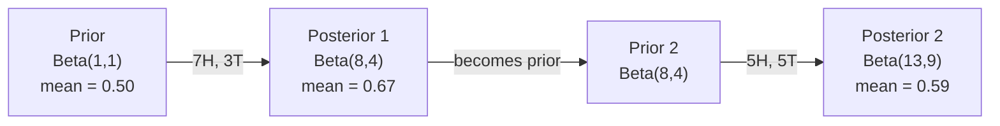

# बेयज़ का प्रमेय

> संभावना के बारे में आप क्या उम्मीद है. बेयज़ का प्रमेय के बारे में आप क्या सीखते हैं.
> 概率 आपकी अपेक्षाओं पर निर्भर करती है 

**Type:** Build | **类型:** 动手
**Language:**पायथन**语言:**पायथन
**Prerequisites:** Phase 1, Lesson 06 (Probability Fundamentals) | **前置知识:** Phase 1, Lesson 06（概率基础）
**Time:** ~75 minutes | **时间:** ~75 分钟

## सीखने के लक्ष्य

- पूर्व, संभावनाओं और साक्ष्य से पिछली संभावनाओं की गणना करने के लिए बेयज़ के प्रमेय का उपयोग करें
- लैपलेस चिकनाई और लॉग-स्पेस गणना के साथ खरोंच से एक भोले बेयस पाठ वर्गीकरण बनाएं
- MLE और MAP अनुमान की तुलना करें और समझाएं कि MAP L2 नियमितता से कैसे मेल खाता है
- ए/बी परीक्षण के लिए बीटा-बाइनोमीअल संयुग्मित पूर्ववर्ती का उपयोग करके अनुक्रमिक बेयसियन अद्यतन लागू करें

> **【中文解读】**
> 贝叶斯定理的核心思想: नए प्रमाणों के साथ अपनी धारणा को अद्यतन करना──先验概率 (आपकी मूल धारणा) × 似然(证据出现的概率) = 后验概率 (पश्चात् अनुमान)──本章还从零构建简单贝叶斯文本分类器──

> **【拓展：贝叶斯在 AI 中的位置】**
> - **朴素贝叶斯分类器**垃圾邮件过的经典算法,sklearn 中文 `GaussianNB`/`MultinomialNB`
> - **贝叶斯优化**: उपयोग के लिए सुपरपरमानुष调优(जैसे ऑप्टुना),比网格搜索高效得多──
> - **MAP 与正则化**: अधिकतम परिणामी अनुमान (MAP) L2 के बराबर है।

## समस्या  समस्या परिचय

> **【中文解读】**एक मेडिकल जांच सटीकता दर 99% है, आप सकारात्मकता का परीक्षण करते हैं, वास्तविक बीमारी की संभावना कितनी है? सीधे शब्दों में कहें 99% है, लेकिन बेयज़ की गणना के साथ केवल 50% संभव है क्योंकि पहले "पहली परीक्षण संभावना" पर विचार करना है।

## अवधारणा का मूल अवधारणा

> **【拓展：贝叶斯思维是 AI 的核心范式】**बेयस निर्णय `P(假设|证据) = P(证据|假设) × P(假设) / P(证据)`में AI में मौजूद नहीं: ((1) **朴素贝叶斯分类器**:垃垃垃邮过的经典方法;(2) **贝叶斯优化**:调超参数的高效方法(比网格搜索快 10 倍);(3) **MAP = L2 正则化**: अधिकतम बाद के अनुमानों में अतिरिक्त L2  दंड के बराबर है, जो बेयिस के दृष्टिकोण से समझाता है कि क्यों सही नियमन को अतिप्रयुक्त किया जा सकता है;**贝叶斯神经网络**:输出不确定性估计,知道"我不知道"──

अधिकांश लोग कहते हैं कि 99%। वास्तविक उत्तर इस बात पर निर्भर करता है कि बीमारी कितनी दुर्लभ है। यदि हर 10,000 में से 1 व्यक्ति में यह है, तो सकारात्मक परिणाम आपको बीमार होने की संभावना केवल 1% देता है। शेष 99% सकारात्मक परिणाम स्वस्थ लोगों से झूठी अलार्म हैं।

> अधिकांश लोग कहते हैं कि 99%। वास्तविक उत्तर रोगों के दुर्लभ होने पर निर्भर करता है। यदि एक लाख में से एक व्यक्ति बीमार है, तो सकारात्मक परिणाम आपको केवल लगभग 1% रोग की संभावना देता है। शेष 99% सकारात्मक परिणाम स्वस्थ व्यक्ति के झूठे सकारात्मक परिणाम हैं।

यह एक चालाक सवाल नहीं है. यह बेयज़ का सिद्धांत है. हर स्पैम फ़िल्टर, हर चिकित्सा निदान, हर मशीन लर्निंग मॉडल जो अनिश्चितता को मात्राबद्ध करता है इस सटीक तर्क का उपयोग करता है. आप एक विश्वास से शुरू करते हैं. आप सबूत देखते हैं. आप अद्यतन करते हैं.

> यह मस्तिष्क का त्वरित परिवर्तन नहीं है। यह बेयिस का सिद्धांत है। प्रत्येक कचरा पत्राचार फ़िल्टर, प्रत्येक चिकित्सा निदान, प्रत्येक अनिश्चितता के एमएल मॉडल का उपयोग एक ही तर्क से किया जाता हैः विश्वास से उत्पन्न होना, साक्ष्य देखना, विश्वास को नया बनाना।

यदि आप इसे समझते हुए ML सिस्टम बनाते हैं, तो आप मॉडल आउटपुट को गलत तरीके से समझेंगे, खराब सीमाएं निर्धारित करेंगे, और अत्यधिक आत्मविश्वास वाली भविष्यवाणियां भेजेंगे।

> यदि आप इस बात को नहीं समझते हैं तो आप एमएल सिस्टम बनाने के बारे में गलत तरीके से मॉडल आउटपुट, सेटअप गलत मूल्य, अत्यधिक आत्मविश्वास पूर्वानुमान जारी करेंगे।

## अवधारणा का मूल अवधारणा

### संयुक्त संभावना से बेयज़ तक

आप पहले से ही पाठ 06 से जानते हैं कि सशर्त संभावना हैः

> आप कक्षा 06 में स्थिति की संभावनाओं को सीख चुके हैंः

```
P(A|B) = P(A and B) / P(B)
```

और सममित रूप सेः

```
P(B|A) = P(A and B) / P(A)
```

दोनों अभिव्यक्ति एक ही संख्यात्मक साझा करते हैंः P(A और B। उन्हें बराबर सेट करें और पुनर्गठन करेंः

>  दो अभिव्यक्ति साझा एक ही अणुःP(A और B)── इन्हें समान एवं पुनः क्रमबद्ध करेंगे:

```
P(A and B) = P(A|B) * P(B) = P(B|A) * P(A)

Therefore:

P(A|B) = P(B|A) * P(A) / P(B)
```

यह बेयज़ का प्रमेय है चार मात्राओं, एक समीकरण।

> यही बेयलेस का सिद्धांत है।

### चार भागों

| Part | Name | What it means |
|------|------|---------------|
| P(A\|B) | Posterior / 后验 | Your updated belief about A after seeing evidence B / 看到证据 B 后对 A 的更新信念 |
| P(B\|A) | Likelihood / 似然 | How probable the evidence B is if A is true / 如果 A 为真，证据 B 出现的概率 |
| P(A) | Prior / 先验 | Your belief about A before seeing any evidence / 看到任何证据前对 A 的信念 |
| P(B) | Evidence / 证据 | Total probability of seeing B under all possibilities / 在所有可能情况下看到 B 的总概率 |

साक्ष्य शब्द P(B) एक सामान्यीकरण के रूप में कार्य करता है. आप कुल संभावना के कानून का उपयोग करके इसे बढ़ा सकते हैंः

> 证据项 P(B) 作为归一化因子──全概率公式展开:

```
P(B) = P(B|A) * P(A) + P(B|not A) * P(not A)
```

### चिकित्सा परीक्षण का उदाहरण

एक बीमारी 10,000 में से 1 व्यक्ति को प्रभावित करती है। परीक्षण 99% सटीक है (बीमार लोगों का 99% पकड़ता है, समय के 1% में झूठे सकारात्मकता देता है) ।

> एक प्रकार की बीमारी से प्रभावित होने वाले एक लाख लोगों में से एक। 99% की सटीकता का पता लगाया जा सकता है।

```
P(sick)          = 0.0001     (prior: disease is rare)
P(positive|sick) = 0.99       (likelihood: test catches it)
P(positive|healthy) = 0.01    (false positive rate)

P(positive) = P(positive|sick) * P(sick) + P(positive|healthy) * P(healthy)
            = 0.99 * 0.0001 + 0.01 * 0.9999
            = 0.000099 + 0.009999
            = 0.010098

P(sick|positive) = P(positive|sick) * P(sick) / P(positive)
                 = 0.99 * 0.0001 / 0.010098
                 = 0.0098
                 = 0.98%
```

एक बार जब कोई बीमारी होती है तो सटीक परीक्षण भी अक्सर झूठे सकारात्मक परिणाम देते हैं यही कारण है कि डॉक्टर पुष्टि परीक्षणों का आदेश देते हैं।

> 1.1% तक नहीं। पहले परीक्षण की संभावना अधिक होती है। जब बीमारी दुर्लभ होती है, तो सटीक परीक्षण भी मुख्य रूप से झूठी सकारात्मकता पैदा करता है।

### स्पैम फ़िल्टर उदाहरण

आपको एक ईमेल मिलता है जिसमें "लॉटरी" शब्द होता है। क्या यह स्पैम है?

> आपको एक मेल मिला जिसमें "लॉटरी" शामिल है।

```
P(spam)                = 0.3      (30% of email is spam)
P("lottery"|spam)      = 0.05     (5% of spam emails contain "lottery")
P("lottery"|not spam)  = 0.001    (0.1% of legitimate emails contain "lottery")

P("lottery") = 0.05 * 0.3 + 0.001 * 0.7
             = 0.015 + 0.0007
             = 0.0157

P(spam|"lottery") = 0.05 * 0.3 / 0.0157
                  = 0.955
                  = 95.5%
```

एक शब्द 30% से 95.5% तक संभावना को स्थानांतरित करता है। एक वास्तविक स्पैम फ़िल्टर एक साथ सैकड़ों शब्दों पर बेयज़ लागू करता है।

> एक शब्द की संभावना 30% से 95.5% तक होगी।

### साफ़ बेयसः स्वतंत्रता की धारणा

Naive Bayes यह वर्ग को देखते हुए सभी सुविधाओं को सशर्त रूप से स्वतंत्र मानते हुए कई विशेषताओं तक विस्तारित करता हैः

> साधारण रूप से यह कई विशेषताओं में विस्तारित होगा, मान लीजिए कि सभी विशेषताओं को किसी दिए गए वर्ग की शर्तों के तहत एक दूसरे से स्वतंत्र किया जाएगाः

```
P(class | feature_1, feature_2, ..., feature_n)
  = P(class) * P(feature_1|class) * P(feature_2|class) * ... * P(feature_n|class)
    / P(feature_1, feature_2, ..., feature_n)
```

"नाईव" हिस्सा स्वतंत्रता परिकल्पना है। पाठ में, शब्द घटनाएं स्वतंत्र नहीं हैं ("नई" और "यॉर्क" संबद्ध हैं) लेकिन यह परिकल्पना अभ्यास में आश्चर्यजनक रूप से अच्छी तरह से काम करती है क्योंकि वर्गीकरणकर्ता को केवल वर्गों को रैंक करने की आवश्यकता है, न कि कैलिब्रेटेड संभावनाओं का उत्पादन करना है।

> "पॉर्पल" भाग एक स्वतंत्र धारणा है। लेख में, शब्द का उद्भव स्वतंत्र नहीं है। "नया" और "यॉर्क" संबंधित हैं।

चूंकि सभी वर्गों के लिए नामक एक ही है, आप इसे छोड़ सकते हैं और बस संख्याओं की तुलना कर सकते हैंः

> चूंकि分母 सभी वर्गों के लिए समान है, इसलिए केवल अणुओं की तुलना करके इसे पार किया जा सकता हैः

```
score(class) = P(class) * product of P(feature_i | class)
```

उच्चतम स्कोर वाला वर्ग चुनें।

> 选择得分最高的类别──

### अधिकतम संभावना अनुमान (MLE)

प्रशिक्षण डेटा से आप P  विशेषताएं (Figure) कैसे प्राप्त करते हैं?

> 如何从训练数据中获取P 特征类的?

```
P("free"|spam) = (number of spam emails containing "free") / (total spam emails)
```

यह MLE है: उन पैरामीटर मानों का चयन करें जो अवलोकन किए गए डेटा को सबसे अधिक संभावना बनाते हैं। आप संभावना फ़ंक्शन को अधिकतम कर रहे हैं, जो डिस्क्रिट गिनती के लिए सापेक्ष आवृत्ति में कम हो जाता है।

> यही MLE है: चयन करें कि अवलोकन डेटा सबसे संभावित रूप से उत्पन्न होने वाले पैरामीटर मूल्य हो।

समस्याः यदि एक शब्द प्रशिक्षण के दौरान स्पैम में कभी नहीं दिखाई देता है, तो MLE उसे शून्य संभावना देता है। एक अदृश्य शब्द पूरे उत्पाद को मार देता है। इसे लैपलेस चिकनाई के साथ ठीक करेंः

> 问题: यदि प्रशिक्षण के दौरान एक शब्द कभी भी कचरे में नहीं आया है, तो MLE 给它概率零――一个未见的词就会摧毁整个乘积――

```
P(word|class) = (count(word, class) + 1) / (total_words_in_class + vocabulary_size)
```

प्रत्येक गणना में 1 जोड़ने से कोई संभावना कभी शून्य नहीं होती है।

>  प्रत्येक गणना + 1  सुनिश्चित करें कि संभावना कभी शून्य नहीं होगी 

### अधिकतम एक बाद में (MAP)

MLE पूछता हैः कौन से पैरामीटर P\ डेटा पैरामीटर को अधिकतम करते हैं?

> MLE 问: क्या参数使P(डेटा पैरामीटर में) अधिकतम?

MAP पूछता हैः P  पैरामीटर डेटा में अधिकतम कौन से पैरामीटर हैं?

> MAP 问: क्या参数使 P  पैरामीटर डेटा में) अधिकतम?

बेयज़ के प्रमेय द्वाराः

> बेयज़ के सिद्धांत के अनुसारः

```
P(parameters|data) proportional to P(data|parameters) * P(parameters)
```

MAP स्वयं मापदंडों पर एक पूर्ववर्ती जोड़ता है। यदि आपको लगता है कि मापदंड छोटे होने चाहिए, तो आप इसे एक पूर्ववर्ती के रूप में एन्कोड करते हैं जो बड़े मानों को दंडित करता है। यह एमएल में एल 2 नियमितकरण के समान है। रिग रेग्रिशन में "रिज" दंड सचमुच भार पर गौशियन पूर्ववर्ती है।

> MAP में तत्वों पर एक पूर्व प्रयोग जोड़ा गया है। यदि आप मानते हैं कि तत्वों को छोटा होना चाहिए, तो पूर्व प्रयोग दंडात्मक मूल्य का उपयोग करें। यह एमएल में एल 2 के साथ पूरी तरह से बराबर मूल्य है।

| Estimation | Optimizes | ML equivalent |
|------------|-----------|---------------|
| MLE | P(data\|params) | Unregularized training / 无正则化训练 |
| MAP | P(data\|params) * P(params) | L2 / L1 regularization / L2/L1 正则化 |

### बेयिसियन बनाम फ्रिक्वेन्टिस्टः व्यावहारिक अंतर

अक्सरता के वैज्ञानिक पैरामीटर को अपरिचित के रूप में देखते हैं। वे पूछते हैं, "अगर मैं इस प्रयोग को कई बार दोहराता तो क्या होता?"

> 频率学派将参数视为固定的未知量――他们问:"यदि मैं इस प्रयोग को कई बार दोहराऊं, तो क्या होगा? "

बेयिसियन पैरामीटर को वितरण के रूप में देखते हैं। वे पूछते हैं, "मैंने जो देखा है, उसके आधार पर मैं पैरामीटर के बारे में क्या मानता हूं?"

> वे पूछते हैंः "मेरे द्वारा देखे जाने के अनुसार, मैं तत्वों के प्रति क्या विश्वास करता हूं?

एमएल प्रणालियों के निर्माण के लिए, व्यावहारिक अंतरः

>  निर्माण के लिए एमएल  प्रणाली, वास्तविक अंतर इस प्रकार हैः

| Aspect | Frequentist | Bayesian |
|--------|-------------|----------|
| Output | Point estimate / 点估计 | Distribution over values / 值的分布 |
| Uncertainty | Confidence intervals (about procedure) / 置信区间（关于过程） | Credible intervals (about parameter) / 可信区间（关于参数） |
| Small data | Can overfit / 可能过拟合 | Prior acts as regularization / 先验充当正则化 |
| Computation | Usually faster / 通常更快 | Often requires sampling (MCMC) / 通常需要采样（MCMC） |

अधिकांश उत्पादन एमएल आवृत्तिवादी है (एसजीडी, बिंदु अनुमान) बेयिसियन तरीकों चमक जब आप एक माप अनिश्चितता (चिकित्सा निर्णय, सुरक्षा-महत्वपूर्ण प्रणालियों) की जरूरत है या जब डेटा दुर्लभ है (कुछ शॉट सीखने, ठंड शुरू) ।

> अधिकांश उत्पादन एमएल है आवृत्ति के लिए स्कूल के लिए (SGD 点估计) ⋅ जब आप आवश्यकता है कालीकृत अनिश्चितता ⋅ चिकित्सा निर्णय ⋅ सुरक्षा महत्वपूर्ण प्रणाली) या डेटा दुर्लभ है जब ⋅ कम नमूना सीखने ⋅ ठंडे प्रारंभ), बेयिस विधि प्रदर्शन प्रदर्शन करें ⋅

### एमएल के लिए बेयसियन सोच महत्वपूर्ण क्यों है

यह संबंध समानता से भी गहरा हैः

> इस प्रकार के संपर्क से अधिक गहराः

**Priors are regularization.**भार पर गौसीयन पूर्वक्रम L2 नियमितता है। लैपलेस पूर्वक्रम L1 है। जब भी आप एक नियमितता शब्द जोड़ते हैं, तो आप एक बेयसीयन कथन बना रहे हैं कि आप किन पैरामीटर मानों की उम्मीद करते हैं।

> **先验就是正则化。**भार भार पर उच्चतम पूर्वानुमान L2 औचित्य है, लाप्रास पूर्वानुमान L1 है। प्रत्येक बार आप औचित्य जोड़ते हैं, तो यह एक पैरामीटर के अपेक्षित मूल्य के बारे में एक बेयिस कथन में है।

**Posteriors are uncertainty.**एक ही भविष्यवाणी की गई संभावना आपको बताती है कि मॉडल उस अनुमान में कितना आश्वस्त है। बेयिसियन विधियों आपको एक वितरण देती हैः "मुझे लगता है कि P(स्पैम) 0.8 से 0.95 के बीच है।"

> **后验就是不确定性。**单个预测概率不能告诉你模型对这个估计有多少信心――贝叶斯方法给你一个分布:"我认为P(स्पैम) 0.8 से 0.95 之间――"

**Bayes updates are online learning.**आज का पीछे का हिस्सा कल का पूर्व बन जाता है जब आपका मॉडल नए डेटा देखता है, तो यह स्क्रैच से पुनः प्रशिक्षण के बजाय अपने विश्वासों को क्रमिक रूप से अपडेट करता है।

> **贝叶斯更新就是在线学习。**आज का अनुभव कल का अनुभव बन जाता है। जब मॉडल नए डेटा को देखता है, तो यह विश्वास को नए सिरे से प्रशिक्षित करने के बजाय, विश्वास को बढ़ाता है।

**Model comparison is Bayesian.**बेयिस सूचना मानदंड (बीआईसी), मार्जिनल प्रॉबलिटी और बेयिस कारक सभी बेयिस तर्क का उपयोग बिना ओवरफिटिंग के मॉडल के बीच चयन करने के लिए करते हैं।

> **模型比较是贝叶斯的。**贝叶斯信息准则 (BIC) 边际似然和贝叶斯因子 सभी मॉडल के बीच चयन करने के लिए बे叶斯推理 का उपयोग करते हैं और इसके परिणामस्वरूप अति अनुकूलन नहीं होता है।

## इसे बनाओ, इसे पूरा करो।
```figure
bayes-update
```

## इसे बनाओ

### चरण 1: बेयज़ प्रमेय फ़ंक्शन

```python
def bayes(prior, likelihood, false_positive_rate):
    evidence = likelihood * prior + false_positive_rate * (1 - prior)
    posterior = likelihood * prior / evidence
    return posterior

result = bayes(prior=0.0001, likelihood=0.99, false_positive_rate=0.01)
print(f"P(sick|positive) = {result:.4f}")
```

### चरण 2: साफ़ बेयिस वर्गीकरण

```python
import math
from collections import defaultdict

class NaiveBayes:
    def __init__(self, smoothing=1.0):
        self.smoothing = smoothing
        self.class_counts = defaultdict(int)
        self.word_counts = defaultdict(lambda: defaultdict(int))
        self.class_word_totals = defaultdict(int)
        self.vocab = set()

    def train(self, documents, labels):
        for doc, label in zip(documents, labels):
            self.class_counts[label] += 1
            words = doc.lower().split()
            for word in words:
                self.word_counts[label][word] += 1
                self.class_word_totals[label] += 1
                self.vocab.add(word)

    def predict(self, document):
        words = document.lower().split()
        total_docs = sum(self.class_counts.values())
        vocab_size = len(self.vocab)
        best_class = None
        best_score = float("-inf")
        for cls in self.class_counts:
            score = math.log(self.class_counts[cls] / total_docs)
            for word in words:
                count = self.word_counts[cls].get(word, 0)
                total = self.class_word_totals[cls]
                score += math.log((count + self.smoothing) / (total + self.smoothing * vocab_size))
            if score > best_score:
                best_score = score
                best_class = cls
        return best_class
```

लॉग-प्रोबेबिलिटीज अंडरफ्लो को रोकती हैं। कई छोटी संभावनाओं को गुणा करने से फ्लोटिंग प्वाइंट के लिए संख्याएं बहुत छोटी होती हैं। लॉग-प्रोबेबिलिटीज को योग करना संख्यात्मक रूप से स्थिर और गणितीय रूप से समतुल्य है।

> संख्यात्मक संभावनाओं के लिए बहुत कम संख्याएं उत्पन्न होती हैं।

### चरण 3: स्पैम डेटा पर प्रशिक्षण

```python
train_docs = [
    "win free money now",
    "free lottery ticket winner",
    "claim your prize today free",
    "urgent offer free cash",
    "congratulations you won free",
    "meeting tomorrow at noon",
    "project update attached",
    "can we schedule a call",
    "quarterly report review",
    "lunch on thursday sounds good",
    "team standup notes attached",
    "please review the pull request",
]

train_labels = [
    "spam", "spam", "spam", "spam", "spam",
    "ham", "ham", "ham", "ham", "ham", "ham", "ham",
]

classifier = NaiveBayes()
classifier.train(train_docs, train_labels)

test_messages = [
    "free money waiting for you",
    "meeting rescheduled to friday",
    "you won a free prize",
    "please review the attached report",
]

for msg in test_messages:
    print(f"  '{msg}' -> {classifier.predict(msg)}")
```

### चरण 4: सीखी गई संभावनाओं की जांच करें

```python
def show_top_words(classifier, cls, n=5):
    vocab_size = len(classifier.vocab)
    total = classifier.class_word_totals[cls]
    probs = {}
    for word in classifier.vocab:
        count = classifier.word_counts[cls].get(word, 0)
        probs[word] = (count + classifier.smoothing) / (total + classifier.smoothing * vocab_size)
    sorted_words = sorted(probs.items(), key=lambda x: x[1], reverse=True)
    for word, prob in sorted_words[:n]:
        print(f"    {word}: {prob:.4f}")

print("\nTop spam words:")
show_top_words(classifier, "spam")
print("\nTop ham words:")
show_top_words(classifier, "ham")
```

## इसे फ्रेमवर्क के साथ लागू करें

स्किट-लर्न जहाज उत्पादन के लिए तैयार भोले बेयज़ कार्यान्वयनः

> स्किट-लर्न ने उत्पादन तैयार करने के लिए सरल तरीके प्रदान किएः

```python
from sklearn.feature_extraction.text import CountVectorizer
from sklearn.naive_bayes import MultinomialNB
from sklearn.metrics import classification_report

vectorizer = CountVectorizer()
X_train = vectorizer.fit_transform(train_docs)
clf = MultinomialNB()
clf.fit(X_train, train_labels)

X_test = vectorizer.transform(test_messages)
predictions = clf.predict(X_test)
for msg, pred in zip(test_messages, predictions):
    print(f"  '{msg}' -> {pred}")
```

एक ही एल्गोरिथ्म. CountVectorizer टोकनाइजेशन और शब्दावली निर्माण को संभालता है. MultinomialNB आंतरिक रूप से चिकनाई और लॉग-संभाव्यता को संभालता है. आपके खरोंच संस्करण 40 पंक्तियों में एक ही बात करता है।

> उसी तरह के एल्गोरिदम──CountVectorizer 处理分词和词汇构建,MultinomialNB 内部处理平滑和对数概率──आपके शून्य संस्करण से 40 行 के साथ ऐसा ही किया गया है──

## इसे भेजें उत्पाद

यहाँ निर्मित NaiveBayes वर्ग पूरी पाइपलाइन का प्रदर्शन करता हैः टोकनकरण, लैपलेस चिकनाई के साथ संभावना अनुमान, लॉग-स्पेस भविष्यवाणी।`code/bayes.py`पायथन के मानक पुस्तकालय से परे कोई निर्भरता के साथ अंत-से-अंत चलाता है।

> यहाँ निर्मित NaiveBayes वर्ग ने पूर्ण प्रक्रम प्रस्तुत किया हैः分词、带拉普拉斯平滑的概率估计、对数空间预测──`code/bayes.py`मध्य कोड को अंत से अंत तक चलाने के लिए, कोई पायथन 标准库 के बाहर निर्भरता की आवश्यकता नहीं है

### पूर्ववर्ती विवाह

जब पूर्व और पश्च में वितरण के एक ही परिवार से संबंधित हैं, पूर्व को "संयुक्त" कहा जाता है. यह बेयिसियन अद्यतन बीजगणित साफ बनाता है - आप संख्यात्मक एकीकरण के बिना एक बंद-रूप के पश्च प्राप्त करते हैं.

> जब पूर्व प्रयोग और बाद प्रयोग एक ही वितरण वर्ग में आते हैं, तो पूर्व प्रयोग को "सामूहिक" कहा जाता है। यह इस प्रकार से है कि बीजगणित में अद्यतन बहुत सरल है।

| Likelihood | Conjugate Prior | Posterior | Example |
|-----------|----------------|-----------|---------|
| Bernoulli | Beta(a, b) | Beta(a + successes, b + failures) | Coin flip bias estimation / 抛硬币偏差估计 |
| Normal (known variance) | Normal(mu_0, sigma_0) | Normal(weighted mean, smaller variance) | Sensor calibration / 传感器校准 |
| Poisson | Gamma(a, b) | Gamma(a + sum of counts, b + n) | Modeling arrival rates / 建模到达率 |
| Multinomial | Dirichlet(alpha) | Dirichlet(alpha + counts) | Topic modeling, language models / 主题建模，语言模型 |

यह महत्वपूर्ण क्यों हैः बिना संयुग्मित पूर्व के, आप मोन्टे कार्लो नमूना या भिन्नता inference के पीछे के करीब करने की जरूरत है. संयुग्मित पूर्व के साथ, आप सिर्फ दो संख्याओं को अद्यतन.

> यह महत्वपूर्ण क्यों हैः कोई आम अनुभव नहीं है, आपको दो अंकों को अपडेट करने की आवश्यकता है।

बीटा वितरण व्यवहार में सबसे आम संयुग्मित पूर्व है। बीटा ((a, b) एक संभावना पैरामीटर के बारे में आपके विश्वास को दर्शाता है। औसत a/(a+b है। जितना बड़ा a+b, उतना अधिक केंद्रित (आत्मविश्वासपूर्ण) वितरण।

> बीटा 分布 ⇒ अभ्यास में सबसे आम प्रयोग में साम्य  अग्र प्रयोग ⇒ बीटा , बी) आप एक संभावना के तत्व के प्रति विश्वास ⇒ औसत मूल्य ⇒ ए/  + बी ⇒ ए+ बी 越大,分布越集中 ⇒ आत्मविश्वास ⇒ बीटा , बीटा , बीटा , बीटा , बीटा , बीटा , बीटा , बीटा , बीटा , बीटा , बीटा , बीटा , बीटा , बीटा , बीटा , बीटा , बीटा , बीटा , बीटा , बीटा , बीटा , बीटा , बीटा , बीटा , बीटा , बीटा , बीटा , बीटा , बीटा , बीटा , बीटा , बीटा , बीटा , बीटा , बीटा , बीटा , बीटा , बीटा , बीटा , बीटा , बीटा , बीटा , बीटा , बीटा , बीटा , बीटा , बीटा , बीटा , बीटा , बीटा , बीटा                                                                                                 

बीटा पूर्व के विशेष मामलेः
- बीटा ((1, 1) = वर्दी. आप पैरामीटर के बारे में कोई राय नहीं है.
  中文翻译:均分布,你对参数没有任何看法──
- बीटा ((10, 10) = 0.5 पर पीक। आप दृढ़ता से मानता है कि पैरामीटर 0.5 के करीब है।
  中文翻译: 0.5 处尖峰 में, आप दृढ़ता से मानते हैं कि तत्व 0.5  निकट है।
- बीटा ((1, 10) = 0 की ओर झुका हुआ है. आप मानते हैं कि पैरामीटर छोटा है.
  中文翻译:偏向0,你认为参数很小──

अद्यतन नियम बहुत सरल हैः

> 更新规则极其简单:

```
Prior:     Beta(a, b)
Data:      s successes, f failures
Posterior: Beta(a + s, b + f)
```

कोई पूर्णांक नहीं, कोई नमूना नहीं, बस जोड़।

> 无需积分,无需采样,只需加法──

### क्रमशः बेयिसियन अद्यतन

बेयसियन निष्कर्ष स्वाभाविक रूप से अनुक्रमिक है। आज का पीछे का कल का पूर्व बन जाता है। यह वास्तविक प्रणालियों को सभी ऐतिहासिक डेटा को पुनः संसाधित किए बिना क्रमिक रूप से सीखता है।

> बेयिस का तर्क है कि प्राकृतिक है क्रमशः। आज का अनुभव कल का अनुभव बन जाता है। यह है कि वास्तविक प्रणाली सभी ऐतिहासिक डेटा को पुनः प्रसंस्करण किए बिना कैसे वृद्धि सीखती है।

एक ठोस उदाहरण: यह अनुमान लगाना कि क्या एक सिक्का निष्पक्ष है।

> 具体例: अनुमानित करें कि एक सिक्का निष्पक्ष है या नहीं।

**Day 1: No data yet.**
बेटा से शुरू करें 1, 1) -- एक समान पूर्व. आप कोई राय नहीं है.
- पूर्व औसतः 0.5
- पूर्व की चौड़ाई [0, 1]

> **第 1 天：还没有数据。**से Beta(1, 1) 开始均先验,你没有预设观点──

**Day 2: Observe 7 heads, 3 tails.**
पछाड़ = बीटा(1 + 7, 1 + 3) = बीटा(8, 4)
- बाद का औसतः 8/12 = 0.667
- सबूत बताते हैं कि सिक्का सिर की ओर झुका हुआ है

> **第 2 天：观察到 7 次正面，3 次反面。**后验 = बीटा ((8, 4), औसत मूल्य 0.667, साक्ष्य इंगित करें कि सिक्का सही दिशा में है।

**Day 3: Observe 5 more heads, 5 more tails.**
कल के पीछे का उपयोग आज के पूर्व के रूप में करें।
पछाड़ = बीटा ((8 + 5, 4 + 5) = बीटा ((13, 9)
- बाद का औसतः 13/22 = 0.591
- संतुलित नए आंकड़ों ने अनुमान को 0.5 की ओर वापस खींच लिया

> **第 3 天：又观察 5 次正面，5 次反面。**आज के पूर्व प्रयोगों के रूप में कल के बाद प्रयोग करें।



अवलोकनों का क्रम मायने नहीं रखता है। बीटा(1,1) एक ही समय में सभी 12 सिरों और 8 पूंछों के साथ अपडेट किया गया बीटा(13, 9) - एक ही परिणाम देता है। अनुक्रमिक अद्यतन और बैच अद्यतन गणितीय रूप से समकक्ष हैं। लेकिन अनुक्रमिक अद्यतन आपको कच्चे डेटा को संग्रहीत किए बिना प्रत्येक चरण में निर्णय लेने की अनुमति देता है।

> 观测序无关紧要──Beta(1,1) एक बार उपयोग सभी 12 बार正面和 8 बार反面更新得到Beta(13, 9) समान परिणाम──序贯更新和批量更新在数学上等价──但序贯更新让你在每步做决定而无需存储原始数据──

यह उत्पादन एमएल सिस्टम में ऑनलाइन सीखने की नींव है। डाकू के लिए थॉम्पसन नमूनाकरण, वृद्धिशील सिफारिश प्रणाली और स्ट्रीमिंग विसंगति डिटेक्टर सभी इस पैटर्न का उपयोग करते हैं।

> यह उत्पादन ML system में ऑनलाइन सीखने का आधार है।

### ए/बी परीक्षण से संबंध

ए/बी परीक्षण बेयिसियन निष्कर्ष है।

> ए/बी 测试就是伪装的贝叶斯推──

सेटअपः आप दो बटन रंगों का परीक्षण कर रहे हैं। वेरिएंट ए (नीला) और वेरिएंट बी (हरे) । आप जानना चाहते हैं कि इनमें से किस पर अधिक क्लिक होते हैं।

> 设置:你在测试两种按颜色──变体 A(蓝色) 和变体 B(绿色)──你想知道哪个得到更多点击──

बेयिसियन ए/बी परीक्षणः

> 贝叶斯 ए/बी 测试步骤:

1. **Prior.**दोनों संस्करणों के लिए बीटा 1 से शुरू करें। कोई पूर्व प्राथमिकता नहीं।
2. **Data.**वेरिएंट ए: 1000 विचारों में से 50 क्लिक। वेरिएंट बी: 1000 विचारों में से 65 क्लिक।
3. **Posteriors.**
   - एः बीटा ((1 + 50, 1 + 950) = बीटा ((51, 951) । औसत = 0.051
   - बीः बीटा ((1 + 65, 1 + 935) = बीटा ((66, 936). औसत = 0.066
4. **Decision.**गणना P ((B > A) - संभावना है कि B की वास्तविक रूपांतरण दर A की तुलना में अधिक है।

विश्लेषणात्मक रूप से P (B) > A (A) का गणना करना कठिन है, लेकिन मोन्टे कार्लो इसे तुच्छ बनाता हैः

> 解析计算 P(B > A) 很难──但蒙特卡洛让这变得轻松而易举:

```
1. Draw 100,000 samples from Beta(51, 951)  -> samples_A
2. Draw 100,000 samples from Beta(66, 936)  -> samples_B
3. P(B > A) = fraction of samples where B > A
```

यदि P(B > A) > 0.95, आप संस्करण B भेजते हैं। यदि यह 0.05 से 0.95 के बीच है, तो आप डेटा एकत्र करना जारी रखते हैं। यदि P(B > A) < 0.05, आप संस्करण A भेजते हैं।

> यदि P(B > A) > 0.95, जारी करें परिवर्तन B── यदि 0.05 और 0.95  के बीच, डेटा एकत्र करना जारी रखें── यदि P(B > A) < 0.05, जारी करें परिवर्तन A──

आवृत्ति ए/बी परीक्षणों के मुकाबले लाभः
- आप एक प्रत्यक्ष संभावना कथन प्राप्त करते हैंः "एक 97% संभावना है कि बी बेहतर है"
  चीनी अनुवादःआप एक प्रत्यक्ष संभावना प्राप्त करते हैं बयानः "बी बेहतर संभावना 97% है"
- कोई p-मूल्य भ्रम नहीं, कोई "नल परिकल्पना को अस्वीकार करने में विफलता" हेजिंग नहीं।
  चीनी अनुवादः कोई p 值 के混, कोई "未能拒绝零假设" के含糊措辞
- आप किसी भी समय झूठी सकारात्मक दरों को बढ़ाए बिना परिणामों की जांच कर सकते हैं (कोई "खोजने की समस्या" नहीं)
  चीनी अनुवादः आप किसी भी समय परिणाम देख सकते हैं और बिना झूठी सकारात्मकता दर में वृद्धि नहीं करते हैं।
- आप पूर्व ज्ञान को शामिल कर सकते हैं (उदाहरण के लिए, पिछले परीक्षणों से पता चलता है कि रूपांतरण दरें आमतौर पर 3-8%)
  चीनी अनुवादः आप पहले ज्ञान में शामिल हो सकते हैं। उदाहरण के लिए, पहले परीक्षणों में रूपांतरण दर आमतौर पर 3-8 प्रतिशत है।

| Aspect | Frequentist A/B | Bayesian A/B |
|--------|----------------|--------------|
| Output | p-value / p 值 | P(B > A) |
| Interpretation | "How surprising is this data if A=B?" / "如果 A=B，数据有多令人惊讶？" | "How likely is B better than A?" / "B 比 A 好的可能性有多大？" |
| Early stopping | Inflates false positives / 会增加假阳性 | Safe at any point (given a well-chosen prior and correctly specified model) / 随时安全（假设先验选择合理且模型正确） |
| Prior knowledge | Not used / 不使用 | Encoded as Beta prior / 编码为 Beta 先验 |
| Decision rule | p < 0.05 | P(B > A) > threshold / P(B > A) > 阈值 |

## अभ्यास विषय

1. **Multiple tests.**एक रोगी स्वतंत्र परीक्षणों पर दो बार सकारात्मक परीक्षण करता है (दोनों 99% सटीक, बीमारी की प्रवृत्ति 1 में 10,000) । दोनों परीक्षणों के बाद पी(मार) क्या है? पहले परीक्षण से पिछली को दूसरे के लिए पूर्व के रूप में उपयोग करें।

2. **Smoothing impact.**स्पाम वर्गीकरणकर्ता को 0.01, 0.1, 1.0 और 10.0 के स्लाइडिंग मानों के साथ चलाएं। शीर्ष शब्द संभावनाएं कैसे बदलती हैं? स्लाइडिंग=0 और एक शब्द के साथ क्या होता है जो केवल शिन में दिखाई देता है?

3. **Add features.**NaiveBayes वर्ग का विस्तार करें ताकि संदेश लंबाई (लघु / लंबा) को शब्द गणना के साथ एक सुविधा के रूप में भी उपयोग किया जा सके। प्रशिक्षण डेटा से P(short mefspam) और P(shortff) का अनुमान लगाएं और इसे भविष्यवाणी स्कोर में फोल्ड करें।

4. **MAP by hand.**अवलोकन किए गए आंकड़ों को देखते हुए (7 सिक्के में 10 सिर) पूर्ववर्ती बीटा ((2,2) का उपयोग करके पूर्वाग्रह के MAP अनुमान की गणना करें। इसे MLE अनुमान (7/10) के साथ तुलना करें।

## कीवर्ड्स  शब्द खोज तालिका

| Term | What people say | What it actually means |
|------|----------------|----------------------|
| Prior | "My initial guess" / "我的初始猜测" | P(hypothesis) before observing evidence. In ML: the regularization term. / 观测证据前的 P(hypothesis)。在 ML 中：正则化项。 |
| Likelihood | "How well the data fits" / "数据拟合得好不好" | P(evidence\|hypothesis). How probable the observed data is under a specific hypothesis. / 在特定假设下观测数据的概率。 |
| Posterior | "My updated belief" / "我的更新信念" | P(hypothesis\|evidence). The prior multiplied by the likelihood, then normalized. / 先验乘以似然再归一化。 |
| Evidence | "The normalizing constant" / "归一化常数" | P(data) across all hypotheses. Ensures the posterior sums to 1. / 所有假设下 P(data) 的总和，确保后验求和为 1。 |
| Naive Bayes | "That simple text classifier" / "那个简单的文本分类器" | A classifier that assumes features are independent given the class. Works well despite the false assumption. / 假设特征在给定类别下独立的分类器，尽管假设不成立但效果很好。 |
| Laplace smoothing | "Add-one smoothing" / "加一平滑" | Adding a small count to every feature to prevent zero probabilities from unseen data. / 给每个特征加一个小计数以防止未见数据的零概率。 |
| MLE | "Just use the frequencies" / "直接用频率" | Choose parameters that maximize P(data\|parameters). No prior. Can overfit with small data. / 选择使 P(data\|parameters) 最大的参数。无先验，小数据可能过拟合。 |
| MAP | "MLE with a prior" / "带先验的 MLE" | Choose parameters that maximize P(data\|parameters) * P(parameters). Equivalent to regularized MLE. / 选择使 P(data\|parameters) * P(parameters) 最大的参数，等价于正则化 MLE。 |
| Log-probability | "Work in log space" / "在对数空间计算" | Using log(P) instead of P to avoid floating-point underflow when multiplying many small numbers. / 用 log(P) 代替 P，避免许多小数相乘时的浮点下溢。 |
| False positive | "A wrong alarm" / "错误警报" | The test says positive, but the true state is negative. Drives the base rate fallacy. / 检测为阳性但实际为阴性，是基本比率谬误的根源。 |

## आगे पढ़ना 延伸閱讀

- [3Blue1Brown: Bayes' theorem](https://www.youtube.com/watch?v=HZGCoVF3YvM)- चिकित्सा परीक्षण के उदाहरण के साथ दृश्य स्पष्टीकरण
- [Stanford CS229: Generative Learning Algorithms](https://cs229.stanford.edu/notes2022fall/cs229-notes2.pdf)- बेयज़ की साफ़ता और भेदभावपूर्ण मॉडल से उसका संबंध
- [Think Bayes](https://greenteapress.com/wp/think-bayes/)- मुक्त पुस्तक, पायथन कोड के साथ बेयसियन सांख्यिकी
- [scikit-learn Naive Bayes](https://scikit-learn.org/stable/modules/naive_bayes.html)- उत्पादन के कार्यान्वयन और प्रत्येक संस्करण का उपयोग कब किया जाना चाहिए
