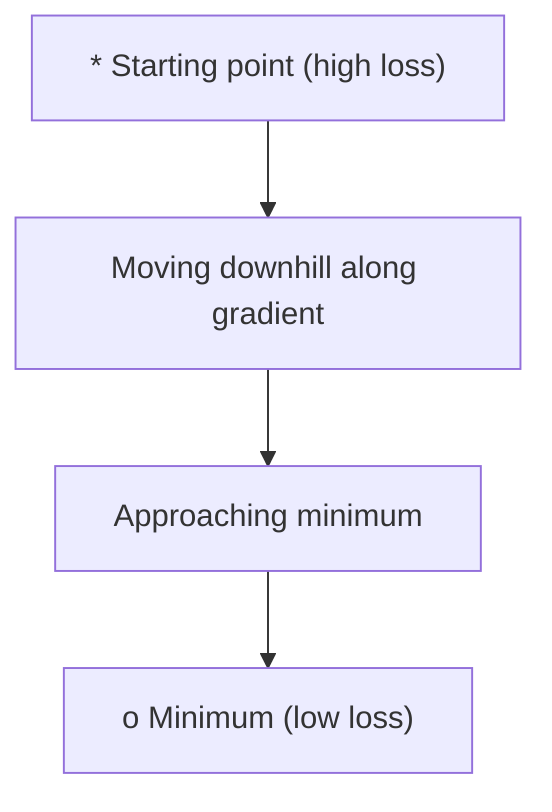
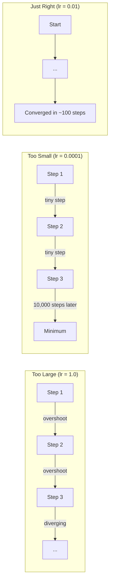
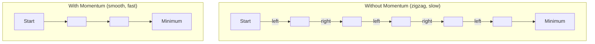
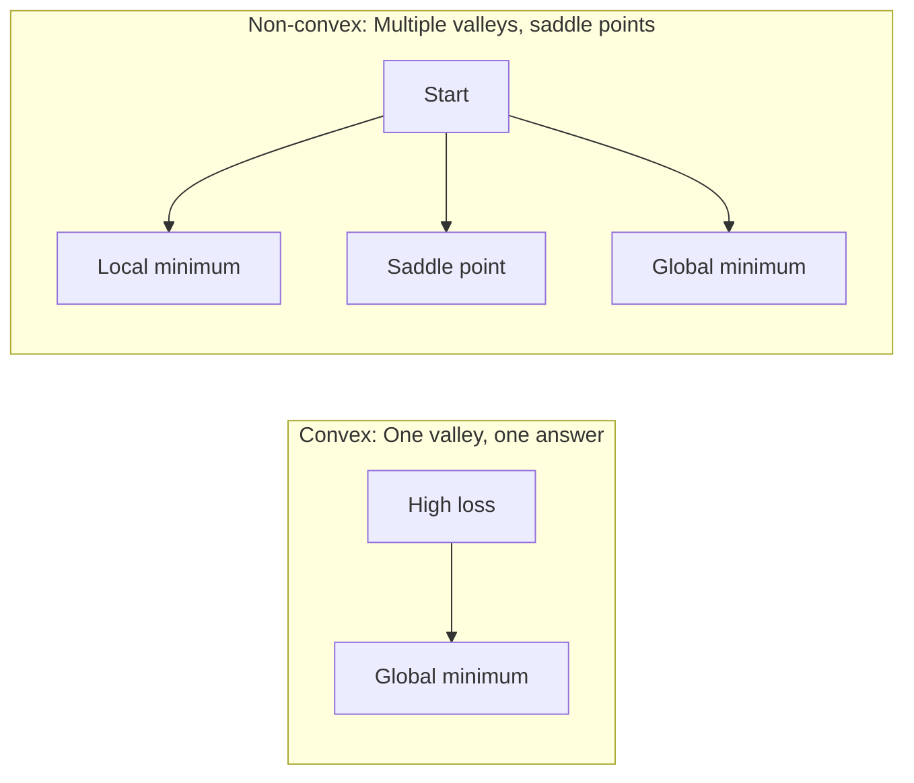
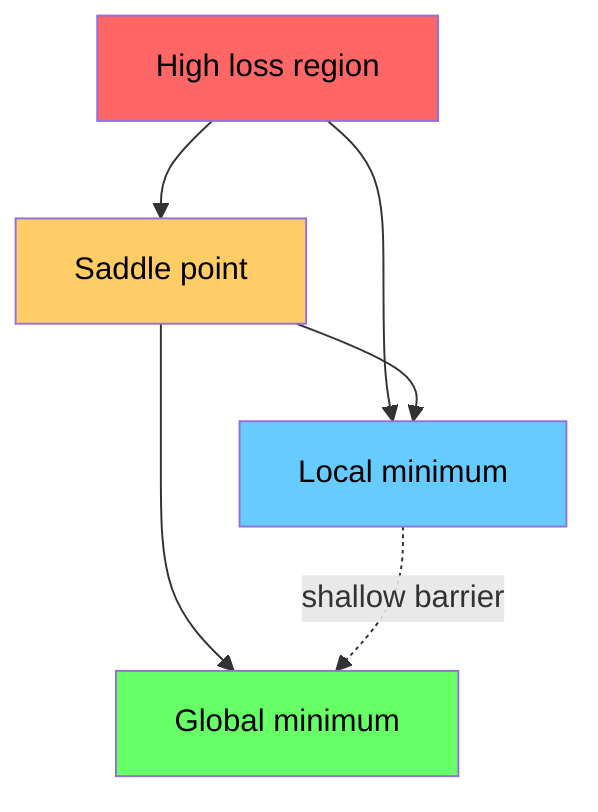

# अनुकूलन

> एक तंत्रिका नेटवर्क को प्रशिक्षित करना किसी घाटी के नीचे की खोज से ज्यादा कुछ नहीं है।
> 訓練神經網無非就是山谷 के निचले बिंदु को ढूंढना है

**Type:** Build | **类型:** 动手
**Language:**पायथन**语言:**पायथन
**Prerequisites:** Phase 1, Lessons 04-05 (Derivatives, Gradients) | **前置知识:** Phase 1, Lessons 04-05 (Derivatives, Gradients)
**Time:** ~75 minutes | **时间:** ~75 分钟

## सीखने के लक्ष्य

- वेनिला ग्रेडिएंट गिरावट, गति के साथ एसजीडी लागू करें, और आदम खरोंच से
  शून्य से प्राप्त मूल स्तर घटने, गतिशीलता की मात्रा SGD और आदम  अनुकूलक
- Rosenbrock समारोह पर अनुकूलक अभिसरण की तुलना करें और समझाएं कि क्यों एडम प्रति वजन सीखने की दरों को अनुकूलित करता है
  Rosenbrock  फ़ंक्शन पर तुलना अनुकूलक की क्षमता, क्यों एडम के लिए प्रत्येक शक्ति आत्म अनुकूलन सीखने की दर समझाएं
- घुमावदार और गैर घुमावदार हानि परिदृश्यों को अलग करें और उच्च आयामों में सaddle points की भूमिका की व्याख्या करें
  凸 और गैर-凸 हानि के बीच अंतर, उच्च आकार के अंतरिक्ष में 点 के प्रभाव को समझाएं
- प्रशिक्षण स्थिरता के लिए सीखने की दर के कार्यक्रमों (चरण गिरावट, कोसिन annealing, वार्मिंग) को कॉन्फ़िगर करें
  配置学习率调度(步衰减、余弦退火、预热) प्रशिक्षण स्थिरता सुनिश्चित करने के लिए

> **【中文解读】**
> 训练神经网络就是"寻找山谷最低点"―― हानि फ़ंक्शन आपको बताता है कि वर्तमान में कई त्रुटियां हैं,梯度 आपको बताता है कि किस दिशा में त्रुटि को छोटा कर सकता है, अनुकूलक आपको कैसे चलना है।

> **【拓展：优化器在 AI 中的位置】**
> - **SGD**: 最基础的优化器, सभी优化器 के" पूर्वज"
> - **Adam**: वर्तमान में सबसे लोकप्रिय अनुकूलन उपकरण, स्व-अनुकूलन सीखने की दर + गतिशीलता, लगभग एक आदर्श विकल्प बन गया है।
> - **学习率调度**: प्रशिक्षण प्रारंभिक उपयोग बड़े चरणों में तेजी से निकटतम, बाद के चरणों में छोटे चरणों में विस्तार से समायोजन।

## समस्या  समस्या परिचय

आप एक हानि समारोह है. यह आपको बताता है कि आपका मॉडल कितना गलत है. आप gradients है. वे आपको बताता है कि किस दिशा में नुकसान को बदतर बनाता है. अब आप एक रणनीति की जरूरत है गिरने के लिए चलना.

> आपके पास नुकसान फ़ंक्शन है, यह आपको बताता है कि मॉडल में बहुत अंतर है. आपके पास टेंडिडेशन है, यह आपको बताता है कि नुकसान को और अधिक बनाने के लिए किस दिशा में है. अब आपको नीचे की ओर जाने की रणनीति की आवश्यकता है.

साफ़-साफ़ दृष्टिकोण सरल हैः ग्रेडिएंट के विपरीत कदम उठाएं। सीखने की दर के नाम से किसी संख्या से कदम को मापें। दोहराएँ। यह ग्रेडिएंट गिरावट है, और यह काम करता है. लेकिन "काम" में चेतावनी है। बहुत बड़ी सीखने की दर और आप पूरी तरह से घाटी पार, दीवारों के बीच कूद. बहुत छोटा है और आप हजारों अनावश्यक कदमों पर उत्तर की ओर रेंगते हैं। एक सड़ल बिंदु पर हिट करें और आप एक न्यूनतम नहीं मिला है, भले ही आप आगे बढ़ना बंद कर दें.

> 简单方法很简单:梯度反向移动,步长由学习率控制──不断重复──这就是梯度下降──但"有效"是有条件的:学习率太大,你会跳过谷底在两壁之间来震荡;太小,你会在数千步不必要的代中慢爬──碰到点,你会停下,但没有达到最低点──

गहन सीखने में हर अनुकूलक एक ही प्रश्न का उत्तर है: आप घाटी के नीचे कैसे तेजी से और अधिक विश्वसनीय रूप से पहुंचते हैं?

> गहन सीखने में प्रत्येक अनुकूलन उपकरण एक ही प्रश्न का उत्तर देता हैः कैसे तेजी से, अधिक विश्वसनीय रूप से नीचे तक पहुँचने के लिए?

> **【中文解读】**आप एक ही रणनीति की आवश्यकता है "यात्रा करने के लिए नीचे की ओर की ओर की ओर की ओर"। सरल विधिः नीचे की ओर की ओर की ओर की ओर की ओर की ओर की ओर की ओर की ओर की ओर की ओर की ओर की ओर की ओर की ओर की ओर की ओर की ओर की ओर की ओर की ओर की ओर की ओर की ओर।

## अवधारणा का मूल अवधारणा

### अनुकूलन का क्या अर्थ है ?

अनुकूलन इनपुट मानों को खोजना है जो किसी फ़ंक्शन को न्यूनतम (या अधिकतम) करते हैं। मशीन लर्निंग में, फ़ंक्शन हानि है। इनपुट मॉडल के वजन हैं। प्रशिक्षण अनुकूलन है।

> 优化就是找到使函数最小化 (±最大化) के इनपुट मूल्य को ढूंढना।

```
minimize L(w) where:
  L = loss function
  w = model weights (could be millions of parameters)
```

> **【拓展：优化是机器学习的引擎】**训练 = 优化――GPT-4 की प्रशिक्षण प्रक्रिया यह हैः 1.800 बिलियन पैरामीटर के नुकसान फ़ंक्शन के साथ, एडम 优化器代调整参数 के माध्यम से, पूर्वानुमान अधिक सटीक हो जाए।`w = w - lr * gradient`

### ग्रेडिएंट अवतरण (वैनिला) 梯度下降 (पहले संस्करण)

सबसे सरल अनुकूलक. हर वजन के संबंध में हानि के ग्रेडिएंट की गणना करें. प्रत्येक वजन को उसके ग्रेडिएंट के विपरीत दिशा में ले जाएं. सीखने की दर से कदम को मापें।

> सबसे सरल अनुकूलन उपकरण--- प्रत्येक भार के स्तर पर गणना हानि, विपरीत दिशा में आंदोलन, चरणों को सीखने की दर से नियंत्रित करना---

```
w = w - lr * gradient
```

यह पूरी एल्गोरिथ्म है. एक पंक्ति.

> यह पूरी तरह से एक एल्गोरिथ्म है।

> **【中文解读】**梯度下降: प्रत्येक भार के लिए गणना हानि, विपरीत दिशा में कदम से कदम, कदम से कदम बढ़ना सीखने की दर नियंत्रण`w = w - lr * gradient`, एक पंक्ति पूर्ण एल्गोरिथ्म──直觉:蒙着眼下山, प्रत्येक कदम सभी की ओर सबसे  के नीचे दिशा में चल रहा है──



### सीखने की दरः सबसे महत्वपूर्ण हाइपरपैरामीटर

सीखने की दर कदम के आकार को नियंत्रित करती है. यह अभिसरण के बारे में सब कुछ निर्धारित करती है.

> सीखने की दर नियंत्रण में है, निर्णय लेने के लिए सब कुछ प्राप्त किया है



सही सीखने की दर के लिए कोई सूत्र नहीं है. आप इसे प्रयोग से पाते हैं. आम प्रारंभिक बिंदुः एडम के लिए 0.001, गति के साथ एसजीडी के लिए 0.01।

> 没有公式能告诉你正确的学习率──你只能通过实验找到──常见起点:

> **【拓展：学习率选择的实践指南】**सीखने की दर सबसे कठिन है 超参数―― अनुभव विधि: 0.001 开始 (आदम का मान मान मान) से शुरू), निरीक्षण प्रशिक्षण曲线――损失不降→学习率太小;损失震荡→学习率太大―― ट्रांसफार्मर 训练标准配置: वार्मअप(前 N 步骤 0 线性增至 0.001) + कॉस्मीन गिरावट( इसके बाद余弦衰退到 0) ・GPT-3 ने 0.6 का शिखर मूल्य सीखने की दर का उपयोग गरमअप के साथ किया

### SGD बनाम बैच बनाम मिनी बैच

वैनिला ग्रेडिएंट डाउनग्रेड एक कदम लेने से पहले पूरे डेटासेट पर ग्रेडिएंट की गणना करता है। इसे बैच ग्रेडिएंट डाउनग्रेड कहा जाता है। यह स्थिर है लेकिन धीमा है।

> मूल स्तर घटता है, लेकिन धीमी गति से, यह सभी डेटा गणना स्तर से पहले एक कदम नीचे जाता है।

स्टोकास्टिक ग्रेडिएंट डाउनसेंट (SGD) एक एकल यादृच्छिक नमूने पर ग्रेडिएंट की गणना करता है और तुरंत कदम उठाता है। यह शोरदार लेकिन तेज़ है।

> 随机梯度下降 (SGD) 随机梯度下降 (SGD) 随机梯度下降 (SGD) 随机梯度下降) 随机梯度下降 (SGD) 随机梯度下降) 随机梯度后立即更新──噪音大但快──

मिनी बैच ग्रेडिएंट डाउनग्रेड अंतर को विभाजित करता है। एक छोटे बैच (32, 64, 128, 256 नमूने) पर ग्रेडिएंट की गणना करें, फिर कदम। यह वास्तव में हर कोई उपयोग करता है।

> लघु मात्रा तारिद्र्य घटाने से घटने का आशयः एक छोटी मात्रा में डेटा के साथ (32、64、128、256 个样本)

| Variant | Batch size | Gradient quality | Speed per step | Noise |
|---------|-----------|-----------------|---------------|-------|
| Batch GD / 全批量 | Entire dataset | Exact / 精确 | Slow / 慢 | None / 无 |
| SGD / 随机 | 1 sample | Very noisy / 噪声大 | Fast / 快 | High / 高 |
| Mini-batch / 小批量 | 32-256 | Good estimate / 好的估计 | Balanced / 均衡 | Moderate / 中等 |

एसजीडी और मिनी बैच में शोर कोई बग नहीं है. यह स्थानिक न्यूनतम और सaddle points से बचने में मदद करता है।

> SGD तथा लघु मात्रा में शोर बग नहीं है, यह कम स्तर के स्थानीय न्यूनतम मूल्य और 点 से बचने में मदद करता है।

> **【中文解读】**तीन प्रकार के टेंडर गणना विधि: 1) पूर्ण बैच  सभी डेटा के साथ एक टेंडर, तैयार लेकिन धीमी; 2)随机 SGD एक डेटा गणना टेंडर, तेजी से लेकिन शोर; 3) लघु बैच 折中方案, 32/64/256 条 डेटा के साथ।

### गतिः गेंद गिरती है पहाड़ से नीचे

वैनिला ग्रेडिएंट की गिरावट केवल वर्तमान ग्रेडिएंट को देखता है। यदि ग्रेडिएंट ज़िगज़ैग (झीले घाटियों में आम) हैं, तो प्रगति धीमी होती है। गति पिछले ग्रेडिएंट को गति अवधि में जमा करके इसे ठीक करती है।

> यदि वर्तमान स्तर पर ही तरंगें गिरती हैं तो यह समस्या हल करने के लिए ऐतिहासिक स्तरों को गति से संचित करने के लिए गति विधि का उपयोग किया जाता है।

```
v = beta * v + gradient
w = w - lr * v
```

इसी तरह, एक गेंद गिरती है, हर झटके पर रुकती नहीं है और फिर से शुरू नहीं होती है। यह लगातार दिशाओं में गति बढ़ाता है और घर्षणों को धीमा करता है।

> 类比: गेंद पहाड़ से ढलती है। यह प्रत्येक कोम्बो पर रुककर फिर से शुरू नहीं होती है। यह एक संगत दिशा में गति जमा करती है, झटके को दबा देती है।



`beta`(आमतौर पर 0.9) यह नियंत्रित करता है कि कितना इतिहास रखने के लिए। उच्च बीटा का मतलब है अधिक गति, चिकनी मार्ग, लेकिन दिशा परिवर्तनों के लिए धीमी प्रतिक्रिया।

> `beta`(आमतौर पर 0.9) नियंत्रण में अधिक इतिहास बरकरार रखा गया है। उच्च बीटा का अर्थ है अधिक गतिशीलता, अधिक चिकनी मार्ग, लेकिन दिशा परिवर्तन की प्रतिक्रिया धीमी है।

> **【拓展：动量在深度学习中的效果】**动量法让优化"记住"前面的方向,像球滚下山坡一样积累动能──好处:(1) 加速通过平坦区域;(2) 抑制震荡(在狭谷中来回弹问题)―PyTorch 中`torch.optim.SGD(lr=0.1, momentum=0.9)`का गति = 0.9 है।

### एडम: अनुकूलन सीखने की दर एडम: स्व-अनुकूलन सीखने की दर

अलग-अलग वजन को अलग-अलग सीखने की दरों की आवश्यकता होती है। एक वजन जो शायद ही कभी बड़े ग्रेडिएंट प्राप्त करता है, उसे बड़े कदम उठाने चाहिए जब वह अंततः करता है। एक वजन जो लगातार बड़े ग्रेडिएंट प्राप्त करता है, उसे छोटे कदम उठाने चाहिए।

> विभिन्न भारों को विभिन्न सीखने की दरों की आवश्यकता होती है।

एडम (अनुकूली क्षण अनुमान) वजन के प्रति दो चीजों को ट्रैक करता हैः
  प्रत्येक अधिकार के लिए दो मात्राओं का पालन करेंः

1. प्रथम क्षण (m): गति के समान ग्रेडिएंट का चल रहा औसत
   एक वर्ग (m):梯度的移动平均 (梯度的移动平均)
2. दूसरा क्षण (v): वर्ग ग्रेडिएंट्स का चल रहा औसत (ग्रेडिएंट ग्रेडिएंट)
   द्वितीय श्रेणी (v):梯度平方的移动平均 (梯度大小)

```
m = beta1 * m + (1 - beta1) * gradient
v = beta2 * v + (1 - beta2) * gradient^2

m_hat = m / (1 - beta1^t)    bias correction
v_hat = v / (1 - beta2^t)    bias correction

w = w - lr * m_hat / (sqrt(v_hat) + epsilon)
```

 द्वारा विभाजन`sqrt(v_hat)`बड़े ग्रेडिएंट वाले वजन को बड़ी संख्या (छोटे प्रभावी कदम) से विभाजित किया जाता है। छोटे ग्रेडिएंट वाले वजन को छोटी संख्या (बड़े प्रभावी कदम) से विभाजित किया जाता है। प्रत्येक वजन को अपनी अनुकूलन सीखने की दर मिलती है।

> `sqrt(v_hat)`️️️️️️️️️️️️️️️️️️️️️️️️️️️️️️️️️️️️️️️️️️️️️️️️️️️️️️️️️️️️️️️️️️️️️️️️️️️️️️️️️️️️️️️️️️️️️️️️️️️️️️️️️️️️️️️️️️️️️️️️️️️️️️️️️️️️️️️️️️️️️️️️️️️️️️️️️️️️️️️️️️️️️️️️️️️️️️️️️️️️️️️️️

डिफ़ॉल्ट हाइपरपरमैटर्स: `lr=0.001, beta1=0.9, beta2=0.999, epsilon=1e-8`ये डिफ़ॉल्ट अधिकांश समस्याओं के लिए अच्छी तरह से काम करते हैं।

> 默认超参数:`lr=0.001, beta1=0.9, beta2=0.999, epsilon=1e-8` ये मान अधिकांश समस्याओं पर प्रभावी हैं

> **【中文解读】**एडम = गति + स्वयं अनुकूलन सीखने की दर―― यह प्रत्येक तत्व के लिए स्वतंत्र "गति" बनाए रखता है, क्रमशः इतिहास के अनुसार स्वचालित समायोजन चरणों की लंबाई―― बड़े तत्वों के लिए छोटे चरणों, छोटे तत्वों के लिए बड़े चरणों―― एडम वर्तमान में सबसे आम उपयोग किए जाने वाले अनुकूलक है, पाइटॉर्च में`torch.optim.Adam(lr=0.001)` लगभग एक आम चुनाव

### सीखने की दर शेड्यूल

एक निश्चित सीखने की दर एक समझौता है। प्रशिक्षण की शुरुआत में, आप तेजी से प्रगति करने के लिए बड़े कदम चाहते हैं। प्रशिक्षण में देर से, आप न्यूनतम के करीब बारीकी से समायोजित करने के लिए छोटे कदम चाहते हैं।

> 固定 learning rate is a fraction of the programme. प्रारंभिक प्रशिक्षण में तेजी से प्रगति की आवश्यकता होती है, बाद के प्रशिक्षण में छोटे-छोटे चरणों की आवश्यकता होती है।

सामान्य कार्यक्रमः
  常见调度方式:

| Schedule / 调度方式 | Formula / 公式 | Use case / 使用场景 |
|----------|---------|----------|
| Step decay / 步衰减 | lr = lr * factor every N epochs | Simple, manual control / 简单手动控制 |
| Exponential decay / 指数衰减 | lr = lr_0 * decay^t | Smooth reduction / 平滑递减 |
| Cosine annealing / 余弦退火 | lr = lr_min + 0.5 * (lr_max - lr_min) * (1 + cos(pi * t / T)) | Transformers, modern training / Transformer、现代训练 |
| Warmup + decay / 预热+衰减 | Linear ramp up, then decay | Large models, prevents early instability / 大模型，防止早期不稳定 |

### संकुचित बनाम गैर संकुचित .

एक घुमावदार समारोह में एक न्यूनतम है. ग्रेडिएंट अवतरण हमेशा यह पाता है. एक वर्गिक जैसे`f(x) = x^2`घुंघराली है।

> 凸函数 केवल एक न्यूनतम मूल्य है,梯度下降总能找到──像 `f(x) = x^2`इस प्रकार के द्वितीयक कार्य का है

तंत्रिका नेटवर्क हानि कार्य गैर-कुंभिक हैं। उनके पास कई स्थानीय न्यूनतम, सaddle points और flat regions हैं।

> तंत्रिका नेटवर्क के नुकसान फ़ंक्शन अमूर्त हैं, कई स्थानिक न्यूनतम मूल्य हैं।



व्यावहारिक रूप से, उच्च-आयामी तंत्रिका नेटवर्क में स्थानीय न्यूनतम शायद ही कभी एक समस्या होती है। अधिकांश स्थानीय न्यूनतम में वैश्विक न्यूनतम के करीब हानि मूल्य होते हैं। सaddle points (कुछ दिशाओं में सपाट, अन्य दिशाओं में घुमावदार) वास्तविक बाधा हैं। मिनी बैचों से गति और शोर उन्हें बचाने में मदद करता है।

>  व्यवहार में, उच्च स्तरीय तंत्रिका नेटवर्क में स्थानीय न्यूनतम मूल्य बहुत कम समस्या है। अधिकांश स्थानीय न्यूनतम मूल्य का नुकसान समग्र न्यूनतम मूल्य के करीब है। बिंदुओं के साथ कुछ दिशाओं में तराजू, कुछ दिशाओं में 曲) केवल वास्तविक बाधा है। गति और छोटे मात्रा में शोर से भागने में मदद मिलती है बिंदुओं।

> **【拓展：神经网络的损失曲面为什么是非凸的】**线性归归的损失函数凸的(只有一个最低点,一定能找到),但神经网络的损失曲面有无数局部最低点和点──100万维参数空间中,点(某些维度上升某些维度下降的点) 较局部最低点的多得多得多多多──好消息:亚当等自适应优化器能有效逃离点──这也是深度学习的原因,不仅依赖梯度下降而需要好的优化器──

### दृश्य दृश्यता खोने के लिए दृश्य दृश्यता खोने के लिए

हानि सभी भारों का एक कार्य है. 1 मिलियन भारों के साथ एक मॉडल के लिए, हानि परिदृश्य 1,000,001 आयामी अंतरिक्ष में रहता है. हम इसे वजन अंतरिक्ष में दो यादृच्छिक दिशाओं को चुनकर और उन दिशाओं के साथ हानि का ग्राफ बनाकर 2D सतह का उत्पादन करते हैं.

> 损失 है स्वामित्व भार का कार्य। 100 लाख भार मॉडल के लिए, हानि के झुकने का आकार 1,000,001 维空间 में मौजूद है। हम भारवहन स्थान में दो यादृच्छिक दिशाओं का चयन करते हैं, इन दिशाओं के साथ नुकसान को चित्रित करते हैं, 2D 曲面 प्राप्त करते हैं।



तेज न्यूनतम खराब रूप से सामान्य होते हैं। फ्लैट न्यूनतम अच्छी तरह से सामान्य होते हैं। यह एक कारण है कि गति के साथ एसजीडी अक्सर अंतिम परीक्षण सटीकता पर एडम से बेहतर प्रदर्शन करता हैः इसकी शोर तेज न्यूनतम में बसने से रोकती है।

>  के न्यूनतम मान में व्यापक क्षमता का अंतर,  के न्यूनतम मान में व्यापक क्षमता का अच्छा गुण है यह गति के साथ एसजीडी अंतिम परीक्षण सटीकता में अक्सर एडम से बेहतर होने के कारणों में से एक हैः इसकी आवाज को  के न्यूनतम मूल्य में फंसने से रोकती है
```figure
gradient-descent
```

## इसे बनाओ

## इसे बनाओ, इसे पूरा करो।

### चरण 1: एक परीक्षण समारोह को परिभाषित करें.

रोसेनब्रोक फ़ंक्शन एक क्लासिक अनुकूलन बेंचमार्क है। इसका न्यूनतम (1, 1) एक संकीर्ण वक्र घाटी के अंदर है जिसे ढूंढना आसान है लेकिन पीछा करना मुश्किल है।

> रोसेनब्रोक फ़ंक्शन क्लासिक अनुकूलन आधार है। इसका न्यूनतम मूल्य (1, 1) है, जो एक संकीर्ण वक्र घाटी में आसानी से पाया जा सकता है, लेकिन इसका पालन करना मुश्किल है।

```
f(x, y) = (1 - x)^2 + 100 * (y - x^2)^2
```

```python
def rosenbrock(params):
    x, y = params
    return (1 - x) ** 2 + 100 * (y - x ** 2) ** 2

def rosenbrock_gradient(params):
    x, y = params
    df_dx = -2 * (1 - x) + 200 * (y - x ** 2) * (-2 * x)
    df_dy = 200 * (y - x ** 2)
    return [df_dx, df_dy]
```

### चरण 2: वैनिला ग्रेडिएंट गिरावट

```python
class GradientDescent:
    def __init__(self, lr=0.001):
        self.lr = lr

    def step(self, params, grads):
        return [p - self.lr * g for p, g in zip(params, grads)]
```

### चरण 3: गति के साथ SGD

```python
class SGDMomentum:
    def __init__(self, lr=0.001, momentum=0.9):
        self.lr = lr
        self.momentum = momentum
        self.velocity = None

    def step(self, params, grads):
        if self.velocity is None:
            self.velocity = [0.0] * len(params)
        self.velocity = [
            self.momentum * v + g
            for v, g in zip(self.velocity, grads)
        ]
        return [p - self.lr * v for p, v in zip(params, self.velocity)]
```

### चरण 4: एडम.

```python
class Adam:
    def __init__(self, lr=0.001, beta1=0.9, beta2=0.999, epsilon=1e-8):
        self.lr = lr
        self.beta1 = beta1
        self.beta2 = beta2
        self.epsilon = epsilon
        self.m = None
        self.v = None
        self.t = 0

    def step(self, params, grads):
        if self.m is None:
            self.m = [0.0] * len(params)
            self.v = [0.0] * len(params)

        self.t += 1

        self.m = [
            self.beta1 * m + (1 - self.beta1) * g
            for m, g in zip(self.m, grads)
        ]
        self.v = [
            self.beta2 * v + (1 - self.beta2) * g ** 2
            for v, g in zip(self.v, grads)
        ]

        m_hat = [m / (1 - self.beta1 ** self.t) for m in self.m]
        v_hat = [v / (1 - self.beta2 ** self.t) for v in self.v]

        return [
            p - self.lr * mh / (vh ** 0.5 + self.epsilon)
            for p, mh, vh in zip(params, m_hat, v_hat)
        ]
```

### चरण 5: चलें और तुलना करें

```python
def optimize(optimizer, func, grad_func, start, steps=5000):
    params = list(start)
    history = [params[:]]
    for _ in range(steps):
        grads = grad_func(params)
        params = optimizer.step(params, grads)
        history.append(params[:])
    return history

start = [-1.0, 1.0]

gd_history = optimize(GradientDescent(lr=0.0005), rosenbrock, rosenbrock_gradient, start)
sgd_history = optimize(SGDMomentum(lr=0.0001, momentum=0.9), rosenbrock, rosenbrock_gradient, start)
adam_history = optimize(Adam(lr=0.01), rosenbrock, rosenbrock_gradient, start)

for name, history in [("GD", gd_history), ("SGD+M", sgd_history), ("Adam", adam_history)]:
    final = history[-1]
    loss = rosenbrock(final)
    print(f"{name:6s} -> x={final[0]:.6f}, y={final[1]:.6f}, loss={loss:.8f}")
```

अपेक्षित उत्पादनः एडम सबसे तेजी से अभिसरण करता है। गति के साथ एसजीडी एक चिकनी मार्ग का अनुसरण करता है। वैनिला जीडी संकीर्ण घाटी के साथ धीमी प्रगति करता है।

> 预期输出:आदम 收最快,SGD गति के साथ 路径更平滑,原始 GD 在狭谷中进展缓慢──

## इसे फ्रेमवर्क के साथ लागू करें

अभ्यास में, PyTorch या JAX अनुकूलक का उपयोग करें। वे पैरामीटर समूहों, वजन घटाने, ग्रेडिएंट क्लिपिंग और GPU त्वरण को संभालते हैं।

> प्रैक्टिस में, PyTorch या JAX के अनुकूलक का उपयोग करें।

> **【中文解读】**PyTorch 中优化器的标准使用法:`optimizer = torch.optim.Adam(model.parameters(), lr=0.001)`, फिर प्रशिक्षण चक्र में `optimizer.zero_grad()`→ `loss.backward()`→ `optimizer.step()` यह तीन पंक्ति कोड गहन सीखने के प्रशिक्षण का मूल चक्र है

```python
import torch

model = torch.nn.Linear(784, 10)

sgd = torch.optim.SGD(model.parameters(), lr=0.01, momentum=0.9)
adam = torch.optim.Adam(model.parameters(), lr=0.001)
adamw = torch.optim.AdamW(model.parameters(), lr=0.001, weight_decay=0.01)

scheduler = torch.optim.lr_scheduler.CosineAnnealingLR(adam, T_max=100)
```

अंगूठे के नियमः
  经验法则:

- यह एडम (lr=0.001) से शुरू करें। यह अधिकांश समस्याओं के लिए बिना ट्यूनिंग के काम करता है।
  आदम से (lr=0.001)  प्रारंभ, बिना किसी संशोधन के अधिकांश समस्याएं हल हो सकती हैं।
- गति के साथ SGD पर स्विच करें (lr=0.01, गति=0.9) जब आपको सर्वोत्तम अंतिम सटीकता की आवश्यकता होती है और अधिक ट्यूनिंग का खर्च आ सकता है।
  जब सर्वोत्तम अंतिम सटीकता और अधिक समायोजन की आवश्यकता हो, तो गति के साथ एसजीडी में स्विच करें।
- ट्रांसफार्मर के लिए एडमडब्ल्यू (डिस्कॉपल वजन घटाने वाला एडम) का उपयोग करें।
  ट्रांसफार्मर 模型 उपयोग एडम (अदम)
- प्रशिक्षण के लिए हमेशा कुछ काल से अधिक समय के लिए सीखने की दर का समय सारिणी का उपयोग करें।
   प्रशिक्षण कई युगों से अधिक समय से  हमेशा उपयोग करना सीखने की दर调度
- यदि प्रशिक्षण अस्थिर है, तो सीखने की दर को कम करें। यदि प्रशिक्षण बहुत धीमा है, तो इसे बढ़ाएं।
   प्रशिक्षण अस्थिर समय में कम सीखने की दर, प्रशिक्षण बहुत धीमा समय में बढ़ते कॉलेज के सीखने की दर

## इसे भेजें उत्पाद

इस पाठ में सही ऑप्टिमाइज़र चुनने के लिए एक संकेत मिलता है।`outputs/prompt-optimizer-guide.md`. .

> इस कोर्स में एक चयन योग्य अनुकूलन उपकरण के सुझाव शब्द प्रस्तुत किए गए हैं।`outputs/prompt-optimizer-guide.md`

यहाँ निर्मित अनुकूलक वर्ग चरण 3 में फिर से दिखाई देते हैं जब हम एक तंत्रिका नेटवर्क को खरोंच से प्रशिक्षित करते हैं।

> इस में निर्मित अनुकूलक वर्ग शून्य प्रशिक्षण तंत्रिका नेटवर्क के चरण 3 में फिर से दिखाई देगा।

## अभ्यास विषय

1. **Learning rate sweep.**[0.0001, 0.0005, 0.001, 0.005, 0.01] सीखने की दर के साथ रोजेनब्रोक फ़ंक्शन पर वैनिला ग्रेडिएंट गिरावट चलाएं। प्रत्येक के लिए 5000 चरणों के बाद अंतिम नुकसान का ग्राफ या प्रिंट करें। सबसे बड़ी सीखने की दर खोजें जो अभी भी अभिसरण करती है।
   **学习率扫描。**प्रयोग भिन्न सीखने की दर [0.0001, 0.0005, 0.001, 0.005, 0.01]                                                                                                                                                                                                                                                     

2. **Momentum comparison.**रॉसेनब्रोक फ़ंक्शन पर गतिमानता मानों [0.0, 0.5, 0.9, 0.99] के साथ SGD चलाएं. हर कदम पर नुकसान का ट्रैक करें. किस गतिमानता मूल्य में सबसे तेजी से अभिसरण होता है? कौन सा ओवरशॉट होता है?
   **动量比较。**विभिन्न गतिमानियों के साथ [0.0, 0.5, 0.9, 0.99] में Rosenbrock  फ़ंक्शन पर चलना SGD── प्रत्येक चरण के नुकसान का पालन करना── कौन सा गतिमानता प्राप्त करने में सबसे तेजी है? कौन सा होगा?

3. **Saddle point escape.**फ़ंक्शन को परिभाषित करें `f(x, y) = x^2 - y^2`(उत्पत्ति पर एक सaddle बिंदु) से शुरू करें (0.01, 0.01) तुलना करें कि कैसे वैनिला GD, गति के साथ SGD, और एडम व्यवहार करते हैं. कौन से सaddle बिंदु से बचता है?
   **鞍点逃逸。**定义函数 `f(x, y) = x^2 - y^2`(原点处有点) 〜从 (0.01, 0.01) 开始── तुलना करें मूल GD、SGD गति 和 आदम के व्यवहार── कौन से भाग सकता है点?

4. **Implement learning rate decay.**GradientDescent वर्ग में एक घातीय क्षय अनुसूची जोड़ेंः `lr = lr_0 * 0.999^step`. रोसेनब्रोक फ़ंक्शन पर गिरावट के साथ और बिना गिरावट के अभिसरण की तुलना करें.
   **实现学习率衰减。** GradientDescent  वर्ग में वृद्धि सूचकांक घटाने की विनियमनः`lr = lr_0 * 0.999^step` तुलना करें रोसेनब्रोक फ़ंक्शन पर प्राप्ति की स्थिति में कोई कमी नहीं है

## कीवर्ड्स  शब्द खोज तालिका

| Term / 术语 | What people say | What it actually means / 实际含义 |
|------|----------------|----------------------|
| Gradient descent / 梯度下降 | "Go downhill" | Update weights by subtracting the gradient scaled by the learning rate. The most basic optimizer. / 用学习率缩放梯度后从权重中减去，更新权重。最基础的优化器。 |
| Learning rate / 学习率 | "Step size" | A scalar that controls how far each update moves the weights. Too large causes divergence. Too small wastes compute. / 控制每次更新移动多远的标量。太大导致发散，太小浪费算力。 |
| Momentum / 动量 | "Keep rolling" | Accumulate past gradients into a velocity vector. Dampens oscillations and accelerates movement through consistent directions. / 将历史梯度累积到速度向量中。抑制震荡，在一致方向上加速。 |
| SGD / 随机梯度下降 | "Random sampling" | Stochastic gradient descent. Compute gradient on a random subset instead of the full dataset. Almost always means mini-batch SGD in practice. / 随机梯度下降。在随机子集上计算梯度。实践中几乎都指小批量 SGD。 |
| Mini-batch / 小批量 | "A chunk of data" | A small subset of training data (32-256 samples) used to estimate the gradient. Balances speed and gradient accuracy. / 训练数据的小子集（32-256 个样本），用于估计梯度。平衡速度和梯度精度。 |
| Adam / Adam 优化器 | "The default optimizer" | Adaptive Moment Estimation. Tracks per-weight running averages of gradients and squared gradients to give each weight its own learning rate. / 自适应矩估计。跟踪每个权重的梯度和平方梯度的移动平均，为每个权重提供独立的学习率。 |
| Bias correction / 偏差校正 | "Fix the cold start" | Adam's first and second moments are initialized to zero. Bias correction divides by (1 - beta^t) to compensate during early steps. / Adam 的一阶和二阶矩初始化为零。偏差校正除以 (1 - beta^t) 来补偿早期步骤。 |
| Learning rate schedule / 学习率调度 | "Change lr over time" | A function that adjusts the learning rate during training. Large steps early, small steps late. / 训练过程中调整学习率的函数。早期大步，后期小步。 |
| Convex function / 凸函数 | "One valley" | A function where any local minimum is the global minimum. Gradient descent always finds it. Neural network losses are not convex. / 任何局部最小值都是全局最小值的函数。梯度下降总能找到。神经网络损失不是凸的。 |
| Saddle point / 鞍点 | "Flat but not a minimum" | A point where the gradient is zero but it is a minimum in some directions and a maximum in others. Common in high dimensions. / 梯度为零但在某些方向是最小值、某些方向是最大值的点。在高维中常见。 |
| Loss landscape / 损失曲面 | "The terrain" | The loss function plotted over weight space. Visualized by slicing along two random directions. / 在权重空间上绘制的损失函数。通过沿两个随机方向切片来可视化。 |
| Convergence / 收敛 | "Getting there" | The optimizer has reached a point where further steps do not meaningfully reduce the loss. / 优化器已到达一个点，进一步步进不会显著降低损失。 |

## आगे पढ़ना 延伸閱讀

- [Sebastian Ruder: An overview of gradient descent optimization algorithms](https://ruder.io/optimizing-gradient-descent/)- सभी प्रमुख अनुकूलक का व्यापक सर्वेक्षण
  梯度下降优化算法综述,全面覆盖所有主要优化器
- [Why Momentum Really Works (Distill)](https://distill.pub/2017/momentum/)- गति गतिशीलता का इंटरैक्टिव दृश्य
  क्यों गतिशीलता प्रभावी है, गतिशीलता के परस्पर व्यवहार को दृश्यमान बनाना
- [Adam: A Method for Stochastic Optimization (Kingma & Ba, 2014)](https://arxiv.org/abs/1412.6980)- मूल एडम पेपर, पठनीय और संक्षिप्त
  आदम 原始论文,可读且简短
- [Visualizing the Loss Landscape of Neural Nets (Li et al., 2018)](https://arxiv.org/abs/1712.09913)- पेपर जो स्पष्ट बनाम फ्लैट न्यूनतम दिखाया
   प्रदर्शनी 尖与平坦最小值论文
