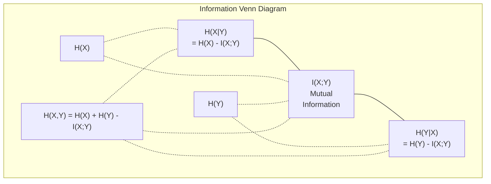

# सूचना सिद्धांत

> सूचना सिद्धांत आश्चर्य का उपाय करता है। हानि फ़ंक्शन उस पर निर्मित हैं।
> 信息论衡惊喜程度──损失函数建立在此──

**Type:** Learn | **类型:** 学习
**Language:**पायथन**语言:**पायथन
**Prerequisites:** Phase 1, Lesson 06 (Probability) | **前置知识:** Phase 1, Lesson 06 (Probability)
**Time:** ~60 minutes | **时间:** ~60 分钟

## सीखने के लक्ष्य

- शून्य से एंट्रॉपी, क्रॉस-एंट्रोपी और केएल विचलन की गणना करें और उनके संबंध की व्याख्या करें
  शून्य गणना से, उनके बीच संबंध को समझाएं
- पता करें कि क्रॉस-एंट्रोपी हानि को कम करने का मतलब लॉग-संभाव्यता को अधिकतम करने के बराबर क्यों है
  推导为什么最小化交叉损失等于最大化对数似之之
- विशेषताओं और लक्ष्य के बीच आपसी जानकारी की गणना करें ताकि विशेषता महत्व को रैंक किया जा सके
  गणितीय विशेषताएं और लक्ष्य के बीच परस्पर सूचना क्रमबद्ध विशेषता महत्व
- भाषा मॉडल द्वारा चुने गए प्रभावी शब्दावली आकार के रूप में भ्रम को समझाएं
  解释困惑度作为语言模型选择的有效词汇量

> **【中文解读】**
> 信息论 माप" आश्चर्य की डिग्री"越不可能发生的事件,包含的信息量越大──交叉损失函数、KL 散度、困惑度(困惑度) ये अवधारणाएं सूचना सिद्धांत के ढांचे के तहत एकजुट हैं

> **【拓展：信息论在 AI 中的位置】**
> - **交叉熵损失**: 所有分类模型和语言模型的标准损失函数`CrossEntropyLoss`)。
> - **KL 散度**: VAE के हानि कार्य में से एक, ज्ञान के धुंध के केंद्र, RLHF में इनाम मॉडल का प्रशिक्षण लक्ष्य
> - **困惑度(Perplexity)**语言模型的评价标准,越低越好,表示模型对下一个词的预测越确定──

## समस्या  समस्या परिचय

> **【中文解读】**आप प्रशिक्षण में क्रमबद्ध मॉडल का उपयोग करते समय`CrossEntropyLoss()`, भाषा मॉडल परफॉर्मेंस में "गंभीरता" को देखने के लिए, VAE में KL 散度 को देखने के लिए, RHF में यह अलग-अलग अवधारणाएं नहीं हैं, वे सूचनावाद के समान मूल अवधारणाएं हैं, केवल अलग-अलग टोपी बदलती हैं।

## अवधारणा का मूल अवधारणा

> **【拓展：Shannon 与信息论的诞生】**1948 में क्लाउड शैनन ने संचार के गणितीय सिद्धांत को प्रकाशित किया, जिसमें सूचना की मात्रा को मापने के लिए एक ढांचे का उपयोग किया गया। 80 वर्षों के बाद, यह ढांचा एआई का आधारशिला बन गयाः交叉 सभी वर्गों और भाषा मॉडल के नुकसान समारोह है, KL 散度 है उत्पादन मॉडल (VAE  विस्तार मॉडल) का प्रशिक्षण लक्ष्य, परस्पर सूचना विशेषता चयन के उपकरण है। सूचना सिद्धांत संचार इंजीनियरिंग से एआई के पुल है।

### सूचना सामग्री (सुपरिप्रीज) 信息量(惊喜度)

जब कुछ असंभव होता है, तो इसमें अधिक जानकारी होती है. सिक्के के सिर? कोई आश्चर्य नहीं। लॉटरी जीत? बहुत आश्चर्यजनक।

> जब कुछ असंभव होता है, तो यह अधिक जानकारी ले जाता है।

संभावना p वाली घटना की सूचना सामग्री हैः
  概率为 p के घटनाओं की जानकारी मात्रा为:

```
I(x) = -log(p(x))
```

लॉग बेस 2 का उपयोग करके आपको बिट्स मिलता है। प्राकृतिक लॉग का उपयोग करके आपको नाट्स मिलता है। एक ही विचार, अलग-अलग इकाइयां।
  उपयोग में 2 के लिए मूल संख्या प्राप्त बिट्स), उपयोग प्राकृतिक संख्या प्राप्त नेट नाट्स (नट्स) ⋅ एक ही अवधारणा, अलग अलग इकाई ⋅

```
Event              Probability    Surprise (bits)
Fair coin heads    0.5            1.0
Rolling a 6        0.167          2.58
1-in-1000 event    0.001          9.97
Certain event      1.0            0.0
```

कुछ घटनाओं में शून्य जानकारी होती है। आप पहले से ही जानते थे कि वे होने वाली हैं।
> ज़रूरी घटनाएं शून्य सूचना लेकर आती हैं. आप पहले से ही जानते हैं कि वे होने वाली हैं.

### एंट्रोपी (औसत आश्चर्य)

एंट्रोपी वितरण के सभी संभावित परिणामों पर अपेक्षित आश्चर्य है।
> 

```
H(P) = -sum( p(x) * log(p(x)) )  for all x
```

एक निष्पक्ष सिक्के में बाइनरी चर के लिए अधिकतम एंट्रॉपी होती हैः 1 बिट। एक पक्षपातपूर्ण सिक्के (99% सिर) में कम एंट्रॉपी होती हैः 0.08 बिट। आप पहले से ही जानते हैं कि क्या होगा, इसलिए प्रत्येक फ्लिप आपको लगभग कुछ नहीं बताता है।
> 公平硬币对二元变量有最大:1比特──偏置硬币(99% 正面) 的非常低:0.08比特──你已经知道会发生什么,所以每次抛币几乎没有提供新信息──

```
Fair coin:    H = -(0.5 * log2(0.5) + 0.5 * log2(0.5)) = 1.0 bit
Biased coin:  H = -(0.99 * log2(0.99) + 0.01 * log2(0.01)) = 0.08 bits
```

एंट्रोपी वितरण में अनिश्चितता को मापती है। आप इसके नीचे संपीड़न नहीं कर सकते।
>  माप वितरण में अनिश्चितता को कम नहीं किया जा सकता है।

### क्रॉस-एंट्रोपी (आप हर दिन उपयोग कर नुकसान समारोह)

क्रॉस-एंट्रोपी औसत आश्चर्य मापता है जब आप वितरण Q का उपयोग घटनाओं को एन्कोड करने के लिए जो वास्तव में वितरण P से आते हैं।
> 交叉 माप वितरण उपयोग Q 编码 प्रत्यक्ष में खुद को P के घटनाओं के दौरान औसत आश्चर्यजनकता

```
H(P, Q) = -sum( p(x) * log(q(x)) )  for all x
```

P सही वितरण (लेबल) है। Q आपके मॉडल की भविष्यवाणियां है। यदि Q P से पूरी तरह मेल खाता है, तो क्रॉस-एंट्रोपी एंट्रॉपी के बराबर है। कोई भी असंगत इसे बड़ा बनाता है।
> P ∈ P ∈ P ∈ P ∈ P ∈ P ∈ P ∈ P ∈ P ∈ P ∈ P ∈ P ∈ P ∈ P ∈ P ∈ P ∈ P ∈ P ∈ P ∈ P ∈ P ∈ P ∈ P ∈ P ∈ P ∈ P ∈ P ∈ P ∈ P ∈ P ∈ P ∈ P ∈ P ∈ P ∈ P ∈ P ∈ P ∈ P ∈ P ∈ P ∈ P ∈ P ∈ P ∈ P ∈ P ∈ P ∈ P ∈ P ∈ P ∈ P ∈ P ∈ P ∈ P ∈ P ∈ P ∈ P ∈ P ∈ P ∈ P ∈ P ∈ P ∈ P  ∈ P                                                                                                                                                                 

वर्गीकरण में, P एक-गर्म वेक्टर है (सच्चा वर्ग में संभावना 1 है, बाकी सब कुछ 0 है) । यह क्रॉस-एंट्रोपी को सरल करता हैः
> में分类中,P है एक-गर्म向量(真实类概率为1,其余为0)

```
H(P, Q) = -log(q(true_class))
```

यह वर्गीकरण के लिए क्रॉस-एंट्रोपी हानि सूत्र है। सही वर्ग की भविष्यवाणी की संभावना अधिकतम।
> यह है कि वर्ग के पूर्ण पार के लिए हानि सूत्र।

### KL विभेदन (वितरणों के बीच दूरी)

KL विचलन मापता है कि आप P के बजाय Q का उपयोग करने से कितना अतिरिक्त आश्चर्य मिलता है।
> KL 散度 मापने का उपयोग Q 代替 P 时多出的惊喜度──

```
D_KL(P || Q) = sum( p(x) * log(p(x) / q(x)) )  for all x
             = H(P, Q) - H(P)
```

क्रॉस-एंट्रोपी एंट्रोपी प्लस केएल विभेदन है। चूंकि वास्तविक वितरण की एंट्रोपी प्रशिक्षण के दौरान स्थिर है, क्रॉस-एंट्रोपी को कम करना केएल विभेदन को कम करने के समान है। आप अपने मॉडल के वितरण को वास्तविक वितरण की ओर धक्का दे रहे हैं।
> 交叉 =  + KL 散度──由于 प्रशिक्षण प्रक्रिया में वास्तविक वितरण की  है सामान्य, न्यूनतम交叉 बराबर मूल्य को न्यूनतम करने के लिए KL 散度──你在把模型分布推向真实分布──

KL विचलन सममित नहीं हैः D_KL(P  Q) != D_KL(Q  P) यह एक वास्तविक दूरी मीट्रिक नहीं है।
> KL 散度不对称:D_KL P_  Q) != DKL  Q                                                                                                                                                                                                                                                 

### आपसी सूचनाएँ

आपसी सूचना यह मापती है कि एक चर को जानने से आपको दूसरे के बारे में कितना पता चलता है।
> 互信息衡量知道一个变量后能告诉你关于另一个变量多少信息──

```
I(X; Y) = H(X) - H(X|Y)
        = H(X) + H(Y) - H(X, Y)
```

यदि X और Y स्वतंत्र हैं, तो आपसी जानकारी शून्य है। एक को जानना आपको दूसरे के बारे में कुछ नहीं बताता है। यदि वे पूरी तरह से संबद्ध हैं, तो आपसी जानकारी किसी भी चर की एंट्रोपी के बराबर है।
> यदि X और Y 独立, परस्पर सूचना शून्य है 🏻 जानिए एक आपको दूसरे के बारे में कोई भी जानकारी नहीं बता सकता 🏻 यदि पूरी तरह से संबंधित है, परस्पर जानकारी किसी भी भिन्नता के बराबर है🏻

सुविधा चयन में, एक विशेषता और लक्ष्य के बीच उच्च पारस्परिक जानकारी का मतलब है कि विशेषता उपयोगी है। कम पारस्परिक जानकारी का मतलब है कि यह शोर है।
> विशेषताओं के चयन में, विशेषताओं और लक्ष्यों के बीच उच्च परस्परसंवाद का अर्थ है कि विशेषताओं का उपयोग किया जाता है।

### सशर्त एंट्रोपी

H(Y में X) मापता है कि आप X का अवलोकन करने के बाद Y के बारे में कितना अनिश्चितता बनी हुई है।
> H(YX) ️️️️️️️️️️️️️️️️️️️️️️️️️️️️️️️️️️️️️️️️️️️️️️️️️️️️️️️️️️️️️️️️️️️️️️️️️️️️️️️️️️️️️️️️️️️️️️️️️️️️️️️️️️️️️️️️️️️️️️️️️️️️️️️️️️️️️️️️️️️️️️️️️️️️️️️️️️️️️️️️️️️️️️️️️️️️️️️️️️️️️️️️️️️️️️️️️️️️️️️️️️️️️️️️️️️️️️️️️️️️️️️️️️️️️️️️️️️️️️️️️️️️️️️️️️️️️️️️️️️️️️️️️️️️️️️️️️️️️️️️️️️️️️️️️️️️️️️️️️️️️️️️️️️️️️️️️️️️️️️️️️️️️️️️️️️️️️️️️️️️️️️️️️️️️️️️️️️️️️️️️️️️️️️️️️️️️️️️️️️️️️️️️️️️️️️️️️️️️️️️️️️️️️️️️️️️️️️️️️️️️️️️️️️️️️️️️️️️️️️️️️️️️️️️️️️️️️️️️️️️️️️️️️️️️️️️️️️️️️️️️️️️️️️️️️️️️️️️️️️️️️️

```
H(Y|X) = H(X,Y) - H(X)
```

दो चरम सीमाएं:
  两个极端:

- यदि X पूरी तरह से Y को निर्धारित करता है, तो H(Y X) = 0. X को जानने से Y के बारे में सभी अनिश्चितता को समाप्त कर दिया जाता है। उदाहरणः X = तापमान सेल्सियस में, Y = तापमान फ़ारेनहाइट में।
  यदि X 完全决定 Y, तो H  Y  X) = 0── जाने X  ने Y के बारे में सभी अनिश्चितता को समाप्त कर दिया
- यदि X आपको Y के बारे में कुछ नहीं बताता है, तो H(YX ) = H(Y) । X को जानना आपकी अनिश्चितता को बिल्कुल भी कम नहीं करता है। उदाहरणः X = सिक्का फ्लिप, Y = कल का मौसम।
  यदि X पर Y  कोई जानकारी नहीं है, तो H  Y X ) = H  Y                                                                                                                                                                                                                                                   

सशर्त एंट्रॉपी हमेशा गैर-नकारात्मक होती है और कभी भी H(Y से अधिक नहीं होती है):
> 条件始终非负且不超过 H(Y):

```
0 <= H(Y|X) <= H(Y)
```

मशीन लर्निंग में, सशर्त एंट्रॉपी निर्णय पेड़ों में दिखाई देती है। प्रत्येक विभाजन पर, एल्गोरिथम विशेषता X को चुनता है जो H(Y) को कम करता है - विशेषता जो Y लेबल के बारे में सबसे अधिक अनिश्चितता को हटा देती है।
> मशीन लर्निंग में, परिस्थितियाँ निर्णय के पेड़ में दिखाई देती हैं। प्रत्येक विभाजन के दौरान, एल्गोरिथ्म चयन करता है कि H  Y में X  सबसे छोटा लक्षण X  यानी सबसे कम लक्षण X  है जो लेबल Y अनिश्चितता के लक्षणों को समाप्त कर सकता है।

### संयुक्त एंट्रोपी संयुक्त

H ((X,Y) X और Y के संयुक्त वितरण की एंट्रॉपी है।
> H(X,Y) है X 和 Y 联合分布的──

```
H(X,Y) = -sum sum p(x,y) * log(p(x,y))   for all x, y
```

मुख्य गुण:
  关键性质:

```
H(X,Y) <= H(X) + H(Y)
```

समानता तब होती है जब X और Y स्वतंत्र होते हैं। यदि वे जानकारी साझा करते हैं, तो संयुक्त एंट्रोपी व्यक्तिगत एंट्रोपी के योग से कम होती है। "गुम" एंट्रोपी वास्तव में आपसी जानकारी है।
> जब X और Y 独立时等号成立── यदि वे सूचना साझा करते हैं, तो संयुक्त 小于各自之和──"缺失" का 恰好是互信息──



रिश्तेः
  关系式:

- H(X,Y) = H(X) + H(Y
- X;Y) = H(X) - H(IX
- H(X,Y) = H(X) + H(Y) - I(X;Y)

### आपसी जानकारी (गहरे गोता) 互信息(深入理解)

आपसी जानकारी I(X;Y) यह बताती है कि एक चर को जानने से दूसरे के बारे में अनिश्चितता कम होती है।
> 互信息 I(X;Y) 量化知道 एक परिवर्तन के बाद दूसरे परिवर्तन के अनिश्चितता की कमी के लिए 量化知道后的变量对另一个变量的不确定性的减少量──

```
I(X;Y) = H(X) - H(X|Y)
       = H(Y) - H(Y|X)
       = H(X) + H(Y) - H(X,Y)
       = sum sum p(x,y) * log(p(x,y) / (p(x) * p(y)))
```

गुण:
  性质:

- I ((X;Y) >= 0 हमेशा. आप कभी भी कुछ भी देखने से जानकारी खो नहीं देते.
  I(X;Y) >= 0 始终成立──观察事物永远不会丢失信息──
- I(X;Y) = 0 यदि और केवल यदि X और Y स्वतंत्र हैं।
  I(X;Y) = 0 जब且仅当 X 和 Y 独立──
- यह सीएल विचलन के विपरीत, सममित है।
  I(X;Y) = I(Y;X)。 यह एक तुलनात्मक है, जो कि KL 散度 से भिन्न है。
- I(X;X) = H(X) एक चर अपनी सभी जानकारी स्वयं के साथ साझा करता है।
  I(X;X) = H(X)──变量与自身共享所有信息──

**Mutual information for feature selection.**एमएल में, आप उन सुविधाओं को चाहते हैं जो लक्ष्य के बारे में जानकारीपूर्ण हों। आपसी जानकारी आपको सुविधाओं को रैंक करने का एक सिद्धांतबद्ध तरीका देती हैः
> **互信息用于特征选择。**मशीन लर्निंग में, आपको लक्ष्य के लिए जानकारी की मात्रा के लक्षणों की आवश्यकता होती है।

1. प्रत्येक विशेषता X_i के लिए, गणना I(X_i; Y) जहां Y लक्ष्य चर है।
   प्रत्येक विशेषता X_i के लिए, गणना I(X_i; Y), जिसमें Y है लक्ष्य परिवर्तन量。
2. एमआई स्कोर द्वारा रैंक सुविधाएँ।
   按MI 得分排序特征──
3. शीर्ष के फीचर्स रखें।
   रखिये पहले

यह सुविधा और लक्ष्य के बीच किसी भी संबंध के लिए काम करता है -- रैखिक, गैर रैखिक, एकांत या नहीं। सहसंबंध केवल रैखिक संबंधों को पकड़ता है। MI सब कुछ पकड़ता है।
> यह विशेषता और लक्ष्य के बीच किसी भी संबंध के लिए लागू होता है 线性、非线性、单调或非单调―― संबंध केवल रैखिक संबंध को पकड़ सकता है, परस्पर सूचना सब कुछ पकड़ सकती है

| Method / 方法 | Detects / 检测 | Computational cost / 计算成本 | Handles categorical? / 处理类别型？ |
|--------|---------|-------------------|---------------------|
| Pearson correlation / 皮尔逊相关 | Linear relationships / 线性关系 | O(n) | No / 否 |
| Spearman correlation / 斯皮尔曼相关 | Monotonic relationships / 单调关系 | O(n log n) | No / 否 |
| Mutual information / 互信息 | Any statistical dependency / 任何统计依赖 | O(n log n) with binning | Yes / 是 |

### लेबल स्लीडिंग और क्रॉस-एंट्रोपी 标签平滑与交叉

मानक वर्गीकरण कठिन लक्ष्य का उपयोग करता हैः [0, 0, 1, 0]. वास्तविक वर्ग को संभावना 1 मिलती है, बाकी सब कुछ 0 मिलता है। लेबल चिकनाई उन्हें नरम लक्ष्य के साथ बदल देता हैः
> 标准分类使用硬目标:[0, 0, 1, 0]──真实类概率为 1,其余为 0──标签平滑将其替换为软目标:

```
soft_target = (1 - epsilon) * hard_target + epsilon / num_classes
```

एप्सिलन = 0.1 और 4 वर्गों के साथः
  जब एप्सिलन = 0.1 且有4 个类别时:

- कठिन लक्ष्य: [0, 0, 1, 0]
- नरम लक्ष्य: [0.025, 0.025, 0.925, 0.025]

सूचना सिद्धांत के दृष्टिकोण से, लेबल चिकनाई लक्ष्य वितरण की एंट्रॉपी को बढ़ाता है। हार्ड एक गर्म लक्ष्य में एंट्रॉपी 0 है - कोई अनिश्चितता नहीं है। नरम लक्ष्य में सकारात्मक एंट्रॉपी है।
> सूचनात्मक दृष्टिकोण से, टैगिंग समतलता ने लक्ष्य वितरण में वृद्धि की है।

इससे मदद क्यों मिलती हैः
  यह मददगार क्यों हैः

- मॉडल को लॉजिट को चरम मानों तक ले जाने से रोकता है (क्रॉस-एंट्रोपी के तहत एक-हॉट लक्ष्य के साथ सही ढंग से मेल खाने के लिए अंतहीन लॉजिट की आवश्यकता होगी)
  防止模型将 लॉग्स 推到极端值 तक
- नियमितता के रूप में कार्य करता हैः मॉडल 100% आत्मविश्वास नहीं हो सकता है
  作为正则化:模型不能100%自信
- माप में सुधारः भविष्यवाणी की गई संभावनाएं वास्तविक अनिश्चितता को बेहतर ढंग से दर्शाती हैं
   सुधार校准: पूर्वानुमान संभावना बेहतर ढंग से वास्तविक अनिश्चितता को दर्शाता है
- प्रशिक्षण और निष्कर्ष व्यवहार के बीच अंतर को कम करता है
   प्रशिक्षण और अनुशंसा के बीच अंतर को कम करना

लेबल चिकनाई के साथ क्रॉस-एंट्रोपी हानि बन जाती हैः
> 带标签平滑的交叉损失为:

```
L = (1 - epsilon) * CE(hard_target, prediction) + epsilon * H_uniform(prediction)
```

दूसरा शब्द भविष्यवाणियों को दंडित करता है जो एक समान से दूर हैं -- विश्वास पर प्रत्यक्ष नियमितता।
> दूसरा, विश्वास के प्रत्यक्ष औचित्य को दूर से औसत वितरण के पूर्वानुमान से जोड़ना है।

### क्यों क्रॉस-एंट्रोपी वर्गीकरण हानि है

तीन दृष्टिकोण, एक ही निष्कर्ष।
> तीनों दृष्टिकोण, एक ही निष्कर्ष

**Information theory view.**क्रॉस-एंट्रोपी मापता है कि आप वास्तविक वितरण के बजाय अपने मॉडल के वितरण का उपयोग करके कितना बिट्स बर्बाद करते हैं। इसे कम करने से आपका मॉडल वास्तविकता का सबसे कुशल एन्कोडर बन जाता है।
> **信息论视角。**交叉 मापने के लिए मॉडल का उपयोग करें वास्तविक वितरण के बजाय कितना बिट बर्बाद किया गया है।

**Maximum likelihood view.**वास्तविक वर्ग y_i के साथ N प्रशिक्षण नमूनों के लिएः
> **最大似然视角。**对于 N 个训练样本,真实类别为 y_i:

```
Likelihood     = product( q(y_i) )
Log-likelihood = sum( log(q(y_i)) )
Negative log-likelihood = -sum( log(q(y_i)) )
```

अंतिम पंक्ति क्रॉस-एंट्रोपी हानि है। क्रॉस-एंट्रोपी को कम करना = आपके मॉडल के तहत प्रशिक्षण डेटा की संभावना को अधिकतम करना।
> अंतिम पंक्ति है交叉损失最小化交叉 = अधिकतम化模型下训练数据的似然

**Gradient view.**लॉजिट के संबंध में क्रॉस-एंट्रोपी का ग्रेडिएंट सरल (पूर्वानुमान - सच) है। गणना करने के लिए साफ, स्थिर और तेज़ है। यही कारण है कि यह सॉफ्टमैक्स के साथ पूरी तरह से जोड़ा जाता है।
> **梯度视角。**交叉对逻辑的梯度就是 (预测-true) 简洁、稳定、计算快速── यही कारण है कि यह सॉफ्टमैक्स के साथ एकदम सही संगत है──

### बिट्स बनाम एनट्स

केवल अंतर लॉग आधार है।
> केवल अंतर संख्या के आधार पर है।

```
log base 2   -> bits      (information theory tradition / 信息论传统)
log base e   -> nats      (machine learning convention / 机器学习惯例)
log base 10  -> hartleys  (rarely used / 很少使用)
```

1 nat = 1/ln(2) बिट्स = 1.4427 बिट्स। PyTorch और TensorFlow डिफ़ॉल्ट रूप से प्राकृतिक लॉग (nats) का उपयोग करते हैं।
> 1 nat = 1/ln(2) bits = 1.4427 bits。PyTorch 和 TensorFlow 默认使用自然对数(nats)。

### उलझन में है

उलझन क्रॉस-एंट्रोपी का एक्सपोनेंशियल है. यह आपको बताता है कि मॉडल के बीच समान रूप से संभव विकल्पों की प्रभावी संख्या अनिश्चित है.
> 困惑度是交叉的指数──它告诉你模型在多少等概率选择之间犹──

```
Perplexity = 2^H(P,Q)   (if using bits / 使用 bits 时)
Perplexity = e^H(P,Q)   (if using nats / 使用 nats 时)
```

50 की जटिलता वाला भाषा मॉडल, औसतन, उतना ही भ्रमित है जैसे उसे 50 संभावित अगले टोकनों में से समान रूप से चुनना होगा।
> 困惑度为50的语言模型,平均而言就像在50个可能的下一个词中均选择一样困惑──越低越好──

जीपीटी-2 ने सामान्य बेंचमार्क पर ~30 की जटिलता हासिल की। आधुनिक मॉडल अच्छी तरह से प्रतिनिधित्व किए गए डोमेन के लिए एकल अंकों में हैं।
> जीपीटी-2 सामान्य आधार पर ~30 की उलझन में पहुंच गया है।

## इसे बनाओ, इसे पूरा करो।
```figure
entropy-kl
```

## इसे बनाओ

### चरण 1: सूचना सामग्री और एंट्रॉपी

```python
import math

def information_content(p, base=2):
    if p <= 0 or p > 1:
        return float('inf') if p <= 0 else 0.0
    return -math.log(p) / math.log(base)

def entropy(probs, base=2):
    return sum(
        p * information_content(p, base)
        for p in probs if p > 0
    )

fair_coin = [0.5, 0.5]
biased_coin = [0.99, 0.01]
fair_die = [1/6] * 6

print(f"Fair coin entropy:   {entropy(fair_coin):.4f} bits")
print(f"Biased coin entropy: {entropy(biased_coin):.4f} bits")
print(f"Fair die entropy:    {entropy(fair_die):.4f} bits")
```

### चरण 2: क्रॉस-एंट्रोपी और KL विभेदन

```python
def cross_entropy(p, q, base=2):
    total = 0.0
    for pi, qi in zip(p, q):
        if pi > 0:
            if qi <= 0:
                return float('inf')
            total += pi * (-math.log(qi) / math.log(base))
    return total

def kl_divergence(p, q, base=2):
    return cross_entropy(p, q, base) - entropy(p, base)

true_dist = [0.7, 0.2, 0.1]
good_model = [0.6, 0.25, 0.15]
bad_model = [0.1, 0.1, 0.8]

print(f"Entropy of true dist:     {entropy(true_dist):.4f} bits")
print(f"CE (good model):          {cross_entropy(true_dist, good_model):.4f} bits")
print(f"CE (bad model):           {cross_entropy(true_dist, bad_model):.4f} bits")
print(f"KL divergence (good):     {kl_divergence(true_dist, good_model):.4f} bits")
print(f"KL divergence (bad):      {kl_divergence(true_dist, bad_model):.4f} bits")
```

### चरण 3: क्रॉस-एंट्रोपी वर्गीकरण हानि के रूप में

```python
def softmax(logits):
    max_logit = max(logits)
    exps = [math.exp(z - max_logit) for z in logits]
    total = sum(exps)
    return [e / total for e in exps]

def cross_entropy_loss(true_class, logits):
    probs = softmax(logits)
    return -math.log(probs[true_class])

logits = [2.0, 1.0, 0.1]
true_class = 0

probs = softmax(logits)
loss = cross_entropy_loss(true_class, logits)

print(f"Logits:      {logits}")
print(f"Softmax:     {[f'{p:.4f}' for p in probs]}")
print(f"True class:  {true_class}")
print(f"Loss:        {loss:.4f} nats")
print(f"Perplexity:  {math.exp(loss):.2f}")
```

### चरण 4: क्रॉस-एंट्रोपी नकारात्मक लॉग-संभावना के बराबर है।

```python
import random

random.seed(42)

n_samples = 1000
n_classes = 3
true_labels = [random.randint(0, n_classes - 1) for _ in range(n_samples)]
model_logits = [[random.gauss(0, 1) for _ in range(n_classes)] for _ in range(n_samples)]

ce_loss = sum(
    cross_entropy_loss(label, logits)
    for label, logits in zip(true_labels, model_logits)
) / n_samples

nll = -sum(
    math.log(softmax(logits)[label])
    for label, logits in zip(true_labels, model_logits)
) / n_samples

print(f"Cross-entropy loss:      {ce_loss:.6f}")
print(f"Negative log-likelihood: {nll:.6f}")
print(f"Difference:              {abs(ce_loss - nll):.2e}")
```

### चरण 5: आपसी जानकारी

```python
def mutual_information(joint_probs, base=2):
    rows = len(joint_probs)
    cols = len(joint_probs[0])

    margin_x = [sum(joint_probs[i][j] for j in range(cols)) for i in range(rows)]
    margin_y = [sum(joint_probs[i][j] for i in range(rows)) for j in range(cols)]

    mi = 0.0
    for i in range(rows):
        for j in range(cols):
            pxy = joint_probs[i][j]
            if pxy > 0:
                mi += pxy * math.log(pxy / (margin_x[i] * margin_y[j])) / math.log(base)
    return mi

independent = [[0.25, 0.25], [0.25, 0.25]]
dependent = [[0.45, 0.05], [0.05, 0.45]]

print(f"MI (independent): {mutual_information(independent):.4f} bits")
print(f"MI (dependent):   {mutual_information(dependent):.4f} bits")
```

## इसे फ्रेमवर्क के साथ लागू करें

NumPy का उपयोग करते हुए वही अवधारणाएं, जिस तरह से आप उन्हें व्यवहार में उपयोग करेंगेः
> प्रयोग NumPy 实现 समान अवधारणा, यह है आप अभ्यास में उपयोग का तरीकाः

```python
import numpy as np

def np_entropy(p):
    p = np.asarray(p, dtype=float)
    mask = p > 0
    result = np.zeros_like(p)
    result[mask] = p[mask] * np.log(p[mask])
    return -result.sum()

def np_cross_entropy(p, q):
    p, q = np.asarray(p, dtype=float), np.asarray(q, dtype=float)
    mask = p > 0
    return -(p[mask] * np.log(q[mask])).sum()

def np_kl_divergence(p, q):
    return np_cross_entropy(p, q) - np_entropy(p)

true = np.array([0.7, 0.2, 0.1])
pred = np.array([0.6, 0.25, 0.15])
print(f"Entropy:    {np_entropy(true):.4f} nats")
print(f"Cross-ent:  {np_cross_entropy(true, pred):.4f} nats")
print(f"KL div:     {np_kl_divergence(true, pred):.4f} nats")
```

आपने खरोंच से क्या बनाया है`torch.nn.CrossEntropyLoss()`अब आप जानते हैं कि प्रशिक्षण के दौरान नुकसान क्यों कम होता हैः आपके मॉडल का अनुमानित वितरण वास्तविक वितरण के करीब आ रहा है, बर्बाद जानकारी के नाट्स में मापा गया।
> तुम शून्य से बनाया है ।`torch.nn.CrossEntropyLoss()`内部 doing things── अब आप जानते हैं कि प्रशिक्षण में नुकसान क्यों घटता हैः आपका मॉडल अनुमानित वितरण वास्तविक वितरण के करीब और करीब आता है, जो जानकारी की अपशिष्ट संख्या का उपयोग करके मापता है──

## अभ्यास विषय

1. अंग्रेजी वर्णमाला की एंट्रॉपी को एक समान वितरण (26 अक्षर) पर आधारित गणना करें। फिर वास्तविक अक्षर आवृत्तियों का उपयोग करके इसका अनुमान लगाएं। कौन सा अधिक है और क्यों?
   假设均分布计算英文字母表(26 个字母) ── के बाद वास्तविक अक्षर आवृत्ति अनुमान── कौन सा अधिक है? क्यों?

2. एक मॉडल वास्तविक वर्ग के साथ एक नमूना के लिए [5.0, 2.0, 0.5] लॉजिट आउटपुट करता है।`cross_entropy_loss`कार्य. कौन सी लॉजिट शून्य हानि देता है?
   模型对真实类别为 1 के नमूने में输出 लॉग्स [5.0, 2.0, 0.5]──手算交叉损失, फिर अपने फ़ंक्शन सत्यापित── कौन से लॉग्स शून्य हानि देंगे?

3. दिखाएं कि KL विचलन सममित नहीं है। दो वितरण P और Q चुनें और D_KL_P_K  Q) और DL Q  P) की गणना करें। वे क्यों भिन्न हैं, समझाएं।
   证明 KL 散度不对称──选择两个分布 P 和 Q,计算 D_KL(P 含 Q) 和 D_KL(Q 含 P) ――解释为什么它们不同──

4. एक फ़ंक्शन बनाएं जो टोकन भविष्यवाणियों के अनुक्रम के लिए जटिलता की गणना करता है। (true_token_index, predicted_logits) जोड़े की सूची दी गई है, अनुक्रम की जटिलता लौटाएं।
   构建一个计算代币 预测序列困惑度的函数──给定 (वास्तविक टोकन सूचकांक, 预测 लॉगिट) 对列表,返回序列的困惑度──

## कीवर्ड्स  शब्द खोज तालिका

| Term / 术语 | What people say | What it actually means / 实际含义 |
|------|----------------|----------------------|
| Information content / 信息量 | "Surprise" | The number of bits (or nats) needed to encode an event: -log(p) / 编码事件所需的比特数（或奈特数）：-log(p) |
| Entropy / 熵 | "Randomness" | The average surprise across all outcomes of a distribution. Measures irreducible uncertainty. / 分布中所有结果的平均惊喜度。衡量不可约减的不确定性。 |
| Cross-entropy / 交叉熵 | "The loss function" | Average surprise when using model distribution Q to encode events from true distribution P. / 使用模型分布 Q 编码来自真实分布 P 的事件时的平均惊喜度。 |
| KL divergence / KL 散度 | "Distance between distributions" | Extra bits wasted by using Q instead of P. Equals cross-entropy minus entropy. Not symmetric. / 使用 Q 代替 P 浪费的额外比特。等于交叉熵减熵。不对称。 |
| Mutual information / 互信息 | "How related are X and Y" | Reduction in uncertainty about X from knowing Y. Zero means independent. / 知道 Y 后关于 X 不确定性的减少。零意味着独立。 |
| Softmax | "Turn logits into probabilities" | Exponentiate and normalize. Maps any real-valued vector to a valid probability distribution. / 指数化并归一化。将任意实值向量映射为有效概率分布。 |
| Perplexity / 困惑度 | "How confused the model is" | Exponential of cross-entropy. The effective vocabulary size the model is choosing from at each step. / 交叉熵的指数。模型每一步选择时的有效词汇量。 |
| Bits / 比特 | "Shannon's unit" | Information measured with log base 2. One bit resolves one fair coin flip. / 用以 2 为底的对数衡量的信息。一比特解决一次公平抛硬币。 |
| Nats / 奈特 | "ML's unit" | Information measured with natural log. Used by PyTorch and TensorFlow by default. / 用自然对数衡量的信息。PyTorch 和 TensorFlow 默认使用。 |
| Negative log-likelihood / 负对数似然 | "NLL loss" | Identical to cross-entropy loss for one-hot labels. Minimizing it maximizes the probability of correct predictions. / 对 one-hot 标签等价于交叉熵损失。最小化它等于最大化正确预测的概率。 |

## आगे पढ़ना 延伸閱讀

- [Shannon 1948: A Mathematical Theory of Communication](https://people.math.harvard.edu/~ctm/home/text/others/shannon/entropy/entropy.pdf)- मूल कागज, अभी भी पठनीय
  मूल निबंध, आज भी पढ़ सकते हैं
- [Visual Information Theory (Chris Olah)](https://colah.github.io/posts/2015-09-Visual-Information/)- एंट्रॉपी और KL विचलन का सबसे अच्छा दृश्य स्पष्टीकरण
   और KL 散度 का सर्वोत्तम दृश्यता व्याख्या
- [PyTorch CrossEntropyLoss docs](https://pytorch.org/docs/stable/generated/torch.nn.CrossEntropyLoss.html)- कैसे ढांचे ने आप अभी जो बनाया है उसे लागू किया है
  框架 कैसे आप अभी बना रहे हैं सामग्री को पूरा करने के लिए
