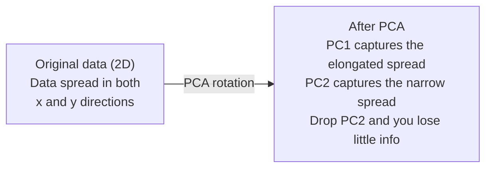

# आयामों में कमी 降维

> उच्च आयामी डेटा में संरचना है. आप इसे सही कोण से देख कर पा सकते हैं.
> उच्च स्तर के डेटा में संरचना है। आपको देखने के लिए सही कोण खोजने की आवश्यकता है।

**Type:** Build | **类型:** 动手
**Language:**पायथन**语言:**पायथन
**Prerequisites:** Phase 1, Lessons 01 (Linear Algebra Intuition), 02 (Vectors, Matrices & Operations), 03 (Eigenvalues & Eigenvectors), 06 (Probability & Distributions) | **前置知识:** Phase 1, Lessons 01-03, 06
**Time:** ~90 minutes | **时间:** ~90 分钟

## सीखने के लक्ष्य

- सीपीए को खरोंच से लागू करेंः केंद्र डेटा, कोवरिएंसी मैट्रिक्स की गणना, eigendecompose, और परियोजना
  शून्य से पीसीए को लागू करने से: डेटा सेंटरिज़ेशन, गणना, अनुपात रक्शन्स, विशेषता मूल्य विघटन, प्रोजेक्शन
- मुख्य घटकों की संख्या चुनने के लिए स्पष्ट भिन्नता अनुपात और कोहनी विधि का उपयोग करें
  उपयोग व्याख्या अनुपात और कद विधि मुख्य घटक संख्या चुनें
- 2D में MNIST अंकों को दृश्यमान बनाने के लिए PCA, t-SNE, और UMAP की तुलना करें और उनके व्यापार को समझाएं
  तुलना करें पीसीए, टी-एसएनई और UMAP में MNIST हस्तलिखित संख्या 2D दृश्यमानता में प्रभाव और वजन
- गैर-रेखीय डेटा संरचनाओं को अलग करने के लिए आरबीएफ कर्नेल के साथ कर्नेल पीसीए लागू करें जिन्हें मानक पीसीए संभाल नहीं सकता है
   अनुप्रयोग के साथ RBF 核的核 PCA 标准 PCA 无法处理的非线性数据结构

> **【中文解读】**
> 784 维 के हाथ से लिखे गए डिजिटल डेटा को दृश्यमान नहीं किया जा सकता है। 降维 यह है कि "उत्तम कोण" प्रोजेक्शन डेटा को ढूंढना, यथासंभव कम आयामों के साथ यथासंभव अधिक जानकारी को संरक्षित करना।

> **【拓展：降维在 AI 中的位置】**
> - **PCA**: sklearn की `PCA`, डेटा पूर्व प्रसंस्करण के मानक चरण, विशेषता मूल्य विघटन की सर्वोत्तम प्रथा को भी समझना है।
> - **t-SNE/UMAP**: उच्च आकार डेटा 2D दृश्यमानता मानक उपकरण, लेख में लगभग प्रत्येक एम्बेड दृश्यमानता उन पर उपयोग किया जाता है
> - **推荐系统**协同过本质上就是对用户物体矩阵做降维,发现隐因子──

## समस्या  समस्या परिचय

> **【中文解读】**784 维的手写数字数据(28×28 像素) को न तो देखा जा सकता है और न ही इसे सीधे समझा जा सकता है। लेकिन उनमें से अधिकांश में से अधिकांश एक हाथ से लिखे गए "7" को केवल कुछ महत्वपूर्ण विशेषताओं की आवश्यकता हैः पेंटिंग कोण,横线 लंबाई, झुकाव की डिग्री।

शायद यह हाथ से लिखे अंकों के पिक्सेल मान हैं. शायद यह जीन अभिव्यक्ति स्तर है. शायद यह उपयोगकर्ता व्यवहार संकेत है. आप 784 आयामों को कल्पना नहीं कर सकते हैं. आप उन्हें नहीं लिख सकते हैं. आप उनके बारे में भी नहीं सोच सकते हैं.
> शायद यह हाथ से लिखे गए संख्यात्मक चित्रण का मान है, शायद यह जीन अभिव्यक्ति स्तर है, शायद यह उपयोगकर्ता व्यवहार संकेत है। आप 784 आयाम को नहीं देख सकते, चित्र नहीं बना सकते, यहां तक कि कल्पना भी नहीं कर सकते हैं।

लेकिन उन 784 सुविधाओं में से अधिकांश अपर्याप्त हैं. वास्तविक जानकारी एक बहुत छोटी सतह पर रहती है। एक हाथ से लिखे गए "7" को इसे वर्णित करने के लिए 784 स्वतंत्र संख्याओं की आवश्यकता नहीं है। इसके लिए कुछ की आवश्यकता हैः स्ट्रोक का कोण, क्रॉसबार की लंबाई, यह कितना झुका है। बाकी शोर है।
> लेकिन इन 784 विशेषताओं में से अधिकांश अपर्याप्त हैं। वास्तव में उपयोगी जानकारी एक छोटे से पृष्ठ पर मौजूद है। एक हाथ से लिखे गए "7" को 784 स्वतंत्र संख्याओं की आवश्यकता नहीं है, केवल कुछ की आवश्यकता हैः पेंटिंग कोण,横线 लंबाई, झुकाव की डिग्री। शेष शोर है।

आयामों में कमी उस छोटे सतह को ढूंढती है। यह आपके 784 आयामी डेटा को लेती है और इसे 2, 10 या 50 आयामों में संपीड़ित करती है जबकि संरचना को बनाए रखती है जो मायने रखता है।
> 降维找到那个更小的面──它将784 维数据压缩到2、10 或50 维,同时保留有意义的结构──

## अवधारणा का मूल अवधारणा

> **【拓展：PCA 与 LoRA 的数学联系】**पीसीए (PCA) डेटा के मध्य अंतर का सबसे बड़ा दिशा (अर्थात् मुख्य घटक) पाता है, जो कि लोरा (LoRA) के मूल विचार के समान हैः वजन अद्यतन करने के लिए ΔW का प्रभावी सूचना केंद्रित है, जो कि कुछ दिशाओं पर केंद्रित है।

### आयामों के शाप का 维度灾难

उच्च आयामी स्थानों में सहज ज्ञान नहीं होता है। आयामों के बढ़ने के साथ तीन चीजें टूट जाती हैं।
> उच्चतम अंतरिक्ष अनुचित है। आयाम बढ़ने के साथ, तीन चीजें समस्याएं उत्पन्न होती हैं।

**Distance becomes meaningless.**उच्च आयामों में, किसी भी दो यादृच्छिक बिंदुओं के बीच की दूरी एक ही मूल्य पर मिलती है। यदि प्रत्येक बिंदु प्रत्येक अन्य बिंदु से लगभग एक ही दूरी है, तो निकटतम पड़ोसी खोज काम करना बंद कर देती है।
> **距离变得无意义。**उच्च स्तर पर, किसी भी दो यादृच्छिक बिंदुओं के बीच की दूरी समान मूल्य के करीब होती है। यदि प्रत्येक बिंदु अन्य सभी बिंदुओं से लगभग समान दूरी पर होता है, तो निकटतम पड़ोसी खोज विफल हो जाती है।

```
Dimension    Avg distance ratio (max/min between random points)
2            ~5.0
10           ~1.8
100          ~1.2
1000         ~1.02
```

**Volume concentrates in corners.**एक इकाई हाइपर क्यूब में 2 आयामों 2 आयामों है। 100 आयामों में, लगभग सभी मात्रा को केंद्र से दूर कोनों में है। डेटा बिंदु किनारों तक फैलते हैं और आपके मॉडल अंदर डेटा के लिए भूखे रहते हैं।
> **体积集中在角落。**d 维子超立方体 में 2 个角── 100 维中, लगभग सभी体积都在角落,远离中心──数据点扩散到边缘,模型在内部缺乏数据──

**You need exponentially more data.**एक अंतरिक्ष में नमूने की समान घनत्व बनाए रखने के लिए, 2D से 20D तक जाने का मतलब है कि आपको 10^18 गुना अधिक डेटा की आवश्यकता है. आपके पास कभी भी पर्याप्त नहीं है। आयामों को कम करने से डेटा घनत्व वापस कुछ काम करने योग्य हो जाता है।
> **需要指数级更多的数据。**2D से 20D तक, समान नमूना घनत्व बनाए रखने के लिए, 10^18 गुना डेटा की आवश्यकता होती है।

### पीसीए: महत्वपूर्ण दिशाएं ढूंढें

मुख्य घटक विश्लेषण (पीसीए) उन अक्षों को ढूंढता है जिनके साथ आपके डेटा सबसे अधिक भिन्न होते हैं। यह आपके निर्देशांक प्रणाली को घूमता है ताकि पहली अक्ष सबसे अधिक भिन्नता को पकड़ ले, दूसरी सबसे अधिक पकड़ ले, और इसी तरह।
> मुख्य घटक विश्लेषण (PCA) 找到数据变化最大的轴──它旋转坐标系,使得第一轴捕获最大方差,第二轴捕获次大方差,依类推──

एल्गोरिथ्मः
  算法步骤:

```
1. Center the data        (subtract the mean from each feature) / 数据中心化
2. Compute covariance     (how features move together) / 计算协方差
3. Eigendecomposition     (find the principal directions) / 特征值分解
4. Sort by eigenvalue     (biggest variance first) / 按特征值排序
5. Project               (keep top k eigenvectors, drop the rest) / 投影
```

स्व-संयोजन क्यों? सह-विवर्तन मैट्रिक्स सममित और सकारात्मक अर्ध-परिभाषित है। इसके स्व-वेक्टर विशेषता अंतरिक्ष में ऑर्थोगनल दिशाएं हैं। स्व-मूल्य आपको बताते हैं कि प्रत्येक दिशा कितनी भिन्नता को पकड़ती है। अधिकतम भिन्नता की दिशा के साथ सबसे बड़े स्व-मूल्य बिंदुओं वाला स्व-वेक्टर।
> क्यों विशेषता मूल्य का विघटन? सह-समय अंतर矩阵 है तथाकथित सही अर्ध निश्चित। इसका विशेषता भार है विशेषता अंतरिक्ष में सही समय दिशाएँ। विशेषता मूल्य आपको बताता है कि प्रत्येक दिशा में कितने वर्ग अंतर को पकड़ना है।



- **Before PCA:**डेटा बादल दोनों एक्स और वाई अक्षों पर विघात रूप से फैला है
  **PCA 前：**आंकड़े एक कोण के साथ x और y अक्ष के पार दिशा में
- **After PCA:**समन्वय प्रणाली को घूमा जाता है ताकि PC1 अधिकतम भिन्नता (अलंकृत प्रसार) की दिशा के साथ संरेखित हो और PC2 न्यूनतम भिन्नता (समीप्त प्रसार) की दिशा के साथ संरेखित हो।
  **PCA 后：**坐标系旋转,PC1 सबसे बड़े चौकोर दिशा,PC2 सबसे छोटे चौकोर दिशा
- **Dimensionality reduction:**पीसी 2 को छोड़ने से डेटा पीसी 1 पर प्रोजेक्ट होता है, बहुत कम जानकारी खो जाती है
  **降维：**PC2 को छोड़ दें, डेटा को PC1 पर प्रोजेक्ट करें, बहुत कम जानकारी खो दें

### व्याख्या भिन्नता अनुपात

प्रत्येक मुख्य घटक कुल भिन्नता का एक अंश कैप्चर करता है। समझाया गया भिन्नता अनुपात आपको बताता है कि कितना।
> प्रत्येक मुख्य घटक को पकड़ने के लिए कुल अंतर का हिस्सा है.

```
Component    Eigenvalue    Explained ratio    Cumulative
PC1          4.73          0.473              0.473
PC2          2.51          0.251              0.724
PC3          1.12          0.112              0.836
PC4          0.89          0.089              0.925
...
```

जब संचयी व्याख्या भिन्नता 0.95 तक पहुंच जाती है, तो आप जानते हैं कि कई घटकों में 95% जानकारी को कैप्चर किया जाता है। उसके बाद सब कुछ ज्यादातर शोर है।
> जब संचयी व्याख्या अंतर 0.95 तक पहुंचता है, तो ये तत्व 95% जानकारी को पकड़ लेते हैं। इसके बाद मूल रूप से शोर होता है।

### घटक की संख्या चुनना                                                                                                                                                                                                                                                                                                                                                                                                                                                                                                                         

तीन रणनीतियाँ:
  तीन प्रकार की रणनीति

1. **Threshold.**90-95% भिन्नता को स्पष्ट करने के लिए पर्याप्त घटक रखें।
   **阈值法。**90-95% के अंतर को समझने के लिए पर्याप्त सामग्री बनाए रखें।
2. **Elbow method.**प्लॉट प्रत्येक घटक के लिए भिन्नता की व्याख्या. एक तेज गिरावट के लिए देखो.
   **肘部法则。**चित्रण प्रत्येक घटक के विवरण, खोजें तेजी से घटने बिंदुओं
3. **Downstream performance.**पीसीए को पूर्व प्रसंस्करण के रूप में उपयोग करें। क को झाड़ो और अपने मॉडल की सटीकता को मापें। सबसे अच्छा क सटीकता पठारों पर है।
   **下游性能。**पीसीए 作为预处理――扫描 k 值并测量模型精度――最佳 k 在精度平台期处――

### टी-एसएनई: पड़ोसों को संरक्षित करना

t-विभाजित स्टोकास्टिक पड़ोसी एम्बेडिंग (t-SNE) दृश्यता के लिए डिज़ाइन किया गया है। यह 2D (या 3D) में उच्च आयामी डेटा का नक्शा बनाता है जबकि यह संरक्षित करता है कि कौन से बिंदु एक दूसरे के करीब हैं।
> t-SNE 专为可视化设计── यह 2D (या 3D) तक उच्च आकार के डेटा को मैप करेगा, जबकि कुछ बिंदुओं को एक दूसरे के करीब रखेगा──

अंतर्ज्ञानः मूल स्थान में, अपनी दूरी के आधार पर बिंदुओं के जोड़ों पर संभावना वितरण की गणना करें। निकट बिंदुओं पर उच्च संभावना मिलती है। दूर के बिंदुओं पर कम संभावना मिलती है। फिर एक 2D व्यवस्था खोजें जहां समान संभावना वितरण होता है। 784 आयामों में पड़ोसी थे जो बिंदु 2D में पड़ोसी रहते हैं।
> 直觉: मूल अंतरिक्ष में, दूरी पर आधारित गणना बिंदु के बीच संभावना वितरण── निकट बिंदु की संभावना उच्च, दूर बिंदु की संभावना कम── फिर एक 2D 排列 ढूंढना जिससे समान संभावना वितरण बनता──784 维 में पड़ोसी 2D में अभी भी पड़ोसी है──

t-SNE के मुख्य गुणः
  t-SNE की महत्वपूर्ण विशेषताएंः

- यह जटिल manifolds के लिए खुलासा कर सकते हैं कि PCA नहीं कर सकते.
  अपाहिरी, अपाहिरी, अपाहिरी, अपाहिरी, अपाहिरी, अपाहिरी, अपाहिरी, अपाहिरी, अपाहिरी, अपाहिरी, अपाहिरी, अपाहिरी, अपाहिरी, अपाहिरी, अपाहिरी, अपाहिरी, अपाहिरी, अपाहिरी, अपाहिरी, अपाहिरी, अपाहिरी, अपाहिरी, अपाहिरी, अपाहिरी, अपाहिरी, अपाहिरी, अपाहिरी, अपाहिरी, अपाहिरी, अपाहिरी, अपाहिरी, अपाहिरी, अपाहिरी, अपाहिरी, अपाहिरी, अपाहिरी, अपाहिरी, अपाहिरी, अपाहिरी, अपाहिरी, अपाहिरी, अपाहिरी, अपाहिरी, अपाहिरी, अपाहिरी, अपाहिरी, अपाहिरी, अपाहिरी, अपाहिरी, अपाहिरी, अपाहिरी, अपाहिरी, अपाहिरी, अपाहिरी, अपाहिरी, अपाहिरी, अपाहिरी, अपाहि, अपाहिरी, अपाहि, अपाहिरी, अपाहि, अपाहि, अपाहि, अपाहिरी, अपाहि, अपाहि, अपाहि, अपाहि, अपाहि, अपाहि, अपाहि, अपाहि, अपाहि, अपाहि, अपाहि, अपाहि, अपाहि, अपाहि, अपाहि, अपाहि, अपाहि, अपाहि, अपाहि, अपाहि, अपाहि, अपाहि, अपाहि, अपाहि, अपाहि, अपाहि, अपाहि, अपाहि, अपाहि, अपाहि, अपा, अपाहि, अपा, अपाहि, अपा, अपाहि, अपा, अपा, अपा, अपा, अपाहि, अपा, अपा, अपाहि, अपा, अपाहि, अपा, अपा, अपा, अपा, अपा, अप
- अलग-अलग रन अलग-अलग लेआउट पैदा करते हैं।
  随机性──不同运行产生不同布局──
- विडंबना पैरामीटर यह नियंत्रित करता है कि कितने पड़ोसियों को विचार किया जाना चाहिए (आमतौर पर रेंजः 5-50).
  भ्रम 参数控制考虑多少邻居 (परिभाषित सीमाः 5-50)
- आउटपुट में क्लस्टर के बीच की दूरी कोई मायने नहीं रखती है। केवल क्लस्टर स्वयं मायने रखती हैं।
  输出中聚类 के बीच की दूरी अर्थहीन है  केवल聚类 ही अर्थपूर्ण है
- बड़े डेटा सेट पर धीमा।
  बड़े डेटा संग्रह पर धीमी-धीमी

### UMAP: तेजी से, बेहतर वैश्विक संरचना

यूनिफ़ॉर्म मनिफोल्ड एप्रोक्सिमेशन एंड प्रोजेक्शन (UMAP) t-SNE के समान कार्य करता है लेकिन दो लाभों के साथः
> यूएमएपी और टी-एसएनई  के समान है, लेकिन दो फायदे हैंः

- यह सभी जोड़ी दूरी की गणना के बजाय निकटतम पड़ोसी के ग्राफ का उपयोग करता है।
  अधिक तेजी सेः निकट निकटता के नक्शे का उपयोग करें, न कि दूरी के लिए गणना करें।
- बेहतर वैश्विक संरचना। उत्पादन में समूहों की सापेक्ष स्थिति टी-एसएनई की तुलना में अधिक सार्थक होती है।
  बेहतर समग्र संरचना― आउटपुट में जमा वर्गों की तुलना में t-SNE अधिक सार्थक―

UMAP उच्च-आयामी स्थान में एक भारित ग्राफ ( "फ्यूजी टॉपॉलॉजिकल प्रतिनिधित्व") बनाता है और फिर एक निम्न-आयामी लेआउट पाता है जो इस ग्राफ को यथासंभव संरक्षित करता है।
> UMAP में उच्च स्तर के स्थान में निर्माण के लिए अधिकृत चित्रण (模糊拓表示) का प्रयोग किया जाता है, और फिर जितना संभव हो उतना इस चित्र को बनाए रखने का प्रयास किया जाता है।

मुख्य पैरामीटरः
  关键参数:

- `n_neighbors`: कितने पड़ोसियों ने स्थानीय संरचना को परिभाषित किया है (मिर्गी के समान) । उच्च मूल्य अधिक वैश्विक संरचना को बनाए रखते हैं।
  `n_neighbors`: कितने पड़ोसियों ने स्थानीय संरचना को परिभाषित किया है?
- `min_dist`निम्न मान अधिक घने क्लस्टर बनाते हैं।
  `min_dist`: आउटपुट मध्य बिंदुओं के घनत्व।

### कब किसको इस्तेमाल करें, किसको किस विधि का उपयोग करें?

| Method / 方法 | Use case / 使用场景 | Preserves / 保留 | Speed / 速度 |
|--------|----------|-----------|-------|
| PCA | Preprocessing before training / 训练前预处理 | Global variance / 全局方差 | Fast (exact), works on millions of samples / 快速（精确），支持百万级样本 |
| PCA | Quick exploratory visualization / 快速探索性可视化 | Linear structure / 线性结构 | Fast / 快 |
| t-SNE | Publication-quality 2D plots / 发表级 2D 图 | Local neighborhoods / 局部邻域 | Slow (< 10k samples ideal) / 慢（<1万样本最佳） |
| UMAP | 2D visualization at scale / 大规模 2D 可视化 | Local + some global structure / 局部+部分全局结构 | Medium (handles millions) / 中等（支持百万级） |
| PCA | Feature reduction for models / 模型特征降维 | Variance-ranked features / 方差排序特征 | Fast / 快 |
| t-SNE / UMAP | Understanding cluster structure / 理解聚类结构 | Cluster separation / 聚类分离 | Medium to slow / 中等到慢 |

अंगूठे का नियमः पूर्व प्रसंस्करण और डेटा संपीड़न के लिए पीसीए का उपयोग करें। जब आपको 2 डी में संरचना को दृश्यमान बनाने की आवश्यकता हो तो टी-एसएनई या यूएमएपी का उपयोग करें।
> अनुभव विधिः पीसीए पूर्व प्रसंस्करण और डेटा संपीड़न हेतु उपयोग किया जाता है।

### कर्नेल पीसीए

मानक पीसीए रैखिक उप-स्थानों को ढूंढता है। यह आपके निर्देशांक प्रणाली को घूमता है और अक्षों को छोड़ देता है। लेकिन क्या होगा यदि डेटा एक गैर-रेखीय बहुभुज पर स्थित है? 2 डी में एक वृत्त को किसी भी रेखा से अलग नहीं किया जा सकता है। मानक पीसीए मदद नहीं करेगा।
> 标准 PCA 找线性子空间―― लेकिन यदि डेटा गैर-线性流形 पर स्थित है तो क्या 2D के बीच के圆 को किसी भी सीधी रेखा से अलग नहीं किया जा सकता है?

कर्नेल पीसीए एक उच्च आयामी सुविधा अंतरिक्ष में लागू करता है कर्नेल फ़ंक्शन द्वारा प्रेरित, स्पष्ट रूप से उस अंतरिक्ष में निर्देशांक की गणना किए बिना। यह कर्नेल ट्रिक है - एसवीएम के पीछे एक ही विचार।
> 核PCA को परमाणु फ़ंक्शन द्वारा प्रेरित उच्च-गुणवत्ता अंतरिक्ष में लागू किया जाता है, स्पष्ट रूप से इस अंतरिक्ष में स्थितियों की गणना नहीं की जाती है।

एल्गोरिथ्मः
  算法步骤:

1. कर्नेल मैट्रिक्स K की गणना करें जहां K_ij = k(x_i, x_j)
   计算核矩阵 K, जिसमें K_ij = k(x_i, x_j)
2. सुविधाओं स्थान में कर्नेल मैट्रिक्स केंद्र
   विशेषण अंतरिक्ष में केंद्रीकृत परमाणु रक्छा
3. Eigendecompose केंद्रित कर्नेल मैट्रिक्स
   केन्द्रापसारक परमाणु रक्शन्स के लिए विशेषता मूल्य विघटन
4. शीर्ष स्वयं वेक्टर (1/sqrt द्वारा स्केल किया गया)
   顶部特征向量(缩放 1/sqrt(特征值)) यानी परिकल्पना के लिए

सामान्य कर्नेल फ़ंक्शंसः
  常见核函数:

| Kernel / 核函数 | Formula / 公式 | Good for / 适用于 |
|--------|---------|----------|
| RBF (Gaussian) | exp(-gamma * \|\|x - y\|\|^2) | Most nonlinear data, smooth manifolds / 大多数非线性数据，光滑流形 |
| Polynomial / 多项式 | (x . y + c)^d | Polynomial relationships / 多项式关系 |
| Sigmoid | tanh(alpha * x . y + c) | Neural network-like mappings / 类神经网络映射 |

कर्णल पीसीए बनाम मानक पीसीए का उपयोग कब करेंः
  核 PCA बनाम 标准 PCA का उपयोगः

| Criterion / 标准 | Standard PCA / 标准 PCA | Kernel PCA / 核 PCA |
|-----------|-------------|------------|
| Data structure / 数据结构 | Linear subspace / 线性子空间 | Nonlinear manifold / 非线性流形 |
| Speed / 速度 | O(min(n^2 d, d^2 n)) | O(n^2 d + n^3) |
| Interpretability / 可解释性 | Components are linear combinations of features / 成分是特征的线性组合 | Components lack direct feature interpretation / 成分缺乏直接特征解释 |
| Scalability / 可扩展性 | Works on millions of samples / 支持百万级样本 | Kernel matrix is n x n, memory-limited / 核矩阵为 n x n，受内存限制 |
| Reconstruction / 重建 | Direct inverse transform / 直接逆变换 | Requires pre-image approximation / 需要预图像近似 |

क्लासिक उदाहरणः 2D में एकाग्र वृत्त। दो अंक के छल्ले, एक दूसरे के अंदर। मानक पीसीए दोनों को एक ही रेखा पर प्रक्षेपित करता है - वर्गीकरण के लिए बेकार। आरबीएफ के साथ कर्नेल पीसीए आंतरिक वृत्त और बाहरी वृत्त को विभिन्न क्षेत्रों में मानचित्रित करता है, जिससे वे रैखिक रूप से अलग हो सकते हैं।
> 经典例:2D 同心圆──两圈点,一圈在另一圈内──标准PCA将两者投影到同一线上对分类无用──带RBF 核的核PCA将内圈和外圈映射到不同区域,使其线性可分──

### पुनर्निर्माण त्रुटि

आप 784 आयामों को 50 तक संपीड़ित किया है। आप क्या खो दिया है?
> आप 784 आयामों को 50 आयामों तक कम करेंगे।

पुनर्निर्माण त्रुटि का मापः
  测量重建误差:

1. k आयामों तक परियोजना डेटाः X_reduced = X @ W_k
   k 维 तक डेटा प्रोजेक्शन
2. पुनः निर्माणः X_hat = X_reduced @ W_k^T
   重建
3. गणना MSE: औसत
   计算 एमएसई

पीसीए के लिए, पुनर्निर्माण त्रुटि का स्पष्ट भिन्नता के साथ एक स्पष्ट संबंध हैः
> पीसीए के लिए, पुनर्निर्माण त्रुटियों और व्याख्यात्मक अंतरों के बीच एक सरल संबंध हैः

```
Reconstruction error = sum of eigenvalues NOT included
Total variance = sum of ALL eigenvalues
Fraction lost = (sum of dropped eigenvalues) / (sum of all eigenvalues)
```

प्रत्येक घटक के लिए स्पष्ट भिन्नता अनुपात हैः
> प्रत्येक घटक की व्याख्या निम्नानुसार हैः

```
explained_ratio_k = eigenvalue_k / sum(all eigenvalues)
```

घटकों की संख्या के खिलाफ संचयी व्याख्या भिन्नता को रेखांकन आपको "उलकह" वक्र देता है। घटकों की सही संख्या है जहांः
> चित्रण संचयी व्याख्या अनुपात और घटक संख्या के संबंध को "कोई अंग" वक्रण में प्राप्त किया गया है। सही घटक संख्या निम्नलिखित स्थान पर हैः

- वक्र फ्लैट आउट (कम रिटर्न) / 曲线变平(收益递减)
- संचयी भिन्नता आपके सीमा पार करती है (आमतौर पर 0.90 या 0.95) / 累积方差超值
- डाउनस्ट्रीम कार्य प्रदर्शन पठार / डाउनस्ट्रीम कार्य प्रदर्शन प्लेटफार्म तक पहुँचता है

पुनर्निर्माण त्रुटि के चयन के अलावा उपयोगी है। आप इसे विसंगतियों का पता लगाने के लिए उपयोग कर सकते हैंः उच्च पुनर्निर्माण त्रुटि वाले नमूने असाधारण हैं जो सीखे गए उप-स्थान में फिट नहीं होते हैं। यह उत्पादन प्रणालियों में पीसीए-आधारित विसंगतियों का पता लगाने का आधार है।
> पुनःनिर्माण त्रुटि केवल चयन के लिए ही नहीं है। आप असामान्य परीक्षण के लिए भी उपयोग कर सकते हैंः पुनःनिर्माण त्रुटि के उच्च नमूना सीखने के लिए असामान्य मान के अनुरूप नहीं है। यह उत्पादन प्रणाली में पीसीए के असामान्य परीक्षण का आधार है।

## इसे बनाओ, इसे पूरा करो।
```figure
pca-axes
```

## इसे बनाओ

> **【中文解读】**निम्न शून्य से पीसीए के पूर्ण कार्यान्वयन के लिए प्रक्रिया हैः डेटा सेंटरिज़ेशन → 协方差矩阵 → विशेषता मूल्य विघटन → 投影── फिर एमएनआईएसटी डेटा पर पीसीए, टी-एसएनई, यूएमएपी के दृश्यता प्रभावों के मुकाबले।

### चरण 1: पीसीए को शून्य से प्राप्त करना

```python
import numpy as np

class PCA:
    def __init__(self, n_components):
        self.n_components = n_components
        self.components = None
        self.mean = None
        self.eigenvalues = None
        self.explained_variance_ratio_ = None

    def fit(self, X):
        self.mean = np.mean(X, axis=0)
        X_centered = X - self.mean

        cov_matrix = np.cov(X_centered, rowvar=False)

        eigenvalues, eigenvectors = np.linalg.eigh(cov_matrix)

        sorted_idx = np.argsort(eigenvalues)[::-1]
        eigenvalues = eigenvalues[sorted_idx]
        eigenvectors = eigenvectors[:, sorted_idx]

        self.components = eigenvectors[:, :self.n_components].T
        self.eigenvalues = eigenvalues[:self.n_components]
        total_var = np.sum(eigenvalues)
        self.explained_variance_ratio_ = self.eigenvalues / total_var

        return self

    def transform(self, X):
        X_centered = X - self.mean
        return X_centered @ self.components.T

    def fit_transform(self, X):
        self.fit(X)
        return self.transform(X)
```

### चरण 2: सिंथेटिक डेटा पर परीक्षण।

```python
np.random.seed(42)
n_samples = 500

t = np.random.uniform(0, 2 * np.pi, n_samples)
x1 = 3 * np.cos(t) + np.random.normal(0, 0.2, n_samples)
x2 = 3 * np.sin(t) + np.random.normal(0, 0.2, n_samples)
x3 = 0.5 * x1 + 0.3 * x2 + np.random.normal(0, 0.1, n_samples)

X_synthetic = np.column_stack([x1, x2, x3])

pca = PCA(n_components=2)
X_reduced = pca.fit_transform(X_synthetic)

print(f"Original shape: {X_synthetic.shape}")
print(f"Reduced shape:  {X_reduced.shape}")
print(f"Explained variance ratios: {pca.explained_variance_ratio_}")
print(f"Total variance captured: {sum(pca.explained_variance_ratio_):.4f}")
```

### चरण 3: 2D में MNIST अंक

```python
from sklearn.datasets import fetch_openml

mnist = fetch_openml("mnist_784", version=1, as_frame=False, parser="auto")
X_mnist = mnist.data[:5000].astype(float)
y_mnist = mnist.target[:5000].astype(int)

pca_mnist = PCA(n_components=50)
X_pca50 = pca_mnist.fit_transform(X_mnist)
print(f"50 components capture {sum(pca_mnist.explained_variance_ratio_):.2%} of variance")

pca_2d = PCA(n_components=2)
X_pca2d = pca_2d.fit_transform(X_mnist)
print(f"2 components capture {sum(pca_2d.explained_variance_ratio_):.2%} of variance")
```

### चरण 4: स्क्लेयरन की तुलना करें

```python
from sklearn.decomposition import PCA as SklearnPCA
from sklearn.manifold import TSNE

sklearn_pca = SklearnPCA(n_components=2)
X_sklearn_pca = sklearn_pca.fit_transform(X_mnist)

print(f"\nOur PCA explained variance:     {pca_2d.explained_variance_ratio_}")
print(f"Sklearn PCA explained variance: {sklearn_pca.explained_variance_ratio_}")

diff = np.abs(np.abs(X_pca2d) - np.abs(X_sklearn_pca))
print(f"Max absolute difference: {diff.max():.10f}")

tsne = TSNE(n_components=2, perplexity=30, random_state=42)
X_tsne = tsne.fit_transform(X_mnist)
print(f"\nt-SNE output shape: {X_tsne.shape}")
```

### चरण 5: UMAP तुलना

```python
try:
    from umap import UMAP

    reducer = UMAP(n_components=2, n_neighbors=15, min_dist=0.1, random_state=42)
    X_umap = reducer.fit_transform(X_mnist)
    print(f"UMAP output shape: {X_umap.shape}")
except ImportError:
    print("Install umap-learn: pip install umap-learn")
```

## इसे फ्रेमवर्क के साथ लागू करें

> **【拓展：t-SNE vs UMAP 选哪个？】**t-SNE: क्लासिक विधि, maintain local neighbouring relations, adaptate to find data in the聚类结构──缺点:慢(O(n2))、 नए डेटा परोपण में उपयोग नहीं किया जा सकता──UMAP:更快(O(n))、 नए डेटा परोपण में उपयोग नहीं किया जा सकता──保留更多全局结构──2026 साल का सुझाव:探索性分析 Using UMAP,论文中中中中中中中 t-SNE(审稿人更熟悉)──两者都不适合合作为下游模型的特征工程步骤──

एक वर्गीकरणकर्ता के पहले पूर्व प्रसंस्करण के रूप में पीसीएः
> PCA को विभाजन के पूर्व प्रसंस्करण के रूप में उपयोग करनाः

```python
from sklearn.decomposition import PCA as SklearnPCA
from sklearn.linear_model import LogisticRegression
from sklearn.model_selection import train_test_split
from sklearn.metrics import accuracy_score

X_train, X_test, y_train, y_test = train_test_split(
    X_mnist, y_mnist, test_size=0.2, random_state=42
)

results = {}
for k in [10, 30, 50, 100, 200]:
    pca_k = SklearnPCA(n_components=k)
    X_tr = pca_k.fit_transform(X_train)
    X_te = pca_k.transform(X_test)

    clf = LogisticRegression(max_iter=1000, random_state=42)
    clf.fit(X_tr, y_train)
    acc = accuracy_score(y_test, clf.predict(X_te))
    var_captured = sum(pca_k.explained_variance_ratio_)
    results[k] = (acc, var_captured)
    print(f"k={k:>3d}  accuracy={acc:.4f}  variance={var_captured:.4f}")
```

784 आयामों से पहले प्रदर्शन पठारों।
> प्रदर्शन 784 से कम है, और यह आपके लिए सबसे अच्छा ऑपरेशन बिंदु है।

## इसे भेजें उत्पाद

इस पाठ से उत्पन्न होता हैः
> 本课程产出:

- `outputs/skill-dimensionality-reduction.md`- किसी दिए गए कार्य के लिए सही आयामीकरण घटाने की तकनीक चुनने की क्षमता
  एक विशिष्ट कार्य के लिए उपयुक्तता का चयन करने की तकनीक के कौशल दस्तावेज

## अभ्यास विषय

1. समर्थन के लिए पीसीए वर्ग को संशोधित करें `inverse_transform`. MNIST अंक को 10, 50 और 200 घटकों से पुनर्निर्माण करें. प्रत्येक के लिए पुनर्निर्माण त्रुटि (मूल से औसत वर्ग अंतर) प्रिंट करें।
   修改 PCA 类以支持 `inverse_transform`△ 10、50 和 200 个成分 वापरी MNIST संख्याएँ △ मुद्रण प्रत्येक के पुनर्निर्माण त्रुटि △

2. 5, 30 और 100 के साथ एक ही MNIST उपसमूह पर t-SNE चलाएं। आउटपुट कैसे बदलता है, इसका वर्णन करें। उलझन क्लस्टर तंगता को क्यों प्रभावित करता है?
   प्रयोग भ्रमितता  मूल्य 5、30 和 100 में एक ही MNIST 子集上运行 t-SNE。 विवरण आउटपुट परिवर्तन。 क्यों भ्रमितता 聚类密度 को प्रभावित करती है?

3. 50 सुविधाओं के साथ एक डेटासेट लें जहां केवल 5 सूचनात्मक हैं (एक के साथ उत्पन्न करें `sklearn.datasets.make_classification`) पीसीए लागू करें और जांचें कि क्या समझाया गया भिन्नता वक्र सही ढंग से पहचानता है कि डेटा प्रभावी रूप से 5-आयामी है।
    एक में 50 विशेषताएं हैं लेकिन केवल 5 उपयोगी डेटा संग्रह हैं ️️️️️️️️️️️️️️️️️️️️️️️️️️️️️️️️️️️️️️️️️️️️️️️️️️️️️️️️️️️️️️️️️️️️️️️️️️️️️️️️️️️️️️️️️️️️️️️️️️️️️️️️️️️️️️️️️️️️️️️️️️️️️️️️️️️️️️️️️️️️️️️️️️️️️️️️️️️️️️️️️️️️️️️️️️️️️️️️️️️️️️️️️️️️️️️️️️️️️️️️️️️️️️️️️️️️️️️️️️️️️️️️️️️️️️️️️️️️️️️️️️️️️️️️️️️️️️️️️️️️️️️️️️️️️️️️️️️️️️️️️️️️️️️️️️️️️️️️️️️️️️️️️️️️️️️️️️️️️️️️️️️️️️️️️️️️️️️️️️️️️️️️️️️️️️️️️️️️️️️️️️️️️️️️️️️️️️️️️️️️️️️️️️️️️️️️️️️️️️️️️️️️️️️️️️️️️️️️️️️️️️️️️️️️️️️️️️️️️️️️️️️️️️️️️️️️️️️️️️️️️️️️️️️️️️️️️️️️️️️️️️️️️️️️️️️️

## कीवर्ड्स  शब्द खोज तालिका

| Term / 术语 | What people say | What it actually means / 实际含义 |
|------|----------------|----------------------|
| Curse of dimensionality / 维度灾难 | "Too many features" | Distances, volumes, and data density all behave counterintuitively as dimensions grow. Models need exponentially more data to compensate. / 随维度增长，距离、体积和数据密度都反直觉。模型需要指数级更多数据来补偿。 |
| PCA / 主成分分析 | "Reduce dimensions" | Rotate your coordinate system so the axes align with the directions of maximum variance, then drop the low-variance axes. / 旋转坐标系使轴对齐最大方差方向，然后丢弃低方差轴。 |
| Principal component / 主成分 | "An important direction" | An eigenvector of the covariance matrix. The direction in feature space along which the data varies most. / 协方差矩阵的特征向量。特征空间中数据变化最大的方向。 |
| Explained variance ratio / 解释方差比 | "How much info this component has" | The fraction of total variance captured by one principal component. Sum the top k ratios to see how much k components preserve. / 一个主成分捕获的总方差比例。累加前 k 个比率看 k 个成分保留了多少。 |
| Covariance matrix / 协方差矩阵 | "How features correlate" | A symmetric matrix where entry (i,j) measures how feature i and feature j move together. Diagonal entries are individual variances. / 对称矩阵，第 (i,j) 项衡量特征 i 和 j 如何共同变化。对角项是各自方差。 |
| t-SNE | "That cluster plot" | A nonlinear method that maps high-dimensional data to 2D by preserving pairwise neighborhood probabilities. Good for visualization, not for preprocessing. / 非线性方法，通过保留成对邻域概率将高维数据映射到 2D。适合可视化，不适合预处理。 |
| UMAP | "Faster t-SNE" | A nonlinear method based on topological data analysis. Preserves both local and some global structure. Scales better than t-SNE. / 基于拓扑数据分析的非线性方法。保留局部和部分全局结构。扩展性优于 t-SNE。 |
| Perplexity / 困惑度 | "A t-SNE knob" | Controls the effective number of neighbors each point considers. Low perplexity focuses on very local structure. High perplexity captures broader patterns. / 控制每个点考虑的有效邻居数。低困惑度关注局部结构，高困惑度捕获更广模式。 |
| Manifold / 流形 | "The surface the data lives on" | A lower-dimensional surface embedded in a higher-dimensional space. A sheet of paper crumpled in 3D is a 2D manifold. / 嵌入高维空间的低维曲面。揉成团的纸是 2D 流形。 |

## आगे पढ़ना 延伸閱讀

- [A Tutorial on Principal Component Analysis](https://arxiv.org/abs/1404.1100)(शिलेंस) - पीसीए का स्पष्ट व्युत्पन्न
  पीसीए 清晰推导
- [How to Use t-SNE Effectively](https://distill.pub/2016/misread-tsne/)(Wattenberg et al.) - t-SNE की फंदे और पैरामीटर विकल्पों के लिए इंटरैक्टिव गाइड
  t-SNE 使用指南,交互式展示参数选择和陷
- [UMAP documentation](https://umap-learn.readthedocs.io/)- UMAP के लेखकों द्वारा सिद्धांत और व्यावहारिक मार्गदर्शन
  UMAP  सिद्धांत एवं अभ्यास मार्गदर्शन
