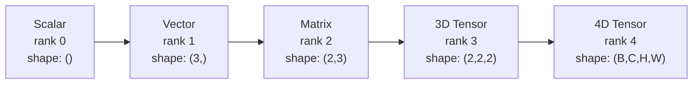
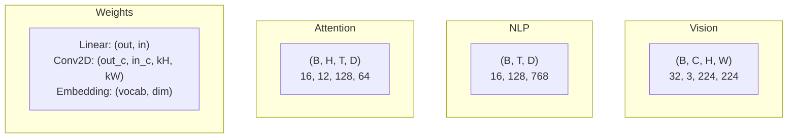
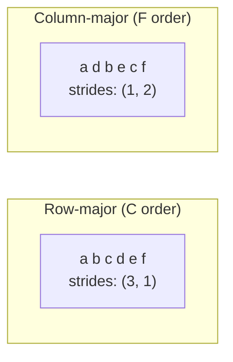
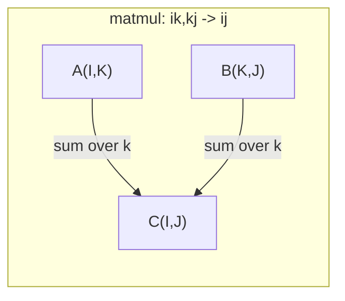

# Tensor ऑपरेशन 张量运算

> टेन्सर डेटा और गहन सीखने के बीच आम भाषा है. हर छवि, हर वाक्य, हर ग्रेडिएंट उनके माध्यम से बहता है.
> 张量是数据和深度学习 की सामान्य भाषा── प्रत्येक छवि, प्रत्येक वाक्य, प्रत्येक आयाम, प्रत्येक आयाम, प्रत्येक आयाम, प्रत्येक आयाम, प्रत्येक आयाम, प्रत्येक आयाम, प्रत्येक आयाम, प्रत्येक आयाम, प्रत्येक आयाम, प्रत्येक आयाम, प्रत्येक आयाम, प्रत्येक आयाम, प्रत्येक आयाम, प्रत्येक आयाम, प्रत्येक आयाम, प्रत्येक आयाम, प्रत्येक आयाम, प्रत्येक आयाम, प्रत्येक आयाम, प्रत्येक आयाम, प्रत्येक आयाम, प्रत्येक आयाम, प्रत्येक आयाम, प्रत्येक आयाम, प्रत्येक आयाम, प्रत्येक आयाम, प्रत्येक आयाम, प्रत्येक आयाम, प्रत्येक आयाम, प्रत्येक आयाम, प्रत्येक आयाम, प्रत्येक आयाम, प्रत्येक आयाम, प्रत्येक आयाम, प्रत्येक आयाम, प्रत्येक आयाम, प्रत्येक आयाम, प्रत्येक आयाम, प्रत्येक आयाम, प्रत्येक आयाम, प्रत्येक आयाम, प्रत्येक आयाम, प्रत्येक आयाम, प्रत्येक आयाम, प्रत्येक आयाम, प्रत्येक आयाम, प्रत्येक आयाम, प्रत्येक आयाम, प्रत्येक आयाम, प्रत्येक आयाम, प्रत्येक आयाम, प्रत्येक आयाम, प्रत्येक आयाम, प्रत्येक आयाम, प्रत्येक आयाम, प्रत्येक आयाम, प्रत्येक आयाम, प्रत्येक आयाम, प्रत्येक आयाम, प्रत्येक आयाम, प्रत्येक आयाम, प्रत्येक आयाम, प्रत्येक आयाम, प्रत्येक आयाम, प्रत्येक आयाम, प्रत्येक आयाम, प्रत्येक आयाम, प्रत्येक आयाम, प्रत्येक आयाम, प्रत्येक आयाम, प्रत्येक आयाम, प्रत्येक आयाम, प्रत्येक आयाम, प्रत्येक आयाम, प्रत्येक आयाम, प्रत्येक आयाम, प्रत्येक आयाम, प्रत्येक आयाम, प्रत्येक आयाम, प्रत्येक आयाम, प्रत्येक आयाम, प्रत्येक आयाम, प्रत्येक आयाम, प्रत्येक आयाम, प्रत्येक आयाम, प्रत्येक आयाम, प्रत्येक आयाम, प्रत्येक आयाम, प्रत्येक आयाम, प्रत्येक आयाम, प्रत्येक आयाम, प्रत्येक आयाम, प्रत्येक आयाम, प्रत्येक, प्रत्येक आयाम, प्रत्येक आयाम, प्रत्येक आयाम, प्रत्येक, प्रत्येक, प्रत्येक आयाम, प्रत्येक, प्रत्येक आयाम, प्रत्येक, प्रत्येक आयाम, प्रत्येक, प्रत्येक आयाम, प्रत्येक, प्रत्येक, प्रत्येक, प्रत्येक, प्रत्येक में, प्रत्येक में, प्रत्येक में, प्रत्येक में, प्रत्येक में, प्रत्येक में, प्रत्येक में, प्रत्येक में, प्रत्येक में, प्रत्येक में, प्रत्येक में, प्रत्येक में, प्रत्येक में, प्रत्येक में, प्रत्येक में, प्रत्येक में, प्रत्येक में, प्रत्येक में, प्रत्येक में, प्रत्येक में, प्रत्येक में, प्रत्येक में, प्रत्येक में, प्रत्येक में

**Type:** Build | **类型:** 动手
**Language:**पायथन**语言:**पायथन
**Prerequisites:** Phase 1, Lessons 01 (Linear Algebra Intuition), 02 (Vectors, Matrices & Operations) | **前置知识:** Phase 1, Lessons 01-02
**Time:** ~90 minutes | **时间:** ~90 分钟

## सीखने के लक्ष्य

- आकार, कदम, रीफॉर्म, ट्रांसपोज और तत्व-बुद्धिमान संचालन के साथ एक टेन्सर वर्ग को लागू करें
  शून्य से प्राप्त करने के लिए आकार, लंबाई, पुनः आकार, परिवर्तन और तत्वों के संचालन के लिए एक वर्ग
- डेटा को कॉपी किए बिना विभिन्न आकारों के टेंसर पर काम करने के लिए प्रसारण नियमों को लागू करें
  应用广播规则 विभिन्न आकारों के चार्ज मात्रा पर संचालन करने के लिए बिना कॉपी किए डेटा की आवश्यकता
- डॉट उत्पादों, मैट्रिक्स गुणन, बाहरी उत्पादों और बैच ऑपरेशन के लिए एकसम अभिव्यक्ति लिखें
   अंकगणित को लिखना  अंकगणित को व्यक्त करना  अंकगणित को व्यक्त करना  अंकगणित को व्यक्त करना  अंकगणित को व्यक्त करना  अंकगणित को व्यक्त करना  अंकगणित को व्यक्त करना  अंकगणित को व्यक्त करना  अंकगणित को व्यक्त करना  अंकगणित को व्यक्त करना  अंकगणित को व्यक्त करना  अंकगणित को व्यक्त करना  अंकगणित को व्यक्त करना  अंकगणित को व्यक्त करना  अंकगणित को व्यक्त करना  अंकगणित को व्यक्त करना  अंकगणित को व्यक्त करना  अंकगणित को व्यक्त करना  अंकगणित को व्यक्त करना  अंकगणित को व्यक्त करना  अंकगणित को व्यक्त करना  अंकगणित को व्यक्त करना  अंकगणित को व्यक्त करना  अंकगणित को व्यक्त करना
- बहु-मुख्य ध्यान के प्रत्येक चरण के माध्यम से सटीक टेंसर आकारों को ट्रैक करें
  विभिन्न ध्यान में प्रत्येक चरण के सटीक मात्रा आकार

> **【中文解读】**
> 张量是数据和深度学习 की सामान्य भाषा──向量是一维张量,矩阵是二维张量,RGB 图像是三维张量──本章从零实现张量类,理解形状、步长、广播和 einsum──Transformer 多头注意力中 Q/K/V 都是四维张量,理解张量形状是调试的关键──

## समस्या  समस्या परिचय

> **【中文解读】**आप एक ट्रांसफार्मर बनाया है, काम करने के बाद रिपोर्ट गलत है ।`RuntimeError: shapes cannot be multiplied (32x768 and 512x768)`◊ आकार  त्रुटि गहन सीखने में सबसे आम बग है ◊ ट्रांसफार्मर में कुछ रीफॉर्म / ट्रांसपोज / प्रसारण  ऑपरेशन संबद्ध हैं, एक轴搞错就级联报错──张量是向量和矩阵的推广,理解张量操作是调试神经网络的基本功──

## अवधारणा का मूल अवधारणा

> **【拓展：张量 shape 是 AI 工程师的日常】**调试神经网络 90% का समय 问题──关键工具:`print(tensor.shape)`查看形状,`.reshape()`重塑,`.transpose()`转置,`.unsqueeze()`增加维度──पायटॉर्च का एकसम`torch.einsum('bhd,bhd->bh', q, k)`) के साथ आइंस्टीन 求和约定一行搞定复杂张量运算, 转变器 实现的利器──

### क्या एक tensor है.

एक टेन्सर एक समान डेटा प्रकार के साथ संख्याओं का बहुआयामी सरणी है। आयामों की संख्या **rank**(या **order**) प्रत्येक आयाम एक **axis**. . .**shape**प्रत्येक अक्ष के साथ आकार सूचीबद्ध एक ट्यूपल है।
> 张量是统一数据类型的多维数组──维数是**秩**(या**阶**), प्रत्येक आयाम एक है**轴**,**形状**                                                                                                                                                                                                                                                              



कुल तत्व = सभी आकारों का उत्पाद। एक आकार `(2, 3, 4)`रखती है `2 * 3 * 4 = 24`तत्व।
> 总元素数 = 所有维度大小的乘积──形状 `(2, 3, 4)`包含 `2 * 3 * 4 = 24`个元素──

### गहन सीखने में तन्यता आकार

विभिन्न डेटा प्रकारों का मानचित्र विशिष्ट टेन्सर आकारों के लिए सम्मेलन द्वारा।
> विभिन्न डेटा प्रकारों को विशिष्ट मात्रा के आकार में सामान्य रूप से मैग किया जाता है।



PyTorch NCHW (चैनल-पहले) का उपयोग करता है। TensorFlow NHWC (चैनल-अंतिम) में डिफ़ॉल्ट रूप से काम करता है। असंगत लेआउट चुपचाप धीमा या त्रुटियों का कारण बनता है।
> PyTorch उपयोग NCHW(通道在前),TensorFlow 默认 NHWC(通道在后) ・布局不匹配会导致隐性减速或错误──

### मेमोरी लेआउट कैसे काम करता है

स्मृति में 2D सरणी बाइट्स का एक 1D अनुक्रम है। **Strides**आप प्रत्येक अक्ष के साथ एक कदम आगे बढ़ने के लिए आप कितने तत्वों को छोड़ना होगा बताता है।
> 内存 में 2D 数组 字节序列 ∈ 1D है।**步长** आपको बताएं कि प्रत्येक अक्ष के साथ कितने तत्वों को कूदने की आवश्यकता है 



ट्रांसपोज डेटा नहीं ले जाता है. यह कदमों को swaps, बना रही है टेन्सर **non-contiguous**-- एक पंक्ति के तत्व अब स्मृति में आसन्न नहीं हैं।
> 转置不移动数据──它交换步长,使张量**不连续** एक पंक्ति के तत्व अब स्मृति में परस्पर नहीं हैं

### प्रसारण नियम

प्रसारण आपको डेटा कॉपी किए बिना विभिन्न आकारों के टेंसर पर काम करने की अनुमति देता है। दाईं ओर से आकारों को संरेखित करें। दो आयाम संगत हैं जब वे समान हैं या एक 1 है। बाईं ओर 1s के साथ कम आयामों को पैच किया जाता है।
> 广播让你对形的不同张量操作而无需复制数据──右对齐形──两维相等或其中一个为1 时兼容──左侧较小的维度填满1──

```
Tensor A:     (8, 1, 6, 1)
Tensor B:        (7, 1, 5)
Padded B:     (1, 7, 1, 5)
Result:       (8, 7, 6, 5)
```

### एनिसमः सार्वभौमिक Tensor ऑपरेशन

आइंस्टीन योग प्रत्येक अक्ष को एक अक्षर से लेबल करता है इनपुट में अक्ष, लेकिन आउटपुट में नहीं योगित होते हैं। दोनों में अक्ष बनाए जाते हैं।
> आइंस्टीन 求和字母标记每轴── इनपुट में परंतु आउटपुट में अक्ष 求和── दोनों में अक्षों का आरक्षित होना──



मुख्य पैटर्नः `i,i->`(बिंदु उत्पाद / 点积), `i,j->ij`(बाहरी उत्पाद / 外积), `ii->`(ट्रेस / 迹), `ij->ji`(प्रस्थान्तरण / 转置), `bij,bjk->bik`(बैच मैटमुल / 批量矩阵乘法),`bhtd,bhsd->bhts`(ध्यान स्कोर / ध्यान शक्ति分数) ।

## इसे बनाओ, इसे पूरा करो।
```figure
tensor-broadcast
```

## इसे बनाओ

कोड में रहता है `code/tensors.py`. प्रत्येक चरण में वहाँ के कार्यान्वयन का उल्लेख किया गया है।
> 代码在 `code/tensors.py`मध्य ः हर कदम में वहाँ के कार्यान्वयन का उल्लेख किया जाता है ।

### चरण 1: टेंसर भंडारण और कदम.

एक टेन्सर संख्याओं की एक सपाट सूची और आकार के मेटाडेटा को संग्रहीत करता है। कदम सूचकांक तर्क को बताते हैं कि बहुआयामी सूचकांक को सपाट स्थानों पर कैसे मैप किया जाए।
> 张量存储一个平的数字列表加上形状元数据──步长告诉索引逻辑如何将多维索引映射到平位置──

```python
class Tensor:
    def __init__(self, data, shape=None):
        if isinstance(data, (list, tuple)):
            self._data, self._shape = self._flatten_nested(data)
        elif isinstance(data, np.ndarray):
            self._data = data.flatten().tolist()
            self._shape = tuple(data.shape)
        else:
            self._data = [data]
            self._shape = ()

        if shape is not None:
            total = reduce(lambda a, b: a * b, shape, 1)
            if total != len(self._data):
                raise ValueError(
                    f"Cannot reshape {len(self._data)} elements into shape {shape}"
                )
            self._shape = tuple(shape)

        self._strides = self._compute_strides(self._shape)

    @staticmethod
    def _compute_strides(shape):
        if len(shape) == 0:
            return ()
        strides = [1] * len(shape)
        for i in range(len(shape) - 2, -1, -1):
            strides[i] = strides[i + 1] * shape[i + 1]
        return tuple(strides)
```

आकार के लिए `(3, 4)`, कदम हैं `(4, 1)`-- एक पंक्ति आगे करने के लिए 4 तत्वों को छोड़ दें, एक स्तंभ आगे करने के लिए 1 तत्व को छोड़ दें।
> 对于形状 `(3, 4)`,步长为 `(4, 1)` अग्रिम में एक पंक्ति 4 तत्वों से कूदती है, अग्रिम में एक पंक्ति 1 तत्वों से कूदती है।

### चरण 2: रीसेट, दबाएं, अनस्प्रेस करें. चरण 2: पुनः आकार, संपीड़न, विस्तार आयाम

तत्वों की क्रम में परिवर्तन किए बिना आकार बदलता है। तत्वों की कुल संख्या समान रहना चाहिए। उपयोग `-1`एक आयाम के लिए उसके आकार का अनुमान लगाने के लिए।
> रीशैप  रूपांतरण  रूपांतरण  तत्वों की क्रमशः क्रमशः परिवर्तन नहीं करना चाहिए `-1`स्वयंचलित रूप से किसी एक आकार का अनुमान

```python
t = Tensor(list(range(12)), shape=(2, 6))
r = t.reshape((3, 4))
r = t.reshape((-1, 3))
```

स्क््रेस आकार 1 के धुरी को हटा देता है। अनस्क््रेस 1 को सम्मिलित करता है। अनस्क््रेसिंग प्रसारण के लिए महत्वपूर्ण है - एक पूर्वाग्रह वेक्टर`(D,)`एक बैच में जोड़ा गया `(B, T, D)``(1, 1, D)`. .
> Squeeze 移除大小为 1 के धुरी,Squeeze 插入一个──Squeeze 广播至关重要偏向向量 `(D,)`अतिरिक्त मात्रा में`(B, T, D)`ऊपर तक अनस्प्रेस करने की जरूरत है`(1, 1, D)`

```python
t = Tensor(list(range(6)), shape=(1, 3, 1, 2))
s = t.squeeze()
v = Tensor([1, 2, 3])
u = v.unsqueeze(0)
```

### चरण 3: स्थानांतरित और प्रतिस्थापन करें.

ट्रांसपोज दो अक्षों को स्वैप करता है. परमूट सभी अक्षों को फिर से क्रमबद्ध करता है. इस तरह आप एनसीएचडब्ल्यू और एनएचडब्ल्यूसी के बीच परिवर्तित करते हैं.
> ट्रांसपोज 交换两个轴── परमुट 重排所有轴── यह एनसीएचडब्ल्यू और एनएचडब्ल्यूसी  के बीच ट्रांसप्लेसमेंट का तरीका है──

```python
mat = Tensor(list(range(6)), shape=(2, 3))
tr = mat.transpose(0, 1)

t4d = Tensor(list(range(24)), shape=(1, 2, 3, 4))
perm = t4d.permute((0, 2, 3, 1))
```

ट्रांसपोस या परमुट के बाद, टेन्सर स्मृति में असंबद्ध है।`view`गैर-समीप्य टेंसर पर विफलता -- उपयोग `reshape`या कॉल`.contiguous()`पहले।
> 转置或排列后,张量在内存中不连续──PyTorch 中 `view`                                                                                                                                                                                                                                                              `reshape`या पहले调用`.contiguous()`

### चरण 4: तत्व-बुद्धिमान संचालन और घटाव।

तत्व-बुद्धिमान ऑपरेशन (जोड़ें, गुणा करें, घटाएं) प्रत्येक तत्व पर स्वतंत्र रूप से लागू होते हैं और आकार को बनाए रखते हैं। कमी (सumma, mean, max) एक या अधिक अक्षों को ढकढकाता है।
> 逐元素操作 (加、乘、减) स्वतंत्र रूप से प्रत्येक तत्व के लिए प्रयोग किया जाता है और आकार रखता है।

```python
a = Tensor([[1, 2], [3, 4]])
b = Tensor([[10, 20], [30, 40]])
c = a + b
d = a * 2
s = a.sum(axis=0)
```

एक सीएनएन में वैश्विक औसत बंडलिंगः `(B, C, H, W).mean(axis=[2, 3])`उत्पादन करता है `(B, C)`. एनएलपी में क्रमबद्धता का औसतः `(B, T, D).mean(axis=1)`उत्पादन करता है `(B, D)`. .
> सीएनएन के मध्य समग्र औसतकरणः`(B, C, H, W).mean(axis=[2, 3])` उत्पन्न `(B, C)`◊NLP के बीच क्रम औसत मूल्य अंकन:`(B, T, D).mean(axis=1)` उत्पन्न `(B, D)`

### चरण 5: NumPy के साथ प्रसारण

`demo_broadcasting_numpy()``tensors.py`कोर पैटर्न दिखाता है।
> `tensors.py`मध्य `demo_broadcasting_numpy()`函数 ने कोर मोड प्रदर्शित किया

```python
activations = np.random.randn(4, 3)
bias = np.array([0.1, 0.2, 0.3])
result = activations + bias

images = np.random.randn(2, 3, 4, 4)
scale = np.array([0.5, 1.0, 1.5]).reshape(1, 3, 1, 1)
result = images * scale

a = np.array([1, 2, 3]).reshape(-1, 1)
b = np.array([10, 20, 30, 40]).reshape(1, -1)
outer = a * b
```

प्रसारण के माध्यम से जोड़ी दूरीः पुनर्विकृति `(M, 2)``(M, 1, 2)`और `(N, 2)``(1, N, 2)`, घटाएँ, वर्ग, अंतिम अक्ष के साथ योग, वर्ग जड़ लें। परिणामः `(M, N)`. .
> 通过广播计算成对距离:将 `(M, 2)`重塑为 `(M, 1, 2)`,`(N, 2)`重塑为 `(1, N, 2)`,相减、平方、沿最后轴求和、取平方根── परिणाम:`(M, N)`

### चरण 6: Einsum ऑपरेशन

`demo_einsum()`और `demo_einsum_gallery()`कार्य हर सामान्य पैटर्न के माध्यम से चलते हैं।
> `demo_einsum()`和 `demo_einsum_gallery()`函数演示了每种常见模式──

```python
a = np.array([1.0, 2.0, 3.0])
b = np.array([4.0, 5.0, 6.0])
dot = np.einsum("i,i->", a, b)

A = np.array([[1, 2], [3, 4], [5, 6]], dtype=float)
B = np.array([[7, 8, 9], [10, 11, 12]], dtype=float)
matmul = np.einsum("ik,kj->ij", A, B)

batch_A = np.random.randn(4, 3, 5)
batch_B = np.random.randn(4, 5, 2)
batch_mm = np.einsum("bij,bjk->bik", batch_A, batch_B)
```

संकुचन की गणनात्मक लागत सभी सूचकांक आकारों (रहित और योगित) का उत्पाद है।`bij,bjk->bik`B=32, I=128, J=64, K=128: `32 * 128 * 64 * 128 = 33,554,432`गुणन-जोड़े।
> संकुचित की गणना लागत सभी सूचकांकों के गुणांक है।

### चरण 7: एक संक्षिप्त के माध्यम से ध्यान तंत्र।

`demo_attention_einsum()`कार्य अंत से अंत तक बहु-उपदे ध्यान लागू करता है।
> `demo_attention_einsum()`函数端到端实现多头注意力──

```python
B, H, T, D = 2, 4, 8, 16
E = H * D

X = np.random.randn(B, T, E)
W_q = np.random.randn(E, E) * 0.02

Q = np.einsum("bte,ek->btk", X, W_q)
Q = Q.reshape(B, T, H, D).transpose(0, 2, 1, 3)

scores = np.einsum("bhtd,bhsd->bhts", Q, K) / np.sqrt(D)
weights = softmax(scores, axis=-1)
attn_output = np.einsum("bhts,bhsd->bhtd", weights, V)

concat = attn_output.transpose(0, 2, 1, 3).reshape(B, T, E)
output = np.einsum("bte,ek->btk", concat, W_o)
```

प्रत्येक चरण एक टेन्सर ऑपरेशन हैः प्रोजेक्शन (मैटमूल via einsum), हेड स्प्लिटिंग (रेशप + ट्रांसपोज), ध्यान स्कोर (बैच मैटमूल via einsum), वजनदार योग (बैच मैटमूल via einsum), हेड मर्जिंग (ट्रान्सपोज + रीशप), आउटपुट प्रोजेक्शन (मैटमूल via einsum) ।
> प्रत्येक चरण में चयावधि संचालन होते हैंः投影 (投影)  einsum 矩阵乘法) 头分裂 (分化) 重力分数 (重塑)  einsum 批量矩阵乘法) 加权求和、头合并 (重塑) 输出投影──

## इसे फ्रेमवर्क के साथ लागू करें

### स्क्रैच बनाम नंबरपीई

| Operation / 操作 | Scratch (Tensor class) | NumPy |
|---|---|---|
| Create / 创建 | `Tensor([[1,2],[3,4]])` | `np.array([[1,2],[3,4]])` |
| Reshape / 重塑 | `t.reshape((3,4))` | `a.reshape(3,4)` |
| Transpose / 转置 | `t.transpose(0,1)` | `a.T` or `a.transpose(0,1)` |
| Squeeze / 压缩 | `t.squeeze(0)` | `np.squeeze(a, 0)` |
| Sum / 求和 | `t.sum(axis=0)` | `a.sum(axis=0)` |
| Einsum | N/A | `np.einsum("ij,jk->ik", a, b)` |

### स्क्रैच बनाम पायटॉर्च

```python
import torch

t = torch.tensor([[1, 2, 3], [4, 5, 6]], dtype=torch.float32)
t.shape
t.stride()
t.is_contiguous()

t.reshape(3, 2)
t.unsqueeze(0)
t.transpose(0, 1)
t.transpose(0, 1).contiguous()

torch.einsum("ik,kj->ij", A, B)
```

PyTorch ऑटोग्रेड, GPU समर्थन और अनुकूलित BLAS कर्नेल जोड़ता है। आकार की अर्थशास्त्र समान है। यदि आप खरोंच संस्करण को समझते हैं, तो PyTorch आकार त्रुटियां पठनीय हो जाती हैं।
> PyTorch  स्वचालित माइक्रोसॉफ्ट GPU  समर्थन और अनुकूलित BLAS 内核──形状语义 पूरी तरह से समान── समझ हाथ से लिखे संस्करण के बाद, PyTorch के आकार त्रुटि हो गया पढ़ना योग्य──

### प्रत्येक तंत्रिका नेटवर्क परत एक tensor ऑपरेशन के रूप में है

| Operation / 操作 | Tensor Form / 张量形式 | Einsum |
|---|---|---|
| Linear layer / 线性层 | `Y = X @ W.T + b` | `"bd,od->bo"` + bias |
| Attention QKV | `Q = X @ W_q` | `"btd,dh->bth"` |
| Attention scores / 注意力分数 | `Q @ K.T / sqrt(d)` | `"bhtd,bhsd->bhts"` |
| Attention output / 注意力输出 | `softmax(scores) @ V` | `"bhts,bhsd->bhtd"` |
| Batch norm / 批归一化 | `(X - mu) / sigma * gamma` | element-wise + broadcast |
| Softmax | `exp(x) / sum(exp(x))` | element-wise + reduction |

## इसे भेजें उत्पाद

इस पाठ में दो पुनः प्रयोज्य संकेत दिए गए हैंः
> इस पाठ्यक्रम में दो दो दोहराए जाने योग्य सुझाव दिए गए हैंः

1. **`outputs/prompt-tensor-shapes.md`**-- टेन्सर आकार असंगतियों डिबग करने के लिए एक व्यवस्थित संकेत।
   एक व्यवस्थित रूप से आकार का एक हिस्सा

2. **`outputs/prompt-tensor-debugger.md`**-- एक कदम-दर-चरण डिबगिंग निर्देश आप किसी भी एआई सहायक में पेस्ट जब एक आकार त्रुटि आप अवरुद्ध कर रहा है.
   एक चरणबद्ध अनुशंसा शब्द, किसी भी एआई सहायक में चिपकाएँ जब आकार त्रुटि अवरुद्ध हो जाए

## अभ्यास विषय

1. **Easy -- Reshape round-trip.**आकार का एक टेन्सर लें `(2, 3, 4)`. इसे रीसेट करें .`(6, 4)`, फिर `(24,)`, फिर वापस `(2, 3, 4)`. सत्यापित तत्व क्रम प्रत्येक चरण में फ्लैट डेटा प्रिंट करके संरक्षित किया जाता है।
   **简单 -- 重塑往返。**取形形 `(2, 3, 4)`张量,重塑为 `(6, 4)`, पुनः लिए `(24,)`, पुनः लौटें `(2, 3, 4)`验证元素顺序保持不变──

2. **Medium -- Implement broadcasting.**`Tensor`कक्षा के साथ `broadcast_to(shape)`एक लक्ष्य आकार से मेल खाने के लिए आकार 1 के आयामों का विस्तार करने की विधि।`_elementwise_op`ऑपरेशन से पहले स्वचालित प्रसारण के लिए।`(3, 1)`और `(1, 4)`उत्पादन`(3, 4)`. .
   **中等 -- 实现广播。**`Tensor`类中添加 `broadcast_to(shape)`方法──修改 `_elementwise_op`स्वयंचलित प्रसारण---परीक्षा`(3, 1)`和 `(1, 4)` उत्पन्न `(3, 4)`

3. **Hard -- Build einsum from scratch.**एक बुनियादी `einsum(subscripts, *tensors)`फ़ंक्शन जो कम से कमः डॉट प्रॉडक्ट (`i,i->`), मैट्रिक्स गुणा (`ij,jk->ik`), बाहरी उत्पाद (`i,j->ij`), और इसे पार कराना (`ij->ji`) सबस्क्रिप्ट स्ट्रिंग को विश्लेषण करें, अनुबंधित सूचकांक की पहचान करें, और सभी सूचकांक संयोजनों पर लूप करें। अपने परिणामों की तुलना करें `np.einsum`. .
   **困难 -- 从零构建 einsum。**实现基本的 `einsum`函数处理点积、矩阵乘法、外积和转置──解析下标字符串, पहचान संकुचन सूचकांक,遍历所有索引组合──

4. **Hard -- Attention shape tracker.**एक फ़ंक्शन लिखें जो लेता है `batch_size`,`seq_len`,`embed_dim`और `num_heads`इनपुट और प्रिंट के रूप में सटीक आकार के प्रत्येक कदम के लिए बहु-मुख्य ध्यान.
   **困难 -- 注意力形状追踪器。**编写函数,输入 `batch_size``seq_len``embed_dim`和 `num_heads`, प्रत्येक चरण का सटीक रूप छापें

## कीवर्ड्स  शब्द खोज तालिका

| Term / 术语 | What people say | What it actually means / 实际含义 |
|---|---|---|
| Tensor / 张量 | "A matrix but more dimensions" | A multi-dimensional array with uniform type and defined shape, strides, and operations / 具有统一类型和定义的形状、步长、操作的多维数组 |
| Rank / 秩 | "The number of dimensions" | The number of axes. A matrix has rank 2, not rank equal to its matrix rank / 轴的数量。矩阵的秩为 2 |
| Shape / 形状 | "The size of the tensor" | A tuple listing the size along each axis. `(2, 3)` means 2 rows, 3 columns / 列出各轴大小的元组 |
| Stride / 步长 | "How memory is laid out" | The number of elements to skip to advance one position along each axis / 沿每个轴前进一个位置要跳过的元素数 |
| Broadcasting / 广播 | "It just works when shapes differ" | A strict set of rules: align from right, dimensions must be equal or one must be 1 / 严格规则：从右对齐，维度必须相等或一个为 1 |
| Contiguous / 连续 | "The tensor is normal" | Elements stored sequentially in memory with no gaps / 元素在内存中顺序存储无间隙 |
| Einsum | "A fancy way to write matmul" | A general notation that expresses any tensor contraction, outer product, trace, or transpose in one line / 通用表示法，一行表达任何张量收缩、外积、迹或转置 |
| View / 视图 | "Same as reshape" | A tensor sharing the same memory buffer but with different shape/stride metadata. Fails on non-contiguous data / 共享内存缓冲区但形状/步长元数据不同的张量 |
| Contraction / 收缩 | "Summing over an index" | The general operation where a shared index between tensors is multiplied and summed / 共享索引被乘和求和的通用操作 |
| NCHW / NHWC | "PyTorch vs TensorFlow format" | Memory layout conventions for image tensors / 图像张量的内存布局约定 |

## आगे पढ़ना 延伸閱讀

- [NumPy Broadcasting](https://numpy.org/doc/stable/user/basics.broadcasting.html)-- दृश्य उदाहरणों के साथ कैनोनिक नियम
  संख्यापाय 广播规则与可视化示例
- [PyTorch Tensor Views](https://pytorch.org/docs/stable/tensor_view.html)-- जब दृश्य काम करते हैं और जब वे कॉपी करते हैं
  PyTorch 视图何时工作何时复制
- [einops](https://github.com/arogozhnikov/einops)-- एक पुस्तकालय जो टेन्सर रीफाइमिंग पठनीय और सुरक्षित बनाता है
  让张量重塑可读且安全的库
- [The Illustrated Transformer](https://jalammar.github.io/illustrated-transformer/)-- ध्यान के माध्यम से बहने वाले टेन्सर के आकारों को दृश्यमान करता है
  दृश्यता ध्यान में प्रवाह का आकार
- [Einstein Summation in NumPy](https://numpy.org/doc/stable/reference/generated/numpy.einsum.html)-- उदाहरणों के साथ पूर्ण एकसम प्रलेखन
  संख्यात्मक संख्ये  पूर्ण दस्तावेज एवं उदाहरण
