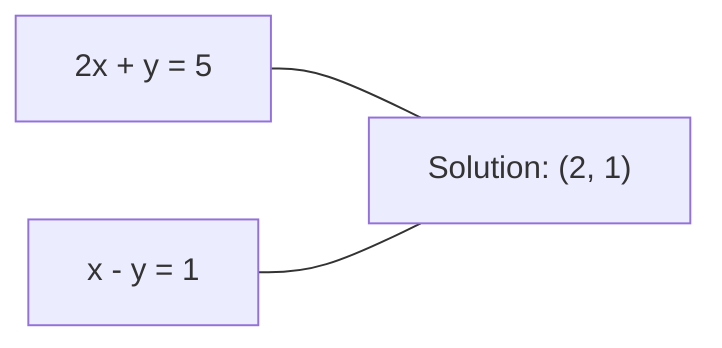
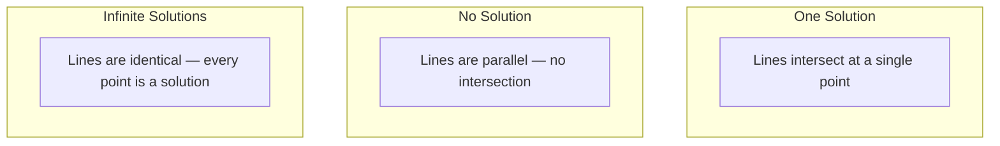

# रैखिक प्रणाली

> Ax = b को हल करना गणित में सबसे पुरानी समस्या है जो अभी भी आपके तंत्रिका नेटवर्क को चलाती है।
> 解 Ax=b गणित में सबसे पुरानी समस्या है, जो आज भी आपके तंत्रिका नेटवर्क को चला रही है।

**Type:** Build | **类型:** 动手
**Language:**पायथन**语言:**पायथन
**Prerequisites:** Phase 1, Lessons 01 (Linear Algebra Intuition), 02 (Vectors & Matrices), 03 (Matrix Transformations) | **前置知识:** Phase 1, 第 01 课（线性代数直觉）、第 02 课（向量与矩阵）、第 03 课（矩阵变换）
**Time:** ~120 minutes | **时间:** ~120 分钟

## सीखने के लक्ष्य

- आंशिक पिवटिंग और बैक रिप्लेसमेंट के साथ गौशियन उन्मूलन का उपयोग करके एक्स = बी हल करें
  उपयोग带部分主元选取(Partial Pivoting) के高斯消元法和回代法求解 Ax = b
- LU, QR और Cholesky विघटन के साथ कारक मैट्रिक्स और समझाएं कि प्रत्येक उपयुक्त कब है
  प्रयोग LU、QR 和 Cholesky 分解(विघटन) विभाजित矩阵,并解释各方法的适用场景
- न्यूनतम वर्गों के लिए सामान्य समीकरणों को व्युत्पन्न करें और उन्हें रैखिक और रिज रिग्रेशन से जोड़ें
  推导最小二乘法正规方程(नियमित समीकरण),并将其与线性归归和归联系起来
- स्थिति संख्या का उपयोग करके खराब स्थिति वाले प्रणालियों का निदान करें और उन्हें स्थिर करने के लिए नियमितता लागू करें
  प्रयोग शर्त संख्या (Condition Number) निदान रोग态系统,并应用正则化 (अनुप्रयोग)


> **【中文解读】**
> 解 Ax=b गणित में सबसे पुराना प्रश्न है                                                                                                                                                                                                                                                          

## समस्या  समस्या परिचय

जब भी आप एक रैखिक regression को प्रशिक्षित करते हैं, आप एक रैखिक प्रणाली को हल करते हैं. जब भी आप एक न्यूनतम वर्ग फिट की गणना करते हैं, आप एक रैखिक प्रणाली को हल करते हैं. जब भी एक तंत्रिका नेटवर्क परत गणना करता है।`y = Wx + b`जब आप नियमितता जोड़ते हैं, तो आप प्रणाली को संशोधित करते हैं. जब आप गौशियन प्रक्रियाओं का उपयोग करते हैं, तो आप एक मैट्रिक्स को गुणा करते हैं. जब आप महालनोबी की दूरी के लिए एक सह-विवर्तन मैट्रिक्स को उलटते हैं, तो आप एक रैखिक प्रणाली को हल करते हैं।

> प्रत्येक प्रशिक्षण में, आप सभी को एक संक्षिप्त प्रणाली में हल करते हैं। प्रत्येक गणना में, आप सभी को एक संक्षिप्त प्रणाली में हल करते हैं। प्रत्येक तंत्रिका नेटवर्क स्तर की गणना में।`y = Wx + b`, यह एक तरफ है मूल्यांकन रैखिक प्रणाली में. . . . . . . . . . . . . . . . . . . . . . . . . . . . . . . . . . . . . . . . . . . . . . . . . . . . . . . . . . . . . . . . . . . . . . . . . . . . . . . . . . . . . . . . . . . . . . . . . . . . . . . . . . . . . . . . . . . . . . . . . . . . . . . . . . . . . . . . . . . . . . . . . . . . . . . . . . . . . . . . . . . . . . . . . . . . . . . . . . . . . . . . . . . . . . . . . . . . . . . . . . . . . . . . . . . . . . . . . . . . . . . . . . . . . . . . . . . . . . . . . . . . . . . . . . . . . . . . . . . . . . . . . . . . . . . . . . . . . . . . . . . . . . . . . . . . . . . . . . . . . . . . . . . . . . . . . . . . . . . . . . . . . . . . . . . . . . . . . . . . . . . . . . . . . . . . . . . . . . . . . . . . . . . . . . . . . . . . . . . . . . . . . . . . . . . . . . . . . . . . . . . . . . . . . . . . . . . . . . . . . . . . . . . . . . . . . . . . . . . . . . . . . . . . . . . . . . . . . . . . . . . . . . . . . . . . . . . . . . . . . . . . . . . . . . . . . . . . . . .

समीकरण Ax = b हर जगह दिखाई देता है. A ज्ञात गुणांक का एक मैट्रिक्स है. b ज्ञात आउटपुट का एक वेक्टर है. x अज्ञात का वेक्टर है जिसे आप ढूंढना चाहते हैं. रैखिक प्रतिगमन में, A आपकी डेटा मैट्रिक्स है, b आपका लक्ष्य वेक्टर है, और x आपका वजन वेक्टर है. पूरा मॉडल निम्न तक कम हो जाता हैः x को ढूंढें ताकि Ax जितना संभव हो उतना b के करीब हो।

> 方程 Ax = b 无处不在──A है ज्ञात系数矩阵,b है ज्ञात आउटपुट वेवमेंट,x है आपके द्वारा अपेक्षित अज्ञात वेवमेंट──在线性归归中,A है डेटा矩阵,b है लक्ष्य वेवमेंट,x है权重 वेवमेंट── संपूर्ण मॉडल का समापन इस प्रकार किया गया हैः ढूंढें x उपयोग करें Ax 尽可能接近 b──

इस पाठ में उस समीकरण को हल करने के लिए हर प्रमुख विधि को खरोंच से बनाया गया है। आप समझेंगे कि कुछ विधियां तेज क्यों हैं और अन्य स्थिर क्यों हैं, क्यों कुछ केवल वर्ग प्रणालियों के लिए काम करते हैं और अन्य ओवरडेटर्मिनेटेड सिस्टम को संभालते हैं, और क्यों आपके मैट्रिक्स की स्थिति संख्या निर्धारित करती है कि क्या आपका उत्तर कुछ भी मायने रखता है।

> इस पाठ में शून्य से निर्माण और इस समीकरण के सभी मुख्य तरीकों का समाधान किया गया है। आप समझेंगे कि क्यों कुछ तरीके तेज़ और कुछ स्थिर हैं, क्यों कुछ केवल समीकरण प्रणाली के लिए लागू होते हैं जबकि कुछ सुपरफिक्स्ड सिस्टम को संभाल सकते हैं, और क्यों समीकरण की शर्तों की संख्या आपके उत्तर का अर्थ निर्धारित करती है या नहीं।

## अवधारणा का मूल अवधारणा

> **【中文解读】**
> Ax=b के भौतिकीय अर्थः प्रत्येक वर्ग समीकरण एक सुपरप्लेन को परिभाषित करता है, समाधान सभी सुपरप्लेन के सहबिन्दु हैं।

> **【拓展：线性系统在推荐系统中的规模】**
> नेटफ्लिक्स पुरस्कार प्रतियोगिता में, रैंक विघटन समस्या 480,000 उपयोगकर्ताओं और 17,770 फिल्मों से संबंधित थी। लगभग 500,000 x 17,770 रैंक के लिए उच्च कुशल रैंक विघटन एल्गोरिदम की आवश्यकता थी। नेटफ्लिक्स पुरस्कार प्रतियोगिता ने बड़े पैमाने पर रैंक विघटन एल्गोरिदम के विकास को बढ़ावा दिया।

### ज्यामितीय रूप से एक्स = बी का क्या अर्थ है

रैखिक समीकरणों की एक प्रणाली में ज्यामितीय व्याख्या होती है। प्रत्येक समीकरण एक हाइपरप्लेन को परिभाषित करता है। समाधान वह बिंदु (या बिंदुओं का एक सेट) है जहां सभी हाइपरप्लेन पार करते हैं।

> 线性方程组有几何解释── प्रत्येक方程 परिभाषित एक超平面 (超平面)──解是所有超平面的交点 (交点)──

```
2x + y = 5          Two lines in 2D.
x - y  = 1          They intersect at x=2, y=1.
```



तीन चीजें हो सकती हैंः



मैट्रिक्स के रूप में, "एक समाधान" का अर्थ है कि A परिवर्तनीय है। "कोई समाधान" का अर्थ है कि प्रणाली असंगत है। "असीमित समाधान" का अर्थ है कि A में शून्य स्थान है। अधिकांश ML समस्याएं "कोई सटीक समाधान" श्रेणी में आती हैं क्योंकि आपके पास अज्ञात (परिमाणकों) की तुलना में अधिक समीकरण (डेटा पॉइंट) हैं। यही वह जगह है जहां कम से कम वर्ग आते हैं।

> प्रयोग矩阵语言说, "एक解" का अर्थ है एक 可逆──"无解" का अर्थ है प्रणाली不一致──"无穷多解" का अर्थ है एक शून्य अंतरिक्ष (零空间) ∼ अधिकांश ML 问题属于"无精确解"类别,因为方程数 (数据点) 更多于未知数 (参数) ∼这是最小二乘法的武之地──

### स्तंभ चित्र बनाम पंक्ति चित्र

Ax = b को पढ़ने के दो तरीके हैं।

> 阅读 Ax = b दो तरह के तरीके हैं

**Row picture.**A की प्रत्येक पंक्ति एक समीकरण को परिभाषित करती है. प्रत्येक समीकरण एक हाइपरप्लेन है. समाधान है जहां वे सभी पार करते हैं.

> **行视角。**ए के प्रत्येक पंक्ति एक समीकरण को परिभाषित करती है। प्रत्येक समीकरण एक सुपरप्लेन है।

**Column picture.**A के प्रत्येक स्तंभ एक वेक्टर है. प्रश्न यह बन जाता हैः A के स्तंभों का कौन सा रैखिक संयोजन b का उत्पादन करता है?

> **列视角。**प्रश्न बन जाता हैः A के प्रत्येक पंक्ति का क्या लाइनर संयोजन (रैखिक संयोजन) b उत्पन्न कर सकता है?

```
A = | 2  1 |    b = | 5 |
    | 1 -1 |        | 1 |

Row picture: solve 2x + y = 5 and x - y = 1 simultaneously.

Column picture: find x1, x2 such that:
  x1 * [2, 1] + x2 * [1, -1] = [5, 1]
  2 * [2, 1] + 1 * [1, -1] = [4+1, 2-1] = [5, 1]   check.
```

स्तंभ चित्र अधिक मौलिक है. यदि b स्तंभ स्थान A में स्थित है, तो प्रणाली का एक समाधान है. यदि b नहीं है, तो आप स्तंभ स्थान में सबसे निकटतम बिंदु मिल जाएगा. यह सबसे निकटतम बिंदु सबसे कम वर्ग समाधान है.

> 列视角更根本── यदि b A में 列空间 (Column Space) में, सिस्टम है हल── यदि b 列空间 में नहीं है, तो आप 列空间 में निकटतम बिंदु को पाते हैं── वह निकटतम बिंदु न्यूनतम द्वितीयक हल──

### गौसीयन उन्मूलन

गौसीयन उन्मूलन एक्स = बी को ऊपरी त्रिकोणात्मक प्रणाली Ux = c में बदल देता है जिसे आप बैक सब्सट्रेशन द्वारा हल करते हैं। यह सबसे सीधा तरीका है।

> 高斯消元法将 Ax = b 转化为上三角系统 Ux = c,然后通过回代法求解――这是最直接的方法――

एल्गोरिथ्मः

```
1. For each column k (the pivot column):
   a. Find the largest entry in column k at or below row k (partial pivoting).
   b. Swap that row with row k.
   c. For each row i below k:
      - Compute multiplier m = A[i][k] / A[k][k]
      - Subtract m times row k from row i.
2. Back substitute: solve from the last equation upward.
```

उदाहरण:

```
Original:
| 2  1  1 | 8 |       R2 = R2 - (2)R1     | 2  1   1 |  8 |
| 4  3  3 |20 |  -->  R3 = R3 - (1)R1 --> | 0  1   1 |  4 |
| 2  3  1 |12 |                            | 0  2   0 |  4 |

                       R3 = R3 - (2)R2     | 2  1   1 |  8 |
                                       --> | 0  1   1 |  4 |
                                           | 0  0  -2 | -4 |

Back substitute:
  -2 * x3 = -4    -->  x3 = 2
  x2 + 2  = 4     -->  x2 = 2
  2*x1 + 2 + 2 = 8 --> x1 = 2
```

Gaussian elimination costs O ((n^3) ऑपरेशन. 1000x1000 सिस्टम के लिए, यह लगभग एक अरब फ्लोटिंग-पॉइंट ऑपरेशन है. तेजी से, लेकिन आप बेहतर कर सकते हैं यदि आपको एक ही A के साथ कई सिस्टम हल करने की आवश्यकता है।

> 1000x1000 के लिए, लगभग एक अरब बार अपवर्तन बिंदुओं का संचालन करना आवश्यक है।

> **【中文解读】**
> उच्चतम विलय विधि का विचार बहुत सरल हैः एक पंक्ति के माध्यम से एक त्रिभुज के रूप में एक रेंज को बदलना, फिर अंतिम पंक्ति से "बदलाव" की मांग करना शुरू करना।

### आंशिक पिवटिंगः यह क्यों मायने रखता है

बिना पिवोट किए, गौसियन उन्मूलन विफल हो सकता है या कचरा पैदा कर सकता है। यदि पिवोट तत्व शून्य है, तो आप शून्य से विभाजित करते हैं। यदि यह छोटा है, तो आप गोल त्रुटि को बढ़ाते हैं।

>  कोई मुख्य मुद्रा नहीं चुनती, उच्चतम उपभोग्य मुद्रा विधि असफल हो सकती है या कचरा उत्पन्न कर सकती है  यदि मुख्य मुद्रा शून्य है, तो आप शून्य में विभाजित होंगे  यदि मुख्य मुद्रा बहुत छोटी है, तो आप त्रुटि में वृद्धि करेंगे

```
Bad pivot:                       With partial pivoting:
| 0.001  1 | 1.001 |            Swap rows first:
| 1      1 | 2     |            | 1      1 | 2     |
                                 | 0.001  1 | 1.001 |
m = 1/0.001 = 1000              m = 0.001/1 = 0.001
R2 = R2 - 1000*R1               R2 = R2 - 0.001*R1
| 0.001  1     | 1.001   |      | 1      1     | 2     |
| 0     -999   | -999.0  |      | 0      0.999 | 0.999 |

x2 = 1.000 (correct)            x2 = 1.000 (correct)
x1 = (1.001 - 1)/0.001          x1 = (2 - 1)/1 = 1.000 (correct)
   = 0.001/0.001 = 1.000        Stable because the multiplier is small.
```

सीमित सटीकता के साथ फ्लोटिंग-पॉइंट अंकगणित में, अनपॉइंट संस्करण महत्वपूर्ण अंकों को खो सकता है। आंशिक प्वाइंटिंग हमेशा त्रुटि प्रवर्धन को कम करने के लिए सबसे बड़ा उपलब्ध प्वाइंट चुनता है।

> सीमित सटीकता वाले फ़ॉवरपॉइंट संचालन में, बिना मुख्य तत्व चयनित संस्करणों को संभावित रूप से प्रभावी संख्या में खो दिया जा सकता है। मुख्य तत्व चयनित भागों में से अधिकांश को कम से कम त्रुटि को बढ़ाने के लिए चुना जाता है।

### एलयू विघटन

LU घटकों को निचले त्रिकोण मैट्रिक्स L और ऊपरी त्रिकोण मैट्रिक्स U में विघटन करता हैः A = LU। L मैट्रिक्स Gaussian elimination से गुणकों को संग्रहीत करता है। U मैट्रिक्स elimination का परिणाम है।

> LU 分解将 A 分解为一个下三角矩阵 L 和一个上三角矩阵 U:A = LU。L 矩阵存储高斯消元中乘数──U 矩阵是消元的结果──

```
A = L @ U

| 2  1  1 |   | 1  0  0 |   | 2  1   1 |
| 4  3  3 | = | 2  1  0 | @ | 0  1   1 |
| 2  3  1 |   | 1  2  1 |   | 0  0  -2 |
```

क्यों कारक केवल खत्म करने के बजाय? क्योंकि एक बार जब आप L और U है, किसी भी नए b के लिए हल करने के लिए Ax = b केवल O ((n ^ 2) खर्च करता हैः

> क्यों विघटन और न कि प्रत्यक्ष विघटन? क्योंकि एक बार जब L और U होते हैं, तो किसी भी नए b के लिए Ax = b केवल O (n^2) की आवश्यकता होती हैः

```
Ax = b
LUx = b
Let y = Ux:
  Ly = b    (forward substitution, O(n^2))
  Ux = y    (back substitution, O(n^2))
```

O  n^3) लागत को कारककरण के दौरान एक बार भुगतान किया जाता है। प्रत्येक बाद में हल O  n^2) है। यदि आपको 1000 सिस्टम को एक ही A के साथ हल करने की आवश्यकता है लेकिन अलग-अलग बी वेक्टर, LU कुल कार्य में 1000/3 का कारक बचाता है।

> O  n^3) का खर्च एक बार ही होता है जब वह टूट जाता है  प्रत्येक बार केवल O  n^2)                                                                                                                                                                                                                                                 

आंशिक पिवटिंग के साथ, आप PA = LU जहां P पंक्ति स्वैप रिकॉर्ड करने के लिए एक permutation मैट्रिक्स है मिलता है।

> उपयोग भाग मुख्य घटक चयन, प्राप्त PA = LU, जिसमें P है रिकॉर्ड行交换的置换矩阵 (परमुलेशन मैट्रिक्स)

> **【拓展：LU 分解在大规模科学计算中的角色】**
> सीमित मूल्य विश्लेषण (FEA) में, संरचनात्मक तात्विक कठोरता रक्छा आमतौर पर दुर्लभ लाखों चरण रक्छा है। सुपरलू और मम्प्स आदि के माध्यम से दुर्लभ लू विभाजित इन प्रणालियों को हल करने का समय एक बार टूटने के बाद कई बार हल करने का समय 100-1000 गुना कम हो सकता है। मौसम पूर्वानुमान मॉडल हर 6 घंटे में एक बार अपडेट किया जाता है, एक ही दुर्लभ रक्छा के विभिन्न दाहिने पक्षों के लिए कई बार हल करने की आवश्यकता है।

### क्यूआर विघटन

क्यूआर घटकों को एक ऑर्थोगनल मैट्रिक्स क्यू और एक ऊपरी त्रिकोण मैट्रिक्स आरः ए = क्यूआर में विभाजित किया गया।

> QR 分解将 A 分解为一个正交矩阵(正方形矩阵) Q 和一个上三角矩阵 R:A = QR。

एक ऑर्थोगनल मैट्रिक्स का गुण Q^T Q = I है। इसके स्तंभों में ऑर्थोनोर्मल वेक्टर होते हैं। Q से गुणा करने से लंबाई और कोण संरक्षित होते हैं।

> 正交矩阵具有性质 Q^T Q = I──其列是标准正交向量──乘以 Q 保持长度和角度不变──

```
A = Q @ R

Q has orthonormal columns: Q^T Q = I
R is upper triangular

To solve Ax = b:
  QRx = b
  Rx = Q^T b    (just multiply by Q^T, no inversion needed)
  Back substitute to get x.
```

कम से कम वर्गों की समस्याओं को हल करने के लिए क्यूआर संख्यात्मक रूप से एलयू की तुलना में अधिक स्थिर है। ग्राम-स्मिड्ट प्रक्रिया स्तंभ-स्तंभ क्यू का निर्माण करती हैः

> QR में न्यूनतम द्वितीयक प्रश्न का समाधान करने के लिए समय संख्यात्मक मूल्य पर LU से अधिक स्थिर।

```
Given columns a1, a2, ... of A:

q1 = a1 / ||a1||

q2 = a2 - (a2 . q1) * q1        (subtract projection onto q1)
q2 = q2 / ||q2||                (normalize)

q3 = a3 - (a3 . q1) * q1 - (a3 . q2) * q2
q3 = q3 / ||q3||

R[i][j] = qi . aj    for i <= j
```

प्रत्येक चरण में सभी पिछले q वेक्टरों के साथ घटक को हटा दिया जाता है, केवल नई ऑर्थोगनल दिशा छोड़ दी जाती है।

> प्रत्येक कदम से पहले के सभी दिशाओं को हटाकर, केवल नए दिशाओं को छोड़ दिया जाता है।

### चोलेस्की विघटन

जब A सममित (A = A^T) और सकारात्मक निश्चित (सभी स्वमूल्य सकारात्मक) है, तो आप इसे A = L L^T के रूप में कारक कर सकते हैं जहां L निचला त्रिकोणात्मक है। यह चोलेस्की विघटन है।

> जब A = A^T के लिए सही है और सही है तो आप इसे A = L^T में विभाजित कर सकते हैं, जिसमें L = नीचे तीन कोणों का एक वर्ग है।

```
A = L @ L^T

| 4  2 |   | 2  0 |   | 2  1 |
| 2  5 | = | 1  2 | @ | 0  2 |

L[i][i] = sqrt(A[i][i] - sum(L[i][k]^2 for k < i))
L[i][j] = (A[i][j] - sum(L[i][k]*L[j][k] for k < j)) / L[j][j]    for i > j
```

Cholesky LU से दोगुना तेज है और आधा भंडारण की आवश्यकता होती है। यह केवल सममित सकारात्मक निश्चित मैट्रिक्स के लिए काम करता है, लेकिन वे लगातार दिखाई देते हैंः

> चोलेस्की LU से 快两倍, केवल आधा भंडारण स्थान की आवश्यकता है। यह केवल सही स्थिरांक के लिए उपयुक्त है, लेकिन यह रैंक कहीं नहीं हैः

- कोवरिएंसी मैट्रिक्स सममित सकारात्मक अर्ध-परिभाषित (नियमन के साथ सकारात्मक निश्चित) हैं।
  协方差矩阵是对称半正定 加正则化后正定)
- गौसी प्रक्रियाओं में कर्नेल मैट्रिक्स सममित सकारात्मक निश्चित है।
  उच्च प्रक्रिया में परमाणु रक्छाएँ सही हैं।
- कम से कम एक संकुचित फ़ंक्शन का हेसियन सममित सकारात्मक निश्चित है।
  凸函数在极小值处的Hessian 矩阵是对称正确的──
- एटी ए हमेशा सममित सकारात्मक अर्ध-परिभाषित होता है।
  A^T A 总是对称半正确的──

गौसी प्रक्रियाओं में, आप कोर मैट्रिक्स K को चोलेस्की के साथ कारगर करते हैं, फिर अनुमानात्मक औसत प्राप्त करने के लिए K अल्फा = y को हल करते हैं। चोलेस्की कारक आपको मार्जिनल संभावना के लिए लॉग-निर्धारितकर्ता भी देता हैः लॉग det(K) = 2 * योगफल(log(diag(L)) ।

> उच्च प्रक्रिया में, आप चॉलेस्की का उपयोग करके परमाणु रक्शा K को विभाजित करते हैं, फिर K अल्फा = y का अनुमानित औसत मूल्य प्राप्त करते हैं।

> **【中文解读】**
> चोलेस्की विभाजन LU विभाजन के "विशेष लाभ संस्करण" के लिए केवल सही रक्कम के लिए लागू होता है, लेकिन गति LU के दो गुना है। अच्छी खबर यह है कि ML के बीच में सभी सही रक्कम के लिए उपयोग किए जाते हैंः समन्वय अंतर रक्कम, परमाणु रक्कम, एक्स^टी एक्स, हेसियन रक्कम।

### न्यूनतम वर्गः जब Ax = b का कोई सटीक समाधान नहीं होता है

यदि A m x n है और m > n (अज्ञात से अधिक समीकरण) है, तो सिस्टम अतिनिर्धारित है। कोई सटीक समाधान नहीं है। इसके बजाय, आप वर्ग त्रुटि को कम से कम करते हैंः

> यदि A है m x n 且 m > n 方程数多于未知数), सिस्टम है超定 (超定)                                                                                                                                                                                                                                                

```
minimize ||Ax - b||^2

This is the sum of squared residuals:
  sum((A[i,:] @ x - b[i])^2 for i in range(m))
```

न्यूनतमकरण सामान्य समीकरणों को संतुष्ट करता हैः

```
A^T A x = A^T b
```

व्युत्पन्नः विस्तार न करेंAx - b ण न करें^2 = (Ax - b) ^T (Ax - b) = x^T A^T A x - 2 x^T A^T b + b^T b. x के संबंध में ग्रेडिएंट लें, इसे शून्य पर सेट करेंः 2 A^T A x - 2 A^T b = 0.

> 推导:展开A 求梯度并设为零:2A                                                                                                                                                                                                                                                       

```
Original system (overdetermined, 4 equations, 2 unknowns):
| 1  1 |         | 3 |
| 1  2 | x     = | 5 |       No exact x satisfies all 4 equations.
| 1  3 |         | 6 |
| 1  4 |         | 8 |

Normal equations:
A^T A = | 4  10 |    A^T b = | 22 |
        | 10 30 |            | 63 |

Solve: x = [1.5, 1.7]

This is linear regression. x[0] is the intercept, x[1] is the slope.
```

### सामान्य समीकरण = रैखिक प्रतिगमन

कनेक्शन सटीक है। रैखिक प्रतिगमन में, आपके डेटा मैट्रिक्स X में प्रति नमूना एक पंक्ति और प्रति विशेषता एक कॉलम है। आपके लक्ष्य वेक्टर y में प्रति नमूना एक प्रविष्टि है। वजन वेक्टर w संतुष्ट करता हैः

> यह संबंध सटीक है। परलाइन पर लौटने में, डेटा रक्छा X प्रत्येक पंक्ति एक नमूना, प्रत्येक पंक्ति एक विशेषता, लक्ष्य तरंग और प्रत्येक नमूना एक अनुच्छेद, वजन तरंग के साथ                                                                                                                                                                                                                                                                                                                                                                                                                                                                                  

```
X^T X w = X^T y
w = (X^T X)^(-1) X^T y
```

यह रैखिक प्रतिगमन के लिए बंद-रूप समाधान है।`sklearn.linear_model.LinearRegression.fit()`यह गणना करता है (या QR या SVD के माध्यम से समकक्ष) ।

> यह एक समाधान है।`sklearn.linear_model.LinearRegression.fit()`                                                                                                                                                                                                                                                              

मैट्रिक्स में एक नियमितकरण शब्द lambda * I जोड़ें और आप रिज regression मिलता हैः

> रैक पर जोड़ने के लिए सही तरीके से काम करने के लिए lambda * मैं वापस प्राप्त करने के लिए मिलता है

```
(X^T X + lambda * I) w = X^T y
w = (X^T X + lambda * I)^(-1) X^T y
```

नियमितता मैट्रिक्स को बेहतर रूप से संचालित करती है (सटीक रूप से उलटा करना आसान है) और शून्य की ओर वजन को छोटा करके ओवरफitting को रोकती है। मैट्रिक्स X^T X + lambda * I हमेशा सममित सकारात्मक निश्चित होता है जब lambda > 0, इसलिए आप इसे हल करने के लिए चोलेस्की का उपयोग कर सकते हैं।

> सहीकरण से矩阵条件 संख्या बेहतर होती है (और अधिक आसानी से सटीकता प्राप्त होती है) और वजन को शून्य तक संकुचित करने से अधिक अनुकूलता प्राप्त नहीं होती है।

> **【拓展：条件数与深度学习训练稳定性】**
> ट्रांसफार्मर प्रशिक्षण में डिग्री विस्फोट/अदृश्यता समस्या परिस्थितियों की संख्या से निकटता से संबंधित है। शेष अंतर कनेक्शन (ResNet) और परत पुनर्गठन (LayerNorm) मूल रूप से प्रत्येक स्तर की स्थिति में सुधार है। अध्ययन से पता चलता है कि जब X^T X की स्थिति 10^10 से अधिक होती है, तो फ्लोट 32 精度下线性归归 के परिणाम पूरी तरह से अविश्वसनीय हो सकते हैं। मिश्रित सटीकता प्रशिक्षण (FP16/BF16) परिस्थितियों की संख्या के प्रति अधिक संवेदनशील है, यही कारण है कि नुकसान स्केलिंग की आवश्यकता है।

### प्यूडियोइंवर्स (मूर-पेनरोज)

Pseudoinverse A+ मैट्रिक्स इन्वर्शन को गैर-वर्ग और एकल मैट्रिक्स में सामान्य बनाता है। किसी भी मैट्रिक्स A के लिएः

> 伪逆(Pseudoinverse) A+ 将矩阵求逆推广到非方阵和奇异矩阵── किसी भी矩阵 A:

```
x = A+ b

where A+ = V Sigma+ U^T    (computed via SVD)
```

सिग्मा+ प्रत्येक गैर-शून्य एकल मूल्य का प्रतिपादित करके और परिणाम को पार करके बनता है। यदि A = U सिग्मा V^T, तो A+ = V सिग्मा+ U^T।

> सिग्मा+ प्रत्येक गैर-零奇异值取倒数并转置得到── यदि ए = यू सिग्मा वी^टी, तो ए+ = वी सिग्मा+ यू^टी──

```
A = U Sigma V^T        (SVD)

Sigma = | 5  0 |       Sigma+ = | 1/5  0  0 |
        | 0  2 |                | 0  1/2  0 |
        | 0  0 |

A+ = V Sigma+ U^T
```

प्यूडोकवरस न्यूनतम-नॉर्म न्यूनतम-क्वायर समाधान देता है। यदि प्रणाली में हैः
- एक समाधानः A + b देता है।
  एक समाधान: ए + बी  देना  देना  देना  देना 解──
- कोई समाधान नहींः A+b न्यूनतम वर्ग समाधान देता है।
  无解:A+b 给出最小二乘解──
- अनंत समाधानः A+ b सबसे छोटी संख्या के साथ एक देता है।
  无穷多解:A+b 给出最小的范数之一──

NumPy की `np.linalg.lstsq`और `np.linalg.pinv`दोनों आंतरिक रूप से एसवीडी का उपयोग करते हैं।

> NumPy के `np.linalg.lstsq`和 `np.linalg.pinv`内部都使用SVD──

### स्थिति संख्या

स्थिति संख्या मापती है कि समाधान इनपुट में छोटे परिवर्तनों के प्रति कितना संवेदनशील है। मैट्रिक्स ए के लिए, स्थिति संख्या हैः

> 条件数(条件数) इनपुट के लिए संवेदनाशीलता को मापने के लिए

```
kappa(A) = ||A|| * ||A^(-1)|| = sigma_max / sigma_min
```

जहां sigma_max और sigma_min सबसे बड़े और सबसे छोटे एकल मान हैं।

```
Well-conditioned (kappa ~ 1):        Ill-conditioned (kappa ~ 10^15):
Small change in b -->                Small change in b -->
small change in x                    huge change in x

| 2  0 |   kappa = 2/1 = 2          | 1   1          |   kappa ~ 10^15
| 0  1 |   safe to solve            | 1   1+10^(-15) |   solution is garbage
```

अंगूठे के नियमः
- kappa < 100: सुरक्षित, समाधान सटीक है।
  सुरक्षा, समाधान सटीक है
- kappa ~ 10 k: आप अपने तैरते बिंदु अंकगणित से सटीकता के बारे में k अंकों खो देते हैं।
  आप अपने स्थान की सटीकता खो देंगे।
- kappa ~ 10^16 (float64): समाधान अर्थहीन है। मैट्रिक्स प्रभावी रूप से एकल है।
  解无意义──矩阵 वास्तव में अजीब है──

एमएल में, खराब स्थिति तब होती है जब विशेषताएं लगभग सहरी होती हैं। नियमितता (लैम्ब्डा * I जोड़कर) स्थिति संख्या को सिग्मा_मैक्स / सिग्मा_मिन से (सिग्मा_मैक्स + लैम्ब्डा) / (सिग्मा_मिन + लैम्ब्डा) तक बढ़ाता है।

> ML में,当特征近似共线 (Collinear) समय में रोग态条件――正则化 (Collinear) समय में रोग态条件――正则化 (Collinear) समय में रोग态条件――正则化 (Collinear) समय में रोग态条件――正则化 (Collinear) समय में रोग态条件――正则化 (Collinear) समय में रोगात्मक स्थिति (Collinear) समय में रोगात्मक स्थिति (Collinear) समय में रोगात्मक स्थिति (Collinear) समय में रोगात्मक स्थिति (Collinear) समय में रोगात्मक स्थिति (Collinear) समय में रोगात्मक स्थिति (Collinear) समय में रोगात्मक स्थिति (Collinear) समय में रोगात्मक स्थिति (Collinear) समय में रोगात्मक स्थिति (Collinear) समय में सुधार (Collinear) समय में सुधार (Collinear) = (Collinear) = (Collinear) = (Collinear) = (Collinear) = (Collinear) = (Collinear) = (Collinear) = = = = = = = = = = = = = = = = = = = = = = = = = = = = = = = = = = = = = = = = = = = = = = = = = = = = = = = = = = = = = = = = = = = = = = = = = = = = = = = = = = = = = = = = = = = = = = = = = = = = = = = = = = = = = = = = = = = = = = = = = = = = = = = = = = = = = = = = = = = = = = = = = = = = = = = = = = = = = = = = = = = = = = = = = = = = = = = = = = = = = = = = = = = = = = = = = = = = = = = = = = = = = = = = = = = = = = = = = = = = = = = = = = = = = = = = = = = = = = = = = = = = = = = = = = = = =

### पुनरावर्ती विधिः संयुग्मित ग्रेडिएंट

बहुत बड़ी दुर्लभ प्रणालियों (मिलियंस अज्ञात) के लिए, एलयू या चोलेस्की जैसे प्रत्यक्ष तरीके बहुत महंगे हैं। पुनरावृत्तिक विधियां कई पुनरावृत्तियों पर अनुमान को बेहतर बनाकर समाधान के करीब आती हैं।

> बहुत बड़ी दुर्लभ प्रणाली के लिए बहुत बड़ी दुर्लभ प्रणाली के लिए बहुत बड़ी प्रणाली के लिए बहुत बड़ी प्रणाली है बहुत बड़ी प्रणाली है बहुत बड़ी प्रणाली है बहुत बड़ी प्रणाली है बहुत बड़ी प्रणाली है बहुत बड़ी प्रणाली है बहुत बड़ी है बहुत बड़ी प्रणाली है बहुत बड़ी है बहुत बड़ी है बहुत बड़ी है बहुत बड़ी है बहुत बड़ी है बहुत बड़ी है बहुत बड़ी है बहुत बड़ी है बहुत बड़ी है बहुत बड़ी है बहुत बड़ी है बहुत बड़ी है बहुत बड़ी है बहुत बड़ी है बहुत बड़ी है बहुत बड़ी है बहुत बड़ी है बहुत बड़ी है बहुत बड़ी है 

संयोग ग्रेडिएंट (CG) Ax = b को हल करता है जब A सममित सकारात्मक निश्चित है। यह अधिकतम n पुनरावृत्तियों (सही अंकगणित में) में सटीक समाधान पाता है, लेकिन आमतौर पर यदि A के स्वमानें समूहबद्ध हैं तो बहुत तेज़ी से अभिसरण होता है।

> 共梯度法 (Conjugate Gradient, CG) में A = A = B = B = B = B = B = B = B = B = B = B = B = B = B = B = B = B = B = B = B = B = B = B = B = B = B = B = B = B = B = B = B = B = B = B = B = B = B = B = B = B = B = B = B = B = B = B = B = B = B = B = B = B = B = B = B = B = B = B = B = B = B = B = B = B = B = B = B = B = B = B = B = B = B = B = B = B = B = B = B = B = B = B = B = B = B = B = B = B = B = B = B = B = B = B = B = B = B = B = B = B = B = B = B = B = B = B = B = B = B = B = B = B = B = B = B = B = B = B = B = B = B = B = B = B = B = B = B = B = B = B = B = B = B = B = B = B = B = B = B = B = B = B = B = B = B = B = B = B = B = B = B = B = B = B = B = B = B = B = B = B = B = B = B = B = B = B = B = B = B = B = B = B = B = B = B = B = B = B = B = B = B = B = B = B = B = B = B = B = B = B = B = B = B = B = B = B = B = B = B = B = B = B = B = B = B = B = B = B = B = B = B = B = B = B = B = B = B = B = B = B = B = B = B = B = B = B = B = B = B = B = B = B = B = B = B = B = B = B = B = B = B = B = B = B = B

```
Algorithm sketch:
  x0 = initial guess (often zero)
  r0 = b - A x0           (residual)
  p0 = r0                 (search direction)

  For k = 0, 1, 2, ...:
    alpha = (rk . rk) / (pk . A pk)
    x_{k+1} = xk + alpha * pk
    r_{k+1} = rk - alpha * A pk
    beta = (r_{k+1} . r_{k+1}) / (rk . rk)
    p_{k+1} = r_{k+1} + beta * pk
    if ||r_{k+1}|| < tolerance: stop
```

CG का उपयोग निम्नलिखित में किया जाता हैः
- बड़े पैमाने पर अनुकूलन (न्यूटन-सीजी विधि)
  बड़े पैमाने पर अनुकूलन (न्यूटन-सीजी विधि)
- पीडीई विघटनों का समाधान
   लघुवित्त समीकरण के विघटन का समाधान
- कर्नेल विधियाँ जहां कर्नेल मैट्रिक्स कारक करने के लिए बहुत बड़ा है
  核矩阵太大不可分解的核方法
- अन्य पुनरावर्ती समाधानों के लिए पूर्व-संरचना
  其他代求解器的预处理

अभिसरण दर स्थिति संख्या पर निर्भर करती है। बेहतर स्थिति वाले सिस्टम तेजी से अभिसरण करते हैं, जो नियमितता का एक और कारण है।

>  प्राप्ति दर शर्तों पर निर्भर करती है बेहतर प्रणाली प्राप्ति की गति से बेहतर होती है, यह भी एक अन्य कारण है

> **【中文解读】**
> साथ ही, यह एक बड़ी रेंज में रेंज रेंज रेंज रेंज रेंज रेंज रेंज रेंज रेंज रेंज रेंज रेंज रेंज रेंज रेंज रेंज रेंज रेंज रेंज रेंज रेंज रेंज रेंज रेंज रेंज रेंज रेंज रेंज रेंज रेंज रेंज रेंज रेंज रेंज रेंज रेंज रेंज रेंज रेंज रेंज रेंज रेंज रेंज रेंज रेंज रेंज रेंज रेंज रेंज रेंज रेंज रेंज रेंज रेंज रेंज रेंज रेंज रेंज रेंज रेंज रेंज रेंज रेंज रेंज रेंज रेंज रेंज रेंज रेंज रेंज रेंज रेंज रेंज रेंज रेंज रेंज रेंज रेंज रेंज रेंज रेंज रेंज रेंज रेंज रेंज रेंज रेंज रेंज रेंज रेंज रेंज रेंज रेंज रेंज रेंज रेंज रेंज रेंज रेंज रेंज रेंज रेंज रेंज रेंज रेंज रेंज रेंज रेंज रेंज रेंज रेंज रेंज रेंज रेंज रेंज रेंज रेंज रेंज रेंज रेंज रेंज रेंज रेंज रेंज रेंज रेंज रेंज रेंज रेंज रेंज रेंज रेंज रेंज रेंज रेंज रेंज रेंज रेंज रेंज रेंज रेंज रेंज रेंज रेंज रेंज रेंज रेंज रेंज रेंज रेंज रेंज रेंज रेंज रेंज रेंज रेंज रेंज रेंज रेंज रेंज रेंज रेंज रेंज रेंज रेंज रेंज रेंज रेंज रेंज रेंज रेंज रेंज रेंज रेंज रेंज रेंज रेंज रेंज रेंज रेंज रेंज रेंज रेंज रेंज रेंज रेंज रेंज रेंज रेंज रेंज रेंज रेंज रेंज रेंज रेंज रेंज रेंज रेंज रेंज रेंज रेंज रेंज रेंज रेंज रेंज रेंज रेंज रेंज रेंज रेंज रेंज रेंज रेंज रेंज रेंज रेंज रेंज रेंज रेंज रेंज रेंज रेंज रेंज रेंज रेंज रेंज रेंज रेंज रेंज रेंज रेंज रेंज रेंज रेंज रेंज रेंज रेंज रेंज रेंज रेंज रेंज रेंज रेंज रेंज रेंज रेंज रेंज रेंज रेंज रेंज र

### पूरी तस्वीरः किस विधि से

| Method | Requirements | Cost | Use case |
|--------|-------------|------|----------|
| Gaussian elimination | Square, nonsingular A | O(n^3) | One-off solve of a square system |
| LU decomposition | Square, nonsingular A | O(n^3) factor + O(n^2) solve | Multiple solves with the same A |
| QR decomposition | Any A (m >= n) | O(mn^2) | Least squares, numerically stable |
| Cholesky | Symmetric positive definite A | O(n^3/3) | Covariance matrices, Gaussian processes, ridge regression |
| Normal equations | Overdetermined (m > n) | O(mn^2 + n^3) | Linear regression (small n) |
| SVD / pseudoinverse | Any A | O(mn^2) | Rank-deficient systems, minimum-norm solutions |
| Conjugate gradient | Symmetric positive definite, sparse A | O(n * k * nnz) | Large sparse systems, k = iterations |

### एमएल से कनेक्शन

इस पाठ में प्रत्येक विधि उत्पादन एमएल में दिखाई देती हैः

> इस वर्ग में प्रत्येक विधि में एमएल उत्पादन में दिखाई दी हैः

**Linear regression.**बंद-रूप समाधान सामान्य समीकरणों को हल करता है X^T X w = X^T y. यह चोलेस्की (यदि n छोटा है) या क्यूआर (यदि संख्यात्मक स्थिरता मायने रखती है) या एसवीडी (यदि मैट्रिक्स रैंक-अभावी हो सकती है) के माध्यम से किया जाता है।

> **线性回归。**解析解求解正规方程 X^T X w = X^T y──通过 Cholesky(n 较小时) या QR(需要数值稳定性时) या SVD(矩阵可能不满秩时)完成──

**Ridge regression.**X^T X में lambda * I जोड़ता है। नियमित प्रणाली (X^T X + lambda * I) w = X^T y हमेशा Cholesky के माध्यम से हल किया जा सकता है क्योंकि X^T X + lambda * I lambda के लिए सममित सकारात्मक निश्चित है > 0.

> **岭回归。**में X^T X 上加 lambda * I。正则化系统 (X^T X + lambda * I) w = X^T y 总是可以通过Cholesky 求解,因为当 lambda > 0 时 X^T X + lambda * I 是对称正确的──

**Gaussian processes.**भविष्यवाणी औसत के हल करने की आवश्यकता है K अल्फा = y जहां K कोर मैट्रिक्स है। K का चोलेस्की फैक्टरिज़ेशन मानक दृष्टिकोण है। लॉग मार्जिनल संभावना लॉग det(K) = 2 योगफल(log(diag(L)) का उपयोग करती है।

> **高斯过程。**预测 औसत मूल्य को ख ख ख के अल्फा = वाई में से ख ख ख है, जिसमें से ख ख ख ख ख ख है, ख ख ख ख ख ख है, जो कि ख ख ख है, जो कि ख ख है, जो कि ख है, जो कि ख है, जो कि ख है, जो कि ख है, जो कि ख है, जो कि ख है, जो कि ख है, जो कि ख है, जो कि ख है, जो कि ख है, जो कि ख है, जो कि ख है, जो कि ख है, जो कि ख है, जो कि ख है, जो कि ख है, जो कि ख है, जो कि ख है, जो कि ख है, जो कि ख है, जो कि ख है, जो कि ख है, जो कि ख है, जो कि ख है, जो कि ख है, जो कि ख है, जो कि ख है, जो कि ख है, जो कि ख है, जो कि ख है, जो कि ख है, जो कि ख है, जो कि ख है, जो कि ख है, जो कि ख है, जो कि ख है, जो कि ख है, जो कि ख है, जो कि ख है, जो कि ख है, जो कि ख है, जो कि ख है, जो कि ख है, जो कि है, जो कि है, जो कि है, जो कि है, जो कि है, जो कि है, जो कि है, जो कि है, जो कि है, जो कि है, जो कि है, जो कि है, जो कि है, जो कि है, जो कि है, जो कि है, जो कि है, जो कि है, जो कि है, कि कि है, जो कि कि कि है, कि कि है, कि कि कि है, जो कि, कि कि है, कि, कि कि है, कि कि कि कि है, कि कि, कि कि है।

**Neural network initialization.**ऑर्तोगनल आरंभिकरण क्यूआर विघटन का उपयोग वजन मैट्रिक्स बनाने के लिए करता है जिनके स्तंभों में ऑर्तोनॉर्मल हैं। यह गहरे नेटवर्क में संकेत को विफल करने से बचाता है।

> **神经网络初始化。**यह गहरे नेटवर्क में संकेतों के संकुचन को रोकता है।

**Preconditioning.**बड़े पैमाने पर अनुकूलक संयुग्मित ग्रेडिएंट सॉल्वर के लिए अपूर्ण चोलेस्की या अपूर्ण LU को पूर्व शर्तों के रूप में उपयोग करते हैं।

> **预处理。**बड़े पैमाने पर अनुकूलक का उपयोग न तो पूरी तरह से चोलेस्की या न ही पूरी तरह से LU  के रूप में 梯度求解器 के पूर्व प्रसंस्करण शर्तों

**Feature engineering.**X^T X की स्थिति संख्या आपको बताती है कि क्या आपकी विशेषताएं सहरी हैं। यदि कप्पा बड़ा है, तो विशेषताएं छोड़ दें या नियमितता जोड़ें।

> **特征工程。**X^T X के शर्त संख्या आपको बताती है कि क्या लक्षण आम हैं। यदि कप्पा  बहुत बड़ा है, तो लक्षण को हटा दें या सही तरीके से जोड़ें।

## इसे बनाओ, इसे पूरा करो।
```figure
linear-system-conditioning
```

## इसे बनाओ

### चरण 1: आंशिक पिवटिंग के साथ गौशियन उन्मूलन

```python
import numpy as np

def gaussian_elimination(A, b):
    n = len(b)
    Ab = np.hstack([A.astype(float), b.reshape(-1, 1).astype(float)])

    for k in range(n):
        max_row = k + np.argmax(np.abs(Ab[k:, k]))  # 部分主元选取：找列中绝对值最大的行
        Ab[[k, max_row]] = Ab[[max_row, k]]           # 交换行使最大元素到主元位置

        if abs(Ab[k, k]) < 1e-12:                     # 检查主元是否接近零（矩阵奇异）
            raise ValueError(f"Matrix is singular or nearly singular at pivot {k}")

        for i in range(k + 1, n):
            m = Ab[i, k] / Ab[k, k]                   # 计算消元乘数
            Ab[i, k:] -= m * Ab[k, k:]                # 消元：将第 k 列第 i 行以下变为零

    x = np.zeros(n)
    for i in range(n - 1, -1, -1):
        x[i] = (Ab[i, -1] - Ab[i, i+1:n] @ x[i+1:n]) / Ab[i, i]  # 回代求解

    return x
```

### चरण 2: LU विघटन

```python
def lu_decompose(A):
    n = A.shape[0]
    L = np.eye(n)
    U = A.astype(float).copy()
    P = np.eye(n)

    for k in range(n):
        max_row = k + np.argmax(np.abs(U[k:, k]))
        if max_row != k:
            U[[k, max_row]] = U[[max_row, k]]
            P[[k, max_row]] = P[[max_row, k]]
            if k > 0:
                L[[k, max_row], :k] = L[[max_row, k], :k]

        for i in range(k + 1, n):
            L[i, k] = U[i, k] / U[k, k]
            U[i, k:] -= L[i, k] * U[k, k:]

    return P, L, U

def lu_solve(P, L, U, b):
    n = len(b)
    Pb = P @ b.astype(float)

    y = np.zeros(n)
    for i in range(n):
        y[i] = Pb[i] - L[i, :i] @ y[:i]

    x = np.zeros(n)
    for i in range(n - 1, -1, -1):
        x[i] = (y[i] - U[i, i+1:] @ x[i+1:]) / U[i, i]

    return x
```

### चरण 3: चोलेस्की विघटन

```python
def cholesky(A):
    n = A.shape[0]
    L = np.zeros_like(A, dtype=float)

    for i in range(n):
        for j in range(i + 1):
            s = A[i, j] - L[i, :j] @ L[j, :j]       # 减去已计算部分的贡献
            if i == j:
                if s <= 0:                             # 对角线元素必须为正（正定条件）
                    raise ValueError("Matrix is not positive definite")
                L[i, j] = np.sqrt(s)                  # 对角线元素 = sqrt(剩余值)
            else:
                L[i, j] = s / L[j, j]                 # 非对角线元素除以对应对角线值

    return L
```

### चरण 4: सामान्य समीकरणों के माध्यम से न्यूनतम वर्ग

```python
def least_squares_normal(A, b):
    AtA = A.T @ A
    Atb = A.T @ b
    return gaussian_elimination(AtA, Atb)

def ridge_regression(A, b, lam):
    n = A.shape[1]
    AtA = A.T @ A + lam * np.eye(n)
    Atb = A.T @ b
    L = cholesky(AtA)
    y = np.zeros(n)
    for i in range(n):
        y[i] = (Atb[i] - L[i, :i] @ y[:i]) / L[i, i]
    x = np.zeros(n)
    for i in range(n - 1, -1, -1):
        x[i] = (y[i] - L.T[i, i+1:] @ x[i+1:]) / L.T[i, i]
    return x
```

### चरण 5: स्थिति संख्या

```python
def condition_number(A):
    U, S, Vt = np.linalg.svd(A)
    return S[0] / S[-1]
```

## इसे फ्रेमवर्क के साथ लागू करें

वास्तविक डेटा पर रैखिक प्रतिगमन और रिज प्रतिगमन के लिए टुकड़ों को एक साथ रखनाः

> इन भागों को एकत्र करके वास्तविक डेटा पर रैखिक पुनरावृत्ति और पुनरावृत्ति का संचालन करेंः

```python
np.random.seed(42)
X_raw = np.random.randn(100, 3)
w_true = np.array([2.0, -1.0, 0.5])
y = X_raw @ w_true + np.random.randn(100) * 0.1

X = np.column_stack([np.ones(100), X_raw])

w_ols = least_squares_normal(X, y)
print(f"OLS weights (ours):    {w_ols}")

w_np = np.linalg.lstsq(X, y, rcond=None)[0]
print(f"OLS weights (numpy):   {w_np}")
print(f"Max difference: {np.max(np.abs(w_ols - w_np)):.2e}")

w_ridge = ridge_regression(X, y, lam=1.0)
print(f"Ridge weights (ours):  {w_ridge}")

from sklearn.linear_model import Ridge
ridge_sk = Ridge(alpha=1.0, fit_intercept=False)
ridge_sk.fit(X, y)
print(f"Ridge weights (sklearn): {ridge_sk.coef_}")
```

## इसे भेजें उत्पाद

इस पाठ से उत्पन्न होता हैः
- `code/linear_systems.py`जिसमें गॉसियन उन्मूलन, LU विघटन, चोलेस्की विघटन, न्यूनतम वर्ग और रिज रेग्रिशन के खरोंच से लागू होते हैं
  包含高斯消元法、LU 分解、Cholesky 分解、最小二乘法和归归的从零实现
- एक कामकाजी प्रदर्शन कि सामान्य समीकरण और sklearn के रैखिक regression समान वजन पैदा
  正规方程和 sklearn के रैखिक regression  उत्पन्न समान शक्ति के प्रदर्शन

## अभ्यास विषय

1. प्रणाली को हल करें `[[1,2,3],[4,5,6],[7,8,10]] x = [6, 15, 27]`अपने गौशियन उन्मूलन, अपने LU हल करने वाला, और `np.linalg.solve`. तीनों एक ही उत्तर के लिए फ्लोटिंग-पॉइंट सहिष्णुता के भीतर जांचें.

2. 50x5 यादृच्छिक मैट्रिक्स X और लक्ष्य y = X @ w_true + शोर उत्पन्न करें. सामान्य समीकरणों का उपयोग करके w के लिए हल करें, QR (via `np.linalg.qr`), एसवीडी (मार्फत `np.linalg.svd`), तथा `np.linalg.lstsq`. सभी चार समाधानों की तुलना करें. X^T X की स्थिति संख्या को मापें और समझाएं कि यह किस विधि को प्रभावित करता है जिस पर आप भरोसा करते हैं।

3. दो स्तंभों को लगभग समान बनाकर एक लगभग एकल मैट्रिक्स बनाएं (उदाहरण के लिए, स्तंभ 2 = स्तंभ 1 + 1e-10 * शोर) । इसकी स्थिति संख्या की गणना करें। नियमितकरण के साथ और बिना Ax = b हल करें (जोड़ें 0.01 * I) । समाधान और अवशिष्टों की तुलना करें। स्पष्ट करें कि नियमितकरण क्यों मदद करता है।

4. 100x100 यादृच्छिक सममित सकारात्मक निश्चित मैट्रिक्स के लिए संयुग्मित ग्रेडिएंट एल्गोरिथ्म को लागू करें। सहिष्णुता 1e-8 तक पहुंचने के लिए कितने पुनरावृत्ति की आवश्यकता होती है, इसकी गणना करें। n पुनरावृत्ति के सैद्धांतिक अधिकतम की तुलना करें।

5. अपने Cholesky हल करने के लिए समय अपने LU हल करने के लिए बनाम`np.linalg.solve`आकार 10, 50, 200, 500 के सममित सकारात्मक निश्चित मैट्रिक्स पर। परिणामों का पता लगाएं। सत्यापित करें कि चोलेस्की लगभग 2 गुना तेजी से LU से है।

## कीवर्ड्स  शब्द खोज तालिका

| Term | What people say | What it actually means |
|------|----------------|----------------------|
| Linear system | "Solve for x" | A set of linear equations Ax = b. Finding x means finding the input that produces output b under transformation A. |
| Gaussian elimination | "Row reduce" | Systematically zero out entries below the diagonal using row operations, producing an upper triangular system solvable by back substitution. O(n^3). |
| Partial pivoting | "Swap rows for stability" | Before eliminating in column k, swap the row with the largest absolute value in that column to the pivot position. Prevents division by small numbers. |
| LU decomposition | "Factor into triangles" | Write A = LU where L is lower triangular (stores multipliers) and U is upper triangular (the eliminated matrix). Amortizes the O(n^3) cost over multiple solves. |
| QR decomposition | "Orthogonal factorization" | Write A = QR where Q has orthonormal columns and R is upper triangular. More stable than LU for least squares. |
| Cholesky decomposition | "Square root of a matrix" | For symmetric positive definite A, write A = LL^T. Half the cost of LU. Used for covariance matrices, kernel matrices, and ridge regression. |
| Least squares | "Best fit when exact is impossible" | Minimize the sum of squared residuals ||Ax - b||^2 when the system is overdetermined (more equations than unknowns). |
| Normal equations | "The calculus shortcut" | A^T A x = A^T b. Setting the gradient of ||Ax - b||^2 to zero. This IS the closed-form solution to linear regression. |
| Pseudoinverse | "Inversion for non-square matrices" | A+ = V Sigma+ U^T via SVD. Gives the minimum-norm least-squares solution for any matrix, square or rectangular, singular or not. |
| Condition number | "How trustworthy is this answer" | kappa = sigma_max / sigma_min. Measures sensitivity to input perturbations. Lose about log10(kappa) digits of precision. |
| Ridge regression | "Regularized least squares" | Solve (X^T X + lambda I) w = X^T y. Adding lambda I improves conditioning and shrinks weights toward zero. Prevents overfitting. |
| Conjugate gradient | "Iterative Ax=b for big matrices" | An iterative solver for symmetric positive definite systems. Converges in at most n steps. Practical for large sparse systems where factorization is too expensive. |
| Overdetermined system | "More data than parameters" | m > n in an m-by-n system. No exact solution exists. Least squares finds the best approximation. This is every regression problem. |
| Back substitution | "Solve from the bottom up" | Given an upper triangular system, solve the last equation first, then substitute backward. O(n^2). |
| Forward substitution | "Solve from the top down" | Given a lower triangular system, solve the first equation first, then substitute forward. O(n^2). Used in the L step of LU solves. |

## आगे पढ़ना 延伸閱讀

- [MIT 18.06: Linear Algebra](https://ocw.mit.edu/courses/18-06-linear-algebra-spring-2010/)(गिलबर्ट स्ट्रैंग) -- रैखिक प्रणालियों और मैट्रिक्स कारककरण पर अंतिम पाठ्यक्रम
- [Numerical Linear Algebra](https://people.maths.ox.ac.uk/trefethen/text.html)(ट्रेफेटन और बाउ) - संख्यात्मक स्थिरता, संस्थिता और एल्गोरिदम विफल क्यों समझने के लिए मानक संदर्भ
- [Matrix Computations](https://www.cs.cornell.edu/cv/GolubVanLoan4/golubandvanloan.htm)(गोलब और वैन लोन) - प्रत्येक मैट्रिक्स एल्गोरिदम के लिए ज्ञानकोश संदर्भ
- [3Blue1Brown: Inverse Matrices](https://www.3blue1brown.com/lessons/inverse-matrices)-- दृश्य अंतर्ज्ञान के लिए क्या हल करने के लिए Ax = b ज्यामितीय रूप से मतलब
