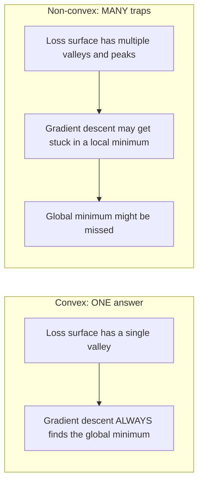
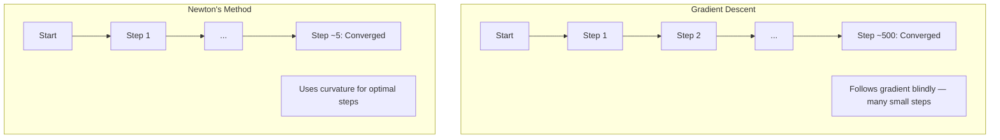
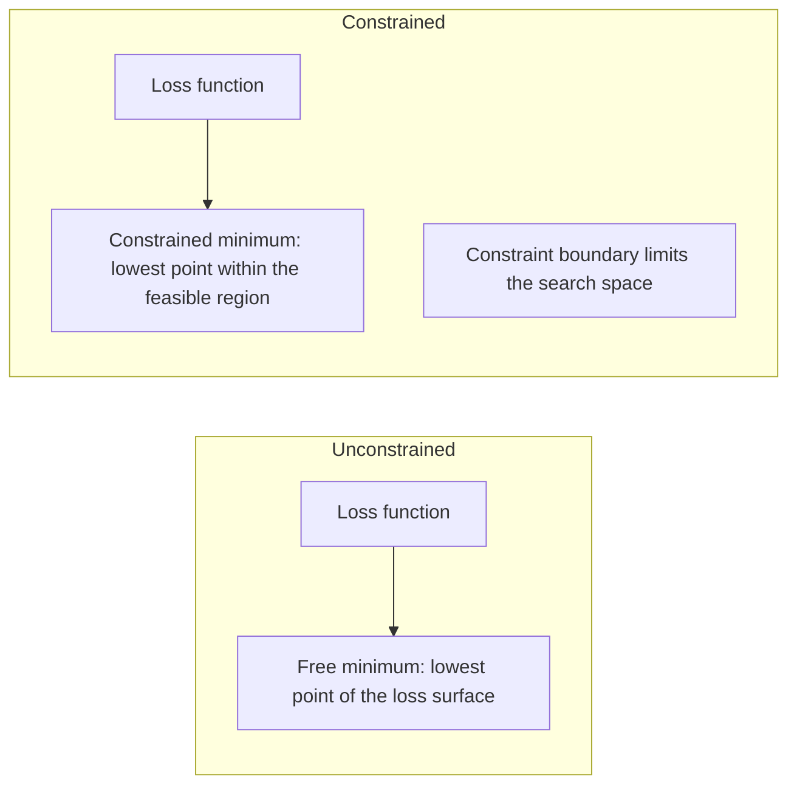
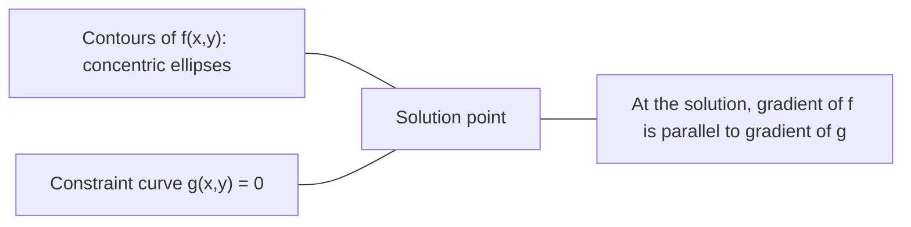

# संकुचित अनुकूलन 凸 अनुकूलन

> संकुचित समस्याओं में एक घाटी होती है, न्यूरल नेटवर्क में लाखों होते हैं। अंतर को जानना महत्वपूर्ण है।
> 凸 प्रश्न केवल एक ही है।

**Type:** Build | **类型:** 动手
**Language:**पायथन**语言:**पायथन
**Prerequisites:** Phase 1, Lessons 04 (Calculus for ML), 08 (Optimization) | **前置知识:** Phase 1, 第 04 课（微积分）、第 08 课（优化）
**Time:** ~90 minutes | **时间:** ~90 分钟

## सीखने के लक्ष्य

- परिभाषा, दूसरा व्युत्पन्न और हेसन मानदंडों का उपयोग करके परीक्षण करें कि क्या एक फ़ंक्शन घुमावदार है
  उपयोग परिभाषा、二阶导数和 हेशियन 判据测试函数 क्या यह एक凸函数 है
- न्यूटन की विधि को लागू करें और उसके वर्गिक अभिसरण की तुलना ग्रेडिएंट गिरावट के साथ करें
  实现牛顿法 (न्यूटन की विधि)并比较其二次收与梯度下降
- लैग्रेंज गुणक का उपयोग करके सीमित अनुकूलन समस्याओं को हल करें और केकेटी स्थितियों की व्याख्या करें
  उपयोग拉格朗日乘子(Lagrange Multiplicers)
- समझाएं कि तंत्रिका नेटवर्क हानि परिदृश्य क्यों गैर-कंक्रीट हैं, लेकिन एसजीडी अभी भी अच्छे समाधान ढूंढता है
  यह स्पष्ट है कि तंत्रिका नेटवर्क के नुकसान का कारण क्या है, लेकिन एसजीडी अभी भी एक अच्छा समाधान ढूंढ सकता है


> **【中文解读】**
> 凸函数 केवल एक ही山谷 है, 线性归归归是凸的, इसलिए निश्चित रूप से पूरे क्षेत्र में सबसे अच्छा है।

## समस्या  समस्या परिचय

पाठ 08 ने आपको ग्रेडिएंट गिरावट, गति और आदम सिखाया। ये ऑप्टिमाइज़र किसी भी सतह पर नीचे जाते हैं। लेकिन वे कोई गारंटी के साथ आते हैं। गैर-कंकल परिदृश्य पर ग्रेडिएंट गिरावट खराब स्थानीय न्यूनतम में उतर सकती है, एक सaddle point पर फंस सकती है, या हमेशा के लिए टहल सकती है। आपने इसे वैसे भी इस्तेमाल किया क्योंकि तंत्रिका नेटवर्क गैर-कंकल हैं और कोई विकल्प नहीं है।

> 第8 课教你梯度下降、动量和亚当── ये अनुकूलक किसी भी सतह पर नीचे गिर सकते हैं──लेकिन वे कोई गारंटी नहीं देते हैं──लेकिन गैर-कम्ब सतह पर,梯度下降可能陷入差 स्थानिक न्यूनतम मूल्य──卡在点 ()  ()  ()  ()  () )  ()  () )  ()  () )  ()  ()  ()  ()  ()  ()  ()  ()  ()  ()  ()  ()  ()  ()  ()  ()  ()  ()  ()  ()  ()  ()  ()  ()  ()  ()  ()  ()  ()  ( ()  ()  ()  ()  () () () () () () () () () () () () () () ( () () () () () () () () () () () () () () () () () () () () () () () () () () () () () () () () () () () () () () () () () () () () () () () () () ( () () () () () () () () () () (

लेकिन मशीन लर्निंग में कई समस्याएं संकुचित हैं। रैखिक प्रतिगमन, लॉजिस्टिक प्रतिगमन, एसवीएम, लासो, रिज प्रतिगमन। इन के लिए, कुछ मजबूत मौजूद हैः गणितीय गारंटी के साथ अनुकूलन। संकुचित समस्या में एक ही घाटी है। नीचे चलने वाला कोई भी एल्गोरिथ्म वैश्विक न्यूनतम तक पहुंच जाएगा। कोई पुनरारंभ की आवश्यकता नहीं है। कोई सीखने की दर कार्यक्रम नहीं। कोई प्रार्थना नहीं।

> लेकिन मशीन लर्निंग में कई समस्याएं हैं किण्वित ⋅ लाइनर रिटर्न, लॉजिकल रिटर्न, SVM, LASSO ⋅ रिटर्न। इनकी तुलना में, कुछ और भी मजबूत है: साथ ही साथ गणितीय गारंटी के अनुकूलन ⋅ कुंभ समस्याएं एक ही तल पर हैं। किसी भी डाउनपो एल्गोरिदम को समग्र न्यूनतम मूल्य तक पहुंचना चाहिए।

संकुचितता को समझना तीन चीजें करता है. पहला, यह आपको बताता है कि आपकी समस्या कब आसान (संकुचित) है (गैर-संकुचित) के खिलाफ कठिन (गैर-संकुचित) है। दूसरा, यह आपको संकुचित समस्याओं के लिए न्यूटन की विधि जैसे तेज़ उपकरण देता है। तीसरा, यह अवधारणाओं की व्याख्या करता है जो एमएल में दिखाई देती हैंः एक बाधा के रूप में नियमितता, एसवीएम में द्वैतता, और क्यों गहरी सीखने का काम करता है आपको हर अच्छी संपत्ति का उल्लंघन करने के बावजूद संकुचितता देता है।

> समझना कि क्याम का तीन कार्य है। पहला, यह आपको बताता है कि क्याम का प्रश्न आसान है या मुश्किल है। दूसरा, यह कम्फ के प्रश्नों के लिए तेजी से उपकरण प्रदान करता है, जैसे कि न्यूटन के कानून।

## अवधारणा का मूल अवधारणा

> **【中文解读】**
> 凸函数 का आकार एक कटोरे की तरह है  केवल एक न्यूनतम बिंदु है                                                                                                                                                                                                                                                     

> **【拓展：凸优化在工业中的实际规模】**
> Google का विज्ञापन क्रमबद्ध प्रणाली बड़े पैमाने पर तर्कगत वापसी का उपयोग करती है, प्रतिदिन अरबों अनुरोधों को संसाधित करती है। एसवीएम में मानव चेहरे की जांच (Viola-Jones) और ग्रंथ विभाजन व्यापक रूप से उपयोग किया जाता है। आधुनिक एलपी खोजकर्ता (Gurobi 、CPLEX) कुछ ही मिनटों में लाखों परिवर्तनों की रैखिक नियोजन समस्या का समाधान कर सकता है।

### कंवेक्स सेट

एक सेट S गुंबद है यदि S में किसी भी दो बिंदुओं के लिए, उनके बीच का रेखा खंड भी पूरी तरह से S में स्थित है।

> यदि संचय S मध्य किसी भी दो बिंदुओं के बीच के रेखा段 पूर्ण रूप से S 内 में स्थित है, तो S है凸集(कंकुष्ठ सेट)。

| Convex sets | Not convex |
|---|---|
| **Rectangle**: any two points inside can be connected by a line segment that stays inside | **Star/crescent shape**: a line between two interior points can pass outside the set |
| **Triangle**: same property holds for all interior points | **Donut/annulus**: the hole means some line segments leave the set |
| The line segment between any two points stays within the set | The line segment between some pairs of points exits the set |

औपचारिक परीक्षणः S में किसी भी बिंदु x, y और [0, 1] में किसी भी t के लिए, बिंदु tx + (1-t) y भी S में है।

> 形式化测试: के लिए S के मध्य के任意点 x、y 和 [0, 1] के मध्य के任意 t,点 tx + (1-t) y 也在 S के मध्य में。

कंवेक्स सेट के उदाहरणः
- एक रेखा, एक विमान, सभी R^n
  एक सीधी रेखा, एक समतल, पूरे आर
- एक गेंद (चक्र, गोला, हाइपरस्फीयर)
  एक गेंद (गोल 球面 超球面)
- एक आधे स्थानः {x : a^T x <= b}
  半空间: {x: a^T x <= b}
- किसी भी संख्या में घुमावदार सेट का चौराहा
  任意数凸集的交交交

गैर-कंकुष्ठ सेट के उदाहरणः
- एक डोनट (एनुलस)
  环面(圆环)
- दो विघटित वृत्तों का संघ
  两个不相交圆的并集
- "डेंट" या "होल" के साथ कोई भी सेट
   किसी भी "陷" या "洞" का संग्रह

### घुमावदार फ़ंक्शन

एक फ़ंक्शन f संकुचित है यदि उसका डोमेन संकुचित सेट है और उसके डोमेन में किसी भी दो बिंदुओं x, y और [0, 1] में किसी भी t के लिएः

> यदि फ़ंक्शन f का परिभाषित क्षेत्र है, और परिभाषित क्षेत्र में किसी भी दो बिंदुओं x、y 和 [0, 1] के बीच किसी भी t के लिएः

```
f(tx + (1-t)y) <= t*f(x) + (1-t)*f(y)
```

ज्यामितीय रूप सेः ग्राफ पर किसी भी दो बिंदुओं के बीच रेखा खंड ग्राफ के ऊपर या ग्राफ पर स्थित है।

> 几何上: चित्र पर किसी भी दो बिंदुओं के बीच की रेखा खंड चित्र के ऊपर या चित्र पर स्थित है।

| Property | Convex function | Non-convex function |
|---|---|---|
| **Line segment test** | The line between any two points on the graph lies **above or on** the curve | The line between some points on the graph dips **below** the curve |
| **Shape** | Single bowl/valley curving upward | Multiple peaks and valleys with mixed curvature |
| **Local minima** | Every local minimum is the global minimum | Multiple local minima may exist at different heights |

सामान्य संकुचित कार्यः
- f(x) = x^2 (पाराबोला)
  抛物线
- f(x) = ✓x (मूर्त मूल्य)
   निरपेक्ष मूल्य
- f(x) = e^x (आकस्मिक)
  指数函数
- f(x) = max(0, x) (ReLU, हालांकि टुकड़ा के रूप में रैखिक)
  रिलू (हालांकि)
- f(x) = -log(x) के लिए x > 0 (नकारात्मक लॉग)
  负对数
- कोई भी रैखिक फ़ंक्शन f ((x) = a^T x + b (बैठक और कंकाल दोनों)
  任何线性函数 ((既是凸的也是的)

### संकुचितता पर परीक्षण

तीन व्यावहारिक परीक्षण, सबसे आसान से सबसे कठोर तक।

> तीन प्रकार के प्रयोगात्मक परीक्षण, सबसे सरल से लेकर सबसे कठोर तक

**Test 1: Second derivative test (1D).**यदि f'(x) >= 0 सभी x के लिए, तो f संकुचित है।

> **测试 1：二阶导数测试（一维）。**यदि सभी x के लिए f'(x) >= 0, तो f है凸的。

- f''((x) = x^2: f''(x) = 2 >= 0. घुमावदार।
- f''((x) = x^3: f''(x) = 6x. x < 0 के लिए नकारात्मक।
- f'(x) = e^x: f'(x) = e^x > 0. घुमावदार।

**Test 2: Hessian test (multivariate).**यदि हेसियन मैट्रिक्स H(x) सभी x के लिए सकारात्मक अर्ध-परिभाषित है, तो f घुमावदार है। हेसियन दूसरे आंशिक व्युत्पन्नों की मैट्रिक्स है।

> **测试 2：Hessian 测试（多变量）。**यदि हेसियन 矩阵 H(x) सभी x के लिए आधा सही है, तो f है凸的── हेसियन है द्वितीय चरण का परिचायक संख्या矩阵──

**Test 3: Definition test.**सीधे असमानता f(tx + (1-t) y) <= t*f(x) + (1-t) *f(y) की जांच करें। ऐसे कार्यों के लिए उपयोगी जहां व्युत्पन्न गणना करना मुश्किल है।

> **测试 3：定义测试。**直接检查不等式 f(tx + (1-t) y) <= t*f(x) + (1-t) *f(y)。适用于导数难以计算的函数。

### क्यों संकुचन महत्वपूर्ण है

संकुचित अनुकूलन का केंद्रीय प्रमेय:

**For a convex function, every local minimum is a global minimum.**

> **对于凸函数，每个局部最小值都是全局最小值。**

इसका मतलब है कि ग्रेडिएंट डाउन को फंसाया नहीं जा सकता है। किसी भी डाउनहिल पथ से एक ही उत्तर मिलता है। एल्गोरिथ्म को इष्टतम समाधान के लिए अभिसरण की गारंटी है।

> इसका अर्थ है कि नीचे की तरफ़ से नीचे की तरफ़ कोई भी तरफ़ से नीचे की तरफ़ का रास्ता एक ही उत्तर की ओर जाता है।

> **【中文解读】**
> यह कम्फ अनुकूलन के मूल सिद्धांत हैः कम्फ फ़ंक्शन के प्रत्येक स्थानिक न्यूनतम मूल्य समग्र न्यूनतम मूल्य हैं। इसका अर्थ है कि तराजू में गिरावट कभी भी "अंतर" के स्थानिक सर्वश्रेष्ठ पर नहीं होगी।



परिणाम:
- यादृच्छिक पुनः आरंभ करने की कोई आवश्यकता नहीं
  कोई आवश्यकता नहीं
- परिष्कृत सीखने की दर की आवश्यकता नहीं है
  जटिल सीखने की दर के समायोजन की आवश्यकता नहीं है
- अभिसरण प्रमाण संभव हैं (दर फ़ंक्शन गुणों पर निर्भर करती है)
  प्राप्ति को साबित कर सकते हैं (आकार का अनुपात फ़ंक्शन के गुण पर निर्भर करता है)
- समाधान अद्वितीय है (सपाट क्षेत्रों तक)
  解是唯一的(平坦区域除外)

### ML में घुमावदार बनाम गैर घुमावदार

| Problem | Convex? | Why |
|---------|---------|-----|
| Linear regression (MSE) | Yes | Loss is quadratic in weights |
| Logistic regression | Yes | Log-loss is convex in weights |
| SVM (hinge loss) | Yes | Maximum of linear functions |
| LASSO (L1 regression) | Yes | Sum of convex functions is convex |
| Ridge regression (L2) | Yes | Quadratic + quadratic = convex |
| Neural network (any loss) | No | Nonlinear activations create non-convex landscape |
| k-means clustering | No | Discrete assignment step |
| Matrix factorization | No | Product of unknowns |

विभक्ति हानि के साथ रैखिक मॉडल विभक्ति हैं. जब आप गैर-रेखीय सक्रियण के साथ छिपे परतों जोड़ते हैं, विभक्ति टूट जाता है.

> कुम्फ हानि वाला रैखिक मॉडल कुम्फ है  जब आप कुम्फ सक्रियण के छिपे हुए परत को जोड़ते हैं, तो कुम्फ टूट जाता है

### हेसियन मैट्रिक्स

फ़ंक्शन f: R^n -> R का हेसियन H द्वितीय आंशिक व्युत्पन्नों का n x n मैट्रिक्स है।

> 函数 f: R^n -> R का हेसियन 矩阵 H है n x n का द्वितीय चरण का परिप्रेक्ष्य

```
H[i][j] = d^2 f / (dx_i dx_j)
```

f ((x, y) = x^2 + 3xy + y^2:

```
df/dx = 2x + 3y       d^2f/dx^2 = 2      d^2f/dxdy = 3
df/dy = 3x + 2y       d^2f/dydx = 3      d^2f/dy^2 = 2

H = [ 2  3 ]
    [ 3  2 ]
```

हेसियन आपको वक्रता के बारे में बताता हैः
- सभी सकारात्मक स्वमूल्यः फ़ंक्शन हर दिशा में ऊपर की ओर घुमाता है (उस बिंदु पर घुमावदार)
  विशेषण मूल्य पूर्णतः सही: फ़ंक्शन प्रत्येक दिशा में सभी ऊपर曲 (→ बिंदु पर)
- सभी ऋणात्मक स्वमूल्यः प्रत्येक दिशा में नीचे की वक्र (कुंकुआ, स्थानीय अधिकतम)
  विशेषता मूल्य पूर्ण नकारात्मकः प्रत्येक दिशा में सभी नीचे की ओर
- मिश्रित संकेतः सड़ल बिंदु (कुछ दिशाओं में ऊपर, अन्य दिशाओं में नीचे)
  混合符号:点(कुछ दिशाएं ऊपर曲, अन्य दिशाएं नीचे)
- शून्य स्वमूल्यः उस दिशा में फ्लैट (डिजेनेरेट)
  零特征值:该方向平坦(退化)

संकुचितता के लिए, हेसियन को हर जगह, न कि केवल एक बिंदु पर सकारात्मक अर्ध-परिभाषित (सभी स्व-मूल्य >= 0) होना चाहिए।

>  के लिए, Hessian  को किसी भी स्थान पर अर्ध-सत्य होना चाहिए, न कि केवल एक बिंदु पर।

### न्यूटन की विधि

ग्रेडिएंट अवतरण प्रथम क्रम की जानकारी (ग्रेडिएंट) का उपयोग करता है। न्यूटन की विधि द्वितीय क्रम की जानकारी (हेसियन) का उपयोग करती है। यह वर्तमान बिंदु पर एक वर्गिक अनुमान फिट बैठता है और सीधे उस वर्गिक के न्यूनतम पर कूदता है।

> 梯度下降使用一阶段信息(梯度) ――牛顿法使用二阶段信息(Hessian) ・・・ यह वर्तमान बिंदु पर एक दूसरी नज़दीकी के अनुरूप है, फिर सीधे उस दूसरी फ़ंक्शन के न्यूनतम मूल्य पर कूदता है。

```
Update rule:
  x_new = x - H^(-1) * gradient

Compare to gradient descent:
  x_new = x - lr * gradient
```

न्यूटन की विधि स्कॉलर सीखने की दर को उल्टा हेसियन से बदल देती है। यह स्वचालित रूप से स्थानीय वक्रता के आधार पर चरण आकार और दिशा को समायोजित करती है।

> 牛顿法 के विपरीत हेशियन 替代标标量学习率── यह स्थानीय वक्रता दर के आधार पर स्वचालित रूप से समायोजन की गति और दिशा──

> **【拓展：牛顿法在现代 ML 中的实际使用】**
> यद्यपि गहन सीखने में नॉर्टन विधि का प्रयोग नहीं किया जाता है, लेकिन क्लासिक एमएल में यह अभी भी मुख्य शक्ति है। प्रत्येक पेड़ के निर्माण में, हानि फ़ंक्शन के लिए दूसरा चरण बनाया गया है।



लाभ:
- न्यूनतम के निकट चतुर्भुज अभिसरण (हर चरण में त्रुटि वर्ग)
  न्यूनतम मूल्य के पास दो बार प्राप्त करना (प्रति चरण त्रुटि वर्ग वर्ग वर्ग घटाना)
- कोई सीखने की दर के लिए ट्यून
  无需调节学习率
- स्केल-इंवर्टेंट (प्रश्न को आप कैसे पैरामीटर करते हैं, इससे कोई फर्क नहीं पड़ता कि यह कैसे काम करता है)
  尺度不变 (किसी भी तरह से काम कर सकता है)

नुकसान:
- Hessian गणना O  n ^ 2) स्मृति और O  n ^ 3) उल्टा करने के लिए लागत
  計算 Hessian 需要 O(n^2) 内存和 O(n^3) 求逆
- 1 मिलियन वजन वाले तंत्रिका नेटवर्क के लिए, यानी 10^12 प्रविष्टियाँ और 10^18 ऑपरेशन
   एक लाख भार के लिए तंत्रिका नेटवर्क, यह 10^12 个元素 और 10^18 बार परिचालन है
- गहन शिक्षा के लिए व्यावहारिक नहीं
  गहन सीखने के लिए उपयुक्त नहीं

### सीमित अनुकूलन

बिना सीमाओं के अनुकूलनः सभी x पर f ((x) को कम से कम करें।
सीमित अनुकूलनः प्रतिबंधों के अधीन f ((x) को न्यूनतम करें।

> 无约束优化:在所有 x上最小化 f(x) ・约束优化:在约束条件下最小化 f(x) ・・・

वास्तविक समस्याओं में बाधाएं होती हैं आप लागत को कम करना चाहते हैं लेकिन आपका बजट सीमित है आप त्रुटि को कम करना चाहते हैं लेकिन आपकी मॉडल जटिलता सीमित है।

> वास्तविक समस्याएं हैं सीमित। आप लागत को कम करना चाहते हैं लेकिन बजट सीमित है। आप त्रुटि को कम करना चाहते हैं लेकिन मॉडल जटिलता की सीमा है।



### लॅग्रेंज गुणक

लैग्रेंज गुणकों की विधि एक सीमित समस्या को एक निर्बंधित समस्या में परिवर्तित करती है।

> 拉格朗日乘子法将束问题转化为无束问题.

समस्याः g(x) = 0 के अधीन f ((x) को न्यूनतम करें।

समाधानः एक नया चर (लैगरेंज गुणक लैम्ब्डा) पेश करें और अनियंत्रित समस्या को हल करेंः

```
L(x, lambda) = f(x) + lambda * g(x)
```

समाधान पर, L का ग्रेडिएंट शून्य हैः

```
dL/dx = df/dx + lambda * dg/dx = 0
dL/dlambda = g(x) = 0
```

ज्यामितीय अंतर्ज्ञानः सीमित न्यूनतम पर, f का ग्रेडिएंट बाधा g के ग्रेडिएंट के समानांतर होना चाहिए। यदि वे समानांतर नहीं थे, तो आप बाधा सतह के साथ आगे बढ़ सकते हैं और f को कम कर सकते हैं।

> 几何直觉: जब बंधन न्यूनतम मूल्य है, तो f का स्तर बंधन g के स्तर के साथ समतुल्य होना चाहिए। यदि यह समतुल्य नहीं है, तो आप बंधन के अनुभाग के साथ आगे बढ़ सकते हैं और f को और कम कर सकते हैं।



उदाहरण: f ((x,y) = x^2 + y^2 को x + y = 1 के अधीन न्यूनतम करें।

```
L = x^2 + y^2 + lambda(x + y - 1)

dL/dx = 2x + lambda = 0  =>  x = -lambda/2
dL/dy = 2y + lambda = 0  =>  y = -lambda/2
dL/dlambda = x + y - 1 = 0

From first two: x = y
Substituting: 2x = 1, so x = y = 0.5, lambda = -1
```

रेखा x + y = 1 पर मूल के निकटतम बिंदु (0.5, 0.5) है।

> सीधा रेखा x + y = 1 ऊपर से मूल बिंदु निकटतम बिंदु है (0.5, 0.5) ⋅

### केकेटी की शर्तें

करुश-कुहन-टकर स्थितियां लैग्रेंज गुणकों को असमानता प्रतिबंधों तक विस्तारित करती हैं।

> केकेटी 条件(Karush-Kuhn-Tucker Conditions) will拉格朗日乘子推广到不等式约束──

समस्या: i = 1, ..., m के लिए g_i(x) <= 0 के अधीन f(x) को न्यूनतम करें।

KKT की शर्तें (उपमाइश के लिए आवश्यक):

```
1. Stationarity:    df/dx + sum(lambda_i * dg_i/dx) = 0
2. Primal feasibility:  g_i(x) <= 0  for all i
3. Dual feasibility:    lambda_i >= 0  for all i
4. Complementary slackness:  lambda_i * g_i(x) = 0  for all i
```

पूरक ढीलापन मुख्य अंतर्दृष्टि हैः या तो प्रतिबंध सक्रिय है (g_i = 0, समाधान सीमा पर बैठता है) या गुणक शून्य है (बंधन कोई फर्क नहीं पड़ता है) । एक प्रतिबंध जो समाधान को प्रभावित नहीं करता है, उसके पास lambda = 0 है।

> 互补松性(Complementary Slackness) 是关键洞察: 要么约束是活跃的g_i = 0,解在边界上), 要么乘子为零约束不重要) 不影响解的约束其 lambda = 0──

केकेटी स्थितियां एसवीएम के लिए केंद्रीय हैं। समर्थन वेक्टर डेटा बिंदु हैं जहां प्रतिबंध सक्रिय है (lambda > 0) । अन्य सभी डेटा बिंदुओं में lambda = 0 है और निर्णय सीमा को प्रभावित नहीं करते हैं।

> केकेटी 条件是 SVM का केंद्र ⋅ समर्थन向量 ⋅ समर्थन वेक्टर) ⋅ ⋅ ⋅ ⋅ ⋅ ⋅ ⋅ ⋅ ⋅ ⋅ ⋅ ⋅ ⋅ ⋅ ⋅ ⋅ ⋅ ⋅ ⋅ ⋅ ⋅ ⋅ ⋅ ⋅ ⋅ ⋅ ⋅ ⋅ ⋅ ⋅ ⋅ ⋅ ⋅ ⋅ ⋅ ⋅ ⋅ ⋅ ⋅ ⋅ ⋅ ⋅ ⋅ ⋅ ⋅ ⋅ ⋅ ⋅ ⋅ ⋅ ⋅ ⋅ ⋅ ⋅ ⋅ ⋅ ⋅ ⋅ ⋅ ⋅ ⋅ ⋅ ⋅ ⋅ ⋅ ⋅ ⋅ ⋅ ⋅ ⋅ ⋅ ⋅ ⋅ ⋅ ⋅ ⋅ ⋅ ⋅ ⋅ ⋅ ⋅ ⋅ ⋅ ⋅ ⋅ ⋅ ⋅ ⋅ ⋅ ⋅ ⋅ ⋅ ⋅ ⋅ ⋅ ⋅ ⋅ ⋅ ⋅ ⋅ ⋅ ⋅ ⋅ ⋅ ⋅ ⋅ ⋅ ⋅ ⋅ ⋅ ⋅ ⋅ ⋅ ⋅ ⋅ ⋅ ⋅ ⋅ ⋅ ⋅ ⋅ ⋅ ⋅ ⋅ ⋅ ⋅ ⋅ ⋅ ⋅ ⋅ ⋅ ⋅ ⋅ ⋅ ⋅ ⋅ ⋅ ⋅ ⋅ ⋅ ⋅ ⋅ ⋅ ⋅ ⋅ ⋅ ⋅ ⋅                                                                                                                                                                                                 

> **【中文解读】**
> केकेटी 条件是拉格朗日乘子的推广版,处理不等式约束──互补松性 सबसे精细的洞察: प्रत्येक约束 के लिए, या तो यह "活跃" है, या यह हल पर कोई प्रभाव नहीं डालता है, या SVM का समर्थन वेटमेंट उन डेटा बिंदुओं पर है जो बाध्यकारी हैं।

### सीमित अनुकूलन के रूप में नियमन

L1 और L2 नियमितता मनमाने तरीके से नहीं होती बल्कि वे सीमित अनुकूलन समस्याएं हैं जो लुढ़कती हैं।

> L1 तथा L2 नियमावली कोई सहज तकनीक नहीं है।

**L2 regularization (Ridge):**

```
minimize  Loss(w)  subject to  ||w||^2 <= t

Equivalent unconstrained form:
minimize  Loss(w) + lambda * ||w||^2
```

2 में बाधाओं का निर्बंध <= t एक गेंद को परिभाषित करता है (दो आयामी में वृत्त, 3 आयामी में गोला) समाधान यह है कि जहां हानि कंत्राट इस गेंद को पहले स्पर्श करते हैं।

> 约束 约束 约束 约束 约束 约束 约束 约束 约束 约束 约束 约束 约束 约束 约束 约束 约束 约束 约束 约束 约束 约束 约束 约束 约束 约束 约束 约束 约束 约束 约束 约束 约束 约束 约束 约束 约束 约束 约束 约束 约束 约束 约束 约束 约束 约束 约束 约束 约束 约束 约束 约束 约束 约束 约束 约束 约束 约束 约束 约束 约束 约束 约束 约束 约束 约束 约束 约束 约束 约束 约束 约束 约束 约 约 约 约 约 约 约 约 约 约 约 约 约 约 约 约 约 约 约 约 约 约 约 约 约 约 约 约 约 约 约 约 约 约 约 约 约 约 约 约 约 约 约 约 约 约 约 约 约 约 约 约 约 约 约 约 约 约 约 约 约 约 约 约 约 约 约 约 约 约 约 约 约 约   约 约                                                                                                                                         

**L1 regularization (LASSO):**

```
minimize  Loss(w)  subject to  ||w||_1 <= t

Equivalent unconstrained form:
minimize  Loss(w) + lambda * ||w||_1
```

प्रतिबन्ध में एक हीरा (दो आयामी में घुमाया हुआ वर्ग) परिभाषित किया गया है।

> 约束 束 束 束 束 束 束 束 束 束 束 束 束 束 束 束 束 束 束 束 束 束 束 束 束 束 束 束 束 束 束 束 束 束 束 束 束 束 束 束 束 束 束 束 束 束 束 束 束 束 束 束 束 束 束 束 束 束 束 束 束 束 束 束 束 束 束 束 束 束 束 束 束 束 束 束 束 束 束 束 束 束 束 束 束 束 束 束 束 束 束 束 束 束 束 束 束 束 束 束 束 束 束 束 束 束 束 束 束 束 束 束 束 束 束 束 束 束 束 束 束 束 束 束 束 束 束 束 束 束 束 束 束 束 束                                                                                                                                                                                                                                               

| Property | L2 constraint (circle) | L1 constraint (diamond) |
|---|---|---|
| **Constraint shape** | Circle (sphere in higher dims) | Diamond (rotated square in 2D) |
| **Where loss contour touches** | Smooth boundary — any point on the circle | Corner — aligned with an axis |
| **Solution behavior** | Weights are small but nonzero | Some weights are exactly zero (sparse) |
| **Result** | Weight shrinkage | Feature selection |

यह बताता है कि L1 क्यों दुर्लभ मॉडल (विशेषताओं का चयन) का उत्पादन करता है जबकि L2 केवल वजन को छोटा करता है। हीरे के कुएं धुरी के साथ संरेखित हैं। नुकसान के कंटूर को एक कोण को छूने की अधिक संभावना है, एक या अधिक वजन को बिल्कुल शून्य तक सेट करता है।

> यह समझाता है कि L1  दुर्लभ मॉडल उत्पन्न करते हैं (विशेषता चयन) जबकि L2 केवल वजन घटाने के लिए है।

> **【拓展：L1 正则化与 L2 正则化的几何直觉】**
> L1 束 का आकार 形 है ((2D में घूर्णन का एक चौकोर आकार है), L2 束 का आकार गोलाकार है。 आकार के कोनों का ठिकाना 轴 पर पड़ना होता है, इसलिए सम ऊंची रेखाएं कोण से टकराव करना आसान होती हैं इसका मतलब है कि कुछ भार को सटीक रूप से शून्य में सेट किया जाता है (विशेषता चयन)  यह है कि LASSO स्वचालित रूप से विशेषता चयन करने की भौगोलिक कारणों में है। जीन अभिव्यक्ति डेटा विश्लेषण में, LASSO  अक्सर हजारों जीन में से कुछ महत्वपूर्ण जीन का चयन करता है

### द्वैतता

प्रत्येक सीमित अनुकूलन समस्या (प्राथमिक) में एक साथी समस्या (द्वैध) होती है। संकुचित समस्याओं के लिए, प्राथमिक और द्वैध का समान इष्टतम मूल्य होता है। यह मजबूत द्वैधता है।

> प्रत्येक बंधन अनुकूलन समस्या (अर्थात्, प्रत्येक मूल समस्या) का एक साथ वाला प्रश्न (अर्थात्, प्रत्येक मूल समस्या) है।

लैग्रंजियन डबल फ़ंक्शनः

```
Primal: minimize f(x) subject to g(x) <= 0
Lagrangian: L(x, lambda) = f(x) + lambda * g(x)
Dual function: d(lambda) = min_x L(x, lambda)
Dual problem: maximize d(lambda) subject to lambda >= 0
```

द्वैतता क्यों महत्वपूर्ण हैः
- दोहरी समस्या को कभी-कभी मूल समस्या से हल करना आसान होता है
  कभी-कभी मूल प्रश्नों की तुलना में समकक्ष प्रश्नों का हल करना आसान होता है
- एसवीएम अपने दोहरे रूप में हल कर रहे हैं, जहां समस्या डेटा बिंदुओं के बीच बिंदु उत्पादों पर निर्भर करता है (कर्नल ट्रिक सक्षम)
  एसवीएम के लिए एक समसामयिक रूप से हल की तलाश, समस्या केवल डेटा बिंदुओं के बीच बिंदुओं पर निर्भर करती है ताकि परमाणु तकनीक का उपयोग किया जा सके)
- दोहरी मूल इष्टतम पर एक निचली सीमा प्रदान करती है, समाधान की गुणवत्ता की जांच के लिए उपयोगी
  मूल के लिए सबसे अच्छा मूल्य प्रदान करने के लिए निम्न सीमा, परीक्षण के लिए समाधान की गुणवत्ता

विशेष रूप से एसवीएम के लिएः

```
Primal: find w, b that maximize the margin 2/||w|| subject to
        y_i(w^T x_i + b) >= 1 for all i

Dual:   maximize sum(alpha_i) - 0.5 * sum_ij(alpha_i * alpha_j * y_i * y_j * x_i^T x_j)
        subject to alpha_i >= 0 and sum(alpha_i * y_i) = 0

The dual only involves dot products x_i^T x_j.
Replace x_i^T x_j with K(x_i, x_j) to get the kernel trick.
```

### क्यों गहरी शिक्षा गैर-संभ्रम के बावजूद काम करती है

न्यूरल नेटवर्क हानि फ़ंक्शन बेहद गैर-कंकड़ हैं। प्रत्येक क्लासिक उपाय द्वारा, उन्हें अनुकूलित करने में विफल होना चाहिए। फिर भी स्टोकास्टिक ग्रेडिएंट गिरावट विश्वसनीय रूप से अच्छे समाधान ढूंढती है। कई कारक इसे समझाते हैं।

> न्यूरियल नेटवर्क हानि फ़ंक्शन चरम अभाज्य है। क्लासिक सिद्धांत के अनुसार, अनुकूलन उन्हें विफल होना चाहिए।

**Most local minima are good enough.**उच्च-आयामी स्थानों में, यादृच्छिक महत्वपूर्ण बिंदु (जहां ग्रेडिएंट शून्य है) स्थानीय न्यूनतम नहीं, बल्कि भारी मात्रा में सaddle बिंदु हैं। मौजूद कुछ स्थानीय न्यूनतम में वैश्विक न्यूनतम के करीब हानि मूल्य होते हैं। जब पैरामीटर स्थान में लाखों आयाम होते हैं तो भयानक स्थानीय न्यूनतम में फंसने की बहुत संभावना नहीं होती है।

> **大多数局部最小值都足够好。**उच्चतम स्थान में, अपरंपरागत परिधि बिंदु (उच्चतम स्थान में, शून्य के बिंदुओं के लिए) का बहुमत स्थानिक न्यूनतम मूल्य के बजाय  बिंदु है।

**Saddle points, not local minima, are the real obstacle.**n पैरामीटर वाले फ़ंक्शन में, एक सaddle point में सकारात्मक और नकारात्मक वक्रता दिशाओं का मिश्रण होता है। उच्च आयामों में एक यादृच्छिक महत्वपूर्ण बिंदु के लिए, सभी n स्वमूल्यों के सकारात्मक होने की संभावना (स्थानीय न्यूनतम) लगभग 2 ^-n है। लगभग सभी महत्वपूर्ण बिंदु सaddle points हैं। SGD का शोर उन्हें बचाने में मदद करता है।

> **鞍点而非局部最小值才是真正的障碍。**                                                                                                                                                                                                                                                              

**Overparameterization smooths the landscape.**प्रशिक्षण उदाहरणों की तुलना में अधिक मापदंडों वाले नेटवर्क में अधिक चिकनी, अधिक जुड़े नुकसान सतहें होती हैं। व्यापक नेटवर्क में कम खराब स्थानीय न्यूनतम होते हैं। यह विपरीत है लेकिन अनुभवजन्य रूप से सुसंगत है।

> **过参数化（Overparameterization）使损失面更平滑。**参数 अधिक है प्रशिक्षण नमूना नेटवर्क के साथ अधिक चिकनी है  अधिक कनेक्टिविटी के नुकसान की सतहों;. व्यापक नेटवर्क कम खराब स्थानों न्यूनतम मूल्य है  यह सीधा विपरीत है लेकिन अनुभव में संगत है

**Loss landscape structure:**

| Property | Low-dimensional space | High-dimensional space |
|---|---|---|
| **Landscape** | Many isolated peaks and valleys | Smoothly connected valleys |
| **Minima** | Many isolated local minima | Few bad local minima; most are near-optimal |
| **Navigation** | Hard to find global minimum | Many paths lead to good solutions |
| **Critical points** | Mix of local minima and saddle points | Overwhelmingly saddle points, not local minima |

**Stochastic noise acts as implicit regularization.**मिनी-बैच एसजीडी शोर जोड़ता है जो तेज न्यूनतम में बसने से रोकता है। तेज न्यूनतम ओवरफिट; सपाट न्यूनतम सामान्यीकरण। शोर नुकसान परिदृश्य के सपाट क्षेत्रों की ओर अनुकूलन को अनुकूलित करता है।

> **随机噪声充当隐式正则化。**मिनी-बैच एसजीडी  ध्वनि के अतिरिक्त जोड़े गए जोड़े से उच्चतम स्तर पर उच्चतम स्तर पर पहुंच से बचें

> **【中文解读】**
> गहन सीखने की सफलता का विपरीत प्रतीत होता है कम्फ्यूज़ेशन सिद्धांतः गैर कम्फ्यूज़ेशन फ़ंक्शन को अनुकूलित करना बहुत मुश्किल होना चाहिए, लेकिन एसजीडी ऱूप अच्छी तरह से काम करता है। कारण तीन हैंः पहला, उच्च स्तर की जगह में लगभग सभी महत्वपूर्ण बिंदु  बिंदु हैं न कि स्थानीय न्यूनतम मूल्य; दूसरा, ओवर पैरामीटरकरण चेहरे के नुकसान को अधिक चिकनी बनाता है; तीसरा, एसजीडी का शोर लोड होता है छिपे हुए सहीकरण, सबसे कम मूल्य से भागने में मदद करता है, अधिक सरल  व्यापकीकरण का बेहतर समाधान ढूंढता है।

### अभ्यास में द्वितीय श्रेणी की विधियाँ

न्यूटन की विधि बड़े मॉडल के लिए अप्रैक्टिकल है। कई अनुमानों से दूसरी श्रेणी की जानकारी उपयोग में आती है।

> शुद्ध न्यूटन विधि बड़े मॉडल पर लागू नहीं है  कुछ निकटवर्ती विधिएँ द्वितीय चरण की जानकारी को उपलब्ध कराती हैं

**L-BFGS (Limited-memory BFGS):**पिछले m ग्रेडिएंट अंतर का उपयोग करके उल्टा हेसियन का अनुमान लगाता है। O(n^2 के बजाय O(mn) मेमोरी की आवश्यकता होती है। ~ 10,000 पैरामीटर तक की समस्याओं के लिए अच्छा काम करता है। शास्त्रीय ML (लॉजिस्टिक रेग्रिशन, CRFs) में उपयोग किया जाता है लेकिन गहन सीखने में नहीं।

> **L-BFGS：**प्रयोग नवीनतम m 个梯度差近似逆赫西语──需要 O(mn) 内存而不是 O(n^2)──适用于最多约10,000 个参数问题──用于经典ML(逻辑归归、CRF)

**Natural gradient:**मानक हेसियन के बजाय फिशर सूचना मैट्रिक्स (लॉग-संभाव्यता के अपेक्षित हेसियन) का उपयोग करता है। यह संभावना वितरण की ज्यामिति का कारण बनता है। K-FAC (क्रोनकर-कारक अनुमानित वक्रता) फिशर मैट्रिक्स को एक क्रोनकर उत्पाद के रूप में अनुमानित करता है, जिससे यह तंत्रिका नेटवर्क के लिए व्यावहारिक हो जाता है।

> **自然梯度（Natural Gradient）：**फ़िशर 信息矩阵 (Fisher 信息矩阵) का उपयोग करें।

**Hessian-free optimization:**Hx = g को हल करने के लिए संयुग्मित ग्रेडिएंट का उपयोग करता है, बिना कभी H का गठन किए। केवल हेसियन-वेक्टर उत्पादों की आवश्यकता होती है, जिन्हें स्वचालित विभेदन के माध्यम से O ((n) समय में गणना की जा सकती है।

> **无 Hessian 优化：**उपयोग共梯度求解 Hx = g 而无需形成 H──只需要赫西亚向量乘积,可通过自动微分在 O(n) 时间内计算──

**Diagonal approximations:**एडम का दूसरा क्षण हेसियन के विकर्ण के एक विकर्ण समीकरण है। एडहेसियन हचिनसन के अनुमानक के माध्यम से वास्तविक हेसियन विकर्ण तत्वों का उपयोग करके इसे बढ़ाता है।

> **对角近似：**आदम का द्वितीय चरण क्रम हेसियन के कोण के लिए कोण के लिए निकटता है।

| Method | Memory | Per-step cost | When to use |
|--------|--------|--------------|-------------|
| Gradient descent | O(n) | O(n) | Baseline, large models |
| Newton's method | O(n^2) | O(n^3) | Small convex problems |
| L-BFGS | O(mn) | O(mn) | Medium convex problems |
| Adam | O(n) | O(n) | Deep learning default |
| K-FAC | O(n) | O(n) per layer | Research, large-batch training |

## इसे बनाओ, इसे पूरा करो।
```figure
convex-vs-nonconvex
```

## इसे बनाओ

### चरण 1: संकुचनता जांच

एक फ़ंक्शन बनाएं जो नमूने लेने और परिभाषा की जांच करके अनुकरणीयता का अनुभवजन्य रूप से परीक्षण करता है।

>  एक फ़ंक्शन का निर्माण,  से नमूना बिंदु और जाँच परिभाषा के माध्यम से  से अनुभवात्मक  से परीक्षण  से परिभाषित करें

```python
import random
import math

def check_convexity(f, dim, bounds=(-5, 5), samples=1000):
    violations = 0
    for _ in range(samples):
        x = [random.uniform(*bounds) for _ in range(dim)]  # 随机采样点 x
        y = [random.uniform(*bounds) for _ in range(dim)]  # 随机采样点 y
        t = random.uniform(0, 1)                            # 随机混合系数
        mid = [t * xi + (1 - t) * yi for xi, yi in zip(x, y)]  # 凸组合 tx + (1-t)y
        lhs = f(mid)                                        # f(凸组合)
        rhs = t * f(x) + (1 - t) * f(y)                    # tf(x) + (1-t)f(y)
        if lhs > rhs + 1e-10:                               # 违反凸性不等式
            violations += 1
    return violations == 0, violations
```

### चरण 2: 2D के लिए न्यूटन की विधि

स्पष्ट हेसियन का उपयोग करके न्यूटन की विधि लागू करें.

> प्रयोग स्पष्ट हेसन 实现牛顿法── तुलना में तराजू घटने की गति──

```python
def newtons_method(f, grad_f, hessian_f, x0, steps=50, tol=1e-12):
    x = list(x0)
    history = [x[:]]
    for _ in range(steps):
        g = grad_f(x)
        H = hessian_f(x)
        det = H[0][0] * H[1][1] - H[0][1] * H[1][0]
        if abs(det) < 1e-15:
            break
        H_inv = [
            [H[1][1] / det, -H[0][1] / det],
            [-H[1][0] / det, H[0][0] / det],
        ]
        dx = [
            H_inv[0][0] * g[0] + H_inv[0][1] * g[1],
            H_inv[1][0] * g[0] + H_inv[1][1] * g[1],
        ]
        x = [x[0] - dx[0], x[1] - dx[1]]
        history.append(x[:])
        if sum(gi ** 2 for gi in g) < tol:
            break
    return history
```

### चरण 3: लैग्रेंज गुणक समाधान

लैग्रंजियन पर ग्रेडिएंट अवतरण का उपयोग करके सीमित अनुकूलन को हल करें।

> उपयोग लाग्लोंग दिन फ़ंक्शन पर gradience घटना

```python
def lagrange_solve(f_grad, g_val, g_grad, x0, lr=0.01,
                   lr_lambda=0.01, steps=5000):
    x = list(x0)
    lam = 0.0
    history = []
    for _ in range(steps):
        fg = f_grad(x)
        gv = g_val(x)
        gg = g_grad(x)
        x = [
            xi - lr * (fgi + lam * ggi)
            for xi, fgi, ggi in zip(x, fg, gg)
        ]
        lam = lam + lr_lambda * gv
        history.append((x[:], lam, gv))
    return history
```

### चरण 4: प्रथम श्रेणी की तुलना द्वितीय श्रेणी की तुलना करें

उसी वर्गिक फ़ंक्शन पर ग्रेडिएंट अवतरण और न्यूटन की विधि चलाएं।

```python
def quadratic(x):
    return 5 * x[0] ** 2 + x[1] ** 2

def quadratic_grad(x):
    return [10 * x[0], 2 * x[1]]

def quadratic_hessian(x):
    return [[10, 0], [0, 2]]
```

न्यूटन की विधि 1 चरण में एक दूसरे से मिलती है (यह चतुर्भुज के लिए सटीक है) । ग्रेडिएंट अवतरण सैकड़ों चरणों को लेगा क्योंकि हेसियन के स्वमूल्य 5 गुणा भिन्न होते हैं, जिससे एक लम्बी घाटी बनती है।

> 牛顿法 में 1 चरण में प्राप्त होगा (दोसरे कार्य के लिए सटीक है) ◊ तरंग नीचे गिरने के लिए 100 चरणों की आवश्यकता होती है, क्योंकि हेसियन की विशेषता मूल्य अंतर 5 गुना है, एक छोटी लंबी घाटी का गठन करता है ◊

## इसे फ्रेमवर्क के साथ लागू करें

एमएल मॉडल और सॉल्वर चुनते समय संकुचनता विश्लेषण सीधे लागू होता है।

> 凸性分析在选择ML 模型和求解器当中直接适用──

कंवेक्स समस्याओं के लिए (लॉजिस्टिक रेग्रेशन, एसवीएम, लॅसो):
- समर्पित हलकों का उपयोग करें (लिबलाइनर, CVXPY, scipy.optimize.minimize के साथ method='L-BFGS-B')
  प्रयोग专用求解器
- एक अद्वितीय वैश्विक समाधान की अपेक्षा करें
  期望唯一的全局解
- दूसरी श्रेणी के तरीके व्यावहारिक और तेज़ हैं
  द्वितीय चरण विधि व्यावहारिक तथा शीघ्र

गैर-कुंभन समस्याओं (निरोगिक नेटवर्क) के लिएः
- प्रथम श्रेणी के तरीकों का प्रयोग करें (एसजीडी, एडम)
  एक चरण विधि का प्रयोग करें
- स्वीकार करें कि समाधान आरंभिकता और यादृच्छिकता पर निर्भर करता है
  प्राथमिकता एवं संयोग पर निर्भरता
- अतिपरिमाणीकरण, शोर और सीखने की दर के कार्यक्रमों का उपयोग संवेदी नियमितता के रूप में करें
  प्रयोग पारम्परिककरण, शोर और सीखने की दर समायोजन के रूप में
- वैश्विक न्यूनतम की तलाश में समय बर्बाद न करें। एक अच्छा स्थानीय न्यूनतम पर्याप्त है।
  एक अच्छे स्थान पर न्यूनतम मूल्य पर्याप्त है।

```python
from scipy.optimize import minimize

result = minimize(
    fun=lambda w: sum((y - X @ w) ** 2) + 0.1 * sum(w ** 2),
    x0=np.zeros(d),
    method='L-BFGS-B',
    jac=lambda w: -2 * X.T @ (y - X @ w) + 0.2 * w,
)
```

SVM के लिए, दोहरे सूत्र आप कर्नेल चाल का उपयोग करने की अनुमति देता हैः

>  SVM के लिए,  कभी-कभी आप उपयोग कर सकते हैं परमाणु तकनीक ((Kernel Trick):

```python
from sklearn.svm import SVC

svm = SVC(kernel='rbf', C=1.0)
svm.fit(X_train, y_train)
print(f"Support vectors: {svm.n_support_}")
```

## अभ्यास विषय

1. **Convexity gallery.**इन कार्यों को चेकर का उपयोग करके संकुचितता के लिए परीक्षण करेंः f(x) = x^4, f(x) = sin(x), f(x,y) = x^2 + y^2, f(x,y) = x*y, f(x) = max(x, 0) प्रत्येक परिणाम का अर्थ क्यों है।

2. **Newton vs gradient descent race.**दोनों विधियों को प्रारंभ बिंदु (10,10) से f ((x,y) = 50*x^2 + y^2 पर चलाएं। खोने < 1e-10 तक पहुंचने के लिए प्रत्येक चरणों की आवश्यकता कितनी है? स्थिति संख्या (सबसे बड़ा से सबसे छोटा हेसियन स्वयं मूल्य का अनुपात) बढ़ते समय ग्रेडिएंट अवतरण के साथ क्या होता है?

3. **Lagrange multiplier geometry.**x + 2y = 4 के अधीन f ((x,y) = (x-3)^2 + (y-3)^2 को न्यूनतम करें। यह जांचकर समाधान की जांच करें कि क्या f का ग्रेडिएंट समाधान पर g के ग्रेडिएंट के समानांतर है।

4. **Regularization constraint.**L1 प्रतिबंधित अनुकूलन लागू करेंः न्यूनतम (x-3)^2 + (y-2)^2 विषय के साथ ➡x ➡ + ➡ ➡ <= 1. दिखाएं कि समाधान में शून्य के बराबर एक निर्देशांक है (चेंदी प्रतिबंध से स्परसिटी) ।

5. **Hessian eigenvalue analysis.**(1,1) और (-1,1) पर रोजेनब्रोक फ़ंक्शन के हेसनियन की गणना करें। दोनों बिंदुओं पर स्व-मूल्यों की गणना करें। स्व-मूल्यों आपको न्यूनतम बनाम उससे दूर वक्रता के बारे में क्या बताते हैं?

## कीवर्ड्स  शब्द खोज तालिका

| Term | What it means |
|------|---------------|
| Convex set | A set where the line segment between any two points in the set stays inside the set |
| Convex function | A function where the line between any two points on its graph lies above or on the graph. Equivalently, Hessian is positive semidefinite everywhere |
| Local minimum | A point lower than all nearby points. For convex functions, every local minimum is the global minimum |
| Global minimum | The lowest point of a function over its entire domain |
| Hessian matrix | The matrix of all second partial derivatives. Encodes curvature information |
| Positive semidefinite | A matrix whose eigenvalues are all non-negative. The multidimensional analogue of "second derivative >= 0" |
| Condition number | Ratio of largest to smallest eigenvalue of the Hessian. High condition number means elongated valleys and slow gradient descent |
| Newton's method | Second-order optimizer that uses the inverse Hessian to determine step direction and size. Quadratic convergence near the minimum |
| Lagrange multiplier | A variable introduced to convert a constrained optimization problem into an unconstrained one |
| KKT conditions | Necessary conditions for optimality with inequality constraints. Generalize Lagrange multipliers |
| Complementary slackness | At the solution, either a constraint is active or its multiplier is zero. Never both nonzero |
| Duality | Every constrained problem has a companion dual problem. For convex problems, both have the same optimal value |
| Strong duality | Primal and dual optimal values are equal. Holds for convex problems satisfying Slater's condition |
| L-BFGS | Approximate second-order method that stores the last m gradient differences instead of the full Hessian |
| Saddle point | A point where the gradient is zero but it is a minimum in some directions and a maximum in others |
| Overparameterization | Using more parameters than training examples. Smooths the loss landscape and reduces bad local minima |

## आगे पढ़ना 延伸閱讀

- [Boyd & Vandenberghe: Convex Optimization](https://web.stanford.edu/~boyd/cvxbook/)- मानक पाठ्यपुस्तक, ऑनलाइन मुक्त रूप से उपलब्ध
- [Bottou, Curtis, Nocedal: Optimization Methods for Large-Scale Machine Learning (2018)](https://arxiv.org/abs/1606.04838)- पूल संकुचित अनुकूलन सिद्धांत और गहन सीखने अभ्यास
- [Choromanska et al.: The Loss Surfaces of Multilayer Networks (2015)](https://arxiv.org/abs/1412.0233)- क्यों गैर-कुंभन तंत्रिका नेटवर्क परिदृश्य इतना बुरा नहीं है जितना वे लगते हैं
- [Nocedal & Wright: Numerical Optimization](https://link.springer.com/book/10.1007/978-0-387-40065-5)- न्यूटन की विधि, L-BFGS के लिए व्यापक संदर्भ और सीमित अनुकूलन
