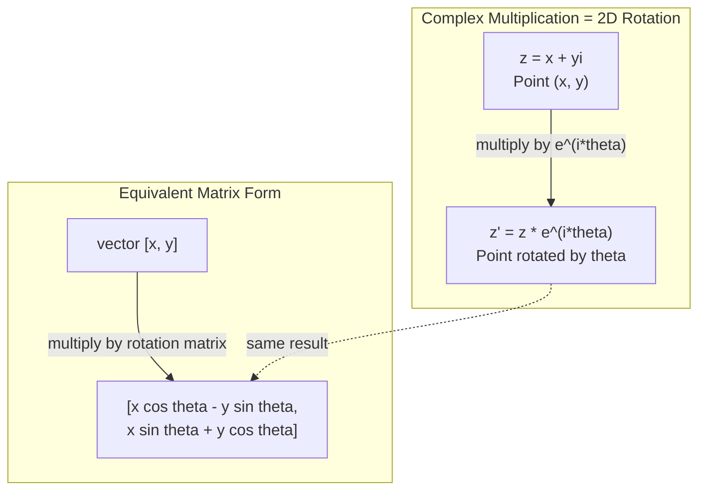
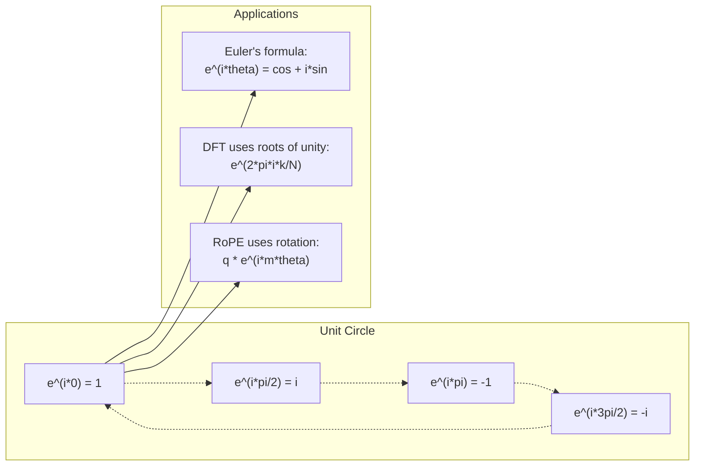

# एआई के लिए जटिल संख्याएं

> -1 की वर्गमूल कल्पना नहीं है, यह घूर्णन, आवृत्तियों और सिग्नल प्रसंस्करण के आधे भाग की कुंजी है।
> -1 की वर्गमूल "भविष्य" नहीं है। यह घूर्णन, आवृत्ति और आधे सिग्नल प्रसंस्करण क्षेत्र की कुंजी है।

**Type:** Learn | **类型:** 学习
**Language:**पायथन**语言:**पायथन
**Prerequisites:** Phase 1, Lessons 01-04 (linear algebra, calculus) | **前置知识:** Phase 1, 第 01-04 课（线性代数、微积分）
**Time:** ~60 minutes | **时间:** ~60 分钟

## सीखने के लक्ष्य

- आयताकार और ध्रुवीय दोनों रूपों में जटिल अंकगणित (जोड़ें, गुणा करें, विभाजित करें, जोड़ें) करें
  执行复数运算(加、乘、除、共), जिसमें直角坐标和极坐标形式 शामिल हैं
- जटिल एक्सपोनेंशियल और त्रिकोणमिति कार्यों के बीच परिवर्तित करने के लिए एयूलर के सूत्र का उपयोग करें
  应用 欧拉公式在复指数和三角函数 के बीच में परिवर्तित
- एकता की जटिल जड़ों का उपयोग करके डिस्क्रिट फ़ूरियर ट्रांसफॉर्म को लागू करें
  उपयोग इकाई के लिए उपयोग करने के लिए
- ट्रांसफार्मर में रोपी और सिनोसाइडल पोजिशनिंग कोडिंग के जटिल रोटेशन कैसे अंतर्निहित हैं, इसकी व्याख्या करें
  解释复数旋转 कैसे रोंपे और ट्रांसफार्मर के गठन के आधार


> **【中文解读】**
> 虚数 i है घूर्णन और आवृत्ति की कुंजी── ट्रांसफार्मर के मध्य में RoPE 位置编码(LLaMA आदि मॉडल का उपयोग) मूलतः है दोहरा संख्या घूर्णन──正弦位置编码 है दोहरा सूचकांक का वास्तविक भाग और虚部──

## समस्या  समस्या परिचय

आप फ़ूरियर परिवर्तन पर एक पेपर खोलें और वहाँ है`i`आप ट्रांसफार्मर स्थिति कोडिंग देख सकते हैं और देख सकते हैं`sin`और `cos`आप क्वांटम कंप्यूटिंग के बारे में पढ़ते हैं और जटिल वेक्टर स्पेस में व्यक्त सब कुछ पा सकते हैं।

> आप एक लेख खोलें परिवर्तन के बारे में, हर जगह हैं।`i`आप Transformer को देखते हैं 位置编码, विभिन्न आवृत्ति को देखते हैं `sin`和 `cos` वे पुनरांकुंड के वास्तविक और वास्तविक भाग हैं आप क्वांटम गणना को पढ़ते हैं, यह सब कुछ पुनरांकुंड के वेक्टर स्पेस में व्यक्त होता है

जटिल संख्याएं अमूर्त लगती हैं। -1 की वर्गमूल पर निर्मित संख्या प्रणाली एक गणितीय चाल की तरह लगती है। लेकिन यह कोई चाल नहीं है। यह घूर्णन और घर्षण की प्राकृतिक भाषा है। जब भी कुछ घूमता है, कंपन करता है या घर्षण करता है, तो जटिल संख्याएं सही उपकरण हैं।

> 复数 बहुत अमूर्त लगती है। -1 की वर्गमूल पर आधारित संख्यात्मक संजाल गणितीय नाटक की तरह महसूस होता है। लेकिन यह नाटक नहीं है। यह घूर्णन और झुकने की प्राकृतिक भाषा है।

जटिल संख्याओं को समझने के बिना, आप डिस्क्रिट फ़ूरियर ट्रांसफॉर्म को नहीं समझ सकते हैं। आप एफएफटी को नहीं समझ सकते हैं। आप नहीं समझ सकते कि आधुनिक भाषा मॉडल में रोपी (रोटरी पोजीशन एम्बेडिंग) कैसे काम करता है। आप नहीं समझ सकते कि मूल ट्रांसफार्मर पेपर में सिनोसाइडल पोजीशनल एन्कोडिंग्स ने वे आवृत्तियों का उपयोग क्यों किया है।

> 不理解复数,你就无法理解离散里叶变换 (DFT) 不能理解 FFT──不能理解 RoPE──旋转位置编码)

यह पाठ जटिल अंकगणित को खरोंच से बनाता है, इसे ज्यामिति से जोड़ता है, और आपको दिखाता है कि मशीन लर्निंग में जटिल संख्याएं कहां दिखाई देती हैं।

> यह कक्षा शून्य से निर्माण से संख्यक परिचालन को जोड़ती है, इसे भौतिकी से जोड़ती है, तथा सटीक रूप से प्रदर्शित करती है कि मशीन लर्निंग में संख्यक का स्थान क्या है।

## अवधारणा का मूल अवधारणा

> **【中文解读】**
> 复数 के मूल अंतर्दृष्टि: i न "虚" का, यह एक 90 डिग्री घूर्णन ऑपरेशन है ∞ एक बार i 转 90 डिग्री, दो बार i 转 90 डिग्री, गुणा दो बार i 转 2 = -1) 转 180 डिग्री ∞ 2D समतल पर बिंदु + प्राकृतिक समर्थन घूर्णन ∞ इसका अर्थ है कि घूर्णन ∞ झोंझल ∞ आवृत्ति के क्षेत्र में कोई भी प्राकृतिक रूप से दोहरे वर्णनात्मक उपयोग के लिए उपयुक्त है ∞

> **【拓展：复数在 AI 中的实际应用规模】**
> OpenAI के GPT-4、Meta के LLaMA 系列 सभी RoPE(Rotary Position Embedding) का उपयोग करते हैं, असलियत में यह है कि कई बार घूमना है। प्रत्येक ध्यान के लिए स्थिति को कोड करने के लिए कई बार घूमना है।

### जटिल संख्या क्या है?

एक जटिल संख्या में दो भाग होते हैंः एक वास्तविक भाग और एक कल्पनात्मक भाग।

> 复数有两部分:实部 (वास्तविक भाग) 和虚部 (कल्पनात्मक भाग)

```
z = a + bi

where:
  a is the real part
  b is the imaginary part
  i is the imaginary unit, defined by i^2 = -1
```

यह है. आप संख्या रेखा को एक विमान में विस्तारित करते हैं. वास्तविक संख्या एक अक्ष पर बैठती है. कल्पनात्मक संख्या दूसरी पर बैठती है. प्रत्येक जटिल संख्या इस विमान में एक बिंदु है.

> यही है। आप संख्या अक्ष को एक समतल में विस्तारित करते हैं। वास्तविक संख्या एक अक्ष पर है।

### जटिल अंकगणित

**Addition.**वास्तविक भागों को एक साथ जोड़ें, कल्पनात्मक भागों को एक साथ जोड़ें।

> **加法。**实部相加,虚部相加──

```
(a + bi) + (c + di) = (a + c) + (b + d)i

Example: (3 + 2i) + (1 + 4i) = 4 + 6i
```

**Multiplication.**वितरण नियम का उपयोग करें और याद रखें कि i^2 = -1.

> **乘法。**उपयोग वितरण नियम, याद रखें i^2 = -1──

```
(a + bi)(c + di) = ac + adi + bci + bdi^2
                 = ac + adi + bci - bd
                 = (ac - bd) + (ad + bc)i

Example: (3 + 2i)(1 + 4i) = 3 + 12i + 2i + 8i^2
                            = 3 + 14i - 8
                            = -5 + 14i
```

**Conjugate.**कल्पनात्मक भाग के संकेत को मोड़ें।

> **共轭（Conjugate）。**翻转虚部的符号──

```
conjugate of (a + bi) = a - bi
```

एक जटिल संख्या और उसके संयोग का गुणक हमेशा वास्तविक होता हैः

> 复数与其共的乘积总是实数:

```
(a + bi)(a - bi) = a^2 + b^2
```

**Division.**संकेतक के संयोग से संख्या और संज्ञाकार को गुणा करें।

> **除法。**分子 और分母 एक ही समय में分母 के सम──

```
(a + bi) / (c + di) = (a + bi)(c - di) / (c^2 + d^2)
```

इससे नामकरण से कल्पनात्मक भाग को हटा दिया जाता है, जिससे आपको एक शुद्ध जटिल संख्या मिलती है।

> यह विभाजित में शून्य भाग को समाप्त करता है, एक शुद्ध गुणांक प्राप्त करता है।

### जटिल विमान

जटिल विमान प्रत्येक जटिल संख्या को 2D बिंदु पर मैप करता है क्षैतिज अक्ष वास्तविक अक्ष है, ऊर्ध्वाधर अक्ष काल्पनिक अक्ष है।

> 复平面将每复数映射为2D点──水平轴是实轴,垂直轴是虚轴──

```
z = 3 + 2i  corresponds to the point (3, 2)
z = -1 + 0i corresponds to the point (-1, 0) on the real axis
z = 0 + 4i  corresponds to the point (0, 4) on the imaginary axis
```

एक जटिल संख्या एक ही समय में मूल से एक बिंदु और एक वेक्टर है। यह दोहरी व्याख्या ही जटिल संख्याओं को ज्यामिति के लिए उपयोगी बनाती है।

> 复数同时是一点和从原点出发的向量── इस प्रकार का द्वि重解释 गणितीय क्षेत्र में बहुपद को बहुत उपयोगी बनाता है──

### ध्रुवीय रूप

विमान में किसी भी बिंदु को मूल से इसकी दूरी और सकारात्मक वास्तविक अक्ष से उसके कोण द्वारा वर्णित किया जा सकता है।

> समतल में किसी भी बिंदु को मूल बिंदु से दूरी और वास्तविक धुरी के कोण के साथ वर्णित किया जा सकता है।

```
z = r * (cos(theta) + i*sin(theta))

where:
  r = |z| = sqrt(a^2 + b^2)     (magnitude, or modulus)
  theta = atan2(b, a)             (phase, or argument)
```

आयताकार रूप (a + bi) जोड़ने के लिए अच्छा है। ध्रुवीय रूप (r, theta) गुणा के लिए अच्छा है।

> 直角坐标形式 (a + bi) 适合加法。极坐标形式 (r, theta) 适合乘法。

**Multiplication in polar form.**परिमाणों को गुणा करें, कोण जोड़ें।

> **极坐标形式的乘法。**模相乘,角相加──

```
z1 = r1 * e^(i*theta1)
z2 = r2 * e^(i*theta2)

z1 * z2 = (r1 * r2) * e^(i*(theta1 + theta2))
```

यही कारण है कि जटिल संख्याएं घूर्णन के लिए एकदम सही हैं। परिमाण 1 के साथ जटिल संख्या से गुणा करना शुद्ध घूर्णन है।

> यही कारण है कि एक के गुणण का गुणण एक के रूप में है।

### यूलर का सूत्र

जटिल एक्सपोनेंशियल और त्रिकोणमिति के बीच पुलः

> 复指数 और三角函数 के बीच का पुल:

```
e^(i*theta) = cos(theta) + i*sin(theta)
```

यह इस पाठ में सबसे महत्वपूर्ण सूत्र है. जब theta = pi:

> यह इस वर्ग का सबसे महत्वपूर्ण सूत्र है।

```
e^(i*pi) = cos(pi) + i*sin(pi) = -1 + 0i = -1

Therefore: e^(i*pi) + 1 = 0
```

पांच मूलभूत स्थिर (ई, आई, पीआई, 1, 0) एक समीकरण में जुड़े हुए हैं।

> 五个基本常数(e、i、pi、1、0) एक समीकरण में एकजुट हो

### एमएल के लिए ईलर का सूत्र क्यों मायने रखता है

एयूलर के सूत्र में कहा गया है कि`e^(i*theta)`थीटा = 0 पर आप (1, 0) पर हैं। थीटा = पई/2, पर आप (0, 1) पर हैं। थीटा = पई पर आप (-1, 0) पर हैं। थीटा = 3*पी/2, पर आप (0, -1) पर हैं। एक पूर्ण घूर्णन थीटा = 2*पी है।

> 欧拉公式说 `e^(i*theta)`随着太变描绘单位圆――theta = 0 时在 (1, 0) ・theta = pi/2 时在 (0, 1) ・theta = pi 时在 (-1, 0) ・theta = 3*pi/2 时在 (0, -1) ・完整旋转是太 = 2*pi。

इसका मतलब है कि जटिल एक्सपोनेंटल ARE घूर्णन हैं और घूर्णन संकेत प्रसंस्करण और ML में हर जगह हैं।

> इसका अर्थ है कि पुन सूचकांक घूर्णन है।

> **【中文解读】**
> 欧拉公式 e^(i*theta) = cos(theta) + i*sin(theta) इस वर्ग का सबसे महत्वपूर्ण सूत्र है। यह सूचकांक फ़ंक्शन और त्रिभुज फ़ंक्शन को एक साथ लाता है, यह भी संख्याओं को एक साथ लाता है और घूर्णन को एक साथ लाता है। जब theta 0 से 2*pi,e^(i*theta) को दोहराव पर एक इकाई के रूप में चित्रित किया जाता है। यह चक्र DFT、RoPE、 संकेत प्रसंस्करण के आधार पर समझा जाता है।

### 2D घूर्णन से कनेक्शन

जटिल संख्या (x + yi) को e^(i*theta से गुणा करके मूल के चारों ओर कोण theta द्वारा बिंदु (x, y) को घुमाया जाता है।

> 将复数 (x + yi) 乘以 e^(i*theta) 将点 (x, y) 绕原点旋转角 theta。

```
Rotation via complex multiplication:
  (x + yi) * (cos(theta) + i*sin(theta))
  = (x*cos(theta) - y*sin(theta)) + (x*sin(theta) + y*cos(theta))i

Rotation via matrix multiplication:
  [cos(theta)  -sin(theta)] [x]   [x*cos(theta) - y*sin(theta)]
  [sin(theta)   cos(theta)] [y] = [x*sin(theta) + y*cos(theta)]
```

वे समान परिणाम देते हैं. जटिल गुणा 2D घूर्णन है. घूर्णन मैट्रिक्स सिर्फ मैट्रिक्स संकेतन में लिखा जटिल गुणा है.

> 它们产生完全相同的结果──复数乘法就是 2D 旋转──旋矩阵只是用矩阵符号写出的复数乘法──



### फासर और घूर्णन संकेत

एक जटिल घातीय e^(i*omega*t) एक इकाई वृत्त के चारों ओर कोणीय आवृत्ति ओमेगा पर घूमते बिंदु है। जैसे-जैसे t बढ़ता है, बिंदु वृत्त का पता चलता है।

> 复指数 e^(i*omega*t) एक角频率 ओमेगा 绕单位圆旋转的点──随着t 增加,点描绘出圆──

इस घूर्णन बिंदु का वास्तविक हिस्सा cos(omega*t है। काल्पनिक हिस्सा sin(omega*t है। एक sinusidal संकेत घूर्णन जटिल संख्या की छाया है।

> इस घूर्णन बिंदु के वास्तविक भाग में cosmost है।

```
e^(i*omega*t) = cos(omega*t) + i*sin(omega*t)

Real part:      cos(omega*t)    -- a cosine wave
Imaginary part: sin(omega*t)    -- a sine wave
```

यह चरण का प्रतिनिधित्व है. एक घुमावदार सिनेस तरंग को ट्रैक करने के बजाय, आप एक सुचारू रूप से घूमते तीर को ट्रैक करते हैं। चरण शिफ्ट कोण ऑफसेट बन जाते हैं। परिमाण परिवर्तन परिमाण परिवर्तन बन जाते हैं। संकेतों का जोड़ वेक्टर योग बन जाता है।

> यह है कि फासोर का अर्थ है कि फासोर को तरंगों के ऊपर से ऊपर की ओर देखने की जरूरत नहीं है, बल्कि तीरों के ऊपर से नीचे की ओर देखने की आवश्यकता है।

### एकता की जड़ें

इकाई वृत्त पर समान रूप से अंतरित N बिंदुओं की इकाई की N- वीं जड़ें हैंः

> N 次 इकाईमूल (N 个点) इकाई圆上等间隔分布的 N 个点:

```
w_k = e^(2*pi*i*k/N)    for k = 0, 1, 2, ..., N-1
```

N = 4 के लिए जड़ें हैंः 1, i, -1, -i (चार कम्पास बिंदु) ।
N = 8 के लिए, आप चार कम्पास बिंदुओं प्लस चार विघात प्राप्त करते हैं।

एकता की जड़ें डिस्क्रिट फ़ूरियर ट्रांसफॉर्म की नींव हैं। डीएफटी इन एन समान-स्थानित आवृत्तियों पर संकेत को घटकों में विघटित करता है।

> 单位根是离散里叶变换的基础――DFT इस N 个等间隔频率 के विभाजन में संकेतन को विभाजित करेगा――

> **【中文解读】**
> 单位根是N 个等等间距分布在单位圆上点──它们的两个奇特性:(1) प्रत्येक के模都恰好为 1;(2) 全部加起来恰好为零── ये दोनों प्रकृतिएँ डीएफटी के उलट गणितीय आधार हैं──DFT मूलतः गणना संकेतों के साथ इस N 个旋相量的"संबंध" है──

### डीएफटी से कनेक्शन

सिग्नल x[0], x[1], ..., x[N-1] का डिस्क्रिट फ़ूरियर ट्रांसफॉर्म हैः

> 信号 x[0], x[1], ..., x[N-1] का विघटन 里叶变换为:

```
X[k] = sum_{n=0}^{N-1} x[n] * e^(-2*pi*i*k*n/N)
```

प्रत्येक एक्स [के] मापता है कि सिग्नल एकता की k-th जड़ के साथ कितना सहसंबंधित है - आवृत्ति k पर एक जटिल सिनोसाइड। डीएफटी एक सिग्नल को N घूर्णन चरणों में तोड़ता है और आपको प्रत्येक के परिमाण और चरण बताता है।

> प्रत्येक X[k]  माप संकेत के साथ संबंध  आवृत्ति के लिए k के पुनरावृत्ति स्ट्रिंगों के लिए  डीएफटी  संकेत को N  घुमावदार मात्रा में विभाजित करेगा, आपको प्रत्येक के आयाम और चरणों के स्थान को बताता है 

### मैं कल्पना क्यों नहीं कर रहा हूँ

"कल्पनात्मक" शब्द एक ऐतिहासिक दुर्घटना है. डेसकार्ट ने इसका उपयोग अस्वीकार करने के लिए किया। लेकिन मैं नकारात्मक संख्याओं की तुलना में अधिक कल्पनात्मक नहीं हूं जब लोग पहली बार उन्हें अस्वीकार कर रहे थे। नकारात्मक संख्याओं का जवाब है "आप 3 से 5 को क्या घटा सकते हैं? "कल्पनात्मक इकाई का जवाब है "आप -1 प्राप्त करने के लिए क्या वर्ग करते हैं? "

> "虚" का यह कथन ऐतिहासिक संयोग है। डेसकार्ट्स ने इसका उपयोग कम किया। लेकिन मैं नकारात्मक संख्या से कम नहीं हूं।

अधिक उपयोगी रूप सेः i एक 90 डिग्री घूर्णन ऑपरेटर है. एक बार i द्वारा एक वास्तविक संख्या को गुणा करें, आप 90 डिग्री को कल्पना की अक्ष पर घूमते हैं. फिर से i द्वारा गुणा करें (i ^ 2) आप एक और 90 डिग्री घूमते हैं - अब आप नकारात्मक वास्तविक दिशा में इंगित कर रहे हैं. यही कारण है कि i ^ 2 = -1. यह रहस्यमय नहीं है। यह दो चौथाई मोड़ से बनाया गया आधा मोड़ है।

> अधिक उपयोगी समझः i एक 90 डिग्री घूर्णन गणना है। i एक बार, आप 90 डिग्री घूर्णन कर शून्य अक्ष में लौटें, i^2 को दोहराएं, i^2 को दोहराएं, i^2 को नकारात्मक दिशा में वापस घुमाएं।

यही कारण है कि इंजीनियरिंग में जटिल संख्याएं हर जगह हैं. जो भी घूमती है -- विद्युत चुम्बकीय तरंगें, क्वांटम अवस्थाएँ, संकेत घिसान, स्थिति कोडिंग -- स्वाभाविक रूप से जटिल संख्याओं द्वारा वर्णित होती है।

> यही कारण है कि अभियांत्रिकी में संख्याएँ कहीं नहीं हैं। किसी भी घूर्णन की वस्तु का प्रयोग विद्युत चुम्बकीय तरंगों, क्वांटम अवस्थाओं, संकेतों के झटके, स्थान कोडों के साथ होता है।

### जटिल एक्सपोनेंटियल बनाम त्रिकोणमितिक फ़ंक्शन

यूलर के सूत्र से पहले, इंजीनियरों ने संकेतों को ए * कॉस * ओमेगा * टी + फि) - परिमाण ए, आवृत्ति ओमेगा, चरण फि के रूप में लिखा था। यह काम करता है लेकिन अंकगणित को दर्दनाक बनाता है। विभिन्न चरणों वाले दो कोसिन जोड़ने के लिए त्रिकोणमित पहचान की आवश्यकता होती है।

> यूरा सूत्र से पहले, इंजीनियर संकेत लिखेंगे A*cos(ओमेगा*t + फि) 幅度 A、 आवृत्ति ओमेगा、相位 phi。 यह संभव है लेकिन गणना बहुत दर्दनाक है。相加 दो अलग-अलग चरणों के余弦 की आवश्यकता है三角恒等式。

जटिल एक्सपोनेंशियल के साथ, एक ही संकेत A*e^(i*(omega*t + phi)) है। दो संकेत जोड़ना सिर्फ दो जटिल संख्याओं को जोड़ना है। गुणा (मॉड्यूलेशन) केवल परिमाणों को गुणा करना और कोण जोड़ना है। चरण शिफ्ट कोण जोड़ने में बदल जाते हैं। आवृत्ति शिफ्ट फ़ैसर द्वारा गुणा हो जाते हैं।

> प्रयोग复指数, उसी तरह के संकेत हैं A*e^(i*(omega*t + phi))。 दो संकेत相加就是两个复数相加──相乘(调制)就是模相乘、角相加──相位偏移变成角加法──频率偏移变成乘相量──

सिग्नल प्रोसेसिंग का पूरा क्षेत्र जटिल एक्सपोनेंशियल नोटेशन में बदल गया क्योंकि गणित स्वच्छ है। "वास्तविक संकेत" हमेशा जटिल प्रतिनिधित्व का वास्तविक हिस्सा होता है। कल्पनात्मक भाग को लेखांकन के रूप में साथ ले जाया जाता है, जिससे सभी बीजगणित स्वाभाविक रूप से काम करते हैं।

>  पूरे संकेत प्रसंस्करण क्षेत्र में पुनः सूचकांक का प्रतिनिधित्व करने का तरीका बदल गया है, क्योंकि गणित अधिक सरल है"असत्य संकेत"总是复数表示的实部虚部作为簿记被保留,使所有代数运算自然成立

> **【拓展：复数在量子计算中的角色】**
> 量子计算 के आधार态是复数向量── एक量子比特 के राज्य में अल्फा 0> + बीटा 1> है, जिसमें अल्फा 2 + beta 2 = 1, अल्फा 和 बीटा 都是复数──量子门是复数矩阵── गूगल के साइकोमोर 量子芯片 में 53 量子比特 हैं, इसकी स्थिति वेट्यूम 2^53 复数分──量子机器学习(QML) सीधे 复数空间 में ऑपरेशन──

### ट्रांसफार्मर से कनेक्शन

**Sinusoidal positional encodings**(मूल ट्रांसफार्मर पेपर):

```
PE(pos, 2i) = sin(pos / 10000^(2i/d))
PE(pos, 2i+1) = cos(pos / 10000^(2i/d))
```

पाप और कॉस जोड़े विभिन्न आवृत्तियों पर जटिल एक्सपोनेंटियल के वास्तविक और कल्पनात्मक भाग हैं। प्रत्येक आवृत्ति कोडिंग स्थिति के लिए एक अलग "रिज़ॉल्यूशन" प्रदान करती है। कम आवृत्तियां धीरे-धीरे बदलती हैं (गहरे स्थिति) । उच्च आवृत्तियां तेजी से बदलती हैं (अच्छी स्थिति) । साथ में वे प्रत्येक स्थिति को एक अद्वितीय आवृत्ति फिंगरप्रिंट देते हैं।

> और इसलिए, विभिन्न आवृत्ति पुनरावृत्ति सूचकांक के वास्तविक और खोटो भागों के लिए। प्रत्येक आवृत्ति के लिए स्थिति कोड अलग अलग "विचार" प्रदान करता है।

**RoPE (Rotary Position Embedding)**यह स्पष्ट रूप से जटिल घूर्णन मैट्रिक्स द्वारा क्वेरी और कुंजी वेक्टर को गुणा करता है। दो टोकन के बीच सापेक्ष स्थिति घूर्णन कोण बन जाती है। इन घूर्णन वेक्टरों का उपयोग करके ध्यान की गणना की जाती है, जिससे मॉडल जटिल गुणा के माध्यम से सापेक्ष स्थिति के प्रति संवेदनशील होता है।

> **RoPE（旋转位置编码）**और आगे  यह स्पष्ट रूप से क्वेरी और कुंजी को गुणा करके दो टोकन के बीच की सापेक्ष स्थिति को घूर्णन कोण में बदल देगा ध्यान इन घूर्णन के बाद के वेट्यूम गणना का उपयोग करके मॉडल को सापेक्ष स्थिति के प्रति संवेदनशील बनाता है

> **【拓展：RoPE 在 LLaMA 和 GPT-NeoX 中的实现】**
> RoPE प्रत्येक जोड़े (q, k) के लिए L^2/2 बार दोहराएँ गुणा करें। निश्चित स्थान कोड के मुकाबले, RoPE का लाभ केवल स्थान के अंतर पर निर्भर करता है, जो स्वाभाविक रूप से "बाहर की ओर" समर्थन करता है। 2048 की लंबाई पर, तर्क को अधिक लंबी क्रम में विस्तारित किया जा सकता है।

| Operation | Algebraic Form | Geometric Meaning |
|-----------|---------------|-------------------|
| Addition | (a+c) + (b+d)i | Vector addition in the plane |
| Multiplication | (ac-bd) + (ad+bc)i | Rotate and scale |
| Conjugate | a - bi | Reflect over real axis |
| Magnitude | sqrt(a^2 + b^2) | Distance from origin |
| Phase | atan2(b, a) | Angle from positive real axis |
| Division | multiply by conjugate | Reverse rotation and rescale |
| Power | r^n * e^(i*n*theta) | Rotate n times, scale by r^n |



## इसे बनाओ, इसे पूरा करो।
```figure
roots-of-unity
```

## इसे बनाओ

### चरण 1: जटिल कक्षा

एक जटिल संख्या वर्ग का निर्माण करें जो आयताकार और ध्रुवीय रूपों के बीच अंकगणित, परिमाण, चरण और रूपांतरण का समर्थन करता है।

>  एक बहुसंख्यक वर्ग का निर्माण,                                                                                                                                                                                                                                                          

```python
import math

class Complex:
    def __init__(self, real, imag=0.0):
        self.real = real
        self.imag = imag

    def __add__(self, other):
        return Complex(self.real + other.real, self.imag + other.imag)

    def __mul__(self, other):
        r = self.real * other.real - self.imag * other.imag  # 实部：(ac - bd)
        i = self.real * other.imag + self.imag * other.real  # 虚部：(ad + bc)
        return Complex(r, i)

    def __truediv__(self, other):
        denom = other.real ** 2 + other.imag ** 2            # 分母：c^2 + d^2
        r = (self.real * other.real + self.imag * other.imag) / denom  # 乘以共轭后的实部
        i = (self.imag * other.real - self.real * other.imag) / denom  # 乘以共轭后的虚部
        return Complex(r, i)

    def magnitude(self):
        return math.sqrt(self.real ** 2 + self.imag ** 2)

    def phase(self):
        return math.atan2(self.imag, self.real)

    def conjugate(self):
        return Complex(self.real, -self.imag)
```

### चरण 2: ध्रुवीय रूपांतरण और एयूलर का सूत्र

```python
def to_polar(z):
    return z.magnitude(), z.phase()

def from_polar(r, theta):
    return Complex(r * math.cos(theta), r * math.sin(theta))

def euler(theta):
    return Complex(math.cos(theta), math.sin(theta))
```

सत्यापित करेंः `euler(theta).magnitude()`हमेशा 1.0 होना चाहिए।`euler(0)`देना चाहिए (1, 0). `euler(pi)`(-1, 0) देना चाहिए।

> 验证:`euler(theta).magnitude()`应始终为1.0──`euler(0)`应给出 (1, 0)`euler(pi)`应给出 (-1, 0)

### चरण 3: घूर्णन

कोण से एक बिंदु (x, y) को घूमना एक जटिल गुणा हैः

> 将点 (x, y) 旋转角度 theta 只有一次复数乘法:

```python
point = Complex(3, 4)
rotated = point * euler(math.pi / 4)
```

केवल कोण बदलता है।

> 模保持不变──只有角度改变──

### चरण 4: जटिल अंकगणित से डीएफटी

```python
def dft(signal):
    N = len(signal)                               # 信号长度
    result = []
    for k in range(N):
        total = Complex(0, 0)
        for n in range(N):
            angle = -2 * math.pi * k * n / N      # 第 k 个单位根的角度
            total = total + Complex(signal[n], 0) * euler(angle)  # 累加：信号与旋转相量的相关
        result.append(total)
    return result
```

यह O(N^2) DFT है। प्रत्येक आउटपुट X[k] सिग्नल नमूनों का योग है जो एकता की जड़ों से गुणा होता है।

> यह ओ (एन) 2 का डीएफटी है। प्रत्येक आउटपुट एक्स [के] है।

### चरण 5: उल्टा डीएफटी

उल्टा डीएफटी अपने स्पेक्ट्रम से मूल संकेत को पुनर्निर्माण करता है। आगे के डीएफटी से केवल परिवर्तनः एक्सपोनेंट में संकेत को पलटकर एन से विभाजित करें।

> 逆 DFT से频谱重建原始信号──正向 DFT के बीच एकमात्र अंतरः翻转指数符号并除以 N──

```python
def idft(spectrum):
    N = len(spectrum)
    result = []
    for n in range(N):
        total = Complex(0, 0)
        for k in range(N):
            angle = 2 * math.pi * k * n / N
            total = total + spectrum[k] * euler(angle)
        result.append(Complex(total.real / N, total.imag / N))
    return result
```

यह आपको सही पुनर्निर्माण देता है. DFT लागू करें, फिर IDFT, और आप मशीन सटीकता के लिए मूल संकेत वापस मिलता है. कोई जानकारी खो नहीं है.

> यह आपको पूर्ण पुनर्निर्माण देता है। DFT को पुनः लागू करें, IDFT को पुनः लागू करें, आप मशीन सटीकता से मूल संकेत को पुनः प्राप्त करते हैं। कोई जानकारी नहीं खोई है।

### चरण 6: एकता की जड़ें

```python
def roots_of_unity(N):
    return [euler(2 * math.pi * k / N) for k in range(N)]
```

दो गुणों की जांच करेंः
- प्रत्येक जड़ का परिमाण 1 होता है।
  प्रत्येक जड़ का आकार 1 है।
- सभी N जड़ों का योग शून्य है (वे सममितता द्वारा रद्द होते हैं) ।
                                                                                                                                                                                                                                                                

ये गुण हैं जो डीएफटी को परिवर्तनीय बनाते हैं। एकता की जड़ें आवृत्ति क्षेत्र के लिए एक ऑर्थोगनल आधार बनाते हैं।

> इन गुणों से डीएफटी को उलटा-उलटा किया जाता है।

## इसे फ्रेमवर्क के साथ लागू करें

पायथन में अंतर्निहित जटिल संख्या समर्थन है।`j`कल्पना की इकाई का प्रतिनिधित्व करता है।

> पायथन 内置复数支持──字面量 `j`दिखाएँ

```python
z = 3 + 2j
w = 1 + 4j

print(z + w)
print(z * w)
print(abs(z))

import cmath
print(cmath.phase(z))
print(cmath.exp(1j * cmath.pi))
```

सरणी के लिए, नम्पी जटिल संख्याओं को मूल रूप से संभालती हैः

> 对于数组,numpy 原生处理复数:

```python
import numpy as np

z = np.array([1+2j, 3+4j, 5+6j])
print(np.abs(z))
print(np.angle(z))
print(np.conj(z))
print(np.real(z))
print(np.imag(z))

signal = np.sin(2 * np.pi * 5 * np.linspace(0, 1, 128))
spectrum = np.fft.fft(signal)
freqs = np.fft.fftfreq(128, d=1/128)
```

## इसे भेजें उत्पाद

दौड़ें`code/complex_numbers.py`उत्पन्न करने के लिए `outputs/skill-complex-arithmetic.md`. .

> 运行 `code/complex_numbers.py`生成 `outputs/skill-complex-arithmetic.md`(复数运算技能文档)

## अभ्यास विषय

1. **Complex arithmetic by hand.**गणना (2 + 3i) * (4 - i) और कोड के साथ सत्यापित करें। फिर गणना (5 + 2i) / (1 - 3i) । जटिल विमान पर दोनों परिणाम खींचें और जांचें कि गुणा घूमा और पहले संख्या को स्केल किया।

2. **Rotation sequence.**बिंदु (1, 0) से शुरू करें। e^(i*pi/6) से बारह बार गुणा करें। 12 गुणा के बाद यह सत्यापित करें कि आप (1, 0) पर लौटते हैं। प्रत्येक चरण में निर्देशांक प्रिंट करें और पुष्टि करें कि वे एक नियमित 12-गोन का पता लगाते हैं।

3. **DFT of a known signal.**एक संकेत बनाएं जो 32 बिंदुओं पर नमूने किए गए पाप के योगफल है ((2 * pi * 3 * t) और 0.5 * sin ((2 * pi * 7 * t) । अपने डीएफटी चलाएं। जांचें कि परिमाण स्पेक्ट्रम में आवृत्तियों 3 और 7 पर शिखर है, जिसमें शिखर 7 पर शिखर की ऊंचाई का आधा है।

4. **Roots of unity visualization.**इकाई की आठवीं जड़ की गणना करें. जांचें कि वे शून्य तक योग हैं. जांचें कि किसी भी जड़ को आदिम जड़ e^(2*pi*i/8) से गुणा करने से अगली जड़ मिलती है।

5. **Rotation matrix equivalence.**10 यादृच्छिक कोणों और 10 यादृच्छिक बिंदुओं के लिए, यह सत्यापित करें कि जटिल गुणा 2x2 घूर्णन मैट्रिक्स के साथ मैट्रिक्स-वेक्टर गुणा के समान परिणाम देता है। अधिकतम संख्यात्मक अंतर प्रिंट करें।

## कीवर्ड्स  शब्द खोज तालिका

| Term | What it means |
|------|---------------|
| Complex number | A number a + bi where a is the real part, b is the imaginary part, and i^2 = -1 |
| Imaginary unit | The number i, defined by i^2 = -1. Not imaginary in the philosophical sense -- it is a rotation operator |
| Complex plane | The 2D plane where the x-axis is real and the y-axis is imaginary. Also called the Argand plane |
| Magnitude (modulus) | The distance from the origin: sqrt(a^2 + b^2). Written as \|z\| |
| Phase (argument) | The angle from the positive real axis: atan2(b, a). Written as arg(z) |
| Conjugate | The mirror image across the real axis: conjugate of a + bi is a - bi |
| Polar form | Expressing z as r * e^(i*theta) instead of a + bi. Makes multiplication easy |
| Euler's formula | e^(i*theta) = cos(theta) + i*sin(theta). Connects exponentials to trigonometry |
| Phasor | A rotating complex number e^(i*omega*t) representing a sinusoidal signal |
| Roots of unity | The N complex numbers e^(2*pi*i*k/N) for k = 0 to N-1. N equally spaced points on the unit circle |
| DFT | Discrete Fourier Transform. Decomposes a signal into complex sinusoidal components using roots of unity |
| RoPE | Rotary Position Embedding. Uses complex multiplication to encode relative position in transformer attention |

> 术语速查:संक्रामक संख्या(复数 a+bi)、कल्पनात्मक इकाई(虚数单位 i,旋转算子)、संक्रामक विमान(复平面)、मग्निटुडे/मॉड्यूलस(模 √(a2+b2))、चरण/वक्ता(相位 atan2(b,a))、संयुक्त(共 a-bi)、 ध्रुवीय रूप(极坐标 r·e^(iθ、))欧拉公式 e^(iθ)=θ+i·sinθ)、Phasor(旋转相量)、Unit N 个均分单位圆的点)、DFT散离里叶变换)、Rocosmode 旋转位置编码,L(La_PE 模型等使用)

## आगे पढ़ना 延伸閱讀

- [Visual Introduction to Euler's Formula](https://betterexplained.com/articles/intuitive-understanding-of-eulers-formula/)- भारी नोटेशन के बिना ज्यामितीय अंतर्ज्ञान का निर्माण करता है
- [Su et al.: RoFormer (2021)](https://arxiv.org/abs/2104.09864)- जटिल रोटेशन का उपयोग करके रोटरी पोजीशन एम्बेडिंग की शुरूआत करने वाला पेपर
- [Vaswani et al.: Attention Is All You Need (2017)](https://arxiv.org/abs/1706.03762)- मूळ ट्रांसफार्मर पेपर विसोनसियल पोजिशनिंग कोडिंग्स के साथ
- [3Blue1Brown: Euler's formula with introductory group theory](https://www.youtube.com/watch?v=mvmuCPvRoWQ)- दृश्य स्पष्टीकरण क्यों e^(i*pi) = -1
- [Needham: Visual Complex Analysis](https://global.oup.com/academic/product/visual-complex-analysis-9780198534464)- जटिल संख्याओं का सर्वोत्तम दृश्य उपचार, ज्यामितीय अंतर्दृष्टि से भरा
- [Strang: Introduction to Linear Algebra, Ch. 10](https://math.mit.edu/~gs/linearalgebra/)- रैखिक बीजगणित और स्वमान के संदर्भ में जटिल संख्याएं
