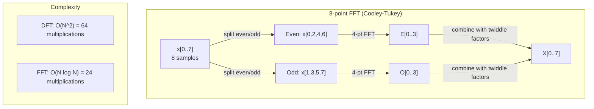
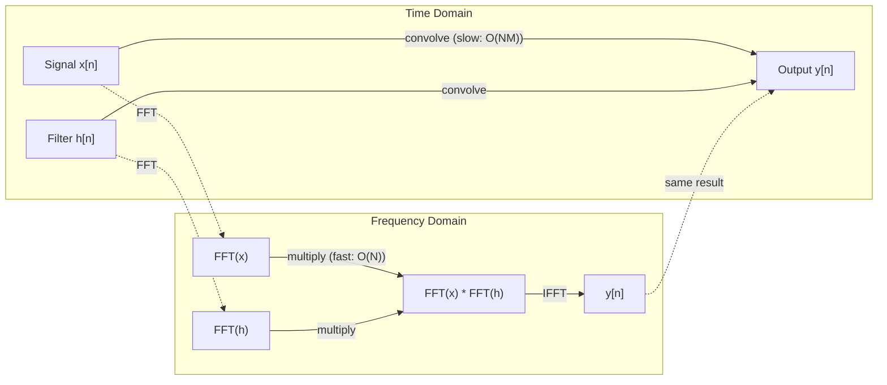

# फ़ूरियर ट्रांसफॉर्म 里叶变更

> प्रत्येक संकेत सिनेस तरंगों का योग है. फ़ूरियर परिवर्तन आपको बताता है कि कौन से हैं.
> प्रत्येक संकेत एक स्ट्रिंग के ऊपर होता है।

**Type:** Build | **类型:** 动手
**Language:**पायथन**语言:**पायथन
**Prerequisites:** Phase 1, Lessons 01-04, 19 (complex numbers) | **前置知识:** Phase 1, 第 01-04 课、第 19 课（复数）
**Time:** ~90 minutes | **时间:** ~90 分钟

## सीखने के लक्ष्य

- डीएफटी को खरोंच से लागू करें और इसे ओ(एन लॉग एन) कोली-टुकई एफएफटी के खिलाफ सत्यापित करें
  शून्य से DFT को प्राप्त करने के लिए और O(N log N) के साथ Cooley-Tukey FFT 验证
- आवृत्ति गुणांक की व्याख्या करेंः संकेत से amplitude, phase, and power spectrum निकालें
  解释频率系数: 信号中提取幅度、相位和功率谱 (पावर स्पेक्ट्रम)
- FFT गुणन के माध्यम से संभलण करने के लिए संभलण प्रमेय को लागू करें
  应用卷积定理 FFT 乘法执行卷积 के माध्यम से
- ट्रांसफार्मर स्थिति एन्कोडिंग और सीएनएन संवर्धन परतों के लिए फ़्यूरियर आवृत्ति विघटन कनेक्ट करें
  里叶频率分解  ट्रांसफार्मर 位置编码和CNN 卷积层 से संपर्क करें


> **【中文解读】**
> 任何信号 को正弦波──音频处理、图像压缩都依赖于FFT──卷积定理说时域卷积等于频域乘法,可用FFT 加速CNN卷积── ट्रांसफार्मर 正弦位置编码就是里叶基函数──

## समस्या  समस्या परिचय

ऑडियो रिकॉर्डिंग समय के साथ दबाव माप का एक अनुक्रम है। स्टॉक मूल्य दिनों के दौरान मानों का एक अनुक्रम है। एक छवि अंतरिक्ष पर पिक्सेल तीव्रता की एक ग्रिड है। ये सभी समय डोमेन (या अंतरिक्ष डोमेन) में डेटा हैं। आप कुछ सूचकांक के साथ मान बदलते देखते हैं।

> 音频录制是随时变化的压力测量序列──股票价格是随天数变化的值序列──图像是空间上像素强度的网格──这些都是时域 (或空域) में डेटा──你看到的是某索引上变化的值──

लेकिन समय क्षेत्र में कई पैटर्न अदृश्य हैं। क्या यह ऑडियो सिग्नल एक शुद्ध स्वर या एक स्वर है? क्या इस शेयर मूल्य में एक साप्ताहिक चक्र है? क्या इस छवि में दोहराया जाने वाला बनावट है? ये प्रश्न आवृत्ति सामग्री के बारे में हैं, और समय क्षेत्र इसे छिपाता है।

> लेकिन समय क्षेत्र में कई पैटर्न अदृश्य हैं। यह ध्वनि संकेत शुद्ध ध्वनि या तार है? क्या इस शेयर की कीमत का चक्र है? क्या इस छवि में दोहराव संरचना है? ये प्रश्न आवृत्ति सामग्री के बारे में हैं, जबकि समय क्षेत्र इसे छिपाएगा।

फ़ूरियर परिवर्तन समय क्षेत्र से डेटा को आवृत्ति क्षेत्र में परिवर्तित करता है। यह एक संकेत लेता है और इसे विभिन्न आवृत्तियों की सिनेस तरंगों में विघटित करता है। प्रत्येक सिनेस तरंग में एक परिमाण (यह कितना मजबूत है) और एक चरण (जहां यह शुरू होता है) होता है। फ़ूरियर परिवर्तन आपको दोनों बताता है।

> 里叶变换将数据从时域转换到频域── यह एक संकेत प्राप्त करता है और इसे विभिन्न आवृत्तियों के正弦波 में विभाजित करता है── प्रत्येक正弦波 में आयाम है🏻🏻🏻🏻🏻🏻🏻🏻🏻🏻🏻🏻🏻🏻🏻🏻🏻🏻🏻🏻🏻🏻🏻🏻🏻🏻🏻🏻🏻🏻🏻🏻🏻🏻🏻🏻🏻🏻🏻🏻🏻🏻🏻🏻🏻🏻🏻🏻🏻🏻🏻🏻🏻🏻🏻🏻🏻🏻🏻🏻🏻🏻🏻🏻🏻🏻🏻🏻🏻🏻🏻🏻🏻🏻🏻🏻🏻🏻🏻🏻🏻🏻🏻🏻🏻🏻🏻🏻🏻🏻🏻🏻🏻🏻🏻🏻🏻🏻🏻🏻🏻🏻🏻🏻🏻🏻🏻🏻🏻🏻🏻🏻🏻🏻🏻🏻🏻🏻🏻🏻🏻🏻🏻🏻🏻🏻🏻🏻🏻🏻🏻🏻

यह एमएल के लिए मायने रखता है क्योंकि आवृत्ति-क्षेत्र सोच हर जगह दिखाई देती है। संकुचन तंत्रिका नेटवर्क संकुचन करते हैं, जो आवृत्ति क्षेत्र में गुणा है। ट्रांसफार्मर स्थिति कोडिंग स्थिति को दर्शाने के लिए आवृत्ति विघटन का उपयोग करती है। ऑडियो मॉडल (भाषण पहचान, संगीत उत्पादन) स्पेक्ट्रोग्राम पर काम करते हैं - ध्वनि की आवृत्ति प्रतिनिधित्व। समय श्रृंखला मॉडल आवधिक पैटर्न की तलाश करते हैं। फ़ूरियर परिवर्तन को समझना आपको इन सभी के साथ काम करने के लिए शब्दावली देता है।

> यह एमएल के लिए महत्वपूर्ण है, क्योंकि अक्सर विचार करने का कोई स्थान नहीं है। यह अक्सर भाग में होता है। यह अक्सर भाग में होता है।

## अवधारणा का मूल अवधारणा

> **【中文解读】**
> 里叶变换的核心思想: किसी भी संकेत को विभिन्न आवृत्तियों के正弦波之和和──DFT में विभाजित किया जा सकता है। 里叶变换的核心思想: किसी भी संकेत को विभिन्न आवृत्तियों के正弦波之和和和──DFT में विभाजित किया जा सकता है। 时域信号 को频域系数 में परिवर्तित करें प्रत्येक系数 आपको बताता है" इस आवृत्ति में कितनी ऊर्जा है"── यह एक दर्पण की तरह है जो सफेद प्रकाश को रङ虹 में विभाजित करता हैः 时域 देखता है मिश्रित संकेत,频域 देखता है कि प्रत्येक घटक──

> **【拓展：FFT 的计算影响力】**
> एफएफटी को 20 वीं सदी के सबसे महत्वपूर्ण अंकगणितीय एल्गोरिदम में से एक के रूप में जाना जाता है। गौस ने 1805 में ही विभाजनकारी रणनीति की खोज की, लेकिन कुली-टुकई ने 1965 के अपने शोध में एफएफटी को व्यापक रूप से लागू करने में सक्षम बनाया। आज, प्रत्येक बार 4जी / एलटीई 通话、 प्रत्येक JPEG 照片、 प्रत्येक एमपी 3 गीत एफएफटी 处理 से गुजरते हैं। एआई के क्षेत्र में, शोर 语音 मॉडल प्रति सेकंड ध्वनि频 गणना के लिए लगभग 100 बार एफएफटी, स्थिर विसारण के छवि प्रसंस्करण ट्यूब भी प्रचुर मात्रा में उपयोग करते हैं।

### डीएफटी परिभाषा

N नमूने x[0], x[1], ..., x[N-1] दिए जाने पर, डिस्क्रिट फ़ूरियर ट्रांसफॉर्म N आवृत्ति गुणांक X[0], X[1], ..., X[N-1] का उत्पादन करता हैः

> 给定 N 个样本 x[0], x[1], ..., x[N-1],离散里叶变换产生 N 个频率系数 X[0], X[1], ..., X[N-1]:

```
X[k] = sum_{n=0}^{N-1} x[n] * e^(-2*pi*i*k*n/N)

for k = 0, 1, ..., N-1
```

प्रत्येक X [k] एक जटिल संख्या है. इसका आयाम. X [k] यह आपको आवृत्ति k का आयाम बताता है. इसका चरण कोण ((X [k]) आपको उस आवृत्ति का चरण ऑफसेट बताता है.

> प्रत्येक X[k] है复数──其模── X[k] भी 告诉你频率 k 的幅度──其相位角── X[k]) 告诉你该频率的相位偏移──

मुख्य जानकारी:`e^(-2*pi*i*k*n/N)`एक घर्षण फ़ैसर है जो आवृत्ति k पर होता है। DFT सिग्नल और प्रत्येक N समान रूप से अंतरित आवृत्तियों के बीच संबंध की गणना करता है। यदि सिग्नल में आवृत्ति k पर ऊर्जा होती है, तो संबंध बड़ा होता है। यदि नहीं, तो यह शून्य के करीब होता है।

> 关键洞察:`e^(-2*pi*i*k*n/N)`                                                                                                                                                                                                                                                              

### प्रत्येक गुणांक का अर्थ क्या है

**X[0]: the DC component.**यह सभी नमूनों का योग है -- औसत के समानुपातिक. यह संकेत की निरंतर (शून्य आवृत्ति) ऑफसेट का प्रतिनिधित्व करता है.

> **X[0]：直流分量（DC Component）。**यह सभी नमूनों के कुल और औसत के बराबर है।

```
X[0] = sum_{n=0}^{N-1} x[n] * e^0 = sum of all samples
```

**X[k] for 1 <= k <= N/2: positive frequencies.**X[k] N नमूने प्रति आवृत्ति k चक्रों का प्रतिनिधित्व करता है। उच्च k का अर्थ है उच्च आवृत्ति (त्वरित कंपन) ।

> **X[k]（1 <= k <= N/2）：正频率。**X[k] 代表每 N 个样本中 k 个周期的频率──k 越大频率越高(振荡越快)──

**X[N/2]: the Nyquist frequency.**उच्चतम आवृत्ति आप N नमूने के साथ प्रतिनिधित्व कर सकते हैं. इसके ऊपर, आप उपनाम मिलता है - उच्च आवृत्तियों कम के रूप में लुका.

> **X[N/2]：Nyquist 频率。**प्रयोग N 个样本能表示的最高频率──超过此频率会产生混叠

**X[k] for N/2 < k < N: negative frequencies.**वास्तविक मूल्य वाले संकेतों के लिए, X[N-k] = conj(X[k]। नकारात्मक आवृत्तियां सकारात्मक की दर्पण छवियां हैं। यही कारण है कि उपयोगी जानकारी पहले N/2 + 1 गुणांक में है।

> **X[k]（N/2 < k < N）：负频率。**对于实值信号,X[N-k] = conj(X[k])──负频率是正频率的镜像──这就是为什么有用信息在前N/2 + 1 系数中──

### उल्टा डीएफटी

उल्टा डीएफटी अपने आवृत्ति गुणांक से मूल संकेत को पुनः निर्माण करता हैः

```
x[n] = (1/N) * sum_{k=0}^{N-1} X[k] * e^(2*pi*i*k*n/N)

for n = 0, 1, ..., N-1
```

आगे के डीएफटी से केवल अंतरः एक्सपोनेंट में संकेत सकारात्मक (नकारात्मक नहीं) है, और 1/एन सामान्यीकरण कारक है।

> सही दिशा में डीएफटी के साथ एकमात्र अंतरः सूचकांक प्रतीक के लिए सही है, और एक 1/N का एकीकरण कारक है।

उल्टा डीएफटी सही पुनर्निर्माण है. कोई जानकारी नहीं खोई जाती है. आप समय डोमेन से आवृत्ति डोमेन और वापस बिना किसी त्रुटि के जा सकते हैं. डीएफटी आधार परिवर्तन है - यह एक अलग निर्देशांक प्रणाली में एक ही जानकारी को फिर से व्यक्त करता है.

> 逆DFT是完美重建――没有信息丢失――你可以从时域到频域再回来,没有任何错误――DFT是基变换它用不同的坐标系再表达相同信息――

### FFT: इसे तेज करना

ऊपर परिभाषित DFT O(N^2) हैः N आउटपुट गुणांक के प्रत्येक के लिए, आप N इनपुट नमूनों पर योग करते हैं। N = 1 मिलियन के लिए, यह 10^12 ऑपरेशन है।

> उपरोक्त परिभाषा के अनुसार DFT = O (N^2) का अर्थ है: N 个输出系数 में से प्रत्येक के लिए, आप N 个输入样本求和―― N = 100,000 के लिए, यह 10^12 बार运算――

फास्ट फ़ूरियर ट्रांसफॉर्म (एफएफटी) O  N लॉग N में एक ही परिणाम की गणना करता है। N = 1 मिलियन के लिए, यह एक ट्रिलियन के बजाय लगभग 20 मिलियन संचालन है। यह आवृत्ति विश्लेषण को व्यावहारिक बनाता है।

> 快速里叶变换(FFT) के साथ O(N log N) 计算相同的结果──对于N = 100,000,000,大约是20000000次运算而不是10亿次――这就是频率分析变得可行的原因──

> **【中文解读】**
> डीएफटी की गणना मात्रा ओ (N) 2 है, लेकिन एफएफटी इसे O (N) 1 मिलियन के संकेत के लिए कम करता है। डीएफटी को केवल 2 मिलियन से अधिक बार गति की आवश्यकता होती है।

कोली-टुकई एल्गोरिथ्म (सबसे आम एफएफटी) विभाजित और जीतकर काम करता हैः

> कुली-टुकई 算法 (FFT) ️️️️️️️️️️️️️️️️️️️️️️️️️️️️️️️️️️️️️️️️️️️️️️️️️️️️️️️️️️️️️️️️️️️️️️️️️️️️️️️️️️️️️️️️️️️️️️️️️️️️️️️️️️️️️️️️️️️️️️️️️️️️️️️️️️️️️️️️️️️️️️️️️️️️️️️️️️️️️️️️️️️️️️️️️️️️️️️️️️️️️️️️️️️️️️️️️️️️️️️️️️

1. सिग्नल को सम अनुक्रमित और विषम अनुक्रमित नमूनों में विभाजित करें।
   संकेत को आकस्मिक संकेतक और अनूठा संकेतक में विभाजित करें।
2. प्रत्येक आधे की DFT की पुनरावर्ती गणना करें।
   递归计算每一半的DFT──
3. "ट्विडल फैक्टर" e^(-2*pi*i*k/N का उपयोग करके दो अर्ध आकार के डीएफटी को मिलाएं।
   प्रयोग"旋转因子" (Twiddle Factor) ई^(-2*pi*i*k/N) 合并两个半尺寸的DFT──

```
X[k] = E[k] + e^(-2*pi*i*k/N) * O[k]          for k = 0, ..., N/2 - 1
X[k + N/2] = E[k] - e^(-2*pi*i*k/N) * O[k]    for k = 0, ..., N/2 - 1

where E = DFT of even-indexed samples
      O = DFT of odd-indexed samples
```

सममितता का अर्थ है कि प्रत्येक पुनरावृत्ति स्तर O(N) काम करता है, और वहाँ log2(N) स्तर हैं। कुलः O(N log N।

> 对称性 का अर्थ है प्रत्येक स्तर पर लौट कर आना, साझा लॉग2



एफएफटी के लिए संकेत की लंबाई 2 की शक्ति होनी चाहिए। व्यवहार में, संकेतों को 2 की अगली शक्ति के लिए शून्य-पैड किया जाता है।

### स्पेक्ट्रम विश्लेषण

**power spectrum**यह प्रत्येक आवृत्ति गुणांक का वर्ग आयाम है। यह दिखाता है कि प्रत्येक आवृत्ति पर कितना ऊर्जा है।

**phase spectrum**प्रत्येक आवृत्ति का चरण ऑफसेट है। अधिकांश विश्लेषण कार्यों के लिए, आप बिजली स्पेक्ट्रम की परवाह करते हैं और चरण को अनदेखा करते हैं।

```
Power at frequency k:  P[k] = |X[k]|^2 = X[k].real^2 + X[k].imag^2
Phase at frequency k:  phi[k] = atan2(X[k].imag, X[k].real)
```

### आवृत्ति संकल्प

डीएफटी का आवृत्ति संकल्प नमूने N की संख्या और नमूना लेने की दर fs पर निर्भर करता है।

```
Frequency of bin k:      f_k = k * fs / N
Frequency resolution:    delta_f = fs / N
Maximum frequency:       f_max = fs / 2  (Nyquist)
```

दो आवृत्तियों को हल करने के लिए जो एक दूसरे के करीब हैं, आपको अधिक नमूनों की आवश्यकता है। उच्च आवृत्तियों को पकड़ने के लिए, आपको उच्च नमूनाकरण दर की आवश्यकता है।

### संकुचन प्रमेय

यह सिग्नल प्रसंस्करण में सबसे महत्वपूर्ण परिणामों में से एक है और सीएनएन के लिए सीधे प्रासंगिक है।

> यह सिग्नल प्रसंस्करण में सबसे महत्वपूर्ण परिणामों में से एक है, सीएनएन से सीधे संबंधित है।

**Convolution in the time domain equals pointwise multiplication in the frequency domain.**

> **时域中的卷积等于频域中的逐点相乘。**

```
x * h = IFFT(FFT(x) . FFT(h))

where * is convolution and . is element-wise multiplication
```

यह क्यों मायने रखता हैः

- लंबाई N और M के दो संकेतों के प्रत्यक्ष घुमाव O(N*M) संचालन करता है।
  两个长度为 N 和 M 的信号直接卷积需要 O(N*M) 次运算──
- FFT आधारित संभलना O(N log N लेता हैः दोनों को परिवर्तित करें, गुणा करें, वापस परिवर्तित करें।
  基于 FFT 的卷积需要 O  N log N:变换两个信号、相乘、逆变换。
- बड़े कर्नल के लिए, एफएफटी संकुचन नाटकीय रूप से तेज़ है।
                                                                                                                                                                                                                                                                
- यह ठीक वही है जो बड़े रिसेप्टिव फील्ड के साथ घुमावदार परतों में होता है।
  यह एक बहुत ही संवेदनशील क्षेत्र में होता है।

> **【拓展：卷积定理在 CNN 中的实际应用】**
> 標準 3x3 卷积直接计算比FFT 快, लेकिन जब महसूस野变大时FFT 优势显现──ConvNeXt 和 Global Convolution 网络在 7x7 या इससे बड़े卷积中使用FFT 加速──FNet (Lee-Thorp et al., 2021) 更大胆地使用FFT 替代变压器的自注意力, GLUE 基准上达到 92% की BERT 精度, लेकिन प्रशिक्षण की गति तेजी से 7 倍──频域复制复制杂度是O(N) जबकि समय域卷积是O(N^2) 

नोटः डीएफटी परिपत्र घुमाव (सिग्नल घुमाव) की गणना करता है। रैखिक घुमाव (कोई घुमाव नहीं) के लिए, गणना से पहले N + M - 1 की लंबाई के लिए दोनों संकेतों को शून्य-पैड करें।

> ध्यानःDFT  गणना चक्र चक्र है 信号会环绕) ⋅对于线性卷积(无环绕),在计算前将两个信号补零到长度 N + M - 1──



### खिड़की

डीएफटी का मानना है कि सिग्नल आवधिक है - यह एन नमूनों को एक अनंत रूप से दोहराए जाने वाले सिग्नल की एक अवधि के रूप में व्यवहार करता है। यदि सिग्नल एक ही मूल्य पर शुरू और समाप्त नहीं होता है, तो यह सीमा पर एक विखंडन पैदा करता है, जो उच्च आवृत्ति सामग्री के रूप में दिखाई देता है। इसे स्पेक्ट्रल लीक कहा जाता है।

> डीएफटी 假设信号是周期的它将N个样本视为无限重复信号的一个周期―― यदि संकेत एक ही मूल्य पर शुरू और समाप्त नहीं होता है, तो सीमा पर एक असंरक्षण उत्पन्न होता है, जो फर्जी के उच्च频内容 के रूप में प्रकट होता है―― इसे频谱泄漏 (स्पेक्ट्रल लीक) कहा जाता है।

विंडोइंग डीएफटी की गणना से पहले दोनों छोरों पर सिग्नल को शून्य तक कम करके रिसाव को कम करता है।

> 窗函数(Windowsing)                                                                                                                                                                                                                                                           

सामान्य खिड़कियांः

| Window | Shape | Main lobe width | Side lobe level | Use case |
|--------|-------|----------------|-----------------|----------|
| Rectangular | Flat (no window) | Narrowest | Highest (-13 dB) | When signal is exactly periodic in N samples |
| Hann | Raised cosine | Moderate | Low (-31 dB) | General purpose spectral analysis |
| Hamming | Modified cosine | Moderate | Lower (-42 dB) | Audio processing, speech analysis |
| Blackman | Triple cosine | Wide | Very low (-58 dB) | When side lobe suppression is critical |

```
Hann window:    w[n] = 0.5 * (1 - cos(2*pi*n / (N-1)))
Hamming window: w[n] = 0.54 - 0.46 * cos(2*pi*n / (N-1))
```

DFT से पहले के संकेत के साथ तत्व-wise गुणा करके विंडो को लागू करेंः `X = DFT(x * w)`. .

### डीएफटी गुण

| Property | Time Domain | Frequency Domain |
|----------|-------------|-----------------|
| Linearity | a*x + b*y | a*X + b*Y |
| Time shift | x[n - k] | X[f] * e^(-2*pi*i*f*k/N) |
| Frequency shift | x[n] * e^(2*pi*i*f0*n/N) | X[f - f0] |
| Convolution | x * h | X * H (pointwise) |
| Multiplication | x * h (pointwise) | X * H (circular convolution, scaled by 1/N) |
| Parseval's theorem | sum \|x[n]\|^2 | (1/N) * sum \|X[k]\|^2 |
| Conjugate symmetry (real input) | x[n] real | X[k] = conj(X[N-k]) |

पार्सेवल का प्रमेय कहता है कि दोनों क्षेत्रों में कुल ऊर्जा समान है। ऊर्जा परिवर्तन के माध्यम से संरक्षित होती है।

> पारसव 定理说明 दो क्षेत्रों में कुल ऊर्जा समान है।

### स्थिति कोडिंग से कनेक्शन

मूल ट्रांसफार्मर sinusidal स्थिति एन्कोडिंग का उपयोग करता हैः

```
PE(pos, 2i)   = sin(pos / 10000^(2i/d_model))
PE(pos, 2i+1) = cos(pos / 10000^(2i/d_model))
```

प्रत्येक आयाम जोड़ी (2i, 2i+1) एक अलग आवृत्ति पर टहलती है। आवृत्तियां ज्यामितीय रूप से उच्च (आयाम 0,1) से कम (अंतिम आयाम) तक भिन्न होती हैं। यह प्रत्येक स्थिति को सभी आवृत्ति बैंड में एक अद्वितीय पैटर्न देता है - जैसे कि फ़ूरियर गुणांक एक संकेत की अद्वितीय पहचान करते हैं।

> प्रत्येक आयाम के लिए (2i, 2i+1) विभिन्न आवृत्ति के साथ झुकना है। आवृत्ति उच्च से उच्च तक है।

इसमें उपलब्ध प्रमुख गुण हैंः

- **Uniqueness:**कोई दो स्थानों एक ही एन्कोडिंग है.
  **唯一性：** दो स्थानों में एक ही कोड नहीं है
- **Bounded values:**पाप और cos हमेशा में हैं [-1, 1].
  **有界值：**पाप और कारण 始终在 [-1, 1] 中──
- **Relative position:**स्थिति p + k का एन्कोडिंग स्थिति p पर एन्कोडिंग के रैखिक कार्य के रूप में व्यक्त किया जा सकता है। मॉडल सापेक्ष स्थितियों को ध्यान में रखना सीख सकता है।
  **相对位置：**位置 p+k का कोड स्थिति p 编码 के लिए संकेतित किया जा सकता है 线性函数──模型可以学习关注相对位置──

### सीएनएन से संबंध

एक संभलण परत सिग्नल या छवि के माध्यम से स्लाइड करके इनपुट पर एक सीखा गया फ़िल्टर (कर्नेल) लागू करती है। गणितीय रूप से, यह संभलण ऑपरेशन है।

> 卷积层通过在信号或图像上滑学习的波器 (卷积核) में इनपुट के लिए उपयोग किया जाता है।

संकुचन प्रमेय के अनुसार, यह निम्न के बराबर हैः
1. FFT इनपुट
   FFT 输入
2. FFT नाभिक
   एफएफटी 卷积核
3. आवृत्ति क्षेत्र में गुणा करें
   प्रवर्तन में
4. परिणाम
   IFFT 结果

मानक सीएनएन कार्यान्वयन प्रत्यक्ष संरेखण (छोटे 3x3 कर्नल के लिए तेज़) का उपयोग करते हैं। लेकिन बड़े कर्नल या वैश्विक संरेखण के लिए, एफएफटी-आधारित दृष्टिकोण काफी तेज़ हैं। कुछ वास्तुकला (जैसे एफएनटी) पूरी तरह से एफएफटी के साथ ध्यान को बदल देती हैं, O(N लॉग N) के बजाय O(N ^2) जटिलता के साथ प्रतिस्पर्धी सटीकता प्राप्त करती हैं।

> 标准 CNN 实现直接卷积的使用(小的3x3卷积核更快) 但是对于大卷积核或全局卷积,基于FFT的方法显著更快── कुछ संरचनाएं((जैसे FNet) पूरी तरह से FFT 替代注意力, O(N log N) के बजाय O(N^2) की जटिलता के साथ प्रतिस्पर्धी सटीकता प्राप्त करती हैं──

### स्पेक्ट्रोग्राम और अल्पकालिक फ़ूरियर परिवर्तन

एक एकल एफएफटी आपको पूरे सिग्नल की आवृत्ति सामग्री देता है, लेकिन आपको यह नहीं बताता कि वे आवृत्तियां कब होती हैं। एक चिप (एक सिग्नल जिसकी आवृत्ति समय के साथ बढ़ जाती है) और एक कॉर्ड (सभी आवृत्तियां एक साथ मौजूद हैं) में एक ही परिमाण स्पेक्ट्रम हो सकता है।

>                                                                                                                                                                                                                                                               

शॉर्ट-टाइम फ़ूरियर ट्रांसफॉर्म (STFT) इस समस्या को सिग्नल की ओवरलैप खिड़कियों पर एफएफटी की गणना करके हल करता है। परिणाम एक स्पेक्ट्रोग्राम हैः एक अक्ष पर समय और दूसरी पर आवृत्ति के साथ एक 2D प्रतिनिधित्व। प्रत्येक बिंदु पर तीव्रता उस समय उस आवृत्ति पर ऊर्जा को दर्शाता है।

> 短时里叶变换(STFT) इस समस्या को हल करने के लिए संकेत के ओवरले खिड़की पर FFT की गणना करके परिणाम यह है कि एक समय के साथ एक अक्ष के लिए एक आवृत्ति, दूसरे अक्ष के लिए एक आवृत्ति का 2D प्रतिनिधित्व है। प्रत्येक बिंदु की ताकत उस समय की ऊर्जा को प्रदर्शित करती है।

```
STFT procedure:
1. Choose a window size (e.g., 1024 samples)
2. Choose a hop size (e.g., 256 samples -- 75% overlap)
3. For each window position:
   a. Extract the windowed segment
   b. Apply a Hann/Hamming window
   c. Compute FFT
   d. Store the magnitude spectrum as one column of the spectrogram
```

स्पेक्ट्रोग्राम ऑडियो एमएल मॉडल के लिए मानक इनपुट प्रतिनिधित्व हैं। भाषण पहचान मॉडल (विस्पर, डीप स्पीच) मेल-स्पेक्ट्रोग्राम पर काम करते हैं - मेल पैमाने पर मैप की गई आवृत्तियों के साथ स्पेक्ट्रोग्राम, जो मानव पिच धारणा से बेहतर मेल खाता है।

> 频谱图是音频 ML 模型的标准输入表示──语音识别模型(Whisper、DeepSpeech) मे尔频谱图(Mel-Spectrogram) पर ऑपरेशन频率映射到梅尔刻度的频谱图,更好地匹配人类音高感知──

> **【中文解读】**
> ️️️️️️️️️️️️️️️️️️️️️️️️️️️️️️️️️️️️️️️️️️️️️️️️️️️️️️️️️️️️️️️️️️️️️️️️️️️️️️️️️️️️️️️️️️️️️️️️️️️️️️️️️️️️️️️️️️️️️️️️️️️️️️️️️️️️️️️️️️️️️️️️️️️️️️️️️️️️️️️️️️️️️️️️️️️️️️️️️️️️️️️️️️️️️️️️️️️️️️️️️️️️️️️️️️️️️️️️️️️️️️️️️️️️️️️️️️️️️️️️️️️️️️️️️️️️️️️️️️️️️️️️️️️️️️️️️️️️️️️️️️️️️️️️️️️️️️️️️️️️️️️️️️️️️️️️️️️️️️️️️️️️️️️️️️️️️️️️️️️️️️️️️️️️️️️️️️️️️️️️️️️️️️️️️️️️️️️️️️️️️️️️️️️️️️️️️️️️️️️️️️️️️️️️️️️️️️️️️️️️️️️️️️️️️️️️️️️️️️️️️️️️️️️️️️️️️️️️️️️️️️️️️️️️️️️️️️️️️️️️️️️️️️️️️️️️️️️️️️️️️️️️️️️️

### उपनाम

यदि किसी सिग्नल में fs/2 (निक्विस्ट आवृत्ति) से ऊपर की आवृत्तियां होती हैं, तो रेट fs पर नमूनाकरण उपनाम प्रतियां उत्पन्न करेगा। 100 Hz पर नमूना लिया गया 90 Hz सिग्नल 10 Hz सिग्नल के समान दिखता है। अकेले नमूनों से उन्हें अलग करने का कोई तरीका नहीं है।

> यदि संकेत में fs/2 से अधिक की आवृत्ति शामिल है, तो fs 采样率 से एक मिश्रित प्रतिफल उत्पन्न होता है।

```
Example:
  True signal: 90 Hz sine wave
  Sampling rate: 100 Hz
  Apparent frequency: 100 - 90 = 10 Hz

  The samples from the 90 Hz signal at 100 Hz sampling rate
  are identical to the samples from a 10 Hz signal.
  No amount of math can recover the original 90 Hz.
```

इसीलिए एनालॉग-टू-डिजिटल कन्वर्टर्स में एंटी-एलिज़िंग फ़िल्टर शामिल हैं जो नमूना लेने से पहले नैक्विस्ट से ऊपर आवृत्तियों को हटा देते हैं। एमएल में, कुछ वास्तुकलाएं इसे एंटी-एलिज़िंग पूलिंग परतों के साथ संबोधित करती हैं।

> यही कारण है कि मॉड्यूल ट्रांसवर्टर में एंटी-कंपलेशन वोवर होते हैं, जो कि नमुना से पहले निक्विस्ट से अधिक आवृत्ति को हटा देते हैं।

### शून्य पैडिंग से रिज़ॉल्यूशन नहीं बढ़ता है

एक आम गलत धारणाः एफएफटी से पहले सिग्नल को शून्य पैडिंग से आवृत्ति रिज़ॉल्यूशन में सुधार होता है। यह नहीं करता है। शून्य पैडिंग मौजूदा आवृत्ति डिब्बे के बीच इंटरपोलेट करता है, जिससे आपको एक चिकनी दिखने वाला स्पेक्ट्रम मिलता है। लेकिन यह आवृत्ति विवरण का पता नहीं लगा सकता है जो मूल नमूनों में मौजूद नहीं था।

> 常见误解: FFT 之前补零可以提高频率分辨率──实际上不能──补零在现有频率bin 之间插值,给你更平滑的频谱外观──但它不能揭露原始样本中不存在的频率细节──

वास्तविक आवृत्ति संकल्प केवल अवलोकन समय T = N / fs पर निर्भर करता है। डेल्टा_f द्वारा अलग दो आवृत्तियों को हल करने के लिए, आपको कम से कम T = 1 / डेल्टा_f सेकंड डेटा की आवश्यकता होती है। शून्य-पैडिंग की कोई मात्रा इस मौलिक सीमा को नहीं बदलती है।

> वास्तविक आवृत्ति विच्छेदन केवल अवलोकन समय T = N / fs पर निर्भर करता है।

> **【拓展：频谱图在语音 AI 中的标准地位】**
> OpenAI Whisper 模型将音频转换为 log-Mel 频谱图后输入编码器──Mel 刻度模拟人耳对频率的感知(低频区分更细)──Whisper 采用 80 个 Mel 波器组、25ms 窗口、10ms 步长──一段 30 सेकंड का音频产生约3000 x 80频谱图阵──Google के WaveNet、Meta के EnCodec भी हैं, जो एक बीच के लिए विशेषताएं प्रदर्शित करते हैं──

## इसे बनाओ, इसे पूरा करो।
```figure
fourier-synthesis
```

## इसे बनाओ

### चरण 1: खरोंच से डीएफटी

O(N^2) DFT परिभाषा से सीधे निहित है।

```python
import math

class Complex:
    ...

def dft(x):
    N = len(x)
    result = []
    for k in range(N):
        total = Complex(0, 0)
        for n in range(N):
            angle = -2 * math.pi * k * n / N
            w = Complex(math.cos(angle), math.sin(angle))
            xn = x[n] if isinstance(x[n], Complex) else Complex(x[n])
            total = total + xn * w
        result.append(total)
    return result
```

### चरण 2: उल्टा डीएफटी

समान संरचना, सकारात्मक गुणांक, N से विभाजित करें।

```python
def idft(X):
    N = len(X)
    result = []
    for n in range(N):
        total = Complex(0, 0)
        for k in range(N):
            angle = 2 * math.pi * k * n / N
            w = Complex(math.cos(angle), math.sin(angle))
            total = total + X[k] * w
        result.append(Complex(total.real / N, total.imag / N))
    return result
```

### चरण 3: एफएफटी (कौली-टुकई)

पुनरावर्ती FFT को 2 की लंबाई की शक्ति की आवश्यकता होती है। इसे समान और विषम, पुनरावर्ती में विभाजित करें, ट्विडल कारकों के साथ संयोजन करें।

```python
def fft(x):
    N = len(x)
    if N <= 1:                                      # 基础情况：长度 1 的 DFT 就是自身
        return [x[0] if isinstance(x[0], Complex) else Complex(x[0])]
    if N % 2 != 0:                                  # 非偶数长度，回退到普通 DFT
        return dft(x)

    even = fft([x[i] for i in range(0, N, 2)])     # 递归：偶数下标子序列
    odd = fft([x[i] for i in range(1, N, 2)])      # 递归：奇数下标子序列

    result = [Complex(0)] * N
    for k in range(N // 2):
        angle = -2 * math.pi * k / N                # 旋转因子角度
        twiddle = Complex(math.cos(angle), math.sin(angle))  # 旋转因子 e^(-2piik/N)
        t = twiddle * odd[k]                        # 蝶形运算：旋转后的奇数部分
        result[k] = even[k] + t                    # 前半：E[k] + twiddle * O[k]
        result[k + N // 2] = even[k] - t           # 后半：E[k] - twiddle * O[k]
    return result
```

### चरण 4: स्पेक्ट्रम विश्लेषण सहायक

```python
def power_spectrum(X):
    return [xk.real ** 2 + xk.imag ** 2 for xk in X]

def convolve_fft(x, h):
    N = len(x) + len(h) - 1                         # 线性卷积的输出长度
    padded_N = 1
    while padded_N < N:
        padded_N *= 2                                # 补零到 2 的幂次

    x_padded = x + [0.0] * (padded_N - len(x))      # 补零避免循环卷积混叠
    h_padded = h + [0.0] * (padded_N - len(h))

    X = fft(x_padded)                               # 信号 FFT
    H = fft(h_padded)                               # 滤波器 FFT

    Y = [xk * hk for xk, hk in zip(X, H)]          # 频域逐点相乘（卷积定理）

    y = idft(Y)                                     # 逆 FFT 回到时域
    return [y[n].real for n in range(N)]
```

## इसे फ्रेमवर्क के साथ लागू करें

वास्तविक काम के लिए, numpy के FFT का उपयोग करें जो अत्यधिक अनुकूलित C पुस्तकालयों द्वारा समर्थित है।

```python
import numpy as np

signal = np.sin(2 * np.pi * 5 * np.arange(256) / 256)
spectrum = np.fft.fft(signal)
freqs = np.fft.fftfreq(256, d=1/256)

power = np.abs(spectrum) ** 2

positive_freqs = freqs[:len(freqs)//2]
positive_power = power[:len(power)//2]
```

खिड़की और अधिक उन्नत स्पेक्ट्रल विश्लेषण के लिएः

```python
from scipy.signal import windows, stft

window = windows.hann(256)
windowed = signal * window
spectrum = np.fft.fft(windowed)
```

संभल के लिएः

```python
from scipy.signal import fftconvolve

result = fftconvolve(signal, kernel, mode='full')
```

स्पेक्ट्रोग्राम के लिएः

```python
from scipy.signal import stft

frequencies, times, Zxx = stft(signal, fs=sample_rate, nperseg=256)
spectrogram = np.abs(Zxx) ** 2
```

स्पेक्ट्रोग्राम मैट्रिक्स का आकार (n_frequencies, n_time_frames) होता है। प्रत्येक स्तंभ एक समय विंडो पर पावर स्पेक्ट्रम होता है। यह वही है जो ऑडियो एमएल मॉडल इनपुट के रूप में खपत करते हैं।

> 频谱图矩阵形状是 (n_frequencies, n_time_frames) ⋅ प्रत्येक पंक्ति एक समय खिड़की की शक्ति谱── यह है音频 ML 模型的输入──

## इसे भेजें उत्पाद

दौड़ें`code/fourier.py`उत्पन्न करने के लिए `outputs/prompt-spectral-analyzer.md`. .

> 运行 `code/fourier.py`生成 `outputs/prompt-spectral-analyzer.md`(频谱分析器提示词)

## अभ्यास विषय

1. **Pure tone identification.**एक अनाम आवृत्ति (1 से 50 हर्ट्ज के बीच) पर एक सिंगल सिग्नल सिग्नल बनाएं, जो 128 हर्ट्ज पर 1 सेकंड के लिए नमूना लिया जाए। आवृत्ति की पहचान करने के लिए अपने डीएफटी का उपयोग करें। उत्तर मैचों की जांच करें। अब मानक विचलन 0.5 के साथ गौशियन शोर जोड़ें और दोहराएं। शोर स्पेक्ट्रम को कैसे प्रभावित करता है?

2. **FFT vs DFT verification.**लंबाई 64 का यादृच्छिक संकेत उत्पन्न करें। DFT (O(N^2) और FFT दोनों की गणना करें। यह सत्यापित करें कि सभी गुणांक 1e-10 के भीतर मिलते हैं। समय दोनों लंबाई 256, 512, 1024, और 2048 के संकेतों पर कार्य करता है। DFT समय का अनुपात FFT समय के लिए रेखाचित्र।

3. **Convolution theorem proof by example.**सिग्नल x = [1, 2, 3, 4, 0, 0, 0, 0] बनाएं और h = [1, 1, 1, 0, 0, 0, 0, 0] फ़िल्टर करें। उनके परिपत्र घुमाव को सीधे (निस्ट लूप) गणना करें। फिर इसे FFT (परिवर्तन, गुणा, उलट परिवर्तन) के माध्यम से गणना करें। परिणाम मिलान की जांच करें। अब शून्य-पैडिंग द्वारा रैखिक घुमाव को उचित रूप से करें।

4. **Windowing effects.**एक संकेत बनाएं जो 10 हर्ट्ज और 12 हर्ट्ज (बहुत करीब) पर दो सिनेस तरंगों का योग है। 1 सेकंड के लिए 128 हर्ट्ज पर नमूना लें। विंडो के बिना पावर स्पेक्ट्रम, हैन विंडो और हैमिंग विंडो की गणना करें। किस विंडो से दोनों शिखरों को अलग करना सबसे आसान है? क्यों?

5. **Positional encoding analysis.**d_model = 128 और max_pos = 512 के लिए सिनोसाइडल स्थिति एन्कोडिंग उत्पन्न करें। प्रत्येक स्थिति (p1, p2) के लिए उनके एन्कोडिंग के डॉट उत्पाद की गणना करें। दिखाएं कि डॉट उत्पाद केवल p1 - p2 पर निर्भर करता है, निरपेक्ष स्थितियों पर नहीं। दूरी बढ़ने के साथ डॉट उत्पाद का क्या होता है?

## कीवर्ड्स  शब्द खोज तालिका

| Term | What it means |
|------|---------------|
| DFT (Discrete Fourier Transform) | Converts N time-domain samples into N frequency-domain coefficients. Each coefficient is the correlation with a complex sinusoid at that frequency |
| FFT (Fast Fourier Transform) | An O(N log N) algorithm to compute the DFT. The Cooley-Tukey algorithm splits even/odd indices recursively |
| Inverse DFT | Reconstructs the time-domain signal from frequency coefficients. Same formula as DFT with flipped exponent sign and 1/N scaling |
| Frequency bin | Each index k in the DFT output represents frequency k*fs/N Hz. The "bin" is the discrete frequency slot |
| DC component | X[0], the zero-frequency coefficient. Proportional to the signal mean |
| Nyquist frequency | fs/2, the maximum frequency representable at sampling rate fs. Frequencies above this alias |
| Power spectrum | \|X[k]\|^2, the squared magnitude of each frequency coefficient. Shows energy distribution across frequencies |
| Phase spectrum | angle(X[k]), the phase offset of each frequency component. Often ignored in analysis |
| Spectral leakage | Spurious frequency content caused by treating a non-periodic signal as periodic. Reduced by windowing |
| Window function | A tapering function (Hann, Hamming, Blackman) applied before DFT to reduce spectral leakage |
| Twiddle factor | The complex exponential e^(-2*pi*i*k/N) used to combine sub-DFTs in the FFT butterfly computation |
| Convolution theorem | Convolution in time domain equals pointwise multiplication in frequency domain. Fundamental to signal processing and CNNs |
| Circular convolution | Convolution where the signal wraps around. This is what the DFT naturally computes |
| Linear convolution | Standard convolution without wraparound. Achieved by zero-padding before DFT |
| Parseval's theorem | Total energy is preserved through the Fourier transform. sum \|x[n]\|^2 = (1/N) sum \|X[k]\|^2 |
| Aliasing | When frequencies above Nyquist appear as lower frequencies due to insufficient sampling rate |

> 术语速查:DFT(离散里叶变换)、FFT(快速里叶变换 O(N लॉग N))、 उल्टा DFT(逆 DFT)、 आवृत्ति बिन (频率槽) 、DC घटक(直流分量 X[0])、Nyquist आवृत्ति(奈奎斯特频率 fs/2)、पावर स्पेक्ट्रम(功率谱X[k]2)、Phase spectrum(相位谱)、स्पेक्ट्रल लीक (频谱漏漏) 、विंडो फ़ंक्शन फ़ंक्शन (Windows) ️️️️️️️️️️️️️️️️️️️️️️️️️️️️️️️️️️️️️️️️️️️️️️️️️️️️️️️️️️️️️️️️️️️️️️️️️️️️️️️️️️️️️️️️️️️️️️️️️️️️️️️️️️️️️️️️️️️️️️️️️️️️️️️️️️️️️️️️️️️️️️️️️️️️️️️️️️️️️️️️️️️️️️️️️️️️️️️️️️️️️️️️️️

## आगे पढ़ना 延伸閱讀

- [Cooley & Tukey: An Algorithm for the Machine Calculation of Complex Fourier Series (1965)](https://www.ams.org/journals/mcom/1965-19-090/S0025-5718-1965-0178586-1/)- मूल एफएफटी पेपर जो कंप्यूटिंग को बदलता है
- [3Blue1Brown: But what is the Fourier Transform?](https://www.youtube.com/watch?v=spUNpyF58BY)- फ़ूरियर परिवर्तनों का सबसे अच्छा दृश्य परिचय
- [Lee-Thorp et al.: FNet: Mixing Tokens with Fourier Transforms (2021)](https://arxiv.org/abs/2105.03824)- ट्रांसफार्मर में FFT से स्व-विचार की जगह लेता है
- [Smith: The Scientist and Engineer's Guide to Digital Signal Processing](http://www.dspguide.com/)- एफएफटी, विंडोइंग और स्पेक्ट्रल एनालिसिस को गहराई से कवर करने वाली मुफ्त ऑनलाइन पाठ्यपुस्तक
- [Vaswani et al.: Attention Is All You Need (2017)](https://arxiv.org/abs/1706.03762)- फोरेयर आवृत्ति विघटन से प्राप्त सिनोसोइडल स्थिति कोड
- [Radford et al.: Whisper (2022)](https://arxiv.org/abs/2212.04356)- इनपुट प्रतिनिधित्व के रूप में मेल-स्पेक्ट्रोग्राम का उपयोग करके भाषण पहचान
