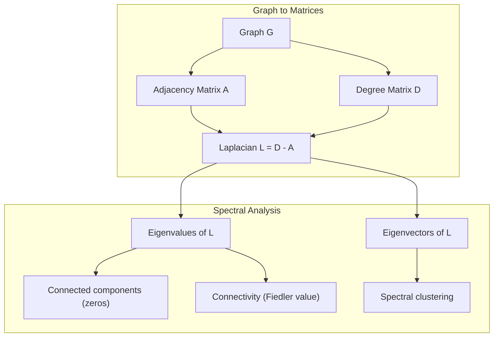
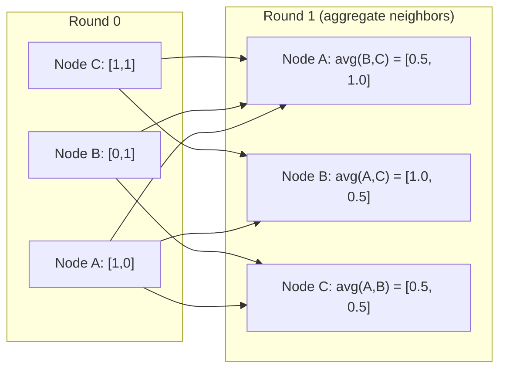

# मशीन लर्निंग के लिए ग्राफ थ्योरी

> ग्राफ संबंध के डेटा संरचना है. यदि आपके डेटा में कनेक्शन हैं, तो आपको ग्राफ सिद्धांत की आवश्यकता है.
> 图是关系的数据结构── यदि आपके डेटा में कनेक्शन है, तो आपको एक आरेख की आवश्यकता है──

**Type:** Build | **类型:** 动手
**Language:**पायथन**语言:**पायथन
**Prerequisites:** Phase 1, Lessons 01-03 (linear algebra, matrices) | **前置知识:** Phase 1, 第 01-03 课（线性代数、矩阵）
**Time:** ~90 minutes | **时间:** ~90 分钟

## सीखने के लक्ष्य

- आसन्नता मैट्रिक्स/सूची प्रतिनिधित्वों के साथ एक ग्राफ वर्ग का निर्माण करें और BFS और DFS पार करना लागू करें
  ् ् ् ् ् ् ् ् ् ् ् ् ् ् ् ् ् ् ् ् ् ् ् ् ् ् ् ् ् ् ् ् ् ् ् ् ् ् ् ् ् ् ् ् ् ् ् ् ् ् ् ् ् ् ् ् ् ् ् ् ् ् ् ् ् ् ् ् ् ् ् ् ् ् ् ् ् ् ् ् ् ् ् ् ् ् ् ् ् ् ् ् ् ् ् ् ् ् ् ् ् ् ् ् ् ् ् ् ् ् ् ् ् ् ् ् ् ् ् ् ् ् ् ् ् ् ् ् ् ् ् ् ् ् ् ् ् ् ् ् ् ् ् ् ् ् ् ् ् ् ् ् ् ् ् ् ् ् ् ् ् ् ् ् ् ् ् ् ् ् ् ् ् ् ् ् ् ् ् ् ् ् ् ् ् ् ् ् ् ् ् ् ् ् ् ् ् ् ् ् ् ् ् ् ् ् ् ् ् ् ् ् ् ् ् ् ् ् ् ् ् ् ् ् ् ् ् ् ् ् ् ् ् ् ् ् ् ् ् ् ् ् ् ् ् ् ् ् ् ् ् ् ् ् ्
- ग्राफ लैप्लाशियन की गणना करें और जुड़े घटकों और क्लस्टर नोड्स का पता लगाने के लिए इसके स्व-मूल्यों का उपयोग करें
  计算图拉普拉斯矩阵(ग्राफ लैप्लाशियन)并使用其特征值检测连通分量和聚类节点
- एक राउंड GNN शैली संदेश को एक सामान्यीकृत आसन्नता मैट्रिक्स गुणा के रूप में पारित करना
  实现一轮 GNN 风格的消息传递归归归归归归归归邻矩阵乘法
- फिडलर वेक्टर का उपयोग करके ग्राफ को विभाजन करने के लिए स्पेक्ट्रल क्लस्टरिंग लागू करें
  应用谱聚类(स्पेक्ट्रल क्लस्टरिंग) Fiedler 向量划分图


> **【中文解读】**
> 社交网络、分子结构、知识图谱都是图――GNN के संदेश संचरण मूल रूप से पड़ोसी矩阵乘法――谱聚类 के साथ 图拉普拉斯矩阵 के लक्षण वेक्टर सामूहिक संचय, के-मीन्स की तुलना में अधिक अनुकूल गैर-गोलाकार डेटा――

## समस्या  समस्या परिचय

सामाजिक नेटवर्क, अणु, ज्ञान आधार, उद्धरण नेटवर्क, रोड मैप - ये सभी ग्राफ हैं. पारंपरिक एमएल डेटा को सपाट तालिकाओं के रूप में व्यवहार करता है. प्रत्येक पंक्ति स्वतंत्र है. प्रत्येक विशेषता एक स्तंभ है. लेकिन जब कनेक्शन की संरचना महत्वपूर्ण है, तालिकाएं विफल हो जाती हैं.

> 社交网络、分子、知识库、引文网络、道路图都是图(ग्राफ)  परंपरागत एमएल डेटा को 平表格──每行独立──每列 एक विशेषता है। लेकिन जब कनेक्टिविटी संरचना महत्वपूर्ण होती है, तब表格就失效了──

एक सामाजिक नेटवर्क पर विचार करें. आप यह अनुमान लगाना चाहते हैं कि एक उपयोगकर्ता किस उत्पाद को खरीदता है। उनके खरीद इतिहास मायने रखता है। लेकिन उनके दोस्तों के खरीद इतिहास अधिक मायने रखता है। कनेक्शन संकेत ले जाते हैं।

> 考虑社交网络――你想预测用户会买什么产品―― उनकी खरीद इतिहास महत्वपूर्ण है―― लेकिन मित्रों का खरीद इतिहास अधिक महत्वपूर्ण है――

या एक अणु पर विचार करें. आप यह अनुमान लगाना चाहते हैं कि क्या यह एक प्रोटीन से बंधेगा। परमाणु महत्वपूर्ण हैं, लेकिन वास्तव में मायने रखता है कि परमाणु एक दूसरे से कैसे बंधे हैं। संरचना डेटा है।

> या सोचें कि अणुएँ क्या हैं, आप अनुमान लगा सकते हैं कि क्या यह प्रोटीन के साथ गठबंधन करती हैं, परमाणु महत्वपूर्ण हैं, लेकिन वास्तव में महत्वपूर्ण यह है कि परमाणुओं के बीच कैसे गठबंधन होता है, संरचना डेटा है।

ग्राफ न्यूरल नेटवर्क (GNN) गहन सीखने में सबसे तेजी से बढ़ते क्षेत्र हैं। वे दवा खोज, सामाजिक सिफारिश, धोखाधड़ी का पता लगाने और ज्ञान ग्राफ तर्क को संचालित करते हैं। प्रत्येक GNN एक ही नींव पर बना हैः बुनियादी ग्राफ सिद्धांत।

> 图神经网络 (GNN) गहन शिक्षा में सबसे तेजी से बढ़ते क्षेत्र हैं। ये दवाओं की खोज, सामाजिक अनुशंसा, धोखाधड़ी परीक्षण और ज्ञान रेखाचित्र अनुशंसाओं को प्रेरित करते हैं। प्रत्येक GNN एक ही आधार पर स्थापित किया गया हैः बुनियादी अनुशंसाएँ।

आपको चार चीजों की जरूरत हैः
1. एक तरीका है मैट्रिक्स के रूप में ग्राफ को प्रतिनिधित्व करने के लिए (तो आप उन्हें गुणा कर सकते हैं)
   √ चित्र को矩阵 के लिए विधि के रूप में दर्शाया जाएगा (यह कर सकते हैं)
2. ग्राफ संरचना की खोज के लिए पारगमन एल्गोरिदम
   探索图结构的遍历算法
3. लैप्लाशियन -- स्पेक्ट्रल ग्राफ सिद्धांत में सबसे महत्वपूर्ण एकल मैट्रिक्स
   रैप्रास मैट्रिक्स 谱图 सिद्धांत में सबसे महत्वपूर्ण मैट्रिक्स
4. संदेश पारित करना - GNNs को काम करने का कार्य
   消息传递使 GNN 工作的操作

## अवधारणा का मूल अवधारणा

> **【中文解读】**
> 图是关系 के डेटा संरचना── सामाजिक नेटवर्क में मनुष्य है 节点、关注 है边; अणु में परमाणु है 节点、化学键 है边; ज्ञान रेखा में वस्तु है 节点、关系 है边──图神经网络 (GNN) के मूल संचालन संदेश संचरण स्वभाविक रूप से पड़ोसी矩阵乘法──谱聚类图拉普拉斯矩阵 के विशेषता वेक्टरों का संवर्धन करते हुए 聚类──

> **【拓展：图神经网络在药物发现中的突破】**
> डीपमाइंड की अल्फाफोल्ड2 (2020) ने नेत्र नेटवर्क भविष्यवाणी प्रोटीन 3 डी संरचना का उपयोग करके, जीवविज्ञान जगत में 50 साल की परेशान प्रोटीन फोल्डिंग समस्या को हल किया। यह एनीकेटिक एसिड अवशेषों को एक बिंदु के रूप में बनाता है, अवशेषों के बीच अंतरिक्ष संबंध बनाने के लिए एक सीमा के रूप में। CASP14  प्रतियोगिता में, अल्फाफोल्ड2 के मध्य स्थान GDT विभाजन 92.4 तक पहुंच गया है।

### ग्राफः नोड्स और एज

एक ग्राफ G = (V, E) में विशेषांक (नोड) V और किनारे E शामिल हैं। प्रत्येक किनारा दो नोडों को जोड़ता है।

> 图 G = (V, E) 由顶点(节点) V 和边 E 组成──每条边连接两个节点──

**Directed vs undirected.**एक निर्देशन रहित ग्राफ में, किनारा (u, v) का अर्थ है u v से जुड़ता है और v u से जुड़ता है। एक निर्देशनित ग्राफ (डिग्राफ) में, किनारा (u, v) का अर्थ है u v को इंगित करता है, लेकिन जरूरी नहीं कि इसके विपरीत।

> **有向与无向。**में कोई ओर चित्रण,边 (u, v) का अर्थ है u 连接 v 且 v 连接 u── में कोई ओर चित्रण,边 (u, v) का अर्थ है u 指向 v, लेकिन उलट向不一定成立──

**Weighted vs unweighted.**एक अनवज़न वाले ग्राफ में, किनारे या तो मौजूद हैं या नहीं। एक वज़न वाले ग्राफ में, प्रत्येक किनारे का एक संख्यात्मक वजन होता है - दूरी, लागत, ताकत।

> **加权与无权。**बिना अधिकार के चित्र में, किनारा या तो मौजूद है या नहीं मौजूद है।

| Graph type | Example |
|-----------|---------|
| Undirected, unweighted | Facebook friendship network |
| Directed, unweighted | Twitter follow network |
| Undirected, weighted | Road map (distances) |
| Directed, weighted | Web page links (PageRank scores) |

### निकटता मैट्रिक्स

आसन्नता मैट्रिक्स ए कोर प्रतिनिधित्व है। n नोड्स वाले ग्राफ के लिएः

> 邻接矩阵(अडजेंस मैट्रिक्स) ए ∈ ∈ ∈ ∈ ∈ ∈ ∈ ∈ ∈ ∈ ∈ 

```
A[i][j] = 1    if there is an edge from node i to node j
A[i][j] = 0    otherwise
```

निर्देशनहीन ग्राफ के लिए, A सममित हैः A[i][j] = A[j][i]। वजन वाले ग्राफ के लिए, A[i][j] = किनारे का वजन (i, j) ।

> 对于无向图,A 是对称的:A[i][j] =A[j][i]。对于加权图,A[i][j] = 边 (i, j) 的权重──

**Example -- a triangle:**

```
Nodes: 0, 1, 2
Edges: (0,1), (1,2), (0,2)

A = [[0, 1, 1],
     [1, 0, 1],
     [1, 1, 0]]
```

आसन्नता मैट्रिक्स प्रत्येक GNN के लिए इनपुट है। A पर मैट्रिक्स ऑपरेशन ग्राफ पर ऑपरेशन के अनुरूप हैं।

> 邻矩阵是每个 GNN 的输入──对 A 的矩阵运算对应于图上的操作──

> **【中文解读】**
> 邻近矩阵是图的"数字化表示"──A[i][j]=1 表示节点 i 和 j 之间有边缘──矩阵乘法的奇之处:A^2 के तत्व A^2[i][j] 恰好等于从 i到 j 长度为 2 的路径数──GNN का संदेश संचरण本质上就是A 乘以特征矩阵每个节点聚合邻居的信息──

### डिग्री

नोड की डिग्री उस से जुड़ी किनारों की संख्या है। निर्देशित ग्राफ के लिए, आपके पास डिग्री (आने वाले किनारे) और डिग्री (बहे जाने वाले किनारे) हैं।

> 节点的度(डिग्री) 是连接到它的边数──对于有向图,有入度(In-degree,进入的边) 和出度(Out-degree,出去的边) 

डिग्री मैट्रिक्स D विकर्ण हैः

> 度矩阵 (Degree Matrix) D है

```
D[i][i] = degree of node i
D[i][j] = 0    for i != j
```

त्रिकोण उदाहरण के लिएः D = diag(2, 2, 2) क्योंकि प्रत्येक नोड दो अन्य से जुड़ता है।

डिग्री आपको नोड महत्व के बारे में बताती है। उच्च डिग्री = हब नोड। नेटवर्क का डिग्री वितरण इसकी संरचना का पता चलता है। सामाजिक नेटवर्क बिजली के नियमों का पालन करते हैं (कुछ हब, कई पत्ते के नोड) । यादृच्छिक ग्राफ में पोज़न-वितरित डिग्री होती है।

> 库告诉你节点重要性──高度 = 枢纽节点──网络的度分布揭示其结构──社交网络遵循律──少数枢纽,大量叶节点──随机图的度从泊松分布──

### बीएफएस और डीएफएस

दो बुनियादी ग्राफ क्रॉसिंग एल्गोरिदम. आपको दोनों की जरूरत है.

>  दो प्रकार के बुनियादी तत्वों के लिए  दो प्रकार के तत्वों की आवश्यकता होती है

**Breadth-First Search (BFS):**पहले सभी पड़ोसियों की खोज करें, फिर पड़ोसियों के पड़ोसियों का उपयोग करें।

> **广度优先搜索（BFS）：**पहले सभी पड़ोसियों का पता लगाएं, फिर पड़ोसियों के पड़ोसियों का पता लगाएं।

```
BFS from node 0:
  Visit 0
  Queue: [1, 2]        (neighbors of 0)
  Visit 1
  Queue: [2, 3]        (add neighbors of 1)
  Visit 2
  Queue: [3]           (neighbors of 2 already visited)
  Visit 3
  Queue: []            (done)
```

BFS अनवज़न वाले ग्राफ में सबसे छोटे पथ ढूंढता है। किसी भी नोड से शुरुआत से दूरी BFS स्तर के बराबर है जिस पर उस नोड को पहली बार खोजा गया है। यही कारण है कि BFS का उपयोग सामाजिक नेटवर्क में हॉप-कंट दूरी के लिए किया जाता है।

> बीएफएस को बिना अधिकार के चित्रों में सबसे छोटा रास्ता ढूंढना है। किसी भी नोड से शुरू बिंदु तक की दूरी उस नोड को पहली बार खोजने पर बीएफएस स्तर के बराबर है। यही कारण है कि बीएफएस ने सामाजिक नेटवर्क में कूदने की दूरी का उपयोग किया है।

**Depth-First Search (DFS):**पीछे हटने से पहले जितना संभव हो उतना गहराई तक जाएं। एक स्टैक (LIFO) या पुनरावृत्ति का उपयोग करें।

> **深度优先搜索（DFS）：**尽可能深入再回溯──使用(后进先出) या递归──

```
DFS from node 0:
  Visit 0
  Stack: [1, 2]        (neighbors of 0)
  Visit 2               (pop from stack)
  Stack: [1, 3]         (add neighbors of 2)
  Visit 3               (pop from stack)
  Stack: [1]
  Visit 1               (pop from stack)
  Stack: []             (done)
```

डीएफएस निम्नलिखित के लिए उपयोगी हैः
- जुड़े घटकों को ढूंढना (अनिवारित नोड्स से DFS चलाएं)
  寻找连通分量(从未访问节点运行 DFS)
- चक्र का पता लगाना (डीएफएस पेड़ में पीछे के किनारे)
  环检测(DFS 树中的后向边)
- टोपोलॉजिकल सॉर्टिंग (डिफ़ॉल्ट डीएफएस फिनिश क्रम)
  拓排序(DFS 完成顺序的逆序)

| Algorithm | Data structure | Finds | Use case |
|-----------|---------------|-------|----------|
| BFS | Queue | Shortest paths | Social network distance, knowledge graph traversal |
| DFS | Stack | Components, cycles | Connectivity, topological sort |

### ग्राफ लैप्लाशियन

L = D - A. स्पेक्ट्रल ग्राफ सिद्धांत में सबसे महत्वपूर्ण मैट्रिक्स।

> L = D - A──谱图理论 में सबसे महत्वपूर्ण矩阵──

त्रिकोण के लिएः

```
D = [[2, 0, 0],    A = [[0, 1, 1],    L = [[2, -1, -1],
     [0, 2, 0],         [1, 0, 1],         [-1, 2, -1],
     [0, 0, 2]]         [1, 1, 0]]         [-1, -1,  2]]
```

लैप्लाशियन में उल्लेखनीय गुण हैंः

> रैप्रास रचकों की असाधारण प्रकृति होती हैः

1. **L is positive semi-definite.**सभी स्वमान = 0 हैं।

> 1. **L 是半正定的。**सभी विशेषताएँ >= 0

2. **The number of zero eigenvalues equals the number of connected components.**एक जुड़े हुए ग्राफ में एक शून्य स्वमूल्य है. 3 से जुड़े घटकों के साथ एक ग्राफ में तीन शून्य स्वमूल्य हैं.

> 2. **零特征值的个数等于连通分量的个数。**连通图恰好有一个零特征值──有3 没有连通分量的图有3零特征值──

3. **The smallest non-zero eigenvalue (Fiedler value) measures connectivity.**एक बड़ा Fiedler मान का मतलब है कि ग्राफ अच्छी तरह से जुड़ा हुआ है. एक छोटे Fiedler मान का मतलब है कि ग्राफ एक कमजोर बिंदु है - एक बोतल गला.

> 3. **最小非零特征值（Fiedler 值）衡量连通性。**फ़ीडलर मूल्य  बड़ का अर्थ है 图 连接良好── फ़ीडलर मूल्य 小 का अर्थ है 图 弱点 瓶 ──

4. **The eigenvector of the Fiedler value (Fiedler vector) reveals the best split.**सकारात्मक मान वाले नोड्स एक समूह में जाते हैं, नकारात्मक मान वाले नोड्स दूसरे समूह में जाते हैं। यह स्पेक्ट्रल क्लस्टरिंग है।

> 4. **Fiedler 值对应的特征向量（Fiedler 向量）揭示最佳划分。**正值 के नोट्स को एक समूह में, नकारात्मक मूल्य को दूसरे समूह में शामिल किया गया है।

> **【中文解读】**
> 图拉普拉斯 L = D - A 谱图理论 में सबसे महत्वपूर्ण矩阵 है। इसके चार प्रमुख गुण हैंः 1) 半正定; 2) 零特征值个数 = 连通分量个数; 3) 最小非零特征值 Fiedler 值) 连通性越大越紧密; 4) 谱方向量的正负号 स्वचालित रूप से图分成两──这是谱聚类的数学基础.



### स्पेक्ट्रल गुण

आसन्नता मैट्रिक्स और लैप्लाशियन के स्व-मूल्य किसी भी पार के बिना संरचनात्मक गुण प्रकट करते हैं।

> ापसंद रक्छन और रैप्रास रक्छन के गुण मूल्य को संरचनात्मक प्रकृति को प्रकट करने के लिए आवश्यक नहीं है।

**Spectral clustering**इस तरह काम करता हैः
1. लैप्लाशियन L की गणना करें
   计算拉普拉斯矩阵 L
2. L के k सबसे छोटे स्वयं वेक्टरों को खोजें (पहले को छोड़ दें, जो जुड़े ग्राफ के लिए सभी-एक है)
   找到 L के k 个最小特征向量(跳过第一,连通图中它是全1向量)
3. प्रत्येक नोड के लिए नए निर्देशांक के रूप में उन स्वयं वेक्टरों का उपयोग करें
   इन लक्षणों को प्रत्येक नोड के लिए नए सीड के रूप में उपयोग किया जाएगा
4. उन निर्देशांक पर k-मीडियंस चलाएं
   इन बैठकों पर चलना k-means

यह काम क्यों करता है? L के स्ववेक्टर ग्राफ पर "सबसे चिकनी" कार्यों को एन्कोड करते हैं। अच्छी तरह से जुड़े नोड्स को समान स्ववेक्टर मूल्य प्राप्त होते हैं। एक बोतल गला से अलग नोड्स को अलग-अलग मूल्य प्राप्त होते हैं। स्ववेक्टर स्वाभाविक रूप से समूहों को अलग करते हैं।

> क्यों प्रभावी?L के विशेषता वेक्टर को चित्र पर "सबसे चिकनी" फ़ंक्शन को कोडित किया गया है। अच्छी तरह से जुड़े नोड्स को समान विशेषता वेक्टर मूल्य प्राप्त होता है।

**Random walk connection.**सामान्यीकृत लैप्लाशियन ग्राफ पर यादृच्छिक चलने से संबंधित है। यादृच्छिक चलने का स्थिर वितरण नोड डिग्री के समानुपातिक है। मिश्रण समय (चलाव कितनी तेजी से अभिसरण करता है) स्पेक्ट्रल अंतर पर निर्भर करता है।

> **随机游走联系。**                                                                                                                                                                                                                                                              

### संदेश पारित करना

ग्राफ न्यूरल नेटवर्क का मूल कार्य। प्रत्येक नोड अपने पड़ोसियों से संदेश एकत्र करता है, उन्हें एकत्र करता है, और अपनी स्थिति को अपडेट करता है।

> 图神经网络的核心操作── प्रत्येक节点 पड़ोसी से सूचना एकत्रित करता है, उन्हें एकत्रित करता है, और अपनी स्थिति को अद्यतन करता है──

```
h_v^(k+1) = UPDATE(h_v^(k), AGGREGATE({h_u^(k) : u in neighbors(v)}))
```

सरलतम रूप में, एग्रीगेट = औसत, और अपडेट = रैखिक परिवर्तन + सक्रियणः

```
h_v^(k+1) = sigma(W * mean({h_u^(k) : u in neighbors(v)}))
```

यह मैट्रिक्स गुणन है। यदि H सभी नोड सुविधाओं की मैट्रिक्स है और A आसन्नता मैट्रिक्स हैः

```
H^(k+1) = sigma(A_norm * H^(k) * W)
```

जहां A_norm सामान्यीकृत आसन्नता मैट्रिक्स है (प्रत्येक पंक्ति 1 तक योग है) ।

संदेश पारित करने के एक दौर प्रत्येक नोड को अपने तत्काल पड़ोसियों को "देखने" देता है। दो दौर उसे पड़ोसियों के पड़ोसियों को देखने देते हैं। K राउंड प्रत्येक नोड को अपने K-hop पड़ोस से जानकारी देते हैं।

> **【拓展：消息传递与 GNN 架构演进】**
> जीसीएन (किपफ एंड वेलिंग, 2017) सबसे सरल संदेशवाहक है GNN: प्रत्येक स्तर को एक बार में एकीकरण करने के लिए पड़ोस में矩阵乘法 + 线性变换――GAT (Veličković et al., 2018) 引入注意力机制让节点学习邻居的重要性权重――GraphSAGE (Hamilton et al., 2017) 支持采样邻居以处理大规模图片――Pinterest के PinSage 模型在30 बिलियन节点图上运行,每天产生超过10亿次推──GNN सबसे तेजी से बढ़ते AI 子领域之一──



### अवधारणाएँ और एमएल अनुप्रयोग

| Concept | ML Application |
|---------|---------------|
| Adjacency matrix | GNN input representation |
| Graph Laplacian | Spectral clustering, community detection |
| BFS/DFS | Knowledge graph traversal, path finding |
| Degree distribution | Node importance, feature engineering |
| Message passing | GNN layers (GCN, GAT, GraphSAGE) |
| Eigenvalues of L | Community detection, graph partitioning |
| Spectral clustering | Unsupervised node grouping |
| PageRank | Node importance, web search |

> 概念与 ML 应用对照:邻接矩阵(GNN 输入表示) 图拉普拉斯(谱聚类、社区检测) 、BFS/DFS(知识图谱遍历、路径查找) 度分布(节点重要性、特征工程) 、消息传递(GNN 层 GCN/GAT/GraphSAGE) 、L 的特征值(社区检测聚图、划分) 、谱类(无监督节点分组) 、PageRank 节点重要性、Web 搜索) 👇

## इसे बनाओ, इसे पूरा करो।
```figure
graph-degree-distribution
```

## इसे बनाओ

### चरण 1: ग्राफ क्लास खरोंच से

```python
class Graph:
    def __init__(self, n_nodes, directed=False):
        self.n = n_nodes
        self.directed = directed
        self.adj = {i: {} for i in range(n_nodes)}

    def add_edge(self, u, v, weight=1.0):
        self.adj[u][v] = weight
        if not self.directed:
            self.adj[v][u] = weight

    def neighbors(self, node):
        return list(self.adj[node].keys())

    def degree(self, node):
        return len(self.adj[node])

    def adjacency_matrix(self):
        import numpy as np
        A = np.zeros((self.n, self.n))
        for u in range(self.n):
            for v, w in self.adj[u].items():
                A[u][v] = w
        return A

    def degree_matrix(self):
        import numpy as np
        D = np.zeros((self.n, self.n))
        for i in range(self.n):
            D[i][i] = self.degree(i)
        return D

    def laplacian(self):
        return self.degree_matrix() - self.adjacency_matrix()
```

आसन्नता सूची (`self.adj`आसन्नता मैट्रिक्स रूपांतरण में नम्पी का उपयोग किया जाता है क्योंकि सभी स्पेक्ट्रल ऑपरेशनों को इसकी आवश्यकता होती है।

> 邻接表`self.adj`) उच्च कुशल भंडारण पड़ोसी  पड़ोसी矩阵转换使用numpy, क्योंकि सभी谱操作都需要它

### चरण 2: बीएफएस और डीएफएस

```python
from collections import deque

def bfs(graph, start):
    visited = set()
    order = []
    distances = {}
    queue = deque([(start, 0)])                     # BFS 用队列：先进先出
    visited.add(start)
    while queue:
        node, dist = queue.popleft()                # 取出队列头部的节点
        order.append(node)
        distances[node] = dist                      # 距离 = BFS 层级（最短路径）
        for neighbor in graph.neighbors(node):
            if neighbor not in visited:
                visited.add(neighbor)
                queue.append((neighbor, dist + 1))  # 邻居距离 +1
    return order, distances


def dfs(graph, start):
    visited = set()
    order = []
    stack = [start]
    while stack:
        node = stack.pop()
        if node in visited:
            continue
        visited.add(node)
        order.append(node)
        for neighbor in reversed(graph.neighbors(node)):
            if neighbor not in visited:
                stack.append(neighbor)
    return order
```

BFS O(1) पॉप-लेफ्ट के लिए एक डेक (डबल-एंड कतार) का उपयोग करता है। DFS एक स्टैक के रूप में एक सूची का उपयोग करता है। दोनों प्रत्येक नोड पर एक बार ही जाते हैं - O(V + E) समय।

> BFS उपयोग deque(双端队列) को पूरा करें O(1) पॉपलिफ्ट;DFS उपयोग सूची 当──两者都恰好访问每个节点一次时间复杂度 O(V+E)。

### चरण 3: जुड़े घटक और लैप्लाशियन स्वमूल्य

```python
def connected_components(graph):
    visited = set()
    components = []
    for node in range(graph.n):
        if node not in visited:
            order, _ = bfs(graph, node)
            visited.update(order)
            components.append(order)
    return components


def laplacian_eigenvalues(graph):
    import numpy as np
    L = graph.laplacian()
    eigenvalues = np.linalg.eigvalsh(L)
    return eigenvalues
```

`eigvalsh`यह सममित मैट्रिक्स के लिए है - लैप्लाशियन हमेशा निर्देशन ग्राफ के लिए सममित है. यह बढ़ते क्रम में स्वमान वापस करता है. जुड़ा घटकों की संख्या खोजने के लिए शून्य गिनें.

> `eigvalsh`प्रयोग करने के लिए एक रैखिक रैंक  निर्विचार रैंक  रैखिक रैंक  रैंक  रैंक  रैंक  रैंक  रैंक  रैंक  रैंक  रैंक  रैंक  रैंक  रैंक  रैंक  रैंक  रैंक  रैंक  रैंक  रैंक  रैंक  रैंक  रैंक  रैंक  रैंक  रैंक  रैंक  रैंक  रैंक  रैंक  रैंक  रैंक  रैंक  रैंक  रैंक  रैंक  रैंक  रैंक  रैंक  रैंक  रैंक  रैंक  रैंक  रैंक  रैंक  रैंक  रैंक  रैंक  रैंक  रैंक  रैंक  रैंक  रैंक  रैंक  रैंक  रैंक  रैंक  रैंक  रैंक  रैंक  रैंक  रैंक  रैंक  रैंक  रैंक  रैंक  रैंक  रैंक  रैंक  रैंक  रैंक  रैंक  रैंक  रैंक 

### चरण 4: स्पेक्ट्रल क्लस्टरिंग

```python
def spectral_clustering(graph, k=2):
    import numpy as np
    L = graph.laplacian()                           # 计算图拉普拉斯矩阵 L = D - A
    eigenvalues, eigenvectors = np.linalg.eigh(L)   # 特征分解（对称矩阵用 eigh）
    features = eigenvectors[:, 1:k+1]               # 取第 2 到 k+1 个特征向量（跳过第一个全 1 向量）

    labels = np.zeros(graph.n, dtype=int)
    for i in range(graph.n):
        if features[i, 0] >= 0:                     # Fiedler 向量 >= 0 → 簇 A
            labels[i] = 0
        else:                                       # Fiedler 向量 < 0 → 簇 B
            labels[i] = 1
    return labels
```

k=2 के लिए, फिडलर वेक्टर का संकेत ग्राफ को दो क्लस्टर में विभाजित करता है। k>2 के लिए, आप पहले k स्ववेक्टर्स (सहान सभी-एक स्ववेक्टर को छोड़कर) पर k-मीडियंस चलाएंगे।

> k=2 时,Fiedler向量的符号把图分成两──k>2 时,在前 k 个特征向量上跑 k-means(跳过平凡的全 1特征向量) ⋅

### चरण 5: संदेश पारित करना

```python
def message_passing(graph, features, weight_matrix):
    import numpy as np
    A = graph.adjacency_matrix()
    row_sums = A.sum(axis=1, keepdims=True)
    row_sums[row_sums == 0] = 1
    A_norm = A / row_sums
    aggregated = A_norm @ features
    output = aggregated @ weight_matrix
    return output
```

यह GNN संदेश पारित करने का एक दौर है। प्रत्येक नोड की नई विशेषताएं अपने पड़ोसी की विशेषताओं का वजन औसत हैं, जो वजन मैट्रिक्स द्वारा परिवर्तित होती हैं। जानकारी को आगे बढ़ाने के लिए कई राउंड स्टैक करें।

> यह GNN 消息传递 का एक दौर है। प्रत्येक खंड के नए लक्षण =  पड़ोसी के लक्षणों का भार औसत ×  भार矩阵―― ढेरों परतों पर फैलती अधिक दूर की सूचनाएँ──

## इसे फ्रेमवर्क के साथ लागू करें

नेटवर्कएक्स और नम्पई के साथ, समान ऑपरेशन एक पंक्ति के होते हैंः

> नेटवर्कएक्स और नम्पी के साथ, एक ही ऑपरेशन एक कोड लाइन हैः

```python
import networkx as nx
import numpy as np

G = nx.karate_club_graph()

A = nx.adjacency_matrix(G).toarray()
L = nx.laplacian_matrix(G).toarray()

eigenvalues = np.linalg.eigvalsh(L.astype(float))
print(f"Smallest eigenvalues: {eigenvalues[:5]}")
print(f"Connected components: {nx.number_connected_components(G)}")

communities = nx.community.greedy_modularity_communities(G)
print(f"Communities found: {len(communities)}")

pr = nx.pagerank(G)
top_nodes = sorted(pr.items(), key=lambda x: x[1], reverse=True)[:5]
print(f"Top 5 PageRank nodes: {top_nodes}")
```

networkx अनुकूलित सी बैकेंड के साथ किसी भी आकार के ग्राफ को संभालता है। इसे उत्पादन में उपयोग करें। यह क्या करता है समझने के लिए अपने खरोंच से कार्यान्वयन का उपयोग करें।

> नेटवर्कx के अनुकूलित C 后端 को किसी भी आकार के चित्रों को संसाधित करने के लिए उपयोग किया जाता है।

### नम्बिया स्पेक्ट्रल विश्लेषण

```python
import numpy as np

A = np.array([
    [0, 1, 1, 0, 0],
    [1, 0, 1, 0, 0],
    [1, 1, 0, 1, 0],
    [0, 0, 1, 0, 1],
    [0, 0, 0, 1, 0]
])

D = np.diag(A.sum(axis=1))
L = D - A

eigenvalues, eigenvectors = np.linalg.eigh(L)
print(f"Eigenvalues: {np.round(eigenvalues, 4)}")
print(f"Fiedler value: {eigenvalues[1]:.4f}")
print(f"Fiedler vector: {np.round(eigenvectors[:, 1], 4)}")

fiedler = eigenvectors[:, 1]
group_a = np.where(fiedler >= 0)[0]
group_b = np.where(fiedler < 0)[0]
print(f"Cluster A: {group_a}")
print(f"Cluster B: {group_b}")
```

फिडलर वेक्टर भारी भार उठाने का काम करता है. एक क्लस्टर में सकारात्मक प्रविष्टियाँ, दूसरे में नकारात्मक. कोई पुनरावर्ती अनुकूलन की आवश्यकता नहीं है - केवल एक स्वयं संरचना।

## इसे भेजें उत्पाद

इस पाठ से उत्पन्न होता हैः
- `outputs/skill-graph-analysis.md`-- ग्राफ-संरचित डेटा का विश्लेषण करने के लिए एक कौशल संदर्भ

## कनेक्शन अवधारणाएँ

| Concept | Where it shows up |
|---------|------------------|
| Adjacency matrix | GCN, GAT, GraphSAGE input |
| Laplacian | Spectral clustering, ChebNet filters |
| BFS | Knowledge graph traversal, shortest path queries |
| Message passing | Every GNN layer, neural message passing |
| Spectral gap | Graph connectivity, mixing time of random walks |
| Degree distribution | Power-law networks, node feature engineering |
| Connected components | Preprocessing, handling disconnected graphs |
| PageRank | Node importance ranking, attention initialization |

जीएनएन विशेष रूप से उल्लेख के योग्य हैं। जीसीएन (किप और वेलिंग, 2017) में ग्राफ संवर्धन ऑपरेशन में आसन्नता मैट्रिक्स का उपयोग स्वयं लूप्स के साथ किया जाता है, A_hat = A + I:

```text
H^(l+1) = sigma(D_hat^(-1/2) * A_hat * D_hat^(-1/2) * H^(l) * W^(l))
```

जहां A_hat = A + I (अडजेंस प्लस स्वयं लूप) और D_hat A_hat का डिग्री मैट्रिक्स है। स्वयं लूप्स यह सुनिश्चित करते हैं कि प्रत्येक नोड में संश्लेषण के दौरान अपनी विशेषताएं शामिल हों। यह सही संदेश है जो सममित सामान्यीकरण के साथ गुजरता है। D_hat^(-1/2) * A_hat * D_hat^(-1/2) सामान्यीकृत आसन्नता मैट्रिक्स है। लैप्लाशियन दिखाई देता है क्योंकि यह सामान्यीकरण L_sym = I - D^(-1/2) * A * D^(-1/2) से संबंधित है। लैप्लाशियन को समझना, इसका मतलब है कि जीसीएन का काम क्यों होता है।

> GNN 值得特别说明──GCN(Kipf & Welling, 2017) का图卷积用加了自环的邻属矩阵 A_hat = A + I:H^(l+1) = σ(D_hat^(-1/2) A_hat D_hat^(-1/2) H^(l) W^(l))──自环让每个节点聚合时包含自身特征──这就是对称归结的消息传递──理解拉普拉斯阵阵 =理解GCN 为何有效──

## अभ्यास विषय

1. **Implement PageRank from scratch.**प्रत्येक चरण में: स्कोर(v) = (1-d) /n + d * योगफल(score(u) /out_degree(u)) सभी u के लिए v की ओर इशारा करते हुए। d=0.85 का उपयोग करें। अभिसरण (बदला < 1e-6) तक चलाएं। एक छोटे वेब ग्राफ पर परीक्षण करें।

2. **Find communities using spectral clustering.**दो स्पष्ट रूप से अलग समूहों (जैसे, एक ही किनारे से जुड़े दो क्लिक) के साथ एक ग्राफ बनाएं। स्पेक्ट्रल क्लस्टरिंग चलाएं और सत्यापित करें कि यह सही विभाजन पाता है। जब आप अधिक क्रॉस-क्लास्टर किनारे जोड़ते हैं तो क्या होता है?

3. **Implement Dijkstra's algorithm**समान भार वाले एक ही ग्राफ पर BFS के परिणामों की तुलना करें।

4. **Build a 2-layer message passing network.**संदेश को दो बार अलग-अलग वजन मैट्रिक्स के साथ पारित करना लागू करें। दिखाएं कि 2 राउंड के बाद, प्रत्येक नोड में अपने 2-हॉप पड़ोस से जानकारी है।

5. **Analyze a real-world graph.**कराटे क्लब ग्राफ (34 नोड्स, 78 किनारे) का उपयोग करें। डिग्री वितरण, लैप्लाशियन स्व-मूल्य और स्पेक्ट्रल क्लस्टरिंग की गणना करें। स्पेक्ट्रल क्लस्टरिंग परिणाम की तुलना ज्ञात ग्राउंड सत्य विभाजन से करें।

## कीवर्ड्स  शब्द खोज तालिका

| Term | What people say | What it actually means |
|------|----------------|----------------------|
| Graph | "Nodes and edges" | A mathematical structure G=(V,E) encoding pairwise relationships |
| Adjacency matrix | "The connection table" | An n x n matrix where A[i][j] = 1 if nodes i and j are connected |
| Degree | "How connected a node is" | The number of edges touching a node |
| Laplacian | "D minus A" | L = D - A, the matrix whose eigenvalues reveal graph structure |
| Fiedler value | "The algebraic connectivity" | The smallest non-zero eigenvalue of L, measuring how well-connected the graph is |
| BFS | "Level-by-level search" | Traversal that visits all neighbors before going deeper, finds shortest paths |
| DFS | "Go deep first" | Traversal that follows one path to its end before backtracking |
| Message passing | "Nodes talk to neighbors" | Each node aggregates information from its neighbors, the core of GNNs |
| Spectral clustering | "Cluster by eigenvectors" | Partition a graph using eigenvectors of its Laplacian |
| Connected component | "A separate piece" | A maximal subgraph where every node can reach every other node |

> 术语速查:Graph(图 G=(V,E))、 आसन्नता मैट्रिक्स(邻接矩阵 A[i][j]=1 表示 i、j 连接)、 डिग्री(度,节点连接的边数)、लैप्लाशियन(拉普拉斯 L=D-A)、Fiedler value(最小非零特征值,代数连通性)、BFS(广度优先,按层遍历)、DFS深度优先,走到底再回溯)、 संदेश पारित(消息传递,GNN 核心)、 स्पेक्ट्रल क्लस्टरिंग 拉普拉斯特征向量聚类)、 जुड़े घटक(连通量)、

## आगे पढ़ना 延伸閱讀

- **Kipf & Welling (2017)**-- "ग्राफ कन्भल्यूशनल नेटवर्क के साथ अर्ध-निरीक्षण वर्गीकरण।" आधुनिक जीएनएन शुरू करने वाला पेपर। दिखाता है कि स्पेक्ट्रल ग्राफ कन्भल्यूशन संदेश पारित करने के लिए सरलता।
- **Spielman (2012)**-- "स्पेक्ट्रल ग्राफ थ्योरी" व्याख्यान नोट्स। लैप्लाशियन, स्पेक्ट्रल रिक्तियों, और ग्राफ विभाजन के लिए अंतिम परिचय।
- **Hamilton (2020)**-- "ग्राफ प्रतिनिधित्व सीखने. " पुस्तक जो मूलभूत से अनुप्रयोगों तक जीएनएन को कवर करती है।
- **Bronstein et al. (2021)**-- "आकृति विज्ञान गहन शिक्षाः ग्रिड, समूह, ग्राफ, भूविज्ञान और माप। " एकीकरणकारी ढांचे का पेपर।
- **Veličković et al. (2018)**-- "ग्राफ ध्यान नेटवर्क". ध्यान तंत्र के साथ संदेश पारित करने का विस्तार करता है।
